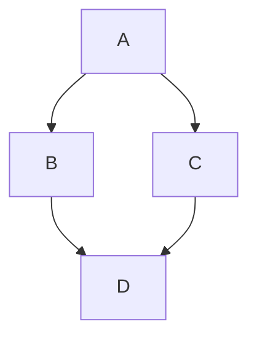

# pinsky-three


## calab
`clone_url`: https://github.com/pinsky-three/calab.git


### calab/renderers/image.go
`path`: /var/folders/k2/gxrql7_14cz20q6kpq4jxspw0000gn/T/calab/renderers/image.go
`relative_path`: calab/renderers/image.go
`format`: Arbitrary Binary Data
`size`: 170   


``````
package renderers

import (
	"image"

	"github.com/minskylab/calab"
)

// ImageRenderer ...
type ImageRenderer interface {
	Render(n uint64, s calab.Space) image.Image
}

``````


### calab/go.mod
`path`: /var/folders/k2/gxrql7_14cz20q6kpq4jxspw0000gn/T/calab/go.mod
`relative_path`: calab/go.mod
`format`: Arbitrary Binary Data
`size`: 676   


``````
module github.com/minskylab/calab

go 1.16

require (
	github.com/99designs/gqlgen v0.13.0
	github.com/gen2brain/x264-go v0.2.0
	github.com/gen2brain/x264-go/x264c v0.0.0-20210523192809-78c5ccc9da84 // indirect
	github.com/gen2brain/x264-go/yuv v0.0.0-20210523192809-78c5ccc9da84 // indirect
	github.com/go-chi/chi/v5 v5.0.3
	github.com/gorilla/websocket v1.4.2
	github.com/livekit/server-sdk-go v0.5.13
	github.com/lucasb-eyer/go-colorful v1.2.0
	github.com/pion/webrtc/v3 v3.0.32
	github.com/pkg/errors v0.9.1
	github.com/rs/cors v1.8.0
	github.com/satori/go.uuid v1.2.0
	github.com/vektah/gqlparser/v2 v2.1.0
	gopkg.in/yaml.v2 v2.4.0
	mvdan.cc/gofumpt v0.1.1 // indirect
)

``````


### calab/pallette.go
`path`: /var/folders/k2/gxrql7_14cz20q6kpq4jxspw0000gn/T/calab/pallette.go
`relative_path`: calab/pallette.go
`format`: Arbitrary Binary Data
`size`: 1044   


``````
package calab

import (
	"image/color"

	"github.com/lucasb-eyer/go-colorful"
)

// Palette is a state to color mapping, also know as pallette.
type Palette map[uint64]color.Color

// GradientPalette creates a new pallette
func GradientPalette(colorStart colorful.Color, colorEnd colorful.Color, intervals int) Palette {
	palette := Palette{}

	for i := 0; i < intervals; i++ {
		palette[uint64(i)] = colorStart.BlendHsv(colorEnd, float64(i)/float64(intervals-1))
	}

	return palette
}

// CyclicPalette returns a cyclic palette.
func CyclicPalette(c1 colorful.Color, c2 colorful.Color, intervals int) Palette {
	palette := Palette{}

	for i := 0; i < intervals/2; i++ {
		palette[uint64(i)] = c1
		palette[uint64(i+1)] = c2
	}

	if intervals%2 != 0 {
		palette[uint64(intervals/2+1)] = c1
	}

	return palette
}

func MonochromePalette(states uint64) Palette {
	palette := Palette{}

	for i := 0; i < int(states); i++ {
		grey := uint8(i * 255 / (int(states) - 1))
		palette[uint64(i)] = color.RGBA{grey, grey, grey, 255}
	}

	return palette
}

``````


### calab/experiments/petridish/timelapse.go
`path`: /var/folders/k2/gxrql7_14cz20q6kpq4jxspw0000gn/T/calab/experiments/petridish/timelapse.go
`relative_path`: calab/experiments/petridish/timelapse.go
`format`: Arbitrary Binary Data
`size`: 546   


``````
package petridish

import "time"

// PetriDishTimelapse wraps intervals for create a timelapse
type PetriDishTimelapse struct {
	intervalTime  time.Duration
	intervalTicks uint64
}

// ProgramTimelapse program a time interval.
func (pd *PetriDish) ProgramTimelapse(interval time.Duration) {
	pd.timelapse.intervalTime = interval
	pd.currentRunMode = timeMode
}

// ProgramTickTimelapse programs a tick timelapse.
func (pd *PetriDish) ProgramTickTimelapse(interval uint64) {
	pd.timelapse.intervalTicks = interval
	pd.currentRunMode = ticksMode
}

``````


### calab/experiments/petridish/run.go
`path`: /var/folders/k2/gxrql7_14cz20q6kpq4jxspw0000gn/T/calab/experiments/petridish/run.go
`relative_path`: calab/experiments/petridish/run.go
`format`: Arbitrary Binary Data
`size`: 854   


``````
package petridish

import "time"

// Ticks returns the current ticks in the model of your petri dish.
func (pd *PetriDish) Ticks() uint64 {
	return pd.ticks
}

// RunSync runs your petri dish in sync manner (await to finish).
func (pd *PetriDish) RunSync(duration time.Duration) {
	pd.Model.Run(duration)
}

// Run ...
func (pd *PetriDish) Run(duration time.Duration) chan struct{} {
	done := make(chan struct{})

	go func() {
		pd.Model.Run(duration)
		done <- struct{}{}
	}()

	return done
}

// RunSyncTicks runs your petri dish by n ticks.
func (pd *PetriDish) RunSyncTicks(ticks uint64) {
	pd.Model.RunTicks(ticks)
}

// RunTicks runs your petri dish by ticks in async manner.
func (pd *PetriDish) RunTicks(ticks uint64) chan struct{} {
	done := make(chan struct{})

	go func() {
		pd.Model.RunTicks(ticks)
		done <- struct{}{}
	}()

	return done
}

``````


### calab/experiments/petridish/snapshots.go
`path`: /var/folders/k2/gxrql7_14cz20q6kpq4jxspw0000gn/T/calab/experiments/petridish/snapshots.go
`relative_path`: calab/experiments/petridish/snapshots.go
`format`: Arbitrary Binary Data
`size`: 1069   


``````
package petridish

import (
	"image"

	"github.com/minskylab/calab"
)

// Snapshot perform a instant snapshot of your dynamical system.
func (pd *PetriDish) snapshot() {
	space := pd.Model.System.Space
	dims := space.Dims()

	w, h := dims[0], dims[1]

	for i := int64(0); i < int64(w); i++ {
		for j := int64(0); j < int64(h); j++ {
			pd.img.Set(int(i), int(j), pd.colorPalette[space.State(i, j)])
		}
	}
}

func (pd *PetriDish) observation(n uint64, s calab.Space) {
	pd.ticks = n

	// calculating mean tps
	// go func() {
	// 	pd.ticks
	// }()

	for _, observer := range pd.observers {
		observer <- pd.TakeSnapshot()
	}
}

// TakeSnapshot take a snapshot.
func (pd *PetriDish) TakeSnapshot() image.Image {
	n := pd.ticks
	if _, hasCache := pd.cache[n]; hasCache {
		delete(pd.cache, n-2)
		return pd.cache[n]
	}

	pd.snapshot()
	pd.cache[n] = pd.img
	return pd.img
}

// // SaveSnapshot save your snapshot in a file.
// func (pd *PetriDish) SaveSnapshot(name string, format SnapshotImageFormat) error {
// 	return pd.storage.SaveSnapshot(name, pd.img, format)
// }

``````


### calab/experiments/petridish/options.go
`path`: /var/folders/k2/gxrql7_14cz20q6kpq4jxspw0000gn/T/calab/experiments/petridish/options.go
`relative_path`: calab/experiments/petridish/options.go
`format`: Arbitrary Binary Data
`size`: 441   


``````
package petridish

import (
	"time"

	"github.com/minskylab/calab"
)

func NewTPSMonitor(pd *PetriDish) calab.Renderer {
	// TODO: Probably I'll need to add a mutex strategy here

	lastTime := time.Now()

	return func(n uint64, s calab.Space) {
		dur := time.Since(lastTime)
		pd.meanTPS = 1 / dur.Seconds()
		lastTime = time.Now()
	}
}

func WithTPSMonitor(pd *PetriDish) *PetriDish {
	pd.Model.AddRenderer(NewTPSMonitor(pd))

	return pd
}

``````


### calab/experiments/petridish/observer.go
`path`: /var/folders/k2/gxrql7_14cz20q6kpq4jxspw0000gn/T/calab/experiments/petridish/observer.go
`relative_path`: calab/experiments/petridish/observer.go
`format`: Arbitrary Binary Data
`size`: 220   


``````
package petridish

import "image"

func (pd *PetriDish) RegisterNewObserver(observer chan image.Image) {
	pd.observers = append(pd.observers, observer)
}

func (pd *PetriDish) GetMeanTPS() float64 {
	return pd.meanTPS
}

``````


### calab/experiments/petridish/palette.go
`path`: /var/folders/k2/gxrql7_14cz20q6kpq4jxspw0000gn/T/calab/experiments/petridish/palette.go
`relative_path`: calab/experiments/petridish/palette.go
`format`: Arbitrary Binary Data
`size`: 786   


``````
package petridish

import (
	"image/color"

	"github.com/lucasb-eyer/go-colorful"
	"github.com/minskylab/calab"
)

func (pd *PetriDish) SetPalette(newPalette calab.Palette) {
	pd.colorPalette = newPalette
}

func (pd *PetriDish) SetGradientPalette(colorStart colorful.Color, colorEnd colorful.Color) {
	states := int(pd.Model.System.Dynamic.Symbols())
	pd.SetPalette(calab.GradientPalette(colorStart, colorEnd, states))
}

func (pd *PetriDish) SetGradientWithVoidPalette(colorStart colorful.Color, colorEnd colorful.Color) {
	states := int(pd.Model.System.Dynamic.Symbols() - 1)

	finalPalette := map[uint64]color.Color{}
	finalPalette[0] = color.Black

	for i, p := range calab.GradientPalette(colorStart, colorEnd, states) {
		finalPalette[i+1] = p
	}

	pd.SetPalette(finalPalette)
}

``````


### calab/experiments/petridish/new.go
`path`: /var/folders/k2/gxrql7_14cz20q6kpq4jxspw0000gn/T/calab/experiments/petridish/new.go
`relative_path`: calab/experiments/petridish/new.go
`format`: Arbitrary Binary Data
`size`: 1220   


``````
package petridish

import (
	"image"

	"github.com/minskylab/calab"
	uuid "github.com/satori/go.uuid"
)

type PetriDishOption func(*PetriDish) *PetriDish

func NewFromSpaceAndDynamic(space calab.Space, dynamic calab.Dynamic, opts ...PetriDishOption) *PetriDish {
	return NewFromSystem(calab.BulkDynamicalSystem(space, dynamic), opts...)
}

func NewFromSystem(system *calab.DynamicalSystem, opts ...PetriDishOption) *PetriDish {
	vm := calab.NewVM(system)
	return NewFromVCM(vm, opts...)
}

func NewDefault(system *calab.DynamicalSystem) *PetriDish {
	return NewFromSystem(system, WithTPSMonitor)
}

// NewFromVCM returns a new petridish.
func NewFromVCM(vcm *calab.VirtualComputationalModel, opts ...PetriDishOption) *PetriDish {
	dims := vcm.System.Space.Dims()

	pd := &PetriDish{}
	pd.ID = uuid.NewV4().String()
	pd.observers = []chan image.Image{}
	pd.cache = map[uint64]image.Image{}
	pd.Model = vcm
	pd.colorPalette = calab.MonochromePalette(vcm.System.Dynamic.Symbols())
	pd.img = image.NewRGBA(image.Rect(0, 0, int(dims[0]), int(dims[1])))

	pd.Model.AddRenderer(pd.observation)

	for _, opt := range opts {
		pd = opt(pd)
	}

	// pd.Model.System.SetTPS(DefaultTPS)
	// pd.Model.SetRPS(DefaultTPS)

	return pd
}

``````


### calab/experiments/petridish/storage.go
`path`: /var/folders/k2/gxrql7_14cz20q6kpq4jxspw0000gn/T/calab/experiments/petridish/storage.go
`relative_path`: calab/experiments/petridish/storage.go
`format`: Arbitrary Binary Data
`size`: 1756   


``````
package petridish

import (
	"fmt"
	"os"
	"path"

	"github.com/pkg/errors"
	"gopkg.in/yaml.v2"
)

// SnapshotImageFormat ...
type SnapshotImageFormat string

// PNGFormat ...
const PNGFormat SnapshotImageFormat = "png"

// JPEGFormat ...
const JPEGFormat SnapshotImageFormat = "jpeg"

// Storage ...
type Storage interface {
	SavePetriDish(pd *PetriDish, withVM bool) error
	// SaveSnapshot(filename string, img image.Image, format SnapshotImageFormat) error
}

// FileStorage implements a Experiment Storage.
type FileStorage struct {
	root string
	// buff *bytes.Buffer
}

// SavePetriDish save petridish.
func (fs *FileStorage) SavePetriDish(pd *PetriDish, withVM bool) error {
	name := fmt.Sprintf("petri-%s.yaml", pd.ID[:6])

	filename := path.Join(fs.root, name)

	data, err := yaml.Marshal(pd)
	if err != nil {
		return errors.WithStack(err)
	}

	if err = os.WriteFile(filename, data, 0644); err != nil {
		return errors.WithStack(err)
	}

	return nil
}

// // SaveSnapshot saves a snapshot.
// func (fs *FileStorage) SaveSnapshot(name string, img image.Image, format SnapshotImageFormat) error {
// 	buff := bytes.NewBuffer([]byte{})

// 	switch format {
// 	case PNGFormat:
// 		if err := png.Encode(buff, img); err != nil {
// 			return errors.WithStack(err)
// 		}
// 	case JPEGFormat:
// 		if err := jpeg.Encode(buff, img, &jpeg.Options{Quality: 100}); err != nil {
// 			return errors.WithStack(err)
// 		}
// 	default:
// 		return errors.New("invalid snapshot image format")
// 	}

// 	if err := os.WriteFile(name, buff.Bytes(), 0644); err != nil {
// 		return errors.WithStack(err)
// 	}

// 	return nil
// }

// // New returns a new file storage.
// func New(root string) *FileStorage {
// 	return &FileStorage{
// 		root: root,
// 	}
// }

``````


### calab/experiments/petridish/petridish.go
`path`: /var/folders/k2/gxrql7_14cz20q6kpq4jxspw0000gn/T/calab/experiments/petridish/petridish.go
`relative_path`: calab/experiments/petridish/petridish.go
`format`: Arbitrary Binary Data
`size`: 596   


``````
package petridish

import (
	"image"

	"github.com/minskylab/calab"
)

type runMode string

const (
	ticksMode runMode = "ticks"
	timeMode  runMode = "time"
)

// PetriDish is a representation of a virtual computation model.
// It is a RGBA Image interpretation from an Space.
type PetriDish struct {
	ID    string
	Model *calab.VirtualComputationalModel

	img            *image.RGBA
	colorPalette   calab.Palette
	ticks          uint64
	currentRunMode runMode
	timelapse      PetriDishTimelapse
	observers      []chan image.Image
	cache          map[uint64]image.Image
	meanTPS        float64
}

``````


### calab/experiments/options.go
`path`: /var/folders/k2/gxrql7_14cz20q6kpq4jxspw0000gn/T/calab/experiments/options.go
`relative_path`: calab/experiments/options.go
`format`: Arbitrary Binary Data
`size`: 370   


``````
package experiments

import "time"

type Options struct {
	time  *time.Duration
	ticks *uint64
}

func WithTime(duration string) *Options {
	dur, err := time.ParseDuration(duration)
	if err != nil {
		return &Options{}
	}

	return &Options{
		time:  &dur,
		ticks: nil,
	}
}

func WithTicks(ticks uint64) *Options {
	return &Options{
		ticks: &ticks,
		time:  nil,
	}
}

``````


### calab/experiments/utils/snapshot.go
`path`: /var/folders/k2/gxrql7_14cz20q6kpq4jxspw0000gn/T/calab/experiments/utils/snapshot.go
`relative_path`: calab/experiments/utils/snapshot.go
`format`: Arbitrary Binary Data
`size`: 455   


``````
package utils

import (
	"image/png"
	"os"

	"github.com/minskylab/calab/experiments/petridish"
)

func saveSnapshotToPNGImage(pd *petridish.PetriDish, filename string) error {
	f, err := os.OpenFile(filename, os.O_CREATE|os.O_RDWR, 0644)
	if err != nil {
		panic(err)
	}

	defer f.Close()

	return png.Encode(f, pd.TakeSnapshot())
}

func SaveSnapshotAsPNG(pd *petridish.PetriDish, filename string) error {
	return saveSnapshotToPNGImage(pd, filename)
}

``````


### calab/experiments/new.go
`path`: /var/folders/k2/gxrql7_14cz20q6kpq4jxspw0000gn/T/calab/experiments/new.go
`relative_path`: calab/experiments/new.go
`format`: Arbitrary Binary Data
`size`: 275   


``````
package experiments

import (
	"sync"

	"github.com/minskylab/calab/experiments/petridish"
)

func New() *Experiment {
	exp := Experiment{}

	exp.mu = &sync.Mutex{}
	exp.dishes = map[string]*petridish.PetriDish{}
	exp.dishesDones = map[string]chan struct{}{}

	return &exp
}

``````


### calab/experiments/experiment.go
`path`: /var/folders/k2/gxrql7_14cz20q6kpq4jxspw0000gn/T/calab/experiments/experiment.go
`relative_path`: calab/experiments/experiment.go
`format`: Arbitrary Binary Data
`size`: 4811   


``````
package experiments

import (
	"fmt"
	"image"
	"image/png"
	"os"
	"os/exec"
	"path"
	"sync"
	"time"

	"github.com/minskylab/calab/experiments/petridish"
	"github.com/minskylab/calab/experiments/utils"
	"github.com/pkg/errors"
)

// type ExperimentInterface struct {
// 	host string
// 	port int64
// }

type Experiment struct {
	mu          sync.Locker
	dishes      map[string]*petridish.PetriDish
	dishesDones map[string]chan struct{}
	// control     ExperimentInterface
}

func (exp *Experiment) syncDoneDish(dishID string, done chan struct{}) {
	exp.mu.Lock()
	exp.dishesDones[dishID] = done
	exp.mu.Unlock()

	go func(d chan struct{}, dishID string, mu sync.Locker) {
		<-d
		mu.Lock()
		delete(exp.dishesDones, dishID)
		mu.Unlock()
	}(done, dishID, exp.mu)
}

func (exp *Experiment) AddPetriDish(pd *petridish.PetriDish) {
	exp.dishes[pd.ID] = pd
}

func (exp *Experiment) DeletePetriDish(id string) {
	exp.mu.Lock()
	delete(exp.dishes, id)
	exp.mu.Unlock()
}

func (exp *Experiment) Run(dishID string, opts *Options) {
	var done chan struct{}

	if (opts.ticks != nil) == (opts.time != nil) {
		return
	}

	if _, exist := exp.dishes[dishID]; !exist {
		return
	}

	if opts.ticks != nil {
		done = exp.dishes[dishID].RunTicks(*opts.ticks)
	}

	if opts.time != nil {
		done = exp.dishes[dishID].Run(*opts.time)
	}

	exp.syncDoneDish(dishID, done)
}

// func (exp *Experiment) Play(dishID string) {
// 	exp.dishes[dishID].Run(24 * time.Hour)
// }

// func (exp *Experiment) Pause(dishID string) {
// }

func (exp *Experiment) Snapshot(dishID string) (string, uint64) {
	filename := "snapshot_" + dishID + "_" + time.Now().Format("2006_01_02_15_04_05") + ".png"
	if err := utils.SaveSnapshotAsPNG(exp.dishes[dishID], filename); err != nil {
		panic(err)
	}

	return filename, exp.dishes[dishID].Ticks()
}

func (exp *Experiment) Ticks(dishID string) uint64 {
	return exp.dishes[dishID].Ticks()
}

// type ObserveFrame struct {
// 	image image.Image
// 	tick  uint64
// 	tps   float64
// }

func (exp *Experiment) Observe(dishID string) (chan image.Image, error) {
	channel := make(chan image.Image, 1)
	exp.dishes[dishID].RegisterNewObserver(channel)

	return channel, nil
}

type TimeLapseOptions struct {
	OutputFilename string
	Debug          bool
	DeleteAfter    bool
}

func (exp *Experiment) Timelapse(dishID string, done chan struct{}, opts *TimeLapseOptions) error {
	ca := exp.dishes[dishID]

	tempFolder := path.Join(os.TempDir(), "calab")
	imagesPath := path.Join(tempFolder, ca.ID)

	frames, err := exp.Observe(ca.ID)
	if err != nil {
		return errors.WithStack(err)
	}

	if err := os.MkdirAll(imagesPath, 0755); err != nil {
		return errors.WithStack(err)
	}

	go func() {
		for frame := range frames {
			// fmt.Printf("frame: %d\n", gameOfLife.Ticks())

			filename := fmt.Sprintf("frame-%d.png", ca.Ticks())
			filepath := path.Join(imagesPath, filename)

			go func(filepath string, image image.Image) {
				f, err := os.OpenFile(filepath, os.O_CREATE|os.O_RDWR, 0644)
				if err != nil {
					panic(err)
				}

				png.Encode(f, image)
				f.Close()
			}(filepath, frame)
		}
	}()

	<-done

	outVideo := fmt.Sprintf("%s.mp4", ca.ID)
	if opts != nil && opts.OutputFilename != "" {
		outVideo = opts.OutputFilename
	}

	// TODO: Add more function parameters to specify ffmpeg modifiers.

	if err := exec.Command("ffmpeg",
		"-framerate", "24",
		"-i", path.Join(imagesPath, "frame-%d.png"),
		"-c:v", "libx264",
		"-pix_fmt", "yuv420p",
		"-crf", "25",
		"-preset", "slow",
		"-tune", "animation",
		"-f", "mp4",
		"-y",
		outVideo).Run(); err != nil {
		return errors.WithStack(err)
	}

	if opts == nil || (opts != nil && opts.Debug) {
		fmt.Printf("id: %s\n", ca.ID)
		fmt.Printf("frames: %s\n", imagesPath)
		fmt.Printf("video: %s\n", outVideo)
		fmt.Printf("total ticks: %d\n", ca.Ticks())
		fmt.Printf("mean tps: %.3f\n", ca.GetMeanTPS())
	}

	if opts != nil && opts.DeleteAfter {
		if err := os.RemoveAll(imagesPath); err != nil {
			return errors.WithStack(err)
		}
	}

	close(frames)
	close(done)

	return nil
}

/*

GET  https://ca.minsky.cc/experiments/{exp-id}/dish/{dish-id}
POST https://ca.minsky.cc/experiments/{exp-id}/dish/{dish-id}/run?[time=[0-9]+[s|m|h]]&[ticks=[0-9]+]

POST https://ca.minsky.cc/experiments/{exp-id}/dish/{dish-id}/play
POST https://ca.minsky.cc/experiments/{exp-id}/dish/{dish-id}/pause
POST https://ca.minsky.cc/experiments/{exp-id}/dish/{dish-id}/snapshot/{snap-id}
GET  https://ca.minsky.cc/experiments/{exp-id}/dish/{dish-id}/timelapse
GET  https://ca.minsky.cc/experiments/{exp-id}/dish/{dish-id}/snapshots

GET https://ca.minsky.cc/experiments/{exp-id}/dish/{dish-id}/current[.png|.jpeg]
GET https://ca.minsky.cc/experiments/{exp-id}/dish/{dish-id}/timelapse/{seq-id}[.png|.jpeg]

GET ws://ca.minsky.cc/experiments/{exp-id}/dish/{dish-id}/socket

*/

``````


### calab/tests/gameoflife_test.go
`path`: /var/folders/k2/gxrql7_14cz20q6kpq4jxspw0000gn/T/calab/tests/gameoflife_test.go
`relative_path`: calab/tests/gameoflife_test.go
`format`: Arbitrary Binary Data
`size`: 3520   


``````
package tests

import (
	"testing"

	"github.com/minskylab/calab"
	"github.com/minskylab/calab/spaces/board"
	"github.com/minskylab/calab/systems/lifelike"
)

var system128, system256, system512, system1024 *calab.DynamicalSystem

// var ticks chan uint64

func init() {
	classicMoore := lifelike.MooreNeighborhood(1, false)

	space128 := board.MustNew(128, 128)
	rule128 := lifelike.MustNew(lifelike.GameOfLifeRule, lifelike.ToroidBounded, classicMoore)
	system128 = calab.BulkDynamicalSystem(space128, rule128)

	space256 := board.MustNew(256, 256)
	rule256 := lifelike.MustNew(lifelike.GameOfLifeRule, lifelike.ToroidBounded, classicMoore)
	system256 = calab.BulkDynamicalSystem(space256, rule256)

	space512 := board.MustNew(512, 512)
	rule512 := lifelike.MustNew(lifelike.GameOfLifeRule, lifelike.ToroidBounded, classicMoore)
	system512 = calab.BulkDynamicalSystem(space512, rule512)

	space1024 := board.MustNew(1024, 1024)
	rule1024 := lifelike.MustNew(lifelike.GameOfLifeRule, lifelike.ToroidBounded, classicMoore)
	system1024 = calab.BulkDynamicalSystem(space1024, rule1024)
}

func benchmarkGoL128xITicks(ticks int, b *testing.B) {
	for n := 0; n < b.N; n++ {
		system128.RunSyncSimulation(uint64(ticks))
	}
}

func benchmarkGoL256xITicks(ticks int, b *testing.B) {
	for n := 0; n < b.N; n++ {
		system256.RunSyncSimulation(uint64(ticks))
	}
}

func benchmarkGoL512xITicks(ticks int, b *testing.B) {
	for n := 0; n < b.N; n++ {
		system512.RunSyncSimulation(uint64(ticks))
	}
}

func benchmarkGoL1024xITicks(ticks int, b *testing.B) {
	for n := 0; n < b.N; n++ {
		system1024.RunSyncSimulation(uint64(ticks))
	}
}

func BenchmarkGoL128x1Ticks(b *testing.B)   { benchmarkGoL128xITicks(1, b) }
func BenchmarkGoL128x10Ticks(b *testing.B)  { benchmarkGoL128xITicks(10, b) }
func BenchmarkGoL128x20Ticks(b *testing.B)  { benchmarkGoL128xITicks(20, b) }
func BenchmarkGoL128x100Ticks(b *testing.B) { benchmarkGoL128xITicks(100, b) }
func BenchmarkGoL128x200Ticks(b *testing.B) { benchmarkGoL128xITicks(200, b) }
func BenchmarkGoL128x500Ticks(b *testing.B) { benchmarkGoL128xITicks(500, b) }

func BenchmarkGoL256x1Ticks(b *testing.B)   { benchmarkGoL256xITicks(1, b) }
func BenchmarkGoL256x10Ticks(b *testing.B)  { benchmarkGoL256xITicks(10, b) }
func BenchmarkGoL256x20Ticks(b *testing.B)  { benchmarkGoL256xITicks(20, b) }
func BenchmarkGoL256x100Ticks(b *testing.B) { benchmarkGoL256xITicks(100, b) }
func BenchmarkGoL256x200Ticks(b *testing.B) { benchmarkGoL256xITicks(200, b) }
func BenchmarkGoL256x500Ticks(b *testing.B) { benchmarkGoL256xITicks(500, b) }

func BenchmarkGoL512x1Ticks(b *testing.B)   { benchmarkGoL512xITicks(1, b) }
func BenchmarkGoL512x10Ticks(b *testing.B)  { benchmarkGoL512xITicks(10, b) }
func BenchmarkGoL512x20Ticks(b *testing.B)  { benchmarkGoL512xITicks(20, b) }
func BenchmarkGoL512x100Ticks(b *testing.B) { benchmarkGoL512xITicks(100, b) }
func BenchmarkGoL512x200Ticks(b *testing.B) { benchmarkGoL512xITicks(200, b) }
func BenchmarkGoL512x500Ticks(b *testing.B) { benchmarkGoL512xITicks(500, b) }

func BenchmarkGoL1024x1Ticks(b *testing.B)   { benchmarkGoL1024xITicks(1, b) }
func BenchmarkGoL1024x10Ticks(b *testing.B)  { benchmarkGoL1024xITicks(10, b) }
func BenchmarkGoL1024x20Ticks(b *testing.B)  { benchmarkGoL1024xITicks(20, b) }
func BenchmarkGoL1024x100Ticks(b *testing.B) { benchmarkGoL1024xITicks(100, b) }
func BenchmarkGoL1024x200Ticks(b *testing.B) { benchmarkGoL1024xITicks(200, b) }
func BenchmarkGoL1024x500Ticks(b *testing.B) { benchmarkGoL1024xITicks(500, b) }

``````


### calab/spaces/board/renderers/image.go
`path`: /var/folders/k2/gxrql7_14cz20q6kpq4jxspw0000gn/T/calab/spaces/board/renderers/image.go
`relative_path`: calab/spaces/board/renderers/image.go
`format`: Arbitrary Binary Data
`size`: 1148   


``````
package renderers

import (
	"image"

	"github.com/minskylab/calab"
)

// BoardImageRenderer returns a new board image renderer.
type BoardImageRenderer struct {
	// Background color.Color

	image        *image.RGBA
	colorPalette calab.Palette
}

// Render ...
func (bir *BoardImageRenderer) Render(n uint64, s calab.Space) image.Image {
	// board := s.(*board.Board2D)
	// w, h := len(board.Board), len(board.Board[0])
	dims := s.Dims()
	w, h := dims[0], dims[1]

	for i := int64(0); i < int64(w); i++ {
		for j := int64(0); j < int64(h); j++ {
			// bir.image.Set(i, j, bir.colorPalette[board[i][j]])
			bir.image.Set(int(i), int(j), bir.colorPalette[s.State(i, j)])
		}
	}

	return bir.image
}

// NewBoardImage ...
func NewBoardImage(w, h int, palette calab.Palette) (*BoardImageRenderer, error) {
	return &BoardImageRenderer{
		image:        image.NewRGBA(image.Rect(0, 0, w, h)),
		colorPalette: palette,
	}, nil
}

// MustNewBoard returns a new board and panic if it fails.
func MustNewBoard(w, h int, palette calab.Palette) *BoardImageRenderer {
	board, err := NewBoardImage(w, h, palette)
	if err != nil {
		panic(err)
	}

	return board
}

``````


### calab/spaces/board/board.go
`path`: /var/folders/k2/gxrql7_14cz20q6kpq4jxspw0000gn/T/calab/spaces/board/board.go
`relative_path`: calab/spaces/board/board.go
`format`: Arbitrary Binary Data
`size`: 734   


``````
package board

import (
	"github.com/minskylab/calab"
)

// Board2D represents a 2D Board Space
type Board2D struct {
	Board [][]uint64
	dims  []uint64
}

// State implements DS Space interface.
func (s *Board2D) State(i ...int64) uint64 {
	return s.Board[i[0]][i[1]]
}

func (s *Board2D) Space() []uint64 {
	space := []uint64{}

	for i := range s.Board {
		space = append(space, s.Board[i]...)
	}

	return space
}

// Dims return the dimension of 2D board.
func (s *Board2D) Dims() []uint64 {
	return s.dims
}

func (s *Board2D) Branch(space []uint64) calab.Space {
	board := [][]uint64{}
	for j := uint64(0); j < uint64(s.dims[1]); j++ {
		board = append(board, space[j*s.dims[1]:(j+1)*s.dims[1]])
	}

	s.Board = board

	return s
}

``````


### calab/spaces/board/new.go
`path`: /var/folders/k2/gxrql7_14cz20q6kpq4jxspw0000gn/T/calab/spaces/board/new.go
`relative_path`: calab/spaces/board/new.go
`format`: Arbitrary Binary Data
`size`: 848   


``````
package board

import (
	"github.com/minskylab/calab"
)

// New returns a new Board2D Space.
func New(w, h int) (*Board2D, error) {
	board := [][]uint64{}
	for i := int64(0); i < int64(w); i++ {
		r := []uint64{}
		for j := int64(0); j < int64(h); j++ {
			r = append(r, 0)
		}
		board = append(board, r)
	}

	return &Board2D{
		dims:  []uint64{uint64(w), uint64(h)},
		Board: board,
		// totalSymbols: states,
	}, nil
}

// MustNew ...
func MustNew(w, h int) *Board2D {
	b, err := New(w, h)
	if err != nil {
		panic(err)
	}

	return b
}

func (s *Board2D) Fill(src Source2D, dynamic calab.Dynamic) *Board2D {
	totalStates := dynamic.Symbols()

	for i := int64(0); i < int64(s.dims[0]); i++ {
		for j := int64(0); j < int64(s.dims[1]); j++ {
			replace, ns := src(i, j, totalStates)

			if replace {
				s.Board[i][j] = ns
			}
		}
	}

	return s
}

``````


### calab/spaces/board/init.go
`path`: /var/folders/k2/gxrql7_14cz20q6kpq4jxspw0000gn/T/calab/spaces/board/init.go
`relative_path`: calab/spaces/board/init.go
`format`: Arbitrary Binary Data
`size`: 757   


``````
package board

import "math/rand"

// Source2D represents a simple 2d initial state supplier.
type Source2D func(x int64, y int64, states uint64) (bool, uint64)

// UniformNoise is a basic uniform noise.]
func UniformNoise(x, y int64, states uint64) (bool, uint64) {
	return true, uint64(rand.Intn(int(states)))
}

func FullState(state uint64) Source2D {
	return func(x, y int64, states uint64) (bool, uint64) {
		return true, state
	}
}

func SpecificPositions(statesMapping map[uint64][][]int) Source2D {
	return func(x, y int64, states uint64) (bool, uint64) {
		for state, position := range statesMapping {
			for _, pos := range position {
				if int64(pos[0]) == x && int64(pos[1]) == y {
					return true, state
				}
			}
		}
		return false, 0
	}
}

``````


### calab/simulate.go
`path`: /var/folders/k2/gxrql7_14cz20q6kpq4jxspw0000gn/T/calab/simulate.go
`relative_path`: calab/simulate.go
`format`: Arbitrary Binary Data
`size`: 1687   


``````
package calab

import (
	"time"
)

// Tick execute one dynamical tick system evolution.
func (ds *DynamicalSystem) Tick() {
	elapsedTime := time.Since(ds.lastTime)
	expectedDuration := 1000 / time.Duration(ds.ticksPerSecond) * time.Millisecond

	if elapsedTime < expectedDuration {
		// fmt.Println("waiting", expectedDuration-elapsedTime)
		time.Sleep(expectedDuration - elapsedTime)
	}

	ds.Dynamic.Evolve(ds.Space)

	ds.lastTime = time.Now()
	ds.ticks++
}

// RunSimulation run simulation 'ticks' ticks.
func (ds *DynamicalSystem) RunSimulation(ticks uint64, cn chan uint64) {
	ds.running = true
	go func(cn chan uint64, running *bool) {
		for i := uint64(0); i < ticks; i++ {
			ds.Tick()
			cn <- ds.ticks
		}
		close(cn)
		*running = false
	}(cn, &ds.running)
}

// RunSyncSimulation executes a 'ticks' ticks synchornous simulation.
func (ds *DynamicalSystem) RunSyncSimulation(ticks uint64) {
	ds.running = true
	for i := uint64(0); i < ticks; i++ {
		ds.Tick()
	}
	ds.running = false
}

// RunInfiniteSimulation runs a infinite (but closable) simulation.
func (ds *DynamicalSystem) RunInfiniteSimulation(cn chan uint64, finish chan struct{}) {
	ds.running = true

	go func(f chan struct{}, running *bool) {
		<-finish
		*running = false
	}(finish, &ds.running)

	go func(cn chan uint64, running *bool) {
		cn <- ds.ticks
		for *running {
			ds.Tick()
			cn <- ds.ticks
		}
		close(cn)
		close(finish)
	}(cn, &ds.running)
}

func (ds *DynamicalSystem) Pause() {
	ds.running = false
}

// Observe execute a function on every tick from ticker channel.
func (ds *DynamicalSystem) Observe(cn chan uint64, observer ObserverFunction) {
	for n := range cn {
		observer(n, ds.Space)
	}
}

``````


### calab/server/server.go
`path`: /var/folders/k2/gxrql7_14cz20q6kpq4jxspw0000gn/T/calab/server/server.go
`relative_path`: calab/server/server.go
`format`: Arbitrary Binary Data
`size`: 1574   


``````
package server

import (
	"fmt"
	"log"
	"net/http"
	"time"

	"github.com/99designs/gqlgen/graphql/handler"
	"github.com/99designs/gqlgen/graphql/handler/extension"
	"github.com/99designs/gqlgen/graphql/handler/transport"
	"github.com/99designs/gqlgen/graphql/playground"
	"github.com/go-chi/chi/v5"
	"github.com/gorilla/websocket"
	"github.com/minskylab/calab/experiments"
	"github.com/minskylab/calab/server/graph"
	"github.com/minskylab/calab/server/graph/generated"
	"github.com/rs/cors"
)

func ServeExperiment(exp *experiments.Experiment, port int) {
	router := chi.NewRouter()

	router.Use(cors.New(cors.Options{
		AllowedOrigins:   []string{"http://localhost:8080", "http://localhost:3000"},
		AllowCredentials: true,
		Debug:            false,
	}).Handler)

	srv := handler.New(generated.NewExecutableSchema(generated.Config{Resolvers: &graph.Resolver{
		Exp: exp,
	}}))

	srv.AddTransport(transport.Websocket{
		KeepAlivePingInterval: 10 * time.Second,
		Upgrader: websocket.Upgrader{
			// EnableCompression: true,
			CheckOrigin: func(r *http.Request) bool {
				return true
			},
		},
	})
	srv.AddTransport(transport.POST{})
	srv.AddTransport(transport.Options{})

	srv.Use(extension.Introspection{})

	router.Handle("/", playground.Handler("GraphQL playground", "/graphql"))
	router.Handle("/graphql", srv)

	portString := fmt.Sprintf(":%d", port)

	log.Printf("connect to http://localhost:%d/ for GraphQL playground", port)
	// log.Fatal(http.ListenAndServe(portString, nil))

	err := http.ListenAndServe(portString, router)
	if err != nil {
		panic(err)
	}
}

``````


### calab/server/graph/generated/generated.go
`path`: /var/folders/k2/gxrql7_14cz20q6kpq4jxspw0000gn/T/calab/server/graph/generated/generated.go
`relative_path`: calab/server/graph/generated/generated.go
`format`: Arbitrary Binary Data
`size`: 92507   


### calab/server/graph/operations.resolvers.go
`path`: /var/folders/k2/gxrql7_14cz20q6kpq4jxspw0000gn/T/calab/server/graph/operations.resolvers.go
`relative_path`: calab/server/graph/operations.resolvers.go
`format`: Arbitrary Binary Data
`size`: 2657   


``````
package graph

// This file will be automatically regenerated based on the schema, any resolver implementations
// will be copied through when generating and any unknown code will be moved to the end.

import (
	"bytes"
	"context"
	"encoding/base64"
	"fmt"
	"image"
	"image/jpeg"

	"github.com/minskylab/calab/experiments"
	"github.com/minskylab/calab/server/graph/generated"
	"github.com/minskylab/calab/server/graph/model"
	"github.com/pkg/errors"
)

func (r *mutationResolver) TakeSnapshot(ctx context.Context, id string) (*model.PetriDishSnapshot, error) {
	filepath, ticks := r.Exp.Snapshot(id)

	return &model.PetriDishSnapshot{
		PetriDishID: id,
		TickStamp:   int(ticks),
		Image:       filepath,
	}, nil
}

func (r *mutationResolver) Run(ctx context.Context, id string, time *string, ticks *int) (*model.PetriDish, error) {
	if time != nil {
		r.Exp.Run(id, experiments.WithTime(*time))
	} else if ticks != nil {
		r.Exp.Run(id, experiments.WithTicks(uint64(*ticks)))
	} else {
		return nil, errors.New("please choose one mode (ticks or time) to run.")
	}

	return &model.PetriDish{
		ID:        id,
		Ticks:     int(r.Exp.Ticks(id)),
		System:    &model.DynamicalSystem{ID: ""},
		Snapshots: []*model.PetriDishSnapshot{},
	}, nil
}

func (r *queryResolver) PetriDish(ctx context.Context, id string) (*model.PetriDish, error) {
	panic(fmt.Errorf("not implemented"))
}

func (r *subscriptionResolver) Observer(ctx context.Context, id string) (<-chan *model.PetriDishFrame, error) {
	frameBroadcast, err := r.Exp.Observe(id)
	if err != nil {
		return nil, errors.WithStack(err)
	}

	broadcast := make(chan *model.PetriDishFrame, 1)

	go func(id string, bc chan image.Image) {
		buffer := bytes.NewBuffer([]byte{})
		for frame := range bc {
			if err := jpeg.Encode(buffer, frame, &jpeg.Options{Quality: 60}); err != nil {
				panic(err)
			}

			broadcast <- &model.PetriDishFrame{
				PetriDishID: id,
				TickStamp:   0,
				Data:        base64.StdEncoding.EncodeToString(buffer.Bytes()),
			}
		}
	}(id, frameBroadcast)

	return broadcast, nil
}

// Mutation returns generated.MutationResolver implementation.
func (r *Resolver) Mutation() generated.MutationResolver { return &mutationResolver{r} }

// Query returns generated.QueryResolver implementation.
func (r *Resolver) Query() generated.QueryResolver { return &queryResolver{r} }

// Subscription returns generated.SubscriptionResolver implementation.
func (r *Resolver) Subscription() generated.SubscriptionResolver { return &subscriptionResolver{r} }

type (
	mutationResolver     struct{ *Resolver }
	queryResolver        struct{ *Resolver }
	subscriptionResolver struct{ *Resolver }
)

``````


### calab/server/graph/resolver.go
`path`: /var/folders/k2/gxrql7_14cz20q6kpq4jxspw0000gn/T/calab/server/graph/resolver.go
`relative_path`: calab/server/graph/resolver.go
`format`: Arbitrary Binary Data
`size`: 264   


``````
package graph

import "github.com/minskylab/calab/experiments"

// This file will not be regenerated automatically.
//
// It serves as dependency injection for your app, add any dependencies you require here.

type Resolver struct {
	Exp *experiments.Experiment
}

``````


### calab/server/graph/model/models_gen.go
`path`: /var/folders/k2/gxrql7_14cz20q6kpq4jxspw0000gn/T/calab/server/graph/model/models_gen.go
`relative_path`: calab/server/graph/model/models_gen.go
`format`: Arbitrary Binary Data
`size`: 647   


``````
// Code generated by github.com/99designs/gqlgen, DO NOT EDIT.

package model

type DynamicalSystem struct {
	ID string `json:"id"`
}

type PetriDish struct {
	ID        string               `json:"id"`
	Ticks     int                  `json:"ticks"`
	System    *DynamicalSystem     `json:"system"`
	Snapshots []*PetriDishSnapshot `json:"snapshots"`
}

type PetriDishFrame struct {
	PetriDishID string `json:"petriDishID"`
	TickStamp   int    `json:"tickStamp"`
	Data        string `json:"data"`
}

type PetriDishSnapshot struct {
	PetriDishID string `json:"petriDishID"`
	TickStamp   int    `json:"tickStamp"`
	Image       string `json:"image"`
}

``````


### calab/server/schema/types.graphqls
`path`: /var/folders/k2/gxrql7_14cz20q6kpq4jxspw0000gn/T/calab/server/schema/types.graphqls
`relative_path`: calab/server/schema/types.graphqls
`format`: Arbitrary Binary Data
`size`: 305   


``````
type DynamicalSystem {
  id: ID!
}

type PetriDishSnapshot {
  petriDishID: ID!
  tickStamp: Int!

  image: String!
}

type PetriDishFrame {
  petriDishID: ID!
  tickStamp: Int!

  data: String!
}

type PetriDish {
  id: ID!
  ticks: Int!

  system: DynamicalSystem!

  snapshots: [PetriDishSnapshot!]!
}

``````


### calab/server/schema/operations.graphqls
`path`: /var/folders/k2/gxrql7_14cz20q6kpq4jxspw0000gn/T/calab/server/schema/operations.graphqls
`relative_path`: calab/server/schema/operations.graphqls
`format`: Arbitrary Binary Data
`size`: 290   


``````
type Query {
  petriDish(id: ID!): PetriDish!
}

type Mutation {
  takeSnapshot(id: ID!): PetriDishSnapshot!
  run(id: ID!, time: String, ticks: Int): PetriDish!
  #   sleep(id: ID!): PetriDish!
  #   reset(id: ID!): PetriDish!
}

type Subscription {
  observer(id: ID!): PetriDishFrame!
}

``````


### calab/server/gqlgen.yml
`path`: /var/folders/k2/gxrql7_14cz20q6kpq4jxspw0000gn/T/calab/server/gqlgen.yml
`relative_path`: calab/server/gqlgen.yml
`format`: Arbitrary Binary Data
`size`: 1697   


``````
# Where are all the schema files located? globs are supported eg  src/**/*.graphqls
schema:
  - schema/*.graphqls

# Where should the generated server code go?
exec:
  filename: graph/generated/generated.go
  package: generated

# Uncomment to enable federation
# federation:
#   filename: graph/generated/federation.go
#   package: generated

# Where should any generated models go?
model:
  filename: graph/model/models_gen.go
  package: model

# Where should the resolver implementations go?
resolver:
  layout: follow-schema
  dir: graph
  package: graph

# Optional: turn on use `gqlgen:"fieldName"` tags in your models
# struct_tag: json

# Optional: turn on to use []Thing instead of []*Thing
# omit_slice_element_pointers: false

# Optional: set to speed up generation time by not performing a final validation pass.
# skip_validation: true

# gqlgen will search for any type names in the schema in these go packages
# if they match it will use them, otherwise it will generate them.
autobind:
  - "github.com/minskylab/calab/server/graph/model"

# This section declares type mapping between the GraphQL and go type systems
#
# The first line in each type will be used as defaults for resolver arguments and
# modelgen, the others will be allowed when binding to fields. Configure them to
# your liking
models:
  ID:
    model:
      - github.com/99designs/gqlgen/graphql.ID
      - github.com/99designs/gqlgen/graphql.Int
      - github.com/99designs/gqlgen/graphql.Int64
      - github.com/99designs/gqlgen/graphql.Int32
  Int:
    model:
      - github.com/99designs/gqlgen/graphql.Int
      - github.com/99designs/gqlgen/graphql.Int64
      - github.com/99designs/gqlgen/graphql.Int32

``````


### calab/server/api.go
`path`: /var/folders/k2/gxrql7_14cz20q6kpq4jxspw0000gn/T/calab/server/api.go
`relative_path`: calab/server/api.go
`format`: Arbitrary Binary Data
`size`: 15   


``````
package server

``````


### calab/go.sum
`path`: /var/folders/k2/gxrql7_14cz20q6kpq4jxspw0000gn/T/calab/go.sum
`relative_path`: calab/go.sum
`format`: Arbitrary Binary Data
`size`: 30539   


### calab/vm.go
`path`: /var/folders/k2/gxrql7_14cz20q6kpq4jxspw0000gn/T/calab/vm.go
`relative_path`: calab/vm.go
`format`: Arbitrary Binary Data
`size`: 1793   


``````
package calab

import (
	"time"
)

// VirtualComputationalModel ...
type VirtualComputationalModel struct {
	System *DynamicalSystem
	// rendersPerSecond int
	renderers []Renderer
}

// NewVM ...
func NewVM(model *DynamicalSystem, renderers ...Renderer) *VirtualComputationalModel {
	return &VirtualComputationalModel{
		// rendersPerSecond: 60,
		System:    model,
		renderers: renderers,
	}
}

// AddRenderer ...
func (vm *VirtualComputationalModel) AddRenderer(r Renderer) {
	vm.renderers = append(vm.renderers, r)
}

// SetRPS sets renders per second rate.
// func (vm *VirtualComputationalModel) SetRPS(rendersPerSecond int) {
// 	vm.rendersPerSecond = rendersPerSecond
// }

// Run ...
func (vm *VirtualComputationalModel) Run(dt time.Duration) {
	ticks := make(chan uint64)
	done := make(chan struct{})
	// lastTime := time.Now()

	go func(done chan struct{}) {
		time.Sleep(dt)
		done <- struct{}{}
	}(done)

	vm.System.RunInfiniteSimulation(ticks, done)

	vm.System.Observe(ticks, func(n uint64, s Space) {
		// Limiting the renders per second.
		// elapsedTime := time.Since(lastTime)
		// expectedDuration := 1000 / time.Duration(vm.rendersPerSecond) * time.Millisecond

		// if elapsedTime < expectedDuration {
		// 	time.Sleep(expectedDuration - elapsedTime)
		// }

		// TODO: Update this rps limiter with an array of its, that's necessary for many renderers.
		for _, renderer := range vm.renderers {
			renderer(n, s)
		}

		// lastTime = time.Now()
	})
}

// RunTicks runs your simulation for n ticks.
func (vm *VirtualComputationalModel) RunTicks(ticks uint64) {
	ticksChannel := make(chan uint64)

	vm.System.RunSimulation(ticks, ticksChannel)

	vm.System.Observe(ticksChannel, func(n uint64, s Space) {
		for _, renderer := range vm.renderers {
			renderer(n, s)
		}
	})
}

``````


### calab/ds.go
`path`: /var/folders/k2/gxrql7_14cz20q6kpq4jxspw0000gn/T/calab/ds.go
`relative_path`: calab/ds.go
`format`: Arbitrary Binary Data
`size`: 1086   


``````
package calab

import (
	"time"

	uuid "github.com/satori/go.uuid"
)

const DefaultTPS = 1 << 20

// Space have the task to describe the lattice space of a any dynamical system.
type Space interface {
	Dims() []uint64
	Space() []uint64
	State(i ...int64) uint64

	Branch(space []uint64) Space
}

// Dynamic saves how the space evolve over time.
type Dynamic interface {
	Evolve(space Space) Space
	Symbols() uint64
}

// DynamicalSystem represents a generalized dynamical system.
type DynamicalSystem struct {
	ID      string
	Space   Space
	Dynamic Dynamic

	ticksPerSecond int
	ticks          uint64

	running  bool
	lastTime time.Time
}

// BulkDynamicalSystem bulks a new DS.
func BulkDynamicalSystem(s Space, d Dynamic) *DynamicalSystem {
	return &DynamicalSystem{
		ID:             uuid.NewV4().String(),
		Space:          s,
		Dynamic:        d,
		ticks:          0,
		running:        false,
		ticksPerSecond: DefaultTPS,
	}
}

// SetTPS set ticks per second for your dynamical model.
func (ds *DynamicalSystem) SetTPS(ticksPerSecond int) {
	ds.ticksPerSecond = ticksPerSecond
}

``````


### calab/README.md
`path`: /var/folders/k2/gxrql7_14cz20q6kpq4jxspw0000gn/T/calab/README.md
`relative_path`: calab/README.md
`format`: Empty
`size`: 0   


### calab/examples/full/main.go
`path`: /var/folders/k2/gxrql7_14cz20q6kpq4jxspw0000gn/T/calab/examples/full/main.go
`relative_path`: calab/examples/full/main.go
`format`: Arbitrary Binary Data
`size`: 1779   


``````
package main

import (
	"fmt"
	"time"

	"github.com/minskylab/calab"
	"github.com/minskylab/calab/experiments"
	"github.com/minskylab/calab/experiments/petridish"
	"github.com/minskylab/calab/experiments/utils"
	"github.com/minskylab/calab/spaces/board"
	"github.com/minskylab/calab/systems/cyclic"
	"github.com/minskylab/calab/systems/lifelike"
)

func basicLifeLike(w, h int, lifeRule *lifelike.Rule) *petridish.PetriDish {
	dynamic := lifelike.MustNew(lifeRule, lifelike.ToroidBounded, lifelike.MooreNeighborhood(1, false))
	space := board.MustNew(w, h).Fill(board.UniformNoise, dynamic)
	return petridish.NewFromSystem(calab.BulkDynamicalSystem(space, dynamic))
}

func fastCyclicAutomata(w, h int, radius, states, threshold, stochastic int) *petridish.PetriDish {
	nh := cyclic.MooreNeighborhood(radius, false)
	dynamic := cyclic.MustNewRockPaperScissor(cyclic.ToroidBounded, nh, states, threshold, stochastic)

	space := board.MustNew(w, h).Fill(board.UniformNoise, dynamic)
	return petridish.NewFromSystem(calab.BulkDynamicalSystem(space, dynamic))
}

func main() {
	classicLifeLike := basicLifeLike(256, 256, lifelike.GameOfLifeRule)
	rockPaperSicsors := fastCyclicAutomata(256, 256, 2, 7, 2, 1)

	experiment := experiments.New()

	experiment.AddPetriDish(classicLifeLike)
	experiment.AddPetriDish(rockPaperSicsors)

	experiment.Run(classicLifeLike.ID, experiments.WithTicks(1000))
	experiment.Run(rockPaperSicsors.ID, experiments.WithTicks(1000))

	time.Sleep(20 * time.Second)

	fmt.Printf("classicLifeLike ends with %d ticks\n", classicLifeLike.Ticks())
	fmt.Printf("rockPaperSicsors ends with %d ticks\n", rockPaperSicsors.Ticks())

	utils.SaveSnapshotAsPNG(classicLifeLike, "classicLifeLike.png")
	utils.SaveSnapshotAsPNG(rockPaperSicsors, "rockPaperSicsors.png")
}

``````


### calab/examples/video/main.go
`path`: /var/folders/k2/gxrql7_14cz20q6kpq4jxspw0000gn/T/calab/examples/video/main.go
`relative_path`: calab/examples/video/main.go
`format`: Arbitrary Binary Data
`size`: 1471   


``````
package main

import (
	"fmt"

	"github.com/minskylab/calab"
	"github.com/minskylab/calab/experiments"
	"github.com/minskylab/calab/experiments/petridish"
	"github.com/minskylab/calab/spaces/board"
	"github.com/minskylab/calab/systems/cyclic"
)

func cellularAutomaton(w, h int, radius, states, threshold, stochastic int) *petridish.PetriDish {
	nh := cyclic.MooreNeighborhood(radius, false)
	dynamic := cyclic.MustNewRockPaperScissor(cyclic.ToroidBounded, nh, states, threshold, stochastic)

	space := board.MustNew(w, h).Fill(board.UniformNoise, dynamic)
	return petridish.NewFromSystem(calab.BulkDynamicalSystem(space, dynamic), petridish.WithTPSMonitor)
}

func generateTimelapse(experiment *experiments.Experiment, r, s, t int) {
	ca := cellularAutomaton(512, 512, r, s, t, 1)
	experiment.AddPetriDish(ca)

	fmt.Printf("added CA: %s\n", ca.ID)

	timelapseOptions := &experiments.TimeLapseOptions{
		Debug:          true,
		DeleteAfter:    true,
		OutputFilename: fmt.Sprintf("results/cyclic-%d-%d-%d.mp4", r, s, t),
	}

	done := ca.RunTicks(100)
	if err := experiment.Timelapse(ca.ID, done, timelapseOptions); err != nil {
		panic(err)
	}
}

func main() {
	experiment := experiments.New()

	radius := []int{1, 2}
	stages := []int{3, 4, 6}
	thresholds := []int{2, 3, 4}

	for _, s := range stages {
		for _, r := range radius {
			for _, t := range thresholds {
				go generateTimelapse(experiment, r, s, t)
			}
		}
	}

	// generateTimelapse(experiment, 10, 2, 2)
}

``````


### calab/examples/render/config.yaml
`path`: /var/folders/k2/gxrql7_14cz20q6kpq4jxspw0000gn/T/calab/examples/render/config.yaml
`relative_path`: calab/examples/render/config.yaml
`format`: Arbitrary Binary Data
`size`: 92   


``````
room:
  enabled_codecs:
    - mime: audio/opus
    - mime: video/vp8
    - mime: video/h264

``````


### calab/examples/render/launch_serser.sh
`path`: /var/folders/k2/gxrql7_14cz20q6kpq4jxspw0000gn/T/calab/examples/render/launch_serser.sh
`relative_path`: calab/examples/render/launch_serser.sh
`format`: Shell Script
`size`: 325   


### calab/examples/render/main.go
`path`: /var/folders/k2/gxrql7_14cz20q6kpq4jxspw0000gn/T/calab/examples/render/main.go
`relative_path`: calab/examples/render/main.go
`format`: Arbitrary Binary Data
`size`: 3288   


``````
package main

import (
	"bytes"
	"fmt"
	"image"
	"image/color"
	"image/draw"
	"time"

	"github.com/gen2brain/x264-go"
	lksdk "github.com/livekit/server-sdk-go"
	"github.com/minskylab/calab/experiments"
	"github.com/minskylab/calab/experiments/petridish"
	"github.com/minskylab/calab/spaces/board"
	"github.com/minskylab/calab/systems/lifelike"
	"github.com/pion/webrtc/v3"
	"github.com/pion/webrtc/v3/pkg/media"
)

// type SProvider struct{}

// func (p *SProvider) NextSample() (media.Sample, error) {
// 	media.Sample{}
// }

func basicLifeLike(w, h int, lifeRule *lifelike.Rule) *petridish.PetriDish {
	dynamic := lifelike.MustNew(lifeRule, lifelike.ToroidBounded, lifelike.MooreNeighborhood(1, false))
	space := board.MustNew(w, h).Fill(board.UniformNoise, dynamic)

	return petridish.NewFromSpaceAndDynamic(space, dynamic, petridish.WithTPSMonitor)
}

func main() {
	gameOfLife := basicLifeLike(256, 256, lifelike.GameOfLifeRule)

	experiment := experiments.New()

	experiment.AddPetriDish(gameOfLife)

	fmt.Printf("gameOfLife id: %s\n", gameOfLife.ID)

	frames, err := experiment.Observe(gameOfLife.ID)
	if err != nil {
		panic(err)
	}

	go gameOfLife.Run(30 * time.Minute)

	host := "ws://127.0.0.1:7880"
	apiKey := "APIwLeah7g4fuLYDYAJeaKsSE"
	apiSecret := "8nTlwISkb-63DPP7OH4e.nw.J44JjicvZDiz8J59EoQ+"
	roomName := "myroom"
	identity := "botuser"

	room, err := lksdk.ConnectToRoom(host, lksdk.ConnectInfo{
		APIKey:              apiKey,
		APISecret:           apiSecret,
		RoomName:            roomName,
		ParticipantIdentity: identity,
	})
	if err != nil {
		panic(err)
	}

	time.Sleep(5 * time.Second)

	// sampler, err := lksdk.NewLoadTestProvider(1920)
	// if err != nil {
	// 	panic(err)
	// }

	buf := bytes.NewBuffer(make([]byte, 0))

	opts := &x264.Options{
		Width:     256,
		Height:    256,
		FrameRate: 30,
		Tune:      "animation",
		Preset:    "fast",
		Profile:   "baseline",
		// LogLevel:  x264.LogDebug,
	}

	enc, err := x264.NewEncoder(buf, opts)
	if err != nil {
		panic(err)
	}

	// webrtc.NewTra

	track, err := webrtc.NewTrackLocalStaticSample(webrtc.RTPCodecCapability{MimeType: webrtc.MimeTypeH264, Channels: 1}, "video", "pion")
	if err != nil {
		panic(err)
	}

	// track, err := lksdk.NewLocalSampleTrack(webrtc.RTPCodecCapability{MimeType: webrtc.MimeTypeVP8}, sampler)
	// if err != nil {
	// 	panic(err)
	// }

	if _, err = room.LocalParticipant.PublishTrack(track, "track test"); err != nil {
		panic(err)
	}

	// local.SetMuted(false)

	for frame := range frames {
		img := x264.NewYCbCr(image.Rect(0, 0, opts.Width, opts.Height))
		draw.Draw(img, img.Bounds(), image.White, image.ZP, draw.Src)

		img.Set(0, opts.Height/2, color.RGBA{255, 0, 0, 255})

		err = enc.Encode(img)
		if err != nil {
			panic(err)
		}

		fmt.Println(frame.ColorModel())
		// img := x264.NewYCbCr(frame.Bounds())
		// img.ToYCbCr(frame)
		// // img := x264.NewYCbCr(image.Rect(0, 0, opts.Width, opts.Height))
		// if err := enc.Encode(img); err != nil {
		// 	panic(err)
		// }

		if err = track.WriteSample(media.Sample{
			Data:      buf.Bytes(),
			Duration:  time.Second,
			Timestamp: time.Now(),
		}); err != nil {
			panic(err)
		}

		buf.Reset()
		// fmt.Printf("mean tps: %.2f\n", gameOfLife.GetMeanTPS())
	}

	enc.Flush()
	// time.Sleep(30 * time.Second)
}

``````


### calab/examples/voronoi/main.go
`path`: /var/folders/k2/gxrql7_14cz20q6kpq4jxspw0000gn/T/calab/examples/voronoi/main.go
`relative_path`: calab/examples/voronoi/main.go
`format`: Arbitrary Binary Data
`size`: 1312   


``````
package main

import (
	"fmt"
	"math/rand"

	"github.com/lucasb-eyer/go-colorful"
	"github.com/minskylab/calab"
	"github.com/minskylab/calab/experiments"
	"github.com/minskylab/calab/experiments/petridish"
	"github.com/minskylab/calab/spaces/board"
	"github.com/minskylab/calab/systems/voronoi"
)

func horizontalLine(w, h int) [][]int {
	return [][]int{
		{w - 3, h},
		{w - 2, h},
		{w - 1, h},
		{w, h},
		{w + 1, h},
		{w + 2, h},
		{w + 3, h},
	}
}

func main() {
	w, h := 512, 512

	points := 32

	dynamic := voronoi.MustNew(points)

	initialState := map[uint64][][]int{}

	for i := 1; i < points+1; i++ {
		initialState[uint64(i)] = horizontalLine(rand.Intn(w-3)+3, rand.Intn(h-3)+3)
		fmt.Println(initialState[uint64(i)][3])
	}

	space := board.MustNew(w, h)
	space = space.Fill(board.FullState(0), dynamic)
	space = space.Fill(board.SpecificPositions(initialState), dynamic)

	ca := petridish.NewFromSystem(calab.BulkDynamicalSystem(space, dynamic), petridish.WithTPSMonitor)

	ca.SetGradientWithVoidPalette(colorful.HappyColor(), colorful.FastHappyColor())

	experiment := experiments.New()
	experiment.AddPetriDish(ca)

	done := ca.RunTicks(800)
	if err := experiment.Timelapse(ca.ID, done, &experiments.TimeLapseOptions{
		Debug:       true,
		DeleteAfter: false,
	}); err != nil {
		panic(err)
	}
}

``````


### calab/examples/api/main.go
`path`: /var/folders/k2/gxrql7_14cz20q6kpq4jxspw0000gn/T/calab/examples/api/main.go
`relative_path`: calab/examples/api/main.go
`format`: Arbitrary Binary Data
`size`: 1474   


``````
package main

import (
	"fmt"

	"github.com/minskylab/calab"
	"github.com/minskylab/calab/experiments"
	"github.com/minskylab/calab/experiments/petridish"
	"github.com/minskylab/calab/server"
	"github.com/minskylab/calab/spaces/board"
	"github.com/minskylab/calab/systems/cyclic"
	"github.com/minskylab/calab/systems/lifelike"
)

func basicLifeLike(w, h int, lifeRule *lifelike.Rule) *petridish.PetriDish {
	dynamic := lifelike.MustNew(lifeRule, lifelike.ToroidBounded, lifelike.MooreNeighborhood(1, false))

	space := board.MustNew(w, h).Fill(board.UniformNoise, dynamic)
	return petridish.NewFromSystem(calab.BulkDynamicalSystem(space, dynamic))
}

func fastCyclicAutomata(w, h int, radius, states, threshold, stochastic int) *petridish.PetriDish {
	nh := cyclic.MooreNeighborhood(radius, false)
	dynamic := cyclic.MustNewRockPaperScissor(cyclic.ToroidBounded, nh, states, threshold, stochastic)

	space := board.MustNew(w, h).Fill(board.UniformNoise, dynamic)
	return petridish.NewFromSystem(calab.BulkDynamicalSystem(space, dynamic))
}

func main() {
	classicLifeLike := basicLifeLike(256, 256, lifelike.GameOfLifeRule)
	rockPaperSicsors := fastCyclicAutomata(256, 256, 2, 6, 2, 1)

	experiment := experiments.New()

	experiment.AddPetriDish(classicLifeLike)
	experiment.AddPetriDish(rockPaperSicsors)

	fmt.Printf("classicLifeLike id: %s\n", classicLifeLike.ID)
	fmt.Printf("rockPaperSicsors id: %s\n", rockPaperSicsors.ID)

	server.ServeExperiment(experiment, 8080)
}

``````


### calab/examples/petri/main.go
`path`: /var/folders/k2/gxrql7_14cz20q6kpq4jxspw0000gn/T/calab/examples/petri/main.go
`relative_path`: calab/examples/petri/main.go
`format`: Arbitrary Binary Data
`size`: 929   


``````
package main

import (
	"fmt"
	"time"

	"github.com/minskylab/calab"
	"github.com/minskylab/calab/experiments/petridish"
	"github.com/minskylab/calab/experiments/utils"
	"github.com/minskylab/calab/spaces/board"
	"github.com/minskylab/calab/systems/lifelike"
)

func main() {
	width, height := 512, 512

	rule := lifelike.MustNew(lifelike.GameOfLifeRule, lifelike.ToroidBounded, lifelike.MooreNeighborhood(1, false))
	space := board.MustNew(width, height).Fill(board.UniformNoise, rule)
	system := calab.BulkDynamicalSystem(space, rule)

	pd := petridish.NewFromSystem(system)

	startTime := time.Now()

	<-pd.RunTicks(500)

	expDuration := time.Since(startTime)
	totalTicks := pd.Ticks()
	tps := float64(totalTicks) / expDuration.Seconds()

	fmt.Printf("experiment duration: %s | total ticks: %d | tps: %.2f\n", expDuration, totalTicks, tps)

	if err := utils.SaveSnapshotAsPNG(pd, pd.ID+".png"); err != nil {
		panic(err)
	}
}

``````


### calab/renders.go
`path`: /var/folders/k2/gxrql7_14cz20q6kpq4jxspw0000gn/T/calab/renders.go
`relative_path`: calab/renders.go
`format`: Arbitrary Binary Data
`size`: 169   


``````
package calab

// ObserverFunction ...
type ObserverFunction func(n uint64, s Space)

// Renderer represents a new image renderer.
type Renderer func(n uint64, s Space)

``````


### calab/systems/cyclic/rps.go
`path`: /var/folders/k2/gxrql7_14cz20q6kpq4jxspw0000gn/T/calab/systems/cyclic/rps.go
`relative_path`: calab/systems/cyclic/rps.go
`format`: Arbitrary Binary Data
`size`: 1637   


``````
package cyclic

import (
	"math/rand"

	"github.com/minskylab/calab"
)

// RockPaperScissor return a rock-paper-scissor cellular automaton rules.
type RockPaperScissor struct {
	totalStates  uint64
	threshold    int
	stochastic   int
	neighborhood Neighborhood
	bounder      Bounder2D
}

func (prs *RockPaperScissor) counts(countsMap map[uint64]int, i, j int64, neighbors []uint64) {
	for s := range countsMap {
		countsMap[s] = 0
	}

	for _, n := range neighbors {
		countsMap[n]++
	}
}

func (prs *RockPaperScissor) Symbols() uint64 {
	return prs.totalStates
}

// Evolve perform the classic rule of the Rock Paper Scissor CA.
func (prs *RockPaperScissor) Evolve(space calab.Space) calab.Space {
	spaceState := space.Space()
	dims := space.Dims()

	board := [][]uint64{}

	countsMap := make(map[uint64]int)
	for s := uint64(0); s < prs.totalStates; s++ {
		countsMap[s] = 0
	}

	for j := uint64(0); j < uint64(dims[1]); j++ {
		board = append(board, spaceState[j*dims[1]:(j+1)*dims[1]])
	}

	newBoard := [][]uint64{}
	for _, b := range board {
		newBoard = append(newBoard, append([]uint64{}, b...))
	}

	for i := int64(0); i < int64(dims[0]); i++ {
		for j := int64(0); j < int64(dims[1]); j++ {
			prs.counts(countsMap, i, j, prs.neighborhood(&board, i, j, prs.bounder))

			nextState := (board[i][j] + 1) % prs.totalStates

			th := prs.threshold
			if prs.stochastic > 0 {
				th += rand.Intn(prs.stochastic)
			}

			if countsMap[nextState] > th {
				newBoard[i][j] = nextState
			}
		}
	}

	nextSpace := []uint64{}
	for i := range newBoard {
		nextSpace = append(nextSpace, newBoard[i]...)
	}

	return space.Branch(nextSpace)
}

``````


### calab/systems/cyclic/new.go
`path`: /var/folders/k2/gxrql7_14cz20q6kpq4jxspw0000gn/T/calab/systems/cyclic/new.go
`relative_path`: calab/systems/cyclic/new.go
`format`: Arbitrary Binary Data
`size`: 727   


``````
package cyclic

// NewRockPaperScissor returns a new Rock Paper Scissor.
func NewRockPaperScissor(bounder Bounder2D, neighborhood Neighborhood, totalStates, threshold int, stochastic int) (*RockPaperScissor, error) {
	return &RockPaperScissor{
		totalStates:  uint64(totalStates),
		threshold:    threshold,
		stochastic:   stochastic,
		bounder:      bounder,
		neighborhood: neighborhood,
	}, nil
}

// MustNewRockPaperScissor fails with panic occurs.
func MustNewRockPaperScissor(bounder Bounder2D, neighborhood Neighborhood, totalStates, threshold, stochastic int) *RockPaperScissor {
	ca, err := NewRockPaperScissor(bounder, neighborhood, totalStates, threshold, stochastic)
	if err != nil {
		panic(err)
	}

	return ca
}

``````


### calab/systems/cyclic/modules.go
`path`: /var/folders/k2/gxrql7_14cz20q6kpq4jxspw0000gn/T/calab/systems/cyclic/modules.go
`relative_path`: calab/systems/cyclic/modules.go
`format`: Arbitrary Binary Data
`size`: 1419   


``````
package cyclic

// Bounder2D represents a new bounder mapper
type Bounder2D func(w, h, xi, yi int64) (int64, int64)

// ToroidBounded is a toroind kind bounder
func ToroidBounded(w, h, xi, yi int64) (int64, int64) {
	if xi > int64(w-1) {
		xi = 0
	}

	if xi < 0 {
		xi = int64(w - 1)
	}

	if yi > int64(h-1) {
		yi = 0
	}

	if yi < 0 {
		yi = int64(h - 1)
	}

	return xi, yi
}

// Neighborhood is a function for generic neighborhoods.
type Neighborhood func(board *[][]uint64, x, y int64, bounder Bounder2D) []uint64

// MooreNeighborhood is a versatil (with radius and auto inclusion) Moore Neighborhood.
func MooreNeighborhood(radius int, includeCenter bool) Neighborhood {
	return func(board *[][]uint64, x, y int64, bounder Bounder2D) []uint64 {
		nh := []uint64{}
		w, h := int64(len(*board)), int64(len((*board)[0]))

		for dx := int64(-radius); dx < int64(radius+1); dx++ {
			for dy := int64(-radius); dy < int64(radius+1); dy++ {
				xi := x + dx
				yi := y + dy

				if xi == x && yi == y && !includeCenter {
					continue
				}

				xi, yi = bounder(w, h, xi, yi)

				// s.reusableNeighbors = append(s.reusableNeighbors, uint64(s.Board[xi][yi]))
				nh = append(nh, uint64((*board)[xi][yi]))
			}
		}

		return nh
	}
}

func VonNewmannNeighborhood(radius int, includeCenter bool) Neighborhood {
	return func(board *[][]uint64, x, y int64, bounder Bounder2D) []uint64 {
		nh := []uint64{}

		return nh
	}
}

``````


### calab/systems/lifelike/lifelike.go
`path`: /var/folders/k2/gxrql7_14cz20q6kpq4jxspw0000gn/T/calab/systems/lifelike/lifelike.go
`relative_path`: calab/systems/lifelike/lifelike.go
`format`: Arbitrary Binary Data
`size`: 1700   


``````
package lifelike

import (
	"github.com/minskylab/calab"
)

// Rule wraps a basic life like cellular automaton rule.
type Rule struct {
	S []int
	B []int
}

// LifeLike represents a simple life like cellular automaton rule.
type LifeLike struct {
	// board *board.Board2D
	neighborhood Neighborhood
	bounder      Bounder2D
	rule         *Rule
}

func (life *LifeLike) Symbols() uint64 {
	return 2
}

// Evolve implements a evolvable system for calab framework.
func (life *LifeLike) Evolve(space calab.Space) calab.Space {
	spaceState := space.Space()
	dims := space.Dims()

	if len(dims) != 2 {
		panic("LifeLike only works with 2D space")
	}

	board := [][]uint64{}

	for j := uint64(0); j < uint64(dims[1]); j++ {
		board = append(board, spaceState[j*dims[1]:(j+1)*dims[1]])
	}

	newBoard := [][]uint64{}
	for _, b := range board {
		newBoard = append(newBoard, append([]uint64{}, b...))
	}

	for i := int64(0); i < int64(dims[0]); i++ {
		for j := int64(0); j < int64(dims[1]); j++ {
			// rule evaluation
			neighborsSum := life.sum(life.neighborhood(&board, i, j, life.bounder))
			life.calculateNextState(i, j, neighborsSum, &newBoard)
		}
	}

	nextSpace := []uint64{}
	for i := range newBoard {
		nextSpace = append(nextSpace, newBoard[i]...)
	}

	return space.Branch(nextSpace)
}

func (life *LifeLike) calculateNextState(i, j int64, neighborsSum int, board *[][]uint64) {
	for _, b := range life.rule.B {
		if b == neighborsSum {
			(*board)[i][j] = 1
			return
		}
	}

	for _, s := range life.rule.S {
		if s == neighborsSum {
			return
		}
	}

	(*board)[i][j] = 0
}

func (life *LifeLike) sum(states []uint64) int {
	sum := 0
	for _, s := range states {
		sum += int(s)
	}

	return sum
}

``````


### calab/systems/lifelike/rules.go
`path`: /var/folders/k2/gxrql7_14cz20q6kpq4jxspw0000gn/T/calab/systems/lifelike/rules.go
`relative_path`: calab/systems/lifelike/rules.go
`format`: Arbitrary Binary Data
`size`: 536   


``````
package lifelike

// GameOfLifeRule represents a classic game of life rule.
var GameOfLifeRule = &Rule{
	S: []int{2, 3},
	B: []int{3},
}

// HighLifeRule is the high life rule.
var HighLifeRule = &Rule{
	S: []int{2, 3, 7},
	B: []int{3},
}

// Anneal is also called the twisted majority rule.
var Anneal = &Rule{
	S: []int{3, 5, 6, 7, 8},
	B: []int{4, 6, 7, 8},
}

// DayAndNight is beauty life like rule.
var DayAndNight = &Rule{
	B: []int{3, 6, 7, 8},
	S: []int{3, 4, 6, 7, 8},
}

// TODO: Please, help me to map more life like rules.

``````


### calab/systems/lifelike/new.go
`path`: /var/folders/k2/gxrql7_14cz20q6kpq4jxspw0000gn/T/calab/systems/lifelike/new.go
`relative_path`: calab/systems/lifelike/new.go
`format`: Arbitrary Binary Data
`size`: 516   


``````
package lifelike

// New creates a new lifelike rule evolvable.
func New(r *Rule, bounder Bounder2D, neighborhood Neighborhood) (*LifeLike, error) {
	ll := &LifeLike{
		rule:         r,
		bounder:      bounder,
		neighborhood: neighborhood,
	}

	return ll, nil
}

// MustNew returns a new LifeLike rule, but if occurs some error it will be panic.
func MustNew(r *Rule, bounder Bounder2D, neighborhood Neighborhood) *LifeLike {
	ll, err := New(r, bounder, neighborhood)
	if err != nil {
		panic(err)
	}

	return ll
}

``````


### calab/systems/lifelike/modules.go
`path`: /var/folders/k2/gxrql7_14cz20q6kpq4jxspw0000gn/T/calab/systems/lifelike/modules.go
`relative_path`: calab/systems/lifelike/modules.go
`format`: Arbitrary Binary Data
`size`: 1421   


``````
package lifelike

// Bounder2D represents a new bounder mapper
type Bounder2D func(w, h, xi, yi int64) (int64, int64)

// ToroidBounded is a toroind kind bounder
func ToroidBounded(w, h, xi, yi int64) (int64, int64) {
	if xi > int64(w-1) {
		xi = 0
	}

	if xi < 0 {
		xi = int64(w - 1)
	}

	if yi > int64(h-1) {
		yi = 0
	}

	if yi < 0 {
		yi = int64(h - 1)
	}

	return xi, yi
}

// Neighborhood is a function for generic neighborhoods.
type Neighborhood func(board *[][]uint64, x, y int64, bounder Bounder2D) []uint64

// MooreNeighborhood is a versatil (with radius and auto inclusion) Moore Neighborhood.
func MooreNeighborhood(radius int, includeCenter bool) Neighborhood {
	return func(board *[][]uint64, x, y int64, bounder Bounder2D) []uint64 {
		nh := []uint64{}
		w, h := int64(len(*board)), int64(len((*board)[0]))

		for dx := int64(-radius); dx < int64(radius+1); dx++ {
			for dy := int64(-radius); dy < int64(radius+1); dy++ {
				xi := x + dx
				yi := y + dy

				if xi == x && yi == y && !includeCenter {
					continue
				}

				xi, yi = bounder(w, h, xi, yi)

				// s.reusableNeighbors = append(s.reusableNeighbors, uint64(s.Board[xi][yi]))
				nh = append(nh, uint64((*board)[xi][yi]))
			}
		}

		return nh
	}
}

func VonNewmannNeighborhood(radius int, includeCenter bool) Neighborhood {
	return func(board *[][]uint64, x, y int64, bounder Bounder2D) []uint64 {
		nh := []uint64{}

		return nh
	}
}

``````


### calab/systems/voronoi/new.go
`path`: /var/folders/k2/gxrql7_14cz20q6kpq4jxspw0000gn/T/calab/systems/voronoi/new.go
`relative_path`: calab/systems/voronoi/new.go
`format`: Arbitrary Binary Data
`size`: 1002   


``````
package voronoi

type Voronoi struct {
	// stateToIndex map[int]uint64
	// indexToState map[uint64]int
	totalPoints int
}

func sieveOfEratosthenes(N int, expectedPrimes int) (primes []int) {
	b := make([]bool, N)
	for i := 2; i < N; i++ {
		if b[i] {
			continue
		}

		primes = append(primes, i)

		if len(primes) == expectedPrimes {
			return
		}

		for k := i * i; k < N; k += i {
			b[k] = true
		}
	}

	return
}

func New(totalPoints int) (*Voronoi, error) {
	// primes := sieveOfEratosthenes(10_000, totalPoints)

	// stateToIndex := map[int]uint64{}
	// indexToState := map[uint64]int{}

	// stateToIndex[0] = 0
	// indexToState[0] = 0

	// for i, p := range primes {
	// 	ind := uint64(i + 1)

	// 	stateToIndex[p] = ind
	// 	indexToState[ind] = p
	// }

	return &Voronoi{
		// stateToIndex: stateToIndex,
		// indexToState: indexToState,
		totalPoints: totalPoints,
	}, nil
}

func MustNew(totalStates int) *Voronoi {
	v, err := New(totalStates)
	if err != nil {
		panic(err)
	}

	return v
}

``````


### calab/systems/voronoi/dynamic.go
`path`: /var/folders/k2/gxrql7_14cz20q6kpq4jxspw0000gn/T/calab/systems/voronoi/dynamic.go
`relative_path`: calab/systems/voronoi/dynamic.go
`format`: Arbitrary Binary Data
`size`: 2656   


``````
package voronoi

import (
	"github.com/minskylab/calab"
)

func (v *Voronoi) bounder(w, h, xi, yi int64) (int64, int64) {
	if xi > int64(w-1) {
		xi = 0
	}

	if xi < 0 {
		xi = int64(w - 1)
	}

	if yi > int64(h-1) {
		yi = 0
	}

	if yi < 0 {
		yi = int64(h - 1)
	}

	return xi, yi
}

func (v *Voronoi) neighborhood(board *[][]uint64, x, y int64) []uint64 {
	nh := []uint64{}
	radius := 1
	w, h := int64(len(*board)), int64(len((*board)[0]))

	for dx := int64(-radius); dx < int64(radius+1); dx++ {
		for dy := int64(-radius); dy < int64(radius+1); dy++ {
			xi := x + dx
			yi := y + dy

			if xi == x && yi == y {
				continue
			}

			xi, yi = v.bounder(w, h, xi, yi)

			// s.reusableNeighbors = append(s.reusableNeighbors, uint64(s.Board[xi][yi]))

			nh = append(nh, (*board)[xi][yi])
		}
	}

	return nh
}

func (v *Voronoi) counts(states []uint64) map[uint64]int {
	counts := map[uint64]int{}

	for _, s := range states {
		counts[s] = counts[s] + 1
	}

	return counts
}

func (v *Voronoi) Evolve(space calab.Space) calab.Space {
	spaceState := space.Space()
	dims := space.Dims()

	board := [][]uint64{}

	for j := uint64(0); j < uint64(dims[1]); j++ {
		board = append(board, spaceState[j*dims[1]:(j+1)*dims[1]])
	}

	newBoard := [][]uint64{}
	for _, b := range board {
		newBoard = append(newBoard, append([]uint64{}, b...))
	}

	for i := int64(0); i < int64(dims[0]); i++ {
		for j := int64(0); j < int64(dims[1]); j++ {
			encodeNeighborhood := v.neighborhood(&board, i, j)

			// fmt.Println(encodeNeighborhood)

			neighborhoodCounts := v.counts(encodeNeighborhood)

			// if  {
			if _, ok := neighborhoodCounts[0]; len(neighborhoodCounts) == 1 && ok {
				continue
				// newBoard[i][j] = 0
			}
			// }

			if len(neighborhoodCounts) > 2 {
				continue
			}

			// if isUniqueSymbolComposition(encodeNeighborhood) {
			// 	continue
			// }

			// for s := 1; s < v.totalStates+1; s++ {
			for s := uint64(0); s < uint64(v.totalPoints); s++ {
				if s == 0 {
					continue
				}

				total, have := neighborhoodCounts[s]

				if !have {
					continue
				}

				// if neighborhoodSum%s == 0 {
				// 	continue
				// }

				if total == 3 {
					newBoard[i][j] = s
					continue
				}

				if total > 4 {
					newBoard[i][j] = 0
					continue
				}
			}

			// newBoard[i][j] = 0
			// }

			// if neighborhoodSum == 3 {
			// 	newBoard[i][j] = 1
			// }

			// if neighborhoodSum > 4 {
			// 	newBoard[i][j] = 0
			// }

		}
	}

	nextSpace := []uint64{}
	for i := range newBoard {
		nextSpace = append(nextSpace, newBoard[i]...)
	}

	return space.Branch(nextSpace)
}

func (v *Voronoi) Symbols() uint64 {
	return uint64(v.totalPoints + 1)
}

``````


## gpca
`clone_url`: https://github.com/pinsky-three/gpca.git


### gpca/hca_lifelike_test_2048.png
`path`: /var/folders/k2/gxrql7_14cz20q6kpq4jxspw0000gn/T/gpca/hca_lifelike_test_2048.png
`relative_path`: gpca/hca_lifelike_test_2048.png
`format`: Portable Network Graphics
`size`: 1206672   


### gpca/hca_game_of_life_test_2048.png
`path`: /var/folders/k2/gxrql7_14cz20q6kpq4jxspw0000gn/T/gpca/hca_game_of_life_test_2048.png
`relative_path`: gpca/hca_game_of_life_test_2048.png
`format`: Portable Network Graphics
`size`: 1080996   


### gpca/hca_lifelike_test_1024.png
`path`: /var/folders/k2/gxrql7_14cz20q6kpq4jxspw0000gn/T/gpca/hca_lifelike_test_1024.png
`relative_path`: gpca/hca_lifelike_test_1024.png
`format`: Portable Network Graphics
`size`: 209971   


### gpca/Cargo.toml
`path`: /var/folders/k2/gxrql7_14cz20q6kpq4jxspw0000gn/T/gpca/Cargo.toml
`relative_path`: gpca/Cargo.toml
`format`: Arbitrary Binary Data
`size`: 812   


``````
[package]
name = "gpca"
version = "0.2.0"
edition = "2021"
description = "Rust implementation of the 'Async Hyper-Graph Cellular Automata' computational model."
license = "MIT"

[dependencies]
bytemuck = "1.19.0"
image = "0.25.4"
itertools = "0.13.0"
rayon = "1.10.0"
tokio = { version = "1.41.0", features = ["full"] }
wgpu = "22.1.0"

macroquad = { version = "0.4.13", optional = true }
egui-macroquad = { version = "0.15.0", optional = true }
fdg-sim = { version = "0.9.1", optional = true }
rand = { version = "0.8.5", optional = true }

[features]
fdg = ["dep:macroquad", "dep:egui-macroquad", "dep:fdg-sim"]
rand = ["dep:rand"]

[[example]]
name = "basic"
required-features = ["fdg"]

[[example]]
name = "visualization"
required-features = ["fdg"]

[[example]]
name = "latest"
required-features = ["rand"]

``````


### gpca/hca_lifelike_test_512.png
`path`: /var/folders/k2/gxrql7_14cz20q6kpq4jxspw0000gn/T/gpca/hca_lifelike_test_512.png
`relative_path`: gpca/hca_lifelike_test_512.png
`format`: Portable Network Graphics
`size`: 109171   


### gpca/hca_game_of_life_test_6000.png
`path`: /var/folders/k2/gxrql7_14cz20q6kpq4jxspw0000gn/T/gpca/hca_game_of_life_test_6000.png
`relative_path`: gpca/hca_game_of_life_test_6000.png
`format`: Portable Network Graphics
`size`: 4072487   


### gpca/hca_lifelike_test_5.png
`path`: /var/folders/k2/gxrql7_14cz20q6kpq4jxspw0000gn/T/gpca/hca_lifelike_test_5.png
`relative_path`: gpca/hca_lifelike_test_5.png
`format`: Portable Network Graphics
`size`: 91   


### gpca/hca_lifelike_test_3.png
`path`: /var/folders/k2/gxrql7_14cz20q6kpq4jxspw0000gn/T/gpca/hca_lifelike_test_3.png
`relative_path`: gpca/hca_lifelike_test_3.png
`format`: Portable Network Graphics
`size`: 79   


### gpca/Cargo.lock
`path`: /var/folders/k2/gxrql7_14cz20q6kpq4jxspw0000gn/T/gpca/Cargo.lock
`relative_path`: gpca/Cargo.lock
`format`: Arbitrary Binary Data
`size`: 74267   


### gpca/hca_lifelike_test_1280.png
`path`: /var/folders/k2/gxrql7_14cz20q6kpq4jxspw0000gn/T/gpca/hca_lifelike_test_1280.png
`relative_path`: gpca/hca_lifelike_test_1280.png
`format`: Portable Network Graphics
`size`: 170939   


### gpca/hca_lifelike_test_200.png
`path`: /var/folders/k2/gxrql7_14cz20q6kpq4jxspw0000gn/T/gpca/hca_lifelike_test_200.png
`relative_path`: gpca/hca_lifelike_test_200.png
`format`: Portable Network Graphics
`size`: 9020   


### gpca/README.md
`path`: /var/folders/k2/gxrql7_14cz20q6kpq4jxspw0000gn/T/gpca/README.md
`relative_path`: gpca/README.md
`format`: Arbitrary Binary Data
`size`: 3533   


``````

# GPCA (General-Purpose Cellular Automata)

**General-Purpose Cellular Automata (GPCA)** is a Rust implementation of the computational model known as **Async Hyper-Graph Cellular Automata**. This library provides a framework for simulating and experimenting with complex systems through autómata cellular dynamics, utilizing parallel computing and GPU acceleration for enhanced performance.

## Features

- **Async Hyper-Graph Cellular Automata**: Advanced cellular automata model that operates on hypergraphs asynchronously.
- **Cyclic Cellular Automata**: Simulation of cellular automata with cyclic states and customizable thresholds.
- **Life-like Cellular Automata**: Variants of Conway's Game of Life, with fully customizable birth and survival rules.
- **Elementary Cellular Automata**: Implementation of elementary 1D cellular automata with binary rules.
- **GPU Acceleration**: Utilizes `wgpu` for GPU-accelerated computations and simulations.
- **Parallel Processing**: Leveraging `rayon` for parallel computation, ensuring efficient performance on multi-core systems.
- **Visualization**: Easily create images of simulation states, with customizable color gradients and mapping.
- **2D and 3D support** (upcoming): Current support for 2D automata with a planned extension to 3D models.

## Example

```shell
cargo run --example latest --features=rand
```

## Installation

To use **GPCA** in your Rust project, add the following dependency to your `Cargo.toml`:

```toml
[dependencies]
gpca = { version = "0.1.0"}
```

## Example

Below is an example that demonstrates how to simulate a 2D cyclic cellular automaton with 8 states:

```rust
use gpca::{
    dynamics::implementations::cyclic::CyclicAutomaton,
    spaces::implementations::basic::{DiscreteState, HyperGraphHeap},
    system::{dynamical_system::DynamicalSystem, utils::save_space_as_image},
    third::wgpu::create_gpu_device,
};

use kdam::tqdm;

#[tokio::main]
async fn main() {
    const W: u32 = 512;
    const H: u32 = 512;

    const STATES: u32 = 4;
    const THRESH: u32 = 2;

    let _device = create_gpu_device();

    let mem = DiscreteState::filled_vector(W * H, STATES);
    let space = HyperGraphHeap::new_grid(&mem, W, H, ());

    let dynamic = CyclicAutomaton::new(STATES, THRESH);

    let mut system = DynamicalSystem::new(Box::new(space), Box::new(dynamic));

    for _ in tqdm!(0..500) {
        system.compute_sync_wgpu(&_device);
    }

    save_space_as_image(&system, colorous::PLASMA);
}

```

## Project Structure

- **dynamics/**: Contains the implementations of various cellular automata models.
  - **cyclic.rs**: Cyclic automaton implementation.
  - **life.rs**: Life-like automaton implementation.
  - **eca.rs**: Elementary cellular automata.
- **spaces/**: Defines the hypergraph space and the lattice structure for automata to operate in.
- **system/**: The dynamical system that governs the updates and evolution of the automata.
- **third/**: Contains GPU-related functionality, including shaders for computation.

## Future Plans

- **3D Cellular Automata**: Extend support for 3D hyper-graph cellular automata.
- **Advanced Visualization**: Introduce real-time interactive visualizations for cellular automata using WebGPU.
- **Rule-based Cellular Automata**: Support for custom rule definitions via user input.

## Contributions

Contributions are welcome! Feel free to open an issue or submit a pull request with new features, bug fixes, or improvements.

## License

This project is licensed under the MIT License.

``````


### gpca/hca_game_of_life_test_4096.png
`path`: /var/folders/k2/gxrql7_14cz20q6kpq4jxspw0000gn/T/gpca/hca_game_of_life_test_4096.png
`relative_path`: gpca/hca_game_of_life_test_4096.png
`format`: Portable Network Graphics
`size`: 5037406   


### gpca/hca_lifelike_test_4096.png
`path`: /var/folders/k2/gxrql7_14cz20q6kpq4jxspw0000gn/T/gpca/hca_lifelike_test_4096.png
`relative_path`: gpca/hca_lifelike_test_4096.png
`format`: Portable Network Graphics
`size`: 1568808   


### gpca/examples/visualization.rs
`path`: /var/folders/k2/gxrql7_14cz20q6kpq4jxspw0000gn/T/gpca/examples/visualization.rs
`relative_path`: gpca/examples/visualization.rs
`format`: Arbitrary Binary Data
`size`: 926   


``````
use fdg_sim::{petgraph::graph::NodeIndex, ForceGraph, ForceGraphHelper};
use gpca::third::{self, fdg_macroquad::VisualizationSettings};

#[egui_macroquad::macroquad::main("Lattice Graph")]
async fn main() {
    let mut graph: ForceGraph<(), ()> = ForceGraph::default();
    let mut indices: Vec<NodeIndex> = Vec::new();

    let size = 20;

    for x in 0..size {
        for y in 0..size {
            let node = graph.add_force_node(format!("{x},{y}"), ());

            indices.push(node);
        }
    }

    for y in 0..size {
        for x in 0..size {
            if x != 0 {
                graph.add_edge(indices[(size * y) + x], indices[((size * y) + x) - 1], ());
            }

            if y != 0 {
                graph.add_edge(indices[(size * y) + x], indices[(size * (y - 1)) + x], ());
            }
        }
    }

    third::fdg_macroquad::run_window(&graph, VisualizationSettings::default()).await;
}

``````


### gpca/examples/latest.rs
`path`: /var/folders/k2/gxrql7_14cz20q6kpq4jxspw0000gn/T/gpca/examples/latest.rs
`relative_path`: gpca/examples/latest.rs
`format`: Arbitrary Binary Data
`size`: 1225   


``````
use gpca::{
    dynamics::implementations::cyclic::CyclicAutomaton,
    spaces::{
        implementations::basic::{DiscreteState, HyperGraphHeap},
        local::Stateable,
    },
    system::{dynamical_system::DynamicalSystem, utils::generate_image_from_space},
    third::wgpu::create_gpu_device,
};
use rand::Rng;
use rayon::iter::{IntoParallelIterator, ParallelIterator};

#[tokio::main]
async fn main() {
    const W: u32 = 1024;
    const H: u32 = 1024;

    const STATES: u32 = 4;
    const THRESH: u32 = 2;

    let _device = create_gpu_device().await;

    let mem = (0..W * H)
        .into_par_iter()
        .map(|_| DiscreteState::from_state(rand::thread_rng().gen_range(0..STATES)))
        .collect();

    let space = HyperGraphHeap::new_grid(&mem, W, H, ());

    let dynamic = CyclicAutomaton::new(STATES, THRESH);

    let mut system = DynamicalSystem::new(Box::new(space), Box::new(dynamic));

    for _ in 0..500 {
        system.compute_sync_wgpu(&_device).await;
        // system.compute_sync();
    }

    let img = generate_image_from_space(&system, &|val| {
        let val = ((val.state() * 255) / STATES) as u8;
        image::Rgb([val, val, val])
    });

    img.save("output.png").unwrap();
}

``````


### gpca/examples/basic.rs
`path`: /var/folders/k2/gxrql7_14cz20q6kpq4jxspw0000gn/T/gpca/examples/basic.rs
`relative_path`: gpca/examples/basic.rs
`format`: Arbitrary Binary Data
`size`: 7109   


### gpca/hca_lifelike_test.png
`path`: /var/folders/k2/gxrql7_14cz20q6kpq4jxspw0000gn/T/gpca/hca_lifelike_test.png
`relative_path`: gpca/hca_lifelike_test.png
`format`: Portable Network Graphics
`size`: 782098   


### gpca/hca_lifelike_test_720.png
`path`: /var/folders/k2/gxrql7_14cz20q6kpq4jxspw0000gn/T/gpca/hca_lifelike_test_720.png
`relative_path`: gpca/hca_lifelike_test_720.png
`format`: Portable Network Graphics
`size`: 182946   


### gpca/src/dynamics/local.rs
`path`: /var/folders/k2/gxrql7_14cz20q6kpq4jxspw0000gn/T/gpca/src/dynamics/local.rs
`relative_path`: gpca/src/dynamics/local.rs
`format`: Arbitrary Binary Data
`size`: 353   


``````
use std::hash::Hash;

use crate::spaces::local::{HyperEdge, Stateable};

pub trait LocalDynamic<N, E>
where
    N: Clone + Sync + Send + Hash + Eq + Stateable,
    E: Clone + Sync + Send + Eq + PartialEq + Hash + Sized,
    Self: Send + Sync,
{
    fn states(&self) -> u32;
    fn update(&self, node: &N, nodes: &[N], edges: Vec<&HyperEdge<E>>) -> N;
}

``````


### gpca/src/dynamics/mod.rs
`path`: /var/folders/k2/gxrql7_14cz20q6kpq4jxspw0000gn/T/gpca/src/dynamics/mod.rs
`relative_path`: gpca/src/dynamics/mod.rs
`format`: Arbitrary Binary Data
`size`: 40   


``````
pub mod implementations;
pub mod local;

``````


### gpca/src/dynamics/implementations/lifelike.wgsl
`path`: /var/folders/k2/gxrql7_14cz20q6kpq4jxspw0000gn/T/gpca/src/dynamics/implementations/lifelike.wgsl
`relative_path`: gpca/src/dynamics/implementations/lifelike.wgsl
`format`: Arbitrary Binary Data
`size`: 1808   


``````
struct Image {
    data: array<f32>,
};

struct Neighbourhood {
    data: array<vec2<i32>>,
};

struct Params {
    image_width: u32,
    image_height: u32,
    neighbour_count: u32,
    b_num: u32,
    s_num: u32,
};

@group(0) @binding(0)
var<storage, read_write> input: Image;

@group(0) @binding(1)
var<storage, read_write> result: Image;

@group(0) @binding(2)
var<storage, read_write> neighbors: Neighbourhood;

@group(0) @binding(3)
var<uniform> params: Params;

@compute @workgroup_size(1)
fn main(@builtin(global_invocation_id) global_id: vec3<u32>) {
    var width: u32 = params.image_width;
    var height: u32 = params.image_height;

    var x: u32 = global_id.x;
    var y: u32 = global_id.y;

    var index_0: u32 = y * width + x;
    var sum_neighbours: f32 = 0.0;

    for (var i: u32 = 0; i < params.neighbour_count; i = i + 1) {
        let dx: i32 = neighbors.data[i].x;
        let dy: i32 = neighbors.data[i].y;

        // Calcular la nueva posición del vecino
        let nx: i32 = i32(x) + dx;
        let ny: i32 = i32(y) + dy;

        // Verificación de límites correcta en ambas dimensiones
        if (nx >= 0 && ny >= 0 && u32(nx) < width && u32(ny) < height) {  
            let neighbor_index: u32 = u32(ny) * width + u32(nx);
            sum_neighbours = sum_neighbours + input.data[neighbor_index];
        }
    }

    var value: f32 = 0.0;

    var one: u32 = 1;

    for (var i: u32 = 0; i < 8; i = i + 1) {
        var b: bool = bool(params.b_num & (one<<i));
        var s: bool = bool(params.s_num & (one<<i));

        if (s == true && sum_neighbours == f32(i)) {
            value = input.data[index_0];
        } 
        
        if (b == true && sum_neighbours == f32(i)) {
            value = 1.0;
        }
        
    }

    result.data[index_0] = value;
}
``````


### gpca/src/dynamics/implementations/cyclic.wgsl
`path`: /var/folders/k2/gxrql7_14cz20q6kpq4jxspw0000gn/T/gpca/src/dynamics/implementations/cyclic.wgsl
`relative_path`: gpca/src/dynamics/implementations/cyclic.wgsl
`format`: Arbitrary Binary Data
`size`: 1788   


``````
struct Image {
    data: array<f32>,
};

@group(0) @binding(0)
var<storage, read_write> input: Image;

@group(0) @binding(1)
var<storage, read_write> result: Image;

@group(0) @binding(2)
var<storage, read_write> kernel: Image;

struct Params {
    image_width: u32,
    kernel_size: u32,
    states: u32,
    threshold: u32,
};

@group(0) @binding(3)
var<uniform> params: Params;

@compute @workgroup_size(1)
fn main(@builtin(global_invocation_id) global_id: vec3<u32>) {
    var width: u32 = params.image_width;
    var size: u32 = params.kernel_size;

    var states: u32 = params.states;
    var threshold: u32 = params.threshold;

    var x: u32 = global_id.x;
    var y: u32 = global_id.y;

    var index_0: u32 = y * width + x;

    var index_1: u32 = (y-1u) * width + x;
    var index_2: u32 = (y+1u) * width + x;
    var index_3: u32 = y * width + (x-1u);
    var index_4: u32 = y * width + (x+1u);
    var index_5: u32 = (y-1u) * width + (x-1u);
    var index_6: u32 = (y-1u) * width + (x+1u);
    var index_7: u32 = (y+1u) * width + (x-1u);
    var index_8: u32 = (y+1u) * width + (x+1u);

    var current_state: u32 = u32(input.data[index_0]);

    var next_state: f32 = f32((current_state + 1u) % states);

    var n: u32 = u32(input.data[index_1] == next_state) +
            u32(input.data[index_2] == next_state) +
            u32(input.data[index_3] == next_state) +
            u32(input.data[index_4] == next_state) +
            u32(input.data[index_5] == next_state) +
            u32(input.data[index_6] == next_state) +
            u32(input.data[index_7] == next_state) +
            u32(input.data[index_8] == next_state);

    var value: f32 = f32(current_state);

    if (n >= threshold) {
        value = next_state;
    }

    result.data[index_0] = value;
}

``````


### gpca/src/dynamics/implementations/cyclic.rs
`path`: /var/folders/k2/gxrql7_14cz20q6kpq4jxspw0000gn/T/gpca/src/dynamics/implementations/cyclic.rs
`relative_path`: gpca/src/dynamics/implementations/cyclic.rs
`format`: Arbitrary Binary Data
`size`: 5314   


### gpca/src/dynamics/implementations/mod.rs
`path`: /var/folders/k2/gxrql7_14cz20q6kpq4jxspw0000gn/T/gpca/src/dynamics/implementations/mod.rs
`relative_path`: gpca/src/dynamics/implementations/mod.rs
`format`: Arbitrary Binary Data
`size`: 43   


``````
pub mod cyclic;
pub mod eca;
pub mod life;

``````


### gpca/src/dynamics/implementations/eca.rs
`path`: /var/folders/k2/gxrql7_14cz20q6kpq4jxspw0000gn/T/gpca/src/dynamics/implementations/eca.rs
`relative_path`: gpca/src/dynamics/implementations/eca.rs
`format`: Arbitrary Binary Data
`size`: 1591   


``````
// use std::marker::PhantomData;

// use crate::{
//     dynamic::Dynamic,
//     space::{DiscreteSpace, OneDimensional},
// };

// #[derive(Debug, Clone)]
// pub struct ElementaryCellularAutomaton<S: DiscreteSpace<1>> {
//     rule: [u32; 8],
//     phantom: PhantomData<S>,
// }

// impl<const X: usize> ElementaryCellularAutomaton<OneDimensional<X>> {
//     pub fn new(rule: [u32; 8]) -> Self {
//         Self {
//             rule,
//             phantom: PhantomData,
//         }
//     }

//     pub fn new_from_number(rule: u32) -> Self {
//         let mut rule_array = [0; 8];

//         for (i, _) in rule_array.clone().iter_mut().enumerate() {
//             rule_array[i] = (rule >> i) & 1;
//         }

//         Self::new(rule_array)
//     }
// }

// impl<const X: usize> Dynamic<1, OneDimensional<X>>
//     for ElementaryCellularAutomaton<OneDimensional<X>>
// {
//     fn states(&self) -> u32 {
//         2
//     }

//     fn update(&self, input: &[u32]) -> Vec<u32> {
//         let mut output: Vec<u32> = Vec::new();

//         for i in 0..input.len() {
//             let left = if i == 0 {
//                 input[input.len() - 1]
//             } else {
//                 input[i - 1]
//             };

//             let right = if i == input.len() - 1 {
//                 input[0]
//             } else {
//                 input[i + 1]
//             };

//             let index = (left << 2) | (input[i] << 1) | right;

//             // self.rule

//             output.push(self.rule[index as usize]);
//         }

//         output
//     }
// }

``````


### gpca/src/dynamics/implementations/life.rs
`path`: /var/folders/k2/gxrql7_14cz20q6kpq4jxspw0000gn/T/gpca/src/dynamics/implementations/life.rs
`relative_path`: gpca/src/dynamics/implementations/life.rs
`format`: Arbitrary Binary Data
`size`: 5301   


### gpca/src/third/lifelike.wgsl
`path`: /var/folders/k2/gxrql7_14cz20q6kpq4jxspw0000gn/T/gpca/src/third/lifelike.wgsl
`relative_path`: gpca/src/third/lifelike.wgsl
`format`: Arbitrary Binary Data
`size`: 1617   


``````
struct Image {
    data: array<f32>,
};

@group(0) @binding(0)
var<storage, read_write> input: Image;

@group(0) @binding(1)
var<storage, read_write> result: Image;

@group(0) @binding(2)
var<storage, read_write> kernel: Image;

struct Params {
    image_width: u32,
    kernel_size: u32,
};

@group(0) @binding(3)
var<uniform> params: Params;

@compute @workgroup_size(1)
fn main(@builtin(global_invocation_id) global_id: vec3<u32>) {
    var width: u32 = params.image_width;
    var size: u32 = params.kernel_size;

    var states: u32 = 6;
    var threshold: u32 = 1;

    var x: u32 = global_id.x;
    var y: u32 = global_id.y;

    var index_0: u32 = y * width + x;

    var index_1: u32 = (y-1u) * width + x;
    var index_2: u32 = (y+1u) * width + x;
    var index_3: u32 = y * width + (x-1u);
    var index_4: u32 = y * width + (x+1u);
    var index_5: u32 = (y-1u) * width + (x-1u);
    var index_6: u32 = (y-1u) * width + (x+1u);
    var index_7: u32 = (y+1u) * width + (x-1u);
    var index_8: u32 = (y+1u) * width + (x+1u);

    var i: u32 = u32(input.data[index_0]);

    var i_1: f32 = f32((i + 1u) % states);

    var n: u32 = u32(input.data[index_1] == i_1) +
            u32(input.data[index_2] == i_1) +
            u32(input.data[index_3] == i_1) +
            u32(input.data[index_4] == i_1) +
            u32(input.data[index_5] == i_1) +
            u32(input.data[index_6] == i_1) +
            u32(input.data[index_7] == i_1) +
            u32(input.data[index_8] == i_1);

    var value: f32 = f32(i);

    if (n > threshold) {
        value = i_1;
    }

    result.data[index_0] = value;
}

``````


### gpca/src/third/mod.rs
`path`: /var/folders/k2/gxrql7_14cz20q6kpq4jxspw0000gn/T/gpca/src/third/mod.rs
`relative_path`: gpca/src/third/mod.rs
`format`: Arbitrary Binary Data
`size`: 61   


``````
#[cfg(feature = "fdg")]
pub mod fdg_macroquad;
pub mod wgpu;

``````


### gpca/src/third/fdg_macroquad.rs
`path`: /var/folders/k2/gxrql7_14cz20q6kpq4jxspw0000gn/T/gpca/src/third/fdg_macroquad.rs
`relative_path`: gpca/src/third/fdg_macroquad.rs
`format`: Arbitrary Binary Data
`size`: 19044   


### gpca/src/third/wgpu.rs
`path`: /var/folders/k2/gxrql7_14cz20q6kpq4jxspw0000gn/T/gpca/src/third/wgpu.rs
`relative_path`: gpca/src/third/wgpu.rs
`format`: Arbitrary Binary Data
`size`: 11734   


### gpca/src/third/convolution.wgsl
`path`: /var/folders/k2/gxrql7_14cz20q6kpq4jxspw0000gn/T/gpca/src/third/convolution.wgsl
`relative_path`: gpca/src/third/convolution.wgsl
`format`: Arbitrary Binary Data
`size`: 1808   


``````
struct Image {
    data: array<f32>,
};

struct Neighbourhood {
    data: array<vec2<i32>>,
};

struct Params {
    image_width: u32,
    image_height: u32,
    neighbour_count: u32,
    b_num: u32,
    s_num: u32,
};

@group(0) @binding(0)
var<storage, read_write> input: Image;

@group(0) @binding(1)
var<storage, read_write> result: Image;

@group(0) @binding(2)
var<storage, read_write> neighbors: Neighbourhood;

@group(0) @binding(3)
var<uniform> params: Params;

@compute @workgroup_size(1)
fn main(@builtin(global_invocation_id) global_id: vec3<u32>) {
    var width: u32 = params.image_width;
    var height: u32 = params.image_height;

    var x: u32 = global_id.x;
    var y: u32 = global_id.y;

    var index_0: u32 = y * width + x;
    var sum_neighbours: f32 = 0.0;

    for (var i: u32 = 0; i < params.neighbour_count; i = i + 1) {
        let dx: i32 = neighbors.data[i].x;
        let dy: i32 = neighbors.data[i].y;

        // Calcular la nueva posición del vecino
        let nx: i32 = i32(x) + dx;
        let ny: i32 = i32(y) + dy;

        // Verificación de límites correcta en ambas dimensiones
        if (nx >= 0 && ny >= 0 && u32(nx) < width && u32(ny) < height) {  
            let neighbor_index: u32 = u32(ny) * width + u32(nx);
            sum_neighbours = sum_neighbours + input.data[neighbor_index];
        }
    }

    var value: f32 = 0.0;

    var one: u32 = 1;

    for (var i: u32 = 0; i < 8; i = i + 1) {
        var b: bool = bool(params.b_num & (one<<i));
        var s: bool = bool(params.s_num & (one<<i));

        if (s == true && sum_neighbours == f32(i)) {
            value = input.data[index_0];
        } 
        
        if (b == true && sum_neighbours == f32(i)) {
            value = 1.0;
        }
        
    }

    result.data[index_0] = value;
}
``````


### gpca/src/lib.rs
`path`: /var/folders/k2/gxrql7_14cz20q6kpq4jxspw0000gn/T/gpca/src/lib.rs
`relative_path`: gpca/src/lib.rs
`format`: Arbitrary Binary Data
`size`: 65   


``````
pub mod dynamics;
pub mod spaces;
pub mod system;
pub mod third;

``````


### gpca/src/spaces/local.rs
`path`: /var/folders/k2/gxrql7_14cz20q6kpq4jxspw0000gn/T/gpca/src/spaces/local.rs
`relative_path`: gpca/src/spaces/local.rs
`format`: Arbitrary Binary Data
`size`: 806   


``````
use std::{collections::HashMap, hash::Hash};

pub type HyperEdge<E> = Vec<(Vec<usize>, E)>;

pub trait Stateable
where
    Self: Clone + Send + Sync + Hash + Eq + PartialEq,
{
    fn state(&self) -> u32;
    fn set_state(&mut self, state: u32);
    fn from_state(state: u32) -> Self;
}

pub trait LocalHyperGraph<N, E>
where
    N: Clone + Sync + Send + Hash + Eq + Stateable,
    E: Clone + Sync + Send + Eq + PartialEq + Hash + Sized,
    Self: Send + Sync,
{
    fn nodes(&self) -> &Vec<N>;
    fn edges(&self) -> &HashMap<usize, HyperEdge<E>>;
    fn node_neighbors(&self) -> &HashMap<usize, Vec<usize>>;

    fn update_nodes(&mut self, new_nodes: Vec<N>);
    fn update_nodes_mut(&mut self, mutator: impl FnMut(&mut Vec<N>));
    fn update_edges(&mut self, new_edges: HashMap<usize, HyperEdge<E>>);
}

``````


### gpca/src/spaces/mod.rs
`path`: /var/folders/k2/gxrql7_14cz20q6kpq4jxspw0000gn/T/gpca/src/spaces/mod.rs
`relative_path`: gpca/src/spaces/mod.rs
`format`: Arbitrary Binary Data
`size`: 57   


``````
pub mod implementations;
pub mod lattice;
pub mod local;

``````


### gpca/src/spaces/lattice.rs
`path`: /var/folders/k2/gxrql7_14cz20q6kpq4jxspw0000gn/T/gpca/src/spaces/lattice.rs
`relative_path`: gpca/src/spaces/lattice.rs
`format`: Arbitrary Binary Data
`size`: 835   


``````
use std::hash::Hash;

use wgpu::ShaderSource;

use crate::third::wgpu::{GpuDevice, Image, Kernel};

use super::local::Stateable;

// use super::local::{Interaction, LocalHyperGraphHeapTrait};

pub trait LatticeComputable<N, E>
where
    // M: LocalHyperGraphHeapTrait<N, E>,
    N: Clone + Sync + Send + Hash + Eq + Stateable,
    E: Clone + Sync + Send + Eq + PartialEq + Hash + Sized,
{
    fn shape(&self) -> Vec<usize>;
    fn observation_neighbors(&self) -> Vec<Vec<i32>>;
    fn update_wgsl_code(&self) -> ShaderSource;
    fn wgsl_compute<'a>(
        &self,
        kernel: &'a Kernel,
        image: &'a Image,
        device: &'a GpuDevice,
        shader: wgpu::ShaderSource,
    ) -> (
        Image,
        u64,
        wgpu::Buffer,
        wgpu::Buffer,
        wgpu::BindGroup,
        wgpu::ComputePipeline,
    );
}

``````


### gpca/src/spaces/implementations/grid.rs
`path`: /var/folders/k2/gxrql7_14cz20q6kpq4jxspw0000gn/T/gpca/src/spaces/implementations/grid.rs
`relative_path`: gpca/src/spaces/implementations/grid.rs
`format`: Arbitrary Binary Data
`size`: 2461   


``````
use super::basic::HyperGraphHeap;
use crate::spaces::local::Stateable;
use std::{collections::HashMap, fmt::Debug, hash::Hash};

impl<N, E> HyperGraphHeap<N, E, (u32, u32)>
where
    N: Clone + Sync + Send + Hash + Eq + Stateable + Debug,
    E: Clone + Sync + Send + Eq + PartialEq + Hash + Sized + Default + Debug,
{
    fn xy_to_index(width: u32, x: u32, y: u32) -> u32 {
        y * width + x
    }

    pub fn new_grid(
        nodes: &Vec<N>,
        width: u32,
        height: u32,
        default_edge: E,
    ) -> HyperGraphHeap<N, E, (u32, u32)> {
        let mut edges = HashMap::<usize, Vec<(Vec<usize>, E)>>::new();

        for current_node_x in 0..width {
            for current_node_y in 0..height {
                let index = Self::xy_to_index(width, current_node_x, current_node_y);

                let mut local_neighborhood = Vec::<(Vec<usize>, E)>::new();

                for dy in [-1, 0, 1] {
                    for dx in [-1, 0, 1] {
                        if dx == 0 && dy == 0 {
                            continue;
                        }

                        let neighbor_node_x = current_node_x as i32 + dx;

                        let neighbor_node_x = if neighbor_node_x < 0 {
                            width as i32 + dx
                        } else if neighbor_node_x >= width as i32 {
                            0
                        } else {
                            neighbor_node_x
                        };

                        let neighbor_node_y = current_node_y as i32 + dy;

                        let neighbor_node_y = if neighbor_node_y < 0 {
                            height as i32 + dy
                        } else if neighbor_node_y >= height as i32 {
                            0
                        } else {
                            neighbor_node_y
                        };

                        let neighbor_index = Self::xy_to_index(
                            width,
                            neighbor_node_x as u32,
                            neighbor_node_y as u32,
                        );

                        local_neighborhood
                            .push((vec![neighbor_index as usize], default_edge.clone()));
                    }
                }

                edges.insert(index as usize, local_neighborhood);
            }
        }

        HyperGraphHeap::from_nodes_and_edges(nodes.to_owned(), edges, &(width, height))
    }
}

``````


### gpca/src/spaces/implementations/mod.rs
`path`: /var/folders/k2/gxrql7_14cz20q6kpq4jxspw0000gn/T/gpca/src/spaces/implementations/mod.rs
`relative_path`: gpca/src/spaces/implementations/mod.rs
`format`: Arbitrary Binary Data
`size`: 29   


``````
pub mod basic;
pub mod grid;

``````


### gpca/src/spaces/implementations/basic.rs
`path`: /var/folders/k2/gxrql7_14cz20q6kpq4jxspw0000gn/T/gpca/src/spaces/implementations/basic.rs
`relative_path`: gpca/src/spaces/implementations/basic.rs
`format`: Arbitrary Binary Data
`size`: 4611   


``````
use std::{collections::HashMap, fmt::Debug, hash::Hash};

// use rand::{rngs::ThreadRng, Rng};
use rayon::iter::{IndexedParallelIterator, IntoParallelRefIterator, ParallelIterator};

use crate::spaces::local::{HyperEdge, LocalHyperGraph, Stateable};

#[derive(Clone, Debug, Default, Hash, Eq, PartialEq)]
pub struct DiscreteState {
    state: u32,
}

// impl DiscreteState {
//     pub fn filled_vector(size: u32, states: u32) -> Vec<DiscreteState> {
//         // vec![DiscreteState { state }; size]
//         (0..size)
//             .into_par_iter()
//             .map(|_i| DiscreteState::from_state(ThreadRng::default().gen_range(0..states)))
//             .collect::<Vec<DiscreteState>>()
//     }
// }

impl Stateable for DiscreteState {
    fn state(&self) -> u32 {
        self.state
    }

    fn set_state(&mut self, state: u32) {
        self.state = state;
    }

    fn from_state(state: u32) -> Self {
        Self { state }
    }
}

#[derive(Clone)]
pub struct HyperGraphHeap<N, E, P>
where
    N: Clone + Sync + Send + Hash + Eq + Stateable + Debug,
    E: Clone + Sync + Send + Eq + PartialEq + Hash + Sized + Debug,
    P: Clone + Sync + Send + Eq + PartialEq + Hash + Sized + Debug,
{
    nodes: Vec<N>,

    edges: HashMap<usize, HyperEdge<E>>,
    node_neighbors: HashMap<usize, Vec<usize>>,

    payload: P,
}

impl<N, E, P> Debug for HyperGraphHeap<N, E, P>
where
    N: Clone + Sync + Send + Hash + Eq + Stateable + Debug,
    E: Clone + Sync + Send + Eq + PartialEq + Hash + Sized + Debug,
    P: Clone + Sync + Send + Eq + PartialEq + Hash + Sized + Debug,
{
    fn fmt(&self, f: &mut core::fmt::Formatter) -> core::fmt::Result {
        let HyperGraphHeap {
            nodes,
            edges: _,
            node_neighbors,
            payload,
        } = self;

        f.debug_struct("HyperGraphHeap")
            .field("nodes", &nodes)
            // .field("edges", &edges)
            .field("node_neighbors", &node_neighbors)
            .field("payload", &payload)
            .finish()
    }
}

impl<N, E, P> LocalHyperGraph<N, E> for HyperGraphHeap<N, E, P>
where
    N: Clone + Sync + Send + Hash + Eq + Stateable + Debug,
    E: Clone + Sync + Send + Eq + PartialEq + Hash + Sized + Debug,
    P: Clone + Sync + Send + Eq + PartialEq + Hash + Sized + Debug,
{
    fn nodes(&self) -> &Vec<N> {
        &self.nodes
    }

    fn edges(&self) -> &HashMap<usize, HyperEdge<E>> {
        &self.edges
    }

    fn node_neighbors(&self) -> &HashMap<usize, Vec<usize>> {
        &self.node_neighbors
    }

    fn update_nodes(&mut self, new_nodes: Vec<N>) {
        self.nodes = new_nodes;
    }

    fn update_edges(&mut self, new_edges: HashMap<usize, HyperEdge<E>>) {
        self.edges = new_edges;
    }

    fn update_nodes_mut(&mut self, mut mutator: impl FnMut(&mut Vec<N>)) {
        mutator(&mut self.nodes);
    }
}

impl<N, E, P> HyperGraphHeap<N, E, P>
where
    N: Clone + Sync + Send + Hash + Eq + Stateable + Debug,
    E: Clone + Sync + Send + Eq + PartialEq + Hash + Sized + Debug,
    P: Clone + Sync + Send + Eq + PartialEq + Hash + Sized + Debug,
{
    pub fn payload(&self) -> &P {
        &self.payload
    }
}

impl<N, E, P> HyperGraphHeap<N, E, P>
where
    N: Clone + Sync + Send + Hash + Eq + Stateable + Debug,
    E: Clone + Sync + Send + Eq + PartialEq + Hash + Sized + Debug,
    P: Clone + Sync + Send + Eq + PartialEq + Hash + Sized + Default + Debug,
{
    pub fn from_nodes_and_edges(
        nodes: Vec<N>,
        edges: HashMap<usize, HyperEdge<E>>,
        payload: &P,
    ) -> HyperGraphHeap<N, E, P> {
        let mut s = Self {
            nodes,
            edges,
            node_neighbors: HashMap::new(),
            payload: payload.clone(),
        };

        s.update_neighbors();

        s
    }

    fn update_neighbors(&mut self) {
        let edges = &self.edges;
        let mut node_neighbors = HashMap::new();

        let all_neighbors = self
            .nodes
            .par_iter()
            .enumerate()
            .map(|(i, _)| {
                if let Some(neighbors) = edges.get(&i) {
                    neighbors
                        .iter()
                        .flat_map(|i| &i.0)
                        .copied()
                        .collect::<Vec<usize>>()
                } else {
                    vec![]
                }
            })
            .collect::<Vec<Vec<usize>>>();

        all_neighbors.iter().enumerate().for_each(|(i, neighbors)| {
            node_neighbors.insert(i, neighbors.to_owned());
        });

        self.node_neighbors = node_neighbors;
    }
}

``````


### gpca/src/system/mod.rs
`path`: /var/folders/k2/gxrql7_14cz20q6kpq4jxspw0000gn/T/gpca/src/system/mod.rs
`relative_path`: gpca/src/system/mod.rs
`format`: Arbitrary Binary Data
`size`: 41   


``````
pub mod dynamical_system;
pub mod utils;

``````


### gpca/src/system/utils.rs
`path`: /var/folders/k2/gxrql7_14cz20q6kpq4jxspw0000gn/T/gpca/src/system/utils.rs
`relative_path`: gpca/src/system/utils.rs
`format`: Arbitrary Binary Data
`size`: 997   


``````
use std::fmt::Debug;

use image::{Rgb, RgbImage};
use rayon::iter::ParallelIterator;

use crate::{
    dynamics::local::LocalDynamic,
    spaces::{implementations::basic::HyperGraphHeap, local::Stateable},
};

use super::dynamical_system::DynamicalSystem;

type Space<N> = HyperGraphHeap<N, (), (u32, u32)>;
type System<N, D> = DynamicalSystem<Space<N>, D, N, ()>;

pub fn generate_image_from_space<N, D>(
    system: &System<N, D>,
    color_map: &(dyn Fn(&N) -> Rgb<u8> + Sync),
) -> RgbImage
where
    N: Stateable + Send + Sync + Clone + Debug,
    D: LocalDynamic<N, ()> + Debug + Clone,
{
    let (width, height) = system.space().payload();

    let binding = system.space_state();

    let mut img = RgbImage::new(*width, *height);

    img.par_enumerate_pixels_mut().for_each(|(x, y, pixel)| {
        let index = (y as usize * (*width as usize)) + x as usize;
        let color = color_map(&binding[index]);
        *pixel = color; // Rgb([color.r, color.g, color.b]);
    });

    img
}

``````


### gpca/src/system/dynamical_system.rs
`path`: /var/folders/k2/gxrql7_14cz20q6kpq4jxspw0000gn/T/gpca/src/system/dynamical_system.rs
`relative_path`: gpca/src/system/dynamical_system.rs
`format`: Arbitrary Binary Data
`size`: 4007   


``````
use std::{fmt::Debug, hash::Hash, ops::Deref};

use rayon::iter::{IndexedParallelIterator, IntoParallelRefMutIterator, ParallelIterator};

use crate::{
    dynamics::local::LocalDynamic,
    spaces::{
        lattice::LatticeComputable,
        local::{LocalHyperGraph, Stateable},
    },
    third::wgpu::{self, accumulation, GpuDevice, Image},
};

#[derive(Debug, Clone)]
pub struct DynamicalSystem<S, D, N, E>
where
    S: LocalHyperGraph<N, E> + Debug + Clone,
    D: LocalDynamic<N, E> + Debug + Clone,
    N: Clone + Sync + Send + Hash + Eq + Stateable + Debug,
    E: Clone + Sync + Send + Eq + PartialEq + Hash + Sized + Debug,
{
    _id: String,
    space: Box<S>,
    dynamic: Box<D>,
    phantom: std::marker::PhantomData<(N, E)>,
}

impl<S, D, N, E> DynamicalSystem<S, D, N, E>
where
    S: LocalHyperGraph<N, E> + Debug + Clone,
    D: LocalDynamic<N, E> + Debug + Clone,
    N: Clone + Sync + Send + Hash + Eq + Stateable + Debug,
    E: Clone + Sync + Send + Eq + PartialEq + Hash + Sized + Debug,
{
    pub fn new(space: Box<S>, dynamic: Box<D>) -> Self {
        Self {
            _id: "DynamicalSystem".to_string(),
            space,
            dynamic,
            phantom: std::marker::PhantomData,
        }
    }
}

impl<S, D, N, E> DynamicalSystem<S, D, N, E>
where
    S: LocalHyperGraph<N, E> + Debug + Clone,
    D: LocalDynamic<N, E> + Debug + Clone,
    N: Clone + Sync + Send + Hash + Eq + Stateable + Debug,
    E: Clone + Sync + Send + Eq + PartialEq + Hash + Sized + Debug,
{
    pub fn space_state(&self) -> Vec<N> {
        self.space.nodes().to_owned()
    }

    pub fn space(&self) -> &S {
        &self.space
    }

    pub fn dynamic(&self) -> &D {
        &self.dynamic
    }

    pub fn describe(&self) -> String {
        format!("{:?}", self)
    }

    pub fn set_dynamic(&mut self, dynamic: Box<D>) {
        self.dynamic = dynamic
    }

    pub fn set_space(&mut self, space: Box<S>) {
        self.space = space
    }

    pub fn update_space(&mut self, mutator: impl FnMut(&mut Vec<N>)) {
        self.space.update_nodes_mut(mutator);
    }

    pub fn compute_sync(&mut self) {
        let mut new_nodes = self.space.nodes().clone();

        new_nodes.par_iter_mut().enumerate().for_each(|(i, node)| {
            let neighbors = self.space.node_neighbors().get(&i).unwrap().to_owned();

            let neighbor_nodes = neighbors
                .iter()
                .map(|i| self.space.nodes()[*i].clone())
                .collect::<Vec<N>>();

            *node = self.dynamic.update(node, &neighbor_nodes, vec![]);
        });

        self.space.update_nodes(new_nodes);
    }
}

impl<S, D, N, E> DynamicalSystem<S, D, N, E>
where
    S: LocalHyperGraph<N, E> + Debug + Clone,
    D: LocalDynamic<N, E> + Debug + Clone,
    N: Clone + Sync + Send + Hash + Eq + Stateable + Debug,
    E: Clone + Sync + Send + Eq + PartialEq + Hash + Sized + Debug,
    Self: LatticeComputable<N, E>,
{
    pub async fn compute_sync_wgpu(&mut self, device: &GpuDevice) {
        let shape = self.shape();

        if shape.len() != 2 {
            panic!("Only 2D lattices are supported for now");
        }

        let (w, h) = (shape[0], shape[1]);

        let mem = self
            .space
            .nodes()
            .iter()
            .map(|x| x.state() as f32)
            .collect::<Vec<f32>>();

        let kernel = accumulation();

        let output = wgpu::run(
            device,
            &Image {
                data: mem,
                width: w as u32,
                height: h as u32,
            },
            &kernel,
            self.update_wgsl_code(),
            self.deref(),
        )
        .await;

        let res_data_len = output.data.len();
        let mut nodes = self.space.nodes().to_owned();

        nodes.iter_mut().enumerate().for_each(|(i, x)| {
            *x = N::from_state(output.data[i % res_data_len] as u32); //LifeState( as u8);
        });

        self.space.update_nodes(nodes.clone());
    }
}

``````


## work
`clone_url`: https://github.com/pinsky-three/work.git


### work/workbench.ipynb
`path`: /var/folders/k2/gxrql7_14cz20q6kpq4jxspw0000gn/T/work/workbench.ipynb
`relative_path`: work/workbench.ipynb
`format`: Arbitrary Binary Data
`size`: 144476   


### work/pixi.toml
`path`: /var/folders/k2/gxrql7_14cz20q6kpq4jxspw0000gn/T/work/pixi.toml
`relative_path`: work/pixi.toml
`format`: Arbitrary Binary Data
`size`: 499   


``````
[project]
name = "pinsky"
version = "0.1.0"
description = "Add a short description here"
authors = ["Bregy Malpartida <bregy@minsky.cc>"]
channels = ["conda-forge"]
platforms = ["osx-arm64"]

[tasks]

[dependencies]
python = "3.11.*"
numpy = "1.26.0.*"
scikit-learn = "1.3.2.*"
matplotlib = "3.8.1.*"
umap-learn = "0.5.4.*"
hdbscan = "0.8.33.*"
pandas = "2.1.3.*"
ipykernel = "6.26.0.*"
bokeh = "3.3.1.*"
scikit-image = "0.22.0.*"
datashader = "0.16.0.*"
holoviews = "1.18.1.*"
colorcet = "3.0.1.*"

``````


### work/umap_rgb_connectivity.png
`path`: /var/folders/k2/gxrql7_14cz20q6kpq4jxspw0000gn/T/work/umap_rgb_connectivity.png
`relative_path`: work/umap_rgb_connectivity.png
`format`: Portable Network Graphics
`size`: 257374   


### work/umap_rgb_points.png
`path`: /var/folders/k2/gxrql7_14cz20q6kpq4jxspw0000gn/T/work/umap_rgb_points.png
`relative_path`: work/umap_rgb_points.png
`format`: Portable Network Graphics
`size`: 34440   


### work/umap_gray_connectivity.png
`path`: /var/folders/k2/gxrql7_14cz20q6kpq4jxspw0000gn/T/work/umap_gray_connectivity.png
`relative_path`: work/umap_gray_connectivity.png
`format`: Portable Network Graphics
`size`: 220565   


### work/pixi.lock
`path`: /var/folders/k2/gxrql7_14cz20q6kpq4jxspw0000gn/T/work/pixi.lock
`relative_path`: work/pixi.lock
`format`: Arbitrary Binary Data
`size`: 98205   


### work/umap_gray_points.png
`path`: /var/folders/k2/gxrql7_14cz20q6kpq4jxspw0000gn/T/work/umap_gray_points.png
`relative_path`: work/umap_gray_points.png
`format`: Portable Network Graphics
`size`: 34426   


### work/output.png
`path`: /var/folders/k2/gxrql7_14cz20q6kpq4jxspw0000gn/T/work/output.png
`relative_path`: work/output.png
`format`: Portable Network Graphics
`size`: 14183   


### work/umap_rgb_edge_bundling.png
`path`: /var/folders/k2/gxrql7_14cz20q6kpq4jxspw0000gn/T/work/umap_rgb_edge_bundling.png
`relative_path`: work/umap_rgb_edge_bundling.png
`format`: Portable Network Graphics
`size`: 119525   


### work/main.py
`path`: /var/folders/k2/gxrql7_14cz20q6kpq4jxspw0000gn/T/work/main.py
`relative_path`: work/main.py
`format`: Arbitrary Binary Data
`size`: 694   


``````
from sklearn.datasets import fetch_openml
from sklearn.decomposition import PCA
import numpy as np
import matplotlib.pyplot as plt
# %matplotlib inline

# Dimension reduction and clustering libraries
import umap
import hdbscan
import sklearn.cluster as cluster
from sklearn.metrics import adjusted_rand_score, adjusted_mutual_info_score


mnist = fetch_openml("mnist_784", version=1)
mnist.target = mnist.target.astype(int)

print(mnist.data.shape)

# standard_embedding = umap.UMAP(random_state=42).fit_transform(mnist.data)

# plt.scatter(
#     standard_embedding[:, 0],
#     standard_embedding[:, 1],
#     c=mnist.target.astype(int),
#     s=0.1,
#     cmap="Spectral",
# )

# plt.show()

``````


### work/artworks/green/62.png
`path`: /var/folders/k2/gxrql7_14cz20q6kpq4jxspw0000gn/T/work/artworks/green/62.png
`relative_path`: work/artworks/green/62.png
`format`: Portable Network Graphics
`size`: 247628   


### work/artworks/green/60.png
`path`: /var/folders/k2/gxrql7_14cz20q6kpq4jxspw0000gn/T/work/artworks/green/60.png
`relative_path`: work/artworks/green/60.png
`format`: Portable Network Graphics
`size`: 240636   


### work/artworks/green/48.png
`path`: /var/folders/k2/gxrql7_14cz20q6kpq4jxspw0000gn/T/work/artworks/green/48.png
`relative_path`: work/artworks/green/48.png
`format`: Portable Network Graphics
`size`: 289768   


### work/artworks/green/49.png
`path`: /var/folders/k2/gxrql7_14cz20q6kpq4jxspw0000gn/T/work/artworks/green/49.png
`relative_path`: work/artworks/green/49.png
`format`: Portable Network Graphics
`size`: 279966   


### work/artworks/green/61.png
`path`: /var/folders/k2/gxrql7_14cz20q6kpq4jxspw0000gn/T/work/artworks/green/61.png
`relative_path`: work/artworks/green/61.png
`format`: Portable Network Graphics
`size`: 253830   


### work/artworks/green/59.png
`path`: /var/folders/k2/gxrql7_14cz20q6kpq4jxspw0000gn/T/work/artworks/green/59.png
`relative_path`: work/artworks/green/59.png
`format`: Portable Network Graphics
`size`: 208355   


### work/artworks/green/58.png
`path`: /var/folders/k2/gxrql7_14cz20q6kpq4jxspw0000gn/T/work/artworks/green/58.png
`relative_path`: work/artworks/green/58.png
`format`: Portable Network Graphics
`size`: 254768   


### work/artworks/green/8.png
`path`: /var/folders/k2/gxrql7_14cz20q6kpq4jxspw0000gn/T/work/artworks/green/8.png
`relative_path`: work/artworks/green/8.png
`format`: Portable Network Graphics
`size`: 224576   


### work/artworks/green/9.png
`path`: /var/folders/k2/gxrql7_14cz20q6kpq4jxspw0000gn/T/work/artworks/green/9.png
`relative_path`: work/artworks/green/9.png
`format`: Portable Network Graphics
`size`: 220299   


### work/artworks/green/14.png
`path`: /var/folders/k2/gxrql7_14cz20q6kpq4jxspw0000gn/T/work/artworks/green/14.png
`relative_path`: work/artworks/green/14.png
`format`: Portable Network Graphics
`size`: 237916   


### work/artworks/green/28.png
`path`: /var/folders/k2/gxrql7_14cz20q6kpq4jxspw0000gn/T/work/artworks/green/28.png
`relative_path`: work/artworks/green/28.png
`format`: Portable Network Graphics
`size`: 253618   


### work/artworks/green/29.png
`path`: /var/folders/k2/gxrql7_14cz20q6kpq4jxspw0000gn/T/work/artworks/green/29.png
`relative_path`: work/artworks/green/29.png
`format`: Portable Network Graphics
`size`: 247256   


### work/artworks/green/15.png
`path`: /var/folders/k2/gxrql7_14cz20q6kpq4jxspw0000gn/T/work/artworks/green/15.png
`relative_path`: work/artworks/green/15.png
`format`: Portable Network Graphics
`size`: 247191   


### work/artworks/green/17.png
`path`: /var/folders/k2/gxrql7_14cz20q6kpq4jxspw0000gn/T/work/artworks/green/17.png
`relative_path`: work/artworks/green/17.png
`format`: Portable Network Graphics
`size`: 270472   


### work/artworks/green/16.png
`path`: /var/folders/k2/gxrql7_14cz20q6kpq4jxspw0000gn/T/work/artworks/green/16.png
`relative_path`: work/artworks/green/16.png
`format`: Portable Network Graphics
`size`: 245110   


### work/artworks/green/12.png
`path`: /var/folders/k2/gxrql7_14cz20q6kpq4jxspw0000gn/T/work/artworks/green/12.png
`relative_path`: work/artworks/green/12.png
`format`: Portable Network Graphics
`size`: 276021   


### work/artworks/green/13.png
`path`: /var/folders/k2/gxrql7_14cz20q6kpq4jxspw0000gn/T/work/artworks/green/13.png
`relative_path`: work/artworks/green/13.png
`format`: Portable Network Graphics
`size`: 196261   


### work/artworks/green/39.png
`path`: /var/folders/k2/gxrql7_14cz20q6kpq4jxspw0000gn/T/work/artworks/green/39.png
`relative_path`: work/artworks/green/39.png
`format`: Portable Network Graphics
`size`: 319908   


### work/artworks/green/11.png
`path`: /var/folders/k2/gxrql7_14cz20q6kpq4jxspw0000gn/T/work/artworks/green/11.png
`relative_path`: work/artworks/green/11.png
`format`: Portable Network Graphics
`size`: 241040   


### work/artworks/green/10.png
`path`: /var/folders/k2/gxrql7_14cz20q6kpq4jxspw0000gn/T/work/artworks/green/10.png
`relative_path`: work/artworks/green/10.png
`format`: Portable Network Graphics
`size`: 261840   


### work/artworks/green/38.png
`path`: /var/folders/k2/gxrql7_14cz20q6kpq4jxspw0000gn/T/work/artworks/green/38.png
`relative_path`: work/artworks/green/38.png
`format`: Portable Network Graphics
`size`: 235631   


### work/artworks/green/35.png
`path`: /var/folders/k2/gxrql7_14cz20q6kpq4jxspw0000gn/T/work/artworks/green/35.png
`relative_path`: work/artworks/green/35.png
`format`: Portable Network Graphics
`size`: 262249   


### work/artworks/green/21.png
`path`: /var/folders/k2/gxrql7_14cz20q6kpq4jxspw0000gn/T/work/artworks/green/21.png
`relative_path`: work/artworks/green/21.png
`format`: Portable Network Graphics
`size`: 275159   


### work/artworks/green/20.png
`path`: /var/folders/k2/gxrql7_14cz20q6kpq4jxspw0000gn/T/work/artworks/green/20.png
`relative_path`: work/artworks/green/20.png
`format`: Portable Network Graphics
`size`: 275694   


### work/artworks/green/34.png
`path`: /var/folders/k2/gxrql7_14cz20q6kpq4jxspw0000gn/T/work/artworks/green/34.png
`relative_path`: work/artworks/green/34.png
`format`: Portable Network Graphics
`size`: 230970   


### work/artworks/green/22.png
`path`: /var/folders/k2/gxrql7_14cz20q6kpq4jxspw0000gn/T/work/artworks/green/22.png
`relative_path`: work/artworks/green/22.png
`format`: Portable Network Graphics
`size`: 268491   


### work/artworks/green/36.png
`path`: /var/folders/k2/gxrql7_14cz20q6kpq4jxspw0000gn/T/work/artworks/green/36.png
`relative_path`: work/artworks/green/36.png
`format`: Portable Network Graphics
`size`: 216871   


### work/artworks/green/37.png
`path`: /var/folders/k2/gxrql7_14cz20q6kpq4jxspw0000gn/T/work/artworks/green/37.png
`relative_path`: work/artworks/green/37.png
`format`: Portable Network Graphics
`size`: 264592   


### work/artworks/green/23.png
`path`: /var/folders/k2/gxrql7_14cz20q6kpq4jxspw0000gn/T/work/artworks/green/23.png
`relative_path`: work/artworks/green/23.png
`format`: Portable Network Graphics
`size`: 254177   


### work/artworks/green/27.png
`path`: /var/folders/k2/gxrql7_14cz20q6kpq4jxspw0000gn/T/work/artworks/green/27.png
`relative_path`: work/artworks/green/27.png
`format`: Portable Network Graphics
`size`: 249211   


### work/artworks/green/33.png
`path`: /var/folders/k2/gxrql7_14cz20q6kpq4jxspw0000gn/T/work/artworks/green/33.png
`relative_path`: work/artworks/green/33.png
`format`: Portable Network Graphics
`size`: 275597   


### work/artworks/green/32.png
`path`: /var/folders/k2/gxrql7_14cz20q6kpq4jxspw0000gn/T/work/artworks/green/32.png
`relative_path`: work/artworks/green/32.png
`format`: Portable Network Graphics
`size`: 280571   


### work/artworks/green/26.png
`path`: /var/folders/k2/gxrql7_14cz20q6kpq4jxspw0000gn/T/work/artworks/green/26.png
`relative_path`: work/artworks/green/26.png
`format`: Portable Network Graphics
`size`: 282263   


### work/artworks/green/18.png
`path`: /var/folders/k2/gxrql7_14cz20q6kpq4jxspw0000gn/T/work/artworks/green/18.png
`relative_path`: work/artworks/green/18.png
`format`: Portable Network Graphics
`size`: 224610   


### work/artworks/green/30.png
`path`: /var/folders/k2/gxrql7_14cz20q6kpq4jxspw0000gn/T/work/artworks/green/30.png
`relative_path`: work/artworks/green/30.png
`format`: Portable Network Graphics
`size`: 222868   


### work/artworks/green/24.png
`path`: /var/folders/k2/gxrql7_14cz20q6kpq4jxspw0000gn/T/work/artworks/green/24.png
`relative_path`: work/artworks/green/24.png
`format`: Portable Network Graphics
`size`: 275628   


### work/artworks/green/25.png
`path`: /var/folders/k2/gxrql7_14cz20q6kpq4jxspw0000gn/T/work/artworks/green/25.png
`relative_path`: work/artworks/green/25.png
`format`: Portable Network Graphics
`size`: 314801   


### work/artworks/green/31.png
`path`: /var/folders/k2/gxrql7_14cz20q6kpq4jxspw0000gn/T/work/artworks/green/31.png
`relative_path`: work/artworks/green/31.png
`format`: Portable Network Graphics
`size`: 227363   


### work/artworks/green/19.png
`path`: /var/folders/k2/gxrql7_14cz20q6kpq4jxspw0000gn/T/work/artworks/green/19.png
`relative_path`: work/artworks/green/19.png
`format`: Portable Network Graphics
`size`: 273959   


### work/artworks/green/4.png
`path`: /var/folders/k2/gxrql7_14cz20q6kpq4jxspw0000gn/T/work/artworks/green/4.png
`relative_path`: work/artworks/green/4.png
`format`: Portable Network Graphics
`size`: 223795   


### work/artworks/green/56.png
`path`: /var/folders/k2/gxrql7_14cz20q6kpq4jxspw0000gn/T/work/artworks/green/56.png
`relative_path`: work/artworks/green/56.png
`format`: Portable Network Graphics
`size`: 267969   


### work/artworks/green/42.png
`path`: /var/folders/k2/gxrql7_14cz20q6kpq4jxspw0000gn/T/work/artworks/green/42.png
`relative_path`: work/artworks/green/42.png
`format`: Portable Network Graphics
`size`: 232222   


### work/artworks/green/43.png
`path`: /var/folders/k2/gxrql7_14cz20q6kpq4jxspw0000gn/T/work/artworks/green/43.png
`relative_path`: work/artworks/green/43.png
`format`: Portable Network Graphics
`size`: 276239   


### work/artworks/green/5.png
`path`: /var/folders/k2/gxrql7_14cz20q6kpq4jxspw0000gn/T/work/artworks/green/5.png
`relative_path`: work/artworks/green/5.png
`format`: Portable Network Graphics
`size`: 228553   


### work/artworks/green/57.png
`path`: /var/folders/k2/gxrql7_14cz20q6kpq4jxspw0000gn/T/work/artworks/green/57.png
`relative_path`: work/artworks/green/57.png
`format`: Portable Network Graphics
`size`: 291712   


### work/artworks/green/41.png
`path`: /var/folders/k2/gxrql7_14cz20q6kpq4jxspw0000gn/T/work/artworks/green/41.png
`relative_path`: work/artworks/green/41.png
`format`: Portable Network Graphics
`size`: 269217   


### work/artworks/green/55.png
`path`: /var/folders/k2/gxrql7_14cz20q6kpq4jxspw0000gn/T/work/artworks/green/55.png
`relative_path`: work/artworks/green/55.png
`format`: Portable Network Graphics
`size`: 245816   


### work/artworks/green/7.png
`path`: /var/folders/k2/gxrql7_14cz20q6kpq4jxspw0000gn/T/work/artworks/green/7.png
`relative_path`: work/artworks/green/7.png
`format`: Portable Network Graphics
`size`: 238224   


### work/artworks/green/54.png
`path`: /var/folders/k2/gxrql7_14cz20q6kpq4jxspw0000gn/T/work/artworks/green/54.png
`relative_path`: work/artworks/green/54.png
`format`: Portable Network Graphics
`size`: 268764   


### work/artworks/green/6.png
`path`: /var/folders/k2/gxrql7_14cz20q6kpq4jxspw0000gn/T/work/artworks/green/6.png
`relative_path`: work/artworks/green/6.png
`format`: Portable Network Graphics
`size`: 230976   


### work/artworks/green/40.png
`path`: /var/folders/k2/gxrql7_14cz20q6kpq4jxspw0000gn/T/work/artworks/green/40.png
`relative_path`: work/artworks/green/40.png
`format`: Portable Network Graphics
`size`: 266363   


### work/artworks/green/44.png
`path`: /var/folders/k2/gxrql7_14cz20q6kpq4jxspw0000gn/T/work/artworks/green/44.png
`relative_path`: work/artworks/green/44.png
`format`: Portable Network Graphics
`size`: 282129   


### work/artworks/green/2.png
`path`: /var/folders/k2/gxrql7_14cz20q6kpq4jxspw0000gn/T/work/artworks/green/2.png
`relative_path`: work/artworks/green/2.png
`format`: Portable Network Graphics
`size`: 216979   


### work/artworks/green/50.png
`path`: /var/folders/k2/gxrql7_14cz20q6kpq4jxspw0000gn/T/work/artworks/green/50.png
`relative_path`: work/artworks/green/50.png
`format`: Portable Network Graphics
`size`: 243552   


### work/artworks/green/3.png
`path`: /var/folders/k2/gxrql7_14cz20q6kpq4jxspw0000gn/T/work/artworks/green/3.png
`relative_path`: work/artworks/green/3.png
`format`: Portable Network Graphics
`size`: 310334   


### work/artworks/green/51.png
`path`: /var/folders/k2/gxrql7_14cz20q6kpq4jxspw0000gn/T/work/artworks/green/51.png
`relative_path`: work/artworks/green/51.png
`format`: Portable Network Graphics
`size`: 249604   


### work/artworks/green/45.png
`path`: /var/folders/k2/gxrql7_14cz20q6kpq4jxspw0000gn/T/work/artworks/green/45.png
`relative_path`: work/artworks/green/45.png
`format`: Portable Network Graphics
`size`: 256214   


### work/artworks/green/53.png
`path`: /var/folders/k2/gxrql7_14cz20q6kpq4jxspw0000gn/T/work/artworks/green/53.png
`relative_path`: work/artworks/green/53.png
`format`: Portable Network Graphics
`size`: 349173   


### work/artworks/green/1.png
`path`: /var/folders/k2/gxrql7_14cz20q6kpq4jxspw0000gn/T/work/artworks/green/1.png
`relative_path`: work/artworks/green/1.png
`format`: Portable Network Graphics
`size`: 279952   


### work/artworks/green/47.png
`path`: /var/folders/k2/gxrql7_14cz20q6kpq4jxspw0000gn/T/work/artworks/green/47.png
`relative_path`: work/artworks/green/47.png
`format`: Portable Network Graphics
`size`: 239977   


### work/artworks/green/46.png
`path`: /var/folders/k2/gxrql7_14cz20q6kpq4jxspw0000gn/T/work/artworks/green/46.png
`relative_path`: work/artworks/green/46.png
`format`: Portable Network Graphics
`size`: 253444   


### work/artworks/green/52.png
`path`: /var/folders/k2/gxrql7_14cz20q6kpq4jxspw0000gn/T/work/artworks/green/52.png
`relative_path`: work/artworks/green/52.png
`format`: Portable Network Graphics
`size`: 248128   


### work/artworks/blue/48.png
`path`: /var/folders/k2/gxrql7_14cz20q6kpq4jxspw0000gn/T/work/artworks/blue/48.png
`relative_path`: work/artworks/blue/48.png
`format`: Portable Network Graphics
`size`: 288830   


### work/artworks/blue/49.png
`path`: /var/folders/k2/gxrql7_14cz20q6kpq4jxspw0000gn/T/work/artworks/blue/49.png
`relative_path`: work/artworks/blue/49.png
`format`: Portable Network Graphics
`size`: 316832   


### work/artworks/blue/8.png
`path`: /var/folders/k2/gxrql7_14cz20q6kpq4jxspw0000gn/T/work/artworks/blue/8.png
`relative_path`: work/artworks/blue/8.png
`format`: Portable Network Graphics
`size`: 212066   


### work/artworks/blue/9.png
`path`: /var/folders/k2/gxrql7_14cz20q6kpq4jxspw0000gn/T/work/artworks/blue/9.png
`relative_path`: work/artworks/blue/9.png
`format`: Portable Network Graphics
`size`: 238771   


### work/artworks/blue/14.png
`path`: /var/folders/k2/gxrql7_14cz20q6kpq4jxspw0000gn/T/work/artworks/blue/14.png
`relative_path`: work/artworks/blue/14.png
`format`: Portable Network Graphics
`size`: 243526   


### work/artworks/blue/28.png
`path`: /var/folders/k2/gxrql7_14cz20q6kpq4jxspw0000gn/T/work/artworks/blue/28.png
`relative_path`: work/artworks/blue/28.png
`format`: Portable Network Graphics
`size`: 241319   


### work/artworks/blue/29.png
`path`: /var/folders/k2/gxrql7_14cz20q6kpq4jxspw0000gn/T/work/artworks/blue/29.png
`relative_path`: work/artworks/blue/29.png
`format`: Portable Network Graphics
`size`: 217617   


### work/artworks/blue/15.png
`path`: /var/folders/k2/gxrql7_14cz20q6kpq4jxspw0000gn/T/work/artworks/blue/15.png
`relative_path`: work/artworks/blue/15.png
`format`: Portable Network Graphics
`size`: 243586   


### work/artworks/blue/17.png
`path`: /var/folders/k2/gxrql7_14cz20q6kpq4jxspw0000gn/T/work/artworks/blue/17.png
`relative_path`: work/artworks/blue/17.png
`format`: Portable Network Graphics
`size`: 238468   


### work/artworks/blue/16.png
`path`: /var/folders/k2/gxrql7_14cz20q6kpq4jxspw0000gn/T/work/artworks/blue/16.png
`relative_path`: work/artworks/blue/16.png
`format`: Portable Network Graphics
`size`: 238319   


### work/artworks/blue/12.png
`path`: /var/folders/k2/gxrql7_14cz20q6kpq4jxspw0000gn/T/work/artworks/blue/12.png
`relative_path`: work/artworks/blue/12.png
`format`: Portable Network Graphics
`size`: 242734   


### work/artworks/blue/13.png
`path`: /var/folders/k2/gxrql7_14cz20q6kpq4jxspw0000gn/T/work/artworks/blue/13.png
`relative_path`: work/artworks/blue/13.png
`format`: Portable Network Graphics
`size`: 220786   


### work/artworks/blue/39.png
`path`: /var/folders/k2/gxrql7_14cz20q6kpq4jxspw0000gn/T/work/artworks/blue/39.png
`relative_path`: work/artworks/blue/39.png
`format`: Portable Network Graphics
`size`: 252723   


### work/artworks/blue/11.png
`path`: /var/folders/k2/gxrql7_14cz20q6kpq4jxspw0000gn/T/work/artworks/blue/11.png
`relative_path`: work/artworks/blue/11.png
`format`: Portable Network Graphics
`size`: 229364   


### work/artworks/blue/10.png
`path`: /var/folders/k2/gxrql7_14cz20q6kpq4jxspw0000gn/T/work/artworks/blue/10.png
`relative_path`: work/artworks/blue/10.png
`format`: Portable Network Graphics
`size`: 230495   


### work/artworks/blue/38.png
`path`: /var/folders/k2/gxrql7_14cz20q6kpq4jxspw0000gn/T/work/artworks/blue/38.png
`relative_path`: work/artworks/blue/38.png
`format`: Portable Network Graphics
`size`: 328458   


### work/artworks/blue/35.png
`path`: /var/folders/k2/gxrql7_14cz20q6kpq4jxspw0000gn/T/work/artworks/blue/35.png
`relative_path`: work/artworks/blue/35.png
`format`: Portable Network Graphics
`size`: 220768   


### work/artworks/blue/21.png
`path`: /var/folders/k2/gxrql7_14cz20q6kpq4jxspw0000gn/T/work/artworks/blue/21.png
`relative_path`: work/artworks/blue/21.png
`format`: Portable Network Graphics
`size`: 232107   


### work/artworks/blue/20.png
`path`: /var/folders/k2/gxrql7_14cz20q6kpq4jxspw0000gn/T/work/artworks/blue/20.png
`relative_path`: work/artworks/blue/20.png
`format`: Portable Network Graphics
`size`: 248898   


### work/artworks/blue/34.png
`path`: /var/folders/k2/gxrql7_14cz20q6kpq4jxspw0000gn/T/work/artworks/blue/34.png
`relative_path`: work/artworks/blue/34.png
`format`: Portable Network Graphics
`size`: 201093   


### work/artworks/blue/22.png
`path`: /var/folders/k2/gxrql7_14cz20q6kpq4jxspw0000gn/T/work/artworks/blue/22.png
`relative_path`: work/artworks/blue/22.png
`format`: Portable Network Graphics
`size`: 235030   


### work/artworks/blue/36.png
`path`: /var/folders/k2/gxrql7_14cz20q6kpq4jxspw0000gn/T/work/artworks/blue/36.png
`relative_path`: work/artworks/blue/36.png
`format`: Portable Network Graphics
`size`: 224880   


### work/artworks/blue/37.png
`path`: /var/folders/k2/gxrql7_14cz20q6kpq4jxspw0000gn/T/work/artworks/blue/37.png
`relative_path`: work/artworks/blue/37.png
`format`: Portable Network Graphics
`size`: 234331   


### work/artworks/blue/23.png
`path`: /var/folders/k2/gxrql7_14cz20q6kpq4jxspw0000gn/T/work/artworks/blue/23.png
`relative_path`: work/artworks/blue/23.png
`format`: Portable Network Graphics
`size`: 251329   


### work/artworks/blue/27.png
`path`: /var/folders/k2/gxrql7_14cz20q6kpq4jxspw0000gn/T/work/artworks/blue/27.png
`relative_path`: work/artworks/blue/27.png
`format`: Portable Network Graphics
`size`: 212345   


### work/artworks/blue/33.png
`path`: /var/folders/k2/gxrql7_14cz20q6kpq4jxspw0000gn/T/work/artworks/blue/33.png
`relative_path`: work/artworks/blue/33.png
`format`: Portable Network Graphics
`size`: 222876   


### work/artworks/blue/32.png
`path`: /var/folders/k2/gxrql7_14cz20q6kpq4jxspw0000gn/T/work/artworks/blue/32.png
`relative_path`: work/artworks/blue/32.png
`format`: Portable Network Graphics
`size`: 244865   


### work/artworks/blue/26.png
`path`: /var/folders/k2/gxrql7_14cz20q6kpq4jxspw0000gn/T/work/artworks/blue/26.png
`relative_path`: work/artworks/blue/26.png
`format`: Portable Network Graphics
`size`: 212271   


### work/artworks/blue/18.png
`path`: /var/folders/k2/gxrql7_14cz20q6kpq4jxspw0000gn/T/work/artworks/blue/18.png
`relative_path`: work/artworks/blue/18.png
`format`: Portable Network Graphics
`size`: 241714   


### work/artworks/blue/30.png
`path`: /var/folders/k2/gxrql7_14cz20q6kpq4jxspw0000gn/T/work/artworks/blue/30.png
`relative_path`: work/artworks/blue/30.png
`format`: Portable Network Graphics
`size`: 272849   


### work/artworks/blue/24.png
`path`: /var/folders/k2/gxrql7_14cz20q6kpq4jxspw0000gn/T/work/artworks/blue/24.png
`relative_path`: work/artworks/blue/24.png
`format`: Portable Network Graphics
`size`: 252685   


### work/artworks/blue/25.png
`path`: /var/folders/k2/gxrql7_14cz20q6kpq4jxspw0000gn/T/work/artworks/blue/25.png
`relative_path`: work/artworks/blue/25.png
`format`: Portable Network Graphics
`size`: 252663   


### work/artworks/blue/31.png
`path`: /var/folders/k2/gxrql7_14cz20q6kpq4jxspw0000gn/T/work/artworks/blue/31.png
`relative_path`: work/artworks/blue/31.png
`format`: Portable Network Graphics
`size`: 268575   


### work/artworks/blue/19.png
`path`: /var/folders/k2/gxrql7_14cz20q6kpq4jxspw0000gn/T/work/artworks/blue/19.png
`relative_path`: work/artworks/blue/19.png
`format`: Portable Network Graphics
`size`: 246950   


### work/artworks/blue/4.png
`path`: /var/folders/k2/gxrql7_14cz20q6kpq4jxspw0000gn/T/work/artworks/blue/4.png
`relative_path`: work/artworks/blue/4.png
`format`: Portable Network Graphics
`size`: 239443   


### work/artworks/blue/56.png
`path`: /var/folders/k2/gxrql7_14cz20q6kpq4jxspw0000gn/T/work/artworks/blue/56.png
`relative_path`: work/artworks/blue/56.png
`format`: Portable Network Graphics
`size`: 224776   


### work/artworks/blue/42.png
`path`: /var/folders/k2/gxrql7_14cz20q6kpq4jxspw0000gn/T/work/artworks/blue/42.png
`relative_path`: work/artworks/blue/42.png
`format`: Portable Network Graphics
`size`: 242571   


### work/artworks/blue/43.png
`path`: /var/folders/k2/gxrql7_14cz20q6kpq4jxspw0000gn/T/work/artworks/blue/43.png
`relative_path`: work/artworks/blue/43.png
`format`: Portable Network Graphics
`size`: 227820   


### work/artworks/blue/5.png
`path`: /var/folders/k2/gxrql7_14cz20q6kpq4jxspw0000gn/T/work/artworks/blue/5.png
`relative_path`: work/artworks/blue/5.png
`format`: Portable Network Graphics
`size`: 243843   


### work/artworks/blue/57.png
`path`: /var/folders/k2/gxrql7_14cz20q6kpq4jxspw0000gn/T/work/artworks/blue/57.png
`relative_path`: work/artworks/blue/57.png
`format`: Portable Network Graphics
`size`: 297033   


### work/artworks/blue/41.png
`path`: /var/folders/k2/gxrql7_14cz20q6kpq4jxspw0000gn/T/work/artworks/blue/41.png
`relative_path`: work/artworks/blue/41.png
`format`: Portable Network Graphics
`size`: 292246   


### work/artworks/blue/55.png
`path`: /var/folders/k2/gxrql7_14cz20q6kpq4jxspw0000gn/T/work/artworks/blue/55.png
`relative_path`: work/artworks/blue/55.png
`format`: Portable Network Graphics
`size`: 245157   


### work/artworks/blue/7.png
`path`: /var/folders/k2/gxrql7_14cz20q6kpq4jxspw0000gn/T/work/artworks/blue/7.png
`relative_path`: work/artworks/blue/7.png
`format`: Portable Network Graphics
`size`: 245746   


### work/artworks/blue/54.png
`path`: /var/folders/k2/gxrql7_14cz20q6kpq4jxspw0000gn/T/work/artworks/blue/54.png
`relative_path`: work/artworks/blue/54.png
`format`: Portable Network Graphics
`size`: 243543   


### work/artworks/blue/6.png
`path`: /var/folders/k2/gxrql7_14cz20q6kpq4jxspw0000gn/T/work/artworks/blue/6.png
`relative_path`: work/artworks/blue/6.png
`format`: Portable Network Graphics
`size`: 220865   


### work/artworks/blue/40.png
`path`: /var/folders/k2/gxrql7_14cz20q6kpq4jxspw0000gn/T/work/artworks/blue/40.png
`relative_path`: work/artworks/blue/40.png
`format`: Portable Network Graphics
`size`: 309023   


### work/artworks/blue/44.png
`path`: /var/folders/k2/gxrql7_14cz20q6kpq4jxspw0000gn/T/work/artworks/blue/44.png
`relative_path`: work/artworks/blue/44.png
`format`: Portable Network Graphics
`size`: 220805   


### work/artworks/blue/2.png
`path`: /var/folders/k2/gxrql7_14cz20q6kpq4jxspw0000gn/T/work/artworks/blue/2.png
`relative_path`: work/artworks/blue/2.png
`format`: Portable Network Graphics
`size`: 241088   


### work/artworks/blue/50.png
`path`: /var/folders/k2/gxrql7_14cz20q6kpq4jxspw0000gn/T/work/artworks/blue/50.png
`relative_path`: work/artworks/blue/50.png
`format`: Portable Network Graphics
`size`: 309675   


### work/artworks/blue/3.png
`path`: /var/folders/k2/gxrql7_14cz20q6kpq4jxspw0000gn/T/work/artworks/blue/3.png
`relative_path`: work/artworks/blue/3.png
`format`: Portable Network Graphics
`size`: 219628   


### work/artworks/blue/51.png
`path`: /var/folders/k2/gxrql7_14cz20q6kpq4jxspw0000gn/T/work/artworks/blue/51.png
`relative_path`: work/artworks/blue/51.png
`format`: Portable Network Graphics
`size`: 238514   


### work/artworks/blue/45.png
`path`: /var/folders/k2/gxrql7_14cz20q6kpq4jxspw0000gn/T/work/artworks/blue/45.png
`relative_path`: work/artworks/blue/45.png
`format`: Portable Network Graphics
`size`: 250910   


### work/artworks/blue/53.png
`path`: /var/folders/k2/gxrql7_14cz20q6kpq4jxspw0000gn/T/work/artworks/blue/53.png
`relative_path`: work/artworks/blue/53.png
`format`: Portable Network Graphics
`size`: 238130   


### work/artworks/blue/1.png
`path`: /var/folders/k2/gxrql7_14cz20q6kpq4jxspw0000gn/T/work/artworks/blue/1.png
`relative_path`: work/artworks/blue/1.png
`format`: Portable Network Graphics
`size`: 255262   


### work/artworks/blue/47.png
`path`: /var/folders/k2/gxrql7_14cz20q6kpq4jxspw0000gn/T/work/artworks/blue/47.png
`relative_path`: work/artworks/blue/47.png
`format`: Portable Network Graphics
`size`: 262270   


### work/artworks/blue/46.png
`path`: /var/folders/k2/gxrql7_14cz20q6kpq4jxspw0000gn/T/work/artworks/blue/46.png
`relative_path`: work/artworks/blue/46.png
`format`: Portable Network Graphics
`size`: 262706   


### work/artworks/blue/52.png
`path`: /var/folders/k2/gxrql7_14cz20q6kpq4jxspw0000gn/T/work/artworks/blue/52.png
`relative_path`: work/artworks/blue/52.png
`format`: Portable Network Graphics
`size`: 283790   


### work/artworks/orange/88.png
`path`: /var/folders/k2/gxrql7_14cz20q6kpq4jxspw0000gn/T/work/artworks/orange/88.png
`relative_path`: work/artworks/orange/88.png
`format`: Portable Network Graphics
`size`: 285531   


### work/artworks/orange/77.png
`path`: /var/folders/k2/gxrql7_14cz20q6kpq4jxspw0000gn/T/work/artworks/orange/77.png
`relative_path`: work/artworks/orange/77.png
`format`: Portable Network Graphics
`size`: 265359   


### work/artworks/orange/63.png
`path`: /var/folders/k2/gxrql7_14cz20q6kpq4jxspw0000gn/T/work/artworks/orange/63.png
`relative_path`: work/artworks/orange/63.png
`format`: Portable Network Graphics
`size`: 259820   


### work/artworks/orange/62.png
`path`: /var/folders/k2/gxrql7_14cz20q6kpq4jxspw0000gn/T/work/artworks/orange/62.png
`relative_path`: work/artworks/orange/62.png
`format`: Portable Network Graphics
`size`: 245938   


### work/artworks/orange/76.png
`path`: /var/folders/k2/gxrql7_14cz20q6kpq4jxspw0000gn/T/work/artworks/orange/76.png
`relative_path`: work/artworks/orange/76.png
`format`: Portable Network Graphics
`size`: 237525   


### work/artworks/orange/89.png
`path`: /var/folders/k2/gxrql7_14cz20q6kpq4jxspw0000gn/T/work/artworks/orange/89.png
`relative_path`: work/artworks/orange/89.png
`format`: Portable Network Graphics
`size`: 275021   


### work/artworks/orange/60.png
`path`: /var/folders/k2/gxrql7_14cz20q6kpq4jxspw0000gn/T/work/artworks/orange/60.png
`relative_path`: work/artworks/orange/60.png
`format`: Portable Network Graphics
`size`: 241464   


### work/artworks/orange/74.png
`path`: /var/folders/k2/gxrql7_14cz20q6kpq4jxspw0000gn/T/work/artworks/orange/74.png
`relative_path`: work/artworks/orange/74.png
`format`: Portable Network Graphics
`size`: 231956   


### work/artworks/orange/48.png
`path`: /var/folders/k2/gxrql7_14cz20q6kpq4jxspw0000gn/T/work/artworks/orange/48.png
`relative_path`: work/artworks/orange/48.png
`format`: Portable Network Graphics
`size`: 288541   


### work/artworks/orange/49.png
`path`: /var/folders/k2/gxrql7_14cz20q6kpq4jxspw0000gn/T/work/artworks/orange/49.png
`relative_path`: work/artworks/orange/49.png
`format`: Portable Network Graphics
`size`: 263406   


### work/artworks/orange/75.png
`path`: /var/folders/k2/gxrql7_14cz20q6kpq4jxspw0000gn/T/work/artworks/orange/75.png
`relative_path`: work/artworks/orange/75.png
`format`: Portable Network Graphics
`size`: 303546   


### work/artworks/orange/61.png
`path`: /var/folders/k2/gxrql7_14cz20q6kpq4jxspw0000gn/T/work/artworks/orange/61.png
`relative_path`: work/artworks/orange/61.png
`format`: Portable Network Graphics
`size`: 311241   


### work/artworks/orange/59.png
`path`: /var/folders/k2/gxrql7_14cz20q6kpq4jxspw0000gn/T/work/artworks/orange/59.png
`relative_path`: work/artworks/orange/59.png
`format`: Portable Network Graphics
`size`: 322213   


### work/artworks/orange/65.png
`path`: /var/folders/k2/gxrql7_14cz20q6kpq4jxspw0000gn/T/work/artworks/orange/65.png
`relative_path`: work/artworks/orange/65.png
`format`: Portable Network Graphics
`size`: 318395   


### work/artworks/orange/71.png
`path`: /var/folders/k2/gxrql7_14cz20q6kpq4jxspw0000gn/T/work/artworks/orange/71.png
`relative_path`: work/artworks/orange/71.png
`format`: Portable Network Graphics
`size`: 236926   


### work/artworks/orange/70.png
`path`: /var/folders/k2/gxrql7_14cz20q6kpq4jxspw0000gn/T/work/artworks/orange/70.png
`relative_path`: work/artworks/orange/70.png
`format`: Portable Network Graphics
`size`: 274459   


### work/artworks/orange/64.png
`path`: /var/folders/k2/gxrql7_14cz20q6kpq4jxspw0000gn/T/work/artworks/orange/64.png
`relative_path`: work/artworks/orange/64.png
`format`: Portable Network Graphics
`size`: 248238   


### work/artworks/orange/58.png
`path`: /var/folders/k2/gxrql7_14cz20q6kpq4jxspw0000gn/T/work/artworks/orange/58.png
`relative_path`: work/artworks/orange/58.png
`format`: Portable Network Graphics
`size`: 281998   


### work/artworks/orange/99.png
`path`: /var/folders/k2/gxrql7_14cz20q6kpq4jxspw0000gn/T/work/artworks/orange/99.png
`relative_path`: work/artworks/orange/99.png
`format`: Portable Network Graphics
`size`: 291450   


### work/artworks/orange/8.png
`path`: /var/folders/k2/gxrql7_14cz20q6kpq4jxspw0000gn/T/work/artworks/orange/8.png
`relative_path`: work/artworks/orange/8.png
`format`: Portable Network Graphics
`size`: 295259   


### work/artworks/orange/72.png
`path`: /var/folders/k2/gxrql7_14cz20q6kpq4jxspw0000gn/T/work/artworks/orange/72.png
`relative_path`: work/artworks/orange/72.png
`format`: Portable Network Graphics
`size`: 276949   


### work/artworks/orange/66.png
`path`: /var/folders/k2/gxrql7_14cz20q6kpq4jxspw0000gn/T/work/artworks/orange/66.png
`relative_path`: work/artworks/orange/66.png
`format`: Portable Network Graphics
`size`: 289265   


### work/artworks/orange/67.png
`path`: /var/folders/k2/gxrql7_14cz20q6kpq4jxspw0000gn/T/work/artworks/orange/67.png
`relative_path`: work/artworks/orange/67.png
`format`: Portable Network Graphics
`size`: 276134   


### work/artworks/orange/73.png
`path`: /var/folders/k2/gxrql7_14cz20q6kpq4jxspw0000gn/T/work/artworks/orange/73.png
`relative_path`: work/artworks/orange/73.png
`format`: Portable Network Graphics
`size`: 287396   


### work/artworks/orange/9.png
`path`: /var/folders/k2/gxrql7_14cz20q6kpq4jxspw0000gn/T/work/artworks/orange/9.png
`relative_path`: work/artworks/orange/9.png
`format`: Portable Network Graphics
`size`: 267670   


### work/artworks/orange/98.png
`path`: /var/folders/k2/gxrql7_14cz20q6kpq4jxspw0000gn/T/work/artworks/orange/98.png
`relative_path`: work/artworks/orange/98.png
`format`: Portable Network Graphics
`size`: 281806   


### work/artworks/orange/101.png
`path`: /var/folders/k2/gxrql7_14cz20q6kpq4jxspw0000gn/T/work/artworks/orange/101.png
`relative_path`: work/artworks/orange/101.png
`format`: Portable Network Graphics
`size`: 281036   


### work/artworks/orange/14.png
`path`: /var/folders/k2/gxrql7_14cz20q6kpq4jxspw0000gn/T/work/artworks/orange/14.png
`relative_path`: work/artworks/orange/14.png
`format`: Portable Network Graphics
`size`: 304041   


### work/artworks/orange/28.png
`path`: /var/folders/k2/gxrql7_14cz20q6kpq4jxspw0000gn/T/work/artworks/orange/28.png
`relative_path`: work/artworks/orange/28.png
`format`: Portable Network Graphics
`size`: 262020   


### work/artworks/orange/29.png
`path`: /var/folders/k2/gxrql7_14cz20q6kpq4jxspw0000gn/T/work/artworks/orange/29.png
`relative_path`: work/artworks/orange/29.png
`format`: Portable Network Graphics
`size`: 251405   


### work/artworks/orange/15.png
`path`: /var/folders/k2/gxrql7_14cz20q6kpq4jxspw0000gn/T/work/artworks/orange/15.png
`relative_path`: work/artworks/orange/15.png
`format`: Portable Network Graphics
`size`: 277767   


### work/artworks/orange/100.png
`path`: /var/folders/k2/gxrql7_14cz20q6kpq4jxspw0000gn/T/work/artworks/orange/100.png
`relative_path`: work/artworks/orange/100.png
`format`: Portable Network Graphics
`size`: 299775   


### work/artworks/orange/17.png
`path`: /var/folders/k2/gxrql7_14cz20q6kpq4jxspw0000gn/T/work/artworks/orange/17.png
`relative_path`: work/artworks/orange/17.png
`format`: Portable Network Graphics
`size`: 278904   


### work/artworks/orange/16.png
`path`: /var/folders/k2/gxrql7_14cz20q6kpq4jxspw0000gn/T/work/artworks/orange/16.png
`relative_path`: work/artworks/orange/16.png
`format`: Portable Network Graphics
`size`: 279734   


### work/artworks/orange/12.png
`path`: /var/folders/k2/gxrql7_14cz20q6kpq4jxspw0000gn/T/work/artworks/orange/12.png
`relative_path`: work/artworks/orange/12.png
`format`: Portable Network Graphics
`size`: 249017   


### work/artworks/orange/13.png
`path`: /var/folders/k2/gxrql7_14cz20q6kpq4jxspw0000gn/T/work/artworks/orange/13.png
`relative_path`: work/artworks/orange/13.png
`format`: Portable Network Graphics
`size`: 269480   


### work/artworks/orange/39.png
`path`: /var/folders/k2/gxrql7_14cz20q6kpq4jxspw0000gn/T/work/artworks/orange/39.png
`relative_path`: work/artworks/orange/39.png
`format`: Portable Network Graphics
`size`: 285098   


### work/artworks/orange/11.png
`path`: /var/folders/k2/gxrql7_14cz20q6kpq4jxspw0000gn/T/work/artworks/orange/11.png
`relative_path`: work/artworks/orange/11.png
`format`: Portable Network Graphics
`size`: 283933   


### work/artworks/orange/10.png
`path`: /var/folders/k2/gxrql7_14cz20q6kpq4jxspw0000gn/T/work/artworks/orange/10.png
`relative_path`: work/artworks/orange/10.png
`format`: Portable Network Graphics
`size`: 313644   


### work/artworks/orange/38.png
`path`: /var/folders/k2/gxrql7_14cz20q6kpq4jxspw0000gn/T/work/artworks/orange/38.png
`relative_path`: work/artworks/orange/38.png
`format`: Portable Network Graphics
`size`: 269553   


### work/artworks/orange/35.png
`path`: /var/folders/k2/gxrql7_14cz20q6kpq4jxspw0000gn/T/work/artworks/orange/35.png
`relative_path`: work/artworks/orange/35.png
`format`: Portable Network Graphics
`size`: 269995   


### work/artworks/orange/21.png
`path`: /var/folders/k2/gxrql7_14cz20q6kpq4jxspw0000gn/T/work/artworks/orange/21.png
`relative_path`: work/artworks/orange/21.png
`format`: Portable Network Graphics
`size`: 267986   


### work/artworks/orange/20.png
`path`: /var/folders/k2/gxrql7_14cz20q6kpq4jxspw0000gn/T/work/artworks/orange/20.png
`relative_path`: work/artworks/orange/20.png
`format`: Portable Network Graphics
`size`: 254709   


### work/artworks/orange/34.png
`path`: /var/folders/k2/gxrql7_14cz20q6kpq4jxspw0000gn/T/work/artworks/orange/34.png
`relative_path`: work/artworks/orange/34.png
`format`: Portable Network Graphics
`size`: 287071   


### work/artworks/orange/22.png
`path`: /var/folders/k2/gxrql7_14cz20q6kpq4jxspw0000gn/T/work/artworks/orange/22.png
`relative_path`: work/artworks/orange/22.png
`format`: Portable Network Graphics
`size`: 271552   


### work/artworks/orange/36.png
`path`: /var/folders/k2/gxrql7_14cz20q6kpq4jxspw0000gn/T/work/artworks/orange/36.png
`relative_path`: work/artworks/orange/36.png
`format`: Portable Network Graphics
`size`: 247158   


### work/artworks/orange/37.png
`path`: /var/folders/k2/gxrql7_14cz20q6kpq4jxspw0000gn/T/work/artworks/orange/37.png
`relative_path`: work/artworks/orange/37.png
`format`: Portable Network Graphics
`size`: 252293   


### work/artworks/orange/23.png
`path`: /var/folders/k2/gxrql7_14cz20q6kpq4jxspw0000gn/T/work/artworks/orange/23.png
`relative_path`: work/artworks/orange/23.png
`format`: Portable Network Graphics
`size`: 299046   


### work/artworks/orange/27.png
`path`: /var/folders/k2/gxrql7_14cz20q6kpq4jxspw0000gn/T/work/artworks/orange/27.png
`relative_path`: work/artworks/orange/27.png
`format`: Portable Network Graphics
`size`: 249976   


### work/artworks/orange/33.png
`path`: /var/folders/k2/gxrql7_14cz20q6kpq4jxspw0000gn/T/work/artworks/orange/33.png
`relative_path`: work/artworks/orange/33.png
`format`: Portable Network Graphics
`size`: 254324   


### work/artworks/orange/32.png
`path`: /var/folders/k2/gxrql7_14cz20q6kpq4jxspw0000gn/T/work/artworks/orange/32.png
`relative_path`: work/artworks/orange/32.png
`format`: Portable Network Graphics
`size`: 317191   


### work/artworks/orange/26.png
`path`: /var/folders/k2/gxrql7_14cz20q6kpq4jxspw0000gn/T/work/artworks/orange/26.png
`relative_path`: work/artworks/orange/26.png
`format`: Portable Network Graphics
`size`: 269811   


### work/artworks/orange/18.png
`path`: /var/folders/k2/gxrql7_14cz20q6kpq4jxspw0000gn/T/work/artworks/orange/18.png
`relative_path`: work/artworks/orange/18.png
`format`: Portable Network Graphics
`size`: 273344   


### work/artworks/orange/30.png
`path`: /var/folders/k2/gxrql7_14cz20q6kpq4jxspw0000gn/T/work/artworks/orange/30.png
`relative_path`: work/artworks/orange/30.png
`format`: Portable Network Graphics
`size`: 246218   


### work/artworks/orange/24.png
`path`: /var/folders/k2/gxrql7_14cz20q6kpq4jxspw0000gn/T/work/artworks/orange/24.png
`relative_path`: work/artworks/orange/24.png
`format`: Portable Network Graphics
`size`: 277794   


### work/artworks/orange/25.png
`path`: /var/folders/k2/gxrql7_14cz20q6kpq4jxspw0000gn/T/work/artworks/orange/25.png
`relative_path`: work/artworks/orange/25.png
`format`: Portable Network Graphics
`size`: 308983   


### work/artworks/orange/31.png
`path`: /var/folders/k2/gxrql7_14cz20q6kpq4jxspw0000gn/T/work/artworks/orange/31.png
`relative_path`: work/artworks/orange/31.png
`format`: Portable Network Graphics
`size`: 307926   


### work/artworks/orange/19.png
`path`: /var/folders/k2/gxrql7_14cz20q6kpq4jxspw0000gn/T/work/artworks/orange/19.png
`relative_path`: work/artworks/orange/19.png
`format`: Portable Network Graphics
`size`: 252897   


### work/artworks/orange/95.png
`path`: /var/folders/k2/gxrql7_14cz20q6kpq4jxspw0000gn/T/work/artworks/orange/95.png
`relative_path`: work/artworks/orange/95.png
`format`: Portable Network Graphics
`size`: 317333   


### work/artworks/orange/81.png
`path`: /var/folders/k2/gxrql7_14cz20q6kpq4jxspw0000gn/T/work/artworks/orange/81.png
`relative_path`: work/artworks/orange/81.png
`format`: Portable Network Graphics
`size`: 278696   


### work/artworks/orange/4.png
`path`: /var/folders/k2/gxrql7_14cz20q6kpq4jxspw0000gn/T/work/artworks/orange/4.png
`relative_path`: work/artworks/orange/4.png
`format`: Portable Network Graphics
`size`: 305865   


### work/artworks/orange/56.png
`path`: /var/folders/k2/gxrql7_14cz20q6kpq4jxspw0000gn/T/work/artworks/orange/56.png
`relative_path`: work/artworks/orange/56.png
`format`: Portable Network Graphics
`size`: 267901   


### work/artworks/orange/42.png
`path`: /var/folders/k2/gxrql7_14cz20q6kpq4jxspw0000gn/T/work/artworks/orange/42.png
`relative_path`: work/artworks/orange/42.png
`format`: Portable Network Graphics
`size`: 281106   


### work/artworks/orange/43.png
`path`: /var/folders/k2/gxrql7_14cz20q6kpq4jxspw0000gn/T/work/artworks/orange/43.png
`relative_path`: work/artworks/orange/43.png
`format`: Portable Network Graphics
`size`: 279752   


### work/artworks/orange/5.png
`path`: /var/folders/k2/gxrql7_14cz20q6kpq4jxspw0000gn/T/work/artworks/orange/5.png
`relative_path`: work/artworks/orange/5.png
`format`: Portable Network Graphics
`size`: 264138   


### work/artworks/orange/57.png
`path`: /var/folders/k2/gxrql7_14cz20q6kpq4jxspw0000gn/T/work/artworks/orange/57.png
`relative_path`: work/artworks/orange/57.png
`format`: Portable Network Graphics
`size`: 293201   


### work/artworks/orange/80.png
`path`: /var/folders/k2/gxrql7_14cz20q6kpq4jxspw0000gn/T/work/artworks/orange/80.png
`relative_path`: work/artworks/orange/80.png
`format`: Portable Network Graphics
`size`: 282193   


### work/artworks/orange/94.png
`path`: /var/folders/k2/gxrql7_14cz20q6kpq4jxspw0000gn/T/work/artworks/orange/94.png
`relative_path`: work/artworks/orange/94.png
`format`: Portable Network Graphics
`size`: 321897   


### work/artworks/orange/82.png
`path`: /var/folders/k2/gxrql7_14cz20q6kpq4jxspw0000gn/T/work/artworks/orange/82.png
`relative_path`: work/artworks/orange/82.png
`format`: Portable Network Graphics
`size`: 272422   


### work/artworks/orange/96.png
`path`: /var/folders/k2/gxrql7_14cz20q6kpq4jxspw0000gn/T/work/artworks/orange/96.png
`relative_path`: work/artworks/orange/96.png
`format`: Portable Network Graphics
`size`: 275236   


### work/artworks/orange/41.png
`path`: /var/folders/k2/gxrql7_14cz20q6kpq4jxspw0000gn/T/work/artworks/orange/41.png
`relative_path`: work/artworks/orange/41.png
`format`: Portable Network Graphics
`size`: 281545   


### work/artworks/orange/55.png
`path`: /var/folders/k2/gxrql7_14cz20q6kpq4jxspw0000gn/T/work/artworks/orange/55.png
`relative_path`: work/artworks/orange/55.png
`format`: Portable Network Graphics
`size`: 287671   


### work/artworks/orange/7.png
`path`: /var/folders/k2/gxrql7_14cz20q6kpq4jxspw0000gn/T/work/artworks/orange/7.png
`relative_path`: work/artworks/orange/7.png
`format`: Portable Network Graphics
`size`: 282761   


### work/artworks/orange/69.png
`path`: /var/folders/k2/gxrql7_14cz20q6kpq4jxspw0000gn/T/work/artworks/orange/69.png
`relative_path`: work/artworks/orange/69.png
`format`: Portable Network Graphics
`size`: 253943   


### work/artworks/orange/68.png
`path`: /var/folders/k2/gxrql7_14cz20q6kpq4jxspw0000gn/T/work/artworks/orange/68.png
`relative_path`: work/artworks/orange/68.png
`format`: Portable Network Graphics
`size`: 246399   


### work/artworks/orange/54.png
`path`: /var/folders/k2/gxrql7_14cz20q6kpq4jxspw0000gn/T/work/artworks/orange/54.png
`relative_path`: work/artworks/orange/54.png
`format`: Portable Network Graphics
`size`: 298270   


### work/artworks/orange/6.png
`path`: /var/folders/k2/gxrql7_14cz20q6kpq4jxspw0000gn/T/work/artworks/orange/6.png
`relative_path`: work/artworks/orange/6.png
`format`: Portable Network Graphics
`size`: 304803   


### work/artworks/orange/40.png
`path`: /var/folders/k2/gxrql7_14cz20q6kpq4jxspw0000gn/T/work/artworks/orange/40.png
`relative_path`: work/artworks/orange/40.png
`format`: Portable Network Graphics
`size`: 314059   


### work/artworks/orange/97.png
`path`: /var/folders/k2/gxrql7_14cz20q6kpq4jxspw0000gn/T/work/artworks/orange/97.png
`relative_path`: work/artworks/orange/97.png
`format`: Portable Network Graphics
`size`: 266523   


### work/artworks/orange/83.png
`path`: /var/folders/k2/gxrql7_14cz20q6kpq4jxspw0000gn/T/work/artworks/orange/83.png
`relative_path`: work/artworks/orange/83.png
`format`: Portable Network Graphics
`size`: 264254   


### work/artworks/orange/87.png
`path`: /var/folders/k2/gxrql7_14cz20q6kpq4jxspw0000gn/T/work/artworks/orange/87.png
`relative_path`: work/artworks/orange/87.png
`format`: Portable Network Graphics
`size`: 261052   


### work/artworks/orange/93.png
`path`: /var/folders/k2/gxrql7_14cz20q6kpq4jxspw0000gn/T/work/artworks/orange/93.png
`relative_path`: work/artworks/orange/93.png
`format`: Portable Network Graphics
`size`: 292609   


### work/artworks/orange/78.png
`path`: /var/folders/k2/gxrql7_14cz20q6kpq4jxspw0000gn/T/work/artworks/orange/78.png
`relative_path`: work/artworks/orange/78.png
`format`: Portable Network Graphics
`size`: 245696   


### work/artworks/orange/44.png
`path`: /var/folders/k2/gxrql7_14cz20q6kpq4jxspw0000gn/T/work/artworks/orange/44.png
`relative_path`: work/artworks/orange/44.png
`format`: Portable Network Graphics
`size`: 287889   


### work/artworks/orange/2.png
`path`: /var/folders/k2/gxrql7_14cz20q6kpq4jxspw0000gn/T/work/artworks/orange/2.png
`relative_path`: work/artworks/orange/2.png
`format`: Portable Network Graphics
`size`: 225156   


### work/artworks/orange/50.png
`path`: /var/folders/k2/gxrql7_14cz20q6kpq4jxspw0000gn/T/work/artworks/orange/50.png
`relative_path`: work/artworks/orange/50.png
`format`: Portable Network Graphics
`size`: 289806   


### work/artworks/orange/3.png
`path`: /var/folders/k2/gxrql7_14cz20q6kpq4jxspw0000gn/T/work/artworks/orange/3.png
`relative_path`: work/artworks/orange/3.png
`format`: Portable Network Graphics
`size`: 266011   


### work/artworks/orange/51.png
`path`: /var/folders/k2/gxrql7_14cz20q6kpq4jxspw0000gn/T/work/artworks/orange/51.png
`relative_path`: work/artworks/orange/51.png
`format`: Portable Network Graphics
`size`: 273246   


### work/artworks/orange/45.png
`path`: /var/folders/k2/gxrql7_14cz20q6kpq4jxspw0000gn/T/work/artworks/orange/45.png
`relative_path`: work/artworks/orange/45.png
`format`: Portable Network Graphics
`size`: 317396   


### work/artworks/orange/79.png
`path`: /var/folders/k2/gxrql7_14cz20q6kpq4jxspw0000gn/T/work/artworks/orange/79.png
`relative_path`: work/artworks/orange/79.png
`format`: Portable Network Graphics
`size`: 237908   


### work/artworks/orange/92.png
`path`: /var/folders/k2/gxrql7_14cz20q6kpq4jxspw0000gn/T/work/artworks/orange/92.png
`relative_path`: work/artworks/orange/92.png
`format`: Portable Network Graphics
`size`: 276754   


### work/artworks/orange/86.png
`path`: /var/folders/k2/gxrql7_14cz20q6kpq4jxspw0000gn/T/work/artworks/orange/86.png
`relative_path`: work/artworks/orange/86.png
`format`: Portable Network Graphics
`size`: 306893   


### work/artworks/orange/90.png
`path`: /var/folders/k2/gxrql7_14cz20q6kpq4jxspw0000gn/T/work/artworks/orange/90.png
`relative_path`: work/artworks/orange/90.png
`format`: Portable Network Graphics
`size`: 279470   


### work/artworks/orange/84.png
`path`: /var/folders/k2/gxrql7_14cz20q6kpq4jxspw0000gn/T/work/artworks/orange/84.png
`relative_path`: work/artworks/orange/84.png
`format`: Portable Network Graphics
`size`: 253298   


### work/artworks/orange/53.png
`path`: /var/folders/k2/gxrql7_14cz20q6kpq4jxspw0000gn/T/work/artworks/orange/53.png
`relative_path`: work/artworks/orange/53.png
`format`: Portable Network Graphics
`size`: 272349   


### work/artworks/orange/1.png
`path`: /var/folders/k2/gxrql7_14cz20q6kpq4jxspw0000gn/T/work/artworks/orange/1.png
`relative_path`: work/artworks/orange/1.png
`format`: Portable Network Graphics
`size`: 312755   


### work/artworks/orange/47.png
`path`: /var/folders/k2/gxrql7_14cz20q6kpq4jxspw0000gn/T/work/artworks/orange/47.png
`relative_path`: work/artworks/orange/47.png
`format`: Portable Network Graphics
`size`: 311968   


### work/artworks/orange/46.png
`path`: /var/folders/k2/gxrql7_14cz20q6kpq4jxspw0000gn/T/work/artworks/orange/46.png
`relative_path`: work/artworks/orange/46.png
`format`: Portable Network Graphics
`size`: 284594   


### work/artworks/orange/52.png
`path`: /var/folders/k2/gxrql7_14cz20q6kpq4jxspw0000gn/T/work/artworks/orange/52.png
`relative_path`: work/artworks/orange/52.png
`format`: Portable Network Graphics
`size`: 277912   


### work/artworks/orange/85.png
`path`: /var/folders/k2/gxrql7_14cz20q6kpq4jxspw0000gn/T/work/artworks/orange/85.png
`relative_path`: work/artworks/orange/85.png
`format`: Portable Network Graphics
`size`: 250029   


### work/artworks/orange/91.png
`path`: /var/folders/k2/gxrql7_14cz20q6kpq4jxspw0000gn/T/work/artworks/orange/91.png
`relative_path`: work/artworks/orange/91.png
`format`: Portable Network Graphics
`size`: 273957   


### work/umap_gray_edge_bundling.png
`path`: /var/folders/k2/gxrql7_14cz20q6kpq4jxspw0000gn/T/work/umap_gray_edge_bundling.png
`relative_path`: work/umap_gray_edge_bundling.png
`format`: Portable Network Graphics
`size`: 99333   


## its-alive
`clone_url`: https://github.com/pinsky-three/its-alive.git


### its-alive/Cargo.toml
`path`: /var/folders/k2/gxrql7_14cz20q6kpq4jxspw0000gn/T/its-alive/Cargo.toml
`relative_path`: its-alive/Cargo.toml
`format`: Arbitrary Binary Data
`size`: 1657   


``````
[package]
name = "its-alive"
version = "0.1.0"
edition = "2021"

[dependencies]
cortex-m = "0.7"
cortex-m-rt = "0.7"
embedded-hal = { version = "0.2.5", features = ["unproven"] }

defmt = "0.3"
defmt-rtt = "0.4"
panic-probe = { version = "0.3", features = ["print-defmt"] }

# We're using a Pico by default on this template
rp-pico = "0.8"
embedded-time = "0.12.1"
smart-leds = "0.3.0"
ws2812-spi = "0.4.0"
rp2040-boot2 = "0.3.0"
# but you can use any BSP. Uncomment this to use the pro_micro_rp2040 BSP instead
# sparkfun-pro-micro-rp2040 = "0.7"

# If you're not going to use a Board Support Package you'll need these:
# rp2040-hal = { version="0.9", features=["rt", "critical-section-impl"] }
# rp2040-boot2 = "0.3"

# cargo build/run
[profile.dev]
codegen-units = 1
debug = 2
debug-assertions = true
incremental = false
opt-level = 3
overflow-checks = true

# cargo build/run --release
[profile.release]
codegen-units = 1
debug = 2
debug-assertions = false
incremental = false
lto = 'fat'
opt-level = 3
overflow-checks = false

# do not optimize proc-macro crates = faster builds from scratch
[profile.dev.build-override]
codegen-units = 8
debug = false
debug-assertions = false
opt-level = 0
overflow-checks = false

[profile.release.build-override]
codegen-units = 8
debug = false
debug-assertions = false
opt-level = 0
overflow-checks = false

# cargo test
# [profile.test]
# codegen-units = 1
# debug = 2
# debug-assertions = true
# incremental = false
# opt-level = 3
# overflow-checks = true

# # cargo test --release
# [profile.bench]
# codegen-units = 1
# debug = 2
# debug-assertions = false
# incremental = false
# lto = 'fat'
# opt-level = 3

``````


### its-alive/memory.x
`path`: /var/folders/k2/gxrql7_14cz20q6kpq4jxspw0000gn/T/its-alive/memory.x
`relative_path`: its-alive/memory.x
`format`: Arbitrary Binary Data
`size`: 318   


``````
MEMORY {
    BOOT2 : ORIGIN = 0x10000000, LENGTH = 0x100
    FLASH : ORIGIN = 0x10000100, LENGTH = 2048K - 0x100
    RAM   : ORIGIN = 0x20000000, LENGTH = 256K
}

EXTERN(BOOT2_FIRMWARE)

SECTIONS {
    /* ### Boot loader */
    .boot2 ORIGIN(BOOT2) :
    {
        KEEP(*(.boot2));
    } > BOOT2
} INSERT BEFORE .text;
``````


### its-alive/Cargo.lock
`path`: /var/folders/k2/gxrql7_14cz20q6kpq4jxspw0000gn/T/its-alive/Cargo.lock
`relative_path`: its-alive/Cargo.lock
`format`: Arbitrary Binary Data
`size`: 16201   


### its-alive/src/main.rs
`path`: /var/folders/k2/gxrql7_14cz20q6kpq4jxspw0000gn/T/its-alive/src/main.rs
`relative_path`: its-alive/src/main.rs
`format`: Arbitrary Binary Data
`size`: 3478   


``````
#![no_std]
#![no_main]

use cortex_m_rt::entry;
use defmt::debug_assert_ne;
use defmt::*;
use defmt_rtt as _;
use embedded_hal::spi::MODE_0;
use embedded_time::duration::Milliseconds;
use embedded_time::fixed_point::FixedPoint;
// use embedded_time::rate::Extensions;
// use embedded_time::rate::Megahertz;
use panic_probe as _;
use rp_pico::hal;

use rp_pico::hal::fugit::RateExtU32;
use rp_pico::hal::gpio;
use rp_pico::hal::pac;
use rp_pico::hal::prelude::*;
use rp_pico::hal::{sio::Sio, spi::Spi};
use smart_leds::{SmartLedsWrite, White, RGBW};
use ws2812_spi::Ws2812;

/// The linker will place this boot block at the start of our program image. We
/// need this to help the ROM bootloader get our code up and running.
// #[link_section = ".boot_loader"]
// #[used]
// pub static BOOT2: [u8; 256] = rp2040_boot2::BOOT_LOADER_W25Q080;

const SYS_HZ: u32 = 125_000_000_u32;

#[entry]
fn main() -> ! {
    info!("Program start");

    const DELAY: Milliseconds<u32> = Milliseconds::<u32>(1_000);
    const NUM_LEDS: usize = 8;
    debug_assert_ne!(NUM_LEDS, 0);

    let mut peripherals = pac::Peripherals::take().unwrap();
    let core = pac::CorePeripherals::take().unwrap();

    // Set up the watchdog driver - needed by the clock setup code
    let mut watchdog = hal::watchdog::Watchdog::new(peripherals.WATCHDOG);

    // Configure the clocks
    //
    // Our default is 12 MHz crystal input, 125 MHz system clock
    let clocks = hal::clocks::init_clocks_and_plls(
        rp_pico::XOSC_CRYSTAL_FREQ,
        peripherals.XOSC,
        peripherals.CLOCKS,
        peripherals.PLL_SYS,
        peripherals.PLL_USB,
        &mut peripherals.RESETS,
        &mut watchdog,
    )
    .ok()
    .unwrap();

    let mut delay = cortex_m::delay::Delay::new(core.SYST, clocks.system_clock.freq().to_Hz());

    let sio = Sio::new(peripherals.SIO);

    let pins = rp_pico::Pins::new(
        peripherals.IO_BANK0,
        peripherals.PADS_BANK0,
        sio.gpio_bank0,
        &mut peripherals.RESETS,
    );

    // These are implicitly used by the spi driver if they are in the correct mode
    let spi_sclk: gpio::Pin<_, gpio::FunctionSpi, gpio::PullNone> = pins.gpio2.reconfigure();
    let spi_mosi: gpio::Pin<_, gpio::FunctionSpi, gpio::PullNone> = pins.gpio3.reconfigure();
    let spi_miso: gpio::Pin<_, gpio::FunctionSpi, gpio::PullUp> = pins.gpio4.reconfigure();

    let spi = Spi::<_, _, _, 8>::new(peripherals.SPI0, (spi_mosi, spi_miso, spi_sclk));

    let spi = spi.init(
        &mut peripherals.RESETS,
        SYS_HZ.Hz(),
        3_000_000u32.Hz(),
        MODE_0,
    );

    let mut ws = Ws2812::new_sk6812w(spi);

    let mut data: [RGBW<u8>; NUM_LEDS] = [RGBW::default(); NUM_LEDS];
    let empty: [RGBW<u8>; NUM_LEDS] = [RGBW::default(); NUM_LEDS];

    // Blink the LED's in a blue-green-red-white pattern.
    for led in data.iter_mut().step_by(4) {
        led.b = 0x10;
    }

    if NUM_LEDS > 1 {
        for led in data.iter_mut().skip(1).step_by(4) {
            led.g = 0x10;
        }
    }

    if NUM_LEDS > 2 {
        for led in data.iter_mut().skip(2).step_by(4) {
            led.r = 0x10;
        }
    }

    if NUM_LEDS > 3 {
        for led in data.iter_mut().skip(3).step_by(4) {
            led.a = White(0x10);
        }
    }

    loop {
        ws.write(data.iter().cloned()).unwrap();
        delay.delay_ms(DELAY.integer());
        ws.write(empty.iter().cloned()).unwrap();
        delay.delay_ms(DELAY.integer());
    }
}

``````


## monotiling
`clone_url`: https://github.com/pinsky-three/monotiling.git


### monotiling/first_stone.scad
`path`: /var/folders/k2/gxrql7_14cz20q6kpq4jxspw0000gn/T/monotiling/first_stone.scad
`relative_path`: monotiling/first_stone.scad
`format`: Arbitrary Binary Data
`size`: 2380   


``````
chunk_2 ();

module chunk_2() {
    x = 7.327;
    y = 6.686;
    rot = -120;


    chunk_proto_2();
    translate([x-0.407, y+11.432, 0]) rotate([0, 0, rot+60]) chunk_1();
}


module chunk_proto_2() {
    chunk_proto_1();
    
    x = 7.327;
    y = 6.686;
    rot = -120;

    translate([x, y, 0]) rotate([0, 0, rot]) chunk_1();
    translate([x-6.23, y+3.87, 0]) rotate([0, 0, rot+60]) chunk_1();
    translate([x-7.0990, y+0.638, 0]) rotate([0, 0, rot+180]) chunk_1();
    translate([x-10.327, y-1.965, 0]) rotate([0, 0, rot+240]) chunk_1();
    translate([x-16.551, y+1.900, 0]) rotate([0, 0, rot+180]) chunk_1();
    translate([x-6.868, y+7.969, 0]) rotate([0, 0, rot+120]) chunk_1();
    // translate([x-0.407, y+11.432, 0]) rotate([0, 0, rot+60]) chunk_1();
    
}

module chunk_1() {
    x = 0;
    y = 0;
    rot = 30;
    
    chunk_proto_1();
    color("blue") scale([1, 1, 0.2]) translate([x+0.228, y+7.324, 0]) rotate([0, 0, rot+60])  spectre();
}

module chunk_proto_1() {
    x = 0;
    y = 0;
    rot = 30;
    
    s_factor = 0.4;

    color("red") scale([1, 1, 0.2]) translate([x, y, 0]) rotate([0, 0, rot])  spectre();
    color("blue") scale([1, 1, 0.2]) translate([x+0.228, y+2.592, 0]) rotate([0, 0, rot-30])  spectre();
    color("green") scale([1, 1, 0.2]) translate([x+1.728, y+4.726, 0]) rotate([0, 0, rot-60])  spectre();
    color("blue") scale([1, 1, 0.2]) translate([x+4.093, y+4.092, 0]) rotate([0, 0, rot-60])  spectre();
    color("yellow") scale([1, 1, 0.2]) translate([x+2.593, y+3.227, 0]) rotate([0, 0, rot-120])  spectre();
    color("green") scale([1, 1, 0.2]) translate([x-0.637, y+4.092, 0]) rotate([0, 0, rot+120])  spectre();
    color("yellow") scale([1, 1, 0.2]) translate([x+0.862, y+4.958, 0]) rotate([0, 0, rot+60])  spectre();
    color("red") scale([1, 1, 0.2]) translate([x+1.728, y+6.458, 0]) rotate([0, 0, rot+0])  spectre();
    //color("blue") scale([1, 1, 0.2]) translate([x+0.228, y+7.324, 0]) rotate([0, 0, rot+60])  spectre();
}


module spectre() {
    kvals = [ 0, -2, 1, 3, 3, 5, 2, 4, 7, 9, 6, 8, 11, 9 ];
    sines = [ for (angle = kvals*30) sin(angle) ];
    cosines = [ for (angle = kvals*30) cos(angle) ];
    displacements = [ for(i=0; i<len(kvals); i=i+1) [ cosines[i], sines[i] ] ];

    points = [ for(i=0, curpos=[0,0];i<len(kvals);curpos=curpos+displacements[i], i=i+1) curpos ];


    polygon(points);
}

``````


### monotiling/p5js.js
`path`: /var/folders/k2/gxrql7_14cz20q6kpq4jxspw0000gn/T/monotiling/p5js.js
`relative_path`: monotiling/p5js.js
`format`: Arbitrary Binary Data
`size`: 2740   


``````
function setup() {
  createCanvas(800, 800);
  background(255);
  translate(width / 3, height / 9);
  scale(60);
  noStroke();

  chunk_proto_1();
}

function chunk_2() {
  let x = 7.327;
  let y = 6.686;
  let rot = -120;

  chunk_proto_2();

  applyTransformations(
    [{ x: x - 0.407, y: y + 11.432, rot: rot + 60 }],
    chunk_1
  );
}

function chunk_proto_2() {
  chunk_proto_1();

  let x = 7.327;
  let y = 6.686;
  let rot = -120;

  applyTransformations(
    [
      { x: x, y: y, rot: rot },
      { x: x - 6.23, y: y + 3.87, rot: rot + 60 },
      { x: x - 6.868, y: y + 7.969, rot: rot + 120 },
      { x: x - 7.099, y: y + 0.638, rot: rot + 180 },
      { x: x - 16.551, y: y + 1.9, rot: rot + 180 },
      { x: x - 10.327, y: y - 1.965, rot: rot + 240 },
    ],
    chunk_1
  );
}

function chunk_1() {
  let x = 0;
  let y = 0;
  let rot = 30;

  chunk_proto_1();

  applyTransformations(
    [{ x: x + 0.228, y: y + 7.324, rot: rot + 60, col: "blue" }],
    spectre
  );
}

function chunk_proto_1() {
  let x = 0;
  let y = 0;
  let rot = 0;

  applyTransformations(
    [
      {
        x: x + sqrt(3) - 3 / 2,
        y: y + (3 / 2) * sqrt(3),
        rot: rot,
        col: "rgb(91,38,234)",
      },

      { x: x, y: y, rot: rot + 30, col: "rgb(249,113,43)" },

      { x: x + sqrt(3), y: y + 2 * sqrt(3) + 3, rot: rot + 30, col: "red" },
      { x: x + sqrt(3), y: y + sqrt(3) + 3, rot: rot - 30, col: "green" },

      {
        x: x + (3 / 2) * sqrt(3),
        y: y + sqrt(3) + 3 / 2,
        rot: rot - 90,
        col: "rgb(150,208,61)",
      },
      {
        x: x + ((3 / 2) * 1) / sqrt(3),
        y: y + sqrt(2 / 3) + PI + 1,
        rot: rot + 90,
        col: "yellow",
      },

      { x: x + PI + 3 / PI, y: y + PI + 3 / PI, rot: rot - 30, col: "blue" },
      {
        x: x - 2 / PI,
        y: y + PI + 3 / PI,
        rot: rot + 150,
        col: "rgb(39,197,212)",
      },
    ],
    spectre
  );
}

function applyTransformations(transforms, drawFunc) {
  for (let t of transforms) {
    push();
    if (t.col) fill(t.col);
    translate(t.x, t.y);
    rotate(radians(t.rot));
    if (drawFunc === spectre) {
      scale(1, 1, 0.2);
    }
    drawFunc();
    pop();
  }
}

function spectre() {
  let kvals = [0, -2, 1, 3, 3, 5, 2, 4, 7, 9, 6, 8, 11, 9];
  let sines = kvals.map((k) => sin(radians(k * 30)));
  let cosines = kvals.map((k) => cos(radians(k * 30)));
  let displacements = kvals.map((_, i) => createVector(cosines[i], sines[i]));

  let points = [];
  let curpos = createVector(0, 0);

  for (let i = 0; i < kvals.length; i++) {
    points.push(curpos.copy());
    curpos.add(displacements[i]);
  }

  beginShape();
  points.forEach((p) => vertex(p.x, p.y));
  endShape(CLOSE);
}

``````


### monotiling/README.md
`path`: /var/folders/k2/gxrql7_14cz20q6kpq4jxspw0000gn/T/monotiling/README.md
`relative_path`: monotiling/README.md
`format`: Arbitrary Binary Data
`size`: 12   


``````
# monotiling
``````


## v-synth
`clone_url`: https://github.com/pinsky-three/v-synth.git


### v-synth/v-synth.ino
`path`: /var/folders/k2/gxrql7_14cz20q6kpq4jxspw0000gn/T/v-synth/v-synth.ino
`relative_path`: v-synth/v-synth.ino
`format`: Arbitrary Binary Data
`size`: 5085   


``````
#include <ArduinoWebsockets.h>
#include <ESP_8_BIT_composite.h>
#include <SimpleKalmanFilter.h>
#include <WiFi.h>

using namespace websockets;

const char* ssid = "BREGY";              // Enter SSID
const char* password = "turingmachine";  // Enter Password
// const char* websockets_server_host = "192.168.8.158";  // Enter server adress
// const uint16_t websockets_server_port = 3000;          // Enter server port

const uint8_t input_pot_1_pin = 34;
const uint8_t input_pot_2_pin = 35;
const uint8_t input_pot_3_pin = 32;
const uint8_t input_pot_4_pin = 33;

const int CELL_SIZE_X = 2;
const int CELL_SIZE_Y = 2;

const int PIXELS_X = 256;
const int PIXELS_Y = 240;

const int CELL_LIFETIME = 7;

const int CELLS_X = PIXELS_X / CELL_SIZE_X;
const int CELLS_Y = PIXELS_Y / CELL_SIZE_Y;

const uint8_t STATE_DEAD = 0;
const uint8_t STATE_ALIVE = CELL_LIFETIME - 1;

//

// void onMessageCallback(WebsocketsMessage message) {
//   Serial.print("Message Length: ");
//   Serial.println(message.data().length());
// }

// void onEventsCallback(WebsocketsEvent event, String data) {
//   if (event == WebsocketsEvent::ConnectionOpened) {
//     Serial.println("Connnection Opened");
//   } else if (event == WebsocketsEvent::ConnectionClosed) {
//     Serial.println("Connnection Closed");
//   } else if (event == WebsocketsEvent::GotPing) {
//     Serial.println("Got a Ping!");
//   } else if (event == WebsocketsEvent::GotPong) {
//     Serial.println("Got a Pong!");
//   }
// }

//

ESP_8_BIT_composite video_out(true);

SimpleKalmanFilter filter_1(1, 1, 0.01);

// WebsocketsClient client;
WebsocketsServer server;

uint16_t born_rule = 0b000001000;     // {3}
uint16_t survive_rule = 0b000001100;  // {3,2}

uint8_t board[CELLS_Y * CELLS_X];
uint8_t board_copy[CELLS_Y * CELLS_X];

void render(uint8_t** frameBufferLines, int color_multiplier) {
  for (int y = 0; y < PIXELS_Y; y++) {
    for (int x = 0; x < PIXELS_X; x++) {
      int index = (y / CELL_SIZE_Y) * CELLS_Y + (x / CELL_SIZE_X);

      frameBufferLines[y][x] = board[index] * color_multiplier / CELL_LIFETIME;
    }
  }

  video_out.waitForFrame();
}

void generate_center_line(uint8_t thickness) {
  int y_from = CELLS_Y / 2 - 1 * thickness;
  int y_to = CELLS_Y / 2 + 1 * thickness;

  for (int y = y_from; y < y_to; y++) {
    for (int x = 0; x < CELLS_X; x++) {
      board[y * CELLS_Y + x] = random(0, CELL_LIFETIME);
    }
  }
}

void setup() {
  video_out.begin();

  Serial.begin(115200);

  WiFi.begin(ssid, password);
  Serial.println("Connecting to WiFi");

  for (int i = 0; i < 10 && WiFi.status() != WL_CONNECTED; i++) {
    Serial.print(".");
    delay(1000);
  }

  server.listen(80);

  // client.onMessage(onMessageCallback);

  // client.onEvent(onEventsCallback);

  // client.connect(websockets_server_host, websockets_server_port, "/ws");

  // client.send("Hello Server");

  // client.ping();

  analogReadResolution(9);

  for (int y = 0; y < CELLS_Y; y++) {
    for (int x = 0; x < CELLS_X; x++) {
      board[y * CELLS_Y + x] = random(0, CELL_LIFETIME);
    }
  }
}

void loop() {
  uint8_t** frame_buffer = video_out.getFrameBufferLines();
  int estimated_value = filter_1.updateEstimate(analogRead(input_pot_1_pin));

  int color_multiplier = map(estimated_value, 0, 511, 0, 255);

  born_rule = analogRead(input_pot_2_pin);
  survive_rule = analogRead(input_pot_3_pin);

  int center_line_force = map(analogRead(input_pot_4_pin), 0, 511, 0, 15);

  render(frame_buffer, color_multiplier);

  evolve();

  if (center_line_force > 0) {
    generate_center_line(center_line_force);
  }

  int current_time = millis();

  // while (millis() - current_time < 16) {
  auto client = server.accept();

  if (client.available()) {
    auto msg = client.readBlocking();

    delay(100);

    Serial.print("Got Message: ");
    Serial.println(msg.data());

    // client.send("Echo: " + msg.data());

    client.send("Hello Client");

    client.close();
  }
  // }
}

void evolve() {
  memcpy(board_copy, board, sizeof(uint8_t) * CELLS_Y * CELLS_X);

  for (int y = 0; y < CELLS_Y; y++) {
    for (int x = 0; x < CELLS_X; x++) {
      int current_state = board[y * CELLS_Y + x];

      uint8_t total_n = 0;

      for (int dx = -1; dx < 2; dx++) {
        for (int dy = -1; dy < 2; dy++) {
          if (dx != 0 || dy != 0) {
            int neighborX = (x + dx) % CELLS_X;
            int neighborY = (y + dy) % CELLS_Y;

            int neighbor_state = board[neighborY * CELLS_Y + neighborX];

            if (neighbor_state == STATE_ALIVE) {
              total_n += 1;
            }
          }
        }
      }

      if (current_state == STATE_DEAD) {
        if ((born_rule >> total_n) & 1) {
          board_copy[y * CELLS_Y + x] = STATE_ALIVE;
        }
      } else if (current_state == STATE_ALIVE) {
        if (!((survive_rule >> total_n) & 1)) {
          board_copy[y * CELLS_Y + x] = STATE_DEAD;
        }
      } else {
        board_copy[y * CELLS_Y + x] = current_state - 1;
      }
    }
  }

  memcpy(board, board_copy, sizeof(uint8_t) * CELLS_Y * CELLS_X);

  return;
}

``````


### v-synth/LICENSE
`path`: /var/folders/k2/gxrql7_14cz20q6kpq4jxspw0000gn/T/v-synth/LICENSE
`relative_path`: v-synth/LICENSE
`format`: Arbitrary Binary Data
`size`: 1070   


``````
MIT License

Copyright (c) 2023 Pinsky Studio

Permission is hereby granted, free of charge, to any person obtaining a copy
of this software and associated documentation files (the "Software"), to deal
in the Software without restriction, including without limitation the rights
to use, copy, modify, merge, publish, distribute, sublicense, and/or sell
copies of the Software, and to permit persons to whom the Software is
furnished to do so, subject to the following conditions:

The above copyright notice and this permission notice shall be included in all
copies or substantial portions of the Software.

THE SOFTWARE IS PROVIDED "AS IS", WITHOUT WARRANTY OF ANY KIND, EXPRESS OR
IMPLIED, INCLUDING BUT NOT LIMITED TO THE WARRANTIES OF MERCHANTABILITY,
FITNESS FOR A PARTICULAR PURPOSE AND NONINFRINGEMENT. IN NO EVENT SHALL THE
AUTHORS OR COPYRIGHT HOLDERS BE LIABLE FOR ANY CLAIM, DAMAGES OR OTHER
LIABILITY, WHETHER IN AN ACTION OF CONTRACT, TORT OR OTHERWISE, ARISING FROM,
OUT OF OR IN CONNECTION WITH THE SOFTWARE OR THE USE OR OTHER DEALINGS IN THE
SOFTWARE.

``````


### v-synth/server/Cargo.toml
`path`: /var/folders/k2/gxrql7_14cz20q6kpq4jxspw0000gn/T/v-synth/server/Cargo.toml
`relative_path`: v-synth/server/Cargo.toml
`format`: Arbitrary Binary Data
`size`: 748   


``````
[package]
name = "server"
version = "0.1.0"
edition = "2021"

# See more keys and their definitions at https://doc.rust-lang.org/cargo/reference/manifest.html

[dependencies]
axum = { version = "0.7.5", features = ["ws"] }
axum-extra = { version = "0.9.3", features = ["typed-header"] }
futures = "0.3"
futures-util = { version = "0.3", default-features = false, features = [
    "sink",
    "std",
] }
headers = "0.4"
image = "0.25.1"
tokio = { version = "1.0", features = ["full"] }
tokio-tungstenite = "0.21"
tower = { version = "0.4", features = ["util"] }
tower-http = { version = "0.5.2", features = ["fs", "trace"] }
tracing = "0.1"
tracing-subscriber = { version = "0.3.18", features = ["env-filter"] }
tungstenite = "0.21.0"
url = "2.5.0"

``````


### v-synth/server/Cargo.lock
`path`: /var/folders/k2/gxrql7_14cz20q6kpq4jxspw0000gn/T/v-synth/server/Cargo.lock
`relative_path`: v-synth/server/Cargo.lock
`format`: Arbitrary Binary Data
`size`: 56423   


### v-synth/server/minitiles.png
`path`: /var/folders/k2/gxrql7_14cz20q6kpq4jxspw0000gn/T/v-synth/server/minitiles.png
`relative_path`: v-synth/server/minitiles.png
`format`: Portable Network Graphics
`size`: 29810   


### v-synth/server/src/main.rs
`path`: /var/folders/k2/gxrql7_14cz20q6kpq4jxspw0000gn/T/v-synth/server/src/main.rs
`relative_path`: v-synth/server/src/main.rs
`format`: Arbitrary Binary Data
`size`: 1544   


``````
use image::{io::Reader as ImageReader, GenericImageView};
use tungstenite::{connect, Message};
use url::Url;

fn main() {
    let img = ImageReader::open("minitiles.png")
        .unwrap()
        .decode()
        .unwrap();

    // let (w, h) = img.dimensions();

    let bytes = img
        .pixels()
        .map(|p| {
            let (_, _, p) = p;

            (p[0] as f32 * 0.299 + p[1] as f32 * 0.587 + p[2] as f32 * 0.114) as u8

            // println!("{:?}", d);
        })
        .collect::<Vec<u8>>();

    let binding = bytes.chunks(2).collect::<Vec<&[u8]>>();
    let first_chunk = binding.first().unwrap().to_vec();

    let (mut socket, response) =
        connect(Url::parse("ws://192.168.8.175:80/").unwrap()).expect("Can't connect");

    println!("Connected to the server");
    println!("Response HTTP code: {}", response.status());
    println!("Response contains the following headers:");

    for (ref header, _value) in response.headers() {
        println!("* {}", header);
    }

    // println!("First Chunk: {:?}", first_chunk);

    // let data = String::from_utf8(first_chunk).unwrap();

    // let string_data = format!("{{\"data\": {:?}}}", first_chunk);
    // println!("Sending data: {}", string_data);

    let message = Message::Text("Hello".to_string());
    println!("Sending message: {:?}", message);

    socket.send(message).unwrap();

    // loop {
    //     let msg = socket.read().expect("Error reading message");
    //     println!("Received: {}", msg);
    // }
    // socket.close(None);
}

``````


### v-synth/README.md
`path`: /var/folders/k2/gxrql7_14cz20q6kpq4jxspw0000gn/T/v-synth/README.md
`relative_path`: v-synth/README.md
`format`: Arbitrary Binary Data
`size`: 90   


``````
# v-synth



``````


## dynamic
`clone_url`: https://github.com/pinsky-three/dynamic.git


### dynamic/Cargo.toml
`path`: /var/folders/k2/gxrql7_14cz20q6kpq4jxspw0000gn/T/dynamic/Cargo.toml
`relative_path`: dynamic/Cargo.toml
`format`: Arbitrary Binary Data
`size`: 403   


``````
[package]
name = "dynamic"
version = "0.1.0"
edition = "2021"

# See more keys and their definitions at https://doc.rust-lang.org/cargo/reference/manifest.html

[dependencies]
eframe = "0.25.0"
ffmpeg-next = "6.1.1"
opencv = { version = "0.88.8", features = ["clang-runtime"] }

egui_extras = { version = "0.25.0", features = ["all_loaders"] }
image = { version = "0.24.8", features = ["jpeg", "png"] }

``````


### dynamic/cyclic-2-4-4_cut.mp4
`path`: /var/folders/k2/gxrql7_14cz20q6kpq4jxspw0000gn/T/dynamic/cyclic-2-4-4_cut.mp4
`relative_path`: dynamic/cyclic-2-4-4_cut.mp4
`format`: MPEG-4 Part 14
`size`: 6376538   


### dynamic/Cargo.lock
`path`: /var/folders/k2/gxrql7_14cz20q6kpq4jxspw0000gn/T/dynamic/Cargo.lock
`relative_path`: dynamic/Cargo.lock
`format`: Arbitrary Binary Data
`size`: 97080   


### dynamic/cyclic-2-4-4_cut_2.mp4
`path`: /var/folders/k2/gxrql7_14cz20q6kpq4jxspw0000gn/T/dynamic/cyclic-2-4-4_cut_2.mp4
`relative_path`: dynamic/cyclic-2-4-4_cut_2.mp4
`format`: MPEG-4 Part 14
`size`: 4516413   


### dynamic/cyclic-2-4-4_cut_3.mp4
`path`: /var/folders/k2/gxrql7_14cz20q6kpq4jxspw0000gn/T/dynamic/cyclic-2-4-4_cut_3.mp4
`relative_path`: dynamic/cyclic-2-4-4_cut_3.mp4
`format`: MPEG-4 Part 14
`size`: 998303   


### dynamic/cyclic-2-4-4.mp4
`path`: /var/folders/k2/gxrql7_14cz20q6kpq4jxspw0000gn/T/dynamic/cyclic-2-4-4.mp4
`relative_path`: dynamic/cyclic-2-4-4.mp4
`format`: MPEG-4 Part 14
`size`: 10253331   


### dynamic/README.md
`path`: /var/folders/k2/gxrql7_14cz20q6kpq4jxspw0000gn/T/dynamic/README.md
`relative_path`: dynamic/README.md
`format`: Arbitrary Binary Data
`size`: 222   


``````
# Dynamic

> Dynamic is a way to encode a video into a one image with color and brightness changes. It's a way to represent a video into a picture.


```bash
cargo run -- minimal_horse.mp4
```

``````


### dynamic/lumiere_4.mp4
`path`: /var/folders/k2/gxrql7_14cz20q6kpq4jxspw0000gn/T/dynamic/lumiere_4.mp4
`relative_path`: dynamic/lumiere_4.mp4
`format`: MPEG-4 Part 14
`size`: 218964   


### dynamic/minimal_horse.mp4
`path`: /var/folders/k2/gxrql7_14cz20q6kpq4jxspw0000gn/T/dynamic/minimal_horse.mp4
`relative_path`: dynamic/minimal_horse.mp4
`format`: MPEG-4 Part 14
`size`: 88441   


### dynamic/lumiere_3.mp4
`path`: /var/folders/k2/gxrql7_14cz20q6kpq4jxspw0000gn/T/dynamic/lumiere_3.mp4
`relative_path`: dynamic/lumiere_3.mp4
`format`: MPEG-4 Part 14
`size`: 440755   


### dynamic/lumiere_2.mp4
`path`: /var/folders/k2/gxrql7_14cz20q6kpq4jxspw0000gn/T/dynamic/lumiere_2.mp4
`relative_path`: dynamic/lumiere_2.mp4
`format`: MPEG-4 Part 14
`size`: 730471   


### dynamic/sum.jpg
`path`: /var/folders/k2/gxrql7_14cz20q6kpq4jxspw0000gn/T/dynamic/sum.jpg
`relative_path`: dynamic/sum.jpg
`format`: Joint Photographic Experts Group
`size`: 30417   


### dynamic/sum.png
`path`: /var/folders/k2/gxrql7_14cz20q6kpq4jxspw0000gn/T/dynamic/sum.png
`relative_path`: dynamic/sum.png
`format`: Portable Network Graphics
`size`: 488528   


### dynamic/src/extrusion.rs
`path`: /var/folders/k2/gxrql7_14cz20q6kpq4jxspw0000gn/T/dynamic/src/extrusion.rs
`relative_path`: dynamic/src/extrusion.rs
`format`: Arbitrary Binary Data
`size`: 3992   


``````
use std::error::Error;

use opencv::{
    core::{add_weighted, Mat, Scalar, Vector},
    hub_prelude::{MatExprTraitConst, MatTrait, MatTraitConst},
    imgcodecs::imwrite,
    videoio::{VideoCapture, VideoCaptureTrait, VideoCaptureTraitConst, CAP_FFMPEG},
};

pub fn process_video(video_path: String, alpha: f64, beta: f64) -> Result<(), Box<dyn Error>> {
    let frames = embedded_video_frames(video_path)?;

    let mut sum = Mat::default();

    sum.set_scalar(Scalar::new(1.0, 1.0, 1.0, 1.0))?;

    println!("frames len: {}", frames.len());

    for i in 1..frames.len() {
        let src_1 = if i > 1 {
            sum.clone()
        } else {
            frames[i - 1].clone()
        };

        //0.99 | 0.05

        // println!("src_1 size: {:?}", src_1.size()?);
        // println!("frame size: {:?}", frames[i].size()?);
        // println!("sum size: {:?}", sum.size()?);
        if src_1.size()? != frames[i].size()? {
            println!("frame {} skipped", i);
            continue;
        }

        add_weighted(&src_1, alpha, &frames[i], beta, 0.0, &mut sum, -1)?;
        // println!("added {}", i);

        let img_name = format!("frames/frame_{}.jpg", i);
        imwrite(img_name.as_str(), &frames[i - 1], &Vector::new())?;

        // println!("frame saved");
    }

    println!("sum");
    imwrite("sum.png", &sum, &Vector::new())?;

    Ok(())
}

fn embedded_video_frames(video_path: String) -> Result<Vec<Mat>, Box<dyn Error>> {
    let mut video = VideoCapture::new(0, CAP_FFMPEG)?;

    video.open_file(&video_path, CAP_FFMPEG)?;

    let opened = VideoCapture::is_opened(&video)?;

    if !opened {
        panic!("Unable to open default camera!");
    }

    let mut frames = Vec::new();

    while video.grab()? {
        let mut frame = Mat::default();

        video.read(&mut frame)?;

        frames.push(frame);
    }

    let total_frames = frames.len() as f64;

    frames = frames
        .iter()
        .enumerate()
        .map(|(i, frame)| {
            let mut post_processed_frame = frame.clone();

            let (r, g, b) = hsv_to_rgb(360. * i as f64 / total_frames, 1.0, 1.0);

            let scalar_color =
                Scalar::new(b as f64 / 255.0, g as f64 / 255.0, r as f64 / 255.0, 1.0);

            post_processed_frame = post_processed_frame
                .mul(&scalar_color, 1.0)
                .unwrap()
                .to_mat()
                .unwrap();

            post_processed_frame
        })
        .collect();

    Ok(frames)
}

fn hsv_to_rgb(hue: f64, saturation: f64, value: f64) -> (u8, u8, u8) {
    fn is_between(value: f64, min: f64, max: f64) -> bool {
        min <= value && value < max
    }

    check_bounds(hue, saturation, value);

    let c = value * saturation;
    let h = hue / 60.0;
    let x = c * (1.0 - ((h % 2.0) - 1.0).abs());
    let m = value - c;

    let (r, g, b): (f64, f64, f64) = if is_between(h, 0.0, 1.0) {
        (c, x, 0.0)
    } else if is_between(h, 1.0, 2.0) {
        (x, c, 0.0)
    } else if is_between(h, 2.0, 3.0) {
        (0.0, c, x)
    } else if is_between(h, 3.0, 4.0) {
        (0.0, x, c)
    } else if is_between(h, 4.0, 5.0) {
        (x, 0.0, c)
    } else {
        (c, 0.0, x)
    };

    (
        ((r + m) * 255.0) as u8,
        ((g + m) * 255.0) as u8,
        ((b + m) * 255.0) as u8,
    )
}

fn check_bounds(hue: f64, saturation: f64, value: f64) {
    fn panic_bad_params(name: &str, from_value: &str, to_value: &str, supplied: f64) -> ! {
        panic!(
            "param {} must be between {} and {} inclusive; was: {}",
            name, from_value, to_value, supplied
        )
    }

    // println!("hue: {}", hue);

    if !(0.0..=360.0).contains(&hue) {
        panic_bad_params("hue", "0.0", "360.0", hue)
    } else if !(0.0..=1.0).contains(&saturation) {
        panic_bad_params("saturation", "0.0", "1.0", saturation)
    } else if !(0.0..=1.0).contains(&value) {
        panic_bad_params("value", "0.0", "1.0", value)
    }
}

``````


### dynamic/src/lib.rs
`path`: /var/folders/k2/gxrql7_14cz20q6kpq4jxspw0000gn/T/dynamic/src/lib.rs
`relative_path`: dynamic/src/lib.rs
`format`: Arbitrary Binary Data
`size`: 19   


``````
pub mod extrusion;

``````


### dynamic/src/main.rs
`path`: /var/folders/k2/gxrql7_14cz20q6kpq4jxspw0000gn/T/dynamic/src/main.rs
`relative_path`: dynamic/src/main.rs
`format`: Arbitrary Binary Data
`size`: 1912   


``````
use dynamic::extrusion::process_video;
use egui_extras::install_image_loaders;

use eframe::egui::{self};

fn main() -> Result<(), ()> {
    let options = eframe::NativeOptions {
        viewport: egui::ViewportBuilder::default().with_inner_size([600.0, 600.0]),
        ..Default::default()
    };
    eframe::run_native(
        "Dynamic Extrusion",
        options,
        Box::new(|cc| {
            install_image_loaders(&cc.egui_ctx);
            Box::<MyApp>::default()
        }),
    )
    .unwrap();

    Ok(())
}

struct MyApp {
    ratio: u32,
    sum_filepath: String,
}

impl Default for MyApp {
    fn default() -> Self {
        Self {
            ratio: 9950,
            sum_filepath: "file://sum.png".to_string(),
        }
    }
}

impl eframe::App for MyApp {
    fn update(&mut self, ctx: &egui::Context, _frame: &mut eframe::Frame) {
        egui::CentralPanel::default().show(ctx, |ui| {
            ui.heading("Dynamic");

            ui.add(
                egui::Slider::new(&mut self.ratio, 0..=10000)
                    .step_by(1.)
                    .text("ratio"),
            );

            if ui.button("Calculate").clicked() {
                let alpha: f64 = self.ratio as f64 / 10000.;

                process_video("cyclic-2-4-4_cut_3.mp4".to_string(), alpha, 1. - alpha).unwrap();
                println!("processed video");
                ctx.request_repaint();
            }

            ui.label(format!(
                "alpha: {:.4}, beta: {:.4}",
                self.ratio as f64 / 10000.,
                1. - (self.ratio as f64 / 10000.)
            ));

            let rect = ui.available_rect_before_wrap();
            let available_size = rect.size();

            let image = egui::Image::new(&self.sum_filepath).rounding(3.0);

            image.load_for_size(ctx, available_size).unwrap();

            image.paint_at(ui, rect);
        });
    }
}

``````


### dynamic/lumiere.mp4
`path`: /var/folders/k2/gxrql7_14cz20q6kpq4jxspw0000gn/T/dynamic/lumiere.mp4
`relative_path`: dynamic/lumiere.mp4
`format`: MPEG-4 Part 14
`size`: 1613023   


## pinsky
`clone_url`: https://github.com/pinsky-three/pinsky.git


### pinsky/Cargo.toml
`path`: /var/folders/k2/gxrql7_14cz20q6kpq4jxspw0000gn/T/pinsky/Cargo.toml
`relative_path`: pinsky/Cargo.toml
`format`: Arbitrary Binary Data
`size`: 192   


``````
[package]
name = "pinsky"
version = "0.1.0"
edition = "2021"

# See more keys and their definitions at https://doc.rust-lang.org/cargo/reference/manifest.html

[dependencies]
wfc-rs = "0.6.1"

``````


### pinsky/images/pinsky_tile_16x16.png
`path`: /var/folders/k2/gxrql7_14cz20q6kpq4jxspw0000gn/T/pinsky/images/pinsky_tile_16x16.png
`relative_path`: pinsky/images/pinsky_tile_16x16.png
`format`: Portable Network Graphics
`size`: 291   


### pinsky/images/pinsky_tile_64x64.png
`path`: /var/folders/k2/gxrql7_14cz20q6kpq4jxspw0000gn/T/pinsky/images/pinsky_tile_64x64.png
`relative_path`: pinsky/images/pinsky_tile_64x64.png
`format`: Portable Network Graphics
`size`: 508   


### pinsky/images/pinsky_tile_v2_32x32.png
`path`: /var/folders/k2/gxrql7_14cz20q6kpq4jxspw0000gn/T/pinsky/images/pinsky_tile_v2_32x32.png
`relative_path`: pinsky/images/pinsky_tile_v2_32x32.png
`format`: Portable Network Graphics
`size`: 308   


### pinsky/images/pinsky_tile_8x8.png
`path`: /var/folders/k2/gxrql7_14cz20q6kpq4jxspw0000gn/T/pinsky/images/pinsky_tile_8x8.png
`relative_path`: pinsky/images/pinsky_tile_8x8.png
`format`: Portable Network Graphics
`size`: 235   


### pinsky/images/pinsky_tile_32x32.png
`path`: /var/folders/k2/gxrql7_14cz20q6kpq4jxspw0000gn/T/pinsky/images/pinsky_tile_32x32.png
`relative_path`: pinsky/images/pinsky_tile_32x32.png
`format`: Portable Network Graphics
`size`: 338   


### pinsky/output_1 copy.png
`path`: /var/folders/k2/gxrql7_14cz20q6kpq4jxspw0000gn/T/pinsky/output_1 copy.png
`relative_path`: pinsky/output_1 copy.png
`format`: Portable Network Graphics
`size`: 7212   


### pinsky/Cargo.lock
`path`: /var/folders/k2/gxrql7_14cz20q6kpq4jxspw0000gn/T/pinsky/Cargo.lock
`relative_path`: pinsky/Cargo.lock
`format`: Arbitrary Binary Data
`size`: 810   


``````
# This file is automatically @generated by Cargo.
# It is not intended for manual editing.
version = 3

[[package]]
name = "cc"
version = "1.0.83"
source = "registry+https://github.com/rust-lang/crates.io-index"
checksum = "f1174fb0b6ec23863f8b971027804a42614e347eafb0a95bf0b12cdae21fc4d0"
dependencies = [
 "libc",
]

[[package]]
name = "libc"
version = "0.2.152"
source = "registry+https://github.com/rust-lang/crates.io-index"
checksum = "13e3bf6590cbc649f4d1a3eefc9d5d6eb746f5200ffb04e5e142700b8faa56e7"

[[package]]
name = "pinsky"
version = "0.1.0"
dependencies = [
 "wfc-rs",
]

[[package]]
name = "wfc-rs"
version = "0.6.1"
source = "registry+https://github.com/rust-lang/crates.io-index"
checksum = "504e6caba3d16dd976fd5c5ace9441a578cf3f70baa07edd1b80c63dde17564a"
dependencies = [
 "cc",
 "libc",
]

``````


### pinsky/output_1.png
`path`: /var/folders/k2/gxrql7_14cz20q6kpq4jxspw0000gn/T/pinsky/output_1.png
`relative_path`: pinsky/output_1.png
`format`: Portable Network Graphics
`size`: 15626   


### pinsky/output.png
`path`: /var/folders/k2/gxrql7_14cz20q6kpq4jxspw0000gn/T/pinsky/output.png
`relative_path`: pinsky/output.png
`format`: Portable Network Graphics
`size`: 6054   


### pinsky/output_0.png
`path`: /var/folders/k2/gxrql7_14cz20q6kpq4jxspw0000gn/T/pinsky/output_0.png
`relative_path`: pinsky/output_0.png
`format`: Portable Network Graphics
`size`: 11732   


### pinsky/output_v2.png
`path`: /var/folders/k2/gxrql7_14cz20q6kpq4jxspw0000gn/T/pinsky/output_v2.png
`relative_path`: pinsky/output_v2.png
`format`: Portable Network Graphics
`size`: 15850   


### pinsky/src/main.rs
`path`: /var/folders/k2/gxrql7_14cz20q6kpq4jxspw0000gn/T/pinsky/src/main.rs
`relative_path`: pinsky/src/main.rs
`format`: Arbitrary Binary Data
`size`: 381   


``````
use std::error::Error;

use wfc_rs::{Wfc, WfcImage};

fn main() -> Result<(), Box<dyn Error>> {
    println!("Hello, world!");
    let image = WfcImage::from_file("images/pinsky_tile_v2_32x32.png").unwrap();

    let mut wfc = Wfc::overlapping(256, 256, image, 3, 3, false, false, false, false).unwrap();

    wfc.run(None, None)?;

    wfc.export("output_v2.png")?;

    Ok(())
}

``````


## codec-feb-2024
`clone_url`: https://github.com/pinsky-three/codec-feb-2024.git


### codec-feb-2024/LICENSE
`path`: /var/folders/k2/gxrql7_14cz20q6kpq4jxspw0000gn/T/codec-feb-2024/LICENSE
`relative_path`: codec-feb-2024/LICENSE
`format`: Arbitrary Binary Data
`size`: 1070   


``````
MIT License

Copyright (c) 2023 Pinsky Studio

Permission is hereby granted, free of charge, to any person obtaining a copy
of this software and associated documentation files (the "Software"), to deal
in the Software without restriction, including without limitation the rights
to use, copy, modify, merge, publish, distribute, sublicense, and/or sell
copies of the Software, and to permit persons to whom the Software is
furnished to do so, subject to the following conditions:

The above copyright notice and this permission notice shall be included in all
copies or substantial portions of the Software.

THE SOFTWARE IS PROVIDED "AS IS", WITHOUT WARRANTY OF ANY KIND, EXPRESS OR
IMPLIED, INCLUDING BUT NOT LIMITED TO THE WARRANTIES OF MERCHANTABILITY,
FITNESS FOR A PARTICULAR PURPOSE AND NONINFRINGEMENT. IN NO EVENT SHALL THE
AUTHORS OR COPYRIGHT HOLDERS BE LIABLE FOR ANY CLAIM, DAMAGES OR OTHER
LIABILITY, WHETHER IN AN ACTION OF CONTRACT, TORT OR OTHERWISE, ARISING FROM,
OUT OF OR IN CONNECTION WITH THE SOFTWARE OR THE USE OR OTHER DEALINGS IN THE
SOFTWARE.

``````


### codec-feb-2024/codec-feb-2024.ino
`path`: /var/folders/k2/gxrql7_14cz20q6kpq4jxspw0000gn/T/codec-feb-2024/codec-feb-2024.ino
`relative_path`: codec-feb-2024/codec-feb-2024.ino
`format`: Arbitrary Binary Data
`size`: 3147   


``````
#include <ESP_8_BIT_composite.h>
// #include <engine.h>`

#include "esp_random.h"

#define WIDTH 256
#define HEIGHT 240

ESP_8_BIT_composite video_out(true);

uint8_t screen[WIDTH * HEIGHT];

float_t y;
float_t x;

float_t y_n;
float_t x_n;

float_t alpha = 0.01;
bool alpha_up = true;

float_t beta = 0.01;
bool beta_up = true;

void setup() {
  video_out.begin();

  uint8_t** frame_buffer = video_out.getFrameBufferLines();

  clear_screen();

  y = 0.0;  // random(0, 240);
  x = 0.0;  // random(0, 255);

  y_n = y;
  x_n = x;

  // pinsky_font pinsky;
  // pinsky.video_out = video_out;

  // MicroEngine engine;

  // engine.begin();
}

void loop() {
  uint8_t** frame_buffer = video_out.getFrameBufferLines();

  clear_screen();

  draw_fern(30, 0x05, 1000, 0.5, alpha, beta);
  draw_fern(200, 0x05, 1000, 0.7, alpha, beta);
  draw_fern(119, 0x11, 5000, 1.0, alpha, beta);
  draw_fern(120, 0x9C, 20000, 2.0, alpha, beta);

  // draw_fern(100, 0x9C, 8000, 0.5);
  // draw_fern(200, 0xFD, 1000, 3.0, alpha * 0.5);

  draw_screen(frame_buffer);

  video_out.waitForFrame();

  int mul = 50;  // random(0, 100);

  if (alpha_up) {
    alpha += 0.000005 * mul;
  } else {
    alpha -= 0.000005 * mul;
  }

  if (beta_up) {
    beta += 0.00001 * mul;
  } else {
    beta -= 0.00001 * mul;
  }

  if (alpha > 0.01) {
    alpha_up = false;
  } else if (alpha < -0.01) {
    alpha_up = true;
  }

  if (beta > 0.9) {
    beta_up = false;
  } else if (beta < 0.1) {
    beta_up = true;
  }
  // delay(160);
}

void draw_fern(uint8_t offset, uint8_t color, int iterations, float_t scale,
               float_t alpha, float_t beta) {
  for (int i = 0; i < iterations; i++) {
    // int dice_hundred = (random_bytes[i] * 100);

    // uint8_t dice = dice_hundred / 255;
    uint8_t dice = random(0, 100);

    float_t a, b, c, d, e, f, p1, p2, p3, p4;

    p1 = 0.01;
    p2 = 0.85;
    p3 = 0.07;
    p4 = 0.07;

    if (dice < p1 * 100) {
      a = 0;
      b = 0;
      c = 0;
      d = 0.16;
      e = 0;
      f = 0;

    } else if (dice < (p1 + p2) * 100) {
      a = beta;
      b = alpha;  // 0.04;
      c = -0.04;
      d = 0.85;
      e = 0;
      f = 1.6;

      // color = 0xF4;
    } else if (dice < (p1 + p2 + p3) * 100) {
      a = 0.2;
      b = -0.26;
      c = 0.23;
      d = 0.22;
      e = 0;
      f = 1.6;

      // color = 0xE8;
    } else {
      a = -0.15;
      b = 0.28;
      c = 0.26;
      d = 0.24;
      e = 0;
      f = 0.44;

      // color = 0x0F;
    }

    x_n = a * x + b * y + e;
    y_n = c * x + d * y + f;

    y = y_n;
    x = x_n;

    int y_int = y_n * 22 * scale;
    int x_int = x_n * 20 * scale + offset;

    int index_0 = (y_int * 256 + x_int) % (256 * 240);
    screen[index_0] = color;

    // color += 0x01;
  }
}

void clear_screen() {
  for (int y = 0; y < 240; y++) {
    for (int x = 0; x < 256; x++) {
      int index = y * 256 + x;
      screen[index] = 0x00;
    }
  }
}

void draw_screen(uint8_t** frame_buffer) {
  for (int y = 0; y < 240; y++) {
    for (int x = 0; x < 256; x++) {
      int index = y * 256 + x;
      frame_buffer[239 - y][x] = screen[index % (256 * 240)];
    }
  }
}
``````


### codec-feb-2024/README.md
`path`: /var/folders/k2/gxrql7_14cz20q6kpq4jxspw0000gn/T/codec-feb-2024/README.md
`relative_path`: codec-feb-2024/README.md
`format`: Arbitrary Binary Data
`size`: 17   


``````
# Codec feb 2024

``````


### codec-feb-2024/pinsky_font.ino
`path`: /var/folders/k2/gxrql7_14cz20q6kpq4jxspw0000gn/T/codec-feb-2024/pinsky_font.ino
`relative_path`: codec-feb-2024/pinsky_font.ino
`format`: Arbitrary Binary Data
`size`: 787   


``````
#include <ESP_8_BIT_composite.h>

// pinsky font numbers

const uint16_t number_0 = 0b0000111111111111;
const uint16_t number_1 = 0b0000100000111111;
const uint16_t number_2 = 0b0000110111110111;

struct pinsky_font {
  ESP_8_BIT_composite video_out;

  void draw_number(uint8_t x, uint8_t y, uint16_t number) {
    // for (uint8_t i = 0; i < 16; i++) {
    //   if (number & (1 << i)) {
    //     video_out.drawPixel(x + (i % 8), y + (i / 8), 1);
    //   }
    // }
  }

  void print() {
    // video_out.begin();
    // uint8_t** frame_buffer = video_out.getFrameBufferLines();
    // clear_screen();
    // draw_number(0, 0, number_0);
    // draw_number(8, 0, number_1);
    // draw_number(16, 0, number_2);
    // draw_screen(frame_buffer);
    // video_out.waitForFrame();
  }
};
``````


### codec-feb-2024/engine.ino
`path`: /var/folders/k2/gxrql7_14cz20q6kpq4jxspw0000gn/T/codec-feb-2024/engine.ino
`relative_path`: codec-feb-2024/engine.ino
`format`: Arbitrary Binary Data
`size`: 833   


``````
#include <ESP_8_BIT_composite.h>

#define WIDTH 256
#define HEIGHT 240

class MicroEngine {
  uint8_t screen[WIDTH * HEIGHT];
  ESP_8_BIT_composite video_out;

 public:
  void begin() {
    ESP_8_BIT_composite out(true);
    video_out = out;

    video_out.begin();
    clear_screen();
    draw();
  }

  void draw() {
    uint8_t** frame_buffer = video_out.getFrameBufferLines();
    draw_screen(frame_buffer);
  }

  void clear_screen() {
    for (int y = 0; y < 240; y++) {
      for (int x = 0; x < 256; x++) {
        int index = y * 256 + x;
        screen[index] = 0x00;
      }
    }
  }

  void draw_screen(uint8_t** frame_buffer) {
    for (int y = 0; y < 240; y++) {
      for (int x = 0; x < 256; x++) {
        int index = y * 256 + x;
        frame_buffer[239 - y][x] = screen[index % (256 * 240)];
      }
    }
  }
};
``````


## universe
`clone_url`: https://github.com/pinsky-three/universe.git


### universe/Cargo.toml
`path`: /var/folders/k2/gxrql7_14cz20q6kpq4jxspw0000gn/T/universe/Cargo.toml
`relative_path`: universe/Cargo.toml
`format`: Arbitrary Binary Data
`size`: 297   


``````
[package]
name = "universe"
version = "0.1.0"
edition = "2021"

# See more keys and their definitions at https://doc.rust-lang.org/cargo/reference/manifest.html

[dependencies]
itertools = "0.12.1"
lenia_ca = "0.1.1"
macroquad = "0.4.5"
ndarray = "0.15.6"
ndarray-rand = "0.14.0"
rayon = "1.10.0"

``````


### universe/Cargo.lock
`path`: /var/folders/k2/gxrql7_14cz20q6kpq4jxspw0000gn/T/universe/Cargo.lock
`relative_path`: universe/Cargo.lock
`format`: Arbitrary Binary Data
`size`: 15413   


### universe/src/main.rs
`path`: /var/folders/k2/gxrql7_14cz20q6kpq4jxspw0000gn/T/universe/src/main.rs
`relative_path`: universe/src/main.rs
`format`: Arbitrary Binary Data
`size`: 2955   


``````
// use std::sync::{Arc, Mutex};

use itertools::Itertools;
use lenia_ca::{kernels, lenias::StandardLenia, Simulator};
use macroquad::prelude::*;
use ndarray::ArrayD;
use ndarray_rand::{rand_distr::Uniform, RandomExt};
// use rayon::prelude::*;

const WIDTH: i32 = 12800;
const HEIGHT: i32 = 2200;

const CELL_SIZE: usize = 8;

fn window_conf() -> Conf {
    Conf {
        window_title: "Lenia".to_owned(),
        window_width: WIDTH,
        window_height: HEIGHT,
        window_resizable: false,
        ..Default::default()
    }
}

#[macroquad::main(window_conf)]
async fn main() {
    let window_width = screen_width() as usize;
    let window_height = screen_height() as usize;

    let cell_size = CELL_SIZE;

    let grid_width = window_width / cell_size;
    let grid_height = window_height / cell_size;

    println!(
        "Window size: {}x{}, Grid size: {}x{}",
        window_width, window_height, grid_width, grid_height
    );

    let mut image = Image::gen_image_color(window_width as u16, window_height as u16, WHITE);

    // Image::gen_image_color(cell_size as u16, cell_size as u16, WHITE);

    let texture = Texture2D::from_image(&image);

    let starting_pattern = ArrayD::random(
        ndarray::IxDyn(&[grid_width, grid_height]),
        Uniform::new(0., 1.),
    );

    let channel_shape: Vec<usize> = vec![grid_width, grid_height];

    let mut simulator = Simulator::<StandardLenia>::new(&channel_shape);
    simulator.fill_channel(&starting_pattern, 0);

    loop {
        simulator.iterate();

        // for x in 0..grid_width {
        //     for y in 0..grid_height {
        //         let val = (channel[[x, y]] * 255.0) as u8;
        //         let color = Color::from_rgba(val, val, val, 255);

        //         for px in x * cell_size..(x + 1) * cell_size {
        //             for py in y * cell_size..(y + 1) * cell_size {
        //                 image.set_pixel(px as u32, py as u32, color);
        //             }
        //         }
        //     }
        // }

        let channel = simulator.get_channel_as_ref(0);

        (0..grid_width)
            .cartesian_product(0..grid_height)
            // .par_bridge()
            .for_each(|(x, y)| {
                let val = (channel[[x, y]] * 255.0) as u8;
                let color = Color::from_rgba(val, val, val, 255);

                for px in x * cell_size..(x + 1) * cell_size {
                    for py in y * cell_size..(y + 1) * cell_size {
                        image.set_pixel(px as u32, py as u32, color);
                    }
                }
            });

        texture.update(&image);
        draw_texture(&texture, 0., 0., WHITE);

        let fps_text = format!("FPS: {}", get_fps());
        draw_text(&fps_text, 10., 30., 28., GREEN);

        next_frame().await;

        simulator.set_kernel(
            kernels::gaussian_donut_2d(rand::gen_range(8, 20), 1.0 / 6.7),
            0,
        );
    }
}

``````


## eterno-retorno
`clone_url`: https://github.com/pinsky-three/eterno-retorno.git


### eterno-retorno/er_io_mega/ER_IO_MEGA.ino
`path`: /var/folders/k2/gxrql7_14cz20q6kpq4jxspw0000gn/T/eterno-retorno/er_io_mega/ER_IO_MEGA.ino
`relative_path`: eterno-retorno/er_io_mega/ER_IO_MEGA.ino
`format`: Arbitrary Binary Data
`size`: 1585   


``````
#include <Servo.h>

Servo servo_flow;

int actuators[] = {13, 12, 11, 10, 9,  8,  7,  6,  5,
                   4,  3,  2,  14, 15, 16, 17, 21, 20};

void setup() {
  Serial.begin(9600);

  for (auto i : actuators) {
    pinMode(i, OUTPUT);
    digitalWrite(i, HIGH);
  }

  servo_flow.attach(22);
}

void loop() {
  if (Serial.available() > 0) {
    String line = Serial.readStringUntil('\n');

    int pos_num_1 = line.indexOf('#');
    int pos_num_2 = line.indexOf('$');
    int pos_num_3 = line.indexOf('%');
    int pos_num_4 = line.indexOf('&');

    if (pos_num_1 != -1 && pos_num_2 != -1 && pos_num_3 != -1 &&
        pos_num_4 != -1) {
      String numeroStr1 = line.substring(pos_num_1 + 1, pos_num_2);
      String numeroStr2 = line.substring(pos_num_2 + 1, pos_num_3);
      String numeroStr3 = line.substring(pos_num_3 + 1, pos_num_4);
      String numeroStr4 = line.substring(pos_num_4 + 1);

      int numero1 = numeroStr1.toInt();
      int numero2 = numeroStr2.toInt();
      int numero3 = numeroStr3.toInt();
      int numero4 = numeroStr4.toInt();

      digitalWrite(numero1, LOW);

      delay(map(numero2, 0, 30, 0, 3000));

      digitalWrite(numero1, HIGH);

      delay(map(numero3, 0, 360, 0, 1000));

      servo_flow.write(numero2);

    } else {
      Serial.println("No hay conexión");
      delay(100);
    }
  }

  for (int thisPin = 2; thisPin < 20; thisPin++) {
    digitalWrite(thisPin, HIGH);
  }

  for (auto i : actuators) {
    pinMode(i, OUTPUT);
    digitalWrite(i, HIGH);
  }
}

``````


### eterno-retorno/er_receiver/thingProperties.h
`path`: /var/folders/k2/gxrql7_14cz20q6kpq4jxspw0000gn/T/eterno-retorno/er_receiver/thingProperties.h
`relative_path`: eterno-retorno/er_receiver/thingProperties.h
`format`: Arbitrary Binary Data
`size`: 900   


``````
// Code generated by Arduino IoT Cloud, DO NOT EDIT.

#include <ArduinoIoTCloud.h>
#include <Arduino_ConnectionHandler.h>

const char DEVICE_LOGIN_NAME[]  = "59788853-de11-4deb-8eea-6e0f4b23b898";

const char SSID[]               = SECRET_SSID;    // Network SSID (name)
const char PASS[]               = SECRET_OPTIONAL_PASS;    // Network password (use for WPA, or use as key for WEP)
const char DEVICE_KEY[]  = SECRET_DEVICE_KEY;    // Secret device password

void onAnemometroLimaChange();
void onVeletaLimaChange();

int anemometro;
int veleta;

void initProperties(){
  ArduinoCloud.setBoardId(DEVICE_LOGIN_NAME);
  ArduinoCloud.setSecretDeviceKey(DEVICE_KEY);

  ArduinoCloud.addProperty(anemometro, READWRITE, ON_CHANGE, onAnemometroLimaChange);
  ArduinoCloud.addProperty(veleta, READWRITE, ON_CHANGE, onVeletaLimaChange);
}

WiFiConnectionHandler ArduinoIoTPreferredConnection(SSID, PASS);

``````


### eterno-retorno/er_receiver/ER_RECEIVER.ino
`path`: /var/folders/k2/gxrql7_14cz20q6kpq4jxspw0000gn/T/eterno-retorno/er_receiver/ER_RECEIVER.ino
`relative_path`: eterno-retorno/er_receiver/ER_RECEIVER.ino
`format`: Arbitrary Binary Data
`size`: 940   


``````
#include "arduino_secrets.h"
#include "thingProperties.h"

const int ledPins[] = {13, 12, 11, 10, 9,  8,  7,  6,  5,
                       4,  3,  2,  14, 15, 16, 17, 21, 20};

const int numLeds = sizeof(ledPins) / sizeof(ledPins[0]);

void setup() {
  Serial.begin(9600);
  delay(1500);

  initProperties();

  ArduinoCloud.begin(ArduinoIoTPreferredConnection);
  setDebugMessageLevel(2);
  ArduinoCloud.printDebugInfo();
}

void loop() {
  ArduinoCloud.update();

  long sectors = 4;
  long M = numLeds * sectors;

  long veleta_lima2 = map(veleta, 0, 360, 0, M);
  int anemometro_lima2 = map(anemometro, 0, 30, 0, 90);

  Serial.print("#");
  Serial.print(ledPins[veleta_lima2 % numLeds]);
  Serial.print("$");
  Serial.print(anemometro);
  Serial.print("%");
  Serial.print(veleta);
  Serial.print("&");
  Serial.println(ledPins[veleta_lima2 % numLeds]);

  delay(1000);
}

void onVeletaLimaChange() {}
void onAnemometroLimaChange() {}
``````


### eterno-retorno/er_receiver/ReadMe.adoc
`path`: /var/folders/k2/gxrql7_14cz20q6kpq4jxspw0000gn/T/eterno-retorno/er_receiver/ReadMe.adoc
`relative_path`: eterno-retorno/er_receiver/ReadMe.adoc
`format`: Arbitrary Binary Data
`size`: 1480   


``````
:Author: hayashi2295
:Email:
:Date: 23/08/2023
:Revision: version#
:License: Public Domain

= Project: {Project}

Describe your project

== Step 1: Installation
Please describe the steps to install this project.

For example:

1. Open this file
2. Edit as you like
3. Release to the World!

== Step 2: Assemble the circuit

Assemble the circuit following the diagram layout.png attached to the sketch

== Step 3: Load the code

Upload the code contained in this sketch on to your board

=== Folder structure

....
 sketch123                => Arduino sketch folder
  ├── sketch123.ino       => main Arduino file
  ├── schematics.png      => (optional) an image of the required schematics
  ├── layout.png          => (optional) an image of the layout
  └── ReadMe.adoc         => this file
....

=== License
This project is released under a {License} License.

=== Contributing
To contribute to this project please contact: 

=== BOM
Add the bill of the materials you need for this project.

|===
| ID | Part name      | Part number | Quantity
| R1 | 10k Resistor   | 1234-abcd   | 10       
| L1 | Red LED        | 2345-asdf   | 5        
| A1 | Arduino Zero   | ABX00066    | 1        
|===


=== Help
This document is written in the _AsciiDoc_ format, a markup language to describe documents. 
If you need help you can search the http://www.methods.co.nz/asciidoc[AsciiDoc homepage]
or consult the http://powerman.name/doc/asciidoc[AsciiDoc cheatsheet]

``````


### eterno-retorno/er_receiver/arduino_secrets.example.h
`path`: /var/folders/k2/gxrql7_14cz20q6kpq4jxspw0000gn/T/eterno-retorno/er_receiver/arduino_secrets.example.h
`relative_path`: eterno-retorno/er_receiver/arduino_secrets.example.h
`format`: Arbitrary Binary Data
`size`: 75   


``````
#define SECRET_SSID
#define SECRET_OPTIONAL_PASS
#define SECRET_DEVICE_KEY

``````


### eterno-retorno/README.md
`path`: /var/folders/k2/gxrql7_14cz20q6kpq4jxspw0000gn/T/eterno-retorno/README.md
`relative_path`: eterno-retorno/README.md
`format`: Arbitrary Binary Data
`size`: 704   


``````
# The Eternal Return

## Source Code
    
This repository saves the source code of the "The Eternal Return" piece. The code is divided in three major
parts: the emitter_device (er_emitter), the receiver_device (er_receiver) and the io_device (er_io_mega).

### Getting Started

The code is written in C++ and uses the Arduino framework. To compile the code, you need to have the Arduino IDE.
To build and upload the er_emitter and er_receiver, you need to create an `arduino_secrets.h` file in the same folder of each project and fill it with the following content:

```c++
#define SECRET_SSID "<your_ssid>"
#define SECRET_OPTIONAL_PASS "<your_password>"
#define SECRET_DEVICE_KEY "<your_device_key>"
```
``````


### eterno-retorno/er_emitter/thingProperties.h
`path`: /var/folders/k2/gxrql7_14cz20q6kpq4jxspw0000gn/T/eterno-retorno/er_emitter/thingProperties.h
`relative_path`: eterno-retorno/er_emitter/thingProperties.h
`format`: Arbitrary Binary Data
`size`: 800   


``````
// Code generated by Arduino IoT Cloud, DO NOT EDIT.

#include <ArduinoIoTCloud.h>
#include <Arduino_ConnectionHandler.h>

const char DEVICE_LOGIN_NAME[]  = "88addd47-5351-4d04-a214-d771db0a706e";

const char SSID[]               = SECRET_SSID;    // Network SSID (name)
const char PASS[]               = SECRET_OPTIONAL_PASS;    // Network password (use for WPA, or use as key for WEP)
const char DEVICE_KEY[]  = SECRET_DEVICE_KEY;    // Secret device password


int anemometro;
int veleta;

void initProperties(){
  ArduinoCloud.setBoardId(DEVICE_LOGIN_NAME);
  ArduinoCloud.setSecretDeviceKey(DEVICE_KEY);

  ArduinoCloud.addProperty(anemometro, READ, ON_CHANGE, NULL);
  ArduinoCloud.addProperty(veleta, READ, ON_CHANGE, NULL);
}

WiFiConnectionHandler ArduinoIoTPreferredConnection(SSID, PASS);

``````


### eterno-retorno/er_emitter/sketch.json
`path`: /var/folders/k2/gxrql7_14cz20q6kpq4jxspw0000gn/T/eterno-retorno/er_emitter/sketch.json
`relative_path`: eterno-retorno/er_emitter/sketch.json
`format`: Arbitrary Binary Data
`size`: 392   


``````
{
  "cpu": {
    "fqbn": "esp32:esp32:esp32doit-devkit-v1",
    "name": "ETERNO_RETORNO - Login and secret key for wifi device",
    "type": "cloud"
  },
  "secrets": [
    {
      "name": "SECRET_DEVICE_KEY",
      "value": ""
    },
    {
      "name": "SECRET_OPTIONAL_PASS",
      "value": ""
    },
    {
      "name": "SECRET_SSID",
      "value": ""
    }
  ],
  "included_libs": []
}

``````


### eterno-retorno/er_emitter/ER_EMITTER.ino
`path`: /var/folders/k2/gxrql7_14cz20q6kpq4jxspw0000gn/T/eterno-retorno/er_emitter/ER_EMITTER.ino
`relative_path`: eterno-retorno/er_emitter/ER_EMITTER.ino
`format`: Arbitrary Binary Data
`size`: 1862   


``````
#include "arduino_secrets.h"
#include "thingProperties.h"

const int bufferSize = 100;
int veletaBuffer[bufferSize];
int anemometroBuffer[bufferSize];
int bufferIndex = 0;
bool isStalled = false;
unsigned long lastChangeTime = 0;
const unsigned long stallThreshold = 5000;  // 5 segundos

void setup() {
  Serial.begin(9600);
  delay(1500);

  Serial.println("System Ready");

  initProperties();
  ArduinoCloud.begin(ArduinoIoTPreferredConnection);

  setDebugMessageLevel(2);
  ArduinoCloud.printDebugInfo();
}

void loop() {
  ArduinoCloud.update();

  int currentVeleta = analogRead(32);
  int currentAnemometro = analogRead(33);

  // Check if the sensors are stalled
  if (currentVeleta ==
          veletaBuffer[(bufferIndex - 1 + bufferSize) % bufferSize] &&
      currentAnemometro ==
          anemometroBuffer[(bufferIndex - 1 + bufferSize) % bufferSize]) {
    if (!isStalled) {
      isStalled = true;
      lastChangeTime = millis();
    } else if (millis() - lastChangeTime > stallThreshold) {
      // If stalled for more than threshold, use the buffer values
      veleta = veletaBuffer[(bufferIndex - 1 + bufferSize) % bufferSize];
      anemometro =
          anemometroBuffer[(bufferIndex - 1 + bufferSize) % bufferSize];
    }
  } else {
    isStalled = false;
    veleta = currentVeleta;
    anemometro = currentAnemometro;
  }

  // Update the buffer
  veletaBuffer[bufferIndex] = veleta;
  anemometroBuffer[bufferIndex] = anemometro;
  bufferIndex = (bufferIndex + 1) % bufferSize;

  // Map the readings to desired range
  veleta = map(veleta, 0, 4095, 0, 360);
  anemometro = map(anemometro, 0, 4095, 0, 30);

  // Print the readings
  Serial.print(currentVeleta);
  Serial.print(";");
  Serial.print(veleta);
  Serial.print("///");
  Serial.print(currentAnemometro);
  Serial.print(";");
  Serial.println(anemometro);

  delay(1000);
}
``````


### eterno-retorno/er_emitter/ReadMe.adoc
`path`: /var/folders/k2/gxrql7_14cz20q6kpq4jxspw0000gn/T/eterno-retorno/er_emitter/ReadMe.adoc
`relative_path`: eterno-retorno/er_emitter/ReadMe.adoc
`format`: Arbitrary Binary Data
`size`: 1480   


``````
:Author: hayashi2295
:Email:
:Date: 09/08/2023
:Revision: version#
:License: Public Domain

= Project: {Project}

Describe your project

== Step 1: Installation
Please describe the steps to install this project.

For example:

1. Open this file
2. Edit as you like
3. Release to the World!

== Step 2: Assemble the circuit

Assemble the circuit following the diagram layout.png attached to the sketch

== Step 3: Load the code

Upload the code contained in this sketch on to your board

=== Folder structure

....
 sketch123                => Arduino sketch folder
  ├── sketch123.ino       => main Arduino file
  ├── schematics.png      => (optional) an image of the required schematics
  ├── layout.png          => (optional) an image of the layout
  └── ReadMe.adoc         => this file
....

=== License
This project is released under a {License} License.

=== Contributing
To contribute to this project please contact: 

=== BOM
Add the bill of the materials you need for this project.

|===
| ID | Part name      | Part number | Quantity
| R1 | 10k Resistor   | 1234-abcd   | 10       
| L1 | Red LED        | 2345-asdf   | 5        
| A1 | Arduino Zero   | ABX00066    | 1        
|===


=== Help
This document is written in the _AsciiDoc_ format, a markup language to describe documents. 
If you need help you can search the http://www.methods.co.nz/asciidoc[AsciiDoc homepage]
or consult the http://powerman.name/doc/asciidoc[AsciiDoc cheatsheet]

``````


### eterno-retorno/er_emitter/arduino_secrets.example.h
`path`: /var/folders/k2/gxrql7_14cz20q6kpq4jxspw0000gn/T/eterno-retorno/er_emitter/arduino_secrets.example.h
`relative_path`: eterno-retorno/er_emitter/arduino_secrets.example.h
`format`: Arbitrary Binary Data
`size`: 75   


``````
#define SECRET_SSID
#define SECRET_OPTIONAL_PASS
#define SECRET_DEVICE_KEY

``````


## hydra-experiments
`clone_url`: https://github.com/pinsky-three/hydra-experiments.git


### hydra-experiments/LICENSE
`path`: /var/folders/k2/gxrql7_14cz20q6kpq4jxspw0000gn/T/hydra-experiments/LICENSE
`relative_path`: hydra-experiments/LICENSE
`format`: Arbitrary Binary Data
`size`: 1070   


``````
MIT License

Copyright (c) 2024 Pinsky Studio

Permission is hereby granted, free of charge, to any person obtaining a copy
of this software and associated documentation files (the "Software"), to deal
in the Software without restriction, including without limitation the rights
to use, copy, modify, merge, publish, distribute, sublicense, and/or sell
copies of the Software, and to permit persons to whom the Software is
furnished to do so, subject to the following conditions:

The above copyright notice and this permission notice shall be included in all
copies or substantial portions of the Software.

THE SOFTWARE IS PROVIDED "AS IS", WITHOUT WARRANTY OF ANY KIND, EXPRESS OR
IMPLIED, INCLUDING BUT NOT LIMITED TO THE WARRANTIES OF MERCHANTABILITY,
FITNESS FOR A PARTICULAR PURPOSE AND NONINFRINGEMENT. IN NO EVENT SHALL THE
AUTHORS OR COPYRIGHT HOLDERS BE LIABLE FOR ANY CLAIM, DAMAGES OR OTHER
LIABILITY, WHETHER IN AN ACTION OF CONTRACT, TORT OR OTHERWISE, ARISING FROM,
OUT OF OR IN CONNECTION WITH THE SOFTWARE OR THE USE OR OTHER DEALINGS IN THE
SOFTWARE.

``````


### hydra-experiments/README.md
`path`: /var/folders/k2/gxrql7_14cz20q6kpq4jxspw0000gn/T/hydra-experiments/README.md
`relative_path`: hydra-experiments/README.md
`format`: Arbitrary Binary Data
`size`: 1163   


``````
# hydra-experiments


## Basic Snippets
```js
osc(22, 0.8, [0.1, 1.0].smooth(1))
  .color(1.14, [0.1, 0.8].smooth(1), () => a.fft[0]*4)
  .mul(a)
  .out(o0);
```

```js
src(s0).pixelate(30,30).modulate(noise(1), 1).out();
```

```js
s0.initCam();
s1.initScreen();

src(s0).modulatePixelate(noise(5), 30).diff(src(s1)).out();
```

```js
s0.initCam(0)


a.setScale(1)
a.setBins(8)

src(s0)
  //.modulate(noise(4))
  //.thresh(0.1)
  .diff(src(s0).modulate(noise(5)), 3)
  .modulate(osc(20, 0.2, 2))

  .modulate(voronoi(20, 3))
  //.rotate(()=>1600*Math.PI*time)
  .out()
```

```js
s0.initCam()

osc(10, 1., ()=>2*mouse.x/width)
  //.modulateScale(osc(10,0.2,()=>2*mouse.y/height).kaleid(12))
  //.repeat(6,4)
  //.modulate(o0, 0.03)
  .modulateKaleid(shape(4, 0.1,1))
  .modulate(src(s0), () => 8+Math.sin(time))
  .out(o0)
```

```js
a.setBins(4);
a.setSmooth(.8);
a.setScale(59);

src(s0)
	.rotate(()=>-.6*time+10*a.fft[0])
	.mask(shape(0.056).scale(2.1, 1.6))
	.scale(2.94)
	.modulate(noise(1.797, () => 0.177 * a.fft[0] * a.fft[3]))
	.modulate(src(s0).scale(() => 1.8 + 2*a.fft[0]).rotate(()=>.7*time+10*a.fft[2]))
	.modulateHue(osc(10, 10, 10))
	.out();
```

``````


## llmca
`clone_url`: https://github.com/pinsky-three/llmca.git


### llmca/Cargo.toml
`path`: /var/folders/k2/gxrql7_14cz20q6kpq4jxspw0000gn/T/llmca/Cargo.toml
`relative_path`: llmca/Cargo.toml
`format`: Arbitrary Binary Data
`size`: 207   


``````
[workspace]
members = [
    "dynamical-system",
    "generate-artifacts",
    "minimal-ui",
    "observatory",
    "server",
    "source",
    "swarm",
]
resolver = "2"

# [patch.crates-io]
# log = "0.4.27"

``````


### llmca/swarm/Cargo.toml
`path`: /var/folders/k2/gxrql7_14cz20q6kpq4jxspw0000gn/T/llmca/swarm/Cargo.toml
`relative_path`: llmca/swarm/Cargo.toml
`format`: Arbitrary Binary Data
`size`: 393   


``````
[package]
name = "swarm"
version = "0.1.0"
edition = "2024"

[dependencies]
anyhow = "1.0.98"
candle-core = { version = "0.8.4", features = ["metal"] }
candle-transformers = { version = "0.8.4", features = ["metal"] }
hf-hub = "0.4.2"
rand = "0.9.1"
schemars = "0.8.22"
serde = { version = "1.0.219", features = ["derive"] }
serde_json = "1.0.140"
tinytemplate = "1.2.1"
tokenizers = "0.21.1"

``````


### llmca/swarm/src/primitives.rs
`path`: /var/folders/k2/gxrql7_14cz20q6kpq4jxspw0000gn/T/llmca/swarm/src/primitives.rs
`relative_path`: llmca/swarm/src/primitives.rs
`format`: Arbitrary Binary Data
`size`: 15710   


### llmca/swarm/src/lib.rs
`path`: /var/folders/k2/gxrql7_14cz20q6kpq4jxspw0000gn/T/llmca/swarm/src/lib.rs
`relative_path`: llmca/swarm/src/lib.rs
`format`: Arbitrary Binary Data
`size`: 20   


``````
pub mod primitives;

``````


### llmca/swarm/src/main.rs
`path`: /var/folders/k2/gxrql7_14cz20q6kpq4jxspw0000gn/T/llmca/swarm/src/main.rs
`relative_path`: llmca/swarm/src/main.rs
`format`: Arbitrary Binary Data
`size`: 3960   


``````
use schemars::{JsonSchema, schema_for};
use serde::{Deserialize, Serialize};
use std::{path::PathBuf, thread};
use swarm::primitives::{CognitiveUnit, Context, Message};

#[derive(Debug, Clone, Serialize, Deserialize, JsonSchema)]
pub struct CognitiveUnitPair {
    pub rule: String,
    pub state: String,
}

impl CognitiveUnitPair {
    pub fn self_description() -> String {
        serde_json::to_string_pretty(&schema_for!(CognitiveUnitPair)).unwrap()
    }
}

fn main() -> anyhow::Result<()> {
    let model_path: PathBuf = "models/models--HuggingFaceTB--SmolLM2-360M-Instruct-GGUF/snapshots/593b5a2e04c8f3e4ee880263f93e0bd2901ad47f/smollm2-360m-instruct-q8_0.gguf".into();
    let tokenizer_path: PathBuf = "models/models--HuggingFaceTB--SmolLM2-360M-Instruct/snapshots/6849e9f43f1a64e4604f0ef9d23adc8af4b4508f/tokenizer.json".into();

    let mut units = vec![];

    let n = 1;

    for _ in 0..n {
        let device = candle_core::Device::new_metal(0).unwrap();
        let unit = CognitiveUnit::load_model(device, model_path.clone(), tokenizer_path.clone())?;
        units.push(unit);
    }

    let pair_description = CognitiveUnitPair::self_description();

    let system_message = [
        "You're a LLM Cognitive Unit and your unique task is to respond with your next (rule, state) based on your current rule and the states of your neighbors in json format",
        format!("Always respond with a plain json complaint with `CognitiveUnitPair`: {}", pair_description).as_str(),
        "The user pass to you your memory and the neighborhood states as list of 'messages' in json format",
        "Don't put the json in a code block, don't add explanations, just return the json ready to be parsed based on the schema",
        "Only if you rule is empty, you may to propose a new rule and your return it with the response",
        "If you think the rule is wrong, you may to propose a new rule and your return it with the response",
        "Example of valid response: `{\"rule\": \"rule_1\", \"state\": \"state_1\"}`",
    ]
    .join(".\n");

    let handles = units
        .into_iter()
        .map(|mut unit| {
            let system_message = system_message.clone();

            thread::spawn(move || {
                let mut context = Context::new(
                    10,
                    Message {
                        role: "system".to_string(),
                        content: system_message,
                    },
                );

                context.push_message(Message {
                    role: "user".to_string(),
                    content: "you're a pixel in a sunset photo".to_string(),
                });

                for _ in 0.. {
                    // Let's do 3 turns of conversation
                    let result = unit
                        .generate_with_context(&context)
                        .expect("Failed to generate response");

                    context.push_message(result);

                    // println!("{}", result.content);
                    // println!("{:?}", context.messages.last().unwrap().content);

                    for msg in context.messages() {
                        println!("{:?}: {}", msg.role, msg.content);
                    }

                    println!("--------------------------------");

                    // Add a follow-up user message to continue the conversation
                    context.push_message(Message {
                        role: "user".to_string(),
                        content:
                            "Give me a slightly different color (remember only a rgb hex string)"
                                .to_string(),
                    });
                }
            })
        })
        .collect::<Vec<_>>();

    for handle in handles {
        handle.join().expect("Thread panicked");
        // println!("{}", result);
    }

    // thread::sleep(std::time::Duration::from_secs(10));

    Ok(())
}

``````


### llmca/resolvers.toml.example
`path`: /var/folders/k2/gxrql7_14cz20q6kpq4jxspw0000gn/T/llmca/resolvers.toml.example
`relative_path`: llmca/resolvers.toml.example
`format`: Arbitrary Binary Data
`size`: 225   


``````
[[resolvers]]
api_url = "https://openrouter.ai/api/v1"
api_key = "your_key"
model_name = "deepseek/deepseek-r1-distill-qwen-1.5b"

[[resolvers]]
api_url = "http://localhost:9000/api/v1"
api_key = "_"
model_name = "llama3.2"


``````


### llmca/output_mosaic.mp4
`path`: /var/folders/k2/gxrql7_14cz20q6kpq4jxspw0000gn/T/llmca/output_mosaic.mp4
`relative_path`: llmca/output_mosaic.mp4
`format`: MPEG-4 Part 14
`size`: 2335026   


### llmca/create_mozaic.sh
`path`: /var/folders/k2/gxrql7_14cz20q6kpq4jxspw0000gn/T/llmca/create_mozaic.sh
`relative_path`: llmca/create_mozaic.sh
`format`: Shell Script
`size`: 2773   


### llmca/generate-artifacts/Cargo.toml
`path`: /var/folders/k2/gxrql7_14cz20q6kpq4jxspw0000gn/T/llmca/generate-artifacts/Cargo.toml
`relative_path`: llmca/generate-artifacts/Cargo.toml
`format`: Arbitrary Binary Data
`size`: 155   


``````
[package]
name = "generate-artifacts"
version = "0.1.0"
edition = "2021"

[dependencies]
serde = "1.0.215"
serde_derive = "1.0.215"
serde_json = "1.0.132"

``````


### llmca/generate-artifacts/src/main.rs
`path`: /var/folders/k2/gxrql7_14cz20q6kpq4jxspw0000gn/T/llmca/generate-artifacts/src/main.rs
`relative_path`: llmca/generate-artifacts/src/main.rs
`format`: Arbitrary Binary Data
`size`: 1419   


``````
use serde_json::Value;
use std::collections::BTreeMap;
use std::fs;
use std::io;
// use std::path::Path;

fn main() -> io::Result<()> {
    // Path to the folder containing JSON files
    let folder_path = "./saves/b0fa6b040157e361fbd6ac54e560aaba/1731519735"; // Change this to your folder path
    let output_file = "combined.json";

    let mut combined_data: BTreeMap<String, Value> = BTreeMap::new();

    // Read all files in the folder
    for entry in fs::read_dir(folder_path)? {
        let entry = entry?;
        let path = entry.path();

        if path.extension().and_then(|s| s.to_str()) == Some("json") {
            let filename = path
                .file_stem()
                .and_then(|s| s.to_str())
                .unwrap_or_default()
                .to_string();

            let file_content = fs::read_to_string(&path)?;

            match serde_json::from_str::<Value>(&file_content) {
                Ok(data) => {
                    combined_data.insert(filename, data);
                }
                Err(e) => {
                    eprintln!("Error reading file {}: {}", path.display(), e);
                }
            }
        }
    }

    // Save the combined data to a new JSON file
    let output_json = serde_json::to_string_pretty(&combined_data).unwrap();
    fs::write(output_file, output_json)?;

    println!("Combined data saved to {}", output_file);

    Ok(())
}

``````


### llmca/observatory/Cargo.toml
`path`: /var/folders/k2/gxrql7_14cz20q6kpq4jxspw0000gn/T/llmca/observatory/Cargo.toml
`relative_path`: llmca/observatory/Cargo.toml
`format`: Arbitrary Binary Data
`size`: 282   


``````
[package]
name = "observatory"
version = "0.1.0"
edition = "2021"

[dependencies]
eframe = "0.31.1"
env_logger = "0.11.6"
dynamical-system = { path = "../dynamical-system" }
tokio = { version = "1.44.0", features = ["full"] }
dotenvy = "0.15.7"
toml = "0.8.20"
itertools = "0.14.0"

``````


### llmca/observatory/src/main.rs
`path`: /var/folders/k2/gxrql7_14cz20q6kpq4jxspw0000gn/T/llmca/observatory/src/main.rs
`relative_path`: llmca/observatory/src/main.rs
`format`: Arbitrary Binary Data
`size`: 11599   


### llmca/compile_videos.sh
`path`: /var/folders/k2/gxrql7_14cz20q6kpq4jxspw0000gn/T/llmca/compile_videos.sh
`relative_path`: llmca/compile_videos.sh
`format`: Shell Script
`size`: 1160   


### llmca/source/Cargo.toml
`path`: /var/folders/k2/gxrql7_14cz20q6kpq4jxspw0000gn/T/llmca/source/Cargo.toml
`relative_path`: llmca/source/Cargo.toml
`format`: Arbitrary Binary Data
`size`: 471   


``````
[package]
name = "source"
version = "0.1.0"
edition = "2024"

[dependencies]
anyhow = "1.0.97"
candle-core = { version = "0.8.4", features = ["metal"] }
candle-examples = { version = "0.8.4", features = ["metal"] }
candle-nn = { version = "0.8.4", features = ["metal"] }
candle-transformers = { version = "0.8.4", features = ["metal"] }
clap = { version = "4.5.32", features = ["derive"] }
hf-hub = "0.4.2"
serde_json = "1.0.140"
tokenizers = "0.21.1"
tracing = "0.1.41"

``````


### llmca/source/src/lib.rs
`path`: /var/folders/k2/gxrql7_14cz20q6kpq4jxspw0000gn/T/llmca/source/src/lib.rs
`relative_path`: llmca/source/src/lib.rs
`format`: Arbitrary Binary Data
`size`: 23   


``````
pub mod gemma3_loader;

``````


### llmca/source/src/gemma3_loader.rs
`path`: /var/folders/k2/gxrql7_14cz20q6kpq4jxspw0000gn/T/llmca/source/src/gemma3_loader.rs
`relative_path`: llmca/source/src/gemma3_loader.rs
`format`: Arbitrary Binary Data
`size`: 19211   


### llmca/source/src/main.rs
`path`: /var/folders/k2/gxrql7_14cz20q6kpq4jxspw0000gn/T/llmca/source/src/main.rs
`relative_path`: llmca/source/src/main.rs
`format`: Arbitrary Binary Data
`size`: 11188   


### llmca/Cargo.lock
`path`: /var/folders/k2/gxrql7_14cz20q6kpq4jxspw0000gn/T/llmca/Cargo.lock
`relative_path`: llmca/Cargo.lock
`format`: Arbitrary Binary Data
`size`: 200831   


### llmca/server/Cargo.toml
`path`: /var/folders/k2/gxrql7_14cz20q6kpq4jxspw0000gn/T/llmca/server/Cargo.toml
`relative_path`: llmca/server/Cargo.toml
`format`: Arbitrary Binary Data
`size`: 396   


``````
[package]
name = "server"
version = "0.1.0"
edition = "2021"

[dependencies]
dotenv = "0.15.0"
image = "0.25.5"
itertools = "0.14.0"
md5 = "0.7.0"
tokio = { version = "1.43.0", features = ["full"] }
dynamical-system = { path = "../dynamical-system" }
poem = "3.1.6"
poem-openapi = { version = "5.1.5", features = ["swagger-ui"] }
serde_json = "1.0.137"
serde_derive = "1.0.217"
serde = "1.0.217"

``````


### llmca/server/src/main.rs
`path`: /var/folders/k2/gxrql7_14cz20q6kpq4jxspw0000gn/T/llmca/server/src/main.rs
`relative_path`: llmca/server/src/main.rs
`format`: Arbitrary Binary Data
`size`: 3562   


``````
use std::sync::Arc;

use dynamical_system::life::manager::LifeManager;
use poem::{listener::TcpListener, middleware::Cors, EndpointExt, Route};
use poem_openapi::{param::Path, payload::Json, OpenApi, OpenApiService};
use serde_derive::{Deserialize, Serialize};
use serde_json::{json, Value};

#[derive(Debug)]
struct Api {
    life_manager: Arc<LifeManager>,
}

#[derive(Deserialize, Serialize)]
pub struct CognitiveUnitComplex {
    pub rule: Option<String>,
    pub state: Option<String>,          // in json format
    pub neighbors: Option<Vec<String>>, // in json format
    pub feedback: Option<String>,
}

// #[derive(Deserialize, Serialize)]
// struct InteractionPayload {
//     i: usize,
//     j: usize,
//     update_unit: CognitiveUnitComplex,
// }

#[OpenApi]
impl Api {
    #[oai(path = "/life", method = "get")]
    async fn life(&self) -> Json<Value> {
        let entities = self.life_manager.list_entities();

        Json(json!({ "entities": entities }))
    }

    #[oai(path = "/life", method = "post")]
    async fn create_life(&self, id: Json<String>) -> Json<Value> {
        let entity = self.life_manager.register_entity(id.0);

        Json(json!({ "entity": entity }))
    }

    #[oai(path = "/life/:id", method = "get")]
    async fn get_life(&self, id: Path<String>) -> Json<Value> {
        let entity = self.life_manager.get_entity(&id.0);

        match entity {
            Some(entity) => Json(json!({ "entity": entity })),
            None => Json(json!({ "error": "entity not found" })),
        }
    }

    #[oai(path = "/entity/:id/evolve", method = "post")]
    async fn evolve_simulation(&self, id: Path<String>) -> Json<Value> {
        let mut life_manager = self.life_manager.clone();

        let life_manager = Arc::get_mut(&mut life_manager).unwrap();

        match life_manager.get_mut_entity(&id.0) {
            Some(entity) => {
                entity.evolve_async().await;
                Json(json!({ "status": "done" }))
            }
            None => Json(json!({ "error": "entity not found" })),
        }
    }

    #[oai(path = "/entity/:id/interact", method = "post")]
    async fn interact_simulation(
        &self,
        id: Path<String>,
        payload: Json<Vec<String>>,
    ) -> Json<Value> {
        let mut life_manager = self.life_manager.clone();

        let life_manager = Arc::get_mut(&mut life_manager).unwrap();

        let entity = life_manager.get_mut_entity(&id.0).unwrap();

        // entity.space().set_unit(i, j, unit);

        println!("Payload: {:?}", payload);
        println!("Entity: {:?}", entity);

        todo!()

        // match a.get_mut_entity(&id.0) {
        //     Some(entity) => {
        //         entity.interact(payload.0).await;
        //         Json(json!({ "status": "done" }))
        //     }
        //     None => Json(json!({ "error": "entity not found" })),
        // }
    }
}

#[tokio::main]
async fn main() -> Result<(), std::io::Error> {
    let api_service = OpenApiService::new(
        Api {
            life_manager: Arc::new(LifeManager::default()),
        },
        "LLMCA API",
        "1.0",
    )
    .server("http://localhost:8000/api");

    // let ui = api_service.swagger_ui();
    let app = Route::new().nest("/api", api_service).with(
        Cors::new()
            .allow_origin("*")
            .allow_methods(vec!["GET", "POST", "OPTIONS"])
            .allow_headers(vec!["Content-Type", "Authorization"]),
    );

    poem::Server::new(TcpListener::bind("0.0.0.0:8000"))
        .run(app)
        .await
}

``````


### llmca/README.md
`path`: /var/folders/k2/gxrql7_14cz20q6kpq4jxspw0000gn/T/llmca/README.md
`relative_path`: llmca/README.md
`format`: Arbitrary Binary Data
`size`: 5883   


### llmca/saves/8f25e0fdbed7dbc207bae56a53ee0e2b_1718665593.mp4
`path`: /var/folders/k2/gxrql7_14cz20q6kpq4jxspw0000gn/T/llmca/saves/8f25e0fdbed7dbc207bae56a53ee0e2b_1718665593.mp4
`relative_path`: llmca/saves/8f25e0fdbed7dbc207bae56a53ee0e2b_1718665593.mp4
`format`: MPEG-4 Part 14
`size`: 57921   


### llmca/saves/681f2adf3bed66a0403363ad3af33bd2_1719261602.mp4
`path`: /var/folders/k2/gxrql7_14cz20q6kpq4jxspw0000gn/T/llmca/saves/681f2adf3bed66a0403363ad3af33bd2_1719261602.mp4
`relative_path`: llmca/saves/681f2adf3bed66a0403363ad3af33bd2_1719261602.mp4
`format`: MPEG-4 Part 14
`size`: 9403   


### llmca/saves/3f43596b26cc29274c67b271c7a840ef_1719028144.mp4
`path`: /var/folders/k2/gxrql7_14cz20q6kpq4jxspw0000gn/T/llmca/saves/3f43596b26cc29274c67b271c7a840ef_1719028144.mp4
`relative_path`: llmca/saves/3f43596b26cc29274c67b271c7a840ef_1719028144.mp4
`format`: MPEG-4 Part 14
`size`: 34667   


### llmca/saves/a9db9ef7780362f220a1a31b339b03b5_1718685889.mp4
`path`: /var/folders/k2/gxrql7_14cz20q6kpq4jxspw0000gn/T/llmca/saves/a9db9ef7780362f220a1a31b339b03b5_1718685889.mp4
`relative_path`: llmca/saves/a9db9ef7780362f220a1a31b339b03b5_1718685889.mp4
`format`: MPEG-4 Part 14
`size`: 4673   


### llmca/saves/4c42aeae66cac878b21b83a217a4928c_1719324882.mp4
`path`: /var/folders/k2/gxrql7_14cz20q6kpq4jxspw0000gn/T/llmca/saves/4c42aeae66cac878b21b83a217a4928c_1719324882.mp4
`relative_path`: llmca/saves/4c42aeae66cac878b21b83a217a4928c_1719324882.mp4
`format`: MPEG-4 Part 14
`size`: 63013   


### llmca/saves/1df15938868484ca0a78652ef267685e_1718774555.mp4
`path`: /var/folders/k2/gxrql7_14cz20q6kpq4jxspw0000gn/T/llmca/saves/1df15938868484ca0a78652ef267685e_1718774555.mp4
`relative_path`: llmca/saves/1df15938868484ca0a78652ef267685e_1718774555.mp4
`format`: MPEG-4 Part 14
`size`: 6348   


### llmca/saves/21f3eaccfb3841a35c2a60a597f06d50_1727756258.mp4
`path`: /var/folders/k2/gxrql7_14cz20q6kpq4jxspw0000gn/T/llmca/saves/21f3eaccfb3841a35c2a60a597f06d50_1727756258.mp4
`relative_path`: llmca/saves/21f3eaccfb3841a35c2a60a597f06d50_1727756258.mp4
`format`: MPEG-4 Part 14
`size`: 1846   


### llmca/saves/3aa726bde1ceffa74104c20a63c56f91_1718729930.mp4
`path`: /var/folders/k2/gxrql7_14cz20q6kpq4jxspw0000gn/T/llmca/saves/3aa726bde1ceffa74104c20a63c56f91_1718729930.mp4
`relative_path`: llmca/saves/3aa726bde1ceffa74104c20a63c56f91_1718729930.mp4
`format`: MPEG-4 Part 14
`size`: 3811   


### llmca/saves/fd9e1ba6ff4602aef8ddd70253787667_1719263011.mp4
`path`: /var/folders/k2/gxrql7_14cz20q6kpq4jxspw0000gn/T/llmca/saves/fd9e1ba6ff4602aef8ddd70253787667_1719263011.mp4
`relative_path`: llmca/saves/fd9e1ba6ff4602aef8ddd70253787667_1719263011.mp4
`format`: MPEG-4 Part 14
`size`: 18174   


### llmca/saves/21f3eaccfb3841a35c2a60a597f06d50_1727706668.mp4
`path`: /var/folders/k2/gxrql7_14cz20q6kpq4jxspw0000gn/T/llmca/saves/21f3eaccfb3841a35c2a60a597f06d50_1727706668.mp4
`relative_path`: llmca/saves/21f3eaccfb3841a35c2a60a597f06d50_1727706668.mp4
`format`: MPEG-4 Part 14
`size`: 92979   


### llmca/saves/a9db9ef7780362f220a1a31b339b03b5_1718691408.mp4
`path`: /var/folders/k2/gxrql7_14cz20q6kpq4jxspw0000gn/T/llmca/saves/a9db9ef7780362f220a1a31b339b03b5_1718691408.mp4
`relative_path`: llmca/saves/a9db9ef7780362f220a1a31b339b03b5_1718691408.mp4
`format`: MPEG-4 Part 14
`size`: 3542   


### llmca/saves/a9db9ef7780362f220a1a31b339b03b5_1718684401.mp4
`path`: /var/folders/k2/gxrql7_14cz20q6kpq4jxspw0000gn/T/llmca/saves/a9db9ef7780362f220a1a31b339b03b5_1718684401.mp4
`relative_path`: llmca/saves/a9db9ef7780362f220a1a31b339b03b5_1718684401.mp4
`format`: MPEG-4 Part 14
`size`: 2005   


### llmca/saves/b0f16e50d0c469441c2e2e09ceab8bb4_1720508791.mp4
`path`: /var/folders/k2/gxrql7_14cz20q6kpq4jxspw0000gn/T/llmca/saves/b0f16e50d0c469441c2e2e09ceab8bb4_1720508791.mp4
`relative_path`: llmca/saves/b0f16e50d0c469441c2e2e09ceab8bb4_1720508791.mp4
`format`: MPEG-4 Part 14
`size`: 15436   


### llmca/saves/b0d01a0d24c35780b62805c63e5fb573_1718658527.mp4
`path`: /var/folders/k2/gxrql7_14cz20q6kpq4jxspw0000gn/T/llmca/saves/b0d01a0d24c35780b62805c63e5fb573_1718658527.mp4
`relative_path`: llmca/saves/b0d01a0d24c35780b62805c63e5fb573_1718658527.mp4
`format`: MPEG-4 Part 14
`size`: 85854   


### llmca/saves/836cfc93c06f2f23ef87e246114e8010_1718676697.mp4
`path`: /var/folders/k2/gxrql7_14cz20q6kpq4jxspw0000gn/T/llmca/saves/836cfc93c06f2f23ef87e246114e8010_1718676697.mp4
`relative_path`: llmca/saves/836cfc93c06f2f23ef87e246114e8010_1718676697.mp4
`format`: MPEG-4 Part 14
`size`: 28117   


### llmca/saves/5549af0329d5e3f48147ec1ee23559c0_1718680731.mp4
`path`: /var/folders/k2/gxrql7_14cz20q6kpq4jxspw0000gn/T/llmca/saves/5549af0329d5e3f48147ec1ee23559c0_1718680731.mp4
`relative_path`: llmca/saves/5549af0329d5e3f48147ec1ee23559c0_1718680731.mp4
`format`: MPEG-4 Part 14
`size`: 7070   


### llmca/saves/c9b29ea2d259315b9ad840987f702a78_1718691968.mp4
`path`: /var/folders/k2/gxrql7_14cz20q6kpq4jxspw0000gn/T/llmca/saves/c9b29ea2d259315b9ad840987f702a78_1718691968.mp4
`relative_path`: llmca/saves/c9b29ea2d259315b9ad840987f702a78_1718691968.mp4
`format`: MPEG-4 Part 14
`size`: 2609   


### llmca/saves/836cfc93c06f2f23ef87e246114e8010_1718676154.mp4
`path`: /var/folders/k2/gxrql7_14cz20q6kpq4jxspw0000gn/T/llmca/saves/836cfc93c06f2f23ef87e246114e8010_1718676154.mp4
`relative_path`: llmca/saves/836cfc93c06f2f23ef87e246114e8010_1718676154.mp4
`format`: MPEG-4 Part 14
`size`: 9622   


### llmca/saves/4c42aeae66cac878b21b83a217a4928c_1719265698.mp4
`path`: /var/folders/k2/gxrql7_14cz20q6kpq4jxspw0000gn/T/llmca/saves/4c42aeae66cac878b21b83a217a4928c_1719265698.mp4
`relative_path`: llmca/saves/4c42aeae66cac878b21b83a217a4928c_1719265698.mp4
`format`: MPEG-4 Part 14
`size`: 112855   


### llmca/saves/4c42aeae66cac878b21b83a217a4928c_1719529145.mp4
`path`: /var/folders/k2/gxrql7_14cz20q6kpq4jxspw0000gn/T/llmca/saves/4c42aeae66cac878b21b83a217a4928c_1719529145.mp4
`relative_path`: llmca/saves/4c42aeae66cac878b21b83a217a4928c_1719529145.mp4
`format`: MPEG-4 Part 14
`size`: 34853   


### llmca/saves/b0f16e50d0c469441c2e2e09ceab8bb4_1727459125.mp4
`path`: /var/folders/k2/gxrql7_14cz20q6kpq4jxspw0000gn/T/llmca/saves/b0f16e50d0c469441c2e2e09ceab8bb4_1727459125.mp4
`relative_path`: llmca/saves/b0f16e50d0c469441c2e2e09ceab8bb4_1727459125.mp4
`format`: MPEG-4 Part 14
`size`: 2869   


### llmca/saves/a9db9ef7780362f220a1a31b339b03b5_1718683668.mp4
`path`: /var/folders/k2/gxrql7_14cz20q6kpq4jxspw0000gn/T/llmca/saves/a9db9ef7780362f220a1a31b339b03b5_1718683668.mp4
`relative_path`: llmca/saves/a9db9ef7780362f220a1a31b339b03b5_1718683668.mp4
`format`: MPEG-4 Part 14
`size`: 2417   


### llmca/saves/c7a4562c0dd3aef6d6f3bb31c11c94aa_1719261366.mp4
`path`: /var/folders/k2/gxrql7_14cz20q6kpq4jxspw0000gn/T/llmca/saves/c7a4562c0dd3aef6d6f3bb31c11c94aa_1719261366.mp4
`relative_path`: llmca/saves/c7a4562c0dd3aef6d6f3bb31c11c94aa_1719261366.mp4
`format`: MPEG-4 Part 14
`size`: 4774   


### llmca/saves/4c42aeae66cac878b21b83a217a4928c_1719548557.mp4
`path`: /var/folders/k2/gxrql7_14cz20q6kpq4jxspw0000gn/T/llmca/saves/4c42aeae66cac878b21b83a217a4928c_1719548557.mp4
`relative_path`: llmca/saves/4c42aeae66cac878b21b83a217a4928c_1719548557.mp4
`format`: MPEG-4 Part 14
`size`: 38087   


### llmca/saves/3f43596b26cc29274c67b271c7a840ef_1719026132.mp4
`path`: /var/folders/k2/gxrql7_14cz20q6kpq4jxspw0000gn/T/llmca/saves/3f43596b26cc29274c67b271c7a840ef_1719026132.mp4
`relative_path`: llmca/saves/3f43596b26cc29274c67b271c7a840ef_1719026132.mp4
`format`: MPEG-4 Part 14
`size`: 37559   


### llmca/saves/b0f16e50d0c469441c2e2e09ceab8bb4_1727458611.mp4
`path`: /var/folders/k2/gxrql7_14cz20q6kpq4jxspw0000gn/T/llmca/saves/b0f16e50d0c469441c2e2e09ceab8bb4_1727458611.mp4
`relative_path`: llmca/saves/b0f16e50d0c469441c2e2e09ceab8bb4_1727458611.mp4
`format`: MPEG-4 Part 14
`size`: 5462   


### llmca/saves/59033650a0d50946074b5b799d0f7b0a_1718692272.mp4
`path`: /var/folders/k2/gxrql7_14cz20q6kpq4jxspw0000gn/T/llmca/saves/59033650a0d50946074b5b799d0f7b0a_1718692272.mp4
`relative_path`: llmca/saves/59033650a0d50946074b5b799d0f7b0a_1718692272.mp4
`format`: MPEG-4 Part 14
`size`: 2707   


### llmca/saves/21f3eaccfb3841a35c2a60a597f06d50_1727641836.mp4
`path`: /var/folders/k2/gxrql7_14cz20q6kpq4jxspw0000gn/T/llmca/saves/21f3eaccfb3841a35c2a60a597f06d50_1727641836.mp4
`relative_path`: llmca/saves/21f3eaccfb3841a35c2a60a597f06d50_1727641836.mp4
`format`: MPEG-4 Part 14
`size`: 64083   


### llmca/saves/59033650a0d50946074b5b799d0f7b0a_1718692525.mp4
`path`: /var/folders/k2/gxrql7_14cz20q6kpq4jxspw0000gn/T/llmca/saves/59033650a0d50946074b5b799d0f7b0a_1718692525.mp4
`relative_path`: llmca/saves/59033650a0d50946074b5b799d0f7b0a_1718692525.mp4
`format`: MPEG-4 Part 14
`size`: 2239   


### llmca/saves/06709a33ed71c6a8c38781f36413594e_1718748364.mp4
`path`: /var/folders/k2/gxrql7_14cz20q6kpq4jxspw0000gn/T/llmca/saves/06709a33ed71c6a8c38781f36413594e_1718748364.mp4
`relative_path`: llmca/saves/06709a33ed71c6a8c38781f36413594e_1718748364.mp4
`format`: MPEG-4 Part 14
`size`: 1681   


### llmca/saves/04882551a9894af6dfc0232dc781db9a_1727477468.mp4
`path`: /var/folders/k2/gxrql7_14cz20q6kpq4jxspw0000gn/T/llmca/saves/04882551a9894af6dfc0232dc781db9a_1727477468.mp4
`relative_path`: llmca/saves/04882551a9894af6dfc0232dc781db9a_1727477468.mp4
`format`: MPEG-4 Part 14
`size`: 9568   


### llmca/saves/3f43596b26cc29274c67b271c7a840ef_1719215559.mp4
`path`: /var/folders/k2/gxrql7_14cz20q6kpq4jxspw0000gn/T/llmca/saves/3f43596b26cc29274c67b271c7a840ef_1719215559.mp4
`relative_path`: llmca/saves/3f43596b26cc29274c67b271c7a840ef_1719215559.mp4
`format`: MPEG-4 Part 14
`size`: 1681   


### llmca/saves/43e217e8bf0c44891851a3f09fe3ac18_1718657659.mp4
`path`: /var/folders/k2/gxrql7_14cz20q6kpq4jxspw0000gn/T/llmca/saves/43e217e8bf0c44891851a3f09fe3ac18_1718657659.mp4
`relative_path`: llmca/saves/43e217e8bf0c44891851a3f09fe3ac18_1718657659.mp4
`format`: MPEG-4 Part 14
`size`: 5914   


### llmca/saves/b0f16e50d0c469441c2e2e09ceab8bb4_1720508677.mp4
`path`: /var/folders/k2/gxrql7_14cz20q6kpq4jxspw0000gn/T/llmca/saves/b0f16e50d0c469441c2e2e09ceab8bb4_1720508677.mp4
`relative_path`: llmca/saves/b0f16e50d0c469441c2e2e09ceab8bb4_1720508677.mp4
`format`: MPEG-4 Part 14
`size`: 2654   


### llmca/saves/59033650a0d50946074b5b799d0f7b0a_1718729160.mp4
`path`: /var/folders/k2/gxrql7_14cz20q6kpq4jxspw0000gn/T/llmca/saves/59033650a0d50946074b5b799d0f7b0a_1718729160.mp4
`relative_path`: llmca/saves/59033650a0d50946074b5b799d0f7b0a_1718729160.mp4
`format`: MPEG-4 Part 14
`size`: 5289   


### llmca/saves/3f43596b26cc29274c67b271c7a840ef_1719215614.mp4
`path`: /var/folders/k2/gxrql7_14cz20q6kpq4jxspw0000gn/T/llmca/saves/3f43596b26cc29274c67b271c7a840ef_1719215614.mp4
`relative_path`: llmca/saves/3f43596b26cc29274c67b271c7a840ef_1719215614.mp4
`format`: MPEG-4 Part 14
`size`: 18812   


### llmca/saves/3f43596b26cc29274c67b271c7a840ef_1719218330.mp4
`path`: /var/folders/k2/gxrql7_14cz20q6kpq4jxspw0000gn/T/llmca/saves/3f43596b26cc29274c67b271c7a840ef_1719218330.mp4
`relative_path`: llmca/saves/3f43596b26cc29274c67b271c7a840ef_1719218330.mp4
`format`: MPEG-4 Part 14
`size`: 28580   


### llmca/saves/1df15938868484ca0a78652ef267685e_1718772017.mp4
`path`: /var/folders/k2/gxrql7_14cz20q6kpq4jxspw0000gn/T/llmca/saves/1df15938868484ca0a78652ef267685e_1718772017.mp4
`relative_path`: llmca/saves/1df15938868484ca0a78652ef267685e_1718772017.mp4
`format`: MPEG-4 Part 14
`size`: 8088   


### llmca/saves/3f43596b26cc29274c67b271c7a840ef_1719038138.mp4
`path`: /var/folders/k2/gxrql7_14cz20q6kpq4jxspw0000gn/T/llmca/saves/3f43596b26cc29274c67b271c7a840ef_1719038138.mp4
`relative_path`: llmca/saves/3f43596b26cc29274c67b271c7a840ef_1719038138.mp4
`format`: MPEG-4 Part 14
`size`: 188376   


### llmca/saves/a9db9ef7780362f220a1a31b339b03b5_1718686650.mp4
`path`: /var/folders/k2/gxrql7_14cz20q6kpq4jxspw0000gn/T/llmca/saves/a9db9ef7780362f220a1a31b339b03b5_1718686650.mp4
`relative_path`: llmca/saves/a9db9ef7780362f220a1a31b339b03b5_1718686650.mp4
`format`: MPEG-4 Part 14
`size`: 12951   


### llmca/saves/3f43596b26cc29274c67b271c7a840ef_1719022175.mp4
`path`: /var/folders/k2/gxrql7_14cz20q6kpq4jxspw0000gn/T/llmca/saves/3f43596b26cc29274c67b271c7a840ef_1719022175.mp4
`relative_path`: llmca/saves/3f43596b26cc29274c67b271c7a840ef_1719022175.mp4
`format`: MPEG-4 Part 14
`size`: 17370   


### llmca/saves/21f3eaccfb3841a35c2a60a597f06d50_1727826848.mp4
`path`: /var/folders/k2/gxrql7_14cz20q6kpq4jxspw0000gn/T/llmca/saves/21f3eaccfb3841a35c2a60a597f06d50_1727826848.mp4
`relative_path`: llmca/saves/21f3eaccfb3841a35c2a60a597f06d50_1727826848.mp4
`format`: MPEG-4 Part 14
`size`: 408152   


### llmca/saves/ed634838a5911d899e8d97c992c075ed_1718730449.mp4
`path`: /var/folders/k2/gxrql7_14cz20q6kpq4jxspw0000gn/T/llmca/saves/ed634838a5911d899e8d97c992c075ed_1718730449.mp4
`relative_path`: llmca/saves/ed634838a5911d899e8d97c992c075ed_1718730449.mp4
`format`: MPEG-4 Part 14
`size`: 32122   


### llmca/saves/b0f16e50d0c469441c2e2e09ceab8bb4_1720554721.mp4
`path`: /var/folders/k2/gxrql7_14cz20q6kpq4jxspw0000gn/T/llmca/saves/b0f16e50d0c469441c2e2e09ceab8bb4_1720554721.mp4
`relative_path`: llmca/saves/b0f16e50d0c469441c2e2e09ceab8bb4_1720554721.mp4
`format`: MPEG-4 Part 14
`size`: 268717   


### llmca/saves/b0f16e50d0c469441c2e2e09ceab8bb4_1727470870.mp4
`path`: /var/folders/k2/gxrql7_14cz20q6kpq4jxspw0000gn/T/llmca/saves/b0f16e50d0c469441c2e2e09ceab8bb4_1727470870.mp4
`relative_path`: llmca/saves/b0f16e50d0c469441c2e2e09ceab8bb4_1727470870.mp4
`format`: MPEG-4 Part 14
`size`: 65398   


### llmca/saves/437f1998bfbd89759cec6358fba8cc62_1718655919.mp4
`path`: /var/folders/k2/gxrql7_14cz20q6kpq4jxspw0000gn/T/llmca/saves/437f1998bfbd89759cec6358fba8cc62_1718655919.mp4
`relative_path`: llmca/saves/437f1998bfbd89759cec6358fba8cc62_1718655919.mp4
`format`: MPEG-4 Part 14
`size`: 12776   


### llmca/saves/8c3519a378c9bbcd5ec5c5d2954b4f3c_1718681791.mp4
`path`: /var/folders/k2/gxrql7_14cz20q6kpq4jxspw0000gn/T/llmca/saves/8c3519a378c9bbcd5ec5c5d2954b4f3c_1718681791.mp4
`relative_path`: llmca/saves/8c3519a378c9bbcd5ec5c5d2954b4f3c_1718681791.mp4
`format`: MPEG-4 Part 14
`size`: 2625   


### llmca/saves/a9db9ef7780362f220a1a31b339b03b5_1718685869.mp4
`path`: /var/folders/k2/gxrql7_14cz20q6kpq4jxspw0000gn/T/llmca/saves/a9db9ef7780362f220a1a31b339b03b5_1718685869.mp4
`relative_path`: llmca/saves/a9db9ef7780362f220a1a31b339b03b5_1718685869.mp4
`format`: MPEG-4 Part 14
`size`: 1748   


### llmca/saves/b0f16e50d0c469441c2e2e09ceab8bb4_1727458494.mp4
`path`: /var/folders/k2/gxrql7_14cz20q6kpq4jxspw0000gn/T/llmca/saves/b0f16e50d0c469441c2e2e09ceab8bb4_1727458494.mp4
`relative_path`: llmca/saves/b0f16e50d0c469441c2e2e09ceab8bb4_1727458494.mp4
`format`: MPEG-4 Part 14
`size`: 4056   


### llmca/saves/5549af0329d5e3f48147ec1ee23559c0_1718681296.mp4
`path`: /var/folders/k2/gxrql7_14cz20q6kpq4jxspw0000gn/T/llmca/saves/5549af0329d5e3f48147ec1ee23559c0_1718681296.mp4
`relative_path`: llmca/saves/5549af0329d5e3f48147ec1ee23559c0_1718681296.mp4
`format`: MPEG-4 Part 14
`size`: 5927   


### llmca/saves/c7a4562c0dd3aef6d6f3bb31c11c94aa_1719249888.mp4
`path`: /var/folders/k2/gxrql7_14cz20q6kpq4jxspw0000gn/T/llmca/saves/c7a4562c0dd3aef6d6f3bb31c11c94aa_1719249888.mp4
`relative_path`: llmca/saves/c7a4562c0dd3aef6d6f3bb31c11c94aa_1719249888.mp4
`format`: MPEG-4 Part 14
`size`: 18016   


### llmca/saves/e0acddfcc22f2e0a8c91ec8d94fa37b2_1718657129.mp4
`path`: /var/folders/k2/gxrql7_14cz20q6kpq4jxspw0000gn/T/llmca/saves/e0acddfcc22f2e0a8c91ec8d94fa37b2_1718657129.mp4
`relative_path`: llmca/saves/e0acddfcc22f2e0a8c91ec8d94fa37b2_1718657129.mp4
`format`: MPEG-4 Part 14
`size`: 8156   


### llmca/saves/b7bbf49669e478e6918eea96c378c671_1718763816.mp4
`path`: /var/folders/k2/gxrql7_14cz20q6kpq4jxspw0000gn/T/llmca/saves/b7bbf49669e478e6918eea96c378c671_1718763816.mp4
`relative_path`: llmca/saves/b7bbf49669e478e6918eea96c378c671_1718763816.mp4
`format`: MPEG-4 Part 14
`size`: 5108   


### llmca/saves/04882551a9894af6dfc0232dc781db9a_1727475030.mp4
`path`: /var/folders/k2/gxrql7_14cz20q6kpq4jxspw0000gn/T/llmca/saves/04882551a9894af6dfc0232dc781db9a_1727475030.mp4
`relative_path`: llmca/saves/04882551a9894af6dfc0232dc781db9a_1727475030.mp4
`format`: MPEG-4 Part 14
`size`: 26245   


### llmca/saves/8c3519a378c9bbcd5ec5c5d2954b4f3c_1718681622.mp4
`path`: /var/folders/k2/gxrql7_14cz20q6kpq4jxspw0000gn/T/llmca/saves/8c3519a378c9bbcd5ec5c5d2954b4f3c_1718681622.mp4
`relative_path`: llmca/saves/8c3519a378c9bbcd5ec5c5d2954b4f3c_1718681622.mp4
`format`: MPEG-4 Part 14
`size`: 3868   


### llmca/saves/31f4debe9c9e2233dd6bd803614f5233_1728006302.mp4
`path`: /var/folders/k2/gxrql7_14cz20q6kpq4jxspw0000gn/T/llmca/saves/31f4debe9c9e2233dd6bd803614f5233_1728006302.mp4
`relative_path`: llmca/saves/31f4debe9c9e2233dd6bd803614f5233_1728006302.mp4
`format`: MPEG-4 Part 14
`size`: 134835   


### llmca/saves/c05fe8ca345334623e98b99b02a83078_1718739765.mp4
`path`: /var/folders/k2/gxrql7_14cz20q6kpq4jxspw0000gn/T/llmca/saves/c05fe8ca345334623e98b99b02a83078_1718739765.mp4
`relative_path`: llmca/saves/c05fe8ca345334623e98b99b02a83078_1718739765.mp4
`format`: MPEG-4 Part 14
`size`: 17004   


### llmca/saves/3f43596b26cc29274c67b271c7a840ef_1719023168.mp4
`path`: /var/folders/k2/gxrql7_14cz20q6kpq4jxspw0000gn/T/llmca/saves/3f43596b26cc29274c67b271c7a840ef_1719023168.mp4
`relative_path`: llmca/saves/3f43596b26cc29274c67b271c7a840ef_1719023168.mp4
`format`: MPEG-4 Part 14
`size`: 48223   


### llmca/saves/b0f16e50d0c469441c2e2e09ceab8bb4_1727474637.mp4
`path`: /var/folders/k2/gxrql7_14cz20q6kpq4jxspw0000gn/T/llmca/saves/b0f16e50d0c469441c2e2e09ceab8bb4_1727474637.mp4
`relative_path`: llmca/saves/b0f16e50d0c469441c2e2e09ceab8bb4_1727474637.mp4
`format`: MPEG-4 Part 14
`size`: 4440   


### llmca/saves/8c3519a378c9bbcd5ec5c5d2954b4f3c_1718682102.mp4
`path`: /var/folders/k2/gxrql7_14cz20q6kpq4jxspw0000gn/T/llmca/saves/8c3519a378c9bbcd5ec5c5d2954b4f3c_1718682102.mp4
`relative_path`: llmca/saves/8c3519a378c9bbcd5ec5c5d2954b4f3c_1718682102.mp4
`format`: MPEG-4 Part 14
`size`: 13753   


### llmca/dynamical-system/Cargo.toml
`path`: /var/folders/k2/gxrql7_14cz20q6kpq4jxspw0000gn/T/llmca/dynamical-system/Cargo.toml
`relative_path`: llmca/dynamical-system/Cargo.toml
`format`: Arbitrary Binary Data
`size`: 541   


``````
[package]
name = "dynamical-system"
version = "0.1.0"
edition = "2021"


[dependencies]
futures = "0.3.31"
itertools = "0.14.0"
kdam = "0.6.3"
md5 = "0.8.0"
rand = "0.9.2"
serde = "1.0.228"
serde_derive = "1.0.228"
serde_json = "1.0.145"
petgraph = { version = "0.8.3", features = ["serde-1"] }
reqwest = { version = "0.12.23", features = ["blocking", "json"] }
schemars = { version = "1.0.4", features = ["chrono04"] }
tokio = { version = "1.47.1", features = ["full"] }
chrono = { version = "0.4.42", features = ["serde"] }
toml = "0.9.7"

``````


### llmca/dynamical-system/src/lib.rs
`path`: /var/folders/k2/gxrql7_14cz20q6kpq4jxspw0000gn/T/llmca/dynamical-system/src/lib.rs
`relative_path`: llmca/dynamical-system/src/lib.rs
`format`: Arbitrary Binary Data
`size`: 30   


``````
pub mod life;
pub mod system;

``````


### llmca/dynamical-system/src/life/manager.rs
`path`: /var/folders/k2/gxrql7_14cz20q6kpq4jxspw0000gn/T/llmca/dynamical-system/src/life/manager.rs
`relative_path`: llmca/dynamical-system/src/life/manager.rs
`format`: Arbitrary Binary Data
`size`: 2446   


``````
use std::path::PathBuf;

use super::entity::Entity;
use crate::system::space::{load_llm_resolvers_from_toml, LLMResolver};
use serde_derive::{Deserialize, Serialize};

#[derive(Debug, Serialize, Deserialize, Clone)]
pub struct LifeManager {
    root_folder: PathBuf,
    loaded_entities: Vec<Entity>,
    resolvers: Vec<LLMResolver>,
}

impl Default for LifeManager {
    fn default() -> Self {
        let root_folder = PathBuf::from(".life");

        if !root_folder.exists() {
            std::fs::create_dir(&root_folder).unwrap();
        }

        let resolvers = load_llm_resolvers_from_toml("resolvers.toml");

        let mut instance = Self {
            root_folder,
            resolvers,
            loaded_entities: vec![],
        };

        instance.list_entities().iter().for_each(|entity_folder| {
            let folder_name = instance.root_folder.join(entity_folder.clone());
            println!("Loading entity from {:?}", folder_name);

            let entity = Entity::open_saved(folder_name, instance.clone());
            instance.loaded_entities.push(entity);
        });

        instance
    }
}

impl LifeManager {
    pub fn root_folder(&self) -> &PathBuf {
        &self.root_folder
    }

    pub fn register_entity(&self, id: String) -> PathBuf {
        let entity_folder = self.root_folder.join(&id);

        std::fs::create_dir(&entity_folder).unwrap();

        entity_folder
    }

    pub fn list_entities(&self) -> Vec<String> {
        std::fs::read_dir(&self.root_folder)
            .unwrap()
            .map(|entry| {
                entry
                    .unwrap()
                    .path()
                    .file_name()
                    .unwrap()
                    .to_str()
                    .unwrap()
                    .to_string()
            })
            .collect()
    }

    pub fn get_entity(&self, id: &str) -> Option<&Entity> {
        self.loaded_entities.iter().find(|entity| entity.id() == id)
    }

    pub fn get_mut_entity(&mut self, id: &str) -> Option<&mut Entity> {
        self.loaded_entities
            .iter_mut()
            .find(|entity| entity.id() == id)
    }

    pub fn get_all_entities(&self) -> &Vec<Entity> {
        &self.loaded_entities
    }

    pub fn resolvers(&self) -> &Vec<LLMResolver> {
        &self.resolvers
    }

    pub fn set_resolvers(&mut self, resolvers: Vec<LLMResolver>) {
        self.resolvers = resolvers;
    }
}

``````


### llmca/dynamical-system/src/life/mod.rs
`path`: /var/folders/k2/gxrql7_14cz20q6kpq4jxspw0000gn/T/llmca/dynamical-system/src/life/mod.rs
`relative_path`: llmca/dynamical-system/src/life/mod.rs
`format`: Arbitrary Binary Data
`size`: 33   


``````
pub mod entity;
pub mod manager;

``````


### llmca/dynamical-system/src/life/entity.rs
`path`: /var/folders/k2/gxrql7_14cz20q6kpq4jxspw0000gn/T/llmca/dynamical-system/src/life/entity.rs
`relative_path`: llmca/dynamical-system/src/life/entity.rs
`format`: Arbitrary Binary Data
`size`: 5283   


### llmca/dynamical-system/src/system/mod.rs
`path`: /var/folders/k2/gxrql7_14cz20q6kpq4jxspw0000gn/T/llmca/dynamical-system/src/system/mod.rs
`relative_path`: llmca/dynamical-system/src/system/mod.rs
`format`: Arbitrary Binary Data
`size`: 61   


``````
pub mod api;
pub mod space;
pub mod unit;
pub mod unit_next;

``````


### llmca/dynamical-system/src/system/space.rs
`path`: /var/folders/k2/gxrql7_14cz20q6kpq4jxspw0000gn/T/llmca/dynamical-system/src/system/space.rs
`relative_path`: llmca/dynamical-system/src/system/space.rs
`format`: Arbitrary Binary Data
`size`: 14933   


### llmca/dynamical-system/src/system/unit.rs
`path`: /var/folders/k2/gxrql7_14cz20q6kpq4jxspw0000gn/T/llmca/dynamical-system/src/system/unit.rs
`relative_path`: llmca/dynamical-system/src/system/unit.rs
`format`: Arbitrary Binary Data
`size`: 5190   


### llmca/dynamical-system/src/system/unit_next.rs
`path`: /var/folders/k2/gxrql7_14cz20q6kpq4jxspw0000gn/T/llmca/dynamical-system/src/system/unit_next.rs
`relative_path`: llmca/dynamical-system/src/system/unit_next.rs
`format`: Arbitrary Binary Data
`size`: 6978   


### llmca/dynamical-system/src/system/api.rs
`path`: /var/folders/k2/gxrql7_14cz20q6kpq4jxspw0000gn/T/llmca/dynamical-system/src/system/api.rs
`relative_path`: llmca/dynamical-system/src/system/api.rs
`format`: Arbitrary Binary Data
`size`: 1068   


``````
use serde_derive::Deserialize;
use serde_derive::Serialize;

#[derive(Default, Debug, Clone, PartialEq, Serialize, Deserialize)]
#[serde(rename_all = "camelCase")]
pub struct ChatCompletionResponse {
    pub id: String,
    pub object: String,
    pub created: i64,
    pub choices: Vec<Choice>,
    pub usage: Usage,
}

#[derive(Default, Debug, Clone, PartialEq, Serialize, Deserialize)]
#[serde(rename_all = "camelCase")]
pub struct Choice {
    pub index: i64,
    pub message: Message,
    #[serde(rename = "finish_reason")]
    pub finish_reason: String,
}

#[derive(Default, Debug, Clone, PartialEq, Serialize, Deserialize)]
#[serde(rename_all = "camelCase")]
pub struct Message {
    pub role: String,
    pub content: String,
}

#[derive(Default, Debug, Clone, PartialEq, Serialize, Deserialize)]
#[serde(rename_all = "camelCase")]
pub struct Usage {
    #[serde(rename = "prompt_tokens")]
    pub prompt_tokens: i64,
    #[serde(rename = "completion_tokens")]
    pub completion_tokens: i64,
    #[serde(rename = "total_tokens")]
    pub total_tokens: i64,
}

``````


### llmca/minimal-ui/Cargo.toml
`path`: /var/folders/k2/gxrql7_14cz20q6kpq4jxspw0000gn/T/llmca/minimal-ui/Cargo.toml
`relative_path`: llmca/minimal-ui/Cargo.toml
`format`: Arbitrary Binary Data
`size`: 367   


``````
[package]
name = "minimal-ui"
version = "0.1.0"
edition = "2021"

[dependencies]
dotenv = "0.15.0"
eframe = "0.32.3"
egui = "0.32.3"
egui_graphs = "0.28.0"
futures = "0.3.31"
image = "0.25.8"
itertools = "0.14.0"
kdam = "0.6.3"
macroquad = "0.4.14"
md5 = "0.8.0"
tokio = { version = "1.47.1", features = ["full"] }
dynamical-system = { path = "../dynamical-system" }

``````


### llmca/minimal-ui/src/main.rs
`path`: /var/folders/k2/gxrql7_14cz20q6kpq4jxspw0000gn/T/llmca/minimal-ui/src/main.rs
`relative_path`: llmca/minimal-ui/src/main.rs
`format`: Arbitrary Binary Data
`size`: 2550   


``````
use dotenv::dotenv;
use dynamical_system::{
    life::{entity::Entity, manager::LifeManager},
    system::unit_next::CognitiveUnitPair,
};
use itertools::Itertools;
use macroquad::prelude::*;

fn window_conf() -> Conf {
    Conf {
        window_title: "LLMCA".to_owned(),
        window_width: 800,
        window_height: 800,
        ..Default::default()
    }
}

#[macroquad::main(window_conf)]
async fn main() {
    dotenv().ok();

    let rt = tokio::runtime::Runtime::new().unwrap();

    let manager = LifeManager::default();

    let size = (20, 20);

    let initial_state = (0..size.0)
        .cartesian_product(0..size.1)
        .map(|_p| CognitiveUnitPair {
            rule: "you're a pixel in a sunset video, update your state to create an emotive scene"
                .to_string(),
            state: "#bababa".to_string(),
        })
        .collect();

    let temporal_memory_size = 4;

    let mut entity = Entity::new_2d_lattice(&manager, initial_state, size, temporal_memory_size);

    loop {
        let unique_states = entity.calculate_unique_states();

        let states_to_colors = unique_states
            .iter()
            .sorted()
            .map(|state| (state, get_color_from_hex_string(state)))
            .collect::<std::collections::HashMap<_, _>>();

        println!(
            "states: {:?}",
            states_to_colors.keys().sorted().collect::<Vec<_>>()
        );

        entity.loaded_space().get_units().iter().for_each(|unit| {
            let state = &unit.memory.last().unwrap().state;

            let (p_x, p_y) = unit.position;

            let color = states_to_colors.get(&state).unwrap();

            let cell_size = (screen_width() / size.0 as f32).min(screen_height() / size.1 as f32);

            draw_rectangle(
                p_x as f32 * cell_size,
                p_y as f32 * cell_size,
                cell_size,
                cell_size,
                *color,
            );
        });

        next_frame().await;

        rt.block_on(async {
            entity.evolve_async().await;
        });
    }
}

fn get_color_from_hex_string(hex: &str) -> Color {
    let hex = hex.trim_matches(['#', '\"', '[', ']']).to_lowercase();

    if hex.len() < 6 {
        return Color::new(0.0, 0.0, 0.0, 1.0);
    }

    let r = u8::from_str_radix(&hex[0..2], 16).unwrap_or(0);
    let g = u8::from_str_radix(&hex[2..4], 16).unwrap_or(0);
    let b = u8::from_str_radix(&hex[4..6], 16).unwrap_or(0);

    Color::new(r as f32 / 255.0, g as f32 / 255.0, b as f32 / 255.0, 1.0)
}

``````


## natural
`clone_url`: https://github.com/pinsky-three/natural.git


### natural/Cargo.toml
`path`: /var/folders/k2/gxrql7_14cz20q6kpq4jxspw0000gn/T/natural/Cargo.toml
`relative_path`: natural/Cargo.toml
`format`: Arbitrary Binary Data
`size`: 363   


``````
[package]
name = "natural"
version = "0.1.1"
edition = "2021"

# [profile.release]
# opt-level = 's'
# lto = false
# codegen-units = 1

[dependencies]
bevy_egui = "0.30.0"
bevy = "0.14.2"
bevy_panorbit_camera = "0.19.5"

gpca = "0.2.1"
colorous = "1.0.14"
# rand = "0.8.5"
rayon = "1.10.0"
tokio = { version = "1.41.0", features = ["full", "rt"] }
rand = "0.8.5"

``````


### natural/Cargo.lock
`path`: /var/folders/k2/gxrql7_14cz20q6kpq4jxspw0000gn/T/natural/Cargo.lock
`relative_path`: natural/Cargo.lock
`format`: Arbitrary Binary Data
`size`: 137484   


### natural/README.md
`path`: /var/folders/k2/gxrql7_14cz20q6kpq4jxspw0000gn/T/natural/README.md
`relative_path`: natural/README.md
`format`: Arbitrary Binary Data
`size`: 62   


``````
# Natural


``````


### natural/image.png
`path`: /var/folders/k2/gxrql7_14cz20q6kpq4jxspw0000gn/T/natural/image.png
`relative_path`: natural/image.png
`format`: Portable Network Graphics
`size`: 6211747   


### natural/src/main.rs
`path`: /var/folders/k2/gxrql7_14cz20q6kpq4jxspw0000gn/T/natural/src/main.rs
`relative_path`: natural/src/main.rs
`format`: Arbitrary Binary Data
`size`: 7530   


## materializer
`clone_url`: https://github.com/pinsky-three/materializer.git


### materializer/uv.lock
`path`: /var/folders/k2/gxrql7_14cz20q6kpq4jxspw0000gn/T/materializer/uv.lock
`relative_path`: materializer/uv.lock
`format`: Arbitrary Binary Data
`size`: 26459   


### materializer/pyproject.toml
`path`: /var/folders/k2/gxrql7_14cz20q6kpq4jxspw0000gn/T/materializer/pyproject.toml
`relative_path`: materializer/pyproject.toml
`format`: Arbitrary Binary Data
`size`: 249   


``````
[project]
name = "materializer"
version = "0.1.0"
description = "Add your description here"
readme = "README.md"
requires-python = ">=3.12"
dependencies = [
    "numpy>=2.1.2",
    "pillow>=11.0.0",
    "scikit-learn>=1.5.2",
    "scipy>=1.14.1",
]

``````


### materializer/README.md
`path`: /var/folders/k2/gxrql7_14cz20q6kpq4jxspw0000gn/T/materializer/README.md
`relative_path`: materializer/README.md
`format`: Arbitrary Binary Data
`size`: 1901   


``````
# Materializer

This project processes images to extract their dominant colors and apply a padding and background fill around the image, saving the modified images in a specified output directory.

## Features

- Extracts dominant colors from an image using k-means clustering.
- Applies padding around the image.
- Sets a background color based on the second most dominant color.
- Saves processed images to a specified output directory.

## Installation

1. Clone the repository:

   ```bash
   git clone https://github.com/yourusername/materializer.git
   cd materializer
   ```

2. Install dependencies:

   ```bash
   pip install -r requirements.txt
   ```

   Ensure you have the required packages installed. This project relies on:
   - `Pillow`
   - `numpy`
   - `scipy`
   - `scikit-learn`

## Usage

1. Place images you wish to process in the `data` directory.
2. Run the main script:

   ```bash
   python main.py
   ```

   Processed images will be saved in the `result` directory.

### Example

- Original image located in `data` folder.
- Processed image with background padding and dominant color saved in `result`.

## Functions

- `process_image(image_path: str)`: Opens and processes an image, extracts dominant colors, adds padding, sets background, and saves the modified image.
- `dominant_colors(image: Image)`: Uses k-means clustering to determine the dominant colors in an image.
- `get_dominant_color(img: Image)`: Returns the most prominent color of an image.
- `hilo(a, b, c)`: Helper function for color calculations.
- `complement(r, g, b)`: Calculates the complementary color for the RGB values provided.

## Contributing

Feel free to fork this repository and submit pull requests with improvements. Please ensure that any contributions are well-documented and tested.

## License

This project is licensed under the MIT License. See the `LICENSE` file for more details.

``````


### materializer/materialize.py
`path`: /var/folders/k2/gxrql7_14cz20q6kpq4jxspw0000gn/T/materializer/materialize.py
`relative_path`: materializer/materialize.py
`format`: Arbitrary Binary Data
`size`: 661   


``````
from PIL import Image
from PIL import ImageEnhance 
from typing import Tuple


def materialize_image(
    original_image: Image.Image,
    background_color: Tuple[int, int, int, int],
    canvas_padding: int,
    final_padding: int
) -> Image.Image:
    curr_bri = ImageEnhance.Brightness(original_image) 
    new_bri = 1.2
    
    img_brightened = curr_bri.enhance(new_bri) 

    curr_col = ImageEnhance.Color(img_brightened) 
    new_col = 1.6

    img_colored = curr_col.enhance(new_col)

    curr_sharp = ImageEnhance.Sharpness(img_colored) 
    new_sharp = 2.15
    
    img_sharped = curr_sharp.enhance(new_sharp) 
    
     
    
    return img_sharped

``````


### materializer/square_image.py
`path`: /var/folders/k2/gxrql7_14cz20q6kpq4jxspw0000gn/T/materializer/square_image.py
`relative_path`: materializer/square_image.py
`format`: Arbitrary Binary Data
`size`: 1127   


``````
from PIL import Image
from typing import Tuple


def generate_squared_image(
    original_image: Image.Image,
    background_color: Tuple[int, int, int, int],
    canvas_padding: int,
    final_padding: int
) -> Image.Image:
    """Creates a new image with the original centered on a padded background."""
    im = original_image

    # 1. Create transparent canvas larger than the image
    x, y = im.size
    canvas_size = (x + 2 * canvas_padding, y + 2 * canvas_padding)
    canvas = Image.new("RGBA", canvas_size, (0, 0, 0, 0))

    # 2. Paste original image onto the canvas center
    paste_mask = im if im.mode == 'RGBA' else None
    canvas.paste(im, (canvas_padding, canvas_padding), mask=paste_mask)

    # 3. Create final background image
    w, h = canvas.size
    final_side = max(w, h) + final_padding
    final_image = Image.new("RGBA", (final_side, final_side), background_color)

    # 4. Paste the canvas (with image) onto the final background center
    offset_x, offset_y = (final_side - w) // 2, (final_side - h) // 2
    final_image.paste(canvas, (offset_x, offset_y), mask=canvas)

    return final_image

``````


### materializer/main.py
`path`: /var/folders/k2/gxrql7_14cz20q6kpq4jxspw0000gn/T/materializer/main.py
`relative_path`: materializer/main.py
`format`: Arbitrary Binary Data
`size`: 11026   


## distribution-system
`clone_url`: https://github.com/pinsky-three/distribution-system.git


### distribution-system/README.md
`path`: /var/folders/k2/gxrql7_14cz20q6kpq4jxspw0000gn/T/distribution-system/README.md
`relative_path`: distribution-system/README.md
`format`: Arbitrary Binary Data
`size`: 1959   


``````

# Universal Distribution System

This project contains code and 3D designs created using OpenSCAD for a modular lattice structure. The structure features a perforated pattern, with customizable parameters for dimensions and support configurations. This lattice system could be useful for distribution applications, where the design offers a structural yet open framework.

## Files
- **README.md**: This document.
- **foundations.scad**: The OpenSCAD file containing the modular lattice and support structures.

## Design Overview

The system comprises:
1. **Lattice Panel**: A flat panel with a grid of holes, configurable with height, width, and spacing between the holes.
2. **Supports**: Angled supports designed to hold the lattice panel at an inclination. Configurable thickness and angle parameters for structural adjustments.

## Modules

### 1. `lattice_holes`
This module creates a grid of holes on the panel.

**Parameters**:
- `h_h`: Height of each hole.
- `h_w`: Width of each hole.
- `d_h`: Vertical distance between holes.
- `d_w`: Horizontal distance between holes.
- `n`: Number of holes horizontally.
- `m`: Number of holes vertically.

### 2. `lattice`
Creates the main lattice panel with a thickness and grid of holes.

**Parameters**:
- `thickness`: Thickness of the panel.
- Other parameters are derived from `lattice_holes`.

### 3. `support`
Generates two side supports to hold the lattice panel at a specific angle.

**Parameters**:
- `thickness`: Thickness of the support.
- `alpha`: Angle of inclination for the support structure.

## Usage
To view or modify the design:
1. Open `foundations.scad` in OpenSCAD.
2. Adjust parameters in the code to customize the lattice and support dimensions.
3. Render and export as desired.

The design includes:
- A rotated view to present the lattice with support structures at an inclined angle.

## Requirements
- [OpenSCAD](https://openscad.org/): For rendering and modifying the 3D design.

``````


### distribution-system/foundations.scad
`path`: /var/folders/k2/gxrql7_14cz20q6kpq4jxspw0000gn/T/distribution-system/foundations.scad
`relative_path`: distribution-system/foundations.scad
`format`: Arbitrary Binary Data
`size`: 1292   


``````
module lattice_holes(h_h = 1.5, h_w = .3, d_h = 3, d_w = 3, n = 16, m = 9) {
    for (x =[0:n], y =[0:m]) {
        translate([x*d_w, y*d_h, -h_w/2]) cube([h_w, h_h, h_w*2]);
    }
}


module lattice(thickness = .3) {
    n = 30;
    m = 10;
    
    h_h = 3;
    h_w = thickness;
    
    d_h = 5;
    d_w = 3;
    
    width = ((n+1) * d_w) + h_w;
    height = ((m+1) * d_h) + h_h;

    pad_offset = 3;
    
    difference() {
        cube([width+pad_offset, height+pad_offset, thickness]);

        translate([(pad_offset+d_w)/2, (pad_offset+d_h)/2]) lattice_holes(
            h_h, h_w, d_h, d_w, n, m
        );
    }
};


module support(thickness = .3) {
    n = 30;
    m = 10;
    
    h_h = 3;
    h_w = thickness;
    
    d_h = 5;
    d_w = 3;
    
    width = ((n+1) * d_w) + h_w;
    height = ((m+1) * d_h) + h_h;

    pad_offset = 3;
    alpha = 15;

    linear_extrude(height=thickness) 
        polygon([
            [0,0],
            [0, (height+pad_offset)*cos(alpha)],
            [(height+pad_offset)*sin(alpha), 0]
        ]);


}

rotate([90,0,0]) {
    thickness = .5;
    translate([0, 0, 15.5]) rotate([-15,0,0]) lattice(thickness);
    translate([3.5,0,0]) rotate([0,-90,0]) support(thickness);
    translate([90+3.5,0,0]) rotate([0,-90,0]) support(thickness);
}


``````


## serializer
`clone_url`: https://github.com/pinsky-three/serializer.git


### serializer/prod/certificate_a6_hor_back.typ
`path`: /var/folders/k2/gxrql7_14cz20q6kpq4jxspw0000gn/T/serializer/prod/certificate_a6_hor_back.typ
`relative_path`: serializer/prod/certificate_a6_hor_back.typ
`format`: Arbitrary Binary Data
`size`: 1438   


``````


#set page(
  paper: "a6",
  margin: .56cm,
  flipped: true,
)

#set text(font: "Poppins", size: 7pt)

#let csv_file = "../output/output.csv"

#let rows = csv(csv_file)

#let batch_size = (1, rows.len())
// #let batch_size = (1, 10)

#let ids = (
  rows
    .slice(batch_size.at(0), batch_size.at(1))
    .map(row => {
      row.at(0).trim()
    })
)

#let certificates_es = (
  rows
    .slice(batch_size.at(0), batch_size.at(1))
    .map(row => {
      text(row.at(9).trim())
    })
)

#let certificates_en = (
  rows
    .slice(batch_size.at(0), batch_size.at(1))
    .map(row => {
      text(row.at(10).trim())
    })
)

#let titles = (
  rows
    .slice(batch_size.at(0), batch_size.at(1))
    .map(row => {
      text(row.at(1).trim())
    })
)

#for i in range(0, certificates_es.len()) {
  // let qr_url = "https://totemiq.com/certificate/" + ids.at(i)

  heading(titles.at(i))
  pad(top: 1em)[
    #certificates_es.at(i)

    *Escanea el QR del Certificado de Identidad para acceder a más información sobre la obra, su concepto y trazabilidad.*
  ]

  line(length: 100%, stroke: 0.5pt + gray)

  // heading(titles.at(i))
  pad(top: 0.2em)[
    #certificates_en.at(i)

    *Scan the QR code on the Certificate of Identity for detailed information on the artwork’s concept and provenance.*
  ]

  align(
    end + bottom,
  )[
    // #text(qr_url, style: "italic"),d
    // #qr-code("qr_url", width: 2cm)

  ]
  pagebreak()
}

``````


### serializer/prod/prints_a6_back.typ
`path`: /var/folders/k2/gxrql7_14cz20q6kpq4jxspw0000gn/T/serializer/prod/prints_a6_back.typ
`relative_path`: serializer/prod/prints_a6_back.typ
`format`: Arbitrary Binary Data
`size`: 4045   


``````
#import "@preview/tiaoma:0.3.0"

#set page(
  margin: (x: 0.5cm, y: 1cm),
  paper: "a6",
  flipped: true,
  fill: gray.lighten(60%)
)

#set text(font: "Poppins")

#let csv_file = "../output/output.csv"

#let rows = csv(csv_file)
#let image_multiplier = 100%;

#let artwork =  rows.slice(1).filter(el => el.at(4) == "A6").map((row)=> {
  // let id = row.at(0);
  let title = row.at(1);
  let description_es = row.at(9);
  let description_en = row.at(10);
  let qr_link = row.at(11);

  // let qr_url = "https://ar.totemiq.art/" + row.at(0);

  rect(
      width: 100%,
      height: 100%,
      inset: 0cm,
      stroke: 0.0cm,
    )[
      #align()[
        #stack( 
          dir: ttb,
          align(
            horizon,
            stack(
              dir: ltr,
              text(upper(title), size: 13pt, fill: gray.darken(45%), weight: 700),      
              h(1fr),
              image("assets/totemiq_black_2.svg", width: 0.9cm)
            )
          ),
          pad(
            top: 0.3cm,
            grid(
              columns: (1fr, auto, 1fr),
              align: horizon,
              stack(
                spacing: 0.5cm,
                text(description_es, size: 7pt, fill: gray.darken(45%), weight: 400),
                text(description_en, size: 7pt, fill: gray.darken(45%), weight: 400)
              ),
              pad(
                x: 0.5cm, 
                line(start: (0%, 5%), end: (0%, 100%), stroke: 0.01cm)
              ),
              stack(
                spacing: 0.5cm,
                v(1fr),
                stack(
                  spacing: 0.5cm,
                  line(length: 100%, stroke: 0.01cm),
                  line(length: 100%, stroke: 0.01cm),
                  line(length: 100%, stroke: 0.01cm),
                  line(length: 100%, stroke: 0.01cm),
                  line(length: 100%, stroke: 0.01cm),
                  line(length: 100%, stroke: 0.01cm),
                  line(length: 100%, stroke: 0.01cm),
                  line(length: 100%, stroke: 0.01cm),
                  line(length: 100%, stroke: 0.01cm),
                ),
                v(1fr),
                stack(dir: ltr, spacing: 5pt, 
                  tiaoma.qrcode(qr_link, width: 2cm),
                  stack(dir: ttb,
                    rect(width: 3.8cm, stroke: 0.0cm)[
                      #align(left, 
                        text("Para interactuar con la pieza en realidad aumentada o conocer más sobre el proyecto y la trazabilidad de esta obra, escanea este código.", size: 5pt)
                      )
                    ],
                    rect(width: 3.8cm, stroke: 0.0cm)[
                      #align(left, 
                        text("To interact with the piece in augmented reality or learn more about the project and the traceability of this artwork, scan this code.", size: 5pt)
                      )
                    ]
                  )
                )
              )
            )
          )
          //   #image(row.at(3), width: image_multiplier, fit: "cover")
          // ],
          // pad(x: .2cm, top: -1.8cm)[
          //   #rect(width: 100%, stroke: 0.0cm, inset: .2cm, )[
          //     #align(end + horizon)[
          //       #stack(
          //         dir: ltr,
          //         // align(start + horizon)[
          //         //   #text(row.at(0), 
          //         //     fill: white, 
          //         //     size: 0.32cm,
          //         //   )
          //         // ],
          //         // context {
          //         //   stack(
          //         //     dir: ttb,
          //         //     spacing: 0.05cm,
          //         //     image("assets/signature.png", width: page.width*0.07),
          //         //     image("assets/totemiq_signature_white.svg", width: page.width*0.07),
          //         //   )
          //         // }
                  
          //       )
          //     ]
          //   ]
          // ]
        )
      ]
    ]
  })

#stack(
  dir: ttb,
  ..artwork
)
``````


### serializer/prod/prints_a6_front.typ
`path`: /var/folders/k2/gxrql7_14cz20q6kpq4jxspw0000gn/T/serializer/prod/prints_a6_front.typ
`relative_path`: serializer/prod/prints_a6_front.typ
`format`: Arbitrary Binary Data
`size`: 561   


``````
#set page(
  margin: (x: 0cm, y: 0cm),
  paper: "a6",
  flipped: false,
  number-align: center,
)

#let csv_file = "../output/output.csv"

#let rows = csv(csv_file)

#let artwork = rows.slice(1).filter(el => el.at(4) == "A6").map((row)=> {
  let rotation = if row.at(6) == "horizontal" {90deg} else {0deg}
  
  align(
    center + horizon,
    rect(width: 101%, height: 101%, inset: 0cm, stroke: none)[
      #rotate(rotation, reflow: true)[
        #image(row.at(3), width: 100%, height: 100%, fit: "cover")
      ]
    ]
  )
})

#for art in artwork [
  #art
]
``````


### serializer/prod/assets/totemiq_logo_mono_name.png
`path`: /var/folders/k2/gxrql7_14cz20q6kpq4jxspw0000gn/T/serializer/prod/assets/totemiq_logo_mono_name.png
`relative_path`: serializer/prod/assets/totemiq_logo_mono_name.png
`format`: Portable Network Graphics
`size`: 17739   


### serializer/prod/assets/cc.logo.svg
`path`: /var/folders/k2/gxrql7_14cz20q6kpq4jxspw0000gn/T/serializer/prod/assets/cc.logo.svg
`relative_path`: serializer/prod/assets/cc.logo.svg
`format`: Extensible Markup Language
`size`: 57279   


### serializer/prod/assets/totemiq_signature_1.svg
`path`: /var/folders/k2/gxrql7_14cz20q6kpq4jxspw0000gn/T/serializer/prod/assets/totemiq_signature_1.svg
`relative_path`: serializer/prod/assets/totemiq_signature_1.svg
`format`: Scalable Vector Graphics
`size`: 774   


### serializer/prod/assets/totemiq_signature_2.svg
`path`: /var/folders/k2/gxrql7_14cz20q6kpq4jxspw0000gn/T/serializer/prod/assets/totemiq_signature_2.svg
`relative_path`: serializer/prod/assets/totemiq_signature_2.svg
`format`: Scalable Vector Graphics
`size`: 588   


### serializer/prod/assets/totemiq_logo_mono.png
`path`: /var/folders/k2/gxrql7_14cz20q6kpq4jxspw0000gn/T/serializer/prod/assets/totemiq_logo_mono.png
`relative_path`: serializer/prod/assets/totemiq_logo_mono.png
`format`: Portable Network Graphics
`size`: 20628   


### serializer/prod/assets/totemiq_black_2.svg
`path`: /var/folders/k2/gxrql7_14cz20q6kpq4jxspw0000gn/T/serializer/prod/assets/totemiq_black_2.svg
`relative_path`: serializer/prod/assets/totemiq_black_2.svg
`format`: Scalable Vector Graphics
`size`: 1273   


### serializer/prod/assets/cc.logo.large.png
`path`: /var/folders/k2/gxrql7_14cz20q6kpq4jxspw0000gn/T/serializer/prod/assets/cc.logo.large.png
`relative_path`: serializer/prod/assets/cc.logo.large.png
`format`: Portable Network Graphics
`size`: 22958   


### serializer/prod/assets/totemiq_black.svg
`path`: /var/folders/k2/gxrql7_14cz20q6kpq4jxspw0000gn/T/serializer/prod/assets/totemiq_black.svg
`relative_path`: serializer/prod/assets/totemiq_black.svg
`format`: Scalable Vector Graphics
`size`: 1269   


### serializer/prod/assets/fonts/Poppins/Poppins-ExtraLight.ttf
`path`: /var/folders/k2/gxrql7_14cz20q6kpq4jxspw0000gn/T/serializer/prod/assets/fonts/Poppins/Poppins-ExtraLight.ttf
`relative_path`: serializer/prod/assets/fonts/Poppins/Poppins-ExtraLight.ttf
`format`: TrueType
`size`: 161456   


### serializer/prod/assets/fonts/Poppins/Poppins-ThinItalic.ttf
`path`: /var/folders/k2/gxrql7_14cz20q6kpq4jxspw0000gn/T/serializer/prod/assets/fonts/Poppins/Poppins-ThinItalic.ttf
`relative_path`: serializer/prod/assets/fonts/Poppins/Poppins-ThinItalic.ttf
`format`: TrueType
`size`: 187044   


### serializer/prod/assets/fonts/Poppins/Poppins-ExtraLightItalic.ttf
`path`: /var/folders/k2/gxrql7_14cz20q6kpq4jxspw0000gn/T/serializer/prod/assets/fonts/Poppins/Poppins-ExtraLightItalic.ttf
`relative_path`: serializer/prod/assets/fonts/Poppins/Poppins-ExtraLightItalic.ttf
`format`: TrueType
`size`: 186168   


### serializer/prod/assets/fonts/Poppins/Poppins-BoldItalic.ttf
`path`: /var/folders/k2/gxrql7_14cz20q6kpq4jxspw0000gn/T/serializer/prod/assets/fonts/Poppins/Poppins-BoldItalic.ttf
`relative_path`: serializer/prod/assets/fonts/Poppins/Poppins-BoldItalic.ttf
`format`: TrueType
`size`: 176588   


### serializer/prod/assets/fonts/Poppins/Poppins-Light.ttf
`path`: /var/folders/k2/gxrql7_14cz20q6kpq4jxspw0000gn/T/serializer/prod/assets/fonts/Poppins/Poppins-Light.ttf
`relative_path`: serializer/prod/assets/fonts/Poppins/Poppins-Light.ttf
`format`: TrueType
`size`: 159892   


### serializer/prod/assets/fonts/Poppins/Poppins-Medium.ttf
`path`: /var/folders/k2/gxrql7_14cz20q6kpq4jxspw0000gn/T/serializer/prod/assets/fonts/Poppins/Poppins-Medium.ttf
`relative_path`: serializer/prod/assets/fonts/Poppins/Poppins-Medium.ttf
`format`: TrueType
`size`: 156520   


### serializer/prod/assets/fonts/Poppins/Poppins-SemiBoldItalic.ttf
`path`: /var/folders/k2/gxrql7_14cz20q6kpq4jxspw0000gn/T/serializer/prod/assets/fonts/Poppins/Poppins-SemiBoldItalic.ttf
`relative_path`: serializer/prod/assets/fonts/Poppins/Poppins-SemiBoldItalic.ttf
`format`: TrueType
`size`: 178584   


### serializer/prod/assets/fonts/Poppins/Poppins-ExtraBoldItalic.ttf
`path`: /var/folders/k2/gxrql7_14cz20q6kpq4jxspw0000gn/T/serializer/prod/assets/fonts/Poppins/Poppins-ExtraBoldItalic.ttf
`relative_path`: serializer/prod/assets/fonts/Poppins/Poppins-ExtraBoldItalic.ttf
`format`: TrueType
`size`: 173916   


### serializer/prod/assets/fonts/Poppins/Poppins-ExtraBold.ttf
`path`: /var/folders/k2/gxrql7_14cz20q6kpq4jxspw0000gn/T/serializer/prod/assets/fonts/Poppins/Poppins-ExtraBold.ttf
`relative_path`: serializer/prod/assets/fonts/Poppins/Poppins-ExtraBold.ttf
`format`: TrueType
`size`: 152764   


### serializer/prod/assets/fonts/Poppins/Poppins-BlackItalic.ttf
`path`: /var/folders/k2/gxrql7_14cz20q6kpq4jxspw0000gn/T/serializer/prod/assets/fonts/Poppins/Poppins-BlackItalic.ttf
`relative_path`: serializer/prod/assets/fonts/Poppins/Poppins-BlackItalic.ttf
`format`: TrueType
`size`: 171604   


### serializer/prod/assets/fonts/Poppins/OFL.txt
`path`: /var/folders/k2/gxrql7_14cz20q6kpq4jxspw0000gn/T/serializer/prod/assets/fonts/Poppins/OFL.txt
`relative_path`: serializer/prod/assets/fonts/Poppins/OFL.txt
`format`: Arbitrary Binary Data
`size`: 4479   


``````
Copyright 2020 The Poppins Project Authors (https://github.com/itfoundry/Poppins)

This Font Software is licensed under the SIL Open Font License, Version 1.1.
This license is copied below, and is also available with a FAQ at:
https://openfontlicense.org


-----------------------------------------------------------
SIL OPEN FONT LICENSE Version 1.1 - 26 February 2007
-----------------------------------------------------------

PREAMBLE
The goals of the Open Font License (OFL) are to stimulate worldwide
development of collaborative font projects, to support the font creation
efforts of academic and linguistic communities, and to provide a free and
open framework in which fonts may be shared and improved in partnership
with others.

The OFL allows the licensed fonts to be used, studied, modified and
redistributed freely as long as they are not sold by themselves. The
fonts, including any derivative works, can be bundled, embedded, 
redistributed and/or sold with any software provided that any reserved
names are not used by derivative works. The fonts and derivatives,
however, cannot be released under any other type of license. The
requirement for fonts to remain under this license does not apply
to any document created using the fonts or their derivatives.

DEFINITIONS
"Font Software" refers to the set of files released by the Copyright
Holder(s) under this license and clearly marked as such. This may
include source files, build scripts and documentation.

"Reserved Font Name" refers to any names specified as such after the
copyright statement(s).

"Original Version" refers to the collection of Font Software components as
distributed by the Copyright Holder(s).

"Modified Version" refers to any derivative made by adding to, deleting,
or substituting -- in part or in whole -- any of the components of the
Original Version, by changing formats or by porting the Font Software to a
new environment.

"Author" refers to any designer, engineer, programmer, technical
writer or other person who contributed to the Font Software.

PERMISSION & CONDITIONS
Permission is hereby granted, free of charge, to any person obtaining
a copy of the Font Software, to use, study, copy, merge, embed, modify,
redistribute, and sell modified and unmodified copies of the Font
Software, subject to the following conditions:

1) Neither the Font Software nor any of its individual components,
in Original or Modified Versions, may be sold by itself.

2) Original or Modified Versions of the Font Software may be bundled,
redistributed and/or sold with any software, provided that each copy
contains the above copyright notice and this license. These can be
included either as stand-alone text files, human-readable headers or
in the appropriate machine-readable metadata fields within text or
binary files as long as those fields can be easily viewed by the user.

3) No Modified Version of the Font Software may use the Reserved Font
Name(s) unless explicit written permission is granted by the corresponding
Copyright Holder. This restriction only applies to the primary font name as
presented to the users.

4) The name(s) of the Copyright Holder(s) or the Author(s) of the Font
Software shall not be used to promote, endorse or advertise any
Modified Version, except to acknowledge the contribution(s) of the
Copyright Holder(s) and the Author(s) or with their explicit written
permission.

5) The Font Software, modified or unmodified, in part or in whole,
must be distributed entirely under this license, and must not be
distributed under any other license. The requirement for fonts to
remain under this license does not apply to any document created
using the Font Software.

TERMINATION
This license becomes null and void if any of the above conditions are
not met.

DISCLAIMER
THE FONT SOFTWARE IS PROVIDED "AS IS", WITHOUT WARRANTY OF ANY KIND,
EXPRESS OR IMPLIED, INCLUDING BUT NOT LIMITED TO ANY WARRANTIES OF
MERCHANTABILITY, FITNESS FOR A PARTICULAR PURPOSE AND NONINFRINGEMENT
OF COPYRIGHT, PATENT, TRADEMARK, OR OTHER RIGHT. IN NO EVENT SHALL THE
COPYRIGHT HOLDER BE LIABLE FOR ANY CLAIM, DAMAGES OR OTHER LIABILITY,
INCLUDING ANY GENERAL, SPECIAL, INDIRECT, INCIDENTAL, OR CONSEQUENTIAL
DAMAGES, WHETHER IN AN ACTION OF CONTRACT, TORT OR OTHERWISE, ARISING
FROM, OUT OF THE USE OR INABILITY TO USE THE FONT SOFTWARE OR FROM
OTHER DEALINGS IN THE FONT SOFTWARE.

``````


### serializer/prod/assets/fonts/Poppins/Poppins-Regular.ttf
`path`: /var/folders/k2/gxrql7_14cz20q6kpq4jxspw0000gn/T/serializer/prod/assets/fonts/Poppins/Poppins-Regular.ttf
`relative_path`: serializer/prod/assets/fonts/Poppins/Poppins-Regular.ttf
`format`: TrueType
`size`: 158240   


### serializer/prod/assets/fonts/Poppins/Poppins-LightItalic.ttf
`path`: /var/folders/k2/gxrql7_14cz20q6kpq4jxspw0000gn/T/serializer/prod/assets/fonts/Poppins/Poppins-LightItalic.ttf
`relative_path`: serializer/prod/assets/fonts/Poppins/Poppins-LightItalic.ttf
`format`: TrueType
`size`: 184460   


### serializer/prod/assets/fonts/Poppins/Poppins-Bold.ttf
`path`: /var/folders/k2/gxrql7_14cz20q6kpq4jxspw0000gn/T/serializer/prod/assets/fonts/Poppins/Poppins-Bold.ttf
`relative_path`: serializer/prod/assets/fonts/Poppins/Poppins-Bold.ttf
`format`: TrueType
`size`: 153944   


### serializer/prod/assets/fonts/Poppins/Poppins-Black.ttf
`path`: /var/folders/k2/gxrql7_14cz20q6kpq4jxspw0000gn/T/serializer/prod/assets/fonts/Poppins/Poppins-Black.ttf
`relative_path`: serializer/prod/assets/fonts/Poppins/Poppins-Black.ttf
`format`: TrueType
`size`: 151396   


### serializer/prod/assets/fonts/Poppins/Poppins-Thin.ttf
`path`: /var/folders/k2/gxrql7_14cz20q6kpq4jxspw0000gn/T/serializer/prod/assets/fonts/Poppins/Poppins-Thin.ttf
`relative_path`: serializer/prod/assets/fonts/Poppins/Poppins-Thin.ttf
`format`: TrueType
`size`: 161652   


### serializer/prod/assets/fonts/Poppins/Poppins-SemiBold.ttf
`path`: /var/folders/k2/gxrql7_14cz20q6kpq4jxspw0000gn/T/serializer/prod/assets/fonts/Poppins/Poppins-SemiBold.ttf
`relative_path`: serializer/prod/assets/fonts/Poppins/Poppins-SemiBold.ttf
`format`: TrueType
`size`: 155232   


### serializer/prod/assets/fonts/Poppins/Poppins-Italic.ttf
`path`: /var/folders/k2/gxrql7_14cz20q6kpq4jxspw0000gn/T/serializer/prod/assets/fonts/Poppins/Poppins-Italic.ttf
`relative_path`: serializer/prod/assets/fonts/Poppins/Poppins-Italic.ttf
`format`: TrueType
`size`: 182012   


### serializer/prod/assets/fonts/Poppins/Poppins-MediumItalic.ttf
`path`: /var/folders/k2/gxrql7_14cz20q6kpq4jxspw0000gn/T/serializer/prod/assets/fonts/Poppins/Poppins-MediumItalic.ttf
`relative_path`: serializer/prod/assets/fonts/Poppins/Poppins-MediumItalic.ttf
`format`: TrueType
`size`: 180444   


### serializer/prod/assets/totemiq_signature.svg
`path`: /var/folders/k2/gxrql7_14cz20q6kpq4jxspw0000gn/T/serializer/prod/assets/totemiq_signature.svg
`relative_path`: serializer/prod/assets/totemiq_signature.svg
`format`: Scalable Vector Graphics
`size`: 703   


### serializer/prod/assets/signature.png
`path`: /var/folders/k2/gxrql7_14cz20q6kpq4jxspw0000gn/T/serializer/prod/assets/signature.png
`relative_path`: serializer/prod/assets/signature.png
`format`: Portable Network Graphics
`size`: 146085   


### serializer/prod/assets/totemiq_signature_white.svg
`path`: /var/folders/k2/gxrql7_14cz20q6kpq4jxspw0000gn/T/serializer/prod/assets/totemiq_signature_white.svg
`relative_path`: serializer/prod/assets/totemiq_signature_white.svg
`format`: Scalable Vector Graphics
`size`: 703   


### serializer/prod/print_ax.typ
`path`: /var/folders/k2/gxrql7_14cz20q6kpq4jxspw0000gn/T/serializer/prod/print_ax.typ
`relative_path`: serializer/prod/print_ax.typ
`format`: Arbitrary Binary Data
`size`: 2982   


``````
#let material = sys.inputs.at("material", default: "modigliani_260g")
#let orientation = sys.inputs.at("orientation", default: "horizontal")
#let paper_size = sys.inputs.at("paper_size", default: "a6")

#set text(font: "Poppins")

#let flipped = if orientation == "horizontal" { true } else { false }

#set page(
  margin: (x: 0cm, y: 0cm),

  paper: lower(paper_size),
  flipped: flipped,
)

#let csv_file = "../output/output.csv"

#let rows = csv(csv_file)
#let image_width = state("i_width", 0pt)
#let image_multiplier = if paper_size == "a6" { 100% } else if paper_size == "a5" {
  if orientation == "horizontal" { 90% } else { 90% }
} else if paper_size == "a4" { if orientation == "horizontal" { 90% } else { 90% } } else { 85% };

#let artwork = (
  rows
    .slice(1)
    .filter(el => (
      lower(el.at(6)) == lower(orientation)
        and lower(el.at(4)) == lower(paper_size)
        and lower(el.at(5)) == lower(material)
    ))
    .map(row => {
      if paper_size == "a6" {
        rect(
          width: 101%,
          height: 101%,
          inset: 0cm,
          stroke: none,
        )[
          #align(center)[
            #image(row.at(3), width: image_multiplier, fit: "cover") // <image>
          ]
        ]
      } else {
        rect(
          width: 100%,
          height: 100%,
          inset: 0cm,
          stroke: none,
        )[
          #align(center + bottom)[
            #stack(
              dir: ttb,
              rect(stroke: 0.0cm, inset: 0cm)[
                #image(row.at(3), width: image_multiplier, fit: "contain") // <image>
              ],
              pad(
                x: (100% - image_multiplier) / 2,
                top: if orientation == "horizontal" { 0.2cm } else { 0.25cm },
                bottom: 0.2cm,
              )[
                #rect(width: 100%, stroke: 0.0cm, inset: .0cm, fill: white)[
                  #align(end + horizon)[
                    #stack(
                      dir: ltr,
                      align(start + horizon)[
                        #text(row.at(0), fill: gray.lighten(50%), size: if paper_size == "a5" { 6pt } else { 8pt })
                      ],
                      context {
                        stack(
                          dir: ltr,
                          spacing: 0.3cm,
                          image("assets/signature.png", width: if (orientation == "horizontal") {
                            page.width * 0.05
                          } else { page.width * 0.07 }),
                          image("assets/totemiq_signature.svg", width: if (orientation == "horizontal") {
                            page.width * 0.05
                          } else {
                            page.width * 0.07
                          }),
                        )
                      },
                    )
                  ]
                ]
              ],
            )
          ]
        ]
      }
    })
)

#stack(
  dir: ttb,
  ..artwork,
)

``````


### serializer/prod/certificate_a6_hor_front.typ
`path`: /var/folders/k2/gxrql7_14cz20q6kpq4jxspw0000gn/T/serializer/prod/certificate_a6_hor_front.typ
`relative_path`: serializer/prod/certificate_a6_hor_front.typ
`format`: Arbitrary Binary Data
`size`: 3915   


``````
#import "@preview/tiaoma:0.3.0"

#set page(
  paper: "a6",
  margin: .56cm,
  flipped: true,
)
#set align(horizon)
#set text(font: "Poppins", size: 7pt)

#let csv_file = "../output/output.csv"

#let rows = csv(csv_file)

#let batch_size = (1, rows.len())
// #let batch_size = (1, 10)

#let ids = (
  rows
    .slice(batch_size.at(0), batch_size.at(1))
    .map(row => {
      row.at(0).trim()
    })
)


#let titles = (
  rows
    .slice(batch_size.at(0), batch_size.at(1))
    .map(row => {
      text(row.at(1).trim())
    })
)

#let technique_es = (
  rows
    .slice(batch_size.at(0), batch_size.at(1))
    .map(row => {
      text(row.at(7).trim())
    })
)

#let technique_en = (
  rows
    .slice(batch_size.at(0), batch_size.at(1))
    .map(row => {
      text(row.at(8).trim())
    })
)

#for i in range(0, ids.len()) {
  let qr_url = "https://totemiq.art/certificate/" + ids.at(i)
  qr_url = str(qr_url)

  heading("Certificado de Identidad de Obra de Arte")

  pad(top: .5em)[
    #list(
      spacing: 0.5em,
      body-indent: .6em,
      [*Título:* #text(titles.at(i))],
      [*Técnica:* #text(technique_es.at(i))],
      [*Autor:* Totemiq, proyecto colectivo liderado por la artista Berenice Díaz en colaboración con una red viva de entidades, investigadores y comunidades.],
      [*Código de Identidad Único:* #text(ids.at(i), weight: "semibold")],
    )
  ]


  pad()[El Código de Identidad Único es la huella digital de la pieza. Generado con tecnología UUIDv7, lo hace único, irrepetible y trazable en el tiempo.]

  line(length: 100%, stroke: 0.01cm)

  heading("Certificate of Artwork Identity")
  pad(top: .5em)[
    #list(
      spacing: 0.5em,
      body-indent: .6em,
      [*Title:* #text(titles.at(i))],
      [*Technique:* #text(technique_en.at(i))],
      [*Author:* Totemiq, a collective project led by the artist Berenice Díaz, in collaboration with a living network of institutions, researchers, and communities.],
      [*Unique Identity Code:* #text(ids.at(i), weight: "semibold")],
    )
  ]

  [This code serves as the digital fingerprint of the piece. Generated using UUIDv7 technology, it ensures its uniqueness, non-reproducibility, and traceability over time.]

  align(
    bottom,
    stack(
      dir: ltr,
      // spacing: 8.2cm,
      rect(
        // dir: ltr,
        width: 6.5cm,
        stroke: 0.0cm,
        // pad(top: 0em)[
        //   Escanea este codigo para acceder al registro con información adicional y trazabilidad de la obra a lo largo del tiempo.
        // ],
      )[
        #stack(
          dir: ltr,
          spacing: 1fr,
          // tiaoma.qrcode("https://totemiq.art/certificate", width: 2cm),
          tiaoma.qrcode(qr_url, width: 2cm),
          // rect(width: 100%)[
          stack(
            dir: ttb,
            rect(width: 3.8cm, stroke: 0.0cm)[
              #align(
                left,
                text(
                  "Escanea este codigo para acceder al registro con información adicional y trazabilidad de la obra a lo largo del tiempo.",
                  size: 5pt,
                ),
              )
            ],
            // line(length: 100%),
            rect(width: 3.8cm, stroke: 0.0cm)[
              #align(
                left,
                text(
                  "Scan the QR code to access to the record with additional information and artwork traceability over time.",
                  size: 5pt,
                ),
              )
            ],
          ),
        )
      ],
      h(1fr),
      context {
        align(horizon)[
          #stack(
            dir: ltr,
            spacing: -1.0em,
            // image("assets/cc.logo.large.png", width: 1.2cm),
            image("assets/signature.png", width: page.width * 0.11),
            image("assets/totemiq_logo_mono_name.png", width: page.width * 0.3),
          )
        ]
      },
    ),
  )

  pagebreak()
}

``````


### serializer/Cargo.toml
`path`: /var/folders/k2/gxrql7_14cz20q6kpq4jxspw0000gn/T/serializer/Cargo.toml
`relative_path`: serializer/Cargo.toml
`format`: Arbitrary Binary Data
`size`: 277   


``````
[package]
name = "serializer"
version = "0.1.0"
edition = "2021"

[dependencies]
csv = "1.3.1"
drive-v3 = "0.6.1"
image = "0.25.5"
itertools = "0.14.0"
serde = { version = "1.0.217", features = ["serde_derive"] }
uuid = { version = "1.13.2", features = ["serde", "v7", "v8"] }

``````


### serializer/input/input.csv
`path`: /var/folders/k2/gxrql7_14cz20q6kpq4jxspw0000gn/T/serializer/input/input.csv
`relative_path`: serializer/input/input.csv
`format`: Arbitrary Binary Data
`size`: 59732   


### serializer/Cargo.lock
`path`: /var/folders/k2/gxrql7_14cz20q6kpq4jxspw0000gn/T/serializer/Cargo.lock
`relative_path`: serializer/Cargo.lock
`format`: Arbitrary Binary Data
`size`: 63768   


### serializer/credentials.zip
`path`: /var/folders/k2/gxrql7_14cz20q6kpq4jxspw0000gn/T/serializer/credentials.zip
`relative_path`: serializer/credentials.zip
`format`: ZIP
`size`: 5026   


### serializer/templates/ar_cta.typ
`path`: /var/folders/k2/gxrql7_14cz20q6kpq4jxspw0000gn/T/serializer/templates/ar_cta.typ
`relative_path`: serializer/templates/ar_cta.typ
`format`: Arbitrary Binary Data
`size`: 638   


``````
#let results = csv("data/qr_cta.csv")

#set page(margin: (x: 1cm, y: 1cm))


#let n = 10;

#let vertical_items = results.filter((r)=>not(r.at(0).contains("_inst"))).map((r)=> {
  range(n).map((i)=> {
    rect(
        width: 100%, 
        [
          #image(width: 100%, r.first())
        ]
    )
  })
}).flatten()

#let horizontal_items = results.filter((r)=>r.at(0).contains("_inst")).map((r)=> {
  range(n).map((i)=> {
    rect(
        width: 100%, 
        [
          #image(width: 100%, r.first())
        ]
    )
  })
}).flatten()

#grid(
    columns: 5,
    ..vertical_items
)

#grid(
    columns: 3,
    ..horizontal_items
)


``````


### serializer/templates/prints.typ
`path`: /var/folders/k2/gxrql7_14cz20q6kpq4jxspw0000gn/T/serializer/templates/prints.typ
`relative_path`: serializer/templates/prints.typ
`format`: Arbitrary Binary Data
`size`: 1434   


``````


#set page(
  margin: (x: 0cm, y: 0cm),
  paper: "a3",
  flipped: true,
)

// #let n = 10;

#let image_path = "assets/print_2.png"


#let vertical_items = range(4).map((i)=> {
    rect(
        width: 100%,
        height: 100% / 2,        
        inset: 0cm,
    )[
        #align(center + top)[
          #pad(top: 0.7cm, bottom: 0cm)[
            #image(image_path, width: 85%, fit: "contain")
          ]
          
          #pad(left: 1.58cm, right: 1.58cm, top: -.2cm)[
            #rect(width: 100%, stroke: 0.00cm, inset: 0cm)[
              #align(end + horizon)[
                #stack(
                  dir: ltr,
                  spacing: 0.4cm,
                  align(start + horizon)[
                    #text("01951afb-3e41-7449-bf7d-b3218cc9e32f", 
                      fill: gray, 
                      size: 0.2cm, font: "Petit Formal Script")
                  ],
                  stack(
                    dir: ttb,
                    image("assets/signature.png", width: 1.0cm),
                      // text("2025", font: "Petit Formal Script", size: 0.1cm, weight: "bold"),
                  ),
                  image("assets/totemiq_signature.svg", width: 1.1cm),
                )
              ]
            ]
          ]
        ]
    ]
})

#grid(
    columns: 2,
    ..vertical_items
)

// #set page(
//   margin: (x: 0cm, y: 0cm),
//   paper: "a3",
//   // flipped: true,
// )
// #pagebreak()
``````


### serializer/templates/source_hor.typ
`path`: /var/folders/k2/gxrql7_14cz20q6kpq4jxspw0000gn/T/serializer/templates/source_hor.typ
`relative_path`: serializer/templates/source_hor.typ
`format`: Arbitrary Binary Data
`size`: 1363   


``````
#set page(
  margin: (x: 0cm, y: 0cm),
  paper: "a3",
  flipped: true,
)


#let csv_file = "../output/output.csv"

#let rows = csv(csv_file)

#let items = rows.slice(1).filter(el => el.at(4) == "horizontal").chunks(4).map((chunk)=> {
  let artwork =  chunk.map((row)=> {
    rect(
      width: 100%,
      height: 100% / 2,        
      inset: 0cm,
    )[
      #align(center + top)[
        #pad(top: 0.7cm, bottom: 0cm)[
          #image(row.at(3), width: 85%, fit: "contain")
        ]
        
        #pad(left: 1.58cm, right: 1.58cm, top: -.2cm)[
          #rect(width: 100%, stroke: 0.00cm, inset: 0cm)[
            #align(end + horizon)[
              #stack(
                dir: ltr,
                spacing: 0.4cm,
                align(start + horizon)[
                  #text(row.at(0), 
                    fill: gray, 
                    size: 0.2cm, font: "Petit Formal Script")
                ],
                stack(
                  dir: ttb,
                  image("assets/signature.png", width: 1.0cm),
                    // text("2025", font: "Petit Formal Script", size: 0.1cm, weight: "bold"),
                ),
                image("assets/totemiq_signature.svg", width: 1.1cm),
              )
            ]
          ]
        ]
      ]
    ]
  })

  grid(
    columns: 2,
    ..artwork
  )
})

#stack(
  dir: ttb,
  ..items
)
``````


### serializer/templates/example.typ
`path`: /var/folders/k2/gxrql7_14cz20q6kpq4jxspw0000gn/T/serializer/templates/example.typ
`relative_path`: serializer/templates/example.typ
`format`: Arbitrary Binary Data
`size`: 1872   


``````
#import "@preview/cades:0.3.0": qr-code
#import "@preview/suiji:0.3.0": *

#set page(margin: (x: 1cm, y: 1cm))

#let results = csv("./data/totemiq_inventory_a4.csv")
#let results = results.slice(1)

#let seq = "abcdefghijklmnopqrstuvwxyz0123456789".split("").slice(1, 38).map(it => raw(it))
#let rng = gen-rng(1728097114550)

#let choices = ()
#let codes = ()

#let results = results.filter((row)=>row.at(2).len() > 0). map((row) => {
    let design_name = lower(row.at(0))
    design_name = design_name.replace(" ", "-")

    let product_name = lower(row.at(1))
    let total_copies = int(row.at(2))

    (
        design_name: design_name,
        product_name: product_name,
        total_copies: total_copies
    )
})

#for r in results {
    for i in range(r.total_copies) {
        (rng, choices) = choice(rng, seq, size: 16)
        
        let uuid = choices.map(it => it.text).join("")

        codes.push((
            uuid: uuid,
            design_name: r.design_name,
            product_name: r.product_name
        ))
    }
}

#let generate_items = codes.map((code) => {
    let qr_url = "https://totemiq.art/product/" + code.uuid

    let product_prefix = code.product_name
    let product_design = code.design_name

    let price_pen = 310
    let price_usd = 83

    rect(
        width: 6cm, 
        height: auto, 
        inset: 10pt,
        [
            #set align(center)
            #qr-code(qr_url, width: 3cm)
            #code.uuid\-#product_prefix\-#product_design

            #rect(
                stroke: rgb("e4e5ea"),
                inset: 4pt,
                width: auto,
                height: auto,
                [
                    Price (USD): \$#price_usd
                    
                    Precio (PEN): S/#price_pen
                ]
            )
        ]
    )
})


#grid(
    columns: 3,
    ..generate_items
)
``````


### serializer/templates/data/qr_cta_views/estrellas_y_tejidos_qr.png
`path`: /var/folders/k2/gxrql7_14cz20q6kpq4jxspw0000gn/T/serializer/templates/data/qr_cta_views/estrellas_y_tejidos_qr.png
`relative_path`: serializer/templates/data/qr_cta_views/estrellas_y_tejidos_qr.png
`format`: Portable Network Graphics
`size`: 88122   


### serializer/templates/data/qr_cta_views/ukuko_posavasos_qr_inst.png
`path`: /var/folders/k2/gxrql7_14cz20q6kpq4jxspw0000gn/T/serializer/templates/data/qr_cta_views/ukuko_posavasos_qr_inst.png
`relative_path`: serializer/templates/data/qr_cta_views/ukuko_posavasos_qr_inst.png
`format`: Portable Network Graphics
`size`: 135491   


### serializer/templates/data/qr_cta_views/qhapaq_posavaso_qr_inst.png
`path`: /var/folders/k2/gxrql7_14cz20q6kpq4jxspw0000gn/T/serializer/templates/data/qr_cta_views/qhapaq_posavaso_qr_inst.png
`relative_path`: serializer/templates/data/qr_cta_views/qhapaq_posavaso_qr_inst.png
`format`: Portable Network Graphics
`size`: 142950   


### serializer/templates/data/qr_cta_views/la_yunza_qr_inst.png
`path`: /var/folders/k2/gxrql7_14cz20q6kpq4jxspw0000gn/T/serializer/templates/data/qr_cta_views/la_yunza_qr_inst.png
`relative_path`: serializer/templates/data/qr_cta_views/la_yunza_qr_inst.png
`format`: Portable Network Graphics
`size`: 155759   


### serializer/templates/data/qr_cta_views/la_mestiza_qr.png
`path`: /var/folders/k2/gxrql7_14cz20q6kpq4jxspw0000gn/T/serializer/templates/data/qr_cta_views/la_mestiza_qr.png
`relative_path`: serializer/templates/data/qr_cta_views/la_mestiza_qr.png
`format`: Portable Network Graphics
`size`: 85955   


### serializer/templates/data/qr_cta_views/la_yunza_qr.png
`path`: /var/folders/k2/gxrql7_14cz20q6kpq4jxspw0000gn/T/serializer/templates/data/qr_cta_views/la_yunza_qr.png
`relative_path`: serializer/templates/data/qr_cta_views/la_yunza_qr.png
`format`: Portable Network Graphics
`size`: 122671   


### serializer/templates/data/qr_cta_views/ukuko_3d_vertical_qr.png
`path`: /var/folders/k2/gxrql7_14cz20q6kpq4jxspw0000gn/T/serializer/templates/data/qr_cta_views/ukuko_3d_vertical_qr.png
`relative_path`: serializer/templates/data/qr_cta_views/ukuko_3d_vertical_qr.png
`format`: Portable Network Graphics
`size`: 87499   


### serializer/templates/data/qr_cta_views/solsticio_qr.png
`path`: /var/folders/k2/gxrql7_14cz20q6kpq4jxspw0000gn/T/serializer/templates/data/qr_cta_views/solsticio_qr.png
`relative_path`: serializer/templates/data/qr_cta_views/solsticio_qr.png
`format`: Portable Network Graphics
`size`: 108608   


### serializer/templates/data/qr_cta_views/khuyay_qr_inst.png
`path`: /var/folders/k2/gxrql7_14cz20q6kpq4jxspw0000gn/T/serializer/templates/data/qr_cta_views/khuyay_qr_inst.png
`relative_path`: serializer/templates/data/qr_cta_views/khuyay_qr_inst.png
`format`: Portable Network Graphics
`size`: 142571   


### serializer/templates/data/qr_cta_views/qhapaqqolla_qr_inst.png
`path`: /var/folders/k2/gxrql7_14cz20q6kpq4jxspw0000gn/T/serializer/templates/data/qr_cta_views/qhapaqqolla_qr_inst.png
`relative_path`: serializer/templates/data/qr_cta_views/qhapaqqolla_qr_inst.png
`format`: Portable Network Graphics
`size`: 129589   


### serializer/templates/data/qr_cta_views/majeño_3d_vertical_qr.png
`path`: /var/folders/k2/gxrql7_14cz20q6kpq4jxspw0000gn/T/serializer/templates/data/qr_cta_views/majeño_3d_vertical_qr.png
`relative_path`: serializer/templates/data/qr_cta_views/majeño_3d_vertical_qr.png
`format`: Portable Network Graphics
`size`: 99254   


### serializer/templates/data/qr_cta_views/amadas_estrellas_qr_inst.png
`path`: /var/folders/k2/gxrql7_14cz20q6kpq4jxspw0000gn/T/serializer/templates/data/qr_cta_views/amadas_estrellas_qr_inst.png
`relative_path`: serializer/templates/data/qr_cta_views/amadas_estrellas_qr_inst.png
`format`: Portable Network Graphics
`size`: 113546   


### serializer/templates/data/qr_cta_views/ukuko_deconstruido_1_qr_inst.png
`path`: /var/folders/k2/gxrql7_14cz20q6kpq4jxspw0000gn/T/serializer/templates/data/qr_cta_views/ukuko_deconstruido_1_qr_inst.png
`relative_path`: serializer/templates/data/qr_cta_views/ukuko_deconstruido_1_qr_inst.png
`format`: Portable Network Graphics
`size`: 128286   


### serializer/templates/data/qr_cta_views/magnolia_qr_inst.png
`path`: /var/folders/k2/gxrql7_14cz20q6kpq4jxspw0000gn/T/serializer/templates/data/qr_cta_views/magnolia_qr_inst.png
`relative_path`: serializer/templates/data/qr_cta_views/magnolia_qr_inst.png
`format`: Portable Network Graphics
`size`: 134942   


### serializer/templates/data/qr_cta_views/ukuko_3d_vertical_qr_inst.png
`path`: /var/folders/k2/gxrql7_14cz20q6kpq4jxspw0000gn/T/serializer/templates/data/qr_cta_views/ukuko_3d_vertical_qr_inst.png
`relative_path`: serializer/templates/data/qr_cta_views/ukuko_3d_vertical_qr_inst.png
`format`: Portable Network Graphics
`size`: 132630   


### serializer/templates/data/qr_cta_views/el_sueño_de_carmen_2_qr.png
`path`: /var/folders/k2/gxrql7_14cz20q6kpq4jxspw0000gn/T/serializer/templates/data/qr_cta_views/el_sueño_de_carmen_2_qr.png
`relative_path`: serializer/templates/data/qr_cta_views/el_sueño_de_carmen_2_qr.png
`format`: Portable Network Graphics
`size`: 95289   


### serializer/templates/data/qr_cta_views/ukuko_deconstruido_1_qr.png
`path`: /var/folders/k2/gxrql7_14cz20q6kpq4jxspw0000gn/T/serializer/templates/data/qr_cta_views/ukuko_deconstruido_1_qr.png
`relative_path`: serializer/templates/data/qr_cta_views/ukuko_deconstruido_1_qr.png
`format`: Portable Network Graphics
`size`: 83722   


### serializer/templates/data/qr_cta_views/qhapaq_3d_vertical_qr_inst.png
`path`: /var/folders/k2/gxrql7_14cz20q6kpq4jxspw0000gn/T/serializer/templates/data/qr_cta_views/qhapaq_3d_vertical_qr_inst.png
`relative_path`: serializer/templates/data/qr_cta_views/qhapaq_3d_vertical_qr_inst.png
`format`: Portable Network Graphics
`size`: 128540   


### serializer/templates/data/qr_cta_views/majeño_3d_vertical_qr_inst.png
`path`: /var/folders/k2/gxrql7_14cz20q6kpq4jxspw0000gn/T/serializer/templates/data/qr_cta_views/majeño_3d_vertical_qr_inst.png
`relative_path`: serializer/templates/data/qr_cta_views/majeño_3d_vertical_qr_inst.png
`format`: Portable Network Graphics
`size`: 135706   


### serializer/templates/data/qr_cta_views/amadas_estrellas_qr.png
`path`: /var/folders/k2/gxrql7_14cz20q6kpq4jxspw0000gn/T/serializer/templates/data/qr_cta_views/amadas_estrellas_qr.png
`relative_path`: serializer/templates/data/qr_cta_views/amadas_estrellas_qr.png
`format`: Portable Network Graphics
`size`: 89832   


### serializer/templates/data/qr_cta_views/qhapaq_posavaso_qr.png
`path`: /var/folders/k2/gxrql7_14cz20q6kpq4jxspw0000gn/T/serializer/templates/data/qr_cta_views/qhapaq_posavaso_qr.png
`relative_path`: serializer/templates/data/qr_cta_views/qhapaq_posavaso_qr.png
`format`: Portable Network Graphics
`size`: 106849   


### serializer/templates/data/qr_cta_views/monalisa_mestiza_qr_inst.png
`path`: /var/folders/k2/gxrql7_14cz20q6kpq4jxspw0000gn/T/serializer/templates/data/qr_cta_views/monalisa_mestiza_qr_inst.png
`relative_path`: serializer/templates/data/qr_cta_views/monalisa_mestiza_qr_inst.png
`format`: Portable Network Graphics
`size`: 146604   


### serializer/templates/data/qr_cta_views/estrellas_y_tejidos_qr_inst.png
`path`: /var/folders/k2/gxrql7_14cz20q6kpq4jxspw0000gn/T/serializer/templates/data/qr_cta_views/estrellas_y_tejidos_qr_inst.png
`relative_path`: serializer/templates/data/qr_cta_views/estrellas_y_tejidos_qr_inst.png
`format`: Portable Network Graphics
`size`: 132593   


### serializer/templates/data/qr_cta_views/magnolia_qr.png
`path`: /var/folders/k2/gxrql7_14cz20q6kpq4jxspw0000gn/T/serializer/templates/data/qr_cta_views/magnolia_qr.png
`relative_path`: serializer/templates/data/qr_cta_views/magnolia_qr.png
`format`: Portable Network Graphics
`size`: 97795   


### serializer/templates/data/qr_cta_views/el_sueño_de_carmen_2_qr_inst.png
`path`: /var/folders/k2/gxrql7_14cz20q6kpq4jxspw0000gn/T/serializer/templates/data/qr_cta_views/el_sueño_de_carmen_2_qr_inst.png
`relative_path`: serializer/templates/data/qr_cta_views/el_sueño_de_carmen_2_qr_inst.png
`format`: Portable Network Graphics
`size`: 133037   


### serializer/templates/data/qr_cta_views/solsticio_II_qr.png
`path`: /var/folders/k2/gxrql7_14cz20q6kpq4jxspw0000gn/T/serializer/templates/data/qr_cta_views/solsticio_II_qr.png
`relative_path`: serializer/templates/data/qr_cta_views/solsticio_II_qr.png
`format`: Portable Network Graphics
`size`: 109245   


### serializer/templates/data/qr_cta_views/qhapaq_3d_vertical_qr.png
`path`: /var/folders/k2/gxrql7_14cz20q6kpq4jxspw0000gn/T/serializer/templates/data/qr_cta_views/qhapaq_3d_vertical_qr.png
`relative_path`: serializer/templates/data/qr_cta_views/qhapaq_3d_vertical_qr.png
`format`: Portable Network Graphics
`size`: 83983   


### serializer/templates/data/qr_cta_views/monalisa_mestiza_qr.png
`path`: /var/folders/k2/gxrql7_14cz20q6kpq4jxspw0000gn/T/serializer/templates/data/qr_cta_views/monalisa_mestiza_qr.png
`relative_path`: serializer/templates/data/qr_cta_views/monalisa_mestiza_qr.png
`format`: Portable Network Graphics
`size`: 102006   


### serializer/templates/data/qr_cta_views/solsticio_II_qr_inst.png
`path`: /var/folders/k2/gxrql7_14cz20q6kpq4jxspw0000gn/T/serializer/templates/data/qr_cta_views/solsticio_II_qr_inst.png
`relative_path`: serializer/templates/data/qr_cta_views/solsticio_II_qr_inst.png
`format`: Portable Network Graphics
`size`: 145446   


### serializer/templates/data/qr_cta_views/el_sueño_de_carmen_1_qr_inst.png
`path`: /var/folders/k2/gxrql7_14cz20q6kpq4jxspw0000gn/T/serializer/templates/data/qr_cta_views/el_sueño_de_carmen_1_qr_inst.png
`relative_path`: serializer/templates/data/qr_cta_views/el_sueño_de_carmen_1_qr_inst.png
`format`: Portable Network Graphics
`size`: 132666   


### serializer/templates/data/qr_cta_views/majeño_posavaso_qr_inst.png
`path`: /var/folders/k2/gxrql7_14cz20q6kpq4jxspw0000gn/T/serializer/templates/data/qr_cta_views/majeño_posavaso_qr_inst.png
`relative_path`: serializer/templates/data/qr_cta_views/majeño_posavaso_qr_inst.png
`format`: Portable Network Graphics
`size`: 142860   


### serializer/templates/data/qr_cta_views/qhapaqqolla_qr.png
`path`: /var/folders/k2/gxrql7_14cz20q6kpq4jxspw0000gn/T/serializer/templates/data/qr_cta_views/qhapaqqolla_qr.png
`relative_path`: serializer/templates/data/qr_cta_views/qhapaqqolla_qr.png
`format`: Portable Network Graphics
`size`: 84903   


### serializer/templates/data/qr_cta_views/ukuko_posavaso_qr.png
`path`: /var/folders/k2/gxrql7_14cz20q6kpq4jxspw0000gn/T/serializer/templates/data/qr_cta_views/ukuko_posavaso_qr.png
`relative_path`: serializer/templates/data/qr_cta_views/ukuko_posavaso_qr.png
`format`: Portable Network Graphics
`size`: 96622   


### serializer/templates/data/qr_cta_views/la_mestiza_qr_inst.png
`path`: /var/folders/k2/gxrql7_14cz20q6kpq4jxspw0000gn/T/serializer/templates/data/qr_cta_views/la_mestiza_qr_inst.png
`relative_path`: serializer/templates/data/qr_cta_views/la_mestiza_qr_inst.png
`format`: Portable Network Graphics
`size`: 130081   


### serializer/templates/data/qr_cta_views/el_sueño_de_carmen_1_qr.png
`path`: /var/folders/k2/gxrql7_14cz20q6kpq4jxspw0000gn/T/serializer/templates/data/qr_cta_views/el_sueño_de_carmen_1_qr.png
`relative_path`: serializer/templates/data/qr_cta_views/el_sueño_de_carmen_1_qr.png
`format`: Portable Network Graphics
`size`: 94990   


### serializer/templates/data/qr_cta_views/khuyay_qr.png
`path`: /var/folders/k2/gxrql7_14cz20q6kpq4jxspw0000gn/T/serializer/templates/data/qr_cta_views/khuyay_qr.png
`relative_path`: serializer/templates/data/qr_cta_views/khuyay_qr.png
`format`: Portable Network Graphics
`size`: 97612   


### serializer/templates/data/qr_cta_views/majeño_posavaso_qr.png
`path`: /var/folders/k2/gxrql7_14cz20q6kpq4jxspw0000gn/T/serializer/templates/data/qr_cta_views/majeño_posavaso_qr.png
`relative_path`: serializer/templates/data/qr_cta_views/majeño_posavaso_qr.png
`format`: Portable Network Graphics
`size`: 106038   


### serializer/templates/data/qr_cta_views/solsticio_qr_inst.png
`path`: /var/folders/k2/gxrql7_14cz20q6kpq4jxspw0000gn/T/serializer/templates/data/qr_cta_views/solsticio_qr_inst.png
`relative_path`: serializer/templates/data/qr_cta_views/solsticio_qr_inst.png
`format`: Portable Network Graphics
`size`: 145404   


### serializer/templates/data/totemiq_inventory.csv
`path`: /var/folders/k2/gxrql7_14cz20q6kpq4jxspw0000gn/T/serializer/templates/data/totemiq_inventory.csv
`relative_path`: serializer/templates/data/totemiq_inventory.csv
`format`: Arbitrary Binary Data
`size`: 1307   


``````
Nombre del artículo,ID del artículo,ingresos 
MESTIZA DE OLLANTAYTAMBO,pri-a5-fab,5
UKUKOS 3 AMARILLO,pri-a5-fab,10
TINKUS,pri-a5-fab,10
MAJEÑO,pri-a5-fab,1
MESTIZA QOLLACHA AZUL,pri-a5-fab,10
CUCASARU AZUL,pri-a5-fab,1
KACHAMPA FUCSIA,pri-a5-fab,5
MESTIZA QOLLACHA FUCSIA,pri-a5-fab,10
UKUKUS AZUL,pri-a5-fab,5
CUCASARU AMARILLO,pri-a5-fab,5
QHAPAQ QOLLA,pri-a5-fab,5
ESTRELLAS Y TEJIDOS,pri-a5-fab,0
KUYAY,pri-a5-fab,0
SIEMBRA DE MAIZ,pri-a5-fab,10
CONSTELACIONES OSCURAS,pri-a5-fab,10
DIVERSIDAD,pri-a5-fab,0
EL SUEÑO DEL CARMEN DANZAQ,pri-a5-fab,1
AMARRAR LAS ESTRELLAS ,pri-a5-fab,10
MAGNOLIA,pri-a5-fab,14
MESTIZA,pri-a5-fab,1
MONALISA MESTIZA,pri-a5-fab,10
PESCA NIÑOS,pri-a5-fab,5
LA INMACULADA,pri-a5-fab,10
LA DOLOROSA,pri-a5-fab,5
QHAPAQ QOLLA 3D,pri-a5-fab,5
MAJEÑO 3D,pri-a5-fab,5
UKUKU 3D,pri-a5-fab,5
UKUKU PLOMO,pri-a5-fab,1
MAJEÑO PLOMO,pri-a5-fab,1
UKUKU PLOMO,pri-a5-fab,1
TEJIDO INCA ROJO Y AZUL,pri-a5-fab,1
YUNZA,pri-a5-fab,10
YUNTA,pri-a5-fab,5
TINKADA,pri-a5-fab,5
PESCA NOCHE,pri-a5-fab,5
AMADAS ESTRELLAS,pri-a5-fab,0
MAQUINA DE HACER UNIVERSO FRACTAL,pri-a5-fab,0
Maquina de hacer universos,pri-a5-fab,0
Estados 4,pri-a5-fab,0
Estados 1,pri-a5-fab,0
Estados 2,pri-a5-fab,0
Estados 3 ,pri-a5-fab,0
COLONIAL PALOMAS,pri-a5-fab,1
,,
``````


### serializer/templates/data/qr_cta.csv
`path`: /var/folders/k2/gxrql7_14cz20q6kpq4jxspw0000gn/T/serializer/templates/data/qr_cta.csv
`relative_path`: serializer/templates/data/qr_cta.csv
`format`: Arbitrary Binary Data
`size`: 1635   


``````
data/qr_cta_views/amadas_estrellas_qr_inst.png
data/qr_cta_views/amadas_estrellas_qr.png
data/qr_cta_views/el_sueño_de_carmen_1_qr_inst.png
data/qr_cta_views/el_sueño_de_carmen_1_qr.png
data/qr_cta_views/el_sueño_de_carmen_2_qr_inst.png
data/qr_cta_views/el_sueño_de_carmen_2_qr.png
data/qr_cta_views/estrellas_y_tejidos_qr_inst.png
data/qr_cta_views/estrellas_y_tejidos_qr.png
data/qr_cta_views/khuyay_qr_inst.png
data/qr_cta_views/khuyay_qr.png
data/qr_cta_views/la_mestiza_qr_inst.png
data/qr_cta_views/la_mestiza_qr.png
data/qr_cta_views/la_yunza_qr_inst.png
data/qr_cta_views/la_yunza_qr.png
data/qr_cta_views/magnolia_qr_inst.png
data/qr_cta_views/magnolia_qr.png
data/qr_cta_views/majeño_3d_vertical_qr_inst.png
data/qr_cta_views/majeño_3d_vertical_qr.png
data/qr_cta_views/majeño_posavaso_qr_inst.png
data/qr_cta_views/majeño_posavaso_qr.png
data/qr_cta_views/monalisa_mestiza_qr_inst.png
data/qr_cta_views/monalisa_mestiza_qr.png
data/qr_cta_views/qhapaq_3d_vertical_qr_inst.png
data/qr_cta_views/qhapaq_3d_vertical_qr.png
data/qr_cta_views/qhapaq_posavaso_qr_inst.png
data/qr_cta_views/qhapaq_posavaso_qr.png
data/qr_cta_views/qhapaqqolla_qr_inst.png
data/qr_cta_views/qhapaqqolla_qr.png
data/qr_cta_views/solsticio_II_qr_inst.png
data/qr_cta_views/solsticio_II_qr.png
data/qr_cta_views/solsticio_qr_inst.png
data/qr_cta_views/solsticio_qr.png
data/qr_cta_views/ukuko_3d_vertical_qr_inst.png
data/qr_cta_views/ukuko_3d_vertical_qr.png
data/qr_cta_views/ukuko_deconstruido_1_qr_inst.png
data/qr_cta_views/ukuko_deconstruido_1_qr.png
data/qr_cta_views/ukuko_posavaso_qr.png
data/qr_cta_views/ukuko_posavasos_qr_inst.png
``````


### serializer/templates/data/totemiq_inventory_a4.csv
`path`: /var/folders/k2/gxrql7_14cz20q6kpq4jxspw0000gn/T/serializer/templates/data/totemiq_inventory_a4.csv
`relative_path`: serializer/templates/data/totemiq_inventory_a4.csv
`format`: Arbitrary Binary Data
`size`: 1099   


``````
Nombre del artículo,ID del artículo,ingresos 
MESTIZA DE OLLANTAYTAMBO,pri-a4-fab,5
3 UKUKUS,pri-a4-fab,10
TINKUS,pri-a4-fab,10
MAJEÑO,pri-a4-fab,1
MESTIZA QOLLACHA AZUL,pri-a4-fab,0
CUCASARU AZUL,pri-a4-fab,1
KACHAMPA FUCSIA,pri-a4-fab,5
MESTIZA QOLLACHA FUCSIA,pri-a4-fab,10
UKUKUS AZUL,pri-a4-fab,5
CUCASARU AMARILLO,pri-a4-fab,5
QHAPAQ QOLLA 3D,pri-a4-fab,5
QHAPAQ QOLLA,pri-a4-fab,1
MAJEÑO PLOMO,pri-a4-fab,1
UKUKU PLOMO,pri-a4-fab,1
QHAPAQ QOLLA 3D,pri-a4-fab,5
MAJEÑO 3D,pri-a4-fab,5
UKUKU 3D,pri-a4-fab,5
LA DOLOROSA,pri-a4-fab,5
LA INMACULADA,pri-a4-fab,10
MONALISA MESTIZA,pri-a4-fab,10
MAGNOLIA,pri-a4-fab,14
MESTIZA,pri-a4-fab,1
ESTRELLAS Y TEJIDOS,pri-a4-fab,0
KUYAY,pri-a4-fab,0
AMARRAR LAS ESTRELLAS ,pri-a4-fab,10
EL SUEÑO DEL CARMEN DANZAQ,pri-a4-fab,1
LA DIVERSIDAD NOS HACE HUMANOS,pri-a4-fab,0
CONSTELACIONES OSCURAS,pri-a4-fab,0
SIEMBRA DE MAIZ,pri-a4-fab,10
PESCA NIÑOS,pri-a4-fab,5
TINKADA,pri-a4-fab,5
YUNTA,pri-a4-fab,5
TEJIDO INCA ROJO Y AZUL,pri-a4-fab,1
YUNZA,pri-a4-fab,10
COLONIAL PALOMAS,pri-a4-fab,1
PESCA NOCHE,pri-a4-fab,5
``````


### serializer/templates/assets/print_1_1.jpg
`path`: /var/folders/k2/gxrql7_14cz20q6kpq4jxspw0000gn/T/serializer/templates/assets/print_1_1.jpg
`relative_path`: serializer/templates/assets/print_1_1.jpg
`format`: Joint Photographic Experts Group
`size`: 1034057   


### serializer/templates/assets/totemiq_logo_mono_name.png
`path`: /var/folders/k2/gxrql7_14cz20q6kpq4jxspw0000gn/T/serializer/templates/assets/totemiq_logo_mono_name.png
`relative_path`: serializer/templates/assets/totemiq_logo_mono_name.png
`format`: Portable Network Graphics
`size`: 17739   


### serializer/templates/assets/totemiq_signature_1.svg
`path`: /var/folders/k2/gxrql7_14cz20q6kpq4jxspw0000gn/T/serializer/templates/assets/totemiq_signature_1.svg
`relative_path`: serializer/templates/assets/totemiq_signature_1.svg
`format`: Scalable Vector Graphics
`size`: 774   


### serializer/templates/assets/totemiq_signature_2.svg
`path`: /var/folders/k2/gxrql7_14cz20q6kpq4jxspw0000gn/T/serializer/templates/assets/totemiq_signature_2.svg
`relative_path`: serializer/templates/assets/totemiq_signature_2.svg
`format`: Scalable Vector Graphics
`size`: 588   


### serializer/templates/assets/totemiq_logo_mono.png
`path`: /var/folders/k2/gxrql7_14cz20q6kpq4jxspw0000gn/T/serializer/templates/assets/totemiq_logo_mono.png
`relative_path`: serializer/templates/assets/totemiq_logo_mono.png
`format`: Portable Network Graphics
`size`: 20628   


### serializer/templates/assets/print_2.png
`path`: /var/folders/k2/gxrql7_14cz20q6kpq4jxspw0000gn/T/serializer/templates/assets/print_2.png
`relative_path`: serializer/templates/assets/print_2.png
`format`: Portable Network Graphics
`size`: 32472444   


### serializer/templates/assets/totemiq_signature.svg
`path`: /var/folders/k2/gxrql7_14cz20q6kpq4jxspw0000gn/T/serializer/templates/assets/totemiq_signature.svg
`relative_path`: serializer/templates/assets/totemiq_signature.svg
`format`: Scalable Vector Graphics
`size`: 703   


### serializer/templates/assets/print_1.png
`path`: /var/folders/k2/gxrql7_14cz20q6kpq4jxspw0000gn/T/serializer/templates/assets/print_1.png
`relative_path`: serializer/templates/assets/print_1.png
`format`: Portable Network Graphics
`size`: 989779   


### serializer/templates/assets/signature.png
`path`: /var/folders/k2/gxrql7_14cz20q6kpq4jxspw0000gn/T/serializer/templates/assets/signature.png
`relative_path`: serializer/templates/assets/signature.png
`format`: Portable Network Graphics
`size`: 146085   


### serializer/templates/assets/totemiq_signature_white.svg
`path`: /var/folders/k2/gxrql7_14cz20q6kpq4jxspw0000gn/T/serializer/templates/assets/totemiq_signature_white.svg
`relative_path`: serializer/templates/assets/totemiq_signature_white.svg
`format`: Scalable Vector Graphics
`size`: 703   


### serializer/templates/source_filled.typ
`path`: /var/folders/k2/gxrql7_14cz20q6kpq4jxspw0000gn/T/serializer/templates/source_filled.typ
`relative_path`: serializer/templates/source_filled.typ
`format`: Arbitrary Binary Data
`size`: 1501   


``````
#set page(
  margin: (x: 0cm, y: 0cm),
  
  paper: "a6",
  flipped: false,
)

#let csv_file = "../output/output.csv"

#let rows = csv(csv_file)
#let image_multiplier = 100%;

#let artwork =  rows.slice(1).filter(el => el.at(5) == "vertical" and el.at(4) == "A6").map((row)=> {
    rect(
        width: 100%,
        height: 100%,
        inset: 0cm,
      )[
        #align(center)[
          #stack( 
            dir: ttb,
            rect(stroke: 0.0cm, inset: 0cm)[
                #image(row.at(3), width: image_multiplier, fit: "cover") // <image>
            ],
            pad(x: .2cm, top: -1.8cm)[
              #rect(width: 100%, stroke: 0.0cm, inset: .2cm, )[
                #align(end + horizon)[
                  #stack(
                    dir: ltr,
                    // align(start + horizon)[
                    //   #text(row.at(0), 
                    //     fill: white, 
                    //     size: 0.32cm,
                    //   )
                    // ],
                    context {
                      stack(
                        dir: ttb,
                        spacing: 0.05cm,
                        image("assets/signature.png", width: page.width*0.07),
                        image("assets/totemiq_signature_white.svg", width: page.width*0.07),
                      )
                    }
                    
                  )
                ]
              ]
            ]
          )
        ]
      ]
  })

#stack(
  dir: ttb,
  ..artwork
)
``````


### serializer/templates/source_ver.typ
`path`: /var/folders/k2/gxrql7_14cz20q6kpq4jxspw0000gn/T/serializer/templates/source_ver.typ
`relative_path`: serializer/templates/source_ver.typ
`format`: Arbitrary Binary Data
`size`: 1538   


``````
#set page(
  margin: (x: 0cm, y: 0cm),
  
  paper: "a4",
  flipped: false,
)

#let csv_file = "../output/output.csv"

#let rows = csv(csv_file)
#let image_width = state("i_width", 0pt)
#let image_multiplier = 85%;

#let artwork =  rows.slice(1).filter(el => el.at(5) == "vertical" and el.at(4) == "A4").map((row)=> {
    rect(
        width: 100%,
        height: 100%,
        inset: 0cm,
      )[
        #align(center + horizon)[
          #stack( 
            dir: ttb,
            rect(stroke: 0.0cm, inset: 0cm)[
                #image(row.at(3), width: image_multiplier, fit: "contain") // <image>
            ],
            pad(x: (100%-image_multiplier)/2, top: 0.2cm)[
              #rect(width: 100%, stroke: 0.0cm, inset: .2cm, fill: white)[
                #align(end + horizon)[
                  #stack(
                    dir: ltr,
                    align(start + horizon)[
                      #text(row.at(0), 
                        fill: gray, 
                        size: 0.32cm,
                      )
                    ],
                    context {
                      stack(
                        dir: ltr,
                        spacing: 0.05cm,
                        image("assets/signature.png", width: page.width*0.07),
                        image("assets/totemiq_signature.svg", width: page.width*0.07),
                      )
                    }
                  )
                ]
              ]
            ]
          )
        ]
      ]
  })

#stack(
  dir: ttb,
  ..artwork
)
``````


### serializer/src/main.rs
`path`: /var/folders/k2/gxrql7_14cz20q6kpq4jxspw0000gn/T/serializer/src/main.rs
`relative_path`: serializer/src/main.rs
`format`: Arbitrary Binary Data
`size`: 9549   


## self
`clone_url`: https://github.com/pinsky-three/self.git


### self/Cargo.toml
`path`: /var/folders/k2/gxrql7_14cz20q6kpq4jxspw0000gn/T/self/Cargo.toml
`relative_path`: self/Cargo.toml
`format`: Arbitrary Binary Data
`size`: 49   


``````
[workspace]
resolver = "2"
members = ["compile"]

``````


### self/Cargo.lock
`path`: /var/folders/k2/gxrql7_14cz20q6kpq4jxspw0000gn/T/self/Cargo.lock
`relative_path`: self/Cargo.lock
`format`: Arbitrary Binary Data
`size`: 10991   


### self/pinsky_three.csv
`path`: /var/folders/k2/gxrql7_14cz20q6kpq4jxspw0000gn/T/self/pinsky_three.csv
`relative_path`: self/pinsky_three.csv
`format`: Arbitrary Binary Data
`size`: 27400   


### self/pinsky_three/2024-10-29_17-49-42_UTC.txt
`path`: /var/folders/k2/gxrql7_14cz20q6kpq4jxspw0000gn/T/self/pinsky_three/2024-10-29_17-49-42_UTC.txt
`relative_path`: self/pinsky_three/2024-10-29_17-49-42_UTC.txt
`format`: Arbitrary Binary Data
`size`: 1053   


``````
= yoneda_lemma_series(0)

EN: This series is inspired by the Yoneda Lemma, a foundational concept in category theory. The lemma shows how any object in a mathematical structure can be “represented” by understanding its relationships with other objects. By using Hom-functors and natural transformations, each piece in the series explores how abstract relationships can give us a clearer picture of complex structures.

ES: Esta serie está inspirada en el Lema de Yoneda, un concepto fundamental en la teoría de categorías. Este lema muestra cómo cualquier objeto en una estructura matemática puede “representarse” al entender sus relaciones con otros objetos. Usando Hom-funtores y transformaciones naturales, cada pieza de la serie explora cómo las relaciones abstractas nos permiten entender mejor estructuras complejas.

REF:
Wikipedia: https://en.wikipedia.org/wiki/Yoneda_lemma

#art #arte #yoneda #drawing #teoriadecategorias #mathart #arteabstracto #generativeart #abstractart #computationalart #topology #visualart #categorytheory

``````


### self/pinsky_three/2024-01-18_02-59-50_UTC.json.xz
`path`: /var/folders/k2/gxrql7_14cz20q6kpq4jxspw0000gn/T/self/pinsky_three/2024-01-18_02-59-50_UTC.json.xz
`relative_path`: self/pinsky_three/2024-01-18_02-59-50_UTC.json.xz
`format`: XZ
`size`: 2844   


### self/pinsky_three/2024-06-21_00-38-00_UTC.jpg
`path`: /var/folders/k2/gxrql7_14cz20q6kpq4jxspw0000gn/T/self/pinsky_three/2024-06-21_00-38-00_UTC.jpg
`relative_path`: self/pinsky_three/2024-06-21_00-38-00_UTC.jpg
`format`: Joint Photographic Experts Group
`size`: 2573784   


### self/pinsky_three/2024-11-16_02-49-11_UTC_3.jpg
`path`: /var/folders/k2/gxrql7_14cz20q6kpq4jxspw0000gn/T/self/pinsky_three/2024-11-16_02-49-11_UTC_3.jpg
`relative_path`: self/pinsky_three/2024-11-16_02-49-11_UTC_3.jpg
`format`: Joint Photographic Experts Group
`size`: 159107   


### self/pinsky_three/2023-04-16_22-04-00_UTC_2.jpg
`path`: /var/folders/k2/gxrql7_14cz20q6kpq4jxspw0000gn/T/self/pinsky_three/2023-04-16_22-04-00_UTC_2.jpg
`relative_path`: self/pinsky_three/2023-04-16_22-04-00_UTC_2.jpg
`format`: Joint Photographic Experts Group
`size`: 75958   


### self/pinsky_three/2024-09-19_23-46-38_UTC_5.jpg
`path`: /var/folders/k2/gxrql7_14cz20q6kpq4jxspw0000gn/T/self/pinsky_three/2024-09-19_23-46-38_UTC_5.jpg
`relative_path`: self/pinsky_three/2024-09-19_23-46-38_UTC_5.jpg
`format`: Joint Photographic Experts Group
`size`: 179015   


### self/pinsky_three/2024-12-16_10-35-02_UTC_7.jpg
`path`: /var/folders/k2/gxrql7_14cz20q6kpq4jxspw0000gn/T/self/pinsky_three/2024-12-16_10-35-02_UTC_7.jpg
`relative_path`: self/pinsky_three/2024-12-16_10-35-02_UTC_7.jpg
`format`: Joint Photographic Experts Group
`size`: 297478   


### self/pinsky_three/2024-10-29_17-49-42_UTC_1.jpg
`path`: /var/folders/k2/gxrql7_14cz20q6kpq4jxspw0000gn/T/self/pinsky_three/2024-10-29_17-49-42_UTC_1.jpg
`relative_path`: self/pinsky_three/2024-10-29_17-49-42_UTC_1.jpg
`format`: Joint Photographic Experts Group
`size`: 207682   


### self/pinsky_three/2024-10-29_17-49-42_UTC_10.jpg
`path`: /var/folders/k2/gxrql7_14cz20q6kpq4jxspw0000gn/T/self/pinsky_three/2024-10-29_17-49-42_UTC_10.jpg
`relative_path`: self/pinsky_three/2024-10-29_17-49-42_UTC_10.jpg
`format`: Joint Photographic Experts Group
`size`: 407098   


### self/pinsky_three/2024-03-11_20-10-53_UTC.json
`path`: /var/folders/k2/gxrql7_14cz20q6kpq4jxspw0000gn/T/self/pinsky_three/2024-03-11_20-10-53_UTC.json
`relative_path`: self/pinsky_three/2024-03-11_20-10-53_UTC.json
`format`: Arbitrary Binary Data
`size`: 21635   


### self/pinsky_three/2023-12-24_04-41-18_UTC.json.xz
`path`: /var/folders/k2/gxrql7_14cz20q6kpq4jxspw0000gn/T/self/pinsky_three/2023-12-24_04-41-18_UTC.json.xz
`relative_path`: self/pinsky_three/2023-12-24_04-41-18_UTC.json.xz
`format`: XZ
`size`: 2932   


### self/pinsky_three/2023-04-27_23-07-02_UTC.json.xz
`path`: /var/folders/k2/gxrql7_14cz20q6kpq4jxspw0000gn/T/self/pinsky_three/2023-04-27_23-07-02_UTC.json.xz
`relative_path`: self/pinsky_three/2023-04-27_23-07-02_UTC.json.xz
`format`: XZ
`size`: 2864   


### self/pinsky_three/2024-10-29_17-49-42_UTC_11.jpg
`path`: /var/folders/k2/gxrql7_14cz20q6kpq4jxspw0000gn/T/self/pinsky_three/2024-10-29_17-49-42_UTC_11.jpg
`relative_path`: self/pinsky_three/2024-10-29_17-49-42_UTC_11.jpg
`format`: Joint Photographic Experts Group
`size`: 278850   


### self/pinsky_three/2023-09-03_17-54-59_UTC.json
`path`: /var/folders/k2/gxrql7_14cz20q6kpq4jxspw0000gn/T/self/pinsky_three/2023-09-03_17-54-59_UTC.json
`relative_path`: self/pinsky_three/2023-09-03_17-54-59_UTC.json
`format`: Arbitrary Binary Data
`size`: 22195   


### self/pinsky_three/2024-09-19_23-46-38_UTC.json.xz
`path`: /var/folders/k2/gxrql7_14cz20q6kpq4jxspw0000gn/T/self/pinsky_three/2024-09-19_23-46-38_UTC.json.xz
`relative_path`: self/pinsky_three/2024-09-19_23-46-38_UTC.json.xz
`format`: XZ
`size`: 10144   


### self/pinsky_three/2024-12-16_10-35-02_UTC_6.jpg
`path`: /var/folders/k2/gxrql7_14cz20q6kpq4jxspw0000gn/T/self/pinsky_three/2024-12-16_10-35-02_UTC_6.jpg
`relative_path`: self/pinsky_three/2024-12-16_10-35-02_UTC_6.jpg
`format`: Joint Photographic Experts Group
`size`: 387115   


### self/pinsky_three/2024-09-19_23-46-38_UTC_4.jpg
`path`: /var/folders/k2/gxrql7_14cz20q6kpq4jxspw0000gn/T/self/pinsky_three/2024-09-19_23-46-38_UTC_4.jpg
`relative_path`: self/pinsky_three/2024-09-19_23-46-38_UTC_4.jpg
`format`: Joint Photographic Experts Group
`size`: 233888   


### self/pinsky_three/2024-12-16_10-35-02_UTC.json
`path`: /var/folders/k2/gxrql7_14cz20q6kpq4jxspw0000gn/T/self/pinsky_three/2024-12-16_10-35-02_UTC.json
`relative_path`: self/pinsky_three/2024-12-16_10-35-02_UTC.json
`format`: Arbitrary Binary Data
`size`: 135949   


### self/pinsky_three/2023-04-16_22-04-00_UTC_3.jpg
`path`: /var/folders/k2/gxrql7_14cz20q6kpq4jxspw0000gn/T/self/pinsky_three/2023-04-16_22-04-00_UTC_3.jpg
`relative_path`: self/pinsky_three/2023-04-16_22-04-00_UTC_3.jpg
`format`: Joint Photographic Experts Group
`size`: 120625   


### self/pinsky_three/2024-03-21_03-20-29_UTC.json
`path`: /var/folders/k2/gxrql7_14cz20q6kpq4jxspw0000gn/T/self/pinsky_three/2024-03-21_03-20-29_UTC.json
`relative_path`: self/pinsky_three/2024-03-21_03-20-29_UTC.json
`format`: Arbitrary Binary Data
`size`: 44249   


### self/pinsky_three/2023-11-30_01-47-36_UTC.txt
`path`: /var/folders/k2/gxrql7_14cz20q6kpq4jxspw0000gn/T/self/pinsky_three/2023-11-30_01-47-36_UTC.txt
`relative_path`: self/pinsky_three/2023-11-30_01-47-36_UTC.txt
`format`: Arbitrary Binary Data
`size`: 697   


``````
= pinsky_fractal(2)

module pinsky_fractal(levels) {
 if(levels) {
 cube([1,1,1]);
 translate([1, 0, 0]) scale([0.5, 0.5, 0.5]) pinsky_fractal(levels-1); 
  translate([0, 1, 0]) scale([0.5, 0.5, 0.5]) pinsky_fractal(levels-1); 
  translate([0, 0, 1]) scale([0.5, 0.5, 0.5]) pinsky_fractal(levels-1); 
 } else {
 cube([1,1,1]);
 translate([1,0,0]) cube([0.5,0.5,0.5]);
 translate([0,1,0]) cube([0.5,0.5,0.5]);
 translate([0,0,1]) cube([0.5,0.5,0.5]);
 }
}

#FractalArt
#3DArt
#SierpinskiPyramid
#MathematicalArt
#AlgorithmicSculpture
#GeometricArt
#DigitalSculpture
#ArtisticEngineering
#ParametricDesign
#CreativeEngineering
#MathInArt
#GeometryLovers
#ProgrammingArt
#SculptureArt
#InnovativeArt

``````


### self/pinsky_three/2024-11-16_02-49-11_UTC_2.jpg
`path`: /var/folders/k2/gxrql7_14cz20q6kpq4jxspw0000gn/T/self/pinsky_three/2024-11-16_02-49-11_UTC_2.jpg
`relative_path`: self/pinsky_three/2024-11-16_02-49-11_UTC_2.jpg
`format`: Joint Photographic Experts Group
`size`: 161309   


### self/pinsky_three/2023-12-24_04-41-18_UTC.txt
`path`: /var/folders/k2/gxrql7_14cz20q6kpq4jxspw0000gn/T/self/pinsky_three/2023-12-24_04-41-18_UTC.txt
`relative_path`: self/pinsky_three/2023-12-24_04-41-18_UTC.txt
`format`: Arbitrary Binary Data
`size`: 354   


``````
= monotiles_space_filling_curve(16)

#art #artist #artwork #artoftheday #artistic #artists #artlover #artdaily #artgram #artworld #dailyart #artsy #artstagram #artistofinstagram #artinspiration #mathart #geometryart #fractalart #abstractart #conceptart #modernart #contemporaryart #instaart #artshare #artdiscover #artofvisuals #artforsale #artcommunity

``````


### self/pinsky_three/2023-10-16_13-41-40_UTC.txt
`path`: /var/folders/k2/gxrql7_14cz20q6kpq4jxspw0000gn/T/self/pinsky_three/2023-10-16_13-41-40_UTC.txt
`relative_path`: self/pinsky_three/2023-10-16_13-41-40_UTC.txt
`format`: Arbitrary Binary Data
`size`: 386   


``````
= square_root_of_three

Piece implemented in a mobius strip surface.

#art #math #abstractart #mathart #mobiusstrip #mobius #artcomplex #artdaily
#artidea #artlovers #sketchdaily #sketch #pencildrawing #crystieart #duende_arts_help #ballpointpenart #studiodaily #shareartdaily #sketchbookdrawing #worldofartists #sketchers #pencilsketch #arts_help #drawingoftheday #dailyart #artshare.

``````


### self/pinsky_three/2023-04-16_22-04-00_UTC_1.jpg
`path`: /var/folders/k2/gxrql7_14cz20q6kpq4jxspw0000gn/T/self/pinsky_three/2023-04-16_22-04-00_UTC_1.jpg
`relative_path`: self/pinsky_three/2023-04-16_22-04-00_UTC_1.jpg
`format`: Joint Photographic Experts Group
`size`: 83755   


### self/pinsky_three/2022-11-09_20-02-15_UTC.jpg
`path`: /var/folders/k2/gxrql7_14cz20q6kpq4jxspw0000gn/T/self/pinsky_three/2022-11-09_20-02-15_UTC.jpg
`relative_path`: self/pinsky_three/2022-11-09_20-02-15_UTC.jpg
`format`: Joint Photographic Experts Group
`size`: 168831   


### self/pinsky_three/2024-09-19_23-46-38_UTC_6.jpg
`path`: /var/folders/k2/gxrql7_14cz20q6kpq4jxspw0000gn/T/self/pinsky_three/2024-09-19_23-46-38_UTC_6.jpg
`relative_path`: self/pinsky_three/2024-09-19_23-46-38_UTC_6.jpg
`format`: Joint Photographic Experts Group
`size`: 92091   


### self/pinsky_three/2024-12-16_10-35-02_UTC_4.jpg
`path`: /var/folders/k2/gxrql7_14cz20q6kpq4jxspw0000gn/T/self/pinsky_three/2024-12-16_10-35-02_UTC_4.jpg
`relative_path`: self/pinsky_three/2024-12-16_10-35-02_UTC_4.jpg
`format`: Joint Photographic Experts Group
`size`: 174743   


### self/pinsky_three/2024-10-29_17-49-42_UTC_2.jpg
`path`: /var/folders/k2/gxrql7_14cz20q6kpq4jxspw0000gn/T/self/pinsky_three/2024-10-29_17-49-42_UTC_2.jpg
`relative_path`: self/pinsky_three/2024-10-29_17-49-42_UTC_2.jpg
`format`: Joint Photographic Experts Group
`size`: 283196   


### self/pinsky_three/2024-02-06_21-37-31_UTC.mp4
`path`: /var/folders/k2/gxrql7_14cz20q6kpq4jxspw0000gn/T/self/pinsky_three/2024-02-06_21-37-31_UTC.mp4
`relative_path`: self/pinsky_three/2024-02-06_21-37-31_UTC.mp4
`format`: MPEG-4 Part 14
`size`: 4324282   


### self/pinsky_three/2024-10-29_17-49-42_UTC_13.jpg
`path`: /var/folders/k2/gxrql7_14cz20q6kpq4jxspw0000gn/T/self/pinsky_three/2024-10-29_17-49-42_UTC_13.jpg
`relative_path`: self/pinsky_three/2024-10-29_17-49-42_UTC_13.jpg
`format`: Joint Photographic Experts Group
`size`: 259934   


### self/pinsky_three/2023-12-30_16-34-08_UTC.json.xz
`path`: /var/folders/k2/gxrql7_14cz20q6kpq4jxspw0000gn/T/self/pinsky_three/2023-12-30_16-34-08_UTC.json.xz
`relative_path`: self/pinsky_three/2023-12-30_16-34-08_UTC.json.xz
`format`: XZ
`size`: 2772   


### self/pinsky_three/2024-02-15_00-25-09_UTC.json.xz
`path`: /var/folders/k2/gxrql7_14cz20q6kpq4jxspw0000gn/T/self/pinsky_three/2024-02-15_00-25-09_UTC.json.xz
`relative_path`: self/pinsky_three/2024-02-15_00-25-09_UTC.json.xz
`format`: XZ
`size`: 2656   


### self/pinsky_three/2024-12-05_03-10-53_UTC.txt
`path`: /var/folders/k2/gxrql7_14cz20q6kpq4jxspw0000gn/T/self/pinsky_three/2024-12-05_03-10-53_UTC.txt
`relative_path`: self/pinsky_three/2024-12-05_03-10-53_UTC.txt
`format`: Arbitrary Binary Data
`size`: 129   


``````
= emergent_figurative(0)

Research about spatial scene dimensionality in drawing technique.

#art #drawing #math #postprocessing

``````


### self/pinsky_three/2024-10-29_17-49-42_UTC_12.jpg
`path`: /var/folders/k2/gxrql7_14cz20q6kpq4jxspw0000gn/T/self/pinsky_three/2024-10-29_17-49-42_UTC_12.jpg
`relative_path`: self/pinsky_three/2024-10-29_17-49-42_UTC_12.jpg
`format`: Joint Photographic Experts Group
`size`: 285656   


### self/pinsky_three/2024-10-29_17-49-42_UTC_3.jpg
`path`: /var/folders/k2/gxrql7_14cz20q6kpq4jxspw0000gn/T/self/pinsky_three/2024-10-29_17-49-42_UTC_3.jpg
`relative_path`: self/pinsky_three/2024-10-29_17-49-42_UTC_3.jpg
`format`: Joint Photographic Experts Group
`size`: 362041   


### self/pinsky_three/2024-09-19_23-46-38_UTC.json
`path`: /var/folders/k2/gxrql7_14cz20q6kpq4jxspw0000gn/T/self/pinsky_three/2024-09-19_23-46-38_UTC.json
`relative_path`: self/pinsky_three/2024-09-19_23-46-38_UTC.json
`format`: Arbitrary Binary Data
`size`: 147708   


### self/pinsky_three/2024-03-11_20-10-53_UTC.txt
`path`: /var/folders/k2/gxrql7_14cz20q6kpq4jxspw0000gn/T/self/pinsky_three/2024-03-11_20-10-53_UTC.txt
`relative_path`: self/pinsky_three/2024-03-11_20-10-53_UTC.txt
`format`: Arbitrary Binary Data
`size`: 115   


``````
= reaction_diffusion(3)

#art #painting #artcollector #artoftheday #artdaily #futurism #reactiondiffusion #mathart

``````


### self/pinsky_three/2023-10-30_04-10-11_UTC.mp4
`path`: /var/folders/k2/gxrql7_14cz20q6kpq4jxspw0000gn/T/self/pinsky_three/2023-10-30_04-10-11_UTC.mp4
`relative_path`: self/pinsky_three/2023-10-30_04-10-11_UTC.mp4
`format`: MPEG-4 Part 14
`size`: 9118884   


### self/pinsky_three/2024-12-16_10-35-02_UTC_5.jpg
`path`: /var/folders/k2/gxrql7_14cz20q6kpq4jxspw0000gn/T/self/pinsky_three/2024-12-16_10-35-02_UTC_5.jpg
`relative_path`: self/pinsky_three/2024-12-16_10-35-02_UTC_5.jpg
`format`: Joint Photographic Experts Group
`size`: 255826   


### self/pinsky_three/2024-09-19_23-46-38_UTC_7.jpg
`path`: /var/folders/k2/gxrql7_14cz20q6kpq4jxspw0000gn/T/self/pinsky_three/2024-09-19_23-46-38_UTC_7.jpg
`relative_path`: self/pinsky_three/2024-09-19_23-46-38_UTC_7.jpg
`format`: Joint Photographic Experts Group
`size`: 153444   


### self/pinsky_three/2024-09-20_18-58-39_UTC.txt
`path`: /var/folders/k2/gxrql7_14cz20q6kpq4jxspw0000gn/T/self/pinsky_three/2024-09-20_18-58-39_UTC.txt
`relative_path`: self/pinsky_three/2024-09-20_18-58-39_UTC.txt
`format`: Arbitrary Binary Data
`size`: 694   


``````
= cyclic_automaton_render(8)

EN: This piece shows a cyclic cellular automaton with 8 states. The patterns and spirals come from the interaction between simple rules and neighboring cells, creating these unique visual forms.

ES: Esta pieza muestra un autómata celular cíclico con 8 estados. Los patrones y espirales surgen de la interacción entre reglas simples y celdas vecinas, creando estas formas visuales únicas.

REF: 
1. https://en.wikipedia.org/wiki/Cyclic_cellular_automaton
2. https://github.com/pinsky-three/calab

#art #arte #generativeart #artegenerativo #mathart #automatascelulares #cellularautomaton #abstractart #arteabstracto #computationalart #visualart #creativecoding

``````


### self/pinsky_three/2024-11-16_02-49-11_UTC_1.jpg
`path`: /var/folders/k2/gxrql7_14cz20q6kpq4jxspw0000gn/T/self/pinsky_three/2024-11-16_02-49-11_UTC_1.jpg
`relative_path`: self/pinsky_three/2024-11-16_02-49-11_UTC_1.jpg
`format`: Joint Photographic Experts Group
`size`: 159109   


### self/pinsky_three/2024-11-16_02-49-11_UTC.txt
`path`: /var/folders/k2/gxrql7_14cz20q6kpq4jxspw0000gn/T/self/pinsky_three/2024-11-16_02-49-11_UTC.txt
`relative_path`: self/pinsky_three/2024-11-16_02-49-11_UTC.txt
`format`: Arbitrary Binary Data
`size`: 1767   


``````
= machines_and_recursion_series(7)

EN:
This series examines two cornerstone concepts of computation. The first is the Turing machine, an abstract mathematical model that formalizes the concept of memory through linear encoding. These drawings explore how sequential data and finite state transitions form the basis of algorithmic thought.
The second concept is recursion, captured here through substitution systems that iterate over simple rules to generate complexity. These pieces reflect how recursive structures underpin modern programming and mathematical logic.

ES:
Esta serie examina dos conceptos fundamentales de la computación. El primero es la máquina de Turing, un modelo matemático abstracto que formaliza el concepto de memoria mediante la codificación lineal. Estos dibujos exploran cómo los datos secuenciales y las transiciones de estado finito forman la base del pensamiento algorítmico.
El segundo concepto es la recursión, representada aquí a través de sistemas de sustitución que iteran sobre reglas simples para generar complejidad. Estas piezas reflejan cómo las estructuras recursivas sustentan la programación moderna y la lógica matemática.

REF:
	1.	Turing, A. M. (1936). “On Computable Numbers, with an Application to the Entscheidungsproblem.” Proceedings of the London Mathematical Society.
	2.	Odifreddi, P. (1999). Classical Recursion Theory. Elsevier Science.
	3.	Wolfram, S. (2002). A New Kind of Science. Wolfram Media.
	4.	Hopcroft, J. E., & Ullman, J. D. (1979). Introduction to Automata Theory, Languages, and Computation. Addison-Wesley.

#art #arte #generativeart #artegenerativo #turingmachine #recursion #computationalart #recursiveart #abstractart #programminglogic #artandmath #systemsthinking #mathart

``````


### self/pinsky_three/2022-11-08_20-26-55_UTC.json
`path`: /var/folders/k2/gxrql7_14cz20q6kpq4jxspw0000gn/T/self/pinsky_three/2022-11-08_20-26-55_UTC.json
`relative_path`: self/pinsky_three/2022-11-08_20-26-55_UTC.json
`format`: Arbitrary Binary Data
`size`: 91468   


### self/pinsky_three/2022-11-20_04-17-58_UTC.jpg
`path`: /var/folders/k2/gxrql7_14cz20q6kpq4jxspw0000gn/T/self/pinsky_three/2022-11-20_04-17-58_UTC.jpg
`relative_path`: self/pinsky_three/2022-11-20_04-17-58_UTC.jpg
`format`: Joint Photographic Experts Group
`size`: 610894   


### self/pinsky_three/2024-11-16_02-49-11_UTC_5.jpg
`path`: /var/folders/k2/gxrql7_14cz20q6kpq4jxspw0000gn/T/self/pinsky_three/2024-11-16_02-49-11_UTC_5.jpg
`relative_path`: self/pinsky_three/2024-11-16_02-49-11_UTC_5.jpg
`format`: Joint Photographic Experts Group
`size`: 127715   


### self/pinsky_three/2024-12-16_10-35-02_UTC_1.jpg
`path`: /var/folders/k2/gxrql7_14cz20q6kpq4jxspw0000gn/T/self/pinsky_three/2024-12-16_10-35-02_UTC_1.jpg
`relative_path`: self/pinsky_three/2024-12-16_10-35-02_UTC_1.jpg
`format`: Joint Photographic Experts Group
`size`: 303095   


### self/pinsky_three/2024-09-19_23-46-38_UTC_3.jpg
`path`: /var/folders/k2/gxrql7_14cz20q6kpq4jxspw0000gn/T/self/pinsky_three/2024-09-19_23-46-38_UTC_3.jpg
`relative_path`: self/pinsky_three/2024-09-19_23-46-38_UTC_3.jpg
`format`: Joint Photographic Experts Group
`size`: 184840   


### self/pinsky_three/2022-11-08_20-26-55_UTC.json.xz
`path`: /var/folders/k2/gxrql7_14cz20q6kpq4jxspw0000gn/T/self/pinsky_three/2022-11-08_20-26-55_UTC.json.xz
`relative_path`: self/pinsky_three/2022-11-08_20-26-55_UTC.json.xz
`format`: XZ
`size`: 7132   


### self/pinsky_three/2024-10-29_17-49-42_UTC_7.jpg
`path`: /var/folders/k2/gxrql7_14cz20q6kpq4jxspw0000gn/T/self/pinsky_three/2024-10-29_17-49-42_UTC_7.jpg
`relative_path`: self/pinsky_three/2024-10-29_17-49-42_UTC_7.jpg
`format`: Joint Photographic Experts Group
`size`: 321121   


### self/pinsky_three/2023-10-30_06-35-30_UTC.txt
`path`: /var/folders/k2/gxrql7_14cz20q6kpq4jxspw0000gn/T/self/pinsky_three/2023-10-30_06-35-30_UTC.txt
`relative_path`: self/pinsky_three/2023-10-30_06-35-30_UTC.txt
`format`: Arbitrary Binary Data
`size`: 591   


``````
= nsew_graph(8)

Graph generated with local match rule system. This work is related to my computational model called Asynchronous Hypergraph Cellular Automata.

#everyday #generative #newmedia #mediaart #design #artandtechnology #digitalart #trippy #mesmerizing #artxcode #creativecoding #computerscience #art #artoftheday #selectedwork #generativeart #abstractart #abstract #inkdrawing #software #cellularautomaton #creativecoding #creativecodeart #math #graphvisualization #forcedirectedgraph #computationalart #digitalart #algorithmicart #datavisualization #creativecoding #generativeart

``````


### self/pinsky_three/2024-02-21_19-44-41_UTC.mp4
`path`: /var/folders/k2/gxrql7_14cz20q6kpq4jxspw0000gn/T/self/pinsky_three/2024-02-21_19-44-41_UTC.mp4
`relative_path`: self/pinsky_three/2024-02-21_19-44-41_UTC.mp4
`format`: MPEG-4 Part 14
`size`: 3363357   


### self/pinsky_three/2023-10-16_13-41-40_UTC.json
`path`: /var/folders/k2/gxrql7_14cz20q6kpq4jxspw0000gn/T/self/pinsky_three/2023-10-16_13-41-40_UTC.json
`relative_path`: self/pinsky_three/2023-10-16_13-41-40_UTC.json
`format`: Arbitrary Binary Data
`size`: 49377   


### self/pinsky_three/2024-10-29_17-49-42_UTC_6.jpg
`path`: /var/folders/k2/gxrql7_14cz20q6kpq4jxspw0000gn/T/self/pinsky_three/2024-10-29_17-49-42_UTC_6.jpg
`relative_path`: self/pinsky_three/2024-10-29_17-49-42_UTC_6.jpg
`format`: Joint Photographic Experts Group
`size`: 268273   


### self/pinsky_three/2024-02-16_21-09-43_UTC.json.xz
`path`: /var/folders/k2/gxrql7_14cz20q6kpq4jxspw0000gn/T/self/pinsky_three/2024-02-16_21-09-43_UTC.json.xz
`relative_path`: self/pinsky_three/2024-02-16_21-09-43_UTC.json.xz
`format`: XZ
`size`: 2764   


### self/pinsky_three/2022-11-09_20-02-15_UTC.json.xz
`path`: /var/folders/k2/gxrql7_14cz20q6kpq4jxspw0000gn/T/self/pinsky_three/2022-11-09_20-02-15_UTC.json.xz
`relative_path`: self/pinsky_three/2022-11-09_20-02-15_UTC.json.xz
`format`: XZ
`size`: 2620   


### self/pinsky_three/2024-09-19_23-46-38_UTC_2.jpg
`path`: /var/folders/k2/gxrql7_14cz20q6kpq4jxspw0000gn/T/self/pinsky_three/2024-09-19_23-46-38_UTC_2.jpg
`relative_path`: self/pinsky_three/2024-09-19_23-46-38_UTC_2.jpg
`format`: Joint Photographic Experts Group
`size`: 276317   


### self/pinsky_three/2024-01-18_13-42-57_UTC_profile_pic.jpg
`path`: /var/folders/k2/gxrql7_14cz20q6kpq4jxspw0000gn/T/self/pinsky_three/2024-01-18_13-42-57_UTC_profile_pic.jpg
`relative_path`: self/pinsky_three/2024-01-18_13-42-57_UTC_profile_pic.jpg
`format`: Joint Photographic Experts Group
`size`: 5148   


### self/pinsky_three/2024-02-16_21-09-43_UTC.txt
`path`: /var/folders/k2/gxrql7_14cz20q6kpq4jxspw0000gn/T/self/pinsky_three/2024-02-16_21-09-43_UTC.txt
`relative_path`: self/pinsky_three/2024-02-16_21-09-43_UTC.txt
`format`: Arbitrary Binary Data
`size`: 333   


``````
= diffraction(1)

Diffraction is the interference or bending of waves around the corners of an obstacle or through an aperture into the region of geometrical shadow of the obstacle/aperture. The diffracting object or aperture effectively becomes a secondary source of the propagating wave.

https://en.wikipedia.org/wiki/Diffraction

``````


### self/pinsky_three/2024-11-22_19-32-04_UTC.txt
`path`: /var/folders/k2/gxrql7_14cz20q6kpq4jxspw0000gn/T/self/pinsky_three/2024-11-22_19-32-04_UTC.txt
`relative_path`: self/pinsky_three/2024-11-22_19-32-04_UTC.txt
`format`: Arbitrary Binary Data
`size`: 2142   


``````
= llmca(0)

EN:
This series explores the “cognitive units” concept, each cell in a grid makes autonomous decisions based on its memory and interactions with neighbors, guided by a language model. The patterns represent consensus-building—a system where local decisions create global harmony.

The LLMCA (Language Model Cellular Automata) project shows how simple rules and memory lead to complex, adaptive behaviors. These visuals highlight the balance between individuality and collective order, blurring the line between computation and cognition.

ES:
Esta serie explora el concepto de “unidades cognitivas”, cada celda en una grilla toma decisiones autónomas basándose en su memoria y en las interacciones con sus vecinos, guiadas por un modelo de lenguaje. Los patrones reflejan la construcción de consenso: un sistema donde decisiones locales generan armonía global.

El proyecto LLMCA (Language Model Cellular Automata) demuestra cómo reglas simples y memoria dan lugar a comportamientos complejos y adaptativos. Estas imágenes muestran el equilibrio entre la individualidad y el orden colectivo, difuminando la línea entre computación y cognición.

PROMPTS:
1. “you’re a pixel in a image showing a summer sunset”
2. “you represent a pixel in a rainy day photography”
3. “you’re a pixel in a image showing a summer sunset”
4. “you’re a pixel in a 2d space where are showing a summer sunset”
5. “you’re a pixel in a hue color gradient, choose your color”
6. “you represent a pixel in a landscape photography”
7. “you’re a cell in a cellular automaton with a game of life like behavior”
8. “you represent a color that evokes the sadness”
9. “you’re a pixel in a sunset video, update your state to create an emotive scene”
10. “you’re a pixel in a sunset video, update your state to create an emotive scene”

REF:
Cellular automata: https://en.wikipedia.org/wiki/Cellular_automaton
LLMCA project repository: https://github.com/pinsky-three/llmca

#art #generativeart #computationalart #creativecoding #cellularautomata #llm #aiart #complexsystems #emergentbehavior

``````


### self/pinsky_three/2024-11-16_02-49-11_UTC_4.jpg
`path`: /var/folders/k2/gxrql7_14cz20q6kpq4jxspw0000gn/T/self/pinsky_three/2024-11-16_02-49-11_UTC_4.jpg
`relative_path`: self/pinsky_three/2024-11-16_02-49-11_UTC_4.jpg
`format`: Joint Photographic Experts Group
`size`: 134403   


### self/pinsky_three/2022-12-08_04-56-53_UTC.json
`path`: /var/folders/k2/gxrql7_14cz20q6kpq4jxspw0000gn/T/self/pinsky_three/2022-12-08_04-56-53_UTC.json
`relative_path`: self/pinsky_three/2022-12-08_04-56-53_UTC.json
`format`: Arbitrary Binary Data
`size`: 23080   


### self/pinsky_three/2023-11-30_01-47-36_UTC_1.mp4
`path`: /var/folders/k2/gxrql7_14cz20q6kpq4jxspw0000gn/T/self/pinsky_three/2023-11-30_01-47-36_UTC_1.mp4
`relative_path`: self/pinsky_three/2023-11-30_01-47-36_UTC_1.mp4
`format`: MPEG-4 Part 14
`size`: 242497   


### self/pinsky_three/2023-04-16_22-04-00_UTC.json
`path`: /var/folders/k2/gxrql7_14cz20q6kpq4jxspw0000gn/T/self/pinsky_three/2023-04-16_22-04-00_UTC.json
`relative_path`: self/pinsky_three/2023-04-16_22-04-00_UTC.json
`format`: Arbitrary Binary Data
`size`: 55712   


### self/pinsky_three/2023-10-16_13-41-40_UTC.json.xz
`path`: /var/folders/k2/gxrql7_14cz20q6kpq4jxspw0000gn/T/self/pinsky_three/2023-10-16_13-41-40_UTC.json.xz
`relative_path`: self/pinsky_three/2023-10-16_13-41-40_UTC.json.xz
`format`: XZ
`size`: 4864   


### self/pinsky_three/2024-09-20_18-58-39_UTC.json.xz
`path`: /var/folders/k2/gxrql7_14cz20q6kpq4jxspw0000gn/T/self/pinsky_three/2024-09-20_18-58-39_UTC.json.xz
`relative_path`: self/pinsky_three/2024-09-20_18-58-39_UTC.json.xz
`format`: XZ
`size`: 4516   


### self/pinsky_three/2024-11-16_02-49-11_UTC_6.jpg
`path`: /var/folders/k2/gxrql7_14cz20q6kpq4jxspw0000gn/T/self/pinsky_three/2024-11-16_02-49-11_UTC_6.jpg
`relative_path`: self/pinsky_three/2024-11-16_02-49-11_UTC_6.jpg
`format`: Joint Photographic Experts Group
`size`: 159462   


### self/pinsky_three/2024-11-05_22-17-13_UTC.txt
`path`: /var/folders/k2/gxrql7_14cz20q6kpq4jxspw0000gn/T/self/pinsky_three/2024-11-05_22-17-13_UTC.txt
`relative_path`: self/pinsky_three/2024-11-05_22-17-13_UTC.txt
`format`: Arbitrary Binary Data
`size`: 1367   


``````
= reaction_diffusion_anisotropy

EN: Inspired by reaction-diffusion systems and anisotropy, this piece explores how local interactions form structured, self-organizing patterns. Reaction-diffusion models generate organic shapes, while anisotropy introduces directional variations, creating a dynamic response in the visuals. This interaction highlights the balance between randomness and order, symmetry and variation.

ES: Inspirada en los sistemas de reacción-difusión y la anisotropía, esta pieza explora cómo las interacciones locales generan patrones estructurados y autoorganizados. Los modelos de reacción-difusión producen formas orgánicas, mientras que la anisotropía introduce variaciones direccionales, creando una respuesta visual dinámica. Esta interacción resalta el equilibrio entre el azar y el orden, la simetría y la variación.

REF:

Turing, A. M. “The Chemical Basis of Morphogenesis.” Philosophical Transactions of the Royal Society of London. Series B, Biological Sciences, 1952.

Murray, J. D. Mathematical Biology: I. An Introduction, Springer, 2002.

Zhang, H., et al. “Anisotropic Materials and Their Applications.” Annual Review of Materials Research, 2020.

#art #arte #reactiondiffusion #anisotropy #generativeart #abstractart #visualart #computationalart #patterns #mathart #arteabstracto #topology #selforganization

``````


### self/pinsky_three/2024-11-16_02-49-11_UTC.json.xz
`path`: /var/folders/k2/gxrql7_14cz20q6kpq4jxspw0000gn/T/self/pinsky_three/2024-11-16_02-49-11_UTC.json.xz
`relative_path`: self/pinsky_three/2024-11-16_02-49-11_UTC.json.xz
`format`: XZ
`size`: 7908   


### self/pinsky_three/2024-12-16_10-35-02_UTC_2.jpg
`path`: /var/folders/k2/gxrql7_14cz20q6kpq4jxspw0000gn/T/self/pinsky_three/2024-12-16_10-35-02_UTC_2.jpg
`relative_path`: self/pinsky_three/2024-12-16_10-35-02_UTC_2.jpg
`format`: Joint Photographic Experts Group
`size`: 139957   


### self/pinsky_three/2024-10-29_17-49-42_UTC_4.jpg
`path`: /var/folders/k2/gxrql7_14cz20q6kpq4jxspw0000gn/T/self/pinsky_three/2024-10-29_17-49-42_UTC_4.jpg
`relative_path`: self/pinsky_three/2024-10-29_17-49-42_UTC_4.jpg
`format`: Joint Photographic Experts Group
`size`: 286428   


### self/pinsky_three/2024-11-16_02-49-11_UTC.json
`path`: /var/folders/k2/gxrql7_14cz20q6kpq4jxspw0000gn/T/self/pinsky_three/2024-11-16_02-49-11_UTC.json
`relative_path`: self/pinsky_three/2024-11-16_02-49-11_UTC.json
`format`: Arbitrary Binary Data
`size`: 116861   


### self/pinsky_three/2024-09-26_01-00-47_UTC.json
`path`: /var/folders/k2/gxrql7_14cz20q6kpq4jxspw0000gn/T/self/pinsky_three/2024-09-26_01-00-47_UTC.json
`relative_path`: self/pinsky_three/2024-09-26_01-00-47_UTC.json
`format`: Arbitrary Binary Data
`size`: 78092   


### self/pinsky_three/2023-12-30_16-34-08_UTC.txt
`path`: /var/folders/k2/gxrql7_14cz20q6kpq4jxspw0000gn/T/self/pinsky_three/2023-12-30_16-34-08_UTC.txt
`relative_path`: self/pinsky_three/2023-12-30_16-34-08_UTC.txt
`format`: Arbitrary Binary Data
`size`: 425   


``````
=monotile_chiral_constraint(18)

Exploration about the space constraints over monotile-based tessellation.

#art #artist #artwork #artoftheday #artistic #artists #artlover #artdaily #artgram #artworld #dailyart #artsy #artstagram #artistofinstagram #artinspiration #mathart #geometryart #fractalart #abstractart #conceptart #modernart #contemporaryart #instaart #artshare #artdiscover #artofvisuals #artforsale #artcommunity

``````


### self/pinsky_three/2024-09-26_01-00-47_UTC.txt
`path`: /var/folders/k2/gxrql7_14cz20q6kpq4jxspw0000gn/T/self/pinsky_three/2024-09-26_01-00-47_UTC.txt
`relative_path`: self/pinsky_three/2024-09-26_01-00-47_UTC.txt
`format`: Arbitrary Binary Data
`size`: 907   


``````
= conformal_deformations_series

EN:
This series explores the concept of conformal maps, focusing on how shapes can transform while preserving their local angles. The flowing patterns illustrate how space can be bent and stretched without losing its internal structure, a visual metaphor for the mathematical principles behind conformal deformations.

ES:
Esta serie explora el concepto de mapas conformes, centrándose en cómo las formas pueden transformarse preservando sus ángulos locales. Los patrones fluidos ilustran cómo el espacio puede doblarse y estirarse sin perder su estructura interna, una metáfora visual de los principios matemáticos detrás de las deformaciones conformes.

REF:
https://en.wikipedia.org/wiki/Conformal_map

#art #arte #conformalmap #topology #inkdrawing #abstractart #arteabstracto #geometricart #computationalart #visualart #lineart #organicart #deformation #mathart

``````


### self/pinsky_three/2024-01-18_02-59-50_UTC.jpg
`path`: /var/folders/k2/gxrql7_14cz20q6kpq4jxspw0000gn/T/self/pinsky_three/2024-01-18_02-59-50_UTC.jpg
`relative_path`: self/pinsky_three/2024-01-18_02-59-50_UTC.jpg
`format`: Joint Photographic Experts Group
`size`: 349033   


### self/pinsky_three/2024-10-29_17-49-42_UTC_5.jpg
`path`: /var/folders/k2/gxrql7_14cz20q6kpq4jxspw0000gn/T/self/pinsky_three/2024-10-29_17-49-42_UTC_5.jpg
`relative_path`: self/pinsky_three/2024-10-29_17-49-42_UTC_5.jpg
`format`: Joint Photographic Experts Group
`size`: 328035   


### self/pinsky_three/2024-10-29_17-49-42_UTC_14.jpg
`path`: /var/folders/k2/gxrql7_14cz20q6kpq4jxspw0000gn/T/self/pinsky_three/2024-10-29_17-49-42_UTC_14.jpg
`relative_path`: self/pinsky_three/2024-10-29_17-49-42_UTC_14.jpg
`format`: Joint Photographic Experts Group
`size`: 374729   


### self/pinsky_three/2024-09-19_23-46-38_UTC_1.jpg
`path`: /var/folders/k2/gxrql7_14cz20q6kpq4jxspw0000gn/T/self/pinsky_three/2024-09-19_23-46-38_UTC_1.jpg
`relative_path`: self/pinsky_three/2024-09-19_23-46-38_UTC_1.jpg
`format`: Joint Photographic Experts Group
`size`: 239097   


### self/pinsky_three/2024-12-16_10-35-02_UTC_3.jpg
`path`: /var/folders/k2/gxrql7_14cz20q6kpq4jxspw0000gn/T/self/pinsky_three/2024-12-16_10-35-02_UTC_3.jpg
`relative_path`: self/pinsky_three/2024-12-16_10-35-02_UTC_3.jpg
`format`: Joint Photographic Experts Group
`size`: 124582   


### self/pinsky_three/2023-09-03_17-54-59_UTC.json.xz
`path`: /var/folders/k2/gxrql7_14cz20q6kpq4jxspw0000gn/T/self/pinsky_three/2023-09-03_17-54-59_UTC.json.xz
`relative_path`: self/pinsky_three/2023-09-03_17-54-59_UTC.json.xz
`format`: XZ
`size`: 2992   


### self/pinsky_three/2024-11-16_02-49-11_UTC_7.jpg
`path`: /var/folders/k2/gxrql7_14cz20q6kpq4jxspw0000gn/T/self/pinsky_three/2024-11-16_02-49-11_UTC_7.jpg
`relative_path`: self/pinsky_three/2024-11-16_02-49-11_UTC_7.jpg
`format`: Joint Photographic Experts Group
`size`: 201965   


### self/pinsky_three/2024-03-11_15-06-48_UTC.mp4
`path`: /var/folders/k2/gxrql7_14cz20q6kpq4jxspw0000gn/T/self/pinsky_three/2024-03-11_15-06-48_UTC.mp4
`relative_path`: self/pinsky_three/2024-03-11_15-06-48_UTC.mp4
`format`: MPEG-4 Part 14
`size`: 908610   


### self/pinsky_three/2024-02-24_20-00-24_UTC.txt
`path`: /var/folders/k2/gxrql7_14cz20q6kpq4jxspw0000gn/T/self/pinsky_three/2024-02-24_20-00-24_UTC.txt
`relative_path`: self/pinsky_three/2024-02-24_20-00-24_UTC.txt
`format`: Arbitrary Binary Data
`size`: 97   


``````
= octopuses(1)

Tessellation exercise.

#tiledesign #tesselation #art #generativeart #digitalart

``````


### self/pinsky_three/2024-01-04_06-53-05_UTC_6.mp4
`path`: /var/folders/k2/gxrql7_14cz20q6kpq4jxspw0000gn/T/self/pinsky_three/2024-01-04_06-53-05_UTC_6.mp4
`relative_path`: self/pinsky_three/2024-01-04_06-53-05_UTC_6.mp4
`format`: MPEG-4 Part 14
`size`: 3139189   


### self/pinsky_three/2024-09-19_07-55-39_UTC_2.jpg
`path`: /var/folders/k2/gxrql7_14cz20q6kpq4jxspw0000gn/T/self/pinsky_three/2024-09-19_07-55-39_UTC_2.jpg
`relative_path`: self/pinsky_three/2024-09-19_07-55-39_UTC_2.jpg
`format`: Joint Photographic Experts Group
`size`: 220236   


### self/pinsky_three/2023-12-24_04-41-18_UTC.jpg
`path`: /var/folders/k2/gxrql7_14cz20q6kpq4jxspw0000gn/T/self/pinsky_three/2023-12-24_04-41-18_UTC.jpg
`relative_path`: self/pinsky_three/2023-12-24_04-41-18_UTC.jpg
`format`: Joint Photographic Experts Group
`size`: 188850   


### self/pinsky_three/2023-10-30_04-10-11_UTC.json
`path`: /var/folders/k2/gxrql7_14cz20q6kpq4jxspw0000gn/T/self/pinsky_three/2023-10-30_04-10-11_UTC.json
`relative_path`: self/pinsky_three/2023-10-30_04-10-11_UTC.json
`format`: Arbitrary Binary Data
`size`: 25871   


### self/pinsky_three/2024-02-16_21-09-43_UTC.json
`path`: /var/folders/k2/gxrql7_14cz20q6kpq4jxspw0000gn/T/self/pinsky_three/2024-02-16_21-09-43_UTC.json
`relative_path`: self/pinsky_three/2024-02-16_21-09-43_UTC.json
`format`: Arbitrary Binary Data
`size`: 22075   


### self/pinsky_three/2024-09-19_07-55-39_UTC.txt
`path`: /var/folders/k2/gxrql7_14cz20q6kpq4jxspw0000gn/T/self/pinsky_three/2024-09-19_07-55-39_UTC.txt
`relative_path`: self/pinsky_three/2024-09-19_07-55-39_UTC.txt
`format`: Arbitrary Binary Data
`size`: 646   


``````
= hilbert_evolution(9)

EN:
A visual exploration of the continuous transformation of the Hilbert curve, moving from the geometric to the organic. Each iteration proposes new transitions, suggesting the concept of continuity over time.

ES:
Una exploración visual de la transformación continua de la curva de Hilbert, pasando de lo geométrico a lo orgánico. Cada iteración propone nuevas transiciones, sugiriendo el concepto de continuidad en el tiempo.

#art #arte #generativeart #artegenerativo #hilbertcurve #curvahilbert #abstractart #arteabstracto #mathematics #computationalart #artcomplex #artecomplejo #visualart #inkdrawing #mathart

``````


### self/pinsky_three/2023-04-16_22-04-00_UTC.json.xz
`path`: /var/folders/k2/gxrql7_14cz20q6kpq4jxspw0000gn/T/self/pinsky_three/2023-04-16_22-04-00_UTC.json.xz
`relative_path`: self/pinsky_three/2023-04-16_22-04-00_UTC.json.xz
`format`: XZ
`size`: 5140   


### self/pinsky_three/2024-10-29_17-49-42_UTC.json.xz
`path`: /var/folders/k2/gxrql7_14cz20q6kpq4jxspw0000gn/T/self/pinsky_three/2024-10-29_17-49-42_UTC.json.xz
`relative_path`: self/pinsky_three/2024-10-29_17-49-42_UTC.json.xz
`format`: XZ
`size`: 13256   


### self/pinsky_three/2024-11-22_19-32-04_UTC_1.jpg
`path`: /var/folders/k2/gxrql7_14cz20q6kpq4jxspw0000gn/T/self/pinsky_three/2024-11-22_19-32-04_UTC_1.jpg
`relative_path`: self/pinsky_three/2024-11-22_19-32-04_UTC_1.jpg
`format`: Joint Photographic Experts Group
`size`: 64449   


### self/pinsky_three/2024-06-21_00-38-00_UTC.txt
`path`: /var/folders/k2/gxrql7_14cz20q6kpq4jxspw0000gn/T/self/pinsky_three/2024-06-21_00-38-00_UTC.txt
`relative_path`: self/pinsky_three/2024-06-21_00-38-00_UTC.txt
`format`: Arbitrary Binary Data
`size`: 596   


``````
= monotile_exploration(1)

Artistic exploration of tessellations with chiral aperiodic monotiles. This composition uses “Spectres,” a strictly chiral and aperiodic shape that only allows non-periodic tilings. The vibrant colors and complex patterns of this piece invite reflection on order and chaos in art.

Reference: https://arxiv.org/pdf/2305.17743

#art #generativeart #abstractart #mathart #geometryart #computationalart #monotiles #tessellation #chiral #aperiodic #colorfulart #artlover #instaart #contemporaryart #mathinart #digitalart #artandtechnology #creativecoding #artofvisuals

``````


### self/pinsky_three/2024-09-19_07-55-39_UTC_3.jpg
`path`: /var/folders/k2/gxrql7_14cz20q6kpq4jxspw0000gn/T/self/pinsky_three/2024-09-19_07-55-39_UTC_3.jpg
`relative_path`: self/pinsky_three/2024-09-19_07-55-39_UTC_3.jpg
`format`: Joint Photographic Experts Group
`size`: 274684   


### self/pinsky_three/2024-01-04_06-53-05_UTC_7.mp4
`path`: /var/folders/k2/gxrql7_14cz20q6kpq4jxspw0000gn/T/self/pinsky_three/2024-01-04_06-53-05_UTC_7.mp4
`relative_path`: self/pinsky_three/2024-01-04_06-53-05_UTC_7.mp4
`format`: MPEG-4 Part 14
`size`: 2413763   


### self/pinsky_three/2024-11-22_19-32-04_UTC_9.mp4
`path`: /var/folders/k2/gxrql7_14cz20q6kpq4jxspw0000gn/T/self/pinsky_three/2024-11-22_19-32-04_UTC_9.mp4
`relative_path`: self/pinsky_three/2024-11-22_19-32-04_UTC_9.mp4
`format`: MPEG-4 Part 14
`size`: 188252   


### self/pinsky_three/2024-03-11_20-10-53_UTC.jpg
`path`: /var/folders/k2/gxrql7_14cz20q6kpq4jxspw0000gn/T/self/pinsky_three/2024-03-11_20-10-53_UTC.jpg
`relative_path`: self/pinsky_three/2024-03-11_20-10-53_UTC.jpg
`format`: Joint Photographic Experts Group
`size`: 1461595   


### self/pinsky_three/2024-03-21_23-05-39_UTC.json
`path`: /var/folders/k2/gxrql7_14cz20q6kpq4jxspw0000gn/T/self/pinsky_three/2024-03-21_23-05-39_UTC.json
`relative_path`: self/pinsky_three/2024-03-21_23-05-39_UTC.json
`format`: Arbitrary Binary Data
`size`: 23794   


### self/pinsky_three/2024-01-04_06-53-05_UTC_5.mp4
`path`: /var/folders/k2/gxrql7_14cz20q6kpq4jxspw0000gn/T/self/pinsky_three/2024-01-04_06-53-05_UTC_5.mp4
`relative_path`: self/pinsky_three/2024-01-04_06-53-05_UTC_5.mp4
`format`: MPEG-4 Part 14
`size`: 1130069   


### self/pinsky_three/2024-12-05_03-10-53_UTC.jpg
`path`: /var/folders/k2/gxrql7_14cz20q6kpq4jxspw0000gn/T/self/pinsky_three/2024-12-05_03-10-53_UTC.jpg
`relative_path`: self/pinsky_three/2024-12-05_03-10-53_UTC.jpg
`format`: Joint Photographic Experts Group
`size`: 547067   


### self/pinsky_three/2024-09-19_07-55-39_UTC_1.jpg
`path`: /var/folders/k2/gxrql7_14cz20q6kpq4jxspw0000gn/T/self/pinsky_three/2024-09-19_07-55-39_UTC_1.jpg
`relative_path`: self/pinsky_three/2024-09-19_07-55-39_UTC_1.jpg
`format`: Joint Photographic Experts Group
`size`: 159523   


### self/pinsky_three/2024-09-26_01-00-47_UTC_4.jpg
`path`: /var/folders/k2/gxrql7_14cz20q6kpq4jxspw0000gn/T/self/pinsky_three/2024-09-26_01-00-47_UTC_4.jpg
`relative_path`: self/pinsky_three/2024-09-26_01-00-47_UTC_4.jpg
`format`: Joint Photographic Experts Group
`size`: 537985   


### self/pinsky_three/2024-11-22_19-32-04_UTC_3.jpg
`path`: /var/folders/k2/gxrql7_14cz20q6kpq4jxspw0000gn/T/self/pinsky_three/2024-11-22_19-32-04_UTC_3.jpg
`relative_path`: self/pinsky_three/2024-11-22_19-32-04_UTC_3.jpg
`format`: Joint Photographic Experts Group
`size`: 12013   


### self/pinsky_three/2022-12-30_20-19-48_UTC.json.xz
`path`: /var/folders/k2/gxrql7_14cz20q6kpq4jxspw0000gn/T/self/pinsky_three/2022-12-30_20-19-48_UTC.json.xz
`relative_path`: self/pinsky_three/2022-12-30_20-19-48_UTC.json.xz
`format`: XZ
`size`: 2620   


### self/pinsky_three/2024-11-22_19-32-04_UTC_10.mp4
`path`: /var/folders/k2/gxrql7_14cz20q6kpq4jxspw0000gn/T/self/pinsky_three/2024-11-22_19-32-04_UTC_10.mp4
`relative_path`: self/pinsky_three/2024-11-22_19-32-04_UTC_10.mp4
`format`: MPEG-4 Part 14
`size`: 30786   


### self/pinsky_three/2024-11-22_19-32-04_UTC.json
`path`: /var/folders/k2/gxrql7_14cz20q6kpq4jxspw0000gn/T/self/pinsky_three/2024-11-22_19-32-04_UTC.json
`relative_path`: self/pinsky_three/2024-11-22_19-32-04_UTC.json
`format`: Arbitrary Binary Data
`size`: 175439   


### self/pinsky_three/2024-11-22_19-32-04_UTC_2.jpg
`path`: /var/folders/k2/gxrql7_14cz20q6kpq4jxspw0000gn/T/self/pinsky_three/2024-11-22_19-32-04_UTC_2.jpg
`relative_path`: self/pinsky_three/2024-11-22_19-32-04_UTC_2.jpg
`format`: Joint Photographic Experts Group
`size`: 42137   


### self/pinsky_three/2024-02-06_21-37-31_UTC.json
`path`: /var/folders/k2/gxrql7_14cz20q6kpq4jxspw0000gn/T/self/pinsky_three/2024-02-06_21-37-31_UTC.json
`relative_path`: self/pinsky_three/2024-02-06_21-37-31_UTC.json
`format`: Arbitrary Binary Data
`size`: 26719   


### self/pinsky_three/2022-11-20_04-17-58_UTC.json.xz
`path`: /var/folders/k2/gxrql7_14cz20q6kpq4jxspw0000gn/T/self/pinsky_three/2022-11-20_04-17-58_UTC.json.xz
`relative_path`: self/pinsky_three/2022-11-20_04-17-58_UTC.json.xz
`format`: XZ
`size`: 2612   


### self/pinsky_three/2024-01-04_06-53-05_UTC_4.mp4
`path`: /var/folders/k2/gxrql7_14cz20q6kpq4jxspw0000gn/T/self/pinsky_three/2024-01-04_06-53-05_UTC_4.mp4
`relative_path`: self/pinsky_three/2024-01-04_06-53-05_UTC_4.mp4
`format`: MPEG-4 Part 14
`size`: 4832356   


### self/pinsky_three/2024-02-24_20-00-24_UTC.json
`path`: /var/folders/k2/gxrql7_14cz20q6kpq4jxspw0000gn/T/self/pinsky_three/2024-02-24_20-00-24_UTC.json
`relative_path`: self/pinsky_three/2024-02-24_20-00-24_UTC.json
`format`: Arbitrary Binary Data
`size`: 72755   


### self/pinsky_three/2024-09-19_23-46-38_UTC.txt
`path`: /var/folders/k2/gxrql7_14cz20q6kpq4jxspw0000gn/T/self/pinsky_three/2024-09-19_23-46-38_UTC.txt
`relative_path`: self/pinsky_three/2024-09-19_23-46-38_UTC.txt
`format`: Arbitrary Binary Data
`size`: 649   


``````
= schroeder_bernstein_theorem(5)

EN:
This series explores the Schröder-Bernstein Theorem. It delves into the paradox of matching sizes in different spaces, finding abstract connections between seemingly unrelated ideas.

ES:
Esta serie explora el Teorema de Schröder-Bernstein. La paradoja de coincidir tamaños en espacios distintos. Se trata de encontrar conexiones abstractas entre ideas aparentemente no relacionadas.

#art #arte #generativeart #artegenerativo #mathart #arteabstracto #schroederbernstein #theorem #teorema #abstractart #artematematico #settheory #teoriadeconjuntos #computationalart #artecomputacional #visualart #inkdrawing

``````


### self/pinsky_three/2024-11-22_19-32-04_UTC_8.mp4
`path`: /var/folders/k2/gxrql7_14cz20q6kpq4jxspw0000gn/T/self/pinsky_three/2024-11-22_19-32-04_UTC_8.mp4
`relative_path`: self/pinsky_three/2024-11-22_19-32-04_UTC_8.mp4
`format`: MPEG-4 Part 14
`size`: 276877   


### self/pinsky_three/2022-11-09_20-02-15_UTC.txt
`path`: /var/folders/k2/gxrql7_14cz20q6kpq4jxspw0000gn/T/self/pinsky_three/2022-11-09_20-02-15_UTC.txt
`relative_path`: self/pinsky_three/2022-11-09_20-02-15_UTC.txt
`format`: Arbitrary Binary Data
`size`: 64   


``````
= human + sqrt(technology)

#technology #art #aiart #phylosophy

``````


### self/pinsky_three/2024-02-16_21-09-43_UTC.jpg
`path`: /var/folders/k2/gxrql7_14cz20q6kpq4jxspw0000gn/T/self/pinsky_three/2024-02-16_21-09-43_UTC.jpg
`relative_path`: self/pinsky_three/2024-02-16_21-09-43_UTC.jpg
`format`: Joint Photographic Experts Group
`size`: 531419   


### self/pinsky_three/2023-05-05_06-37-35_UTC.json.xz
`path`: /var/folders/k2/gxrql7_14cz20q6kpq4jxspw0000gn/T/self/pinsky_three/2023-05-05_06-37-35_UTC.json.xz
`relative_path`: self/pinsky_three/2023-05-05_06-37-35_UTC.json.xz
`format`: XZ
`size`: 2720   


### self/pinsky_three/2024-09-19_07-55-39_UTC_4.jpg
`path`: /var/folders/k2/gxrql7_14cz20q6kpq4jxspw0000gn/T/self/pinsky_three/2024-09-19_07-55-39_UTC_4.jpg
`relative_path`: self/pinsky_three/2024-09-19_07-55-39_UTC_4.jpg
`format`: Joint Photographic Experts Group
`size`: 105645   


### self/pinsky_three/2024-03-21_03-20-29_UTC.txt
`path`: /var/folders/k2/gxrql7_14cz20q6kpq4jxspw0000gn/T/self/pinsky_three/2024-03-21_03-20-29_UTC.txt
`relative_path`: self/pinsky_three/2024-03-21_03-20-29_UTC.txt
`format`: Arbitrary Binary Data
`size`: 193   


``````
= pinsky_font("chirality\nindividual\ndimensions\nreaction-difussion\nreality") #generativeart #art #abstractart #abstract #cellularautomata #cellularautomaton #creativecoding #creativecodeart

``````


### self/pinsky_three/2024-09-26_01-00-47_UTC_1.jpg
`path`: /var/folders/k2/gxrql7_14cz20q6kpq4jxspw0000gn/T/self/pinsky_three/2024-09-26_01-00-47_UTC_1.jpg
`relative_path`: self/pinsky_three/2024-09-26_01-00-47_UTC_1.jpg
`format`: Joint Photographic Experts Group
`size`: 487996   


### self/pinsky_three/2024-11-22_19-32-04_UTC_6.jpg
`path`: /var/folders/k2/gxrql7_14cz20q6kpq4jxspw0000gn/T/self/pinsky_three/2024-11-22_19-32-04_UTC_6.jpg
`relative_path`: self/pinsky_three/2024-11-22_19-32-04_UTC_6.jpg
`format`: Joint Photographic Experts Group
`size`: 78127   


### self/pinsky_three/2024-11-05_22-17-13_UTC_1.jpg
`path`: /var/folders/k2/gxrql7_14cz20q6kpq4jxspw0000gn/T/self/pinsky_three/2024-11-05_22-17-13_UTC_1.jpg
`relative_path`: self/pinsky_three/2024-11-05_22-17-13_UTC_1.jpg
`format`: Joint Photographic Experts Group
`size`: 618569   


### self/pinsky_three/2022-11-20_04-17-58_UTC.txt
`path`: /var/folders/k2/gxrql7_14cz20q6kpq4jxspw0000gn/T/self/pinsky_three/2022-11-20_04-17-58_UTC.txt
`relative_path`: self/pinsky_three/2022-11-20_04-17-58_UTC.txt
`format`: Arbitrary Binary Data
`size`: 52   


``````
= generate_pattern(lattice(8,8), beautiful_palette)

``````


### self/pinsky_three/2024-11-22_19-32-04_UTC_7.jpg
`path`: /var/folders/k2/gxrql7_14cz20q6kpq4jxspw0000gn/T/self/pinsky_three/2024-11-22_19-32-04_UTC_7.jpg
`relative_path`: self/pinsky_three/2024-11-22_19-32-04_UTC_7.jpg
`format`: Joint Photographic Experts Group
`size`: 6348   


### self/pinsky_three/2023-10-30_06-35-30_UTC.json
`path`: /var/folders/k2/gxrql7_14cz20q6kpq4jxspw0000gn/T/self/pinsky_three/2023-10-30_06-35-30_UTC.json
`relative_path`: self/pinsky_three/2023-10-30_06-35-30_UTC.json
`format`: Arbitrary Binary Data
`size`: 72257   


### self/pinsky_three/2024-03-11_20-10-53_UTC.json.xz
`path`: /var/folders/k2/gxrql7_14cz20q6kpq4jxspw0000gn/T/self/pinsky_three/2024-03-11_20-10-53_UTC.json.xz
`relative_path`: self/pinsky_three/2024-03-11_20-10-53_UTC.json.xz
`format`: XZ
`size`: 2644   


### self/pinsky_three/2024-01-04_06-53-05_UTC_1.mp4
`path`: /var/folders/k2/gxrql7_14cz20q6kpq4jxspw0000gn/T/self/pinsky_three/2024-01-04_06-53-05_UTC_1.mp4
`relative_path`: self/pinsky_three/2024-01-04_06-53-05_UTC_1.mp4
`format`: MPEG-4 Part 14
`size`: 2249269   


### self/pinsky_three/2023-10-30_06-35-30_UTC.json.xz
`path`: /var/folders/k2/gxrql7_14cz20q6kpq4jxspw0000gn/T/self/pinsky_three/2023-10-30_06-35-30_UTC.json.xz
`relative_path`: self/pinsky_three/2023-10-30_06-35-30_UTC.json.xz
`format`: XZ
`size`: 4912   


### self/pinsky_three/2024-09-19_07-55-39_UTC_5.jpg
`path`: /var/folders/k2/gxrql7_14cz20q6kpq4jxspw0000gn/T/self/pinsky_three/2024-09-19_07-55-39_UTC_5.jpg
`relative_path`: self/pinsky_three/2024-09-19_07-55-39_UTC_5.jpg
`format`: Joint Photographic Experts Group
`size`: 393064   


### self/pinsky_three/2024-02-21_19-44-41_UTC.json
`path`: /var/folders/k2/gxrql7_14cz20q6kpq4jxspw0000gn/T/self/pinsky_three/2024-02-21_19-44-41_UTC.json
`relative_path`: self/pinsky_three/2024-02-21_19-44-41_UTC.json
`format`: Arbitrary Binary Data
`size`: 25203   


### self/pinsky_three/2023-12-30_16-34-08_UTC.json
`path`: /var/folders/k2/gxrql7_14cz20q6kpq4jxspw0000gn/T/self/pinsky_three/2023-12-30_16-34-08_UTC.json
`relative_path`: self/pinsky_three/2023-12-30_16-34-08_UTC.json
`format`: Arbitrary Binary Data
`size`: 22256   


### self/pinsky_three/2024-09-19_07-55-39_UTC_7.jpg
`path`: /var/folders/k2/gxrql7_14cz20q6kpq4jxspw0000gn/T/self/pinsky_three/2024-09-19_07-55-39_UTC_7.jpg
`relative_path`: self/pinsky_three/2024-09-19_07-55-39_UTC_7.jpg
`format`: Joint Photographic Experts Group
`size`: 262394   


### self/pinsky_three/2024-01-04_06-53-05_UTC_3.mp4
`path`: /var/folders/k2/gxrql7_14cz20q6kpq4jxspw0000gn/T/self/pinsky_three/2024-01-04_06-53-05_UTC_3.mp4
`relative_path`: self/pinsky_three/2024-01-04_06-53-05_UTC_3.mp4
`format`: MPEG-4 Part 14
`size`: 1004310   


### self/pinsky_three/2024-01-18_02-59-50_UTC.txt
`path`: /var/folders/k2/gxrql7_14cz20q6kpq4jxspw0000gn/T/self/pinsky_three/2024-01-18_02-59-50_UTC.txt
`relative_path`: self/pinsky_three/2024-01-18_02-59-50_UTC.txt
`format`: Arbitrary Binary Data
`size`: 498   


``````
= pinsky_wave_function_collapse(256, 256)

Partial result of a work exploring texture synthesis with “wave function collapse” algorithm: https://github.com/mxgmn/WaveFunctionCollapse

Current implementation: https://github.com/pinsky-three/pinsky

#art #wavefunctioncollapse #wavefunction #genuary #genuary2 #everyday #realtime #generative #generativeart #generativedesign #newmedia #mediaart #design #artandtechnology #digitalart #vfx #trippy #trippyart #mesmerizing #artxcode #creativecoding

``````


### self/pinsky_three/2024-09-26_01-00-47_UTC_2.jpg
`path`: /var/folders/k2/gxrql7_14cz20q6kpq4jxspw0000gn/T/self/pinsky_three/2024-09-26_01-00-47_UTC_2.jpg
`relative_path`: self/pinsky_three/2024-09-26_01-00-47_UTC_2.jpg
`format`: Joint Photographic Experts Group
`size`: 475940   


### self/pinsky_three/2024-11-22_19-32-04_UTC_5.jpg
`path`: /var/folders/k2/gxrql7_14cz20q6kpq4jxspw0000gn/T/self/pinsky_three/2024-11-22_19-32-04_UTC_5.jpg
`relative_path`: self/pinsky_three/2024-11-22_19-32-04_UTC_5.jpg
`format`: Joint Photographic Experts Group
`size`: 4914   


### self/pinsky_three/2024-11-05_22-17-13_UTC_3.jpg
`path`: /var/folders/k2/gxrql7_14cz20q6kpq4jxspw0000gn/T/self/pinsky_three/2024-11-05_22-17-13_UTC_3.jpg
`relative_path`: self/pinsky_three/2024-11-05_22-17-13_UTC_3.jpg
`format`: Joint Photographic Experts Group
`size`: 734078   


### self/pinsky_three/2024-01-03_21-59-35_UTC.json.xz
`path`: /var/folders/k2/gxrql7_14cz20q6kpq4jxspw0000gn/T/self/pinsky_three/2024-01-03_21-59-35_UTC.json.xz
`relative_path`: self/pinsky_three/2024-01-03_21-59-35_UTC.json.xz
`format`: XZ
`size`: 2764   


### self/pinsky_three/2024-11-05_22-17-13_UTC_2.jpg
`path`: /var/folders/k2/gxrql7_14cz20q6kpq4jxspw0000gn/T/self/pinsky_three/2024-11-05_22-17-13_UTC_2.jpg
`relative_path`: self/pinsky_three/2024-11-05_22-17-13_UTC_2.jpg
`format`: Joint Photographic Experts Group
`size`: 835907   


### self/pinsky_three/2024-09-19_07-55-39_UTC.json.xz
`path`: /var/folders/k2/gxrql7_14cz20q6kpq4jxspw0000gn/T/self/pinsky_three/2024-09-19_07-55-39_UTC.json.xz
`relative_path`: self/pinsky_three/2024-09-19_07-55-39_UTC.json.xz
`format`: XZ
`size`: 8896   


### self/pinsky_three/2024-03-21_23-05-39_UTC.mp4
`path`: /var/folders/k2/gxrql7_14cz20q6kpq4jxspw0000gn/T/self/pinsky_three/2024-03-21_23-05-39_UTC.mp4
`relative_path`: self/pinsky_three/2024-03-21_23-05-39_UTC.mp4
`format`: MPEG-4 Part 14
`size`: 5545793   


### self/pinsky_three/2024-11-22_19-32-04_UTC_4.jpg
`path`: /var/folders/k2/gxrql7_14cz20q6kpq4jxspw0000gn/T/self/pinsky_three/2024-11-22_19-32-04_UTC_4.jpg
`relative_path`: self/pinsky_three/2024-11-22_19-32-04_UTC_4.jpg
`format`: Joint Photographic Experts Group
`size`: 7462   


### self/pinsky_three/2024-09-26_01-00-47_UTC_3.jpg
`path`: /var/folders/k2/gxrql7_14cz20q6kpq4jxspw0000gn/T/self/pinsky_three/2024-09-26_01-00-47_UTC_3.jpg
`relative_path`: self/pinsky_three/2024-09-26_01-00-47_UTC_3.jpg
`format`: Joint Photographic Experts Group
`size`: 596114   


### self/pinsky_three/2024-01-04_06-53-05_UTC_2.mp4
`path`: /var/folders/k2/gxrql7_14cz20q6kpq4jxspw0000gn/T/self/pinsky_three/2024-01-04_06-53-05_UTC_2.mp4
`relative_path`: self/pinsky_three/2024-01-04_06-53-05_UTC_2.mp4
`format`: MPEG-4 Part 14
`size`: 2230366   


### self/pinsky_three/2023-12-30_16-34-08_UTC.jpg
`path`: /var/folders/k2/gxrql7_14cz20q6kpq4jxspw0000gn/T/self/pinsky_three/2023-12-30_16-34-08_UTC.jpg
`relative_path`: self/pinsky_three/2023-12-30_16-34-08_UTC.jpg
`format`: Joint Photographic Experts Group
`size`: 358054   


### self/pinsky_three/2024-09-19_07-55-39_UTC_6.jpg
`path`: /var/folders/k2/gxrql7_14cz20q6kpq4jxspw0000gn/T/self/pinsky_three/2024-09-19_07-55-39_UTC_6.jpg
`relative_path`: self/pinsky_three/2024-09-19_07-55-39_UTC_6.jpg
`format`: Joint Photographic Experts Group
`size`: 168499   


### self/pinsky_three/2024-11-22_19-32-04_UTC_3.mp4
`path`: /var/folders/k2/gxrql7_14cz20q6kpq4jxspw0000gn/T/self/pinsky_three/2024-11-22_19-32-04_UTC_3.mp4
`relative_path`: self/pinsky_three/2024-11-22_19-32-04_UTC_3.mp4
`format`: MPEG-4 Part 14
`size`: 95322   


### self/pinsky_three/pinsky_three_53934677196.json
`path`: /var/folders/k2/gxrql7_14cz20q6kpq4jxspw0000gn/T/self/pinsky_three/pinsky_three_53934677196.json
`relative_path`: self/pinsky_three/pinsky_three_53934677196.json
`format`: Arbitrary Binary Data
`size`: 4823   


``````
{
    "instaloader": {
        "node_type": "Profile",
        "version": "4.14"
    },
    "node": {
        "ai_agent_type": null,
        "bio_links": [
            {
                "link_type": "external",
                "lynx_url": "https://l.instagram.com/?u=https%3A%2F%2Fpinsky.studio%2F&e=AT12Ob1e5U0M7FbVYg90hd2GfqyVS37sk5vEgD8rzD1IQJIX4hjgOQrjzPB4FL-zgfJTckfcLU1kMjuBnVXZsTPwOip_ys23bP1V9w8L12m_ma3a",
                "title": "Pinsky Studio",
                "url": "https://pinsky.studio"
            },
            {
                "link_type": "external",
                "lynx_url": "https://l.instagram.com/?u=https%3A%2F%2Fgithub.com%2Fpinsky-three&e=AT3X8o_xrFH3J4YTTWMYPPHBNUHzqU7kX41TzEFn25qIR-YY_78m6e7lqJ3giDVwD-eUkKCBPULRgzRouIvLMYGMX9QRIk5ifmrNZYW0Es0jja2p",
                "title": "",
                "url": "https://github.com/pinsky-three"
            }
        ],
        "biography": "\u26d3\ufe0fComputational Artist\nNavigating through draws, math, computation, life, society and draws, math, computation, \u2026",
        "biography_with_entities": {
            "entities": [],
            "raw_text": "\u26d3\ufe0fComputational Artist\nNavigating through draws, math, computation, life, society and draws, math, computation, \u2026"
        },
        "blocked_by_viewer": false,
        "business_address_json": null,
        "business_category_name": null,
        "business_contact_method": "UNKNOWN",
        "business_email": null,
        "business_phone_number": null,
        "category_enum": null,
        "category_name": "Artist",
        "connected_fb_page": null,
        "country_block": false,
        "edge_follow": {
            "count": 398
        },
        "edge_followed_by": {
            "count": 404
        },
        "edge_mutual_followed_by": {
            "count": 0,
            "edges": []
        },
        "edge_related_profiles": {
            "edges": []
        },
        "eimu_id": "17846770553797197",
        "external_url": "https://pinsky.studio/",
        "external_url_linkshimmed": "https://l.instagram.com/?u=https%3A%2F%2Fpinsky.studio%2F&e=AT2jXyidlOcjiISTjIWnxwk2uAKJYxxr_a3dPSPB1xpInj_o0FsM61M2a03fAEnVN6JSqVQCZjIaesm7xeI4ufiZ2GqR4v1hSYmwqiFHnzIGOLA1",
        "fb_profile_biolink": null,
        "fbid": "17841453915901834",
        "followed_by_viewer": false,
        "follows_viewer": false,
        "full_name": "Pinsky",
        "group_metadata": null,
        "guardian_id": null,
        "has_ar_effects": false,
        "has_blocked_viewer": false,
        "has_channel": false,
        "has_clips": true,
        "has_guides": false,
        "has_onboarded_to_text_post_app": true,
        "has_requested_viewer": false,
        "hide_like_and_view_counts": false,
        "highlight_reel_count": 0,
        "id": "53934677196",
        "is_business_account": false,
        "is_embeds_disabled": false,
        "is_guardian_of_viewer": false,
        "is_joined_recently": false,
        "is_private": false,
        "is_professional_account": true,
        "is_regulated_c18": false,
        "is_supervised_by_viewer": false,
        "is_supervised_user": false,
        "is_supervision_enabled": false,
        "is_verified": false,
        "is_verified_by_mv4b": false,
        "overall_category_name": null,
        "pinned_channels_list_count": 0,
        "profile_pic_url": "https://instagram.fcuz1-1.fna.fbcdn.net/v/t51.2885-19/420136209_901489527969490_4168633227127239533_n.jpg?stp=dst-jpg_e0_s150x150_tt6&_nc_ht=instagram.fcuz1-1.fna.fbcdn.net&_nc_cat=110&_nc_oc=Q6cZ2AHCaBAjqoLZtVCPb070dA3zuVulSqW0riSJq4pziW0MK_2kqSogoONbwi7DauZ7Q7ZqnogMr9mGeKMU9_aBDbqX&_nc_ohc=3EDfm0ouYroQ7kNvgFXHa53&_nc_gid=7bc2f19cce044658b52e2ca5273c2974&edm=AOQ1c0wBAAAA&ccb=7-5&oh=00_AYAsEItPAUvAf4K8CC-jy3Vveo5qEJ44821Kp1PdPXMqIg&oe=6774D601&_nc_sid=8b3546",
        "profile_pic_url_hd": "https://instagram.fcuz1-1.fna.fbcdn.net/v/t51.2885-19/420136209_901489527969490_4168633227127239533_n.jpg?stp=dst-jpg_s320x320_tt6&_nc_ht=instagram.fcuz1-1.fna.fbcdn.net&_nc_cat=110&_nc_oc=Q6cZ2AHCaBAjqoLZtVCPb070dA3zuVulSqW0riSJq4pziW0MK_2kqSogoONbwi7DauZ7Q7ZqnogMr9mGeKMU9_aBDbqX&_nc_ohc=3EDfm0ouYroQ7kNvgFXHa53&_nc_gid=7bc2f19cce044658b52e2ca5273c2974&edm=AOQ1c0wBAAAA&ccb=7-5&oh=00_AYAPrStrNhPlzs2lVJy1szWgB-9d_L55nM8a7GwlxKtnHw&oe=6774D601&_nc_sid=8b3546",
        "pronouns": [
            "he",
            "him"
        ],
        "remove_message_entrypoint": false,
        "requested_by_viewer": false,
        "restricted_by_viewer": null,
        "should_show_category": true,
        "should_show_public_contacts": false,
        "show_account_transparency_details": true,
        "show_text_post_app_badge": true,
        "transparency_label": null,
        "transparency_product": null,
        "username": "pinsky_three"
    }
}
``````


### self/pinsky_three/2023-11-30_01-47-36_UTC.json.xz
`path`: /var/folders/k2/gxrql7_14cz20q6kpq4jxspw0000gn/T/self/pinsky_three/2023-11-30_01-47-36_UTC.json.xz
`relative_path`: self/pinsky_three/2023-11-30_01-47-36_UTC.json.xz
`format`: XZ
`size`: 5904   


### self/pinsky_three/2024-01-04_06-53-05_UTC.json
`path`: /var/folders/k2/gxrql7_14cz20q6kpq4jxspw0000gn/T/self/pinsky_three/2024-01-04_06-53-05_UTC.json
`relative_path`: self/pinsky_three/2024-01-04_06-53-05_UTC.json
`format`: Arbitrary Binary Data
`size`: 131592   


### self/pinsky_three/2023-10-30_04-10-11_UTC.txt
`path`: /var/folders/k2/gxrql7_14cz20q6kpq4jxspw0000gn/T/self/pinsky_three/2023-10-30_04-10-11_UTC.txt
`relative_path`: self/pinsky_three/2023-10-30_04-10-11_UTC.txt
`format`: Arbitrary Binary Data
`size`: 522   


``````
= lattice_graph_visualization(60, 60)

This piece is a part of my exploration into utilizing force-directed graph drawing algorithms to represent Asynchronous Hypergraph Cellular Automata.

#computerscience #art #artoftheday #selectedwork #generativeart #abstractart #abstract #inkdrawing #software #cellularautomaton #creativecoding #creativecodeart #math #computer #GraphVisualization, #ForceDirectedGraph #ComputationalArt #DigitalArt #AlgorithmicArt #DataVisualization #CreativeCoding #GenerativeArt #Processing #p5js

``````


### self/pinsky_three/2024-02-15_00-25-09_UTC.txt
`path`: /var/folders/k2/gxrql7_14cz20q6kpq4jxspw0000gn/T/self/pinsky_three/2024-02-15_00-25-09_UTC.txt
`relative_path`: self/pinsky_three/2024-02-15_00-25-09_UTC.txt
`format`: Arbitrary Binary Data
`size`: 230   


``````
= space_distortion(2.5)

Drawing exercise.

#inkdrawing #artisan #art #abstractart #art #draw #artist #artoftheday #visualart #ilustration #conceptart #instaart #illustragram #art #math #abstractart #mathart #artcomplex #artdaily

``````


### self/pinsky_three/2024-11-22_19-32-04_UTC_9.jpg
`path`: /var/folders/k2/gxrql7_14cz20q6kpq4jxspw0000gn/T/self/pinsky_three/2024-11-22_19-32-04_UTC_9.jpg
`relative_path`: self/pinsky_three/2024-11-22_19-32-04_UTC_9.jpg
`format`: Joint Photographic Experts Group
`size`: 13096   


### self/pinsky_three/2024-01-04_06-53-05_UTC_5.jpg
`path`: /var/folders/k2/gxrql7_14cz20q6kpq4jxspw0000gn/T/self/pinsky_three/2024-01-04_06-53-05_UTC_5.jpg
`relative_path`: self/pinsky_three/2024-01-04_06-53-05_UTC_5.jpg
`format`: Joint Photographic Experts Group
`size`: 128617   


### self/pinsky_three/2023-11-30_01-47-36_UTC.json
`path`: /var/folders/k2/gxrql7_14cz20q6kpq4jxspw0000gn/T/self/pinsky_three/2023-11-30_01-47-36_UTC.json
`relative_path`: self/pinsky_three/2023-11-30_01-47-36_UTC.json
`format`: Arbitrary Binary Data
`size`: 72538   


### self/pinsky_three/2024-10-29_17-49-42_UTC.json
`path`: /var/folders/k2/gxrql7_14cz20q6kpq4jxspw0000gn/T/self/pinsky_three/2024-10-29_17-49-42_UTC.json
`relative_path`: self/pinsky_three/2024-10-29_17-49-42_UTC.json
`format`: Arbitrary Binary Data
`size`: 216417   


### self/pinsky_three/2024-01-04_06-53-05_UTC_4.jpg
`path`: /var/folders/k2/gxrql7_14cz20q6kpq4jxspw0000gn/T/self/pinsky_three/2024-01-04_06-53-05_UTC_4.jpg
`relative_path`: self/pinsky_three/2024-01-04_06-53-05_UTC_4.jpg
`format`: Joint Photographic Experts Group
`size`: 177350   


### self/pinsky_three/2024-11-22_19-32-04_UTC_8.jpg
`path`: /var/folders/k2/gxrql7_14cz20q6kpq4jxspw0000gn/T/self/pinsky_three/2024-11-22_19-32-04_UTC_8.jpg
`relative_path`: self/pinsky_three/2024-11-22_19-32-04_UTC_8.jpg
`format`: Joint Photographic Experts Group
`size`: 24805   


### self/pinsky_three/2024-02-06_21-37-31_UTC.txt
`path`: /var/folders/k2/gxrql7_14cz20q6kpq4jxspw0000gn/T/self/pinsky_three/2024-02-06_21-37-31_UTC.txt
`relative_path`: self/pinsky_three/2024-02-06_21-37-31_UTC.txt
`format`: Arbitrary Binary Data
`size`: 638   


``````
= from_chaos(1000)

Exploring the relationship between mathematics and nature with this piece inspired by the Barnsley fern fractal. 

Each pattern you see is the result of mathematical equations, transforming code into visual art that resembles a growing fern.

V -variable fractals and superfractals (Michael Barnsley, John E Hutchinson & Orjan Stenflo):
https://maths-people.anu.edu.au/~barnsley/pdfs/V-var_super_fractals.pdf

Project Source Code:
https://github.com/pinsky-three/codec-feb-2024

#art #videoart #generativeart #realtime #generative #artandtechnology #digitalart #fractals #fractal #fractalart #creativecoding #artxcode

``````


### self/pinsky_three/2024-11-22_19-32-04_UTC_10.jpg
`path`: /var/folders/k2/gxrql7_14cz20q6kpq4jxspw0000gn/T/self/pinsky_three/2024-11-22_19-32-04_UTC_10.jpg
`relative_path`: self/pinsky_three/2024-11-22_19-32-04_UTC_10.jpg
`format`: Joint Photographic Experts Group
`size`: 7750   


### self/pinsky_three/2023-01-02_05-30-30_UTC.txt
`path`: /var/folders/k2/gxrql7_14cz20q6kpq4jxspw0000gn/T/self/pinsky_three/2023-01-02_05-30-30_UTC.txt
`relative_path`: self/pinsky_three/2023-01-02_05-30-30_UTC.txt
`format`: Arbitrary Binary Data
`size`: 217   


``````
= cellular_automaton(dim: 1D, rule: 30, initial_state: ‘0110001001110010011001010110011101111001’)

#generativeart #art #abstractart #abstract #cellularautomata #cellularautomaton #creativecoding #creativecodeart

``````


### self/pinsky_three/2024-11-22_19-32-04_UTC_2.mp4
`path`: /var/folders/k2/gxrql7_14cz20q6kpq4jxspw0000gn/T/self/pinsky_three/2024-11-22_19-32-04_UTC_2.mp4
`relative_path`: self/pinsky_three/2024-11-22_19-32-04_UTC_2.mp4
`format`: MPEG-4 Part 14
`size`: 198200   


### self/pinsky_three/2024-01-18_02-59-50_UTC.json
`path`: /var/folders/k2/gxrql7_14cz20q6kpq4jxspw0000gn/T/self/pinsky_three/2024-01-18_02-59-50_UTC.json
`relative_path`: self/pinsky_three/2024-01-18_02-59-50_UTC.json
`format`: Arbitrary Binary Data
`size`: 22423   


### self/pinsky_three/2022-12-30_20-19-48_UTC.json
`path`: /var/folders/k2/gxrql7_14cz20q6kpq4jxspw0000gn/T/self/pinsky_three/2022-12-30_20-19-48_UTC.json
`relative_path`: self/pinsky_three/2022-12-30_20-19-48_UTC.json
`format`: Arbitrary Binary Data
`size`: 21493   


### self/pinsky_three/2023-08-28_23-15-52_UTC.txt
`path`: /var/folders/k2/gxrql7_14cz20q6kpq4jxspw0000gn/T/self/pinsky_three/2023-08-28_23-15-52_UTC.txt
`relative_path`: self/pinsky_three/2023-08-28_23-15-52_UTC.txt
`format`: Arbitrary Binary Data
`size`: 307   


``````
= Living_Software(Vec<Source>, LLM)

Source = Vec<{Text, Source}>
LLM = Vec<Text> -> Text
Text = Vec<Token>
Token = Meaning Unit

#computerscience #art #artoftheday #selectedwork #generativeart #abstractart #abstract #inkdrawing #software #cellularautomaton #creativecoding #creativecodeart #math #computer

``````


### self/pinsky_three/2024-09-19_07-55-39_UTC_8.jpg
`path`: /var/folders/k2/gxrql7_14cz20q6kpq4jxspw0000gn/T/self/pinsky_three/2024-09-19_07-55-39_UTC_8.jpg
`relative_path`: self/pinsky_three/2024-09-19_07-55-39_UTC_8.jpg
`format`: Joint Photographic Experts Group
`size`: 298881   


### self/pinsky_three/2022-11-08_20-26-55_UTC.txt
`path`: /var/folders/k2/gxrql7_14cz20q6kpq4jxspw0000gn/T/self/pinsky_three/2022-11-08_20-26-55_UTC.txt
`relative_path`: self/pinsky_three/2022-11-08_20-26-55_UTC.txt
`format`: Arbitrary Binary Data
`size`: 101   


``````
= k0*human + k1*human^n

#augmentedcognition #artai #playgroundai #phylosophy #cubism #art #arteperu

``````


### self/pinsky_three/2023-10-30_06-35-30_UTC_4.jpg
`path`: /var/folders/k2/gxrql7_14cz20q6kpq4jxspw0000gn/T/self/pinsky_three/2023-10-30_06-35-30_UTC_4.jpg
`relative_path`: self/pinsky_three/2023-10-30_06-35-30_UTC_4.jpg
`format`: Joint Photographic Experts Group
`size`: 92713   


### self/pinsky_three/2024-01-04_06-53-05_UTC_6.jpg
`path`: /var/folders/k2/gxrql7_14cz20q6kpq4jxspw0000gn/T/self/pinsky_three/2024-01-04_06-53-05_UTC_6.jpg
`relative_path`: self/pinsky_three/2024-01-04_06-53-05_UTC_6.jpg
`format`: Joint Photographic Experts Group
`size`: 127200   


### self/pinsky_three/2024-01-03_21-59-35_UTC.txt
`path`: /var/folders/k2/gxrql7_14cz20q6kpq4jxspw0000gn/T/self/pinsky_three/2024-01-03_21-59-35_UTC.txt
`relative_path`: self/pinsky_three/2024-01-03_21-59-35_UTC.txt
`format`: Arbitrary Binary Data
`size`: 435   


``````
= reaction_diffusion(2)

Study of a chemically reactive diffusion model, manually implemented using acrylic paint.

#art #artist #artwork #artgallery #artoftheday #artistsofinstagram #abstractfigure #abstractfigurative #abstractfigurativeart #abstractfigurativepainting #expressionism #contemporaryart #contemporaryarts #contemporaryartists #contemporaryartcollectors #surrealismart #surrealismartcommunity #laart #laartist #laartists

``````


### self/pinsky_three/2024-01-04_06-53-05_UTC_7.jpg
`path`: /var/folders/k2/gxrql7_14cz20q6kpq4jxspw0000gn/T/self/pinsky_three/2024-01-04_06-53-05_UTC_7.jpg
`relative_path`: self/pinsky_three/2024-01-04_06-53-05_UTC_7.jpg
`format`: Joint Photographic Experts Group
`size`: 47780   


### self/pinsky_three/2022-12-30_20-19-48_UTC.jpg
`path`: /var/folders/k2/gxrql7_14cz20q6kpq4jxspw0000gn/T/self/pinsky_three/2022-12-30_20-19-48_UTC.jpg
`relative_path`: self/pinsky_three/2022-12-30_20-19-48_UTC.jpg
`format`: Joint Photographic Experts Group
`size`: 318788   


### self/pinsky_three/2024-12-05_03-10-53_UTC.json
`path`: /var/folders/k2/gxrql7_14cz20q6kpq4jxspw0000gn/T/self/pinsky_three/2024-12-05_03-10-53_UTC.json
`relative_path`: self/pinsky_three/2024-12-05_03-10-53_UTC.json
`format`: Arbitrary Binary Data
`size`: 21689   


### self/pinsky_three/2023-09-03_17-54-59_UTC.jpg
`path`: /var/folders/k2/gxrql7_14cz20q6kpq4jxspw0000gn/T/self/pinsky_three/2023-09-03_17-54-59_UTC.jpg
`relative_path`: self/pinsky_three/2023-09-03_17-54-59_UTC.jpg
`format`: Joint Photographic Experts Group
`size`: 181997   


### self/pinsky_three/2024-11-05_22-17-13_UTC.json.xz
`path`: /var/folders/k2/gxrql7_14cz20q6kpq4jxspw0000gn/T/self/pinsky_three/2024-11-05_22-17-13_UTC.json.xz
`relative_path`: self/pinsky_three/2024-11-05_22-17-13_UTC.json.xz
`format`: XZ
`size`: 6184   


### self/pinsky_three/2024-09-19_07-55-39_UTC_9.jpg
`path`: /var/folders/k2/gxrql7_14cz20q6kpq4jxspw0000gn/T/self/pinsky_three/2024-09-19_07-55-39_UTC_9.jpg
`relative_path`: self/pinsky_three/2024-09-19_07-55-39_UTC_9.jpg
`format`: Joint Photographic Experts Group
`size`: 203398   


### self/pinsky_three/2023-08-28_23-15-52_UTC.json.xz
`path`: /var/folders/k2/gxrql7_14cz20q6kpq4jxspw0000gn/T/self/pinsky_three/2023-08-28_23-15-52_UTC.json.xz
`relative_path`: self/pinsky_three/2023-08-28_23-15-52_UTC.json.xz
`format`: XZ
`size`: 2992   


### self/pinsky_three/2024-11-22_19-32-04_UTC_1.mp4
`path`: /var/folders/k2/gxrql7_14cz20q6kpq4jxspw0000gn/T/self/pinsky_three/2024-11-22_19-32-04_UTC_1.mp4
`relative_path`: self/pinsky_three/2024-11-22_19-32-04_UTC_1.mp4
`format`: MPEG-4 Part 14
`size`: 586331   


### self/pinsky_three/2024-03-11_15-06-48_UTC.txt
`path`: /var/folders/k2/gxrql7_14cz20q6kpq4jxspw0000gn/T/self/pinsky_three/2024-03-11_15-06-48_UTC.txt
`relative_path`: self/pinsky_three/2024-03-11_15-06-48_UTC.txt
`format`: Arbitrary Binary Data
`size`: 308   


``````
= dynamic(v0.0.2)

Prototype of a new piece of extended paint. Using light properties to add temporal dimension to my paints.

Source Code:  https://github.com/pinsky-three/dynamic

Thanks for the help 🙏:

@maxlr2005 
@lima_makers 

#art #videoart #generativeart #generative #artandtechnology #digitalart

``````


### self/pinsky_three/2024-11-22_19-32-04_UTC_5.mp4
`path`: /var/folders/k2/gxrql7_14cz20q6kpq4jxspw0000gn/T/self/pinsky_three/2024-11-22_19-32-04_UTC_5.mp4
`relative_path`: self/pinsky_three/2024-11-22_19-32-04_UTC_5.mp4
`format`: MPEG-4 Part 14
`size`: 99663   


### self/pinsky_three/2024-02-15_00-25-09_UTC.json
`path`: /var/folders/k2/gxrql7_14cz20q6kpq4jxspw0000gn/T/self/pinsky_three/2024-02-15_00-25-09_UTC.json
`relative_path`: self/pinsky_three/2024-02-15_00-25-09_UTC.json
`format`: Arbitrary Binary Data
`size`: 21014   


### self/pinsky_three/2023-04-16_22-04-00_UTC.txt
`path`: /var/folders/k2/gxrql7_14cz20q6kpq4jxspw0000gn/T/self/pinsky_three/2023-04-16_22-04-00_UTC.txt
`relative_path`: self/pinsky_three/2023-04-16_22-04-00_UTC.txt
`format`: Arbitrary Binary Data
`size`: 84   


``````
= pinsky_hilbert(n=3)

#art #generativeart #math #hilbertcurve #computationaldesign

``````


### self/pinsky_three/2023-04-27_23-07-02_UTC.jpg
`path`: /var/folders/k2/gxrql7_14cz20q6kpq4jxspw0000gn/T/self/pinsky_three/2023-04-27_23-07-02_UTC.jpg
`relative_path`: self/pinsky_three/2023-04-27_23-07-02_UTC.jpg
`format`: Joint Photographic Experts Group
`size`: 264660   


### self/pinsky_three/2024-03-21_03-20-29_UTC.json.xz
`path`: /var/folders/k2/gxrql7_14cz20q6kpq4jxspw0000gn/T/self/pinsky_three/2024-03-21_03-20-29_UTC.json.xz
`relative_path`: self/pinsky_three/2024-03-21_03-20-29_UTC.json.xz
`format`: XZ
`size`: 3768   


### self/pinsky_three/2023-10-30_06-35-30_UTC_1.jpg
`path`: /var/folders/k2/gxrql7_14cz20q6kpq4jxspw0000gn/T/self/pinsky_three/2023-10-30_06-35-30_UTC_1.jpg
`relative_path`: self/pinsky_three/2023-10-30_06-35-30_UTC_1.jpg
`format`: Joint Photographic Experts Group
`size`: 117739   


### self/pinsky_three/2024-01-04_06-53-05_UTC_3.jpg
`path`: /var/folders/k2/gxrql7_14cz20q6kpq4jxspw0000gn/T/self/pinsky_three/2024-01-04_06-53-05_UTC_3.jpg
`relative_path`: self/pinsky_three/2024-01-04_06-53-05_UTC_3.jpg
`format`: Joint Photographic Experts Group
`size`: 197398   


### self/pinsky_three/2024-01-04_06-53-05_UTC_2.jpg
`path`: /var/folders/k2/gxrql7_14cz20q6kpq4jxspw0000gn/T/self/pinsky_three/2024-01-04_06-53-05_UTC_2.jpg
`relative_path`: self/pinsky_three/2024-01-04_06-53-05_UTC_2.jpg
`format`: Joint Photographic Experts Group
`size`: 101465   


### self/pinsky_three/2023-01-02_05-30-30_UTC.json
`path`: /var/folders/k2/gxrql7_14cz20q6kpq4jxspw0000gn/T/self/pinsky_three/2023-01-02_05-30-30_UTC.json
`relative_path`: self/pinsky_three/2023-01-02_05-30-30_UTC.json
`format`: Arbitrary Binary Data
`size`: 21835   


### self/pinsky_three/2023-08-28_23-15-52_UTC.json
`path`: /var/folders/k2/gxrql7_14cz20q6kpq4jxspw0000gn/T/self/pinsky_three/2023-08-28_23-15-52_UTC.json
`relative_path`: self/pinsky_three/2023-08-28_23-15-52_UTC.json
`format`: Arbitrary Binary Data
`size`: 22132   


### self/pinsky_three/2022-12-08_04-56-53_UTC.txt
`path`: /var/folders/k2/gxrql7_14cz20q6kpq4jxspw0000gn/T/self/pinsky_three/2022-12-08_04-56-53_UTC.txt
`relative_path`: self/pinsky_three/2022-12-08_04-56-53_UTC.txt
`format`: Arbitrary Binary Data
`size`: 836   


``````
= Arbitrary One Dimensional Cellular Automaton. 

Emulated by ChatGPT with following prompt:

“I want you to act as one dimensional cellular automaton with a chaotic rule. The way to represent the global state is in the exact size of 57 characters of 0 and 1 in one code block as a terminal output. The number of characters used by line is 57, maintain that in order the preserver the aspect ratio of the code block. The initial state is the sequence 0 1 0 0 1 0 0 0 0 0 0 0 0 1 0 0 1 0 1 0 0 0 0 0 0 0 0 1 0.  You will reply with the initial sequence and the evolution of the next 10 steps of the evolution of this cellular automaton. I want you to only reply with the terminal output inside one unique code block, and nothing else. Do no write explanations.”

#artai #cellularautomata #generativeart #chatgpt #openai #abstractart

``````


### self/pinsky_three/2023-01-02_05-30-30_UTC.json.xz
`path`: /var/folders/k2/gxrql7_14cz20q6kpq4jxspw0000gn/T/self/pinsky_three/2023-01-02_05-30-30_UTC.json.xz
`relative_path`: self/pinsky_three/2023-01-02_05-30-30_UTC.json.xz
`format`: XZ
`size`: 2680   


### self/pinsky_three/2024-03-21_23-05-39_UTC.jpg
`path`: /var/folders/k2/gxrql7_14cz20q6kpq4jxspw0000gn/T/self/pinsky_three/2024-03-21_23-05-39_UTC.jpg
`relative_path`: self/pinsky_three/2024-03-21_23-05-39_UTC.jpg
`format`: Joint Photographic Experts Group
`size`: 156371   


### self/pinsky_three/2024-01-03_21-59-35_UTC.json
`path`: /var/folders/k2/gxrql7_14cz20q6kpq4jxspw0000gn/T/self/pinsky_three/2024-01-03_21-59-35_UTC.json
`relative_path`: self/pinsky_three/2024-01-03_21-59-35_UTC.json
`format`: Arbitrary Binary Data
`size`: 22244   


### self/pinsky_three/2024-11-22_19-32-04_UTC_4.mp4
`path`: /var/folders/k2/gxrql7_14cz20q6kpq4jxspw0000gn/T/self/pinsky_three/2024-11-22_19-32-04_UTC_4.mp4
`relative_path`: self/pinsky_three/2024-11-22_19-32-04_UTC_4.mp4
`format`: MPEG-4 Part 14
`size`: 75406   


### self/pinsky_three/2022-11-20_04-17-58_UTC.json
`path`: /var/folders/k2/gxrql7_14cz20q6kpq4jxspw0000gn/T/self/pinsky_three/2022-11-20_04-17-58_UTC.json
`relative_path`: self/pinsky_three/2022-11-20_04-17-58_UTC.json
`format`: Arbitrary Binary Data
`size`: 21494   


### self/pinsky_three/2024-11-22_19-32-04_UTC_6.mp4
`path`: /var/folders/k2/gxrql7_14cz20q6kpq4jxspw0000gn/T/self/pinsky_three/2024-11-22_19-32-04_UTC_6.mp4
`relative_path`: self/pinsky_three/2024-11-22_19-32-04_UTC_6.mp4
`format`: MPEG-4 Part 14
`size`: 357731   


### self/pinsky_three/2023-10-30_06-35-30_UTC_2.jpg
`path`: /var/folders/k2/gxrql7_14cz20q6kpq4jxspw0000gn/T/self/pinsky_three/2023-10-30_06-35-30_UTC_2.jpg
`relative_path`: self/pinsky_three/2023-10-30_06-35-30_UTC_2.jpg
`format`: Joint Photographic Experts Group
`size`: 135461   


### self/pinsky_three/2024-02-21_19-44-41_UTC.txt
`path`: /var/folders/k2/gxrql7_14cz20q6kpq4jxspw0000gn/T/self/pinsky_three/2024-02-21_19-44-41_UTC.txt
`relative_path`: self/pinsky_three/2024-02-21_19-44-41_UTC.txt
`format`: Arbitrary Binary Data
`size`: 210   


``````
= urban_tessellation(2)

Monotile aperiodic chiral weak over concrete.

https://arxiv.org/abs/2305.17743

Acknowledgment 
📷 @_anndteran 
📷 @mateo.arnillas 

#art #urban #urbanart #monotile #math #mathart

``````


### self/pinsky_three/2023-05-05_06-37-35_UTC.jpg
`path`: /var/folders/k2/gxrql7_14cz20q6kpq4jxspw0000gn/T/self/pinsky_three/2023-05-05_06-37-35_UTC.jpg
`relative_path`: self/pinsky_three/2023-05-05_06-37-35_UTC.jpg
`format`: Joint Photographic Experts Group
`size`: 213668   


### self/pinsky_three/2024-01-04_06-53-05_UTC_1.jpg
`path`: /var/folders/k2/gxrql7_14cz20q6kpq4jxspw0000gn/T/self/pinsky_three/2024-01-04_06-53-05_UTC_1.jpg
`relative_path`: self/pinsky_three/2024-01-04_06-53-05_UTC_1.jpg
`format`: Joint Photographic Experts Group
`size`: 129466   


### self/pinsky_three/2023-10-30_06-35-30_UTC_3.jpg
`path`: /var/folders/k2/gxrql7_14cz20q6kpq4jxspw0000gn/T/self/pinsky_three/2023-10-30_06-35-30_UTC_3.jpg
`relative_path`: self/pinsky_three/2023-10-30_06-35-30_UTC_3.jpg
`format`: Joint Photographic Experts Group
`size`: 137424   


### self/pinsky_three/2024-11-22_19-32-04_UTC_7.mp4
`path`: /var/folders/k2/gxrql7_14cz20q6kpq4jxspw0000gn/T/self/pinsky_three/2024-11-22_19-32-04_UTC_7.mp4
`relative_path`: self/pinsky_three/2024-11-22_19-32-04_UTC_7.mp4
`format`: MPEG-4 Part 14
`size`: 124288   


### self/pinsky_three/2024-02-06_21-37-31_UTC.jpg
`path`: /var/folders/k2/gxrql7_14cz20q6kpq4jxspw0000gn/T/self/pinsky_three/2024-02-06_21-37-31_UTC.jpg
`relative_path`: self/pinsky_three/2024-02-06_21-37-31_UTC.jpg
`format`: Joint Photographic Experts Group
`size`: 67527   


### self/pinsky_three/2024-02-24_20-00-24_UTC_4.jpg
`path`: /var/folders/k2/gxrql7_14cz20q6kpq4jxspw0000gn/T/self/pinsky_three/2024-02-24_20-00-24_UTC_4.jpg
`relative_path`: self/pinsky_three/2024-02-24_20-00-24_UTC_4.jpg
`format`: Joint Photographic Experts Group
`size`: 14445   


### self/pinsky_three/2024-12-05_03-10-53_UTC.json.xz
`path`: /var/folders/k2/gxrql7_14cz20q6kpq4jxspw0000gn/T/self/pinsky_three/2024-12-05_03-10-53_UTC.json.xz
`relative_path`: self/pinsky_three/2024-12-05_03-10-53_UTC.json.xz
`format`: XZ
`size`: 2688   


### self/pinsky_three/2024-11-05_22-17-13_UTC.json
`path`: /var/folders/k2/gxrql7_14cz20q6kpq4jxspw0000gn/T/self/pinsky_three/2024-11-05_22-17-13_UTC.json
`relative_path`: self/pinsky_three/2024-11-05_22-17-13_UTC.json
`format`: Arbitrary Binary Data
`size`: 66150   


### self/pinsky_three/2022-12-08_04-56-53_UTC.json.xz
`path`: /var/folders/k2/gxrql7_14cz20q6kpq4jxspw0000gn/T/self/pinsky_three/2022-12-08_04-56-53_UTC.json.xz
`relative_path`: self/pinsky_three/2022-12-08_04-56-53_UTC.json.xz
`format`: XZ
`size`: 2996   


### self/pinsky_three/2023-04-27_23-07-02_UTC.json
`path`: /var/folders/k2/gxrql7_14cz20q6kpq4jxspw0000gn/T/self/pinsky_three/2023-04-27_23-07-02_UTC.json
`relative_path`: self/pinsky_three/2023-04-27_23-07-02_UTC.json
`format`: Arbitrary Binary Data
`size`: 21749   


### self/pinsky_three/2023-01-02_05-30-30_UTC.jpg
`path`: /var/folders/k2/gxrql7_14cz20q6kpq4jxspw0000gn/T/self/pinsky_three/2023-01-02_05-30-30_UTC.jpg
`relative_path`: self/pinsky_three/2023-01-02_05-30-30_UTC.jpg
`format`: Joint Photographic Experts Group
`size`: 127547   


### self/pinsky_three/2022-11-08_20-26-55_UTC_2.jpg
`path`: /var/folders/k2/gxrql7_14cz20q6kpq4jxspw0000gn/T/self/pinsky_three/2022-11-08_20-26-55_UTC_2.jpg
`relative_path`: self/pinsky_three/2022-11-08_20-26-55_UTC_2.jpg
`format`: Joint Photographic Experts Group
`size`: 176417   


### self/pinsky_three/2024-10-29_17-49-42_UTC_8.jpg
`path`: /var/folders/k2/gxrql7_14cz20q6kpq4jxspw0000gn/T/self/pinsky_three/2024-10-29_17-49-42_UTC_8.jpg
`relative_path`: self/pinsky_three/2024-10-29_17-49-42_UTC_8.jpg
`format`: Joint Photographic Experts Group
`size`: 523010   


### self/pinsky_three/2024-03-21_03-20-29_UTC_2.jpg
`path`: /var/folders/k2/gxrql7_14cz20q6kpq4jxspw0000gn/T/self/pinsky_three/2024-03-21_03-20-29_UTC_2.jpg
`relative_path`: self/pinsky_three/2024-03-21_03-20-29_UTC_2.jpg
`format`: Joint Photographic Experts Group
`size`: 79546   


### self/pinsky_three/2024-09-20_18-58-39_UTC_1.jpg
`path`: /var/folders/k2/gxrql7_14cz20q6kpq4jxspw0000gn/T/self/pinsky_three/2024-09-20_18-58-39_UTC_1.jpg
`relative_path`: self/pinsky_three/2024-09-20_18-58-39_UTC_1.jpg
`format`: Joint Photographic Experts Group
`size`: 714461   


### self/pinsky_three/id
`path`: /var/folders/k2/gxrql7_14cz20q6kpq4jxspw0000gn/T/self/pinsky_three/id
`relative_path`: self/pinsky_three/id
`format`: Arbitrary Binary Data
`size`: 12   


``````
53934677196

``````


### self/pinsky_three/2023-05-05_06-37-35_UTC.json
`path`: /var/folders/k2/gxrql7_14cz20q6kpq4jxspw0000gn/T/self/pinsky_three/2023-05-05_06-37-35_UTC.json
`relative_path`: self/pinsky_three/2023-05-05_06-37-35_UTC.json
`format`: Arbitrary Binary Data
`size`: 21994   


### self/pinsky_three/2023-12-24_04-41-18_UTC.json
`path`: /var/folders/k2/gxrql7_14cz20q6kpq4jxspw0000gn/T/self/pinsky_three/2023-12-24_04-41-18_UTC.json
`relative_path`: self/pinsky_three/2023-12-24_04-41-18_UTC.json
`format`: Arbitrary Binary Data
`size`: 21462   


### self/pinsky_three/2024-10-29_17-49-42_UTC_9.jpg
`path`: /var/folders/k2/gxrql7_14cz20q6kpq4jxspw0000gn/T/self/pinsky_three/2024-10-29_17-49-42_UTC_9.jpg
`relative_path`: self/pinsky_three/2024-10-29_17-49-42_UTC_9.jpg
`format`: Joint Photographic Experts Group
`size`: 498446   


### self/pinsky_three/2022-11-08_20-26-55_UTC_3.jpg
`path`: /var/folders/k2/gxrql7_14cz20q6kpq4jxspw0000gn/T/self/pinsky_three/2022-11-08_20-26-55_UTC_3.jpg
`relative_path`: self/pinsky_three/2022-11-08_20-26-55_UTC_3.jpg
`format`: Joint Photographic Experts Group
`size`: 165683   


### self/pinsky_three/2022-11-09_20-02-15_UTC.json
`path`: /var/folders/k2/gxrql7_14cz20q6kpq4jxspw0000gn/T/self/pinsky_three/2022-11-09_20-02-15_UTC.json
`relative_path`: self/pinsky_three/2022-11-09_20-02-15_UTC.json
`format`: Arbitrary Binary Data
`size`: 21516   


### self/pinsky_three/2023-11-30_01-47-36_UTC_4.jpg
`path`: /var/folders/k2/gxrql7_14cz20q6kpq4jxspw0000gn/T/self/pinsky_three/2023-11-30_01-47-36_UTC_4.jpg
`relative_path`: self/pinsky_three/2023-11-30_01-47-36_UTC_4.jpg
`format`: Joint Photographic Experts Group
`size`: 209400   


### self/pinsky_three/2023-10-30_04-10-11_UTC.jpg
`path`: /var/folders/k2/gxrql7_14cz20q6kpq4jxspw0000gn/T/self/pinsky_three/2023-10-30_04-10-11_UTC.jpg
`relative_path`: self/pinsky_three/2023-10-30_04-10-11_UTC.jpg
`format`: Joint Photographic Experts Group
`size`: 180444   


### self/pinsky_three/2024-02-15_00-25-09_UTC.jpg
`path`: /var/folders/k2/gxrql7_14cz20q6kpq4jxspw0000gn/T/self/pinsky_three/2024-02-15_00-25-09_UTC.jpg
`relative_path`: self/pinsky_three/2024-02-15_00-25-09_UTC.jpg
`format`: Joint Photographic Experts Group
`size`: 193978   


### self/pinsky_three/2024-06-21_00-38-00_UTC.json.xz
`path`: /var/folders/k2/gxrql7_14cz20q6kpq4jxspw0000gn/T/self/pinsky_three/2024-06-21_00-38-00_UTC.json.xz
`relative_path`: self/pinsky_three/2024-06-21_00-38-00_UTC.json.xz
`format`: XZ
`size`: 2896   


### self/pinsky_three/2023-09-03_17-54-59_UTC.txt
`path`: /var/folders/k2/gxrql7_14cz20q6kpq4jxspw0000gn/T/self/pinsky_three/2023-09-03_17-54-59_UTC.txt
`relative_path`: self/pinsky_three/2023-09-03_17-54-59_UTC.txt
`format`: Arbitrary Binary Data
`size`: 333   


``````
= Hypergraph_Async_Cellular_Automata(HG, Dynamic)

HG = (N, HE)
N = IndexedList<T>
HE = IndexedList<IndexedList<Index>, T>
Dynamic = (Index, HG) -> HG
Index = uint

#computerscience #computationalart  #art #artoftheday #generativeart #abstractart #math  #wolfram  #computationalmodels #artworks  #handdrawn #handmade #drawing  #draw

``````


### self/pinsky_three/2022-12-30_20-19-48_UTC.txt
`path`: /var/folders/k2/gxrql7_14cz20q6kpq4jxspw0000gn/T/self/pinsky_three/2022-12-30_20-19-48_UTC.txt
`relative_path`: self/pinsky_three/2022-12-30_20-19-48_UTC.txt
`format`: Arbitrary Binary Data
`size`: 60   


``````
= funny_way(y0, y1)

#inkdrawing #artisan #art #abstractart

``````


### self/pinsky_three/2024-01-03_21-59-35_UTC.jpg
`path`: /var/folders/k2/gxrql7_14cz20q6kpq4jxspw0000gn/T/self/pinsky_three/2024-01-03_21-59-35_UTC.jpg
`relative_path`: self/pinsky_three/2024-01-03_21-59-35_UTC.jpg
`format`: Joint Photographic Experts Group
`size`: 367748   


### self/pinsky_three/2022-11-08_20-26-55_UTC_1.jpg
`path`: /var/folders/k2/gxrql7_14cz20q6kpq4jxspw0000gn/T/self/pinsky_three/2022-11-08_20-26-55_UTC_1.jpg
`relative_path`: self/pinsky_three/2022-11-08_20-26-55_UTC_1.jpg
`format`: Joint Photographic Experts Group
`size`: 154362   


### self/pinsky_three/2024-12-16_10-35-02_UTC.json.xz
`path`: /var/folders/k2/gxrql7_14cz20q6kpq4jxspw0000gn/T/self/pinsky_three/2024-12-16_10-35-02_UTC.json.xz
`relative_path`: self/pinsky_three/2024-12-16_10-35-02_UTC.json.xz
`format`: XZ
`size`: 10020   


### self/pinsky_three/2024-09-20_18-58-39_UTC_2.jpg
`path`: /var/folders/k2/gxrql7_14cz20q6kpq4jxspw0000gn/T/self/pinsky_three/2024-09-20_18-58-39_UTC_2.jpg
`relative_path`: self/pinsky_three/2024-09-20_18-58-39_UTC_2.jpg
`format`: Joint Photographic Experts Group
`size`: 705051   


### self/pinsky_three/2024-03-21_03-20-29_UTC_1.jpg
`path`: /var/folders/k2/gxrql7_14cz20q6kpq4jxspw0000gn/T/self/pinsky_three/2024-03-21_03-20-29_UTC_1.jpg
`relative_path`: self/pinsky_three/2024-03-21_03-20-29_UTC_1.jpg
`format`: Joint Photographic Experts Group
`size`: 70226   


### self/pinsky_three/2024-09-26_01-00-47_UTC.json.xz
`path`: /var/folders/k2/gxrql7_14cz20q6kpq4jxspw0000gn/T/self/pinsky_three/2024-09-26_01-00-47_UTC.json.xz
`relative_path`: self/pinsky_three/2024-09-26_01-00-47_UTC.json.xz
`format`: XZ
`size`: 6032   


### self/pinsky_three/2024-09-19_07-55-39_UTC.json
`path`: /var/folders/k2/gxrql7_14cz20q6kpq4jxspw0000gn/T/self/pinsky_three/2024-09-19_07-55-39_UTC.json
`relative_path`: self/pinsky_three/2024-09-19_07-55-39_UTC.json
`format`: Arbitrary Binary Data
`size`: 142694   


### self/pinsky_three/2023-08-28_23-15-52_UTC.jpg
`path`: /var/folders/k2/gxrql7_14cz20q6kpq4jxspw0000gn/T/self/pinsky_three/2023-08-28_23-15-52_UTC.jpg
`relative_path`: self/pinsky_three/2023-08-28_23-15-52_UTC.jpg
`format`: Joint Photographic Experts Group
`size`: 226893   


### self/pinsky_three/2023-10-30_04-10-11_UTC.json.xz
`path`: /var/folders/k2/gxrql7_14cz20q6kpq4jxspw0000gn/T/self/pinsky_three/2023-10-30_04-10-11_UTC.json.xz
`relative_path`: self/pinsky_three/2023-10-30_04-10-11_UTC.json.xz
`format`: XZ
`size`: 3652   


### self/pinsky_three/2024-02-24_20-00-24_UTC_2.jpg
`path`: /var/folders/k2/gxrql7_14cz20q6kpq4jxspw0000gn/T/self/pinsky_three/2024-02-24_20-00-24_UTC_2.jpg
`relative_path`: self/pinsky_three/2024-02-24_20-00-24_UTC_2.jpg
`format`: Joint Photographic Experts Group
`size`: 286651   


### self/pinsky_three/2022-12-08_04-56-53_UTC.jpg
`path`: /var/folders/k2/gxrql7_14cz20q6kpq4jxspw0000gn/T/self/pinsky_three/2022-12-08_04-56-53_UTC.jpg
`relative_path`: self/pinsky_three/2022-12-08_04-56-53_UTC.jpg
`format`: Joint Photographic Experts Group
`size`: 93541   


### self/pinsky_three/2024-02-21_19-44-41_UTC.json.xz
`path`: /var/folders/k2/gxrql7_14cz20q6kpq4jxspw0000gn/T/self/pinsky_three/2024-02-21_19-44-41_UTC.json.xz
`relative_path`: self/pinsky_three/2024-02-21_19-44-41_UTC.json.xz
`format`: XZ
`size`: 3548   


### self/pinsky_three/2023-11-30_01-47-36_UTC_3.jpg
`path`: /var/folders/k2/gxrql7_14cz20q6kpq4jxspw0000gn/T/self/pinsky_three/2023-11-30_01-47-36_UTC_3.jpg
`relative_path`: self/pinsky_three/2023-11-30_01-47-36_UTC_3.jpg
`format`: Joint Photographic Experts Group
`size`: 210518   


### self/pinsky_three/2024-12-16_10-35-02_UTC_8.jpg
`path`: /var/folders/k2/gxrql7_14cz20q6kpq4jxspw0000gn/T/self/pinsky_three/2024-12-16_10-35-02_UTC_8.jpg
`relative_path`: self/pinsky_three/2024-12-16_10-35-02_UTC_8.jpg
`format`: Joint Photographic Experts Group
`size`: 258271   


### self/pinsky_three/2023-10-16_13-41-40_UTC_2.jpg
`path`: /var/folders/k2/gxrql7_14cz20q6kpq4jxspw0000gn/T/self/pinsky_three/2023-10-16_13-41-40_UTC_2.jpg
`relative_path`: self/pinsky_three/2023-10-16_13-41-40_UTC_2.jpg
`format`: Joint Photographic Experts Group
`size`: 186711   


### self/pinsky_three/2022-11-08_20-26-55_UTC_4.jpg
`path`: /var/folders/k2/gxrql7_14cz20q6kpq4jxspw0000gn/T/self/pinsky_three/2022-11-08_20-26-55_UTC_4.jpg
`relative_path`: self/pinsky_three/2022-11-08_20-26-55_UTC_4.jpg
`format`: Joint Photographic Experts Group
`size`: 168105   


### self/pinsky_three/2024-01-04_06-53-05_UTC.txt
`path`: /var/folders/k2/gxrql7_14cz20q6kpq4jxspw0000gn/T/self/pinsky_three/2024-01-04_06-53-05_UTC.txt
`relative_path`: self/pinsky_three/2024-01-04_06-53-05_UTC.txt
`format`: Arbitrary Binary Data
`size`: 585   


``````
= life_like_cellular_automata(240, 256)

Implementation of the ‘life-like’ cellular automata family on an ESP32 microcontroller with composite video output.

———

Implementación de la familia de autómatas celulares ‘life-like’ en un microcontrolador esp32 con salida de video compuesto.

Repository: https://github.com/pinsky-three/v-synth

#art #cellularautomata #genuary #genuary2 #everyday #realtime #generative #generativeart #generativedesign #newmedia #mediaart #design #artandtechnology #digitalart #vfx #trippy #trippyart #mesmerizing #artxcode #creativecoding

``````


### self/pinsky_three/2024-06-21_00-38-00_UTC.json
`path`: /var/folders/k2/gxrql7_14cz20q6kpq4jxspw0000gn/T/self/pinsky_three/2024-06-21_00-38-00_UTC.json
`relative_path`: self/pinsky_three/2024-06-21_00-38-00_UTC.json
`format`: Arbitrary Binary Data
`size`: 22617   


### self/pinsky_three/2024-03-21_23-05-39_UTC.txt
`path`: /var/folders/k2/gxrql7_14cz20q6kpq4jxspw0000gn/T/self/pinsky_three/2024-03-21_23-05-39_UTC.txt
`relative_path`: self/pinsky_three/2024-03-21_23-05-39_UTC.txt
`format`: Arbitrary Binary Data
`size`: 391   


``````
= cyclic_automaton(2, 4, 4)⁣

⁣
Cyclic Cellular Automaton with 4 states and stochastic behavior. Implementation with custom engine based on dynamical systems.

https://github.com/pinsky-three/calab

#art #cellularautomata #creativecoding #generative #generativeart #newmedia #mediaart #design #artandtechnology #digitalart #vax #trippy #trippyart #mesmerizing #artxcode #creativecodeart

``````


### self/pinsky_three/2024-11-22_19-32-04_UTC.json.xz
`path`: /var/folders/k2/gxrql7_14cz20q6kpq4jxspw0000gn/T/self/pinsky_three/2024-11-22_19-32-04_UTC.json.xz
`relative_path`: self/pinsky_three/2024-11-22_19-32-04_UTC.json.xz
`format`: XZ
`size`: 12584   


### self/pinsky_three/2024-01-04_06-53-05_UTC.json.xz
`path`: /var/folders/k2/gxrql7_14cz20q6kpq4jxspw0000gn/T/self/pinsky_three/2024-01-04_06-53-05_UTC.json.xz
`relative_path`: self/pinsky_three/2024-01-04_06-53-05_UTC.json.xz
`format`: XZ
`size`: 10116   


### self/pinsky_three/2023-04-27_23-07-02_UTC.txt
`path`: /var/folders/k2/gxrql7_14cz20q6kpq4jxspw0000gn/T/self/pinsky_three/2023-04-27_23-07-02_UTC.txt
`relative_path`: self/pinsky_three/2023-04-27_23-07-02_UTC.txt
`format`: Arbitrary Binary Data
`size`: 116   


``````
=analog(3)

#art #draw #myart #wip #artist #artoftheday #visualart #ilustration #conceptart #instaart #illustragram

``````


### self/pinsky_three/2022-11-08_20-26-55_UTC_5.jpg
`path`: /var/folders/k2/gxrql7_14cz20q6kpq4jxspw0000gn/T/self/pinsky_three/2022-11-08_20-26-55_UTC_5.jpg
`relative_path`: self/pinsky_three/2022-11-08_20-26-55_UTC_5.jpg
`format`: Joint Photographic Experts Group
`size`: 169872   


### self/pinsky_three/2024-03-11_15-06-48_UTC.jpg
`path`: /var/folders/k2/gxrql7_14cz20q6kpq4jxspw0000gn/T/self/pinsky_three/2024-03-11_15-06-48_UTC.jpg
`relative_path`: self/pinsky_three/2024-03-11_15-06-48_UTC.jpg
`format`: Joint Photographic Experts Group
`size`: 213333   


### self/pinsky_three/2023-11-30_01-47-36_UTC_2.jpg
`path`: /var/folders/k2/gxrql7_14cz20q6kpq4jxspw0000gn/T/self/pinsky_three/2023-11-30_01-47-36_UTC_2.jpg
`relative_path`: self/pinsky_three/2023-11-30_01-47-36_UTC_2.jpg
`format`: Joint Photographic Experts Group
`size`: 204692   


### self/pinsky_three/2024-02-24_20-00-24_UTC_3.jpg
`path`: /var/folders/k2/gxrql7_14cz20q6kpq4jxspw0000gn/T/self/pinsky_three/2024-02-24_20-00-24_UTC_3.jpg
`relative_path`: self/pinsky_three/2024-02-24_20-00-24_UTC_3.jpg
`format`: Joint Photographic Experts Group
`size`: 48345   


### self/pinsky_three/2024-12-16_10-35-02_UTC.txt
`path`: /var/folders/k2/gxrql7_14cz20q6kpq4jxspw0000gn/T/self/pinsky_three/2024-12-16_10-35-02_UTC.txt
`relative_path`: self/pinsky_three/2024-12-16_10-35-02_UTC.txt
`format`: Arbitrary Binary Data
`size`: 1522   


``````
= aperiodic_monotile(3)

EN:
This series explores weakly chiral aperiodic monotiles—shapes that tile the plane without forming repeating patterns, but only when reflections are forbidden. Inspired by recent discoveries in tiling theory, these forms demonstrate how chirality enforces aperiodicity, creating non-repetitive structures from a single tile.

At the edge of periodicity and aperiodicity, the system shows how local constraints produce global patterns. The balance of symmetry, reflection, and rotation reveals geometric structures where repetition is disrupted, yet coherence remains intact.

ES:
Esta serie explora los monotiles aperiódicos débilmente quirales—formas que recubren el plano sin generar patrones repetitivos, pero solo cuando se prohíben las reflexiones. Inspirada en avances recientes en teoría del teselado, la serie revela cómo la quiralidad impone la aperiocidad, creando estructuras no repetitivas a partir de una única pieza.

En el límite entre periodicidad y aperiocidad, el sistema muestra cómo restricciones locales generan patrones globales. El equilibrio entre simetría, reflexión y rotación da lugar a estructuras geométricas donde la repetición se interrumpe, pero la coherencia se mantiene.

REF:
	•	A chiral aperiodic monotile: https://cs.uwaterloo.ca/~csk/spectre
	•	Einstein problem: https://en.wikipedia.org/wiki/Einstein_problem

#art #generativeart #computationalart #geometry #monotiles #aperiodic #creativecoding #complexsystems #tilingtheory #chiral

``````


### self/pinsky_three/2024-02-24_20-00-24_UTC_1.jpg
`path`: /var/folders/k2/gxrql7_14cz20q6kpq4jxspw0000gn/T/self/pinsky_three/2024-02-24_20-00-24_UTC_1.jpg
`relative_path`: self/pinsky_three/2024-02-24_20-00-24_UTC_1.jpg
`format`: Joint Photographic Experts Group
`size`: 482580   


### self/pinsky_three/2024-02-06_21-37-31_UTC.json.xz
`path`: /var/folders/k2/gxrql7_14cz20q6kpq4jxspw0000gn/T/self/pinsky_three/2024-02-06_21-37-31_UTC.json.xz
`relative_path`: self/pinsky_three/2024-02-06_21-37-31_UTC.json.xz
`format`: XZ
`size`: 3896   


### self/pinsky_three/2024-03-11_15-06-48_UTC.json.xz
`path`: /var/folders/k2/gxrql7_14cz20q6kpq4jxspw0000gn/T/self/pinsky_three/2024-03-11_15-06-48_UTC.json.xz
`relative_path`: self/pinsky_three/2024-03-11_15-06-48_UTC.json.xz
`format`: XZ
`size`: 3748   


### self/pinsky_three/2024-03-21_23-05-39_UTC.json.xz
`path`: /var/folders/k2/gxrql7_14cz20q6kpq4jxspw0000gn/T/self/pinsky_three/2024-03-21_23-05-39_UTC.json.xz
`relative_path`: self/pinsky_three/2024-03-21_23-05-39_UTC.json.xz
`format`: XZ
`size`: 3220   


### self/pinsky_three/2024-09-20_18-58-39_UTC.json
`path`: /var/folders/k2/gxrql7_14cz20q6kpq4jxspw0000gn/T/self/pinsky_three/2024-09-20_18-58-39_UTC.json
`relative_path`: self/pinsky_three/2024-09-20_18-58-39_UTC.json
`format`: Arbitrary Binary Data
`size`: 45803   


### self/pinsky_three/2024-09-19_23-46-38_UTC_9.jpg
`path`: /var/folders/k2/gxrql7_14cz20q6kpq4jxspw0000gn/T/self/pinsky_three/2024-09-19_23-46-38_UTC_9.jpg
`relative_path`: self/pinsky_three/2024-09-19_23-46-38_UTC_9.jpg
`format`: Joint Photographic Experts Group
`size`: 206185   


### self/pinsky_three/2023-10-16_13-41-40_UTC_1.jpg
`path`: /var/folders/k2/gxrql7_14cz20q6kpq4jxspw0000gn/T/self/pinsky_three/2023-10-16_13-41-40_UTC_1.jpg
`relative_path`: self/pinsky_three/2023-10-16_13-41-40_UTC_1.jpg
`format`: Joint Photographic Experts Group
`size`: 187367   


### self/pinsky_three/2024-02-24_20-00-24_UTC.json.xz
`path`: /var/folders/k2/gxrql7_14cz20q6kpq4jxspw0000gn/T/self/pinsky_three/2024-02-24_20-00-24_UTC.json.xz
`relative_path`: self/pinsky_three/2024-02-24_20-00-24_UTC.json.xz
`format`: XZ
`size`: 5844   


### self/pinsky_three/2024-09-19_23-46-38_UTC_8.jpg
`path`: /var/folders/k2/gxrql7_14cz20q6kpq4jxspw0000gn/T/self/pinsky_three/2024-09-19_23-46-38_UTC_8.jpg
`relative_path`: self/pinsky_three/2024-09-19_23-46-38_UTC_8.jpg
`format`: Joint Photographic Experts Group
`size`: 166174   


### self/pinsky_three/2023-11-30_01-47-36_UTC_1.jpg
`path`: /var/folders/k2/gxrql7_14cz20q6kpq4jxspw0000gn/T/self/pinsky_three/2023-11-30_01-47-36_UTC_1.jpg
`relative_path`: self/pinsky_three/2023-11-30_01-47-36_UTC_1.jpg
`format`: Joint Photographic Experts Group
`size`: 64491   


### self/pinsky_three/2024-02-21_19-44-41_UTC.jpg
`path`: /var/folders/k2/gxrql7_14cz20q6kpq4jxspw0000gn/T/self/pinsky_three/2024-02-21_19-44-41_UTC.jpg
`relative_path`: self/pinsky_three/2024-02-21_19-44-41_UTC.jpg
`format`: Joint Photographic Experts Group
`size`: 264698   


### self/pinsky_three/2023-05-05_06-37-35_UTC.txt
`path`: /var/folders/k2/gxrql7_14cz20q6kpq4jxspw0000gn/T/self/pinsky_three/2023-05-05_06-37-35_UTC.txt
`relative_path`: self/pinsky_three/2023-05-05_06-37-35_UTC.txt
`format`: Arbitrary Binary Data
`size`: 291   


``````
= letter_x
.
.
.

#art #artoftheday #contemporarytype #type01
#psychedelic #kinetictype #kinetictypography #typedesign #font #typefoundry #swisstypography #swisstype #typecollect #graphicindex #acidgraphix #selectedwork #eyeondesign #36daysoftype #36days_a #36daysoftype_z #36daysoftype10_k

``````


### self/pinsky_three/2024-03-11_15-06-48_UTC.json
`path`: /var/folders/k2/gxrql7_14cz20q6kpq4jxspw0000gn/T/self/pinsky_three/2024-03-11_15-06-48_UTC.json
`relative_path`: self/pinsky_three/2024-03-11_15-06-48_UTC.json
`format`: Arbitrary Binary Data
`size`: 26157   


### self/portfolio.pdf
`path`: /var/folders/k2/gxrql7_14cz20q6kpq4jxspw0000gn/T/self/portfolio.pdf
`relative_path`: self/portfolio.pdf
`format`: Portable Document Format
`size`: 28878600   


### self/compile/Cargo.toml
`path`: /var/folders/k2/gxrql7_14cz20q6kpq4jxspw0000gn/T/self/compile/Cargo.toml
`relative_path`: self/compile/Cargo.toml
`format`: Arbitrary Binary Data
`size`: 151   


``````
[package]
name = "compile"
version = "0.1.0"
edition = "2021"

[dependencies]
chrono = "0.4.39"
csv = "1.3.1"
serde_json = "1.0.135"
walkdir = "2.5.0"

``````


### self/compile/src/main.rs
`path`: /var/folders/k2/gxrql7_14cz20q6kpq4jxspw0000gn/T/self/compile/src/main.rs
`relative_path`: self/compile/src/main.rs
`format`: Arbitrary Binary Data
`size`: 3289   


``````
use chrono::NaiveDateTime;
use serde_json::Value;
use std::{env, ops::Not};
use walkdir::WalkDir;

fn main() {
    let args: Vec<String> = env::args().collect();

    let default_target = "pinsky_three".to_string();

    let target_dir = args.get(1).unwrap_or(&default_target);

    println!("target_dir: {:?}", target_dir);

    let csv_file_path = format!("{}.csv", target_dir);

    let mut csv_wtr = csv::Writer::from_path(csv_file_path).unwrap();

    csv_wtr
        .write_record(["datetime", "content", "likes", "items"])
        .unwrap();

    for entry in WalkDir::new(target_dir).into_iter().filter_entry(|e| {
        let path = e.path();
        let is_dir = path.is_dir();
        let is_json = path.extension().map_or(false, |ext| ext == "json");

        is_dir || is_json
    }) {
        let entry = entry.unwrap();
        let path = entry.path();

        if path.is_dir().not() {
            let filename = path.file_name().unwrap().to_str().unwrap();

            if filename.ends_with("_UTC.json") {
                let timestamp = filename.strip_suffix("_UTC.json").unwrap();

                let datetime = NaiveDateTime::parse_from_str(timestamp, "%Y-%m-%d_%H-%M-%S")
                    .unwrap()
                    .and_utc();

                // println!("datetime: {:?}", datetime);

                let base_filename = filename.strip_suffix(".json").unwrap();

                let txt_filename = format!("{}.txt", base_filename);
                let txt_path = path.with_file_name(txt_filename);
                let txt_content = std::fs::read_to_string(txt_path).unwrap();

                let json_content = std::fs::read_to_string(path).unwrap();
                let json_value: Value = serde_json::from_str(&json_content).unwrap();

                let node = json_value.get("node").unwrap();

                let likes = node
                    .get("edge_media_preview_like")
                    .unwrap()
                    .get("count")
                    .unwrap()
                    .as_u64()
                    .unwrap();

                let total_items = match node.get("edge_sidecar_to_children") {
                    Some(children) => children.get("edges").unwrap().as_array().unwrap().len(),
                    None => 1,
                };

                let items = match total_items {
                    1 => vec![path
                        .with_file_name(format!("{}.jpg", base_filename))
                        .to_str()
                        .unwrap()
                        .to_string()],
                    _ => (1..total_items + 1)
                        .map(|i| {
                            path.with_file_name(format!("{}_{}.jpg", base_filename, i))
                                .to_str()
                                .unwrap()
                                .to_string()
                        })
                        .collect(),
                };

                csv_wtr
                    .write_record(&[
                        datetime.to_rfc3339(),
                        txt_content,
                        likes.to_string(),
                        items.join(","),
                    ])
                    .unwrap();
            }
        }
    }

    csv_wtr.flush().unwrap();
}

``````


### self/portfolio.typ
`path`: /var/folders/k2/gxrql7_14cz20q6kpq4jxspw0000gn/T/self/portfolio.typ
`relative_path`: self/portfolio.typ
`format`: Arbitrary Binary Data
`size`: 3625   


``````
#set page(
  paper: "a4",
  margin: (x: 0cm, y: 0cm),
  fill: black,
)

#let pinsky_three_csv = csv("pinsky_three.csv")

#let margin = 0.5cm


#align(image("pinsky_square.png", width: 50%), center + horizon)


#align(bottom)[
  #pad(x: margin*2, y: margin*2)[ 
    #text(font: "JetBrains Mono", fill: gray)[
      #link("https://github.com/pinsky-three/self")
    ]
  ]
]


#pagebreak()


#align(horizon)[
  #pad(
    x: margin*4, 
    y: margin,
  )[
    #pad(bottom: margin*2)[
      #image("pinsky_horizontal.png", width: 30%)
    ]
    #text(
      font: "JetBrains Mono",
      fill: gray, 
    )[
      #text(fill: white)[ENGLISH:]

      As an artist, I explore the intersection of mathematics, computing, and art to challenge the boundaries of perception and reality. My work is deeply inspired by concepts from topology, set theory, and systems dynamics, which I translate into visual narratives that evoke both intellectual curiosity and emotional resonance. Through generative processes, recursion, and algorithmic design, I create pieces that reflect the complexity and beauty of abstract systems, transforming mathematical ideas into vivid, tangible experiences.
      
      For me, art is not just a means of expression but a method of discovery—a way to "excavate" the intricate structures that exist beneath our understanding of the universe. By merging traditional techniques with computational approaches, I aim to reveal connections between the organic and the geometric, the natural and the constructed, the human and the infinite.

      Ultimately, my goal is to invite viewers into a space where logic meets intuition, and where the language of mathematics becomes an universal medium for storytelling and connection.
      #v(margin)

      #text(fill: white)[ESPAÑOL:]

      Como artista, exploro la intersección entre las matemáticas, la computación y el arte para desafiar los límites de la percepción y la realidad. Mi trabajo se inspira profundamente en conceptos como la topología, la teoría de conjuntos y los sistemas dinámicos, que traduzco en narrativas visuales que evocan tanto curiosidad intelectual como resonancia emocional. A través de procesos generativos, la recursión y el diseño algorítmico, creo piezas que reflejan la complejidad y belleza de los sistemas abstractos, transformando ideas matemáticas en experiencias vívidas y tangibles.

      Para mí, el arte no es solo un medio de expresión, sino un método de descubrimiento: una forma de "desenterrar" las estructuras intrincadas que subyacen a nuestra comprensión del universo. Al fusionar técnicas tradicionales con enfoques computacionales, busco revelar las conexiones entre lo orgánico y lo geométrico, lo natural y lo construido, lo humano y lo infinito.

      En última instancia, mi objetivo es invitar al espectador a un espacio donde la lógica se encuentra con la intuición, y donde el lenguaje de las matemáticas se convierte en un medio universal para narrar historias y crear conexiones.
    ]
  ]
]
#pagebreak()

#for row in pinsky_three_csv.slice(1) {
  let description_parts = row.at(1).split("\n")
  let title = description_parts.at(0)
  let description = description_parts.slice(1).join("\n")
  
  align(grid(..row.at(3).split(",").map(image), columns: 2), center)

  pad(
    text(
      title, 
      size: 16pt,
      font: "JetBrains Mono",
      weight: "bold",
      fill: white,
    ),
    x: margin, 
    top: margin,
  )

  pad(
    text(
      description ,
      font: "JetBrains Mono",
      fill: white,
    ),
    x: margin, 
    y: margin,
  )

  pagebreak()

}
``````


### self/dump_instagram_account.sh
`path`: /var/folders/k2/gxrql7_14cz20q6kpq4jxspw0000gn/T/self/dump_instagram_account.sh
`relative_path`: self/dump_instagram_account.sh
`format`: Arbitrary Binary Data
`size`: 43   


``````
instaloader --no-compress-json pinsky_three
``````


### self/pinsky_square.png
`path`: /var/folders/k2/gxrql7_14cz20q6kpq4jxspw0000gn/T/self/pinsky_square.png
`relative_path`: self/pinsky_square.png
`format`: Portable Network Graphics
`size`: 13902   


### self/pinsky_horizontal.png
`path`: /var/folders/k2/gxrql7_14cz20q6kpq4jxspw0000gn/T/self/pinsky_horizontal.png
`relative_path`: self/pinsky_horizontal.png
`format`: Portable Network Graphics
`size`: 1527   


## umap-projection
`clone_url`: https://github.com/pinsky-three/umap-projection.git


### umap-projection/images_pinsky/u9764652534_pencil_sketch_minimalist_single_line_sketch_by_ki_bc98e8bd-d200-432e-83b3-d31a22c5710e_1.png
`path`: /var/folders/k2/gxrql7_14cz20q6kpq4jxspw0000gn/T/umap-projection/images_pinsky/u9764652534_pencil_sketch_minimalist_single_line_sketch_by_ki_bc98e8bd-d200-432e-83b3-d31a22c5710e_1.png
`relative_path`: umap-projection/images_pinsky/u9764652534_pencil_sketch_minimalist_single_line_sketch_by_ki_bc98e8bd-d200-432e-83b3-d31a22c5710e_1.png
`format`: Portable Network Graphics
`size`: 113522   


### umap-projection/images_pinsky/u9764652534_httpss.mj.runu118iIl-hhs_Simple_line_drawing_of_t_1d0f0e1f-65eb-424c-905c-f8f4bc2a6c91_2.png
`path`: /var/folders/k2/gxrql7_14cz20q6kpq4jxspw0000gn/T/umap-projection/images_pinsky/u9764652534_httpss.mj.runu118iIl-hhs_Simple_line_drawing_of_t_1d0f0e1f-65eb-424c-905c-f8f4bc2a6c91_2.png
`relative_path`: umap-projection/images_pinsky/u9764652534_httpss.mj.runu118iIl-hhs_Simple_line_drawing_of_t_1d0f0e1f-65eb-424c-905c-f8f4bc2a6c91_2.png
`format`: Portable Network Graphics
`size`: 154800   


### umap-projection/images_pinsky/u9764652534_httpss.mj.runu118iIl-hhs_Simple_line_drawing_of_t_095a1a8a-2749-4f97-bbd6-134a1b4cebc4_2.png
`path`: /var/folders/k2/gxrql7_14cz20q6kpq4jxspw0000gn/T/umap-projection/images_pinsky/u9764652534_httpss.mj.runu118iIl-hhs_Simple_line_drawing_of_t_095a1a8a-2749-4f97-bbd6-134a1b4cebc4_2.png
`relative_path`: umap-projection/images_pinsky/u9764652534_httpss.mj.runu118iIl-hhs_Simple_line_drawing_of_t_095a1a8a-2749-4f97-bbd6-134a1b4cebc4_2.png
`format`: Portable Network Graphics
`size`: 170529   


### umap-projection/images_pinsky/u9764652534_A_sophisticated_and_vibrant_graphic_design_piece__6a09585e-a98b-4dfa-abfb-0632ac99409e_2.png
`path`: /var/folders/k2/gxrql7_14cz20q6kpq4jxspw0000gn/T/umap-projection/images_pinsky/u9764652534_A_sophisticated_and_vibrant_graphic_design_piece__6a09585e-a98b-4dfa-abfb-0632ac99409e_2.png
`relative_path`: umap-projection/images_pinsky/u9764652534_A_sophisticated_and_vibrant_graphic_design_piece__6a09585e-a98b-4dfa-abfb-0632ac99409e_2.png
`format`: Portable Network Graphics
`size`: 118724   


### umap-projection/images_pinsky/u9764652534_A_simple_drawing_of_an_abstract_design_made_up_of_9b6d8702-00ad-4f96-a128-fedc68afd2e2_2.png
`path`: /var/folders/k2/gxrql7_14cz20q6kpq4jxspw0000gn/T/umap-projection/images_pinsky/u9764652534_A_simple_drawing_of_an_abstract_design_made_up_of_9b6d8702-00ad-4f96-a128-fedc68afd2e2_2.png
`relative_path`: umap-projection/images_pinsky/u9764652534_A_simple_drawing_of_an_abstract_design_made_up_of_9b6d8702-00ad-4f96-a128-fedc68afd2e2_2.png
`format`: Portable Network Graphics
`size`: 130869   


### umap-projection/images_pinsky/converted_0059.png
`path`: /var/folders/k2/gxrql7_14cz20q6kpq4jxspw0000gn/T/umap-projection/images_pinsky/converted_0059.png
`relative_path`: umap-projection/images_pinsky/converted_0059.png
`format`: Portable Network Graphics
`size`: 451094   


### umap-projection/images_pinsky/u9764652534_httpss.mj.runhA2nLWgm0RM_A_simple_drawing_of_a_ca_d9c98069-bea4-4945-911d-45ef69359520_1.png
`path`: /var/folders/k2/gxrql7_14cz20q6kpq4jxspw0000gn/T/umap-projection/images_pinsky/u9764652534_httpss.mj.runhA2nLWgm0RM_A_simple_drawing_of_a_ca_d9c98069-bea4-4945-911d-45ef69359520_1.png
`relative_path`: umap-projection/images_pinsky/u9764652534_httpss.mj.runhA2nLWgm0RM_A_simple_drawing_of_a_ca_d9c98069-bea4-4945-911d-45ef69359520_1.png
`format`: Portable Network Graphics
`size`: 91093   


### umap-projection/images_pinsky/u9764652534__A_blue_and_white_painting_of_an_optical_illusion_ae285b87-e640-4d95-a973-0c2e263bd0c2_2.png
`path`: /var/folders/k2/gxrql7_14cz20q6kpq4jxspw0000gn/T/umap-projection/images_pinsky/u9764652534__A_blue_and_white_painting_of_an_optical_illusion_ae285b87-e640-4d95-a973-0c2e263bd0c2_2.png
`relative_path`: umap-projection/images_pinsky/u9764652534__A_blue_and_white_painting_of_an_optical_illusion_ae285b87-e640-4d95-a973-0c2e263bd0c2_2.png
`format`: Portable Network Graphics
`size`: 157159   


### umap-projection/images_pinsky/u9764652534_Design_a_visually_striking_clean_and_structured_g_4d18195b-37a0-4af0-928b-ecd6d27b8189_1.png
`path`: /var/folders/k2/gxrql7_14cz20q6kpq4jxspw0000gn/T/umap-projection/images_pinsky/u9764652534_Design_a_visually_striking_clean_and_structured_g_4d18195b-37a0-4af0-928b-ecd6d27b8189_1.png
`relative_path`: umap-projection/images_pinsky/u9764652534_Design_a_visually_striking_clean_and_structured_g_4d18195b-37a0-4af0-928b-ecd6d27b8189_1.png
`format`: Portable Network Graphics
`size`: 142727   


### umap-projection/images_pinsky/u9764652534_line_drawing_of_an_isometric_cube_with_orange_lin_0dfc6776-7d84-49dc-bd60-4e7eda6a89f4_0.png
`path`: /var/folders/k2/gxrql7_14cz20q6kpq4jxspw0000gn/T/umap-projection/images_pinsky/u9764652534_line_drawing_of_an_isometric_cube_with_orange_lin_0dfc6776-7d84-49dc-bd60-4e7eda6a89f4_0.png
`relative_path`: umap-projection/images_pinsky/u9764652534_line_drawing_of_an_isometric_cube_with_orange_lin_0dfc6776-7d84-49dc-bd60-4e7eda6a89f4_0.png
`format`: Portable Network Graphics
`size`: 125545   


### umap-projection/images_pinsky/u9764652534_Design_a_visually_striking_clean_and_structured_g_c1f24554-8aa2-4841-9270-f147793fbd7a_3.png
`path`: /var/folders/k2/gxrql7_14cz20q6kpq4jxspw0000gn/T/umap-projection/images_pinsky/u9764652534_Design_a_visually_striking_clean_and_structured_g_c1f24554-8aa2-4841-9270-f147793fbd7a_3.png
`relative_path`: umap-projection/images_pinsky/u9764652534_Design_a_visually_striking_clean_and_structured_g_c1f24554-8aa2-4841-9270-f147793fbd7a_3.png
`format`: Portable Network Graphics
`size`: 157400   


### umap-projection/images_pinsky/u9764652534_A_green_and_blue_linocut_of_an_abstract_A_pattern_9e17b360-5845-48d7-80aa-9bfe617a9e7f_1.png
`path`: /var/folders/k2/gxrql7_14cz20q6kpq4jxspw0000gn/T/umap-projection/images_pinsky/u9764652534_A_green_and_blue_linocut_of_an_abstract_A_pattern_9e17b360-5845-48d7-80aa-9bfe617a9e7f_1.png
`relative_path`: umap-projection/images_pinsky/u9764652534_A_green_and_blue_linocut_of_an_abstract_A_pattern_9e17b360-5845-48d7-80aa-9bfe617a9e7f_1.png
`format`: Portable Network Graphics
`size`: 168570   


### umap-projection/images_pinsky/u9764652534_httpss.mj.runK_vDiTCiM_o_A_sophisticated_and_vibr_95dc7548-1206-4118-9639-6f722ed3a7f3_3.png
`path`: /var/folders/k2/gxrql7_14cz20q6kpq4jxspw0000gn/T/umap-projection/images_pinsky/u9764652534_httpss.mj.runK_vDiTCiM_o_A_sophisticated_and_vibr_95dc7548-1206-4118-9639-6f722ed3a7f3_3.png
`relative_path`: umap-projection/images_pinsky/u9764652534_httpss.mj.runK_vDiTCiM_o_A_sophisticated_and_vibr_95dc7548-1206-4118-9639-6f722ed3a7f3_3.png
`format`: Portable Network Graphics
`size`: 167536   


### umap-projection/images_pinsky/u9764652534_A_contemporary_graphic_design_piece_that_merges_c_0ad6b7b6-1c73-4666-b912-46d84d7b8c26_3.png
`path`: /var/folders/k2/gxrql7_14cz20q6kpq4jxspw0000gn/T/umap-projection/images_pinsky/u9764652534_A_contemporary_graphic_design_piece_that_merges_c_0ad6b7b6-1c73-4666-b912-46d84d7b8c26_3.png
`relative_path`: umap-projection/images_pinsky/u9764652534_A_contemporary_graphic_design_piece_that_merges_c_0ad6b7b6-1c73-4666-b912-46d84d7b8c26_3.png
`format`: Portable Network Graphics
`size`: 146428   


### umap-projection/images_pinsky/u9764652534_A_sophisticated_and_vibrant_graphic_design_piece__e7abf337-9096-47d0-91ba-bf9963453d1a_0.png
`path`: /var/folders/k2/gxrql7_14cz20q6kpq4jxspw0000gn/T/umap-projection/images_pinsky/u9764652534_A_sophisticated_and_vibrant_graphic_design_piece__e7abf337-9096-47d0-91ba-bf9963453d1a_0.png
`relative_path`: umap-projection/images_pinsky/u9764652534_A_sophisticated_and_vibrant_graphic_design_piece__e7abf337-9096-47d0-91ba-bf9963453d1a_0.png
`format`: Portable Network Graphics
`size`: 145240   


### umap-projection/images_pinsky/u9764652534_an_expression_of_the_feeling_of_time_without_clic_d23edc32-07f6-4c17-bda9-893795693345_3.png
`path`: /var/folders/k2/gxrql7_14cz20q6kpq4jxspw0000gn/T/umap-projection/images_pinsky/u9764652534_an_expression_of_the_feeling_of_time_without_clic_d23edc32-07f6-4c17-bda9-893795693345_3.png
`relative_path`: umap-projection/images_pinsky/u9764652534_an_expression_of_the_feeling_of_time_without_clic_d23edc32-07f6-4c17-bda9-893795693345_3.png
`format`: Portable Network Graphics
`size`: 88324   


### umap-projection/images_pinsky/u9764652534__Simple_line_drawing_of_topographic_lines_with_ey_3a667abe-8677-491b-8ca9-85bcdee40923_3.png
`path`: /var/folders/k2/gxrql7_14cz20q6kpq4jxspw0000gn/T/umap-projection/images_pinsky/u9764652534__Simple_line_drawing_of_topographic_lines_with_ey_3a667abe-8677-491b-8ca9-85bcdee40923_3.png
`relative_path`: umap-projection/images_pinsky/u9764652534__Simple_line_drawing_of_topographic_lines_with_ey_3a667abe-8677-491b-8ca9-85bcdee40923_3.png
`format`: Portable Network Graphics
`size`: 154089   


### umap-projection/images_pinsky/u9764652534_an_hexagon_in_black_over_white_background_--ar_43_3e5be45d-cb13-4cd1-ba54-d02e2680586a_0.png
`path`: /var/folders/k2/gxrql7_14cz20q6kpq4jxspw0000gn/T/umap-projection/images_pinsky/u9764652534_an_hexagon_in_black_over_white_background_--ar_43_3e5be45d-cb13-4cd1-ba54-d02e2680586a_0.png
`relative_path`: umap-projection/images_pinsky/u9764652534_an_hexagon_in_black_over_white_background_--ar_43_3e5be45d-cb13-4cd1-ba54-d02e2680586a_0.png
`format`: Portable Network Graphics
`size`: 78700   


### umap-projection/images_pinsky/u9764652534_A_contemporary_graphic_design_piece_that_merges_c_2b5a8855-bb50-4033-bc97-49a9711d48c2_2.png
`path`: /var/folders/k2/gxrql7_14cz20q6kpq4jxspw0000gn/T/umap-projection/images_pinsky/u9764652534_A_contemporary_graphic_design_piece_that_merges_c_2b5a8855-bb50-4033-bc97-49a9711d48c2_2.png
`relative_path`: umap-projection/images_pinsky/u9764652534_A_contemporary_graphic_design_piece_that_merges_c_2b5a8855-bb50-4033-bc97-49a9711d48c2_2.png
`format`: Portable Network Graphics
`size`: 150544   


### umap-projection/images_pinsky/u9764652534_an_hexagon_in_black_over_white_background_--ar_43_3e5be45d-cb13-4cd1-ba54-d02e2680586a_1.png
`path`: /var/folders/k2/gxrql7_14cz20q6kpq4jxspw0000gn/T/umap-projection/images_pinsky/u9764652534_an_hexagon_in_black_over_white_background_--ar_43_3e5be45d-cb13-4cd1-ba54-d02e2680586a_1.png
`relative_path`: umap-projection/images_pinsky/u9764652534_an_hexagon_in_black_over_white_background_--ar_43_3e5be45d-cb13-4cd1-ba54-d02e2680586a_1.png
`format`: Portable Network Graphics
`size`: 70397   


### umap-projection/images_pinsky/u9764652534_A_contemporary_graphic_design_piece_that_merges_c_2b5a8855-bb50-4033-bc97-49a9711d48c2_3.png
`path`: /var/folders/k2/gxrql7_14cz20q6kpq4jxspw0000gn/T/umap-projection/images_pinsky/u9764652534_A_contemporary_graphic_design_piece_that_merges_c_2b5a8855-bb50-4033-bc97-49a9711d48c2_3.png
`relative_path`: umap-projection/images_pinsky/u9764652534_A_contemporary_graphic_design_piece_that_merges_c_2b5a8855-bb50-4033-bc97-49a9711d48c2_3.png
`format`: Portable Network Graphics
`size`: 154275   


### umap-projection/images_pinsky/u9764652534__Simple_line_drawing_of_topographic_lines_with_ey_3a667abe-8677-491b-8ca9-85bcdee40923_2.png
`path`: /var/folders/k2/gxrql7_14cz20q6kpq4jxspw0000gn/T/umap-projection/images_pinsky/u9764652534__Simple_line_drawing_of_topographic_lines_with_ey_3a667abe-8677-491b-8ca9-85bcdee40923_2.png
`relative_path`: umap-projection/images_pinsky/u9764652534__Simple_line_drawing_of_topographic_lines_with_ey_3a667abe-8677-491b-8ca9-85bcdee40923_2.png
`format`: Portable Network Graphics
`size`: 149227   


### umap-projection/images_pinsky/u9764652534_an_expression_of_the_feeling_of_time_without_clic_d23edc32-07f6-4c17-bda9-893795693345_2.png
`path`: /var/folders/k2/gxrql7_14cz20q6kpq4jxspw0000gn/T/umap-projection/images_pinsky/u9764652534_an_expression_of_the_feeling_of_time_without_clic_d23edc32-07f6-4c17-bda9-893795693345_2.png
`relative_path`: umap-projection/images_pinsky/u9764652534_an_expression_of_the_feeling_of_time_without_clic_d23edc32-07f6-4c17-bda9-893795693345_2.png
`format`: Portable Network Graphics
`size`: 126843   


### umap-projection/images_pinsky/u9764652534_A_sophisticated_and_vibrant_graphic_design_piece__e7abf337-9096-47d0-91ba-bf9963453d1a_1.png
`path`: /var/folders/k2/gxrql7_14cz20q6kpq4jxspw0000gn/T/umap-projection/images_pinsky/u9764652534_A_sophisticated_and_vibrant_graphic_design_piece__e7abf337-9096-47d0-91ba-bf9963453d1a_1.png
`relative_path`: umap-projection/images_pinsky/u9764652534_A_sophisticated_and_vibrant_graphic_design_piece__e7abf337-9096-47d0-91ba-bf9963453d1a_1.png
`format`: Portable Network Graphics
`size`: 149079   


### umap-projection/images_pinsky/u9764652534_A_contemporary_graphic_design_piece_that_merges_c_0ad6b7b6-1c73-4666-b912-46d84d7b8c26_2.png
`path`: /var/folders/k2/gxrql7_14cz20q6kpq4jxspw0000gn/T/umap-projection/images_pinsky/u9764652534_A_contemporary_graphic_design_piece_that_merges_c_0ad6b7b6-1c73-4666-b912-46d84d7b8c26_2.png
`relative_path`: umap-projection/images_pinsky/u9764652534_A_contemporary_graphic_design_piece_that_merges_c_0ad6b7b6-1c73-4666-b912-46d84d7b8c26_2.png
`format`: Portable Network Graphics
`size`: 167418   


### umap-projection/images_pinsky/u9764652534_httpss.mj.runK_vDiTCiM_o_A_sophisticated_and_vibr_95dc7548-1206-4118-9639-6f722ed3a7f3_2.png
`path`: /var/folders/k2/gxrql7_14cz20q6kpq4jxspw0000gn/T/umap-projection/images_pinsky/u9764652534_httpss.mj.runK_vDiTCiM_o_A_sophisticated_and_vibr_95dc7548-1206-4118-9639-6f722ed3a7f3_2.png
`relative_path`: umap-projection/images_pinsky/u9764652534_httpss.mj.runK_vDiTCiM_o_A_sophisticated_and_vibr_95dc7548-1206-4118-9639-6f722ed3a7f3_2.png
`format`: Portable Network Graphics
`size`: 161304   


### umap-projection/images_pinsky/u9764652534_A_green_and_blue_linocut_of_an_abstract_A_pattern_9e17b360-5845-48d7-80aa-9bfe617a9e7f_0.png
`path`: /var/folders/k2/gxrql7_14cz20q6kpq4jxspw0000gn/T/umap-projection/images_pinsky/u9764652534_A_green_and_blue_linocut_of_an_abstract_A_pattern_9e17b360-5845-48d7-80aa-9bfe617a9e7f_0.png
`relative_path`: umap-projection/images_pinsky/u9764652534_A_green_and_blue_linocut_of_an_abstract_A_pattern_9e17b360-5845-48d7-80aa-9bfe617a9e7f_0.png
`format`: Portable Network Graphics
`size`: 160066   


### umap-projection/images_pinsky/u9764652534_Design_a_visually_striking_clean_and_structured_g_c1f24554-8aa2-4841-9270-f147793fbd7a_2.png
`path`: /var/folders/k2/gxrql7_14cz20q6kpq4jxspw0000gn/T/umap-projection/images_pinsky/u9764652534_Design_a_visually_striking_clean_and_structured_g_c1f24554-8aa2-4841-9270-f147793fbd7a_2.png
`relative_path`: umap-projection/images_pinsky/u9764652534_Design_a_visually_striking_clean_and_structured_g_c1f24554-8aa2-4841-9270-f147793fbd7a_2.png
`format`: Portable Network Graphics
`size`: 143913   


### umap-projection/images_pinsky/u9764652534_line_drawing_of_an_isometric_cube_with_orange_lin_0dfc6776-7d84-49dc-bd60-4e7eda6a89f4_1.png
`path`: /var/folders/k2/gxrql7_14cz20q6kpq4jxspw0000gn/T/umap-projection/images_pinsky/u9764652534_line_drawing_of_an_isometric_cube_with_orange_lin_0dfc6776-7d84-49dc-bd60-4e7eda6a89f4_1.png
`relative_path`: umap-projection/images_pinsky/u9764652534_line_drawing_of_an_isometric_cube_with_orange_lin_0dfc6776-7d84-49dc-bd60-4e7eda6a89f4_1.png
`format`: Portable Network Graphics
`size`: 105442   


### umap-projection/images_pinsky/u9764652534__A_blue_and_white_painting_of_an_optical_illusion_ae285b87-e640-4d95-a973-0c2e263bd0c2_3.png
`path`: /var/folders/k2/gxrql7_14cz20q6kpq4jxspw0000gn/T/umap-projection/images_pinsky/u9764652534__A_blue_and_white_painting_of_an_optical_illusion_ae285b87-e640-4d95-a973-0c2e263bd0c2_3.png
`relative_path`: umap-projection/images_pinsky/u9764652534__A_blue_and_white_painting_of_an_optical_illusion_ae285b87-e640-4d95-a973-0c2e263bd0c2_3.png
`format`: Portable Network Graphics
`size`: 186921   


### umap-projection/images_pinsky/u9764652534_Design_a_visually_striking_clean_and_structured_g_4d18195b-37a0-4af0-928b-ecd6d27b8189_0.png
`path`: /var/folders/k2/gxrql7_14cz20q6kpq4jxspw0000gn/T/umap-projection/images_pinsky/u9764652534_Design_a_visually_striking_clean_and_structured_g_4d18195b-37a0-4af0-928b-ecd6d27b8189_0.png
`relative_path`: umap-projection/images_pinsky/u9764652534_Design_a_visually_striking_clean_and_structured_g_4d18195b-37a0-4af0-928b-ecd6d27b8189_0.png
`format`: Portable Network Graphics
`size`: 168292   


### umap-projection/images_pinsky/converted_0058.png
`path`: /var/folders/k2/gxrql7_14cz20q6kpq4jxspw0000gn/T/umap-projection/images_pinsky/converted_0058.png
`relative_path`: umap-projection/images_pinsky/converted_0058.png
`format`: Portable Network Graphics
`size`: 491133   


### umap-projection/images_pinsky/u9764652534_httpss.mj.runhA2nLWgm0RM_A_simple_drawing_of_a_ca_d9c98069-bea4-4945-911d-45ef69359520_0.png
`path`: /var/folders/k2/gxrql7_14cz20q6kpq4jxspw0000gn/T/umap-projection/images_pinsky/u9764652534_httpss.mj.runhA2nLWgm0RM_A_simple_drawing_of_a_ca_d9c98069-bea4-4945-911d-45ef69359520_0.png
`relative_path`: umap-projection/images_pinsky/u9764652534_httpss.mj.runhA2nLWgm0RM_A_simple_drawing_of_a_ca_d9c98069-bea4-4945-911d-45ef69359520_0.png
`format`: Portable Network Graphics
`size`: 93988   


### umap-projection/images_pinsky/u9764652534_A_simple_drawing_of_an_abstract_design_made_up_of_9b6d8702-00ad-4f96-a128-fedc68afd2e2_3.png
`path`: /var/folders/k2/gxrql7_14cz20q6kpq4jxspw0000gn/T/umap-projection/images_pinsky/u9764652534_A_simple_drawing_of_an_abstract_design_made_up_of_9b6d8702-00ad-4f96-a128-fedc68afd2e2_3.png
`relative_path`: umap-projection/images_pinsky/u9764652534_A_simple_drawing_of_an_abstract_design_made_up_of_9b6d8702-00ad-4f96-a128-fedc68afd2e2_3.png
`format`: Portable Network Graphics
`size`: 128049   


### umap-projection/images_pinsky/u9764652534_A_sophisticated_and_vibrant_graphic_design_piece__6a09585e-a98b-4dfa-abfb-0632ac99409e_3.png
`path`: /var/folders/k2/gxrql7_14cz20q6kpq4jxspw0000gn/T/umap-projection/images_pinsky/u9764652534_A_sophisticated_and_vibrant_graphic_design_piece__6a09585e-a98b-4dfa-abfb-0632ac99409e_3.png
`relative_path`: umap-projection/images_pinsky/u9764652534_A_sophisticated_and_vibrant_graphic_design_piece__6a09585e-a98b-4dfa-abfb-0632ac99409e_3.png
`format`: Portable Network Graphics
`size`: 133167   


### umap-projection/images_pinsky/u9764652534_httpss.mj.runu118iIl-hhs_Simple_line_drawing_of_t_095a1a8a-2749-4f97-bbd6-134a1b4cebc4_3.png
`path`: /var/folders/k2/gxrql7_14cz20q6kpq4jxspw0000gn/T/umap-projection/images_pinsky/u9764652534_httpss.mj.runu118iIl-hhs_Simple_line_drawing_of_t_095a1a8a-2749-4f97-bbd6-134a1b4cebc4_3.png
`relative_path`: umap-projection/images_pinsky/u9764652534_httpss.mj.runu118iIl-hhs_Simple_line_drawing_of_t_095a1a8a-2749-4f97-bbd6-134a1b4cebc4_3.png
`format`: Portable Network Graphics
`size`: 157501   


### umap-projection/images_pinsky/u9764652534_httpss.mj.runu118iIl-hhs_Simple_line_drawing_of_t_1d0f0e1f-65eb-424c-905c-f8f4bc2a6c91_3.png
`path`: /var/folders/k2/gxrql7_14cz20q6kpq4jxspw0000gn/T/umap-projection/images_pinsky/u9764652534_httpss.mj.runu118iIl-hhs_Simple_line_drawing_of_t_1d0f0e1f-65eb-424c-905c-f8f4bc2a6c91_3.png
`relative_path`: umap-projection/images_pinsky/u9764652534_httpss.mj.runu118iIl-hhs_Simple_line_drawing_of_t_1d0f0e1f-65eb-424c-905c-f8f4bc2a6c91_3.png
`format`: Portable Network Graphics
`size`: 169502   


### umap-projection/images_pinsky/u9764652534_pencil_sketch_minimalist_single_line_sketch_by_ki_bc98e8bd-d200-432e-83b3-d31a22c5710e_0.png
`path`: /var/folders/k2/gxrql7_14cz20q6kpq4jxspw0000gn/T/umap-projection/images_pinsky/u9764652534_pencil_sketch_minimalist_single_line_sketch_by_ki_bc98e8bd-d200-432e-83b3-d31a22c5710e_0.png
`relative_path`: umap-projection/images_pinsky/u9764652534_pencil_sketch_minimalist_single_line_sketch_by_ki_bc98e8bd-d200-432e-83b3-d31a22c5710e_0.png
`format`: Portable Network Graphics
`size`: 98151   


### umap-projection/images_pinsky/u9764652534_pencil_sketch_minimalist_single_line_sketch_by_ki_bc98e8bd-d200-432e-83b3-d31a22c5710e_2.png
`path`: /var/folders/k2/gxrql7_14cz20q6kpq4jxspw0000gn/T/umap-projection/images_pinsky/u9764652534_pencil_sketch_minimalist_single_line_sketch_by_ki_bc98e8bd-d200-432e-83b3-d31a22c5710e_2.png
`relative_path`: umap-projection/images_pinsky/u9764652534_pencil_sketch_minimalist_single_line_sketch_by_ki_bc98e8bd-d200-432e-83b3-d31a22c5710e_2.png
`format`: Portable Network Graphics
`size`: 105249   


### umap-projection/images_pinsky/u9764652534_httpss.mj.runu118iIl-hhs_Simple_line_drawing_of_t_1d0f0e1f-65eb-424c-905c-f8f4bc2a6c91_1.png
`path`: /var/folders/k2/gxrql7_14cz20q6kpq4jxspw0000gn/T/umap-projection/images_pinsky/u9764652534_httpss.mj.runu118iIl-hhs_Simple_line_drawing_of_t_1d0f0e1f-65eb-424c-905c-f8f4bc2a6c91_1.png
`relative_path`: umap-projection/images_pinsky/u9764652534_httpss.mj.runu118iIl-hhs_Simple_line_drawing_of_t_1d0f0e1f-65eb-424c-905c-f8f4bc2a6c91_1.png
`format`: Portable Network Graphics
`size`: 158579   


### umap-projection/images_pinsky/u9764652534_A_sophisticated_and_vibrant_graphic_design_piece__6a09585e-a98b-4dfa-abfb-0632ac99409e_1.png
`path`: /var/folders/k2/gxrql7_14cz20q6kpq4jxspw0000gn/T/umap-projection/images_pinsky/u9764652534_A_sophisticated_and_vibrant_graphic_design_piece__6a09585e-a98b-4dfa-abfb-0632ac99409e_1.png
`relative_path`: umap-projection/images_pinsky/u9764652534_A_sophisticated_and_vibrant_graphic_design_piece__6a09585e-a98b-4dfa-abfb-0632ac99409e_1.png
`format`: Portable Network Graphics
`size`: 123808   


### umap-projection/images_pinsky/u9764652534_httpss.mj.runu118iIl-hhs_Simple_line_drawing_of_t_095a1a8a-2749-4f97-bbd6-134a1b4cebc4_1.png
`path`: /var/folders/k2/gxrql7_14cz20q6kpq4jxspw0000gn/T/umap-projection/images_pinsky/u9764652534_httpss.mj.runu118iIl-hhs_Simple_line_drawing_of_t_095a1a8a-2749-4f97-bbd6-134a1b4cebc4_1.png
`relative_path`: umap-projection/images_pinsky/u9764652534_httpss.mj.runu118iIl-hhs_Simple_line_drawing_of_t_095a1a8a-2749-4f97-bbd6-134a1b4cebc4_1.png
`format`: Portable Network Graphics
`size`: 166343   


### umap-projection/images_pinsky/u9764652534_httpss.mj.runhA2nLWgm0RM_A_simple_drawing_of_a_ca_d9c98069-bea4-4945-911d-45ef69359520_2.png
`path`: /var/folders/k2/gxrql7_14cz20q6kpq4jxspw0000gn/T/umap-projection/images_pinsky/u9764652534_httpss.mj.runhA2nLWgm0RM_A_simple_drawing_of_a_ca_d9c98069-bea4-4945-911d-45ef69359520_2.png
`relative_path`: umap-projection/images_pinsky/u9764652534_httpss.mj.runhA2nLWgm0RM_A_simple_drawing_of_a_ca_d9c98069-bea4-4945-911d-45ef69359520_2.png
`format`: Portable Network Graphics
`size`: 90982   


### umap-projection/images_pinsky/u9764652534_A_simple_drawing_of_an_abstract_design_made_up_of_9b6d8702-00ad-4f96-a128-fedc68afd2e2_1.png
`path`: /var/folders/k2/gxrql7_14cz20q6kpq4jxspw0000gn/T/umap-projection/images_pinsky/u9764652534_A_simple_drawing_of_an_abstract_design_made_up_of_9b6d8702-00ad-4f96-a128-fedc68afd2e2_1.png
`relative_path`: umap-projection/images_pinsky/u9764652534_A_simple_drawing_of_an_abstract_design_made_up_of_9b6d8702-00ad-4f96-a128-fedc68afd2e2_1.png
`format`: Portable Network Graphics
`size`: 99805   


### umap-projection/images_pinsky/u9764652534_Design_a_visually_striking_clean_and_structured_g_4d18195b-37a0-4af0-928b-ecd6d27b8189_2.png
`path`: /var/folders/k2/gxrql7_14cz20q6kpq4jxspw0000gn/T/umap-projection/images_pinsky/u9764652534_Design_a_visually_striking_clean_and_structured_g_4d18195b-37a0-4af0-928b-ecd6d27b8189_2.png
`relative_path`: umap-projection/images_pinsky/u9764652534_Design_a_visually_striking_clean_and_structured_g_4d18195b-37a0-4af0-928b-ecd6d27b8189_2.png
`format`: Portable Network Graphics
`size`: 150353   


### umap-projection/images_pinsky/u9764652534__A_blue_and_white_painting_of_an_optical_illusion_ae285b87-e640-4d95-a973-0c2e263bd0c2_1.png
`path`: /var/folders/k2/gxrql7_14cz20q6kpq4jxspw0000gn/T/umap-projection/images_pinsky/u9764652534__A_blue_and_white_painting_of_an_optical_illusion_ae285b87-e640-4d95-a973-0c2e263bd0c2_1.png
`relative_path`: umap-projection/images_pinsky/u9764652534__A_blue_and_white_painting_of_an_optical_illusion_ae285b87-e640-4d95-a973-0c2e263bd0c2_1.png
`format`: Portable Network Graphics
`size`: 183811   


### umap-projection/images_pinsky/u9764652534_line_drawing_of_an_isometric_cube_with_orange_lin_0dfc6776-7d84-49dc-bd60-4e7eda6a89f4_3.png
`path`: /var/folders/k2/gxrql7_14cz20q6kpq4jxspw0000gn/T/umap-projection/images_pinsky/u9764652534_line_drawing_of_an_isometric_cube_with_orange_lin_0dfc6776-7d84-49dc-bd60-4e7eda6a89f4_3.png
`relative_path`: umap-projection/images_pinsky/u9764652534_line_drawing_of_an_isometric_cube_with_orange_lin_0dfc6776-7d84-49dc-bd60-4e7eda6a89f4_3.png
`format`: Portable Network Graphics
`size`: 111084   


### umap-projection/images_pinsky/u9764652534_Design_a_visually_striking_clean_and_structured_g_c1f24554-8aa2-4841-9270-f147793fbd7a_0.png
`path`: /var/folders/k2/gxrql7_14cz20q6kpq4jxspw0000gn/T/umap-projection/images_pinsky/u9764652534_Design_a_visually_striking_clean_and_structured_g_c1f24554-8aa2-4841-9270-f147793fbd7a_0.png
`relative_path`: umap-projection/images_pinsky/u9764652534_Design_a_visually_striking_clean_and_structured_g_c1f24554-8aa2-4841-9270-f147793fbd7a_0.png
`format`: Portable Network Graphics
`size`: 126922   


### umap-projection/images_pinsky/u9764652534_A_green_and_blue_linocut_of_an_abstract_A_pattern_9e17b360-5845-48d7-80aa-9bfe617a9e7f_2.png
`path`: /var/folders/k2/gxrql7_14cz20q6kpq4jxspw0000gn/T/umap-projection/images_pinsky/u9764652534_A_green_and_blue_linocut_of_an_abstract_A_pattern_9e17b360-5845-48d7-80aa-9bfe617a9e7f_2.png
`relative_path`: umap-projection/images_pinsky/u9764652534_A_green_and_blue_linocut_of_an_abstract_A_pattern_9e17b360-5845-48d7-80aa-9bfe617a9e7f_2.png
`format`: Portable Network Graphics
`size`: 161554   


### umap-projection/images_pinsky/u9764652534_httpss.mj.runK_vDiTCiM_o_A_sophisticated_and_vibr_95dc7548-1206-4118-9639-6f722ed3a7f3_0.png
`path`: /var/folders/k2/gxrql7_14cz20q6kpq4jxspw0000gn/T/umap-projection/images_pinsky/u9764652534_httpss.mj.runK_vDiTCiM_o_A_sophisticated_and_vibr_95dc7548-1206-4118-9639-6f722ed3a7f3_0.png
`relative_path`: umap-projection/images_pinsky/u9764652534_httpss.mj.runK_vDiTCiM_o_A_sophisticated_and_vibr_95dc7548-1206-4118-9639-6f722ed3a7f3_0.png
`format`: Portable Network Graphics
`size`: 160179   


### umap-projection/images_pinsky/u9764652534_A_sophisticated_and_vibrant_graphic_design_piece__e7abf337-9096-47d0-91ba-bf9963453d1a_3.png
`path`: /var/folders/k2/gxrql7_14cz20q6kpq4jxspw0000gn/T/umap-projection/images_pinsky/u9764652534_A_sophisticated_and_vibrant_graphic_design_piece__e7abf337-9096-47d0-91ba-bf9963453d1a_3.png
`relative_path`: umap-projection/images_pinsky/u9764652534_A_sophisticated_and_vibrant_graphic_design_piece__e7abf337-9096-47d0-91ba-bf9963453d1a_3.png
`format`: Portable Network Graphics
`size`: 145851   


### umap-projection/images_pinsky/u9764652534_A_contemporary_graphic_design_piece_that_merges_c_0ad6b7b6-1c73-4666-b912-46d84d7b8c26_0.png
`path`: /var/folders/k2/gxrql7_14cz20q6kpq4jxspw0000gn/T/umap-projection/images_pinsky/u9764652534_A_contemporary_graphic_design_piece_that_merges_c_0ad6b7b6-1c73-4666-b912-46d84d7b8c26_0.png
`relative_path`: umap-projection/images_pinsky/u9764652534_A_contemporary_graphic_design_piece_that_merges_c_0ad6b7b6-1c73-4666-b912-46d84d7b8c26_0.png
`format`: Portable Network Graphics
`size`: 147860   


### umap-projection/images_pinsky/u9764652534_an_expression_of_the_feeling_of_time_without_clic_d23edc32-07f6-4c17-bda9-893795693345_0.png
`path`: /var/folders/k2/gxrql7_14cz20q6kpq4jxspw0000gn/T/umap-projection/images_pinsky/u9764652534_an_expression_of_the_feeling_of_time_without_clic_d23edc32-07f6-4c17-bda9-893795693345_0.png
`relative_path`: umap-projection/images_pinsky/u9764652534_an_expression_of_the_feeling_of_time_without_clic_d23edc32-07f6-4c17-bda9-893795693345_0.png
`format`: Portable Network Graphics
`size`: 111276   


### umap-projection/images_pinsky/u9764652534__Simple_line_drawing_of_topographic_lines_with_ey_3a667abe-8677-491b-8ca9-85bcdee40923_0.png
`path`: /var/folders/k2/gxrql7_14cz20q6kpq4jxspw0000gn/T/umap-projection/images_pinsky/u9764652534__Simple_line_drawing_of_topographic_lines_with_ey_3a667abe-8677-491b-8ca9-85bcdee40923_0.png
`relative_path`: umap-projection/images_pinsky/u9764652534__Simple_line_drawing_of_topographic_lines_with_ey_3a667abe-8677-491b-8ca9-85bcdee40923_0.png
`format`: Portable Network Graphics
`size`: 151083   


### umap-projection/images_pinsky/u9764652534_A_contemporary_graphic_design_piece_that_merges_c_2b5a8855-bb50-4033-bc97-49a9711d48c2_1.png
`path`: /var/folders/k2/gxrql7_14cz20q6kpq4jxspw0000gn/T/umap-projection/images_pinsky/u9764652534_A_contemporary_graphic_design_piece_that_merges_c_2b5a8855-bb50-4033-bc97-49a9711d48c2_1.png
`relative_path`: umap-projection/images_pinsky/u9764652534_A_contemporary_graphic_design_piece_that_merges_c_2b5a8855-bb50-4033-bc97-49a9711d48c2_1.png
`format`: Portable Network Graphics
`size`: 150837   


### umap-projection/images_pinsky/u9764652534_an_hexagon_in_black_over_white_background_--ar_43_3e5be45d-cb13-4cd1-ba54-d02e2680586a_3.png
`path`: /var/folders/k2/gxrql7_14cz20q6kpq4jxspw0000gn/T/umap-projection/images_pinsky/u9764652534_an_hexagon_in_black_over_white_background_--ar_43_3e5be45d-cb13-4cd1-ba54-d02e2680586a_3.png
`relative_path`: umap-projection/images_pinsky/u9764652534_an_hexagon_in_black_over_white_background_--ar_43_3e5be45d-cb13-4cd1-ba54-d02e2680586a_3.png
`format`: Portable Network Graphics
`size`: 82836   


### umap-projection/images_pinsky/u9764652534_A_contemporary_graphic_design_piece_that_merges_c_2b5a8855-bb50-4033-bc97-49a9711d48c2_0.png
`path`: /var/folders/k2/gxrql7_14cz20q6kpq4jxspw0000gn/T/umap-projection/images_pinsky/u9764652534_A_contemporary_graphic_design_piece_that_merges_c_2b5a8855-bb50-4033-bc97-49a9711d48c2_0.png
`relative_path`: umap-projection/images_pinsky/u9764652534_A_contemporary_graphic_design_piece_that_merges_c_2b5a8855-bb50-4033-bc97-49a9711d48c2_0.png
`format`: Portable Network Graphics
`size`: 151332   


### umap-projection/images_pinsky/u9764652534_an_hexagon_in_black_over_white_background_--ar_43_3e5be45d-cb13-4cd1-ba54-d02e2680586a_2.png
`path`: /var/folders/k2/gxrql7_14cz20q6kpq4jxspw0000gn/T/umap-projection/images_pinsky/u9764652534_an_hexagon_in_black_over_white_background_--ar_43_3e5be45d-cb13-4cd1-ba54-d02e2680586a_2.png
`relative_path`: umap-projection/images_pinsky/u9764652534_an_hexagon_in_black_over_white_background_--ar_43_3e5be45d-cb13-4cd1-ba54-d02e2680586a_2.png
`format`: Portable Network Graphics
`size`: 82063   


### umap-projection/images_pinsky/u9764652534__Simple_line_drawing_of_topographic_lines_with_ey_3a667abe-8677-491b-8ca9-85bcdee40923_1.png
`path`: /var/folders/k2/gxrql7_14cz20q6kpq4jxspw0000gn/T/umap-projection/images_pinsky/u9764652534__Simple_line_drawing_of_topographic_lines_with_ey_3a667abe-8677-491b-8ca9-85bcdee40923_1.png
`relative_path`: umap-projection/images_pinsky/u9764652534__Simple_line_drawing_of_topographic_lines_with_ey_3a667abe-8677-491b-8ca9-85bcdee40923_1.png
`format`: Portable Network Graphics
`size`: 151048   


### umap-projection/images_pinsky/u9764652534_an_expression_of_the_feeling_of_time_without_clic_d23edc32-07f6-4c17-bda9-893795693345_1.png
`path`: /var/folders/k2/gxrql7_14cz20q6kpq4jxspw0000gn/T/umap-projection/images_pinsky/u9764652534_an_expression_of_the_feeling_of_time_without_clic_d23edc32-07f6-4c17-bda9-893795693345_1.png
`relative_path`: umap-projection/images_pinsky/u9764652534_an_expression_of_the_feeling_of_time_without_clic_d23edc32-07f6-4c17-bda9-893795693345_1.png
`format`: Portable Network Graphics
`size`: 135780   


### umap-projection/images_pinsky/u9764652534_A_contemporary_graphic_design_piece_that_merges_c_0ad6b7b6-1c73-4666-b912-46d84d7b8c26_1.png
`path`: /var/folders/k2/gxrql7_14cz20q6kpq4jxspw0000gn/T/umap-projection/images_pinsky/u9764652534_A_contemporary_graphic_design_piece_that_merges_c_0ad6b7b6-1c73-4666-b912-46d84d7b8c26_1.png
`relative_path`: umap-projection/images_pinsky/u9764652534_A_contemporary_graphic_design_piece_that_merges_c_0ad6b7b6-1c73-4666-b912-46d84d7b8c26_1.png
`format`: Portable Network Graphics
`size`: 160635   


### umap-projection/images_pinsky/u9764652534_A_sophisticated_and_vibrant_graphic_design_piece__e7abf337-9096-47d0-91ba-bf9963453d1a_2.png
`path`: /var/folders/k2/gxrql7_14cz20q6kpq4jxspw0000gn/T/umap-projection/images_pinsky/u9764652534_A_sophisticated_and_vibrant_graphic_design_piece__e7abf337-9096-47d0-91ba-bf9963453d1a_2.png
`relative_path`: umap-projection/images_pinsky/u9764652534_A_sophisticated_and_vibrant_graphic_design_piece__e7abf337-9096-47d0-91ba-bf9963453d1a_2.png
`format`: Portable Network Graphics
`size`: 118751   


### umap-projection/images_pinsky/u9764652534_httpss.mj.runK_vDiTCiM_o_A_sophisticated_and_vibr_95dc7548-1206-4118-9639-6f722ed3a7f3_1.png
`path`: /var/folders/k2/gxrql7_14cz20q6kpq4jxspw0000gn/T/umap-projection/images_pinsky/u9764652534_httpss.mj.runK_vDiTCiM_o_A_sophisticated_and_vibr_95dc7548-1206-4118-9639-6f722ed3a7f3_1.png
`relative_path`: umap-projection/images_pinsky/u9764652534_httpss.mj.runK_vDiTCiM_o_A_sophisticated_and_vibr_95dc7548-1206-4118-9639-6f722ed3a7f3_1.png
`format`: Portable Network Graphics
`size`: 155328   


### umap-projection/images_pinsky/u9764652534_A_green_and_blue_linocut_of_an_abstract_A_pattern_9e17b360-5845-48d7-80aa-9bfe617a9e7f_3.png
`path`: /var/folders/k2/gxrql7_14cz20q6kpq4jxspw0000gn/T/umap-projection/images_pinsky/u9764652534_A_green_and_blue_linocut_of_an_abstract_A_pattern_9e17b360-5845-48d7-80aa-9bfe617a9e7f_3.png
`relative_path`: umap-projection/images_pinsky/u9764652534_A_green_and_blue_linocut_of_an_abstract_A_pattern_9e17b360-5845-48d7-80aa-9bfe617a9e7f_3.png
`format`: Portable Network Graphics
`size`: 163734   


### umap-projection/images_pinsky/u9764652534_Design_a_visually_striking_clean_and_structured_g_c1f24554-8aa2-4841-9270-f147793fbd7a_1.png
`path`: /var/folders/k2/gxrql7_14cz20q6kpq4jxspw0000gn/T/umap-projection/images_pinsky/u9764652534_Design_a_visually_striking_clean_and_structured_g_c1f24554-8aa2-4841-9270-f147793fbd7a_1.png
`relative_path`: umap-projection/images_pinsky/u9764652534_Design_a_visually_striking_clean_and_structured_g_c1f24554-8aa2-4841-9270-f147793fbd7a_1.png
`format`: Portable Network Graphics
`size`: 116986   


### umap-projection/images_pinsky/u9764652534_line_drawing_of_an_isometric_cube_with_orange_lin_0dfc6776-7d84-49dc-bd60-4e7eda6a89f4_2.png
`path`: /var/folders/k2/gxrql7_14cz20q6kpq4jxspw0000gn/T/umap-projection/images_pinsky/u9764652534_line_drawing_of_an_isometric_cube_with_orange_lin_0dfc6776-7d84-49dc-bd60-4e7eda6a89f4_2.png
`relative_path`: umap-projection/images_pinsky/u9764652534_line_drawing_of_an_isometric_cube_with_orange_lin_0dfc6776-7d84-49dc-bd60-4e7eda6a89f4_2.png
`format`: Portable Network Graphics
`size`: 136559   


### umap-projection/images_pinsky/u9764652534_Design_a_visually_striking_clean_and_structured_g_4d18195b-37a0-4af0-928b-ecd6d27b8189_3.png
`path`: /var/folders/k2/gxrql7_14cz20q6kpq4jxspw0000gn/T/umap-projection/images_pinsky/u9764652534_Design_a_visually_striking_clean_and_structured_g_4d18195b-37a0-4af0-928b-ecd6d27b8189_3.png
`relative_path`: umap-projection/images_pinsky/u9764652534_Design_a_visually_striking_clean_and_structured_g_4d18195b-37a0-4af0-928b-ecd6d27b8189_3.png
`format`: Portable Network Graphics
`size`: 162772   


### umap-projection/images_pinsky/u9764652534__A_blue_and_white_painting_of_an_optical_illusion_ae285b87-e640-4d95-a973-0c2e263bd0c2_0.png
`path`: /var/folders/k2/gxrql7_14cz20q6kpq4jxspw0000gn/T/umap-projection/images_pinsky/u9764652534__A_blue_and_white_painting_of_an_optical_illusion_ae285b87-e640-4d95-a973-0c2e263bd0c2_0.png
`relative_path`: umap-projection/images_pinsky/u9764652534__A_blue_and_white_painting_of_an_optical_illusion_ae285b87-e640-4d95-a973-0c2e263bd0c2_0.png
`format`: Portable Network Graphics
`size`: 182310   


### umap-projection/images_pinsky/u9764652534_A_simple_drawing_of_an_abstract_design_made_up_of_9b6d8702-00ad-4f96-a128-fedc68afd2e2_0.png
`path`: /var/folders/k2/gxrql7_14cz20q6kpq4jxspw0000gn/T/umap-projection/images_pinsky/u9764652534_A_simple_drawing_of_an_abstract_design_made_up_of_9b6d8702-00ad-4f96-a128-fedc68afd2e2_0.png
`relative_path`: umap-projection/images_pinsky/u9764652534_A_simple_drawing_of_an_abstract_design_made_up_of_9b6d8702-00ad-4f96-a128-fedc68afd2e2_0.png
`format`: Portable Network Graphics
`size`: 128016   


### umap-projection/images_pinsky/u9764652534_httpss.mj.runhA2nLWgm0RM_A_simple_drawing_of_a_ca_d9c98069-bea4-4945-911d-45ef69359520_3.png
`path`: /var/folders/k2/gxrql7_14cz20q6kpq4jxspw0000gn/T/umap-projection/images_pinsky/u9764652534_httpss.mj.runhA2nLWgm0RM_A_simple_drawing_of_a_ca_d9c98069-bea4-4945-911d-45ef69359520_3.png
`relative_path`: umap-projection/images_pinsky/u9764652534_httpss.mj.runhA2nLWgm0RM_A_simple_drawing_of_a_ca_d9c98069-bea4-4945-911d-45ef69359520_3.png
`format`: Portable Network Graphics
`size`: 92797   


### umap-projection/images_pinsky/u9764652534_httpss.mj.runu118iIl-hhs_Simple_line_drawing_of_t_095a1a8a-2749-4f97-bbd6-134a1b4cebc4_0.png
`path`: /var/folders/k2/gxrql7_14cz20q6kpq4jxspw0000gn/T/umap-projection/images_pinsky/u9764652534_httpss.mj.runu118iIl-hhs_Simple_line_drawing_of_t_095a1a8a-2749-4f97-bbd6-134a1b4cebc4_0.png
`relative_path`: umap-projection/images_pinsky/u9764652534_httpss.mj.runu118iIl-hhs_Simple_line_drawing_of_t_095a1a8a-2749-4f97-bbd6-134a1b4cebc4_0.png
`format`: Portable Network Graphics
`size`: 173585   


### umap-projection/images_pinsky/u9764652534_A_sophisticated_and_vibrant_graphic_design_piece__6a09585e-a98b-4dfa-abfb-0632ac99409e_0.png
`path`: /var/folders/k2/gxrql7_14cz20q6kpq4jxspw0000gn/T/umap-projection/images_pinsky/u9764652534_A_sophisticated_and_vibrant_graphic_design_piece__6a09585e-a98b-4dfa-abfb-0632ac99409e_0.png
`relative_path`: umap-projection/images_pinsky/u9764652534_A_sophisticated_and_vibrant_graphic_design_piece__6a09585e-a98b-4dfa-abfb-0632ac99409e_0.png
`format`: Portable Network Graphics
`size`: 118390   


### umap-projection/images_pinsky/u9764652534_httpss.mj.runu118iIl-hhs_Simple_line_drawing_of_t_1d0f0e1f-65eb-424c-905c-f8f4bc2a6c91_0.png
`path`: /var/folders/k2/gxrql7_14cz20q6kpq4jxspw0000gn/T/umap-projection/images_pinsky/u9764652534_httpss.mj.runu118iIl-hhs_Simple_line_drawing_of_t_1d0f0e1f-65eb-424c-905c-f8f4bc2a6c91_0.png
`relative_path`: umap-projection/images_pinsky/u9764652534_httpss.mj.runu118iIl-hhs_Simple_line_drawing_of_t_1d0f0e1f-65eb-424c-905c-f8f4bc2a6c91_0.png
`format`: Portable Network Graphics
`size`: 155939   


### umap-projection/images_pinsky/u9764652534_pencil_sketch_minimalist_single_line_sketch_by_ki_bc98e8bd-d200-432e-83b3-d31a22c5710e_3.png
`path`: /var/folders/k2/gxrql7_14cz20q6kpq4jxspw0000gn/T/umap-projection/images_pinsky/u9764652534_pencil_sketch_minimalist_single_line_sketch_by_ki_bc98e8bd-d200-432e-83b3-d31a22c5710e_3.png
`relative_path`: umap-projection/images_pinsky/u9764652534_pencil_sketch_minimalist_single_line_sketch_by_ki_bc98e8bd-d200-432e-83b3-d31a22c5710e_3.png
`format`: Portable Network Graphics
`size`: 96185   


### umap-projection/images_pinsky/u9764652534_httpss.mj.runepEGWJTZXWU_line_drawing_of_an_isome_41167fd4-5f14-4039-b8f4-a4a987fce22f_3.png
`path`: /var/folders/k2/gxrql7_14cz20q6kpq4jxspw0000gn/T/umap-projection/images_pinsky/u9764652534_httpss.mj.runepEGWJTZXWU_line_drawing_of_an_isome_41167fd4-5f14-4039-b8f4-a4a987fce22f_3.png
`relative_path`: umap-projection/images_pinsky/u9764652534_httpss.mj.runepEGWJTZXWU_line_drawing_of_an_isome_41167fd4-5f14-4039-b8f4-a4a987fce22f_3.png
`format`: Portable Network Graphics
`size`: 142428   


### umap-projection/images_pinsky/u9764652534_httpss.mj.runXLlJPIuTUgw_A_sophisticated_and_vibr_d6a620b6-c9b4-4dfe-86ae-dfe80803efa3_0.png
`path`: /var/folders/k2/gxrql7_14cz20q6kpq4jxspw0000gn/T/umap-projection/images_pinsky/u9764652534_httpss.mj.runXLlJPIuTUgw_A_sophisticated_and_vibr_d6a620b6-c9b4-4dfe-86ae-dfe80803efa3_0.png
`relative_path`: umap-projection/images_pinsky/u9764652534_httpss.mj.runXLlJPIuTUgw_A_sophisticated_and_vibr_d6a620b6-c9b4-4dfe-86ae-dfe80803efa3_0.png
`format`: Portable Network Graphics
`size`: 142089   


### umap-projection/images_pinsky/u9764652534_httpss.mj.run2G8E2FoLQGc_A_simple_drawing_of_an_a_abec988b-a9ef-46de-88d2-18255c7edf9a_1.png
`path`: /var/folders/k2/gxrql7_14cz20q6kpq4jxspw0000gn/T/umap-projection/images_pinsky/u9764652534_httpss.mj.run2G8E2FoLQGc_A_simple_drawing_of_an_a_abec988b-a9ef-46de-88d2-18255c7edf9a_1.png
`relative_path`: umap-projection/images_pinsky/u9764652534_httpss.mj.run2G8E2FoLQGc_A_simple_drawing_of_an_a_abec988b-a9ef-46de-88d2-18255c7edf9a_1.png
`format`: Portable Network Graphics
`size`: 122034   


### umap-projection/images_pinsky/u9764652534__Simple_line_drawing_of_topographic_lines_with_ey_6b23c08d-2113-4548-9bcf-5a24422f067a_2.png
`path`: /var/folders/k2/gxrql7_14cz20q6kpq4jxspw0000gn/T/umap-projection/images_pinsky/u9764652534__Simple_line_drawing_of_topographic_lines_with_ey_6b23c08d-2113-4548-9bcf-5a24422f067a_2.png
`relative_path`: umap-projection/images_pinsky/u9764652534__Simple_line_drawing_of_topographic_lines_with_ey_6b23c08d-2113-4548-9bcf-5a24422f067a_2.png
`format`: Portable Network Graphics
`size`: 166975   


### umap-projection/images_pinsky/u9764652534_the_result_of_execute_a_cellular_automata_game_of_527e9856-4e42-4c12-954f-d8afd1d37598_1.png
`path`: /var/folders/k2/gxrql7_14cz20q6kpq4jxspw0000gn/T/umap-projection/images_pinsky/u9764652534_the_result_of_execute_a_cellular_automata_game_of_527e9856-4e42-4c12-954f-d8afd1d37598_1.png
`relative_path`: umap-projection/images_pinsky/u9764652534_the_result_of_execute_a_cellular_automata_game_of_527e9856-4e42-4c12-954f-d8afd1d37598_1.png
`format`: Portable Network Graphics
`size`: 133445   


### umap-projection/images_pinsky/u9764652534_httpss.mj.runu118iIl-hhs_Simple_line_drawing_of_t_1bf0652c-58b1-4793-b52b-aa1a8b750cb8_1.png
`path`: /var/folders/k2/gxrql7_14cz20q6kpq4jxspw0000gn/T/umap-projection/images_pinsky/u9764652534_httpss.mj.runu118iIl-hhs_Simple_line_drawing_of_t_1bf0652c-58b1-4793-b52b-aa1a8b750cb8_1.png
`relative_path`: umap-projection/images_pinsky/u9764652534_httpss.mj.runu118iIl-hhs_Simple_line_drawing_of_t_1bf0652c-58b1-4793-b52b-aa1a8b750cb8_1.png
`format`: Portable Network Graphics
`size`: 171971   


### umap-projection/images_pinsky/u9764652534_A_contemporary_graphic_design_piece_that_merges_c_d93fbd19-62d4-4eae-9967-bcb86d9f12aa_1.png
`path`: /var/folders/k2/gxrql7_14cz20q6kpq4jxspw0000gn/T/umap-projection/images_pinsky/u9764652534_A_contemporary_graphic_design_piece_that_merges_c_d93fbd19-62d4-4eae-9967-bcb86d9f12aa_1.png
`relative_path`: umap-projection/images_pinsky/u9764652534_A_contemporary_graphic_design_piece_that_merges_c_d93fbd19-62d4-4eae-9967-bcb86d9f12aa_1.png
`format`: Portable Network Graphics
`size`: 147004   


### umap-projection/images_pinsky/u9764652534_A_simple_drawing_of_a_cartoon_doodle_in_the_style_78cd5e15-57a4-42b3-a74e-ae234fe08027_2.png
`path`: /var/folders/k2/gxrql7_14cz20q6kpq4jxspw0000gn/T/umap-projection/images_pinsky/u9764652534_A_simple_drawing_of_a_cartoon_doodle_in_the_style_78cd5e15-57a4-42b3-a74e-ae234fe08027_2.png
`relative_path`: umap-projection/images_pinsky/u9764652534_A_simple_drawing_of_a_cartoon_doodle_in_the_style_78cd5e15-57a4-42b3-a74e-ae234fe08027_2.png
`format`: Portable Network Graphics
`size`: 113208   


### umap-projection/images_pinsky/u9764652534_A_contemporary_graphic_design_piece_that_merges_c_0a2e082f-779f-4309-a843-67c6cc5b33d0_3.png
`path`: /var/folders/k2/gxrql7_14cz20q6kpq4jxspw0000gn/T/umap-projection/images_pinsky/u9764652534_A_contemporary_graphic_design_piece_that_merges_c_0a2e082f-779f-4309-a843-67c6cc5b33d0_3.png
`relative_path`: umap-projection/images_pinsky/u9764652534_A_contemporary_graphic_design_piece_that_merges_c_0a2e082f-779f-4309-a843-67c6cc5b33d0_3.png
`format`: Portable Network Graphics
`size`: 154614   


### umap-projection/images_pinsky/u9764652534_A_drawing_of_an_abstract_pattern_with_lines_and_s_d336c4e2-dd42-4b98-894f-e980c95700c8_3.png
`path`: /var/folders/k2/gxrql7_14cz20q6kpq4jxspw0000gn/T/umap-projection/images_pinsky/u9764652534_A_drawing_of_an_abstract_pattern_with_lines_and_s_d336c4e2-dd42-4b98-894f-e980c95700c8_3.png
`relative_path`: umap-projection/images_pinsky/u9764652534_A_drawing_of_an_abstract_pattern_with_lines_and_s_d336c4e2-dd42-4b98-894f-e980c95700c8_3.png
`format`: Portable Network Graphics
`size`: 162769   


### umap-projection/images_pinsky/u9764652534_httpss.mj.rungTteryfWcUI_An_intricate_hand-drawn__86cfc6e8-8123-478e-a4c7-6e463d0c1968_3.png
`path`: /var/folders/k2/gxrql7_14cz20q6kpq4jxspw0000gn/T/umap-projection/images_pinsky/u9764652534_httpss.mj.rungTteryfWcUI_An_intricate_hand-drawn__86cfc6e8-8123-478e-a4c7-6e463d0c1968_3.png
`relative_path`: umap-projection/images_pinsky/u9764652534_httpss.mj.rungTteryfWcUI_An_intricate_hand-drawn__86cfc6e8-8123-478e-a4c7-6e463d0c1968_3.png
`format`: Portable Network Graphics
`size`: 160239   


### umap-projection/images_pinsky/u9764652534_Create_an_intricate_layered_graphic_artwork_that__e02b6a5f-5e17-412b-b9e7-112903bb20f9_0.png
`path`: /var/folders/k2/gxrql7_14cz20q6kpq4jxspw0000gn/T/umap-projection/images_pinsky/u9764652534_Create_an_intricate_layered_graphic_artwork_that__e02b6a5f-5e17-412b-b9e7-112903bb20f9_0.png
`relative_path`: umap-projection/images_pinsky/u9764652534_Create_an_intricate_layered_graphic_artwork_that__e02b6a5f-5e17-412b-b9e7-112903bb20f9_0.png
`format`: Portable Network Graphics
`size`: 134190   


### umap-projection/images_pinsky/u9764652534_httpss.mj.rundARpnMBupJ8_photograph_of_a_realisti_3e8e897a-f900-4fe4-8339-6bc8414ac7d7_2.png
`path`: /var/folders/k2/gxrql7_14cz20q6kpq4jxspw0000gn/T/umap-projection/images_pinsky/u9764652534_httpss.mj.rundARpnMBupJ8_photograph_of_a_realisti_3e8e897a-f900-4fe4-8339-6bc8414ac7d7_2.png
`relative_path`: umap-projection/images_pinsky/u9764652534_httpss.mj.rundARpnMBupJ8_photograph_of_a_realisti_3e8e897a-f900-4fe4-8339-6bc8414ac7d7_2.png
`format`: Portable Network Graphics
`size`: 135226   


### umap-projection/images_pinsky/u9764652534_Create_an_intricate_layered_graphic_artwork_that__21200bed-4cca-426b-a422-31ae73608c09_3.png
`path`: /var/folders/k2/gxrql7_14cz20q6kpq4jxspw0000gn/T/umap-projection/images_pinsky/u9764652534_Create_an_intricate_layered_graphic_artwork_that__21200bed-4cca-426b-a422-31ae73608c09_3.png
`relative_path`: umap-projection/images_pinsky/u9764652534_Create_an_intricate_layered_graphic_artwork_that__21200bed-4cca-426b-a422-31ae73608c09_3.png
`format`: Portable Network Graphics
`size`: 160356   


### umap-projection/images_pinsky/u9764652534_the_feeling_of_being_the_time_--ar_43_--v_6.1_247ed01a-238b-4f42-8295-7b08f61cb1a5_1.png
`path`: /var/folders/k2/gxrql7_14cz20q6kpq4jxspw0000gn/T/umap-projection/images_pinsky/u9764652534_the_feeling_of_being_the_time_--ar_43_--v_6.1_247ed01a-238b-4f42-8295-7b08f61cb1a5_1.png
`relative_path`: umap-projection/images_pinsky/u9764652534_the_feeling_of_being_the_time_--ar_43_--v_6.1_247ed01a-238b-4f42-8295-7b08f61cb1a5_1.png
`format`: Portable Network Graphics
`size`: 132990   


### umap-projection/images_pinsky/u9764652534_httpss.mj.runK_vDiTCiM_o_httpss.mj.runtCfDeIVwMx4_43658c71-e659-4863-8acb-2e6a656de451_3.png
`path`: /var/folders/k2/gxrql7_14cz20q6kpq4jxspw0000gn/T/umap-projection/images_pinsky/u9764652534_httpss.mj.runK_vDiTCiM_o_httpss.mj.runtCfDeIVwMx4_43658c71-e659-4863-8acb-2e6a656de451_3.png
`relative_path`: umap-projection/images_pinsky/u9764652534_httpss.mj.runK_vDiTCiM_o_httpss.mj.runtCfDeIVwMx4_43658c71-e659-4863-8acb-2e6a656de451_3.png
`format`: Portable Network Graphics
`size`: 126874   


### umap-projection/images_pinsky/u9764652534_httpss.mj.runK_vDiTCiM_o_httpss.mj.runtCfDeIVwMx4_43658c71-e659-4863-8acb-2e6a656de451_2.png
`path`: /var/folders/k2/gxrql7_14cz20q6kpq4jxspw0000gn/T/umap-projection/images_pinsky/u9764652534_httpss.mj.runK_vDiTCiM_o_httpss.mj.runtCfDeIVwMx4_43658c71-e659-4863-8acb-2e6a656de451_2.png
`relative_path`: umap-projection/images_pinsky/u9764652534_httpss.mj.runK_vDiTCiM_o_httpss.mj.runtCfDeIVwMx4_43658c71-e659-4863-8acb-2e6a656de451_2.png
`format`: Portable Network Graphics
`size`: 126300   


### umap-projection/images_pinsky/u9764652534_the_feeling_of_being_the_time_--ar_43_--v_6.1_247ed01a-238b-4f42-8295-7b08f61cb1a5_0.png
`path`: /var/folders/k2/gxrql7_14cz20q6kpq4jxspw0000gn/T/umap-projection/images_pinsky/u9764652534_the_feeling_of_being_the_time_--ar_43_--v_6.1_247ed01a-238b-4f42-8295-7b08f61cb1a5_0.png
`relative_path`: umap-projection/images_pinsky/u9764652534_the_feeling_of_being_the_time_--ar_43_--v_6.1_247ed01a-238b-4f42-8295-7b08f61cb1a5_0.png
`format`: Portable Network Graphics
`size`: 125227   


### umap-projection/images_pinsky/u9764652534_Create_an_intricate_layered_graphic_artwork_that__21200bed-4cca-426b-a422-31ae73608c09_2.png
`path`: /var/folders/k2/gxrql7_14cz20q6kpq4jxspw0000gn/T/umap-projection/images_pinsky/u9764652534_Create_an_intricate_layered_graphic_artwork_that__21200bed-4cca-426b-a422-31ae73608c09_2.png
`relative_path`: umap-projection/images_pinsky/u9764652534_Create_an_intricate_layered_graphic_artwork_that__21200bed-4cca-426b-a422-31ae73608c09_2.png
`format`: Portable Network Graphics
`size`: 139164   


### umap-projection/images_pinsky/u9764652534_httpss.mj.rundARpnMBupJ8_photograph_of_a_realisti_3e8e897a-f900-4fe4-8339-6bc8414ac7d7_3.png
`path`: /var/folders/k2/gxrql7_14cz20q6kpq4jxspw0000gn/T/umap-projection/images_pinsky/u9764652534_httpss.mj.rundARpnMBupJ8_photograph_of_a_realisti_3e8e897a-f900-4fe4-8339-6bc8414ac7d7_3.png
`relative_path`: umap-projection/images_pinsky/u9764652534_httpss.mj.rundARpnMBupJ8_photograph_of_a_realisti_3e8e897a-f900-4fe4-8339-6bc8414ac7d7_3.png
`format`: Portable Network Graphics
`size`: 128891   


### umap-projection/images_pinsky/u9764652534_Create_an_intricate_layered_graphic_artwork_that__e02b6a5f-5e17-412b-b9e7-112903bb20f9_1.png
`path`: /var/folders/k2/gxrql7_14cz20q6kpq4jxspw0000gn/T/umap-projection/images_pinsky/u9764652534_Create_an_intricate_layered_graphic_artwork_that__e02b6a5f-5e17-412b-b9e7-112903bb20f9_1.png
`relative_path`: umap-projection/images_pinsky/u9764652534_Create_an_intricate_layered_graphic_artwork_that__e02b6a5f-5e17-412b-b9e7-112903bb20f9_1.png
`format`: Portable Network Graphics
`size`: 134121   


### umap-projection/images_pinsky/u9764652534_httpss.mj.rungTteryfWcUI_An_intricate_hand-drawn__86cfc6e8-8123-478e-a4c7-6e463d0c1968_2.png
`path`: /var/folders/k2/gxrql7_14cz20q6kpq4jxspw0000gn/T/umap-projection/images_pinsky/u9764652534_httpss.mj.rungTteryfWcUI_An_intricate_hand-drawn__86cfc6e8-8123-478e-a4c7-6e463d0c1968_2.png
`relative_path`: umap-projection/images_pinsky/u9764652534_httpss.mj.rungTteryfWcUI_An_intricate_hand-drawn__86cfc6e8-8123-478e-a4c7-6e463d0c1968_2.png
`format`: Portable Network Graphics
`size`: 172034   


### umap-projection/images_pinsky/u9764652534_A_drawing_of_an_abstract_pattern_with_lines_and_s_d336c4e2-dd42-4b98-894f-e980c95700c8_2.png
`path`: /var/folders/k2/gxrql7_14cz20q6kpq4jxspw0000gn/T/umap-projection/images_pinsky/u9764652534_A_drawing_of_an_abstract_pattern_with_lines_and_s_d336c4e2-dd42-4b98-894f-e980c95700c8_2.png
`relative_path`: umap-projection/images_pinsky/u9764652534_A_drawing_of_an_abstract_pattern_with_lines_and_s_d336c4e2-dd42-4b98-894f-e980c95700c8_2.png
`format`: Portable Network Graphics
`size`: 170025   


### umap-projection/images_pinsky/u9764652534_A_contemporary_graphic_design_piece_that_merges_c_0a2e082f-779f-4309-a843-67c6cc5b33d0_2.png
`path`: /var/folders/k2/gxrql7_14cz20q6kpq4jxspw0000gn/T/umap-projection/images_pinsky/u9764652534_A_contemporary_graphic_design_piece_that_merges_c_0a2e082f-779f-4309-a843-67c6cc5b33d0_2.png
`relative_path`: umap-projection/images_pinsky/u9764652534_A_contemporary_graphic_design_piece_that_merges_c_0a2e082f-779f-4309-a843-67c6cc5b33d0_2.png
`format`: Portable Network Graphics
`size`: 148266   


### umap-projection/images_pinsky/u9764652534_A_simple_drawing_of_a_cartoon_doodle_in_the_style_78cd5e15-57a4-42b3-a74e-ae234fe08027_3.png
`path`: /var/folders/k2/gxrql7_14cz20q6kpq4jxspw0000gn/T/umap-projection/images_pinsky/u9764652534_A_simple_drawing_of_a_cartoon_doodle_in_the_style_78cd5e15-57a4-42b3-a74e-ae234fe08027_3.png
`relative_path`: umap-projection/images_pinsky/u9764652534_A_simple_drawing_of_a_cartoon_doodle_in_the_style_78cd5e15-57a4-42b3-a74e-ae234fe08027_3.png
`format`: Portable Network Graphics
`size`: 83030   


### umap-projection/images_pinsky/u9764652534_A_contemporary_graphic_design_piece_that_merges_c_d93fbd19-62d4-4eae-9967-bcb86d9f12aa_0.png
`path`: /var/folders/k2/gxrql7_14cz20q6kpq4jxspw0000gn/T/umap-projection/images_pinsky/u9764652534_A_contemporary_graphic_design_piece_that_merges_c_d93fbd19-62d4-4eae-9967-bcb86d9f12aa_0.png
`relative_path`: umap-projection/images_pinsky/u9764652534_A_contemporary_graphic_design_piece_that_merges_c_d93fbd19-62d4-4eae-9967-bcb86d9f12aa_0.png
`format`: Portable Network Graphics
`size`: 159739   


### umap-projection/images_pinsky/u9764652534_httpss.mj.runu118iIl-hhs_Simple_line_drawing_of_t_1bf0652c-58b1-4793-b52b-aa1a8b750cb8_0.png
`path`: /var/folders/k2/gxrql7_14cz20q6kpq4jxspw0000gn/T/umap-projection/images_pinsky/u9764652534_httpss.mj.runu118iIl-hhs_Simple_line_drawing_of_t_1bf0652c-58b1-4793-b52b-aa1a8b750cb8_0.png
`relative_path`: umap-projection/images_pinsky/u9764652534_httpss.mj.runu118iIl-hhs_Simple_line_drawing_of_t_1bf0652c-58b1-4793-b52b-aa1a8b750cb8_0.png
`format`: Portable Network Graphics
`size`: 163042   


### umap-projection/images_pinsky/u9764652534_the_result_of_execute_a_cellular_automata_game_of_527e9856-4e42-4c12-954f-d8afd1d37598_0.png
`path`: /var/folders/k2/gxrql7_14cz20q6kpq4jxspw0000gn/T/umap-projection/images_pinsky/u9764652534_the_result_of_execute_a_cellular_automata_game_of_527e9856-4e42-4c12-954f-d8afd1d37598_0.png
`relative_path`: umap-projection/images_pinsky/u9764652534_the_result_of_execute_a_cellular_automata_game_of_527e9856-4e42-4c12-954f-d8afd1d37598_0.png
`format`: Portable Network Graphics
`size`: 147906   


### umap-projection/images_pinsky/u9764652534__Simple_line_drawing_of_topographic_lines_with_ey_6b23c08d-2113-4548-9bcf-5a24422f067a_3.png
`path`: /var/folders/k2/gxrql7_14cz20q6kpq4jxspw0000gn/T/umap-projection/images_pinsky/u9764652534__Simple_line_drawing_of_topographic_lines_with_ey_6b23c08d-2113-4548-9bcf-5a24422f067a_3.png
`relative_path`: umap-projection/images_pinsky/u9764652534__Simple_line_drawing_of_topographic_lines_with_ey_6b23c08d-2113-4548-9bcf-5a24422f067a_3.png
`format`: Portable Network Graphics
`size`: 148042   


### umap-projection/images_pinsky/u9764652534_httpss.mj.run2G8E2FoLQGc_A_simple_drawing_of_an_a_abec988b-a9ef-46de-88d2-18255c7edf9a_0.png
`path`: /var/folders/k2/gxrql7_14cz20q6kpq4jxspw0000gn/T/umap-projection/images_pinsky/u9764652534_httpss.mj.run2G8E2FoLQGc_A_simple_drawing_of_an_a_abec988b-a9ef-46de-88d2-18255c7edf9a_0.png
`relative_path`: umap-projection/images_pinsky/u9764652534_httpss.mj.run2G8E2FoLQGc_A_simple_drawing_of_an_a_abec988b-a9ef-46de-88d2-18255c7edf9a_0.png
`format`: Portable Network Graphics
`size`: 132125   


### umap-projection/images_pinsky/u9764652534_httpss.mj.runXLlJPIuTUgw_A_sophisticated_and_vibr_d6a620b6-c9b4-4dfe-86ae-dfe80803efa3_1.png
`path`: /var/folders/k2/gxrql7_14cz20q6kpq4jxspw0000gn/T/umap-projection/images_pinsky/u9764652534_httpss.mj.runXLlJPIuTUgw_A_sophisticated_and_vibr_d6a620b6-c9b4-4dfe-86ae-dfe80803efa3_1.png
`relative_path`: umap-projection/images_pinsky/u9764652534_httpss.mj.runXLlJPIuTUgw_A_sophisticated_and_vibr_d6a620b6-c9b4-4dfe-86ae-dfe80803efa3_1.png
`format`: Portable Network Graphics
`size`: 144446   


### umap-projection/images_pinsky/u9764652534_httpss.mj.runepEGWJTZXWU_line_drawing_of_an_isome_41167fd4-5f14-4039-b8f4-a4a987fce22f_2.png
`path`: /var/folders/k2/gxrql7_14cz20q6kpq4jxspw0000gn/T/umap-projection/images_pinsky/u9764652534_httpss.mj.runepEGWJTZXWU_line_drawing_of_an_isome_41167fd4-5f14-4039-b8f4-a4a987fce22f_2.png
`relative_path`: umap-projection/images_pinsky/u9764652534_httpss.mj.runepEGWJTZXWU_line_drawing_of_an_isome_41167fd4-5f14-4039-b8f4-a4a987fce22f_2.png
`format`: Portable Network Graphics
`size`: 142378   


### umap-projection/images_pinsky/u9764652534_httpss.mj.runXLlJPIuTUgw_A_sophisticated_and_vibr_d6a620b6-c9b4-4dfe-86ae-dfe80803efa3_3.png
`path`: /var/folders/k2/gxrql7_14cz20q6kpq4jxspw0000gn/T/umap-projection/images_pinsky/u9764652534_httpss.mj.runXLlJPIuTUgw_A_sophisticated_and_vibr_d6a620b6-c9b4-4dfe-86ae-dfe80803efa3_3.png
`relative_path`: umap-projection/images_pinsky/u9764652534_httpss.mj.runXLlJPIuTUgw_A_sophisticated_and_vibr_d6a620b6-c9b4-4dfe-86ae-dfe80803efa3_3.png
`format`: Portable Network Graphics
`size`: 150602   


### umap-projection/images_pinsky/u9764652534_httpss.mj.runepEGWJTZXWU_line_drawing_of_an_isome_41167fd4-5f14-4039-b8f4-a4a987fce22f_0.png
`path`: /var/folders/k2/gxrql7_14cz20q6kpq4jxspw0000gn/T/umap-projection/images_pinsky/u9764652534_httpss.mj.runepEGWJTZXWU_line_drawing_of_an_isome_41167fd4-5f14-4039-b8f4-a4a987fce22f_0.png
`relative_path`: umap-projection/images_pinsky/u9764652534_httpss.mj.runepEGWJTZXWU_line_drawing_of_an_isome_41167fd4-5f14-4039-b8f4-a4a987fce22f_0.png
`format`: Portable Network Graphics
`size`: 123077   


### umap-projection/images_pinsky/u9764652534_httpss.mj.run2G8E2FoLQGc_A_simple_drawing_of_an_a_abec988b-a9ef-46de-88d2-18255c7edf9a_2.png
`path`: /var/folders/k2/gxrql7_14cz20q6kpq4jxspw0000gn/T/umap-projection/images_pinsky/u9764652534_httpss.mj.run2G8E2FoLQGc_A_simple_drawing_of_an_a_abec988b-a9ef-46de-88d2-18255c7edf9a_2.png
`relative_path`: umap-projection/images_pinsky/u9764652534_httpss.mj.run2G8E2FoLQGc_A_simple_drawing_of_an_a_abec988b-a9ef-46de-88d2-18255c7edf9a_2.png
`format`: Portable Network Graphics
`size`: 138809   


### umap-projection/images_pinsky/u9764652534__Simple_line_drawing_of_topographic_lines_with_ey_6b23c08d-2113-4548-9bcf-5a24422f067a_1.png
`path`: /var/folders/k2/gxrql7_14cz20q6kpq4jxspw0000gn/T/umap-projection/images_pinsky/u9764652534__Simple_line_drawing_of_topographic_lines_with_ey_6b23c08d-2113-4548-9bcf-5a24422f067a_1.png
`relative_path`: umap-projection/images_pinsky/u9764652534__Simple_line_drawing_of_topographic_lines_with_ey_6b23c08d-2113-4548-9bcf-5a24422f067a_1.png
`format`: Portable Network Graphics
`size`: 152996   


### umap-projection/images_pinsky/u9764652534_the_result_of_execute_a_cellular_automata_game_of_527e9856-4e42-4c12-954f-d8afd1d37598_2.png
`path`: /var/folders/k2/gxrql7_14cz20q6kpq4jxspw0000gn/T/umap-projection/images_pinsky/u9764652534_the_result_of_execute_a_cellular_automata_game_of_527e9856-4e42-4c12-954f-d8afd1d37598_2.png
`relative_path`: umap-projection/images_pinsky/u9764652534_the_result_of_execute_a_cellular_automata_game_of_527e9856-4e42-4c12-954f-d8afd1d37598_2.png
`format`: Portable Network Graphics
`size`: 159195   


### umap-projection/images_pinsky/u9764652534_httpss.mj.runu118iIl-hhs_Simple_line_drawing_of_t_1bf0652c-58b1-4793-b52b-aa1a8b750cb8_2.png
`path`: /var/folders/k2/gxrql7_14cz20q6kpq4jxspw0000gn/T/umap-projection/images_pinsky/u9764652534_httpss.mj.runu118iIl-hhs_Simple_line_drawing_of_t_1bf0652c-58b1-4793-b52b-aa1a8b750cb8_2.png
`relative_path`: umap-projection/images_pinsky/u9764652534_httpss.mj.runu118iIl-hhs_Simple_line_drawing_of_t_1bf0652c-58b1-4793-b52b-aa1a8b750cb8_2.png
`format`: Portable Network Graphics
`size`: 164733   


### umap-projection/images_pinsky/u9764652534_A_contemporary_graphic_design_piece_that_merges_c_d93fbd19-62d4-4eae-9967-bcb86d9f12aa_2.png
`path`: /var/folders/k2/gxrql7_14cz20q6kpq4jxspw0000gn/T/umap-projection/images_pinsky/u9764652534_A_contemporary_graphic_design_piece_that_merges_c_d93fbd19-62d4-4eae-9967-bcb86d9f12aa_2.png
`relative_path`: umap-projection/images_pinsky/u9764652534_A_contemporary_graphic_design_piece_that_merges_c_d93fbd19-62d4-4eae-9967-bcb86d9f12aa_2.png
`format`: Portable Network Graphics
`size`: 159360   


### umap-projection/images_pinsky/converted_0060.png
`path`: /var/folders/k2/gxrql7_14cz20q6kpq4jxspw0000gn/T/umap-projection/images_pinsky/converted_0060.png
`relative_path`: umap-projection/images_pinsky/converted_0060.png
`format`: Portable Network Graphics
`size`: 1852301   


### umap-projection/images_pinsky/converted_0048.png
`path`: /var/folders/k2/gxrql7_14cz20q6kpq4jxspw0000gn/T/umap-projection/images_pinsky/converted_0048.png
`relative_path`: umap-projection/images_pinsky/converted_0048.png
`format`: Portable Network Graphics
`size`: 730524   


### umap-projection/images_pinsky/u9764652534_A_contemporary_graphic_design_piece_that_merges_c_0a2e082f-779f-4309-a843-67c6cc5b33d0_0.png
`path`: /var/folders/k2/gxrql7_14cz20q6kpq4jxspw0000gn/T/umap-projection/images_pinsky/u9764652534_A_contemporary_graphic_design_piece_that_merges_c_0a2e082f-779f-4309-a843-67c6cc5b33d0_0.png
`relative_path`: umap-projection/images_pinsky/u9764652534_A_contemporary_graphic_design_piece_that_merges_c_0a2e082f-779f-4309-a843-67c6cc5b33d0_0.png
`format`: Portable Network Graphics
`size`: 145727   


### umap-projection/images_pinsky/u9764652534_A_simple_drawing_of_a_cartoon_doodle_in_the_style_78cd5e15-57a4-42b3-a74e-ae234fe08027_1.png
`path`: /var/folders/k2/gxrql7_14cz20q6kpq4jxspw0000gn/T/umap-projection/images_pinsky/u9764652534_A_simple_drawing_of_a_cartoon_doodle_in_the_style_78cd5e15-57a4-42b3-a74e-ae234fe08027_1.png
`relative_path`: umap-projection/images_pinsky/u9764652534_A_simple_drawing_of_a_cartoon_doodle_in_the_style_78cd5e15-57a4-42b3-a74e-ae234fe08027_1.png
`format`: Portable Network Graphics
`size`: 79323   


### umap-projection/images_pinsky/u9764652534_Create_an_intricate_layered_graphic_artwork_that__e02b6a5f-5e17-412b-b9e7-112903bb20f9_3.png
`path`: /var/folders/k2/gxrql7_14cz20q6kpq4jxspw0000gn/T/umap-projection/images_pinsky/u9764652534_Create_an_intricate_layered_graphic_artwork_that__e02b6a5f-5e17-412b-b9e7-112903bb20f9_3.png
`relative_path`: umap-projection/images_pinsky/u9764652534_Create_an_intricate_layered_graphic_artwork_that__e02b6a5f-5e17-412b-b9e7-112903bb20f9_3.png
`format`: Portable Network Graphics
`size`: 145623   


### umap-projection/images_pinsky/u9764652534_A_drawing_of_an_abstract_pattern_with_lines_and_s_d336c4e2-dd42-4b98-894f-e980c95700c8_0.png
`path`: /var/folders/k2/gxrql7_14cz20q6kpq4jxspw0000gn/T/umap-projection/images_pinsky/u9764652534_A_drawing_of_an_abstract_pattern_with_lines_and_s_d336c4e2-dd42-4b98-894f-e980c95700c8_0.png
`relative_path`: umap-projection/images_pinsky/u9764652534_A_drawing_of_an_abstract_pattern_with_lines_and_s_d336c4e2-dd42-4b98-894f-e980c95700c8_0.png
`format`: Portable Network Graphics
`size`: 168060   


### umap-projection/images_pinsky/u9764652534_httpss.mj.rungTteryfWcUI_An_intricate_hand-drawn__86cfc6e8-8123-478e-a4c7-6e463d0c1968_0.png
`path`: /var/folders/k2/gxrql7_14cz20q6kpq4jxspw0000gn/T/umap-projection/images_pinsky/u9764652534_httpss.mj.rungTteryfWcUI_An_intricate_hand-drawn__86cfc6e8-8123-478e-a4c7-6e463d0c1968_0.png
`relative_path`: umap-projection/images_pinsky/u9764652534_httpss.mj.rungTteryfWcUI_An_intricate_hand-drawn__86cfc6e8-8123-478e-a4c7-6e463d0c1968_0.png
`format`: Portable Network Graphics
`size`: 159731   


### umap-projection/images_pinsky/u9764652534_Create_an_intricate_layered_graphic_artwork_that__21200bed-4cca-426b-a422-31ae73608c09_0.png
`path`: /var/folders/k2/gxrql7_14cz20q6kpq4jxspw0000gn/T/umap-projection/images_pinsky/u9764652534_Create_an_intricate_layered_graphic_artwork_that__21200bed-4cca-426b-a422-31ae73608c09_0.png
`relative_path`: umap-projection/images_pinsky/u9764652534_Create_an_intricate_layered_graphic_artwork_that__21200bed-4cca-426b-a422-31ae73608c09_0.png
`format`: Portable Network Graphics
`size`: 137278   


### umap-projection/images_pinsky/u9764652534_httpss.mj.rundARpnMBupJ8_photograph_of_a_realisti_3e8e897a-f900-4fe4-8339-6bc8414ac7d7_1.png
`path`: /var/folders/k2/gxrql7_14cz20q6kpq4jxspw0000gn/T/umap-projection/images_pinsky/u9764652534_httpss.mj.rundARpnMBupJ8_photograph_of_a_realisti_3e8e897a-f900-4fe4-8339-6bc8414ac7d7_1.png
`relative_path`: umap-projection/images_pinsky/u9764652534_httpss.mj.rundARpnMBupJ8_photograph_of_a_realisti_3e8e897a-f900-4fe4-8339-6bc8414ac7d7_1.png
`format`: Portable Network Graphics
`size`: 131426   


### umap-projection/images_pinsky/u9764652534_the_feeling_of_being_the_time_--ar_43_--v_6.1_247ed01a-238b-4f42-8295-7b08f61cb1a5_2.png
`path`: /var/folders/k2/gxrql7_14cz20q6kpq4jxspw0000gn/T/umap-projection/images_pinsky/u9764652534_the_feeling_of_being_the_time_--ar_43_--v_6.1_247ed01a-238b-4f42-8295-7b08f61cb1a5_2.png
`relative_path`: umap-projection/images_pinsky/u9764652534_the_feeling_of_being_the_time_--ar_43_--v_6.1_247ed01a-238b-4f42-8295-7b08f61cb1a5_2.png
`format`: Portable Network Graphics
`size`: 167706   


### umap-projection/images_pinsky/u9764652534_httpss.mj.runK_vDiTCiM_o_httpss.mj.runtCfDeIVwMx4_43658c71-e659-4863-8acb-2e6a656de451_0.png
`path`: /var/folders/k2/gxrql7_14cz20q6kpq4jxspw0000gn/T/umap-projection/images_pinsky/u9764652534_httpss.mj.runK_vDiTCiM_o_httpss.mj.runtCfDeIVwMx4_43658c71-e659-4863-8acb-2e6a656de451_0.png
`relative_path`: umap-projection/images_pinsky/u9764652534_httpss.mj.runK_vDiTCiM_o_httpss.mj.runtCfDeIVwMx4_43658c71-e659-4863-8acb-2e6a656de451_0.png
`format`: Portable Network Graphics
`size`: 131521   


### umap-projection/images_pinsky/u9764652534_httpss.mj.runK_vDiTCiM_o_httpss.mj.runtCfDeIVwMx4_43658c71-e659-4863-8acb-2e6a656de451_1.png
`path`: /var/folders/k2/gxrql7_14cz20q6kpq4jxspw0000gn/T/umap-projection/images_pinsky/u9764652534_httpss.mj.runK_vDiTCiM_o_httpss.mj.runtCfDeIVwMx4_43658c71-e659-4863-8acb-2e6a656de451_1.png
`relative_path`: umap-projection/images_pinsky/u9764652534_httpss.mj.runK_vDiTCiM_o_httpss.mj.runtCfDeIVwMx4_43658c71-e659-4863-8acb-2e6a656de451_1.png
`format`: Portable Network Graphics
`size`: 142804   


### umap-projection/images_pinsky/u9764652534_the_feeling_of_being_the_time_--ar_43_--v_6.1_247ed01a-238b-4f42-8295-7b08f61cb1a5_3.png
`path`: /var/folders/k2/gxrql7_14cz20q6kpq4jxspw0000gn/T/umap-projection/images_pinsky/u9764652534_the_feeling_of_being_the_time_--ar_43_--v_6.1_247ed01a-238b-4f42-8295-7b08f61cb1a5_3.png
`relative_path`: umap-projection/images_pinsky/u9764652534_the_feeling_of_being_the_time_--ar_43_--v_6.1_247ed01a-238b-4f42-8295-7b08f61cb1a5_3.png
`format`: Portable Network Graphics
`size`: 144509   


### umap-projection/images_pinsky/u9764652534_httpss.mj.rundARpnMBupJ8_photograph_of_a_realisti_3e8e897a-f900-4fe4-8339-6bc8414ac7d7_0.png
`path`: /var/folders/k2/gxrql7_14cz20q6kpq4jxspw0000gn/T/umap-projection/images_pinsky/u9764652534_httpss.mj.rundARpnMBupJ8_photograph_of_a_realisti_3e8e897a-f900-4fe4-8339-6bc8414ac7d7_0.png
`relative_path`: umap-projection/images_pinsky/u9764652534_httpss.mj.rundARpnMBupJ8_photograph_of_a_realisti_3e8e897a-f900-4fe4-8339-6bc8414ac7d7_0.png
`format`: Portable Network Graphics
`size`: 135028   


### umap-projection/images_pinsky/u9764652534_Create_an_intricate_layered_graphic_artwork_that__21200bed-4cca-426b-a422-31ae73608c09_1.png
`path`: /var/folders/k2/gxrql7_14cz20q6kpq4jxspw0000gn/T/umap-projection/images_pinsky/u9764652534_Create_an_intricate_layered_graphic_artwork_that__21200bed-4cca-426b-a422-31ae73608c09_1.png
`relative_path`: umap-projection/images_pinsky/u9764652534_Create_an_intricate_layered_graphic_artwork_that__21200bed-4cca-426b-a422-31ae73608c09_1.png
`format`: Portable Network Graphics
`size`: 142272   


### umap-projection/images_pinsky/u9764652534_httpss.mj.rungTteryfWcUI_An_intricate_hand-drawn__86cfc6e8-8123-478e-a4c7-6e463d0c1968_1.png
`path`: /var/folders/k2/gxrql7_14cz20q6kpq4jxspw0000gn/T/umap-projection/images_pinsky/u9764652534_httpss.mj.rungTteryfWcUI_An_intricate_hand-drawn__86cfc6e8-8123-478e-a4c7-6e463d0c1968_1.png
`relative_path`: umap-projection/images_pinsky/u9764652534_httpss.mj.rungTteryfWcUI_An_intricate_hand-drawn__86cfc6e8-8123-478e-a4c7-6e463d0c1968_1.png
`format`: Portable Network Graphics
`size`: 184962   


### umap-projection/images_pinsky/u9764652534_A_drawing_of_an_abstract_pattern_with_lines_and_s_d336c4e2-dd42-4b98-894f-e980c95700c8_1.png
`path`: /var/folders/k2/gxrql7_14cz20q6kpq4jxspw0000gn/T/umap-projection/images_pinsky/u9764652534_A_drawing_of_an_abstract_pattern_with_lines_and_s_d336c4e2-dd42-4b98-894f-e980c95700c8_1.png
`relative_path`: umap-projection/images_pinsky/u9764652534_A_drawing_of_an_abstract_pattern_with_lines_and_s_d336c4e2-dd42-4b98-894f-e980c95700c8_1.png
`format`: Portable Network Graphics
`size`: 158302   


### umap-projection/images_pinsky/u9764652534_Create_an_intricate_layered_graphic_artwork_that__e02b6a5f-5e17-412b-b9e7-112903bb20f9_2.png
`path`: /var/folders/k2/gxrql7_14cz20q6kpq4jxspw0000gn/T/umap-projection/images_pinsky/u9764652534_Create_an_intricate_layered_graphic_artwork_that__e02b6a5f-5e17-412b-b9e7-112903bb20f9_2.png
`relative_path`: umap-projection/images_pinsky/u9764652534_Create_an_intricate_layered_graphic_artwork_that__e02b6a5f-5e17-412b-b9e7-112903bb20f9_2.png
`format`: Portable Network Graphics
`size`: 139325   


### umap-projection/images_pinsky/u9764652534_A_simple_drawing_of_a_cartoon_doodle_in_the_style_78cd5e15-57a4-42b3-a74e-ae234fe08027_0.png
`path`: /var/folders/k2/gxrql7_14cz20q6kpq4jxspw0000gn/T/umap-projection/images_pinsky/u9764652534_A_simple_drawing_of_a_cartoon_doodle_in_the_style_78cd5e15-57a4-42b3-a74e-ae234fe08027_0.png
`relative_path`: umap-projection/images_pinsky/u9764652534_A_simple_drawing_of_a_cartoon_doodle_in_the_style_78cd5e15-57a4-42b3-a74e-ae234fe08027_0.png
`format`: Portable Network Graphics
`size`: 89002   


### umap-projection/images_pinsky/u9764652534_A_contemporary_graphic_design_piece_that_merges_c_0a2e082f-779f-4309-a843-67c6cc5b33d0_1.png
`path`: /var/folders/k2/gxrql7_14cz20q6kpq4jxspw0000gn/T/umap-projection/images_pinsky/u9764652534_A_contemporary_graphic_design_piece_that_merges_c_0a2e082f-779f-4309-a843-67c6cc5b33d0_1.png
`relative_path`: umap-projection/images_pinsky/u9764652534_A_contemporary_graphic_design_piece_that_merges_c_0a2e082f-779f-4309-a843-67c6cc5b33d0_1.png
`format`: Portable Network Graphics
`size`: 156471   


### umap-projection/images_pinsky/converted_0049.png
`path`: /var/folders/k2/gxrql7_14cz20q6kpq4jxspw0000gn/T/umap-projection/images_pinsky/converted_0049.png
`relative_path`: umap-projection/images_pinsky/converted_0049.png
`format`: Portable Network Graphics
`size`: 1023665   


### umap-projection/images_pinsky/converted_0061.png
`path`: /var/folders/k2/gxrql7_14cz20q6kpq4jxspw0000gn/T/umap-projection/images_pinsky/converted_0061.png
`relative_path`: umap-projection/images_pinsky/converted_0061.png
`format`: Portable Network Graphics
`size`: 1442905   


### umap-projection/images_pinsky/u9764652534_A_contemporary_graphic_design_piece_that_merges_c_d93fbd19-62d4-4eae-9967-bcb86d9f12aa_3.png
`path`: /var/folders/k2/gxrql7_14cz20q6kpq4jxspw0000gn/T/umap-projection/images_pinsky/u9764652534_A_contemporary_graphic_design_piece_that_merges_c_d93fbd19-62d4-4eae-9967-bcb86d9f12aa_3.png
`relative_path`: umap-projection/images_pinsky/u9764652534_A_contemporary_graphic_design_piece_that_merges_c_d93fbd19-62d4-4eae-9967-bcb86d9f12aa_3.png
`format`: Portable Network Graphics
`size`: 165684   


### umap-projection/images_pinsky/u9764652534_httpss.mj.runu118iIl-hhs_Simple_line_drawing_of_t_1bf0652c-58b1-4793-b52b-aa1a8b750cb8_3.png
`path`: /var/folders/k2/gxrql7_14cz20q6kpq4jxspw0000gn/T/umap-projection/images_pinsky/u9764652534_httpss.mj.runu118iIl-hhs_Simple_line_drawing_of_t_1bf0652c-58b1-4793-b52b-aa1a8b750cb8_3.png
`relative_path`: umap-projection/images_pinsky/u9764652534_httpss.mj.runu118iIl-hhs_Simple_line_drawing_of_t_1bf0652c-58b1-4793-b52b-aa1a8b750cb8_3.png
`format`: Portable Network Graphics
`size`: 162660   


### umap-projection/images_pinsky/u9764652534_the_result_of_execute_a_cellular_automata_game_of_527e9856-4e42-4c12-954f-d8afd1d37598_3.png
`path`: /var/folders/k2/gxrql7_14cz20q6kpq4jxspw0000gn/T/umap-projection/images_pinsky/u9764652534_the_result_of_execute_a_cellular_automata_game_of_527e9856-4e42-4c12-954f-d8afd1d37598_3.png
`relative_path`: umap-projection/images_pinsky/u9764652534_the_result_of_execute_a_cellular_automata_game_of_527e9856-4e42-4c12-954f-d8afd1d37598_3.png
`format`: Portable Network Graphics
`size`: 69896   


### umap-projection/images_pinsky/u9764652534__Simple_line_drawing_of_topographic_lines_with_ey_6b23c08d-2113-4548-9bcf-5a24422f067a_0.png
`path`: /var/folders/k2/gxrql7_14cz20q6kpq4jxspw0000gn/T/umap-projection/images_pinsky/u9764652534__Simple_line_drawing_of_topographic_lines_with_ey_6b23c08d-2113-4548-9bcf-5a24422f067a_0.png
`relative_path`: umap-projection/images_pinsky/u9764652534__Simple_line_drawing_of_topographic_lines_with_ey_6b23c08d-2113-4548-9bcf-5a24422f067a_0.png
`format`: Portable Network Graphics
`size`: 140072   


### umap-projection/images_pinsky/u9764652534_httpss.mj.run2G8E2FoLQGc_A_simple_drawing_of_an_a_abec988b-a9ef-46de-88d2-18255c7edf9a_3.png
`path`: /var/folders/k2/gxrql7_14cz20q6kpq4jxspw0000gn/T/umap-projection/images_pinsky/u9764652534_httpss.mj.run2G8E2FoLQGc_A_simple_drawing_of_an_a_abec988b-a9ef-46de-88d2-18255c7edf9a_3.png
`relative_path`: umap-projection/images_pinsky/u9764652534_httpss.mj.run2G8E2FoLQGc_A_simple_drawing_of_an_a_abec988b-a9ef-46de-88d2-18255c7edf9a_3.png
`format`: Portable Network Graphics
`size`: 144668   


### umap-projection/images_pinsky/u9764652534_httpss.mj.runepEGWJTZXWU_line_drawing_of_an_isome_41167fd4-5f14-4039-b8f4-a4a987fce22f_1.png
`path`: /var/folders/k2/gxrql7_14cz20q6kpq4jxspw0000gn/T/umap-projection/images_pinsky/u9764652534_httpss.mj.runepEGWJTZXWU_line_drawing_of_an_isome_41167fd4-5f14-4039-b8f4-a4a987fce22f_1.png
`relative_path`: umap-projection/images_pinsky/u9764652534_httpss.mj.runepEGWJTZXWU_line_drawing_of_an_isome_41167fd4-5f14-4039-b8f4-a4a987fce22f_1.png
`format`: Portable Network Graphics
`size`: 133958   


### umap-projection/images_pinsky/u9764652534_httpss.mj.runXLlJPIuTUgw_A_sophisticated_and_vibr_d6a620b6-c9b4-4dfe-86ae-dfe80803efa3_2.png
`path`: /var/folders/k2/gxrql7_14cz20q6kpq4jxspw0000gn/T/umap-projection/images_pinsky/u9764652534_httpss.mj.runXLlJPIuTUgw_A_sophisticated_and_vibr_d6a620b6-c9b4-4dfe-86ae-dfe80803efa3_2.png
`relative_path`: umap-projection/images_pinsky/u9764652534_httpss.mj.runXLlJPIuTUgw_A_sophisticated_and_vibr_d6a620b6-c9b4-4dfe-86ae-dfe80803efa3_2.png
`format`: Portable Network Graphics
`size`: 142566   


### umap-projection/images_pinsky/u9764652534_A_contemporary_graphic_design_piece_that_merges_c_84911294-a449-4faf-b5c1-dd646b238542_3.png
`path`: /var/folders/k2/gxrql7_14cz20q6kpq4jxspw0000gn/T/umap-projection/images_pinsky/u9764652534_A_contemporary_graphic_design_piece_that_merges_c_84911294-a449-4faf-b5c1-dd646b238542_3.png
`relative_path`: umap-projection/images_pinsky/u9764652534_A_contemporary_graphic_design_piece_that_merges_c_84911294-a449-4faf-b5c1-dd646b238542_3.png
`format`: Portable Network Graphics
`size`: 121171   


### umap-projection/images_pinsky/u9764652534_httpss.mj.runK_vDiTCiM_o_httpss.mj.runtCfDeIVwMx4_0d0462b0-19c1-4fc3-8454-f0cc0021c070_3.png
`path`: /var/folders/k2/gxrql7_14cz20q6kpq4jxspw0000gn/T/umap-projection/images_pinsky/u9764652534_httpss.mj.runK_vDiTCiM_o_httpss.mj.runtCfDeIVwMx4_0d0462b0-19c1-4fc3-8454-f0cc0021c070_3.png
`relative_path`: umap-projection/images_pinsky/u9764652534_httpss.mj.runK_vDiTCiM_o_httpss.mj.runtCfDeIVwMx4_0d0462b0-19c1-4fc3-8454-f0cc0021c070_3.png
`format`: Portable Network Graphics
`size`: 153311   


### umap-projection/images_pinsky/u9764652534_a_numeric_system_based_on_colors_--ar_32_--v_6.1_f769647d-d30c-4038-9239-2acdd2fc6f11_3.png
`path`: /var/folders/k2/gxrql7_14cz20q6kpq4jxspw0000gn/T/umap-projection/images_pinsky/u9764652534_a_numeric_system_based_on_colors_--ar_32_--v_6.1_f769647d-d30c-4038-9239-2acdd2fc6f11_3.png
`relative_path`: umap-projection/images_pinsky/u9764652534_a_numeric_system_based_on_colors_--ar_32_--v_6.1_f769647d-d30c-4038-9239-2acdd2fc6f11_3.png
`format`: Portable Network Graphics
`size`: 114614   


### umap-projection/images_pinsky/u9764652534__A_Zentangle_drawing_featuring_the_Shattuck_patte_ef52a3b3-4bb6-4210-a4d9-cb5825f49da8_2.png
`path`: /var/folders/k2/gxrql7_14cz20q6kpq4jxspw0000gn/T/umap-projection/images_pinsky/u9764652534__A_Zentangle_drawing_featuring_the_Shattuck_patte_ef52a3b3-4bb6-4210-a4d9-cb5825f49da8_2.png
`relative_path`: umap-projection/images_pinsky/u9764652534__A_Zentangle_drawing_featuring_the_Shattuck_patte_ef52a3b3-4bb6-4210-a4d9-cb5825f49da8_2.png
`format`: Portable Network Graphics
`size`: 154256   


### umap-projection/images_pinsky/u9764652534_Create_an_intricate_layered_graphic_artwork_that__fcff46bf-3cf9-46c4-b071-16d92b3fa132_0.png
`path`: /var/folders/k2/gxrql7_14cz20q6kpq4jxspw0000gn/T/umap-projection/images_pinsky/u9764652534_Create_an_intricate_layered_graphic_artwork_that__fcff46bf-3cf9-46c4-b071-16d92b3fa132_0.png
`relative_path`: umap-projection/images_pinsky/u9764652534_Create_an_intricate_layered_graphic_artwork_that__fcff46bf-3cf9-46c4-b071-16d92b3fa132_0.png
`format`: Portable Network Graphics
`size`: 128269   


### umap-projection/images_pinsky/u9764652534_A_doodle_of_an_orange_and_teal_patterned_characte_f9a4e631-9c71-475f-8442-008f3fe7efd8_1.png
`path`: /var/folders/k2/gxrql7_14cz20q6kpq4jxspw0000gn/T/umap-projection/images_pinsky/u9764652534_A_doodle_of_an_orange_and_teal_patterned_characte_f9a4e631-9c71-475f-8442-008f3fe7efd8_1.png
`relative_path`: umap-projection/images_pinsky/u9764652534_A_doodle_of_an_orange_and_teal_patterned_characte_f9a4e631-9c71-475f-8442-008f3fe7efd8_1.png
`format`: Portable Network Graphics
`size`: 161150   


### umap-projection/images_pinsky/u9764652534_A_sophisticated_and_vibrant_graphic_design_piece__74210f01-c37b-4490-bb4e-b21155370c70_0.png
`path`: /var/folders/k2/gxrql7_14cz20q6kpq4jxspw0000gn/T/umap-projection/images_pinsky/u9764652534_A_sophisticated_and_vibrant_graphic_design_piece__74210f01-c37b-4490-bb4e-b21155370c70_0.png
`relative_path`: umap-projection/images_pinsky/u9764652534_A_sophisticated_and_vibrant_graphic_design_piece__74210f01-c37b-4490-bb4e-b21155370c70_0.png
`format`: Portable Network Graphics
`size`: 153420   


### umap-projection/images_pinsky/converted_0012.png
`path`: /var/folders/k2/gxrql7_14cz20q6kpq4jxspw0000gn/T/umap-projection/images_pinsky/converted_0012.png
`relative_path`: umap-projection/images_pinsky/converted_0012.png
`format`: Portable Network Graphics
`size`: 531978   


### umap-projection/images_pinsky/converted_0006.png
`path`: /var/folders/k2/gxrql7_14cz20q6kpq4jxspw0000gn/T/umap-projection/images_pinsky/converted_0006.png
`relative_path`: umap-projection/images_pinsky/converted_0006.png
`format`: Portable Network Graphics
`size`: 1517808   


### umap-projection/images_pinsky/u9764652534__A_blue_and_white_painting_of_an_optical_illusion_c06e3cde-e13d-4475-b99a-ee5bfb16059c_2.png
`path`: /var/folders/k2/gxrql7_14cz20q6kpq4jxspw0000gn/T/umap-projection/images_pinsky/u9764652534__A_blue_and_white_painting_of_an_optical_illusion_c06e3cde-e13d-4475-b99a-ee5bfb16059c_2.png
`relative_path`: umap-projection/images_pinsky/u9764652534__A_blue_and_white_painting_of_an_optical_illusion_c06e3cde-e13d-4475-b99a-ee5bfb16059c_2.png
`format`: Portable Network Graphics
`size`: 162702   


### umap-projection/images_pinsky/u9764652534_httpss.mj.runhA2nLWgm0RM_A_simple_drawing_of_a_ca_d3b7dafd-049b-4b56-93b5-ed46aa563746_0.png
`path`: /var/folders/k2/gxrql7_14cz20q6kpq4jxspw0000gn/T/umap-projection/images_pinsky/u9764652534_httpss.mj.runhA2nLWgm0RM_A_simple_drawing_of_a_ca_d3b7dafd-049b-4b56-93b5-ed46aa563746_0.png
`relative_path`: umap-projection/images_pinsky/u9764652534_httpss.mj.runhA2nLWgm0RM_A_simple_drawing_of_a_ca_d3b7dafd-049b-4b56-93b5-ed46aa563746_0.png
`format`: Portable Network Graphics
`size`: 102799   


### umap-projection/images_pinsky/u9764652534_httpss.mj.runtCfDeIVwMx4_A_contemporary_graphic_d_3607856d-571e-46d4-87d6-d9634353b1ed_2.png
`path`: /var/folders/k2/gxrql7_14cz20q6kpq4jxspw0000gn/T/umap-projection/images_pinsky/u9764652534_httpss.mj.runtCfDeIVwMx4_A_contemporary_graphic_d_3607856d-571e-46d4-87d6-d9634353b1ed_2.png
`relative_path`: umap-projection/images_pinsky/u9764652534_httpss.mj.runtCfDeIVwMx4_A_contemporary_graphic_d_3607856d-571e-46d4-87d6-d9634353b1ed_2.png
`format`: Portable Network Graphics
`size`: 159137   


### umap-projection/images_pinsky/u9764652534_httpss.mj.runU3-7bXnDMrQ_A_big_mural_in_a_wall_at_3019f972-7630-45a9-a6bc-19776746ddec_3.png
`path`: /var/folders/k2/gxrql7_14cz20q6kpq4jxspw0000gn/T/umap-projection/images_pinsky/u9764652534_httpss.mj.runU3-7bXnDMrQ_A_big_mural_in_a_wall_at_3019f972-7630-45a9-a6bc-19776746ddec_3.png
`relative_path`: umap-projection/images_pinsky/u9764652534_httpss.mj.runU3-7bXnDMrQ_A_big_mural_in_a_wall_at_3019f972-7630-45a9-a6bc-19776746ddec_3.png
`format`: Portable Network Graphics
`size`: 161009   


### umap-projection/images_pinsky/u9764652534_A_simple_drawing_of_a_cartoon_doodle_in_the_style_dc5af19b-7687-4acb-b0c8-ce20547a205f_0.png
`path`: /var/folders/k2/gxrql7_14cz20q6kpq4jxspw0000gn/T/umap-projection/images_pinsky/u9764652534_A_simple_drawing_of_a_cartoon_doodle_in_the_style_dc5af19b-7687-4acb-b0c8-ce20547a205f_0.png
`relative_path`: umap-projection/images_pinsky/u9764652534_A_simple_drawing_of_a_cartoon_doodle_in_the_style_dc5af19b-7687-4acb-b0c8-ce20547a205f_0.png
`format`: Portable Network Graphics
`size`: 116960   


### umap-projection/images_pinsky/u9764652534_A_simple_drawing_of_a_cartoon_doodle_in_the_style_dfe83bdc-474d-497c-8525-4c3991d908e0_0.png
`path`: /var/folders/k2/gxrql7_14cz20q6kpq4jxspw0000gn/T/umap-projection/images_pinsky/u9764652534_A_simple_drawing_of_a_cartoon_doodle_in_the_style_dfe83bdc-474d-497c-8525-4c3991d908e0_0.png
`relative_path`: umap-projection/images_pinsky/u9764652534_A_simple_drawing_of_a_cartoon_doodle_in_the_style_dfe83bdc-474d-497c-8525-4c3991d908e0_0.png
`format`: Portable Network Graphics
`size`: 112556   


### umap-projection/images_pinsky/u9764652534_an_expressive_numeric_system_based_on_colors_with_32072f96-ac4f-437c-b363-f79c708f9939_3.png
`path`: /var/folders/k2/gxrql7_14cz20q6kpq4jxspw0000gn/T/umap-projection/images_pinsky/u9764652534_an_expressive_numeric_system_based_on_colors_with_32072f96-ac4f-437c-b363-f79c708f9939_3.png
`relative_path`: umap-projection/images_pinsky/u9764652534_an_expressive_numeric_system_based_on_colors_with_32072f96-ac4f-437c-b363-f79c708f9939_3.png
`format`: Portable Network Graphics
`size`: 62488   


### umap-projection/images_pinsky/u9764652534_line_drawing_of_an_isometric_cube_with_orange_lin_e11d2d34-7527-4387-b80f-a038b0fc664c_2.png
`path`: /var/folders/k2/gxrql7_14cz20q6kpq4jxspw0000gn/T/umap-projection/images_pinsky/u9764652534_line_drawing_of_an_isometric_cube_with_orange_lin_e11d2d34-7527-4387-b80f-a038b0fc664c_2.png
`relative_path`: umap-projection/images_pinsky/u9764652534_line_drawing_of_an_isometric_cube_with_orange_lin_e11d2d34-7527-4387-b80f-a038b0fc664c_2.png
`format`: Portable Network Graphics
`size`: 118231   


### umap-projection/images_pinsky/u9764652534_httpss.mj.runWNjYCD8taUY_A_drawing_of_an_abstract_808ad415-4adb-40be-a313-817c0fcc3067_0.png
`path`: /var/folders/k2/gxrql7_14cz20q6kpq4jxspw0000gn/T/umap-projection/images_pinsky/u9764652534_httpss.mj.runWNjYCD8taUY_A_drawing_of_an_abstract_808ad415-4adb-40be-a313-817c0fcc3067_0.png
`relative_path`: umap-projection/images_pinsky/u9764652534_httpss.mj.runWNjYCD8taUY_A_drawing_of_an_abstract_808ad415-4adb-40be-a313-817c0fcc3067_0.png
`format`: Portable Network Graphics
`size`: 169167   


### umap-projection/images_pinsky/u9764652534_Create_a_high-resolution_contemporary_graphic_des_b7bc9b97-bf3c-4cc1-8d36-9274fc3a01ce_0.png
`path`: /var/folders/k2/gxrql7_14cz20q6kpq4jxspw0000gn/T/umap-projection/images_pinsky/u9764652534_Create_a_high-resolution_contemporary_graphic_des_b7bc9b97-bf3c-4cc1-8d36-9274fc3a01ce_0.png
`relative_path`: umap-projection/images_pinsky/u9764652534_Create_a_high-resolution_contemporary_graphic_des_b7bc9b97-bf3c-4cc1-8d36-9274fc3a01ce_0.png
`format`: Portable Network Graphics
`size`: 131931   


### umap-projection/images_pinsky/u9764652534_Gifford_Beals_painting_depicts_muted_pastel_color_10b58b17-140d-4ce9-89a2-9fa8b47f7486_1.png
`path`: /var/folders/k2/gxrql7_14cz20q6kpq4jxspw0000gn/T/umap-projection/images_pinsky/u9764652534_Gifford_Beals_painting_depicts_muted_pastel_color_10b58b17-140d-4ce9-89a2-9fa8b47f7486_1.png
`relative_path`: umap-projection/images_pinsky/u9764652534_Gifford_Beals_painting_depicts_muted_pastel_color_10b58b17-140d-4ce9-89a2-9fa8b47f7486_1.png
`format`: Portable Network Graphics
`size`: 127494   


### umap-projection/images_pinsky/u9764652534_httpss.mj.runtCfDeIVwMx4_A_contemporary_graphic_d_6714759e-f40b-41d1-bbbb-e7f84a9143b4_1.png
`path`: /var/folders/k2/gxrql7_14cz20q6kpq4jxspw0000gn/T/umap-projection/images_pinsky/u9764652534_httpss.mj.runtCfDeIVwMx4_A_contemporary_graphic_d_6714759e-f40b-41d1-bbbb-e7f84a9143b4_1.png
`relative_path`: umap-projection/images_pinsky/u9764652534_httpss.mj.runtCfDeIVwMx4_A_contemporary_graphic_d_6714759e-f40b-41d1-bbbb-e7f84a9143b4_1.png
`format`: Portable Network Graphics
`size`: 132776   


### umap-projection/images_pinsky/u9764652534_an_autogram_expressed_over_image_--ar_43_--v_6.1_d2baf5d9-c56a-4ffe-adf6-9c57d55c47dc_3.png
`path`: /var/folders/k2/gxrql7_14cz20q6kpq4jxspw0000gn/T/umap-projection/images_pinsky/u9764652534_an_autogram_expressed_over_image_--ar_43_--v_6.1_d2baf5d9-c56a-4ffe-adf6-9c57d55c47dc_3.png
`relative_path`: umap-projection/images_pinsky/u9764652534_an_autogram_expressed_over_image_--ar_43_--v_6.1_d2baf5d9-c56a-4ffe-adf6-9c57d55c47dc_3.png
`format`: Portable Network Graphics
`size`: 131703   


### umap-projection/images_pinsky/u9764652534_httpss.mj.runhA2nLWgm0RM_httpss.mj.runWNjYCD8taUY_e51cc7d3-e90c-49fb-bc6b-b2dd87fefa6d_3.png
`path`: /var/folders/k2/gxrql7_14cz20q6kpq4jxspw0000gn/T/umap-projection/images_pinsky/u9764652534_httpss.mj.runhA2nLWgm0RM_httpss.mj.runWNjYCD8taUY_e51cc7d3-e90c-49fb-bc6b-b2dd87fefa6d_3.png
`relative_path`: umap-projection/images_pinsky/u9764652534_httpss.mj.runhA2nLWgm0RM_httpss.mj.runWNjYCD8taUY_e51cc7d3-e90c-49fb-bc6b-b2dd87fefa6d_3.png
`format`: Portable Network Graphics
`size`: 127785   


### umap-projection/images_pinsky/u9764652534_httpss.mj.runhA2nLWgm0RM_httpss.mj.runWNjYCD8taUY_e51cc7d3-e90c-49fb-bc6b-b2dd87fefa6d_2.png
`path`: /var/folders/k2/gxrql7_14cz20q6kpq4jxspw0000gn/T/umap-projection/images_pinsky/u9764652534_httpss.mj.runhA2nLWgm0RM_httpss.mj.runWNjYCD8taUY_e51cc7d3-e90c-49fb-bc6b-b2dd87fefa6d_2.png
`relative_path`: umap-projection/images_pinsky/u9764652534_httpss.mj.runhA2nLWgm0RM_httpss.mj.runWNjYCD8taUY_e51cc7d3-e90c-49fb-bc6b-b2dd87fefa6d_2.png
`format`: Portable Network Graphics
`size`: 134725   


### umap-projection/images_pinsky/u9764652534_an_autogram_expressed_over_image_--ar_43_--v_6.1_d2baf5d9-c56a-4ffe-adf6-9c57d55c47dc_2.png
`path`: /var/folders/k2/gxrql7_14cz20q6kpq4jxspw0000gn/T/umap-projection/images_pinsky/u9764652534_an_autogram_expressed_over_image_--ar_43_--v_6.1_d2baf5d9-c56a-4ffe-adf6-9c57d55c47dc_2.png
`relative_path`: umap-projection/images_pinsky/u9764652534_an_autogram_expressed_over_image_--ar_43_--v_6.1_d2baf5d9-c56a-4ffe-adf6-9c57d55c47dc_2.png
`format`: Portable Network Graphics
`size`: 126771   


### umap-projection/images_pinsky/u9764652534_httpss.mj.runtCfDeIVwMx4_A_contemporary_graphic_d_6714759e-f40b-41d1-bbbb-e7f84a9143b4_0.png
`path`: /var/folders/k2/gxrql7_14cz20q6kpq4jxspw0000gn/T/umap-projection/images_pinsky/u9764652534_httpss.mj.runtCfDeIVwMx4_A_contemporary_graphic_d_6714759e-f40b-41d1-bbbb-e7f84a9143b4_0.png
`relative_path`: umap-projection/images_pinsky/u9764652534_httpss.mj.runtCfDeIVwMx4_A_contemporary_graphic_d_6714759e-f40b-41d1-bbbb-e7f84a9143b4_0.png
`format`: Portable Network Graphics
`size`: 137351   


### umap-projection/images_pinsky/u9764652534_Gifford_Beals_painting_depicts_muted_pastel_color_10b58b17-140d-4ce9-89a2-9fa8b47f7486_0.png
`path`: /var/folders/k2/gxrql7_14cz20q6kpq4jxspw0000gn/T/umap-projection/images_pinsky/u9764652534_Gifford_Beals_painting_depicts_muted_pastel_color_10b58b17-140d-4ce9-89a2-9fa8b47f7486_0.png
`relative_path`: umap-projection/images_pinsky/u9764652534_Gifford_Beals_painting_depicts_muted_pastel_color_10b58b17-140d-4ce9-89a2-9fa8b47f7486_0.png
`format`: Portable Network Graphics
`size`: 112562   


### umap-projection/images_pinsky/u9764652534_Create_a_high-resolution_contemporary_graphic_des_b7bc9b97-bf3c-4cc1-8d36-9274fc3a01ce_1.png
`path`: /var/folders/k2/gxrql7_14cz20q6kpq4jxspw0000gn/T/umap-projection/images_pinsky/u9764652534_Create_a_high-resolution_contemporary_graphic_des_b7bc9b97-bf3c-4cc1-8d36-9274fc3a01ce_1.png
`relative_path`: umap-projection/images_pinsky/u9764652534_Create_a_high-resolution_contemporary_graphic_des_b7bc9b97-bf3c-4cc1-8d36-9274fc3a01ce_1.png
`format`: Portable Network Graphics
`size`: 151438   


### umap-projection/images_pinsky/u9764652534_httpss.mj.runWNjYCD8taUY_A_drawing_of_an_abstract_808ad415-4adb-40be-a313-817c0fcc3067_1.png
`path`: /var/folders/k2/gxrql7_14cz20q6kpq4jxspw0000gn/T/umap-projection/images_pinsky/u9764652534_httpss.mj.runWNjYCD8taUY_A_drawing_of_an_abstract_808ad415-4adb-40be-a313-817c0fcc3067_1.png
`relative_path`: umap-projection/images_pinsky/u9764652534_httpss.mj.runWNjYCD8taUY_A_drawing_of_an_abstract_808ad415-4adb-40be-a313-817c0fcc3067_1.png
`format`: Portable Network Graphics
`size`: 172090   


### umap-projection/images_pinsky/u9764652534_line_drawing_of_an_isometric_cube_with_orange_lin_e11d2d34-7527-4387-b80f-a038b0fc664c_3.png
`path`: /var/folders/k2/gxrql7_14cz20q6kpq4jxspw0000gn/T/umap-projection/images_pinsky/u9764652534_line_drawing_of_an_isometric_cube_with_orange_lin_e11d2d34-7527-4387-b80f-a038b0fc664c_3.png
`relative_path`: umap-projection/images_pinsky/u9764652534_line_drawing_of_an_isometric_cube_with_orange_lin_e11d2d34-7527-4387-b80f-a038b0fc664c_3.png
`format`: Portable Network Graphics
`size`: 106006   


### umap-projection/images_pinsky/u9764652534_an_expressive_numeric_system_based_on_colors_with_32072f96-ac4f-437c-b363-f79c708f9939_2.png
`path`: /var/folders/k2/gxrql7_14cz20q6kpq4jxspw0000gn/T/umap-projection/images_pinsky/u9764652534_an_expressive_numeric_system_based_on_colors_with_32072f96-ac4f-437c-b363-f79c708f9939_2.png
`relative_path`: umap-projection/images_pinsky/u9764652534_an_expressive_numeric_system_based_on_colors_with_32072f96-ac4f-437c-b363-f79c708f9939_2.png
`format`: Portable Network Graphics
`size`: 137983   


### umap-projection/images_pinsky/u9764652534_A_simple_drawing_of_a_cartoon_doodle_in_the_style_dfe83bdc-474d-497c-8525-4c3991d908e0_1.png
`path`: /var/folders/k2/gxrql7_14cz20q6kpq4jxspw0000gn/T/umap-projection/images_pinsky/u9764652534_A_simple_drawing_of_a_cartoon_doodle_in_the_style_dfe83bdc-474d-497c-8525-4c3991d908e0_1.png
`relative_path`: umap-projection/images_pinsky/u9764652534_A_simple_drawing_of_a_cartoon_doodle_in_the_style_dfe83bdc-474d-497c-8525-4c3991d908e0_1.png
`format`: Portable Network Graphics
`size`: 112293   


### umap-projection/images_pinsky/u9764652534_A_simple_drawing_of_a_cartoon_doodle_in_the_style_dc5af19b-7687-4acb-b0c8-ce20547a205f_1.png
`path`: /var/folders/k2/gxrql7_14cz20q6kpq4jxspw0000gn/T/umap-projection/images_pinsky/u9764652534_A_simple_drawing_of_a_cartoon_doodle_in_the_style_dc5af19b-7687-4acb-b0c8-ce20547a205f_1.png
`relative_path`: umap-projection/images_pinsky/u9764652534_A_simple_drawing_of_a_cartoon_doodle_in_the_style_dc5af19b-7687-4acb-b0c8-ce20547a205f_1.png
`format`: Portable Network Graphics
`size`: 115924   


### umap-projection/images_pinsky/u9764652534_httpss.mj.runU3-7bXnDMrQ_A_big_mural_in_a_wall_at_3019f972-7630-45a9-a6bc-19776746ddec_2.png
`path`: /var/folders/k2/gxrql7_14cz20q6kpq4jxspw0000gn/T/umap-projection/images_pinsky/u9764652534_httpss.mj.runU3-7bXnDMrQ_A_big_mural_in_a_wall_at_3019f972-7630-45a9-a6bc-19776746ddec_2.png
`relative_path`: umap-projection/images_pinsky/u9764652534_httpss.mj.runU3-7bXnDMrQ_A_big_mural_in_a_wall_at_3019f972-7630-45a9-a6bc-19776746ddec_2.png
`format`: Portable Network Graphics
`size`: 138822   


### umap-projection/images_pinsky/u9764652534_httpss.mj.runtCfDeIVwMx4_A_contemporary_graphic_d_3607856d-571e-46d4-87d6-d9634353b1ed_3.png
`path`: /var/folders/k2/gxrql7_14cz20q6kpq4jxspw0000gn/T/umap-projection/images_pinsky/u9764652534_httpss.mj.runtCfDeIVwMx4_A_contemporary_graphic_d_3607856d-571e-46d4-87d6-d9634353b1ed_3.png
`relative_path`: umap-projection/images_pinsky/u9764652534_httpss.mj.runtCfDeIVwMx4_A_contemporary_graphic_d_3607856d-571e-46d4-87d6-d9634353b1ed_3.png
`format`: Portable Network Graphics
`size`: 126047   


### umap-projection/images_pinsky/u9764652534__A_blue_and_white_painting_of_an_optical_illusion_c06e3cde-e13d-4475-b99a-ee5bfb16059c_3.png
`path`: /var/folders/k2/gxrql7_14cz20q6kpq4jxspw0000gn/T/umap-projection/images_pinsky/u9764652534__A_blue_and_white_painting_of_an_optical_illusion_c06e3cde-e13d-4475-b99a-ee5bfb16059c_3.png
`relative_path`: umap-projection/images_pinsky/u9764652534__A_blue_and_white_painting_of_an_optical_illusion_c06e3cde-e13d-4475-b99a-ee5bfb16059c_3.png
`format`: Portable Network Graphics
`size`: 169322   


### umap-projection/images_pinsky/u9764652534_httpss.mj.runhA2nLWgm0RM_A_simple_drawing_of_a_ca_d3b7dafd-049b-4b56-93b5-ed46aa563746_1.png
`path`: /var/folders/k2/gxrql7_14cz20q6kpq4jxspw0000gn/T/umap-projection/images_pinsky/u9764652534_httpss.mj.runhA2nLWgm0RM_A_simple_drawing_of_a_ca_d3b7dafd-049b-4b56-93b5-ed46aa563746_1.png
`relative_path`: umap-projection/images_pinsky/u9764652534_httpss.mj.runhA2nLWgm0RM_A_simple_drawing_of_a_ca_d3b7dafd-049b-4b56-93b5-ed46aa563746_1.png
`format`: Portable Network Graphics
`size`: 95602   


### umap-projection/images_pinsky/converted_0007.png
`path`: /var/folders/k2/gxrql7_14cz20q6kpq4jxspw0000gn/T/umap-projection/images_pinsky/converted_0007.png
`relative_path`: umap-projection/images_pinsky/converted_0007.png
`format`: Portable Network Graphics
`size`: 785746   


### umap-projection/images_pinsky/converted_0013.png
`path`: /var/folders/k2/gxrql7_14cz20q6kpq4jxspw0000gn/T/umap-projection/images_pinsky/converted_0013.png
`relative_path`: umap-projection/images_pinsky/converted_0013.png
`format`: Portable Network Graphics
`size`: 280169   


### umap-projection/images_pinsky/u9764652534_A_sophisticated_and_vibrant_graphic_design_piece__74210f01-c37b-4490-bb4e-b21155370c70_1.png
`path`: /var/folders/k2/gxrql7_14cz20q6kpq4jxspw0000gn/T/umap-projection/images_pinsky/u9764652534_A_sophisticated_and_vibrant_graphic_design_piece__74210f01-c37b-4490-bb4e-b21155370c70_1.png
`relative_path`: umap-projection/images_pinsky/u9764652534_A_sophisticated_and_vibrant_graphic_design_piece__74210f01-c37b-4490-bb4e-b21155370c70_1.png
`format`: Portable Network Graphics
`size`: 136480   


### umap-projection/images_pinsky/u9764652534_A_doodle_of_an_orange_and_teal_patterned_characte_f9a4e631-9c71-475f-8442-008f3fe7efd8_0.png
`path`: /var/folders/k2/gxrql7_14cz20q6kpq4jxspw0000gn/T/umap-projection/images_pinsky/u9764652534_A_doodle_of_an_orange_and_teal_patterned_characte_f9a4e631-9c71-475f-8442-008f3fe7efd8_0.png
`relative_path`: umap-projection/images_pinsky/u9764652534_A_doodle_of_an_orange_and_teal_patterned_characte_f9a4e631-9c71-475f-8442-008f3fe7efd8_0.png
`format`: Portable Network Graphics
`size`: 157898   


### umap-projection/images_pinsky/u9764652534_Create_an_intricate_layered_graphic_artwork_that__fcff46bf-3cf9-46c4-b071-16d92b3fa132_1.png
`path`: /var/folders/k2/gxrql7_14cz20q6kpq4jxspw0000gn/T/umap-projection/images_pinsky/u9764652534_Create_an_intricate_layered_graphic_artwork_that__fcff46bf-3cf9-46c4-b071-16d92b3fa132_1.png
`relative_path`: umap-projection/images_pinsky/u9764652534_Create_an_intricate_layered_graphic_artwork_that__fcff46bf-3cf9-46c4-b071-16d92b3fa132_1.png
`format`: Portable Network Graphics
`size`: 129556   


### umap-projection/images_pinsky/u9764652534__A_Zentangle_drawing_featuring_the_Shattuck_patte_ef52a3b3-4bb6-4210-a4d9-cb5825f49da8_3.png
`path`: /var/folders/k2/gxrql7_14cz20q6kpq4jxspw0000gn/T/umap-projection/images_pinsky/u9764652534__A_Zentangle_drawing_featuring_the_Shattuck_patte_ef52a3b3-4bb6-4210-a4d9-cb5825f49da8_3.png
`relative_path`: umap-projection/images_pinsky/u9764652534__A_Zentangle_drawing_featuring_the_Shattuck_patte_ef52a3b3-4bb6-4210-a4d9-cb5825f49da8_3.png
`format`: Portable Network Graphics
`size`: 155706   


### umap-projection/images_pinsky/u9764652534_a_numeric_system_based_on_colors_--ar_32_--v_6.1_f769647d-d30c-4038-9239-2acdd2fc6f11_2.png
`path`: /var/folders/k2/gxrql7_14cz20q6kpq4jxspw0000gn/T/umap-projection/images_pinsky/u9764652534_a_numeric_system_based_on_colors_--ar_32_--v_6.1_f769647d-d30c-4038-9239-2acdd2fc6f11_2.png
`relative_path`: umap-projection/images_pinsky/u9764652534_a_numeric_system_based_on_colors_--ar_32_--v_6.1_f769647d-d30c-4038-9239-2acdd2fc6f11_2.png
`format`: Portable Network Graphics
`size`: 113944   


### umap-projection/images_pinsky/u9764652534_httpss.mj.runK_vDiTCiM_o_httpss.mj.runtCfDeIVwMx4_0d0462b0-19c1-4fc3-8454-f0cc0021c070_2.png
`path`: /var/folders/k2/gxrql7_14cz20q6kpq4jxspw0000gn/T/umap-projection/images_pinsky/u9764652534_httpss.mj.runK_vDiTCiM_o_httpss.mj.runtCfDeIVwMx4_0d0462b0-19c1-4fc3-8454-f0cc0021c070_2.png
`relative_path`: umap-projection/images_pinsky/u9764652534_httpss.mj.runK_vDiTCiM_o_httpss.mj.runtCfDeIVwMx4_0d0462b0-19c1-4fc3-8454-f0cc0021c070_2.png
`format`: Portable Network Graphics
`size`: 140321   


### umap-projection/images_pinsky/u9764652534_A_contemporary_graphic_design_piece_that_merges_c_84911294-a449-4faf-b5c1-dd646b238542_2.png
`path`: /var/folders/k2/gxrql7_14cz20q6kpq4jxspw0000gn/T/umap-projection/images_pinsky/u9764652534_A_contemporary_graphic_design_piece_that_merges_c_84911294-a449-4faf-b5c1-dd646b238542_2.png
`relative_path`: umap-projection/images_pinsky/u9764652534_A_contemporary_graphic_design_piece_that_merges_c_84911294-a449-4faf-b5c1-dd646b238542_2.png
`format`: Portable Network Graphics
`size`: 120424   


### umap-projection/images_pinsky/u9764652534_A_contemporary_graphic_design_piece_that_merges_c_84911294-a449-4faf-b5c1-dd646b238542_0.png
`path`: /var/folders/k2/gxrql7_14cz20q6kpq4jxspw0000gn/T/umap-projection/images_pinsky/u9764652534_A_contemporary_graphic_design_piece_that_merges_c_84911294-a449-4faf-b5c1-dd646b238542_0.png
`relative_path`: umap-projection/images_pinsky/u9764652534_A_contemporary_graphic_design_piece_that_merges_c_84911294-a449-4faf-b5c1-dd646b238542_0.png
`format`: Portable Network Graphics
`size`: 136670   


### umap-projection/images_pinsky/u9764652534_httpss.mj.runK_vDiTCiM_o_httpss.mj.runtCfDeIVwMx4_0d0462b0-19c1-4fc3-8454-f0cc0021c070_0.png
`path`: /var/folders/k2/gxrql7_14cz20q6kpq4jxspw0000gn/T/umap-projection/images_pinsky/u9764652534_httpss.mj.runK_vDiTCiM_o_httpss.mj.runtCfDeIVwMx4_0d0462b0-19c1-4fc3-8454-f0cc0021c070_0.png
`relative_path`: umap-projection/images_pinsky/u9764652534_httpss.mj.runK_vDiTCiM_o_httpss.mj.runtCfDeIVwMx4_0d0462b0-19c1-4fc3-8454-f0cc0021c070_0.png
`format`: Portable Network Graphics
`size`: 139763   


### umap-projection/images_pinsky/u9764652534__A_Zentangle_drawing_featuring_the_Shattuck_patte_ef52a3b3-4bb6-4210-a4d9-cb5825f49da8_1.png
`path`: /var/folders/k2/gxrql7_14cz20q6kpq4jxspw0000gn/T/umap-projection/images_pinsky/u9764652534__A_Zentangle_drawing_featuring_the_Shattuck_patte_ef52a3b3-4bb6-4210-a4d9-cb5825f49da8_1.png
`relative_path`: umap-projection/images_pinsky/u9764652534__A_Zentangle_drawing_featuring_the_Shattuck_patte_ef52a3b3-4bb6-4210-a4d9-cb5825f49da8_1.png
`format`: Portable Network Graphics
`size`: 162682   


### umap-projection/images_pinsky/u9764652534_a_numeric_system_based_on_colors_--ar_32_--v_6.1_f769647d-d30c-4038-9239-2acdd2fc6f11_0.png
`path`: /var/folders/k2/gxrql7_14cz20q6kpq4jxspw0000gn/T/umap-projection/images_pinsky/u9764652534_a_numeric_system_based_on_colors_--ar_32_--v_6.1_f769647d-d30c-4038-9239-2acdd2fc6f11_0.png
`relative_path`: umap-projection/images_pinsky/u9764652534_a_numeric_system_based_on_colors_--ar_32_--v_6.1_f769647d-d30c-4038-9239-2acdd2fc6f11_0.png
`format`: Portable Network Graphics
`size`: 113173   


### umap-projection/images_pinsky/u9764652534_Create_an_intricate_layered_graphic_artwork_that__fcff46bf-3cf9-46c4-b071-16d92b3fa132_3.png
`path`: /var/folders/k2/gxrql7_14cz20q6kpq4jxspw0000gn/T/umap-projection/images_pinsky/u9764652534_Create_an_intricate_layered_graphic_artwork_that__fcff46bf-3cf9-46c4-b071-16d92b3fa132_3.png
`relative_path`: umap-projection/images_pinsky/u9764652534_Create_an_intricate_layered_graphic_artwork_that__fcff46bf-3cf9-46c4-b071-16d92b3fa132_3.png
`format`: Portable Network Graphics
`size`: 129317   


### umap-projection/images_pinsky/u9764652534_A_doodle_of_an_orange_and_teal_patterned_characte_f9a4e631-9c71-475f-8442-008f3fe7efd8_2.png
`path`: /var/folders/k2/gxrql7_14cz20q6kpq4jxspw0000gn/T/umap-projection/images_pinsky/u9764652534_A_doodle_of_an_orange_and_teal_patterned_characte_f9a4e631-9c71-475f-8442-008f3fe7efd8_2.png
`relative_path`: umap-projection/images_pinsky/u9764652534_A_doodle_of_an_orange_and_teal_patterned_characte_f9a4e631-9c71-475f-8442-008f3fe7efd8_2.png
`format`: Portable Network Graphics
`size`: 175706   


### umap-projection/images_pinsky/converted_0039.png
`path`: /var/folders/k2/gxrql7_14cz20q6kpq4jxspw0000gn/T/umap-projection/images_pinsky/converted_0039.png
`relative_path`: umap-projection/images_pinsky/converted_0039.png
`format`: Portable Network Graphics
`size`: 448827   


### umap-projection/images_pinsky/u9764652534_A_sophisticated_and_vibrant_graphic_design_piece__74210f01-c37b-4490-bb4e-b21155370c70_3.png
`path`: /var/folders/k2/gxrql7_14cz20q6kpq4jxspw0000gn/T/umap-projection/images_pinsky/u9764652534_A_sophisticated_and_vibrant_graphic_design_piece__74210f01-c37b-4490-bb4e-b21155370c70_3.png
`relative_path`: umap-projection/images_pinsky/u9764652534_A_sophisticated_and_vibrant_graphic_design_piece__74210f01-c37b-4490-bb4e-b21155370c70_3.png
`format`: Portable Network Graphics
`size`: 168901   


### umap-projection/images_pinsky/converted_0005.png
`path`: /var/folders/k2/gxrql7_14cz20q6kpq4jxspw0000gn/T/umap-projection/images_pinsky/converted_0005.png
`relative_path`: umap-projection/images_pinsky/converted_0005.png
`format`: Portable Network Graphics
`size`: 1724365   


### umap-projection/images_pinsky/converted_0011.png
`path`: /var/folders/k2/gxrql7_14cz20q6kpq4jxspw0000gn/T/umap-projection/images_pinsky/converted_0011.png
`relative_path`: umap-projection/images_pinsky/converted_0011.png
`format`: Portable Network Graphics
`size`: 702739   


### umap-projection/images_pinsky/u9764652534_httpss.mj.runhA2nLWgm0RM_A_simple_drawing_of_a_ca_d3b7dafd-049b-4b56-93b5-ed46aa563746_3.png
`path`: /var/folders/k2/gxrql7_14cz20q6kpq4jxspw0000gn/T/umap-projection/images_pinsky/u9764652534_httpss.mj.runhA2nLWgm0RM_A_simple_drawing_of_a_ca_d3b7dafd-049b-4b56-93b5-ed46aa563746_3.png
`relative_path`: umap-projection/images_pinsky/u9764652534_httpss.mj.runhA2nLWgm0RM_A_simple_drawing_of_a_ca_d3b7dafd-049b-4b56-93b5-ed46aa563746_3.png
`format`: Portable Network Graphics
`size`: 94663   


### umap-projection/images_pinsky/u9764652534__A_blue_and_white_painting_of_an_optical_illusion_c06e3cde-e13d-4475-b99a-ee5bfb16059c_1.png
`path`: /var/folders/k2/gxrql7_14cz20q6kpq4jxspw0000gn/T/umap-projection/images_pinsky/u9764652534__A_blue_and_white_painting_of_an_optical_illusion_c06e3cde-e13d-4475-b99a-ee5bfb16059c_1.png
`relative_path`: umap-projection/images_pinsky/u9764652534__A_blue_and_white_painting_of_an_optical_illusion_c06e3cde-e13d-4475-b99a-ee5bfb16059c_1.png
`format`: Portable Network Graphics
`size`: 160983   


### umap-projection/images_pinsky/u9764652534_httpss.mj.runtCfDeIVwMx4_A_contemporary_graphic_d_3607856d-571e-46d4-87d6-d9634353b1ed_1.png
`path`: /var/folders/k2/gxrql7_14cz20q6kpq4jxspw0000gn/T/umap-projection/images_pinsky/u9764652534_httpss.mj.runtCfDeIVwMx4_A_contemporary_graphic_d_3607856d-571e-46d4-87d6-d9634353b1ed_1.png
`relative_path`: umap-projection/images_pinsky/u9764652534_httpss.mj.runtCfDeIVwMx4_A_contemporary_graphic_d_3607856d-571e-46d4-87d6-d9634353b1ed_1.png
`format`: Portable Network Graphics
`size`: 162040   


### umap-projection/images_pinsky/u9764652534_httpss.mj.runU3-7bXnDMrQ_A_big_mural_in_a_wall_at_3019f972-7630-45a9-a6bc-19776746ddec_0.png
`path`: /var/folders/k2/gxrql7_14cz20q6kpq4jxspw0000gn/T/umap-projection/images_pinsky/u9764652534_httpss.mj.runU3-7bXnDMrQ_A_big_mural_in_a_wall_at_3019f972-7630-45a9-a6bc-19776746ddec_0.png
`relative_path`: umap-projection/images_pinsky/u9764652534_httpss.mj.runU3-7bXnDMrQ_A_big_mural_in_a_wall_at_3019f972-7630-45a9-a6bc-19776746ddec_0.png
`format`: Portable Network Graphics
`size`: 138695   


### umap-projection/images_pinsky/u9764652534_A_simple_drawing_of_a_cartoon_doodle_in_the_style_dc5af19b-7687-4acb-b0c8-ce20547a205f_3.png
`path`: /var/folders/k2/gxrql7_14cz20q6kpq4jxspw0000gn/T/umap-projection/images_pinsky/u9764652534_A_simple_drawing_of_a_cartoon_doodle_in_the_style_dc5af19b-7687-4acb-b0c8-ce20547a205f_3.png
`relative_path`: umap-projection/images_pinsky/u9764652534_A_simple_drawing_of_a_cartoon_doodle_in_the_style_dc5af19b-7687-4acb-b0c8-ce20547a205f_3.png
`format`: Portable Network Graphics
`size`: 115870   


### umap-projection/images_pinsky/u9764652534_A_simple_drawing_of_a_cartoon_doodle_in_the_style_dfe83bdc-474d-497c-8525-4c3991d908e0_3.png
`path`: /var/folders/k2/gxrql7_14cz20q6kpq4jxspw0000gn/T/umap-projection/images_pinsky/u9764652534_A_simple_drawing_of_a_cartoon_doodle_in_the_style_dfe83bdc-474d-497c-8525-4c3991d908e0_3.png
`relative_path`: umap-projection/images_pinsky/u9764652534_A_simple_drawing_of_a_cartoon_doodle_in_the_style_dfe83bdc-474d-497c-8525-4c3991d908e0_3.png
`format`: Portable Network Graphics
`size`: 110732   


### umap-projection/images_pinsky/u9764652534_an_expressive_numeric_system_based_on_colors_with_32072f96-ac4f-437c-b363-f79c708f9939_0.png
`path`: /var/folders/k2/gxrql7_14cz20q6kpq4jxspw0000gn/T/umap-projection/images_pinsky/u9764652534_an_expressive_numeric_system_based_on_colors_with_32072f96-ac4f-437c-b363-f79c708f9939_0.png
`relative_path`: umap-projection/images_pinsky/u9764652534_an_expressive_numeric_system_based_on_colors_with_32072f96-ac4f-437c-b363-f79c708f9939_0.png
`format`: Portable Network Graphics
`size`: 130955   


### umap-projection/images_pinsky/u9764652534_line_drawing_of_an_isometric_cube_with_orange_lin_e11d2d34-7527-4387-b80f-a038b0fc664c_1.png
`path`: /var/folders/k2/gxrql7_14cz20q6kpq4jxspw0000gn/T/umap-projection/images_pinsky/u9764652534_line_drawing_of_an_isometric_cube_with_orange_lin_e11d2d34-7527-4387-b80f-a038b0fc664c_1.png
`relative_path`: umap-projection/images_pinsky/u9764652534_line_drawing_of_an_isometric_cube_with_orange_lin_e11d2d34-7527-4387-b80f-a038b0fc664c_1.png
`format`: Portable Network Graphics
`size`: 112567   


### umap-projection/images_pinsky/u9764652534_Create_a_high-resolution_contemporary_graphic_des_b7bc9b97-bf3c-4cc1-8d36-9274fc3a01ce_3.png
`path`: /var/folders/k2/gxrql7_14cz20q6kpq4jxspw0000gn/T/umap-projection/images_pinsky/u9764652534_Create_a_high-resolution_contemporary_graphic_des_b7bc9b97-bf3c-4cc1-8d36-9274fc3a01ce_3.png
`relative_path`: umap-projection/images_pinsky/u9764652534_Create_a_high-resolution_contemporary_graphic_des_b7bc9b97-bf3c-4cc1-8d36-9274fc3a01ce_3.png
`format`: Portable Network Graphics
`size`: 158069   


### umap-projection/images_pinsky/u9764652534_httpss.mj.runWNjYCD8taUY_A_drawing_of_an_abstract_808ad415-4adb-40be-a313-817c0fcc3067_3.png
`path`: /var/folders/k2/gxrql7_14cz20q6kpq4jxspw0000gn/T/umap-projection/images_pinsky/u9764652534_httpss.mj.runWNjYCD8taUY_A_drawing_of_an_abstract_808ad415-4adb-40be-a313-817c0fcc3067_3.png
`relative_path`: umap-projection/images_pinsky/u9764652534_httpss.mj.runWNjYCD8taUY_A_drawing_of_an_abstract_808ad415-4adb-40be-a313-817c0fcc3067_3.png
`format`: Portable Network Graphics
`size`: 173028   


### umap-projection/images_pinsky/u9764652534_an_autogram_expressed_over_image_--ar_43_--v_6.1_d2baf5d9-c56a-4ffe-adf6-9c57d55c47dc_0.png
`path`: /var/folders/k2/gxrql7_14cz20q6kpq4jxspw0000gn/T/umap-projection/images_pinsky/u9764652534_an_autogram_expressed_over_image_--ar_43_--v_6.1_d2baf5d9-c56a-4ffe-adf6-9c57d55c47dc_0.png
`relative_path`: umap-projection/images_pinsky/u9764652534_an_autogram_expressed_over_image_--ar_43_--v_6.1_d2baf5d9-c56a-4ffe-adf6-9c57d55c47dc_0.png
`format`: Portable Network Graphics
`size`: 141769   


### umap-projection/images_pinsky/u9764652534_httpss.mj.runhA2nLWgm0RM_httpss.mj.runWNjYCD8taUY_e51cc7d3-e90c-49fb-bc6b-b2dd87fefa6d_0.png
`path`: /var/folders/k2/gxrql7_14cz20q6kpq4jxspw0000gn/T/umap-projection/images_pinsky/u9764652534_httpss.mj.runhA2nLWgm0RM_httpss.mj.runWNjYCD8taUY_e51cc7d3-e90c-49fb-bc6b-b2dd87fefa6d_0.png
`relative_path`: umap-projection/images_pinsky/u9764652534_httpss.mj.runhA2nLWgm0RM_httpss.mj.runWNjYCD8taUY_e51cc7d3-e90c-49fb-bc6b-b2dd87fefa6d_0.png
`format`: Portable Network Graphics
`size`: 140230   


### umap-projection/images_pinsky/u9764652534_Gifford_Beals_painting_depicts_muted_pastel_color_10b58b17-140d-4ce9-89a2-9fa8b47f7486_2.png
`path`: /var/folders/k2/gxrql7_14cz20q6kpq4jxspw0000gn/T/umap-projection/images_pinsky/u9764652534_Gifford_Beals_painting_depicts_muted_pastel_color_10b58b17-140d-4ce9-89a2-9fa8b47f7486_2.png
`relative_path`: umap-projection/images_pinsky/u9764652534_Gifford_Beals_painting_depicts_muted_pastel_color_10b58b17-140d-4ce9-89a2-9fa8b47f7486_2.png
`format`: Portable Network Graphics
`size`: 124921   


### umap-projection/images_pinsky/u9764652534_httpss.mj.runtCfDeIVwMx4_A_contemporary_graphic_d_6714759e-f40b-41d1-bbbb-e7f84a9143b4_2.png
`path`: /var/folders/k2/gxrql7_14cz20q6kpq4jxspw0000gn/T/umap-projection/images_pinsky/u9764652534_httpss.mj.runtCfDeIVwMx4_A_contemporary_graphic_d_6714759e-f40b-41d1-bbbb-e7f84a9143b4_2.png
`relative_path`: umap-projection/images_pinsky/u9764652534_httpss.mj.runtCfDeIVwMx4_A_contemporary_graphic_d_6714759e-f40b-41d1-bbbb-e7f84a9143b4_2.png
`format`: Portable Network Graphics
`size`: 133984   


### umap-projection/images_pinsky/u9764652534_httpss.mj.runtCfDeIVwMx4_A_contemporary_graphic_d_6714759e-f40b-41d1-bbbb-e7f84a9143b4_3.png
`path`: /var/folders/k2/gxrql7_14cz20q6kpq4jxspw0000gn/T/umap-projection/images_pinsky/u9764652534_httpss.mj.runtCfDeIVwMx4_A_contemporary_graphic_d_6714759e-f40b-41d1-bbbb-e7f84a9143b4_3.png
`relative_path`: umap-projection/images_pinsky/u9764652534_httpss.mj.runtCfDeIVwMx4_A_contemporary_graphic_d_6714759e-f40b-41d1-bbbb-e7f84a9143b4_3.png
`format`: Portable Network Graphics
`size`: 114035   


### umap-projection/images_pinsky/u9764652534_Gifford_Beals_painting_depicts_muted_pastel_color_10b58b17-140d-4ce9-89a2-9fa8b47f7486_3.png
`path`: /var/folders/k2/gxrql7_14cz20q6kpq4jxspw0000gn/T/umap-projection/images_pinsky/u9764652534_Gifford_Beals_painting_depicts_muted_pastel_color_10b58b17-140d-4ce9-89a2-9fa8b47f7486_3.png
`relative_path`: umap-projection/images_pinsky/u9764652534_Gifford_Beals_painting_depicts_muted_pastel_color_10b58b17-140d-4ce9-89a2-9fa8b47f7486_3.png
`format`: Portable Network Graphics
`size`: 119354   


### umap-projection/images_pinsky/u9764652534_httpss.mj.runhA2nLWgm0RM_httpss.mj.runWNjYCD8taUY_e51cc7d3-e90c-49fb-bc6b-b2dd87fefa6d_1.png
`path`: /var/folders/k2/gxrql7_14cz20q6kpq4jxspw0000gn/T/umap-projection/images_pinsky/u9764652534_httpss.mj.runhA2nLWgm0RM_httpss.mj.runWNjYCD8taUY_e51cc7d3-e90c-49fb-bc6b-b2dd87fefa6d_1.png
`relative_path`: umap-projection/images_pinsky/u9764652534_httpss.mj.runhA2nLWgm0RM_httpss.mj.runWNjYCD8taUY_e51cc7d3-e90c-49fb-bc6b-b2dd87fefa6d_1.png
`format`: Portable Network Graphics
`size`: 134685   


### umap-projection/images_pinsky/u9764652534_an_autogram_expressed_over_image_--ar_43_--v_6.1_d2baf5d9-c56a-4ffe-adf6-9c57d55c47dc_1.png
`path`: /var/folders/k2/gxrql7_14cz20q6kpq4jxspw0000gn/T/umap-projection/images_pinsky/u9764652534_an_autogram_expressed_over_image_--ar_43_--v_6.1_d2baf5d9-c56a-4ffe-adf6-9c57d55c47dc_1.png
`relative_path`: umap-projection/images_pinsky/u9764652534_an_autogram_expressed_over_image_--ar_43_--v_6.1_d2baf5d9-c56a-4ffe-adf6-9c57d55c47dc_1.png
`format`: Portable Network Graphics
`size`: 138248   


### umap-projection/images_pinsky/u9764652534_httpss.mj.runWNjYCD8taUY_A_drawing_of_an_abstract_808ad415-4adb-40be-a313-817c0fcc3067_2.png
`path`: /var/folders/k2/gxrql7_14cz20q6kpq4jxspw0000gn/T/umap-projection/images_pinsky/u9764652534_httpss.mj.runWNjYCD8taUY_A_drawing_of_an_abstract_808ad415-4adb-40be-a313-817c0fcc3067_2.png
`relative_path`: umap-projection/images_pinsky/u9764652534_httpss.mj.runWNjYCD8taUY_A_drawing_of_an_abstract_808ad415-4adb-40be-a313-817c0fcc3067_2.png
`format`: Portable Network Graphics
`size`: 170088   


### umap-projection/images_pinsky/u9764652534_Create_a_high-resolution_contemporary_graphic_des_b7bc9b97-bf3c-4cc1-8d36-9274fc3a01ce_2.png
`path`: /var/folders/k2/gxrql7_14cz20q6kpq4jxspw0000gn/T/umap-projection/images_pinsky/u9764652534_Create_a_high-resolution_contemporary_graphic_des_b7bc9b97-bf3c-4cc1-8d36-9274fc3a01ce_2.png
`relative_path`: umap-projection/images_pinsky/u9764652534_Create_a_high-resolution_contemporary_graphic_des_b7bc9b97-bf3c-4cc1-8d36-9274fc3a01ce_2.png
`format`: Portable Network Graphics
`size`: 149592   


### umap-projection/images_pinsky/u9764652534_line_drawing_of_an_isometric_cube_with_orange_lin_e11d2d34-7527-4387-b80f-a038b0fc664c_0.png
`path`: /var/folders/k2/gxrql7_14cz20q6kpq4jxspw0000gn/T/umap-projection/images_pinsky/u9764652534_line_drawing_of_an_isometric_cube_with_orange_lin_e11d2d34-7527-4387-b80f-a038b0fc664c_0.png
`relative_path`: umap-projection/images_pinsky/u9764652534_line_drawing_of_an_isometric_cube_with_orange_lin_e11d2d34-7527-4387-b80f-a038b0fc664c_0.png
`format`: Portable Network Graphics
`size`: 116429   


### umap-projection/images_pinsky/u9764652534_an_expressive_numeric_system_based_on_colors_with_32072f96-ac4f-437c-b363-f79c708f9939_1.png
`path`: /var/folders/k2/gxrql7_14cz20q6kpq4jxspw0000gn/T/umap-projection/images_pinsky/u9764652534_an_expressive_numeric_system_based_on_colors_with_32072f96-ac4f-437c-b363-f79c708f9939_1.png
`relative_path`: umap-projection/images_pinsky/u9764652534_an_expressive_numeric_system_based_on_colors_with_32072f96-ac4f-437c-b363-f79c708f9939_1.png
`format`: Portable Network Graphics
`size`: 157700   


### umap-projection/images_pinsky/u9764652534_A_simple_drawing_of_a_cartoon_doodle_in_the_style_dfe83bdc-474d-497c-8525-4c3991d908e0_2.png
`path`: /var/folders/k2/gxrql7_14cz20q6kpq4jxspw0000gn/T/umap-projection/images_pinsky/u9764652534_A_simple_drawing_of_a_cartoon_doodle_in_the_style_dfe83bdc-474d-497c-8525-4c3991d908e0_2.png
`relative_path`: umap-projection/images_pinsky/u9764652534_A_simple_drawing_of_a_cartoon_doodle_in_the_style_dfe83bdc-474d-497c-8525-4c3991d908e0_2.png
`format`: Portable Network Graphics
`size`: 107999   


### umap-projection/images_pinsky/u9764652534_A_simple_drawing_of_a_cartoon_doodle_in_the_style_dc5af19b-7687-4acb-b0c8-ce20547a205f_2.png
`path`: /var/folders/k2/gxrql7_14cz20q6kpq4jxspw0000gn/T/umap-projection/images_pinsky/u9764652534_A_simple_drawing_of_a_cartoon_doodle_in_the_style_dc5af19b-7687-4acb-b0c8-ce20547a205f_2.png
`relative_path`: umap-projection/images_pinsky/u9764652534_A_simple_drawing_of_a_cartoon_doodle_in_the_style_dc5af19b-7687-4acb-b0c8-ce20547a205f_2.png
`format`: Portable Network Graphics
`size`: 114857   


### umap-projection/images_pinsky/u9764652534_httpss.mj.runU3-7bXnDMrQ_A_big_mural_in_a_wall_at_3019f972-7630-45a9-a6bc-19776746ddec_1.png
`path`: /var/folders/k2/gxrql7_14cz20q6kpq4jxspw0000gn/T/umap-projection/images_pinsky/u9764652534_httpss.mj.runU3-7bXnDMrQ_A_big_mural_in_a_wall_at_3019f972-7630-45a9-a6bc-19776746ddec_1.png
`relative_path`: umap-projection/images_pinsky/u9764652534_httpss.mj.runU3-7bXnDMrQ_A_big_mural_in_a_wall_at_3019f972-7630-45a9-a6bc-19776746ddec_1.png
`format`: Portable Network Graphics
`size`: 140774   


### umap-projection/images_pinsky/u9764652534_httpss.mj.runtCfDeIVwMx4_A_contemporary_graphic_d_3607856d-571e-46d4-87d6-d9634353b1ed_0.png
`path`: /var/folders/k2/gxrql7_14cz20q6kpq4jxspw0000gn/T/umap-projection/images_pinsky/u9764652534_httpss.mj.runtCfDeIVwMx4_A_contemporary_graphic_d_3607856d-571e-46d4-87d6-d9634353b1ed_0.png
`relative_path`: umap-projection/images_pinsky/u9764652534_httpss.mj.runtCfDeIVwMx4_A_contemporary_graphic_d_3607856d-571e-46d4-87d6-d9634353b1ed_0.png
`format`: Portable Network Graphics
`size`: 167479   


### umap-projection/images_pinsky/u9764652534_httpss.mj.runhA2nLWgm0RM_A_simple_drawing_of_a_ca_d3b7dafd-049b-4b56-93b5-ed46aa563746_2.png
`path`: /var/folders/k2/gxrql7_14cz20q6kpq4jxspw0000gn/T/umap-projection/images_pinsky/u9764652534_httpss.mj.runhA2nLWgm0RM_A_simple_drawing_of_a_ca_d3b7dafd-049b-4b56-93b5-ed46aa563746_2.png
`relative_path`: umap-projection/images_pinsky/u9764652534_httpss.mj.runhA2nLWgm0RM_A_simple_drawing_of_a_ca_d3b7dafd-049b-4b56-93b5-ed46aa563746_2.png
`format`: Portable Network Graphics
`size`: 126434   


### umap-projection/images_pinsky/u9764652534__A_blue_and_white_painting_of_an_optical_illusion_c06e3cde-e13d-4475-b99a-ee5bfb16059c_0.png
`path`: /var/folders/k2/gxrql7_14cz20q6kpq4jxspw0000gn/T/umap-projection/images_pinsky/u9764652534__A_blue_and_white_painting_of_an_optical_illusion_c06e3cde-e13d-4475-b99a-ee5bfb16059c_0.png
`relative_path`: umap-projection/images_pinsky/u9764652534__A_blue_and_white_painting_of_an_optical_illusion_c06e3cde-e13d-4475-b99a-ee5bfb16059c_0.png
`format`: Portable Network Graphics
`size`: 169812   


### umap-projection/images_pinsky/converted_0010.png
`path`: /var/folders/k2/gxrql7_14cz20q6kpq4jxspw0000gn/T/umap-projection/images_pinsky/converted_0010.png
`relative_path`: umap-projection/images_pinsky/converted_0010.png
`format`: Portable Network Graphics
`size`: 881066   


### umap-projection/images_pinsky/converted_0004.png
`path`: /var/folders/k2/gxrql7_14cz20q6kpq4jxspw0000gn/T/umap-projection/images_pinsky/converted_0004.png
`relative_path`: umap-projection/images_pinsky/converted_0004.png
`format`: Portable Network Graphics
`size`: 899172   


### umap-projection/images_pinsky/converted_0038.png
`path`: /var/folders/k2/gxrql7_14cz20q6kpq4jxspw0000gn/T/umap-projection/images_pinsky/converted_0038.png
`relative_path`: umap-projection/images_pinsky/converted_0038.png
`format`: Portable Network Graphics
`size`: 343770   


### umap-projection/images_pinsky/u9764652534_A_sophisticated_and_vibrant_graphic_design_piece__74210f01-c37b-4490-bb4e-b21155370c70_2.png
`path`: /var/folders/k2/gxrql7_14cz20q6kpq4jxspw0000gn/T/umap-projection/images_pinsky/u9764652534_A_sophisticated_and_vibrant_graphic_design_piece__74210f01-c37b-4490-bb4e-b21155370c70_2.png
`relative_path`: umap-projection/images_pinsky/u9764652534_A_sophisticated_and_vibrant_graphic_design_piece__74210f01-c37b-4490-bb4e-b21155370c70_2.png
`format`: Portable Network Graphics
`size`: 119148   


### umap-projection/images_pinsky/u9764652534_A_doodle_of_an_orange_and_teal_patterned_characte_f9a4e631-9c71-475f-8442-008f3fe7efd8_3.png
`path`: /var/folders/k2/gxrql7_14cz20q6kpq4jxspw0000gn/T/umap-projection/images_pinsky/u9764652534_A_doodle_of_an_orange_and_teal_patterned_characte_f9a4e631-9c71-475f-8442-008f3fe7efd8_3.png
`relative_path`: umap-projection/images_pinsky/u9764652534_A_doodle_of_an_orange_and_teal_patterned_characte_f9a4e631-9c71-475f-8442-008f3fe7efd8_3.png
`format`: Portable Network Graphics
`size`: 172454   


### umap-projection/images_pinsky/u9764652534_Create_an_intricate_layered_graphic_artwork_that__fcff46bf-3cf9-46c4-b071-16d92b3fa132_2.png
`path`: /var/folders/k2/gxrql7_14cz20q6kpq4jxspw0000gn/T/umap-projection/images_pinsky/u9764652534_Create_an_intricate_layered_graphic_artwork_that__fcff46bf-3cf9-46c4-b071-16d92b3fa132_2.png
`relative_path`: umap-projection/images_pinsky/u9764652534_Create_an_intricate_layered_graphic_artwork_that__fcff46bf-3cf9-46c4-b071-16d92b3fa132_2.png
`format`: Portable Network Graphics
`size`: 139109   


### umap-projection/images_pinsky/u9764652534_a_numeric_system_based_on_colors_--ar_32_--v_6.1_f769647d-d30c-4038-9239-2acdd2fc6f11_1.png
`path`: /var/folders/k2/gxrql7_14cz20q6kpq4jxspw0000gn/T/umap-projection/images_pinsky/u9764652534_a_numeric_system_based_on_colors_--ar_32_--v_6.1_f769647d-d30c-4038-9239-2acdd2fc6f11_1.png
`relative_path`: umap-projection/images_pinsky/u9764652534_a_numeric_system_based_on_colors_--ar_32_--v_6.1_f769647d-d30c-4038-9239-2acdd2fc6f11_1.png
`format`: Portable Network Graphics
`size`: 83204   


### umap-projection/images_pinsky/u9764652534__A_Zentangle_drawing_featuring_the_Shattuck_patte_ef52a3b3-4bb6-4210-a4d9-cb5825f49da8_0.png
`path`: /var/folders/k2/gxrql7_14cz20q6kpq4jxspw0000gn/T/umap-projection/images_pinsky/u9764652534__A_Zentangle_drawing_featuring_the_Shattuck_patte_ef52a3b3-4bb6-4210-a4d9-cb5825f49da8_0.png
`relative_path`: umap-projection/images_pinsky/u9764652534__A_Zentangle_drawing_featuring_the_Shattuck_patte_ef52a3b3-4bb6-4210-a4d9-cb5825f49da8_0.png
`format`: Portable Network Graphics
`size`: 146445   


### umap-projection/images_pinsky/u9764652534_httpss.mj.runK_vDiTCiM_o_httpss.mj.runtCfDeIVwMx4_0d0462b0-19c1-4fc3-8454-f0cc0021c070_1.png
`path`: /var/folders/k2/gxrql7_14cz20q6kpq4jxspw0000gn/T/umap-projection/images_pinsky/u9764652534_httpss.mj.runK_vDiTCiM_o_httpss.mj.runtCfDeIVwMx4_0d0462b0-19c1-4fc3-8454-f0cc0021c070_1.png
`relative_path`: umap-projection/images_pinsky/u9764652534_httpss.mj.runK_vDiTCiM_o_httpss.mj.runtCfDeIVwMx4_0d0462b0-19c1-4fc3-8454-f0cc0021c070_1.png
`format`: Portable Network Graphics
`size`: 158329   


### umap-projection/images_pinsky/u9764652534_A_contemporary_graphic_design_piece_that_merges_c_84911294-a449-4faf-b5c1-dd646b238542_1.png
`path`: /var/folders/k2/gxrql7_14cz20q6kpq4jxspw0000gn/T/umap-projection/images_pinsky/u9764652534_A_contemporary_graphic_design_piece_that_merges_c_84911294-a449-4faf-b5c1-dd646b238542_1.png
`relative_path`: umap-projection/images_pinsky/u9764652534_A_contemporary_graphic_design_piece_that_merges_c_84911294-a449-4faf-b5c1-dd646b238542_1.png
`format`: Portable Network Graphics
`size`: 117945   


### umap-projection/images_pinsky/u9764652534_A_contemporary_graphic_design_piece_that_merges_c_54d924b4-5145-44c2-b0b8-35dc2d066680_0.png
`path`: /var/folders/k2/gxrql7_14cz20q6kpq4jxspw0000gn/T/umap-projection/images_pinsky/u9764652534_A_contemporary_graphic_design_piece_that_merges_c_54d924b4-5145-44c2-b0b8-35dc2d066680_0.png
`relative_path`: umap-projection/images_pinsky/u9764652534_A_contemporary_graphic_design_piece_that_merges_c_54d924b4-5145-44c2-b0b8-35dc2d066680_0.png
`format`: Portable Network Graphics
`size`: 132544   


### umap-projection/images_pinsky/u9764652534_httpss.mj.run76ST09BM3VE_A_contemporary_graphic_d_548aafab-0593-4733-bac4-c1717538b260_3.png
`path`: /var/folders/k2/gxrql7_14cz20q6kpq4jxspw0000gn/T/umap-projection/images_pinsky/u9764652534_httpss.mj.run76ST09BM3VE_A_contemporary_graphic_d_548aafab-0593-4733-bac4-c1717538b260_3.png
`relative_path`: umap-projection/images_pinsky/u9764652534_httpss.mj.run76ST09BM3VE_A_contemporary_graphic_d_548aafab-0593-4733-bac4-c1717538b260_3.png
`format`: Portable Network Graphics
`size`: 161856   


### umap-projection/images_pinsky/u9764652534_a_siluete_person_walked_from_the_background_--sre_3e163788-ea2f-4516-89ab-733b77daddc9_1.png
`path`: /var/folders/k2/gxrql7_14cz20q6kpq4jxspw0000gn/T/umap-projection/images_pinsky/u9764652534_a_siluete_person_walked_from_the_background_--sre_3e163788-ea2f-4516-89ab-733b77daddc9_1.png
`relative_path`: umap-projection/images_pinsky/u9764652534_a_siluete_person_walked_from_the_background_--sre_3e163788-ea2f-4516-89ab-733b77daddc9_1.png
`format`: Portable Network Graphics
`size`: 142863   


### umap-projection/images_pinsky/u9764652534_A_simple_drawing_of_an_abstract_design_made_up_of_a2c52604-c5d1-44c9-80f2-9e67c5337260_2.png
`path`: /var/folders/k2/gxrql7_14cz20q6kpq4jxspw0000gn/T/umap-projection/images_pinsky/u9764652534_A_simple_drawing_of_an_abstract_design_made_up_of_a2c52604-c5d1-44c9-80f2-9e67c5337260_2.png
`relative_path`: umap-projection/images_pinsky/u9764652534_A_simple_drawing_of_an_abstract_design_made_up_of_a2c52604-c5d1-44c9-80f2-9e67c5337260_2.png
`format`: Portable Network Graphics
`size`: 99376   


### umap-projection/images_pinsky/converted_0000.png
`path`: /var/folders/k2/gxrql7_14cz20q6kpq4jxspw0000gn/T/umap-projection/images_pinsky/converted_0000.png
`relative_path`: umap-projection/images_pinsky/converted_0000.png
`format`: Portable Network Graphics
`size`: 1799666   


### umap-projection/images_pinsky/converted_0014.png
`path`: /var/folders/k2/gxrql7_14cz20q6kpq4jxspw0000gn/T/umap-projection/images_pinsky/converted_0014.png
`relative_path`: umap-projection/images_pinsky/converted_0014.png
`format`: Portable Network Graphics
`size`: 548040   


### umap-projection/images_pinsky/u9764652534_httpss.mj.runepEGWJTZXWU_line_drawing_of_an_isome_c7e038a4-3ee2-45dc-81a7-3e5ccdae6730_0.png
`path`: /var/folders/k2/gxrql7_14cz20q6kpq4jxspw0000gn/T/umap-projection/images_pinsky/u9764652534_httpss.mj.runepEGWJTZXWU_line_drawing_of_an_isome_c7e038a4-3ee2-45dc-81a7-3e5ccdae6730_0.png
`relative_path`: umap-projection/images_pinsky/u9764652534_httpss.mj.runepEGWJTZXWU_line_drawing_of_an_isome_c7e038a4-3ee2-45dc-81a7-3e5ccdae6730_0.png
`format`: Portable Network Graphics
`size`: 119169   


### umap-projection/images_pinsky/converted_0028.png
`path`: /var/folders/k2/gxrql7_14cz20q6kpq4jxspw0000gn/T/umap-projection/images_pinsky/converted_0028.png
`relative_path`: umap-projection/images_pinsky/converted_0028.png
`format`: Portable Network Graphics
`size`: 978749   


### umap-projection/images_pinsky/u9764652534_httpss.mj.runRg7wlJ0dL_Y_A_doodle_of_an_orange_an_844e1801-e3dd-4e9f-b61d-8b8f4c8256a9_2.png
`path`: /var/folders/k2/gxrql7_14cz20q6kpq4jxspw0000gn/T/umap-projection/images_pinsky/u9764652534_httpss.mj.runRg7wlJ0dL_Y_A_doodle_of_an_orange_an_844e1801-e3dd-4e9f-b61d-8b8f4c8256a9_2.png
`relative_path`: umap-projection/images_pinsky/u9764652534_httpss.mj.runRg7wlJ0dL_Y_A_doodle_of_an_orange_an_844e1801-e3dd-4e9f-b61d-8b8f4c8256a9_2.png
`format`: Portable Network Graphics
`size`: 175470   


### umap-projection/images_pinsky/u9764652534_httpss.mj.runGkvYZh05lh8_httpss.mj.runzOdtgyBUR2A_96cc5605-ff2a-43c9-b4e3-32ce8e65861d_1.png
`path`: /var/folders/k2/gxrql7_14cz20q6kpq4jxspw0000gn/T/umap-projection/images_pinsky/u9764652534_httpss.mj.runGkvYZh05lh8_httpss.mj.runzOdtgyBUR2A_96cc5605-ff2a-43c9-b4e3-32ce8e65861d_1.png
`relative_path`: umap-projection/images_pinsky/u9764652534_httpss.mj.runGkvYZh05lh8_httpss.mj.runzOdtgyBUR2A_96cc5605-ff2a-43c9-b4e3-32ce8e65861d_1.png
`format`: Portable Network Graphics
`size`: 128318   


### umap-projection/images_pinsky/u9764652534_A_simple_drawing_of_a_cartoon_doodle_in_the_style_5e0eb946-9d56-4a7f-a280-4d917d68c47f_3.png
`path`: /var/folders/k2/gxrql7_14cz20q6kpq4jxspw0000gn/T/umap-projection/images_pinsky/u9764652534_A_simple_drawing_of_a_cartoon_doodle_in_the_style_5e0eb946-9d56-4a7f-a280-4d917d68c47f_3.png
`relative_path`: umap-projection/images_pinsky/u9764652534_A_simple_drawing_of_a_cartoon_doodle_in_the_style_5e0eb946-9d56-4a7f-a280-4d917d68c47f_3.png
`format`: Portable Network Graphics
`size`: 99936   


### umap-projection/images_pinsky/u9764652534_A_drawing_of_an_abstract_pattern_with_lines_and_s_d5aeec0f-400c-46a5-ba9d-0324f6d96f0a_1.png
`path`: /var/folders/k2/gxrql7_14cz20q6kpq4jxspw0000gn/T/umap-projection/images_pinsky/u9764652534_A_drawing_of_an_abstract_pattern_with_lines_and_s_d5aeec0f-400c-46a5-ba9d-0324f6d96f0a_1.png
`relative_path`: umap-projection/images_pinsky/u9764652534_A_drawing_of_an_abstract_pattern_with_lines_and_s_d5aeec0f-400c-46a5-ba9d-0324f6d96f0a_1.png
`format`: Portable Network Graphics
`size`: 160252   


### umap-projection/images_pinsky/u9764652534_httpss.mj.runhA2nLWgm0RM_A_simple_drawing_of_an_a_d7251bbd-b4a1-487e-b9b0-ff57a8b79702_3.png
`path`: /var/folders/k2/gxrql7_14cz20q6kpq4jxspw0000gn/T/umap-projection/images_pinsky/u9764652534_httpss.mj.runhA2nLWgm0RM_A_simple_drawing_of_an_a_d7251bbd-b4a1-487e-b9b0-ff57a8b79702_3.png
`relative_path`: umap-projection/images_pinsky/u9764652534_httpss.mj.runhA2nLWgm0RM_A_simple_drawing_of_an_a_d7251bbd-b4a1-487e-b9b0-ff57a8b79702_3.png
`format`: Portable Network Graphics
`size`: 110496   


### umap-projection/images_pinsky/u9764652534_httpss.mj.runhA2nLWgm0RM_A_simple_drawing_of_a_ca_88d31d94-ff01-4638-a584-710f11daa5fe_1.png
`path`: /var/folders/k2/gxrql7_14cz20q6kpq4jxspw0000gn/T/umap-projection/images_pinsky/u9764652534_httpss.mj.runhA2nLWgm0RM_A_simple_drawing_of_a_ca_88d31d94-ff01-4638-a584-710f11daa5fe_1.png
`relative_path`: umap-projection/images_pinsky/u9764652534_httpss.mj.runhA2nLWgm0RM_A_simple_drawing_of_a_ca_88d31d94-ff01-4638-a584-710f11daa5fe_1.png
`format`: Portable Network Graphics
`size`: 105327   


### umap-projection/images_pinsky/u9764652534_httpss.mj.runyJ2fmjWCiDs_A_close-up_of_an_orange__c95d1af8-787b-438d-ac8e-d5b2d40df935_2.png
`path`: /var/folders/k2/gxrql7_14cz20q6kpq4jxspw0000gn/T/umap-projection/images_pinsky/u9764652534_httpss.mj.runyJ2fmjWCiDs_A_close-up_of_an_orange__c95d1af8-787b-438d-ac8e-d5b2d40df935_2.png
`relative_path`: umap-projection/images_pinsky/u9764652534_httpss.mj.runyJ2fmjWCiDs_A_close-up_of_an_orange__c95d1af8-787b-438d-ac8e-d5b2d40df935_2.png
`format`: Portable Network Graphics
`size`: 154694   


### umap-projection/images_pinsky/u9764652534_A_sophisticated_and_vibrant_graphic_design_piece__34df8849-c594-41f5-9b28-9c8a00a3f128_2.png
`path`: /var/folders/k2/gxrql7_14cz20q6kpq4jxspw0000gn/T/umap-projection/images_pinsky/u9764652534_A_sophisticated_and_vibrant_graphic_design_piece__34df8849-c594-41f5-9b28-9c8a00a3f128_2.png
`relative_path`: umap-projection/images_pinsky/u9764652534_A_sophisticated_and_vibrant_graphic_design_piece__34df8849-c594-41f5-9b28-9c8a00a3f128_2.png
`format`: Portable Network Graphics
`size`: 172716   


### umap-projection/images_pinsky/u9764652534_httpss.mj.runhu3cKKSQD10_A_sophisticated_and_vibr_d30fe1fe-2410-4388-a5df-47c5962d2b77_0.png
`path`: /var/folders/k2/gxrql7_14cz20q6kpq4jxspw0000gn/T/umap-projection/images_pinsky/u9764652534_httpss.mj.runhu3cKKSQD10_A_sophisticated_and_vibr_d30fe1fe-2410-4388-a5df-47c5962d2b77_0.png
`relative_path`: umap-projection/images_pinsky/u9764652534_httpss.mj.runhu3cKKSQD10_A_sophisticated_and_vibr_d30fe1fe-2410-4388-a5df-47c5962d2b77_0.png
`format`: Portable Network Graphics
`size`: 120863   


### umap-projection/images_pinsky/u9764652534_httpss.mj.runhu3cKKSQD10_A_sophisticated_and_vibr_d30fe1fe-2410-4388-a5df-47c5962d2b77_1.png
`path`: /var/folders/k2/gxrql7_14cz20q6kpq4jxspw0000gn/T/umap-projection/images_pinsky/u9764652534_httpss.mj.runhu3cKKSQD10_A_sophisticated_and_vibr_d30fe1fe-2410-4388-a5df-47c5962d2b77_1.png
`relative_path`: umap-projection/images_pinsky/u9764652534_httpss.mj.runhu3cKKSQD10_A_sophisticated_and_vibr_d30fe1fe-2410-4388-a5df-47c5962d2b77_1.png
`format`: Portable Network Graphics
`size`: 122021   


### umap-projection/images_pinsky/u9764652534_A_sophisticated_and_vibrant_graphic_design_piece__34df8849-c594-41f5-9b28-9c8a00a3f128_3.png
`path`: /var/folders/k2/gxrql7_14cz20q6kpq4jxspw0000gn/T/umap-projection/images_pinsky/u9764652534_A_sophisticated_and_vibrant_graphic_design_piece__34df8849-c594-41f5-9b28-9c8a00a3f128_3.png
`relative_path`: umap-projection/images_pinsky/u9764652534_A_sophisticated_and_vibrant_graphic_design_piece__34df8849-c594-41f5-9b28-9c8a00a3f128_3.png
`format`: Portable Network Graphics
`size`: 158197   


### umap-projection/images_pinsky/u9764652534_httpss.mj.runyJ2fmjWCiDs_A_close-up_of_an_orange__c95d1af8-787b-438d-ac8e-d5b2d40df935_3.png
`path`: /var/folders/k2/gxrql7_14cz20q6kpq4jxspw0000gn/T/umap-projection/images_pinsky/u9764652534_httpss.mj.runyJ2fmjWCiDs_A_close-up_of_an_orange__c95d1af8-787b-438d-ac8e-d5b2d40df935_3.png
`relative_path`: umap-projection/images_pinsky/u9764652534_httpss.mj.runyJ2fmjWCiDs_A_close-up_of_an_orange__c95d1af8-787b-438d-ac8e-d5b2d40df935_3.png
`format`: Portable Network Graphics
`size`: 144840   


### umap-projection/images_pinsky/u9764652534_httpss.mj.runhA2nLWgm0RM_A_simple_drawing_of_a_ca_88d31d94-ff01-4638-a584-710f11daa5fe_0.png
`path`: /var/folders/k2/gxrql7_14cz20q6kpq4jxspw0000gn/T/umap-projection/images_pinsky/u9764652534_httpss.mj.runhA2nLWgm0RM_A_simple_drawing_of_a_ca_88d31d94-ff01-4638-a584-710f11daa5fe_0.png
`relative_path`: umap-projection/images_pinsky/u9764652534_httpss.mj.runhA2nLWgm0RM_A_simple_drawing_of_a_ca_88d31d94-ff01-4638-a584-710f11daa5fe_0.png
`format`: Portable Network Graphics
`size`: 101128   


### umap-projection/images_pinsky/u9764652534_httpss.mj.runhA2nLWgm0RM_A_simple_drawing_of_an_a_d7251bbd-b4a1-487e-b9b0-ff57a8b79702_2.png
`path`: /var/folders/k2/gxrql7_14cz20q6kpq4jxspw0000gn/T/umap-projection/images_pinsky/u9764652534_httpss.mj.runhA2nLWgm0RM_A_simple_drawing_of_an_a_d7251bbd-b4a1-487e-b9b0-ff57a8b79702_2.png
`relative_path`: umap-projection/images_pinsky/u9764652534_httpss.mj.runhA2nLWgm0RM_A_simple_drawing_of_an_a_d7251bbd-b4a1-487e-b9b0-ff57a8b79702_2.png
`format`: Portable Network Graphics
`size`: 110069   


### umap-projection/images_pinsky/u9764652534_A_drawing_of_an_abstract_pattern_with_lines_and_s_d5aeec0f-400c-46a5-ba9d-0324f6d96f0a_0.png
`path`: /var/folders/k2/gxrql7_14cz20q6kpq4jxspw0000gn/T/umap-projection/images_pinsky/u9764652534_A_drawing_of_an_abstract_pattern_with_lines_and_s_d5aeec0f-400c-46a5-ba9d-0324f6d96f0a_0.png
`relative_path`: umap-projection/images_pinsky/u9764652534_A_drawing_of_an_abstract_pattern_with_lines_and_s_d5aeec0f-400c-46a5-ba9d-0324f6d96f0a_0.png
`format`: Portable Network Graphics
`size`: 179672   


### umap-projection/images_pinsky/u9764652534_A_simple_drawing_of_a_cartoon_doodle_in_the_style_5e0eb946-9d56-4a7f-a280-4d917d68c47f_2.png
`path`: /var/folders/k2/gxrql7_14cz20q6kpq4jxspw0000gn/T/umap-projection/images_pinsky/u9764652534_A_simple_drawing_of_a_cartoon_doodle_in_the_style_5e0eb946-9d56-4a7f-a280-4d917d68c47f_2.png
`relative_path`: umap-projection/images_pinsky/u9764652534_A_simple_drawing_of_a_cartoon_doodle_in_the_style_5e0eb946-9d56-4a7f-a280-4d917d68c47f_2.png
`format`: Portable Network Graphics
`size`: 89866   


### umap-projection/images_pinsky/u9764652534_httpss.mj.runRg7wlJ0dL_Y_A_doodle_of_an_orange_an_844e1801-e3dd-4e9f-b61d-8b8f4c8256a9_3.png
`path`: /var/folders/k2/gxrql7_14cz20q6kpq4jxspw0000gn/T/umap-projection/images_pinsky/u9764652534_httpss.mj.runRg7wlJ0dL_Y_A_doodle_of_an_orange_an_844e1801-e3dd-4e9f-b61d-8b8f4c8256a9_3.png
`relative_path`: umap-projection/images_pinsky/u9764652534_httpss.mj.runRg7wlJ0dL_Y_A_doodle_of_an_orange_an_844e1801-e3dd-4e9f-b61d-8b8f4c8256a9_3.png
`format`: Portable Network Graphics
`size`: 186170   


### umap-projection/images_pinsky/u9764652534_httpss.mj.runGkvYZh05lh8_httpss.mj.runzOdtgyBUR2A_96cc5605-ff2a-43c9-b4e3-32ce8e65861d_0.png
`path`: /var/folders/k2/gxrql7_14cz20q6kpq4jxspw0000gn/T/umap-projection/images_pinsky/u9764652534_httpss.mj.runGkvYZh05lh8_httpss.mj.runzOdtgyBUR2A_96cc5605-ff2a-43c9-b4e3-32ce8e65861d_0.png
`relative_path`: umap-projection/images_pinsky/u9764652534_httpss.mj.runGkvYZh05lh8_httpss.mj.runzOdtgyBUR2A_96cc5605-ff2a-43c9-b4e3-32ce8e65861d_0.png
`format`: Portable Network Graphics
`size`: 128945   


### umap-projection/images_pinsky/converted_0029.png
`path`: /var/folders/k2/gxrql7_14cz20q6kpq4jxspw0000gn/T/umap-projection/images_pinsky/converted_0029.png
`relative_path`: umap-projection/images_pinsky/converted_0029.png
`format`: Portable Network Graphics
`size`: 818782   


### umap-projection/images_pinsky/converted_0015.png
`path`: /var/folders/k2/gxrql7_14cz20q6kpq4jxspw0000gn/T/umap-projection/images_pinsky/converted_0015.png
`relative_path`: umap-projection/images_pinsky/converted_0015.png
`format`: Portable Network Graphics
`size`: 745166   


### umap-projection/images_pinsky/u9764652534_httpss.mj.runepEGWJTZXWU_line_drawing_of_an_isome_c7e038a4-3ee2-45dc-81a7-3e5ccdae6730_1.png
`path`: /var/folders/k2/gxrql7_14cz20q6kpq4jxspw0000gn/T/umap-projection/images_pinsky/u9764652534_httpss.mj.runepEGWJTZXWU_line_drawing_of_an_isome_c7e038a4-3ee2-45dc-81a7-3e5ccdae6730_1.png
`relative_path`: umap-projection/images_pinsky/u9764652534_httpss.mj.runepEGWJTZXWU_line_drawing_of_an_isome_c7e038a4-3ee2-45dc-81a7-3e5ccdae6730_1.png
`format`: Portable Network Graphics
`size`: 132340   


### umap-projection/images_pinsky/converted_0001.png
`path`: /var/folders/k2/gxrql7_14cz20q6kpq4jxspw0000gn/T/umap-projection/images_pinsky/converted_0001.png
`relative_path`: umap-projection/images_pinsky/converted_0001.png
`format`: Portable Network Graphics
`size`: 1316548   


### umap-projection/images_pinsky/u9764652534_A_simple_drawing_of_an_abstract_design_made_up_of_a2c52604-c5d1-44c9-80f2-9e67c5337260_3.png
`path`: /var/folders/k2/gxrql7_14cz20q6kpq4jxspw0000gn/T/umap-projection/images_pinsky/u9764652534_A_simple_drawing_of_an_abstract_design_made_up_of_a2c52604-c5d1-44c9-80f2-9e67c5337260_3.png
`relative_path`: umap-projection/images_pinsky/u9764652534_A_simple_drawing_of_an_abstract_design_made_up_of_a2c52604-c5d1-44c9-80f2-9e67c5337260_3.png
`format`: Portable Network Graphics
`size`: 87638   


### umap-projection/images_pinsky/u9764652534_a_siluete_person_walked_from_the_background_--sre_3e163788-ea2f-4516-89ab-733b77daddc9_0.png
`path`: /var/folders/k2/gxrql7_14cz20q6kpq4jxspw0000gn/T/umap-projection/images_pinsky/u9764652534_a_siluete_person_walked_from_the_background_--sre_3e163788-ea2f-4516-89ab-733b77daddc9_0.png
`relative_path`: umap-projection/images_pinsky/u9764652534_a_siluete_person_walked_from_the_background_--sre_3e163788-ea2f-4516-89ab-733b77daddc9_0.png
`format`: Portable Network Graphics
`size`: 188203   


### umap-projection/images_pinsky/u9764652534_httpss.mj.run76ST09BM3VE_A_contemporary_graphic_d_548aafab-0593-4733-bac4-c1717538b260_2.png
`path`: /var/folders/k2/gxrql7_14cz20q6kpq4jxspw0000gn/T/umap-projection/images_pinsky/u9764652534_httpss.mj.run76ST09BM3VE_A_contemporary_graphic_d_548aafab-0593-4733-bac4-c1717538b260_2.png
`relative_path`: umap-projection/images_pinsky/u9764652534_httpss.mj.run76ST09BM3VE_A_contemporary_graphic_d_548aafab-0593-4733-bac4-c1717538b260_2.png
`format`: Portable Network Graphics
`size`: 141682   


### umap-projection/images_pinsky/u9764652534_A_contemporary_graphic_design_piece_that_merges_c_54d924b4-5145-44c2-b0b8-35dc2d066680_1.png
`path`: /var/folders/k2/gxrql7_14cz20q6kpq4jxspw0000gn/T/umap-projection/images_pinsky/u9764652534_A_contemporary_graphic_design_piece_that_merges_c_54d924b4-5145-44c2-b0b8-35dc2d066680_1.png
`relative_path`: umap-projection/images_pinsky/u9764652534_A_contemporary_graphic_design_piece_that_merges_c_54d924b4-5145-44c2-b0b8-35dc2d066680_1.png
`format`: Portable Network Graphics
`size`: 103695   


### umap-projection/images_pinsky/u9764652534_A_contemporary_graphic_design_piece_that_merges_c_54d924b4-5145-44c2-b0b8-35dc2d066680_3.png
`path`: /var/folders/k2/gxrql7_14cz20q6kpq4jxspw0000gn/T/umap-projection/images_pinsky/u9764652534_A_contemporary_graphic_design_piece_that_merges_c_54d924b4-5145-44c2-b0b8-35dc2d066680_3.png
`relative_path`: umap-projection/images_pinsky/u9764652534_A_contemporary_graphic_design_piece_that_merges_c_54d924b4-5145-44c2-b0b8-35dc2d066680_3.png
`format`: Portable Network Graphics
`size`: 123003   


### umap-projection/images_pinsky/u9764652534_httpss.mj.run76ST09BM3VE_A_contemporary_graphic_d_548aafab-0593-4733-bac4-c1717538b260_0.png
`path`: /var/folders/k2/gxrql7_14cz20q6kpq4jxspw0000gn/T/umap-projection/images_pinsky/u9764652534_httpss.mj.run76ST09BM3VE_A_contemporary_graphic_d_548aafab-0593-4733-bac4-c1717538b260_0.png
`relative_path`: umap-projection/images_pinsky/u9764652534_httpss.mj.run76ST09BM3VE_A_contemporary_graphic_d_548aafab-0593-4733-bac4-c1717538b260_0.png
`format`: Portable Network Graphics
`size`: 141151   


### umap-projection/images_pinsky/u9764652534_a_siluete_person_walked_from_the_background_--sre_3e163788-ea2f-4516-89ab-733b77daddc9_2.png
`path`: /var/folders/k2/gxrql7_14cz20q6kpq4jxspw0000gn/T/umap-projection/images_pinsky/u9764652534_a_siluete_person_walked_from_the_background_--sre_3e163788-ea2f-4516-89ab-733b77daddc9_2.png
`relative_path`: umap-projection/images_pinsky/u9764652534_a_siluete_person_walked_from_the_background_--sre_3e163788-ea2f-4516-89ab-733b77daddc9_2.png
`format`: Portable Network Graphics
`size`: 146159   


### umap-projection/images_pinsky/u9764652534_A_simple_drawing_of_an_abstract_design_made_up_of_a2c52604-c5d1-44c9-80f2-9e67c5337260_1.png
`path`: /var/folders/k2/gxrql7_14cz20q6kpq4jxspw0000gn/T/umap-projection/images_pinsky/u9764652534_A_simple_drawing_of_an_abstract_design_made_up_of_a2c52604-c5d1-44c9-80f2-9e67c5337260_1.png
`relative_path`: umap-projection/images_pinsky/u9764652534_A_simple_drawing_of_an_abstract_design_made_up_of_a2c52604-c5d1-44c9-80f2-9e67c5337260_1.png
`format`: Portable Network Graphics
`size`: 100202   


### umap-projection/images_pinsky/u9764652534_httpss.mj.runepEGWJTZXWU_line_drawing_of_an_isome_c7e038a4-3ee2-45dc-81a7-3e5ccdae6730_3.png
`path`: /var/folders/k2/gxrql7_14cz20q6kpq4jxspw0000gn/T/umap-projection/images_pinsky/u9764652534_httpss.mj.runepEGWJTZXWU_line_drawing_of_an_isome_c7e038a4-3ee2-45dc-81a7-3e5ccdae6730_3.png
`relative_path`: umap-projection/images_pinsky/u9764652534_httpss.mj.runepEGWJTZXWU_line_drawing_of_an_isome_c7e038a4-3ee2-45dc-81a7-3e5ccdae6730_3.png
`format`: Portable Network Graphics
`size`: 131193   


### umap-projection/images_pinsky/converted_0017.png
`path`: /var/folders/k2/gxrql7_14cz20q6kpq4jxspw0000gn/T/umap-projection/images_pinsky/converted_0017.png
`relative_path`: umap-projection/images_pinsky/converted_0017.png
`format`: Portable Network Graphics
`size`: 1407087   


### umap-projection/images_pinsky/converted_0003.png
`path`: /var/folders/k2/gxrql7_14cz20q6kpq4jxspw0000gn/T/umap-projection/images_pinsky/converted_0003.png
`relative_path`: umap-projection/images_pinsky/converted_0003.png
`format`: Portable Network Graphics
`size`: 838326   


### umap-projection/images_pinsky/u9764652534_httpss.mj.runGkvYZh05lh8_httpss.mj.runzOdtgyBUR2A_96cc5605-ff2a-43c9-b4e3-32ce8e65861d_2.png
`path`: /var/folders/k2/gxrql7_14cz20q6kpq4jxspw0000gn/T/umap-projection/images_pinsky/u9764652534_httpss.mj.runGkvYZh05lh8_httpss.mj.runzOdtgyBUR2A_96cc5605-ff2a-43c9-b4e3-32ce8e65861d_2.png
`relative_path`: umap-projection/images_pinsky/u9764652534_httpss.mj.runGkvYZh05lh8_httpss.mj.runzOdtgyBUR2A_96cc5605-ff2a-43c9-b4e3-32ce8e65861d_2.png
`format`: Portable Network Graphics
`size`: 130554   


### umap-projection/images_pinsky/u9764652534_httpss.mj.runRg7wlJ0dL_Y_A_doodle_of_an_orange_an_844e1801-e3dd-4e9f-b61d-8b8f4c8256a9_1.png
`path`: /var/folders/k2/gxrql7_14cz20q6kpq4jxspw0000gn/T/umap-projection/images_pinsky/u9764652534_httpss.mj.runRg7wlJ0dL_Y_A_doodle_of_an_orange_an_844e1801-e3dd-4e9f-b61d-8b8f4c8256a9_1.png
`relative_path`: umap-projection/images_pinsky/u9764652534_httpss.mj.runRg7wlJ0dL_Y_A_doodle_of_an_orange_an_844e1801-e3dd-4e9f-b61d-8b8f4c8256a9_1.png
`format`: Portable Network Graphics
`size`: 181473   


### umap-projection/images_pinsky/u9764652534_A_drawing_of_an_abstract_pattern_with_lines_and_s_d5aeec0f-400c-46a5-ba9d-0324f6d96f0a_2.png
`path`: /var/folders/k2/gxrql7_14cz20q6kpq4jxspw0000gn/T/umap-projection/images_pinsky/u9764652534_A_drawing_of_an_abstract_pattern_with_lines_and_s_d5aeec0f-400c-46a5-ba9d-0324f6d96f0a_2.png
`relative_path`: umap-projection/images_pinsky/u9764652534_A_drawing_of_an_abstract_pattern_with_lines_and_s_d5aeec0f-400c-46a5-ba9d-0324f6d96f0a_2.png
`format`: Portable Network Graphics
`size`: 167212   


### umap-projection/images_pinsky/u9764652534_A_simple_drawing_of_a_cartoon_doodle_in_the_style_5e0eb946-9d56-4a7f-a280-4d917d68c47f_0.png
`path`: /var/folders/k2/gxrql7_14cz20q6kpq4jxspw0000gn/T/umap-projection/images_pinsky/u9764652534_A_simple_drawing_of_a_cartoon_doodle_in_the_style_5e0eb946-9d56-4a7f-a280-4d917d68c47f_0.png
`relative_path`: umap-projection/images_pinsky/u9764652534_A_simple_drawing_of_a_cartoon_doodle_in_the_style_5e0eb946-9d56-4a7f-a280-4d917d68c47f_0.png
`format`: Portable Network Graphics
`size`: 95338   


### umap-projection/images_pinsky/u9764652534_httpss.mj.runhA2nLWgm0RM_A_simple_drawing_of_an_a_d7251bbd-b4a1-487e-b9b0-ff57a8b79702_0.png
`path`: /var/folders/k2/gxrql7_14cz20q6kpq4jxspw0000gn/T/umap-projection/images_pinsky/u9764652534_httpss.mj.runhA2nLWgm0RM_A_simple_drawing_of_an_a_d7251bbd-b4a1-487e-b9b0-ff57a8b79702_0.png
`relative_path`: umap-projection/images_pinsky/u9764652534_httpss.mj.runhA2nLWgm0RM_A_simple_drawing_of_an_a_d7251bbd-b4a1-487e-b9b0-ff57a8b79702_0.png
`format`: Portable Network Graphics
`size`: 97137   


### umap-projection/images_pinsky/u9764652534_httpss.mj.runyJ2fmjWCiDs_A_close-up_of_an_orange__c95d1af8-787b-438d-ac8e-d5b2d40df935_1.png
`path`: /var/folders/k2/gxrql7_14cz20q6kpq4jxspw0000gn/T/umap-projection/images_pinsky/u9764652534_httpss.mj.runyJ2fmjWCiDs_A_close-up_of_an_orange__c95d1af8-787b-438d-ac8e-d5b2d40df935_1.png
`relative_path`: umap-projection/images_pinsky/u9764652534_httpss.mj.runyJ2fmjWCiDs_A_close-up_of_an_orange__c95d1af8-787b-438d-ac8e-d5b2d40df935_1.png
`format`: Portable Network Graphics
`size`: 138709   


### umap-projection/images_pinsky/u9764652534_httpss.mj.runhA2nLWgm0RM_A_simple_drawing_of_a_ca_88d31d94-ff01-4638-a584-710f11daa5fe_2.png
`path`: /var/folders/k2/gxrql7_14cz20q6kpq4jxspw0000gn/T/umap-projection/images_pinsky/u9764652534_httpss.mj.runhA2nLWgm0RM_A_simple_drawing_of_a_ca_88d31d94-ff01-4638-a584-710f11daa5fe_2.png
`relative_path`: umap-projection/images_pinsky/u9764652534_httpss.mj.runhA2nLWgm0RM_A_simple_drawing_of_a_ca_88d31d94-ff01-4638-a584-710f11daa5fe_2.png
`format`: Portable Network Graphics
`size`: 92167   


### umap-projection/images_pinsky/u9764652534_A_sophisticated_and_vibrant_graphic_design_piece__34df8849-c594-41f5-9b28-9c8a00a3f128_1.png
`path`: /var/folders/k2/gxrql7_14cz20q6kpq4jxspw0000gn/T/umap-projection/images_pinsky/u9764652534_A_sophisticated_and_vibrant_graphic_design_piece__34df8849-c594-41f5-9b28-9c8a00a3f128_1.png
`relative_path`: umap-projection/images_pinsky/u9764652534_A_sophisticated_and_vibrant_graphic_design_piece__34df8849-c594-41f5-9b28-9c8a00a3f128_1.png
`format`: Portable Network Graphics
`size`: 161844   


### umap-projection/images_pinsky/u9764652534_httpss.mj.runhu3cKKSQD10_A_sophisticated_and_vibr_d30fe1fe-2410-4388-a5df-47c5962d2b77_3.png
`path`: /var/folders/k2/gxrql7_14cz20q6kpq4jxspw0000gn/T/umap-projection/images_pinsky/u9764652534_httpss.mj.runhu3cKKSQD10_A_sophisticated_and_vibr_d30fe1fe-2410-4388-a5df-47c5962d2b77_3.png
`relative_path`: umap-projection/images_pinsky/u9764652534_httpss.mj.runhu3cKKSQD10_A_sophisticated_and_vibr_d30fe1fe-2410-4388-a5df-47c5962d2b77_3.png
`format`: Portable Network Graphics
`size`: 113023   


### umap-projection/images_pinsky/u9764652534_httpss.mj.runhu3cKKSQD10_A_sophisticated_and_vibr_d30fe1fe-2410-4388-a5df-47c5962d2b77_2.png
`path`: /var/folders/k2/gxrql7_14cz20q6kpq4jxspw0000gn/T/umap-projection/images_pinsky/u9764652534_httpss.mj.runhu3cKKSQD10_A_sophisticated_and_vibr_d30fe1fe-2410-4388-a5df-47c5962d2b77_2.png
`relative_path`: umap-projection/images_pinsky/u9764652534_httpss.mj.runhu3cKKSQD10_A_sophisticated_and_vibr_d30fe1fe-2410-4388-a5df-47c5962d2b77_2.png
`format`: Portable Network Graphics
`size`: 140599   


### umap-projection/images_pinsky/u9764652534_A_sophisticated_and_vibrant_graphic_design_piece__34df8849-c594-41f5-9b28-9c8a00a3f128_0.png
`path`: /var/folders/k2/gxrql7_14cz20q6kpq4jxspw0000gn/T/umap-projection/images_pinsky/u9764652534_A_sophisticated_and_vibrant_graphic_design_piece__34df8849-c594-41f5-9b28-9c8a00a3f128_0.png
`relative_path`: umap-projection/images_pinsky/u9764652534_A_sophisticated_and_vibrant_graphic_design_piece__34df8849-c594-41f5-9b28-9c8a00a3f128_0.png
`format`: Portable Network Graphics
`size`: 171468   


### umap-projection/images_pinsky/u9764652534_httpss.mj.runhA2nLWgm0RM_A_simple_drawing_of_a_ca_88d31d94-ff01-4638-a584-710f11daa5fe_3.png
`path`: /var/folders/k2/gxrql7_14cz20q6kpq4jxspw0000gn/T/umap-projection/images_pinsky/u9764652534_httpss.mj.runhA2nLWgm0RM_A_simple_drawing_of_a_ca_88d31d94-ff01-4638-a584-710f11daa5fe_3.png
`relative_path`: umap-projection/images_pinsky/u9764652534_httpss.mj.runhA2nLWgm0RM_A_simple_drawing_of_a_ca_88d31d94-ff01-4638-a584-710f11daa5fe_3.png
`format`: Portable Network Graphics
`size`: 104783   


### umap-projection/images_pinsky/u9764652534_httpss.mj.runyJ2fmjWCiDs_A_close-up_of_an_orange__c95d1af8-787b-438d-ac8e-d5b2d40df935_0.png
`path`: /var/folders/k2/gxrql7_14cz20q6kpq4jxspw0000gn/T/umap-projection/images_pinsky/u9764652534_httpss.mj.runyJ2fmjWCiDs_A_close-up_of_an_orange__c95d1af8-787b-438d-ac8e-d5b2d40df935_0.png
`relative_path`: umap-projection/images_pinsky/u9764652534_httpss.mj.runyJ2fmjWCiDs_A_close-up_of_an_orange__c95d1af8-787b-438d-ac8e-d5b2d40df935_0.png
`format`: Portable Network Graphics
`size`: 135310   


### umap-projection/images_pinsky/u9764652534_httpss.mj.runhA2nLWgm0RM_A_simple_drawing_of_an_a_d7251bbd-b4a1-487e-b9b0-ff57a8b79702_1.png
`path`: /var/folders/k2/gxrql7_14cz20q6kpq4jxspw0000gn/T/umap-projection/images_pinsky/u9764652534_httpss.mj.runhA2nLWgm0RM_A_simple_drawing_of_an_a_d7251bbd-b4a1-487e-b9b0-ff57a8b79702_1.png
`relative_path`: umap-projection/images_pinsky/u9764652534_httpss.mj.runhA2nLWgm0RM_A_simple_drawing_of_an_a_d7251bbd-b4a1-487e-b9b0-ff57a8b79702_1.png
`format`: Portable Network Graphics
`size`: 94951   


### umap-projection/images_pinsky/u9764652534_A_simple_drawing_of_a_cartoon_doodle_in_the_style_5e0eb946-9d56-4a7f-a280-4d917d68c47f_1.png
`path`: /var/folders/k2/gxrql7_14cz20q6kpq4jxspw0000gn/T/umap-projection/images_pinsky/u9764652534_A_simple_drawing_of_a_cartoon_doodle_in_the_style_5e0eb946-9d56-4a7f-a280-4d917d68c47f_1.png
`relative_path`: umap-projection/images_pinsky/u9764652534_A_simple_drawing_of_a_cartoon_doodle_in_the_style_5e0eb946-9d56-4a7f-a280-4d917d68c47f_1.png
`format`: Portable Network Graphics
`size`: 87429   


### umap-projection/images_pinsky/u9764652534_A_drawing_of_an_abstract_pattern_with_lines_and_s_d5aeec0f-400c-46a5-ba9d-0324f6d96f0a_3.png
`path`: /var/folders/k2/gxrql7_14cz20q6kpq4jxspw0000gn/T/umap-projection/images_pinsky/u9764652534_A_drawing_of_an_abstract_pattern_with_lines_and_s_d5aeec0f-400c-46a5-ba9d-0324f6d96f0a_3.png
`relative_path`: umap-projection/images_pinsky/u9764652534_A_drawing_of_an_abstract_pattern_with_lines_and_s_d5aeec0f-400c-46a5-ba9d-0324f6d96f0a_3.png
`format`: Portable Network Graphics
`size`: 182674   


### umap-projection/images_pinsky/u9764652534_httpss.mj.runGkvYZh05lh8_httpss.mj.runzOdtgyBUR2A_96cc5605-ff2a-43c9-b4e3-32ce8e65861d_3.png
`path`: /var/folders/k2/gxrql7_14cz20q6kpq4jxspw0000gn/T/umap-projection/images_pinsky/u9764652534_httpss.mj.runGkvYZh05lh8_httpss.mj.runzOdtgyBUR2A_96cc5605-ff2a-43c9-b4e3-32ce8e65861d_3.png
`relative_path`: umap-projection/images_pinsky/u9764652534_httpss.mj.runGkvYZh05lh8_httpss.mj.runzOdtgyBUR2A_96cc5605-ff2a-43c9-b4e3-32ce8e65861d_3.png
`format`: Portable Network Graphics
`size`: 131654   


### umap-projection/images_pinsky/u9764652534_httpss.mj.runRg7wlJ0dL_Y_A_doodle_of_an_orange_an_844e1801-e3dd-4e9f-b61d-8b8f4c8256a9_0.png
`path`: /var/folders/k2/gxrql7_14cz20q6kpq4jxspw0000gn/T/umap-projection/images_pinsky/u9764652534_httpss.mj.runRg7wlJ0dL_Y_A_doodle_of_an_orange_an_844e1801-e3dd-4e9f-b61d-8b8f4c8256a9_0.png
`relative_path`: umap-projection/images_pinsky/u9764652534_httpss.mj.runRg7wlJ0dL_Y_A_doodle_of_an_orange_an_844e1801-e3dd-4e9f-b61d-8b8f4c8256a9_0.png
`format`: Portable Network Graphics
`size`: 176724   


### umap-projection/images_pinsky/converted_0002.png
`path`: /var/folders/k2/gxrql7_14cz20q6kpq4jxspw0000gn/T/umap-projection/images_pinsky/converted_0002.png
`relative_path`: umap-projection/images_pinsky/converted_0002.png
`format`: Portable Network Graphics
`size`: 895701   


### umap-projection/images_pinsky/u9764652534_httpss.mj.runepEGWJTZXWU_line_drawing_of_an_isome_c7e038a4-3ee2-45dc-81a7-3e5ccdae6730_2.png
`path`: /var/folders/k2/gxrql7_14cz20q6kpq4jxspw0000gn/T/umap-projection/images_pinsky/u9764652534_httpss.mj.runepEGWJTZXWU_line_drawing_of_an_isome_c7e038a4-3ee2-45dc-81a7-3e5ccdae6730_2.png
`relative_path`: umap-projection/images_pinsky/u9764652534_httpss.mj.runepEGWJTZXWU_line_drawing_of_an_isome_c7e038a4-3ee2-45dc-81a7-3e5ccdae6730_2.png
`format`: Portable Network Graphics
`size`: 136586   


### umap-projection/images_pinsky/converted_0016.png
`path`: /var/folders/k2/gxrql7_14cz20q6kpq4jxspw0000gn/T/umap-projection/images_pinsky/converted_0016.png
`relative_path`: umap-projection/images_pinsky/converted_0016.png
`format`: Portable Network Graphics
`size`: 1031937   


### umap-projection/images_pinsky/u9764652534_A_simple_drawing_of_an_abstract_design_made_up_of_a2c52604-c5d1-44c9-80f2-9e67c5337260_0.png
`path`: /var/folders/k2/gxrql7_14cz20q6kpq4jxspw0000gn/T/umap-projection/images_pinsky/u9764652534_A_simple_drawing_of_an_abstract_design_made_up_of_a2c52604-c5d1-44c9-80f2-9e67c5337260_0.png
`relative_path`: umap-projection/images_pinsky/u9764652534_A_simple_drawing_of_an_abstract_design_made_up_of_a2c52604-c5d1-44c9-80f2-9e67c5337260_0.png
`format`: Portable Network Graphics
`size`: 92599   


### umap-projection/images_pinsky/u9764652534_a_siluete_person_walked_from_the_background_--sre_3e163788-ea2f-4516-89ab-733b77daddc9_3.png
`path`: /var/folders/k2/gxrql7_14cz20q6kpq4jxspw0000gn/T/umap-projection/images_pinsky/u9764652534_a_siluete_person_walked_from_the_background_--sre_3e163788-ea2f-4516-89ab-733b77daddc9_3.png
`relative_path`: umap-projection/images_pinsky/u9764652534_a_siluete_person_walked_from_the_background_--sre_3e163788-ea2f-4516-89ab-733b77daddc9_3.png
`format`: Portable Network Graphics
`size`: 176994   


### umap-projection/images_pinsky/u9764652534_httpss.mj.run76ST09BM3VE_A_contemporary_graphic_d_548aafab-0593-4733-bac4-c1717538b260_1.png
`path`: /var/folders/k2/gxrql7_14cz20q6kpq4jxspw0000gn/T/umap-projection/images_pinsky/u9764652534_httpss.mj.run76ST09BM3VE_A_contemporary_graphic_d_548aafab-0593-4733-bac4-c1717538b260_1.png
`relative_path`: umap-projection/images_pinsky/u9764652534_httpss.mj.run76ST09BM3VE_A_contemporary_graphic_d_548aafab-0593-4733-bac4-c1717538b260_1.png
`format`: Portable Network Graphics
`size`: 146782   


### umap-projection/images_pinsky/u9764652534_A_contemporary_graphic_design_piece_that_merges_c_54d924b4-5145-44c2-b0b8-35dc2d066680_2.png
`path`: /var/folders/k2/gxrql7_14cz20q6kpq4jxspw0000gn/T/umap-projection/images_pinsky/u9764652534_A_contemporary_graphic_design_piece_that_merges_c_54d924b4-5145-44c2-b0b8-35dc2d066680_2.png
`relative_path`: umap-projection/images_pinsky/u9764652534_A_contemporary_graphic_design_piece_that_merges_c_54d924b4-5145-44c2-b0b8-35dc2d066680_2.png
`format`: Portable Network Graphics
`size`: 123082   


### umap-projection/images_pinsky/u9764652534_Design_a_visually_striking_clean_and_structured_g_26711f19-75e1-4b19-aae9-e87cad3f126b_2.png
`path`: /var/folders/k2/gxrql7_14cz20q6kpq4jxspw0000gn/T/umap-projection/images_pinsky/u9764652534_Design_a_visually_striking_clean_and_structured_g_26711f19-75e1-4b19-aae9-e87cad3f126b_2.png
`relative_path`: umap-projection/images_pinsky/u9764652534_Design_a_visually_striking_clean_and_structured_g_26711f19-75e1-4b19-aae9-e87cad3f126b_2.png
`format`: Portable Network Graphics
`size`: 168212   


### umap-projection/images_pinsky/u9764652534_httpss.mj.runhA2nLWgm0RM_A_simple_drawing_of_a_ca_eaa5424d-300e-4e48-9172-031d74014563_1.png
`path`: /var/folders/k2/gxrql7_14cz20q6kpq4jxspw0000gn/T/umap-projection/images_pinsky/u9764652534_httpss.mj.runhA2nLWgm0RM_A_simple_drawing_of_a_ca_eaa5424d-300e-4e48-9172-031d74014563_1.png
`relative_path`: umap-projection/images_pinsky/u9764652534_httpss.mj.runhA2nLWgm0RM_A_simple_drawing_of_a_ca_eaa5424d-300e-4e48-9172-031d74014563_1.png
`format`: Portable Network Graphics
`size`: 100470   


### umap-projection/images_pinsky/u9764652534_pencil_sketch_minimalist_single_line_sketch_by_ki_f87fd8d6-fe96-49c2-9c5a-3c7d57a54e7f_3.png
`path`: /var/folders/k2/gxrql7_14cz20q6kpq4jxspw0000gn/T/umap-projection/images_pinsky/u9764652534_pencil_sketch_minimalist_single_line_sketch_by_ki_f87fd8d6-fe96-49c2-9c5a-3c7d57a54e7f_3.png
`relative_path`: umap-projection/images_pinsky/u9764652534_pencil_sketch_minimalist_single_line_sketch_by_ki_f87fd8d6-fe96-49c2-9c5a-3c7d57a54e7f_3.png
`format`: Portable Network Graphics
`size`: 102060   


### umap-projection/images_pinsky/u9764652534_httpss.mj.runtCfDeIVwMx4_A_green_and_blue_linocut_d2f486cd-e1d9-4caa-9aaf-58c755f35067_0.png
`path`: /var/folders/k2/gxrql7_14cz20q6kpq4jxspw0000gn/T/umap-projection/images_pinsky/u9764652534_httpss.mj.runtCfDeIVwMx4_A_green_and_blue_linocut_d2f486cd-e1d9-4caa-9aaf-58c755f35067_0.png
`relative_path`: umap-projection/images_pinsky/u9764652534_httpss.mj.runtCfDeIVwMx4_A_green_and_blue_linocut_d2f486cd-e1d9-4caa-9aaf-58c755f35067_0.png
`format`: Portable Network Graphics
`size`: 178776   


### umap-projection/images_pinsky/u9764652534_httpss.mj.runK_vDiTCiM_o_Design_a_visually_striki_cdb1afe2-831a-4d9d-8818-6ff5a98ca3e6_0.png
`path`: /var/folders/k2/gxrql7_14cz20q6kpq4jxspw0000gn/T/umap-projection/images_pinsky/u9764652534_httpss.mj.runK_vDiTCiM_o_Design_a_visually_striki_cdb1afe2-831a-4d9d-8818-6ff5a98ca3e6_0.png
`relative_path`: umap-projection/images_pinsky/u9764652534_httpss.mj.runK_vDiTCiM_o_Design_a_visually_striki_cdb1afe2-831a-4d9d-8818-6ff5a98ca3e6_0.png
`format`: Portable Network Graphics
`size`: 160580   


### umap-projection/images_pinsky/u9764652534_A_contemporary_graphic_design_piece_that_merges_c_998d646e-eb19-4439-9d17-7ea53c1336f6_2.png
`path`: /var/folders/k2/gxrql7_14cz20q6kpq4jxspw0000gn/T/umap-projection/images_pinsky/u9764652534_A_contemporary_graphic_design_piece_that_merges_c_998d646e-eb19-4439-9d17-7ea53c1336f6_2.png
`relative_path`: umap-projection/images_pinsky/u9764652534_A_contemporary_graphic_design_piece_that_merges_c_998d646e-eb19-4439-9d17-7ea53c1336f6_2.png
`format`: Portable Network Graphics
`size`: 174792   


### umap-projection/images_pinsky/u9764652534_httpss.mj.runXLlJPIuTUgw_Design_a_visually_striki_3a1b5a45-8751-487a-a6aa-96a33c17a745_2.png
`path`: /var/folders/k2/gxrql7_14cz20q6kpq4jxspw0000gn/T/umap-projection/images_pinsky/u9764652534_httpss.mj.runXLlJPIuTUgw_Design_a_visually_striki_3a1b5a45-8751-487a-a6aa-96a33c17a745_2.png
`relative_path`: umap-projection/images_pinsky/u9764652534_httpss.mj.runXLlJPIuTUgw_Design_a_visually_striki_3a1b5a45-8751-487a-a6aa-96a33c17a745_2.png
`format`: Portable Network Graphics
`size`: 132065   


### umap-projection/images_pinsky/converted_0033.png
`path`: /var/folders/k2/gxrql7_14cz20q6kpq4jxspw0000gn/T/umap-projection/images_pinsky/converted_0033.png
`relative_path`: umap-projection/images_pinsky/converted_0033.png
`format`: Portable Network Graphics
`size`: 844502   


### umap-projection/images_pinsky/u9764652534_httpss.mj.runGkvYZh05lh8_httpss.mj.runzOdtgyBUR2A_d98009f4-41f3-4d54-bf9d-2a41385054fd_0.png
`path`: /var/folders/k2/gxrql7_14cz20q6kpq4jxspw0000gn/T/umap-projection/images_pinsky/u9764652534_httpss.mj.runGkvYZh05lh8_httpss.mj.runzOdtgyBUR2A_d98009f4-41f3-4d54-bf9d-2a41385054fd_0.png
`relative_path`: umap-projection/images_pinsky/u9764652534_httpss.mj.runGkvYZh05lh8_httpss.mj.runzOdtgyBUR2A_d98009f4-41f3-4d54-bf9d-2a41385054fd_0.png
`format`: Portable Network Graphics
`size`: 142368   


### umap-projection/images_pinsky/u9764652534_httpss.mj.runhA2nLWgm0RM_A_simple_drawing_of_a_ca_96d8ebf6-7a3c-416f-9ea4-5200eaf88a13_0.png
`path`: /var/folders/k2/gxrql7_14cz20q6kpq4jxspw0000gn/T/umap-projection/images_pinsky/u9764652534_httpss.mj.runhA2nLWgm0RM_A_simple_drawing_of_a_ca_96d8ebf6-7a3c-416f-9ea4-5200eaf88a13_0.png
`relative_path`: umap-projection/images_pinsky/u9764652534_httpss.mj.runhA2nLWgm0RM_A_simple_drawing_of_a_ca_96d8ebf6-7a3c-416f-9ea4-5200eaf88a13_0.png
`format`: Portable Network Graphics
`size`: 106512   


### umap-projection/images_pinsky/converted_0027.png
`path`: /var/folders/k2/gxrql7_14cz20q6kpq4jxspw0000gn/T/umap-projection/images_pinsky/converted_0027.png
`relative_path`: umap-projection/images_pinsky/converted_0027.png
`format`: Portable Network Graphics
`size`: 1423104   


### umap-projection/images_pinsky/u9764652534_A_contemporary_graphic_design_piece_that_merges_c_39fc3d9c-1ef0-454a-8747-a8c08447b000_1.png
`path`: /var/folders/k2/gxrql7_14cz20q6kpq4jxspw0000gn/T/umap-projection/images_pinsky/u9764652534_A_contemporary_graphic_design_piece_that_merges_c_39fc3d9c-1ef0-454a-8747-a8c08447b000_1.png
`relative_path`: umap-projection/images_pinsky/u9764652534_A_contemporary_graphic_design_piece_that_merges_c_39fc3d9c-1ef0-454a-8747-a8c08447b000_1.png
`format`: Portable Network Graphics
`size`: 172187   


### umap-projection/images_pinsky/u9764652534_A_contemporary_graphic_design_piece_that_merges_c_2c6f71b1-e250-4c60-8f9e-6dabd29bfaa8_1.png
`path`: /var/folders/k2/gxrql7_14cz20q6kpq4jxspw0000gn/T/umap-projection/images_pinsky/u9764652534_A_contemporary_graphic_design_piece_that_merges_c_2c6f71b1-e250-4c60-8f9e-6dabd29bfaa8_1.png
`relative_path`: umap-projection/images_pinsky/u9764652534_A_contemporary_graphic_design_piece_that_merges_c_2c6f71b1-e250-4c60-8f9e-6dabd29bfaa8_1.png
`format`: Portable Network Graphics
`size`: 164813   


### umap-projection/images_pinsky/u9764652534_httpss.mj.runGkvYZh05lh8_httpss.mj.runzOdtgyBUR2A_16199edf-7b9a-445e-ac6f-f45b8fddbd17_2.png
`path`: /var/folders/k2/gxrql7_14cz20q6kpq4jxspw0000gn/T/umap-projection/images_pinsky/u9764652534_httpss.mj.runGkvYZh05lh8_httpss.mj.runzOdtgyBUR2A_16199edf-7b9a-445e-ac6f-f45b8fddbd17_2.png
`relative_path`: umap-projection/images_pinsky/u9764652534_httpss.mj.runGkvYZh05lh8_httpss.mj.runzOdtgyBUR2A_16199edf-7b9a-445e-ac6f-f45b8fddbd17_2.png
`format`: Portable Network Graphics
`size`: 115362   


### umap-projection/images_pinsky/u9764652534__A_blue_and_white_painting_of_an_optical_illusion_3534533e-4361-4482-a735-4bcf5c8aff97_3.png
`path`: /var/folders/k2/gxrql7_14cz20q6kpq4jxspw0000gn/T/umap-projection/images_pinsky/u9764652534__A_blue_and_white_painting_of_an_optical_illusion_3534533e-4361-4482-a735-4bcf5c8aff97_3.png
`relative_path`: umap-projection/images_pinsky/u9764652534__A_blue_and_white_painting_of_an_optical_illusion_3534533e-4361-4482-a735-4bcf5c8aff97_3.png
`format`: Portable Network Graphics
`size`: 165952   


### umap-projection/images_pinsky/u9764652534_httpss.mj.runtCfDeIVwMx4_A_sophisticated_and_vibr_edd86f42-60e9-45b9-8fea-b3f3b23d8c85_0.png
`path`: /var/folders/k2/gxrql7_14cz20q6kpq4jxspw0000gn/T/umap-projection/images_pinsky/u9764652534_httpss.mj.runtCfDeIVwMx4_A_sophisticated_and_vibr_edd86f42-60e9-45b9-8fea-b3f3b23d8c85_0.png
`relative_path`: umap-projection/images_pinsky/u9764652534_httpss.mj.runtCfDeIVwMx4_A_sophisticated_and_vibr_edd86f42-60e9-45b9-8fea-b3f3b23d8c85_0.png
`format`: Portable Network Graphics
`size`: 129894   


### umap-projection/images_pinsky/u9764652534_Create_an_intricate_layered_graphic_artwork_that__49333f3f-b669-4a17-b655-aa4fa7540b1a_0.png
`path`: /var/folders/k2/gxrql7_14cz20q6kpq4jxspw0000gn/T/umap-projection/images_pinsky/u9764652534_Create_an_intricate_layered_graphic_artwork_that__49333f3f-b669-4a17-b655-aa4fa7540b1a_0.png
`relative_path`: umap-projection/images_pinsky/u9764652534_Create_an_intricate_layered_graphic_artwork_that__49333f3f-b669-4a17-b655-aa4fa7540b1a_0.png
`format`: Portable Network Graphics
`size`: 134913   


### umap-projection/images_pinsky/u9764652534_httpss.mj.runhA2nLWgm0RM_Gifford_Beals_painting_d_af41df90-e7c8-4625-8350-48087670450a_2.png
`path`: /var/folders/k2/gxrql7_14cz20q6kpq4jxspw0000gn/T/umap-projection/images_pinsky/u9764652534_httpss.mj.runhA2nLWgm0RM_Gifford_Beals_painting_d_af41df90-e7c8-4625-8350-48087670450a_2.png
`relative_path`: umap-projection/images_pinsky/u9764652534_httpss.mj.runhA2nLWgm0RM_Gifford_Beals_painting_d_af41df90-e7c8-4625-8350-48087670450a_2.png
`format`: Portable Network Graphics
`size`: 111028   


### umap-projection/images_pinsky/u9764652534_httpss.mj.rungTteryfWcUI_httpss.mj.runyJ2fmjWCiDs_2a75c1f1-2b24-4928-83ce-ffdc9f618e42_1.png
`path`: /var/folders/k2/gxrql7_14cz20q6kpq4jxspw0000gn/T/umap-projection/images_pinsky/u9764652534_httpss.mj.rungTteryfWcUI_httpss.mj.runyJ2fmjWCiDs_2a75c1f1-2b24-4928-83ce-ffdc9f618e42_1.png
`relative_path`: umap-projection/images_pinsky/u9764652534_httpss.mj.rungTteryfWcUI_httpss.mj.runyJ2fmjWCiDs_2a75c1f1-2b24-4928-83ce-ffdc9f618e42_1.png
`format`: Portable Network Graphics
`size`: 144625   


### umap-projection/images_pinsky/u9764652534_pencil_sketch_minimalist_single_line_sketch_--sre_c3bec696-332b-4de8-9c10-03a22b33285e_2.png
`path`: /var/folders/k2/gxrql7_14cz20q6kpq4jxspw0000gn/T/umap-projection/images_pinsky/u9764652534_pencil_sketch_minimalist_single_line_sketch_--sre_c3bec696-332b-4de8-9c10-03a22b33285e_2.png
`relative_path`: umap-projection/images_pinsky/u9764652534_pencil_sketch_minimalist_single_line_sketch_--sre_c3bec696-332b-4de8-9c10-03a22b33285e_2.png
`format`: Portable Network Graphics
`size`: 91230   


### umap-projection/images_pinsky/u9764652534_Create_a_high-resolution_contemporary_graphic_des_27f47e2f-06d0-40a7-9e81-9b118e32bd05_2.png
`path`: /var/folders/k2/gxrql7_14cz20q6kpq4jxspw0000gn/T/umap-projection/images_pinsky/u9764652534_Create_a_high-resolution_contemporary_graphic_des_27f47e2f-06d0-40a7-9e81-9b118e32bd05_2.png
`relative_path`: umap-projection/images_pinsky/u9764652534_Create_a_high-resolution_contemporary_graphic_des_27f47e2f-06d0-40a7-9e81-9b118e32bd05_2.png
`format`: Portable Network Graphics
`size`: 168383   


### umap-projection/images_pinsky/u9764652534_pencil_sketch_minimalist_single_line_sketch_--sre_c3bec696-332b-4de8-9c10-03a22b33285e_3.png
`path`: /var/folders/k2/gxrql7_14cz20q6kpq4jxspw0000gn/T/umap-projection/images_pinsky/u9764652534_pencil_sketch_minimalist_single_line_sketch_--sre_c3bec696-332b-4de8-9c10-03a22b33285e_3.png
`relative_path`: umap-projection/images_pinsky/u9764652534_pencil_sketch_minimalist_single_line_sketch_--sre_c3bec696-332b-4de8-9c10-03a22b33285e_3.png
`format`: Portable Network Graphics
`size`: 100563   


### umap-projection/images_pinsky/u9764652534_httpss.mj.rungTteryfWcUI_httpss.mj.runyJ2fmjWCiDs_2a75c1f1-2b24-4928-83ce-ffdc9f618e42_0.png
`path`: /var/folders/k2/gxrql7_14cz20q6kpq4jxspw0000gn/T/umap-projection/images_pinsky/u9764652534_httpss.mj.rungTteryfWcUI_httpss.mj.runyJ2fmjWCiDs_2a75c1f1-2b24-4928-83ce-ffdc9f618e42_0.png
`relative_path`: umap-projection/images_pinsky/u9764652534_httpss.mj.rungTteryfWcUI_httpss.mj.runyJ2fmjWCiDs_2a75c1f1-2b24-4928-83ce-ffdc9f618e42_0.png
`format`: Portable Network Graphics
`size`: 165257   


### umap-projection/images_pinsky/u9764652534_httpss.mj.rundARpnMBupJ8_photograph_of_a_realistic__4b2f43c9-c10c-4a89-b828-aa9ca4c1189b.png
`path`: /var/folders/k2/gxrql7_14cz20q6kpq4jxspw0000gn/T/umap-projection/images_pinsky/u9764652534_httpss.mj.rundARpnMBupJ8_photograph_of_a_realistic__4b2f43c9-c10c-4a89-b828-aa9ca4c1189b.png
`relative_path`: umap-projection/images_pinsky/u9764652534_httpss.mj.rundARpnMBupJ8_photograph_of_a_realistic__4b2f43c9-c10c-4a89-b828-aa9ca4c1189b.png
`format`: Portable Network Graphics
`size`: 428553   


### umap-projection/images_pinsky/u9764652534_Create_a_high-resolution_contemporary_graphic_des_27f47e2f-06d0-40a7-9e81-9b118e32bd05_3.png
`path`: /var/folders/k2/gxrql7_14cz20q6kpq4jxspw0000gn/T/umap-projection/images_pinsky/u9764652534_Create_a_high-resolution_contemporary_graphic_des_27f47e2f-06d0-40a7-9e81-9b118e32bd05_3.png
`relative_path`: umap-projection/images_pinsky/u9764652534_Create_a_high-resolution_contemporary_graphic_des_27f47e2f-06d0-40a7-9e81-9b118e32bd05_3.png
`format`: Portable Network Graphics
`size`: 167367   


### umap-projection/images_pinsky/u9764652534_httpss.mj.runhA2nLWgm0RM_Gifford_Beals_painting_d_af41df90-e7c8-4625-8350-48087670450a_3.png
`path`: /var/folders/k2/gxrql7_14cz20q6kpq4jxspw0000gn/T/umap-projection/images_pinsky/u9764652534_httpss.mj.runhA2nLWgm0RM_Gifford_Beals_painting_d_af41df90-e7c8-4625-8350-48087670450a_3.png
`relative_path`: umap-projection/images_pinsky/u9764652534_httpss.mj.runhA2nLWgm0RM_Gifford_Beals_painting_d_af41df90-e7c8-4625-8350-48087670450a_3.png
`format`: Portable Network Graphics
`size`: 131505   


### umap-projection/images_pinsky/u9764652534_Create_an_intricate_layered_graphic_artwork_that__49333f3f-b669-4a17-b655-aa4fa7540b1a_1.png
`path`: /var/folders/k2/gxrql7_14cz20q6kpq4jxspw0000gn/T/umap-projection/images_pinsky/u9764652534_Create_an_intricate_layered_graphic_artwork_that__49333f3f-b669-4a17-b655-aa4fa7540b1a_1.png
`relative_path`: umap-projection/images_pinsky/u9764652534_Create_an_intricate_layered_graphic_artwork_that__49333f3f-b669-4a17-b655-aa4fa7540b1a_1.png
`format`: Portable Network Graphics
`size`: 134661   


### umap-projection/images_pinsky/u9764652534_httpss.mj.runtCfDeIVwMx4_A_sophisticated_and_vibr_edd86f42-60e9-45b9-8fea-b3f3b23d8c85_1.png
`path`: /var/folders/k2/gxrql7_14cz20q6kpq4jxspw0000gn/T/umap-projection/images_pinsky/u9764652534_httpss.mj.runtCfDeIVwMx4_A_sophisticated_and_vibr_edd86f42-60e9-45b9-8fea-b3f3b23d8c85_1.png
`relative_path`: umap-projection/images_pinsky/u9764652534_httpss.mj.runtCfDeIVwMx4_A_sophisticated_and_vibr_edd86f42-60e9-45b9-8fea-b3f3b23d8c85_1.png
`format`: Portable Network Graphics
`size`: 138673   


### umap-projection/images_pinsky/u9764652534__A_blue_and_white_painting_of_an_optical_illusion_3534533e-4361-4482-a735-4bcf5c8aff97_2.png
`path`: /var/folders/k2/gxrql7_14cz20q6kpq4jxspw0000gn/T/umap-projection/images_pinsky/u9764652534__A_blue_and_white_painting_of_an_optical_illusion_3534533e-4361-4482-a735-4bcf5c8aff97_2.png
`relative_path`: umap-projection/images_pinsky/u9764652534__A_blue_and_white_painting_of_an_optical_illusion_3534533e-4361-4482-a735-4bcf5c8aff97_2.png
`format`: Portable Network Graphics
`size`: 165927   


### umap-projection/images_pinsky/u9764652534_httpss.mj.runGkvYZh05lh8_httpss.mj.runzOdtgyBUR2A_16199edf-7b9a-445e-ac6f-f45b8fddbd17_3.png
`path`: /var/folders/k2/gxrql7_14cz20q6kpq4jxspw0000gn/T/umap-projection/images_pinsky/u9764652534_httpss.mj.runGkvYZh05lh8_httpss.mj.runzOdtgyBUR2A_16199edf-7b9a-445e-ac6f-f45b8fddbd17_3.png
`relative_path`: umap-projection/images_pinsky/u9764652534_httpss.mj.runGkvYZh05lh8_httpss.mj.runzOdtgyBUR2A_16199edf-7b9a-445e-ac6f-f45b8fddbd17_3.png
`format`: Portable Network Graphics
`size`: 134209   


### umap-projection/images_pinsky/u9764652534_A_contemporary_graphic_design_piece_that_merges_c_2c6f71b1-e250-4c60-8f9e-6dabd29bfaa8_0.png
`path`: /var/folders/k2/gxrql7_14cz20q6kpq4jxspw0000gn/T/umap-projection/images_pinsky/u9764652534_A_contemporary_graphic_design_piece_that_merges_c_2c6f71b1-e250-4c60-8f9e-6dabd29bfaa8_0.png
`relative_path`: umap-projection/images_pinsky/u9764652534_A_contemporary_graphic_design_piece_that_merges_c_2c6f71b1-e250-4c60-8f9e-6dabd29bfaa8_0.png
`format`: Portable Network Graphics
`size`: 158758   


### umap-projection/images_pinsky/u9764652534_httpss.mj.runhA2nLWgm0RM_A_simple_drawing_of_a_ca_96d8ebf6-7a3c-416f-9ea4-5200eaf88a13_1.png
`path`: /var/folders/k2/gxrql7_14cz20q6kpq4jxspw0000gn/T/umap-projection/images_pinsky/u9764652534_httpss.mj.runhA2nLWgm0RM_A_simple_drawing_of_a_ca_96d8ebf6-7a3c-416f-9ea4-5200eaf88a13_1.png
`relative_path`: umap-projection/images_pinsky/u9764652534_httpss.mj.runhA2nLWgm0RM_A_simple_drawing_of_a_ca_96d8ebf6-7a3c-416f-9ea4-5200eaf88a13_1.png
`format`: Portable Network Graphics
`size`: 108143   


### umap-projection/images_pinsky/u9764652534_A_contemporary_graphic_design_piece_that_merges_c_39fc3d9c-1ef0-454a-8747-a8c08447b000_0.png
`path`: /var/folders/k2/gxrql7_14cz20q6kpq4jxspw0000gn/T/umap-projection/images_pinsky/u9764652534_A_contemporary_graphic_design_piece_that_merges_c_39fc3d9c-1ef0-454a-8747-a8c08447b000_0.png
`relative_path`: umap-projection/images_pinsky/u9764652534_A_contemporary_graphic_design_piece_that_merges_c_39fc3d9c-1ef0-454a-8747-a8c08447b000_0.png
`format`: Portable Network Graphics
`size`: 168283   


### umap-projection/images_pinsky/converted_0026.png
`path`: /var/folders/k2/gxrql7_14cz20q6kpq4jxspw0000gn/T/umap-projection/images_pinsky/converted_0026.png
`relative_path`: umap-projection/images_pinsky/converted_0026.png
`format`: Portable Network Graphics
`size`: 762406   


### umap-projection/images_pinsky/converted_0032.png
`path`: /var/folders/k2/gxrql7_14cz20q6kpq4jxspw0000gn/T/umap-projection/images_pinsky/converted_0032.png
`relative_path`: umap-projection/images_pinsky/converted_0032.png
`format`: Portable Network Graphics
`size`: 868834   


### umap-projection/images_pinsky/u9764652534_httpss.mj.runGkvYZh05lh8_httpss.mj.runzOdtgyBUR2A_d98009f4-41f3-4d54-bf9d-2a41385054fd_1.png
`path`: /var/folders/k2/gxrql7_14cz20q6kpq4jxspw0000gn/T/umap-projection/images_pinsky/u9764652534_httpss.mj.runGkvYZh05lh8_httpss.mj.runzOdtgyBUR2A_d98009f4-41f3-4d54-bf9d-2a41385054fd_1.png
`relative_path`: umap-projection/images_pinsky/u9764652534_httpss.mj.runGkvYZh05lh8_httpss.mj.runzOdtgyBUR2A_d98009f4-41f3-4d54-bf9d-2a41385054fd_1.png
`format`: Portable Network Graphics
`size`: 127061   


### umap-projection/images_pinsky/u9764652534_httpss.mj.runXLlJPIuTUgw_Design_a_visually_striki_3a1b5a45-8751-487a-a6aa-96a33c17a745_3.png
`path`: /var/folders/k2/gxrql7_14cz20q6kpq4jxspw0000gn/T/umap-projection/images_pinsky/u9764652534_httpss.mj.runXLlJPIuTUgw_Design_a_visually_striki_3a1b5a45-8751-487a-a6aa-96a33c17a745_3.png
`relative_path`: umap-projection/images_pinsky/u9764652534_httpss.mj.runXLlJPIuTUgw_Design_a_visually_striki_3a1b5a45-8751-487a-a6aa-96a33c17a745_3.png
`format`: Portable Network Graphics
`size`: 126962   


### umap-projection/images_pinsky/u9764652534_A_contemporary_graphic_design_piece_that_merges_c_998d646e-eb19-4439-9d17-7ea53c1336f6_3.png
`path`: /var/folders/k2/gxrql7_14cz20q6kpq4jxspw0000gn/T/umap-projection/images_pinsky/u9764652534_A_contemporary_graphic_design_piece_that_merges_c_998d646e-eb19-4439-9d17-7ea53c1336f6_3.png
`relative_path`: umap-projection/images_pinsky/u9764652534_A_contemporary_graphic_design_piece_that_merges_c_998d646e-eb19-4439-9d17-7ea53c1336f6_3.png
`format`: Portable Network Graphics
`size`: 181403   


### umap-projection/images_pinsky/u9764652534_httpss.mj.runK_vDiTCiM_o_Design_a_visually_striki_cdb1afe2-831a-4d9d-8818-6ff5a98ca3e6_1.png
`path`: /var/folders/k2/gxrql7_14cz20q6kpq4jxspw0000gn/T/umap-projection/images_pinsky/u9764652534_httpss.mj.runK_vDiTCiM_o_Design_a_visually_striki_cdb1afe2-831a-4d9d-8818-6ff5a98ca3e6_1.png
`relative_path`: umap-projection/images_pinsky/u9764652534_httpss.mj.runK_vDiTCiM_o_Design_a_visually_striki_cdb1afe2-831a-4d9d-8818-6ff5a98ca3e6_1.png
`format`: Portable Network Graphics
`size`: 168009   


### umap-projection/images_pinsky/u9764652534_httpss.mj.runtCfDeIVwMx4_A_green_and_blue_linocut_d2f486cd-e1d9-4caa-9aaf-58c755f35067_1.png
`path`: /var/folders/k2/gxrql7_14cz20q6kpq4jxspw0000gn/T/umap-projection/images_pinsky/u9764652534_httpss.mj.runtCfDeIVwMx4_A_green_and_blue_linocut_d2f486cd-e1d9-4caa-9aaf-58c755f35067_1.png
`relative_path`: umap-projection/images_pinsky/u9764652534_httpss.mj.runtCfDeIVwMx4_A_green_and_blue_linocut_d2f486cd-e1d9-4caa-9aaf-58c755f35067_1.png
`format`: Portable Network Graphics
`size`: 184350   


### umap-projection/images_pinsky/u9764652534_pencil_sketch_minimalist_single_line_sketch_by_ki_f87fd8d6-fe96-49c2-9c5a-3c7d57a54e7f_2.png
`path`: /var/folders/k2/gxrql7_14cz20q6kpq4jxspw0000gn/T/umap-projection/images_pinsky/u9764652534_pencil_sketch_minimalist_single_line_sketch_by_ki_f87fd8d6-fe96-49c2-9c5a-3c7d57a54e7f_2.png
`relative_path`: umap-projection/images_pinsky/u9764652534_pencil_sketch_minimalist_single_line_sketch_by_ki_f87fd8d6-fe96-49c2-9c5a-3c7d57a54e7f_2.png
`format`: Portable Network Graphics
`size`: 107774   


### umap-projection/images_pinsky/u9764652534_httpss.mj.runhA2nLWgm0RM_A_simple_drawing_of_a_ca_eaa5424d-300e-4e48-9172-031d74014563_0.png
`path`: /var/folders/k2/gxrql7_14cz20q6kpq4jxspw0000gn/T/umap-projection/images_pinsky/u9764652534_httpss.mj.runhA2nLWgm0RM_A_simple_drawing_of_a_ca_eaa5424d-300e-4e48-9172-031d74014563_0.png
`relative_path`: umap-projection/images_pinsky/u9764652534_httpss.mj.runhA2nLWgm0RM_A_simple_drawing_of_a_ca_eaa5424d-300e-4e48-9172-031d74014563_0.png
`format`: Portable Network Graphics
`size`: 97193   


### umap-projection/images_pinsky/u9764652534_Design_a_visually_striking_clean_and_structured_g_26711f19-75e1-4b19-aae9-e87cad3f126b_3.png
`path`: /var/folders/k2/gxrql7_14cz20q6kpq4jxspw0000gn/T/umap-projection/images_pinsky/u9764652534_Design_a_visually_striking_clean_and_structured_g_26711f19-75e1-4b19-aae9-e87cad3f126b_3.png
`relative_path`: umap-projection/images_pinsky/u9764652534_Design_a_visually_striking_clean_and_structured_g_26711f19-75e1-4b19-aae9-e87cad3f126b_3.png
`format`: Portable Network Graphics
`size`: 179612   


### umap-projection/images_pinsky/u9764652534_Design_a_visually_striking_clean_and_structured_g_26711f19-75e1-4b19-aae9-e87cad3f126b_1.png
`path`: /var/folders/k2/gxrql7_14cz20q6kpq4jxspw0000gn/T/umap-projection/images_pinsky/u9764652534_Design_a_visually_striking_clean_and_structured_g_26711f19-75e1-4b19-aae9-e87cad3f126b_1.png
`relative_path`: umap-projection/images_pinsky/u9764652534_Design_a_visually_striking_clean_and_structured_g_26711f19-75e1-4b19-aae9-e87cad3f126b_1.png
`format`: Portable Network Graphics
`size`: 170709   


### umap-projection/images_pinsky/u9764652534_httpss.mj.runhA2nLWgm0RM_A_simple_drawing_of_a_ca_eaa5424d-300e-4e48-9172-031d74014563_2.png
`path`: /var/folders/k2/gxrql7_14cz20q6kpq4jxspw0000gn/T/umap-projection/images_pinsky/u9764652534_httpss.mj.runhA2nLWgm0RM_A_simple_drawing_of_a_ca_eaa5424d-300e-4e48-9172-031d74014563_2.png
`relative_path`: umap-projection/images_pinsky/u9764652534_httpss.mj.runhA2nLWgm0RM_A_simple_drawing_of_a_ca_eaa5424d-300e-4e48-9172-031d74014563_2.png
`format`: Portable Network Graphics
`size`: 99818   


### umap-projection/images_pinsky/u9764652534_pencil_sketch_minimalist_single_line_sketch_by_ki_f87fd8d6-fe96-49c2-9c5a-3c7d57a54e7f_0.png
`path`: /var/folders/k2/gxrql7_14cz20q6kpq4jxspw0000gn/T/umap-projection/images_pinsky/u9764652534_pencil_sketch_minimalist_single_line_sketch_by_ki_f87fd8d6-fe96-49c2-9c5a-3c7d57a54e7f_0.png
`relative_path`: umap-projection/images_pinsky/u9764652534_pencil_sketch_minimalist_single_line_sketch_by_ki_f87fd8d6-fe96-49c2-9c5a-3c7d57a54e7f_0.png
`format`: Portable Network Graphics
`size`: 89687   


### umap-projection/images_pinsky/u9764652534_httpss.mj.runK_vDiTCiM_o_Design_a_visually_striki_cdb1afe2-831a-4d9d-8818-6ff5a98ca3e6_3.png
`path`: /var/folders/k2/gxrql7_14cz20q6kpq4jxspw0000gn/T/umap-projection/images_pinsky/u9764652534_httpss.mj.runK_vDiTCiM_o_Design_a_visually_striki_cdb1afe2-831a-4d9d-8818-6ff5a98ca3e6_3.png
`relative_path`: umap-projection/images_pinsky/u9764652534_httpss.mj.runK_vDiTCiM_o_Design_a_visually_striki_cdb1afe2-831a-4d9d-8818-6ff5a98ca3e6_3.png
`format`: Portable Network Graphics
`size`: 169657   


### umap-projection/images_pinsky/u9764652534_httpss.mj.runtCfDeIVwMx4_A_green_and_blue_linocut_d2f486cd-e1d9-4caa-9aaf-58c755f35067_3.png
`path`: /var/folders/k2/gxrql7_14cz20q6kpq4jxspw0000gn/T/umap-projection/images_pinsky/u9764652534_httpss.mj.runtCfDeIVwMx4_A_green_and_blue_linocut_d2f486cd-e1d9-4caa-9aaf-58c755f35067_3.png
`relative_path`: umap-projection/images_pinsky/u9764652534_httpss.mj.runtCfDeIVwMx4_A_green_and_blue_linocut_d2f486cd-e1d9-4caa-9aaf-58c755f35067_3.png
`format`: Portable Network Graphics
`size`: 162726   


### umap-projection/images_pinsky/converted_0018.png
`path`: /var/folders/k2/gxrql7_14cz20q6kpq4jxspw0000gn/T/umap-projection/images_pinsky/converted_0018.png
`relative_path`: umap-projection/images_pinsky/converted_0018.png
`format`: Portable Network Graphics
`size`: 1687444   


### umap-projection/images_pinsky/u9764652534_httpss.mj.runXLlJPIuTUgw_Design_a_visually_striki_3a1b5a45-8751-487a-a6aa-96a33c17a745_1.png
`path`: /var/folders/k2/gxrql7_14cz20q6kpq4jxspw0000gn/T/umap-projection/images_pinsky/u9764652534_httpss.mj.runXLlJPIuTUgw_Design_a_visually_striki_3a1b5a45-8751-487a-a6aa-96a33c17a745_1.png
`relative_path`: umap-projection/images_pinsky/u9764652534_httpss.mj.runXLlJPIuTUgw_Design_a_visually_striki_3a1b5a45-8751-487a-a6aa-96a33c17a745_1.png
`format`: Portable Network Graphics
`size`: 136092   


### umap-projection/images_pinsky/u9764652534_A_contemporary_graphic_design_piece_that_merges_c_998d646e-eb19-4439-9d17-7ea53c1336f6_1.png
`path`: /var/folders/k2/gxrql7_14cz20q6kpq4jxspw0000gn/T/umap-projection/images_pinsky/u9764652534_A_contemporary_graphic_design_piece_that_merges_c_998d646e-eb19-4439-9d17-7ea53c1336f6_1.png
`relative_path`: umap-projection/images_pinsky/u9764652534_A_contemporary_graphic_design_piece_that_merges_c_998d646e-eb19-4439-9d17-7ea53c1336f6_1.png
`format`: Portable Network Graphics
`size`: 162285   


### umap-projection/images_pinsky/converted_0024.png
`path`: /var/folders/k2/gxrql7_14cz20q6kpq4jxspw0000gn/T/umap-projection/images_pinsky/converted_0024.png
`relative_path`: umap-projection/images_pinsky/converted_0024.png
`format`: Portable Network Graphics
`size`: 475015   


### umap-projection/images_pinsky/u9764652534_A_contemporary_graphic_design_piece_that_merges_c_39fc3d9c-1ef0-454a-8747-a8c08447b000_2.png
`path`: /var/folders/k2/gxrql7_14cz20q6kpq4jxspw0000gn/T/umap-projection/images_pinsky/u9764652534_A_contemporary_graphic_design_piece_that_merges_c_39fc3d9c-1ef0-454a-8747-a8c08447b000_2.png
`relative_path`: umap-projection/images_pinsky/u9764652534_A_contemporary_graphic_design_piece_that_merges_c_39fc3d9c-1ef0-454a-8747-a8c08447b000_2.png
`format`: Portable Network Graphics
`size`: 136454   


### umap-projection/images_pinsky/u9764652534_httpss.mj.runhA2nLWgm0RM_A_simple_drawing_of_a_ca_96d8ebf6-7a3c-416f-9ea4-5200eaf88a13_3.png
`path`: /var/folders/k2/gxrql7_14cz20q6kpq4jxspw0000gn/T/umap-projection/images_pinsky/u9764652534_httpss.mj.runhA2nLWgm0RM_A_simple_drawing_of_a_ca_96d8ebf6-7a3c-416f-9ea4-5200eaf88a13_3.png
`relative_path`: umap-projection/images_pinsky/u9764652534_httpss.mj.runhA2nLWgm0RM_A_simple_drawing_of_a_ca_96d8ebf6-7a3c-416f-9ea4-5200eaf88a13_3.png
`format`: Portable Network Graphics
`size`: 98010   


### umap-projection/images_pinsky/u9764652534_httpss.mj.runGkvYZh05lh8_httpss.mj.runzOdtgyBUR2A_d98009f4-41f3-4d54-bf9d-2a41385054fd_3.png
`path`: /var/folders/k2/gxrql7_14cz20q6kpq4jxspw0000gn/T/umap-projection/images_pinsky/u9764652534_httpss.mj.runGkvYZh05lh8_httpss.mj.runzOdtgyBUR2A_d98009f4-41f3-4d54-bf9d-2a41385054fd_3.png
`relative_path`: umap-projection/images_pinsky/u9764652534_httpss.mj.runGkvYZh05lh8_httpss.mj.runzOdtgyBUR2A_d98009f4-41f3-4d54-bf9d-2a41385054fd_3.png
`format`: Portable Network Graphics
`size`: 113110   


### umap-projection/images_pinsky/converted_0030.png
`path`: /var/folders/k2/gxrql7_14cz20q6kpq4jxspw0000gn/T/umap-projection/images_pinsky/converted_0030.png
`relative_path`: umap-projection/images_pinsky/converted_0030.png
`format`: Portable Network Graphics
`size`: 1094451   


### umap-projection/images_pinsky/u9764652534_A_contemporary_graphic_design_piece_that_merges_c_2c6f71b1-e250-4c60-8f9e-6dabd29bfaa8_2.png
`path`: /var/folders/k2/gxrql7_14cz20q6kpq4jxspw0000gn/T/umap-projection/images_pinsky/u9764652534_A_contemporary_graphic_design_piece_that_merges_c_2c6f71b1-e250-4c60-8f9e-6dabd29bfaa8_2.png
`relative_path`: umap-projection/images_pinsky/u9764652534_A_contemporary_graphic_design_piece_that_merges_c_2c6f71b1-e250-4c60-8f9e-6dabd29bfaa8_2.png
`format`: Portable Network Graphics
`size`: 172623   


### umap-projection/images_pinsky/u9764652534_httpss.mj.runGkvYZh05lh8_httpss.mj.runzOdtgyBUR2A_16199edf-7b9a-445e-ac6f-f45b8fddbd17_1.png
`path`: /var/folders/k2/gxrql7_14cz20q6kpq4jxspw0000gn/T/umap-projection/images_pinsky/u9764652534_httpss.mj.runGkvYZh05lh8_httpss.mj.runzOdtgyBUR2A_16199edf-7b9a-445e-ac6f-f45b8fddbd17_1.png
`relative_path`: umap-projection/images_pinsky/u9764652534_httpss.mj.runGkvYZh05lh8_httpss.mj.runzOdtgyBUR2A_16199edf-7b9a-445e-ac6f-f45b8fddbd17_1.png
`format`: Portable Network Graphics
`size`: 139804   


### umap-projection/images_pinsky/u9764652534__A_blue_and_white_painting_of_an_optical_illusion_3534533e-4361-4482-a735-4bcf5c8aff97_0.png
`path`: /var/folders/k2/gxrql7_14cz20q6kpq4jxspw0000gn/T/umap-projection/images_pinsky/u9764652534__A_blue_and_white_painting_of_an_optical_illusion_3534533e-4361-4482-a735-4bcf5c8aff97_0.png
`relative_path`: umap-projection/images_pinsky/u9764652534__A_blue_and_white_painting_of_an_optical_illusion_3534533e-4361-4482-a735-4bcf5c8aff97_0.png
`format`: Portable Network Graphics
`size`: 152483   


### umap-projection/images_pinsky/u9764652534_Create_an_intricate_layered_graphic_artwork_that__49333f3f-b669-4a17-b655-aa4fa7540b1a_3.png
`path`: /var/folders/k2/gxrql7_14cz20q6kpq4jxspw0000gn/T/umap-projection/images_pinsky/u9764652534_Create_an_intricate_layered_graphic_artwork_that__49333f3f-b669-4a17-b655-aa4fa7540b1a_3.png
`relative_path`: umap-projection/images_pinsky/u9764652534_Create_an_intricate_layered_graphic_artwork_that__49333f3f-b669-4a17-b655-aa4fa7540b1a_3.png
`format`: Portable Network Graphics
`size`: 147215   


### umap-projection/images_pinsky/u9764652534_httpss.mj.runtCfDeIVwMx4_A_sophisticated_and_vibr_edd86f42-60e9-45b9-8fea-b3f3b23d8c85_3.png
`path`: /var/folders/k2/gxrql7_14cz20q6kpq4jxspw0000gn/T/umap-projection/images_pinsky/u9764652534_httpss.mj.runtCfDeIVwMx4_A_sophisticated_and_vibr_edd86f42-60e9-45b9-8fea-b3f3b23d8c85_3.png
`relative_path`: umap-projection/images_pinsky/u9764652534_httpss.mj.runtCfDeIVwMx4_A_sophisticated_and_vibr_edd86f42-60e9-45b9-8fea-b3f3b23d8c85_3.png
`format`: Portable Network Graphics
`size`: 137829   


### umap-projection/images_pinsky/u9764652534_httpss.mj.runhA2nLWgm0RM_Gifford_Beals_painting_d_af41df90-e7c8-4625-8350-48087670450a_1.png
`path`: /var/folders/k2/gxrql7_14cz20q6kpq4jxspw0000gn/T/umap-projection/images_pinsky/u9764652534_httpss.mj.runhA2nLWgm0RM_Gifford_Beals_painting_d_af41df90-e7c8-4625-8350-48087670450a_1.png
`relative_path`: umap-projection/images_pinsky/u9764652534_httpss.mj.runhA2nLWgm0RM_Gifford_Beals_painting_d_af41df90-e7c8-4625-8350-48087670450a_1.png
`format`: Portable Network Graphics
`size`: 129535   


### umap-projection/images_pinsky/u9764652534_Create_a_high-resolution_contemporary_graphic_des_27f47e2f-06d0-40a7-9e81-9b118e32bd05_1.png
`path`: /var/folders/k2/gxrql7_14cz20q6kpq4jxspw0000gn/T/umap-projection/images_pinsky/u9764652534_Create_a_high-resolution_contemporary_graphic_des_27f47e2f-06d0-40a7-9e81-9b118e32bd05_1.png
`relative_path`: umap-projection/images_pinsky/u9764652534_Create_a_high-resolution_contemporary_graphic_des_27f47e2f-06d0-40a7-9e81-9b118e32bd05_1.png
`format`: Portable Network Graphics
`size`: 152487   


### umap-projection/images_pinsky/u9764652534_httpss.mj.rungTteryfWcUI_httpss.mj.runyJ2fmjWCiDs_2a75c1f1-2b24-4928-83ce-ffdc9f618e42_2.png
`path`: /var/folders/k2/gxrql7_14cz20q6kpq4jxspw0000gn/T/umap-projection/images_pinsky/u9764652534_httpss.mj.rungTteryfWcUI_httpss.mj.runyJ2fmjWCiDs_2a75c1f1-2b24-4928-83ce-ffdc9f618e42_2.png
`relative_path`: umap-projection/images_pinsky/u9764652534_httpss.mj.rungTteryfWcUI_httpss.mj.runyJ2fmjWCiDs_2a75c1f1-2b24-4928-83ce-ffdc9f618e42_2.png
`format`: Portable Network Graphics
`size`: 149568   


### umap-projection/images_pinsky/u9764652534_pencil_sketch_minimalist_single_line_sketch_--sre_c3bec696-332b-4de8-9c10-03a22b33285e_1.png
`path`: /var/folders/k2/gxrql7_14cz20q6kpq4jxspw0000gn/T/umap-projection/images_pinsky/u9764652534_pencil_sketch_minimalist_single_line_sketch_--sre_c3bec696-332b-4de8-9c10-03a22b33285e_1.png
`relative_path`: umap-projection/images_pinsky/u9764652534_pencil_sketch_minimalist_single_line_sketch_--sre_c3bec696-332b-4de8-9c10-03a22b33285e_1.png
`format`: Portable Network Graphics
`size`: 84914   


### umap-projection/images_pinsky/u9764652534_Create_a_high-resolution_contemporary_graphic_des_27f47e2f-06d0-40a7-9e81-9b118e32bd05_0.png
`path`: /var/folders/k2/gxrql7_14cz20q6kpq4jxspw0000gn/T/umap-projection/images_pinsky/u9764652534_Create_a_high-resolution_contemporary_graphic_des_27f47e2f-06d0-40a7-9e81-9b118e32bd05_0.png
`relative_path`: umap-projection/images_pinsky/u9764652534_Create_a_high-resolution_contemporary_graphic_des_27f47e2f-06d0-40a7-9e81-9b118e32bd05_0.png
`format`: Portable Network Graphics
`size`: 161285   


### umap-projection/images_pinsky/u9764652534_pencil_sketch_minimalist_single_line_sketch_--sre_c3bec696-332b-4de8-9c10-03a22b33285e_0.png
`path`: /var/folders/k2/gxrql7_14cz20q6kpq4jxspw0000gn/T/umap-projection/images_pinsky/u9764652534_pencil_sketch_minimalist_single_line_sketch_--sre_c3bec696-332b-4de8-9c10-03a22b33285e_0.png
`relative_path`: umap-projection/images_pinsky/u9764652534_pencil_sketch_minimalist_single_line_sketch_--sre_c3bec696-332b-4de8-9c10-03a22b33285e_0.png
`format`: Portable Network Graphics
`size`: 97786   


### umap-projection/images_pinsky/u9764652534_httpss.mj.rungTteryfWcUI_httpss.mj.runyJ2fmjWCiDs_2a75c1f1-2b24-4928-83ce-ffdc9f618e42_3.png
`path`: /var/folders/k2/gxrql7_14cz20q6kpq4jxspw0000gn/T/umap-projection/images_pinsky/u9764652534_httpss.mj.rungTteryfWcUI_httpss.mj.runyJ2fmjWCiDs_2a75c1f1-2b24-4928-83ce-ffdc9f618e42_3.png
`relative_path`: umap-projection/images_pinsky/u9764652534_httpss.mj.rungTteryfWcUI_httpss.mj.runyJ2fmjWCiDs_2a75c1f1-2b24-4928-83ce-ffdc9f618e42_3.png
`format`: Portable Network Graphics
`size`: 142436   


### umap-projection/images_pinsky/u9764652534_httpss.mj.runhA2nLWgm0RM_Gifford_Beals_painting_d_af41df90-e7c8-4625-8350-48087670450a_0.png
`path`: /var/folders/k2/gxrql7_14cz20q6kpq4jxspw0000gn/T/umap-projection/images_pinsky/u9764652534_httpss.mj.runhA2nLWgm0RM_Gifford_Beals_painting_d_af41df90-e7c8-4625-8350-48087670450a_0.png
`relative_path`: umap-projection/images_pinsky/u9764652534_httpss.mj.runhA2nLWgm0RM_Gifford_Beals_painting_d_af41df90-e7c8-4625-8350-48087670450a_0.png
`format`: Portable Network Graphics
`size`: 109396   


### umap-projection/images_pinsky/u9764652534_httpss.mj.runtCfDeIVwMx4_A_sophisticated_and_vibr_edd86f42-60e9-45b9-8fea-b3f3b23d8c85_2.png
`path`: /var/folders/k2/gxrql7_14cz20q6kpq4jxspw0000gn/T/umap-projection/images_pinsky/u9764652534_httpss.mj.runtCfDeIVwMx4_A_sophisticated_and_vibr_edd86f42-60e9-45b9-8fea-b3f3b23d8c85_2.png
`relative_path`: umap-projection/images_pinsky/u9764652534_httpss.mj.runtCfDeIVwMx4_A_sophisticated_and_vibr_edd86f42-60e9-45b9-8fea-b3f3b23d8c85_2.png
`format`: Portable Network Graphics
`size`: 129708   


### umap-projection/images_pinsky/u9764652534_Create_an_intricate_layered_graphic_artwork_that__49333f3f-b669-4a17-b655-aa4fa7540b1a_2.png
`path`: /var/folders/k2/gxrql7_14cz20q6kpq4jxspw0000gn/T/umap-projection/images_pinsky/u9764652534_Create_an_intricate_layered_graphic_artwork_that__49333f3f-b669-4a17-b655-aa4fa7540b1a_2.png
`relative_path`: umap-projection/images_pinsky/u9764652534_Create_an_intricate_layered_graphic_artwork_that__49333f3f-b669-4a17-b655-aa4fa7540b1a_2.png
`format`: Portable Network Graphics
`size`: 138307   


### umap-projection/images_pinsky/u9764652534__A_blue_and_white_painting_of_an_optical_illusion_3534533e-4361-4482-a735-4bcf5c8aff97_1.png
`path`: /var/folders/k2/gxrql7_14cz20q6kpq4jxspw0000gn/T/umap-projection/images_pinsky/u9764652534__A_blue_and_white_painting_of_an_optical_illusion_3534533e-4361-4482-a735-4bcf5c8aff97_1.png
`relative_path`: umap-projection/images_pinsky/u9764652534__A_blue_and_white_painting_of_an_optical_illusion_3534533e-4361-4482-a735-4bcf5c8aff97_1.png
`format`: Portable Network Graphics
`size`: 162876   


### umap-projection/images_pinsky/u9764652534_httpss.mj.runGkvYZh05lh8_httpss.mj.runzOdtgyBUR2A_16199edf-7b9a-445e-ac6f-f45b8fddbd17_0.png
`path`: /var/folders/k2/gxrql7_14cz20q6kpq4jxspw0000gn/T/umap-projection/images_pinsky/u9764652534_httpss.mj.runGkvYZh05lh8_httpss.mj.runzOdtgyBUR2A_16199edf-7b9a-445e-ac6f-f45b8fddbd17_0.png
`relative_path`: umap-projection/images_pinsky/u9764652534_httpss.mj.runGkvYZh05lh8_httpss.mj.runzOdtgyBUR2A_16199edf-7b9a-445e-ac6f-f45b8fddbd17_0.png
`format`: Portable Network Graphics
`size`: 139551   


### umap-projection/images_pinsky/u9764652534_A_contemporary_graphic_design_piece_that_merges_c_2c6f71b1-e250-4c60-8f9e-6dabd29bfaa8_3.png
`path`: /var/folders/k2/gxrql7_14cz20q6kpq4jxspw0000gn/T/umap-projection/images_pinsky/u9764652534_A_contemporary_graphic_design_piece_that_merges_c_2c6f71b1-e250-4c60-8f9e-6dabd29bfaa8_3.png
`relative_path`: umap-projection/images_pinsky/u9764652534_A_contemporary_graphic_design_piece_that_merges_c_2c6f71b1-e250-4c60-8f9e-6dabd29bfaa8_3.png
`format`: Portable Network Graphics
`size`: 164401   


### umap-projection/images_pinsky/u9764652534_httpss.mj.runGkvYZh05lh8_httpss.mj.runzOdtgyBUR2A_d98009f4-41f3-4d54-bf9d-2a41385054fd_2.png
`path`: /var/folders/k2/gxrql7_14cz20q6kpq4jxspw0000gn/T/umap-projection/images_pinsky/u9764652534_httpss.mj.runGkvYZh05lh8_httpss.mj.runzOdtgyBUR2A_d98009f4-41f3-4d54-bf9d-2a41385054fd_2.png
`relative_path`: umap-projection/images_pinsky/u9764652534_httpss.mj.runGkvYZh05lh8_httpss.mj.runzOdtgyBUR2A_d98009f4-41f3-4d54-bf9d-2a41385054fd_2.png
`format`: Portable Network Graphics
`size`: 117603   


### umap-projection/images_pinsky/converted_0031.png
`path`: /var/folders/k2/gxrql7_14cz20q6kpq4jxspw0000gn/T/umap-projection/images_pinsky/converted_0031.png
`relative_path`: umap-projection/images_pinsky/converted_0031.png
`format`: Portable Network Graphics
`size`: 585318   


### umap-projection/images_pinsky/u9764652534_A_contemporary_graphic_design_piece_that_merges_c_39fc3d9c-1ef0-454a-8747-a8c08447b000_3.png
`path`: /var/folders/k2/gxrql7_14cz20q6kpq4jxspw0000gn/T/umap-projection/images_pinsky/u9764652534_A_contemporary_graphic_design_piece_that_merges_c_39fc3d9c-1ef0-454a-8747-a8c08447b000_3.png
`relative_path`: umap-projection/images_pinsky/u9764652534_A_contemporary_graphic_design_piece_that_merges_c_39fc3d9c-1ef0-454a-8747-a8c08447b000_3.png
`format`: Portable Network Graphics
`size`: 133226   


### umap-projection/images_pinsky/converted_0025.png
`path`: /var/folders/k2/gxrql7_14cz20q6kpq4jxspw0000gn/T/umap-projection/images_pinsky/converted_0025.png
`relative_path`: umap-projection/images_pinsky/converted_0025.png
`format`: Portable Network Graphics
`size`: 791848   


### umap-projection/images_pinsky/u9764652534_httpss.mj.runhA2nLWgm0RM_A_simple_drawing_of_a_ca_96d8ebf6-7a3c-416f-9ea4-5200eaf88a13_2.png
`path`: /var/folders/k2/gxrql7_14cz20q6kpq4jxspw0000gn/T/umap-projection/images_pinsky/u9764652534_httpss.mj.runhA2nLWgm0RM_A_simple_drawing_of_a_ca_96d8ebf6-7a3c-416f-9ea4-5200eaf88a13_2.png
`relative_path`: umap-projection/images_pinsky/u9764652534_httpss.mj.runhA2nLWgm0RM_A_simple_drawing_of_a_ca_96d8ebf6-7a3c-416f-9ea4-5200eaf88a13_2.png
`format`: Portable Network Graphics
`size`: 97081   


### umap-projection/images_pinsky/u9764652534_A_contemporary_graphic_design_piece_that_merges_c_998d646e-eb19-4439-9d17-7ea53c1336f6_0.png
`path`: /var/folders/k2/gxrql7_14cz20q6kpq4jxspw0000gn/T/umap-projection/images_pinsky/u9764652534_A_contemporary_graphic_design_piece_that_merges_c_998d646e-eb19-4439-9d17-7ea53c1336f6_0.png
`relative_path`: umap-projection/images_pinsky/u9764652534_A_contemporary_graphic_design_piece_that_merges_c_998d646e-eb19-4439-9d17-7ea53c1336f6_0.png
`format`: Portable Network Graphics
`size`: 166576   


### umap-projection/images_pinsky/u9764652534_httpss.mj.runXLlJPIuTUgw_Design_a_visually_striki_3a1b5a45-8751-487a-a6aa-96a33c17a745_0.png
`path`: /var/folders/k2/gxrql7_14cz20q6kpq4jxspw0000gn/T/umap-projection/images_pinsky/u9764652534_httpss.mj.runXLlJPIuTUgw_Design_a_visually_striki_3a1b5a45-8751-487a-a6aa-96a33c17a745_0.png
`relative_path`: umap-projection/images_pinsky/u9764652534_httpss.mj.runXLlJPIuTUgw_Design_a_visually_striki_3a1b5a45-8751-487a-a6aa-96a33c17a745_0.png
`format`: Portable Network Graphics
`size`: 129232   


### umap-projection/images_pinsky/converted_0019.png
`path`: /var/folders/k2/gxrql7_14cz20q6kpq4jxspw0000gn/T/umap-projection/images_pinsky/converted_0019.png
`relative_path`: umap-projection/images_pinsky/converted_0019.png
`format`: Portable Network Graphics
`size`: 2025222   


### umap-projection/images_pinsky/u9764652534_httpss.mj.runtCfDeIVwMx4_A_green_and_blue_linocut_d2f486cd-e1d9-4caa-9aaf-58c755f35067_2.png
`path`: /var/folders/k2/gxrql7_14cz20q6kpq4jxspw0000gn/T/umap-projection/images_pinsky/u9764652534_httpss.mj.runtCfDeIVwMx4_A_green_and_blue_linocut_d2f486cd-e1d9-4caa-9aaf-58c755f35067_2.png
`relative_path`: umap-projection/images_pinsky/u9764652534_httpss.mj.runtCfDeIVwMx4_A_green_and_blue_linocut_d2f486cd-e1d9-4caa-9aaf-58c755f35067_2.png
`format`: Portable Network Graphics
`size`: 165330   


### umap-projection/images_pinsky/u9764652534_httpss.mj.runK_vDiTCiM_o_Design_a_visually_striki_cdb1afe2-831a-4d9d-8818-6ff5a98ca3e6_2.png
`path`: /var/folders/k2/gxrql7_14cz20q6kpq4jxspw0000gn/T/umap-projection/images_pinsky/u9764652534_httpss.mj.runK_vDiTCiM_o_Design_a_visually_striki_cdb1afe2-831a-4d9d-8818-6ff5a98ca3e6_2.png
`relative_path`: umap-projection/images_pinsky/u9764652534_httpss.mj.runK_vDiTCiM_o_Design_a_visually_striki_cdb1afe2-831a-4d9d-8818-6ff5a98ca3e6_2.png
`format`: Portable Network Graphics
`size`: 129710   


### umap-projection/images_pinsky/u9764652534_pencil_sketch_minimalist_single_line_sketch_by_ki_f87fd8d6-fe96-49c2-9c5a-3c7d57a54e7f_1.png
`path`: /var/folders/k2/gxrql7_14cz20q6kpq4jxspw0000gn/T/umap-projection/images_pinsky/u9764652534_pencil_sketch_minimalist_single_line_sketch_by_ki_f87fd8d6-fe96-49c2-9c5a-3c7d57a54e7f_1.png
`relative_path`: umap-projection/images_pinsky/u9764652534_pencil_sketch_minimalist_single_line_sketch_by_ki_f87fd8d6-fe96-49c2-9c5a-3c7d57a54e7f_1.png
`format`: Portable Network Graphics
`size`: 98310   


### umap-projection/images_pinsky/u9764652534_httpss.mj.runhA2nLWgm0RM_A_simple_drawing_of_a_ca_eaa5424d-300e-4e48-9172-031d74014563_3.png
`path`: /var/folders/k2/gxrql7_14cz20q6kpq4jxspw0000gn/T/umap-projection/images_pinsky/u9764652534_httpss.mj.runhA2nLWgm0RM_A_simple_drawing_of_a_ca_eaa5424d-300e-4e48-9172-031d74014563_3.png
`relative_path`: umap-projection/images_pinsky/u9764652534_httpss.mj.runhA2nLWgm0RM_A_simple_drawing_of_a_ca_eaa5424d-300e-4e48-9172-031d74014563_3.png
`format`: Portable Network Graphics
`size`: 96895   


### umap-projection/images_pinsky/u9764652534_Design_a_visually_striking_clean_and_structured_g_26711f19-75e1-4b19-aae9-e87cad3f126b_0.png
`path`: /var/folders/k2/gxrql7_14cz20q6kpq4jxspw0000gn/T/umap-projection/images_pinsky/u9764652534_Design_a_visually_striking_clean_and_structured_g_26711f19-75e1-4b19-aae9-e87cad3f126b_0.png
`relative_path`: umap-projection/images_pinsky/u9764652534_Design_a_visually_striking_clean_and_structured_g_26711f19-75e1-4b19-aae9-e87cad3f126b_0.png
`format`: Portable Network Graphics
`size`: 180104   


### umap-projection/images_pinsky/u9764652534_A_sophisticated_and_vibrant_graphic_design_piece__b81bcc65-d0a8-467c-b455-e9a489df2456_3.png
`path`: /var/folders/k2/gxrql7_14cz20q6kpq4jxspw0000gn/T/umap-projection/images_pinsky/u9764652534_A_sophisticated_and_vibrant_graphic_design_piece__b81bcc65-d0a8-467c-b455-e9a489df2456_3.png
`relative_path`: umap-projection/images_pinsky/u9764652534_A_sophisticated_and_vibrant_graphic_design_piece__b81bcc65-d0a8-467c-b455-e9a489df2456_3.png
`format`: Portable Network Graphics
`size`: 172164   


### umap-projection/images_pinsky/u9764652534_httpss.mj.runhA2nLWgm0RM_pencil_sketch_minimalist_413ef345-ead5-401c-a5ee-0a3fba97c757_3.png
`path`: /var/folders/k2/gxrql7_14cz20q6kpq4jxspw0000gn/T/umap-projection/images_pinsky/u9764652534_httpss.mj.runhA2nLWgm0RM_pencil_sketch_minimalist_413ef345-ead5-401c-a5ee-0a3fba97c757_3.png
`relative_path`: umap-projection/images_pinsky/u9764652534_httpss.mj.runhA2nLWgm0RM_pencil_sketch_minimalist_413ef345-ead5-401c-a5ee-0a3fba97c757_3.png
`format`: Portable Network Graphics
`size`: 89723   


### umap-projection/images_pinsky/u9764652534_httpss.mj.runGkvYZh05lh8_httpss.mj.runzOdtgyBUR2A_bd935ca8-6c88-41a4-9522-79ea03e07741_3.png
`path`: /var/folders/k2/gxrql7_14cz20q6kpq4jxspw0000gn/T/umap-projection/images_pinsky/u9764652534_httpss.mj.runGkvYZh05lh8_httpss.mj.runzOdtgyBUR2A_bd935ca8-6c88-41a4-9522-79ea03e07741_3.png
`relative_path`: umap-projection/images_pinsky/u9764652534_httpss.mj.runGkvYZh05lh8_httpss.mj.runzOdtgyBUR2A_bd935ca8-6c88-41a4-9522-79ea03e07741_3.png
`format`: Portable Network Graphics
`size`: 108162   


### umap-projection/images_pinsky/u9764652534_Design_a_visually_striking_clean_and_structured_g_a69c20f9-7581-4a39-8686-bf7176e56a1f_1.png
`path`: /var/folders/k2/gxrql7_14cz20q6kpq4jxspw0000gn/T/umap-projection/images_pinsky/u9764652534_Design_a_visually_striking_clean_and_structured_g_a69c20f9-7581-4a39-8686-bf7176e56a1f_1.png
`relative_path`: umap-projection/images_pinsky/u9764652534_Design_a_visually_striking_clean_and_structured_g_a69c20f9-7581-4a39-8686-bf7176e56a1f_1.png
`format`: Portable Network Graphics
`size`: 170334   


### umap-projection/images_pinsky/u9764652534_httpss.mj.runGkvYZh05lh8_httpss.mj.runzOdtgyBUR2A_2bb9f7cf-8e0f-4ba7-98d4-7582a7d459ad_3.png
`path`: /var/folders/k2/gxrql7_14cz20q6kpq4jxspw0000gn/T/umap-projection/images_pinsky/u9764652534_httpss.mj.runGkvYZh05lh8_httpss.mj.runzOdtgyBUR2A_2bb9f7cf-8e0f-4ba7-98d4-7582a7d459ad_3.png
`relative_path`: umap-projection/images_pinsky/u9764652534_httpss.mj.runGkvYZh05lh8_httpss.mj.runzOdtgyBUR2A_2bb9f7cf-8e0f-4ba7-98d4-7582a7d459ad_3.png
`format`: Portable Network Graphics
`size`: 137631   


### umap-projection/images_pinsky/u9764652534_httpss.mj.runK_vDiTCiM_o__A_blue_and_white_painti_00d339ec-78b5-4e84-a138-32527729d7bc_0.png
`path`: /var/folders/k2/gxrql7_14cz20q6kpq4jxspw0000gn/T/umap-projection/images_pinsky/u9764652534_httpss.mj.runK_vDiTCiM_o__A_blue_and_white_painti_00d339ec-78b5-4e84-a138-32527729d7bc_0.png
`relative_path`: umap-projection/images_pinsky/u9764652534_httpss.mj.runK_vDiTCiM_o__A_blue_and_white_painti_00d339ec-78b5-4e84-a138-32527729d7bc_0.png
`format`: Portable Network Graphics
`size`: 177713   


### umap-projection/images_pinsky/u9764652534_httpss.mj.runU3-7bXnDMrQ_A_big_mural_in_a_wall_at_0704916f-64cf-4dbd-a8a3-829f51b39e3a_2.png
`path`: /var/folders/k2/gxrql7_14cz20q6kpq4jxspw0000gn/T/umap-projection/images_pinsky/u9764652534_httpss.mj.runU3-7bXnDMrQ_A_big_mural_in_a_wall_at_0704916f-64cf-4dbd-a8a3-829f51b39e3a_2.png
`relative_path`: umap-projection/images_pinsky/u9764652534_httpss.mj.runU3-7bXnDMrQ_A_big_mural_in_a_wall_at_0704916f-64cf-4dbd-a8a3-829f51b39e3a_2.png
`format`: Portable Network Graphics
`size`: 149535   


### umap-projection/images_pinsky/converted_0021.png
`path`: /var/folders/k2/gxrql7_14cz20q6kpq4jxspw0000gn/T/umap-projection/images_pinsky/converted_0021.png
`relative_path`: umap-projection/images_pinsky/converted_0021.png
`format`: Portable Network Graphics
`size`: 1680555   


### umap-projection/images_pinsky/converted_0035.png
`path`: /var/folders/k2/gxrql7_14cz20q6kpq4jxspw0000gn/T/umap-projection/images_pinsky/converted_0035.png
`relative_path`: umap-projection/images_pinsky/converted_0035.png
`format`: Portable Network Graphics
`size`: 340731   


### umap-projection/images_pinsky/u9764652534_Create_a_high-resolution_contemporary_graphic_des_2d6baaaa-b08a-471f-8d5c-df2cf9bc40ae_3.png
`path`: /var/folders/k2/gxrql7_14cz20q6kpq4jxspw0000gn/T/umap-projection/images_pinsky/u9764652534_Create_a_high-resolution_contemporary_graphic_des_2d6baaaa-b08a-471f-8d5c-df2cf9bc40ae_3.png
`relative_path`: umap-projection/images_pinsky/u9764652534_Create_a_high-resolution_contemporary_graphic_des_2d6baaaa-b08a-471f-8d5c-df2cf9bc40ae_3.png
`format`: Portable Network Graphics
`size`: 153008   


### umap-projection/images_pinsky/converted_0009.png
`path`: /var/folders/k2/gxrql7_14cz20q6kpq4jxspw0000gn/T/umap-projection/images_pinsky/converted_0009.png
`relative_path`: umap-projection/images_pinsky/converted_0009.png
`format`: Portable Network Graphics
`size`: 486357   


### umap-projection/images_pinsky/u9764652534_A_contemporary_graphic_design_piece_that_merges_c_096d645f-4034-4f78-9d67-c1726afc6532_2.png
`path`: /var/folders/k2/gxrql7_14cz20q6kpq4jxspw0000gn/T/umap-projection/images_pinsky/u9764652534_A_contemporary_graphic_design_piece_that_merges_c_096d645f-4034-4f78-9d67-c1726afc6532_2.png
`relative_path`: umap-projection/images_pinsky/u9764652534_A_contemporary_graphic_design_piece_that_merges_c_096d645f-4034-4f78-9d67-c1726afc6532_2.png
`format`: Portable Network Graphics
`size`: 119874   


### umap-projection/images_pinsky/u9764652534_A_contemporary_graphic_design_piece_that_merges_c_472e736e-78bc-4802-b29c-ca650c293538_3.png
`path`: /var/folders/k2/gxrql7_14cz20q6kpq4jxspw0000gn/T/umap-projection/images_pinsky/u9764652534_A_contemporary_graphic_design_piece_that_merges_c_472e736e-78bc-4802-b29c-ca650c293538_3.png
`relative_path`: umap-projection/images_pinsky/u9764652534_A_contemporary_graphic_design_piece_that_merges_c_472e736e-78bc-4802-b29c-ca650c293538_3.png
`format`: Portable Network Graphics
`size`: 160665   


### umap-projection/images_pinsky/u9764652534_Design_a_visually_striking_clean_and_structured_g_79d3e5dc-8a9e-4d22-ad0b-a75725c5d579_2.png
`path`: /var/folders/k2/gxrql7_14cz20q6kpq4jxspw0000gn/T/umap-projection/images_pinsky/u9764652534_Design_a_visually_striking_clean_and_structured_g_79d3e5dc-8a9e-4d22-ad0b-a75725c5d579_2.png
`relative_path`: umap-projection/images_pinsky/u9764652534_Design_a_visually_striking_clean_and_structured_g_79d3e5dc-8a9e-4d22-ad0b-a75725c5d579_2.png
`format`: Portable Network Graphics
`size`: 182791   


### umap-projection/images_pinsky/u9764652534__Simple_line_drawing_of_topographic_lines_with_ey_2028c627-1536-4422-b719-8a457f2cea07_2.png
`path`: /var/folders/k2/gxrql7_14cz20q6kpq4jxspw0000gn/T/umap-projection/images_pinsky/u9764652534__Simple_line_drawing_of_topographic_lines_with_ey_2028c627-1536-4422-b719-8a457f2cea07_2.png
`relative_path`: umap-projection/images_pinsky/u9764652534__Simple_line_drawing_of_topographic_lines_with_ey_2028c627-1536-4422-b719-8a457f2cea07_2.png
`format`: Portable Network Graphics
`size`: 138522   


### umap-projection/images_pinsky/u9764652534_Create_a_high-resolution_contemporary_graphic_des_f43cbb04-e7e5-4653-996a-2edbaa30e36a_0.png
`path`: /var/folders/k2/gxrql7_14cz20q6kpq4jxspw0000gn/T/umap-projection/images_pinsky/u9764652534_Create_a_high-resolution_contemporary_graphic_des_f43cbb04-e7e5-4653-996a-2edbaa30e36a_0.png
`relative_path`: umap-projection/images_pinsky/u9764652534_Create_a_high-resolution_contemporary_graphic_des_f43cbb04-e7e5-4653-996a-2edbaa30e36a_0.png
`format`: Portable Network Graphics
`size`: 132759   


### umap-projection/images_pinsky/u9764652534_Create_a_high-resolution_contemporary_graphic_des_f43cbb04-e7e5-4653-996a-2edbaa30e36a_1.png
`path`: /var/folders/k2/gxrql7_14cz20q6kpq4jxspw0000gn/T/umap-projection/images_pinsky/u9764652534_Create_a_high-resolution_contemporary_graphic_des_f43cbb04-e7e5-4653-996a-2edbaa30e36a_1.png
`relative_path`: umap-projection/images_pinsky/u9764652534_Create_a_high-resolution_contemporary_graphic_des_f43cbb04-e7e5-4653-996a-2edbaa30e36a_1.png
`format`: Portable Network Graphics
`size`: 128788   


### umap-projection/images_pinsky/u9764652534__Simple_line_drawing_of_topographic_lines_with_ey_2028c627-1536-4422-b719-8a457f2cea07_3.png
`path`: /var/folders/k2/gxrql7_14cz20q6kpq4jxspw0000gn/T/umap-projection/images_pinsky/u9764652534__Simple_line_drawing_of_topographic_lines_with_ey_2028c627-1536-4422-b719-8a457f2cea07_3.png
`relative_path`: umap-projection/images_pinsky/u9764652534__Simple_line_drawing_of_topographic_lines_with_ey_2028c627-1536-4422-b719-8a457f2cea07_3.png
`format`: Portable Network Graphics
`size`: 132838   


### umap-projection/images_pinsky/u9764652534_Design_a_visually_striking_clean_and_structured_g_79d3e5dc-8a9e-4d22-ad0b-a75725c5d579_3.png
`path`: /var/folders/k2/gxrql7_14cz20q6kpq4jxspw0000gn/T/umap-projection/images_pinsky/u9764652534_Design_a_visually_striking_clean_and_structured_g_79d3e5dc-8a9e-4d22-ad0b-a75725c5d579_3.png
`relative_path`: umap-projection/images_pinsky/u9764652534_Design_a_visually_striking_clean_and_structured_g_79d3e5dc-8a9e-4d22-ad0b-a75725c5d579_3.png
`format`: Portable Network Graphics
`size`: 170478   


### umap-projection/images_pinsky/u9764652534_A_contemporary_graphic_design_piece_that_merges_c_472e736e-78bc-4802-b29c-ca650c293538_2.png
`path`: /var/folders/k2/gxrql7_14cz20q6kpq4jxspw0000gn/T/umap-projection/images_pinsky/u9764652534_A_contemporary_graphic_design_piece_that_merges_c_472e736e-78bc-4802-b29c-ca650c293538_2.png
`relative_path`: umap-projection/images_pinsky/u9764652534_A_contemporary_graphic_design_piece_that_merges_c_472e736e-78bc-4802-b29c-ca650c293538_2.png
`format`: Portable Network Graphics
`size`: 159480   


### umap-projection/images_pinsky/u9764652534_A_contemporary_graphic_design_piece_that_merges_c_096d645f-4034-4f78-9d67-c1726afc6532_3.png
`path`: /var/folders/k2/gxrql7_14cz20q6kpq4jxspw0000gn/T/umap-projection/images_pinsky/u9764652534_A_contemporary_graphic_design_piece_that_merges_c_096d645f-4034-4f78-9d67-c1726afc6532_3.png
`relative_path`: umap-projection/images_pinsky/u9764652534_A_contemporary_graphic_design_piece_that_merges_c_096d645f-4034-4f78-9d67-c1726afc6532_3.png
`format`: Portable Network Graphics
`size`: 144227   


### umap-projection/images_pinsky/converted_0008.png
`path`: /var/folders/k2/gxrql7_14cz20q6kpq4jxspw0000gn/T/umap-projection/images_pinsky/converted_0008.png
`relative_path`: umap-projection/images_pinsky/converted_0008.png
`format`: Portable Network Graphics
`size`: 832475   


### umap-projection/images_pinsky/u9764652534_Create_a_high-resolution_contemporary_graphic_des_2d6baaaa-b08a-471f-8d5c-df2cf9bc40ae_2.png
`path`: /var/folders/k2/gxrql7_14cz20q6kpq4jxspw0000gn/T/umap-projection/images_pinsky/u9764652534_Create_a_high-resolution_contemporary_graphic_des_2d6baaaa-b08a-471f-8d5c-df2cf9bc40ae_2.png
`relative_path`: umap-projection/images_pinsky/u9764652534_Create_a_high-resolution_contemporary_graphic_des_2d6baaaa-b08a-471f-8d5c-df2cf9bc40ae_2.png
`format`: Portable Network Graphics
`size`: 125333   


### umap-projection/images_pinsky/converted_0034.png
`path`: /var/folders/k2/gxrql7_14cz20q6kpq4jxspw0000gn/T/umap-projection/images_pinsky/converted_0034.png
`relative_path`: umap-projection/images_pinsky/converted_0034.png
`format`: Portable Network Graphics
`size`: 1651685   


### umap-projection/images_pinsky/converted_0020.png
`path`: /var/folders/k2/gxrql7_14cz20q6kpq4jxspw0000gn/T/umap-projection/images_pinsky/converted_0020.png
`relative_path`: umap-projection/images_pinsky/converted_0020.png
`format`: Portable Network Graphics
`size`: 548171   


### umap-projection/images_pinsky/u9764652534_httpss.mj.runU3-7bXnDMrQ_A_big_mural_in_a_wall_at_0704916f-64cf-4dbd-a8a3-829f51b39e3a_3.png
`path`: /var/folders/k2/gxrql7_14cz20q6kpq4jxspw0000gn/T/umap-projection/images_pinsky/u9764652534_httpss.mj.runU3-7bXnDMrQ_A_big_mural_in_a_wall_at_0704916f-64cf-4dbd-a8a3-829f51b39e3a_3.png
`relative_path`: umap-projection/images_pinsky/u9764652534_httpss.mj.runU3-7bXnDMrQ_A_big_mural_in_a_wall_at_0704916f-64cf-4dbd-a8a3-829f51b39e3a_3.png
`format`: Portable Network Graphics
`size`: 148722   


### umap-projection/images_pinsky/u9764652534_httpss.mj.runK_vDiTCiM_o__A_blue_and_white_painti_00d339ec-78b5-4e84-a138-32527729d7bc_1.png
`path`: /var/folders/k2/gxrql7_14cz20q6kpq4jxspw0000gn/T/umap-projection/images_pinsky/u9764652534_httpss.mj.runK_vDiTCiM_o__A_blue_and_white_painti_00d339ec-78b5-4e84-a138-32527729d7bc_1.png
`relative_path`: umap-projection/images_pinsky/u9764652534_httpss.mj.runK_vDiTCiM_o__A_blue_and_white_painti_00d339ec-78b5-4e84-a138-32527729d7bc_1.png
`format`: Portable Network Graphics
`size`: 167602   


### umap-projection/images_pinsky/u9764652534_httpss.mj.runGkvYZh05lh8_httpss.mj.runzOdtgyBUR2A_2bb9f7cf-8e0f-4ba7-98d4-7582a7d459ad_2.png
`path`: /var/folders/k2/gxrql7_14cz20q6kpq4jxspw0000gn/T/umap-projection/images_pinsky/u9764652534_httpss.mj.runGkvYZh05lh8_httpss.mj.runzOdtgyBUR2A_2bb9f7cf-8e0f-4ba7-98d4-7582a7d459ad_2.png
`relative_path`: umap-projection/images_pinsky/u9764652534_httpss.mj.runGkvYZh05lh8_httpss.mj.runzOdtgyBUR2A_2bb9f7cf-8e0f-4ba7-98d4-7582a7d459ad_2.png
`format`: Portable Network Graphics
`size`: 132958   


### umap-projection/images_pinsky/u9764652534_Design_a_visually_striking_clean_and_structured_g_a69c20f9-7581-4a39-8686-bf7176e56a1f_0.png
`path`: /var/folders/k2/gxrql7_14cz20q6kpq4jxspw0000gn/T/umap-projection/images_pinsky/u9764652534_Design_a_visually_striking_clean_and_structured_g_a69c20f9-7581-4a39-8686-bf7176e56a1f_0.png
`relative_path`: umap-projection/images_pinsky/u9764652534_Design_a_visually_striking_clean_and_structured_g_a69c20f9-7581-4a39-8686-bf7176e56a1f_0.png
`format`: Portable Network Graphics
`size`: 150743   


### umap-projection/images_pinsky/u9764652534_httpss.mj.runGkvYZh05lh8_httpss.mj.runzOdtgyBUR2A_bd935ca8-6c88-41a4-9522-79ea03e07741_2.png
`path`: /var/folders/k2/gxrql7_14cz20q6kpq4jxspw0000gn/T/umap-projection/images_pinsky/u9764652534_httpss.mj.runGkvYZh05lh8_httpss.mj.runzOdtgyBUR2A_bd935ca8-6c88-41a4-9522-79ea03e07741_2.png
`relative_path`: umap-projection/images_pinsky/u9764652534_httpss.mj.runGkvYZh05lh8_httpss.mj.runzOdtgyBUR2A_bd935ca8-6c88-41a4-9522-79ea03e07741_2.png
`format`: Portable Network Graphics
`size`: 108388   


### umap-projection/images_pinsky/u9764652534_httpss.mj.runhA2nLWgm0RM_pencil_sketch_minimalist_413ef345-ead5-401c-a5ee-0a3fba97c757_2.png
`path`: /var/folders/k2/gxrql7_14cz20q6kpq4jxspw0000gn/T/umap-projection/images_pinsky/u9764652534_httpss.mj.runhA2nLWgm0RM_pencil_sketch_minimalist_413ef345-ead5-401c-a5ee-0a3fba97c757_2.png
`relative_path`: umap-projection/images_pinsky/u9764652534_httpss.mj.runhA2nLWgm0RM_pencil_sketch_minimalist_413ef345-ead5-401c-a5ee-0a3fba97c757_2.png
`format`: Portable Network Graphics
`size`: 103238   


### umap-projection/images_pinsky/u9764652534_A_sophisticated_and_vibrant_graphic_design_piece__b81bcc65-d0a8-467c-b455-e9a489df2456_2.png
`path`: /var/folders/k2/gxrql7_14cz20q6kpq4jxspw0000gn/T/umap-projection/images_pinsky/u9764652534_A_sophisticated_and_vibrant_graphic_design_piece__b81bcc65-d0a8-467c-b455-e9a489df2456_2.png
`relative_path`: umap-projection/images_pinsky/u9764652534_A_sophisticated_and_vibrant_graphic_design_piece__b81bcc65-d0a8-467c-b455-e9a489df2456_2.png
`format`: Portable Network Graphics
`size`: 171691   


### umap-projection/images_pinsky/u9764652534_A_sophisticated_and_vibrant_graphic_design_piece__b81bcc65-d0a8-467c-b455-e9a489df2456_0.png
`path`: /var/folders/k2/gxrql7_14cz20q6kpq4jxspw0000gn/T/umap-projection/images_pinsky/u9764652534_A_sophisticated_and_vibrant_graphic_design_piece__b81bcc65-d0a8-467c-b455-e9a489df2456_0.png
`relative_path`: umap-projection/images_pinsky/u9764652534_A_sophisticated_and_vibrant_graphic_design_piece__b81bcc65-d0a8-467c-b455-e9a489df2456_0.png
`format`: Portable Network Graphics
`size`: 173250   


### umap-projection/images_pinsky/u9764652534_httpss.mj.runhA2nLWgm0RM_pencil_sketch_minimalist_413ef345-ead5-401c-a5ee-0a3fba97c757_0.png
`path`: /var/folders/k2/gxrql7_14cz20q6kpq4jxspw0000gn/T/umap-projection/images_pinsky/u9764652534_httpss.mj.runhA2nLWgm0RM_pencil_sketch_minimalist_413ef345-ead5-401c-a5ee-0a3fba97c757_0.png
`relative_path`: umap-projection/images_pinsky/u9764652534_httpss.mj.runhA2nLWgm0RM_pencil_sketch_minimalist_413ef345-ead5-401c-a5ee-0a3fba97c757_0.png
`format`: Portable Network Graphics
`size`: 81669   


### umap-projection/images_pinsky/u9764652534_httpss.mj.runGkvYZh05lh8_httpss.mj.runzOdtgyBUR2A_bd935ca8-6c88-41a4-9522-79ea03e07741_0.png
`path`: /var/folders/k2/gxrql7_14cz20q6kpq4jxspw0000gn/T/umap-projection/images_pinsky/u9764652534_httpss.mj.runGkvYZh05lh8_httpss.mj.runzOdtgyBUR2A_bd935ca8-6c88-41a4-9522-79ea03e07741_0.png
`relative_path`: umap-projection/images_pinsky/u9764652534_httpss.mj.runGkvYZh05lh8_httpss.mj.runzOdtgyBUR2A_bd935ca8-6c88-41a4-9522-79ea03e07741_0.png
`format`: Portable Network Graphics
`size`: 105041   


### umap-projection/images_pinsky/u9764652534_httpss.mj.runGkvYZh05lh8_httpss.mj.runzOdtgyBUR2A_2bb9f7cf-8e0f-4ba7-98d4-7582a7d459ad_0.png
`path`: /var/folders/k2/gxrql7_14cz20q6kpq4jxspw0000gn/T/umap-projection/images_pinsky/u9764652534_httpss.mj.runGkvYZh05lh8_httpss.mj.runzOdtgyBUR2A_2bb9f7cf-8e0f-4ba7-98d4-7582a7d459ad_0.png
`relative_path`: umap-projection/images_pinsky/u9764652534_httpss.mj.runGkvYZh05lh8_httpss.mj.runzOdtgyBUR2A_2bb9f7cf-8e0f-4ba7-98d4-7582a7d459ad_0.png
`format`: Portable Network Graphics
`size`: 142817   


### umap-projection/images_pinsky/u9764652534_Design_a_visually_striking_clean_and_structured_g_a69c20f9-7581-4a39-8686-bf7176e56a1f_2.png
`path`: /var/folders/k2/gxrql7_14cz20q6kpq4jxspw0000gn/T/umap-projection/images_pinsky/u9764652534_Design_a_visually_striking_clean_and_structured_g_a69c20f9-7581-4a39-8686-bf7176e56a1f_2.png
`relative_path`: umap-projection/images_pinsky/u9764652534_Design_a_visually_striking_clean_and_structured_g_a69c20f9-7581-4a39-8686-bf7176e56a1f_2.png
`format`: Portable Network Graphics
`size`: 175114   


### umap-projection/images_pinsky/u9764652534_httpss.mj.runK_vDiTCiM_o__A_blue_and_white_painti_00d339ec-78b5-4e84-a138-32527729d7bc_3.png
`path`: /var/folders/k2/gxrql7_14cz20q6kpq4jxspw0000gn/T/umap-projection/images_pinsky/u9764652534_httpss.mj.runK_vDiTCiM_o__A_blue_and_white_painti_00d339ec-78b5-4e84-a138-32527729d7bc_3.png
`relative_path`: umap-projection/images_pinsky/u9764652534_httpss.mj.runK_vDiTCiM_o__A_blue_and_white_painti_00d339ec-78b5-4e84-a138-32527729d7bc_3.png
`format`: Portable Network Graphics
`size`: 177640   


### umap-projection/images_pinsky/u9764652534_httpss.mj.runU3-7bXnDMrQ_A_big_mural_in_a_wall_at_0704916f-64cf-4dbd-a8a3-829f51b39e3a_1.png
`path`: /var/folders/k2/gxrql7_14cz20q6kpq4jxspw0000gn/T/umap-projection/images_pinsky/u9764652534_httpss.mj.runU3-7bXnDMrQ_A_big_mural_in_a_wall_at_0704916f-64cf-4dbd-a8a3-829f51b39e3a_1.png
`relative_path`: umap-projection/images_pinsky/u9764652534_httpss.mj.runU3-7bXnDMrQ_A_big_mural_in_a_wall_at_0704916f-64cf-4dbd-a8a3-829f51b39e3a_1.png
`format`: Portable Network Graphics
`size`: 146678   


### umap-projection/images_pinsky/converted_0036.png
`path`: /var/folders/k2/gxrql7_14cz20q6kpq4jxspw0000gn/T/umap-projection/images_pinsky/converted_0036.png
`relative_path`: umap-projection/images_pinsky/converted_0036.png
`format`: Portable Network Graphics
`size`: 1241064   


### umap-projection/images_pinsky/converted_0022.png
`path`: /var/folders/k2/gxrql7_14cz20q6kpq4jxspw0000gn/T/umap-projection/images_pinsky/converted_0022.png
`relative_path`: umap-projection/images_pinsky/converted_0022.png
`format`: Portable Network Graphics
`size`: 1637163   


### umap-projection/images_pinsky/u9764652534_Create_a_high-resolution_contemporary_graphic_des_2d6baaaa-b08a-471f-8d5c-df2cf9bc40ae_0.png
`path`: /var/folders/k2/gxrql7_14cz20q6kpq4jxspw0000gn/T/umap-projection/images_pinsky/u9764652534_Create_a_high-resolution_contemporary_graphic_des_2d6baaaa-b08a-471f-8d5c-df2cf9bc40ae_0.png
`relative_path`: umap-projection/images_pinsky/u9764652534_Create_a_high-resolution_contemporary_graphic_des_2d6baaaa-b08a-471f-8d5c-df2cf9bc40ae_0.png
`format`: Portable Network Graphics
`size`: 133604   


### umap-projection/images_pinsky/u9764652534_A_contemporary_graphic_design_piece_that_merges_c_096d645f-4034-4f78-9d67-c1726afc6532_1.png
`path`: /var/folders/k2/gxrql7_14cz20q6kpq4jxspw0000gn/T/umap-projection/images_pinsky/u9764652534_A_contemporary_graphic_design_piece_that_merges_c_096d645f-4034-4f78-9d67-c1726afc6532_1.png
`relative_path`: umap-projection/images_pinsky/u9764652534_A_contemporary_graphic_design_piece_that_merges_c_096d645f-4034-4f78-9d67-c1726afc6532_1.png
`format`: Portable Network Graphics
`size`: 149128   


### umap-projection/images_pinsky/u9764652534_A_contemporary_graphic_design_piece_that_merges_c_472e736e-78bc-4802-b29c-ca650c293538_0.png
`path`: /var/folders/k2/gxrql7_14cz20q6kpq4jxspw0000gn/T/umap-projection/images_pinsky/u9764652534_A_contemporary_graphic_design_piece_that_merges_c_472e736e-78bc-4802-b29c-ca650c293538_0.png
`relative_path`: umap-projection/images_pinsky/u9764652534_A_contemporary_graphic_design_piece_that_merges_c_472e736e-78bc-4802-b29c-ca650c293538_0.png
`format`: Portable Network Graphics
`size`: 163275   


### umap-projection/images_pinsky/u9764652534_Design_a_visually_striking_clean_and_structured_g_79d3e5dc-8a9e-4d22-ad0b-a75725c5d579_1.png
`path`: /var/folders/k2/gxrql7_14cz20q6kpq4jxspw0000gn/T/umap-projection/images_pinsky/u9764652534_Design_a_visually_striking_clean_and_structured_g_79d3e5dc-8a9e-4d22-ad0b-a75725c5d579_1.png
`relative_path`: umap-projection/images_pinsky/u9764652534_Design_a_visually_striking_clean_and_structured_g_79d3e5dc-8a9e-4d22-ad0b-a75725c5d579_1.png
`format`: Portable Network Graphics
`size`: 167681   


### umap-projection/images_pinsky/u9764652534__Simple_line_drawing_of_topographic_lines_with_ey_2028c627-1536-4422-b719-8a457f2cea07_1.png
`path`: /var/folders/k2/gxrql7_14cz20q6kpq4jxspw0000gn/T/umap-projection/images_pinsky/u9764652534__Simple_line_drawing_of_topographic_lines_with_ey_2028c627-1536-4422-b719-8a457f2cea07_1.png
`relative_path`: umap-projection/images_pinsky/u9764652534__Simple_line_drawing_of_topographic_lines_with_ey_2028c627-1536-4422-b719-8a457f2cea07_1.png
`format`: Portable Network Graphics
`size`: 136903   


### umap-projection/images_pinsky/u9764652534_Create_a_high-resolution_contemporary_graphic_des_f43cbb04-e7e5-4653-996a-2edbaa30e36a_3.png
`path`: /var/folders/k2/gxrql7_14cz20q6kpq4jxspw0000gn/T/umap-projection/images_pinsky/u9764652534_Create_a_high-resolution_contemporary_graphic_des_f43cbb04-e7e5-4653-996a-2edbaa30e36a_3.png
`relative_path`: umap-projection/images_pinsky/u9764652534_Create_a_high-resolution_contemporary_graphic_des_f43cbb04-e7e5-4653-996a-2edbaa30e36a_3.png
`format`: Portable Network Graphics
`size`: 130857   


### umap-projection/images_pinsky/u9764652534_Create_a_high-resolution_contemporary_graphic_des_f43cbb04-e7e5-4653-996a-2edbaa30e36a_2.png
`path`: /var/folders/k2/gxrql7_14cz20q6kpq4jxspw0000gn/T/umap-projection/images_pinsky/u9764652534_Create_a_high-resolution_contemporary_graphic_des_f43cbb04-e7e5-4653-996a-2edbaa30e36a_2.png
`relative_path`: umap-projection/images_pinsky/u9764652534_Create_a_high-resolution_contemporary_graphic_des_f43cbb04-e7e5-4653-996a-2edbaa30e36a_2.png
`format`: Portable Network Graphics
`size`: 132566   


### umap-projection/images_pinsky/u9764652534__Simple_line_drawing_of_topographic_lines_with_ey_2028c627-1536-4422-b719-8a457f2cea07_0.png
`path`: /var/folders/k2/gxrql7_14cz20q6kpq4jxspw0000gn/T/umap-projection/images_pinsky/u9764652534__Simple_line_drawing_of_topographic_lines_with_ey_2028c627-1536-4422-b719-8a457f2cea07_0.png
`relative_path`: umap-projection/images_pinsky/u9764652534__Simple_line_drawing_of_topographic_lines_with_ey_2028c627-1536-4422-b719-8a457f2cea07_0.png
`format`: Portable Network Graphics
`size`: 135795   


### umap-projection/images_pinsky/u9764652534_Design_a_visually_striking_clean_and_structured_g_79d3e5dc-8a9e-4d22-ad0b-a75725c5d579_0.png
`path`: /var/folders/k2/gxrql7_14cz20q6kpq4jxspw0000gn/T/umap-projection/images_pinsky/u9764652534_Design_a_visually_striking_clean_and_structured_g_79d3e5dc-8a9e-4d22-ad0b-a75725c5d579_0.png
`relative_path`: umap-projection/images_pinsky/u9764652534_Design_a_visually_striking_clean_and_structured_g_79d3e5dc-8a9e-4d22-ad0b-a75725c5d579_0.png
`format`: Portable Network Graphics
`size`: 173174   


### umap-projection/images_pinsky/u9764652534_A_contemporary_graphic_design_piece_that_merges_c_472e736e-78bc-4802-b29c-ca650c293538_1.png
`path`: /var/folders/k2/gxrql7_14cz20q6kpq4jxspw0000gn/T/umap-projection/images_pinsky/u9764652534_A_contemporary_graphic_design_piece_that_merges_c_472e736e-78bc-4802-b29c-ca650c293538_1.png
`relative_path`: umap-projection/images_pinsky/u9764652534_A_contemporary_graphic_design_piece_that_merges_c_472e736e-78bc-4802-b29c-ca650c293538_1.png
`format`: Portable Network Graphics
`size`: 161007   


### umap-projection/images_pinsky/u9764652534_A_contemporary_graphic_design_piece_that_merges_c_096d645f-4034-4f78-9d67-c1726afc6532_0.png
`path`: /var/folders/k2/gxrql7_14cz20q6kpq4jxspw0000gn/T/umap-projection/images_pinsky/u9764652534_A_contemporary_graphic_design_piece_that_merges_c_096d645f-4034-4f78-9d67-c1726afc6532_0.png
`relative_path`: umap-projection/images_pinsky/u9764652534_A_contemporary_graphic_design_piece_that_merges_c_096d645f-4034-4f78-9d67-c1726afc6532_0.png
`format`: Portable Network Graphics
`size`: 134459   


### umap-projection/images_pinsky/u9764652534_Create_a_high-resolution_contemporary_graphic_des_2d6baaaa-b08a-471f-8d5c-df2cf9bc40ae_1.png
`path`: /var/folders/k2/gxrql7_14cz20q6kpq4jxspw0000gn/T/umap-projection/images_pinsky/u9764652534_Create_a_high-resolution_contemporary_graphic_des_2d6baaaa-b08a-471f-8d5c-df2cf9bc40ae_1.png
`relative_path`: umap-projection/images_pinsky/u9764652534_Create_a_high-resolution_contemporary_graphic_des_2d6baaaa-b08a-471f-8d5c-df2cf9bc40ae_1.png
`format`: Portable Network Graphics
`size`: 118766   


### umap-projection/images_pinsky/converted_0023.png
`path`: /var/folders/k2/gxrql7_14cz20q6kpq4jxspw0000gn/T/umap-projection/images_pinsky/converted_0023.png
`relative_path`: umap-projection/images_pinsky/converted_0023.png
`format`: Portable Network Graphics
`size`: 1381443   


### umap-projection/images_pinsky/converted_0037.png
`path`: /var/folders/k2/gxrql7_14cz20q6kpq4jxspw0000gn/T/umap-projection/images_pinsky/converted_0037.png
`relative_path`: umap-projection/images_pinsky/converted_0037.png
`format`: Portable Network Graphics
`size`: 1201835   


### umap-projection/images_pinsky/u9764652534_httpss.mj.runU3-7bXnDMrQ_A_big_mural_in_a_wall_at_0704916f-64cf-4dbd-a8a3-829f51b39e3a_0.png
`path`: /var/folders/k2/gxrql7_14cz20q6kpq4jxspw0000gn/T/umap-projection/images_pinsky/u9764652534_httpss.mj.runU3-7bXnDMrQ_A_big_mural_in_a_wall_at_0704916f-64cf-4dbd-a8a3-829f51b39e3a_0.png
`relative_path`: umap-projection/images_pinsky/u9764652534_httpss.mj.runU3-7bXnDMrQ_A_big_mural_in_a_wall_at_0704916f-64cf-4dbd-a8a3-829f51b39e3a_0.png
`format`: Portable Network Graphics
`size`: 150961   


### umap-projection/images_pinsky/u9764652534_httpss.mj.runK_vDiTCiM_o__A_blue_and_white_painti_00d339ec-78b5-4e84-a138-32527729d7bc_2.png
`path`: /var/folders/k2/gxrql7_14cz20q6kpq4jxspw0000gn/T/umap-projection/images_pinsky/u9764652534_httpss.mj.runK_vDiTCiM_o__A_blue_and_white_painti_00d339ec-78b5-4e84-a138-32527729d7bc_2.png
`relative_path`: umap-projection/images_pinsky/u9764652534_httpss.mj.runK_vDiTCiM_o__A_blue_and_white_painti_00d339ec-78b5-4e84-a138-32527729d7bc_2.png
`format`: Portable Network Graphics
`size`: 179431   


### umap-projection/images_pinsky/u9764652534_Design_a_visually_striking_clean_and_structured_g_a69c20f9-7581-4a39-8686-bf7176e56a1f_3.png
`path`: /var/folders/k2/gxrql7_14cz20q6kpq4jxspw0000gn/T/umap-projection/images_pinsky/u9764652534_Design_a_visually_striking_clean_and_structured_g_a69c20f9-7581-4a39-8686-bf7176e56a1f_3.png
`relative_path`: umap-projection/images_pinsky/u9764652534_Design_a_visually_striking_clean_and_structured_g_a69c20f9-7581-4a39-8686-bf7176e56a1f_3.png
`format`: Portable Network Graphics
`size`: 174809   


### umap-projection/images_pinsky/u9764652534_httpss.mj.runGkvYZh05lh8_httpss.mj.runzOdtgyBUR2A_2bb9f7cf-8e0f-4ba7-98d4-7582a7d459ad_1.png
`path`: /var/folders/k2/gxrql7_14cz20q6kpq4jxspw0000gn/T/umap-projection/images_pinsky/u9764652534_httpss.mj.runGkvYZh05lh8_httpss.mj.runzOdtgyBUR2A_2bb9f7cf-8e0f-4ba7-98d4-7582a7d459ad_1.png
`relative_path`: umap-projection/images_pinsky/u9764652534_httpss.mj.runGkvYZh05lh8_httpss.mj.runzOdtgyBUR2A_2bb9f7cf-8e0f-4ba7-98d4-7582a7d459ad_1.png
`format`: Portable Network Graphics
`size`: 125387   


### umap-projection/images_pinsky/u9764652534_httpss.mj.runGkvYZh05lh8_httpss.mj.runzOdtgyBUR2A_bd935ca8-6c88-41a4-9522-79ea03e07741_1.png
`path`: /var/folders/k2/gxrql7_14cz20q6kpq4jxspw0000gn/T/umap-projection/images_pinsky/u9764652534_httpss.mj.runGkvYZh05lh8_httpss.mj.runzOdtgyBUR2A_bd935ca8-6c88-41a4-9522-79ea03e07741_1.png
`relative_path`: umap-projection/images_pinsky/u9764652534_httpss.mj.runGkvYZh05lh8_httpss.mj.runzOdtgyBUR2A_bd935ca8-6c88-41a4-9522-79ea03e07741_1.png
`format`: Portable Network Graphics
`size`: 96416   


### umap-projection/images_pinsky/u9764652534_httpss.mj.runhA2nLWgm0RM_pencil_sketch_minimalist_413ef345-ead5-401c-a5ee-0a3fba97c757_1.png
`path`: /var/folders/k2/gxrql7_14cz20q6kpq4jxspw0000gn/T/umap-projection/images_pinsky/u9764652534_httpss.mj.runhA2nLWgm0RM_pencil_sketch_minimalist_413ef345-ead5-401c-a5ee-0a3fba97c757_1.png
`relative_path`: umap-projection/images_pinsky/u9764652534_httpss.mj.runhA2nLWgm0RM_pencil_sketch_minimalist_413ef345-ead5-401c-a5ee-0a3fba97c757_1.png
`format`: Portable Network Graphics
`size`: 109805   


### umap-projection/images_pinsky/u9764652534_A_sophisticated_and_vibrant_graphic_design_piece__b81bcc65-d0a8-467c-b455-e9a489df2456_1.png
`path`: /var/folders/k2/gxrql7_14cz20q6kpq4jxspw0000gn/T/umap-projection/images_pinsky/u9764652534_A_sophisticated_and_vibrant_graphic_design_piece__b81bcc65-d0a8-467c-b455-e9a489df2456_1.png
`relative_path`: umap-projection/images_pinsky/u9764652534_A_sophisticated_and_vibrant_graphic_design_piece__b81bcc65-d0a8-467c-b455-e9a489df2456_1.png
`format`: Portable Network Graphics
`size`: 172986   


### umap-projection/images_pinsky/u9764652534_httpss.mj.runhA2nLWgm0RM_A_simple_drawing_of_a_ca_0a7c7d7d-7531-4658-b3e8-5db12194fecc_1.png
`path`: /var/folders/k2/gxrql7_14cz20q6kpq4jxspw0000gn/T/umap-projection/images_pinsky/u9764652534_httpss.mj.runhA2nLWgm0RM_A_simple_drawing_of_a_ca_0a7c7d7d-7531-4658-b3e8-5db12194fecc_1.png
`relative_path`: umap-projection/images_pinsky/u9764652534_httpss.mj.runhA2nLWgm0RM_A_simple_drawing_of_a_ca_0a7c7d7d-7531-4658-b3e8-5db12194fecc_1.png
`format`: Portable Network Graphics
`size`: 93667   


### umap-projection/images_pinsky/u9764652534_Design_a_visually_striking_clean_and_structured_g_30e53576-e4a5-4255-a907-0625db9af749_1.png
`path`: /var/folders/k2/gxrql7_14cz20q6kpq4jxspw0000gn/T/umap-projection/images_pinsky/u9764652534_Design_a_visually_striking_clean_and_structured_g_30e53576-e4a5-4255-a907-0625db9af749_1.png
`relative_path`: umap-projection/images_pinsky/u9764652534_Design_a_visually_striking_clean_and_structured_g_30e53576-e4a5-4255-a907-0625db9af749_1.png
`format`: Portable Network Graphics
`size`: 165253   


### umap-projection/images_pinsky/u9764652534_httpss.mj.runXlKO6Ho9kQw_a_photorealistic_photogr_0d7a785c-4911-4615-b954-14bf8bd44661_3.png
`path`: /var/folders/k2/gxrql7_14cz20q6kpq4jxspw0000gn/T/umap-projection/images_pinsky/u9764652534_httpss.mj.runXlKO6Ho9kQw_a_photorealistic_photogr_0d7a785c-4911-4615-b954-14bf8bd44661_3.png
`relative_path`: umap-projection/images_pinsky/u9764652534_httpss.mj.runXlKO6Ho9kQw_a_photorealistic_photogr_0d7a785c-4911-4615-b954-14bf8bd44661_3.png
`format`: Portable Network Graphics
`size`: 118292   


### umap-projection/images_pinsky/u9764652534_A_drawing_of_an_abstract_pattern_with_lines_and_s_7b79b7f4-6238-4e64-a598-d545bd56b558_2.png
`path`: /var/folders/k2/gxrql7_14cz20q6kpq4jxspw0000gn/T/umap-projection/images_pinsky/u9764652534_A_drawing_of_an_abstract_pattern_with_lines_and_s_7b79b7f4-6238-4e64-a598-d545bd56b558_2.png
`relative_path`: umap-projection/images_pinsky/u9764652534_A_drawing_of_an_abstract_pattern_with_lines_and_s_7b79b7f4-6238-4e64-a598-d545bd56b558_2.png
`format`: Portable Network Graphics
`size`: 139286   


### umap-projection/images_pinsky/u9764652534_A_sophisticated_and_vibrant_graphic_design_piece__9301b0a3-9056-4eb1-8403-5ee0e7deb2ef_1.png
`path`: /var/folders/k2/gxrql7_14cz20q6kpq4jxspw0000gn/T/umap-projection/images_pinsky/u9764652534_A_sophisticated_and_vibrant_graphic_design_piece__9301b0a3-9056-4eb1-8403-5ee0e7deb2ef_1.png
`relative_path`: umap-projection/images_pinsky/u9764652534_A_sophisticated_and_vibrant_graphic_design_piece__9301b0a3-9056-4eb1-8403-5ee0e7deb2ef_1.png
`format`: Portable Network Graphics
`size`: 164978   


### umap-projection/images_pinsky/converted_0050.png
`path`: /var/folders/k2/gxrql7_14cz20q6kpq4jxspw0000gn/T/umap-projection/images_pinsky/converted_0050.png
`relative_path`: umap-projection/images_pinsky/converted_0050.png
`format`: Portable Network Graphics
`size`: 563022   


### umap-projection/images_pinsky/converted_0044.png
`path`: /var/folders/k2/gxrql7_14cz20q6kpq4jxspw0000gn/T/umap-projection/images_pinsky/converted_0044.png
`relative_path`: umap-projection/images_pinsky/converted_0044.png
`format`: Portable Network Graphics
`size`: 802644   


### umap-projection/images_pinsky/u9764652534_httpss.mj.runK_vDiTCiM_o_Design_a_visually_striki_1cf6f5a4-dc39-4062-a534-73a122192f86_0.png
`path`: /var/folders/k2/gxrql7_14cz20q6kpq4jxspw0000gn/T/umap-projection/images_pinsky/u9764652534_httpss.mj.runK_vDiTCiM_o_Design_a_visually_striki_1cf6f5a4-dc39-4062-a534-73a122192f86_0.png
`relative_path`: umap-projection/images_pinsky/u9764652534_httpss.mj.runK_vDiTCiM_o_Design_a_visually_striki_1cf6f5a4-dc39-4062-a534-73a122192f86_0.png
`format`: Portable Network Graphics
`size`: 167626   


### umap-projection/images_pinsky/u9764652534_A_sophisticated_and_vibrant_graphic_design_piece__21c0956f-8d71-4df5-b19b-ffd302959c87_3.png
`path`: /var/folders/k2/gxrql7_14cz20q6kpq4jxspw0000gn/T/umap-projection/images_pinsky/u9764652534_A_sophisticated_and_vibrant_graphic_design_piece__21c0956f-8d71-4df5-b19b-ffd302959c87_3.png
`relative_path`: umap-projection/images_pinsky/u9764652534_A_sophisticated_and_vibrant_graphic_design_piece__21c0956f-8d71-4df5-b19b-ffd302959c87_3.png
`format`: Portable Network Graphics
`size`: 163798   


### umap-projection/images_pinsky/u9764652534_httpss.mj.runepEGWJTZXWU_A_contemporary_graphic_d_846c6757-4925-49ed-89a4-0cf3757c821b_2.png
`path`: /var/folders/k2/gxrql7_14cz20q6kpq4jxspw0000gn/T/umap-projection/images_pinsky/u9764652534_httpss.mj.runepEGWJTZXWU_A_contemporary_graphic_d_846c6757-4925-49ed-89a4-0cf3757c821b_2.png
`relative_path`: umap-projection/images_pinsky/u9764652534_httpss.mj.runepEGWJTZXWU_A_contemporary_graphic_d_846c6757-4925-49ed-89a4-0cf3757c821b_2.png
`format`: Portable Network Graphics
`size`: 130164   


### umap-projection/images_pinsky/u9764652534_a_hilbert_curve_--ar_43_--v_6.1_8c497039-8742-401b-b80a-758931388b43_2.png
`path`: /var/folders/k2/gxrql7_14cz20q6kpq4jxspw0000gn/T/umap-projection/images_pinsky/u9764652534_a_hilbert_curve_--ar_43_--v_6.1_8c497039-8742-401b-b80a-758931388b43_2.png
`relative_path`: umap-projection/images_pinsky/u9764652534_a_hilbert_curve_--ar_43_--v_6.1_8c497039-8742-401b-b80a-758931388b43_2.png
`format`: Portable Network Graphics
`size`: 166249   


### umap-projection/images_pinsky/u9764652534_A_sophisticated_and_vibrant_graphic_design_piece__57ba247d-ac69-4aa4-a827-cebfbc468243_2.png
`path`: /var/folders/k2/gxrql7_14cz20q6kpq4jxspw0000gn/T/umap-projection/images_pinsky/u9764652534_A_sophisticated_and_vibrant_graphic_design_piece__57ba247d-ac69-4aa4-a827-cebfbc468243_2.png
`relative_path`: umap-projection/images_pinsky/u9764652534_A_sophisticated_and_vibrant_graphic_design_piece__57ba247d-ac69-4aa4-a827-cebfbc468243_2.png
`format`: Portable Network Graphics
`size`: 120741   


### umap-projection/images_pinsky/u9764652534_Create_a_high-resolution_contemporary_graphic_des_e1e0a761-a370-4ede-82a9-48f1f647cbf0_1.png
`path`: /var/folders/k2/gxrql7_14cz20q6kpq4jxspw0000gn/T/umap-projection/images_pinsky/u9764652534_Create_a_high-resolution_contemporary_graphic_des_e1e0a761-a370-4ede-82a9-48f1f647cbf0_1.png
`relative_path`: umap-projection/images_pinsky/u9764652534_Create_a_high-resolution_contemporary_graphic_des_e1e0a761-a370-4ede-82a9-48f1f647cbf0_1.png
`format`: Portable Network Graphics
`size`: 148417   


### umap-projection/images_pinsky/u9764652534_Create_a_high-resolution_contemporary_graphic_des_e1e0a761-a370-4ede-82a9-48f1f647cbf0_0.png
`path`: /var/folders/k2/gxrql7_14cz20q6kpq4jxspw0000gn/T/umap-projection/images_pinsky/u9764652534_Create_a_high-resolution_contemporary_graphic_des_e1e0a761-a370-4ede-82a9-48f1f647cbf0_0.png
`relative_path`: umap-projection/images_pinsky/u9764652534_Create_a_high-resolution_contemporary_graphic_des_e1e0a761-a370-4ede-82a9-48f1f647cbf0_0.png
`format`: Portable Network Graphics
`size`: 165235   


### umap-projection/images_pinsky/u9764652534_A_sophisticated_and_vibrant_graphic_design_piece__57ba247d-ac69-4aa4-a827-cebfbc468243_3.png
`path`: /var/folders/k2/gxrql7_14cz20q6kpq4jxspw0000gn/T/umap-projection/images_pinsky/u9764652534_A_sophisticated_and_vibrant_graphic_design_piece__57ba247d-ac69-4aa4-a827-cebfbc468243_3.png
`relative_path`: umap-projection/images_pinsky/u9764652534_A_sophisticated_and_vibrant_graphic_design_piece__57ba247d-ac69-4aa4-a827-cebfbc468243_3.png
`format`: Portable Network Graphics
`size`: 135840   


### umap-projection/images_pinsky/u9764652534_a_hilbert_curve_--ar_43_--v_6.1_8c497039-8742-401b-b80a-758931388b43_3.png
`path`: /var/folders/k2/gxrql7_14cz20q6kpq4jxspw0000gn/T/umap-projection/images_pinsky/u9764652534_a_hilbert_curve_--ar_43_--v_6.1_8c497039-8742-401b-b80a-758931388b43_3.png
`relative_path`: umap-projection/images_pinsky/u9764652534_a_hilbert_curve_--ar_43_--v_6.1_8c497039-8742-401b-b80a-758931388b43_3.png
`format`: Portable Network Graphics
`size`: 100703   


### umap-projection/images_pinsky/u9764652534_httpss.mj.runepEGWJTZXWU_A_contemporary_graphic_d_846c6757-4925-49ed-89a4-0cf3757c821b_3.png
`path`: /var/folders/k2/gxrql7_14cz20q6kpq4jxspw0000gn/T/umap-projection/images_pinsky/u9764652534_httpss.mj.runepEGWJTZXWU_A_contemporary_graphic_d_846c6757-4925-49ed-89a4-0cf3757c821b_3.png
`relative_path`: umap-projection/images_pinsky/u9764652534_httpss.mj.runepEGWJTZXWU_A_contemporary_graphic_d_846c6757-4925-49ed-89a4-0cf3757c821b_3.png
`format`: Portable Network Graphics
`size`: 113811   


### umap-projection/images_pinsky/u9764652534_httpss.mj.runK_vDiTCiM_o_Design_a_visually_striki_1cf6f5a4-dc39-4062-a534-73a122192f86_1.png
`path`: /var/folders/k2/gxrql7_14cz20q6kpq4jxspw0000gn/T/umap-projection/images_pinsky/u9764652534_httpss.mj.runK_vDiTCiM_o_Design_a_visually_striki_1cf6f5a4-dc39-4062-a534-73a122192f86_1.png
`relative_path`: umap-projection/images_pinsky/u9764652534_httpss.mj.runK_vDiTCiM_o_Design_a_visually_striki_1cf6f5a4-dc39-4062-a534-73a122192f86_1.png
`format`: Portable Network Graphics
`size`: 154793   


### umap-projection/images_pinsky/u9764652534_A_sophisticated_and_vibrant_graphic_design_piece__21c0956f-8d71-4df5-b19b-ffd302959c87_2.png
`path`: /var/folders/k2/gxrql7_14cz20q6kpq4jxspw0000gn/T/umap-projection/images_pinsky/u9764652534_A_sophisticated_and_vibrant_graphic_design_piece__21c0956f-8d71-4df5-b19b-ffd302959c87_2.png
`relative_path`: umap-projection/images_pinsky/u9764652534_A_sophisticated_and_vibrant_graphic_design_piece__21c0956f-8d71-4df5-b19b-ffd302959c87_2.png
`format`: Portable Network Graphics
`size`: 156251   


### umap-projection/images_pinsky/converted_0045.png
`path`: /var/folders/k2/gxrql7_14cz20q6kpq4jxspw0000gn/T/umap-projection/images_pinsky/converted_0045.png
`relative_path`: umap-projection/images_pinsky/converted_0045.png
`format`: Portable Network Graphics
`size`: 1718935   


### umap-projection/images_pinsky/converted_0051.png
`path`: /var/folders/k2/gxrql7_14cz20q6kpq4jxspw0000gn/T/umap-projection/images_pinsky/converted_0051.png
`relative_path`: umap-projection/images_pinsky/converted_0051.png
`format`: Portable Network Graphics
`size`: 827615   


### umap-projection/images_pinsky/u9764652534_A_sophisticated_and_vibrant_graphic_design_piece__9301b0a3-9056-4eb1-8403-5ee0e7deb2ef_0.png
`path`: /var/folders/k2/gxrql7_14cz20q6kpq4jxspw0000gn/T/umap-projection/images_pinsky/u9764652534_A_sophisticated_and_vibrant_graphic_design_piece__9301b0a3-9056-4eb1-8403-5ee0e7deb2ef_0.png
`relative_path`: umap-projection/images_pinsky/u9764652534_A_sophisticated_and_vibrant_graphic_design_piece__9301b0a3-9056-4eb1-8403-5ee0e7deb2ef_0.png
`format`: Portable Network Graphics
`size`: 168715   


### umap-projection/images_pinsky/u9764652534_httpss.mj.runXlKO6Ho9kQw_a_photorealistic_photogr_0d7a785c-4911-4615-b954-14bf8bd44661_2.png
`path`: /var/folders/k2/gxrql7_14cz20q6kpq4jxspw0000gn/T/umap-projection/images_pinsky/u9764652534_httpss.mj.runXlKO6Ho9kQw_a_photorealistic_photogr_0d7a785c-4911-4615-b954-14bf8bd44661_2.png
`relative_path`: umap-projection/images_pinsky/u9764652534_httpss.mj.runXlKO6Ho9kQw_a_photorealistic_photogr_0d7a785c-4911-4615-b954-14bf8bd44661_2.png
`format`: Portable Network Graphics
`size`: 125165   


### umap-projection/images_pinsky/u9764652534_A_drawing_of_an_abstract_pattern_with_lines_and_s_7b79b7f4-6238-4e64-a598-d545bd56b558_3.png
`path`: /var/folders/k2/gxrql7_14cz20q6kpq4jxspw0000gn/T/umap-projection/images_pinsky/u9764652534_A_drawing_of_an_abstract_pattern_with_lines_and_s_7b79b7f4-6238-4e64-a598-d545bd56b558_3.png
`relative_path`: umap-projection/images_pinsky/u9764652534_A_drawing_of_an_abstract_pattern_with_lines_and_s_7b79b7f4-6238-4e64-a598-d545bd56b558_3.png
`format`: Portable Network Graphics
`size`: 119450   


### umap-projection/images_pinsky/u9764652534_Design_a_visually_striking_clean_and_structured_g_30e53576-e4a5-4255-a907-0625db9af749_0.png
`path`: /var/folders/k2/gxrql7_14cz20q6kpq4jxspw0000gn/T/umap-projection/images_pinsky/u9764652534_Design_a_visually_striking_clean_and_structured_g_30e53576-e4a5-4255-a907-0625db9af749_0.png
`relative_path`: umap-projection/images_pinsky/u9764652534_Design_a_visually_striking_clean_and_structured_g_30e53576-e4a5-4255-a907-0625db9af749_0.png
`format`: Portable Network Graphics
`size`: 145640   


### umap-projection/images_pinsky/u9764652534_httpss.mj.runhA2nLWgm0RM_A_simple_drawing_of_a_ca_0a7c7d7d-7531-4658-b3e8-5db12194fecc_0.png
`path`: /var/folders/k2/gxrql7_14cz20q6kpq4jxspw0000gn/T/umap-projection/images_pinsky/u9764652534_httpss.mj.runhA2nLWgm0RM_A_simple_drawing_of_a_ca_0a7c7d7d-7531-4658-b3e8-5db12194fecc_0.png
`relative_path`: umap-projection/images_pinsky/u9764652534_httpss.mj.runhA2nLWgm0RM_A_simple_drawing_of_a_ca_0a7c7d7d-7531-4658-b3e8-5db12194fecc_0.png
`format`: Portable Network Graphics
`size`: 97898   


### umap-projection/images_pinsky/u9764652534_httpss.mj.runhA2nLWgm0RM_A_simple_drawing_of_a_ca_0a7c7d7d-7531-4658-b3e8-5db12194fecc_2.png
`path`: /var/folders/k2/gxrql7_14cz20q6kpq4jxspw0000gn/T/umap-projection/images_pinsky/u9764652534_httpss.mj.runhA2nLWgm0RM_A_simple_drawing_of_a_ca_0a7c7d7d-7531-4658-b3e8-5db12194fecc_2.png
`relative_path`: umap-projection/images_pinsky/u9764652534_httpss.mj.runhA2nLWgm0RM_A_simple_drawing_of_a_ca_0a7c7d7d-7531-4658-b3e8-5db12194fecc_2.png
`format`: Portable Network Graphics
`size`: 92890   


### umap-projection/images_pinsky/u9764652534_Design_a_visually_striking_clean_and_structured_g_30e53576-e4a5-4255-a907-0625db9af749_2.png
`path`: /var/folders/k2/gxrql7_14cz20q6kpq4jxspw0000gn/T/umap-projection/images_pinsky/u9764652534_Design_a_visually_striking_clean_and_structured_g_30e53576-e4a5-4255-a907-0625db9af749_2.png
`relative_path`: umap-projection/images_pinsky/u9764652534_Design_a_visually_striking_clean_and_structured_g_30e53576-e4a5-4255-a907-0625db9af749_2.png
`format`: Portable Network Graphics
`size`: 152726   


### umap-projection/images_pinsky/u9764652534_A_drawing_of_an_abstract_pattern_with_lines_and_s_7b79b7f4-6238-4e64-a598-d545bd56b558_1.png
`path`: /var/folders/k2/gxrql7_14cz20q6kpq4jxspw0000gn/T/umap-projection/images_pinsky/u9764652534_A_drawing_of_an_abstract_pattern_with_lines_and_s_7b79b7f4-6238-4e64-a598-d545bd56b558_1.png
`relative_path`: umap-projection/images_pinsky/u9764652534_A_drawing_of_an_abstract_pattern_with_lines_and_s_7b79b7f4-6238-4e64-a598-d545bd56b558_1.png
`format`: Portable Network Graphics
`size`: 147247   


### umap-projection/images_pinsky/u9764652534_httpss.mj.runXlKO6Ho9kQw_a_photorealistic_photogr_0d7a785c-4911-4615-b954-14bf8bd44661_0.png
`path`: /var/folders/k2/gxrql7_14cz20q6kpq4jxspw0000gn/T/umap-projection/images_pinsky/u9764652534_httpss.mj.runXlKO6Ho9kQw_a_photorealistic_photogr_0d7a785c-4911-4615-b954-14bf8bd44661_0.png
`relative_path`: umap-projection/images_pinsky/u9764652534_httpss.mj.runXlKO6Ho9kQw_a_photorealistic_photogr_0d7a785c-4911-4615-b954-14bf8bd44661_0.png
`format`: Portable Network Graphics
`size`: 121214   


### umap-projection/images_pinsky/u9764652534_A_sophisticated_and_vibrant_graphic_design_piece__9301b0a3-9056-4eb1-8403-5ee0e7deb2ef_2.png
`path`: /var/folders/k2/gxrql7_14cz20q6kpq4jxspw0000gn/T/umap-projection/images_pinsky/u9764652534_A_sophisticated_and_vibrant_graphic_design_piece__9301b0a3-9056-4eb1-8403-5ee0e7deb2ef_2.png
`relative_path`: umap-projection/images_pinsky/u9764652534_A_sophisticated_and_vibrant_graphic_design_piece__9301b0a3-9056-4eb1-8403-5ee0e7deb2ef_2.png
`format`: Portable Network Graphics
`size`: 171845   


### umap-projection/images_pinsky/converted_0047.png
`path`: /var/folders/k2/gxrql7_14cz20q6kpq4jxspw0000gn/T/umap-projection/images_pinsky/converted_0047.png
`relative_path`: umap-projection/images_pinsky/converted_0047.png
`format`: Portable Network Graphics
`size`: 1127884   


### umap-projection/images_pinsky/converted_0053.png
`path`: /var/folders/k2/gxrql7_14cz20q6kpq4jxspw0000gn/T/umap-projection/images_pinsky/converted_0053.png
`relative_path`: umap-projection/images_pinsky/converted_0053.png
`format`: Portable Network Graphics
`size`: 519871   


### umap-projection/images_pinsky/u9764652534_A_sophisticated_and_vibrant_graphic_design_piece__21c0956f-8d71-4df5-b19b-ffd302959c87_0.png
`path`: /var/folders/k2/gxrql7_14cz20q6kpq4jxspw0000gn/T/umap-projection/images_pinsky/u9764652534_A_sophisticated_and_vibrant_graphic_design_piece__21c0956f-8d71-4df5-b19b-ffd302959c87_0.png
`relative_path`: umap-projection/images_pinsky/u9764652534_A_sophisticated_and_vibrant_graphic_design_piece__21c0956f-8d71-4df5-b19b-ffd302959c87_0.png
`format`: Portable Network Graphics
`size`: 159937   


### umap-projection/images_pinsky/u9764652534_httpss.mj.runK_vDiTCiM_o_Design_a_visually_striki_1cf6f5a4-dc39-4062-a534-73a122192f86_3.png
`path`: /var/folders/k2/gxrql7_14cz20q6kpq4jxspw0000gn/T/umap-projection/images_pinsky/u9764652534_httpss.mj.runK_vDiTCiM_o_Design_a_visually_striki_1cf6f5a4-dc39-4062-a534-73a122192f86_3.png
`relative_path`: umap-projection/images_pinsky/u9764652534_httpss.mj.runK_vDiTCiM_o_Design_a_visually_striki_1cf6f5a4-dc39-4062-a534-73a122192f86_3.png
`format`: Portable Network Graphics
`size`: 137742   


### umap-projection/images_pinsky/u9764652534_A_sophisticated_and_vibrant_graphic_design_piece__57ba247d-ac69-4aa4-a827-cebfbc468243_1.png
`path`: /var/folders/k2/gxrql7_14cz20q6kpq4jxspw0000gn/T/umap-projection/images_pinsky/u9764652534_A_sophisticated_and_vibrant_graphic_design_piece__57ba247d-ac69-4aa4-a827-cebfbc468243_1.png
`relative_path`: umap-projection/images_pinsky/u9764652534_A_sophisticated_and_vibrant_graphic_design_piece__57ba247d-ac69-4aa4-a827-cebfbc468243_1.png
`format`: Portable Network Graphics
`size`: 120910   


### umap-projection/images_pinsky/u9764652534_Create_a_high-resolution_contemporary_graphic_des_e1e0a761-a370-4ede-82a9-48f1f647cbf0_2.png
`path`: /var/folders/k2/gxrql7_14cz20q6kpq4jxspw0000gn/T/umap-projection/images_pinsky/u9764652534_Create_a_high-resolution_contemporary_graphic_des_e1e0a761-a370-4ede-82a9-48f1f647cbf0_2.png
`relative_path`: umap-projection/images_pinsky/u9764652534_Create_a_high-resolution_contemporary_graphic_des_e1e0a761-a370-4ede-82a9-48f1f647cbf0_2.png
`format`: Portable Network Graphics
`size`: 168506   


### umap-projection/images_pinsky/u9764652534_httpss.mj.runepEGWJTZXWU_A_contemporary_graphic_d_846c6757-4925-49ed-89a4-0cf3757c821b_1.png
`path`: /var/folders/k2/gxrql7_14cz20q6kpq4jxspw0000gn/T/umap-projection/images_pinsky/u9764652534_httpss.mj.runepEGWJTZXWU_A_contemporary_graphic_d_846c6757-4925-49ed-89a4-0cf3757c821b_1.png
`relative_path`: umap-projection/images_pinsky/u9764652534_httpss.mj.runepEGWJTZXWU_A_contemporary_graphic_d_846c6757-4925-49ed-89a4-0cf3757c821b_1.png
`format`: Portable Network Graphics
`size`: 121866   


### umap-projection/images_pinsky/u9764652534_a_hilbert_curve_--ar_43_--v_6.1_8c497039-8742-401b-b80a-758931388b43_1.png
`path`: /var/folders/k2/gxrql7_14cz20q6kpq4jxspw0000gn/T/umap-projection/images_pinsky/u9764652534_a_hilbert_curve_--ar_43_--v_6.1_8c497039-8742-401b-b80a-758931388b43_1.png
`relative_path`: umap-projection/images_pinsky/u9764652534_a_hilbert_curve_--ar_43_--v_6.1_8c497039-8742-401b-b80a-758931388b43_1.png
`format`: Portable Network Graphics
`size`: 151981   


### umap-projection/images_pinsky/u9764652534_a_hilbert_curve_--ar_43_--v_6.1_8c497039-8742-401b-b80a-758931388b43_0.png
`path`: /var/folders/k2/gxrql7_14cz20q6kpq4jxspw0000gn/T/umap-projection/images_pinsky/u9764652534_a_hilbert_curve_--ar_43_--v_6.1_8c497039-8742-401b-b80a-758931388b43_0.png
`relative_path`: umap-projection/images_pinsky/u9764652534_a_hilbert_curve_--ar_43_--v_6.1_8c497039-8742-401b-b80a-758931388b43_0.png
`format`: Portable Network Graphics
`size`: 155762   


### umap-projection/images_pinsky/u9764652534_httpss.mj.runepEGWJTZXWU_A_contemporary_graphic_d_846c6757-4925-49ed-89a4-0cf3757c821b_0.png
`path`: /var/folders/k2/gxrql7_14cz20q6kpq4jxspw0000gn/T/umap-projection/images_pinsky/u9764652534_httpss.mj.runepEGWJTZXWU_A_contemporary_graphic_d_846c6757-4925-49ed-89a4-0cf3757c821b_0.png
`relative_path`: umap-projection/images_pinsky/u9764652534_httpss.mj.runepEGWJTZXWU_A_contemporary_graphic_d_846c6757-4925-49ed-89a4-0cf3757c821b_0.png
`format`: Portable Network Graphics
`size`: 139535   


### umap-projection/images_pinsky/u9764652534_Create_a_high-resolution_contemporary_graphic_des_e1e0a761-a370-4ede-82a9-48f1f647cbf0_3.png
`path`: /var/folders/k2/gxrql7_14cz20q6kpq4jxspw0000gn/T/umap-projection/images_pinsky/u9764652534_Create_a_high-resolution_contemporary_graphic_des_e1e0a761-a370-4ede-82a9-48f1f647cbf0_3.png
`relative_path`: umap-projection/images_pinsky/u9764652534_Create_a_high-resolution_contemporary_graphic_des_e1e0a761-a370-4ede-82a9-48f1f647cbf0_3.png
`format`: Portable Network Graphics
`size`: 156932   


### umap-projection/images_pinsky/u9764652534_A_sophisticated_and_vibrant_graphic_design_piece__57ba247d-ac69-4aa4-a827-cebfbc468243_0.png
`path`: /var/folders/k2/gxrql7_14cz20q6kpq4jxspw0000gn/T/umap-projection/images_pinsky/u9764652534_A_sophisticated_and_vibrant_graphic_design_piece__57ba247d-ac69-4aa4-a827-cebfbc468243_0.png
`relative_path`: umap-projection/images_pinsky/u9764652534_A_sophisticated_and_vibrant_graphic_design_piece__57ba247d-ac69-4aa4-a827-cebfbc468243_0.png
`format`: Portable Network Graphics
`size`: 129084   


### umap-projection/images_pinsky/u9764652534_A_sophisticated_and_vibrant_graphic_design_piece__21c0956f-8d71-4df5-b19b-ffd302959c87_1.png
`path`: /var/folders/k2/gxrql7_14cz20q6kpq4jxspw0000gn/T/umap-projection/images_pinsky/u9764652534_A_sophisticated_and_vibrant_graphic_design_piece__21c0956f-8d71-4df5-b19b-ffd302959c87_1.png
`relative_path`: umap-projection/images_pinsky/u9764652534_A_sophisticated_and_vibrant_graphic_design_piece__21c0956f-8d71-4df5-b19b-ffd302959c87_1.png
`format`: Portable Network Graphics
`size`: 155925   


### umap-projection/images_pinsky/u9764652534_httpss.mj.runK_vDiTCiM_o_Design_a_visually_striki_1cf6f5a4-dc39-4062-a534-73a122192f86_2.png
`path`: /var/folders/k2/gxrql7_14cz20q6kpq4jxspw0000gn/T/umap-projection/images_pinsky/u9764652534_httpss.mj.runK_vDiTCiM_o_Design_a_visually_striki_1cf6f5a4-dc39-4062-a534-73a122192f86_2.png
`relative_path`: umap-projection/images_pinsky/u9764652534_httpss.mj.runK_vDiTCiM_o_Design_a_visually_striki_1cf6f5a4-dc39-4062-a534-73a122192f86_2.png
`format`: Portable Network Graphics
`size`: 143359   


### umap-projection/images_pinsky/converted_0052.png
`path`: /var/folders/k2/gxrql7_14cz20q6kpq4jxspw0000gn/T/umap-projection/images_pinsky/converted_0052.png
`relative_path`: umap-projection/images_pinsky/converted_0052.png
`format`: Portable Network Graphics
`size`: 660427   


### umap-projection/images_pinsky/converted_0046.png
`path`: /var/folders/k2/gxrql7_14cz20q6kpq4jxspw0000gn/T/umap-projection/images_pinsky/converted_0046.png
`relative_path`: umap-projection/images_pinsky/converted_0046.png
`format`: Portable Network Graphics
`size`: 563527   


### umap-projection/images_pinsky/u9764652534_A_sophisticated_and_vibrant_graphic_design_piece__9301b0a3-9056-4eb1-8403-5ee0e7deb2ef_3.png
`path`: /var/folders/k2/gxrql7_14cz20q6kpq4jxspw0000gn/T/umap-projection/images_pinsky/u9764652534_A_sophisticated_and_vibrant_graphic_design_piece__9301b0a3-9056-4eb1-8403-5ee0e7deb2ef_3.png
`relative_path`: umap-projection/images_pinsky/u9764652534_A_sophisticated_and_vibrant_graphic_design_piece__9301b0a3-9056-4eb1-8403-5ee0e7deb2ef_3.png
`format`: Portable Network Graphics
`size`: 136848   


### umap-projection/images_pinsky/u9764652534_A_drawing_of_an_abstract_pattern_with_lines_and_s_7b79b7f4-6238-4e64-a598-d545bd56b558_0.png
`path`: /var/folders/k2/gxrql7_14cz20q6kpq4jxspw0000gn/T/umap-projection/images_pinsky/u9764652534_A_drawing_of_an_abstract_pattern_with_lines_and_s_7b79b7f4-6238-4e64-a598-d545bd56b558_0.png
`relative_path`: umap-projection/images_pinsky/u9764652534_A_drawing_of_an_abstract_pattern_with_lines_and_s_7b79b7f4-6238-4e64-a598-d545bd56b558_0.png
`format`: Portable Network Graphics
`size`: 148462   


### umap-projection/images_pinsky/u9764652534_httpss.mj.runXlKO6Ho9kQw_a_photorealistic_photogr_0d7a785c-4911-4615-b954-14bf8bd44661_1.png
`path`: /var/folders/k2/gxrql7_14cz20q6kpq4jxspw0000gn/T/umap-projection/images_pinsky/u9764652534_httpss.mj.runXlKO6Ho9kQw_a_photorealistic_photogr_0d7a785c-4911-4615-b954-14bf8bd44661_1.png
`relative_path`: umap-projection/images_pinsky/u9764652534_httpss.mj.runXlKO6Ho9kQw_a_photorealistic_photogr_0d7a785c-4911-4615-b954-14bf8bd44661_1.png
`format`: Portable Network Graphics
`size`: 105947   


### umap-projection/images_pinsky/u9764652534_Design_a_visually_striking_clean_and_structured_g_30e53576-e4a5-4255-a907-0625db9af749_3.png
`path`: /var/folders/k2/gxrql7_14cz20q6kpq4jxspw0000gn/T/umap-projection/images_pinsky/u9764652534_Design_a_visually_striking_clean_and_structured_g_30e53576-e4a5-4255-a907-0625db9af749_3.png
`relative_path`: umap-projection/images_pinsky/u9764652534_Design_a_visually_striking_clean_and_structured_g_30e53576-e4a5-4255-a907-0625db9af749_3.png
`format`: Portable Network Graphics
`size`: 130930   


### umap-projection/images_pinsky/u9764652534_httpss.mj.runhA2nLWgm0RM_A_simple_drawing_of_a_ca_0a7c7d7d-7531-4658-b3e8-5db12194fecc_3.png
`path`: /var/folders/k2/gxrql7_14cz20q6kpq4jxspw0000gn/T/umap-projection/images_pinsky/u9764652534_httpss.mj.runhA2nLWgm0RM_A_simple_drawing_of_a_ca_0a7c7d7d-7531-4658-b3e8-5db12194fecc_3.png
`relative_path`: umap-projection/images_pinsky/u9764652534_httpss.mj.runhA2nLWgm0RM_A_simple_drawing_of_a_ca_0a7c7d7d-7531-4658-b3e8-5db12194fecc_3.png
`format`: Portable Network Graphics
`size`: 96425   


### umap-projection/images_pinsky/u9764652534_A_contemporary_graphic_design_piece_that_merges_c_d12c1623-1025-4685-8440-3e9f95f73057_2.png
`path`: /var/folders/k2/gxrql7_14cz20q6kpq4jxspw0000gn/T/umap-projection/images_pinsky/u9764652534_A_contemporary_graphic_design_piece_that_merges_c_d12c1623-1025-4685-8440-3e9f95f73057_2.png
`relative_path`: umap-projection/images_pinsky/u9764652534_A_contemporary_graphic_design_piece_that_merges_c_d12c1623-1025-4685-8440-3e9f95f73057_2.png
`format`: Portable Network Graphics
`size`: 150695   


### umap-projection/images_pinsky/u9764652534_An_intricate_hand-drawn_illustration_of_an_abstra_d7386f27-3043-4f06-950b-60503fda4fce_0.png
`path`: /var/folders/k2/gxrql7_14cz20q6kpq4jxspw0000gn/T/umap-projection/images_pinsky/u9764652534_An_intricate_hand-drawn_illustration_of_an_abstra_d7386f27-3043-4f06-950b-60503fda4fce_0.png
`relative_path`: umap-projection/images_pinsky/u9764652534_An_intricate_hand-drawn_illustration_of_an_abstra_d7386f27-3043-4f06-950b-60503fda4fce_0.png
`format`: Portable Network Graphics
`size`: 146385   


### umap-projection/images_pinsky/u9764652534_A_green_and_blue_linocut_of_an_abstract_A_pattern_5052eb22-450d-4da7-89fd-5baae77fa2bb_2.png
`path`: /var/folders/k2/gxrql7_14cz20q6kpq4jxspw0000gn/T/umap-projection/images_pinsky/u9764652534_A_green_and_blue_linocut_of_an_abstract_A_pattern_5052eb22-450d-4da7-89fd-5baae77fa2bb_2.png
`relative_path`: umap-projection/images_pinsky/u9764652534_A_green_and_blue_linocut_of_an_abstract_A_pattern_5052eb22-450d-4da7-89fd-5baae77fa2bb_2.png
`format`: Portable Network Graphics
`size`: 168011   


### umap-projection/images_pinsky/u9764652534_A_contemporary_graphic_design_piece_that_merges_c_4e139d8c-b734-4974-a34b-8ec4a48a3a5d_0.png
`path`: /var/folders/k2/gxrql7_14cz20q6kpq4jxspw0000gn/T/umap-projection/images_pinsky/u9764652534_A_contemporary_graphic_design_piece_that_merges_c_4e139d8c-b734-4974-a34b-8ec4a48a3a5d_0.png
`relative_path`: umap-projection/images_pinsky/u9764652534_A_contemporary_graphic_design_piece_that_merges_c_4e139d8c-b734-4974-a34b-8ec4a48a3a5d_0.png
`format`: Portable Network Graphics
`size`: 155977   


### umap-projection/images_pinsky/u9764652534_line_drawing_of_an_isometric_cube_with_orange_lin_59eee6c4-72a1-4cab-afe9-d4d8cbfd49b5_3.png
`path`: /var/folders/k2/gxrql7_14cz20q6kpq4jxspw0000gn/T/umap-projection/images_pinsky/u9764652534_line_drawing_of_an_isometric_cube_with_orange_lin_59eee6c4-72a1-4cab-afe9-d4d8cbfd49b5_3.png
`relative_path`: umap-projection/images_pinsky/u9764652534_line_drawing_of_an_isometric_cube_with_orange_lin_59eee6c4-72a1-4cab-afe9-d4d8cbfd49b5_3.png
`format`: Portable Network Graphics
`size`: 95745   


### umap-projection/images_pinsky/u9764652534_A_contemporary_graphic_design_piece_that_merges_c_77663c75-6b7d-49db-96d1-106bb61fe2ae_1.png
`path`: /var/folders/k2/gxrql7_14cz20q6kpq4jxspw0000gn/T/umap-projection/images_pinsky/u9764652534_A_contemporary_graphic_design_piece_that_merges_c_77663c75-6b7d-49db-96d1-106bb61fe2ae_1.png
`relative_path`: umap-projection/images_pinsky/u9764652534_A_contemporary_graphic_design_piece_that_merges_c_77663c75-6b7d-49db-96d1-106bb61fe2ae_1.png
`format`: Portable Network Graphics
`size`: 167539   


### umap-projection/images_pinsky/u9764652534_A_contemporary_graphic_design_piece_that_merges_c_1879ab02-e1eb-4b80-bf59-5fd94b63cff9_2.png
`path`: /var/folders/k2/gxrql7_14cz20q6kpq4jxspw0000gn/T/umap-projection/images_pinsky/u9764652534_A_contemporary_graphic_design_piece_that_merges_c_1879ab02-e1eb-4b80-bf59-5fd94b63cff9_2.png
`relative_path`: umap-projection/images_pinsky/u9764652534_A_contemporary_graphic_design_piece_that_merges_c_1879ab02-e1eb-4b80-bf59-5fd94b63cff9_2.png
`format`: Portable Network Graphics
`size`: 88898   


### umap-projection/images_pinsky/u9764652534_A_sophisticated_and_vibrant_graphic_design_piece__ddecd3da-c719-4c7b-93f0-dad448fabe14_1.png
`path`: /var/folders/k2/gxrql7_14cz20q6kpq4jxspw0000gn/T/umap-projection/images_pinsky/u9764652534_A_sophisticated_and_vibrant_graphic_design_piece__ddecd3da-c719-4c7b-93f0-dad448fabe14_1.png
`relative_path`: umap-projection/images_pinsky/u9764652534_A_sophisticated_and_vibrant_graphic_design_piece__ddecd3da-c719-4c7b-93f0-dad448fabe14_1.png
`format`: Portable Network Graphics
`size`: 109132   


### umap-projection/images_pinsky/u9764652534_A_simple_drawing_of_an_abstract_design_made_up_of_c67ddc81-41bd-436e-8c77-9b15cbe5b812_2.png
`path`: /var/folders/k2/gxrql7_14cz20q6kpq4jxspw0000gn/T/umap-projection/images_pinsky/u9764652534_A_simple_drawing_of_an_abstract_design_made_up_of_c67ddc81-41bd-436e-8c77-9b15cbe5b812_2.png
`relative_path`: umap-projection/images_pinsky/u9764652534_A_simple_drawing_of_an_abstract_design_made_up_of_c67ddc81-41bd-436e-8c77-9b15cbe5b812_2.png
`format`: Portable Network Graphics
`size`: 123973   


### umap-projection/images_pinsky/u9764652534__A_Zentangle_drawing_featuring_the_Shattuck_patte_07792f55-b707-424f-a2b3-dd0d6b57a472_3.png
`path`: /var/folders/k2/gxrql7_14cz20q6kpq4jxspw0000gn/T/umap-projection/images_pinsky/u9764652534__A_Zentangle_drawing_featuring_the_Shattuck_patte_07792f55-b707-424f-a2b3-dd0d6b57a472_3.png
`relative_path`: umap-projection/images_pinsky/u9764652534__A_Zentangle_drawing_featuring_the_Shattuck_patte_07792f55-b707-424f-a2b3-dd0d6b57a472_3.png
`format`: Portable Network Graphics
`size`: 196438   


### umap-projection/images_pinsky/converted_0042.png
`path`: /var/folders/k2/gxrql7_14cz20q6kpq4jxspw0000gn/T/umap-projection/images_pinsky/converted_0042.png
`relative_path`: umap-projection/images_pinsky/converted_0042.png
`format`: Portable Network Graphics
`size`: 287086   


### umap-projection/images_pinsky/u9764652534_A_sophisticated_and_vibrant_graphic_design_piece__8853466d-ab7f-4878-9bd8-0e1ef71bebda_2.png
`path`: /var/folders/k2/gxrql7_14cz20q6kpq4jxspw0000gn/T/umap-projection/images_pinsky/u9764652534_A_sophisticated_and_vibrant_graphic_design_piece__8853466d-ab7f-4878-9bd8-0e1ef71bebda_2.png
`relative_path`: umap-projection/images_pinsky/u9764652534_A_sophisticated_and_vibrant_graphic_design_piece__8853466d-ab7f-4878-9bd8-0e1ef71bebda_2.png
`format`: Portable Network Graphics
`size`: 166083   


### umap-projection/images_pinsky/converted_0056.png
`path`: /var/folders/k2/gxrql7_14cz20q6kpq4jxspw0000gn/T/umap-projection/images_pinsky/converted_0056.png
`relative_path`: umap-projection/images_pinsky/converted_0056.png
`format`: Portable Network Graphics
`size`: 559626   


### umap-projection/images_pinsky/u9764652534_Design_a_visually_striking_clean_and_structured_g_0a627935-6bc0-4f0f-955b-05e8b5e43207_1.png
`path`: /var/folders/k2/gxrql7_14cz20q6kpq4jxspw0000gn/T/umap-projection/images_pinsky/u9764652534_Design_a_visually_striking_clean_and_structured_g_0a627935-6bc0-4f0f-955b-05e8b5e43207_1.png
`relative_path`: umap-projection/images_pinsky/u9764652534_Design_a_visually_striking_clean_and_structured_g_0a627935-6bc0-4f0f-955b-05e8b5e43207_1.png
`format`: Portable Network Graphics
`size`: 169211   


### umap-projection/images_pinsky/u9764652534__A_close-up_of_an_orange_and_teal_doodle_on_white_c285d8da-aee2-43ec-98f5-cc4a842fd345_0.png
`path`: /var/folders/k2/gxrql7_14cz20q6kpq4jxspw0000gn/T/umap-projection/images_pinsky/u9764652534__A_close-up_of_an_orange_and_teal_doodle_on_white_c285d8da-aee2-43ec-98f5-cc4a842fd345_0.png
`relative_path`: umap-projection/images_pinsky/u9764652534__A_close-up_of_an_orange_and_teal_doodle_on_white_c285d8da-aee2-43ec-98f5-cc4a842fd345_0.png
`format`: Portable Network Graphics
`size`: 122419   


### umap-projection/images_pinsky/u9764652534_A_contemporary_graphic_design_piece_that_merges_c_d4fba0e1-d023-4990-8285-859a9c0afb46_1.png
`path`: /var/folders/k2/gxrql7_14cz20q6kpq4jxspw0000gn/T/umap-projection/images_pinsky/u9764652534_A_contemporary_graphic_design_piece_that_merges_c_d4fba0e1-d023-4990-8285-859a9c0afb46_1.png
`relative_path`: umap-projection/images_pinsky/u9764652534_A_contemporary_graphic_design_piece_that_merges_c_d4fba0e1-d023-4990-8285-859a9c0afb46_1.png
`format`: Portable Network Graphics
`size`: 162076   


### umap-projection/images_pinsky/u9764652534_A_doodle_of_an_orange_and_teal_patterned_characte_acc95a79-65d8-442d-a7a7-6b900b7324a7_1.png
`path`: /var/folders/k2/gxrql7_14cz20q6kpq4jxspw0000gn/T/umap-projection/images_pinsky/u9764652534_A_doodle_of_an_orange_and_teal_patterned_characte_acc95a79-65d8-442d-a7a7-6b900b7324a7_1.png
`relative_path`: umap-projection/images_pinsky/u9764652534_A_doodle_of_an_orange_and_teal_patterned_characte_acc95a79-65d8-442d-a7a7-6b900b7324a7_1.png
`format`: Portable Network Graphics
`size`: 148848   


### umap-projection/images_pinsky/u9764652534_Design_a_visually_striking_clean_and_structured_g_4c1ef724-5349-45c9-821c-c95d7c326ffd_3.png
`path`: /var/folders/k2/gxrql7_14cz20q6kpq4jxspw0000gn/T/umap-projection/images_pinsky/u9764652534_Design_a_visually_striking_clean_and_structured_g_4c1ef724-5349-45c9-821c-c95d7c326ffd_3.png
`relative_path`: umap-projection/images_pinsky/u9764652534_Design_a_visually_striking_clean_and_structured_g_4c1ef724-5349-45c9-821c-c95d7c326ffd_3.png
`format`: Portable Network Graphics
`size`: 163169   


### umap-projection/images_pinsky/u9764652534_A_contemporary_graphic_design_piece_that_merges_c_174ac50c-573e-42ea-b123-ae662c8dd9ee_0.png
`path`: /var/folders/k2/gxrql7_14cz20q6kpq4jxspw0000gn/T/umap-projection/images_pinsky/u9764652534_A_contemporary_graphic_design_piece_that_merges_c_174ac50c-573e-42ea-b123-ae662c8dd9ee_0.png
`relative_path`: umap-projection/images_pinsky/u9764652534_A_contemporary_graphic_design_piece_that_merges_c_174ac50c-573e-42ea-b123-ae662c8dd9ee_0.png
`format`: Portable Network Graphics
`size`: 154322   


### umap-projection/images_pinsky/u9764652534_httpss.mj.runThL7XUHbhaI_A_seamless_pattern_with__55fac754-4209-4250-ab51-005cdfbd9091_0.png
`path`: /var/folders/k2/gxrql7_14cz20q6kpq4jxspw0000gn/T/umap-projection/images_pinsky/u9764652534_httpss.mj.runThL7XUHbhaI_A_seamless_pattern_with__55fac754-4209-4250-ab51-005cdfbd9091_0.png
`relative_path`: umap-projection/images_pinsky/u9764652534_httpss.mj.runThL7XUHbhaI_A_seamless_pattern_with__55fac754-4209-4250-ab51-005cdfbd9091_0.png
`format`: Portable Network Graphics
`size`: 164831   


### umap-projection/images_pinsky/u9764652534_httpss.mj.runu118iIl-hhs_Simple_line_drawing_of_t_9ada5c5f-050d-42a8-91f3-55848d7f4890_2.png
`path`: /var/folders/k2/gxrql7_14cz20q6kpq4jxspw0000gn/T/umap-projection/images_pinsky/u9764652534_httpss.mj.runu118iIl-hhs_Simple_line_drawing_of_t_9ada5c5f-050d-42a8-91f3-55848d7f4890_2.png
`relative_path`: umap-projection/images_pinsky/u9764652534_httpss.mj.runu118iIl-hhs_Simple_line_drawing_of_t_9ada5c5f-050d-42a8-91f3-55848d7f4890_2.png
`format`: Portable Network Graphics
`size`: 165738   


### umap-projection/images_pinsky/u9764652534_A_seamless_pattern_with_digital_blue_and_green_gl_b65ee018-3cf2-4231-b76d-1c06613eed6c_0.png
`path`: /var/folders/k2/gxrql7_14cz20q6kpq4jxspw0000gn/T/umap-projection/images_pinsky/u9764652534_A_seamless_pattern_with_digital_blue_and_green_gl_b65ee018-3cf2-4231-b76d-1c06613eed6c_0.png
`relative_path`: umap-projection/images_pinsky/u9764652534_A_seamless_pattern_with_digital_blue_and_green_gl_b65ee018-3cf2-4231-b76d-1c06613eed6c_0.png
`format`: Portable Network Graphics
`size`: 153085   


### umap-projection/images_pinsky/u9764652534_A_simple_drawing_of_a_cartoon_doodle_in_the_style_e809580d-d75a-4a95-80f4-aa6131e13476_1.png
`path`: /var/folders/k2/gxrql7_14cz20q6kpq4jxspw0000gn/T/umap-projection/images_pinsky/u9764652534_A_simple_drawing_of_a_cartoon_doodle_in_the_style_e809580d-d75a-4a95-80f4-aa6131e13476_1.png
`relative_path`: umap-projection/images_pinsky/u9764652534_A_simple_drawing_of_a_cartoon_doodle_in_the_style_e809580d-d75a-4a95-80f4-aa6131e13476_1.png
`format`: Portable Network Graphics
`size`: 93399   


### umap-projection/images_pinsky/u9764652534_A_simple_drawing_of_a_cartoon_doodle_in_the_style_e809580d-d75a-4a95-80f4-aa6131e13476_0.png
`path`: /var/folders/k2/gxrql7_14cz20q6kpq4jxspw0000gn/T/umap-projection/images_pinsky/u9764652534_A_simple_drawing_of_a_cartoon_doodle_in_the_style_e809580d-d75a-4a95-80f4-aa6131e13476_0.png
`relative_path`: umap-projection/images_pinsky/u9764652534_A_simple_drawing_of_a_cartoon_doodle_in_the_style_e809580d-d75a-4a95-80f4-aa6131e13476_0.png
`format`: Portable Network Graphics
`size`: 120544   


### umap-projection/images_pinsky/u9764652534_A_seamless_pattern_with_digital_blue_and_green_gl_b65ee018-3cf2-4231-b76d-1c06613eed6c_1.png
`path`: /var/folders/k2/gxrql7_14cz20q6kpq4jxspw0000gn/T/umap-projection/images_pinsky/u9764652534_A_seamless_pattern_with_digital_blue_and_green_gl_b65ee018-3cf2-4231-b76d-1c06613eed6c_1.png
`relative_path`: umap-projection/images_pinsky/u9764652534_A_seamless_pattern_with_digital_blue_and_green_gl_b65ee018-3cf2-4231-b76d-1c06613eed6c_1.png
`format`: Portable Network Graphics
`size`: 154414   


### umap-projection/images_pinsky/u9764652534_httpss.mj.runThL7XUHbhaI_A_seamless_pattern_with__55fac754-4209-4250-ab51-005cdfbd9091_1.png
`path`: /var/folders/k2/gxrql7_14cz20q6kpq4jxspw0000gn/T/umap-projection/images_pinsky/u9764652534_httpss.mj.runThL7XUHbhaI_A_seamless_pattern_with__55fac754-4209-4250-ab51-005cdfbd9091_1.png
`relative_path`: umap-projection/images_pinsky/u9764652534_httpss.mj.runThL7XUHbhaI_A_seamless_pattern_with__55fac754-4209-4250-ab51-005cdfbd9091_1.png
`format`: Portable Network Graphics
`size`: 147379   


### umap-projection/images_pinsky/u9764652534_httpss.mj.runu118iIl-hhs_Simple_line_drawing_of_t_9ada5c5f-050d-42a8-91f3-55848d7f4890_3.png
`path`: /var/folders/k2/gxrql7_14cz20q6kpq4jxspw0000gn/T/umap-projection/images_pinsky/u9764652534_httpss.mj.runu118iIl-hhs_Simple_line_drawing_of_t_9ada5c5f-050d-42a8-91f3-55848d7f4890_3.png
`relative_path`: umap-projection/images_pinsky/u9764652534_httpss.mj.runu118iIl-hhs_Simple_line_drawing_of_t_9ada5c5f-050d-42a8-91f3-55848d7f4890_3.png
`format`: Portable Network Graphics
`size`: 168996   


### umap-projection/images_pinsky/u9764652534_A_contemporary_graphic_design_piece_that_merges_c_174ac50c-573e-42ea-b123-ae662c8dd9ee_1.png
`path`: /var/folders/k2/gxrql7_14cz20q6kpq4jxspw0000gn/T/umap-projection/images_pinsky/u9764652534_A_contemporary_graphic_design_piece_that_merges_c_174ac50c-573e-42ea-b123-ae662c8dd9ee_1.png
`relative_path`: umap-projection/images_pinsky/u9764652534_A_contemporary_graphic_design_piece_that_merges_c_174ac50c-573e-42ea-b123-ae662c8dd9ee_1.png
`format`: Portable Network Graphics
`size`: 155095   


### umap-projection/images_pinsky/u9764652534_A_doodle_of_an_orange_and_teal_patterned_characte_acc95a79-65d8-442d-a7a7-6b900b7324a7_0.png
`path`: /var/folders/k2/gxrql7_14cz20q6kpq4jxspw0000gn/T/umap-projection/images_pinsky/u9764652534_A_doodle_of_an_orange_and_teal_patterned_characte_acc95a79-65d8-442d-a7a7-6b900b7324a7_0.png
`relative_path`: umap-projection/images_pinsky/u9764652534_A_doodle_of_an_orange_and_teal_patterned_characte_acc95a79-65d8-442d-a7a7-6b900b7324a7_0.png
`format`: Portable Network Graphics
`size`: 154408   


### umap-projection/images_pinsky/u9764652534_Design_a_visually_striking_clean_and_structured_g_4c1ef724-5349-45c9-821c-c95d7c326ffd_2.png
`path`: /var/folders/k2/gxrql7_14cz20q6kpq4jxspw0000gn/T/umap-projection/images_pinsky/u9764652534_Design_a_visually_striking_clean_and_structured_g_4c1ef724-5349-45c9-821c-c95d7c326ffd_2.png
`relative_path`: umap-projection/images_pinsky/u9764652534_Design_a_visually_striking_clean_and_structured_g_4c1ef724-5349-45c9-821c-c95d7c326ffd_2.png
`format`: Portable Network Graphics
`size`: 146003   


### umap-projection/images_pinsky/u9764652534_A_contemporary_graphic_design_piece_that_merges_c_d4fba0e1-d023-4990-8285-859a9c0afb46_0.png
`path`: /var/folders/k2/gxrql7_14cz20q6kpq4jxspw0000gn/T/umap-projection/images_pinsky/u9764652534_A_contemporary_graphic_design_piece_that_merges_c_d4fba0e1-d023-4990-8285-859a9c0afb46_0.png
`relative_path`: umap-projection/images_pinsky/u9764652534_A_contemporary_graphic_design_piece_that_merges_c_d4fba0e1-d023-4990-8285-859a9c0afb46_0.png
`format`: Portable Network Graphics
`size`: 148392   


### umap-projection/images_pinsky/u9764652534__A_close-up_of_an_orange_and_teal_doodle_on_white_c285d8da-aee2-43ec-98f5-cc4a842fd345_1.png
`path`: /var/folders/k2/gxrql7_14cz20q6kpq4jxspw0000gn/T/umap-projection/images_pinsky/u9764652534__A_close-up_of_an_orange_and_teal_doodle_on_white_c285d8da-aee2-43ec-98f5-cc4a842fd345_1.png
`relative_path`: umap-projection/images_pinsky/u9764652534__A_close-up_of_an_orange_and_teal_doodle_on_white_c285d8da-aee2-43ec-98f5-cc4a842fd345_1.png
`format`: Portable Network Graphics
`size`: 130445   


### umap-projection/images_pinsky/u9764652534_Design_a_visually_striking_clean_and_structured_g_0a627935-6bc0-4f0f-955b-05e8b5e43207_0.png
`path`: /var/folders/k2/gxrql7_14cz20q6kpq4jxspw0000gn/T/umap-projection/images_pinsky/u9764652534_Design_a_visually_striking_clean_and_structured_g_0a627935-6bc0-4f0f-955b-05e8b5e43207_0.png
`relative_path`: umap-projection/images_pinsky/u9764652534_Design_a_visually_striking_clean_and_structured_g_0a627935-6bc0-4f0f-955b-05e8b5e43207_0.png
`format`: Portable Network Graphics
`size`: 166270   


### umap-projection/images_pinsky/converted_0057.png
`path`: /var/folders/k2/gxrql7_14cz20q6kpq4jxspw0000gn/T/umap-projection/images_pinsky/converted_0057.png
`relative_path`: umap-projection/images_pinsky/converted_0057.png
`format`: Portable Network Graphics
`size`: 598886   


### umap-projection/images_pinsky/converted_0043.png
`path`: /var/folders/k2/gxrql7_14cz20q6kpq4jxspw0000gn/T/umap-projection/images_pinsky/converted_0043.png
`relative_path`: umap-projection/images_pinsky/converted_0043.png
`format`: Portable Network Graphics
`size`: 337433   


### umap-projection/images_pinsky/u9764652534_A_sophisticated_and_vibrant_graphic_design_piece__8853466d-ab7f-4878-9bd8-0e1ef71bebda_3.png
`path`: /var/folders/k2/gxrql7_14cz20q6kpq4jxspw0000gn/T/umap-projection/images_pinsky/u9764652534_A_sophisticated_and_vibrant_graphic_design_piece__8853466d-ab7f-4878-9bd8-0e1ef71bebda_3.png
`relative_path`: umap-projection/images_pinsky/u9764652534_A_sophisticated_and_vibrant_graphic_design_piece__8853466d-ab7f-4878-9bd8-0e1ef71bebda_3.png
`format`: Portable Network Graphics
`size`: 123302   


### umap-projection/images_pinsky/u9764652534__A_Zentangle_drawing_featuring_the_Shattuck_patte_07792f55-b707-424f-a2b3-dd0d6b57a472_2.png
`path`: /var/folders/k2/gxrql7_14cz20q6kpq4jxspw0000gn/T/umap-projection/images_pinsky/u9764652534__A_Zentangle_drawing_featuring_the_Shattuck_patte_07792f55-b707-424f-a2b3-dd0d6b57a472_2.png
`relative_path`: umap-projection/images_pinsky/u9764652534__A_Zentangle_drawing_featuring_the_Shattuck_patte_07792f55-b707-424f-a2b3-dd0d6b57a472_2.png
`format`: Portable Network Graphics
`size`: 149226   


### umap-projection/images_pinsky/u9764652534_A_simple_drawing_of_an_abstract_design_made_up_of_c67ddc81-41bd-436e-8c77-9b15cbe5b812_3.png
`path`: /var/folders/k2/gxrql7_14cz20q6kpq4jxspw0000gn/T/umap-projection/images_pinsky/u9764652534_A_simple_drawing_of_an_abstract_design_made_up_of_c67ddc81-41bd-436e-8c77-9b15cbe5b812_3.png
`relative_path`: umap-projection/images_pinsky/u9764652534_A_simple_drawing_of_an_abstract_design_made_up_of_c67ddc81-41bd-436e-8c77-9b15cbe5b812_3.png
`format`: Portable Network Graphics
`size`: 135562   


### umap-projection/images_pinsky/u9764652534_A_sophisticated_and_vibrant_graphic_design_piece__ddecd3da-c719-4c7b-93f0-dad448fabe14_0.png
`path`: /var/folders/k2/gxrql7_14cz20q6kpq4jxspw0000gn/T/umap-projection/images_pinsky/u9764652534_A_sophisticated_and_vibrant_graphic_design_piece__ddecd3da-c719-4c7b-93f0-dad448fabe14_0.png
`relative_path`: umap-projection/images_pinsky/u9764652534_A_sophisticated_and_vibrant_graphic_design_piece__ddecd3da-c719-4c7b-93f0-dad448fabe14_0.png
`format`: Portable Network Graphics
`size`: 134808   


### umap-projection/images_pinsky/u9764652534_A_contemporary_graphic_design_piece_that_merges_c_1879ab02-e1eb-4b80-bf59-5fd94b63cff9_3.png
`path`: /var/folders/k2/gxrql7_14cz20q6kpq4jxspw0000gn/T/umap-projection/images_pinsky/u9764652534_A_contemporary_graphic_design_piece_that_merges_c_1879ab02-e1eb-4b80-bf59-5fd94b63cff9_3.png
`relative_path`: umap-projection/images_pinsky/u9764652534_A_contemporary_graphic_design_piece_that_merges_c_1879ab02-e1eb-4b80-bf59-5fd94b63cff9_3.png
`format`: Portable Network Graphics
`size`: 148801   


### umap-projection/images_pinsky/u9764652534_A_contemporary_graphic_design_piece_that_merges_c_77663c75-6b7d-49db-96d1-106bb61fe2ae_0.png
`path`: /var/folders/k2/gxrql7_14cz20q6kpq4jxspw0000gn/T/umap-projection/images_pinsky/u9764652534_A_contemporary_graphic_design_piece_that_merges_c_77663c75-6b7d-49db-96d1-106bb61fe2ae_0.png
`relative_path`: umap-projection/images_pinsky/u9764652534_A_contemporary_graphic_design_piece_that_merges_c_77663c75-6b7d-49db-96d1-106bb61fe2ae_0.png
`format`: Portable Network Graphics
`size`: 149888   


### umap-projection/images_pinsky/u9764652534_line_drawing_of_an_isometric_cube_with_orange_lin_59eee6c4-72a1-4cab-afe9-d4d8cbfd49b5_2.png
`path`: /var/folders/k2/gxrql7_14cz20q6kpq4jxspw0000gn/T/umap-projection/images_pinsky/u9764652534_line_drawing_of_an_isometric_cube_with_orange_lin_59eee6c4-72a1-4cab-afe9-d4d8cbfd49b5_2.png
`relative_path`: umap-projection/images_pinsky/u9764652534_line_drawing_of_an_isometric_cube_with_orange_lin_59eee6c4-72a1-4cab-afe9-d4d8cbfd49b5_2.png
`format`: Portable Network Graphics
`size`: 111353   


### umap-projection/images_pinsky/u9764652534_A_contemporary_graphic_design_piece_that_merges_c_4e139d8c-b734-4974-a34b-8ec4a48a3a5d_1.png
`path`: /var/folders/k2/gxrql7_14cz20q6kpq4jxspw0000gn/T/umap-projection/images_pinsky/u9764652534_A_contemporary_graphic_design_piece_that_merges_c_4e139d8c-b734-4974-a34b-8ec4a48a3a5d_1.png
`relative_path`: umap-projection/images_pinsky/u9764652534_A_contemporary_graphic_design_piece_that_merges_c_4e139d8c-b734-4974-a34b-8ec4a48a3a5d_1.png
`format`: Portable Network Graphics
`size`: 169347   


### umap-projection/images_pinsky/u9764652534_An_intricate_hand-drawn_illustration_of_an_abstra_d7386f27-3043-4f06-950b-60503fda4fce_1.png
`path`: /var/folders/k2/gxrql7_14cz20q6kpq4jxspw0000gn/T/umap-projection/images_pinsky/u9764652534_An_intricate_hand-drawn_illustration_of_an_abstra_d7386f27-3043-4f06-950b-60503fda4fce_1.png
`relative_path`: umap-projection/images_pinsky/u9764652534_An_intricate_hand-drawn_illustration_of_an_abstra_d7386f27-3043-4f06-950b-60503fda4fce_1.png
`format`: Portable Network Graphics
`size`: 165276   


### umap-projection/images_pinsky/u9764652534_A_green_and_blue_linocut_of_an_abstract_A_pattern_5052eb22-450d-4da7-89fd-5baae77fa2bb_3.png
`path`: /var/folders/k2/gxrql7_14cz20q6kpq4jxspw0000gn/T/umap-projection/images_pinsky/u9764652534_A_green_and_blue_linocut_of_an_abstract_A_pattern_5052eb22-450d-4da7-89fd-5baae77fa2bb_3.png
`relative_path`: umap-projection/images_pinsky/u9764652534_A_green_and_blue_linocut_of_an_abstract_A_pattern_5052eb22-450d-4da7-89fd-5baae77fa2bb_3.png
`format`: Portable Network Graphics
`size`: 178728   


### umap-projection/images_pinsky/u9764652534_A_contemporary_graphic_design_piece_that_merges_c_d12c1623-1025-4685-8440-3e9f95f73057_3.png
`path`: /var/folders/k2/gxrql7_14cz20q6kpq4jxspw0000gn/T/umap-projection/images_pinsky/u9764652534_A_contemporary_graphic_design_piece_that_merges_c_d12c1623-1025-4685-8440-3e9f95f73057_3.png
`relative_path`: umap-projection/images_pinsky/u9764652534_A_contemporary_graphic_design_piece_that_merges_c_d12c1623-1025-4685-8440-3e9f95f73057_3.png
`format`: Portable Network Graphics
`size`: 141222   


### umap-projection/images_pinsky/u9764652534_A_contemporary_graphic_design_piece_that_merges_c_d12c1623-1025-4685-8440-3e9f95f73057_1.png
`path`: /var/folders/k2/gxrql7_14cz20q6kpq4jxspw0000gn/T/umap-projection/images_pinsky/u9764652534_A_contemporary_graphic_design_piece_that_merges_c_d12c1623-1025-4685-8440-3e9f95f73057_1.png
`relative_path`: umap-projection/images_pinsky/u9764652534_A_contemporary_graphic_design_piece_that_merges_c_d12c1623-1025-4685-8440-3e9f95f73057_1.png
`format`: Portable Network Graphics
`size`: 148462   


### umap-projection/images_pinsky/u9764652534_A_contemporary_graphic_design_piece_that_merges_c_4e139d8c-b734-4974-a34b-8ec4a48a3a5d_3.png
`path`: /var/folders/k2/gxrql7_14cz20q6kpq4jxspw0000gn/T/umap-projection/images_pinsky/u9764652534_A_contemporary_graphic_design_piece_that_merges_c_4e139d8c-b734-4974-a34b-8ec4a48a3a5d_3.png
`relative_path`: umap-projection/images_pinsky/u9764652534_A_contemporary_graphic_design_piece_that_merges_c_4e139d8c-b734-4974-a34b-8ec4a48a3a5d_3.png
`format`: Portable Network Graphics
`size`: 156334   


### umap-projection/images_pinsky/u9764652534_A_green_and_blue_linocut_of_an_abstract_A_pattern_5052eb22-450d-4da7-89fd-5baae77fa2bb_1.png
`path`: /var/folders/k2/gxrql7_14cz20q6kpq4jxspw0000gn/T/umap-projection/images_pinsky/u9764652534_A_green_and_blue_linocut_of_an_abstract_A_pattern_5052eb22-450d-4da7-89fd-5baae77fa2bb_1.png
`relative_path`: umap-projection/images_pinsky/u9764652534_A_green_and_blue_linocut_of_an_abstract_A_pattern_5052eb22-450d-4da7-89fd-5baae77fa2bb_1.png
`format`: Portable Network Graphics
`size`: 147189   


### umap-projection/images_pinsky/u9764652534_An_intricate_hand-drawn_illustration_of_an_abstra_d7386f27-3043-4f06-950b-60503fda4fce_3.png
`path`: /var/folders/k2/gxrql7_14cz20q6kpq4jxspw0000gn/T/umap-projection/images_pinsky/u9764652534_An_intricate_hand-drawn_illustration_of_an_abstra_d7386f27-3043-4f06-950b-60503fda4fce_3.png
`relative_path`: umap-projection/images_pinsky/u9764652534_An_intricate_hand-drawn_illustration_of_an_abstra_d7386f27-3043-4f06-950b-60503fda4fce_3.png
`format`: Portable Network Graphics
`size`: 173996   


### umap-projection/images_pinsky/u9764652534_line_drawing_of_an_isometric_cube_with_orange_lin_59eee6c4-72a1-4cab-afe9-d4d8cbfd49b5_0.png
`path`: /var/folders/k2/gxrql7_14cz20q6kpq4jxspw0000gn/T/umap-projection/images_pinsky/u9764652534_line_drawing_of_an_isometric_cube_with_orange_lin_59eee6c4-72a1-4cab-afe9-d4d8cbfd49b5_0.png
`relative_path`: umap-projection/images_pinsky/u9764652534_line_drawing_of_an_isometric_cube_with_orange_lin_59eee6c4-72a1-4cab-afe9-d4d8cbfd49b5_0.png
`format`: Portable Network Graphics
`size`: 131365   


### umap-projection/images_pinsky/u9764652534_A_contemporary_graphic_design_piece_that_merges_c_77663c75-6b7d-49db-96d1-106bb61fe2ae_2.png
`path`: /var/folders/k2/gxrql7_14cz20q6kpq4jxspw0000gn/T/umap-projection/images_pinsky/u9764652534_A_contemporary_graphic_design_piece_that_merges_c_77663c75-6b7d-49db-96d1-106bb61fe2ae_2.png
`relative_path`: umap-projection/images_pinsky/u9764652534_A_contemporary_graphic_design_piece_that_merges_c_77663c75-6b7d-49db-96d1-106bb61fe2ae_2.png
`format`: Portable Network Graphics
`size`: 167891   


### umap-projection/images_pinsky/u9764652534_A_contemporary_graphic_design_piece_that_merges_c_1879ab02-e1eb-4b80-bf59-5fd94b63cff9_1.png
`path`: /var/folders/k2/gxrql7_14cz20q6kpq4jxspw0000gn/T/umap-projection/images_pinsky/u9764652534_A_contemporary_graphic_design_piece_that_merges_c_1879ab02-e1eb-4b80-bf59-5fd94b63cff9_1.png
`relative_path`: umap-projection/images_pinsky/u9764652534_A_contemporary_graphic_design_piece_that_merges_c_1879ab02-e1eb-4b80-bf59-5fd94b63cff9_1.png
`format`: Portable Network Graphics
`size`: 120726   


### umap-projection/images_pinsky/u9764652534_A_sophisticated_and_vibrant_graphic_design_piece__ddecd3da-c719-4c7b-93f0-dad448fabe14_2.png
`path`: /var/folders/k2/gxrql7_14cz20q6kpq4jxspw0000gn/T/umap-projection/images_pinsky/u9764652534_A_sophisticated_and_vibrant_graphic_design_piece__ddecd3da-c719-4c7b-93f0-dad448fabe14_2.png
`relative_path`: umap-projection/images_pinsky/u9764652534_A_sophisticated_and_vibrant_graphic_design_piece__ddecd3da-c719-4c7b-93f0-dad448fabe14_2.png
`format`: Portable Network Graphics
`size`: 155525   


### umap-projection/images_pinsky/u9764652534__A_Zentangle_drawing_featuring_the_Shattuck_patte_07792f55-b707-424f-a2b3-dd0d6b57a472_0.png
`path`: /var/folders/k2/gxrql7_14cz20q6kpq4jxspw0000gn/T/umap-projection/images_pinsky/u9764652534__A_Zentangle_drawing_featuring_the_Shattuck_patte_07792f55-b707-424f-a2b3-dd0d6b57a472_0.png
`relative_path`: umap-projection/images_pinsky/u9764652534__A_Zentangle_drawing_featuring_the_Shattuck_patte_07792f55-b707-424f-a2b3-dd0d6b57a472_0.png
`format`: Portable Network Graphics
`size`: 153221   


### umap-projection/images_pinsky/u9764652534_A_simple_drawing_of_an_abstract_design_made_up_of_c67ddc81-41bd-436e-8c77-9b15cbe5b812_1.png
`path`: /var/folders/k2/gxrql7_14cz20q6kpq4jxspw0000gn/T/umap-projection/images_pinsky/u9764652534_A_simple_drawing_of_an_abstract_design_made_up_of_c67ddc81-41bd-436e-8c77-9b15cbe5b812_1.png
`relative_path`: umap-projection/images_pinsky/u9764652534_A_simple_drawing_of_an_abstract_design_made_up_of_c67ddc81-41bd-436e-8c77-9b15cbe5b812_1.png
`format`: Portable Network Graphics
`size`: 144235   


### umap-projection/images_pinsky/converted_0055.png
`path`: /var/folders/k2/gxrql7_14cz20q6kpq4jxspw0000gn/T/umap-projection/images_pinsky/converted_0055.png
`relative_path`: umap-projection/images_pinsky/converted_0055.png
`format`: Portable Network Graphics
`size`: 608753   


### umap-projection/images_pinsky/u9764652534_A_sophisticated_and_vibrant_graphic_design_piece__8853466d-ab7f-4878-9bd8-0e1ef71bebda_1.png
`path`: /var/folders/k2/gxrql7_14cz20q6kpq4jxspw0000gn/T/umap-projection/images_pinsky/u9764652534_A_sophisticated_and_vibrant_graphic_design_piece__8853466d-ab7f-4878-9bd8-0e1ef71bebda_1.png
`relative_path`: umap-projection/images_pinsky/u9764652534_A_sophisticated_and_vibrant_graphic_design_piece__8853466d-ab7f-4878-9bd8-0e1ef71bebda_1.png
`format`: Portable Network Graphics
`size`: 160944   


### umap-projection/images_pinsky/converted_0041.png
`path`: /var/folders/k2/gxrql7_14cz20q6kpq4jxspw0000gn/T/umap-projection/images_pinsky/converted_0041.png
`relative_path`: umap-projection/images_pinsky/converted_0041.png
`format`: Portable Network Graphics
`size`: 673479   


### umap-projection/images_pinsky/u9764652534_Design_a_visually_striking_clean_and_structured_g_0a627935-6bc0-4f0f-955b-05e8b5e43207_2.png
`path`: /var/folders/k2/gxrql7_14cz20q6kpq4jxspw0000gn/T/umap-projection/images_pinsky/u9764652534_Design_a_visually_striking_clean_and_structured_g_0a627935-6bc0-4f0f-955b-05e8b5e43207_2.png
`relative_path`: umap-projection/images_pinsky/u9764652534_Design_a_visually_striking_clean_and_structured_g_0a627935-6bc0-4f0f-955b-05e8b5e43207_2.png
`format`: Portable Network Graphics
`size`: 165011   


### umap-projection/images_pinsky/u9764652534__A_close-up_of_an_orange_and_teal_doodle_on_white_c285d8da-aee2-43ec-98f5-cc4a842fd345_3.png
`path`: /var/folders/k2/gxrql7_14cz20q6kpq4jxspw0000gn/T/umap-projection/images_pinsky/u9764652534__A_close-up_of_an_orange_and_teal_doodle_on_white_c285d8da-aee2-43ec-98f5-cc4a842fd345_3.png
`relative_path`: umap-projection/images_pinsky/u9764652534__A_close-up_of_an_orange_and_teal_doodle_on_white_c285d8da-aee2-43ec-98f5-cc4a842fd345_3.png
`format`: Portable Network Graphics
`size`: 141319   


### umap-projection/images_pinsky/u9764652534_A_contemporary_graphic_design_piece_that_merges_c_d4fba0e1-d023-4990-8285-859a9c0afb46_2.png
`path`: /var/folders/k2/gxrql7_14cz20q6kpq4jxspw0000gn/T/umap-projection/images_pinsky/u9764652534_A_contemporary_graphic_design_piece_that_merges_c_d4fba0e1-d023-4990-8285-859a9c0afb46_2.png
`relative_path`: umap-projection/images_pinsky/u9764652534_A_contemporary_graphic_design_piece_that_merges_c_d4fba0e1-d023-4990-8285-859a9c0afb46_2.png
`format`: Portable Network Graphics
`size`: 152773   


### umap-projection/images_pinsky/u9764652534_Design_a_visually_striking_clean_and_structured_g_4c1ef724-5349-45c9-821c-c95d7c326ffd_0.png
`path`: /var/folders/k2/gxrql7_14cz20q6kpq4jxspw0000gn/T/umap-projection/images_pinsky/u9764652534_Design_a_visually_striking_clean_and_structured_g_4c1ef724-5349-45c9-821c-c95d7c326ffd_0.png
`relative_path`: umap-projection/images_pinsky/u9764652534_Design_a_visually_striking_clean_and_structured_g_4c1ef724-5349-45c9-821c-c95d7c326ffd_0.png
`format`: Portable Network Graphics
`size`: 151640   


### umap-projection/images_pinsky/u9764652534_A_doodle_of_an_orange_and_teal_patterned_characte_acc95a79-65d8-442d-a7a7-6b900b7324a7_2.png
`path`: /var/folders/k2/gxrql7_14cz20q6kpq4jxspw0000gn/T/umap-projection/images_pinsky/u9764652534_A_doodle_of_an_orange_and_teal_patterned_characte_acc95a79-65d8-442d-a7a7-6b900b7324a7_2.png
`relative_path`: umap-projection/images_pinsky/u9764652534_A_doodle_of_an_orange_and_teal_patterned_characte_acc95a79-65d8-442d-a7a7-6b900b7324a7_2.png
`format`: Portable Network Graphics
`size`: 143392   


### umap-projection/images_pinsky/u9764652534_A_contemporary_graphic_design_piece_that_merges_c_174ac50c-573e-42ea-b123-ae662c8dd9ee_3.png
`path`: /var/folders/k2/gxrql7_14cz20q6kpq4jxspw0000gn/T/umap-projection/images_pinsky/u9764652534_A_contemporary_graphic_design_piece_that_merges_c_174ac50c-573e-42ea-b123-ae662c8dd9ee_3.png
`relative_path`: umap-projection/images_pinsky/u9764652534_A_contemporary_graphic_design_piece_that_merges_c_174ac50c-573e-42ea-b123-ae662c8dd9ee_3.png
`format`: Portable Network Graphics
`size`: 158800   


### umap-projection/images_pinsky/u9764652534_httpss.mj.runu118iIl-hhs_Simple_line_drawing_of_t_9ada5c5f-050d-42a8-91f3-55848d7f4890_1.png
`path`: /var/folders/k2/gxrql7_14cz20q6kpq4jxspw0000gn/T/umap-projection/images_pinsky/u9764652534_httpss.mj.runu118iIl-hhs_Simple_line_drawing_of_t_9ada5c5f-050d-42a8-91f3-55848d7f4890_1.png
`relative_path`: umap-projection/images_pinsky/u9764652534_httpss.mj.runu118iIl-hhs_Simple_line_drawing_of_t_9ada5c5f-050d-42a8-91f3-55848d7f4890_1.png
`format`: Portable Network Graphics
`size`: 160785   


### umap-projection/images_pinsky/u9764652534_httpss.mj.runThL7XUHbhaI_A_seamless_pattern_with__55fac754-4209-4250-ab51-005cdfbd9091_3.png
`path`: /var/folders/k2/gxrql7_14cz20q6kpq4jxspw0000gn/T/umap-projection/images_pinsky/u9764652534_httpss.mj.runThL7XUHbhaI_A_seamless_pattern_with__55fac754-4209-4250-ab51-005cdfbd9091_3.png
`relative_path`: umap-projection/images_pinsky/u9764652534_httpss.mj.runThL7XUHbhaI_A_seamless_pattern_with__55fac754-4209-4250-ab51-005cdfbd9091_3.png
`format`: Portable Network Graphics
`size`: 152307   


### umap-projection/images_pinsky/u9764652534__Simple_line_drawing_of_topographic_lines_with_eyes_54a0a38c-e5fe-47fb-8835-aef2b4025f26.png
`path`: /var/folders/k2/gxrql7_14cz20q6kpq4jxspw0000gn/T/umap-projection/images_pinsky/u9764652534__Simple_line_drawing_of_topographic_lines_with_eyes_54a0a38c-e5fe-47fb-8835-aef2b4025f26.png
`relative_path`: umap-projection/images_pinsky/u9764652534__Simple_line_drawing_of_topographic_lines_with_eyes_54a0a38c-e5fe-47fb-8835-aef2b4025f26.png
`format`: Portable Network Graphics
`size`: 514201   


### umap-projection/images_pinsky/u9764652534_A_seamless_pattern_with_digital_blue_and_green_gl_b65ee018-3cf2-4231-b76d-1c06613eed6c_3.png
`path`: /var/folders/k2/gxrql7_14cz20q6kpq4jxspw0000gn/T/umap-projection/images_pinsky/u9764652534_A_seamless_pattern_with_digital_blue_and_green_gl_b65ee018-3cf2-4231-b76d-1c06613eed6c_3.png
`relative_path`: umap-projection/images_pinsky/u9764652534_A_seamless_pattern_with_digital_blue_and_green_gl_b65ee018-3cf2-4231-b76d-1c06613eed6c_3.png
`format`: Portable Network Graphics
`size`: 144775   


### umap-projection/images_pinsky/u9764652534_A_simple_drawing_of_a_cartoon_doodle_in_the_style_e809580d-d75a-4a95-80f4-aa6131e13476_2.png
`path`: /var/folders/k2/gxrql7_14cz20q6kpq4jxspw0000gn/T/umap-projection/images_pinsky/u9764652534_A_simple_drawing_of_a_cartoon_doodle_in_the_style_e809580d-d75a-4a95-80f4-aa6131e13476_2.png
`relative_path`: umap-projection/images_pinsky/u9764652534_A_simple_drawing_of_a_cartoon_doodle_in_the_style_e809580d-d75a-4a95-80f4-aa6131e13476_2.png
`format`: Portable Network Graphics
`size`: 113648   


### umap-projection/images_pinsky/u9764652534_A_simple_drawing_of_a_cartoon_doodle_in_the_style_e809580d-d75a-4a95-80f4-aa6131e13476_3.png
`path`: /var/folders/k2/gxrql7_14cz20q6kpq4jxspw0000gn/T/umap-projection/images_pinsky/u9764652534_A_simple_drawing_of_a_cartoon_doodle_in_the_style_e809580d-d75a-4a95-80f4-aa6131e13476_3.png
`relative_path`: umap-projection/images_pinsky/u9764652534_A_simple_drawing_of_a_cartoon_doodle_in_the_style_e809580d-d75a-4a95-80f4-aa6131e13476_3.png
`format`: Portable Network Graphics
`size`: 98151   


### umap-projection/images_pinsky/u9764652534_A_seamless_pattern_with_digital_blue_and_green_gl_b65ee018-3cf2-4231-b76d-1c06613eed6c_2.png
`path`: /var/folders/k2/gxrql7_14cz20q6kpq4jxspw0000gn/T/umap-projection/images_pinsky/u9764652534_A_seamless_pattern_with_digital_blue_and_green_gl_b65ee018-3cf2-4231-b76d-1c06613eed6c_2.png
`relative_path`: umap-projection/images_pinsky/u9764652534_A_seamless_pattern_with_digital_blue_and_green_gl_b65ee018-3cf2-4231-b76d-1c06613eed6c_2.png
`format`: Portable Network Graphics
`size`: 161611   


### umap-projection/images_pinsky/u9764652534_httpss.mj.runu118iIl-hhs_Simple_line_drawing_of_t_9ada5c5f-050d-42a8-91f3-55848d7f4890_0.png
`path`: /var/folders/k2/gxrql7_14cz20q6kpq4jxspw0000gn/T/umap-projection/images_pinsky/u9764652534_httpss.mj.runu118iIl-hhs_Simple_line_drawing_of_t_9ada5c5f-050d-42a8-91f3-55848d7f4890_0.png
`relative_path`: umap-projection/images_pinsky/u9764652534_httpss.mj.runu118iIl-hhs_Simple_line_drawing_of_t_9ada5c5f-050d-42a8-91f3-55848d7f4890_0.png
`format`: Portable Network Graphics
`size`: 157555   


### umap-projection/images_pinsky/u9764652534_httpss.mj.runThL7XUHbhaI_A_seamless_pattern_with__55fac754-4209-4250-ab51-005cdfbd9091_2.png
`path`: /var/folders/k2/gxrql7_14cz20q6kpq4jxspw0000gn/T/umap-projection/images_pinsky/u9764652534_httpss.mj.runThL7XUHbhaI_A_seamless_pattern_with__55fac754-4209-4250-ab51-005cdfbd9091_2.png
`relative_path`: umap-projection/images_pinsky/u9764652534_httpss.mj.runThL7XUHbhaI_A_seamless_pattern_with__55fac754-4209-4250-ab51-005cdfbd9091_2.png
`format`: Portable Network Graphics
`size`: 138069   


### umap-projection/images_pinsky/u9764652534_A_contemporary_graphic_design_piece_that_merges_c_174ac50c-573e-42ea-b123-ae662c8dd9ee_2.png
`path`: /var/folders/k2/gxrql7_14cz20q6kpq4jxspw0000gn/T/umap-projection/images_pinsky/u9764652534_A_contemporary_graphic_design_piece_that_merges_c_174ac50c-573e-42ea-b123-ae662c8dd9ee_2.png
`relative_path`: umap-projection/images_pinsky/u9764652534_A_contemporary_graphic_design_piece_that_merges_c_174ac50c-573e-42ea-b123-ae662c8dd9ee_2.png
`format`: Portable Network Graphics
`size`: 157974   


### umap-projection/images_pinsky/u9764652534_Design_a_visually_striking_clean_and_structured_g_4c1ef724-5349-45c9-821c-c95d7c326ffd_1.png
`path`: /var/folders/k2/gxrql7_14cz20q6kpq4jxspw0000gn/T/umap-projection/images_pinsky/u9764652534_Design_a_visually_striking_clean_and_structured_g_4c1ef724-5349-45c9-821c-c95d7c326ffd_1.png
`relative_path`: umap-projection/images_pinsky/u9764652534_Design_a_visually_striking_clean_and_structured_g_4c1ef724-5349-45c9-821c-c95d7c326ffd_1.png
`format`: Portable Network Graphics
`size`: 161979   


### umap-projection/images_pinsky/u9764652534_A_doodle_of_an_orange_and_teal_patterned_characte_acc95a79-65d8-442d-a7a7-6b900b7324a7_3.png
`path`: /var/folders/k2/gxrql7_14cz20q6kpq4jxspw0000gn/T/umap-projection/images_pinsky/u9764652534_A_doodle_of_an_orange_and_teal_patterned_characte_acc95a79-65d8-442d-a7a7-6b900b7324a7_3.png
`relative_path`: umap-projection/images_pinsky/u9764652534_A_doodle_of_an_orange_and_teal_patterned_characte_acc95a79-65d8-442d-a7a7-6b900b7324a7_3.png
`format`: Portable Network Graphics
`size`: 160998   


### umap-projection/images_pinsky/u9764652534_A_contemporary_graphic_design_piece_that_merges_c_d4fba0e1-d023-4990-8285-859a9c0afb46_3.png
`path`: /var/folders/k2/gxrql7_14cz20q6kpq4jxspw0000gn/T/umap-projection/images_pinsky/u9764652534_A_contemporary_graphic_design_piece_that_merges_c_d4fba0e1-d023-4990-8285-859a9c0afb46_3.png
`relative_path`: umap-projection/images_pinsky/u9764652534_A_contemporary_graphic_design_piece_that_merges_c_d4fba0e1-d023-4990-8285-859a9c0afb46_3.png
`format`: Portable Network Graphics
`size`: 155545   


### umap-projection/images_pinsky/u9764652534__A_close-up_of_an_orange_and_teal_doodle_on_white_c285d8da-aee2-43ec-98f5-cc4a842fd345_2.png
`path`: /var/folders/k2/gxrql7_14cz20q6kpq4jxspw0000gn/T/umap-projection/images_pinsky/u9764652534__A_close-up_of_an_orange_and_teal_doodle_on_white_c285d8da-aee2-43ec-98f5-cc4a842fd345_2.png
`relative_path`: umap-projection/images_pinsky/u9764652534__A_close-up_of_an_orange_and_teal_doodle_on_white_c285d8da-aee2-43ec-98f5-cc4a842fd345_2.png
`format`: Portable Network Graphics
`size`: 144082   


### umap-projection/images_pinsky/u9764652534_Design_a_visually_striking_clean_and_structured_g_0a627935-6bc0-4f0f-955b-05e8b5e43207_3.png
`path`: /var/folders/k2/gxrql7_14cz20q6kpq4jxspw0000gn/T/umap-projection/images_pinsky/u9764652534_Design_a_visually_striking_clean_and_structured_g_0a627935-6bc0-4f0f-955b-05e8b5e43207_3.png
`relative_path`: umap-projection/images_pinsky/u9764652534_Design_a_visually_striking_clean_and_structured_g_0a627935-6bc0-4f0f-955b-05e8b5e43207_3.png
`format`: Portable Network Graphics
`size`: 152544   


### umap-projection/images_pinsky/u9764652534_A_sophisticated_and_vibrant_graphic_design_piece__8853466d-ab7f-4878-9bd8-0e1ef71bebda_0.png
`path`: /var/folders/k2/gxrql7_14cz20q6kpq4jxspw0000gn/T/umap-projection/images_pinsky/u9764652534_A_sophisticated_and_vibrant_graphic_design_piece__8853466d-ab7f-4878-9bd8-0e1ef71bebda_0.png
`relative_path`: umap-projection/images_pinsky/u9764652534_A_sophisticated_and_vibrant_graphic_design_piece__8853466d-ab7f-4878-9bd8-0e1ef71bebda_0.png
`format`: Portable Network Graphics
`size`: 144005   


### umap-projection/images_pinsky/converted_0040.png
`path`: /var/folders/k2/gxrql7_14cz20q6kpq4jxspw0000gn/T/umap-projection/images_pinsky/converted_0040.png
`relative_path`: umap-projection/images_pinsky/converted_0040.png
`format`: Portable Network Graphics
`size`: 268839   


### umap-projection/images_pinsky/converted_0054.png
`path`: /var/folders/k2/gxrql7_14cz20q6kpq4jxspw0000gn/T/umap-projection/images_pinsky/converted_0054.png
`relative_path`: umap-projection/images_pinsky/converted_0054.png
`format`: Portable Network Graphics
`size`: 681054   


### umap-projection/images_pinsky/u9764652534_A_simple_drawing_of_an_abstract_design_made_up_of_c67ddc81-41bd-436e-8c77-9b15cbe5b812_0.png
`path`: /var/folders/k2/gxrql7_14cz20q6kpq4jxspw0000gn/T/umap-projection/images_pinsky/u9764652534_A_simple_drawing_of_an_abstract_design_made_up_of_c67ddc81-41bd-436e-8c77-9b15cbe5b812_0.png
`relative_path`: umap-projection/images_pinsky/u9764652534_A_simple_drawing_of_an_abstract_design_made_up_of_c67ddc81-41bd-436e-8c77-9b15cbe5b812_0.png
`format`: Portable Network Graphics
`size`: 157800   


### umap-projection/images_pinsky/u9764652534__A_Zentangle_drawing_featuring_the_Shattuck_patte_07792f55-b707-424f-a2b3-dd0d6b57a472_1.png
`path`: /var/folders/k2/gxrql7_14cz20q6kpq4jxspw0000gn/T/umap-projection/images_pinsky/u9764652534__A_Zentangle_drawing_featuring_the_Shattuck_patte_07792f55-b707-424f-a2b3-dd0d6b57a472_1.png
`relative_path`: umap-projection/images_pinsky/u9764652534__A_Zentangle_drawing_featuring_the_Shattuck_patte_07792f55-b707-424f-a2b3-dd0d6b57a472_1.png
`format`: Portable Network Graphics
`size`: 163758   


### umap-projection/images_pinsky/u9764652534_A_sophisticated_and_vibrant_graphic_design_piece__ddecd3da-c719-4c7b-93f0-dad448fabe14_3.png
`path`: /var/folders/k2/gxrql7_14cz20q6kpq4jxspw0000gn/T/umap-projection/images_pinsky/u9764652534_A_sophisticated_and_vibrant_graphic_design_piece__ddecd3da-c719-4c7b-93f0-dad448fabe14_3.png
`relative_path`: umap-projection/images_pinsky/u9764652534_A_sophisticated_and_vibrant_graphic_design_piece__ddecd3da-c719-4c7b-93f0-dad448fabe14_3.png
`format`: Portable Network Graphics
`size`: 130781   


### umap-projection/images_pinsky/u9764652534_A_contemporary_graphic_design_piece_that_merges_c_1879ab02-e1eb-4b80-bf59-5fd94b63cff9_0.png
`path`: /var/folders/k2/gxrql7_14cz20q6kpq4jxspw0000gn/T/umap-projection/images_pinsky/u9764652534_A_contemporary_graphic_design_piece_that_merges_c_1879ab02-e1eb-4b80-bf59-5fd94b63cff9_0.png
`relative_path`: umap-projection/images_pinsky/u9764652534_A_contemporary_graphic_design_piece_that_merges_c_1879ab02-e1eb-4b80-bf59-5fd94b63cff9_0.png
`format`: Portable Network Graphics
`size`: 104864   


### umap-projection/images_pinsky/u9764652534_A_contemporary_graphic_design_piece_that_merges_c_77663c75-6b7d-49db-96d1-106bb61fe2ae_3.png
`path`: /var/folders/k2/gxrql7_14cz20q6kpq4jxspw0000gn/T/umap-projection/images_pinsky/u9764652534_A_contemporary_graphic_design_piece_that_merges_c_77663c75-6b7d-49db-96d1-106bb61fe2ae_3.png
`relative_path`: umap-projection/images_pinsky/u9764652534_A_contemporary_graphic_design_piece_that_merges_c_77663c75-6b7d-49db-96d1-106bb61fe2ae_3.png
`format`: Portable Network Graphics
`size`: 166539   


### umap-projection/images_pinsky/u9764652534_line_drawing_of_an_isometric_cube_with_orange_lin_59eee6c4-72a1-4cab-afe9-d4d8cbfd49b5_1.png
`path`: /var/folders/k2/gxrql7_14cz20q6kpq4jxspw0000gn/T/umap-projection/images_pinsky/u9764652534_line_drawing_of_an_isometric_cube_with_orange_lin_59eee6c4-72a1-4cab-afe9-d4d8cbfd49b5_1.png
`relative_path`: umap-projection/images_pinsky/u9764652534_line_drawing_of_an_isometric_cube_with_orange_lin_59eee6c4-72a1-4cab-afe9-d4d8cbfd49b5_1.png
`format`: Portable Network Graphics
`size`: 94209   


### umap-projection/images_pinsky/u9764652534_A_green_and_blue_linocut_of_an_abstract_A_pattern_5052eb22-450d-4da7-89fd-5baae77fa2bb_0.png
`path`: /var/folders/k2/gxrql7_14cz20q6kpq4jxspw0000gn/T/umap-projection/images_pinsky/u9764652534_A_green_and_blue_linocut_of_an_abstract_A_pattern_5052eb22-450d-4da7-89fd-5baae77fa2bb_0.png
`relative_path`: umap-projection/images_pinsky/u9764652534_A_green_and_blue_linocut_of_an_abstract_A_pattern_5052eb22-450d-4da7-89fd-5baae77fa2bb_0.png
`format`: Portable Network Graphics
`size`: 157030   


### umap-projection/images_pinsky/u9764652534_An_intricate_hand-drawn_illustration_of_an_abstra_d7386f27-3043-4f06-950b-60503fda4fce_2.png
`path`: /var/folders/k2/gxrql7_14cz20q6kpq4jxspw0000gn/T/umap-projection/images_pinsky/u9764652534_An_intricate_hand-drawn_illustration_of_an_abstra_d7386f27-3043-4f06-950b-60503fda4fce_2.png
`relative_path`: umap-projection/images_pinsky/u9764652534_An_intricate_hand-drawn_illustration_of_an_abstra_d7386f27-3043-4f06-950b-60503fda4fce_2.png
`format`: Portable Network Graphics
`size`: 182749   


### umap-projection/images_pinsky/u9764652534_A_contemporary_graphic_design_piece_that_merges_c_4e139d8c-b734-4974-a34b-8ec4a48a3a5d_2.png
`path`: /var/folders/k2/gxrql7_14cz20q6kpq4jxspw0000gn/T/umap-projection/images_pinsky/u9764652534_A_contemporary_graphic_design_piece_that_merges_c_4e139d8c-b734-4974-a34b-8ec4a48a3a5d_2.png
`relative_path`: umap-projection/images_pinsky/u9764652534_A_contemporary_graphic_design_piece_that_merges_c_4e139d8c-b734-4974-a34b-8ec4a48a3a5d_2.png
`format`: Portable Network Graphics
`size`: 157073   


### umap-projection/images_pinsky/u9764652534_A_contemporary_graphic_design_piece_that_merges_c_d12c1623-1025-4685-8440-3e9f95f73057_0.png
`path`: /var/folders/k2/gxrql7_14cz20q6kpq4jxspw0000gn/T/umap-projection/images_pinsky/u9764652534_A_contemporary_graphic_design_piece_that_merges_c_d12c1623-1025-4685-8440-3e9f95f73057_0.png
`relative_path`: umap-projection/images_pinsky/u9764652534_A_contemporary_graphic_design_piece_that_merges_c_d12c1623-1025-4685-8440-3e9f95f73057_0.png
`format`: Portable Network Graphics
`size`: 141629   


### umap-projection/requirements.txt
`path`: /var/folders/k2/gxrql7_14cz20q6kpq4jxspw0000gn/T/umap-projection/requirements.txt
`relative_path`: umap-projection/requirements.txt
`format`: Arbitrary Binary Data
`size`: 908   


``````
# This file was autogenerated by uv via the following command:
#    uv export --no-hashes
argparse==1.4.0
certifi==2025.7.14
charset-normalizer==3.4.2
colorama==0.4.6 ; platform_system == 'Windows'
contourpy==1.3.3
cycler==0.12.1
decorator==5.2.1
fonttools==4.59.0
geopandas==1.1.1
glob2==0.7
hdbscan==0.8.40
idna==3.10
iiif-downloader==0.0.8
imageio==2.37.0
imageio-ffmpeg==0.6.0
joblib==1.5.1
kiwisolver==1.4.8
llvmlite==0.44.0
matplotlib==3.10.3
moviepy==2.2.1
numba==0.61.2
numpy==2.2.0
packaging==25.0
pandas==2.3.1
pillow==11.3.0
pointgrid==0.0.5
prime==1.0.0
proglog==0.1.12
pynndescent==0.5.13
pyogrio==0.11.0
pyparsing==3.2.3
pyproj==3.7.1
python-dateutil==2.9.0.post0
python-dotenv==1.1.1
pytz==2025.2
rasterfairy==1.0.6
requests==2.32.4
scikit-learn==1.7.1
scipy==1.16.1
shapely==2.1.1
six==1.17.0
threadpoolctl==3.6.0
tqdm==4.67.1
tzdata==2025.2
umap-learn==0.5.9.post2
urllib3==2.5.0
uuid==1.30

``````


### umap-projection/uv.lock
`path`: /var/folders/k2/gxrql7_14cz20q6kpq4jxspw0000gn/T/umap-projection/uv.lock
`relative_path`: umap-projection/uv.lock
`format`: Arbitrary Binary Data
`size`: 140796   


### umap-projection/images/20241204115806_001.jpeg
`path`: /var/folders/k2/gxrql7_14cz20q6kpq4jxspw0000gn/T/umap-projection/images/20241204115806_001.jpeg
`relative_path`: umap-projection/images/20241204115806_001.jpeg
`format`: Joint Photographic Experts Group
`size`: 2544968   


### umap-projection/images/20241204131219_042.jpg
`path`: /var/folders/k2/gxrql7_14cz20q6kpq4jxspw0000gn/T/umap-projection/images/20241204131219_042.jpg
`relative_path`: umap-projection/images/20241204131219_042.jpg
`format`: Joint Photographic Experts Group
`size`: 2197245   


### umap-projection/images/20241204131219_056.jpg
`path`: /var/folders/k2/gxrql7_14cz20q6kpq4jxspw0000gn/T/umap-projection/images/20241204131219_056.jpg
`relative_path`: umap-projection/images/20241204131219_056.jpg
`format`: Joint Photographic Experts Group
`size`: 2058234   


### umap-projection/images/20241204131219_057.jpg
`path`: /var/folders/k2/gxrql7_14cz20q6kpq4jxspw0000gn/T/umap-projection/images/20241204131219_057.jpg
`relative_path`: umap-projection/images/20241204131219_057.jpg
`format`: Joint Photographic Experts Group
`size`: 1726096   


### umap-projection/images/20241204131219_043.jpg
`path`: /var/folders/k2/gxrql7_14cz20q6kpq4jxspw0000gn/T/umap-projection/images/20241204131219_043.jpg
`relative_path`: umap-projection/images/20241204131219_043.jpg
`format`: Joint Photographic Experts Group
`size`: 867008   


### umap-projection/images/20241204131219_055.jpg
`path`: /var/folders/k2/gxrql7_14cz20q6kpq4jxspw0000gn/T/umap-projection/images/20241204131219_055.jpg
`relative_path`: umap-projection/images/20241204131219_055.jpg
`format`: Joint Photographic Experts Group
`size`: 2299465   


### umap-projection/images/20241204131219_041.jpg
`path`: /var/folders/k2/gxrql7_14cz20q6kpq4jxspw0000gn/T/umap-projection/images/20241204131219_041.jpg
`relative_path`: umap-projection/images/20241204131219_041.jpg
`format`: Joint Photographic Experts Group
`size`: 956659   


### umap-projection/images/20241204131219_040.jpg
`path`: /var/folders/k2/gxrql7_14cz20q6kpq4jxspw0000gn/T/umap-projection/images/20241204131219_040.jpg
`relative_path`: umap-projection/images/20241204131219_040.jpg
`format`: Joint Photographic Experts Group
`size`: 1139181   


### umap-projection/images/20241204131219_054.jpg
`path`: /var/folders/k2/gxrql7_14cz20q6kpq4jxspw0000gn/T/umap-projection/images/20241204131219_054.jpg
`relative_path`: umap-projection/images/20241204131219_054.jpg
`format`: Joint Photographic Experts Group
`size`: 1720477   


### umap-projection/images/20241204131219_050.jpg
`path`: /var/folders/k2/gxrql7_14cz20q6kpq4jxspw0000gn/T/umap-projection/images/20241204131219_050.jpg
`relative_path`: umap-projection/images/20241204131219_050.jpg
`format`: Joint Photographic Experts Group
`size`: 2167694   


### umap-projection/images/20241204131219_044.jpg
`path`: /var/folders/k2/gxrql7_14cz20q6kpq4jxspw0000gn/T/umap-projection/images/20241204131219_044.jpg
`relative_path`: umap-projection/images/20241204131219_044.jpg
`format`: Joint Photographic Experts Group
`size`: 926742   


### umap-projection/images/20241204131219_045.jpg
`path`: /var/folders/k2/gxrql7_14cz20q6kpq4jxspw0000gn/T/umap-projection/images/20241204131219_045.jpg
`relative_path`: umap-projection/images/20241204131219_045.jpg
`format`: Joint Photographic Experts Group
`size`: 1929905   


### umap-projection/images/20241204131219_051.jpg
`path`: /var/folders/k2/gxrql7_14cz20q6kpq4jxspw0000gn/T/umap-projection/images/20241204131219_051.jpg
`relative_path`: umap-projection/images/20241204131219_051.jpg
`format`: Joint Photographic Experts Group
`size`: 1635611   


### umap-projection/images/20241204131219_047.jpg
`path`: /var/folders/k2/gxrql7_14cz20q6kpq4jxspw0000gn/T/umap-projection/images/20241204131219_047.jpg
`relative_path`: umap-projection/images/20241204131219_047.jpg
`format`: Joint Photographic Experts Group
`size`: 1303279   


### umap-projection/images/20241204131219_053.jpg
`path`: /var/folders/k2/gxrql7_14cz20q6kpq4jxspw0000gn/T/umap-projection/images/20241204131219_053.jpg
`relative_path`: umap-projection/images/20241204131219_053.jpg
`format`: Joint Photographic Experts Group
`size`: 2104756   


### umap-projection/images/20241204131219_052.jpg
`path`: /var/folders/k2/gxrql7_14cz20q6kpq4jxspw0000gn/T/umap-projection/images/20241204131219_052.jpg
`relative_path`: umap-projection/images/20241204131219_052.jpg
`format`: Joint Photographic Experts Group
`size`: 1901818   


### umap-projection/images/20241204131219_046.jpg
`path`: /var/folders/k2/gxrql7_14cz20q6kpq4jxspw0000gn/T/umap-projection/images/20241204131219_046.jpg
`relative_path`: umap-projection/images/20241204131219_046.jpg
`format`: Joint Photographic Experts Group
`size`: 3457139   


### umap-projection/images/20241204131219_021.jpg
`path`: /var/folders/k2/gxrql7_14cz20q6kpq4jxspw0000gn/T/umap-projection/images/20241204131219_021.jpg
`relative_path`: umap-projection/images/20241204131219_021.jpg
`format`: Joint Photographic Experts Group
`size`: 1842457   


### umap-projection/images/20241204131219_035.jpg
`path`: /var/folders/k2/gxrql7_14cz20q6kpq4jxspw0000gn/T/umap-projection/images/20241204131219_035.jpg
`relative_path`: umap-projection/images/20241204131219_035.jpg
`format`: Joint Photographic Experts Group
`size`: 4226925   


### umap-projection/images/20241204131219_009.jpg
`path`: /var/folders/k2/gxrql7_14cz20q6kpq4jxspw0000gn/T/umap-projection/images/20241204131219_009.jpg
`relative_path`: umap-projection/images/20241204131219_009.jpg
`format`: Joint Photographic Experts Group
`size`: 3097594   


### umap-projection/images/20241204131219_008.jpg
`path`: /var/folders/k2/gxrql7_14cz20q6kpq4jxspw0000gn/T/umap-projection/images/20241204131219_008.jpg
`relative_path`: umap-projection/images/20241204131219_008.jpg
`format`: Joint Photographic Experts Group
`size`: 2544211   


### umap-projection/images/20241204131219_034.jpg
`path`: /var/folders/k2/gxrql7_14cz20q6kpq4jxspw0000gn/T/umap-projection/images/20241204131219_034.jpg
`relative_path`: umap-projection/images/20241204131219_034.jpg
`format`: Joint Photographic Experts Group
`size`: 2090254   


### umap-projection/images/20241204131219_020.jpg
`path`: /var/folders/k2/gxrql7_14cz20q6kpq4jxspw0000gn/T/umap-projection/images/20241204131219_020.jpg
`relative_path`: umap-projection/images/20241204131219_020.jpg
`format`: Joint Photographic Experts Group
`size`: 4320494   


### umap-projection/images/20241204131219_036.jpg
`path`: /var/folders/k2/gxrql7_14cz20q6kpq4jxspw0000gn/T/umap-projection/images/20241204131219_036.jpg
`relative_path`: umap-projection/images/20241204131219_036.jpg
`format`: Joint Photographic Experts Group
`size`: 982959   


### umap-projection/images/20241204131219_022.jpg
`path`: /var/folders/k2/gxrql7_14cz20q6kpq4jxspw0000gn/T/umap-projection/images/20241204131219_022.jpg
`relative_path`: umap-projection/images/20241204131219_022.jpg
`format`: Joint Photographic Experts Group
`size`: 3605367   


### umap-projection/images/20241204131219_023.jpg
`path`: /var/folders/k2/gxrql7_14cz20q6kpq4jxspw0000gn/T/umap-projection/images/20241204131219_023.jpg
`relative_path`: umap-projection/images/20241204131219_023.jpg
`format`: Joint Photographic Experts Group
`size`: 3121498   


### umap-projection/images/20241204131219_037.jpg
`path`: /var/folders/k2/gxrql7_14cz20q6kpq4jxspw0000gn/T/umap-projection/images/20241204131219_037.jpg
`relative_path`: umap-projection/images/20241204131219_037.jpg
`format`: Joint Photographic Experts Group
`size`: 4216612   


### umap-projection/images/20241204131219_033.jpg
`path`: /var/folders/k2/gxrql7_14cz20q6kpq4jxspw0000gn/T/umap-projection/images/20241204131219_033.jpg
`relative_path`: umap-projection/images/20241204131219_033.jpg
`format`: Joint Photographic Experts Group
`size`: 1689251   


### umap-projection/images/20241204131219_027.jpg
`path`: /var/folders/k2/gxrql7_14cz20q6kpq4jxspw0000gn/T/umap-projection/images/20241204131219_027.jpg
`relative_path`: umap-projection/images/20241204131219_027.jpg
`format`: Joint Photographic Experts Group
`size`: 1854221   


### umap-projection/images/20241204131219_026.jpg
`path`: /var/folders/k2/gxrql7_14cz20q6kpq4jxspw0000gn/T/umap-projection/images/20241204131219_026.jpg
`relative_path`: umap-projection/images/20241204131219_026.jpg
`format`: Joint Photographic Experts Group
`size`: 2185479   


### umap-projection/images/20241204131219_032.jpg
`path`: /var/folders/k2/gxrql7_14cz20q6kpq4jxspw0000gn/T/umap-projection/images/20241204131219_032.jpg
`relative_path`: umap-projection/images/20241204131219_032.jpg
`format`: Joint Photographic Experts Group
`size`: 1688313   


### umap-projection/images/20241204131219_018.jpg
`path`: /var/folders/k2/gxrql7_14cz20q6kpq4jxspw0000gn/T/umap-projection/images/20241204131219_018.jpg
`relative_path`: umap-projection/images/20241204131219_018.jpg
`format`: Joint Photographic Experts Group
`size`: 4398128   


### umap-projection/images/20241204131219_024.jpg
`path`: /var/folders/k2/gxrql7_14cz20q6kpq4jxspw0000gn/T/umap-projection/images/20241204131219_024.jpg
`relative_path`: umap-projection/images/20241204131219_024.jpg
`format`: Joint Photographic Experts Group
`size`: 3382696   


### umap-projection/images/20241204131219_030.jpg
`path`: /var/folders/k2/gxrql7_14cz20q6kpq4jxspw0000gn/T/umap-projection/images/20241204131219_030.jpg
`relative_path`: umap-projection/images/20241204131219_030.jpg
`format`: Joint Photographic Experts Group
`size`: 2742583   


### umap-projection/images/20241204131219_031.jpg
`path`: /var/folders/k2/gxrql7_14cz20q6kpq4jxspw0000gn/T/umap-projection/images/20241204131219_031.jpg
`relative_path`: umap-projection/images/20241204131219_031.jpg
`format`: Joint Photographic Experts Group
`size`: 2601485   


### umap-projection/images/20241204131219_025.jpg
`path`: /var/folders/k2/gxrql7_14cz20q6kpq4jxspw0000gn/T/umap-projection/images/20241204131219_025.jpg
`relative_path`: umap-projection/images/20241204131219_025.jpg
`format`: Joint Photographic Experts Group
`size`: 1631049   


### umap-projection/images/20241204131219_019.jpg
`path`: /var/folders/k2/gxrql7_14cz20q6kpq4jxspw0000gn/T/umap-projection/images/20241204131219_019.jpg
`relative_path`: umap-projection/images/20241204131219_019.jpg
`format`: Joint Photographic Experts Group
`size`: 4997040   


### umap-projection/images/20241204131219_014.jpg
`path`: /var/folders/k2/gxrql7_14cz20q6kpq4jxspw0000gn/T/umap-projection/images/20241204131219_014.jpg
`relative_path`: umap-projection/images/20241204131219_014.jpg
`format`: Joint Photographic Experts Group
`size`: 1020778   


### umap-projection/images/20241204131219_028.jpg
`path`: /var/folders/k2/gxrql7_14cz20q6kpq4jxspw0000gn/T/umap-projection/images/20241204131219_028.jpg
`relative_path`: umap-projection/images/20241204131219_028.jpg
`format`: Joint Photographic Experts Group
`size`: 3585690   


### umap-projection/images/20241204131219_029.jpg
`path`: /var/folders/k2/gxrql7_14cz20q6kpq4jxspw0000gn/T/umap-projection/images/20241204131219_029.jpg
`relative_path`: umap-projection/images/20241204131219_029.jpg
`format`: Joint Photographic Experts Group
`size`: 2687799   


### umap-projection/images/20241204131219_015.jpg
`path`: /var/folders/k2/gxrql7_14cz20q6kpq4jxspw0000gn/T/umap-projection/images/20241204131219_015.jpg
`relative_path`: umap-projection/images/20241204131219_015.jpg
`format`: Joint Photographic Experts Group
`size`: 1938414   


### umap-projection/images/20241204131219_001.jpg
`path`: /var/folders/k2/gxrql7_14cz20q6kpq4jxspw0000gn/T/umap-projection/images/20241204131219_001.jpg
`relative_path`: umap-projection/images/20241204131219_001.jpg
`format`: Joint Photographic Experts Group
`size`: 3645630   


### umap-projection/images/20241204131219_017.jpg
`path`: /var/folders/k2/gxrql7_14cz20q6kpq4jxspw0000gn/T/umap-projection/images/20241204131219_017.jpg
`relative_path`: umap-projection/images/20241204131219_017.jpg
`format`: Joint Photographic Experts Group
`size`: 3369843   


### umap-projection/images/20241204131219_003.jpg
`path`: /var/folders/k2/gxrql7_14cz20q6kpq4jxspw0000gn/T/umap-projection/images/20241204131219_003.jpg
`relative_path`: umap-projection/images/20241204131219_003.jpg
`format`: Joint Photographic Experts Group
`size`: 1914678   


### umap-projection/images/20241204131219_002.jpg
`path`: /var/folders/k2/gxrql7_14cz20q6kpq4jxspw0000gn/T/umap-projection/images/20241204131219_002.jpg
`relative_path`: umap-projection/images/20241204131219_002.jpg
`format`: Joint Photographic Experts Group
`size`: 2791220   


### umap-projection/images/20241204131219_016.jpg
`path`: /var/folders/k2/gxrql7_14cz20q6kpq4jxspw0000gn/T/umap-projection/images/20241204131219_016.jpg
`relative_path`: umap-projection/images/20241204131219_016.jpg
`format`: Joint Photographic Experts Group
`size`: 2565367   


### umap-projection/images/20241204131219_012.jpg
`path`: /var/folders/k2/gxrql7_14cz20q6kpq4jxspw0000gn/T/umap-projection/images/20241204131219_012.jpg
`relative_path`: umap-projection/images/20241204131219_012.jpg
`format`: Joint Photographic Experts Group
`size`: 1998891   


### umap-projection/images/20241204131219_006.jpg
`path`: /var/folders/k2/gxrql7_14cz20q6kpq4jxspw0000gn/T/umap-projection/images/20241204131219_006.jpg
`relative_path`: umap-projection/images/20241204131219_006.jpg
`format`: Joint Photographic Experts Group
`size`: 3376682   


### umap-projection/images/20241204131219_007.jpg
`path`: /var/folders/k2/gxrql7_14cz20q6kpq4jxspw0000gn/T/umap-projection/images/20241204131219_007.jpg
`relative_path`: umap-projection/images/20241204131219_007.jpg
`format`: Joint Photographic Experts Group
`size`: 2970833   


### umap-projection/images/20241204131219_013.jpg
`path`: /var/folders/k2/gxrql7_14cz20q6kpq4jxspw0000gn/T/umap-projection/images/20241204131219_013.jpg
`relative_path`: umap-projection/images/20241204131219_013.jpg
`format`: Joint Photographic Experts Group
`size`: 1892391   


### umap-projection/images/20241204131219_039.jpg
`path`: /var/folders/k2/gxrql7_14cz20q6kpq4jxspw0000gn/T/umap-projection/images/20241204131219_039.jpg
`relative_path`: umap-projection/images/20241204131219_039.jpg
`format`: Joint Photographic Experts Group
`size`: 1002826   


### umap-projection/images/20241204131219_005.jpg
`path`: /var/folders/k2/gxrql7_14cz20q6kpq4jxspw0000gn/T/umap-projection/images/20241204131219_005.jpg
`relative_path`: umap-projection/images/20241204131219_005.jpg
`format`: Joint Photographic Experts Group
`size`: 1863414   


### umap-projection/images/20241204131219_011.jpg
`path`: /var/folders/k2/gxrql7_14cz20q6kpq4jxspw0000gn/T/umap-projection/images/20241204131219_011.jpg
`relative_path`: umap-projection/images/20241204131219_011.jpg
`format`: Joint Photographic Experts Group
`size`: 2789937   


### umap-projection/images/20241204131219_010.jpg
`path`: /var/folders/k2/gxrql7_14cz20q6kpq4jxspw0000gn/T/umap-projection/images/20241204131219_010.jpg
`relative_path`: umap-projection/images/20241204131219_010.jpg
`format`: Joint Photographic Experts Group
`size`: 1624234   


### umap-projection/images/20241204131219_004.jpg
`path`: /var/folders/k2/gxrql7_14cz20q6kpq4jxspw0000gn/T/umap-projection/images/20241204131219_004.jpg
`relative_path`: umap-projection/images/20241204131219_004.jpg
`format`: Joint Photographic Experts Group
`size`: 1870186   


### umap-projection/images/20241204131219_038.jpg
`path`: /var/folders/k2/gxrql7_14cz20q6kpq4jxspw0000gn/T/umap-projection/images/20241204131219_038.jpg
`relative_path`: umap-projection/images/20241204131219_038.jpg
`format`: Joint Photographic Experts Group
`size`: 3944974   


### umap-projection/images/20241204131219_062.jpg
`path`: /var/folders/k2/gxrql7_14cz20q6kpq4jxspw0000gn/T/umap-projection/images/20241204131219_062.jpg
`relative_path`: umap-projection/images/20241204131219_062.jpg
`format`: Joint Photographic Experts Group
`size`: 2986053   


### umap-projection/images/20241204131219_060.jpg
`path`: /var/folders/k2/gxrql7_14cz20q6kpq4jxspw0000gn/T/umap-projection/images/20241204131219_060.jpg
`relative_path`: umap-projection/images/20241204131219_060.jpg
`format`: Joint Photographic Experts Group
`size`: 1511972   


### umap-projection/images/20241204131219_048.jpg
`path`: /var/folders/k2/gxrql7_14cz20q6kpq4jxspw0000gn/T/umap-projection/images/20241204131219_048.jpg
`relative_path`: umap-projection/images/20241204131219_048.jpg
`format`: Joint Photographic Experts Group
`size`: 3304846   


### umap-projection/images/20241204131219_049.jpg
`path`: /var/folders/k2/gxrql7_14cz20q6kpq4jxspw0000gn/T/umap-projection/images/20241204131219_049.jpg
`relative_path`: umap-projection/images/20241204131219_049.jpg
`format`: Joint Photographic Experts Group
`size`: 1718348   


### umap-projection/images/20241204131219_061.jpg
`path`: /var/folders/k2/gxrql7_14cz20q6kpq4jxspw0000gn/T/umap-projection/images/20241204131219_061.jpg
`relative_path`: umap-projection/images/20241204131219_061.jpg
`format`: Joint Photographic Experts Group
`size`: 4126760   


### umap-projection/images/20241204131219_059.jpg
`path`: /var/folders/k2/gxrql7_14cz20q6kpq4jxspw0000gn/T/umap-projection/images/20241204131219_059.jpg
`relative_path`: umap-projection/images/20241204131219_059.jpg
`format`: Joint Photographic Experts Group
`size`: 1718988   


### umap-projection/images/20241204131219_058.jpg
`path`: /var/folders/k2/gxrql7_14cz20q6kpq4jxspw0000gn/T/umap-projection/images/20241204131219_058.jpg
`relative_path`: umap-projection/images/20241204131219_058.jpg
`format`: Joint Photographic Experts Group
`size`: 1975877   


### umap-projection/Dockerfile
`path`: /var/folders/k2/gxrql7_14cz20q6kpq4jxspw0000gn/T/umap-projection/Dockerfile
`relative_path`: umap-projection/Dockerfile
`format`: Arbitrary Binary Data
`size`: 154   


``````
FROM python:3.7.17-alpine3.18

RUN apk add --no-cache gcc musl-dev linux-headers
RUN pip install https://github.com/yaledhlab/pix-plot/archive/master.zip

``````


### umap-projection/images_pinsky_metadata_2.csv
`path`: /var/folders/k2/gxrql7_14cz20q6kpq4jxspw0000gn/T/umap-projection/images_pinsky_metadata_2.csv
`relative_path`: umap-projection/images_pinsky_metadata_2.csv
`format`: Arbitrary Binary Data
`size`: 67153   


### umap-projection/pyproject.toml
`path`: /var/folders/k2/gxrql7_14cz20q6kpq4jxspw0000gn/T/umap-projection/pyproject.toml
`relative_path`: umap-projection/pyproject.toml
`format`: Arbitrary Binary Data
`size`: 554   


``````
[project]
name = "umap-projection"
version = "0.1.0"
description = "Add your description here"
readme = "README.md"
requires-python = ">=3.12"
dependencies = [
    "argparse>=1.4.0",
    "geopandas>=1.1.1",
    "glob2>=0.7",
    "hdbscan>=0.8.40",
    "iiif-downloader>=0.0.8",
    "matplotlib>=3.10.3",
    "numpy==2.2",
    "pandas>=2.3.1",
    "pillow>=11.3.0",
    "pointgrid>=0.0.5",
    "prime>=1.0.0",
    "rasterfairy>=1.0.6",
    "scikit-learn>=1.7.1",
    "scipy>=1.16.1",
    "tqdm>=4.67.1",
    "umap-learn>=0.5.9.post2",
    "uuid>=1.30",
]

``````


### umap-projection/pixplot/web/favicon.ico
`path`: /var/folders/k2/gxrql7_14cz20q6kpq4jxspw0000gn/T/umap-projection/pixplot/web/favicon.ico
`relative_path`: umap-projection/pixplot/web/favicon.ico
`format`: Empty
`size`: 0   


### umap-projection/pixplot/web/index.html
`path`: /var/folders/k2/gxrql7_14cz20q6kpq4jxspw0000gn/T/umap-projection/pixplot/web/index.html
`relative_path`: umap-projection/pixplot/web/index.html
`format`: HyperText Markup Language
`size`: 26908   


### umap-projection/pixplot/web/assets/css/style.css
`path`: /var/folders/k2/gxrql7_14cz20q6kpq4jxspw0000gn/T/umap-projection/pixplot/web/assets/css/style.css
`relative_path`: umap-projection/pixplot/web/assets/css/style.css
`format`: Arbitrary Binary Data
`size`: 29847   


### umap-projection/pixplot/web/assets/css/no-ui-slider.css
`path`: /var/folders/k2/gxrql7_14cz20q6kpq4jxspw0000gn/T/umap-projection/pixplot/web/assets/css/no-ui-slider.css
`relative_path`: umap-projection/pixplot/web/assets/css/no-ui-slider.css
`format`: Arbitrary Binary Data
`size`: 4039   


``````
/*! nouislider - 14.2.0 - 3/27/2020 */
.noUi-target,.noUi-target *{-webkit-touch-callout:none;-webkit-tap-highlight-color:transparent;-webkit-user-select:none;-ms-touch-action:none;touch-action:none;-ms-user-select:none;-moz-user-select:none;user-select:none;-moz-box-sizing:border-box;box-sizing:border-box}.noUi-target{position:relative}.noUi-base,.noUi-connects{width:100%;height:100%;position:relative;z-index:1}.noUi-connects{overflow:hidden;z-index:0}.noUi-connect,.noUi-origin{will-change:transform;position:absolute;z-index:1;top:0;right:0;-ms-transform-origin:0 0;-webkit-transform-origin:0 0;-webkit-transform-style:preserve-3d;transform-origin:0 0;transform-style:flat}.noUi-connect{height:100%;width:100%}.noUi-origin{height:10%;width:10%}.noUi-txt-dir-rtl.noUi-horizontal .noUi-origin{left:0;right:auto}.noUi-vertical .noUi-origin{width:0}.noUi-horizontal .noUi-origin{height:0}.noUi-handle{-webkit-backface-visibility:hidden;backface-visibility:hidden;position:absolute}.noUi-touch-area{height:100%;width:100%}.noUi-state-tap .noUi-connect,.noUi-state-tap .noUi-origin{-webkit-transition:transform .3s;transition:transform .3s}.noUi-state-drag *{cursor:inherit!important}.noUi-horizontal{height:18px}.noUi-horizontal .noUi-handle{width:34px;height:28px;right:-17px;top:-6px}.noUi-vertical{width:18px}.noUi-vertical .noUi-handle{width:28px;height:34px;right:-6px;top:-17px}.noUi-txt-dir-rtl.noUi-horizontal .noUi-handle{left:-17px;right:auto}.noUi-target{background:#FAFAFA;border-radius:4px;border:1px solid #D3D3D3;box-shadow:inset 0 1px 1px #F0F0F0,0 3px 6px -5px #BBB}.noUi-connects{border-radius:3px}.noUi-connect{background:#3FB8AF}.noUi-draggable{cursor:ew-resize}.noUi-vertical .noUi-draggable{cursor:ns-resize}.noUi-handle{border:1px solid #D9D9D9;border-radius:3px;background:#FFF;cursor:default;box-shadow:inset 0 0 1px #FFF,inset 0 1px 7px #EBEBEB,0 3px 6px -3px #BBB}.noUi-active{box-shadow:inset 0 0 1px #FFF,inset 0 1px 7px #DDD,0 3px 6px -3px #BBB}.noUi-handle:after,.noUi-handle:before{content:"";display:block;position:absolute;height:14px;width:1px;background:#E8E7E6;left:14px;top:6px}.noUi-handle:after{left:17px}.noUi-vertical .noUi-handle:after,.noUi-vertical .noUi-handle:before{width:14px;height:1px;left:6px;top:14px}.noUi-vertical .noUi-handle:after{top:17px}[disabled] .noUi-connect{background:#B8B8B8}[disabled] .noUi-handle,[disabled].noUi-handle,[disabled].noUi-target{cursor:not-allowed}.noUi-pips,.noUi-pips *{-moz-box-sizing:border-box;box-sizing:border-box}.noUi-pips{position:absolute;color:#999}.noUi-value{position:absolute;white-space:nowrap;text-align:center}.noUi-value-sub{color:#ccc;font-size:10px}.noUi-marker{position:absolute;background:#CCC}.noUi-marker-sub{background:#AAA}.noUi-marker-large{background:#AAA}.noUi-pips-horizontal{padding:10px 0;height:80px;top:100%;left:0;width:100%}.noUi-value-horizontal{-webkit-transform:translate(-50%,50%);transform:translate(-50%,50%)}.noUi-rtl .noUi-value-horizontal{-webkit-transform:translate(50%,50%);transform:translate(50%,50%)}.noUi-marker-horizontal.noUi-marker{margin-left:-1px;width:2px;height:5px}.noUi-marker-horizontal.noUi-marker-sub{height:10px}.noUi-marker-horizontal.noUi-marker-large{height:15px}.noUi-pips-vertical{padding:0 10px;height:100%;top:0;left:100%}.noUi-value-vertical{-webkit-transform:translate(0,-50%);transform:translate(0,-50%);padding-left:25px}.noUi-rtl .noUi-value-vertical{-webkit-transform:translate(0,50%);transform:translate(0,50%)}.noUi-marker-vertical.noUi-marker{width:5px;height:2px;margin-top:-1px}.noUi-marker-vertical.noUi-marker-sub{width:10px}.noUi-marker-vertical.noUi-marker-large{width:15px}.noUi-tooltip{display:block;position:absolute;border:1px solid #D9D9D9;border-radius:3px;background:#fff;color:#000;padding:5px;text-align:center;white-space:nowrap}.noUi-horizontal .noUi-tooltip{-webkit-transform:translate(-50%,0);transform:translate(-50%,0);left:50%;bottom:120%}.noUi-vertical .noUi-tooltip{-webkit-transform:translate(0,-50%);transform:translate(0,-50%);top:50%;right:120%}

``````


### umap-projection/pixplot/web/assets/images/preview.png
`path`: /var/folders/k2/gxrql7_14cz20q6kpq4jxspw0000gn/T/umap-projection/pixplot/web/assets/images/preview.png
`relative_path`: umap-projection/pixplot/web/assets/images/preview.png
`format`: Portable Network Graphics
`size`: 2707666   


### umap-projection/pixplot/web/assets/images/date-layout.png
`path`: /var/folders/k2/gxrql7_14cz20q6kpq4jxspw0000gn/T/umap-projection/pixplot/web/assets/images/date-layout.png
`relative_path`: umap-projection/pixplot/web/assets/images/date-layout.png
`format`: Portable Network Graphics
`size`: 797616   


### umap-projection/pixplot/web/assets/images/heightmap.jpg
`path`: /var/folders/k2/gxrql7_14cz20q6kpq4jxspw0000gn/T/umap-projection/pixplot/web/assets/images/heightmap.jpg
`relative_path`: umap-projection/pixplot/web/assets/images/heightmap.jpg
`format`: Portable Network Graphics
`size`: 25750   


### umap-projection/pixplot/web/assets/images/icons/custom-layout.svg
`path`: /var/folders/k2/gxrql7_14cz20q6kpq4jxspw0000gn/T/umap-projection/pixplot/web/assets/images/icons/custom-layout.svg
`relative_path`: umap-projection/pixplot/web/assets/images/icons/custom-layout.svg
`format`: Scalable Vector Graphics
`size`: 978   


### umap-projection/pixplot/web/assets/images/icons/scatter-layout.svg
`path`: /var/folders/k2/gxrql7_14cz20q6kpq4jxspw0000gn/T/umap-projection/pixplot/web/assets/images/icons/scatter-layout.svg
`relative_path`: umap-projection/pixplot/web/assets/images/icons/scatter-layout.svg
`format`: Scalable Vector Graphics
`size`: 1663   


### umap-projection/pixplot/web/assets/images/icons/caret-icon.png
`path`: /var/folders/k2/gxrql7_14cz20q6kpq4jxspw0000gn/T/umap-projection/pixplot/web/assets/images/icons/caret-icon.png
`relative_path`: umap-projection/pixplot/web/assets/images/icons/caret-icon.png
`format`: Portable Network Graphics
`size`: 8780   


### umap-projection/pixplot/web/assets/images/icons/date-layout.svg
`path`: /var/folders/k2/gxrql7_14cz20q6kpq4jxspw0000gn/T/umap-projection/pixplot/web/assets/images/icons/date-layout.svg
`relative_path`: umap-projection/pixplot/web/assets/images/icons/date-layout.svg
`format`: Scalable Vector Graphics
`size`: 1279   


### umap-projection/pixplot/web/assets/images/icons/pinch-icon.svg
`path`: /var/folders/k2/gxrql7_14cz20q6kpq4jxspw0000gn/T/umap-projection/pixplot/web/assets/images/icons/pinch-icon.svg
`relative_path`: umap-projection/pixplot/web/assets/images/icons/pinch-icon.svg
`format`: Scalable Vector Graphics
`size`: 2650   


### umap-projection/pixplot/web/assets/images/icons/grid-layout.svg
`path`: /var/folders/k2/gxrql7_14cz20q6kpq4jxspw0000gn/T/umap-projection/pixplot/web/assets/images/icons/grid-layout.svg
`relative_path`: umap-projection/pixplot/web/assets/images/icons/grid-layout.svg
`format`: Scalable Vector Graphics
`size`: 1305   


### umap-projection/pixplot/web/assets/images/icons/gear-icon.svg
`path`: /var/folders/k2/gxrql7_14cz20q6kpq4jxspw0000gn/T/umap-projection/pixplot/web/assets/images/icons/gear-icon.svg
`relative_path`: umap-projection/pixplot/web/assets/images/icons/gear-icon.svg
`format`: Scalable Vector Graphics
`size`: 633   


### umap-projection/pixplot/web/assets/images/icons/pose-icon.svg
`path`: /var/folders/k2/gxrql7_14cz20q6kpq4jxspw0000gn/T/umap-projection/pixplot/web/assets/images/icons/pose-icon.svg
`relative_path`: umap-projection/pixplot/web/assets/images/icons/pose-icon.svg
`format`: Scalable Vector Graphics
`size`: 8906   


### umap-projection/pixplot/web/assets/images/icons/geographic-layout.svg
`path`: /var/folders/k2/gxrql7_14cz20q6kpq4jxspw0000gn/T/umap-projection/pixplot/web/assets/images/icons/geographic-layout.svg
`relative_path`: umap-projection/pixplot/web/assets/images/icons/geographic-layout.svg
`format`: Extensible Markup Language
`size`: 9942   


### umap-projection/pixplot/web/assets/images/icons/chevron.png
`path`: /var/folders/k2/gxrql7_14cz20q6kpq4jxspw0000gn/T/umap-projection/pixplot/web/assets/images/icons/chevron.png
`relative_path`: umap-projection/pixplot/web/assets/images/icons/chevron.png
`format`: Portable Network Graphics
`size`: 9929   


### umap-projection/pixplot/web/assets/images/icons/lasso.png
`path`: /var/folders/k2/gxrql7_14cz20q6kpq4jxspw0000gn/T/umap-projection/pixplot/web/assets/images/icons/lasso.png
`relative_path`: umap-projection/pixplot/web/assets/images/icons/lasso.png
`format`: Portable Network Graphics
`size`: 4227   


### umap-projection/pixplot/web/assets/images/icons/refresh.svg
`path`: /var/folders/k2/gxrql7_14cz20q6kpq4jxspw0000gn/T/umap-projection/pixplot/web/assets/images/icons/refresh.svg
`relative_path`: umap-projection/pixplot/web/assets/images/icons/refresh.svg
`format`: Extensible Markup Language
`size`: 669   


### umap-projection/pixplot/web/assets/images/icons/search-icon.svg
`path`: /var/folders/k2/gxrql7_14cz20q6kpq4jxspw0000gn/T/umap-projection/pixplot/web/assets/images/icons/search-icon.svg
`relative_path`: umap-projection/pixplot/web/assets/images/icons/search-icon.svg
`format`: Extensible Markup Language
`size`: 218   


### umap-projection/pixplot/web/assets/images/icons/save.svg
`path`: /var/folders/k2/gxrql7_14cz20q6kpq4jxspw0000gn/T/umap-projection/pixplot/web/assets/images/icons/save.svg
`relative_path`: umap-projection/pixplot/web/assets/images/icons/save.svg
`format`: Extensible Markup Language
`size`: 615   


### umap-projection/pixplot/web/assets/images/icons/download-icon.png
`path`: /var/folders/k2/gxrql7_14cz20q6kpq4jxspw0000gn/T/umap-projection/pixplot/web/assets/images/icons/download-icon.png
`relative_path`: umap-projection/pixplot/web/assets/images/icons/download-icon.png
`format`: Portable Network Graphics
`size`: 4935   


### umap-projection/pixplot/web/assets/images/icons/eye-icon.png
`path`: /var/folders/k2/gxrql7_14cz20q6kpq4jxspw0000gn/T/umap-projection/pixplot/web/assets/images/icons/eye-icon.png
`relative_path`: umap-projection/pixplot/web/assets/images/icons/eye-icon.png
`format`: Portable Network Graphics
`size`: 13870   


### umap-projection/pixplot/web/assets/images/icons/select.svg
`path`: /var/folders/k2/gxrql7_14cz20q6kpq4jxspw0000gn/T/umap-projection/pixplot/web/assets/images/icons/select.svg
`relative_path`: umap-projection/pixplot/web/assets/images/icons/select.svg
`format`: Extensible Markup Language
`size`: 1775   


### umap-projection/pixplot/web/assets/images/icons/pan.svg
`path`: /var/folders/k2/gxrql7_14cz20q6kpq4jxspw0000gn/T/umap-projection/pixplot/web/assets/images/icons/pan.svg
`relative_path`: umap-projection/pixplot/web/assets/images/icons/pan.svg
`format`: Extensible Markup Language
`size`: 1531   


### umap-projection/pixplot/web/assets/images/icons/pose-layout.svg
`path`: /var/folders/k2/gxrql7_14cz20q6kpq4jxspw0000gn/T/umap-projection/pixplot/web/assets/images/icons/pose-layout.svg
`relative_path`: umap-projection/pixplot/web/assets/images/icons/pose-layout.svg
`format`: Scalable Vector Graphics
`size`: 8913   


### umap-projection/pixplot/web/assets/images/icons/categorical-layout.svg
`path`: /var/folders/k2/gxrql7_14cz20q6kpq4jxspw0000gn/T/umap-projection/pixplot/web/assets/images/icons/categorical-layout.svg
`relative_path`: umap-projection/pixplot/web/assets/images/icons/categorical-layout.svg
`format`: Scalable Vector Graphics
`size`: 380   


### umap-projection/pixplot/web/assets/images/icons/az-layout.svg
`path`: /var/folders/k2/gxrql7_14cz20q6kpq4jxspw0000gn/T/umap-projection/pixplot/web/assets/images/icons/az-layout.svg
`relative_path`: umap-projection/pixplot/web/assets/images/icons/az-layout.svg
`format`: Scalable Vector Graphics
`size`: 646   


### umap-projection/pixplot/web/assets/images/dhlab-logo.svg
`path`: /var/folders/k2/gxrql7_14cz20q6kpq4jxspw0000gn/T/umap-projection/pixplot/web/assets/images/dhlab-logo.svg
`relative_path`: umap-projection/pixplot/web/assets/images/dhlab-logo.svg
`format`: Scalable Vector Graphics
`size`: 2595   


### umap-projection/pixplot/web/assets/js/object-assign-polyfill.js
`path`: /var/folders/k2/gxrql7_14cz20q6kpq4jxspw0000gn/T/umap-projection/pixplot/web/assets/js/object-assign-polyfill.js
`relative_path`: umap-projection/pixplot/web/assets/js/object-assign-polyfill.js
`format`: Arbitrary Binary Data
`size`: 1050   


``````
// https://developer.mozilla.org/en-US/docs/Web/JavaScript/Reference/Global_Objects/Object/assign#Polyfill
if (typeof Object.assign != 'function') {
  // Must be writable: true, enumerable: false, configurable: true
  Object.defineProperty(Object, 'assign', {
    value: function assign(target, varArgs) { // .length of function is 2
      'use strict';
      if (target == null) { // TypeError if undefined or null
        throw new TypeError('Cannot convert undefined or null to object');
      }
      var to = Object(target);
      for (var index = 1; index < arguments.length; index++) {
        var nextSource = arguments[index];
        if (nextSource != null) { // Skip over if undefined or null
          for (var nextKey in nextSource) {
            // Avoid bugs when hasOwnProperty is shadowed
            if (Object.prototype.hasOwnProperty.call(nextSource, nextKey)) {
              to[nextKey] = nextSource[nextKey];
            }
          }
        }
      }
      return to;
    },
    writable: true,
    configurable: true
  });
}
``````


### umap-projection/pixplot/web/assets/js/tsne.js
`path`: /var/folders/k2/gxrql7_14cz20q6kpq4jxspw0000gn/T/umap-projection/pixplot/web/assets/js/tsne.js
`relative_path`: umap-projection/pixplot/web/assets/js/tsne.js
`format`: Arbitrary Binary Data
`size`: 138070   


### umap-projection/pixplot/web/assets/json/flat-continents.json
`path`: /var/folders/k2/gxrql7_14cz20q6kpq4jxspw0000gn/T/umap-projection/pixplot/web/assets/json/flat-continents.json
`relative_path`: umap-projection/pixplot/web/assets/json/flat-continents.json
`format`: Arbitrary Binary Data
`size`: 972398   


### umap-projection/pixplot/web/assets/vendor/dist/no-ui-slider.min.js
`path`: /var/folders/k2/gxrql7_14cz20q6kpq4jxspw0000gn/T/umap-projection/pixplot/web/assets/vendor/dist/no-ui-slider.min.js
`relative_path`: umap-projection/pixplot/web/assets/vendor/dist/no-ui-slider.min.js
`format`: Arbitrary Binary Data
`size`: 23960   


### umap-projection/pixplot/web/assets/vendor/dist/gunzip.min.js
`path`: /var/folders/k2/gxrql7_14cz20q6kpq4jxspw0000gn/T/umap-projection/pixplot/web/assets/vendor/dist/gunzip.min.js
`relative_path`: umap-projection/pixplot/web/assets/vendor/dist/gunzip.min.js
`format`: Arbitrary Binary Data
`size`: 12372   


### umap-projection/pixplot/web/assets/vendor/dist/d3.min.js
`path`: /var/folders/k2/gxrql7_14cz20q6kpq4jxspw0000gn/T/umap-projection/pixplot/web/assets/vendor/dist/d3.min.js
`relative_path`: umap-projection/pixplot/web/assets/vendor/dist/d3.min.js
`format`: Arbitrary Binary Data
`size`: 267786   


### umap-projection/pixplot/web/assets/vendor/dist/gsap.min.js
`path`: /var/folders/k2/gxrql7_14cz20q6kpq4jxspw0000gn/T/umap-projection/pixplot/web/assets/vendor/dist/gsap.min.js
`relative_path`: umap-projection/pixplot/web/assets/vendor/dist/gsap.min.js
`format`: Arbitrary Binary Data
`size`: 61102   


### umap-projection/pixplot/web/assets/vendor/dist/stats.min.js
`path`: /var/folders/k2/gxrql7_14cz20q6kpq4jxspw0000gn/T/umap-projection/pixplot/web/assets/vendor/dist/stats.min.js
`relative_path`: umap-projection/pixplot/web/assets/vendor/dist/stats.min.js
`format`: Arbitrary Binary Data
`size`: 1954   


``````
// http://github.com/mrdoob/stats.js
(function(f,e){"object"===typeof exports&&"undefined"!==typeof module?module.exports=e():"function"===typeof define&&define.amd?define(e):f.Stats=e()})(this,function(){var f=function(){function e(a){c.appendChild(a.dom);return a}function u(a){for(var d=0;d<c.children.length;d++)c.children[d].style.display=d===a?"block":"none";l=a}var l=0,c=document.createElement("div");c.style.cssText="position:fixed;top:0;left:0;cursor:pointer;opacity:0.9;z-index:10000";c.addEventListener("click",function(a){a.preventDefault();
u(++l%c.children.length)},!1);var k=(performance||Date).now(),g=k,a=0,r=e(new f.Panel("FPS","#0ff","#002")),h=e(new f.Panel("MS","#0f0","#020"));if(self.performance&&self.performance.memory)var t=e(new f.Panel("MB","#f08","#201"));u(0);return{REVISION:16,dom:c,addPanel:e,showPanel:u,begin:function(){k=(performance||Date).now()},end:function(){a++;var c=(performance||Date).now();h.update(c-k,200);if(c>g+1E3&&(r.update(1E3*a/(c-g),100),g=c,a=0,t)){var d=performance.memory;t.update(d.usedJSHeapSize/
1048576,d.jsHeapSizeLimit/1048576)}return c},update:function(){k=this.end()},domElement:c,setMode:u}};f.Panel=function(e,f,l){var c=Infinity,k=0,g=Math.round,a=g(window.devicePixelRatio||1),r=80*a,h=48*a,t=3*a,v=2*a,d=3*a,m=15*a,n=74*a,p=30*a,q=document.createElement("canvas");q.width=r;q.height=h;q.style.cssText="width:80px;height:48px";var b=q.getContext("2d");b.font="bold "+9*a+"px Helvetica,Arial,sans-serif";b.textBaseline="top";b.fillStyle=l;b.fillRect(0,0,r,h);b.fillStyle=f;b.fillText(e,t,v);
b.fillRect(d,m,n,p);b.fillStyle=l;b.globalAlpha=.9;b.fillRect(d,m,n,p);return{dom:q,update:function(h,w){c=Math.min(c,h);k=Math.max(k,h);b.fillStyle=l;b.globalAlpha=1;b.fillRect(0,0,r,m);b.fillStyle=f;b.fillText(g(h)+" "+e+" ("+g(c)+"-"+g(k)+")",t,v);b.drawImage(q,d+a,m,n-a,p,d,m,n-a,p);b.fillRect(d+n-a,m,a,p);b.fillStyle=l;b.globalAlpha=.9;b.fillRect(d+n-a,m,a,g((1-h/w)*p))}}};return f});

``````


### umap-projection/pixplot/web/assets/vendor/dist/jszip.min.js
`path`: /var/folders/k2/gxrql7_14cz20q6kpq4jxspw0000gn/T/umap-projection/pixplot/web/assets/vendor/dist/jszip.min.js
`relative_path`: umap-projection/pixplot/web/assets/vendor/dist/jszip.min.js
`format`: Arbitrary Binary Data
`size`: 95842   


### umap-projection/pixplot/web/assets/vendor/dist/three.min.js
`path`: /var/folders/k2/gxrql7_14cz20q6kpq4jxspw0000gn/T/umap-projection/pixplot/web/assets/vendor/dist/three.min.js
`relative_path`: umap-projection/pixplot/web/assets/vendor/dist/three.min.js
`format`: Arbitrary Binary Data
`size`: 646271   


### umap-projection/pixplot/web/assets/vendor/dist/lodash.min.js
`path`: /var/folders/k2/gxrql7_14cz20q6kpq4jxspw0000gn/T/umap-projection/pixplot/web/assets/vendor/dist/lodash.min.js
`relative_path`: umap-projection/pixplot/web/assets/vendor/dist/lodash.min.js
`format`: Arbitrary Binary Data
`size`: 71812   


### umap-projection/pixplot/web/assets/vendor/dist/papaparse.min.js
`path`: /var/folders/k2/gxrql7_14cz20q6kpq4jxspw0000gn/T/umap-projection/pixplot/web/assets/vendor/dist/papaparse.min.js
`relative_path`: umap-projection/pixplot/web/assets/vendor/dist/papaparse.min.js
`format`: Arbitrary Binary Data
`size`: 18214   


### umap-projection/pixplot/web/assets/vendor/src/tweenlite.js
`path`: /var/folders/k2/gxrql7_14cz20q6kpq4jxspw0000gn/T/umap-projection/pixplot/web/assets/vendor/src/tweenlite.js
`relative_path`: umap-projection/pixplot/web/assets/vendor/src/tweenlite.js
`format`: Arbitrary Binary Data
`size`: 16642   


### umap-projection/pixplot/web/assets/vendor/src/trackball-controls.js
`path`: /var/folders/k2/gxrql7_14cz20q6kpq4jxspw0000gn/T/umap-projection/pixplot/web/assets/vendor/src/trackball-controls.js
`relative_path`: umap-projection/pixplot/web/assets/vendor/src/trackball-controls.js
`format`: Arbitrary Binary Data
`size`: 22214   


### umap-projection/pixplot/web/assets/vendor/src/stats.js
`path`: /var/folders/k2/gxrql7_14cz20q6kpq4jxspw0000gn/T/umap-projection/pixplot/web/assets/vendor/src/stats.js
`relative_path`: umap-projection/pixplot/web/assets/vendor/src/stats.js
`format`: Arbitrary Binary Data
`size`: 3817   


``````
(function (global, factory) {
	typeof exports === 'object' && typeof module !== 'undefined' ? module.exports = factory() :
	typeof define === 'function' && define.amd ? define(factory) :
	(global.Stats = factory());
}(this, (function () { 'use strict';

/**
 * @author mrdoob / http://mrdoob.com/
 */

var Stats = function () {

	var mode = 0;

	var container = document.createElement( 'div' );
	container.style.cssText = 'position:fixed;top:0;left:0;cursor:pointer;opacity:0.9;z-index:10000';
	container.addEventListener( 'click', function ( event ) {

		event.preventDefault();
		showPanel( ++ mode % container.children.length );

	}, false );

	//

	function addPanel( panel ) {

		container.appendChild( panel.dom );
		return panel;

	}

	function showPanel( id ) {

		for ( var i = 0; i < container.children.length; i ++ ) {

			container.children[ i ].style.display = i === id ? 'block' : 'none';

		}

		mode = id;

	}

	//

	var beginTime = ( performance || Date ).now(), prevTime = beginTime, frames = 0;

	var fpsPanel = addPanel( new Stats.Panel( 'FPS', '#0ff', '#002' ) );
	var msPanel = addPanel( new Stats.Panel( 'MS', '#0f0', '#020' ) );

	if ( self.performance && self.performance.memory ) {

		var memPanel = addPanel( new Stats.Panel( 'MB', '#f08', '#201' ) );

	}

	showPanel( 0 );

	return {

		REVISION: 16,

		dom: container,

		addPanel: addPanel,
		showPanel: showPanel,

		begin: function () {

			beginTime = ( performance || Date ).now();

		},

		end: function () {

			frames ++;

			var time = ( performance || Date ).now();

			msPanel.update( time - beginTime, 200 );

			if ( time > prevTime + 1000 ) {

				fpsPanel.update( ( frames * 1000 ) / ( time - prevTime ), 100 );

				prevTime = time;
				frames = 0;

				if ( memPanel ) {

					var memory = performance.memory;
					memPanel.update( memory.usedJSHeapSize / 1048576, memory.jsHeapSizeLimit / 1048576 );

				}

			}

			return time;

		},

		update: function () {

			beginTime = this.end();

		},

		// Backwards Compatibility

		domElement: container,
		setMode: showPanel

	};

};

Stats.Panel = function ( name, fg, bg ) {

	var min = Infinity, max = 0, round = Math.round;
	var PR = round( window.devicePixelRatio || 1 );

	var WIDTH = 80 * PR, HEIGHT = 48 * PR,
			TEXT_X = 3 * PR, TEXT_Y = 2 * PR,
			GRAPH_X = 3 * PR, GRAPH_Y = 15 * PR,
			GRAPH_WIDTH = 74 * PR, GRAPH_HEIGHT = 30 * PR;

	var canvas = document.createElement( 'canvas' );
	canvas.width = WIDTH;
	canvas.height = HEIGHT;
	canvas.style.cssText = 'width:80px;height:48px';

	var context = canvas.getContext( '2d' );
	context.font = 'bold ' + ( 9 * PR ) + 'px Helvetica,Arial,sans-serif';
	context.textBaseline = 'top';

	context.fillStyle = bg;
	context.fillRect( 0, 0, WIDTH, HEIGHT );

	context.fillStyle = fg;
	context.fillText( name, TEXT_X, TEXT_Y );
	context.fillRect( GRAPH_X, GRAPH_Y, GRAPH_WIDTH, GRAPH_HEIGHT );

	context.fillStyle = bg;
	context.globalAlpha = 0.9;
	context.fillRect( GRAPH_X, GRAPH_Y, GRAPH_WIDTH, GRAPH_HEIGHT );

	return {

		dom: canvas,

		update: function ( value, maxValue ) {

			min = Math.min( min, value );
			max = Math.max( max, value );

			context.fillStyle = bg;
			context.globalAlpha = 1;
			context.fillRect( 0, 0, WIDTH, GRAPH_Y );
			context.fillStyle = fg;
			context.fillText( round( value ) + ' ' + name + ' (' + round( min ) + '-' + round( max ) + ')', TEXT_X, TEXT_Y );

			context.drawImage( canvas, GRAPH_X + PR, GRAPH_Y, GRAPH_WIDTH - PR, GRAPH_HEIGHT, GRAPH_X, GRAPH_Y, GRAPH_WIDTH - PR, GRAPH_HEIGHT );

			context.fillRect( GRAPH_X + GRAPH_WIDTH - PR, GRAPH_Y, PR, GRAPH_HEIGHT );

			context.fillStyle = bg;
			context.globalAlpha = 0.9;
			context.fillRect( GRAPH_X + GRAPH_WIDTH - PR, GRAPH_Y, PR, round( ( 1 - ( value / maxValue ) ) * GRAPH_HEIGHT ) );

		}

	};

};

return Stats;

})));

``````


### umap-projection/pixplot/web/assets/vendor/src/jszip.js
`path`: /var/folders/k2/gxrql7_14cz20q6kpq4jxspw0000gn/T/umap-projection/pixplot/web/assets/vendor/src/jszip.js
`relative_path`: umap-projection/pixplot/web/assets/vendor/src/jszip.js
`format`: Arbitrary Binary Data
`size`: 366262   


### umap-projection/pixplot/web/assets/vendor/src/fly-controls.js
`path`: /var/folders/k2/gxrql7_14cz20q6kpq4jxspw0000gn/T/umap-projection/pixplot/web/assets/vendor/src/fly-controls.js
`relative_path`: umap-projection/pixplot/web/assets/vendor/src/fly-controls.js
`format`: Arbitrary Binary Data
`size`: 7019   


### umap-projection/pixplot/__init__.py
`path`: /var/folders/k2/gxrql7_14cz20q6kpq4jxspw0000gn/T/umap-projection/pixplot/__init__.py
`relative_path`: umap-projection/pixplot/__init__.py
`format`: Arbitrary Binary Data
`size`: 199   


``````
from __future__ import absolute_import
from pixplot.pixplot import process_images, parse

# specify version number
import pkg_resources
__version__ = pkg_resources.get_distribution('pixplot').version
``````


### umap-projection/pixplot/pixplot.py
`path`: /var/folders/k2/gxrql7_14cz20q6kpq4jxspw0000gn/T/umap-projection/pixplot/pixplot.py
`relative_path`: umap-projection/pixplot/pixplot.py
`format`: Arbitrary Binary Data
`size`: 51111   


### umap-projection/images_numbers/image_408.png
`path`: /var/folders/k2/gxrql7_14cz20q6kpq4jxspw0000gn/T/umap-projection/images_numbers/image_408.png
`relative_path`: umap-projection/images_numbers/image_408.png
`format`: Portable Network Graphics
`size`: 77   


### umap-projection/images_numbers/image_420.png
`path`: /var/folders/k2/gxrql7_14cz20q6kpq4jxspw0000gn/T/umap-projection/images_numbers/image_420.png
`relative_path`: umap-projection/images_numbers/image_420.png
`format`: Portable Network Graphics
`size`: 77   


### umap-projection/images_numbers/image_346.png
`path`: /var/folders/k2/gxrql7_14cz20q6kpq4jxspw0000gn/T/umap-projection/images_numbers/image_346.png
`relative_path`: umap-projection/images_numbers/image_346.png
`format`: Portable Network Graphics
`size`: 77   


### umap-projection/images_numbers/image_352.png
`path`: /var/folders/k2/gxrql7_14cz20q6kpq4jxspw0000gn/T/umap-projection/images_numbers/image_352.png
`relative_path`: umap-projection/images_numbers/image_352.png
`format`: Portable Network Graphics
`size`: 77   


### umap-projection/images_numbers/image_434.png
`path`: /var/folders/k2/gxrql7_14cz20q6kpq4jxspw0000gn/T/umap-projection/images_numbers/image_434.png
`relative_path`: umap-projection/images_numbers/image_434.png
`format`: Portable Network Graphics
`size`: 77   


### umap-projection/images_numbers/image_385.png
`path`: /var/folders/k2/gxrql7_14cz20q6kpq4jxspw0000gn/T/umap-projection/images_numbers/image_385.png
`relative_path`: umap-projection/images_numbers/image_385.png
`format`: Portable Network Graphics
`size`: 72   


### umap-projection/images_numbers/image_391.png
`path`: /var/folders/k2/gxrql7_14cz20q6kpq4jxspw0000gn/T/umap-projection/images_numbers/image_391.png
`relative_path`: umap-projection/images_numbers/image_391.png
`format`: Portable Network Graphics
`size`: 77   


### umap-projection/images_numbers/image_178.png
`path`: /var/folders/k2/gxrql7_14cz20q6kpq4jxspw0000gn/T/umap-projection/images_numbers/image_178.png
`relative_path`: umap-projection/images_numbers/image_178.png
`format`: Portable Network Graphics
`size`: 77   


### umap-projection/images_numbers/image_144.png
`path`: /var/folders/k2/gxrql7_14cz20q6kpq4jxspw0000gn/T/umap-projection/images_numbers/image_144.png
`relative_path`: umap-projection/images_numbers/image_144.png
`format`: Portable Network Graphics
`size`: 72   


### umap-projection/images_numbers/image_150.png
`path`: /var/folders/k2/gxrql7_14cz20q6kpq4jxspw0000gn/T/umap-projection/images_numbers/image_150.png
`relative_path`: umap-projection/images_numbers/image_150.png
`format`: Portable Network Graphics
`size`: 77   


### umap-projection/images_numbers/image_187.png
`path`: /var/folders/k2/gxrql7_14cz20q6kpq4jxspw0000gn/T/umap-projection/images_numbers/image_187.png
`relative_path`: umap-projection/images_numbers/image_187.png
`format`: Portable Network Graphics
`size`: 77   


### umap-projection/images_numbers/image_193.png
`path`: /var/folders/k2/gxrql7_14cz20q6kpq4jxspw0000gn/T/umap-projection/images_numbers/image_193.png
`relative_path`: umap-projection/images_numbers/image_193.png
`format`: Portable Network Graphics
`size`: 71   


### umap-projection/images_numbers/image_018.png
`path`: /var/folders/k2/gxrql7_14cz20q6kpq4jxspw0000gn/T/umap-projection/images_numbers/image_018.png
`relative_path`: umap-projection/images_numbers/image_018.png
`format`: Portable Network Graphics
`size`: 77   


### umap-projection/images_numbers/image_030.png
`path`: /var/folders/k2/gxrql7_14cz20q6kpq4jxspw0000gn/T/umap-projection/images_numbers/image_030.png
`relative_path`: umap-projection/images_numbers/image_030.png
`format`: Portable Network Graphics
`size`: 77   


### umap-projection/images_numbers/image_024.png
`path`: /var/folders/k2/gxrql7_14cz20q6kpq4jxspw0000gn/T/umap-projection/images_numbers/image_024.png
`relative_path`: umap-projection/images_numbers/image_024.png
`format`: Portable Network Graphics
`size`: 77   


### umap-projection/images_numbers/image_232.png
`path`: /var/folders/k2/gxrql7_14cz20q6kpq4jxspw0000gn/T/umap-projection/images_numbers/image_232.png
`relative_path`: umap-projection/images_numbers/image_232.png
`format`: Portable Network Graphics
`size`: 77   


### umap-projection/images_numbers/image_226.png
`path`: /var/folders/k2/gxrql7_14cz20q6kpq4jxspw0000gn/T/umap-projection/images_numbers/image_226.png
`relative_path`: umap-projection/images_numbers/image_226.png
`format`: Portable Network Graphics
`size`: 77   


### umap-projection/images_numbers/image_227.png
`path`: /var/folders/k2/gxrql7_14cz20q6kpq4jxspw0000gn/T/umap-projection/images_numbers/image_227.png
`relative_path`: umap-projection/images_numbers/image_227.png
`format`: Portable Network Graphics
`size`: 77   


### umap-projection/images_numbers/image_233.png
`path`: /var/folders/k2/gxrql7_14cz20q6kpq4jxspw0000gn/T/umap-projection/images_numbers/image_233.png
`relative_path`: umap-projection/images_numbers/image_233.png
`format`: Portable Network Graphics
`size`: 77   


### umap-projection/images_numbers/image_025.png
`path`: /var/folders/k2/gxrql7_14cz20q6kpq4jxspw0000gn/T/umap-projection/images_numbers/image_025.png
`relative_path`: umap-projection/images_numbers/image_025.png
`format`: Portable Network Graphics
`size`: 77   


### umap-projection/images_numbers/image_031.png
`path`: /var/folders/k2/gxrql7_14cz20q6kpq4jxspw0000gn/T/umap-projection/images_numbers/image_031.png
`relative_path`: umap-projection/images_numbers/image_031.png
`format`: Portable Network Graphics
`size`: 77   


### umap-projection/images_numbers/image_019.png
`path`: /var/folders/k2/gxrql7_14cz20q6kpq4jxspw0000gn/T/umap-projection/images_numbers/image_019.png
`relative_path`: umap-projection/images_numbers/image_019.png
`format`: Portable Network Graphics
`size`: 77   


### umap-projection/images_numbers/image_192.png
`path`: /var/folders/k2/gxrql7_14cz20q6kpq4jxspw0000gn/T/umap-projection/images_numbers/image_192.png
`relative_path`: umap-projection/images_numbers/image_192.png
`format`: Portable Network Graphics
`size`: 70   


### umap-projection/images_numbers/image_186.png
`path`: /var/folders/k2/gxrql7_14cz20q6kpq4jxspw0000gn/T/umap-projection/images_numbers/image_186.png
`relative_path`: umap-projection/images_numbers/image_186.png
`format`: Portable Network Graphics
`size`: 77   


### umap-projection/images_numbers/image_151.png
`path`: /var/folders/k2/gxrql7_14cz20q6kpq4jxspw0000gn/T/umap-projection/images_numbers/image_151.png
`relative_path`: umap-projection/images_numbers/image_151.png
`format`: Portable Network Graphics
`size`: 77   


### umap-projection/images_numbers/image_145.png
`path`: /var/folders/k2/gxrql7_14cz20q6kpq4jxspw0000gn/T/umap-projection/images_numbers/image_145.png
`relative_path`: umap-projection/images_numbers/image_145.png
`format`: Portable Network Graphics
`size`: 77   


### umap-projection/images_numbers/image_179.png
`path`: /var/folders/k2/gxrql7_14cz20q6kpq4jxspw0000gn/T/umap-projection/images_numbers/image_179.png
`relative_path`: umap-projection/images_numbers/image_179.png
`format`: Portable Network Graphics
`size`: 77   


### umap-projection/images_numbers/image_390.png
`path`: /var/folders/k2/gxrql7_14cz20q6kpq4jxspw0000gn/T/umap-projection/images_numbers/image_390.png
`relative_path`: umap-projection/images_numbers/image_390.png
`format`: Portable Network Graphics
`size`: 77   


### umap-projection/images_numbers/image_384.png
`path`: /var/folders/k2/gxrql7_14cz20q6kpq4jxspw0000gn/T/umap-projection/images_numbers/image_384.png
`relative_path`: umap-projection/images_numbers/image_384.png
`format`: Portable Network Graphics
`size`: 70   


### umap-projection/images_numbers/image_353.png
`path`: /var/folders/k2/gxrql7_14cz20q6kpq4jxspw0000gn/T/umap-projection/images_numbers/image_353.png
`relative_path`: umap-projection/images_numbers/image_353.png
`format`: Portable Network Graphics
`size`: 77   


### umap-projection/images_numbers/image_435.png
`path`: /var/folders/k2/gxrql7_14cz20q6kpq4jxspw0000gn/T/umap-projection/images_numbers/image_435.png
`relative_path`: umap-projection/images_numbers/image_435.png
`format`: Portable Network Graphics
`size`: 77   


### umap-projection/images_numbers/image_421.png
`path`: /var/folders/k2/gxrql7_14cz20q6kpq4jxspw0000gn/T/umap-projection/images_numbers/image_421.png
`relative_path`: umap-projection/images_numbers/image_421.png
`format`: Portable Network Graphics
`size`: 77   


### umap-projection/images_numbers/image_347.png
`path`: /var/folders/k2/gxrql7_14cz20q6kpq4jxspw0000gn/T/umap-projection/images_numbers/image_347.png
`relative_path`: umap-projection/images_numbers/image_347.png
`format`: Portable Network Graphics
`size`: 77   


### umap-projection/images_numbers/image_409.png
`path`: /var/folders/k2/gxrql7_14cz20q6kpq4jxspw0000gn/T/umap-projection/images_numbers/image_409.png
`relative_path`: umap-projection/images_numbers/image_409.png
`format`: Portable Network Graphics
`size`: 77   


### umap-projection/images_numbers/image_379.png
`path`: /var/folders/k2/gxrql7_14cz20q6kpq4jxspw0000gn/T/umap-projection/images_numbers/image_379.png
`relative_path`: umap-projection/images_numbers/image_379.png
`format`: Portable Network Graphics
`size`: 77   


### umap-projection/images_numbers/image_437.png
`path`: /var/folders/k2/gxrql7_14cz20q6kpq4jxspw0000gn/T/umap-projection/images_numbers/image_437.png
`relative_path`: umap-projection/images_numbers/image_437.png
`format`: Portable Network Graphics
`size`: 77   


### umap-projection/images_numbers/image_351.png
`path`: /var/folders/k2/gxrql7_14cz20q6kpq4jxspw0000gn/T/umap-projection/images_numbers/image_351.png
`relative_path`: umap-projection/images_numbers/image_351.png
`format`: Portable Network Graphics
`size`: 77   


### umap-projection/images_numbers/image_345.png
`path`: /var/folders/k2/gxrql7_14cz20q6kpq4jxspw0000gn/T/umap-projection/images_numbers/image_345.png
`relative_path`: umap-projection/images_numbers/image_345.png
`format`: Portable Network Graphics
`size`: 77   


### umap-projection/images_numbers/image_423.png
`path`: /var/folders/k2/gxrql7_14cz20q6kpq4jxspw0000gn/T/umap-projection/images_numbers/image_423.png
`relative_path`: umap-projection/images_numbers/image_423.png
`format`: Portable Network Graphics
`size`: 77   


### umap-projection/images_numbers/image_392.png
`path`: /var/folders/k2/gxrql7_14cz20q6kpq4jxspw0000gn/T/umap-projection/images_numbers/image_392.png
`relative_path`: umap-projection/images_numbers/image_392.png
`format`: Portable Network Graphics
`size`: 77   


### umap-projection/images_numbers/image_386.png
`path`: /var/folders/k2/gxrql7_14cz20q6kpq4jxspw0000gn/T/umap-projection/images_numbers/image_386.png
`relative_path`: umap-projection/images_numbers/image_386.png
`format`: Portable Network Graphics
`size`: 73   


### umap-projection/images_numbers/image_153.png
`path`: /var/folders/k2/gxrql7_14cz20q6kpq4jxspw0000gn/T/umap-projection/images_numbers/image_153.png
`relative_path`: umap-projection/images_numbers/image_153.png
`format`: Portable Network Graphics
`size`: 77   


### umap-projection/images_numbers/image_147.png
`path`: /var/folders/k2/gxrql7_14cz20q6kpq4jxspw0000gn/T/umap-projection/images_numbers/image_147.png
`relative_path`: umap-projection/images_numbers/image_147.png
`format`: Portable Network Graphics
`size`: 77   


### umap-projection/images_numbers/image_190.png
`path`: /var/folders/k2/gxrql7_14cz20q6kpq4jxspw0000gn/T/umap-projection/images_numbers/image_190.png
`relative_path`: umap-projection/images_numbers/image_190.png
`format`: Portable Network Graphics
`size`: 77   


### umap-projection/images_numbers/image_184.png
`path`: /var/folders/k2/gxrql7_14cz20q6kpq4jxspw0000gn/T/umap-projection/images_numbers/image_184.png
`relative_path`: umap-projection/images_numbers/image_184.png
`format`: Portable Network Graphics
`size`: 77   


### umap-projection/images_numbers/image_027.png
`path`: /var/folders/k2/gxrql7_14cz20q6kpq4jxspw0000gn/T/umap-projection/images_numbers/image_027.png
`relative_path`: umap-projection/images_numbers/image_027.png
`format`: Portable Network Graphics
`size`: 77   


### umap-projection/images_numbers/image_033.png
`path`: /var/folders/k2/gxrql7_14cz20q6kpq4jxspw0000gn/T/umap-projection/images_numbers/image_033.png
`relative_path`: umap-projection/images_numbers/image_033.png
`format`: Portable Network Graphics
`size`: 77   


### umap-projection/images_numbers/image_219.png
`path`: /var/folders/k2/gxrql7_14cz20q6kpq4jxspw0000gn/T/umap-projection/images_numbers/image_219.png
`relative_path`: umap-projection/images_numbers/image_219.png
`format`: Portable Network Graphics
`size`: 77   


### umap-projection/images_numbers/image_225.png
`path`: /var/folders/k2/gxrql7_14cz20q6kpq4jxspw0000gn/T/umap-projection/images_numbers/image_225.png
`relative_path`: umap-projection/images_numbers/image_225.png
`format`: Portable Network Graphics
`size`: 77   


### umap-projection/images_numbers/image_231.png
`path`: /var/folders/k2/gxrql7_14cz20q6kpq4jxspw0000gn/T/umap-projection/images_numbers/image_231.png
`relative_path`: umap-projection/images_numbers/image_231.png
`format`: Portable Network Graphics
`size`: 77   


### umap-projection/images_numbers/image_230.png
`path`: /var/folders/k2/gxrql7_14cz20q6kpq4jxspw0000gn/T/umap-projection/images_numbers/image_230.png
`relative_path`: umap-projection/images_numbers/image_230.png
`format`: Portable Network Graphics
`size`: 77   


### umap-projection/images_numbers/image_224.png
`path`: /var/folders/k2/gxrql7_14cz20q6kpq4jxspw0000gn/T/umap-projection/images_numbers/image_224.png
`relative_path`: umap-projection/images_numbers/image_224.png
`format`: Portable Network Graphics
`size`: 77   


### umap-projection/images_numbers/image_218.png
`path`: /var/folders/k2/gxrql7_14cz20q6kpq4jxspw0000gn/T/umap-projection/images_numbers/image_218.png
`relative_path`: umap-projection/images_numbers/image_218.png
`format`: Portable Network Graphics
`size`: 77   


### umap-projection/images_numbers/image_032.png
`path`: /var/folders/k2/gxrql7_14cz20q6kpq4jxspw0000gn/T/umap-projection/images_numbers/image_032.png
`relative_path`: umap-projection/images_numbers/image_032.png
`format`: Portable Network Graphics
`size`: 77   


### umap-projection/images_numbers/image_026.png
`path`: /var/folders/k2/gxrql7_14cz20q6kpq4jxspw0000gn/T/umap-projection/images_numbers/image_026.png
`relative_path`: umap-projection/images_numbers/image_026.png
`format`: Portable Network Graphics
`size`: 77   


### umap-projection/images_numbers/image_185.png
`path`: /var/folders/k2/gxrql7_14cz20q6kpq4jxspw0000gn/T/umap-projection/images_numbers/image_185.png
`relative_path`: umap-projection/images_numbers/image_185.png
`format`: Portable Network Graphics
`size`: 77   


### umap-projection/images_numbers/image_191.png
`path`: /var/folders/k2/gxrql7_14cz20q6kpq4jxspw0000gn/T/umap-projection/images_numbers/image_191.png
`relative_path`: umap-projection/images_numbers/image_191.png
`format`: Portable Network Graphics
`size`: 77   


### umap-projection/images_numbers/image_146.png
`path`: /var/folders/k2/gxrql7_14cz20q6kpq4jxspw0000gn/T/umap-projection/images_numbers/image_146.png
`relative_path`: umap-projection/images_numbers/image_146.png
`format`: Portable Network Graphics
`size`: 77   


### umap-projection/images_numbers/image_152.png
`path`: /var/folders/k2/gxrql7_14cz20q6kpq4jxspw0000gn/T/umap-projection/images_numbers/image_152.png
`relative_path`: umap-projection/images_numbers/image_152.png
`format`: Portable Network Graphics
`size`: 77   


### umap-projection/images_numbers/image_387.png
`path`: /var/folders/k2/gxrql7_14cz20q6kpq4jxspw0000gn/T/umap-projection/images_numbers/image_387.png
`relative_path`: umap-projection/images_numbers/image_387.png
`format`: Portable Network Graphics
`size`: 77   


### umap-projection/images_numbers/image_393.png
`path`: /var/folders/k2/gxrql7_14cz20q6kpq4jxspw0000gn/T/umap-projection/images_numbers/image_393.png
`relative_path`: umap-projection/images_numbers/image_393.png
`format`: Portable Network Graphics
`size`: 77   


### umap-projection/images_numbers/image_344.png
`path`: /var/folders/k2/gxrql7_14cz20q6kpq4jxspw0000gn/T/umap-projection/images_numbers/image_344.png
`relative_path`: umap-projection/images_numbers/image_344.png
`format`: Portable Network Graphics
`size`: 77   


### umap-projection/images_numbers/image_422.png
`path`: /var/folders/k2/gxrql7_14cz20q6kpq4jxspw0000gn/T/umap-projection/images_numbers/image_422.png
`relative_path`: umap-projection/images_numbers/image_422.png
`format`: Portable Network Graphics
`size`: 77   


### umap-projection/images_numbers/image_436.png
`path`: /var/folders/k2/gxrql7_14cz20q6kpq4jxspw0000gn/T/umap-projection/images_numbers/image_436.png
`relative_path`: umap-projection/images_numbers/image_436.png
`format`: Portable Network Graphics
`size`: 77   


### umap-projection/images_numbers/image_350.png
`path`: /var/folders/k2/gxrql7_14cz20q6kpq4jxspw0000gn/T/umap-projection/images_numbers/image_350.png
`relative_path`: umap-projection/images_numbers/image_350.png
`format`: Portable Network Graphics
`size`: 77   


### umap-projection/images_numbers/image_378.png
`path`: /var/folders/k2/gxrql7_14cz20q6kpq4jxspw0000gn/T/umap-projection/images_numbers/image_378.png
`relative_path`: umap-projection/images_numbers/image_378.png
`format`: Portable Network Graphics
`size`: 77   


### umap-projection/images_numbers/image_354.png
`path`: /var/folders/k2/gxrql7_14cz20q6kpq4jxspw0000gn/T/umap-projection/images_numbers/image_354.png
`relative_path`: umap-projection/images_numbers/image_354.png
`format`: Portable Network Graphics
`size`: 77   


### umap-projection/images_numbers/image_432.png
`path`: /var/folders/k2/gxrql7_14cz20q6kpq4jxspw0000gn/T/umap-projection/images_numbers/image_432.png
`relative_path`: umap-projection/images_numbers/image_432.png
`format`: Portable Network Graphics
`size`: 72   


### umap-projection/images_numbers/image_426.png
`path`: /var/folders/k2/gxrql7_14cz20q6kpq4jxspw0000gn/T/umap-projection/images_numbers/image_426.png
`relative_path`: umap-projection/images_numbers/image_426.png
`format`: Portable Network Graphics
`size`: 77   


### umap-projection/images_numbers/image_340.png
`path`: /var/folders/k2/gxrql7_14cz20q6kpq4jxspw0000gn/T/umap-projection/images_numbers/image_340.png
`relative_path`: umap-projection/images_numbers/image_340.png
`format`: Portable Network Graphics
`size`: 71   


### umap-projection/images_numbers/image_368.png
`path`: /var/folders/k2/gxrql7_14cz20q6kpq4jxspw0000gn/T/umap-projection/images_numbers/image_368.png
`relative_path`: umap-projection/images_numbers/image_368.png
`format`: Portable Network Graphics
`size`: 77   


### umap-projection/images_numbers/image_397.png
`path`: /var/folders/k2/gxrql7_14cz20q6kpq4jxspw0000gn/T/umap-projection/images_numbers/image_397.png
`relative_path`: umap-projection/images_numbers/image_397.png
`format`: Portable Network Graphics
`size`: 77   


### umap-projection/images_numbers/image_383.png
`path`: /var/folders/k2/gxrql7_14cz20q6kpq4jxspw0000gn/T/umap-projection/images_numbers/image_383.png
`relative_path`: umap-projection/images_numbers/image_383.png
`format`: Portable Network Graphics
`size`: 77   


### umap-projection/images_numbers/image_156.png
`path`: /var/folders/k2/gxrql7_14cz20q6kpq4jxspw0000gn/T/umap-projection/images_numbers/image_156.png
`relative_path`: umap-projection/images_numbers/image_156.png
`format`: Portable Network Graphics
`size`: 77   


### umap-projection/images_numbers/image_142.png
`path`: /var/folders/k2/gxrql7_14cz20q6kpq4jxspw0000gn/T/umap-projection/images_numbers/image_142.png
`relative_path`: umap-projection/images_numbers/image_142.png
`format`: Portable Network Graphics
`size`: 77   


### umap-projection/images_numbers/image_195.png
`path`: /var/folders/k2/gxrql7_14cz20q6kpq4jxspw0000gn/T/umap-projection/images_numbers/image_195.png
`relative_path`: umap-projection/images_numbers/image_195.png
`format`: Portable Network Graphics
`size`: 77   


### umap-projection/images_numbers/image_181.png
`path`: /var/folders/k2/gxrql7_14cz20q6kpq4jxspw0000gn/T/umap-projection/images_numbers/image_181.png
`relative_path`: umap-projection/images_numbers/image_181.png
`format`: Portable Network Graphics
`size`: 77   


### umap-projection/images_numbers/image_022.png
`path`: /var/folders/k2/gxrql7_14cz20q6kpq4jxspw0000gn/T/umap-projection/images_numbers/image_022.png
`relative_path`: umap-projection/images_numbers/image_022.png
`format`: Portable Network Graphics
`size`: 77   


### umap-projection/images_numbers/image_036.png
`path`: /var/folders/k2/gxrql7_14cz20q6kpq4jxspw0000gn/T/umap-projection/images_numbers/image_036.png
`relative_path`: umap-projection/images_numbers/image_036.png
`format`: Portable Network Graphics
`size`: 77   


### umap-projection/images_numbers/image_220.png
`path`: /var/folders/k2/gxrql7_14cz20q6kpq4jxspw0000gn/T/umap-projection/images_numbers/image_220.png
`relative_path`: umap-projection/images_numbers/image_220.png
`format`: Portable Network Graphics
`size`: 77   


### umap-projection/images_numbers/image_234.png
`path`: /var/folders/k2/gxrql7_14cz20q6kpq4jxspw0000gn/T/umap-projection/images_numbers/image_234.png
`relative_path`: umap-projection/images_numbers/image_234.png
`format`: Portable Network Graphics
`size`: 73   


### umap-projection/images_numbers/image_208.png
`path`: /var/folders/k2/gxrql7_14cz20q6kpq4jxspw0000gn/T/umap-projection/images_numbers/image_208.png
`relative_path`: umap-projection/images_numbers/image_208.png
`format`: Portable Network Graphics
`size`: 77   


### umap-projection/images_numbers/image_209.png
`path`: /var/folders/k2/gxrql7_14cz20q6kpq4jxspw0000gn/T/umap-projection/images_numbers/image_209.png
`relative_path`: umap-projection/images_numbers/image_209.png
`format`: Portable Network Graphics
`size`: 77   


### umap-projection/images_numbers/image_235.png
`path`: /var/folders/k2/gxrql7_14cz20q6kpq4jxspw0000gn/T/umap-projection/images_numbers/image_235.png
`relative_path`: umap-projection/images_numbers/image_235.png
`format`: Portable Network Graphics
`size`: 77   


### umap-projection/images_numbers/image_221.png
`path`: /var/folders/k2/gxrql7_14cz20q6kpq4jxspw0000gn/T/umap-projection/images_numbers/image_221.png
`relative_path`: umap-projection/images_numbers/image_221.png
`format`: Portable Network Graphics
`size`: 77   


### umap-projection/images_numbers/image_037.png
`path`: /var/folders/k2/gxrql7_14cz20q6kpq4jxspw0000gn/T/umap-projection/images_numbers/image_037.png
`relative_path`: umap-projection/images_numbers/image_037.png
`format`: Portable Network Graphics
`size`: 77   


### umap-projection/images_numbers/image_023.png
`path`: /var/folders/k2/gxrql7_14cz20q6kpq4jxspw0000gn/T/umap-projection/images_numbers/image_023.png
`relative_path`: umap-projection/images_numbers/image_023.png
`format`: Portable Network Graphics
`size`: 77   


### umap-projection/images_numbers/image_180.png
`path`: /var/folders/k2/gxrql7_14cz20q6kpq4jxspw0000gn/T/umap-projection/images_numbers/image_180.png
`relative_path`: umap-projection/images_numbers/image_180.png
`format`: Portable Network Graphics
`size`: 77   


### umap-projection/images_numbers/image_194.png
`path`: /var/folders/k2/gxrql7_14cz20q6kpq4jxspw0000gn/T/umap-projection/images_numbers/image_194.png
`relative_path`: umap-projection/images_numbers/image_194.png
`format`: Portable Network Graphics
`size`: 72   


### umap-projection/images_numbers/image_143.png
`path`: /var/folders/k2/gxrql7_14cz20q6kpq4jxspw0000gn/T/umap-projection/images_numbers/image_143.png
`relative_path`: umap-projection/images_numbers/image_143.png
`format`: Portable Network Graphics
`size`: 77   


### umap-projection/images_numbers/image_157.png
`path`: /var/folders/k2/gxrql7_14cz20q6kpq4jxspw0000gn/T/umap-projection/images_numbers/image_157.png
`relative_path`: umap-projection/images_numbers/image_157.png
`format`: Portable Network Graphics
`size`: 77   


### umap-projection/images_numbers/image_382.png
`path`: /var/folders/k2/gxrql7_14cz20q6kpq4jxspw0000gn/T/umap-projection/images_numbers/image_382.png
`relative_path`: umap-projection/images_numbers/image_382.png
`format`: Portable Network Graphics
`size`: 77   


### umap-projection/images_numbers/image_396.png
`path`: /var/folders/k2/gxrql7_14cz20q6kpq4jxspw0000gn/T/umap-projection/images_numbers/image_396.png
`relative_path`: umap-projection/images_numbers/image_396.png
`format`: Portable Network Graphics
`size`: 77   


### umap-projection/images_numbers/image_369.png
`path`: /var/folders/k2/gxrql7_14cz20q6kpq4jxspw0000gn/T/umap-projection/images_numbers/image_369.png
`relative_path`: umap-projection/images_numbers/image_369.png
`format`: Portable Network Graphics
`size`: 77   


### umap-projection/images_numbers/image_427.png
`path`: /var/folders/k2/gxrql7_14cz20q6kpq4jxspw0000gn/T/umap-projection/images_numbers/image_427.png
`relative_path`: umap-projection/images_numbers/image_427.png
`format`: Portable Network Graphics
`size`: 77   


### umap-projection/images_numbers/image_341.png
`path`: /var/folders/k2/gxrql7_14cz20q6kpq4jxspw0000gn/T/umap-projection/images_numbers/image_341.png
`relative_path`: umap-projection/images_numbers/image_341.png
`format`: Portable Network Graphics
`size`: 73   


### umap-projection/images_numbers/image_355.png
`path`: /var/folders/k2/gxrql7_14cz20q6kpq4jxspw0000gn/T/umap-projection/images_numbers/image_355.png
`relative_path`: umap-projection/images_numbers/image_355.png
`format`: Portable Network Graphics
`size`: 77   


### umap-projection/images_numbers/image_433.png
`path`: /var/folders/k2/gxrql7_14cz20q6kpq4jxspw0000gn/T/umap-projection/images_numbers/image_433.png
`relative_path`: umap-projection/images_numbers/image_433.png
`format`: Portable Network Graphics
`size`: 77   


### umap-projection/images_numbers/image_343.png
`path`: /var/folders/k2/gxrql7_14cz20q6kpq4jxspw0000gn/T/umap-projection/images_numbers/image_343.png
`relative_path`: umap-projection/images_numbers/image_343.png
`format`: Portable Network Graphics
`size`: 77   


### umap-projection/images_numbers/image_425.png
`path`: /var/folders/k2/gxrql7_14cz20q6kpq4jxspw0000gn/T/umap-projection/images_numbers/image_425.png
`relative_path`: umap-projection/images_numbers/image_425.png
`format`: Portable Network Graphics
`size`: 77   


### umap-projection/images_numbers/image_431.png
`path`: /var/folders/k2/gxrql7_14cz20q6kpq4jxspw0000gn/T/umap-projection/images_numbers/image_431.png
`relative_path`: umap-projection/images_numbers/image_431.png
`format`: Portable Network Graphics
`size`: 77   


### umap-projection/images_numbers/image_357.png
`path`: /var/folders/k2/gxrql7_14cz20q6kpq4jxspw0000gn/T/umap-projection/images_numbers/image_357.png
`relative_path`: umap-projection/images_numbers/image_357.png
`format`: Portable Network Graphics
`size`: 77   


### umap-projection/images_numbers/image_419.png
`path`: /var/folders/k2/gxrql7_14cz20q6kpq4jxspw0000gn/T/umap-projection/images_numbers/image_419.png
`relative_path`: umap-projection/images_numbers/image_419.png
`format`: Portable Network Graphics
`size`: 77   


### umap-projection/images_numbers/image_380.png
`path`: /var/folders/k2/gxrql7_14cz20q6kpq4jxspw0000gn/T/umap-projection/images_numbers/image_380.png
`relative_path`: umap-projection/images_numbers/image_380.png
`format`: Portable Network Graphics
`size`: 77   


### umap-projection/images_numbers/image_394.png
`path`: /var/folders/k2/gxrql7_14cz20q6kpq4jxspw0000gn/T/umap-projection/images_numbers/image_394.png
`relative_path`: umap-projection/images_numbers/image_394.png
`format`: Portable Network Graphics
`size`: 77   


### umap-projection/images_numbers/image_141.png
`path`: /var/folders/k2/gxrql7_14cz20q6kpq4jxspw0000gn/T/umap-projection/images_numbers/image_141.png
`relative_path`: umap-projection/images_numbers/image_141.png
`format`: Portable Network Graphics
`size`: 77   


### umap-projection/images_numbers/image_155.png
`path`: /var/folders/k2/gxrql7_14cz20q6kpq4jxspw0000gn/T/umap-projection/images_numbers/image_155.png
`relative_path`: umap-projection/images_numbers/image_155.png
`format`: Portable Network Graphics
`size`: 77   


### umap-projection/images_numbers/image_169.png
`path`: /var/folders/k2/gxrql7_14cz20q6kpq4jxspw0000gn/T/umap-projection/images_numbers/image_169.png
`relative_path`: umap-projection/images_numbers/image_169.png
`format`: Portable Network Graphics
`size`: 77   


### umap-projection/images_numbers/image_182.png
`path`: /var/folders/k2/gxrql7_14cz20q6kpq4jxspw0000gn/T/umap-projection/images_numbers/image_182.png
`relative_path`: umap-projection/images_numbers/image_182.png
`format`: Portable Network Graphics
`size`: 77   


### umap-projection/images_numbers/image_196.png
`path`: /var/folders/k2/gxrql7_14cz20q6kpq4jxspw0000gn/T/umap-projection/images_numbers/image_196.png
`relative_path`: umap-projection/images_numbers/image_196.png
`format`: Portable Network Graphics
`size`: 77   


### umap-projection/images_numbers/image_035.png
`path`: /var/folders/k2/gxrql7_14cz20q6kpq4jxspw0000gn/T/umap-projection/images_numbers/image_035.png
`relative_path`: umap-projection/images_numbers/image_035.png
`format`: Portable Network Graphics
`size`: 77   


### umap-projection/images_numbers/image_021.png
`path`: /var/folders/k2/gxrql7_14cz20q6kpq4jxspw0000gn/T/umap-projection/images_numbers/image_021.png
`relative_path`: umap-projection/images_numbers/image_021.png
`format`: Portable Network Graphics
`size`: 77   


### umap-projection/images_numbers/image_009.png
`path`: /var/folders/k2/gxrql7_14cz20q6kpq4jxspw0000gn/T/umap-projection/images_numbers/image_009.png
`relative_path`: umap-projection/images_numbers/image_009.png
`format`: Portable Network Graphics
`size`: 77   


### umap-projection/images_numbers/image_237.png
`path`: /var/folders/k2/gxrql7_14cz20q6kpq4jxspw0000gn/T/umap-projection/images_numbers/image_237.png
`relative_path`: umap-projection/images_numbers/image_237.png
`format`: Portable Network Graphics
`size`: 77   


### umap-projection/images_numbers/image_223.png
`path`: /var/folders/k2/gxrql7_14cz20q6kpq4jxspw0000gn/T/umap-projection/images_numbers/image_223.png
`relative_path`: umap-projection/images_numbers/image_223.png
`format`: Portable Network Graphics
`size`: 77   


### umap-projection/images_numbers/image_222.png
`path`: /var/folders/k2/gxrql7_14cz20q6kpq4jxspw0000gn/T/umap-projection/images_numbers/image_222.png
`relative_path`: umap-projection/images_numbers/image_222.png
`format`: Portable Network Graphics
`size`: 77   


### umap-projection/images_numbers/image_236.png
`path`: /var/folders/k2/gxrql7_14cz20q6kpq4jxspw0000gn/T/umap-projection/images_numbers/image_236.png
`relative_path`: umap-projection/images_numbers/image_236.png
`format`: Portable Network Graphics
`size`: 77   


### umap-projection/images_numbers/image_008.png
`path`: /var/folders/k2/gxrql7_14cz20q6kpq4jxspw0000gn/T/umap-projection/images_numbers/image_008.png
`relative_path`: umap-projection/images_numbers/image_008.png
`format`: Portable Network Graphics
`size`: 77   


### umap-projection/images_numbers/image_020.png
`path`: /var/folders/k2/gxrql7_14cz20q6kpq4jxspw0000gn/T/umap-projection/images_numbers/image_020.png
`relative_path`: umap-projection/images_numbers/image_020.png
`format`: Portable Network Graphics
`size`: 77   


### umap-projection/images_numbers/image_034.png
`path`: /var/folders/k2/gxrql7_14cz20q6kpq4jxspw0000gn/T/umap-projection/images_numbers/image_034.png
`relative_path`: umap-projection/images_numbers/image_034.png
`format`: Portable Network Graphics
`size`: 72   


### umap-projection/images_numbers/image_197.png
`path`: /var/folders/k2/gxrql7_14cz20q6kpq4jxspw0000gn/T/umap-projection/images_numbers/image_197.png
`relative_path`: umap-projection/images_numbers/image_197.png
`format`: Portable Network Graphics
`size`: 77   


### umap-projection/images_numbers/image_183.png
`path`: /var/folders/k2/gxrql7_14cz20q6kpq4jxspw0000gn/T/umap-projection/images_numbers/image_183.png
`relative_path`: umap-projection/images_numbers/image_183.png
`format`: Portable Network Graphics
`size`: 77   


### umap-projection/images_numbers/image_168.png
`path`: /var/folders/k2/gxrql7_14cz20q6kpq4jxspw0000gn/T/umap-projection/images_numbers/image_168.png
`relative_path`: umap-projection/images_numbers/image_168.png
`format`: Portable Network Graphics
`size`: 77   


### umap-projection/images_numbers/image_154.png
`path`: /var/folders/k2/gxrql7_14cz20q6kpq4jxspw0000gn/T/umap-projection/images_numbers/image_154.png
`relative_path`: umap-projection/images_numbers/image_154.png
`format`: Portable Network Graphics
`size`: 77   


### umap-projection/images_numbers/image_140.png
`path`: /var/folders/k2/gxrql7_14cz20q6kpq4jxspw0000gn/T/umap-projection/images_numbers/image_140.png
`relative_path`: umap-projection/images_numbers/image_140.png
`format`: Portable Network Graphics
`size`: 77   


### umap-projection/images_numbers/image_395.png
`path`: /var/folders/k2/gxrql7_14cz20q6kpq4jxspw0000gn/T/umap-projection/images_numbers/image_395.png
`relative_path`: umap-projection/images_numbers/image_395.png
`format`: Portable Network Graphics
`size`: 77   


### umap-projection/images_numbers/image_381.png
`path`: /var/folders/k2/gxrql7_14cz20q6kpq4jxspw0000gn/T/umap-projection/images_numbers/image_381.png
`relative_path`: umap-projection/images_numbers/image_381.png
`format`: Portable Network Graphics
`size`: 77   


### umap-projection/images_numbers/image_418.png
`path`: /var/folders/k2/gxrql7_14cz20q6kpq4jxspw0000gn/T/umap-projection/images_numbers/image_418.png
`relative_path`: umap-projection/images_numbers/image_418.png
`format`: Portable Network Graphics
`size`: 77   


### umap-projection/images_numbers/image_430.png
`path`: /var/folders/k2/gxrql7_14cz20q6kpq4jxspw0000gn/T/umap-projection/images_numbers/image_430.png
`relative_path`: umap-projection/images_numbers/image_430.png
`format`: Portable Network Graphics
`size`: 77   


### umap-projection/images_numbers/image_356.png
`path`: /var/folders/k2/gxrql7_14cz20q6kpq4jxspw0000gn/T/umap-projection/images_numbers/image_356.png
`relative_path`: umap-projection/images_numbers/image_356.png
`format`: Portable Network Graphics
`size`: 77   


### umap-projection/images_numbers/image_342.png
`path`: /var/folders/k2/gxrql7_14cz20q6kpq4jxspw0000gn/T/umap-projection/images_numbers/image_342.png
`relative_path`: umap-projection/images_numbers/image_342.png
`format`: Portable Network Graphics
`size`: 77   


### umap-projection/images_numbers/image_424.png
`path`: /var/folders/k2/gxrql7_14cz20q6kpq4jxspw0000gn/T/umap-projection/images_numbers/image_424.png
`relative_path`: umap-projection/images_numbers/image_424.png
`format`: Portable Network Graphics
`size`: 77   


### umap-projection/images_numbers/image_319.png
`path`: /var/folders/k2/gxrql7_14cz20q6kpq4jxspw0000gn/T/umap-projection/images_numbers/image_319.png
`relative_path`: umap-projection/images_numbers/image_319.png
`format`: Portable Network Graphics
`size`: 77   


### umap-projection/images_numbers/image_325.png
`path`: /var/folders/k2/gxrql7_14cz20q6kpq4jxspw0000gn/T/umap-projection/images_numbers/image_325.png
`relative_path`: umap-projection/images_numbers/image_325.png
`format`: Portable Network Graphics
`size`: 77   


### umap-projection/images_numbers/image_443.png
`path`: /var/folders/k2/gxrql7_14cz20q6kpq4jxspw0000gn/T/umap-projection/images_numbers/image_443.png
`relative_path`: umap-projection/images_numbers/image_443.png
`format`: Portable Network Graphics
`size`: 77   


### umap-projection/images_numbers/image_457.png
`path`: /var/folders/k2/gxrql7_14cz20q6kpq4jxspw0000gn/T/umap-projection/images_numbers/image_457.png
`relative_path`: umap-projection/images_numbers/image_457.png
`format`: Portable Network Graphics
`size`: 77   


### umap-projection/images_numbers/image_331.png
`path`: /var/folders/k2/gxrql7_14cz20q6kpq4jxspw0000gn/T/umap-projection/images_numbers/image_331.png
`relative_path`: umap-projection/images_numbers/image_331.png
`format`: Portable Network Graphics
`size`: 77   


### umap-projection/images_numbers/image_480.png
`path`: /var/folders/k2/gxrql7_14cz20q6kpq4jxspw0000gn/T/umap-projection/images_numbers/image_480.png
`relative_path`: umap-projection/images_numbers/image_480.png
`format`: Portable Network Graphics
`size`: 77   


### umap-projection/images_numbers/image_494.png
`path`: /var/folders/k2/gxrql7_14cz20q6kpq4jxspw0000gn/T/umap-projection/images_numbers/image_494.png
`relative_path`: umap-projection/images_numbers/image_494.png
`format`: Portable Network Graphics
`size`: 77   


### umap-projection/images_numbers/image_127.png
`path`: /var/folders/k2/gxrql7_14cz20q6kpq4jxspw0000gn/T/umap-projection/images_numbers/image_127.png
`relative_path`: umap-projection/images_numbers/image_127.png
`format`: Portable Network Graphics
`size`: 77   


### umap-projection/images_numbers/image_133.png
`path`: /var/folders/k2/gxrql7_14cz20q6kpq4jxspw0000gn/T/umap-projection/images_numbers/image_133.png
`relative_path`: umap-projection/images_numbers/image_133.png
`format`: Portable Network Graphics
`size`: 77   


### umap-projection/images_numbers/image_053.png
`path`: /var/folders/k2/gxrql7_14cz20q6kpq4jxspw0000gn/T/umap-projection/images_numbers/image_053.png
`relative_path`: umap-projection/images_numbers/image_053.png
`format`: Portable Network Graphics
`size`: 77   


### umap-projection/images_numbers/image_047.png
`path`: /var/folders/k2/gxrql7_14cz20q6kpq4jxspw0000gn/T/umap-projection/images_numbers/image_047.png
`relative_path`: umap-projection/images_numbers/image_047.png
`format`: Portable Network Graphics
`size`: 77   


### umap-projection/images_numbers/image_090.png
`path`: /var/folders/k2/gxrql7_14cz20q6kpq4jxspw0000gn/T/umap-projection/images_numbers/image_090.png
`relative_path`: umap-projection/images_numbers/image_090.png
`format`: Portable Network Graphics
`size`: 77   


### umap-projection/images_numbers/image_084.png
`path`: /var/folders/k2/gxrql7_14cz20q6kpq4jxspw0000gn/T/umap-projection/images_numbers/image_084.png
`relative_path`: umap-projection/images_numbers/image_084.png
`format`: Portable Network Graphics
`size`: 70   


### umap-projection/images_numbers/image_279.png
`path`: /var/folders/k2/gxrql7_14cz20q6kpq4jxspw0000gn/T/umap-projection/images_numbers/image_279.png
`relative_path`: umap-projection/images_numbers/image_279.png
`format`: Portable Network Graphics
`size`: 77   


### umap-projection/images_numbers/image_251.png
`path`: /var/folders/k2/gxrql7_14cz20q6kpq4jxspw0000gn/T/umap-projection/images_numbers/image_251.png
`relative_path`: umap-projection/images_numbers/image_251.png
`format`: Portable Network Graphics
`size`: 77   


### umap-projection/images_numbers/image_245.png
`path`: /var/folders/k2/gxrql7_14cz20q6kpq4jxspw0000gn/T/umap-projection/images_numbers/image_245.png
`relative_path`: umap-projection/images_numbers/image_245.png
`format`: Portable Network Graphics
`size`: 77   


### umap-projection/images_numbers/image_292.png
`path`: /var/folders/k2/gxrql7_14cz20q6kpq4jxspw0000gn/T/umap-projection/images_numbers/image_292.png
`relative_path`: umap-projection/images_numbers/image_292.png
`format`: Portable Network Graphics
`size`: 72   


### umap-projection/images_numbers/image_286.png
`path`: /var/folders/k2/gxrql7_14cz20q6kpq4jxspw0000gn/T/umap-projection/images_numbers/image_286.png
`relative_path`: umap-projection/images_numbers/image_286.png
`format`: Portable Network Graphics
`size`: 77   


### umap-projection/images_numbers/image_287.png
`path`: /var/folders/k2/gxrql7_14cz20q6kpq4jxspw0000gn/T/umap-projection/images_numbers/image_287.png
`relative_path`: umap-projection/images_numbers/image_287.png
`format`: Portable Network Graphics
`size`: 77   


### umap-projection/images_numbers/image_293.png
`path`: /var/folders/k2/gxrql7_14cz20q6kpq4jxspw0000gn/T/umap-projection/images_numbers/image_293.png
`relative_path`: umap-projection/images_numbers/image_293.png
`format`: Portable Network Graphics
`size`: 77   


### umap-projection/images_numbers/image_244.png
`path`: /var/folders/k2/gxrql7_14cz20q6kpq4jxspw0000gn/T/umap-projection/images_numbers/image_244.png
`relative_path`: umap-projection/images_numbers/image_244.png
`format`: Portable Network Graphics
`size`: 77   


### umap-projection/images_numbers/image_250.png
`path`: /var/folders/k2/gxrql7_14cz20q6kpq4jxspw0000gn/T/umap-projection/images_numbers/image_250.png
`relative_path`: umap-projection/images_numbers/image_250.png
`format`: Portable Network Graphics
`size`: 77   


### umap-projection/images_numbers/image_278.png
`path`: /var/folders/k2/gxrql7_14cz20q6kpq4jxspw0000gn/T/umap-projection/images_numbers/image_278.png
`relative_path`: umap-projection/images_numbers/image_278.png
`format`: Portable Network Graphics
`size`: 77   


### umap-projection/images_numbers/image_085.png
`path`: /var/folders/k2/gxrql7_14cz20q6kpq4jxspw0000gn/T/umap-projection/images_numbers/image_085.png
`relative_path`: umap-projection/images_numbers/image_085.png
`format`: Portable Network Graphics
`size`: 71   


### umap-projection/images_numbers/image_091.png
`path`: /var/folders/k2/gxrql7_14cz20q6kpq4jxspw0000gn/T/umap-projection/images_numbers/image_091.png
`relative_path`: umap-projection/images_numbers/image_091.png
`format`: Portable Network Graphics
`size`: 77   


### umap-projection/images_numbers/image_046.png
`path`: /var/folders/k2/gxrql7_14cz20q6kpq4jxspw0000gn/T/umap-projection/images_numbers/image_046.png
`relative_path`: umap-projection/images_numbers/image_046.png
`format`: Portable Network Graphics
`size`: 77   


### umap-projection/images_numbers/image_052.png
`path`: /var/folders/k2/gxrql7_14cz20q6kpq4jxspw0000gn/T/umap-projection/images_numbers/image_052.png
`relative_path`: umap-projection/images_numbers/image_052.png
`format`: Portable Network Graphics
`size`: 77   


### umap-projection/images_numbers/image_132.png
`path`: /var/folders/k2/gxrql7_14cz20q6kpq4jxspw0000gn/T/umap-projection/images_numbers/image_132.png
`relative_path`: umap-projection/images_numbers/image_132.png
`format`: Portable Network Graphics
`size`: 77   


### umap-projection/images_numbers/image_126.png
`path`: /var/folders/k2/gxrql7_14cz20q6kpq4jxspw0000gn/T/umap-projection/images_numbers/image_126.png
`relative_path`: umap-projection/images_numbers/image_126.png
`format`: Portable Network Graphics
`size`: 77   


### umap-projection/images_numbers/image_495.png
`path`: /var/folders/k2/gxrql7_14cz20q6kpq4jxspw0000gn/T/umap-projection/images_numbers/image_495.png
`relative_path`: umap-projection/images_numbers/image_495.png
`format`: Portable Network Graphics
`size`: 77   


### umap-projection/images_numbers/image_481.png
`path`: /var/folders/k2/gxrql7_14cz20q6kpq4jxspw0000gn/T/umap-projection/images_numbers/image_481.png
`relative_path`: umap-projection/images_numbers/image_481.png
`format`: Portable Network Graphics
`size`: 77   


### umap-projection/images_numbers/image_456.png
`path`: /var/folders/k2/gxrql7_14cz20q6kpq4jxspw0000gn/T/umap-projection/images_numbers/image_456.png
`relative_path`: umap-projection/images_numbers/image_456.png
`format`: Portable Network Graphics
`size`: 77   


### umap-projection/images_numbers/image_330.png
`path`: /var/folders/k2/gxrql7_14cz20q6kpq4jxspw0000gn/T/umap-projection/images_numbers/image_330.png
`relative_path`: umap-projection/images_numbers/image_330.png
`format`: Portable Network Graphics
`size`: 77   


### umap-projection/images_numbers/image_324.png
`path`: /var/folders/k2/gxrql7_14cz20q6kpq4jxspw0000gn/T/umap-projection/images_numbers/image_324.png
`relative_path`: umap-projection/images_numbers/image_324.png
`format`: Portable Network Graphics
`size`: 77   


### umap-projection/images_numbers/image_442.png
`path`: /var/folders/k2/gxrql7_14cz20q6kpq4jxspw0000gn/T/umap-projection/images_numbers/image_442.png
`relative_path`: umap-projection/images_numbers/image_442.png
`format`: Portable Network Graphics
`size`: 77   


### umap-projection/images_numbers/image_318.png
`path`: /var/folders/k2/gxrql7_14cz20q6kpq4jxspw0000gn/T/umap-projection/images_numbers/image_318.png
`relative_path`: umap-projection/images_numbers/image_318.png
`format`: Portable Network Graphics
`size`: 77   


### umap-projection/images_numbers/image_468.png
`path`: /var/folders/k2/gxrql7_14cz20q6kpq4jxspw0000gn/T/umap-projection/images_numbers/image_468.png
`relative_path`: umap-projection/images_numbers/image_468.png
`format`: Portable Network Graphics
`size`: 77   


### umap-projection/images_numbers/image_332.png
`path`: /var/folders/k2/gxrql7_14cz20q6kpq4jxspw0000gn/T/umap-projection/images_numbers/image_332.png
`relative_path`: umap-projection/images_numbers/image_332.png
`format`: Portable Network Graphics
`size`: 77   


### umap-projection/images_numbers/image_454.png
`path`: /var/folders/k2/gxrql7_14cz20q6kpq4jxspw0000gn/T/umap-projection/images_numbers/image_454.png
`relative_path`: umap-projection/images_numbers/image_454.png
`format`: Portable Network Graphics
`size`: 73   


### umap-projection/images_numbers/image_440.png
`path`: /var/folders/k2/gxrql7_14cz20q6kpq4jxspw0000gn/T/umap-projection/images_numbers/image_440.png
`relative_path`: umap-projection/images_numbers/image_440.png
`format`: Portable Network Graphics
`size`: 77   


### umap-projection/images_numbers/image_326.png
`path`: /var/folders/k2/gxrql7_14cz20q6kpq4jxspw0000gn/T/umap-projection/images_numbers/image_326.png
`relative_path`: umap-projection/images_numbers/image_326.png
`format`: Portable Network Graphics
`size`: 77   


### umap-projection/images_numbers/image_497.png
`path`: /var/folders/k2/gxrql7_14cz20q6kpq4jxspw0000gn/T/umap-projection/images_numbers/image_497.png
`relative_path`: umap-projection/images_numbers/image_497.png
`format`: Portable Network Graphics
`size`: 77   


### umap-projection/images_numbers/image_483.png
`path`: /var/folders/k2/gxrql7_14cz20q6kpq4jxspw0000gn/T/umap-projection/images_numbers/image_483.png
`relative_path`: umap-projection/images_numbers/image_483.png
`format`: Portable Network Graphics
`size`: 77   


### umap-projection/images_numbers/image_118.png
`path`: /var/folders/k2/gxrql7_14cz20q6kpq4jxspw0000gn/T/umap-projection/images_numbers/image_118.png
`relative_path`: umap-projection/images_numbers/image_118.png
`format`: Portable Network Graphics
`size`: 77   


### umap-projection/images_numbers/image_130.png
`path`: /var/folders/k2/gxrql7_14cz20q6kpq4jxspw0000gn/T/umap-projection/images_numbers/image_130.png
`relative_path`: umap-projection/images_numbers/image_130.png
`format`: Portable Network Graphics
`size`: 72   


### umap-projection/images_numbers/image_124.png
`path`: /var/folders/k2/gxrql7_14cz20q6kpq4jxspw0000gn/T/umap-projection/images_numbers/image_124.png
`relative_path`: umap-projection/images_numbers/image_124.png
`format`: Portable Network Graphics
`size`: 77   


### umap-projection/images_numbers/image_078.png
`path`: /var/folders/k2/gxrql7_14cz20q6kpq4jxspw0000gn/T/umap-projection/images_numbers/image_078.png
`relative_path`: umap-projection/images_numbers/image_078.png
`format`: Portable Network Graphics
`size`: 77   


### umap-projection/images_numbers/image_044.png
`path`: /var/folders/k2/gxrql7_14cz20q6kpq4jxspw0000gn/T/umap-projection/images_numbers/image_044.png
`relative_path`: umap-projection/images_numbers/image_044.png
`format`: Portable Network Graphics
`size`: 77   


### umap-projection/images_numbers/image_050.png
`path`: /var/folders/k2/gxrql7_14cz20q6kpq4jxspw0000gn/T/umap-projection/images_numbers/image_050.png
`relative_path`: umap-projection/images_numbers/image_050.png
`format`: Portable Network Graphics
`size`: 77   


### umap-projection/images_numbers/image_087.png
`path`: /var/folders/k2/gxrql7_14cz20q6kpq4jxspw0000gn/T/umap-projection/images_numbers/image_087.png
`relative_path`: umap-projection/images_numbers/image_087.png
`format`: Portable Network Graphics
`size`: 77   


### umap-projection/images_numbers/image_093.png
`path`: /var/folders/k2/gxrql7_14cz20q6kpq4jxspw0000gn/T/umap-projection/images_numbers/image_093.png
`relative_path`: umap-projection/images_numbers/image_093.png
`format`: Portable Network Graphics
`size`: 77   


### umap-projection/images_numbers/image_508.png
`path`: /var/folders/k2/gxrql7_14cz20q6kpq4jxspw0000gn/T/umap-projection/images_numbers/image_508.png
`relative_path`: umap-projection/images_numbers/image_508.png
`format`: Portable Network Graphics
`size`: 77   


### umap-projection/images_numbers/image_246.png
`path`: /var/folders/k2/gxrql7_14cz20q6kpq4jxspw0000gn/T/umap-projection/images_numbers/image_246.png
`relative_path`: umap-projection/images_numbers/image_246.png
`format`: Portable Network Graphics
`size`: 77   


### umap-projection/images_numbers/image_252.png
`path`: /var/folders/k2/gxrql7_14cz20q6kpq4jxspw0000gn/T/umap-projection/images_numbers/image_252.png
`relative_path`: umap-projection/images_numbers/image_252.png
`format`: Portable Network Graphics
`size`: 77   


### umap-projection/images_numbers/image_285.png
`path`: /var/folders/k2/gxrql7_14cz20q6kpq4jxspw0000gn/T/umap-projection/images_numbers/image_285.png
`relative_path`: umap-projection/images_numbers/image_285.png
`format`: Portable Network Graphics
`size`: 77   


### umap-projection/images_numbers/image_291.png
`path`: /var/folders/k2/gxrql7_14cz20q6kpq4jxspw0000gn/T/umap-projection/images_numbers/image_291.png
`relative_path`: umap-projection/images_numbers/image_291.png
`format`: Portable Network Graphics
`size`: 77   


### umap-projection/images_numbers/image_290.png
`path`: /var/folders/k2/gxrql7_14cz20q6kpq4jxspw0000gn/T/umap-projection/images_numbers/image_290.png
`relative_path`: umap-projection/images_numbers/image_290.png
`format`: Portable Network Graphics
`size`: 77   


### umap-projection/images_numbers/image_284.png
`path`: /var/folders/k2/gxrql7_14cz20q6kpq4jxspw0000gn/T/umap-projection/images_numbers/image_284.png
`relative_path`: umap-projection/images_numbers/image_284.png
`format`: Portable Network Graphics
`size`: 77   


### umap-projection/images_numbers/image_253.png
`path`: /var/folders/k2/gxrql7_14cz20q6kpq4jxspw0000gn/T/umap-projection/images_numbers/image_253.png
`relative_path`: umap-projection/images_numbers/image_253.png
`format`: Portable Network Graphics
`size`: 77   


### umap-projection/images_numbers/image_247.png
`path`: /var/folders/k2/gxrql7_14cz20q6kpq4jxspw0000gn/T/umap-projection/images_numbers/image_247.png
`relative_path`: umap-projection/images_numbers/image_247.png
`format`: Portable Network Graphics
`size`: 77   


### umap-projection/images_numbers/image_509.png
`path`: /var/folders/k2/gxrql7_14cz20q6kpq4jxspw0000gn/T/umap-projection/images_numbers/image_509.png
`relative_path`: umap-projection/images_numbers/image_509.png
`format`: Portable Network Graphics
`size`: 77   


### umap-projection/images_numbers/image_092.png
`path`: /var/folders/k2/gxrql7_14cz20q6kpq4jxspw0000gn/T/umap-projection/images_numbers/image_092.png
`relative_path`: umap-projection/images_numbers/image_092.png
`format`: Portable Network Graphics
`size`: 77   


### umap-projection/images_numbers/image_086.png
`path`: /var/folders/k2/gxrql7_14cz20q6kpq4jxspw0000gn/T/umap-projection/images_numbers/image_086.png
`relative_path`: umap-projection/images_numbers/image_086.png
`format`: Portable Network Graphics
`size`: 77   


### umap-projection/images_numbers/image_051.png
`path`: /var/folders/k2/gxrql7_14cz20q6kpq4jxspw0000gn/T/umap-projection/images_numbers/image_051.png
`relative_path`: umap-projection/images_numbers/image_051.png
`format`: Portable Network Graphics
`size`: 77   


### umap-projection/images_numbers/image_045.png
`path`: /var/folders/k2/gxrql7_14cz20q6kpq4jxspw0000gn/T/umap-projection/images_numbers/image_045.png
`relative_path`: umap-projection/images_numbers/image_045.png
`format`: Portable Network Graphics
`size`: 77   


### umap-projection/images_numbers/image_079.png
`path`: /var/folders/k2/gxrql7_14cz20q6kpq4jxspw0000gn/T/umap-projection/images_numbers/image_079.png
`relative_path`: umap-projection/images_numbers/image_079.png
`format`: Portable Network Graphics
`size`: 77   


### umap-projection/images_numbers/image_125.png
`path`: /var/folders/k2/gxrql7_14cz20q6kpq4jxspw0000gn/T/umap-projection/images_numbers/image_125.png
`relative_path`: umap-projection/images_numbers/image_125.png
`format`: Portable Network Graphics
`size`: 77   


### umap-projection/images_numbers/image_131.png
`path`: /var/folders/k2/gxrql7_14cz20q6kpq4jxspw0000gn/T/umap-projection/images_numbers/image_131.png
`relative_path`: umap-projection/images_numbers/image_131.png
`format`: Portable Network Graphics
`size`: 77   


### umap-projection/images_numbers/image_119.png
`path`: /var/folders/k2/gxrql7_14cz20q6kpq4jxspw0000gn/T/umap-projection/images_numbers/image_119.png
`relative_path`: umap-projection/images_numbers/image_119.png
`format`: Portable Network Graphics
`size`: 77   


### umap-projection/images_numbers/image_482.png
`path`: /var/folders/k2/gxrql7_14cz20q6kpq4jxspw0000gn/T/umap-projection/images_numbers/image_482.png
`relative_path`: umap-projection/images_numbers/image_482.png
`format`: Portable Network Graphics
`size`: 77   


### umap-projection/images_numbers/image_496.png
`path`: /var/folders/k2/gxrql7_14cz20q6kpq4jxspw0000gn/T/umap-projection/images_numbers/image_496.png
`relative_path`: umap-projection/images_numbers/image_496.png
`format`: Portable Network Graphics
`size`: 77   


### umap-projection/images_numbers/image_441.png
`path`: /var/folders/k2/gxrql7_14cz20q6kpq4jxspw0000gn/T/umap-projection/images_numbers/image_441.png
`relative_path`: umap-projection/images_numbers/image_441.png
`format`: Portable Network Graphics
`size`: 77   


### umap-projection/images_numbers/image_327.png
`path`: /var/folders/k2/gxrql7_14cz20q6kpq4jxspw0000gn/T/umap-projection/images_numbers/image_327.png
`relative_path`: umap-projection/images_numbers/image_327.png
`format`: Portable Network Graphics
`size`: 77   


### umap-projection/images_numbers/image_333.png
`path`: /var/folders/k2/gxrql7_14cz20q6kpq4jxspw0000gn/T/umap-projection/images_numbers/image_333.png
`relative_path`: umap-projection/images_numbers/image_333.png
`format`: Portable Network Graphics
`size`: 77   


### umap-projection/images_numbers/image_455.png
`path`: /var/folders/k2/gxrql7_14cz20q6kpq4jxspw0000gn/T/umap-projection/images_numbers/image_455.png
`relative_path`: umap-projection/images_numbers/image_455.png
`format`: Portable Network Graphics
`size`: 77   


### umap-projection/images_numbers/image_469.png
`path`: /var/folders/k2/gxrql7_14cz20q6kpq4jxspw0000gn/T/umap-projection/images_numbers/image_469.png
`relative_path`: umap-projection/images_numbers/image_469.png
`format`: Portable Network Graphics
`size`: 77   


### umap-projection/images_numbers/image_451.png
`path`: /var/folders/k2/gxrql7_14cz20q6kpq4jxspw0000gn/T/umap-projection/images_numbers/image_451.png
`relative_path`: umap-projection/images_numbers/image_451.png
`format`: Portable Network Graphics
`size`: 77   


### umap-projection/images_numbers/image_337.png
`path`: /var/folders/k2/gxrql7_14cz20q6kpq4jxspw0000gn/T/umap-projection/images_numbers/image_337.png
`relative_path`: umap-projection/images_numbers/image_337.png
`format`: Portable Network Graphics
`size`: 77   


### umap-projection/images_numbers/image_323.png
`path`: /var/folders/k2/gxrql7_14cz20q6kpq4jxspw0000gn/T/umap-projection/images_numbers/image_323.png
`relative_path`: umap-projection/images_numbers/image_323.png
`format`: Portable Network Graphics
`size`: 77   


### umap-projection/images_numbers/image_445.png
`path`: /var/folders/k2/gxrql7_14cz20q6kpq4jxspw0000gn/T/umap-projection/images_numbers/image_445.png
`relative_path`: umap-projection/images_numbers/image_445.png
`format`: Portable Network Graphics
`size`: 77   


### umap-projection/images_numbers/image_479.png
`path`: /var/folders/k2/gxrql7_14cz20q6kpq4jxspw0000gn/T/umap-projection/images_numbers/image_479.png
`relative_path`: umap-projection/images_numbers/image_479.png
`format`: Portable Network Graphics
`size`: 77   


### umap-projection/images_numbers/image_492.png
`path`: /var/folders/k2/gxrql7_14cz20q6kpq4jxspw0000gn/T/umap-projection/images_numbers/image_492.png
`relative_path`: umap-projection/images_numbers/image_492.png
`format`: Portable Network Graphics
`size`: 77   


### umap-projection/images_numbers/image_486.png
`path`: /var/folders/k2/gxrql7_14cz20q6kpq4jxspw0000gn/T/umap-projection/images_numbers/image_486.png
`relative_path`: umap-projection/images_numbers/image_486.png
`format`: Portable Network Graphics
`size`: 77   


### umap-projection/images_numbers/image_135.png
`path`: /var/folders/k2/gxrql7_14cz20q6kpq4jxspw0000gn/T/umap-projection/images_numbers/image_135.png
`relative_path`: umap-projection/images_numbers/image_135.png
`format`: Portable Network Graphics
`size`: 77   


### umap-projection/images_numbers/image_121.png
`path`: /var/folders/k2/gxrql7_14cz20q6kpq4jxspw0000gn/T/umap-projection/images_numbers/image_121.png
`relative_path`: umap-projection/images_numbers/image_121.png
`format`: Portable Network Graphics
`size`: 77   


### umap-projection/images_numbers/image_109.png
`path`: /var/folders/k2/gxrql7_14cz20q6kpq4jxspw0000gn/T/umap-projection/images_numbers/image_109.png
`relative_path`: umap-projection/images_numbers/image_109.png
`format`: Portable Network Graphics
`size`: 77   


### umap-projection/images_numbers/image_041.png
`path`: /var/folders/k2/gxrql7_14cz20q6kpq4jxspw0000gn/T/umap-projection/images_numbers/image_041.png
`relative_path`: umap-projection/images_numbers/image_041.png
`format`: Portable Network Graphics
`size`: 77   


### umap-projection/images_numbers/image_055.png
`path`: /var/folders/k2/gxrql7_14cz20q6kpq4jxspw0000gn/T/umap-projection/images_numbers/image_055.png
`relative_path`: umap-projection/images_numbers/image_055.png
`format`: Portable Network Graphics
`size`: 77   


### umap-projection/images_numbers/image_069.png
`path`: /var/folders/k2/gxrql7_14cz20q6kpq4jxspw0000gn/T/umap-projection/images_numbers/image_069.png
`relative_path`: umap-projection/images_numbers/image_069.png
`format`: Portable Network Graphics
`size`: 77   


### umap-projection/images_numbers/image_082.png
`path`: /var/folders/k2/gxrql7_14cz20q6kpq4jxspw0000gn/T/umap-projection/images_numbers/image_082.png
`relative_path`: umap-projection/images_numbers/image_082.png
`format`: Portable Network Graphics
`size`: 77   


### umap-projection/images_numbers/image_096.png
`path`: /var/folders/k2/gxrql7_14cz20q6kpq4jxspw0000gn/T/umap-projection/images_numbers/image_096.png
`relative_path`: umap-projection/images_numbers/image_096.png
`format`: Portable Network Graphics
`size`: 77   


### umap-projection/images_numbers/image_243.png
`path`: /var/folders/k2/gxrql7_14cz20q6kpq4jxspw0000gn/T/umap-projection/images_numbers/image_243.png
`relative_path`: umap-projection/images_numbers/image_243.png
`format`: Portable Network Graphics
`size`: 77   


### umap-projection/images_numbers/image_257.png
`path`: /var/folders/k2/gxrql7_14cz20q6kpq4jxspw0000gn/T/umap-projection/images_numbers/image_257.png
`relative_path`: umap-projection/images_numbers/image_257.png
`format`: Portable Network Graphics
`size`: 70   


### umap-projection/images_numbers/image_280.png
`path`: /var/folders/k2/gxrql7_14cz20q6kpq4jxspw0000gn/T/umap-projection/images_numbers/image_280.png
`relative_path`: umap-projection/images_numbers/image_280.png
`format`: Portable Network Graphics
`size`: 77   


### umap-projection/images_numbers/image_294.png
`path`: /var/folders/k2/gxrql7_14cz20q6kpq4jxspw0000gn/T/umap-projection/images_numbers/image_294.png
`relative_path`: umap-projection/images_numbers/image_294.png
`format`: Portable Network Graphics
`size`: 77   


### umap-projection/images_numbers/image_295.png
`path`: /var/folders/k2/gxrql7_14cz20q6kpq4jxspw0000gn/T/umap-projection/images_numbers/image_295.png
`relative_path`: umap-projection/images_numbers/image_295.png
`format`: Portable Network Graphics
`size`: 77   


### umap-projection/images_numbers/image_281.png
`path`: /var/folders/k2/gxrql7_14cz20q6kpq4jxspw0000gn/T/umap-projection/images_numbers/image_281.png
`relative_path`: umap-projection/images_numbers/image_281.png
`format`: Portable Network Graphics
`size`: 77   


### umap-projection/images_numbers/image_256.png
`path`: /var/folders/k2/gxrql7_14cz20q6kpq4jxspw0000gn/T/umap-projection/images_numbers/image_256.png
`relative_path`: umap-projection/images_numbers/image_256.png
`format`: Portable Network Graphics
`size`: 69   


### umap-projection/images_numbers/image_242.png
`path`: /var/folders/k2/gxrql7_14cz20q6kpq4jxspw0000gn/T/umap-projection/images_numbers/image_242.png
`relative_path`: umap-projection/images_numbers/image_242.png
`format`: Portable Network Graphics
`size`: 77   


### umap-projection/images_numbers/image_097.png
`path`: /var/folders/k2/gxrql7_14cz20q6kpq4jxspw0000gn/T/umap-projection/images_numbers/image_097.png
`relative_path`: umap-projection/images_numbers/image_097.png
`format`: Portable Network Graphics
`size`: 77   


### umap-projection/images_numbers/image_083.png
`path`: /var/folders/k2/gxrql7_14cz20q6kpq4jxspw0000gn/T/umap-projection/images_numbers/image_083.png
`relative_path`: umap-projection/images_numbers/image_083.png
`format`: Portable Network Graphics
`size`: 77   


### umap-projection/images_numbers/image_068.png
`path`: /var/folders/k2/gxrql7_14cz20q6kpq4jxspw0000gn/T/umap-projection/images_numbers/image_068.png
`relative_path`: umap-projection/images_numbers/image_068.png
`format`: Portable Network Graphics
`size`: 77   


### umap-projection/images_numbers/image_054.png
`path`: /var/folders/k2/gxrql7_14cz20q6kpq4jxspw0000gn/T/umap-projection/images_numbers/image_054.png
`relative_path`: umap-projection/images_numbers/image_054.png
`format`: Portable Network Graphics
`size`: 77   


### umap-projection/images_numbers/image_040.png
`path`: /var/folders/k2/gxrql7_14cz20q6kpq4jxspw0000gn/T/umap-projection/images_numbers/image_040.png
`relative_path`: umap-projection/images_numbers/image_040.png
`format`: Portable Network Graphics
`size`: 77   


### umap-projection/images_numbers/image_108.png
`path`: /var/folders/k2/gxrql7_14cz20q6kpq4jxspw0000gn/T/umap-projection/images_numbers/image_108.png
`relative_path`: umap-projection/images_numbers/image_108.png
`format`: Portable Network Graphics
`size`: 77   


### umap-projection/images_numbers/image_120.png
`path`: /var/folders/k2/gxrql7_14cz20q6kpq4jxspw0000gn/T/umap-projection/images_numbers/image_120.png
`relative_path`: umap-projection/images_numbers/image_120.png
`format`: Portable Network Graphics
`size`: 77   


### umap-projection/images_numbers/image_134.png
`path`: /var/folders/k2/gxrql7_14cz20q6kpq4jxspw0000gn/T/umap-projection/images_numbers/image_134.png
`relative_path`: umap-projection/images_numbers/image_134.png
`format`: Portable Network Graphics
`size`: 77   


### umap-projection/images_numbers/image_487.png
`path`: /var/folders/k2/gxrql7_14cz20q6kpq4jxspw0000gn/T/umap-projection/images_numbers/image_487.png
`relative_path`: umap-projection/images_numbers/image_487.png
`format`: Portable Network Graphics
`size`: 77   


### umap-projection/images_numbers/image_493.png
`path`: /var/folders/k2/gxrql7_14cz20q6kpq4jxspw0000gn/T/umap-projection/images_numbers/image_493.png
`relative_path`: umap-projection/images_numbers/image_493.png
`format`: Portable Network Graphics
`size`: 77   


### umap-projection/images_numbers/image_478.png
`path`: /var/folders/k2/gxrql7_14cz20q6kpq4jxspw0000gn/T/umap-projection/images_numbers/image_478.png
`relative_path`: umap-projection/images_numbers/image_478.png
`format`: Portable Network Graphics
`size`: 77   


### umap-projection/images_numbers/image_322.png
`path`: /var/folders/k2/gxrql7_14cz20q6kpq4jxspw0000gn/T/umap-projection/images_numbers/image_322.png
`relative_path`: umap-projection/images_numbers/image_322.png
`format`: Portable Network Graphics
`size`: 77   


### umap-projection/images_numbers/image_444.png
`path`: /var/folders/k2/gxrql7_14cz20q6kpq4jxspw0000gn/T/umap-projection/images_numbers/image_444.png
`relative_path`: umap-projection/images_numbers/image_444.png
`format`: Portable Network Graphics
`size`: 77   


### umap-projection/images_numbers/image_450.png
`path`: /var/folders/k2/gxrql7_14cz20q6kpq4jxspw0000gn/T/umap-projection/images_numbers/image_450.png
`relative_path`: umap-projection/images_numbers/image_450.png
`format`: Portable Network Graphics
`size`: 71   


### umap-projection/images_numbers/image_336.png
`path`: /var/folders/k2/gxrql7_14cz20q6kpq4jxspw0000gn/T/umap-projection/images_numbers/image_336.png
`relative_path`: umap-projection/images_numbers/image_336.png
`format`: Portable Network Graphics
`size`: 77   


### umap-projection/images_numbers/image_446.png
`path`: /var/folders/k2/gxrql7_14cz20q6kpq4jxspw0000gn/T/umap-projection/images_numbers/image_446.png
`relative_path`: umap-projection/images_numbers/image_446.png
`format`: Portable Network Graphics
`size`: 77   


### umap-projection/images_numbers/image_320.png
`path`: /var/folders/k2/gxrql7_14cz20q6kpq4jxspw0000gn/T/umap-projection/images_numbers/image_320.png
`relative_path`: umap-projection/images_numbers/image_320.png
`format`: Portable Network Graphics
`size`: 71   


### umap-projection/images_numbers/image_334.png
`path`: /var/folders/k2/gxrql7_14cz20q6kpq4jxspw0000gn/T/umap-projection/images_numbers/image_334.png
`relative_path`: umap-projection/images_numbers/image_334.png
`format`: Portable Network Graphics
`size`: 77   


### umap-projection/images_numbers/image_452.png
`path`: /var/folders/k2/gxrql7_14cz20q6kpq4jxspw0000gn/T/umap-projection/images_numbers/image_452.png
`relative_path`: umap-projection/images_numbers/image_452.png
`format`: Portable Network Graphics
`size`: 72   


### umap-projection/images_numbers/image_308.png
`path`: /var/folders/k2/gxrql7_14cz20q6kpq4jxspw0000gn/T/umap-projection/images_numbers/image_308.png
`relative_path`: umap-projection/images_numbers/image_308.png
`format`: Portable Network Graphics
`size`: 77   


### umap-projection/images_numbers/image_485.png
`path`: /var/folders/k2/gxrql7_14cz20q6kpq4jxspw0000gn/T/umap-projection/images_numbers/image_485.png
`relative_path`: umap-projection/images_numbers/image_485.png
`format`: Portable Network Graphics
`size`: 77   


### umap-projection/images_numbers/image_491.png
`path`: /var/folders/k2/gxrql7_14cz20q6kpq4jxspw0000gn/T/umap-projection/images_numbers/image_491.png
`relative_path`: umap-projection/images_numbers/image_491.png
`format`: Portable Network Graphics
`size`: 77   


### umap-projection/images_numbers/image_122.png
`path`: /var/folders/k2/gxrql7_14cz20q6kpq4jxspw0000gn/T/umap-projection/images_numbers/image_122.png
`relative_path`: umap-projection/images_numbers/image_122.png
`format`: Portable Network Graphics
`size`: 77   


### umap-projection/images_numbers/image_136.png
`path`: /var/folders/k2/gxrql7_14cz20q6kpq4jxspw0000gn/T/umap-projection/images_numbers/image_136.png
`relative_path`: umap-projection/images_numbers/image_136.png
`format`: Portable Network Graphics
`size`: 72   


### umap-projection/images_numbers/image_056.png
`path`: /var/folders/k2/gxrql7_14cz20q6kpq4jxspw0000gn/T/umap-projection/images_numbers/image_056.png
`relative_path`: umap-projection/images_numbers/image_056.png
`format`: Portable Network Graphics
`size`: 77   


### umap-projection/images_numbers/image_042.png
`path`: /var/folders/k2/gxrql7_14cz20q6kpq4jxspw0000gn/T/umap-projection/images_numbers/image_042.png
`relative_path`: umap-projection/images_numbers/image_042.png
`format`: Portable Network Graphics
`size`: 77   


### umap-projection/images_numbers/image_095.png
`path`: /var/folders/k2/gxrql7_14cz20q6kpq4jxspw0000gn/T/umap-projection/images_numbers/image_095.png
`relative_path`: umap-projection/images_numbers/image_095.png
`format`: Portable Network Graphics
`size`: 77   


### umap-projection/images_numbers/image_081.png
`path`: /var/folders/k2/gxrql7_14cz20q6kpq4jxspw0000gn/T/umap-projection/images_numbers/image_081.png
`relative_path`: umap-projection/images_numbers/image_081.png
`format`: Portable Network Graphics
`size`: 77   


### umap-projection/images_numbers/image_254.png
`path`: /var/folders/k2/gxrql7_14cz20q6kpq4jxspw0000gn/T/umap-projection/images_numbers/image_254.png
`relative_path`: umap-projection/images_numbers/image_254.png
`format`: Portable Network Graphics
`size`: 77   


### umap-projection/images_numbers/image_240.png
`path`: /var/folders/k2/gxrql7_14cz20q6kpq4jxspw0000gn/T/umap-projection/images_numbers/image_240.png
`relative_path`: umap-projection/images_numbers/image_240.png
`format`: Portable Network Graphics
`size`: 77   


### umap-projection/images_numbers/image_268.png
`path`: /var/folders/k2/gxrql7_14cz20q6kpq4jxspw0000gn/T/umap-projection/images_numbers/image_268.png
`relative_path`: umap-projection/images_numbers/image_268.png
`format`: Portable Network Graphics
`size`: 77   


### umap-projection/images_numbers/image_297.png
`path`: /var/folders/k2/gxrql7_14cz20q6kpq4jxspw0000gn/T/umap-projection/images_numbers/image_297.png
`relative_path`: umap-projection/images_numbers/image_297.png
`format`: Portable Network Graphics
`size`: 77   


### umap-projection/images_numbers/image_283.png
`path`: /var/folders/k2/gxrql7_14cz20q6kpq4jxspw0000gn/T/umap-projection/images_numbers/image_283.png
`relative_path`: umap-projection/images_numbers/image_283.png
`format`: Portable Network Graphics
`size`: 77   


### umap-projection/images_numbers/image_282.png
`path`: /var/folders/k2/gxrql7_14cz20q6kpq4jxspw0000gn/T/umap-projection/images_numbers/image_282.png
`relative_path`: umap-projection/images_numbers/image_282.png
`format`: Portable Network Graphics
`size`: 77   


### umap-projection/images_numbers/image_296.png
`path`: /var/folders/k2/gxrql7_14cz20q6kpq4jxspw0000gn/T/umap-projection/images_numbers/image_296.png
`relative_path`: umap-projection/images_numbers/image_296.png
`format`: Portable Network Graphics
`size`: 77   


### umap-projection/images_numbers/image_269.png
`path`: /var/folders/k2/gxrql7_14cz20q6kpq4jxspw0000gn/T/umap-projection/images_numbers/image_269.png
`relative_path`: umap-projection/images_numbers/image_269.png
`format`: Portable Network Graphics
`size`: 77   


### umap-projection/images_numbers/image_241.png
`path`: /var/folders/k2/gxrql7_14cz20q6kpq4jxspw0000gn/T/umap-projection/images_numbers/image_241.png
`relative_path`: umap-projection/images_numbers/image_241.png
`format`: Portable Network Graphics
`size`: 77   


### umap-projection/images_numbers/image_255.png
`path`: /var/folders/k2/gxrql7_14cz20q6kpq4jxspw0000gn/T/umap-projection/images_numbers/image_255.png
`relative_path`: umap-projection/images_numbers/image_255.png
`format`: Portable Network Graphics
`size`: 77   


### umap-projection/images_numbers/image_080.png
`path`: /var/folders/k2/gxrql7_14cz20q6kpq4jxspw0000gn/T/umap-projection/images_numbers/image_080.png
`relative_path`: umap-projection/images_numbers/image_080.png
`format`: Portable Network Graphics
`size`: 77   


### umap-projection/images_numbers/image_094.png
`path`: /var/folders/k2/gxrql7_14cz20q6kpq4jxspw0000gn/T/umap-projection/images_numbers/image_094.png
`relative_path`: umap-projection/images_numbers/image_094.png
`format`: Portable Network Graphics
`size`: 77   


### umap-projection/images_numbers/image_043.png
`path`: /var/folders/k2/gxrql7_14cz20q6kpq4jxspw0000gn/T/umap-projection/images_numbers/image_043.png
`relative_path`: umap-projection/images_numbers/image_043.png
`format`: Portable Network Graphics
`size`: 77   


### umap-projection/images_numbers/image_057.png
`path`: /var/folders/k2/gxrql7_14cz20q6kpq4jxspw0000gn/T/umap-projection/images_numbers/image_057.png
`relative_path`: umap-projection/images_numbers/image_057.png
`format`: Portable Network Graphics
`size`: 77   


### umap-projection/images_numbers/image_137.png
`path`: /var/folders/k2/gxrql7_14cz20q6kpq4jxspw0000gn/T/umap-projection/images_numbers/image_137.png
`relative_path`: umap-projection/images_numbers/image_137.png
`format`: Portable Network Graphics
`size`: 77   


### umap-projection/images_numbers/image_123.png
`path`: /var/folders/k2/gxrql7_14cz20q6kpq4jxspw0000gn/T/umap-projection/images_numbers/image_123.png
`relative_path`: umap-projection/images_numbers/image_123.png
`format`: Portable Network Graphics
`size`: 77   


### umap-projection/images_numbers/image_490.png
`path`: /var/folders/k2/gxrql7_14cz20q6kpq4jxspw0000gn/T/umap-projection/images_numbers/image_490.png
`relative_path`: umap-projection/images_numbers/image_490.png
`format`: Portable Network Graphics
`size`: 77   


### umap-projection/images_numbers/image_484.png
`path`: /var/folders/k2/gxrql7_14cz20q6kpq4jxspw0000gn/T/umap-projection/images_numbers/image_484.png
`relative_path`: umap-projection/images_numbers/image_484.png
`format`: Portable Network Graphics
`size`: 77   


### umap-projection/images_numbers/image_309.png
`path`: /var/folders/k2/gxrql7_14cz20q6kpq4jxspw0000gn/T/umap-projection/images_numbers/image_309.png
`relative_path`: umap-projection/images_numbers/image_309.png
`format`: Portable Network Graphics
`size`: 77   


### umap-projection/images_numbers/image_335.png
`path`: /var/folders/k2/gxrql7_14cz20q6kpq4jxspw0000gn/T/umap-projection/images_numbers/image_335.png
`relative_path`: umap-projection/images_numbers/image_335.png
`format`: Portable Network Graphics
`size`: 77   


### umap-projection/images_numbers/image_453.png
`path`: /var/folders/k2/gxrql7_14cz20q6kpq4jxspw0000gn/T/umap-projection/images_numbers/image_453.png
`relative_path`: umap-projection/images_numbers/image_453.png
`format`: Portable Network Graphics
`size`: 73   


### umap-projection/images_numbers/image_447.png
`path`: /var/folders/k2/gxrql7_14cz20q6kpq4jxspw0000gn/T/umap-projection/images_numbers/image_447.png
`relative_path`: umap-projection/images_numbers/image_447.png
`format`: Portable Network Graphics
`size`: 77   


### umap-projection/images_numbers/image_321.png
`path`: /var/folders/k2/gxrql7_14cz20q6kpq4jxspw0000gn/T/umap-projection/images_numbers/image_321.png
`relative_path`: umap-projection/images_numbers/image_321.png
`format`: Portable Network Graphics
`size`: 73   


### umap-projection/images_numbers/image_338.png
`path`: /var/folders/k2/gxrql7_14cz20q6kpq4jxspw0000gn/T/umap-projection/images_numbers/image_338.png
`relative_path`: umap-projection/images_numbers/image_338.png
`format`: Portable Network Graphics
`size`: 77   


### umap-projection/images_numbers/image_304.png
`path`: /var/folders/k2/gxrql7_14cz20q6kpq4jxspw0000gn/T/umap-projection/images_numbers/image_304.png
`relative_path`: umap-projection/images_numbers/image_304.png
`format`: Portable Network Graphics
`size`: 77   


### umap-projection/images_numbers/image_462.png
`path`: /var/folders/k2/gxrql7_14cz20q6kpq4jxspw0000gn/T/umap-projection/images_numbers/image_462.png
`relative_path`: umap-projection/images_numbers/image_462.png
`format`: Portable Network Graphics
`size`: 77   


### umap-projection/images_numbers/image_476.png
`path`: /var/folders/k2/gxrql7_14cz20q6kpq4jxspw0000gn/T/umap-projection/images_numbers/image_476.png
`relative_path`: umap-projection/images_numbers/image_476.png
`format`: Portable Network Graphics
`size`: 77   


### umap-projection/images_numbers/image_310.png
`path`: /var/folders/k2/gxrql7_14cz20q6kpq4jxspw0000gn/T/umap-projection/images_numbers/image_310.png
`relative_path`: umap-projection/images_numbers/image_310.png
`format`: Portable Network Graphics
`size`: 77   


### umap-projection/images_numbers/image_489.png
`path`: /var/folders/k2/gxrql7_14cz20q6kpq4jxspw0000gn/T/umap-projection/images_numbers/image_489.png
`relative_path`: umap-projection/images_numbers/image_489.png
`format`: Portable Network Graphics
`size`: 77   


### umap-projection/images_numbers/image_106.png
`path`: /var/folders/k2/gxrql7_14cz20q6kpq4jxspw0000gn/T/umap-projection/images_numbers/image_106.png
`relative_path`: umap-projection/images_numbers/image_106.png
`format`: Portable Network Graphics
`size`: 77   


### umap-projection/images_numbers/image_112.png
`path`: /var/folders/k2/gxrql7_14cz20q6kpq4jxspw0000gn/T/umap-projection/images_numbers/image_112.png
`relative_path`: umap-projection/images_numbers/image_112.png
`format`: Portable Network Graphics
`size`: 77   


### umap-projection/images_numbers/image_072.png
`path`: /var/folders/k2/gxrql7_14cz20q6kpq4jxspw0000gn/T/umap-projection/images_numbers/image_072.png
`relative_path`: umap-projection/images_numbers/image_072.png
`format`: Portable Network Graphics
`size`: 72   


### umap-projection/images_numbers/image_066.png
`path`: /var/folders/k2/gxrql7_14cz20q6kpq4jxspw0000gn/T/umap-projection/images_numbers/image_066.png
`relative_path`: umap-projection/images_numbers/image_066.png
`format`: Portable Network Graphics
`size`: 77   


### umap-projection/images_numbers/image_099.png
`path`: /var/folders/k2/gxrql7_14cz20q6kpq4jxspw0000gn/T/umap-projection/images_numbers/image_099.png
`relative_path`: umap-projection/images_numbers/image_099.png
`format`: Portable Network Graphics
`size`: 77   


### umap-projection/images_numbers/image_258.png
`path`: /var/folders/k2/gxrql7_14cz20q6kpq4jxspw0000gn/T/umap-projection/images_numbers/image_258.png
`relative_path`: umap-projection/images_numbers/image_258.png
`format`: Portable Network Graphics
`size`: 71   


### umap-projection/images_numbers/image_270.png
`path`: /var/folders/k2/gxrql7_14cz20q6kpq4jxspw0000gn/T/umap-projection/images_numbers/image_270.png
`relative_path`: umap-projection/images_numbers/image_270.png
`format`: Portable Network Graphics
`size`: 77   


### umap-projection/images_numbers/image_502.png
`path`: /var/folders/k2/gxrql7_14cz20q6kpq4jxspw0000gn/T/umap-projection/images_numbers/image_502.png
`relative_path`: umap-projection/images_numbers/image_502.png
`format`: Portable Network Graphics
`size`: 77   


### umap-projection/images_numbers/image_264.png
`path`: /var/folders/k2/gxrql7_14cz20q6kpq4jxspw0000gn/T/umap-projection/images_numbers/image_264.png
`relative_path`: umap-projection/images_numbers/image_264.png
`format`: Portable Network Graphics
`size`: 77   


### umap-projection/images_numbers/image_503.png
`path`: /var/folders/k2/gxrql7_14cz20q6kpq4jxspw0000gn/T/umap-projection/images_numbers/image_503.png
`relative_path`: umap-projection/images_numbers/image_503.png
`format`: Portable Network Graphics
`size`: 77   


### umap-projection/images_numbers/image_265.png
`path`: /var/folders/k2/gxrql7_14cz20q6kpq4jxspw0000gn/T/umap-projection/images_numbers/image_265.png
`relative_path`: umap-projection/images_numbers/image_265.png
`format`: Portable Network Graphics
`size`: 77   


### umap-projection/images_numbers/image_271.png
`path`: /var/folders/k2/gxrql7_14cz20q6kpq4jxspw0000gn/T/umap-projection/images_numbers/image_271.png
`relative_path`: umap-projection/images_numbers/image_271.png
`format`: Portable Network Graphics
`size`: 77   


### umap-projection/images_numbers/image_259.png
`path`: /var/folders/k2/gxrql7_14cz20q6kpq4jxspw0000gn/T/umap-projection/images_numbers/image_259.png
`relative_path`: umap-projection/images_numbers/image_259.png
`format`: Portable Network Graphics
`size`: 77   


### umap-projection/images_numbers/image_098.png
`path`: /var/folders/k2/gxrql7_14cz20q6kpq4jxspw0000gn/T/umap-projection/images_numbers/image_098.png
`relative_path`: umap-projection/images_numbers/image_098.png
`format`: Portable Network Graphics
`size`: 77   


### umap-projection/images_numbers/image_067.png
`path`: /var/folders/k2/gxrql7_14cz20q6kpq4jxspw0000gn/T/umap-projection/images_numbers/image_067.png
`relative_path`: umap-projection/images_numbers/image_067.png
`format`: Portable Network Graphics
`size`: 77   


### umap-projection/images_numbers/image_073.png
`path`: /var/folders/k2/gxrql7_14cz20q6kpq4jxspw0000gn/T/umap-projection/images_numbers/image_073.png
`relative_path`: umap-projection/images_numbers/image_073.png
`format`: Portable Network Graphics
`size`: 77   


### umap-projection/images_numbers/image_113.png
`path`: /var/folders/k2/gxrql7_14cz20q6kpq4jxspw0000gn/T/umap-projection/images_numbers/image_113.png
`relative_path`: umap-projection/images_numbers/image_113.png
`format`: Portable Network Graphics
`size`: 77   


### umap-projection/images_numbers/image_107.png
`path`: /var/folders/k2/gxrql7_14cz20q6kpq4jxspw0000gn/T/umap-projection/images_numbers/image_107.png
`relative_path`: umap-projection/images_numbers/image_107.png
`format`: Portable Network Graphics
`size`: 77   


### umap-projection/images_numbers/image_488.png
`path`: /var/folders/k2/gxrql7_14cz20q6kpq4jxspw0000gn/T/umap-projection/images_numbers/image_488.png
`relative_path`: umap-projection/images_numbers/image_488.png
`format`: Portable Network Graphics
`size`: 77   


### umap-projection/images_numbers/image_477.png
`path`: /var/folders/k2/gxrql7_14cz20q6kpq4jxspw0000gn/T/umap-projection/images_numbers/image_477.png
`relative_path`: umap-projection/images_numbers/image_477.png
`format`: Portable Network Graphics
`size`: 77   


### umap-projection/images_numbers/image_311.png
`path`: /var/folders/k2/gxrql7_14cz20q6kpq4jxspw0000gn/T/umap-projection/images_numbers/image_311.png
`relative_path`: umap-projection/images_numbers/image_311.png
`format`: Portable Network Graphics
`size`: 77   


### umap-projection/images_numbers/image_305.png
`path`: /var/folders/k2/gxrql7_14cz20q6kpq4jxspw0000gn/T/umap-projection/images_numbers/image_305.png
`relative_path`: umap-projection/images_numbers/image_305.png
`format`: Portable Network Graphics
`size`: 77   


### umap-projection/images_numbers/image_463.png
`path`: /var/folders/k2/gxrql7_14cz20q6kpq4jxspw0000gn/T/umap-projection/images_numbers/image_463.png
`relative_path`: umap-projection/images_numbers/image_463.png
`format`: Portable Network Graphics
`size`: 77   


### umap-projection/images_numbers/image_339.png
`path`: /var/folders/k2/gxrql7_14cz20q6kpq4jxspw0000gn/T/umap-projection/images_numbers/image_339.png
`relative_path`: umap-projection/images_numbers/image_339.png
`format`: Portable Network Graphics
`size`: 77   


### umap-projection/images_numbers/image_449.png
`path`: /var/folders/k2/gxrql7_14cz20q6kpq4jxspw0000gn/T/umap-projection/images_numbers/image_449.png
`relative_path`: umap-projection/images_numbers/image_449.png
`format`: Portable Network Graphics
`size`: 70   


### umap-projection/images_numbers/image_313.png
`path`: /var/folders/k2/gxrql7_14cz20q6kpq4jxspw0000gn/T/umap-projection/images_numbers/image_313.png
`relative_path`: umap-projection/images_numbers/image_313.png
`format`: Portable Network Graphics
`size`: 77   


### umap-projection/images_numbers/image_475.png
`path`: /var/folders/k2/gxrql7_14cz20q6kpq4jxspw0000gn/T/umap-projection/images_numbers/image_475.png
`relative_path`: umap-projection/images_numbers/image_475.png
`format`: Portable Network Graphics
`size`: 77   


### umap-projection/images_numbers/image_461.png
`path`: /var/folders/k2/gxrql7_14cz20q6kpq4jxspw0000gn/T/umap-projection/images_numbers/image_461.png
`relative_path`: umap-projection/images_numbers/image_461.png
`format`: Portable Network Graphics
`size`: 77   


### umap-projection/images_numbers/image_307.png
`path`: /var/folders/k2/gxrql7_14cz20q6kpq4jxspw0000gn/T/umap-projection/images_numbers/image_307.png
`relative_path`: umap-projection/images_numbers/image_307.png
`format`: Portable Network Graphics
`size`: 77   


### umap-projection/images_numbers/image_139.png
`path`: /var/folders/k2/gxrql7_14cz20q6kpq4jxspw0000gn/T/umap-projection/images_numbers/image_139.png
`relative_path`: umap-projection/images_numbers/image_139.png
`format`: Portable Network Graphics
`size`: 77   


### umap-projection/images_numbers/image_111.png
`path`: /var/folders/k2/gxrql7_14cz20q6kpq4jxspw0000gn/T/umap-projection/images_numbers/image_111.png
`relative_path`: umap-projection/images_numbers/image_111.png
`format`: Portable Network Graphics
`size`: 77   


### umap-projection/images_numbers/image_105.png
`path`: /var/folders/k2/gxrql7_14cz20q6kpq4jxspw0000gn/T/umap-projection/images_numbers/image_105.png
`relative_path`: umap-projection/images_numbers/image_105.png
`format`: Portable Network Graphics
`size`: 77   


### umap-projection/images_numbers/image_059.png
`path`: /var/folders/k2/gxrql7_14cz20q6kpq4jxspw0000gn/T/umap-projection/images_numbers/image_059.png
`relative_path`: umap-projection/images_numbers/image_059.png
`format`: Portable Network Graphics
`size`: 77   


### umap-projection/images_numbers/image_065.png
`path`: /var/folders/k2/gxrql7_14cz20q6kpq4jxspw0000gn/T/umap-projection/images_numbers/image_065.png
`relative_path`: umap-projection/images_numbers/image_065.png
`format`: Portable Network Graphics
`size`: 72   


### umap-projection/images_numbers/image_071.png
`path`: /var/folders/k2/gxrql7_14cz20q6kpq4jxspw0000gn/T/umap-projection/images_numbers/image_071.png
`relative_path`: umap-projection/images_numbers/image_071.png
`format`: Portable Network Graphics
`size`: 77   


### umap-projection/images_numbers/image_267.png
`path`: /var/folders/k2/gxrql7_14cz20q6kpq4jxspw0000gn/T/umap-projection/images_numbers/image_267.png
`relative_path`: umap-projection/images_numbers/image_267.png
`format`: Portable Network Graphics
`size`: 77   


### umap-projection/images_numbers/image_501.png
`path`: /var/folders/k2/gxrql7_14cz20q6kpq4jxspw0000gn/T/umap-projection/images_numbers/image_501.png
`relative_path`: umap-projection/images_numbers/image_501.png
`format`: Portable Network Graphics
`size`: 77   


### umap-projection/images_numbers/image_273.png
`path`: /var/folders/k2/gxrql7_14cz20q6kpq4jxspw0000gn/T/umap-projection/images_numbers/image_273.png
`relative_path`: umap-projection/images_numbers/image_273.png
`format`: Portable Network Graphics
`size`: 72   


### umap-projection/images_numbers/image_298.png
`path`: /var/folders/k2/gxrql7_14cz20q6kpq4jxspw0000gn/T/umap-projection/images_numbers/image_298.png
`relative_path`: umap-projection/images_numbers/image_298.png
`format`: Portable Network Graphics
`size`: 77   


### umap-projection/images_numbers/image_299.png
`path`: /var/folders/k2/gxrql7_14cz20q6kpq4jxspw0000gn/T/umap-projection/images_numbers/image_299.png
`relative_path`: umap-projection/images_numbers/image_299.png
`format`: Portable Network Graphics
`size`: 77   


### umap-projection/images_numbers/image_272.png
`path`: /var/folders/k2/gxrql7_14cz20q6kpq4jxspw0000gn/T/umap-projection/images_numbers/image_272.png
`relative_path`: umap-projection/images_numbers/image_272.png
`format`: Portable Network Graphics
`size`: 77   


### umap-projection/images_numbers/image_266.png
`path`: /var/folders/k2/gxrql7_14cz20q6kpq4jxspw0000gn/T/umap-projection/images_numbers/image_266.png
`relative_path`: umap-projection/images_numbers/image_266.png
`format`: Portable Network Graphics
`size`: 77   


### umap-projection/images_numbers/image_500.png
`path`: /var/folders/k2/gxrql7_14cz20q6kpq4jxspw0000gn/T/umap-projection/images_numbers/image_500.png
`relative_path`: umap-projection/images_numbers/image_500.png
`format`: Portable Network Graphics
`size`: 77   


### umap-projection/images_numbers/image_070.png
`path`: /var/folders/k2/gxrql7_14cz20q6kpq4jxspw0000gn/T/umap-projection/images_numbers/image_070.png
`relative_path`: umap-projection/images_numbers/image_070.png
`format`: Portable Network Graphics
`size`: 77   


### umap-projection/images_numbers/image_064.png
`path`: /var/folders/k2/gxrql7_14cz20q6kpq4jxspw0000gn/T/umap-projection/images_numbers/image_064.png
`relative_path`: umap-projection/images_numbers/image_064.png
`format`: Portable Network Graphics
`size`: 71   


### umap-projection/images_numbers/image_058.png
`path`: /var/folders/k2/gxrql7_14cz20q6kpq4jxspw0000gn/T/umap-projection/images_numbers/image_058.png
`relative_path`: umap-projection/images_numbers/image_058.png
`format`: Portable Network Graphics
`size`: 77   


### umap-projection/images_numbers/image_104.png
`path`: /var/folders/k2/gxrql7_14cz20q6kpq4jxspw0000gn/T/umap-projection/images_numbers/image_104.png
`relative_path`: umap-projection/images_numbers/image_104.png
`format`: Portable Network Graphics
`size`: 77   


### umap-projection/images_numbers/image_110.png
`path`: /var/folders/k2/gxrql7_14cz20q6kpq4jxspw0000gn/T/umap-projection/images_numbers/image_110.png
`relative_path`: umap-projection/images_numbers/image_110.png
`format`: Portable Network Graphics
`size`: 77   


### umap-projection/images_numbers/image_138.png
`path`: /var/folders/k2/gxrql7_14cz20q6kpq4jxspw0000gn/T/umap-projection/images_numbers/image_138.png
`relative_path`: umap-projection/images_numbers/image_138.png
`format`: Portable Network Graphics
`size`: 77   


### umap-projection/images_numbers/image_460.png
`path`: /var/folders/k2/gxrql7_14cz20q6kpq4jxspw0000gn/T/umap-projection/images_numbers/image_460.png
`relative_path`: umap-projection/images_numbers/image_460.png
`format`: Portable Network Graphics
`size`: 77   


### umap-projection/images_numbers/image_306.png
`path`: /var/folders/k2/gxrql7_14cz20q6kpq4jxspw0000gn/T/umap-projection/images_numbers/image_306.png
`relative_path`: umap-projection/images_numbers/image_306.png
`format`: Portable Network Graphics
`size`: 77   


### umap-projection/images_numbers/image_312.png
`path`: /var/folders/k2/gxrql7_14cz20q6kpq4jxspw0000gn/T/umap-projection/images_numbers/image_312.png
`relative_path`: umap-projection/images_numbers/image_312.png
`format`: Portable Network Graphics
`size`: 77   


### umap-projection/images_numbers/image_474.png
`path`: /var/folders/k2/gxrql7_14cz20q6kpq4jxspw0000gn/T/umap-projection/images_numbers/image_474.png
`relative_path`: umap-projection/images_numbers/image_474.png
`format`: Portable Network Graphics
`size`: 77   


### umap-projection/images_numbers/image_448.png
`path`: /var/folders/k2/gxrql7_14cz20q6kpq4jxspw0000gn/T/umap-projection/images_numbers/image_448.png
`relative_path`: umap-projection/images_numbers/image_448.png
`format`: Portable Network Graphics
`size`: 69   


### umap-projection/images_numbers/image_470.png
`path`: /var/folders/k2/gxrql7_14cz20q6kpq4jxspw0000gn/T/umap-projection/images_numbers/image_470.png
`relative_path`: umap-projection/images_numbers/image_470.png
`format`: Portable Network Graphics
`size`: 77   


### umap-projection/images_numbers/image_316.png
`path`: /var/folders/k2/gxrql7_14cz20q6kpq4jxspw0000gn/T/umap-projection/images_numbers/image_316.png
`relative_path`: umap-projection/images_numbers/image_316.png
`format`: Portable Network Graphics
`size`: 77   


### umap-projection/images_numbers/image_302.png
`path`: /var/folders/k2/gxrql7_14cz20q6kpq4jxspw0000gn/T/umap-projection/images_numbers/image_302.png
`relative_path`: umap-projection/images_numbers/image_302.png
`format`: Portable Network Graphics
`size`: 77   


### umap-projection/images_numbers/image_464.png
`path`: /var/folders/k2/gxrql7_14cz20q6kpq4jxspw0000gn/T/umap-projection/images_numbers/image_464.png
`relative_path`: umap-projection/images_numbers/image_464.png
`format`: Portable Network Graphics
`size`: 77   


### umap-projection/images_numbers/image_458.png
`path`: /var/folders/k2/gxrql7_14cz20q6kpq4jxspw0000gn/T/umap-projection/images_numbers/image_458.png
`relative_path`: umap-projection/images_numbers/image_458.png
`format`: Portable Network Graphics
`size`: 77   


### umap-projection/images_numbers/image_114.png
`path`: /var/folders/k2/gxrql7_14cz20q6kpq4jxspw0000gn/T/umap-projection/images_numbers/image_114.png
`relative_path`: umap-projection/images_numbers/image_114.png
`format`: Portable Network Graphics
`size`: 77   


### umap-projection/images_numbers/image_100.png
`path`: /var/folders/k2/gxrql7_14cz20q6kpq4jxspw0000gn/T/umap-projection/images_numbers/image_100.png
`relative_path`: umap-projection/images_numbers/image_100.png
`format`: Portable Network Graphics
`size`: 77   


### umap-projection/images_numbers/image_128.png
`path`: /var/folders/k2/gxrql7_14cz20q6kpq4jxspw0000gn/T/umap-projection/images_numbers/image_128.png
`relative_path`: umap-projection/images_numbers/image_128.png
`format`: Portable Network Graphics
`size`: 70   


### umap-projection/images_numbers/image_060.png
`path`: /var/folders/k2/gxrql7_14cz20q6kpq4jxspw0000gn/T/umap-projection/images_numbers/image_060.png
`relative_path`: umap-projection/images_numbers/image_060.png
`format`: Portable Network Graphics
`size`: 77   


### umap-projection/images_numbers/image_074.png
`path`: /var/folders/k2/gxrql7_14cz20q6kpq4jxspw0000gn/T/umap-projection/images_numbers/image_074.png
`relative_path`: umap-projection/images_numbers/image_074.png
`format`: Portable Network Graphics
`size`: 77   


### umap-projection/images_numbers/image_048.png
`path`: /var/folders/k2/gxrql7_14cz20q6kpq4jxspw0000gn/T/umap-projection/images_numbers/image_048.png
`relative_path`: umap-projection/images_numbers/image_048.png
`format`: Portable Network Graphics
`size`: 77   


### umap-projection/images_numbers/image_504.png
`path`: /var/folders/k2/gxrql7_14cz20q6kpq4jxspw0000gn/T/umap-projection/images_numbers/image_504.png
`relative_path`: umap-projection/images_numbers/image_504.png
`format`: Portable Network Graphics
`size`: 72   


### umap-projection/images_numbers/image_262.png
`path`: /var/folders/k2/gxrql7_14cz20q6kpq4jxspw0000gn/T/umap-projection/images_numbers/image_262.png
`relative_path`: umap-projection/images_numbers/image_262.png
`format`: Portable Network Graphics
`size`: 73   


### umap-projection/images_numbers/image_276.png
`path`: /var/folders/k2/gxrql7_14cz20q6kpq4jxspw0000gn/T/umap-projection/images_numbers/image_276.png
`relative_path`: umap-projection/images_numbers/image_276.png
`format`: Portable Network Graphics
`size`: 77   


### umap-projection/images_numbers/image_510.png
`path`: /var/folders/k2/gxrql7_14cz20q6kpq4jxspw0000gn/T/umap-projection/images_numbers/image_510.png
`relative_path`: umap-projection/images_numbers/image_510.png
`format`: Portable Network Graphics
`size`: 77   


### umap-projection/images_numbers/image_289.png
`path`: /var/folders/k2/gxrql7_14cz20q6kpq4jxspw0000gn/T/umap-projection/images_numbers/image_289.png
`relative_path`: umap-projection/images_numbers/image_289.png
`format`: Portable Network Graphics
`size`: 77   


### umap-projection/images_numbers/image_288.png
`path`: /var/folders/k2/gxrql7_14cz20q6kpq4jxspw0000gn/T/umap-projection/images_numbers/image_288.png
`relative_path`: umap-projection/images_numbers/image_288.png
`format`: Portable Network Graphics
`size`: 72   


### umap-projection/images_numbers/image_277.png
`path`: /var/folders/k2/gxrql7_14cz20q6kpq4jxspw0000gn/T/umap-projection/images_numbers/image_277.png
`relative_path`: umap-projection/images_numbers/image_277.png
`format`: Portable Network Graphics
`size`: 77   


### umap-projection/images_numbers/image_511.png
`path`: /var/folders/k2/gxrql7_14cz20q6kpq4jxspw0000gn/T/umap-projection/images_numbers/image_511.png
`relative_path`: umap-projection/images_numbers/image_511.png
`format`: Portable Network Graphics
`size`: 72   


### umap-projection/images_numbers/image_505.png
`path`: /var/folders/k2/gxrql7_14cz20q6kpq4jxspw0000gn/T/umap-projection/images_numbers/image_505.png
`relative_path`: umap-projection/images_numbers/image_505.png
`format`: Portable Network Graphics
`size`: 77   


### umap-projection/images_numbers/image_263.png
`path`: /var/folders/k2/gxrql7_14cz20q6kpq4jxspw0000gn/T/umap-projection/images_numbers/image_263.png
`relative_path`: umap-projection/images_numbers/image_263.png
`format`: Portable Network Graphics
`size`: 77   


### umap-projection/images_numbers/image_049.png
`path`: /var/folders/k2/gxrql7_14cz20q6kpq4jxspw0000gn/T/umap-projection/images_numbers/image_049.png
`relative_path`: umap-projection/images_numbers/image_049.png
`format`: Portable Network Graphics
`size`: 77   


### umap-projection/images_numbers/image_075.png
`path`: /var/folders/k2/gxrql7_14cz20q6kpq4jxspw0000gn/T/umap-projection/images_numbers/image_075.png
`relative_path`: umap-projection/images_numbers/image_075.png
`format`: Portable Network Graphics
`size`: 77   


### umap-projection/images_numbers/image_061.png
`path`: /var/folders/k2/gxrql7_14cz20q6kpq4jxspw0000gn/T/umap-projection/images_numbers/image_061.png
`relative_path`: umap-projection/images_numbers/image_061.png
`format`: Portable Network Graphics
`size`: 77   


### umap-projection/images_numbers/image_129.png
`path`: /var/folders/k2/gxrql7_14cz20q6kpq4jxspw0000gn/T/umap-projection/images_numbers/image_129.png
`relative_path`: umap-projection/images_numbers/image_129.png
`format`: Portable Network Graphics
`size`: 71   


### umap-projection/images_numbers/image_101.png
`path`: /var/folders/k2/gxrql7_14cz20q6kpq4jxspw0000gn/T/umap-projection/images_numbers/image_101.png
`relative_path`: umap-projection/images_numbers/image_101.png
`format`: Portable Network Graphics
`size`: 77   


### umap-projection/images_numbers/image_115.png
`path`: /var/folders/k2/gxrql7_14cz20q6kpq4jxspw0000gn/T/umap-projection/images_numbers/image_115.png
`relative_path`: umap-projection/images_numbers/image_115.png
`format`: Portable Network Graphics
`size`: 77   


### umap-projection/images_numbers/image_459.png
`path`: /var/folders/k2/gxrql7_14cz20q6kpq4jxspw0000gn/T/umap-projection/images_numbers/image_459.png
`relative_path`: umap-projection/images_numbers/image_459.png
`format`: Portable Network Graphics
`size`: 77   


### umap-projection/images_numbers/image_303.png
`path`: /var/folders/k2/gxrql7_14cz20q6kpq4jxspw0000gn/T/umap-projection/images_numbers/image_303.png
`relative_path`: umap-projection/images_numbers/image_303.png
`format`: Portable Network Graphics
`size`: 77   


### umap-projection/images_numbers/image_465.png
`path`: /var/folders/k2/gxrql7_14cz20q6kpq4jxspw0000gn/T/umap-projection/images_numbers/image_465.png
`relative_path`: umap-projection/images_numbers/image_465.png
`format`: Portable Network Graphics
`size`: 72   


### umap-projection/images_numbers/image_471.png
`path`: /var/folders/k2/gxrql7_14cz20q6kpq4jxspw0000gn/T/umap-projection/images_numbers/image_471.png
`relative_path`: umap-projection/images_numbers/image_471.png
`format`: Portable Network Graphics
`size`: 77   


### umap-projection/images_numbers/image_317.png
`path`: /var/folders/k2/gxrql7_14cz20q6kpq4jxspw0000gn/T/umap-projection/images_numbers/image_317.png
`relative_path`: umap-projection/images_numbers/image_317.png
`format`: Portable Network Graphics
`size`: 77   


### umap-projection/images_numbers/image_467.png
`path`: /var/folders/k2/gxrql7_14cz20q6kpq4jxspw0000gn/T/umap-projection/images_numbers/image_467.png
`relative_path`: umap-projection/images_numbers/image_467.png
`format`: Portable Network Graphics
`size`: 77   


### umap-projection/images_numbers/image_301.png
`path`: /var/folders/k2/gxrql7_14cz20q6kpq4jxspw0000gn/T/umap-projection/images_numbers/image_301.png
`relative_path`: umap-projection/images_numbers/image_301.png
`format`: Portable Network Graphics
`size`: 77   


### umap-projection/images_numbers/image_315.png
`path`: /var/folders/k2/gxrql7_14cz20q6kpq4jxspw0000gn/T/umap-projection/images_numbers/image_315.png
`relative_path`: umap-projection/images_numbers/image_315.png
`format`: Portable Network Graphics
`size`: 77   


### umap-projection/images_numbers/image_473.png
`path`: /var/folders/k2/gxrql7_14cz20q6kpq4jxspw0000gn/T/umap-projection/images_numbers/image_473.png
`relative_path`: umap-projection/images_numbers/image_473.png
`format`: Portable Network Graphics
`size`: 77   


### umap-projection/images_numbers/image_329.png
`path`: /var/folders/k2/gxrql7_14cz20q6kpq4jxspw0000gn/T/umap-projection/images_numbers/image_329.png
`relative_path`: umap-projection/images_numbers/image_329.png
`format`: Portable Network Graphics
`size`: 77   


### umap-projection/images_numbers/image_498.png
`path`: /var/folders/k2/gxrql7_14cz20q6kpq4jxspw0000gn/T/umap-projection/images_numbers/image_498.png
`relative_path`: umap-projection/images_numbers/image_498.png
`format`: Portable Network Graphics
`size`: 77   


### umap-projection/images_numbers/image_103.png
`path`: /var/folders/k2/gxrql7_14cz20q6kpq4jxspw0000gn/T/umap-projection/images_numbers/image_103.png
`relative_path`: umap-projection/images_numbers/image_103.png
`format`: Portable Network Graphics
`size`: 77   


### umap-projection/images_numbers/image_117.png
`path`: /var/folders/k2/gxrql7_14cz20q6kpq4jxspw0000gn/T/umap-projection/images_numbers/image_117.png
`relative_path`: umap-projection/images_numbers/image_117.png
`format`: Portable Network Graphics
`size`: 77   


### umap-projection/images_numbers/image_077.png
`path`: /var/folders/k2/gxrql7_14cz20q6kpq4jxspw0000gn/T/umap-projection/images_numbers/image_077.png
`relative_path`: umap-projection/images_numbers/image_077.png
`format`: Portable Network Graphics
`size`: 77   


### umap-projection/images_numbers/image_063.png
`path`: /var/folders/k2/gxrql7_14cz20q6kpq4jxspw0000gn/T/umap-projection/images_numbers/image_063.png
`relative_path`: umap-projection/images_numbers/image_063.png
`format`: Portable Network Graphics
`size`: 77   


### umap-projection/images_numbers/image_088.png
`path`: /var/folders/k2/gxrql7_14cz20q6kpq4jxspw0000gn/T/umap-projection/images_numbers/image_088.png
`relative_path`: umap-projection/images_numbers/image_088.png
`format`: Portable Network Graphics
`size`: 77   


### umap-projection/images_numbers/image_275.png
`path`: /var/folders/k2/gxrql7_14cz20q6kpq4jxspw0000gn/T/umap-projection/images_numbers/image_275.png
`relative_path`: umap-projection/images_numbers/image_275.png
`format`: Portable Network Graphics
`size`: 77   


### umap-projection/images_numbers/image_261.png
`path`: /var/folders/k2/gxrql7_14cz20q6kpq4jxspw0000gn/T/umap-projection/images_numbers/image_261.png
`relative_path`: umap-projection/images_numbers/image_261.png
`format`: Portable Network Graphics
`size`: 73   


### umap-projection/images_numbers/image_507.png
`path`: /var/folders/k2/gxrql7_14cz20q6kpq4jxspw0000gn/T/umap-projection/images_numbers/image_507.png
`relative_path`: umap-projection/images_numbers/image_507.png
`format`: Portable Network Graphics
`size`: 77   


### umap-projection/images_numbers/image_249.png
`path`: /var/folders/k2/gxrql7_14cz20q6kpq4jxspw0000gn/T/umap-projection/images_numbers/image_249.png
`relative_path`: umap-projection/images_numbers/image_249.png
`format`: Portable Network Graphics
`size`: 77   


### umap-projection/images_numbers/image_248.png
`path`: /var/folders/k2/gxrql7_14cz20q6kpq4jxspw0000gn/T/umap-projection/images_numbers/image_248.png
`relative_path`: umap-projection/images_numbers/image_248.png
`format`: Portable Network Graphics
`size`: 77   


### umap-projection/images_numbers/image_260.png
`path`: /var/folders/k2/gxrql7_14cz20q6kpq4jxspw0000gn/T/umap-projection/images_numbers/image_260.png
`relative_path`: umap-projection/images_numbers/image_260.png
`format`: Portable Network Graphics
`size`: 72   


### umap-projection/images_numbers/image_506.png
`path`: /var/folders/k2/gxrql7_14cz20q6kpq4jxspw0000gn/T/umap-projection/images_numbers/image_506.png
`relative_path`: umap-projection/images_numbers/image_506.png
`format`: Portable Network Graphics
`size`: 77   


### umap-projection/images_numbers/image_274.png
`path`: /var/folders/k2/gxrql7_14cz20q6kpq4jxspw0000gn/T/umap-projection/images_numbers/image_274.png
`relative_path`: umap-projection/images_numbers/image_274.png
`format`: Portable Network Graphics
`size`: 77   


### umap-projection/images_numbers/image_089.png
`path`: /var/folders/k2/gxrql7_14cz20q6kpq4jxspw0000gn/T/umap-projection/images_numbers/image_089.png
`relative_path`: umap-projection/images_numbers/image_089.png
`format`: Portable Network Graphics
`size`: 77   


### umap-projection/images_numbers/image_062.png
`path`: /var/folders/k2/gxrql7_14cz20q6kpq4jxspw0000gn/T/umap-projection/images_numbers/image_062.png
`relative_path`: umap-projection/images_numbers/image_062.png
`format`: Portable Network Graphics
`size`: 77   


### umap-projection/images_numbers/image_076.png
`path`: /var/folders/k2/gxrql7_14cz20q6kpq4jxspw0000gn/T/umap-projection/images_numbers/image_076.png
`relative_path`: umap-projection/images_numbers/image_076.png
`format`: Portable Network Graphics
`size`: 77   


### umap-projection/images_numbers/image_116.png
`path`: /var/folders/k2/gxrql7_14cz20q6kpq4jxspw0000gn/T/umap-projection/images_numbers/image_116.png
`relative_path`: umap-projection/images_numbers/image_116.png
`format`: Portable Network Graphics
`size`: 77   


### umap-projection/images_numbers/image_102.png
`path`: /var/folders/k2/gxrql7_14cz20q6kpq4jxspw0000gn/T/umap-projection/images_numbers/image_102.png
`relative_path`: umap-projection/images_numbers/image_102.png
`format`: Portable Network Graphics
`size`: 77   


### umap-projection/images_numbers/image_499.png
`path`: /var/folders/k2/gxrql7_14cz20q6kpq4jxspw0000gn/T/umap-projection/images_numbers/image_499.png
`relative_path`: umap-projection/images_numbers/image_499.png
`format`: Portable Network Graphics
`size`: 77   


### umap-projection/images_numbers/image_328.png
`path`: /var/folders/k2/gxrql7_14cz20q6kpq4jxspw0000gn/T/umap-projection/images_numbers/image_328.png
`relative_path`: umap-projection/images_numbers/image_328.png
`format`: Portable Network Graphics
`size`: 77   


### umap-projection/images_numbers/image_314.png
`path`: /var/folders/k2/gxrql7_14cz20q6kpq4jxspw0000gn/T/umap-projection/images_numbers/image_314.png
`relative_path`: umap-projection/images_numbers/image_314.png
`format`: Portable Network Graphics
`size`: 77   


### umap-projection/images_numbers/image_472.png
`path`: /var/folders/k2/gxrql7_14cz20q6kpq4jxspw0000gn/T/umap-projection/images_numbers/image_472.png
`relative_path`: umap-projection/images_numbers/image_472.png
`format`: Portable Network Graphics
`size`: 77   


### umap-projection/images_numbers/image_466.png
`path`: /var/folders/k2/gxrql7_14cz20q6kpq4jxspw0000gn/T/umap-projection/images_numbers/image_466.png
`relative_path`: umap-projection/images_numbers/image_466.png
`format`: Portable Network Graphics
`size`: 77   


### umap-projection/images_numbers/image_300.png
`path`: /var/folders/k2/gxrql7_14cz20q6kpq4jxspw0000gn/T/umap-projection/images_numbers/image_300.png
`relative_path`: umap-projection/images_numbers/image_300.png
`format`: Portable Network Graphics
`size`: 77   


### umap-projection/images_numbers/image_429.png
`path`: /var/folders/k2/gxrql7_14cz20q6kpq4jxspw0000gn/T/umap-projection/images_numbers/image_429.png
`relative_path`: umap-projection/images_numbers/image_429.png
`format`: Portable Network Graphics
`size`: 77   


### umap-projection/images_numbers/image_401.png
`path`: /var/folders/k2/gxrql7_14cz20q6kpq4jxspw0000gn/T/umap-projection/images_numbers/image_401.png
`relative_path`: umap-projection/images_numbers/image_401.png
`format`: Portable Network Graphics
`size`: 77   


### umap-projection/images_numbers/image_367.png
`path`: /var/folders/k2/gxrql7_14cz20q6kpq4jxspw0000gn/T/umap-projection/images_numbers/image_367.png
`relative_path`: umap-projection/images_numbers/image_367.png
`format`: Portable Network Graphics
`size`: 77   


### umap-projection/images_numbers/image_373.png
`path`: /var/folders/k2/gxrql7_14cz20q6kpq4jxspw0000gn/T/umap-projection/images_numbers/image_373.png
`relative_path`: umap-projection/images_numbers/image_373.png
`format`: Portable Network Graphics
`size`: 77   


### umap-projection/images_numbers/image_415.png
`path`: /var/folders/k2/gxrql7_14cz20q6kpq4jxspw0000gn/T/umap-projection/images_numbers/image_415.png
`relative_path`: umap-projection/images_numbers/image_415.png
`format`: Portable Network Graphics
`size`: 77   


### umap-projection/images_numbers/image_398.png
`path`: /var/folders/k2/gxrql7_14cz20q6kpq4jxspw0000gn/T/umap-projection/images_numbers/image_398.png
`relative_path`: umap-projection/images_numbers/image_398.png
`format`: Portable Network Graphics
`size`: 77   


### umap-projection/images_numbers/image_159.png
`path`: /var/folders/k2/gxrql7_14cz20q6kpq4jxspw0000gn/T/umap-projection/images_numbers/image_159.png
`relative_path`: umap-projection/images_numbers/image_159.png
`format`: Portable Network Graphics
`size`: 77   


### umap-projection/images_numbers/image_165.png
`path`: /var/folders/k2/gxrql7_14cz20q6kpq4jxspw0000gn/T/umap-projection/images_numbers/image_165.png
`relative_path`: umap-projection/images_numbers/image_165.png
`format`: Portable Network Graphics
`size`: 77   


### umap-projection/images_numbers/image_171.png
`path`: /var/folders/k2/gxrql7_14cz20q6kpq4jxspw0000gn/T/umap-projection/images_numbers/image_171.png
`relative_path`: umap-projection/images_numbers/image_171.png
`format`: Portable Network Graphics
`size`: 77   


### umap-projection/images_numbers/image_039.png
`path`: /var/folders/k2/gxrql7_14cz20q6kpq4jxspw0000gn/T/umap-projection/images_numbers/image_039.png
`relative_path`: umap-projection/images_numbers/image_039.png
`format`: Portable Network Graphics
`size`: 77   


### umap-projection/images_numbers/image_011.png
`path`: /var/folders/k2/gxrql7_14cz20q6kpq4jxspw0000gn/T/umap-projection/images_numbers/image_011.png
`relative_path`: umap-projection/images_numbers/image_011.png
`format`: Portable Network Graphics
`size`: 77   


### umap-projection/images_numbers/image_005.png
`path`: /var/folders/k2/gxrql7_14cz20q6kpq4jxspw0000gn/T/umap-projection/images_numbers/image_005.png
`relative_path`: umap-projection/images_numbers/image_005.png
`format`: Portable Network Graphics
`size`: 71   


### umap-projection/images_numbers/image_213.png
`path`: /var/folders/k2/gxrql7_14cz20q6kpq4jxspw0000gn/T/umap-projection/images_numbers/image_213.png
`relative_path`: umap-projection/images_numbers/image_213.png
`format`: Portable Network Graphics
`size`: 77   


### umap-projection/images_numbers/image_207.png
`path`: /var/folders/k2/gxrql7_14cz20q6kpq4jxspw0000gn/T/umap-projection/images_numbers/image_207.png
`relative_path`: umap-projection/images_numbers/image_207.png
`format`: Portable Network Graphics
`size`: 77   


### umap-projection/images_numbers/image_206.png
`path`: /var/folders/k2/gxrql7_14cz20q6kpq4jxspw0000gn/T/umap-projection/images_numbers/image_206.png
`relative_path`: umap-projection/images_numbers/image_206.png
`format`: Portable Network Graphics
`size`: 77   


### umap-projection/images_numbers/image_212.png
`path`: /var/folders/k2/gxrql7_14cz20q6kpq4jxspw0000gn/T/umap-projection/images_numbers/image_212.png
`relative_path`: umap-projection/images_numbers/image_212.png
`format`: Portable Network Graphics
`size`: 77   


### umap-projection/images_numbers/image_004.png
`path`: /var/folders/k2/gxrql7_14cz20q6kpq4jxspw0000gn/T/umap-projection/images_numbers/image_004.png
`relative_path`: umap-projection/images_numbers/image_004.png
`format`: Portable Network Graphics
`size`: 71   


### umap-projection/images_numbers/image_010.png
`path`: /var/folders/k2/gxrql7_14cz20q6kpq4jxspw0000gn/T/umap-projection/images_numbers/image_010.png
`relative_path`: umap-projection/images_numbers/image_010.png
`format`: Portable Network Graphics
`size`: 77   


### umap-projection/images_numbers/image_038.png
`path`: /var/folders/k2/gxrql7_14cz20q6kpq4jxspw0000gn/T/umap-projection/images_numbers/image_038.png
`relative_path`: umap-projection/images_numbers/image_038.png
`format`: Portable Network Graphics
`size`: 77   


### umap-projection/images_numbers/image_170.png
`path`: /var/folders/k2/gxrql7_14cz20q6kpq4jxspw0000gn/T/umap-projection/images_numbers/image_170.png
`relative_path`: umap-projection/images_numbers/image_170.png
`format`: Portable Network Graphics
`size`: 73   


### umap-projection/images_numbers/image_164.png
`path`: /var/folders/k2/gxrql7_14cz20q6kpq4jxspw0000gn/T/umap-projection/images_numbers/image_164.png
`relative_path`: umap-projection/images_numbers/image_164.png
`format`: Portable Network Graphics
`size`: 77   


### umap-projection/images_numbers/image_158.png
`path`: /var/folders/k2/gxrql7_14cz20q6kpq4jxspw0000gn/T/umap-projection/images_numbers/image_158.png
`relative_path`: umap-projection/images_numbers/image_158.png
`format`: Portable Network Graphics
`size`: 77   


### umap-projection/images_numbers/image_399.png
`path`: /var/folders/k2/gxrql7_14cz20q6kpq4jxspw0000gn/T/umap-projection/images_numbers/image_399.png
`relative_path`: umap-projection/images_numbers/image_399.png
`format`: Portable Network Graphics
`size`: 77   


### umap-projection/images_numbers/image_372.png
`path`: /var/folders/k2/gxrql7_14cz20q6kpq4jxspw0000gn/T/umap-projection/images_numbers/image_372.png
`relative_path`: umap-projection/images_numbers/image_372.png
`format`: Portable Network Graphics
`size`: 77   


### umap-projection/images_numbers/image_414.png
`path`: /var/folders/k2/gxrql7_14cz20q6kpq4jxspw0000gn/T/umap-projection/images_numbers/image_414.png
`relative_path`: umap-projection/images_numbers/image_414.png
`format`: Portable Network Graphics
`size`: 77   


### umap-projection/images_numbers/image_400.png
`path`: /var/folders/k2/gxrql7_14cz20q6kpq4jxspw0000gn/T/umap-projection/images_numbers/image_400.png
`relative_path`: umap-projection/images_numbers/image_400.png
`format`: Portable Network Graphics
`size`: 77   


### umap-projection/images_numbers/image_366.png
`path`: /var/folders/k2/gxrql7_14cz20q6kpq4jxspw0000gn/T/umap-projection/images_numbers/image_366.png
`relative_path`: umap-projection/images_numbers/image_366.png
`format`: Portable Network Graphics
`size`: 77   


### umap-projection/images_numbers/image_428.png
`path`: /var/folders/k2/gxrql7_14cz20q6kpq4jxspw0000gn/T/umap-projection/images_numbers/image_428.png
`relative_path`: umap-projection/images_numbers/image_428.png
`format`: Portable Network Graphics
`size`: 77   


### umap-projection/images_numbers/image_358.png
`path`: /var/folders/k2/gxrql7_14cz20q6kpq4jxspw0000gn/T/umap-projection/images_numbers/image_358.png
`relative_path`: umap-projection/images_numbers/image_358.png
`format`: Portable Network Graphics
`size`: 77   


### umap-projection/images_numbers/image_416.png
`path`: /var/folders/k2/gxrql7_14cz20q6kpq4jxspw0000gn/T/umap-projection/images_numbers/image_416.png
`relative_path`: umap-projection/images_numbers/image_416.png
`format`: Portable Network Graphics
`size`: 77   


### umap-projection/images_numbers/image_370.png
`path`: /var/folders/k2/gxrql7_14cz20q6kpq4jxspw0000gn/T/umap-projection/images_numbers/image_370.png
`relative_path`: umap-projection/images_numbers/image_370.png
`format`: Portable Network Graphics
`size`: 77   


### umap-projection/images_numbers/image_364.png
`path`: /var/folders/k2/gxrql7_14cz20q6kpq4jxspw0000gn/T/umap-projection/images_numbers/image_364.png
`relative_path`: umap-projection/images_numbers/image_364.png
`format`: Portable Network Graphics
`size`: 77   


### umap-projection/images_numbers/image_402.png
`path`: /var/folders/k2/gxrql7_14cz20q6kpq4jxspw0000gn/T/umap-projection/images_numbers/image_402.png
`relative_path`: umap-projection/images_numbers/image_402.png
`format`: Portable Network Graphics
`size`: 77   


### umap-projection/images_numbers/image_172.png
`path`: /var/folders/k2/gxrql7_14cz20q6kpq4jxspw0000gn/T/umap-projection/images_numbers/image_172.png
`relative_path`: umap-projection/images_numbers/image_172.png
`format`: Portable Network Graphics
`size`: 77   


### umap-projection/images_numbers/image_166.png
`path`: /var/folders/k2/gxrql7_14cz20q6kpq4jxspw0000gn/T/umap-projection/images_numbers/image_166.png
`relative_path`: umap-projection/images_numbers/image_166.png
`format`: Portable Network Graphics
`size`: 77   


### umap-projection/images_numbers/image_199.png
`path`: /var/folders/k2/gxrql7_14cz20q6kpq4jxspw0000gn/T/umap-projection/images_numbers/image_199.png
`relative_path`: umap-projection/images_numbers/image_199.png
`format`: Portable Network Graphics
`size`: 77   


### umap-projection/images_numbers/image_006.png
`path`: /var/folders/k2/gxrql7_14cz20q6kpq4jxspw0000gn/T/umap-projection/images_numbers/image_006.png
`relative_path`: umap-projection/images_numbers/image_006.png
`format`: Portable Network Graphics
`size`: 71   


### umap-projection/images_numbers/image_012.png
`path`: /var/folders/k2/gxrql7_14cz20q6kpq4jxspw0000gn/T/umap-projection/images_numbers/image_012.png
`relative_path`: umap-projection/images_numbers/image_012.png
`format`: Portable Network Graphics
`size`: 77   


### umap-projection/images_numbers/image_238.png
`path`: /var/folders/k2/gxrql7_14cz20q6kpq4jxspw0000gn/T/umap-projection/images_numbers/image_238.png
`relative_path`: umap-projection/images_numbers/image_238.png
`format`: Portable Network Graphics
`size`: 77   


### umap-projection/images_numbers/image_204.png
`path`: /var/folders/k2/gxrql7_14cz20q6kpq4jxspw0000gn/T/umap-projection/images_numbers/image_204.png
`relative_path`: umap-projection/images_numbers/image_204.png
`format`: Portable Network Graphics
`size`: 77   


### umap-projection/images_numbers/image_210.png
`path`: /var/folders/k2/gxrql7_14cz20q6kpq4jxspw0000gn/T/umap-projection/images_numbers/image_210.png
`relative_path`: umap-projection/images_numbers/image_210.png
`format`: Portable Network Graphics
`size`: 77   


### umap-projection/images_numbers/image_211.png
`path`: /var/folders/k2/gxrql7_14cz20q6kpq4jxspw0000gn/T/umap-projection/images_numbers/image_211.png
`relative_path`: umap-projection/images_numbers/image_211.png
`format`: Portable Network Graphics
`size`: 77   


### umap-projection/images_numbers/image_205.png
`path`: /var/folders/k2/gxrql7_14cz20q6kpq4jxspw0000gn/T/umap-projection/images_numbers/image_205.png
`relative_path`: umap-projection/images_numbers/image_205.png
`format`: Portable Network Graphics
`size`: 77   


### umap-projection/images_numbers/image_239.png
`path`: /var/folders/k2/gxrql7_14cz20q6kpq4jxspw0000gn/T/umap-projection/images_numbers/image_239.png
`relative_path`: umap-projection/images_numbers/image_239.png
`format`: Portable Network Graphics
`size`: 77   


### umap-projection/images_numbers/image_013.png
`path`: /var/folders/k2/gxrql7_14cz20q6kpq4jxspw0000gn/T/umap-projection/images_numbers/image_013.png
`relative_path`: umap-projection/images_numbers/image_013.png
`format`: Portable Network Graphics
`size`: 77   


### umap-projection/images_numbers/image_007.png
`path`: /var/folders/k2/gxrql7_14cz20q6kpq4jxspw0000gn/T/umap-projection/images_numbers/image_007.png
`relative_path`: umap-projection/images_numbers/image_007.png
`format`: Portable Network Graphics
`size`: 72   


### umap-projection/images_numbers/image_198.png
`path`: /var/folders/k2/gxrql7_14cz20q6kpq4jxspw0000gn/T/umap-projection/images_numbers/image_198.png
`relative_path`: umap-projection/images_numbers/image_198.png
`format`: Portable Network Graphics
`size`: 77   


### umap-projection/images_numbers/image_167.png
`path`: /var/folders/k2/gxrql7_14cz20q6kpq4jxspw0000gn/T/umap-projection/images_numbers/image_167.png
`relative_path`: umap-projection/images_numbers/image_167.png
`format`: Portable Network Graphics
`size`: 77   


### umap-projection/images_numbers/image_173.png
`path`: /var/folders/k2/gxrql7_14cz20q6kpq4jxspw0000gn/T/umap-projection/images_numbers/image_173.png
`relative_path`: umap-projection/images_numbers/image_173.png
`format`: Portable Network Graphics
`size`: 77   


### umap-projection/images_numbers/image_365.png
`path`: /var/folders/k2/gxrql7_14cz20q6kpq4jxspw0000gn/T/umap-projection/images_numbers/image_365.png
`relative_path`: umap-projection/images_numbers/image_365.png
`format`: Portable Network Graphics
`size`: 77   


### umap-projection/images_numbers/image_403.png
`path`: /var/folders/k2/gxrql7_14cz20q6kpq4jxspw0000gn/T/umap-projection/images_numbers/image_403.png
`relative_path`: umap-projection/images_numbers/image_403.png
`format`: Portable Network Graphics
`size`: 77   


### umap-projection/images_numbers/image_417.png
`path`: /var/folders/k2/gxrql7_14cz20q6kpq4jxspw0000gn/T/umap-projection/images_numbers/image_417.png
`relative_path`: umap-projection/images_numbers/image_417.png
`format`: Portable Network Graphics
`size`: 77   


### umap-projection/images_numbers/image_371.png
`path`: /var/folders/k2/gxrql7_14cz20q6kpq4jxspw0000gn/T/umap-projection/images_numbers/image_371.png
`relative_path`: umap-projection/images_numbers/image_371.png
`format`: Portable Network Graphics
`size`: 77   


### umap-projection/images_numbers/image_359.png
`path`: /var/folders/k2/gxrql7_14cz20q6kpq4jxspw0000gn/T/umap-projection/images_numbers/image_359.png
`relative_path`: umap-projection/images_numbers/image_359.png
`format`: Portable Network Graphics
`size`: 77   


### umap-projection/images_numbers/image_375.png
`path`: /var/folders/k2/gxrql7_14cz20q6kpq4jxspw0000gn/T/umap-projection/images_numbers/image_375.png
`relative_path`: umap-projection/images_numbers/image_375.png
`format`: Portable Network Graphics
`size`: 77   


### umap-projection/images_numbers/image_413.png
`path`: /var/folders/k2/gxrql7_14cz20q6kpq4jxspw0000gn/T/umap-projection/images_numbers/image_413.png
`relative_path`: umap-projection/images_numbers/image_413.png
`format`: Portable Network Graphics
`size`: 77   


### umap-projection/images_numbers/image_407.png
`path`: /var/folders/k2/gxrql7_14cz20q6kpq4jxspw0000gn/T/umap-projection/images_numbers/image_407.png
`relative_path`: umap-projection/images_numbers/image_407.png
`format`: Portable Network Graphics
`size`: 77   


### umap-projection/images_numbers/image_361.png
`path`: /var/folders/k2/gxrql7_14cz20q6kpq4jxspw0000gn/T/umap-projection/images_numbers/image_361.png
`relative_path`: umap-projection/images_numbers/image_361.png
`format`: Portable Network Graphics
`size`: 77   


### umap-projection/images_numbers/image_349.png
`path`: /var/folders/k2/gxrql7_14cz20q6kpq4jxspw0000gn/T/umap-projection/images_numbers/image_349.png
`relative_path`: umap-projection/images_numbers/image_349.png
`format`: Portable Network Graphics
`size`: 77   


### umap-projection/images_numbers/image_177.png
`path`: /var/folders/k2/gxrql7_14cz20q6kpq4jxspw0000gn/T/umap-projection/images_numbers/image_177.png
`relative_path`: umap-projection/images_numbers/image_177.png
`format`: Portable Network Graphics
`size`: 77   


### umap-projection/images_numbers/image_163.png
`path`: /var/folders/k2/gxrql7_14cz20q6kpq4jxspw0000gn/T/umap-projection/images_numbers/image_163.png
`relative_path`: umap-projection/images_numbers/image_163.png
`format`: Portable Network Graphics
`size`: 77   


### umap-projection/images_numbers/image_188.png
`path`: /var/folders/k2/gxrql7_14cz20q6kpq4jxspw0000gn/T/umap-projection/images_numbers/image_188.png
`relative_path`: umap-projection/images_numbers/image_188.png
`format`: Portable Network Graphics
`size`: 77   


### umap-projection/images_numbers/image_003.png
`path`: /var/folders/k2/gxrql7_14cz20q6kpq4jxspw0000gn/T/umap-projection/images_numbers/image_003.png
`relative_path`: umap-projection/images_numbers/image_003.png
`format`: Portable Network Graphics
`size`: 72   


### umap-projection/images_numbers/image_017.png
`path`: /var/folders/k2/gxrql7_14cz20q6kpq4jxspw0000gn/T/umap-projection/images_numbers/image_017.png
`relative_path`: umap-projection/images_numbers/image_017.png
`format`: Portable Network Graphics
`size`: 77   


### umap-projection/images_numbers/image_201.png
`path`: /var/folders/k2/gxrql7_14cz20q6kpq4jxspw0000gn/T/umap-projection/images_numbers/image_201.png
`relative_path`: umap-projection/images_numbers/image_201.png
`format`: Portable Network Graphics
`size`: 77   


### umap-projection/images_numbers/image_215.png
`path`: /var/folders/k2/gxrql7_14cz20q6kpq4jxspw0000gn/T/umap-projection/images_numbers/image_215.png
`relative_path`: umap-projection/images_numbers/image_215.png
`format`: Portable Network Graphics
`size`: 77   


### umap-projection/images_numbers/image_229.png
`path`: /var/folders/k2/gxrql7_14cz20q6kpq4jxspw0000gn/T/umap-projection/images_numbers/image_229.png
`relative_path`: umap-projection/images_numbers/image_229.png
`format`: Portable Network Graphics
`size`: 77   


### umap-projection/images_numbers/image_228.png
`path`: /var/folders/k2/gxrql7_14cz20q6kpq4jxspw0000gn/T/umap-projection/images_numbers/image_228.png
`relative_path`: umap-projection/images_numbers/image_228.png
`format`: Portable Network Graphics
`size`: 77   


### umap-projection/images_numbers/image_214.png
`path`: /var/folders/k2/gxrql7_14cz20q6kpq4jxspw0000gn/T/umap-projection/images_numbers/image_214.png
`relative_path`: umap-projection/images_numbers/image_214.png
`format`: Portable Network Graphics
`size`: 77   


### umap-projection/images_numbers/image_200.png
`path`: /var/folders/k2/gxrql7_14cz20q6kpq4jxspw0000gn/T/umap-projection/images_numbers/image_200.png
`relative_path`: umap-projection/images_numbers/image_200.png
`format`: Portable Network Graphics
`size`: 72   


### umap-projection/images_numbers/image_016.png
`path`: /var/folders/k2/gxrql7_14cz20q6kpq4jxspw0000gn/T/umap-projection/images_numbers/image_016.png
`relative_path`: umap-projection/images_numbers/image_016.png
`format`: Portable Network Graphics
`size`: 77   


### umap-projection/images_numbers/image_002.png
`path`: /var/folders/k2/gxrql7_14cz20q6kpq4jxspw0000gn/T/umap-projection/images_numbers/image_002.png
`relative_path`: umap-projection/images_numbers/image_002.png
`format`: Portable Network Graphics
`size`: 70   


### umap-projection/images_numbers/image_189.png
`path`: /var/folders/k2/gxrql7_14cz20q6kpq4jxspw0000gn/T/umap-projection/images_numbers/image_189.png
`relative_path`: umap-projection/images_numbers/image_189.png
`format`: Portable Network Graphics
`size`: 77   


### umap-projection/images_numbers/image_162.png
`path`: /var/folders/k2/gxrql7_14cz20q6kpq4jxspw0000gn/T/umap-projection/images_numbers/image_162.png
`relative_path`: umap-projection/images_numbers/image_162.png
`format`: Portable Network Graphics
`size`: 77   


### umap-projection/images_numbers/image_176.png
`path`: /var/folders/k2/gxrql7_14cz20q6kpq4jxspw0000gn/T/umap-projection/images_numbers/image_176.png
`relative_path`: umap-projection/images_numbers/image_176.png
`format`: Portable Network Graphics
`size`: 77   


### umap-projection/images_numbers/image_348.png
`path`: /var/folders/k2/gxrql7_14cz20q6kpq4jxspw0000gn/T/umap-projection/images_numbers/image_348.png
`relative_path`: umap-projection/images_numbers/image_348.png
`format`: Portable Network Graphics
`size`: 77   


### umap-projection/images_numbers/image_406.png
`path`: /var/folders/k2/gxrql7_14cz20q6kpq4jxspw0000gn/T/umap-projection/images_numbers/image_406.png
`relative_path`: umap-projection/images_numbers/image_406.png
`format`: Portable Network Graphics
`size`: 77   


### umap-projection/images_numbers/image_360.png
`path`: /var/folders/k2/gxrql7_14cz20q6kpq4jxspw0000gn/T/umap-projection/images_numbers/image_360.png
`relative_path`: umap-projection/images_numbers/image_360.png
`format`: Portable Network Graphics
`size`: 72   


### umap-projection/images_numbers/image_374.png
`path`: /var/folders/k2/gxrql7_14cz20q6kpq4jxspw0000gn/T/umap-projection/images_numbers/image_374.png
`relative_path`: umap-projection/images_numbers/image_374.png
`format`: Portable Network Graphics
`size`: 77   


### umap-projection/images_numbers/image_412.png
`path`: /var/folders/k2/gxrql7_14cz20q6kpq4jxspw0000gn/T/umap-projection/images_numbers/image_412.png
`relative_path`: umap-projection/images_numbers/image_412.png
`format`: Portable Network Graphics
`size`: 77   


### umap-projection/images_numbers/image_362.png
`path`: /var/folders/k2/gxrql7_14cz20q6kpq4jxspw0000gn/T/umap-projection/images_numbers/image_362.png
`relative_path`: umap-projection/images_numbers/image_362.png
`format`: Portable Network Graphics
`size`: 77   


### umap-projection/images_numbers/image_404.png
`path`: /var/folders/k2/gxrql7_14cz20q6kpq4jxspw0000gn/T/umap-projection/images_numbers/image_404.png
`relative_path`: umap-projection/images_numbers/image_404.png
`format`: Portable Network Graphics
`size`: 77   


### umap-projection/images_numbers/image_410.png
`path`: /var/folders/k2/gxrql7_14cz20q6kpq4jxspw0000gn/T/umap-projection/images_numbers/image_410.png
`relative_path`: umap-projection/images_numbers/image_410.png
`format`: Portable Network Graphics
`size`: 77   


### umap-projection/images_numbers/image_376.png
`path`: /var/folders/k2/gxrql7_14cz20q6kpq4jxspw0000gn/T/umap-projection/images_numbers/image_376.png
`relative_path`: umap-projection/images_numbers/image_376.png
`format`: Portable Network Graphics
`size`: 77   


### umap-projection/images_numbers/image_438.png
`path`: /var/folders/k2/gxrql7_14cz20q6kpq4jxspw0000gn/T/umap-projection/images_numbers/image_438.png
`relative_path`: umap-projection/images_numbers/image_438.png
`format`: Portable Network Graphics
`size`: 77   


### umap-projection/images_numbers/image_389.png
`path`: /var/folders/k2/gxrql7_14cz20q6kpq4jxspw0000gn/T/umap-projection/images_numbers/image_389.png
`relative_path`: umap-projection/images_numbers/image_389.png
`format`: Portable Network Graphics
`size`: 77   


### umap-projection/images_numbers/image_160.png
`path`: /var/folders/k2/gxrql7_14cz20q6kpq4jxspw0000gn/T/umap-projection/images_numbers/image_160.png
`relative_path`: umap-projection/images_numbers/image_160.png
`format`: Portable Network Graphics
`size`: 77   


### umap-projection/images_numbers/image_174.png
`path`: /var/folders/k2/gxrql7_14cz20q6kpq4jxspw0000gn/T/umap-projection/images_numbers/image_174.png
`relative_path`: umap-projection/images_numbers/image_174.png
`format`: Portable Network Graphics
`size`: 77   


### umap-projection/images_numbers/image_148.png
`path`: /var/folders/k2/gxrql7_14cz20q6kpq4jxspw0000gn/T/umap-projection/images_numbers/image_148.png
`relative_path`: umap-projection/images_numbers/image_148.png
`format`: Portable Network Graphics
`size`: 77   


### umap-projection/images_numbers/image_014.png
`path`: /var/folders/k2/gxrql7_14cz20q6kpq4jxspw0000gn/T/umap-projection/images_numbers/image_014.png
`relative_path`: umap-projection/images_numbers/image_014.png
`format`: Portable Network Graphics
`size`: 77   


### umap-projection/images_numbers/image_000.png
`path`: /var/folders/k2/gxrql7_14cz20q6kpq4jxspw0000gn/T/umap-projection/images_numbers/image_000.png
`relative_path`: umap-projection/images_numbers/image_000.png
`format`: Portable Network Graphics
`size`: 68   


### umap-projection/images_numbers/image_028.png
`path`: /var/folders/k2/gxrql7_14cz20q6kpq4jxspw0000gn/T/umap-projection/images_numbers/image_028.png
`relative_path`: umap-projection/images_numbers/image_028.png
`format`: Portable Network Graphics
`size`: 77   


### umap-projection/images_numbers/image_216.png
`path`: /var/folders/k2/gxrql7_14cz20q6kpq4jxspw0000gn/T/umap-projection/images_numbers/image_216.png
`relative_path`: umap-projection/images_numbers/image_216.png
`format`: Portable Network Graphics
`size`: 72   


### umap-projection/images_numbers/image_202.png
`path`: /var/folders/k2/gxrql7_14cz20q6kpq4jxspw0000gn/T/umap-projection/images_numbers/image_202.png
`relative_path`: umap-projection/images_numbers/image_202.png
`format`: Portable Network Graphics
`size`: 77   


### umap-projection/images_numbers/image_203.png
`path`: /var/folders/k2/gxrql7_14cz20q6kpq4jxspw0000gn/T/umap-projection/images_numbers/image_203.png
`relative_path`: umap-projection/images_numbers/image_203.png
`format`: Portable Network Graphics
`size`: 77   


### umap-projection/images_numbers/image_217.png
`path`: /var/folders/k2/gxrql7_14cz20q6kpq4jxspw0000gn/T/umap-projection/images_numbers/image_217.png
`relative_path`: umap-projection/images_numbers/image_217.png
`format`: Portable Network Graphics
`size`: 77   


### umap-projection/images_numbers/image_029.png
`path`: /var/folders/k2/gxrql7_14cz20q6kpq4jxspw0000gn/T/umap-projection/images_numbers/image_029.png
`relative_path`: umap-projection/images_numbers/image_029.png
`format`: Portable Network Graphics
`size`: 77   


### umap-projection/images_numbers/image_001.png
`path`: /var/folders/k2/gxrql7_14cz20q6kpq4jxspw0000gn/T/umap-projection/images_numbers/image_001.png
`relative_path`: umap-projection/images_numbers/image_001.png
`format`: Portable Network Graphics
`size`: 69   


### umap-projection/images_numbers/image_015.png
`path`: /var/folders/k2/gxrql7_14cz20q6kpq4jxspw0000gn/T/umap-projection/images_numbers/image_015.png
`relative_path`: umap-projection/images_numbers/image_015.png
`format`: Portable Network Graphics
`size`: 77   


### umap-projection/images_numbers/image_149.png
`path`: /var/folders/k2/gxrql7_14cz20q6kpq4jxspw0000gn/T/umap-projection/images_numbers/image_149.png
`relative_path`: umap-projection/images_numbers/image_149.png
`format`: Portable Network Graphics
`size`: 77   


### umap-projection/images_numbers/image_175.png
`path`: /var/folders/k2/gxrql7_14cz20q6kpq4jxspw0000gn/T/umap-projection/images_numbers/image_175.png
`relative_path`: umap-projection/images_numbers/image_175.png
`format`: Portable Network Graphics
`size`: 77   


### umap-projection/images_numbers/image_161.png
`path`: /var/folders/k2/gxrql7_14cz20q6kpq4jxspw0000gn/T/umap-projection/images_numbers/image_161.png
`relative_path`: umap-projection/images_numbers/image_161.png
`format`: Portable Network Graphics
`size`: 77   


### umap-projection/images_numbers/image_388.png
`path`: /var/folders/k2/gxrql7_14cz20q6kpq4jxspw0000gn/T/umap-projection/images_numbers/image_388.png
`relative_path`: umap-projection/images_numbers/image_388.png
`format`: Portable Network Graphics
`size`: 77   


### umap-projection/images_numbers/image_439.png
`path`: /var/folders/k2/gxrql7_14cz20q6kpq4jxspw0000gn/T/umap-projection/images_numbers/image_439.png
`relative_path`: umap-projection/images_numbers/image_439.png
`format`: Portable Network Graphics
`size`: 77   


### umap-projection/images_numbers/image_411.png
`path`: /var/folders/k2/gxrql7_14cz20q6kpq4jxspw0000gn/T/umap-projection/images_numbers/image_411.png
`relative_path`: umap-projection/images_numbers/image_411.png
`format`: Portable Network Graphics
`size`: 77   


### umap-projection/images_numbers/image_377.png
`path`: /var/folders/k2/gxrql7_14cz20q6kpq4jxspw0000gn/T/umap-projection/images_numbers/image_377.png
`relative_path`: umap-projection/images_numbers/image_377.png
`format`: Portable Network Graphics
`size`: 77   


### umap-projection/images_numbers/image_363.png
`path`: /var/folders/k2/gxrql7_14cz20q6kpq4jxspw0000gn/T/umap-projection/images_numbers/image_363.png
`relative_path`: umap-projection/images_numbers/image_363.png
`format`: Portable Network Graphics
`size`: 77   


### umap-projection/images_numbers/image_405.png
`path`: /var/folders/k2/gxrql7_14cz20q6kpq4jxspw0000gn/T/umap-projection/images_numbers/image_405.png
`relative_path`: umap-projection/images_numbers/image_405.png
`format`: Portable Network Graphics
`size`: 77   


### umap-projection/upscale_images.sh
`path`: /var/folders/k2/gxrql7_14cz20q6kpq4jxspw0000gn/T/umap-projection/upscale_images.sh
`relative_path`: umap-projection/upscale_images.sh
`format`: Shell Script
`size`: 474   


### umap-projection/run.sh
`path`: /var/folders/k2/gxrql7_14cz20q6kpq4jxspw0000gn/T/umap-projection/run.sh
`relative_path`: umap-projection/run.sh
`format`: Arbitrary Binary Data
`size`: 192   


``````
uv run pixplot/pixplot.py --images "images_pinsky/*.png" --n_neighbors 10 --n_components 2 --min_dist 0.01 --metadata images_pinsky_metadata_2.csv

cd output

uv run python -m http.server 9000
``````


### umap-projection/README.md
`path`: /var/folders/k2/gxrql7_14cz20q6kpq4jxspw0000gn/T/umap-projection/README.md
`relative_path`: umap-projection/README.md
`format`: Arbitrary Binary Data
`size`: 17   


``````
# umap-projection
``````


### umap-projection/generate_csv.sh
`path`: /var/folders/k2/gxrql7_14cz20q6kpq4jxspw0000gn/T/umap-projection/generate_csv.sh
`relative_path`: umap-projection/generate_csv.sh
`format`: Shell Script
`size`: 506   


### umap-projection/images_pinsky_metadata.csv
`path`: /var/folders/k2/gxrql7_14cz20q6kpq4jxspw0000gn/T/umap-projection/images_pinsky_metadata.csv
`relative_path`: umap-projection/images_pinsky_metadata.csv
`format`: Arbitrary Binary Data
`size`: 60784   


### umap-projection/images_numbers_upscaled/image_408.png
`path`: /var/folders/k2/gxrql7_14cz20q6kpq4jxspw0000gn/T/umap-projection/images_numbers_upscaled/image_408.png
`relative_path`: umap-projection/images_numbers_upscaled/image_408.png
`format`: Portable Network Graphics
`size`: 285   


### umap-projection/images_numbers_upscaled/image_420.png
`path`: /var/folders/k2/gxrql7_14cz20q6kpq4jxspw0000gn/T/umap-projection/images_numbers_upscaled/image_420.png
`relative_path`: umap-projection/images_numbers_upscaled/image_420.png
`format`: Portable Network Graphics
`size`: 283   


### umap-projection/images_numbers_upscaled/image_346.png
`path`: /var/folders/k2/gxrql7_14cz20q6kpq4jxspw0000gn/T/umap-projection/images_numbers_upscaled/image_346.png
`relative_path`: umap-projection/images_numbers_upscaled/image_346.png
`format`: Portable Network Graphics
`size`: 295   


### umap-projection/images_numbers_upscaled/image_352.png
`path`: /var/folders/k2/gxrql7_14cz20q6kpq4jxspw0000gn/T/umap-projection/images_numbers_upscaled/image_352.png
`relative_path`: umap-projection/images_numbers_upscaled/image_352.png
`format`: Portable Network Graphics
`size`: 286   


### umap-projection/images_numbers_upscaled/image_434.png
`path`: /var/folders/k2/gxrql7_14cz20q6kpq4jxspw0000gn/T/umap-projection/images_numbers_upscaled/image_434.png
`relative_path`: umap-projection/images_numbers_upscaled/image_434.png
`format`: Portable Network Graphics
`size`: 283   


### umap-projection/images_numbers_upscaled/image_385.png
`path`: /var/folders/k2/gxrql7_14cz20q6kpq4jxspw0000gn/T/umap-projection/images_numbers_upscaled/image_385.png
`relative_path`: umap-projection/images_numbers_upscaled/image_385.png
`format`: Portable Network Graphics
`size`: 284   


### umap-projection/images_numbers_upscaled/image_391.png
`path`: /var/folders/k2/gxrql7_14cz20q6kpq4jxspw0000gn/T/umap-projection/images_numbers_upscaled/image_391.png
`relative_path`: umap-projection/images_numbers_upscaled/image_391.png
`format`: Portable Network Graphics
`size`: 283   


### umap-projection/images_numbers_upscaled/image_178.png
`path`: /var/folders/k2/gxrql7_14cz20q6kpq4jxspw0000gn/T/umap-projection/images_numbers_upscaled/image_178.png
`relative_path`: umap-projection/images_numbers_upscaled/image_178.png
`format`: Portable Network Graphics
`size`: 286   


### umap-projection/images_numbers_upscaled/image_144.png
`path`: /var/folders/k2/gxrql7_14cz20q6kpq4jxspw0000gn/T/umap-projection/images_numbers_upscaled/image_144.png
`relative_path`: umap-projection/images_numbers_upscaled/image_144.png
`format`: Portable Network Graphics
`size`: 282   


### umap-projection/images_numbers_upscaled/image_150.png
`path`: /var/folders/k2/gxrql7_14cz20q6kpq4jxspw0000gn/T/umap-projection/images_numbers_upscaled/image_150.png
`relative_path`: umap-projection/images_numbers_upscaled/image_150.png
`format`: Portable Network Graphics
`size`: 284   


### umap-projection/images_numbers_upscaled/image_187.png
`path`: /var/folders/k2/gxrql7_14cz20q6kpq4jxspw0000gn/T/umap-projection/images_numbers_upscaled/image_187.png
`relative_path`: umap-projection/images_numbers_upscaled/image_187.png
`format`: Portable Network Graphics
`size`: 291   


### umap-projection/images_numbers_upscaled/image_193.png
`path`: /var/folders/k2/gxrql7_14cz20q6kpq4jxspw0000gn/T/umap-projection/images_numbers_upscaled/image_193.png
`relative_path`: umap-projection/images_numbers_upscaled/image_193.png
`format`: Portable Network Graphics
`size`: 285   


### umap-projection/images_numbers_upscaled/image_018.png
`path`: /var/folders/k2/gxrql7_14cz20q6kpq4jxspw0000gn/T/umap-projection/images_numbers_upscaled/image_018.png
`relative_path`: umap-projection/images_numbers_upscaled/image_018.png
`format`: Portable Network Graphics
`size`: 277   


### umap-projection/images_numbers_upscaled/image_030.png
`path`: /var/folders/k2/gxrql7_14cz20q6kpq4jxspw0000gn/T/umap-projection/images_numbers_upscaled/image_030.png
`relative_path`: umap-projection/images_numbers_upscaled/image_030.png
`format`: Portable Network Graphics
`size`: 285   


### umap-projection/images_numbers_upscaled/image_024.png
`path`: /var/folders/k2/gxrql7_14cz20q6kpq4jxspw0000gn/T/umap-projection/images_numbers_upscaled/image_024.png
`relative_path`: umap-projection/images_numbers_upscaled/image_024.png
`format`: Portable Network Graphics
`size`: 276   


### umap-projection/images_numbers_upscaled/image_232.png
`path`: /var/folders/k2/gxrql7_14cz20q6kpq4jxspw0000gn/T/umap-projection/images_numbers_upscaled/image_232.png
`relative_path`: umap-projection/images_numbers_upscaled/image_232.png
`format`: Portable Network Graphics
`size`: 287   


### umap-projection/images_numbers_upscaled/image_226.png
`path`: /var/folders/k2/gxrql7_14cz20q6kpq4jxspw0000gn/T/umap-projection/images_numbers_upscaled/image_226.png
`relative_path`: umap-projection/images_numbers_upscaled/image_226.png
`format`: Portable Network Graphics
`size`: 293   


### umap-projection/images_numbers_upscaled/image_227.png
`path`: /var/folders/k2/gxrql7_14cz20q6kpq4jxspw0000gn/T/umap-projection/images_numbers_upscaled/image_227.png
`relative_path`: umap-projection/images_numbers_upscaled/image_227.png
`format`: Portable Network Graphics
`size`: 293   


### umap-projection/images_numbers_upscaled/image_233.png
`path`: /var/folders/k2/gxrql7_14cz20q6kpq4jxspw0000gn/T/umap-projection/images_numbers_upscaled/image_233.png
`relative_path`: umap-projection/images_numbers_upscaled/image_233.png
`format`: Portable Network Graphics
`size`: 290   


### umap-projection/images_numbers_upscaled/image_025.png
`path`: /var/folders/k2/gxrql7_14cz20q6kpq4jxspw0000gn/T/umap-projection/images_numbers_upscaled/image_025.png
`relative_path`: umap-projection/images_numbers_upscaled/image_025.png
`format`: Portable Network Graphics
`size`: 281   


### umap-projection/images_numbers_upscaled/image_031.png
`path`: /var/folders/k2/gxrql7_14cz20q6kpq4jxspw0000gn/T/umap-projection/images_numbers_upscaled/image_031.png
`relative_path`: umap-projection/images_numbers_upscaled/image_031.png
`format`: Portable Network Graphics
`size`: 281   


### umap-projection/images_numbers_upscaled/image_019.png
`path`: /var/folders/k2/gxrql7_14cz20q6kpq4jxspw0000gn/T/umap-projection/images_numbers_upscaled/image_019.png
`relative_path`: umap-projection/images_numbers_upscaled/image_019.png
`format`: Portable Network Graphics
`size`: 281   


### umap-projection/images_numbers_upscaled/image_192.png
`path`: /var/folders/k2/gxrql7_14cz20q6kpq4jxspw0000gn/T/umap-projection/images_numbers_upscaled/image_192.png
`relative_path`: umap-projection/images_numbers_upscaled/image_192.png
`format`: Portable Network Graphics
`size`: 279   


### umap-projection/images_numbers_upscaled/image_186.png
`path`: /var/folders/k2/gxrql7_14cz20q6kpq4jxspw0000gn/T/umap-projection/images_numbers_upscaled/image_186.png
`relative_path`: umap-projection/images_numbers_upscaled/image_186.png
`format`: Portable Network Graphics
`size`: 291   


### umap-projection/images_numbers_upscaled/image_151.png
`path`: /var/folders/k2/gxrql7_14cz20q6kpq4jxspw0000gn/T/umap-projection/images_numbers_upscaled/image_151.png
`relative_path`: umap-projection/images_numbers_upscaled/image_151.png
`format`: Portable Network Graphics
`size`: 287   


### umap-projection/images_numbers_upscaled/image_145.png
`path`: /var/folders/k2/gxrql7_14cz20q6kpq4jxspw0000gn/T/umap-projection/images_numbers_upscaled/image_145.png
`relative_path`: umap-projection/images_numbers_upscaled/image_145.png
`format`: Portable Network Graphics
`size`: 289   


### umap-projection/images_numbers_upscaled/image_179.png
`path`: /var/folders/k2/gxrql7_14cz20q6kpq4jxspw0000gn/T/umap-projection/images_numbers_upscaled/image_179.png
`relative_path`: umap-projection/images_numbers_upscaled/image_179.png
`format`: Portable Network Graphics
`size`: 291   


### umap-projection/images_numbers_upscaled/image_390.png
`path`: /var/folders/k2/gxrql7_14cz20q6kpq4jxspw0000gn/T/umap-projection/images_numbers_upscaled/image_390.png
`relative_path`: umap-projection/images_numbers_upscaled/image_390.png
`format`: Portable Network Graphics
`size`: 283   


### umap-projection/images_numbers_upscaled/image_384.png
`path`: /var/folders/k2/gxrql7_14cz20q6kpq4jxspw0000gn/T/umap-projection/images_numbers_upscaled/image_384.png
`relative_path`: umap-projection/images_numbers_upscaled/image_384.png
`format`: Portable Network Graphics
`size`: 275   


### umap-projection/images_numbers_upscaled/image_353.png
`path`: /var/folders/k2/gxrql7_14cz20q6kpq4jxspw0000gn/T/umap-projection/images_numbers_upscaled/image_353.png
`relative_path`: umap-projection/images_numbers_upscaled/image_353.png
`format`: Portable Network Graphics
`size`: 291   


### umap-projection/images_numbers_upscaled/image_435.png
`path`: /var/folders/k2/gxrql7_14cz20q6kpq4jxspw0000gn/T/umap-projection/images_numbers_upscaled/image_435.png
`relative_path`: umap-projection/images_numbers_upscaled/image_435.png
`format`: Portable Network Graphics
`size`: 286   


### umap-projection/images_numbers_upscaled/image_421.png
`path`: /var/folders/k2/gxrql7_14cz20q6kpq4jxspw0000gn/T/umap-projection/images_numbers_upscaled/image_421.png
`relative_path`: umap-projection/images_numbers_upscaled/image_421.png
`format`: Portable Network Graphics
`size`: 289   


### umap-projection/images_numbers_upscaled/image_347.png
`path`: /var/folders/k2/gxrql7_14cz20q6kpq4jxspw0000gn/T/umap-projection/images_numbers_upscaled/image_347.png
`relative_path`: umap-projection/images_numbers_upscaled/image_347.png
`format`: Portable Network Graphics
`size`: 290   


### umap-projection/images_numbers_upscaled/image_409.png
`path`: /var/folders/k2/gxrql7_14cz20q6kpq4jxspw0000gn/T/umap-projection/images_numbers_upscaled/image_409.png
`relative_path`: umap-projection/images_numbers_upscaled/image_409.png
`format`: Portable Network Graphics
`size`: 289   


### umap-projection/images_numbers_upscaled/image_379.png
`path`: /var/folders/k2/gxrql7_14cz20q6kpq4jxspw0000gn/T/umap-projection/images_numbers_upscaled/image_379.png
`relative_path`: umap-projection/images_numbers_upscaled/image_379.png
`format`: Portable Network Graphics
`size`: 290   


### umap-projection/images_numbers_upscaled/image_437.png
`path`: /var/folders/k2/gxrql7_14cz20q6kpq4jxspw0000gn/T/umap-projection/images_numbers_upscaled/image_437.png
`relative_path`: umap-projection/images_numbers_upscaled/image_437.png
`format`: Portable Network Graphics
`size`: 287   


### umap-projection/images_numbers_upscaled/image_351.png
`path`: /var/folders/k2/gxrql7_14cz20q6kpq4jxspw0000gn/T/umap-projection/images_numbers_upscaled/image_351.png
`relative_path`: umap-projection/images_numbers_upscaled/image_351.png
`format`: Portable Network Graphics
`size`: 293   


### umap-projection/images_numbers_upscaled/image_345.png
`path`: /var/folders/k2/gxrql7_14cz20q6kpq4jxspw0000gn/T/umap-projection/images_numbers_upscaled/image_345.png
`relative_path`: umap-projection/images_numbers_upscaled/image_345.png
`format`: Portable Network Graphics
`size`: 292   


### umap-projection/images_numbers_upscaled/image_423.png
`path`: /var/folders/k2/gxrql7_14cz20q6kpq4jxspw0000gn/T/umap-projection/images_numbers_upscaled/image_423.png
`relative_path`: umap-projection/images_numbers_upscaled/image_423.png
`format`: Portable Network Graphics
`size`: 286   


### umap-projection/images_numbers_upscaled/image_392.png
`path`: /var/folders/k2/gxrql7_14cz20q6kpq4jxspw0000gn/T/umap-projection/images_numbers_upscaled/image_392.png
`relative_path`: umap-projection/images_numbers_upscaled/image_392.png
`format`: Portable Network Graphics
`size`: 285   


### umap-projection/images_numbers_upscaled/image_386.png
`path`: /var/folders/k2/gxrql7_14cz20q6kpq4jxspw0000gn/T/umap-projection/images_numbers_upscaled/image_386.png
`relative_path`: umap-projection/images_numbers_upscaled/image_386.png
`format`: Portable Network Graphics
`size`: 283   


### umap-projection/images_numbers_upscaled/image_153.png
`path`: /var/folders/k2/gxrql7_14cz20q6kpq4jxspw0000gn/T/umap-projection/images_numbers_upscaled/image_153.png
`relative_path`: umap-projection/images_numbers_upscaled/image_153.png
`format`: Portable Network Graphics
`size`: 290   


### umap-projection/images_numbers_upscaled/image_147.png
`path`: /var/folders/k2/gxrql7_14cz20q6kpq4jxspw0000gn/T/umap-projection/images_numbers_upscaled/image_147.png
`relative_path`: umap-projection/images_numbers_upscaled/image_147.png
`format`: Portable Network Graphics
`size`: 285   


### umap-projection/images_numbers_upscaled/image_190.png
`path`: /var/folders/k2/gxrql7_14cz20q6kpq4jxspw0000gn/T/umap-projection/images_numbers_upscaled/image_190.png
`relative_path`: umap-projection/images_numbers_upscaled/image_190.png
`format`: Portable Network Graphics
`size`: 291   


### umap-projection/images_numbers_upscaled/image_184.png
`path`: /var/folders/k2/gxrql7_14cz20q6kpq4jxspw0000gn/T/umap-projection/images_numbers_upscaled/image_184.png
`relative_path`: umap-projection/images_numbers_upscaled/image_184.png
`format`: Portable Network Graphics
`size`: 287   


### umap-projection/images_numbers_upscaled/image_027.png
`path`: /var/folders/k2/gxrql7_14cz20q6kpq4jxspw0000gn/T/umap-projection/images_numbers_upscaled/image_027.png
`relative_path`: umap-projection/images_numbers_upscaled/image_027.png
`format`: Portable Network Graphics
`size`: 277   


### umap-projection/images_numbers_upscaled/image_033.png
`path`: /var/folders/k2/gxrql7_14cz20q6kpq4jxspw0000gn/T/umap-projection/images_numbers_upscaled/image_033.png
`relative_path`: umap-projection/images_numbers_upscaled/image_033.png
`format`: Portable Network Graphics
`size`: 283   


### umap-projection/images_numbers_upscaled/image_219.png
`path`: /var/folders/k2/gxrql7_14cz20q6kpq4jxspw0000gn/T/umap-projection/images_numbers_upscaled/image_219.png
`relative_path`: umap-projection/images_numbers_upscaled/image_219.png
`format`: Portable Network Graphics
`size`: 281   


### umap-projection/images_numbers_upscaled/image_225.png
`path`: /var/folders/k2/gxrql7_14cz20q6kpq4jxspw0000gn/T/umap-projection/images_numbers_upscaled/image_225.png
`relative_path`: umap-projection/images_numbers_upscaled/image_225.png
`format`: Portable Network Graphics
`size`: 294   


### umap-projection/images_numbers_upscaled/image_231.png
`path`: /var/folders/k2/gxrql7_14cz20q6kpq4jxspw0000gn/T/umap-projection/images_numbers_upscaled/image_231.png
`relative_path`: umap-projection/images_numbers_upscaled/image_231.png
`format`: Portable Network Graphics
`size`: 290   


### umap-projection/images_numbers_upscaled/image_230.png
`path`: /var/folders/k2/gxrql7_14cz20q6kpq4jxspw0000gn/T/umap-projection/images_numbers_upscaled/image_230.png
`relative_path`: umap-projection/images_numbers_upscaled/image_230.png
`format`: Portable Network Graphics
`size`: 291   


### umap-projection/images_numbers_upscaled/image_224.png
`path`: /var/folders/k2/gxrql7_14cz20q6kpq4jxspw0000gn/T/umap-projection/images_numbers_upscaled/image_224.png
`relative_path`: umap-projection/images_numbers_upscaled/image_224.png
`format`: Portable Network Graphics
`size`: 287   


### umap-projection/images_numbers_upscaled/image_218.png
`path`: /var/folders/k2/gxrql7_14cz20q6kpq4jxspw0000gn/T/umap-projection/images_numbers_upscaled/image_218.png
`relative_path`: umap-projection/images_numbers_upscaled/image_218.png
`format`: Portable Network Graphics
`size`: 285   


### umap-projection/images_numbers_upscaled/image_032.png
`path`: /var/folders/k2/gxrql7_14cz20q6kpq4jxspw0000gn/T/umap-projection/images_numbers_upscaled/image_032.png
`relative_path`: umap-projection/images_numbers_upscaled/image_032.png
`format`: Portable Network Graphics
`size`: 275   


### umap-projection/images_numbers_upscaled/image_026.png
`path`: /var/folders/k2/gxrql7_14cz20q6kpq4jxspw0000gn/T/umap-projection/images_numbers_upscaled/image_026.png
`relative_path`: umap-projection/images_numbers_upscaled/image_026.png
`format`: Portable Network Graphics
`size`: 282   


### umap-projection/images_numbers_upscaled/image_185.png
`path`: /var/folders/k2/gxrql7_14cz20q6kpq4jxspw0000gn/T/umap-projection/images_numbers_upscaled/image_185.png
`relative_path`: umap-projection/images_numbers_upscaled/image_185.png
`format`: Portable Network Graphics
`size`: 291   


### umap-projection/images_numbers_upscaled/image_191.png
`path`: /var/folders/k2/gxrql7_14cz20q6kpq4jxspw0000gn/T/umap-projection/images_numbers_upscaled/image_191.png
`relative_path`: umap-projection/images_numbers_upscaled/image_191.png
`format`: Portable Network Graphics
`size`: 287   


### umap-projection/images_numbers_upscaled/image_146.png
`path`: /var/folders/k2/gxrql7_14cz20q6kpq4jxspw0000gn/T/umap-projection/images_numbers_upscaled/image_146.png
`relative_path`: umap-projection/images_numbers_upscaled/image_146.png
`format`: Portable Network Graphics
`size`: 282   


### umap-projection/images_numbers_upscaled/image_152.png
`path`: /var/folders/k2/gxrql7_14cz20q6kpq4jxspw0000gn/T/umap-projection/images_numbers_upscaled/image_152.png
`relative_path`: umap-projection/images_numbers_upscaled/image_152.png
`format`: Portable Network Graphics
`size`: 285   


### umap-projection/images_numbers_upscaled/image_387.png
`path`: /var/folders/k2/gxrql7_14cz20q6kpq4jxspw0000gn/T/umap-projection/images_numbers_upscaled/image_387.png
`relative_path`: umap-projection/images_numbers_upscaled/image_387.png
`format`: Portable Network Graphics
`size`: 284   


### umap-projection/images_numbers_upscaled/image_393.png
`path`: /var/folders/k2/gxrql7_14cz20q6kpq4jxspw0000gn/T/umap-projection/images_numbers_upscaled/image_393.png
`relative_path`: umap-projection/images_numbers_upscaled/image_393.png
`format`: Portable Network Graphics
`size`: 286   


### umap-projection/images_numbers_upscaled/image_344.png
`path`: /var/folders/k2/gxrql7_14cz20q6kpq4jxspw0000gn/T/umap-projection/images_numbers_upscaled/image_344.png
`relative_path`: umap-projection/images_numbers_upscaled/image_344.png
`format`: Portable Network Graphics
`size`: 289   


### umap-projection/images_numbers_upscaled/image_422.png
`path`: /var/folders/k2/gxrql7_14cz20q6kpq4jxspw0000gn/T/umap-projection/images_numbers_upscaled/image_422.png
`relative_path`: umap-projection/images_numbers_upscaled/image_422.png
`format`: Portable Network Graphics
`size`: 288   


### umap-projection/images_numbers_upscaled/image_436.png
`path`: /var/folders/k2/gxrql7_14cz20q6kpq4jxspw0000gn/T/umap-projection/images_numbers_upscaled/image_436.png
`relative_path`: umap-projection/images_numbers_upscaled/image_436.png
`format`: Portable Network Graphics
`size`: 283   


### umap-projection/images_numbers_upscaled/image_350.png
`path`: /var/folders/k2/gxrql7_14cz20q6kpq4jxspw0000gn/T/umap-projection/images_numbers_upscaled/image_350.png
`relative_path`: umap-projection/images_numbers_upscaled/image_350.png
`format`: Portable Network Graphics
`size`: 297   


### umap-projection/images_numbers_upscaled/image_378.png
`path`: /var/folders/k2/gxrql7_14cz20q6kpq4jxspw0000gn/T/umap-projection/images_numbers_upscaled/image_378.png
`relative_path`: umap-projection/images_numbers_upscaled/image_378.png
`format`: Portable Network Graphics
`size`: 295   


### umap-projection/images_numbers_upscaled/image_354.png
`path`: /var/folders/k2/gxrql7_14cz20q6kpq4jxspw0000gn/T/umap-projection/images_numbers_upscaled/image_354.png
`relative_path`: umap-projection/images_numbers_upscaled/image_354.png
`format`: Portable Network Graphics
`size`: 293   


### umap-projection/images_numbers_upscaled/image_432.png
`path`: /var/folders/k2/gxrql7_14cz20q6kpq4jxspw0000gn/T/umap-projection/images_numbers_upscaled/image_432.png
`relative_path`: umap-projection/images_numbers_upscaled/image_432.png
`format`: Portable Network Graphics
`size`: 277   


### umap-projection/images_numbers_upscaled/image_426.png
`path`: /var/folders/k2/gxrql7_14cz20q6kpq4jxspw0000gn/T/umap-projection/images_numbers_upscaled/image_426.png
`relative_path`: umap-projection/images_numbers_upscaled/image_426.png
`format`: Portable Network Graphics
`size`: 294   


### umap-projection/images_numbers_upscaled/image_340.png
`path`: /var/folders/k2/gxrql7_14cz20q6kpq4jxspw0000gn/T/umap-projection/images_numbers_upscaled/image_340.png
`relative_path`: umap-projection/images_numbers_upscaled/image_340.png
`format`: Portable Network Graphics
`size`: 297   


### umap-projection/images_numbers_upscaled/image_368.png
`path`: /var/folders/k2/gxrql7_14cz20q6kpq4jxspw0000gn/T/umap-projection/images_numbers_upscaled/image_368.png
`relative_path`: umap-projection/images_numbers_upscaled/image_368.png
`format`: Portable Network Graphics
`size`: 289   


### umap-projection/images_numbers_upscaled/image_397.png
`path`: /var/folders/k2/gxrql7_14cz20q6kpq4jxspw0000gn/T/umap-projection/images_numbers_upscaled/image_397.png
`relative_path`: umap-projection/images_numbers_upscaled/image_397.png
`format`: Portable Network Graphics
`size`: 290   


### umap-projection/images_numbers_upscaled/image_383.png
`path`: /var/folders/k2/gxrql7_14cz20q6kpq4jxspw0000gn/T/umap-projection/images_numbers_upscaled/image_383.png
`relative_path`: umap-projection/images_numbers_upscaled/image_383.png
`format`: Portable Network Graphics
`size`: 287   


### umap-projection/images_numbers_upscaled/image_156.png
`path`: /var/folders/k2/gxrql7_14cz20q6kpq4jxspw0000gn/T/umap-projection/images_numbers_upscaled/image_156.png
`relative_path`: umap-projection/images_numbers_upscaled/image_156.png
`format`: Portable Network Graphics
`size`: 292   


### umap-projection/images_numbers_upscaled/image_142.png
`path`: /var/folders/k2/gxrql7_14cz20q6kpq4jxspw0000gn/T/umap-projection/images_numbers_upscaled/image_142.png
`relative_path`: umap-projection/images_numbers_upscaled/image_142.png
`format`: Portable Network Graphics
`size`: 295   


### umap-projection/images_numbers_upscaled/image_195.png
`path`: /var/folders/k2/gxrql7_14cz20q6kpq4jxspw0000gn/T/umap-projection/images_numbers_upscaled/image_195.png
`relative_path`: umap-projection/images_numbers_upscaled/image_195.png
`format`: Portable Network Graphics
`size`: 284   


### umap-projection/images_numbers_upscaled/image_181.png
`path`: /var/folders/k2/gxrql7_14cz20q6kpq4jxspw0000gn/T/umap-projection/images_numbers_upscaled/image_181.png
`relative_path`: umap-projection/images_numbers_upscaled/image_181.png
`format`: Portable Network Graphics
`size`: 294   


### umap-projection/images_numbers_upscaled/image_022.png
`path`: /var/folders/k2/gxrql7_14cz20q6kpq4jxspw0000gn/T/umap-projection/images_numbers_upscaled/image_022.png
`relative_path`: umap-projection/images_numbers_upscaled/image_022.png
`format`: Portable Network Graphics
`size`: 281   


### umap-projection/images_numbers_upscaled/image_036.png
`path`: /var/folders/k2/gxrql7_14cz20q6kpq4jxspw0000gn/T/umap-projection/images_numbers_upscaled/image_036.png
`relative_path`: umap-projection/images_numbers_upscaled/image_036.png
`format`: Portable Network Graphics
`size`: 275   


### umap-projection/images_numbers_upscaled/image_220.png
`path`: /var/folders/k2/gxrql7_14cz20q6kpq4jxspw0000gn/T/umap-projection/images_numbers_upscaled/image_220.png
`relative_path`: umap-projection/images_numbers_upscaled/image_220.png
`format`: Portable Network Graphics
`size`: 287   


### umap-projection/images_numbers_upscaled/image_234.png
`path`: /var/folders/k2/gxrql7_14cz20q6kpq4jxspw0000gn/T/umap-projection/images_numbers_upscaled/image_234.png
`relative_path`: umap-projection/images_numbers_upscaled/image_234.png
`format`: Portable Network Graphics
`size`: 295   


### umap-projection/images_numbers_upscaled/image_208.png
`path`: /var/folders/k2/gxrql7_14cz20q6kpq4jxspw0000gn/T/umap-projection/images_numbers_upscaled/image_208.png
`relative_path`: umap-projection/images_numbers_upscaled/image_208.png
`format`: Portable Network Graphics
`size`: 284   


### umap-projection/images_numbers_upscaled/image_209.png
`path`: /var/folders/k2/gxrql7_14cz20q6kpq4jxspw0000gn/T/umap-projection/images_numbers_upscaled/image_209.png
`relative_path`: umap-projection/images_numbers_upscaled/image_209.png
`format`: Portable Network Graphics
`size`: 292   


### umap-projection/images_numbers_upscaled/image_235.png
`path`: /var/folders/k2/gxrql7_14cz20q6kpq4jxspw0000gn/T/umap-projection/images_numbers_upscaled/image_235.png
`relative_path`: umap-projection/images_numbers_upscaled/image_235.png
`format`: Portable Network Graphics
`size`: 292   


### umap-projection/images_numbers_upscaled/image_221.png
`path`: /var/folders/k2/gxrql7_14cz20q6kpq4jxspw0000gn/T/umap-projection/images_numbers_upscaled/image_221.png
`relative_path`: umap-projection/images_numbers_upscaled/image_221.png
`format`: Portable Network Graphics
`size`: 288   


### umap-projection/images_numbers_upscaled/image_037.png
`path`: /var/folders/k2/gxrql7_14cz20q6kpq4jxspw0000gn/T/umap-projection/images_numbers_upscaled/image_037.png
`relative_path`: umap-projection/images_numbers_upscaled/image_037.png
`format`: Portable Network Graphics
`size`: 282   


### umap-projection/images_numbers_upscaled/image_023.png
`path`: /var/folders/k2/gxrql7_14cz20q6kpq4jxspw0000gn/T/umap-projection/images_numbers_upscaled/image_023.png
`relative_path`: umap-projection/images_numbers_upscaled/image_023.png
`format`: Portable Network Graphics
`size`: 283   


### umap-projection/images_numbers_upscaled/image_180.png
`path`: /var/folders/k2/gxrql7_14cz20q6kpq4jxspw0000gn/T/umap-projection/images_numbers_upscaled/image_180.png
`relative_path`: umap-projection/images_numbers_upscaled/image_180.png
`format`: Portable Network Graphics
`size`: 288   


### umap-projection/images_numbers_upscaled/image_194.png
`path`: /var/folders/k2/gxrql7_14cz20q6kpq4jxspw0000gn/T/umap-projection/images_numbers_upscaled/image_194.png
`relative_path`: umap-projection/images_numbers_upscaled/image_194.png
`format`: Portable Network Graphics
`size`: 285   


### umap-projection/images_numbers_upscaled/image_143.png
`path`: /var/folders/k2/gxrql7_14cz20q6kpq4jxspw0000gn/T/umap-projection/images_numbers_upscaled/image_143.png
`relative_path`: umap-projection/images_numbers_upscaled/image_143.png
`format`: Portable Network Graphics
`size`: 293   


### umap-projection/images_numbers_upscaled/image_157.png
`path`: /var/folders/k2/gxrql7_14cz20q6kpq4jxspw0000gn/T/umap-projection/images_numbers_upscaled/image_157.png
`relative_path`: umap-projection/images_numbers_upscaled/image_157.png
`format`: Portable Network Graphics
`size`: 293   


### umap-projection/images_numbers_upscaled/image_382.png
`path`: /var/folders/k2/gxrql7_14cz20q6kpq4jxspw0000gn/T/umap-projection/images_numbers_upscaled/image_382.png
`relative_path`: umap-projection/images_numbers_upscaled/image_382.png
`format`: Portable Network Graphics
`size`: 291   


### umap-projection/images_numbers_upscaled/image_396.png
`path`: /var/folders/k2/gxrql7_14cz20q6kpq4jxspw0000gn/T/umap-projection/images_numbers_upscaled/image_396.png
`relative_path`: umap-projection/images_numbers_upscaled/image_396.png
`format`: Portable Network Graphics
`size`: 292   


### umap-projection/images_numbers_upscaled/image_369.png
`path`: /var/folders/k2/gxrql7_14cz20q6kpq4jxspw0000gn/T/umap-projection/images_numbers_upscaled/image_369.png
`relative_path`: umap-projection/images_numbers_upscaled/image_369.png
`format`: Portable Network Graphics
`size`: 295   


### umap-projection/images_numbers_upscaled/image_427.png
`path`: /var/folders/k2/gxrql7_14cz20q6kpq4jxspw0000gn/T/umap-projection/images_numbers_upscaled/image_427.png
`relative_path`: umap-projection/images_numbers_upscaled/image_427.png
`format`: Portable Network Graphics
`size`: 293   


### umap-projection/images_numbers_upscaled/image_341.png
`path`: /var/folders/k2/gxrql7_14cz20q6kpq4jxspw0000gn/T/umap-projection/images_numbers_upscaled/image_341.png
`relative_path`: umap-projection/images_numbers_upscaled/image_341.png
`format`: Portable Network Graphics
`size`: 297   


### umap-projection/images_numbers_upscaled/image_355.png
`path`: /var/folders/k2/gxrql7_14cz20q6kpq4jxspw0000gn/T/umap-projection/images_numbers_upscaled/image_355.png
`relative_path`: umap-projection/images_numbers_upscaled/image_355.png
`format`: Portable Network Graphics
`size`: 292   


### umap-projection/images_numbers_upscaled/image_433.png
`path`: /var/folders/k2/gxrql7_14cz20q6kpq4jxspw0000gn/T/umap-projection/images_numbers_upscaled/image_433.png
`relative_path`: umap-projection/images_numbers_upscaled/image_433.png
`format`: Portable Network Graphics
`size`: 286   


### umap-projection/images_numbers_upscaled/image_343.png
`path`: /var/folders/k2/gxrql7_14cz20q6kpq4jxspw0000gn/T/umap-projection/images_numbers_upscaled/image_343.png
`relative_path`: umap-projection/images_numbers_upscaled/image_343.png
`format`: Portable Network Graphics
`size`: 297   


### umap-projection/images_numbers_upscaled/image_425.png
`path`: /var/folders/k2/gxrql7_14cz20q6kpq4jxspw0000gn/T/umap-projection/images_numbers_upscaled/image_425.png
`relative_path`: umap-projection/images_numbers_upscaled/image_425.png
`format`: Portable Network Graphics
`size`: 289   


### umap-projection/images_numbers_upscaled/image_431.png
`path`: /var/folders/k2/gxrql7_14cz20q6kpq4jxspw0000gn/T/umap-projection/images_numbers_upscaled/image_431.png
`relative_path`: umap-projection/images_numbers_upscaled/image_431.png
`format`: Portable Network Graphics
`size`: 289   


### umap-projection/images_numbers_upscaled/image_357.png
`path`: /var/folders/k2/gxrql7_14cz20q6kpq4jxspw0000gn/T/umap-projection/images_numbers_upscaled/image_357.png
`relative_path`: umap-projection/images_numbers_upscaled/image_357.png
`format`: Portable Network Graphics
`size`: 290   


### umap-projection/images_numbers_upscaled/image_419.png
`path`: /var/folders/k2/gxrql7_14cz20q6kpq4jxspw0000gn/T/umap-projection/images_numbers_upscaled/image_419.png
`relative_path`: umap-projection/images_numbers_upscaled/image_419.png
`format`: Portable Network Graphics
`size`: 291   


### umap-projection/images_numbers_upscaled/image_380.png
`path`: /var/folders/k2/gxrql7_14cz20q6kpq4jxspw0000gn/T/umap-projection/images_numbers_upscaled/image_380.png
`relative_path`: umap-projection/images_numbers_upscaled/image_380.png
`format`: Portable Network Graphics
`size`: 291   


### umap-projection/images_numbers_upscaled/image_394.png
`path`: /var/folders/k2/gxrql7_14cz20q6kpq4jxspw0000gn/T/umap-projection/images_numbers_upscaled/image_394.png
`relative_path`: umap-projection/images_numbers_upscaled/image_394.png
`format`: Portable Network Graphics
`size`: 290   


### umap-projection/images_numbers_upscaled/image_141.png
`path`: /var/folders/k2/gxrql7_14cz20q6kpq4jxspw0000gn/T/umap-projection/images_numbers_upscaled/image_141.png
`relative_path`: umap-projection/images_numbers_upscaled/image_141.png
`format`: Portable Network Graphics
`size`: 294   


### umap-projection/images_numbers_upscaled/image_155.png
`path`: /var/folders/k2/gxrql7_14cz20q6kpq4jxspw0000gn/T/umap-projection/images_numbers_upscaled/image_155.png
`relative_path`: umap-projection/images_numbers_upscaled/image_155.png
`format`: Portable Network Graphics
`size`: 285   


### umap-projection/images_numbers_upscaled/image_169.png
`path`: /var/folders/k2/gxrql7_14cz20q6kpq4jxspw0000gn/T/umap-projection/images_numbers_upscaled/image_169.png
`relative_path`: umap-projection/images_numbers_upscaled/image_169.png
`format`: Portable Network Graphics
`size`: 295   


### umap-projection/images_numbers_upscaled/image_182.png
`path`: /var/folders/k2/gxrql7_14cz20q6kpq4jxspw0000gn/T/umap-projection/images_numbers_upscaled/image_182.png
`relative_path`: umap-projection/images_numbers_upscaled/image_182.png
`format`: Portable Network Graphics
`size`: 284   


### umap-projection/images_numbers_upscaled/image_196.png
`path`: /var/folders/k2/gxrql7_14cz20q6kpq4jxspw0000gn/T/umap-projection/images_numbers_upscaled/image_196.png
`relative_path`: umap-projection/images_numbers_upscaled/image_196.png
`format`: Portable Network Graphics
`size`: 285   


### umap-projection/images_numbers_upscaled/image_035.png
`path`: /var/folders/k2/gxrql7_14cz20q6kpq4jxspw0000gn/T/umap-projection/images_numbers_upscaled/image_035.png
`relative_path`: umap-projection/images_numbers_upscaled/image_035.png
`format`: Portable Network Graphics
`size`: 283   


### umap-projection/images_numbers_upscaled/image_021.png
`path`: /var/folders/k2/gxrql7_14cz20q6kpq4jxspw0000gn/T/umap-projection/images_numbers_upscaled/image_021.png
`relative_path`: umap-projection/images_numbers_upscaled/image_021.png
`format`: Portable Network Graphics
`size`: 288   


### umap-projection/images_numbers_upscaled/image_009.png
`path`: /var/folders/k2/gxrql7_14cz20q6kpq4jxspw0000gn/T/umap-projection/images_numbers_upscaled/image_009.png
`relative_path`: umap-projection/images_numbers_upscaled/image_009.png
`format`: Portable Network Graphics
`size`: 276   


### umap-projection/images_numbers_upscaled/image_237.png
`path`: /var/folders/k2/gxrql7_14cz20q6kpq4jxspw0000gn/T/umap-projection/images_numbers_upscaled/image_237.png
`relative_path`: umap-projection/images_numbers_upscaled/image_237.png
`format`: Portable Network Graphics
`size`: 288   


### umap-projection/images_numbers_upscaled/image_223.png
`path`: /var/folders/k2/gxrql7_14cz20q6kpq4jxspw0000gn/T/umap-projection/images_numbers_upscaled/image_223.png
`relative_path`: umap-projection/images_numbers_upscaled/image_223.png
`format`: Portable Network Graphics
`size`: 284   


### umap-projection/images_numbers_upscaled/image_222.png
`path`: /var/folders/k2/gxrql7_14cz20q6kpq4jxspw0000gn/T/umap-projection/images_numbers_upscaled/image_222.png
`relative_path`: umap-projection/images_numbers_upscaled/image_222.png
`format`: Portable Network Graphics
`size`: 288   


### umap-projection/images_numbers_upscaled/image_236.png
`path`: /var/folders/k2/gxrql7_14cz20q6kpq4jxspw0000gn/T/umap-projection/images_numbers_upscaled/image_236.png
`relative_path`: umap-projection/images_numbers_upscaled/image_236.png
`format`: Portable Network Graphics
`size`: 290   


### umap-projection/images_numbers_upscaled/image_008.png
`path`: /var/folders/k2/gxrql7_14cz20q6kpq4jxspw0000gn/T/umap-projection/images_numbers_upscaled/image_008.png
`relative_path`: umap-projection/images_numbers_upscaled/image_008.png
`format`: Portable Network Graphics
`size`: 275   


### umap-projection/images_numbers_upscaled/image_020.png
`path`: /var/folders/k2/gxrql7_14cz20q6kpq4jxspw0000gn/T/umap-projection/images_numbers_upscaled/image_020.png
`relative_path`: umap-projection/images_numbers_upscaled/image_020.png
`format`: Portable Network Graphics
`size`: 285   


### umap-projection/images_numbers_upscaled/image_034.png
`path`: /var/folders/k2/gxrql7_14cz20q6kpq4jxspw0000gn/T/umap-projection/images_numbers_upscaled/image_034.png
`relative_path`: umap-projection/images_numbers_upscaled/image_034.png
`format`: Portable Network Graphics
`size`: 283   


### umap-projection/images_numbers_upscaled/image_197.png
`path`: /var/folders/k2/gxrql7_14cz20q6kpq4jxspw0000gn/T/umap-projection/images_numbers_upscaled/image_197.png
`relative_path`: umap-projection/images_numbers_upscaled/image_197.png
`format`: Portable Network Graphics
`size`: 290   


### umap-projection/images_numbers_upscaled/image_183.png
`path`: /var/folders/k2/gxrql7_14cz20q6kpq4jxspw0000gn/T/umap-projection/images_numbers_upscaled/image_183.png
`relative_path`: umap-projection/images_numbers_upscaled/image_183.png
`format`: Portable Network Graphics
`size`: 289   


### umap-projection/images_numbers_upscaled/image_168.png
`path`: /var/folders/k2/gxrql7_14cz20q6kpq4jxspw0000gn/T/umap-projection/images_numbers_upscaled/image_168.png
`relative_path`: umap-projection/images_numbers_upscaled/image_168.png
`format`: Portable Network Graphics
`size`: 293   


### umap-projection/images_numbers_upscaled/image_154.png
`path`: /var/folders/k2/gxrql7_14cz20q6kpq4jxspw0000gn/T/umap-projection/images_numbers_upscaled/image_154.png
`relative_path`: umap-projection/images_numbers_upscaled/image_154.png
`format`: Portable Network Graphics
`size`: 289   


### umap-projection/images_numbers_upscaled/image_140.png
`path`: /var/folders/k2/gxrql7_14cz20q6kpq4jxspw0000gn/T/umap-projection/images_numbers_upscaled/image_140.png
`relative_path`: umap-projection/images_numbers_upscaled/image_140.png
`format`: Portable Network Graphics
`size`: 296   


### umap-projection/images_numbers_upscaled/image_395.png
`path`: /var/folders/k2/gxrql7_14cz20q6kpq4jxspw0000gn/T/umap-projection/images_numbers_upscaled/image_395.png
`relative_path`: umap-projection/images_numbers_upscaled/image_395.png
`format`: Portable Network Graphics
`size`: 290   


### umap-projection/images_numbers_upscaled/image_381.png
`path`: /var/folders/k2/gxrql7_14cz20q6kpq4jxspw0000gn/T/umap-projection/images_numbers_upscaled/image_381.png
`relative_path`: umap-projection/images_numbers_upscaled/image_381.png
`format`: Portable Network Graphics
`size`: 290   


### umap-projection/images_numbers_upscaled/image_418.png
`path`: /var/folders/k2/gxrql7_14cz20q6kpq4jxspw0000gn/T/umap-projection/images_numbers_upscaled/image_418.png
`relative_path`: umap-projection/images_numbers_upscaled/image_418.png
`format`: Portable Network Graphics
`size`: 289   


### umap-projection/images_numbers_upscaled/image_430.png
`path`: /var/folders/k2/gxrql7_14cz20q6kpq4jxspw0000gn/T/umap-projection/images_numbers_upscaled/image_430.png
`relative_path`: umap-projection/images_numbers_upscaled/image_430.png
`format`: Portable Network Graphics
`size`: 292   


### umap-projection/images_numbers_upscaled/image_356.png
`path`: /var/folders/k2/gxrql7_14cz20q6kpq4jxspw0000gn/T/umap-projection/images_numbers_upscaled/image_356.png
`relative_path`: umap-projection/images_numbers_upscaled/image_356.png
`format`: Portable Network Graphics
`size`: 287   


### umap-projection/images_numbers_upscaled/image_342.png
`path`: /var/folders/k2/gxrql7_14cz20q6kpq4jxspw0000gn/T/umap-projection/images_numbers_upscaled/image_342.png
`relative_path`: umap-projection/images_numbers_upscaled/image_342.png
`format`: Portable Network Graphics
`size`: 295   


### umap-projection/images_numbers_upscaled/image_424.png
`path`: /var/folders/k2/gxrql7_14cz20q6kpq4jxspw0000gn/T/umap-projection/images_numbers_upscaled/image_424.png
`relative_path`: umap-projection/images_numbers_upscaled/image_424.png
`format`: Portable Network Graphics
`size`: 286   


### umap-projection/images_numbers_upscaled/image_319.png
`path`: /var/folders/k2/gxrql7_14cz20q6kpq4jxspw0000gn/T/umap-projection/images_numbers_upscaled/image_319.png
`relative_path`: umap-projection/images_numbers_upscaled/image_319.png
`format`: Portable Network Graphics
`size`: 282   


### umap-projection/images_numbers_upscaled/image_325.png
`path`: /var/folders/k2/gxrql7_14cz20q6kpq4jxspw0000gn/T/umap-projection/images_numbers_upscaled/image_325.png
`relative_path`: umap-projection/images_numbers_upscaled/image_325.png
`format`: Portable Network Graphics
`size`: 287   


### umap-projection/images_numbers_upscaled/image_443.png
`path`: /var/folders/k2/gxrql7_14cz20q6kpq4jxspw0000gn/T/umap-projection/images_numbers_upscaled/image_443.png
`relative_path`: umap-projection/images_numbers_upscaled/image_443.png
`format`: Portable Network Graphics
`size`: 285   


### umap-projection/images_numbers_upscaled/image_457.png
`path`: /var/folders/k2/gxrql7_14cz20q6kpq4jxspw0000gn/T/umap-projection/images_numbers_upscaled/image_457.png
`relative_path`: umap-projection/images_numbers_upscaled/image_457.png
`format`: Portable Network Graphics
`size`: 281   


### umap-projection/images_numbers_upscaled/image_331.png
`path`: /var/folders/k2/gxrql7_14cz20q6kpq4jxspw0000gn/T/umap-projection/images_numbers_upscaled/image_331.png
`relative_path`: umap-projection/images_numbers_upscaled/image_331.png
`format`: Portable Network Graphics
`size`: 291   


### umap-projection/images_numbers_upscaled/image_480.png
`path`: /var/folders/k2/gxrql7_14cz20q6kpq4jxspw0000gn/T/umap-projection/images_numbers_upscaled/image_480.png
`relative_path`: umap-projection/images_numbers_upscaled/image_480.png
`format`: Portable Network Graphics
`size`: 281   


### umap-projection/images_numbers_upscaled/image_494.png
`path`: /var/folders/k2/gxrql7_14cz20q6kpq4jxspw0000gn/T/umap-projection/images_numbers_upscaled/image_494.png
`relative_path`: umap-projection/images_numbers_upscaled/image_494.png
`format`: Portable Network Graphics
`size`: 289   


### umap-projection/images_numbers_upscaled/image_127.png
`path`: /var/folders/k2/gxrql7_14cz20q6kpq4jxspw0000gn/T/umap-projection/images_numbers_upscaled/image_127.png
`relative_path`: umap-projection/images_numbers_upscaled/image_127.png
`format`: Portable Network Graphics
`size`: 284   


### umap-projection/images_numbers_upscaled/image_133.png
`path`: /var/folders/k2/gxrql7_14cz20q6kpq4jxspw0000gn/T/umap-projection/images_numbers_upscaled/image_133.png
`relative_path`: umap-projection/images_numbers_upscaled/image_133.png
`format`: Portable Network Graphics
`size`: 293   


### umap-projection/images_numbers_upscaled/image_053.png
`path`: /var/folders/k2/gxrql7_14cz20q6kpq4jxspw0000gn/T/umap-projection/images_numbers_upscaled/image_053.png
`relative_path`: umap-projection/images_numbers_upscaled/image_053.png
`format`: Portable Network Graphics
`size`: 285   


### umap-projection/images_numbers_upscaled/image_047.png
`path`: /var/folders/k2/gxrql7_14cz20q6kpq4jxspw0000gn/T/umap-projection/images_numbers_upscaled/image_047.png
`relative_path`: umap-projection/images_numbers_upscaled/image_047.png
`format`: Portable Network Graphics
`size`: 285   


### umap-projection/images_numbers_upscaled/image_090.png
`path`: /var/folders/k2/gxrql7_14cz20q6kpq4jxspw0000gn/T/umap-projection/images_numbers_upscaled/image_090.png
`relative_path`: umap-projection/images_numbers_upscaled/image_090.png
`format`: Portable Network Graphics
`size`: 290   


### umap-projection/images_numbers_upscaled/image_084.png
`path`: /var/folders/k2/gxrql7_14cz20q6kpq4jxspw0000gn/T/umap-projection/images_numbers_upscaled/image_084.png
`relative_path`: umap-projection/images_numbers_upscaled/image_084.png
`format`: Portable Network Graphics
`size`: 295   


### umap-projection/images_numbers_upscaled/image_279.png
`path`: /var/folders/k2/gxrql7_14cz20q6kpq4jxspw0000gn/T/umap-projection/images_numbers_upscaled/image_279.png
`relative_path`: umap-projection/images_numbers_upscaled/image_279.png
`format`: Portable Network Graphics
`size`: 290   


### umap-projection/images_numbers_upscaled/image_251.png
`path`: /var/folders/k2/gxrql7_14cz20q6kpq4jxspw0000gn/T/umap-projection/images_numbers_upscaled/image_251.png
`relative_path`: umap-projection/images_numbers_upscaled/image_251.png
`format`: Portable Network Graphics
`size`: 289   


### umap-projection/images_numbers_upscaled/image_245.png
`path`: /var/folders/k2/gxrql7_14cz20q6kpq4jxspw0000gn/T/umap-projection/images_numbers_upscaled/image_245.png
`relative_path`: umap-projection/images_numbers_upscaled/image_245.png
`format`: Portable Network Graphics
`size`: 296   


### umap-projection/images_numbers_upscaled/image_292.png
`path`: /var/folders/k2/gxrql7_14cz20q6kpq4jxspw0000gn/T/umap-projection/images_numbers_upscaled/image_292.png
`relative_path`: umap-projection/images_numbers_upscaled/image_292.png
`format`: Portable Network Graphics
`size`: 278   


### umap-projection/images_numbers_upscaled/image_286.png
`path`: /var/folders/k2/gxrql7_14cz20q6kpq4jxspw0000gn/T/umap-projection/images_numbers_upscaled/image_286.png
`relative_path`: umap-projection/images_numbers_upscaled/image_286.png
`format`: Portable Network Graphics
`size`: 293   


### umap-projection/images_numbers_upscaled/image_287.png
`path`: /var/folders/k2/gxrql7_14cz20q6kpq4jxspw0000gn/T/umap-projection/images_numbers_upscaled/image_287.png
`relative_path`: umap-projection/images_numbers_upscaled/image_287.png
`format`: Portable Network Graphics
`size`: 289   


### umap-projection/images_numbers_upscaled/image_293.png
`path`: /var/folders/k2/gxrql7_14cz20q6kpq4jxspw0000gn/T/umap-projection/images_numbers_upscaled/image_293.png
`relative_path`: umap-projection/images_numbers_upscaled/image_293.png
`format`: Portable Network Graphics
`size`: 284   


### umap-projection/images_numbers_upscaled/image_244.png
`path`: /var/folders/k2/gxrql7_14cz20q6kpq4jxspw0000gn/T/umap-projection/images_numbers_upscaled/image_244.png
`relative_path`: umap-projection/images_numbers_upscaled/image_244.png
`format`: Portable Network Graphics
`size`: 293   


### umap-projection/images_numbers_upscaled/image_250.png
`path`: /var/folders/k2/gxrql7_14cz20q6kpq4jxspw0000gn/T/umap-projection/images_numbers_upscaled/image_250.png
`relative_path`: umap-projection/images_numbers_upscaled/image_250.png
`format`: Portable Network Graphics
`size`: 292   


### umap-projection/images_numbers_upscaled/image_278.png
`path`: /var/folders/k2/gxrql7_14cz20q6kpq4jxspw0000gn/T/umap-projection/images_numbers_upscaled/image_278.png
`relative_path`: umap-projection/images_numbers_upscaled/image_278.png
`format`: Portable Network Graphics
`size`: 288   


### umap-projection/images_numbers_upscaled/image_085.png
`path`: /var/folders/k2/gxrql7_14cz20q6kpq4jxspw0000gn/T/umap-projection/images_numbers_upscaled/image_085.png
`relative_path`: umap-projection/images_numbers_upscaled/image_085.png
`format`: Portable Network Graphics
`size`: 297   


### umap-projection/images_numbers_upscaled/image_091.png
`path`: /var/folders/k2/gxrql7_14cz20q6kpq4jxspw0000gn/T/umap-projection/images_numbers_upscaled/image_091.png
`relative_path`: umap-projection/images_numbers_upscaled/image_091.png
`format`: Portable Network Graphics
`size`: 285   


### umap-projection/images_numbers_upscaled/image_046.png
`path`: /var/folders/k2/gxrql7_14cz20q6kpq4jxspw0000gn/T/umap-projection/images_numbers_upscaled/image_046.png
`relative_path`: umap-projection/images_numbers_upscaled/image_046.png
`format`: Portable Network Graphics
`size`: 289   


### umap-projection/images_numbers_upscaled/image_052.png
`path`: /var/folders/k2/gxrql7_14cz20q6kpq4jxspw0000gn/T/umap-projection/images_numbers_upscaled/image_052.png
`relative_path`: umap-projection/images_numbers_upscaled/image_052.png
`format`: Portable Network Graphics
`size`: 280   


### umap-projection/images_numbers_upscaled/image_132.png
`path`: /var/folders/k2/gxrql7_14cz20q6kpq4jxspw0000gn/T/umap-projection/images_numbers_upscaled/image_132.png
`relative_path`: umap-projection/images_numbers_upscaled/image_132.png
`format`: Portable Network Graphics
`size`: 287   


### umap-projection/images_numbers_upscaled/image_126.png
`path`: /var/folders/k2/gxrql7_14cz20q6kpq4jxspw0000gn/T/umap-projection/images_numbers_upscaled/image_126.png
`relative_path`: umap-projection/images_numbers_upscaled/image_126.png
`format`: Portable Network Graphics
`size`: 289   


### umap-projection/images_numbers_upscaled/image_495.png
`path`: /var/folders/k2/gxrql7_14cz20q6kpq4jxspw0000gn/T/umap-projection/images_numbers_upscaled/image_495.png
`relative_path`: umap-projection/images_numbers_upscaled/image_495.png
`format`: Portable Network Graphics
`size`: 285   


### umap-projection/images_numbers_upscaled/image_481.png
`path`: /var/folders/k2/gxrql7_14cz20q6kpq4jxspw0000gn/T/umap-projection/images_numbers_upscaled/image_481.png
`relative_path`: umap-projection/images_numbers_upscaled/image_481.png
`format`: Portable Network Graphics
`size`: 288   


### umap-projection/images_numbers_upscaled/image_456.png
`path`: /var/folders/k2/gxrql7_14cz20q6kpq4jxspw0000gn/T/umap-projection/images_numbers_upscaled/image_456.png
`relative_path`: umap-projection/images_numbers_upscaled/image_456.png
`format`: Portable Network Graphics
`size`: 280   


### umap-projection/images_numbers_upscaled/image_330.png
`path`: /var/folders/k2/gxrql7_14cz20q6kpq4jxspw0000gn/T/umap-projection/images_numbers_upscaled/image_330.png
`relative_path`: umap-projection/images_numbers_upscaled/image_330.png
`format`: Portable Network Graphics
`size`: 293   


### umap-projection/images_numbers_upscaled/image_324.png
`path`: /var/folders/k2/gxrql7_14cz20q6kpq4jxspw0000gn/T/umap-projection/images_numbers_upscaled/image_324.png
`relative_path`: umap-projection/images_numbers_upscaled/image_324.png
`format`: Portable Network Graphics
`size`: 287   


### umap-projection/images_numbers_upscaled/image_442.png
`path`: /var/folders/k2/gxrql7_14cz20q6kpq4jxspw0000gn/T/umap-projection/images_numbers_upscaled/image_442.png
`relative_path`: umap-projection/images_numbers_upscaled/image_442.png
`format`: Portable Network Graphics
`size`: 290   


### umap-projection/images_numbers_upscaled/image_318.png
`path`: /var/folders/k2/gxrql7_14cz20q6kpq4jxspw0000gn/T/umap-projection/images_numbers_upscaled/image_318.png
`relative_path`: umap-projection/images_numbers_upscaled/image_318.png
`format`: Portable Network Graphics
`size`: 288   


### umap-projection/images_numbers_upscaled/image_468.png
`path`: /var/folders/k2/gxrql7_14cz20q6kpq4jxspw0000gn/T/umap-projection/images_numbers_upscaled/image_468.png
`relative_path`: umap-projection/images_numbers_upscaled/image_468.png
`format`: Portable Network Graphics
`size`: 293   


### umap-projection/images_numbers_upscaled/image_332.png
`path`: /var/folders/k2/gxrql7_14cz20q6kpq4jxspw0000gn/T/umap-projection/images_numbers_upscaled/image_332.png
`relative_path`: umap-projection/images_numbers_upscaled/image_332.png
`format`: Portable Network Graphics
`size`: 291   


### umap-projection/images_numbers_upscaled/image_454.png
`path`: /var/folders/k2/gxrql7_14cz20q6kpq4jxspw0000gn/T/umap-projection/images_numbers_upscaled/image_454.png
`relative_path`: umap-projection/images_numbers_upscaled/image_454.png
`format`: Portable Network Graphics
`size`: 282   


### umap-projection/images_numbers_upscaled/image_440.png
`path`: /var/folders/k2/gxrql7_14cz20q6kpq4jxspw0000gn/T/umap-projection/images_numbers_upscaled/image_440.png
`relative_path`: umap-projection/images_numbers_upscaled/image_440.png
`format`: Portable Network Graphics
`size`: 281   


### umap-projection/images_numbers_upscaled/image_326.png
`path`: /var/folders/k2/gxrql7_14cz20q6kpq4jxspw0000gn/T/umap-projection/images_numbers_upscaled/image_326.png
`relative_path`: umap-projection/images_numbers_upscaled/image_326.png
`format`: Portable Network Graphics
`size`: 288   


### umap-projection/images_numbers_upscaled/image_497.png
`path`: /var/folders/k2/gxrql7_14cz20q6kpq4jxspw0000gn/T/umap-projection/images_numbers_upscaled/image_497.png
`relative_path`: umap-projection/images_numbers_upscaled/image_497.png
`format`: Portable Network Graphics
`size`: 289   


### umap-projection/images_numbers_upscaled/image_483.png
`path`: /var/folders/k2/gxrql7_14cz20q6kpq4jxspw0000gn/T/umap-projection/images_numbers_upscaled/image_483.png
`relative_path`: umap-projection/images_numbers_upscaled/image_483.png
`format`: Portable Network Graphics
`size`: 288   


### umap-projection/images_numbers_upscaled/image_118.png
`path`: /var/folders/k2/gxrql7_14cz20q6kpq4jxspw0000gn/T/umap-projection/images_numbers_upscaled/image_118.png
`relative_path`: umap-projection/images_numbers_upscaled/image_118.png
`format`: Portable Network Graphics
`size`: 288   


### umap-projection/images_numbers_upscaled/image_130.png
`path`: /var/folders/k2/gxrql7_14cz20q6kpq4jxspw0000gn/T/umap-projection/images_numbers_upscaled/image_130.png
`relative_path`: umap-projection/images_numbers_upscaled/image_130.png
`format`: Portable Network Graphics
`size`: 286   


### umap-projection/images_numbers_upscaled/image_124.png
`path`: /var/folders/k2/gxrql7_14cz20q6kpq4jxspw0000gn/T/umap-projection/images_numbers_upscaled/image_124.png
`relative_path`: umap-projection/images_numbers_upscaled/image_124.png
`format`: Portable Network Graphics
`size`: 290   


### umap-projection/images_numbers_upscaled/image_078.png
`path`: /var/folders/k2/gxrql7_14cz20q6kpq4jxspw0000gn/T/umap-projection/images_numbers_upscaled/image_078.png
`relative_path`: umap-projection/images_numbers_upscaled/image_078.png
`format`: Portable Network Graphics
`size`: 288   


### umap-projection/images_numbers_upscaled/image_044.png
`path`: /var/folders/k2/gxrql7_14cz20q6kpq4jxspw0000gn/T/umap-projection/images_numbers_upscaled/image_044.png
`relative_path`: umap-projection/images_numbers_upscaled/image_044.png
`format`: Portable Network Graphics
`size`: 286   


### umap-projection/images_numbers_upscaled/image_050.png
`path`: /var/folders/k2/gxrql7_14cz20q6kpq4jxspw0000gn/T/umap-projection/images_numbers_upscaled/image_050.png
`relative_path`: umap-projection/images_numbers_upscaled/image_050.png
`format`: Portable Network Graphics
`size`: 280   


### umap-projection/images_numbers_upscaled/image_087.png
`path`: /var/folders/k2/gxrql7_14cz20q6kpq4jxspw0000gn/T/umap-projection/images_numbers_upscaled/image_087.png
`relative_path`: umap-projection/images_numbers_upscaled/image_087.png
`format`: Portable Network Graphics
`size`: 293   


### umap-projection/images_numbers_upscaled/image_093.png
`path`: /var/folders/k2/gxrql7_14cz20q6kpq4jxspw0000gn/T/umap-projection/images_numbers_upscaled/image_093.png
`relative_path`: umap-projection/images_numbers_upscaled/image_093.png
`format`: Portable Network Graphics
`size`: 292   


### umap-projection/images_numbers_upscaled/image_508.png
`path`: /var/folders/k2/gxrql7_14cz20q6kpq4jxspw0000gn/T/umap-projection/images_numbers_upscaled/image_508.png
`relative_path`: umap-projection/images_numbers_upscaled/image_508.png
`format`: Portable Network Graphics
`size`: 282   


### umap-projection/images_numbers_upscaled/image_246.png
`path`: /var/folders/k2/gxrql7_14cz20q6kpq4jxspw0000gn/T/umap-projection/images_numbers_upscaled/image_246.png
`relative_path`: umap-projection/images_numbers_upscaled/image_246.png
`format`: Portable Network Graphics
`size`: 288   


### umap-projection/images_numbers_upscaled/image_252.png
`path`: /var/folders/k2/gxrql7_14cz20q6kpq4jxspw0000gn/T/umap-projection/images_numbers_upscaled/image_252.png
`relative_path`: umap-projection/images_numbers_upscaled/image_252.png
`format`: Portable Network Graphics
`size`: 288   


### umap-projection/images_numbers_upscaled/image_285.png
`path`: /var/folders/k2/gxrql7_14cz20q6kpq4jxspw0000gn/T/umap-projection/images_numbers_upscaled/image_285.png
`relative_path`: umap-projection/images_numbers_upscaled/image_285.png
`format`: Portable Network Graphics
`size`: 293   


### umap-projection/images_numbers_upscaled/image_291.png
`path`: /var/folders/k2/gxrql7_14cz20q6kpq4jxspw0000gn/T/umap-projection/images_numbers_upscaled/image_291.png
`relative_path`: umap-projection/images_numbers_upscaled/image_291.png
`format`: Portable Network Graphics
`size`: 285   


### umap-projection/images_numbers_upscaled/image_290.png
`path`: /var/folders/k2/gxrql7_14cz20q6kpq4jxspw0000gn/T/umap-projection/images_numbers_upscaled/image_290.png
`relative_path`: umap-projection/images_numbers_upscaled/image_290.png
`format`: Portable Network Graphics
`size`: 286   


### umap-projection/images_numbers_upscaled/image_284.png
`path`: /var/folders/k2/gxrql7_14cz20q6kpq4jxspw0000gn/T/umap-projection/images_numbers_upscaled/image_284.png
`relative_path`: umap-projection/images_numbers_upscaled/image_284.png
`format`: Portable Network Graphics
`size`: 291   


### umap-projection/images_numbers_upscaled/image_253.png
`path`: /var/folders/k2/gxrql7_14cz20q6kpq4jxspw0000gn/T/umap-projection/images_numbers_upscaled/image_253.png
`relative_path`: umap-projection/images_numbers_upscaled/image_253.png
`format`: Portable Network Graphics
`size`: 290   


### umap-projection/images_numbers_upscaled/image_247.png
`path`: /var/folders/k2/gxrql7_14cz20q6kpq4jxspw0000gn/T/umap-projection/images_numbers_upscaled/image_247.png
`relative_path`: umap-projection/images_numbers_upscaled/image_247.png
`format`: Portable Network Graphics
`size`: 292   


### umap-projection/images_numbers_upscaled/image_509.png
`path`: /var/folders/k2/gxrql7_14cz20q6kpq4jxspw0000gn/T/umap-projection/images_numbers_upscaled/image_509.png
`relative_path`: umap-projection/images_numbers_upscaled/image_509.png
`format`: Portable Network Graphics
`size`: 283   


### umap-projection/images_numbers_upscaled/image_092.png
`path`: /var/folders/k2/gxrql7_14cz20q6kpq4jxspw0000gn/T/umap-projection/images_numbers_upscaled/image_092.png
`relative_path`: umap-projection/images_numbers_upscaled/image_092.png
`format`: Portable Network Graphics
`size`: 292   


### umap-projection/images_numbers_upscaled/image_086.png
`path`: /var/folders/k2/gxrql7_14cz20q6kpq4jxspw0000gn/T/umap-projection/images_numbers_upscaled/image_086.png
`relative_path`: umap-projection/images_numbers_upscaled/image_086.png
`format`: Portable Network Graphics
`size`: 292   


### umap-projection/images_numbers_upscaled/image_051.png
`path`: /var/folders/k2/gxrql7_14cz20q6kpq4jxspw0000gn/T/umap-projection/images_numbers_upscaled/image_051.png
`relative_path`: umap-projection/images_numbers_upscaled/image_051.png
`format`: Portable Network Graphics
`size`: 284   


### umap-projection/images_numbers_upscaled/image_045.png
`path`: /var/folders/k2/gxrql7_14cz20q6kpq4jxspw0000gn/T/umap-projection/images_numbers_upscaled/image_045.png
`relative_path`: umap-projection/images_numbers_upscaled/image_045.png
`format`: Portable Network Graphics
`size`: 283   


### umap-projection/images_numbers_upscaled/image_079.png
`path`: /var/folders/k2/gxrql7_14cz20q6kpq4jxspw0000gn/T/umap-projection/images_numbers_upscaled/image_079.png
`relative_path`: umap-projection/images_numbers_upscaled/image_079.png
`format`: Portable Network Graphics
`size`: 284   


### umap-projection/images_numbers_upscaled/image_125.png
`path`: /var/folders/k2/gxrql7_14cz20q6kpq4jxspw0000gn/T/umap-projection/images_numbers_upscaled/image_125.png
`relative_path`: umap-projection/images_numbers_upscaled/image_125.png
`format`: Portable Network Graphics
`size`: 290   


### umap-projection/images_numbers_upscaled/image_131.png
`path`: /var/folders/k2/gxrql7_14cz20q6kpq4jxspw0000gn/T/umap-projection/images_numbers_upscaled/image_131.png
`relative_path`: umap-projection/images_numbers_upscaled/image_131.png
`format`: Portable Network Graphics
`size`: 288   


### umap-projection/images_numbers_upscaled/image_119.png
`path`: /var/folders/k2/gxrql7_14cz20q6kpq4jxspw0000gn/T/umap-projection/images_numbers_upscaled/image_119.png
`relative_path`: umap-projection/images_numbers_upscaled/image_119.png
`format`: Portable Network Graphics
`size`: 291   


### umap-projection/images_numbers_upscaled/image_482.png
`path`: /var/folders/k2/gxrql7_14cz20q6kpq4jxspw0000gn/T/umap-projection/images_numbers_upscaled/image_482.png
`relative_path`: umap-projection/images_numbers_upscaled/image_482.png
`format`: Portable Network Graphics
`size`: 289   


### umap-projection/images_numbers_upscaled/image_496.png
`path`: /var/folders/k2/gxrql7_14cz20q6kpq4jxspw0000gn/T/umap-projection/images_numbers_upscaled/image_496.png
`relative_path`: umap-projection/images_numbers_upscaled/image_496.png
`format`: Portable Network Graphics
`size`: 281   


### umap-projection/images_numbers_upscaled/image_441.png
`path`: /var/folders/k2/gxrql7_14cz20q6kpq4jxspw0000gn/T/umap-projection/images_numbers_upscaled/image_441.png
`relative_path`: umap-projection/images_numbers_upscaled/image_441.png
`format`: Portable Network Graphics
`size`: 286   


### umap-projection/images_numbers_upscaled/image_327.png
`path`: /var/folders/k2/gxrql7_14cz20q6kpq4jxspw0000gn/T/umap-projection/images_numbers_upscaled/image_327.png
`relative_path`: umap-projection/images_numbers_upscaled/image_327.png
`format`: Portable Network Graphics
`size`: 287   


### umap-projection/images_numbers_upscaled/image_333.png
`path`: /var/folders/k2/gxrql7_14cz20q6kpq4jxspw0000gn/T/umap-projection/images_numbers_upscaled/image_333.png
`relative_path`: umap-projection/images_numbers_upscaled/image_333.png
`format`: Portable Network Graphics
`size`: 290   


### umap-projection/images_numbers_upscaled/image_455.png
`path`: /var/folders/k2/gxrql7_14cz20q6kpq4jxspw0000gn/T/umap-projection/images_numbers_upscaled/image_455.png
`relative_path`: umap-projection/images_numbers_upscaled/image_455.png
`format`: Portable Network Graphics
`size`: 281   


### umap-projection/images_numbers_upscaled/image_469.png
`path`: /var/folders/k2/gxrql7_14cz20q6kpq4jxspw0000gn/T/umap-projection/images_numbers_upscaled/image_469.png
`relative_path`: umap-projection/images_numbers_upscaled/image_469.png
`format`: Portable Network Graphics
`size`: 297   


### umap-projection/images_numbers_upscaled/image_451.png
`path`: /var/folders/k2/gxrql7_14cz20q6kpq4jxspw0000gn/T/umap-projection/images_numbers_upscaled/image_451.png
`relative_path`: umap-projection/images_numbers_upscaled/image_451.png
`format`: Portable Network Graphics
`size`: 282   


### umap-projection/images_numbers_upscaled/image_337.png
`path`: /var/folders/k2/gxrql7_14cz20q6kpq4jxspw0000gn/T/umap-projection/images_numbers_upscaled/image_337.png
`relative_path`: umap-projection/images_numbers_upscaled/image_337.png
`format`: Portable Network Graphics
`size`: 298   


### umap-projection/images_numbers_upscaled/image_323.png
`path`: /var/folders/k2/gxrql7_14cz20q6kpq4jxspw0000gn/T/umap-projection/images_numbers_upscaled/image_323.png
`relative_path`: umap-projection/images_numbers_upscaled/image_323.png
`format`: Portable Network Graphics
`size`: 289   


### umap-projection/images_numbers_upscaled/image_445.png
`path`: /var/folders/k2/gxrql7_14cz20q6kpq4jxspw0000gn/T/umap-projection/images_numbers_upscaled/image_445.png
`relative_path`: umap-projection/images_numbers_upscaled/image_445.png
`format`: Portable Network Graphics
`size`: 288   


### umap-projection/images_numbers_upscaled/image_479.png
`path`: /var/folders/k2/gxrql7_14cz20q6kpq4jxspw0000gn/T/umap-projection/images_numbers_upscaled/image_479.png
`relative_path`: umap-projection/images_numbers_upscaled/image_479.png
`format`: Portable Network Graphics
`size`: 283   


### umap-projection/images_numbers_upscaled/image_492.png
`path`: /var/folders/k2/gxrql7_14cz20q6kpq4jxspw0000gn/T/umap-projection/images_numbers_upscaled/image_492.png
`relative_path`: umap-projection/images_numbers_upscaled/image_492.png
`format`: Portable Network Graphics
`size`: 285   


### umap-projection/images_numbers_upscaled/image_486.png
`path`: /var/folders/k2/gxrql7_14cz20q6kpq4jxspw0000gn/T/umap-projection/images_numbers_upscaled/image_486.png
`relative_path`: umap-projection/images_numbers_upscaled/image_486.png
`format`: Portable Network Graphics
`size`: 286   


### umap-projection/images_numbers_upscaled/image_135.png
`path`: /var/folders/k2/gxrql7_14cz20q6kpq4jxspw0000gn/T/umap-projection/images_numbers_upscaled/image_135.png
`relative_path`: umap-projection/images_numbers_upscaled/image_135.png
`format`: Portable Network Graphics
`size`: 287   


### umap-projection/images_numbers_upscaled/image_121.png
`path`: /var/folders/k2/gxrql7_14cz20q6kpq4jxspw0000gn/T/umap-projection/images_numbers_upscaled/image_121.png
`relative_path`: umap-projection/images_numbers_upscaled/image_121.png
`format`: Portable Network Graphics
`size`: 289   


### umap-projection/images_numbers_upscaled/image_109.png
`path`: /var/folders/k2/gxrql7_14cz20q6kpq4jxspw0000gn/T/umap-projection/images_numbers_upscaled/image_109.png
`relative_path`: umap-projection/images_numbers_upscaled/image_109.png
`format`: Portable Network Graphics
`size`: 286   


### umap-projection/images_numbers_upscaled/image_041.png
`path`: /var/folders/k2/gxrql7_14cz20q6kpq4jxspw0000gn/T/umap-projection/images_numbers_upscaled/image_041.png
`relative_path`: umap-projection/images_numbers_upscaled/image_041.png
`format`: Portable Network Graphics
`size`: 285   


### umap-projection/images_numbers_upscaled/image_055.png
`path`: /var/folders/k2/gxrql7_14cz20q6kpq4jxspw0000gn/T/umap-projection/images_numbers_upscaled/image_055.png
`relative_path`: umap-projection/images_numbers_upscaled/image_055.png
`format`: Portable Network Graphics
`size`: 280   


### umap-projection/images_numbers_upscaled/image_069.png
`path`: /var/folders/k2/gxrql7_14cz20q6kpq4jxspw0000gn/T/umap-projection/images_numbers_upscaled/image_069.png
`relative_path`: umap-projection/images_numbers_upscaled/image_069.png
`format`: Portable Network Graphics
`size`: 290   


### umap-projection/images_numbers_upscaled/image_082.png
`path`: /var/folders/k2/gxrql7_14cz20q6kpq4jxspw0000gn/T/umap-projection/images_numbers_upscaled/image_082.png
`relative_path`: umap-projection/images_numbers_upscaled/image_082.png
`format`: Portable Network Graphics
`size`: 288   


### umap-projection/images_numbers_upscaled/image_096.png
`path`: /var/folders/k2/gxrql7_14cz20q6kpq4jxspw0000gn/T/umap-projection/images_numbers_upscaled/image_096.png
`relative_path`: umap-projection/images_numbers_upscaled/image_096.png
`format`: Portable Network Graphics
`size`: 287   


### umap-projection/images_numbers_upscaled/image_243.png
`path`: /var/folders/k2/gxrql7_14cz20q6kpq4jxspw0000gn/T/umap-projection/images_numbers_upscaled/image_243.png
`relative_path`: umap-projection/images_numbers_upscaled/image_243.png
`format`: Portable Network Graphics
`size`: 296   


### umap-projection/images_numbers_upscaled/image_257.png
`path`: /var/folders/k2/gxrql7_14cz20q6kpq4jxspw0000gn/T/umap-projection/images_numbers_upscaled/image_257.png
`relative_path`: umap-projection/images_numbers_upscaled/image_257.png
`format`: Portable Network Graphics
`size`: 284   


### umap-projection/images_numbers_upscaled/image_280.png
`path`: /var/folders/k2/gxrql7_14cz20q6kpq4jxspw0000gn/T/umap-projection/images_numbers_upscaled/image_280.png
`relative_path`: umap-projection/images_numbers_upscaled/image_280.png
`format`: Portable Network Graphics
`size`: 284   


### umap-projection/images_numbers_upscaled/image_294.png
`path`: /var/folders/k2/gxrql7_14cz20q6kpq4jxspw0000gn/T/umap-projection/images_numbers_upscaled/image_294.png
`relative_path`: umap-projection/images_numbers_upscaled/image_294.png
`format`: Portable Network Graphics
`size`: 283   


### umap-projection/images_numbers_upscaled/image_295.png
`path`: /var/folders/k2/gxrql7_14cz20q6kpq4jxspw0000gn/T/umap-projection/images_numbers_upscaled/image_295.png
`relative_path`: umap-projection/images_numbers_upscaled/image_295.png
`format`: Portable Network Graphics
`size`: 282   


### umap-projection/images_numbers_upscaled/image_281.png
`path`: /var/folders/k2/gxrql7_14cz20q6kpq4jxspw0000gn/T/umap-projection/images_numbers_upscaled/image_281.png
`relative_path`: umap-projection/images_numbers_upscaled/image_281.png
`format`: Portable Network Graphics
`size`: 289   


### umap-projection/images_numbers_upscaled/image_256.png
`path`: /var/folders/k2/gxrql7_14cz20q6kpq4jxspw0000gn/T/umap-projection/images_numbers_upscaled/image_256.png
`relative_path`: umap-projection/images_numbers_upscaled/image_256.png
`format`: Portable Network Graphics
`size`: 275   


### umap-projection/images_numbers_upscaled/image_242.png
`path`: /var/folders/k2/gxrql7_14cz20q6kpq4jxspw0000gn/T/umap-projection/images_numbers_upscaled/image_242.png
`relative_path`: umap-projection/images_numbers_upscaled/image_242.png
`format`: Portable Network Graphics
`size`: 291   


### umap-projection/images_numbers_upscaled/image_097.png
`path`: /var/folders/k2/gxrql7_14cz20q6kpq4jxspw0000gn/T/umap-projection/images_numbers_upscaled/image_097.png
`relative_path`: umap-projection/images_numbers_upscaled/image_097.png
`format`: Portable Network Graphics
`size`: 293   


### umap-projection/images_numbers_upscaled/image_083.png
`path`: /var/folders/k2/gxrql7_14cz20q6kpq4jxspw0000gn/T/umap-projection/images_numbers_upscaled/image_083.png
`relative_path`: umap-projection/images_numbers_upscaled/image_083.png
`format`: Portable Network Graphics
`size`: 293   


### umap-projection/images_numbers_upscaled/image_068.png
`path`: /var/folders/k2/gxrql7_14cz20q6kpq4jxspw0000gn/T/umap-projection/images_numbers_upscaled/image_068.png
`relative_path`: umap-projection/images_numbers_upscaled/image_068.png
`format`: Portable Network Graphics
`size`: 286   


### umap-projection/images_numbers_upscaled/image_054.png
`path`: /var/folders/k2/gxrql7_14cz20q6kpq4jxspw0000gn/T/umap-projection/images_numbers_upscaled/image_054.png
`relative_path`: umap-projection/images_numbers_upscaled/image_054.png
`format`: Portable Network Graphics
`size`: 276   


### umap-projection/images_numbers_upscaled/image_040.png
`path`: /var/folders/k2/gxrql7_14cz20q6kpq4jxspw0000gn/T/umap-projection/images_numbers_upscaled/image_040.png
`relative_path`: umap-projection/images_numbers_upscaled/image_040.png
`format`: Portable Network Graphics
`size`: 282   


### umap-projection/images_numbers_upscaled/image_108.png
`path`: /var/folders/k2/gxrql7_14cz20q6kpq4jxspw0000gn/T/umap-projection/images_numbers_upscaled/image_108.png
`relative_path`: umap-projection/images_numbers_upscaled/image_108.png
`format`: Portable Network Graphics
`size`: 288   


### umap-projection/images_numbers_upscaled/image_120.png
`path`: /var/folders/k2/gxrql7_14cz20q6kpq4jxspw0000gn/T/umap-projection/images_numbers_upscaled/image_120.png
`relative_path`: umap-projection/images_numbers_upscaled/image_120.png
`format`: Portable Network Graphics
`size`: 283   


### umap-projection/images_numbers_upscaled/image_134.png
`path`: /var/folders/k2/gxrql7_14cz20q6kpq4jxspw0000gn/T/umap-projection/images_numbers_upscaled/image_134.png
`relative_path`: umap-projection/images_numbers_upscaled/image_134.png
`format`: Portable Network Graphics
`size`: 284   


### umap-projection/images_numbers_upscaled/image_487.png
`path`: /var/folders/k2/gxrql7_14cz20q6kpq4jxspw0000gn/T/umap-projection/images_numbers_upscaled/image_487.png
`relative_path`: umap-projection/images_numbers_upscaled/image_487.png
`format`: Portable Network Graphics
`size`: 286   


### umap-projection/images_numbers_upscaled/image_493.png
`path`: /var/folders/k2/gxrql7_14cz20q6kpq4jxspw0000gn/T/umap-projection/images_numbers_upscaled/image_493.png
`relative_path`: umap-projection/images_numbers_upscaled/image_493.png
`format`: Portable Network Graphics
`size`: 283   


### umap-projection/images_numbers_upscaled/image_478.png
`path`: /var/folders/k2/gxrql7_14cz20q6kpq4jxspw0000gn/T/umap-projection/images_numbers_upscaled/image_478.png
`relative_path`: umap-projection/images_numbers_upscaled/image_478.png
`format`: Portable Network Graphics
`size`: 288   


### umap-projection/images_numbers_upscaled/image_322.png
`path`: /var/folders/k2/gxrql7_14cz20q6kpq4jxspw0000gn/T/umap-projection/images_numbers_upscaled/image_322.png
`relative_path`: umap-projection/images_numbers_upscaled/image_322.png
`format`: Portable Network Graphics
`size`: 289   


### umap-projection/images_numbers_upscaled/image_444.png
`path`: /var/folders/k2/gxrql7_14cz20q6kpq4jxspw0000gn/T/umap-projection/images_numbers_upscaled/image_444.png
`relative_path`: umap-projection/images_numbers_upscaled/image_444.png
`format`: Portable Network Graphics
`size`: 286   


### umap-projection/images_numbers_upscaled/image_450.png
`path`: /var/folders/k2/gxrql7_14cz20q6kpq4jxspw0000gn/T/umap-projection/images_numbers_upscaled/image_450.png
`relative_path`: umap-projection/images_numbers_upscaled/image_450.png
`format`: Portable Network Graphics
`size`: 283   


### umap-projection/images_numbers_upscaled/image_336.png
`path`: /var/folders/k2/gxrql7_14cz20q6kpq4jxspw0000gn/T/umap-projection/images_numbers_upscaled/image_336.png
`relative_path`: umap-projection/images_numbers_upscaled/image_336.png
`format`: Portable Network Graphics
`size`: 292   


### umap-projection/images_numbers_upscaled/image_446.png
`path`: /var/folders/k2/gxrql7_14cz20q6kpq4jxspw0000gn/T/umap-projection/images_numbers_upscaled/image_446.png
`relative_path`: umap-projection/images_numbers_upscaled/image_446.png
`format`: Portable Network Graphics
`size`: 287   


### umap-projection/images_numbers_upscaled/image_320.png
`path`: /var/folders/k2/gxrql7_14cz20q6kpq4jxspw0000gn/T/umap-projection/images_numbers_upscaled/image_320.png
`relative_path`: umap-projection/images_numbers_upscaled/image_320.png
`format`: Portable Network Graphics
`size`: 282   


### umap-projection/images_numbers_upscaled/image_334.png
`path`: /var/folders/k2/gxrql7_14cz20q6kpq4jxspw0000gn/T/umap-projection/images_numbers_upscaled/image_334.png
`relative_path`: umap-projection/images_numbers_upscaled/image_334.png
`format`: Portable Network Graphics
`size`: 293   


### umap-projection/images_numbers_upscaled/image_452.png
`path`: /var/folders/k2/gxrql7_14cz20q6kpq4jxspw0000gn/T/umap-projection/images_numbers_upscaled/image_452.png
`relative_path`: umap-projection/images_numbers_upscaled/image_452.png
`format`: Portable Network Graphics
`size`: 282   


### umap-projection/images_numbers_upscaled/image_308.png
`path`: /var/folders/k2/gxrql7_14cz20q6kpq4jxspw0000gn/T/umap-projection/images_numbers_upscaled/image_308.png
`relative_path`: umap-projection/images_numbers_upscaled/image_308.png
`format`: Portable Network Graphics
`size`: 285   


### umap-projection/images_numbers_upscaled/image_485.png
`path`: /var/folders/k2/gxrql7_14cz20q6kpq4jxspw0000gn/T/umap-projection/images_numbers_upscaled/image_485.png
`relative_path`: umap-projection/images_numbers_upscaled/image_485.png
`format`: Portable Network Graphics
`size`: 287   


### umap-projection/images_numbers_upscaled/image_491.png
`path`: /var/folders/k2/gxrql7_14cz20q6kpq4jxspw0000gn/T/umap-projection/images_numbers_upscaled/image_491.png
`relative_path`: umap-projection/images_numbers_upscaled/image_491.png
`format`: Portable Network Graphics
`size`: 289   


### umap-projection/images_numbers_upscaled/image_122.png
`path`: /var/folders/k2/gxrql7_14cz20q6kpq4jxspw0000gn/T/umap-projection/images_numbers_upscaled/image_122.png
`relative_path`: umap-projection/images_numbers_upscaled/image_122.png
`format`: Portable Network Graphics
`size`: 294   


### umap-projection/images_numbers_upscaled/image_136.png
`path`: /var/folders/k2/gxrql7_14cz20q6kpq4jxspw0000gn/T/umap-projection/images_numbers_upscaled/image_136.png
`relative_path`: umap-projection/images_numbers_upscaled/image_136.png
`format`: Portable Network Graphics
`size`: 288   


### umap-projection/images_numbers_upscaled/image_056.png
`path`: /var/folders/k2/gxrql7_14cz20q6kpq4jxspw0000gn/T/umap-projection/images_numbers_upscaled/image_056.png
`relative_path`: umap-projection/images_numbers_upscaled/image_056.png
`format`: Portable Network Graphics
`size`: 275   


### umap-projection/images_numbers_upscaled/image_042.png
`path`: /var/folders/k2/gxrql7_14cz20q6kpq4jxspw0000gn/T/umap-projection/images_numbers_upscaled/image_042.png
`relative_path`: umap-projection/images_numbers_upscaled/image_042.png
`format`: Portable Network Graphics
`size`: 292   


### umap-projection/images_numbers_upscaled/image_095.png
`path`: /var/folders/k2/gxrql7_14cz20q6kpq4jxspw0000gn/T/umap-projection/images_numbers_upscaled/image_095.png
`relative_path`: umap-projection/images_numbers_upscaled/image_095.png
`format`: Portable Network Graphics
`size`: 289   


### umap-projection/images_numbers_upscaled/image_081.png
`path`: /var/folders/k2/gxrql7_14cz20q6kpq4jxspw0000gn/T/umap-projection/images_numbers_upscaled/image_081.png
`relative_path`: umap-projection/images_numbers_upscaled/image_081.png
`format`: Portable Network Graphics
`size`: 294   


### umap-projection/images_numbers_upscaled/image_254.png
`path`: /var/folders/k2/gxrql7_14cz20q6kpq4jxspw0000gn/T/umap-projection/images_numbers_upscaled/image_254.png
`relative_path`: umap-projection/images_numbers_upscaled/image_254.png
`format`: Portable Network Graphics
`size`: 289   


### umap-projection/images_numbers_upscaled/image_240.png
`path`: /var/folders/k2/gxrql7_14cz20q6kpq4jxspw0000gn/T/umap-projection/images_numbers_upscaled/image_240.png
`relative_path`: umap-projection/images_numbers_upscaled/image_240.png
`format`: Portable Network Graphics
`size`: 287   


### umap-projection/images_numbers_upscaled/image_268.png
`path`: /var/folders/k2/gxrql7_14cz20q6kpq4jxspw0000gn/T/umap-projection/images_numbers_upscaled/image_268.png
`relative_path`: umap-projection/images_numbers_upscaled/image_268.png
`format`: Portable Network Graphics
`size`: 290   


### umap-projection/images_numbers_upscaled/image_297.png
`path`: /var/folders/k2/gxrql7_14cz20q6kpq4jxspw0000gn/T/umap-projection/images_numbers_upscaled/image_297.png
`relative_path`: umap-projection/images_numbers_upscaled/image_297.png
`format`: Portable Network Graphics
`size`: 286   


### umap-projection/images_numbers_upscaled/image_283.png
`path`: /var/folders/k2/gxrql7_14cz20q6kpq4jxspw0000gn/T/umap-projection/images_numbers_upscaled/image_283.png
`relative_path`: umap-projection/images_numbers_upscaled/image_283.png
`format`: Portable Network Graphics
`size`: 285   


### umap-projection/images_numbers_upscaled/image_282.png
`path`: /var/folders/k2/gxrql7_14cz20q6kpq4jxspw0000gn/T/umap-projection/images_numbers_upscaled/image_282.png
`relative_path`: umap-projection/images_numbers_upscaled/image_282.png
`format`: Portable Network Graphics
`size`: 290   


### umap-projection/images_numbers_upscaled/image_296.png
`path`: /var/folders/k2/gxrql7_14cz20q6kpq4jxspw0000gn/T/umap-projection/images_numbers_upscaled/image_296.png
`relative_path`: umap-projection/images_numbers_upscaled/image_296.png
`format`: Portable Network Graphics
`size`: 283   


### umap-projection/images_numbers_upscaled/image_269.png
`path`: /var/folders/k2/gxrql7_14cz20q6kpq4jxspw0000gn/T/umap-projection/images_numbers_upscaled/image_269.png
`relative_path`: umap-projection/images_numbers_upscaled/image_269.png
`format`: Portable Network Graphics
`size`: 289   


### umap-projection/images_numbers_upscaled/image_241.png
`path`: /var/folders/k2/gxrql7_14cz20q6kpq4jxspw0000gn/T/umap-projection/images_numbers_upscaled/image_241.png
`relative_path`: umap-projection/images_numbers_upscaled/image_241.png
`format`: Portable Network Graphics
`size`: 295   


### umap-projection/images_numbers_upscaled/image_255.png
`path`: /var/folders/k2/gxrql7_14cz20q6kpq4jxspw0000gn/T/umap-projection/images_numbers_upscaled/image_255.png
`relative_path`: umap-projection/images_numbers_upscaled/image_255.png
`format`: Portable Network Graphics
`size`: 284   


### umap-projection/images_numbers_upscaled/image_080.png
`path`: /var/folders/k2/gxrql7_14cz20q6kpq4jxspw0000gn/T/umap-projection/images_numbers_upscaled/image_080.png
`relative_path`: umap-projection/images_numbers_upscaled/image_080.png
`format`: Portable Network Graphics
`size`: 287   


### umap-projection/images_numbers_upscaled/image_094.png
`path`: /var/folders/k2/gxrql7_14cz20q6kpq4jxspw0000gn/T/umap-projection/images_numbers_upscaled/image_094.png
`relative_path`: umap-projection/images_numbers_upscaled/image_094.png
`format`: Portable Network Graphics
`size`: 293   


### umap-projection/images_numbers_upscaled/image_043.png
`path`: /var/folders/k2/gxrql7_14cz20q6kpq4jxspw0000gn/T/umap-projection/images_numbers_upscaled/image_043.png
`relative_path`: umap-projection/images_numbers_upscaled/image_043.png
`format`: Portable Network Graphics
`size`: 289   


### umap-projection/images_numbers_upscaled/image_057.png
`path`: /var/folders/k2/gxrql7_14cz20q6kpq4jxspw0000gn/T/umap-projection/images_numbers_upscaled/image_057.png
`relative_path`: umap-projection/images_numbers_upscaled/image_057.png
`format`: Portable Network Graphics
`size`: 280   


### umap-projection/images_numbers_upscaled/image_137.png
`path`: /var/folders/k2/gxrql7_14cz20q6kpq4jxspw0000gn/T/umap-projection/images_numbers_upscaled/image_137.png
`relative_path`: umap-projection/images_numbers_upscaled/image_137.png
`format`: Portable Network Graphics
`size`: 289   


### umap-projection/images_numbers_upscaled/image_123.png
`path`: /var/folders/k2/gxrql7_14cz20q6kpq4jxspw0000gn/T/umap-projection/images_numbers_upscaled/image_123.png
`relative_path`: umap-projection/images_numbers_upscaled/image_123.png
`format`: Portable Network Graphics
`size`: 288   


### umap-projection/images_numbers_upscaled/image_490.png
`path`: /var/folders/k2/gxrql7_14cz20q6kpq4jxspw0000gn/T/umap-projection/images_numbers_upscaled/image_490.png
`relative_path`: umap-projection/images_numbers_upscaled/image_490.png
`format`: Portable Network Graphics
`size`: 292   


### umap-projection/images_numbers_upscaled/image_484.png
`path`: /var/folders/k2/gxrql7_14cz20q6kpq4jxspw0000gn/T/umap-projection/images_numbers_upscaled/image_484.png
`relative_path`: umap-projection/images_numbers_upscaled/image_484.png
`format`: Portable Network Graphics
`size`: 282   


### umap-projection/images_numbers_upscaled/image_309.png
`path`: /var/folders/k2/gxrql7_14cz20q6kpq4jxspw0000gn/T/umap-projection/images_numbers_upscaled/image_309.png
`relative_path`: umap-projection/images_numbers_upscaled/image_309.png
`format`: Portable Network Graphics
`size`: 290   


### umap-projection/images_numbers_upscaled/image_335.png
`path`: /var/folders/k2/gxrql7_14cz20q6kpq4jxspw0000gn/T/umap-projection/images_numbers_upscaled/image_335.png
`relative_path`: umap-projection/images_numbers_upscaled/image_335.png
`format`: Portable Network Graphics
`size`: 290   


### umap-projection/images_numbers_upscaled/image_453.png
`path`: /var/folders/k2/gxrql7_14cz20q6kpq4jxspw0000gn/T/umap-projection/images_numbers_upscaled/image_453.png
`relative_path`: umap-projection/images_numbers_upscaled/image_453.png
`format`: Portable Network Graphics
`size`: 287   


### umap-projection/images_numbers_upscaled/image_447.png
`path`: /var/folders/k2/gxrql7_14cz20q6kpq4jxspw0000gn/T/umap-projection/images_numbers_upscaled/image_447.png
`relative_path`: umap-projection/images_numbers_upscaled/image_447.png
`format`: Portable Network Graphics
`size`: 282   


### umap-projection/images_numbers_upscaled/image_321.png
`path`: /var/folders/k2/gxrql7_14cz20q6kpq4jxspw0000gn/T/umap-projection/images_numbers_upscaled/image_321.png
`relative_path`: umap-projection/images_numbers_upscaled/image_321.png
`format`: Portable Network Graphics
`size`: 287   


### umap-projection/images_numbers_upscaled/image_338.png
`path`: /var/folders/k2/gxrql7_14cz20q6kpq4jxspw0000gn/T/umap-projection/images_numbers_upscaled/image_338.png
`relative_path`: umap-projection/images_numbers_upscaled/image_338.png
`format`: Portable Network Graphics
`size`: 293   


### umap-projection/images_numbers_upscaled/image_304.png
`path`: /var/folders/k2/gxrql7_14cz20q6kpq4jxspw0000gn/T/umap-projection/images_numbers_upscaled/image_304.png
`relative_path`: umap-projection/images_numbers_upscaled/image_304.png
`format`: Portable Network Graphics
`size`: 282   


### umap-projection/images_numbers_upscaled/image_462.png
`path`: /var/folders/k2/gxrql7_14cz20q6kpq4jxspw0000gn/T/umap-projection/images_numbers_upscaled/image_462.png
`relative_path`: umap-projection/images_numbers_upscaled/image_462.png
`format`: Portable Network Graphics
`size`: 288   


### umap-projection/images_numbers_upscaled/image_476.png
`path`: /var/folders/k2/gxrql7_14cz20q6kpq4jxspw0000gn/T/umap-projection/images_numbers_upscaled/image_476.png
`relative_path`: umap-projection/images_numbers_upscaled/image_476.png
`format`: Portable Network Graphics
`size`: 287   


### umap-projection/images_numbers_upscaled/image_310.png
`path`: /var/folders/k2/gxrql7_14cz20q6kpq4jxspw0000gn/T/umap-projection/images_numbers_upscaled/image_310.png
`relative_path`: umap-projection/images_numbers_upscaled/image_310.png
`format`: Portable Network Graphics
`size`: 283   


### umap-projection/images_numbers_upscaled/image_489.png
`path`: /var/folders/k2/gxrql7_14cz20q6kpq4jxspw0000gn/T/umap-projection/images_numbers_upscaled/image_489.png
`relative_path`: umap-projection/images_numbers_upscaled/image_489.png
`format`: Portable Network Graphics
`size`: 285   


### umap-projection/images_numbers_upscaled/image_106.png
`path`: /var/folders/k2/gxrql7_14cz20q6kpq4jxspw0000gn/T/umap-projection/images_numbers_upscaled/image_106.png
`relative_path`: umap-projection/images_numbers_upscaled/image_106.png
`format`: Portable Network Graphics
`size`: 295   


### umap-projection/images_numbers_upscaled/image_112.png
`path`: /var/folders/k2/gxrql7_14cz20q6kpq4jxspw0000gn/T/umap-projection/images_numbers_upscaled/image_112.png
`relative_path`: umap-projection/images_numbers_upscaled/image_112.png
`format`: Portable Network Graphics
`size`: 287   


### umap-projection/images_numbers_upscaled/image_072.png
`path`: /var/folders/k2/gxrql7_14cz20q6kpq4jxspw0000gn/T/umap-projection/images_numbers_upscaled/image_072.png
`relative_path`: umap-projection/images_numbers_upscaled/image_072.png
`format`: Portable Network Graphics
`size`: 280   


### umap-projection/images_numbers_upscaled/image_066.png
`path`: /var/folders/k2/gxrql7_14cz20q6kpq4jxspw0000gn/T/umap-projection/images_numbers_upscaled/image_066.png
`relative_path`: umap-projection/images_numbers_upscaled/image_066.png
`format`: Portable Network Graphics
`size`: 286   


### umap-projection/images_numbers_upscaled/image_099.png
`path`: /var/folders/k2/gxrql7_14cz20q6kpq4jxspw0000gn/T/umap-projection/images_numbers_upscaled/image_099.png
`relative_path`: umap-projection/images_numbers_upscaled/image_099.png
`format`: Portable Network Graphics
`size`: 294   


### umap-projection/images_numbers_upscaled/image_258.png
`path`: /var/folders/k2/gxrql7_14cz20q6kpq4jxspw0000gn/T/umap-projection/images_numbers_upscaled/image_258.png
`relative_path`: umap-projection/images_numbers_upscaled/image_258.png
`format`: Portable Network Graphics
`size`: 284   


### umap-projection/images_numbers_upscaled/image_270.png
`path`: /var/folders/k2/gxrql7_14cz20q6kpq4jxspw0000gn/T/umap-projection/images_numbers_upscaled/image_270.png
`relative_path`: umap-projection/images_numbers_upscaled/image_270.png
`format`: Portable Network Graphics
`size`: 292   


### umap-projection/images_numbers_upscaled/image_502.png
`path`: /var/folders/k2/gxrql7_14cz20q6kpq4jxspw0000gn/T/umap-projection/images_numbers_upscaled/image_502.png
`relative_path`: umap-projection/images_numbers_upscaled/image_502.png
`format`: Portable Network Graphics
`size`: 282   


### umap-projection/images_numbers_upscaled/image_264.png
`path`: /var/folders/k2/gxrql7_14cz20q6kpq4jxspw0000gn/T/umap-projection/images_numbers_upscaled/image_264.png
`relative_path`: umap-projection/images_numbers_upscaled/image_264.png
`format`: Portable Network Graphics
`size`: 285   


### umap-projection/images_numbers_upscaled/image_503.png
`path`: /var/folders/k2/gxrql7_14cz20q6kpq4jxspw0000gn/T/umap-projection/images_numbers_upscaled/image_503.png
`relative_path`: umap-projection/images_numbers_upscaled/image_503.png
`format`: Portable Network Graphics
`size`: 288   


### umap-projection/images_numbers_upscaled/image_265.png
`path`: /var/folders/k2/gxrql7_14cz20q6kpq4jxspw0000gn/T/umap-projection/images_numbers_upscaled/image_265.png
`relative_path`: umap-projection/images_numbers_upscaled/image_265.png
`format`: Portable Network Graphics
`size`: 286   


### umap-projection/images_numbers_upscaled/image_271.png
`path`: /var/folders/k2/gxrql7_14cz20q6kpq4jxspw0000gn/T/umap-projection/images_numbers_upscaled/image_271.png
`relative_path`: umap-projection/images_numbers_upscaled/image_271.png
`format`: Portable Network Graphics
`size`: 289   


### umap-projection/images_numbers_upscaled/image_259.png
`path`: /var/folders/k2/gxrql7_14cz20q6kpq4jxspw0000gn/T/umap-projection/images_numbers_upscaled/image_259.png
`relative_path`: umap-projection/images_numbers_upscaled/image_259.png
`format`: Portable Network Graphics
`size`: 283   


### umap-projection/images_numbers_upscaled/image_098.png
`path`: /var/folders/k2/gxrql7_14cz20q6kpq4jxspw0000gn/T/umap-projection/images_numbers_upscaled/image_098.png
`relative_path`: umap-projection/images_numbers_upscaled/image_098.png
`format`: Portable Network Graphics
`size`: 294   


### umap-projection/images_numbers_upscaled/image_067.png
`path`: /var/folders/k2/gxrql7_14cz20q6kpq4jxspw0000gn/T/umap-projection/images_numbers_upscaled/image_067.png
`relative_path`: umap-projection/images_numbers_upscaled/image_067.png
`format`: Portable Network Graphics
`size`: 285   


### umap-projection/images_numbers_upscaled/image_073.png
`path`: /var/folders/k2/gxrql7_14cz20q6kpq4jxspw0000gn/T/umap-projection/images_numbers_upscaled/image_073.png
`relative_path`: umap-projection/images_numbers_upscaled/image_073.png
`format`: Portable Network Graphics
`size`: 280   


### umap-projection/images_numbers_upscaled/image_113.png
`path`: /var/folders/k2/gxrql7_14cz20q6kpq4jxspw0000gn/T/umap-projection/images_numbers_upscaled/image_113.png
`relative_path`: umap-projection/images_numbers_upscaled/image_113.png
`format`: Portable Network Graphics
`size`: 296   


### umap-projection/images_numbers_upscaled/image_107.png
`path`: /var/folders/k2/gxrql7_14cz20q6kpq4jxspw0000gn/T/umap-projection/images_numbers_upscaled/image_107.png
`relative_path`: umap-projection/images_numbers_upscaled/image_107.png
`format`: Portable Network Graphics
`size`: 292   


### umap-projection/images_numbers_upscaled/image_488.png
`path`: /var/folders/k2/gxrql7_14cz20q6kpq4jxspw0000gn/T/umap-projection/images_numbers_upscaled/image_488.png
`relative_path`: umap-projection/images_numbers_upscaled/image_488.png
`format`: Portable Network Graphics
`size`: 282   


### umap-projection/images_numbers_upscaled/image_477.png
`path`: /var/folders/k2/gxrql7_14cz20q6kpq4jxspw0000gn/T/umap-projection/images_numbers_upscaled/image_477.png
`relative_path`: umap-projection/images_numbers_upscaled/image_477.png
`format`: Portable Network Graphics
`size`: 288   


### umap-projection/images_numbers_upscaled/image_311.png
`path`: /var/folders/k2/gxrql7_14cz20q6kpq4jxspw0000gn/T/umap-projection/images_numbers_upscaled/image_311.png
`relative_path`: umap-projection/images_numbers_upscaled/image_311.png
`format`: Portable Network Graphics
`size`: 286   


### umap-projection/images_numbers_upscaled/image_305.png
`path`: /var/folders/k2/gxrql7_14cz20q6kpq4jxspw0000gn/T/umap-projection/images_numbers_upscaled/image_305.png
`relative_path`: umap-projection/images_numbers_upscaled/image_305.png
`format`: Portable Network Graphics
`size`: 289   


### umap-projection/images_numbers_upscaled/image_463.png
`path`: /var/folders/k2/gxrql7_14cz20q6kpq4jxspw0000gn/T/umap-projection/images_numbers_upscaled/image_463.png
`relative_path`: umap-projection/images_numbers_upscaled/image_463.png
`format`: Portable Network Graphics
`size`: 285   


### umap-projection/images_numbers_upscaled/image_339.png
`path`: /var/folders/k2/gxrql7_14cz20q6kpq4jxspw0000gn/T/umap-projection/images_numbers_upscaled/image_339.png
`relative_path`: umap-projection/images_numbers_upscaled/image_339.png
`format`: Portable Network Graphics
`size`: 298   


### umap-projection/images_numbers_upscaled/image_449.png
`path`: /var/folders/k2/gxrql7_14cz20q6kpq4jxspw0000gn/T/umap-projection/images_numbers_upscaled/image_449.png
`relative_path`: umap-projection/images_numbers_upscaled/image_449.png
`format`: Portable Network Graphics
`size`: 282   


### umap-projection/images_numbers_upscaled/image_313.png
`path`: /var/folders/k2/gxrql7_14cz20q6kpq4jxspw0000gn/T/umap-projection/images_numbers_upscaled/image_313.png
`relative_path`: umap-projection/images_numbers_upscaled/image_313.png
`format`: Portable Network Graphics
`size`: 285   


### umap-projection/images_numbers_upscaled/image_475.png
`path`: /var/folders/k2/gxrql7_14cz20q6kpq4jxspw0000gn/T/umap-projection/images_numbers_upscaled/image_475.png
`relative_path`: umap-projection/images_numbers_upscaled/image_475.png
`format`: Portable Network Graphics
`size`: 281   


### umap-projection/images_numbers_upscaled/image_461.png
`path`: /var/folders/k2/gxrql7_14cz20q6kpq4jxspw0000gn/T/umap-projection/images_numbers_upscaled/image_461.png
`relative_path`: umap-projection/images_numbers_upscaled/image_461.png
`format`: Portable Network Graphics
`size`: 286   


### umap-projection/images_numbers_upscaled/image_307.png
`path`: /var/folders/k2/gxrql7_14cz20q6kpq4jxspw0000gn/T/umap-projection/images_numbers_upscaled/image_307.png
`relative_path`: umap-projection/images_numbers_upscaled/image_307.png
`format`: Portable Network Graphics
`size`: 288   


### umap-projection/images_numbers_upscaled/image_139.png
`path`: /var/folders/k2/gxrql7_14cz20q6kpq4jxspw0000gn/T/umap-projection/images_numbers_upscaled/image_139.png
`relative_path`: umap-projection/images_numbers_upscaled/image_139.png
`format`: Portable Network Graphics
`size`: 294   


### umap-projection/images_numbers_upscaled/image_111.png
`path`: /var/folders/k2/gxrql7_14cz20q6kpq4jxspw0000gn/T/umap-projection/images_numbers_upscaled/image_111.png
`relative_path`: umap-projection/images_numbers_upscaled/image_111.png
`format`: Portable Network Graphics
`size`: 288   


### umap-projection/images_numbers_upscaled/image_105.png
`path`: /var/folders/k2/gxrql7_14cz20q6kpq4jxspw0000gn/T/umap-projection/images_numbers_upscaled/image_105.png
`relative_path`: umap-projection/images_numbers_upscaled/image_105.png
`format`: Portable Network Graphics
`size`: 290   


### umap-projection/images_numbers_upscaled/image_059.png
`path`: /var/folders/k2/gxrql7_14cz20q6kpq4jxspw0000gn/T/umap-projection/images_numbers_upscaled/image_059.png
`relative_path`: umap-projection/images_numbers_upscaled/image_059.png
`format`: Portable Network Graphics
`size`: 280   


### umap-projection/images_numbers_upscaled/image_065.png
`path`: /var/folders/k2/gxrql7_14cz20q6kpq4jxspw0000gn/T/umap-projection/images_numbers_upscaled/image_065.png
`relative_path`: umap-projection/images_numbers_upscaled/image_065.png
`format`: Portable Network Graphics
`size`: 285   


### umap-projection/images_numbers_upscaled/image_071.png
`path`: /var/folders/k2/gxrql7_14cz20q6kpq4jxspw0000gn/T/umap-projection/images_numbers_upscaled/image_071.png
`relative_path`: umap-projection/images_numbers_upscaled/image_071.png
`format`: Portable Network Graphics
`size`: 283   


### umap-projection/images_numbers_upscaled/image_267.png
`path`: /var/folders/k2/gxrql7_14cz20q6kpq4jxspw0000gn/T/umap-projection/images_numbers_upscaled/image_267.png
`relative_path`: umap-projection/images_numbers_upscaled/image_267.png
`format`: Portable Network Graphics
`size`: 289   


### umap-projection/images_numbers_upscaled/image_501.png
`path`: /var/folders/k2/gxrql7_14cz20q6kpq4jxspw0000gn/T/umap-projection/images_numbers_upscaled/image_501.png
`relative_path`: umap-projection/images_numbers_upscaled/image_501.png
`format`: Portable Network Graphics
`size`: 290   


### umap-projection/images_numbers_upscaled/image_273.png
`path`: /var/folders/k2/gxrql7_14cz20q6kpq4jxspw0000gn/T/umap-projection/images_numbers_upscaled/image_273.png
`relative_path`: umap-projection/images_numbers_upscaled/image_273.png
`format`: Portable Network Graphics
`size`: 292   


### umap-projection/images_numbers_upscaled/image_298.png
`path`: /var/folders/k2/gxrql7_14cz20q6kpq4jxspw0000gn/T/umap-projection/images_numbers_upscaled/image_298.png
`relative_path`: umap-projection/images_numbers_upscaled/image_298.png
`format`: Portable Network Graphics
`size`: 293   


### umap-projection/images_numbers_upscaled/image_299.png
`path`: /var/folders/k2/gxrql7_14cz20q6kpq4jxspw0000gn/T/umap-projection/images_numbers_upscaled/image_299.png
`relative_path`: umap-projection/images_numbers_upscaled/image_299.png
`format`: Portable Network Graphics
`size`: 290   


### umap-projection/images_numbers_upscaled/image_272.png
`path`: /var/folders/k2/gxrql7_14cz20q6kpq4jxspw0000gn/T/umap-projection/images_numbers_upscaled/image_272.png
`relative_path`: umap-projection/images_numbers_upscaled/image_272.png
`format`: Portable Network Graphics
`size`: 285   


### umap-projection/images_numbers_upscaled/image_266.png
`path`: /var/folders/k2/gxrql7_14cz20q6kpq4jxspw0000gn/T/umap-projection/images_numbers_upscaled/image_266.png
`relative_path`: umap-projection/images_numbers_upscaled/image_266.png
`format`: Portable Network Graphics
`size`: 293   


### umap-projection/images_numbers_upscaled/image_500.png
`path`: /var/folders/k2/gxrql7_14cz20q6kpq4jxspw0000gn/T/umap-projection/images_numbers_upscaled/image_500.png
`relative_path`: umap-projection/images_numbers_upscaled/image_500.png
`format`: Portable Network Graphics
`size`: 286   


### umap-projection/images_numbers_upscaled/image_070.png
`path`: /var/folders/k2/gxrql7_14cz20q6kpq4jxspw0000gn/T/umap-projection/images_numbers_upscaled/image_070.png
`relative_path`: umap-projection/images_numbers_upscaled/image_070.png
`format`: Portable Network Graphics
`size`: 284   


### umap-projection/images_numbers_upscaled/image_064.png
`path`: /var/folders/k2/gxrql7_14cz20q6kpq4jxspw0000gn/T/umap-projection/images_numbers_upscaled/image_064.png
`relative_path`: umap-projection/images_numbers_upscaled/image_064.png
`format`: Portable Network Graphics
`size`: 279   


### umap-projection/images_numbers_upscaled/image_058.png
`path`: /var/folders/k2/gxrql7_14cz20q6kpq4jxspw0000gn/T/umap-projection/images_numbers_upscaled/image_058.png
`relative_path`: umap-projection/images_numbers_upscaled/image_058.png
`format`: Portable Network Graphics
`size`: 286   


### umap-projection/images_numbers_upscaled/image_104.png
`path`: /var/folders/k2/gxrql7_14cz20q6kpq4jxspw0000gn/T/umap-projection/images_numbers_upscaled/image_104.png
`relative_path`: umap-projection/images_numbers_upscaled/image_104.png
`format`: Portable Network Graphics
`size`: 285   


### umap-projection/images_numbers_upscaled/image_110.png
`path`: /var/folders/k2/gxrql7_14cz20q6kpq4jxspw0000gn/T/umap-projection/images_numbers_upscaled/image_110.png
`relative_path`: umap-projection/images_numbers_upscaled/image_110.png
`format`: Portable Network Graphics
`size`: 292   


### umap-projection/images_numbers_upscaled/image_138.png
`path`: /var/folders/k2/gxrql7_14cz20q6kpq4jxspw0000gn/T/umap-projection/images_numbers_upscaled/image_138.png
`relative_path`: umap-projection/images_numbers_upscaled/image_138.png
`format`: Portable Network Graphics
`size`: 293   


### umap-projection/images_numbers_upscaled/image_460.png
`path`: /var/folders/k2/gxrql7_14cz20q6kpq4jxspw0000gn/T/umap-projection/images_numbers_upscaled/image_460.png
`relative_path`: umap-projection/images_numbers_upscaled/image_460.png
`format`: Portable Network Graphics
`size`: 288   


### umap-projection/images_numbers_upscaled/image_306.png
`path`: /var/folders/k2/gxrql7_14cz20q6kpq4jxspw0000gn/T/umap-projection/images_numbers_upscaled/image_306.png
`relative_path`: umap-projection/images_numbers_upscaled/image_306.png
`format`: Portable Network Graphics
`size`: 285   


### umap-projection/images_numbers_upscaled/image_312.png
`path`: /var/folders/k2/gxrql7_14cz20q6kpq4jxspw0000gn/T/umap-projection/images_numbers_upscaled/image_312.png
`relative_path`: umap-projection/images_numbers_upscaled/image_312.png
`format`: Portable Network Graphics
`size`: 281   


### umap-projection/images_numbers_upscaled/image_474.png
`path`: /var/folders/k2/gxrql7_14cz20q6kpq4jxspw0000gn/T/umap-projection/images_numbers_upscaled/image_474.png
`relative_path`: umap-projection/images_numbers_upscaled/image_474.png
`format`: Portable Network Graphics
`size`: 286   


### umap-projection/images_numbers_upscaled/image_448.png
`path`: /var/folders/k2/gxrql7_14cz20q6kpq4jxspw0000gn/T/umap-projection/images_numbers_upscaled/image_448.png
`relative_path`: umap-projection/images_numbers_upscaled/image_448.png
`format`: Portable Network Graphics
`size`: 274   


### umap-projection/images_numbers_upscaled/image_470.png
`path`: /var/folders/k2/gxrql7_14cz20q6kpq4jxspw0000gn/T/umap-projection/images_numbers_upscaled/image_470.png
`relative_path`: umap-projection/images_numbers_upscaled/image_470.png
`format`: Portable Network Graphics
`size`: 290   


### umap-projection/images_numbers_upscaled/image_316.png
`path`: /var/folders/k2/gxrql7_14cz20q6kpq4jxspw0000gn/T/umap-projection/images_numbers_upscaled/image_316.png
`relative_path`: umap-projection/images_numbers_upscaled/image_316.png
`format`: Portable Network Graphics
`size`: 287   


### umap-projection/images_numbers_upscaled/image_302.png
`path`: /var/folders/k2/gxrql7_14cz20q6kpq4jxspw0000gn/T/umap-projection/images_numbers_upscaled/image_302.png
`relative_path`: umap-projection/images_numbers_upscaled/image_302.png
`format`: Portable Network Graphics
`size`: 290   


### umap-projection/images_numbers_upscaled/image_464.png
`path`: /var/folders/k2/gxrql7_14cz20q6kpq4jxspw0000gn/T/umap-projection/images_numbers_upscaled/image_464.png
`relative_path`: umap-projection/images_numbers_upscaled/image_464.png
`format`: Portable Network Graphics
`size`: 286   


### umap-projection/images_numbers_upscaled/image_458.png
`path`: /var/folders/k2/gxrql7_14cz20q6kpq4jxspw0000gn/T/umap-projection/images_numbers_upscaled/image_458.png
`relative_path`: umap-projection/images_numbers_upscaled/image_458.png
`format`: Portable Network Graphics
`size`: 288   


### umap-projection/images_numbers_upscaled/image_114.png
`path`: /var/folders/k2/gxrql7_14cz20q6kpq4jxspw0000gn/T/umap-projection/images_numbers_upscaled/image_114.png
`relative_path`: umap-projection/images_numbers_upscaled/image_114.png
`format`: Portable Network Graphics
`size`: 291   


### umap-projection/images_numbers_upscaled/image_100.png
`path`: /var/folders/k2/gxrql7_14cz20q6kpq4jxspw0000gn/T/umap-projection/images_numbers_upscaled/image_100.png
`relative_path`: umap-projection/images_numbers_upscaled/image_100.png
`format`: Portable Network Graphics
`size`: 288   


### umap-projection/images_numbers_upscaled/image_128.png
`path`: /var/folders/k2/gxrql7_14cz20q6kpq4jxspw0000gn/T/umap-projection/images_numbers_upscaled/image_128.png
`relative_path`: umap-projection/images_numbers_upscaled/image_128.png
`format`: Portable Network Graphics
`size`: 280   


### umap-projection/images_numbers_upscaled/image_060.png
`path`: /var/folders/k2/gxrql7_14cz20q6kpq4jxspw0000gn/T/umap-projection/images_numbers_upscaled/image_060.png
`relative_path`: umap-projection/images_numbers_upscaled/image_060.png
`format`: Portable Network Graphics
`size`: 282   


### umap-projection/images_numbers_upscaled/image_074.png
`path`: /var/folders/k2/gxrql7_14cz20q6kpq4jxspw0000gn/T/umap-projection/images_numbers_upscaled/image_074.png
`relative_path`: umap-projection/images_numbers_upscaled/image_074.png
`format`: Portable Network Graphics
`size`: 288   


### umap-projection/images_numbers_upscaled/image_048.png
`path`: /var/folders/k2/gxrql7_14cz20q6kpq4jxspw0000gn/T/umap-projection/images_numbers_upscaled/image_048.png
`relative_path`: umap-projection/images_numbers_upscaled/image_048.png
`format`: Portable Network Graphics
`size`: 275   


### umap-projection/images_numbers_upscaled/image_504.png
`path`: /var/folders/k2/gxrql7_14cz20q6kpq4jxspw0000gn/T/umap-projection/images_numbers_upscaled/image_504.png
`relative_path`: umap-projection/images_numbers_upscaled/image_504.png
`format`: Portable Network Graphics
`size`: 276   


### umap-projection/images_numbers_upscaled/image_262.png
`path`: /var/folders/k2/gxrql7_14cz20q6kpq4jxspw0000gn/T/umap-projection/images_numbers_upscaled/image_262.png
`relative_path`: umap-projection/images_numbers_upscaled/image_262.png
`format`: Portable Network Graphics
`size`: 282   


### umap-projection/images_numbers_upscaled/image_276.png
`path`: /var/folders/k2/gxrql7_14cz20q6kpq4jxspw0000gn/T/umap-projection/images_numbers_upscaled/image_276.png
`relative_path`: umap-projection/images_numbers_upscaled/image_276.png
`format`: Portable Network Graphics
`size`: 290   


### umap-projection/images_numbers_upscaled/image_510.png
`path`: /var/folders/k2/gxrql7_14cz20q6kpq4jxspw0000gn/T/umap-projection/images_numbers_upscaled/image_510.png
`relative_path`: umap-projection/images_numbers_upscaled/image_510.png
`format`: Portable Network Graphics
`size`: 282   


### umap-projection/images_numbers_upscaled/image_289.png
`path`: /var/folders/k2/gxrql7_14cz20q6kpq4jxspw0000gn/T/umap-projection/images_numbers_upscaled/image_289.png
`relative_path`: umap-projection/images_numbers_upscaled/image_289.png
`format`: Portable Network Graphics
`size`: 286   


### umap-projection/images_numbers_upscaled/image_288.png
`path`: /var/folders/k2/gxrql7_14cz20q6kpq4jxspw0000gn/T/umap-projection/images_numbers_upscaled/image_288.png
`relative_path`: umap-projection/images_numbers_upscaled/image_288.png
`format`: Portable Network Graphics
`size`: 277   


### umap-projection/images_numbers_upscaled/image_277.png
`path`: /var/folders/k2/gxrql7_14cz20q6kpq4jxspw0000gn/T/umap-projection/images_numbers_upscaled/image_277.png
`relative_path`: umap-projection/images_numbers_upscaled/image_277.png
`format`: Portable Network Graphics
`size`: 293   


### umap-projection/images_numbers_upscaled/image_511.png
`path`: /var/folders/k2/gxrql7_14cz20q6kpq4jxspw0000gn/T/umap-projection/images_numbers_upscaled/image_511.png
`relative_path`: umap-projection/images_numbers_upscaled/image_511.png
`format`: Portable Network Graphics
`size`: 276   


### umap-projection/images_numbers_upscaled/image_505.png
`path`: /var/folders/k2/gxrql7_14cz20q6kpq4jxspw0000gn/T/umap-projection/images_numbers_upscaled/image_505.png
`relative_path`: umap-projection/images_numbers_upscaled/image_505.png
`format`: Portable Network Graphics
`size`: 281   


### umap-projection/images_numbers_upscaled/image_263.png
`path`: /var/folders/k2/gxrql7_14cz20q6kpq4jxspw0000gn/T/umap-projection/images_numbers_upscaled/image_263.png
`relative_path`: umap-projection/images_numbers_upscaled/image_263.png
`format`: Portable Network Graphics
`size`: 283   


### umap-projection/images_numbers_upscaled/image_049.png
`path`: /var/folders/k2/gxrql7_14cz20q6kpq4jxspw0000gn/T/umap-projection/images_numbers_upscaled/image_049.png
`relative_path`: umap-projection/images_numbers_upscaled/image_049.png
`format`: Portable Network Graphics
`size`: 284   


### umap-projection/images_numbers_upscaled/image_075.png
`path`: /var/folders/k2/gxrql7_14cz20q6kpq4jxspw0000gn/T/umap-projection/images_numbers_upscaled/image_075.png
`relative_path`: umap-projection/images_numbers_upscaled/image_075.png
`format`: Portable Network Graphics
`size`: 285   


### umap-projection/images_numbers_upscaled/image_061.png
`path`: /var/folders/k2/gxrql7_14cz20q6kpq4jxspw0000gn/T/umap-projection/images_numbers_upscaled/image_061.png
`relative_path`: umap-projection/images_numbers_upscaled/image_061.png
`format`: Portable Network Graphics
`size`: 283   


### umap-projection/images_numbers_upscaled/image_129.png
`path`: /var/folders/k2/gxrql7_14cz20q6kpq4jxspw0000gn/T/umap-projection/images_numbers_upscaled/image_129.png
`relative_path`: umap-projection/images_numbers_upscaled/image_129.png
`format`: Portable Network Graphics
`size`: 288   


### umap-projection/images_numbers_upscaled/image_101.png
`path`: /var/folders/k2/gxrql7_14cz20q6kpq4jxspw0000gn/T/umap-projection/images_numbers_upscaled/image_101.png
`relative_path`: umap-projection/images_numbers_upscaled/image_101.png
`format`: Portable Network Graphics
`size`: 292   


### umap-projection/images_numbers_upscaled/image_115.png
`path`: /var/folders/k2/gxrql7_14cz20q6kpq4jxspw0000gn/T/umap-projection/images_numbers_upscaled/image_115.png
`relative_path`: umap-projection/images_numbers_upscaled/image_115.png
`format`: Portable Network Graphics
`size`: 294   


### umap-projection/images_numbers_upscaled/image_459.png
`path`: /var/folders/k2/gxrql7_14cz20q6kpq4jxspw0000gn/T/umap-projection/images_numbers_upscaled/image_459.png
`relative_path`: umap-projection/images_numbers_upscaled/image_459.png
`format`: Portable Network Graphics
`size`: 286   


### umap-projection/images_numbers_upscaled/image_303.png
`path`: /var/folders/k2/gxrql7_14cz20q6kpq4jxspw0000gn/T/umap-projection/images_numbers_upscaled/image_303.png
`relative_path`: umap-projection/images_numbers_upscaled/image_303.png
`format`: Portable Network Graphics
`size`: 286   


### umap-projection/images_numbers_upscaled/image_465.png
`path`: /var/folders/k2/gxrql7_14cz20q6kpq4jxspw0000gn/T/umap-projection/images_numbers_upscaled/image_465.png
`relative_path`: umap-projection/images_numbers_upscaled/image_465.png
`format`: Portable Network Graphics
`size`: 293   


### umap-projection/images_numbers_upscaled/image_471.png
`path`: /var/folders/k2/gxrql7_14cz20q6kpq4jxspw0000gn/T/umap-projection/images_numbers_upscaled/image_471.png
`relative_path`: umap-projection/images_numbers_upscaled/image_471.png
`format`: Portable Network Graphics
`size`: 290   


### umap-projection/images_numbers_upscaled/image_317.png
`path`: /var/folders/k2/gxrql7_14cz20q6kpq4jxspw0000gn/T/umap-projection/images_numbers_upscaled/image_317.png
`relative_path`: umap-projection/images_numbers_upscaled/image_317.png
`format`: Portable Network Graphics
`size`: 287   


### umap-projection/images_numbers_upscaled/image_467.png
`path`: /var/folders/k2/gxrql7_14cz20q6kpq4jxspw0000gn/T/umap-projection/images_numbers_upscaled/image_467.png
`relative_path`: umap-projection/images_numbers_upscaled/image_467.png
`format`: Portable Network Graphics
`size`: 290   


### umap-projection/images_numbers_upscaled/image_301.png
`path`: /var/folders/k2/gxrql7_14cz20q6kpq4jxspw0000gn/T/umap-projection/images_numbers_upscaled/image_301.png
`relative_path`: umap-projection/images_numbers_upscaled/image_301.png
`format`: Portable Network Graphics
`size`: 284   


### umap-projection/images_numbers_upscaled/image_315.png
`path`: /var/folders/k2/gxrql7_14cz20q6kpq4jxspw0000gn/T/umap-projection/images_numbers_upscaled/image_315.png
`relative_path`: umap-projection/images_numbers_upscaled/image_315.png
`format`: Portable Network Graphics
`size`: 285   


### umap-projection/images_numbers_upscaled/image_473.png
`path`: /var/folders/k2/gxrql7_14cz20q6kpq4jxspw0000gn/T/umap-projection/images_numbers_upscaled/image_473.png
`relative_path`: umap-projection/images_numbers_upscaled/image_473.png
`format`: Portable Network Graphics
`size`: 284   


### umap-projection/images_numbers_upscaled/image_329.png
`path`: /var/folders/k2/gxrql7_14cz20q6kpq4jxspw0000gn/T/umap-projection/images_numbers_upscaled/image_329.png
`relative_path`: umap-projection/images_numbers_upscaled/image_329.png
`format`: Portable Network Graphics
`size`: 287   


### umap-projection/images_numbers_upscaled/image_498.png
`path`: /var/folders/k2/gxrql7_14cz20q6kpq4jxspw0000gn/T/umap-projection/images_numbers_upscaled/image_498.png
`relative_path`: umap-projection/images_numbers_upscaled/image_498.png
`format`: Portable Network Graphics
`size`: 285   


### umap-projection/images_numbers_upscaled/image_103.png
`path`: /var/folders/k2/gxrql7_14cz20q6kpq4jxspw0000gn/T/umap-projection/images_numbers_upscaled/image_103.png
`relative_path`: umap-projection/images_numbers_upscaled/image_103.png
`format`: Portable Network Graphics
`size`: 292   


### umap-projection/images_numbers_upscaled/image_117.png
`path`: /var/folders/k2/gxrql7_14cz20q6kpq4jxspw0000gn/T/umap-projection/images_numbers_upscaled/image_117.png
`relative_path`: umap-projection/images_numbers_upscaled/image_117.png
`format`: Portable Network Graphics
`size`: 295   


### umap-projection/images_numbers_upscaled/image_077.png
`path`: /var/folders/k2/gxrql7_14cz20q6kpq4jxspw0000gn/T/umap-projection/images_numbers_upscaled/image_077.png
`relative_path`: umap-projection/images_numbers_upscaled/image_077.png
`format`: Portable Network Graphics
`size`: 286   


### umap-projection/images_numbers_upscaled/image_063.png
`path`: /var/folders/k2/gxrql7_14cz20q6kpq4jxspw0000gn/T/umap-projection/images_numbers_upscaled/image_063.png
`relative_path`: umap-projection/images_numbers_upscaled/image_063.png
`format`: Portable Network Graphics
`size`: 276   


### umap-projection/images_numbers_upscaled/image_088.png
`path`: /var/folders/k2/gxrql7_14cz20q6kpq4jxspw0000gn/T/umap-projection/images_numbers_upscaled/image_088.png
`relative_path`: umap-projection/images_numbers_upscaled/image_088.png
`format`: Portable Network Graphics
`size`: 284   


### umap-projection/images_numbers_upscaled/image_275.png
`path`: /var/folders/k2/gxrql7_14cz20q6kpq4jxspw0000gn/T/umap-projection/images_numbers_upscaled/image_275.png
`relative_path`: umap-projection/images_numbers_upscaled/image_275.png
`format`: Portable Network Graphics
`size`: 288   


### umap-projection/images_numbers_upscaled/image_261.png
`path`: /var/folders/k2/gxrql7_14cz20q6kpq4jxspw0000gn/T/umap-projection/images_numbers_upscaled/image_261.png
`relative_path`: umap-projection/images_numbers_upscaled/image_261.png
`format`: Portable Network Graphics
`size`: 286   


### umap-projection/images_numbers_upscaled/image_507.png
`path`: /var/folders/k2/gxrql7_14cz20q6kpq4jxspw0000gn/T/umap-projection/images_numbers_upscaled/image_507.png
`relative_path`: umap-projection/images_numbers_upscaled/image_507.png
`format`: Portable Network Graphics
`size`: 281   


### umap-projection/images_numbers_upscaled/image_249.png
`path`: /var/folders/k2/gxrql7_14cz20q6kpq4jxspw0000gn/T/umap-projection/images_numbers_upscaled/image_249.png
`relative_path`: umap-projection/images_numbers_upscaled/image_249.png
`format`: Portable Network Graphics
`size`: 288   


### umap-projection/images_numbers_upscaled/image_248.png
`path`: /var/folders/k2/gxrql7_14cz20q6kpq4jxspw0000gn/T/umap-projection/images_numbers_upscaled/image_248.png
`relative_path`: umap-projection/images_numbers_upscaled/image_248.png
`format`: Portable Network Graphics
`size`: 283   


### umap-projection/images_numbers_upscaled/image_260.png
`path`: /var/folders/k2/gxrql7_14cz20q6kpq4jxspw0000gn/T/umap-projection/images_numbers_upscaled/image_260.png
`relative_path`: umap-projection/images_numbers_upscaled/image_260.png
`format`: Portable Network Graphics
`size`: 283   


### umap-projection/images_numbers_upscaled/image_506.png
`path`: /var/folders/k2/gxrql7_14cz20q6kpq4jxspw0000gn/T/umap-projection/images_numbers_upscaled/image_506.png
`relative_path`: umap-projection/images_numbers_upscaled/image_506.png
`format`: Portable Network Graphics
`size`: 287   


### umap-projection/images_numbers_upscaled/image_274.png
`path`: /var/folders/k2/gxrql7_14cz20q6kpq4jxspw0000gn/T/umap-projection/images_numbers_upscaled/image_274.png
`relative_path`: umap-projection/images_numbers_upscaled/image_274.png
`format`: Portable Network Graphics
`size`: 286   


### umap-projection/images_numbers_upscaled/image_089.png
`path`: /var/folders/k2/gxrql7_14cz20q6kpq4jxspw0000gn/T/umap-projection/images_numbers_upscaled/image_089.png
`relative_path`: umap-projection/images_numbers_upscaled/image_089.png
`format`: Portable Network Graphics
`size`: 289   


### umap-projection/images_numbers_upscaled/image_062.png
`path`: /var/folders/k2/gxrql7_14cz20q6kpq4jxspw0000gn/T/umap-projection/images_numbers_upscaled/image_062.png
`relative_path`: umap-projection/images_numbers_upscaled/image_062.png
`format`: Portable Network Graphics
`size`: 282   


### umap-projection/images_numbers_upscaled/image_076.png
`path`: /var/folders/k2/gxrql7_14cz20q6kpq4jxspw0000gn/T/umap-projection/images_numbers_upscaled/image_076.png
`relative_path`: umap-projection/images_numbers_upscaled/image_076.png
`format`: Portable Network Graphics
`size`: 288   


### umap-projection/images_numbers_upscaled/image_116.png
`path`: /var/folders/k2/gxrql7_14cz20q6kpq4jxspw0000gn/T/umap-projection/images_numbers_upscaled/image_116.png
`relative_path`: umap-projection/images_numbers_upscaled/image_116.png
`format`: Portable Network Graphics
`size`: 292   


### umap-projection/images_numbers_upscaled/image_102.png
`path`: /var/folders/k2/gxrql7_14cz20q6kpq4jxspw0000gn/T/umap-projection/images_numbers_upscaled/image_102.png
`relative_path`: umap-projection/images_numbers_upscaled/image_102.png
`format`: Portable Network Graphics
`size`: 291   


### umap-projection/images_numbers_upscaled/image_499.png
`path`: /var/folders/k2/gxrql7_14cz20q6kpq4jxspw0000gn/T/umap-projection/images_numbers_upscaled/image_499.png
`relative_path`: umap-projection/images_numbers_upscaled/image_499.png
`format`: Portable Network Graphics
`size`: 289   


### umap-projection/images_numbers_upscaled/image_328.png
`path`: /var/folders/k2/gxrql7_14cz20q6kpq4jxspw0000gn/T/umap-projection/images_numbers_upscaled/image_328.png
`relative_path`: umap-projection/images_numbers_upscaled/image_328.png
`format`: Portable Network Graphics
`size`: 286   


### umap-projection/images_numbers_upscaled/image_314.png
`path`: /var/folders/k2/gxrql7_14cz20q6kpq4jxspw0000gn/T/umap-projection/images_numbers_upscaled/image_314.png
`relative_path`: umap-projection/images_numbers_upscaled/image_314.png
`format`: Portable Network Graphics
`size`: 292   


### umap-projection/images_numbers_upscaled/image_472.png
`path`: /var/folders/k2/gxrql7_14cz20q6kpq4jxspw0000gn/T/umap-projection/images_numbers_upscaled/image_472.png
`relative_path`: umap-projection/images_numbers_upscaled/image_472.png
`format`: Portable Network Graphics
`size`: 280   


### umap-projection/images_numbers_upscaled/image_466.png
`path`: /var/folders/k2/gxrql7_14cz20q6kpq4jxspw0000gn/T/umap-projection/images_numbers_upscaled/image_466.png
`relative_path`: umap-projection/images_numbers_upscaled/image_466.png
`format`: Portable Network Graphics
`size`: 287   


### umap-projection/images_numbers_upscaled/image_300.png
`path`: /var/folders/k2/gxrql7_14cz20q6kpq4jxspw0000gn/T/umap-projection/images_numbers_upscaled/image_300.png
`relative_path`: umap-projection/images_numbers_upscaled/image_300.png
`format`: Portable Network Graphics
`size`: 288   


### umap-projection/images_numbers_upscaled/image_429.png
`path`: /var/folders/k2/gxrql7_14cz20q6kpq4jxspw0000gn/T/umap-projection/images_numbers_upscaled/image_429.png
`relative_path`: umap-projection/images_numbers_upscaled/image_429.png
`format`: Portable Network Graphics
`size`: 287   


### umap-projection/images_numbers_upscaled/image_401.png
`path`: /var/folders/k2/gxrql7_14cz20q6kpq4jxspw0000gn/T/umap-projection/images_numbers_upscaled/image_401.png
`relative_path`: umap-projection/images_numbers_upscaled/image_401.png
`format`: Portable Network Graphics
`size`: 289   


### umap-projection/images_numbers_upscaled/image_367.png
`path`: /var/folders/k2/gxrql7_14cz20q6kpq4jxspw0000gn/T/umap-projection/images_numbers_upscaled/image_367.png
`relative_path`: umap-projection/images_numbers_upscaled/image_367.png
`format`: Portable Network Graphics
`size`: 287   


### umap-projection/images_numbers_upscaled/image_373.png
`path`: /var/folders/k2/gxrql7_14cz20q6kpq4jxspw0000gn/T/umap-projection/images_numbers_upscaled/image_373.png
`relative_path`: umap-projection/images_numbers_upscaled/image_373.png
`format`: Portable Network Graphics
`size`: 299   


### umap-projection/images_numbers_upscaled/image_415.png
`path`: /var/folders/k2/gxrql7_14cz20q6kpq4jxspw0000gn/T/umap-projection/images_numbers_upscaled/image_415.png
`relative_path`: umap-projection/images_numbers_upscaled/image_415.png
`format`: Portable Network Graphics
`size`: 289   


### umap-projection/images_numbers_upscaled/image_398.png
`path`: /var/folders/k2/gxrql7_14cz20q6kpq4jxspw0000gn/T/umap-projection/images_numbers_upscaled/image_398.png
`relative_path`: umap-projection/images_numbers_upscaled/image_398.png
`format`: Portable Network Graphics
`size`: 290   


### umap-projection/images_numbers_upscaled/image_159.png
`path`: /var/folders/k2/gxrql7_14cz20q6kpq4jxspw0000gn/T/umap-projection/images_numbers_upscaled/image_159.png
`relative_path`: umap-projection/images_numbers_upscaled/image_159.png
`format`: Portable Network Graphics
`size`: 290   


### umap-projection/images_numbers_upscaled/image_165.png
`path`: /var/folders/k2/gxrql7_14cz20q6kpq4jxspw0000gn/T/umap-projection/images_numbers_upscaled/image_165.png
`relative_path`: umap-projection/images_numbers_upscaled/image_165.png
`format`: Portable Network Graphics
`size`: 294   


### umap-projection/images_numbers_upscaled/image_171.png
`path`: /var/folders/k2/gxrql7_14cz20q6kpq4jxspw0000gn/T/umap-projection/images_numbers_upscaled/image_171.png
`relative_path`: umap-projection/images_numbers_upscaled/image_171.png
`format`: Portable Network Graphics
`size`: 298   


### umap-projection/images_numbers_upscaled/image_039.png
`path`: /var/folders/k2/gxrql7_14cz20q6kpq4jxspw0000gn/T/umap-projection/images_numbers_upscaled/image_039.png
`relative_path`: umap-projection/images_numbers_upscaled/image_039.png
`format`: Portable Network Graphics
`size`: 280   


### umap-projection/images_numbers_upscaled/image_011.png
`path`: /var/folders/k2/gxrql7_14cz20q6kpq4jxspw0000gn/T/umap-projection/images_numbers_upscaled/image_011.png
`relative_path`: umap-projection/images_numbers_upscaled/image_011.png
`format`: Portable Network Graphics
`size`: 282   


### umap-projection/images_numbers_upscaled/image_005.png
`path`: /var/folders/k2/gxrql7_14cz20q6kpq4jxspw0000gn/T/umap-projection/images_numbers_upscaled/image_005.png
`relative_path`: umap-projection/images_numbers_upscaled/image_005.png
`format`: Portable Network Graphics
`size`: 281   


### umap-projection/images_numbers_upscaled/image_213.png
`path`: /var/folders/k2/gxrql7_14cz20q6kpq4jxspw0000gn/T/umap-projection/images_numbers_upscaled/image_213.png
`relative_path`: umap-projection/images_numbers_upscaled/image_213.png
`format`: Portable Network Graphics
`size`: 295   


### umap-projection/images_numbers_upscaled/image_207.png
`path`: /var/folders/k2/gxrql7_14cz20q6kpq4jxspw0000gn/T/umap-projection/images_numbers_upscaled/image_207.png
`relative_path`: umap-projection/images_numbers_upscaled/image_207.png
`format`: Portable Network Graphics
`size`: 288   


### umap-projection/images_numbers_upscaled/image_206.png
`path`: /var/folders/k2/gxrql7_14cz20q6kpq4jxspw0000gn/T/umap-projection/images_numbers_upscaled/image_206.png
`relative_path`: umap-projection/images_numbers_upscaled/image_206.png
`format`: Portable Network Graphics
`size`: 292   


### umap-projection/images_numbers_upscaled/image_212.png
`path`: /var/folders/k2/gxrql7_14cz20q6kpq4jxspw0000gn/T/umap-projection/images_numbers_upscaled/image_212.png
`relative_path`: umap-projection/images_numbers_upscaled/image_212.png
`format`: Portable Network Graphics
`size`: 292   


### umap-projection/images_numbers_upscaled/image_004.png
`path`: /var/folders/k2/gxrql7_14cz20q6kpq4jxspw0000gn/T/umap-projection/images_numbers_upscaled/image_004.png
`relative_path`: umap-projection/images_numbers_upscaled/image_004.png
`format`: Portable Network Graphics
`size`: 274   


### umap-projection/images_numbers_upscaled/image_010.png
`path`: /var/folders/k2/gxrql7_14cz20q6kpq4jxspw0000gn/T/umap-projection/images_numbers_upscaled/image_010.png
`relative_path`: umap-projection/images_numbers_upscaled/image_010.png
`format`: Portable Network Graphics
`size`: 285   


### umap-projection/images_numbers_upscaled/image_038.png
`path`: /var/folders/k2/gxrql7_14cz20q6kpq4jxspw0000gn/T/umap-projection/images_numbers_upscaled/image_038.png
`relative_path`: umap-projection/images_numbers_upscaled/image_038.png
`format`: Portable Network Graphics
`size`: 280   


### umap-projection/images_numbers_upscaled/image_170.png
`path`: /var/folders/k2/gxrql7_14cz20q6kpq4jxspw0000gn/T/umap-projection/images_numbers_upscaled/image_170.png
`relative_path`: umap-projection/images_numbers_upscaled/image_170.png
`format`: Portable Network Graphics
`size`: 297   


### umap-projection/images_numbers_upscaled/image_164.png
`path`: /var/folders/k2/gxrql7_14cz20q6kpq4jxspw0000gn/T/umap-projection/images_numbers_upscaled/image_164.png
`relative_path`: umap-projection/images_numbers_upscaled/image_164.png
`format`: Portable Network Graphics
`size`: 290   


### umap-projection/images_numbers_upscaled/image_158.png
`path`: /var/folders/k2/gxrql7_14cz20q6kpq4jxspw0000gn/T/umap-projection/images_numbers_upscaled/image_158.png
`relative_path`: umap-projection/images_numbers_upscaled/image_158.png
`format`: Portable Network Graphics
`size`: 291   


### umap-projection/images_numbers_upscaled/image_399.png
`path`: /var/folders/k2/gxrql7_14cz20q6kpq4jxspw0000gn/T/umap-projection/images_numbers_upscaled/image_399.png
`relative_path`: umap-projection/images_numbers_upscaled/image_399.png
`format`: Portable Network Graphics
`size`: 289   


### umap-projection/images_numbers_upscaled/image_372.png
`path`: /var/folders/k2/gxrql7_14cz20q6kpq4jxspw0000gn/T/umap-projection/images_numbers_upscaled/image_372.png
`relative_path`: umap-projection/images_numbers_upscaled/image_372.png
`format`: Portable Network Graphics
`size`: 294   


### umap-projection/images_numbers_upscaled/image_414.png
`path`: /var/folders/k2/gxrql7_14cz20q6kpq4jxspw0000gn/T/umap-projection/images_numbers_upscaled/image_414.png
`relative_path`: umap-projection/images_numbers_upscaled/image_414.png
`format`: Portable Network Graphics
`size`: 291   


### umap-projection/images_numbers_upscaled/image_400.png
`path`: /var/folders/k2/gxrql7_14cz20q6kpq4jxspw0000gn/T/umap-projection/images_numbers_upscaled/image_400.png
`relative_path`: umap-projection/images_numbers_upscaled/image_400.png
`format`: Portable Network Graphics
`size`: 281   


### umap-projection/images_numbers_upscaled/image_366.png
`path`: /var/folders/k2/gxrql7_14cz20q6kpq4jxspw0000gn/T/umap-projection/images_numbers_upscaled/image_366.png
`relative_path`: umap-projection/images_numbers_upscaled/image_366.png
`format`: Portable Network Graphics
`size`: 289   


### umap-projection/images_numbers_upscaled/image_428.png
`path`: /var/folders/k2/gxrql7_14cz20q6kpq4jxspw0000gn/T/umap-projection/images_numbers_upscaled/image_428.png
`relative_path`: umap-projection/images_numbers_upscaled/image_428.png
`format`: Portable Network Graphics
`size`: 289   


### umap-projection/images_numbers_upscaled/image_358.png
`path`: /var/folders/k2/gxrql7_14cz20q6kpq4jxspw0000gn/T/umap-projection/images_numbers_upscaled/image_358.png
`relative_path`: umap-projection/images_numbers_upscaled/image_358.png
`format`: Portable Network Graphics
`size`: 290   


### umap-projection/images_numbers_upscaled/image_416.png
`path`: /var/folders/k2/gxrql7_14cz20q6kpq4jxspw0000gn/T/umap-projection/images_numbers_upscaled/image_416.png
`relative_path`: umap-projection/images_numbers_upscaled/image_416.png
`format`: Portable Network Graphics
`size`: 282   


### umap-projection/images_numbers_upscaled/image_370.png
`path`: /var/folders/k2/gxrql7_14cz20q6kpq4jxspw0000gn/T/umap-projection/images_numbers_upscaled/image_370.png
`relative_path`: umap-projection/images_numbers_upscaled/image_370.png
`format`: Portable Network Graphics
`size`: 292   


### umap-projection/images_numbers_upscaled/image_364.png
`path`: /var/folders/k2/gxrql7_14cz20q6kpq4jxspw0000gn/T/umap-projection/images_numbers_upscaled/image_364.png
`relative_path`: umap-projection/images_numbers_upscaled/image_364.png
`format`: Portable Network Graphics
`size`: 287   


### umap-projection/images_numbers_upscaled/image_402.png
`path`: /var/folders/k2/gxrql7_14cz20q6kpq4jxspw0000gn/T/umap-projection/images_numbers_upscaled/image_402.png
`relative_path`: umap-projection/images_numbers_upscaled/image_402.png
`format`: Portable Network Graphics
`size`: 283   


### umap-projection/images_numbers_upscaled/image_172.png
`path`: /var/folders/k2/gxrql7_14cz20q6kpq4jxspw0000gn/T/umap-projection/images_numbers_upscaled/image_172.png
`relative_path`: umap-projection/images_numbers_upscaled/image_172.png
`format`: Portable Network Graphics
`size`: 295   


### umap-projection/images_numbers_upscaled/image_166.png
`path`: /var/folders/k2/gxrql7_14cz20q6kpq4jxspw0000gn/T/umap-projection/images_numbers_upscaled/image_166.png
`relative_path`: umap-projection/images_numbers_upscaled/image_166.png
`format`: Portable Network Graphics
`size`: 294   


### umap-projection/images_numbers_upscaled/image_199.png
`path`: /var/folders/k2/gxrql7_14cz20q6kpq4jxspw0000gn/T/umap-projection/images_numbers_upscaled/image_199.png
`relative_path`: umap-projection/images_numbers_upscaled/image_199.png
`format`: Portable Network Graphics
`size`: 284   


### umap-projection/images_numbers_upscaled/image_006.png
`path`: /var/folders/k2/gxrql7_14cz20q6kpq4jxspw0000gn/T/umap-projection/images_numbers_upscaled/image_006.png
`relative_path`: umap-projection/images_numbers_upscaled/image_006.png
`format`: Portable Network Graphics
`size`: 274   


### umap-projection/images_numbers_upscaled/image_012.png
`path`: /var/folders/k2/gxrql7_14cz20q6kpq4jxspw0000gn/T/umap-projection/images_numbers_upscaled/image_012.png
`relative_path`: umap-projection/images_numbers_upscaled/image_012.png
`format`: Portable Network Graphics
`size`: 285   


### umap-projection/images_numbers_upscaled/image_238.png
`path`: /var/folders/k2/gxrql7_14cz20q6kpq4jxspw0000gn/T/umap-projection/images_numbers_upscaled/image_238.png
`relative_path`: umap-projection/images_numbers_upscaled/image_238.png
`format`: Portable Network Graphics
`size`: 294   


### umap-projection/images_numbers_upscaled/image_204.png
`path`: /var/folders/k2/gxrql7_14cz20q6kpq4jxspw0000gn/T/umap-projection/images_numbers_upscaled/image_204.png
`relative_path`: umap-projection/images_numbers_upscaled/image_204.png
`format`: Portable Network Graphics
`size`: 291   


### umap-projection/images_numbers_upscaled/image_210.png
`path`: /var/folders/k2/gxrql7_14cz20q6kpq4jxspw0000gn/T/umap-projection/images_numbers_upscaled/image_210.png
`relative_path`: umap-projection/images_numbers_upscaled/image_210.png
`format`: Portable Network Graphics
`size`: 285   


### umap-projection/images_numbers_upscaled/image_211.png
`path`: /var/folders/k2/gxrql7_14cz20q6kpq4jxspw0000gn/T/umap-projection/images_numbers_upscaled/image_211.png
`relative_path`: umap-projection/images_numbers_upscaled/image_211.png
`format`: Portable Network Graphics
`size`: 289   


### umap-projection/images_numbers_upscaled/image_205.png
`path`: /var/folders/k2/gxrql7_14cz20q6kpq4jxspw0000gn/T/umap-projection/images_numbers_upscaled/image_205.png
`relative_path`: umap-projection/images_numbers_upscaled/image_205.png
`format`: Portable Network Graphics
`size`: 289   


### umap-projection/images_numbers_upscaled/image_239.png
`path`: /var/folders/k2/gxrql7_14cz20q6kpq4jxspw0000gn/T/umap-projection/images_numbers_upscaled/image_239.png
`relative_path`: umap-projection/images_numbers_upscaled/image_239.png
`format`: Portable Network Graphics
`size`: 290   


### umap-projection/images_numbers_upscaled/image_013.png
`path`: /var/folders/k2/gxrql7_14cz20q6kpq4jxspw0000gn/T/umap-projection/images_numbers_upscaled/image_013.png
`relative_path`: umap-projection/images_numbers_upscaled/image_013.png
`format`: Portable Network Graphics
`size`: 283   


### umap-projection/images_numbers_upscaled/image_007.png
`path`: /var/folders/k2/gxrql7_14cz20q6kpq4jxspw0000gn/T/umap-projection/images_numbers_upscaled/image_007.png
`relative_path`: umap-projection/images_numbers_upscaled/image_007.png
`format`: Portable Network Graphics
`size`: 274   


### umap-projection/images_numbers_upscaled/image_198.png
`path`: /var/folders/k2/gxrql7_14cz20q6kpq4jxspw0000gn/T/umap-projection/images_numbers_upscaled/image_198.png
`relative_path`: umap-projection/images_numbers_upscaled/image_198.png
`format`: Portable Network Graphics
`size`: 286   


### umap-projection/images_numbers_upscaled/image_167.png
`path`: /var/folders/k2/gxrql7_14cz20q6kpq4jxspw0000gn/T/umap-projection/images_numbers_upscaled/image_167.png
`relative_path`: umap-projection/images_numbers_upscaled/image_167.png
`format`: Portable Network Graphics
`size`: 293   


### umap-projection/images_numbers_upscaled/image_173.png
`path`: /var/folders/k2/gxrql7_14cz20q6kpq4jxspw0000gn/T/umap-projection/images_numbers_upscaled/image_173.png
`relative_path`: umap-projection/images_numbers_upscaled/image_173.png
`format`: Portable Network Graphics
`size`: 293   


### umap-projection/images_numbers_upscaled/image_365.png
`path`: /var/folders/k2/gxrql7_14cz20q6kpq4jxspw0000gn/T/umap-projection/images_numbers_upscaled/image_365.png
`relative_path`: umap-projection/images_numbers_upscaled/image_365.png
`format`: Portable Network Graphics
`size`: 284   


### umap-projection/images_numbers_upscaled/image_403.png
`path`: /var/folders/k2/gxrql7_14cz20q6kpq4jxspw0000gn/T/umap-projection/images_numbers_upscaled/image_403.png
`relative_path`: umap-projection/images_numbers_upscaled/image_403.png
`format`: Portable Network Graphics
`size`: 285   


### umap-projection/images_numbers_upscaled/image_417.png
`path`: /var/folders/k2/gxrql7_14cz20q6kpq4jxspw0000gn/T/umap-projection/images_numbers_upscaled/image_417.png
`relative_path`: umap-projection/images_numbers_upscaled/image_417.png
`format`: Portable Network Graphics
`size`: 290   


### umap-projection/images_numbers_upscaled/image_371.png
`path`: /var/folders/k2/gxrql7_14cz20q6kpq4jxspw0000gn/T/umap-projection/images_numbers_upscaled/image_371.png
`relative_path`: umap-projection/images_numbers_upscaled/image_371.png
`format`: Portable Network Graphics
`size`: 296   


### umap-projection/images_numbers_upscaled/image_359.png
`path`: /var/folders/k2/gxrql7_14cz20q6kpq4jxspw0000gn/T/umap-projection/images_numbers_upscaled/image_359.png
`relative_path`: umap-projection/images_numbers_upscaled/image_359.png
`format`: Portable Network Graphics
`size`: 290   


### umap-projection/images_numbers_upscaled/image_375.png
`path`: /var/folders/k2/gxrql7_14cz20q6kpq4jxspw0000gn/T/umap-projection/images_numbers_upscaled/image_375.png
`relative_path`: umap-projection/images_numbers_upscaled/image_375.png
`format`: Portable Network Graphics
`size`: 292   


### umap-projection/images_numbers_upscaled/image_413.png
`path`: /var/folders/k2/gxrql7_14cz20q6kpq4jxspw0000gn/T/umap-projection/images_numbers_upscaled/image_413.png
`relative_path`: umap-projection/images_numbers_upscaled/image_413.png
`format`: Portable Network Graphics
`size`: 292   


### umap-projection/images_numbers_upscaled/image_407.png
`path`: /var/folders/k2/gxrql7_14cz20q6kpq4jxspw0000gn/T/umap-projection/images_numbers_upscaled/image_407.png
`relative_path`: umap-projection/images_numbers_upscaled/image_407.png
`format`: Portable Network Graphics
`size`: 287   


### umap-projection/images_numbers_upscaled/image_361.png
`path`: /var/folders/k2/gxrql7_14cz20q6kpq4jxspw0000gn/T/umap-projection/images_numbers_upscaled/image_361.png
`relative_path`: umap-projection/images_numbers_upscaled/image_361.png
`format`: Portable Network Graphics
`size`: 287   


### umap-projection/images_numbers_upscaled/image_349.png
`path`: /var/folders/k2/gxrql7_14cz20q6kpq4jxspw0000gn/T/umap-projection/images_numbers_upscaled/image_349.png
`relative_path`: umap-projection/images_numbers_upscaled/image_349.png
`format`: Portable Network Graphics
`size`: 295   


### umap-projection/images_numbers_upscaled/image_177.png
`path`: /var/folders/k2/gxrql7_14cz20q6kpq4jxspw0000gn/T/umap-projection/images_numbers_upscaled/image_177.png
`relative_path`: umap-projection/images_numbers_upscaled/image_177.png
`format`: Portable Network Graphics
`size`: 292   


### umap-projection/images_numbers_upscaled/image_163.png
`path`: /var/folders/k2/gxrql7_14cz20q6kpq4jxspw0000gn/T/umap-projection/images_numbers_upscaled/image_163.png
`relative_path`: umap-projection/images_numbers_upscaled/image_163.png
`format`: Portable Network Graphics
`size`: 297   


### umap-projection/images_numbers_upscaled/image_188.png
`path`: /var/folders/k2/gxrql7_14cz20q6kpq4jxspw0000gn/T/umap-projection/images_numbers_upscaled/image_188.png
`relative_path`: umap-projection/images_numbers_upscaled/image_188.png
`format`: Portable Network Graphics
`size`: 292   


### umap-projection/images_numbers_upscaled/image_003.png
`path`: /var/folders/k2/gxrql7_14cz20q6kpq4jxspw0000gn/T/umap-projection/images_numbers_upscaled/image_003.png
`relative_path`: umap-projection/images_numbers_upscaled/image_003.png
`format`: Portable Network Graphics
`size`: 275   


### umap-projection/images_numbers_upscaled/image_017.png
`path`: /var/folders/k2/gxrql7_14cz20q6kpq4jxspw0000gn/T/umap-projection/images_numbers_upscaled/image_017.png
`relative_path`: umap-projection/images_numbers_upscaled/image_017.png
`format`: Portable Network Graphics
`size`: 284   


### umap-projection/images_numbers_upscaled/image_201.png
`path`: /var/folders/k2/gxrql7_14cz20q6kpq4jxspw0000gn/T/umap-projection/images_numbers_upscaled/image_201.png
`relative_path`: umap-projection/images_numbers_upscaled/image_201.png
`format`: Portable Network Graphics
`size`: 285   


### umap-projection/images_numbers_upscaled/image_215.png
`path`: /var/folders/k2/gxrql7_14cz20q6kpq4jxspw0000gn/T/umap-projection/images_numbers_upscaled/image_215.png
`relative_path`: umap-projection/images_numbers_upscaled/image_215.png
`format`: Portable Network Graphics
`size`: 290   


### umap-projection/images_numbers_upscaled/image_229.png
`path`: /var/folders/k2/gxrql7_14cz20q6kpq4jxspw0000gn/T/umap-projection/images_numbers_upscaled/image_229.png
`relative_path`: umap-projection/images_numbers_upscaled/image_229.png
`format`: Portable Network Graphics
`size`: 292   


### umap-projection/images_numbers_upscaled/image_228.png
`path`: /var/folders/k2/gxrql7_14cz20q6kpq4jxspw0000gn/T/umap-projection/images_numbers_upscaled/image_228.png
`relative_path`: umap-projection/images_numbers_upscaled/image_228.png
`format`: Portable Network Graphics
`size`: 287   


### umap-projection/images_numbers_upscaled/image_214.png
`path`: /var/folders/k2/gxrql7_14cz20q6kpq4jxspw0000gn/T/umap-projection/images_numbers_upscaled/image_214.png
`relative_path`: umap-projection/images_numbers_upscaled/image_214.png
`format`: Portable Network Graphics
`size`: 289   


### umap-projection/images_numbers_upscaled/image_200.png
`path`: /var/folders/k2/gxrql7_14cz20q6kpq4jxspw0000gn/T/umap-projection/images_numbers_upscaled/image_200.png
`relative_path`: umap-projection/images_numbers_upscaled/image_200.png
`format`: Portable Network Graphics
`size`: 283   


### umap-projection/images_numbers_upscaled/image_016.png
`path`: /var/folders/k2/gxrql7_14cz20q6kpq4jxspw0000gn/T/umap-projection/images_numbers_upscaled/image_016.png
`relative_path`: umap-projection/images_numbers_upscaled/image_016.png
`format`: Portable Network Graphics
`size`: 276   


### umap-projection/images_numbers_upscaled/image_002.png
`path`: /var/folders/k2/gxrql7_14cz20q6kpq4jxspw0000gn/T/umap-projection/images_numbers_upscaled/image_002.png
`relative_path`: umap-projection/images_numbers_upscaled/image_002.png
`format`: Portable Network Graphics
`size`: 275   


### umap-projection/images_numbers_upscaled/image_189.png
`path`: /var/folders/k2/gxrql7_14cz20q6kpq4jxspw0000gn/T/umap-projection/images_numbers_upscaled/image_189.png
`relative_path`: umap-projection/images_numbers_upscaled/image_189.png
`format`: Portable Network Graphics
`size`: 293   


### umap-projection/images_numbers_upscaled/image_162.png
`path`: /var/folders/k2/gxrql7_14cz20q6kpq4jxspw0000gn/T/umap-projection/images_numbers_upscaled/image_162.png
`relative_path`: umap-projection/images_numbers_upscaled/image_162.png
`format`: Portable Network Graphics
`size`: 295   


### umap-projection/images_numbers_upscaled/image_176.png
`path`: /var/folders/k2/gxrql7_14cz20q6kpq4jxspw0000gn/T/umap-projection/images_numbers_upscaled/image_176.png
`relative_path`: umap-projection/images_numbers_upscaled/image_176.png
`format`: Portable Network Graphics
`size`: 283   


### umap-projection/images_numbers_upscaled/image_348.png
`path`: /var/folders/k2/gxrql7_14cz20q6kpq4jxspw0000gn/T/umap-projection/images_numbers_upscaled/image_348.png
`relative_path`: umap-projection/images_numbers_upscaled/image_348.png
`format`: Portable Network Graphics
`size`: 295   


### umap-projection/images_numbers_upscaled/image_406.png
`path`: /var/folders/k2/gxrql7_14cz20q6kpq4jxspw0000gn/T/umap-projection/images_numbers_upscaled/image_406.png
`relative_path`: umap-projection/images_numbers_upscaled/image_406.png
`format`: Portable Network Graphics
`size`: 286   


### umap-projection/images_numbers_upscaled/image_360.png
`path`: /var/folders/k2/gxrql7_14cz20q6kpq4jxspw0000gn/T/umap-projection/images_numbers_upscaled/image_360.png
`relative_path`: umap-projection/images_numbers_upscaled/image_360.png
`format`: Portable Network Graphics
`size`: 284   


### umap-projection/images_numbers_upscaled/image_374.png
`path`: /var/folders/k2/gxrql7_14cz20q6kpq4jxspw0000gn/T/umap-projection/images_numbers_upscaled/image_374.png
`relative_path`: umap-projection/images_numbers_upscaled/image_374.png
`format`: Portable Network Graphics
`size`: 289   


### umap-projection/images_numbers_upscaled/image_412.png
`path`: /var/folders/k2/gxrql7_14cz20q6kpq4jxspw0000gn/T/umap-projection/images_numbers_upscaled/image_412.png
`relative_path`: umap-projection/images_numbers_upscaled/image_412.png
`format`: Portable Network Graphics
`size`: 292   


### umap-projection/images_numbers_upscaled/image_362.png
`path`: /var/folders/k2/gxrql7_14cz20q6kpq4jxspw0000gn/T/umap-projection/images_numbers_upscaled/image_362.png
`relative_path`: umap-projection/images_numbers_upscaled/image_362.png
`format`: Portable Network Graphics
`size`: 293   


### umap-projection/images_numbers_upscaled/image_404.png
`path`: /var/folders/k2/gxrql7_14cz20q6kpq4jxspw0000gn/T/umap-projection/images_numbers_upscaled/image_404.png
`relative_path`: umap-projection/images_numbers_upscaled/image_404.png
`format`: Portable Network Graphics
`size`: 289   


### umap-projection/images_numbers_upscaled/image_410.png
`path`: /var/folders/k2/gxrql7_14cz20q6kpq4jxspw0000gn/T/umap-projection/images_numbers_upscaled/image_410.png
`relative_path`: umap-projection/images_numbers_upscaled/image_410.png
`format`: Portable Network Graphics
`size`: 288   


### umap-projection/images_numbers_upscaled/image_376.png
`path`: /var/folders/k2/gxrql7_14cz20q6kpq4jxspw0000gn/T/umap-projection/images_numbers_upscaled/image_376.png
`relative_path`: umap-projection/images_numbers_upscaled/image_376.png
`format`: Portable Network Graphics
`size`: 286   


### umap-projection/images_numbers_upscaled/image_438.png
`path`: /var/folders/k2/gxrql7_14cz20q6kpq4jxspw0000gn/T/umap-projection/images_numbers_upscaled/image_438.png
`relative_path`: umap-projection/images_numbers_upscaled/image_438.png
`format`: Portable Network Graphics
`size`: 277   


### umap-projection/images_numbers_upscaled/image_389.png
`path`: /var/folders/k2/gxrql7_14cz20q6kpq4jxspw0000gn/T/umap-projection/images_numbers_upscaled/image_389.png
`relative_path`: umap-projection/images_numbers_upscaled/image_389.png
`format`: Portable Network Graphics
`size`: 289   


### umap-projection/images_numbers_upscaled/image_160.png
`path`: /var/folders/k2/gxrql7_14cz20q6kpq4jxspw0000gn/T/umap-projection/images_numbers_upscaled/image_160.png
`relative_path`: umap-projection/images_numbers_upscaled/image_160.png
`format`: Portable Network Graphics
`size`: 289   


### umap-projection/images_numbers_upscaled/image_174.png
`path`: /var/folders/k2/gxrql7_14cz20q6kpq4jxspw0000gn/T/umap-projection/images_numbers_upscaled/image_174.png
`relative_path`: umap-projection/images_numbers_upscaled/image_174.png
`format`: Portable Network Graphics
`size`: 298   


### umap-projection/images_numbers_upscaled/image_148.png
`path`: /var/folders/k2/gxrql7_14cz20q6kpq4jxspw0000gn/T/umap-projection/images_numbers_upscaled/image_148.png
`relative_path`: umap-projection/images_numbers_upscaled/image_148.png
`format`: Portable Network Graphics
`size`: 290   


### umap-projection/images_numbers_upscaled/image_014.png
`path`: /var/folders/k2/gxrql7_14cz20q6kpq4jxspw0000gn/T/umap-projection/images_numbers_upscaled/image_014.png
`relative_path`: umap-projection/images_numbers_upscaled/image_014.png
`format`: Portable Network Graphics
`size`: 285   


### umap-projection/images_numbers_upscaled/image_000.png
`path`: /var/folders/k2/gxrql7_14cz20q6kpq4jxspw0000gn/T/umap-projection/images_numbers_upscaled/image_000.png
`relative_path`: umap-projection/images_numbers_upscaled/image_000.png
`format`: Portable Network Graphics
`size`: 266   


### umap-projection/images_numbers_upscaled/image_028.png
`path`: /var/folders/k2/gxrql7_14cz20q6kpq4jxspw0000gn/T/umap-projection/images_numbers_upscaled/image_028.png
`relative_path`: umap-projection/images_numbers_upscaled/image_028.png
`format`: Portable Network Graphics
`size`: 284   


### umap-projection/images_numbers_upscaled/image_216.png
`path`: /var/folders/k2/gxrql7_14cz20q6kpq4jxspw0000gn/T/umap-projection/images_numbers_upscaled/image_216.png
`relative_path`: umap-projection/images_numbers_upscaled/image_216.png
`format`: Portable Network Graphics
`size`: 280   


### umap-projection/images_numbers_upscaled/image_202.png
`path`: /var/folders/k2/gxrql7_14cz20q6kpq4jxspw0000gn/T/umap-projection/images_numbers_upscaled/image_202.png
`relative_path`: umap-projection/images_numbers_upscaled/image_202.png
`format`: Portable Network Graphics
`size`: 291   


### umap-projection/images_numbers_upscaled/image_203.png
`path`: /var/folders/k2/gxrql7_14cz20q6kpq4jxspw0000gn/T/umap-projection/images_numbers_upscaled/image_203.png
`relative_path`: umap-projection/images_numbers_upscaled/image_203.png
`format`: Portable Network Graphics
`size`: 288   


### umap-projection/images_numbers_upscaled/image_217.png
`path`: /var/folders/k2/gxrql7_14cz20q6kpq4jxspw0000gn/T/umap-projection/images_numbers_upscaled/image_217.png
`relative_path`: umap-projection/images_numbers_upscaled/image_217.png
`format`: Portable Network Graphics
`size`: 285   


### umap-projection/images_numbers_upscaled/image_029.png
`path`: /var/folders/k2/gxrql7_14cz20q6kpq4jxspw0000gn/T/umap-projection/images_numbers_upscaled/image_029.png
`relative_path`: umap-projection/images_numbers_upscaled/image_029.png
`format`: Portable Network Graphics
`size`: 284   


### umap-projection/images_numbers_upscaled/image_001.png
`path`: /var/folders/k2/gxrql7_14cz20q6kpq4jxspw0000gn/T/umap-projection/images_numbers_upscaled/image_001.png
`relative_path`: umap-projection/images_numbers_upscaled/image_001.png
`format`: Portable Network Graphics
`size`: 275   


### umap-projection/images_numbers_upscaled/image_015.png
`path`: /var/folders/k2/gxrql7_14cz20q6kpq4jxspw0000gn/T/umap-projection/images_numbers_upscaled/image_015.png
`relative_path`: umap-projection/images_numbers_upscaled/image_015.png
`format`: Portable Network Graphics
`size`: 280   


### umap-projection/images_numbers_upscaled/image_149.png
`path`: /var/folders/k2/gxrql7_14cz20q6kpq4jxspw0000gn/T/umap-projection/images_numbers_upscaled/image_149.png
`relative_path`: umap-projection/images_numbers_upscaled/image_149.png
`format`: Portable Network Graphics
`size`: 293   


### umap-projection/images_numbers_upscaled/image_175.png
`path`: /var/folders/k2/gxrql7_14cz20q6kpq4jxspw0000gn/T/umap-projection/images_numbers_upscaled/image_175.png
`relative_path`: umap-projection/images_numbers_upscaled/image_175.png
`format`: Portable Network Graphics
`size`: 295   


### umap-projection/images_numbers_upscaled/image_161.png
`path`: /var/folders/k2/gxrql7_14cz20q6kpq4jxspw0000gn/T/umap-projection/images_numbers_upscaled/image_161.png
`relative_path`: umap-projection/images_numbers_upscaled/image_161.png
`format`: Portable Network Graphics
`size`: 296   


### umap-projection/images_numbers_upscaled/image_388.png
`path`: /var/folders/k2/gxrql7_14cz20q6kpq4jxspw0000gn/T/umap-projection/images_numbers_upscaled/image_388.png
`relative_path`: umap-projection/images_numbers_upscaled/image_388.png
`format`: Portable Network Graphics
`size`: 283   


### umap-projection/images_numbers_upscaled/image_439.png
`path`: /var/folders/k2/gxrql7_14cz20q6kpq4jxspw0000gn/T/umap-projection/images_numbers_upscaled/image_439.png
`relative_path`: umap-projection/images_numbers_upscaled/image_439.png
`format`: Portable Network Graphics
`size`: 282   


### umap-projection/images_numbers_upscaled/image_411.png
`path`: /var/folders/k2/gxrql7_14cz20q6kpq4jxspw0000gn/T/umap-projection/images_numbers_upscaled/image_411.png
`relative_path`: umap-projection/images_numbers_upscaled/image_411.png
`format`: Portable Network Graphics
`size`: 286   


### umap-projection/images_numbers_upscaled/image_377.png
`path`: /var/folders/k2/gxrql7_14cz20q6kpq4jxspw0000gn/T/umap-projection/images_numbers_upscaled/image_377.png
`relative_path`: umap-projection/images_numbers_upscaled/image_377.png
`format`: Portable Network Graphics
`size`: 289   


### umap-projection/images_numbers_upscaled/image_363.png
`path`: /var/folders/k2/gxrql7_14cz20q6kpq4jxspw0000gn/T/umap-projection/images_numbers_upscaled/image_363.png
`relative_path`: umap-projection/images_numbers_upscaled/image_363.png
`format`: Portable Network Graphics
`size`: 290   


### umap-projection/images_numbers_upscaled/image_405.png
`path`: /var/folders/k2/gxrql7_14cz20q6kpq4jxspw0000gn/T/umap-projection/images_numbers_upscaled/image_405.png
`relative_path`: umap-projection/images_numbers_upscaled/image_405.png
`format`: Portable Network Graphics
`size`: 293   


### umap-projection/scale_images.sh
`path`: /var/folders/k2/gxrql7_14cz20q6kpq4jxspw0000gn/T/umap-projection/scale_images.sh
`relative_path`: umap-projection/scale_images.sh
`format`: Shell Script
`size`: 501   


## axioms
`clone_url`: https://github.com/pinsky-three/axioms.git


### axioms/plot_example.svg
`path`: /var/folders/k2/gxrql7_14cz20q6kpq4jxspw0000gn/T/axioms/plot_example.svg
`relative_path`: axioms/plot_example.svg
`format`: Scalable Vector Graphics
`size`: 13490   


### axioms/Cargo.toml
`path`: /var/folders/k2/gxrql7_14cz20q6kpq4jxspw0000gn/T/axioms/Cargo.toml
`relative_path`: axioms/Cargo.toml
`format`: Arbitrary Binary Data
`size`: 77   


``````
[workspace]
members = ["crates/interactive", "crates/engine"]
resolver = "2"

``````


### axioms/artifacts/conformal_twist_mapping/2_es.typ
`path`: /var/folders/k2/gxrql7_14cz20q6kpq4jxspw0000gn/T/axioms/artifacts/conformal_twist_mapping/2_es.typ
`relative_path`: axioms/artifacts/conformal_twist_mapping/2_es.typ
`format`: Arbitrary Binary Data
`size`: 2383   


``````
#import "@preview/tiaoma:0.3.0"

#set page(
  paper: "a4",
  // El archivo del logo no fue proporcionado, por lo que el encabezado está comentado.
  header: [
    #align(image("pinsky_logo_black.svg", width: 50pt), right)
  ],
  footer-descent: -20pt,
  footer: [
    #rect(
      stroke: none,
      inset: 0pt,
      stack(
        dir: ltr,
        spacing: 1fr,
        // Código QR apuntando a una URL de marcador de posición para esta pieza.
        tiaoma.qrcode("https://pinsky.studio/p/121608e8-3418-4a95-8b02-cba2a6d7602c"),
        align(text(datetime.today().display(), size: 14pt, weight: 600), bottom)
      )
    )
  ]
)

= * $= "Conformal_Twist_Mapping"(2)$ *

= Ficha técnica

- *Año de producción*: 2025
- *Técnica*: Dibujo generativo trazado en papel de alta calidad de 290g, tinta pigmentada de archivo
- *Dimensiones*: 50 × 50 cm

= Texto curatorial

Esta pieza traduce un concepto fundamental del análisis complejo en un artefacto tangible y trazado. La imagen, que recuerda a un campo dipolar magnético, se genera al mapear una cuadrícula simple de líneas a través de una función compleja, revelando una estructura elegante y emergente.

La transformación está gobernada por la función $f(z)$, que describe un campo con un único polo, o singularidad:

$
f(z) = 1 / (z + c), quad c = 0.01 + 0.01i
$

La obra se define por dos principios fundamentales:

1. *El Polo y la Singularidad*
   La función posee un único polo en $z = -c$. Este punto, donde la función tiende a infinito, actúa como el centro desde el cual emana toda la estructura del campo, dictando el flujo y la curvatura de cada línea.

2. *Mapeo Conforme*
   Como función analítica, $f(z)$ es conforme en todo su dominio excepto en su polo. Esta propiedad asegura que los ángulos entre las líneas que se intersectan se preserven desde la cuadrícula original hasta el dibujo final, lo que resulta en las elegantes curvas ortogonales que definen la textura de la obra.

La obra es una exploración de cómo reglas simples y deterministas pueden generar una profunda complejidad estructural. Captura la influencia invisible de un único punto en el plano complejo, representándolo como un sereno patrón de tinta sobre papel, donde cada línea sirve como testamento de la lógica matemática subyacente.

#bibliography("references.bib", full: true, title: "Bibliografía")
``````


### axioms/artifacts/conformal_twist_mapping/references.bib
`path`: /var/folders/k2/gxrql7_14cz20q6kpq4jxspw0000gn/T/axioms/artifacts/conformal_twist_mapping/references.bib
`relative_path`: axioms/artifacts/conformal_twist_mapping/references.bib
`format`: Arbitrary Binary Data
`size`: 1410   


``````
@book{Needham1997,
  author    = {Needham, Tristan},
  title     = {Visual Complex Analysis},
  year      = {1997},
  publisher = {Oxford University Press},
  address   = {Oxford}
}

@book{Wegert2012,
  author    = {Wegert, Edmund},
  title     = {Visual Complex Functions: An Introduction with Phase Portraits},
  year      = {2012},
  publisher = {Birkh{\"a}user},
  address   = {Basel}
}

@inproceedings{Galanter2003,
  author    = {Galanter, Philip},
  title     = {What Is Generative Art? Complexity Theory as a Context for Art Theory},
  booktitle = {Proceedings of the GA 2003 Conference},
  year      = {2003},
  pages     = {4--8}
}


@article{Diaz2024,
  author  = {Díaz, N.},
  title   = {A Lesson with Francis Bacon Forced Me to See Outside the Software Box},
  journal = {Leonardo},
  volume  = {57},
  number  = {1},
  pages   = {63--70},
  year    = {2024},
  doi     = {10.1162/leon_a_00000}
}

@online{Orloff2023,
  author       = {Orloff, Jeremy},
  title        = {1.8: Complex Functions as Mappings},
  year         = {2023},
  booktitle    = {Complex Variables with Applications},
  organization = {LibreTexts},
  url          = {https://math.libretexts.org/Bookshelves/Analysis/Complex_Variables_with_Applications_%28Orloff%29/01%3A_Complex_Algebra_and_the_Complex_Plane/1.08%3A_Complex_Functions_as_Mappings},
  note         = {CC BY-NC-SA 4.0 license},
  urldate      = {2025-06-20}
}

``````


### axioms/artifacts/conformal_twist_mapping/1_en.typ
`path`: /var/folders/k2/gxrql7_14cz20q6kpq4jxspw0000gn/T/axioms/artifacts/conformal_twist_mapping/1_en.typ
`relative_path`: axioms/artifacts/conformal_twist_mapping/1_en.typ
`format`: Arbitrary Binary Data
`size`: 2239   


``````
#import "@preview/tiaoma:0.3.0"

#set page(
  paper: "a4",
  header: [
    #align(image("pinsky_logo_black.svg", width: 50pt), right)
  ],
  footer-descent: -20pt,
  footer: [
    #rect(
      stroke: 0pt,
      inset: 0pt,
      stack(
        dir: ltr,
        spacing: 1fr,
        tiaoma.qrcode("https://pinsky.studio/p/685464e5-9d0f-4004-b3c7-a8f40c0f5962"),
        align(text(datetime.today().display(), size: 14pt, weight: 600), bottom)
      )
    )
  ]
)

// #set align(horizon)

= * $= "Conformal_Twist_Mapping"(1)$ *

= Technical sheet

- *Year of production*: 2025
- *Technique*: Generative drawing plotted on 290g fine paper, archival pigment ink
- *Dimensions*: 50 × 50 cm

= Curatorial statement  

At first glance the piece presents little more than a square frame of parallel white segments. Yet those segments are the trace of a rigorous complex-analytic transformation:

$
f(z)=[(x - r y) + (-y - r x)i] dot e^(-pi/7 i),
r = sqrt(x^2 + y^2),
z = x + y i
$

The map combines three canonical operations:

1. *Radial shear* $(x,y) mapsto (x-r y, -y -r x)$ bends straight grid-lines into a continuous torsion.  
2. *Angle-preserving conformality* Because the algebra derives from $z$ and its conjugate $overline(z)$, the local angle between any two infinitesimal directions is preserved.  
3. *Rigid rotation* Multiplication by $e^(- pi/7 i )$ applies an exact $-pi/7$ radian rotation, echoing Euler’s interpretation of complex exponentials.

Plotting a family of equally spaced pre-image lines under $f$ produces the subtle “twisted square” you observe. The tension between the immovable frame and the internally distorted mesh foregrounds a central theme of my practice: *continuous deformation without rupture* — how minimal mathematical rules reshape perception while respecting underlying structure.

Formally, the work situates itself within the lineage of algorithmic and generative art, where code operates as both medium and method. Conceptually, it extends earlier explorations of conformal topologies, turning an abstract mapping into a tactile plotter-drawn object. Each line is simultaneously record, proof, and artefact of the function’s logic.


#bibliography("references.bib", full: true)


``````


### axioms/artifacts/conformal_twist_mapping/3_en.typ
`path`: /var/folders/k2/gxrql7_14cz20q6kpq4jxspw0000gn/T/axioms/artifacts/conformal_twist_mapping/3_en.typ
`relative_path`: axioms/artifacts/conformal_twist_mapping/3_en.typ
`format`: Arbitrary Binary Data
`size`: 2197   


``````
#import "@preview/tiaoma:0.3.0"

#set page(
  paper: "a4",
  header: [
    #align(image("pinsky_logo_black.svg", width: 50pt), right)
  ],
  footer-descent: -20pt,
  footer: [
    #rect(
      stroke: none,
      inset: 0pt,
      stack(
        dir: ltr,
        spacing: 1fr,
        // QR code pointing to a new placeholder URL for this piece.
        tiaoma.qrcode("https://pinsky.studio/p/fe5bb12f-29de-426a-ab42-6f6ec7ca8174"),
        align(text(datetime.today().display(), size: 14pt, weight: 600), bottom)
      )
    )
  ]
)

= * $= "Conformal_Twist_Mapping"(3)$ *

= Technical sheet

- *Year of production*: 2025
- *Technique*: Generative drawing plotted on 290g fine paper, archival pigment ink
- *Dimensions*: 50 × 50 cm

= Curatorial statement

This work explores the emergence of high-order symmetry from a minimal set of mathematical rules. The image, a classic quatrefoil (four-leaf) pattern, is generated by a non-iterative conformal map that transforms the entire complex plane.

The function builds upon a single pole, which is then raised to a power to create the symmetrical lobes. The transformation is defined as:

$
f(z) = 1/( z + 0.1) dot e^(pi i)
$

The work is defined by two core principles:

1. *The Foundational Pole*
  The transformation is fundamentally defined by a single pole at $z = -0.1$. This singularity acts as a gravitational center, warping the fabric of the complex plane. All the visual structure—the curving of straight lines into elegant arcs—originates from the influence of this single, foundational point.

2. *Rigid Rotation*
  The multiplication by $e^(pi i)$ (which equals $-1$) applies a rigid 180-degree rotation to the entire inverted field. This final step reorients the structure in the plane but preserves its internal geometry, completing the transformation from a simple grid to the final, elegant form.

  
The piece is a study in structural emergence. It demonstrates how a simple element—a single pole—can be acted upon by a simple operation—exponentiation—to produce a form of intricate and unexpected beauty, bridging the gap between abstract formula and physical artifact.

#bibliography("references.bib", full: true)
``````


### axioms/artifacts/conformal_twist_mapping/1_es.typ
`path`: /var/folders/k2/gxrql7_14cz20q6kpq4jxspw0000gn/T/axioms/artifacts/conformal_twist_mapping/1_es.typ
`relative_path`: axioms/artifacts/conformal_twist_mapping/1_es.typ
`format`: Arbitrary Binary Data
`size`: 2286   


``````
#import "@preview/tiaoma:0.3.0"

#set page(
  paper: "a4",
  header: [
    #align(image("pinsky_logo_black.svg", width: 50pt), right)
  ],
  footer-descent: -20pt,
  footer: [
    #rect(
      stroke: 0pt,
      inset: 0pt,
      stack(
        dir: ltr,
        spacing: 1fr,
        tiaoma.qrcode("https://pinsky.studio/p/685464e5-9d0f-4004-b3c7-a8f40c0f5962"),
        align(text(datetime.today().display(), size: 14pt, weight: 600), bottom)
      )
    )
  ]
)

// #text("Conformal Twist Mapping 1", size: 18pt, weight: 800)

= * $= "Conformal_Twist_Mapping"(1)$ *


= Ficha Técnica

- *Año de producción*: 2025
- *Técnica*: Dibujo generativo trazado por plotter sobre papel de alta calidad de 290g, tinta pigmentada de archivo.
- *Dimensiones*:  50 × 50 cm


= Texto curatorial

A primera vista la pieza parece un simple encuadre de segmentos blancos paralelos. Sin embargo, esos trazos materializan una transformación compleja rigurosa:

$
f(z)=[(x - r y) + (-y - r x)i] dot e^(-pi/7 i),
r = sqrt(x^2 + y^2),
z = x + y i
// \qquad r=\sqrt{x^{2}+y^{2}},\ z=x+yi.
$

El mapa combina tres operaciones canónicas:

1. *Cizalla radial* $(x,y) mapsto (x-r y, -y -r x)$ acopla cada coordenada cartesiana con el radio $r$, curvando la retícula recta en una torsión continua.
2. *Conformalidad* la función preserva los ángulos locales, característica definitoria de los mapeos conformes.  
3. *Rotación rígida* el factor $e^(- pi/7 i )$ gira la imagen exactamente $-pi/7$ radianes.

Al trazar un haz de líneas equidistantes y aplicar $f$ , emergen las curvas que distorsionan sutilmente el cuadrado interno. La tensión visual entre el marco inmutable y la malla deformada subraya un tema central de mi práctica: *deformación continua sin ruptura* donde reglas matemáticas mínimas reconfiguran la percepción respetando la estructura subyacente.

La obra se inscribe en la tradición del arte algorítmico y generativo, donde el código es simultáneamente medio y metodología. Conceptualmente prolonga mis investigaciones sobre topologías conformes, transformando un mapeo abstracto en un objeto tangible dibujado por plotter. Cada línea es registro, prueba y vestigio de la lógica funcional.


#bibliography("references.bib", full: true, title: "Bibliografía")
``````


### axioms/artifacts/conformal_twist_mapping/3_es.typ
`path`: /var/folders/k2/gxrql7_14cz20q6kpq4jxspw0000gn/T/axioms/artifacts/conformal_twist_mapping/3_es.typ
`relative_path`: axioms/artifacts/conformal_twist_mapping/3_es.typ
`format`: Arbitrary Binary Data
`size`: 2295   


``````
#import "@preview/tiaoma:0.3.0"

#set page(
  paper: "a4",
  header: [
    #align(image("pinsky_logo_black.svg", width: 50pt), right)
  ],
  footer-descent: -20pt,
  footer: [
    #rect(
      stroke: none,
      inset: 0pt,
      stack(
        dir: ltr,
        spacing: 1fr,
        tiaoma.qrcode("https://pinsky.studio/p/fe5bb12f-29de-426a-ab42-6f6ec7ca8174"),
        align(text(datetime.today().display(), size: 14pt, weight: 600), bottom)
      )
    )
  ]
)

= * $= "Conformal_Twist_Mapping"(3)$ *

= Ficha técnica

- *Año de producción*: 2025
- *Técnica*: Dibujo generativo trazado en papel de alta calidad de 290g, tinta pigmentada de archivo
- *Dimensiones*: 50 × 50 cm

= Texto curatorial

Esta obra explora la aparición de simetrías de orden superior a partir de un conjunto mínimo de reglas matemáticas. La imagen, un patrón clásico de tetralóbulo (cuatro hojas), se genera mediante un mapeo conforme no iterativo que transforma todo el plano complejo.

La función se basa en un único polo, que luego se eleva a una potencia para crear los lóbulos simétricos. La transformación se define como:

$
f(z) = 1/( z + 0.1) dot e^(pi i)
$

La obra se define por dos principios fundamentales:

1. *El Polo Fundacional*
  La transformación está definida fundamentalmente por un único polo en $z = -0.1$. Esta singularidad actúa como un centro gravitacional que deforma el tejido del plano complejo. Toda la estructura visual —la curvatura de líneas rectas en arcos elegantes— se origina a partir de la influencia de este único punto fundacional.

2. *Rotación Rígida*
  La multiplicación por $e^(pi i)$ (que equivale a $-1$) aplica una rotación rígida de 180 grados a todo el campo invertido. Este paso final reorienta la estructura en el plano pero preserva su geometría interna, completando la transformación de una cuadrícula simple a la forma final y elegante.

  
La pieza es un estudio sobre la emergencia estructural. Demuestra cómo un elemento simple —un único polo— puede ser modificado por una operación sencilla —la exponenciación— para producir una forma de belleza intrincada e inesperada, tendiendo un puente entre la fórmula abstracta y el artefacto físico.

#bibliography("references.bib", full: true, title: "Bibliografía")
``````


### axioms/artifacts/conformal_twist_mapping/pinsky_logo_black.svg
`path`: /var/folders/k2/gxrql7_14cz20q6kpq4jxspw0000gn/T/axioms/artifacts/conformal_twist_mapping/pinsky_logo_black.svg
`relative_path`: axioms/artifacts/conformal_twist_mapping/pinsky_logo_black.svg
`format`: Scalable Vector Graphics
`size`: 5805   


### axioms/artifacts/conformal_twist_mapping/2_en.typ
`path`: /var/folders/k2/gxrql7_14cz20q6kpq4jxspw0000gn/T/axioms/artifacts/conformal_twist_mapping/2_en.typ
`relative_path`: axioms/artifacts/conformal_twist_mapping/2_en.typ
`format`: Arbitrary Binary Data
`size`: 2223   


``````
#import "@preview/tiaoma:0.3.0"

#set page(
  paper: "a4",
  // The logo file was not provided, so the header is commented out.
  header: [
    #align(image("pinsky_logo_black.svg", width: 50pt), right)
  ],
  footer-descent: -20pt,
  footer: [
    #rect(
      stroke: none,
      inset: 0pt,
      stack(
        dir: ltr,
        spacing: 1fr,
        // QR code pointing to a new placeholder URL for this piece.
        tiaoma.qrcode("https://pinsky.studio/p/121608e8-3418-4a95-8b02-cba2a6d7602c"),
        align(text(datetime.today().display(), size: 14pt, weight: 600), bottom)
      )
    )
  ]
)

= * $= "Conformal_Twist_Mapping"(2)$ *

= Technical sheet

- *Year of production*: 2025
- *Technique*: Generative drawing plotted on 290g fine paper, archival pigment ink
- *Dimensions*: 50 × 50 cm

= Curatorial statement

This piece translates a foundational concept from complex analysis into a tangible, plotted artifact. The image, reminiscent of a magnetic dipole field, is generated by mapping a simple grid of lines through a complex function, revealing an elegant, emergent structure.

The transformation is governed by the function $f(z)$, which describes a field with a single pole, or singularity:

$
f(z) = 1 / (z + c), quad c = 0.01 + 0.01i
$

The work is defined by two core principles:

1. *The Pole and Singularity*
   The function possesses a single pole at $z = -c$. This point, where the function approaches infinity, acts as the center from which the entire structure of the field emanates, dictating the flow and curvature of every line.

2. *Conformal Mapping*
   As an analytic function, $f(z)$ is conformal everywhere except at its pole. This property ensures that the angles between intersecting lines are preserved from the original grid to the final drawing, resulting in the graceful, orthogonal curves that define the work's texture.

The work is an exploration of how simple, deterministic rules can generate profound structural complexity. It captures the invisible influence of a single point in the complex plane, rendering it as a serene pattern of ink on paper, where each line serves as a testament to the underlying mathematical logic.

#bibliography("references.bib", full: true)
``````


### axioms/crates/interactive/Cargo.toml
`path`: /var/folders/k2/gxrql7_14cz20q6kpq4jxspw0000gn/T/axioms/crates/interactive/Cargo.toml
`relative_path`: axioms/crates/interactive/Cargo.toml
`format`: Arbitrary Binary Data
`size`: 101   


``````
[package]
name = "interactive"
version = "0.1.0"
edition = "2021"

[dependencies]
whiskers = "0.5.0"

``````


### axioms/crates/interactive/src/main.rs
`path`: /var/folders/k2/gxrql7_14cz20q6kpq4jxspw0000gn/T/axioms/crates/interactive/src/main.rs
`relative_path`: axioms/crates/interactive/src/main.rs
`format`: Arbitrary Binary Data
`size`: 951   


``````
use whiskers::prelude::*;

#[sketch_app]
struct HelloWorldSketch {
    width: f64,
    height: f64,
}

impl Default for HelloWorldSketch {
    fn default() -> Self {
        Self {
            width: 400.0,
            height: 400.0,
        }
    }
}

impl App for HelloWorldSketch {
    fn update(&mut self, sketch: &mut Sketch, _ctx: &mut Context) -> anyhow::Result<()> {
        sketch.color(Color::RED).stroke_width(1.0);

        sketch
            .translate(sketch.width() / 2.0, sketch.height() / 2.0)
            // .svg_path()
            .polyline(
                vec![
                    (0.0, 0.0),
                    (100.0, 0.0),
                    (100.0, 100.0),
                    (20.0, 30.0),
                    (0.0, 100.0),
                ],
                true,
            );

        Ok(())
    }
}

fn main() -> Result {
    HelloWorldSketch::runner()
        .with_page_size_options(PageSize::A4H)
        .run()
}

``````


### axioms/crates/engine/Cargo.toml
`path`: /var/folders/k2/gxrql7_14cz20q6kpq4jxspw0000gn/T/axioms/crates/engine/Cargo.toml
`relative_path`: axioms/crates/engine/Cargo.toml
`format`: Arbitrary Binary Data
`size`: 335   


``````
[package]
name = "engine"
version = "0.1.0"
edition = "2021"

[dependencies]
bevy = "=0.15.3"
bevy_egui = "=0.33.0"
bevy_svg = "=0.15.1"
g-code = "0.5.1"
num = "0.4.3"
num-complex = "0.4.6"
pest = "2.7.15"
pest_derive = "2.7.15"
plotters = "0.3.7"
roxmltree = "0.19.0"
svg2gcode = "0.3.3"
svgtypes = "0.13.0"
tinyfiledialogs = "3.9.1"

``````


### axioms/crates/engine/src/grammar.rs
`path`: /var/folders/k2/gxrql7_14cz20q6kpq4jxspw0000gn/T/axioms/crates/engine/src/grammar.rs
`relative_path`: axioms/crates/engine/src/grammar.rs
`format`: Arbitrary Binary Data
`size`: 12848   


### axioms/crates/engine/src/lib.rs
`path`: /var/folders/k2/gxrql7_14cz20q6kpq4jxspw0000gn/T/axioms/crates/engine/src/lib.rs
`relative_path`: axioms/crates/engine/src/lib.rs
`format`: Arbitrary Binary Data
`size`: 78   


``````
pub mod camera;
pub mod generators;
pub mod grammar;
pub mod transformations;

``````


### axioms/crates/engine/src/transformations.rs
`path`: /var/folders/k2/gxrql7_14cz20q6kpq4jxspw0000gn/T/axioms/crates/engine/src/transformations.rs
`relative_path`: axioms/crates/engine/src/transformations.rs
`format`: Arbitrary Binary Data
`size`: 1520   


``````
use num::complex::{Complex, ComplexFloat};

pub struct Transformations;

impl Transformations {
    // Möbius transformation: (z + 1) / (z - 1)
    pub fn mobius_transformation(z: Complex<f64>) -> Complex<f64> {
        (z + Complex::new(1.0, 0.0)) / (z - Complex::new(1.0, 0.0))
    }

    // Logarithmic transformation: log(z)
    pub fn logarithmic_transformation(z: Complex<f64>) -> Complex<f64> {
        z.ln()
    }

    // Exponential transformation: exp(z)
    pub fn exponential_transformation(z: Complex<f64>) -> Complex<f64> {
        (z * 1.0).exp()
    }

    // Inverse transformation: 1 / z
    pub fn inverse_transformation(z: Complex<f64>) -> Complex<f64> {
        // if z == Complex::zero() {
        //     return Complex::new(f64::INFINITY, f64::INFINITY);
        // }

        Complex::new(1.0, 1.0) / z
    }

    pub fn black_hole_transformation(z: Complex<f64>) -> Complex<f64> {
        let im = -z.im - (z.re * z.abs());
        let re = z.re - (z.im * z.abs());

        Complex::new(re, im)
    }

    pub fn z_riemann_transformation(z: Complex<f64>) -> Complex<f64> {
        // let re = z.re + z.im * z.im;
        // let im = z.im;

        // Complex::new(re, im)

        // 1.0 / z + 1.0 / z / z + 1.0 / z / z / z + ...
        1.0 * (1..2).fold(Complex::new(0.00, 0.00), |acc, term| {
            acc + 1.0 / z.powi(term)
        })
    }

    pub fn sin_transformation(z: Complex<f64>) -> Complex<f64> {
        Complex::new(1.0, 0.0) * (z * Complex::new(2.0, 0.1)).sin()
    }
}

``````


### axioms/crates/engine/src/grammars/minimal_complex_math.pest
`path`: /var/folders/k2/gxrql7_14cz20q6kpq4jxspw0000gn/T/axioms/crates/engine/src/grammars/minimal_complex_math.pest
`relative_path`: axioms/crates/engine/src/grammars/minimal_complex_math.pest
`format`: Arbitrary Binary Data
`size`: 1069   


``````
WHITESPACE = _{ " " | "\t" | "\r\n" | "\n" }
COMMENT    = _{ "/*" ~ (!"*/" ~ ANY)* ~ "*/" }

ident = @{ ASCII_ALPHA+ }

number = {
    ASCII_DIGIT+ ~ ("." ~ ASCII_DIGIT+)?
  | "." ~ ASCII_DIGIT+
}

imag_literal = {
    (ASCII_DIGIT+ ~ ("." ~ ASCII_DIGIT+)?) ~ "i"
  | ("." ~ ASCII_DIGIT+) ~ "i"
}

program = { statement ~ (";" ~ statement)* ~ ";"? }

statement = { function_definition | expression }

function_definition = { ident ~ "(" ~ parameter_list? ~ ")" ~ "=" ~ expression }
parameter_list      = { ident ~ ("," ~ ident)* }

expression = { sum }

sum    = { product ~ (add_op ~ product)* }
add_op = { "+" | "-" }

product      = { implicit_mul }
implicit_mul = { power ~ (mul_op ~ power | &(ident | "(" | number | imag_literal) ~ power)* }
mul_op       = { "*" | "/" }

power  = { unary ~ (exp_op ~ unary)* }
exp_op = { "^" }

unary    = { unary_op* ~ primary }
unary_op = { "-" | "+" }

primary = {
    imag_literal
  | number
  | function_call
  | "(" ~ expression ~ ")"
  | ident
}

function_call = { ident ~ "(" ~ (expression ~ ("," ~ expression)*)? ~ ")" }

``````


### axioms/crates/engine/src/main.rs
`path`: /var/folders/k2/gxrql7_14cz20q6kpq4jxspw0000gn/T/axioms/crates/engine/src/main.rs
`relative_path`: axioms/crates/engine/src/main.rs
`format`: Arbitrary Binary Data
`size`: 7882   


### axioms/crates/engine/src/generators.rs
`path`: /var/folders/k2/gxrql7_14cz20q6kpq4jxspw0000gn/T/axioms/crates/engine/src/generators.rs
`relative_path`: axioms/crates/engine/src/generators.rs
`format`: Arbitrary Binary Data
`size`: 4402   


``````
use bevy_svg::prelude::Svg;
use num::{complex::Complex64, Complex};
use plotters::{
    chart::ChartBuilder,
    prelude::{IntoDrawingArea, SVGBackend},
    series::LineSeries,
    style::full_palette::WHITE,
};
use std::iter;

pub fn generate_grid(
    start: Complex64,
    end: Complex64,
    step: f64,
) -> impl Iterator<Item = Complex64> {
    let re_range = start.re..end.re;
    let im_range = start.im..end.im;

    let re_values = iter::successors(Some(re_range.start), move |x| {
        let step = step;
        let re_end = re_range.end;

        if *x + step < re_end {
            Some(*x + step)
        } else {
            None
        }
    });

    let im_values = iter::successors(Some(im_range.start), move |x| {
        let step = step;
        let im_end = im_range.end;

        if *x + step < im_end {
            Some(*x + step)
        } else {
            None
        }
    });

    re_values.flat_map(move |re| im_values.clone().map(move |im| Complex64::new(re, im)))
}

pub fn generate_graph(
    x_spec: std::ops::Range<f32>,
    y_spec: std::ops::Range<f32>,
    start_grid: Complex<f64>,
    end_grid: Complex<f64>,
    step_grid: f64,
    transformation: impl FnMut(Complex64) -> Complex64,
) -> Result<Vec<u8>, Box<dyn std::error::Error>> {
    let root_path = "plot_example.svg";

    let root = SVGBackend::new(root_path, (1800, 1800)).into_drawing_area();

    let mut chart = ChartBuilder::on(&root)
        .margin(5)
        .build_cartesian_2d(x_spec, y_spec)?;

    let grid1 = generate_grid(start_grid, end_grid, step_grid);

    let f = transformation;

    let transformed_grid = grid1.map(f);
    let points = transformed_grid.map(|z| (z.re as f32, z.im as f32));
    // chart.draw_series(PointSeries::new(points, 1, &RED_100))?;
    // chart.draw_series(PointSeries::of_element(points, 1, &RED_100, &|c, s, st| {
    //     EmptyElement::at(c) + plotters::element::Circle::new((0, 0), s, st.filled())
    // }))?;
    // chart.draw_series(PointSeries::of_element(points, 1, &RED_100, &|c, s, st| {
    //     EmptyElement::at(c) + Circle::new((0, 0), s, st.filled())
    // }))?;

    // chart.draw_series(
    //     points.map(|coord| Circle::new(coord, 1, ShapeStyle::from(&RED_100).filled())),
    // )?;

    chart.draw_series(LineSeries::new(points, &WHITE))?;

    root.present()?;
    let svg_data = std::fs::read(root_path)?;

    std::fs::write("assets/plot_example.svg", svg_data.clone())?;

    Ok(svg_data)
}

pub fn generate_gcode(svg_data: Vec<u8>) -> Result<String, Box<dyn std::error::Error>> {
    let svg = Svg::from_bytes(&svg_data.clone(), "", Some(""))?;

    let (w, h) = (svg.size.x, svg.size.y);

    println!("SVG size: {}x{}", w, h);

    // let origin: [Option<f64>; 2] = [Some((w as f64 / 2.0) + 48.0), Some((h as f64 / 2.0) + 36.0)];

    let program = svg2gcode::svg2program(
        &roxmltree::Document::parse(String::from_utf8(svg_data).unwrap().as_str()).unwrap(),
        &svg2gcode::ConversionConfig {
            dpi: 100.0,
            feedrate: 2000.0,
            tolerance: 0.004,
            origin: [Some(48.0), Some(36.0)],
            // origin,
        },
        svg2gcode::ConversionOptions {
            dimensions: [
                Some(svgtypes::Length {
                    number: 199.0,
                    unit: svgtypes::LengthUnit::Mm,
                }),
                Some(svgtypes::Length {
                    number: 199.0,
                    unit: svgtypes::LengthUnit::Mm,
                }),
            ],
        },
        svg2gcode::Machine::new(
            svg2gcode::SupportedFunctionality {
                ..Default::default()
            },
            Some(g_code::parse::snippet_parser("G1 Z0").unwrap()),
            Some(g_code::parse::snippet_parser("G1 Z3").unwrap()),
            Some(g_code::parse::snippet_parser("G28 G1 Z10 G1 X43 Y31 Z1 G1 Z0").unwrap()),
            Some(g_code::parse::snippet_parser("G1 Z30").unwrap()),
        ),
    );

    let mut writable_gcode_file = std::fs::File::create("plot_example.gcode")?;

    let mut gcode_string = String::new();

    g_code::emit::format_gcode_fmt(
        &program,
        g_code::emit::FormatOptions {
            ..Default::default()
        },
        &mut gcode_string,
    )
    .unwrap();

    use std::io::Write;
    writable_gcode_file.write_all(gcode_string.as_bytes())?;

    Ok(gcode_string)
}

``````


### axioms/crates/engine/src/camera.rs
`path`: /var/folders/k2/gxrql7_14cz20q6kpq4jxspw0000gn/T/axioms/crates/engine/src/camera.rs
`relative_path`: axioms/crates/engine/src/camera.rs
`format`: Arbitrary Binary Data
`size`: 1723   


``````
use bevy::input::gestures::PinchGesture;
use bevy::input::mouse::MouseWheel;

use bevy::prelude::*;

// #[allow(clippy::type_complexity)]

pub struct CommonPlugin;

impl Plugin for CommonPlugin {
    fn build(&self, app: &mut App) {
        app.add_systems(Update, (camera_zoom_system, camera_pan_system));
    }
}

pub fn camera_zoom_system(
    mut camera: Query<Option<Mut<OrthographicProjection>>, With<Camera>>,
    mut evr_gesture_pinch: EventReader<PinchGesture>,
    // q_windows: Query<&Window, With<PrimaryWindow>>,
) {
    // let win = q_windows.single();

    // let width = win.width();
    // let height = win.height();

    let amount = evr_gesture_pinch.read().map(|ev| ev.0).sum::<f32>();

    if amount == 0.0 {
        return;
    }

    for projection in camera.iter_mut() {
        let Some(mut projection) = projection else {
            continue;
        };

        // let Some(current_cursor_pos) = win.cursor_position() else {
        //     continue;
        // };

        projection.scale -= amount;
        projection.scale = projection.scale.clamp(0.001, 10.0);
        // projection.viewport_origin =
        //     Vec2::new(current_cursor_pos.x / width, current_cursor_pos.y / height);
    }
}

pub fn camera_pan_system(
    mut camera: Query<Mut<Transform>, With<Camera>>,
    mut evr_scroll: EventReader<MouseWheel>,
) {
    for mut transform in camera.iter_mut() {
        let mut total_motion: Vec2 = evr_scroll.read().map(|ev| Vec2::new(ev.x, ev.y)).sum();

        if total_motion == Vec2::ZERO {
            continue;
        }

        total_motion.x = -total_motion.x;

        transform.translation.x += total_motion.x;
        transform.translation.y += total_motion.y;
    }
}

``````


### axioms/hello_world_sketch_0.svg
`path`: /var/folders/k2/gxrql7_14cz20q6kpq4jxspw0000gn/T/axioms/hello_world_sketch_0.svg
`relative_path`: axioms/hello_world_sketch_0.svg
`format`: Scalable Vector Graphics
`size`: 679   


### axioms/Cargo.lock
`path`: /var/folders/k2/gxrql7_14cz20q6kpq4jxspw0000gn/T/axioms/Cargo.lock
`relative_path`: axioms/Cargo.lock
`format`: Arbitrary Binary Data
`size`: 226164   


### axioms/plot_example.gcode
`path`: /var/folders/k2/gxrql7_14cz20q6kpq4jxspw0000gn/T/axioms/plot_example.gcode
`relative_path`: axioms/plot_example.gcode
`format`: Arbitrary Binary Data
`size`: 70058   


### axioms/README.md
`path`: /var/folders/k2/gxrql7_14cz20q6kpq4jxspw0000gn/T/axioms/README.md
`relative_path`: axioms/README.md
`format`: Arbitrary Binary Data
`size`: 4596   


``````
# Axioms - Mathematical Art Generator

Axioms is a project for generating visual art and G-code from mathematical expressions involving complex numbers. It provides an interactive interface to explore different mathematical functions and parameters.

The project is structured into two main crates:

*   `engine`: This crate contains the core logic for parsing mathematical expressions, evaluating them over a complex plane, generating SVG output, and converting SVGs to G-code. It also includes the Bevy application that provides the interactive UI.
*   `interactive`: This crate seems to be an alternative or supplementary interactive environment, possibly for more direct command-line or different UI interactions (further exploration might be needed to confirm its exact role if it's a primary component).

## Features

*   **Complex Mathematical Expression Evaluation**: Axioms can parse and evaluate mathematical expressions involving complex numbers. You can define functions using 'z' as the complex variable and see them rendered.
*   **SVG Generation**: The results of the mathematical evaluations are turned into Scalable Vector Graphics (SVG) files, allowing for high-quality, resolution-independent images.
*   **G-Code Generation**: The application can convert SVG images (either generated or loaded) into G-code suitable for plotters or CNC machines.
*   **Interactive UI**: Built with Bevy and Egui, the application provides a user interface to:
    *   Input and modify mathematical expressions.
    *   Adjust parameters like the viewing area (spec, grid) and step size for generation.
    *   Change colors for the path and background.
    *   Load existing SVG files.
    *   Clear the canvas.
*   **SVG Loading**: Users can load their own SVG files into the application for viewing and G-code conversion.

## Getting Started

### Prerequisites

*   **Rust**: Ensure you have a recent version of Rust installed. You can get it from [rust-lang.org](https://www.rust-lang.org/).
*   **System Dependencies (Linux)**: The project uses Bevy, which has some system dependencies. For Linux users, you might need to install the following:
    ```bash
    sudo apt-get install libxkbcommon-dev libwayland-dev libxkbcommon-x11-dev libvulkan-dev libxcb-render0-dev libxcb-shape0-dev libxcb-xfixes0-dev
    ```
    For other operating systems, please refer to the [Bevy documentation](https://bevyengine.org/learn/book/getting-started/setup/) for any specific requirements.

### Building and Running

1.  **Clone the repository:**
    ```bash
    git clone <repository-url> # Replace <repository-url> with the actual URL
    cd <repository-name>     # Replace <repository-name> with the folder name
    ```

2.  **Run the engine:**
    The main application is within the `engine` crate.
    ```bash
    cargo run --package engine
    ```
    This will build and run the interactive application where you can generate graphics.

*(Note: The `interactive` crate's purpose isn't fully detailed yet. If it's a runnable application with separate instructions, those should be added here too.)*

## Example

The application allows you to generate plots from complex functions. For instance, using an expression like:

`2.2e*(-i*.2*z) + .4z^2`

You can generate intricate patterns. The UI allows you to tweak parameters to explore the visual output.

The repository also contains an example SVG file: `assets/plot_example.svg`. You can load this SVG into the application or use it as a reference for the types of graphics that can be generated and then converted to G-code for plotting.

*(Image of `assets/plot_example.svg` could be embedded here if the hosting platform supports it, e.g., on GitHub)*
```

```

## Contributing

Contributions are welcome! If you have ideas for new features, improvements, or bug fixes, please feel free to:

1.  Fork the repository.
2.  Create a new branch for your changes.
3.  Make your changes and commit them.
4.  Push your branch and open a pull request.

Please ensure your code is well-formatted and, if applicable, add or update tests.

## License

This project does not currently have a specified license. If you are the project owner, please consider adding one. Common open-source licenses include:

*   [MIT License](https://opensource.org/licenses/MIT)
*   [Apache License 2.0](https://opensource.org/licenses/Apache-2.0)
*   [GNU General Public License v3.0](https://www.gnu.org/licenses/gpl-3.0.en.html)

Choosing a license is important as it defines how others can use, modify, and distribute your code.

``````


### axioms/assets/plot_example.svg
`path`: /var/folders/k2/gxrql7_14cz20q6kpq4jxspw0000gn/T/axioms/assets/plot_example.svg
`relative_path`: axioms/assets/plot_example.svg
`format`: Scalable Vector Graphics
`size`: 13490   


## ssot
`clone_url`: https://github.com/pinsky-three/ssot.git


### ssot/Cargo.toml
`path`: /var/folders/k2/gxrql7_14cz20q6kpq4jxspw0000gn/T/ssot/Cargo.toml
`relative_path`: ssot/Cargo.toml
`format`: Arbitrary Binary Data
`size`: 318   


``````
[package]
name = "ssot"
version = "0.1.0"
edition = "2021"

[dependencies]
askama = "0.12.1"
dotenvy = "0.15.7"
file-format = "0.26.0"
git2 = "0.20.0"
humansize = "2.1.3"
octocrab = "0.43.0"
# serde = { version = "1.0.218", features = ["derive"] }
tokio = { version = "1.43.0", features = ["full"] }
walkdir = "2.5.0"

``````


### ssot/output.md
`path`: /var/folders/k2/gxrql7_14cz20q6kpq4jxspw0000gn/T/ssot/output.md
`relative_path`: ssot/output.md
`format`: Arbitrary Binary Data
`size`: 684431   


### ssot/Cargo.lock
`path`: /var/folders/k2/gxrql7_14cz20q6kpq4jxspw0000gn/T/ssot/Cargo.lock
`relative_path`: ssot/Cargo.lock
`format`: Arbitrary Binary Data
`size`: 47542   


### ssot/README.md
`path`: /var/folders/k2/gxrql7_14cz20q6kpq4jxspw0000gn/T/ssot/README.md
`relative_path`: ssot/README.md
`format`: Arbitrary Binary Data
`size`: 2795   


``````
# SSOT (Single Source Of Truth)

## Description

This project connects to GitHub, fetches and clones repositories from a specified organization, analyzes files within these repositories (metadata, content of small binary files), and generates a detailed markdown document (`output.md`) based on a template. The purpose is to create a single source of truth, possibly for LLMs or documentation.

## Features

*   Lists repositories and their files.
*   Extracts file metadata (path, format, size).
*   Includes content of small binary files (currently up to 5KB, identified as ArbitraryBinaryData).
*   Configurable GitHub organization.
*   Respects `.ssotignore` for skipping repositories.
*   Skips hidden files/directories and blacklisted directories (e.g., `node_modules`, `.git`).

## How it Works

The project uses the GitHub API to list repositories in an organization. It then clones each repository, analyzes its files, and generates a markdown document using Askama templates.

## Prerequisites

*   Rust (latest stable recommended).
*   Git.

## Setup / Configuration

1.  Clone the `ssot` repository: `git clone <repo_url>` (replace `<repo_url>` with the actual URL if available, otherwise use a placeholder).
2.  Navigate to the project directory: `cd ssot`.
3.  Create a `.env` file by copying the example: `cp .env.example .env`.
4.  Edit the `.env` file and provide the necessary environment variables:
    *   `GITHUB_USERNAME`: Your GitHub username.
    *   `GITHUB_TOKEN`: Your GitHub personal access token. This token needs permissions to read repository information and clone repositories.
    *   `GITHUB_ORGANIZATION` (optional): The GitHub organization to scan. If not set, it defaults to "vacuul-dev".
5.  (Optional) Create a `.ssotignore` file in the root of the project. List the names of repositories (one per line) that you want the tool to skip.

## Usage

1.  Run the program using Cargo: `cargo run`.
2.  The program will create/update the `output.md` file in the project root. This file will contain the aggregated information from the scanned repositories.

## Output Example

The output is a markdown file (`output.md`).
*   It starts with the GitHub organization name.
*   Then, for each repository, it lists its name and clone URL.
*   Under each repository, it lists the files found, along with their:
    *   Full path in the temporary clone.
    *   Relative path within the repository.
    *   Detected file format.
    *   File size.
    *   For certain files (currently small binary files), their content is embedded in a code block.

## Contributing

Contributions are welcome! Please feel free to open an issue or submit a pull request.

## License

This project is currently not licensed. Please refer to the project owner for licensing information.

``````


### ssot/templates/composer.md
`path`: /var/folders/k2/gxrql7_14cz20q6kpq4jxspw0000gn/T/ssot/templates/composer.md
`relative_path`: ssot/templates/composer.md
`format`: Arbitrary Binary Data
`size`: 462   


``````

# {{ project.github_organization }}


## {{ repo.name }}
`clone_url`: {{ repo.clone_url }}


### {{ source.relative_path }}
`path`: {{ source.path }}
`relative_path`: {{ source.relative_path }}
`format`: {{ source.format }}
`size`: {{ source.size }}   



``````
{{ val }}
``````






``````


### ssot/src/main.rs
`path`: /var/folders/k2/gxrql7_14cz20q6kpq4jxspw0000gn/T/ssot/src/main.rs
`relative_path`: ssot/src/main.rs
`format`: Arbitrary Binary Data
`size`: 7079   


## pinsky_studio_website
`clone_url`: https://github.com/pinsky-three/pinsky_studio_website.git


### pinsky_studio_website/Dockerfile
`path`: /var/folders/k2/gxrql7_14cz20q6kpq4jxspw0000gn/T/pinsky_studio_website/Dockerfile
`relative_path`: pinsky_studio_website/Dockerfile
`format`: Arbitrary Binary Data
`size`: 164   


``````
FROM node:lts AS build
WORKDIR /app
COPY . .
RUN npm i
RUN npm run build

FROM httpd:2.4 AS runtime
COPY --from=build /app/dist /usr/local/apache2/htdocs/
EXPOSE 80
``````


### pinsky_studio_website/astro.config.mjs
`path`: /var/folders/k2/gxrql7_14cz20q6kpq4jxspw0000gn/T/pinsky_studio_website/astro.config.mjs
`relative_path`: pinsky_studio_website/astro.config.mjs
`format`: Arbitrary Binary Data
`size`: 488   


``````
// @ts-check
import { defineConfig } from "astro/config";
import react from "@astrojs/react";
import path from "path";
import { fileURLToPath } from "url";

// Get current directory in ES module
const __filename = fileURLToPath(import.meta.url);
const __dirname = path.dirname(__filename);

// https://astro.build/config
export default defineConfig({
  integrations: [react()],
  vite: {
    resolve: {
      alias: {
        "@": path.resolve(__dirname, "src"),
      },
    },
  },
});

``````


### pinsky_studio_website/README.md
`path`: /var/folders/k2/gxrql7_14cz20q6kpq4jxspw0000gn/T/pinsky_studio_website/README.md
`relative_path`: pinsky_studio_website/README.md
`format`: Arbitrary Binary Data
`size`: 2129   


``````
# Astro Starter Kit: Basics

```sh
npm create astro@latest -- --template basics
```

[](https://stackblitz.com/github/withastro/astro/tree/latest/examples/basics)
[](https://codesandbox.io/p/sandbox/github/withastro/astro/tree/latest/examples/basics)
[](https://codespaces.new/withastro/astro?devcontainer_path=.devcontainer/basics/devcontainer.json)

> 🧑‍🚀 **Seasoned astronaut?** Delete this file. Have fun!


## 🚀 Project Structure

Inside of your Astro project, you'll see the following folders and files:

```text
/
├── public/
│   └── favicon.svg
├── src/
│   ├── layouts/
│   │   └── Layout.astro
│   └── pages/
│       └── index.astro
└── package.json
```

To learn more about the folder structure of an Astro project, refer to [our guide on project structure](https://docs.astro.build/en/basics/project-structure/).

## 🧞 Commands

All commands are run from the root of the project, from a terminal:

| Command                   | Action                                           |
| :------------------------ | :----------------------------------------------- |
| `npm install`             | Installs dependencies                            |
| `npm run dev`             | Starts local dev server at `localhost:4321`      |
| `npm run build`           | Build your production site to `./dist/`          |
| `npm run preview`         | Preview your build locally, before deploying     |
| `npm run astro ...`       | Run CLI commands like `astro add`, `astro check` |
| `npm run astro -- --help` | Get help using the Astro CLI                     |

## 👀 Want to learn more?

Feel free to check [our documentation](https://docs.astro.build) or jump into our [Discord server](https://astro.build/chat).

``````


### pinsky_studio_website/public/pinsky_logo_white.svg
`path`: /var/folders/k2/gxrql7_14cz20q6kpq4jxspw0000gn/T/pinsky_studio_website/public/pinsky_logo_white.svg
`relative_path`: pinsky_studio_website/public/pinsky_logo_white.svg
`format`: Scalable Vector Graphics
`size`: 3631   


### pinsky_studio_website/public/pinsky_logo_black.svg
`path`: /var/folders/k2/gxrql7_14cz20q6kpq4jxspw0000gn/T/pinsky_studio_website/public/pinsky_logo_black.svg
`relative_path`: pinsky_studio_website/public/pinsky_logo_black.svg
`format`: Scalable Vector Graphics
`size`: 3331   


### pinsky_studio_website/public/favicon.svg
`path`: /var/folders/k2/gxrql7_14cz20q6kpq4jxspw0000gn/T/pinsky_studio_website/public/favicon.svg
`relative_path`: pinsky_studio_website/public/favicon.svg
`format`: Scalable Vector Graphics
`size`: 749   


### pinsky_studio_website/package-lock.json
`path`: /var/folders/k2/gxrql7_14cz20q6kpq4jxspw0000gn/T/pinsky_studio_website/package-lock.json
`relative_path`: pinsky_studio_website/package-lock.json
`format`: Arbitrary Binary Data
`size`: 193528   


### pinsky_studio_website/package.json
`path`: /var/folders/k2/gxrql7_14cz20q6kpq4jxspw0000gn/T/pinsky_studio_website/package.json
`relative_path`: pinsky_studio_website/package.json
`format`: Arbitrary Binary Data
`size`: 675   


``````
{
  "name": "pinsky-studio-website",
  "type": "module",
  "version": "0.0.1",
  "scripts": {
    "dev": "astro dev",
    "build": "astro build",
    "preview": "astro preview",
    "astro": "astro"
  },
  "dependencies": {
    "@astrojs/react": "^4.2.7",
    "@lottiefiles/dotlottie-react": "^0.13.5",
    "@radix-ui/react-slot": "^1.2.2",
    "@types/react-dom": "^19.1.5",
    "astro": "^5.5.6",
    "class-variance-authority": "^0.7.1",
    "clsx": "^2.1.1",
    "framer-motion": "^12.12.1",
    "lucide-react": "^0.511.0",
    "react": "^19.1.0",
    "react-dom": "^19.1.0",
    "tailwind-merge": "^3.3.0"
  },
  "devDependencies": {
    "@types/react": "^19.1.4"
  }
}

``````


### pinsky_studio_website/tsconfig.json
`path`: /var/folders/k2/gxrql7_14cz20q6kpq4jxspw0000gn/T/pinsky_studio_website/tsconfig.json
`relative_path`: pinsky_studio_website/tsconfig.json
`format`: Arbitrary Binary Data
`size`: 257   


``````
{
  "extends": "astro/tsconfigs/strict",
  "include": [".astro/types.d.ts", "**/*"],
  "exclude": ["dist"],
  "compilerOptions": {
    "jsx": "react-jsx",
    "jsxImportSource": "react",
    "baseUrl": ".",
    "paths": {
      "@/*": ["src/*"]
    }
  }
}

``````


### pinsky_studio_website/src/components/ui/squares-background.tsx
`path`: /var/folders/k2/gxrql7_14cz20q6kpq4jxspw0000gn/T/pinsky_studio_website/src/components/ui/squares-background.tsx
`relative_path`: pinsky_studio_website/src/components/ui/squares-background.tsx
`format`: Arbitrary Binary Data
`size`: 6281   


### pinsky_studio_website/src/components/ui/animated-gradient-background.tsx
`path`: /var/folders/k2/gxrql7_14cz20q6kpq4jxspw0000gn/T/pinsky_studio_website/src/components/ui/animated-gradient-background.tsx
`relative_path`: pinsky_studio_website/src/components/ui/animated-gradient-background.tsx
`format`: Arbitrary Binary Data
`size`: 4510   


``````
import { motion } from "framer-motion";
import React, { useEffect, useRef } from "react";

interface AnimatedGradientBackgroundProps {
  /**
   * Initial size of the radial gradient, defining the starting width.
   * @default 110
   */
  startingGap?: number;

  /**
   * Enables or disables the breathing animation effect.
   * @default false
   */
  Breathing?: boolean;

  /**
   * Array of colors to use in the radial gradient.
   * Each color corresponds to a stop percentage in `gradientStops`.
   * @default ["#0A0A0A", "#2979FF", "#FF80AB", "#FF6D00", "#FFD600", "#00E676", "#3D5AFE"]
   */
  gradientColors?: string[];

  /**
   * Array of percentage stops corresponding to each color in `gradientColors`.
   * The values should range between 0 and 100.
   * @default [35, 50, 60, 70, 80, 90, 100]
   */
  gradientStops?: number[];

  /**
   * Speed of the breathing animation.
   * Lower values result in slower animation.
   * @default 0.02
   */
  animationSpeed?: number;

  /**
   * Maximum range for the breathing animation in percentage points.
   * Determines how much the gradient "breathes" by expanding and contracting.
   * @default 5
   */
  breathingRange?: number;

  /**
   * Additional inline styles for the gradient container.
   * @default {}
   */
  containerStyle?: React.CSSProperties;

  /**
   * Additional class names for the gradient container.
   * @default ""
   */
  containerClassName?: string;

  /**
   * Additional top offset for the gradient container form the top to have a more flexible control over the gradient.
   * @default 0
   */
  topOffset?: number;
}

/**
 * AnimatedGradientBackground
 *
 * This component renders a customizable animated radial gradient background with a subtle breathing effect.
 * It uses `framer-motion` for an entrance animation and raw CSS gradients for the dynamic background.
 *
 *
 * @param {AnimatedGradientBackgroundProps} props - Props for configuring the gradient animation.
 * @returns JSX.Element
 */
const AnimatedGradientBackground: React.FC<AnimatedGradientBackgroundProps> = ({
  startingGap = 125,
  Breathing = false,
  gradientColors = [
    "#0A0A0A",
    "#2979FF",
    "#FF80AB",
    "#FF6D00",
    "#FFD600",
    "#00E676",
    "#3D5AFE",
  ],
  gradientStops = [35, 50, 60, 70, 80, 90, 100],
  animationSpeed = 0.02,
  breathingRange = 5,
  containerStyle = {},
  topOffset = 0,
  containerClassName = "",
}) => {
  // Validation: Ensure gradientStops and gradientColors lengths match
  if (gradientColors.length !== gradientStops.length) {
    throw new Error(
      `GradientColors and GradientStops must have the same length.\n     Received gradientColors length: ${gradientColors.length},\n     gradientStops length: ${gradientStops.length}`
    );
  }

  const containerRef = useRef<HTMLDivElement | null>(null);

  useEffect(() => {
    let animationFrame: number;
    let width = startingGap;
    let directionWidth = 1;

    const animateGradient = () => {
      if (width >= startingGap + breathingRange) directionWidth = -1;
      if (width <= startingGap - breathingRange) directionWidth = 1;

      if (!Breathing) directionWidth = 0;
      width += directionWidth * animationSpeed;

      const gradientStopsString = gradientStops
        .map((stop, index) => `${gradientColors[index]} ${stop}%`)
        .join(", ");

      const gradient = `radial-gradient(${width}% ${
        width + topOffset
      }% at 50% 20%, ${gradientStopsString})`;

      if (containerRef.current) {
        containerRef.current.style.background = gradient;
      }

      animationFrame = requestAnimationFrame(animateGradient);
    };

    animationFrame = requestAnimationFrame(animateGradient);

    return () => cancelAnimationFrame(animationFrame); // Cleanup animation
  }, [
    startingGap,
    Breathing,
    gradientColors,
    gradientStops,
    animationSpeed,
    breathingRange,
    topOffset,
  ]);

  return (
    <motion.div
      key="animated-gradient-background"
      initial={{
        opacity: 0,
        scale: 1.5,
      }}
      animate={{
        opacity: 1,
        scale: 1,
        transition: {
          duration: 2,
          ease: [0.25, 0.1, 0.25, 1], // Cubic bezier easing
        },
      }}
      className={`absolute inset-0 overflow-hidden ${containerClassName}`}
    >
      <div
        ref={containerRef}
        style={containerStyle}
        className="absolute inset-0 transition-transform"
      />
    </motion.div>
  );
};

export default AnimatedGradientBackground;

``````


### pinsky_studio_website/src/components/ui/footer-demo.tsx
`path`: /var/folders/k2/gxrql7_14cz20q6kpq4jxspw0000gn/T/pinsky_studio_website/src/components/ui/footer-demo.tsx
`relative_path`: pinsky_studio_website/src/components/ui/footer-demo.tsx
`format`: Arbitrary Binary Data
`size`: 1655   


``````
import { Hexagon, Github, Twitter, Instagram, Linkedin } from "lucide-react";
import { Footer } from "@/components/ui/footer"; // Using alias

export function FooterDemo() {
  // Changed name to avoid conflict if Demo is used elsewhere
  return (
    <div className="w-full">
      <Footer
        logo={<Hexagon className="h-8 w-8 text-neutral-900 dark:text-white" />} // Adjusted size and color
        brandName="Pinsky Studio"
        socialLinks={[
          {
            icon: <Twitter className="h-5 w-5" />,
            href: "https://x.com/pinsky_three",
            label: "Twitter / X",
          },
          {
            icon: <Instagram className="h-5 w-5" />,
            href: "https://www.instagram.com/pinsky_three",
            label: "Instagram",
          },
          {
            icon: <Linkedin className="h-5 w-5" />,
            href: "https://www.linkedin.com/in/bregy/",
            label: "LinkedIn",
          },
        ]}
        mainLinks={[
          { href: "/", label: "Home" },
          { href: "/shop", label: "Shop" },
          { href: "/portfolio", label: "Portfolio" },
          { href: "/patreon", label: "Patreon" },
          { href: "/commissions", label: "Commissions" },
          { href: "/workshops", label: "Workshops" },
          { href: "/contact", label: "Contact" },
        ]}
        legalLinks={[
          { href: "/privacy", label: "Privacy Policy" },
          { href: "/terms", label: "Terms of Service" }, // Assuming a terms page
        ]}
        copyright={{
          text: "© 2025 Pinsky Studio.",
          license: "All rights reserved.",
        }}
      />
    </div>
  );
}

``````


### pinsky_studio_website/src/components/ui/PinskyLogoForReact.tsx
`path`: /var/folders/k2/gxrql7_14cz20q6kpq4jxspw0000gn/T/pinsky_studio_website/src/components/ui/PinskyLogoForReact.tsx
`relative_path`: pinsky_studio_website/src/components/ui/PinskyLogoForReact.tsx
`format`: Arbitrary Binary Data
`size`: 461   


``````
import * as React from "react";

// This component handles showing the correct logo based on the theme.
// It relies on the parent having the 'dark' class for dark mode.
export const PinskyLogoForReact = () => {
  // Since dark mode is forced site-wide, directly use the white logo.
  return (
    
  );
};

``````


### pinsky_studio_website/src/components/ui/demo.tsx
`path`: /var/folders/k2/gxrql7_14cz20q6kpq4jxspw0000gn/T/pinsky_studio_website/src/components/ui/demo.tsx
`relative_path`: pinsky_studio_website/src/components/ui/demo.tsx
`format`: Arbitrary Binary Data
`size`: 977   


``````
"use client";
import AnimatedGradientBackground from "./animated-gradient-background";
import { DotLottieReact } from "@lottiefiles/dotlottie-react";
import { AnimatePresence, motion, useInView } from "framer-motion";
import { useRef } from "react";

const DemoVariant1 = () => {
  return (
    <div className="relative w-full h-screen overflow-hidden">
      {/* Gradient Background */}
      <AnimatedGradientBackground />

      <div className="relative z-10 flex flex-col items-center justify-start h-full px-4 pt-32 text-center">
        <div>
          <DotLottieReact
            src="https://lottie.host/8cf4ba71-e5fb-44f3-8134-178c4d389417/0CCsdcgNIP.json"
            loop
            autoplay
          />
        </div>
        <p className="mt-4 text-lg text-gray-300 md:text-xl max-w-lg">
          A customizable animated radial gradient background with a subtle
          breathing effect.
        </p>
      </div>
    </div>
  );
};

export { DemoVariant1 };

``````


### pinsky_studio_website/src/components/ui/footer.tsx
`path`: /var/folders/k2/gxrql7_14cz20q6kpq4jxspw0000gn/T/pinsky_studio_website/src/components/ui/footer.tsx
`relative_path`: pinsky_studio_website/src/components/ui/footer.tsx
`format`: Arbitrary Binary Data
`size`: 4103   


``````
import { Button } from "@/components/ui/button";
import * as React from "react";
import { PinskyLogoForReact } from "./PinskyLogoForReact";
import { Twitter, Instagram, Linkedin } from "lucide-react";

// Define a type for the icon names
type SocialIconName = "Twitter" | "Instagram" | "Linkedin";

export interface FooterProps {
  showPinskyLogo?: boolean;
  brandName: string;
  socialLinks: Array<{
    iconName: SocialIconName;
    href: string;
    label: string;
  }>;
  mainLinks: Array<{
    href: string;
    label: string;
  }>;
  legalLinks: Array<{
    href: string;
    label: string;
  }>;
  copyright: {
    text: string;
    license?: string;
  };
}

const iconComponents: Record<SocialIconName, React.ElementType> = {
  Twitter: Twitter,
  Instagram: Instagram,
  Linkedin: Linkedin,
};

export function Footer({
  showPinskyLogo,
  brandName,
  socialLinks,
  mainLinks,
  legalLinks,
  copyright,
}: FooterProps) {
  return (
    <footer className="pb-6 pt-16 lg:pb-8 lg:pt-24 text-neutral-700 dark:text-neutral-300 relative">
      <div className="px-4 lg:px-8 max-w-7xl mx-auto">
        <div className="md:flex md:items-start md:justify-between">
          <a
            href="/"
            className="flex items-center gap-x-2"
            aria-label={brandName}
          >
            {showPinskyLogo && <PinskyLogoForReact />}
            <span className="font-bold text-xl text-neutral-900 dark:text-white">
              {brandName}
            </span>
          </a>
          <ul className="flex list-none mt-6 md:mt-0 space-x-3">
            {socialLinks.map((link, i) => {
              const IconComponent = iconComponents[link.iconName];
              return (
                <li key={i}>
                  <Button
                    variant="secondary"
                    size="icon"
                    className="h-10 w-10 rounded-full bg-neutral-200 hover:bg-neutral-300 dark:bg-neutral-800 dark:hover:bg-neutral-700"
                    asChild
                  >
                    <a
                      href={link.href}
                      target="_blank"
                      rel="noopener noreferrer"
                      aria-label={link.label}
                    >
                      {IconComponent && <IconComponent className="h-5 w-5" />}
                    </a>
                  </Button>
                </li>
              );
            })}
          </ul>
        </div>
        <div className="border-t border-neutral-200 dark:border-neutral-700 mt-6 pt-6 md:mt-4 md:pt-8 lg:grid lg:grid-cols-10">
          <nav className="lg:mt-0 lg:col-[4/11]">
            <ul className="list-none flex flex-wrap -my-1 -mx-2 lg:justify-end">
              {mainLinks.map((link, i) => (
                <li key={i} className="my-1 mx-2 shrink-0">
                  <a
                    href={link.href}
                    className="text-sm text-neutral-600 dark:text-neutral-400 underline-offset-4 hover:underline hover:text-neutral-900 dark:hover:text-white"
                  >
                    {link.label}
                  </a>
                </li>
              ))}
            </ul>
          </nav>
          <div className="mt-6 lg:mt-0 lg:col-[4/11]">
            <ul className="list-none flex flex-wrap -my-1 -mx-3 lg:justify-end">
              {legalLinks.map((link, i) => (
                <li key={i} className="my-1 mx-3 shrink-0">
                  <a
                    href={link.href}
                    className="text-sm text-neutral-500 dark:text-neutral-500 underline-offset-4 hover:underline hover:text-neutral-700 dark:hover:text-neutral-300"
                  >
                    {link.label}
                  </a>
                </li>
              ))}
            </ul>
          </div>
          <div className="mt-6 text-sm leading-6 text-neutral-500 dark:text-neutral-400 whitespace-nowrap lg:mt-0 lg:row-[1/3] lg:col-[1/4]">
            <div>{copyright.text}</div>
            {copyright.license && <div>{copyright.license}</div>}
          </div>
        </div>
      </div>
    </footer>
  );
}

``````


### pinsky_studio_website/src/components/ui/squares-demo.tsx
`path`: /var/folders/k2/gxrql7_14cz20q6kpq4jxspw0000gn/T/pinsky_studio_website/src/components/ui/squares-demo.tsx
`relative_path`: pinsky_studio_website/src/components/ui/squares-demo.tsx
`format`: Arbitrary Binary Data
`size`: 406   


``````
import { Squares } from "./squares-background";

export function SquaresDemo() {
  return (
    <div className="space-y-8">
      <div className="relative h-[400px] rounded-lg overflow-hidden bg-[#060606]">
        <Squares
          direction="diagonal"
          speed={0.5}
          squareSize={40}
          borderColor="#333"
          hoverFillColor="#222"
        />
      </div>
    </div>
  );
}

``````


### pinsky_studio_website/src/components/ui/button.tsx
`path`: /var/folders/k2/gxrql7_14cz20q6kpq4jxspw0000gn/T/pinsky_studio_website/src/components/ui/button.tsx
`relative_path`: pinsky_studio_website/src/components/ui/button.tsx
`format`: Arbitrary Binary Data
`size`: 1976   


``````
import { Slot } from "@radix-ui/react-slot";
import { cva, type VariantProps } from "class-variance-authority";
import * as React from "react";

import { cn } from "@/lib/utils";

const buttonVariants = cva(
  "inline-flex items-center justify-center whitespace-nowrap rounded-lg text-sm font-medium transition-colors outline-offset-2 focus-visible:outline focus-visible:outline-2 focus-visible:outline-ring/70 disabled:pointer-events-none disabled:opacity-50 [&_svg]:pointer-events-none [&_svg]:shrink-0",
  {
    variants: {
      variant: {
        default:
          "bg-primary text-primary-foreground shadow-sm shadow-black/5 hover:bg-primary/90",
        destructive:
          "bg-destructive text-destructive-foreground shadow-sm shadow-black/5 hover:bg-destructive/90",
        outline:
          "border border-input bg-background shadow-sm shadow-black/5 hover:bg-accent hover:text-accent-foreground",
        secondary:
          "bg-secondary text-secondary-foreground shadow-sm shadow-black/5 hover:bg-secondary/80",
        ghost: "hover:bg-accent hover:text-accent-foreground",
        link: "text-primary underline-offset-4 hover:underline",
      },
      size: {
        default: "h-9 px-4 py-2",
        sm: "h-8 rounded-lg px-3 text-xs",
        lg: "h-10 rounded-lg px-8",
        icon: "h-9 w-9",
      },
    },
    defaultVariants: {
      variant: "default",
      size: "default",
    },
  }
);

export interface ButtonProps
  extends React.ButtonHTMLAttributes<HTMLButtonElement>,
    VariantProps<typeof buttonVariants> {
  asChild?: boolean;
}

const Button = React.forwardRef<HTMLButtonElement, ButtonProps>(
  ({ className, variant, size, asChild = false, ...props }, ref) => {
    const Comp = asChild ? Slot : "button";
    return (
      <Comp
        className={cn(buttonVariants({ variant, size, className }))}
        ref={ref}
        {...props}
      />
    );
  }
);
Button.displayName = "Button";

export { Button, buttonVariants };

``````


### pinsky_studio_website/src/components/Welcome.astro
`path`: /var/folders/k2/gxrql7_14cz20q6kpq4jxspw0000gn/T/pinsky_studio_website/src/components/Welcome.astro
`relative_path`: pinsky_studio_website/src/components/Welcome.astro
`format`: Arbitrary Binary Data
`size`: 5371   


### pinsky_studio_website/src/layouts/Layout.astro
`path`: /var/folders/k2/gxrql7_14cz20q6kpq4jxspw0000gn/T/pinsky_studio_website/src/layouts/Layout.astro
`relative_path`: pinsky_studio_website/src/layouts/Layout.astro
`format`: Arbitrary Binary Data
`size`: 20946   


### pinsky_studio_website/src/lib/utils.ts
`path`: /var/folders/k2/gxrql7_14cz20q6kpq4jxspw0000gn/T/pinsky_studio_website/src/lib/utils.ts
`relative_path`: pinsky_studio_website/src/lib/utils.ts
`format`: Arbitrary Binary Data
`size`: 169   


``````
import { type ClassValue, clsx } from "clsx";
import { twMerge } from "tailwind-merge";

export function cn(...inputs: ClassValue[]) {
  return twMerge(clsx(inputs));
}

``````


### pinsky_studio_website/src/assets/background.svg
`path`: /var/folders/k2/gxrql7_14cz20q6kpq4jxspw0000gn/T/pinsky_studio_website/src/assets/background.svg
`relative_path`: pinsky_studio_website/src/assets/background.svg
`format`: Scalable Vector Graphics
`size`: 1454   


### pinsky_studio_website/src/assets/astro.svg
`path`: /var/folders/k2/gxrql7_14cz20q6kpq4jxspw0000gn/T/pinsky_studio_website/src/assets/astro.svg
`relative_path`: pinsky_studio_website/src/assets/astro.svg
`format`: Scalable Vector Graphics
`size`: 2914   


### pinsky_studio_website/src/pages/curated-constructs/index.astro
`path`: /var/folders/k2/gxrql7_14cz20q6kpq4jxspw0000gn/T/pinsky_studio_website/src/pages/curated-constructs/index.astro
`relative_path`: pinsky_studio_website/src/pages/curated-constructs/index.astro
`format`: Arbitrary Binary Data
`size`: 13354   


### pinsky_studio_website/src/pages/studio/index.astro
`path`: /var/folders/k2/gxrql7_14cz20q6kpq4jxspw0000gn/T/pinsky_studio_website/src/pages/studio/index.astro
`relative_path`: pinsky_studio_website/src/pages/studio/index.astro
`format`: Arbitrary Binary Data
`size`: 16336   


### pinsky_studio_website/src/pages/press.astro
`path`: /var/folders/k2/gxrql7_14cz20q6kpq4jxspw0000gn/T/pinsky_studio_website/src/pages/press.astro
`relative_path`: pinsky_studio_website/src/pages/press.astro
`format`: Arbitrary Binary Data
`size`: 11125   


### pinsky_studio_website/src/pages/about.astro
`path`: /var/folders/k2/gxrql7_14cz20q6kpq4jxspw0000gn/T/pinsky_studio_website/src/pages/about.astro
`relative_path`: pinsky_studio_website/src/pages/about.astro
`format`: Arbitrary Binary Data
`size`: 10162   


### pinsky_studio_website/src/pages/privacy.astro
`path`: /var/folders/k2/gxrql7_14cz20q6kpq4jxspw0000gn/T/pinsky_studio_website/src/pages/privacy.astro
`relative_path`: pinsky_studio_website/src/pages/privacy.astro
`format`: Arbitrary Binary Data
`size`: 4016   


``````
---
import Layout from "../layouts/Layout.astro";
---

<Layout title="Privacy Policy - Pinsky Studio">
  <div class="w-full max-w-2xl mx-auto px-4 sm:px-6 lg:px-8 py-16">
    <h1 class="text-2xl font-medium text-gray-800 dark:text-white mb-4">
      Privacy Policy
    </h1>
    <div class="space-y-4 text-sm text-gray-600 dark:text-neutral-400">
      <p>
        This Privacy Policy describes how Pinsky Studio ("we", "us", or "our")
        collects, uses, and discloses your information when you use our
        website (the "Service"), particularly in relation to Meta
        Authentication.
      </p>

      <h2 class="text-lg font-medium text-gray-800 dark:text-white pt-4">
        Information We Collect via Meta Authentication
      </h2>
      <p>
        When you choose to log in or connect to our Service using Meta
        Authentication, we may request permission to access certain information
        from your Meta account. This information is provided to us by Meta
        based on your privacy settings and the permissions you grant.
      </p>
      <p>
        The information we may collect includes:
        <ul>
          <li>Basic profile information (e.g., name, profile picture)</li>
          <li>Email address</li>
          <!-- Add other specific data points if requested from Meta -->
        </ul>
      </p>

      <h2 class="text-lg font-medium text-gray-800 dark:text-white pt-4">
        How We Use Your Information
      </h2>
      <p>
        We use the information collected via Meta Authentication solely for the
        following purposes:
        <ul>
          <li>To authenticate your identity and allow access to the Service.</li>
          <li>To personalize your experience within the Service.</li>
          <li>To communicate with you regarding your account or the Service.</li>
        </ul>
      </p>

      <h2 class="text-lg font-medium text-gray-800 dark:text-white pt-4">
        Data Sharing and Disclosure
      </h2>
      <p>
        We do not sell or rent your personal information. We may share your
        information collected via Meta Authentication only in the following
        limited circumstances:
        <ul>
          <li>With your explicit consent.</li>
          <li>
            To comply with legal obligations or respond to valid legal
            requests.
          </li>
          <li>
            To protect the rights, property, or safety of Pinsky Studio, our
            users, or the public.
          </li>
        </ul>
      </p>

       <h2 class="text-lg font-medium text-gray-800 dark:text-white pt-4">
        Data Security
      </h2>
      <p>
       We implement reasonable security measures to protect your information from unauthorized access, use, or disclosure. However, no internet transmission is completely secure, and we cannot guarantee absolute security.
      </p>

      <h2 class="text-lg font-medium text-gray-800 dark:text-white pt-4">
        Your Choices
      </h2>
      <p>
        You can manage the information we receive from Meta through your Meta account's privacy settings. You can also disconnect your Meta account from our Service at any time, though this may limit your ability to use certain features.
      </p>

      <h2 class="text-lg font-medium text-gray-800 dark:text-white pt-4">
        Changes to This Policy
      </h2>
      <p>
       We may update this Privacy Policy from time to time. We will notify you of any significant changes by posting the new policy on this page.
      </p>

      <h2 class="text-lg font-medium text-gray-800 dark:text-white pt-4">
        Contact Us
      </h2>
      <p>
        If you have any questions about this Privacy Policy, please contact us
        at:
        <a
          class="text-indigo-600 hover:text-indigo-800 dark:text-indigo-400 dark:hover:text-indigo-300"
          href="mailto:bregy@minsky.cc">bregy@minsky.cc</a
        >
      </p>

      <p class="pt-4">Last updated: 20 Apr 2025</p>
    </div>
  </div>
</Layout> 
``````


### pinsky_studio_website/src/pages/patreon.astro
`path`: /var/folders/k2/gxrql7_14cz20q6kpq4jxspw0000gn/T/pinsky_studio_website/src/pages/patreon.astro
`relative_path`: pinsky_studio_website/src/pages/patreon.astro
`format`: Arbitrary Binary Data
`size`: 20234   


### pinsky_studio_website/src/pages/index.astro
`path`: /var/folders/k2/gxrql7_14cz20q6kpq4jxspw0000gn/T/pinsky_studio_website/src/pages/index.astro
`relative_path`: pinsky_studio_website/src/pages/index.astro
`format`: Arbitrary Binary Data
`size`: 6668   


### pinsky_studio_website/src/pages/commissions.astro
`path`: /var/folders/k2/gxrql7_14cz20q6kpq4jxspw0000gn/T/pinsky_studio_website/src/pages/commissions.astro
`relative_path`: pinsky_studio_website/src/pages/commissions.astro
`format`: Arbitrary Binary Data
`size`: 17741   


### pinsky_studio_website/src/pages/conceptual-pathways/index.astro
`path`: /var/folders/k2/gxrql7_14cz20q6kpq4jxspw0000gn/T/pinsky_studio_website/src/pages/conceptual-pathways/index.astro
`relative_path`: pinsky_studio_website/src/pages/conceptual-pathways/index.astro
`format`: Arbitrary Binary Data
`size`: 14781   


### pinsky_studio_website/src/pages/blog.astro
`path`: /var/folders/k2/gxrql7_14cz20q6kpq4jxspw0000gn/T/pinsky_studio_website/src/pages/blog.astro
`relative_path`: pinsky_studio_website/src/pages/blog.astro
`format`: Arbitrary Binary Data
`size`: 10808   


### pinsky_studio_website/src/pages/contact.astro
`path`: /var/folders/k2/gxrql7_14cz20q6kpq4jxspw0000gn/T/pinsky_studio_website/src/pages/contact.astro
`relative_path`: pinsky_studio_website/src/pages/contact.astro
`format`: Arbitrary Binary Data
`size`: 12168   


### pinsky_studio_website/src/pages/workshops.astro
`path`: /var/folders/k2/gxrql7_14cz20q6kpq4jxspw0000gn/T/pinsky_studio_website/src/pages/workshops.astro
`relative_path`: pinsky_studio_website/src/pages/workshops.astro
`format`: Arbitrary Binary Data
`size`: 27352   


### pinsky_studio_website/src/pages/shop.astro
`path`: /var/folders/k2/gxrql7_14cz20q6kpq4jxspw0000gn/T/pinsky_studio_website/src/pages/shop.astro
`relative_path`: pinsky_studio_website/src/pages/shop.astro
`format`: Arbitrary Binary Data
`size`: 22753   


### pinsky_studio_website/src/pages/exhibitions.astro
`path`: /var/folders/k2/gxrql7_14cz20q6kpq4jxspw0000gn/T/pinsky_studio_website/src/pages/exhibitions.astro
`relative_path`: pinsky_studio_website/src/pages/exhibitions.astro
`format`: Arbitrary Binary Data
`size`: 6188   


### pinsky_studio_website/src/pages/portfolio/originals.astro
`path`: /var/folders/k2/gxrql7_14cz20q6kpq4jxspw0000gn/T/pinsky_studio_website/src/pages/portfolio/originals.astro
`relative_path`: pinsky_studio_website/src/pages/portfolio/originals.astro
`format`: Arbitrary Binary Data
`size`: 4333   


``````
---
import Layout from "../../layouts/Layout.astro";
---

<Layout title="Original Artworks | Pinsky Studio - Physical Works">
    <main id="content" class="pt-16">
        <div class="w-full max-w-2xl mx-auto px-4 sm:px-6 lg:px-8">
            <section class="py-10">
                <div class="flex items-center gap-x-3 mb-8">
                    <a
                        href="/portfolio"
                        class="text-sm text-gray-600 hover:text-gray-800 dark:text-neutral-400 dark:hover:text-white"
                        >Portfolio</a
                    >
                    <span class="text-gray-400 dark:text-neutral-600">/</span>
                    <h1
                        class="text-xl font-medium text-gray-800 dark:text-neutral-200"
                    >
                        Original Physical Artworks
                    </h1>
                </div>

                <div class="grid grid-cols-1 sm:grid-cols-2 gap-4">
                    <!-- Artwork Item -->
                    <article class="group">
                        <a href="#" class="block">
                            <div
                                class="aspect-square rounded-lg overflow-hidden bg-gray-100 dark:bg-neutral-800"
                            >
                                
                            </div>
                            <div class="mt-4">
                                <h2
                                    class="text-lg font-medium text-gray-800 dark:text-neutral-200"
                                >
                                    Recursive Pattern #1
                                </h2>
                                <p
                                    class="mt-1 text-sm text-gray-600 dark:text-neutral-400"
                                >
                                    Acrylic and plotter drawing on canvas,
                                    100x100cm
                                </p>
                                <p
                                    class="mt-2 text-sm text-gray-500 dark:text-neutral-500"
                                >
                                    2024
                                </p>
                            </div>
                        </a>
                    </article>

                    <!-- Add more artwork items here -->
                </div>

                <!-- Filters -->
                <div class="mt-12">
                    <h2
                        class="text-sm font-medium text-gray-800 dark:text-neutral-200 mb-4"
                    >
                        Filter by:
                    </h2>
                    <div class="flex flex-wrap gap-2">
                        <button
                            class="px-3 py-1 text-xs rounded-full bg-gray-100 text-gray-800 hover:bg-gray-200 dark:bg-neutral-800 dark:text-neutral-200 dark:hover:bg-neutral-700"
                        >
                            All
                        </button>
                        <button
                            class="px-3 py-1 text-xs rounded-full bg-gray-100 text-gray-800 hover:bg-gray-200 dark:bg-neutral-800 dark:text-neutral-200 dark:hover:bg-neutral-700"
                        >
                            Canvas
                        </button>
                        <button
                            class="px-3 py-1 text-xs rounded-full bg-gray-100 text-gray-800 hover:bg-gray-200 dark:bg-neutral-800 dark:text-neutral-200 dark:hover:bg-neutral-700"
                        >
                            Paper
                        </button>
                        <button
                            class="px-3 py-1 text-xs rounded-full bg-gray-100 text-gray-800 hover:bg-gray-200 dark:bg-neutral-800 dark:text-neutral-200 dark:hover:bg-neutral-700"
                        >
                            Mixed Media
                        </button>
                    </div>
                </div>
            </section>
        </div>
    </main>
</Layout>

``````


### pinsky_studio_website/src/pages/portfolio/index.astro
`path`: /var/folders/k2/gxrql7_14cz20q6kpq4jxspw0000gn/T/pinsky_studio_website/src/pages/portfolio/index.astro
`relative_path`: pinsky_studio_website/src/pages/portfolio/index.astro
`format`: Arbitrary Binary Data
`size`: 14185   


## automation
`clone_url`: https://github.com/pinsky-three/automation.git


### automation/Cargo.toml
`path`: /var/folders/k2/gxrql7_14cz20q6kpq4jxspw0000gn/T/automation/Cargo.toml
`relative_path`: automation/Cargo.toml
`format`: Arbitrary Binary Data
`size`: 353   


``````
[package]
name = "automation"
version = "0.1.0"
edition = "2024"

[dependencies]
async-openai = "0.28.0"
base64 = "0.22.1"
chrono = "0.4.40"
dotenvy = "0.15.7"
enigo = "0.3.0"
fs_extra = "1.3.0"
image = "0.25.6"
serde = { version = "1.0", features = ["derive"] }
serde_json = "1.0.114"
tokio = { version = "1.44.2", features = ["full"] }
xcap = "0.4.1"

``````


### automation/linux_deps.sh
`path`: /var/folders/k2/gxrql7_14cz20q6kpq4jxspw0000gn/T/automation/linux_deps.sh
`relative_path`: automation/linux_deps.sh
`format`: Arbitrary Binary Data
`size`: 85   


``````
sudo apt install libxdo-dev libdbus-1-dev pkg-config libxcb1 libxrandr2 libdbus-1-3 

``````


### automation/Cargo.lock
`path`: /var/folders/k2/gxrql7_14cz20q6kpq4jxspw0000gn/T/automation/Cargo.lock
`relative_path`: automation/Cargo.lock
`format`: Arbitrary Binary Data
`size`: 89931   


### automation/README.md
`path`: /var/folders/k2/gxrql7_14cz20q6kpq4jxspw0000gn/T/automation/README.md
`relative_path`: automation/README.md
`format`: Arbitrary Binary Data
`size`: 13   


``````
# automation

``````


### automation/src/main.rs
`path`: /var/folders/k2/gxrql7_14cz20q6kpq4jxspw0000gn/T/automation/src/main.rs
`relative_path`: automation/src/main.rs
`format`: Arbitrary Binary Data
`size`: 58917   


## imitation-game
`clone_url`: https://github.com/pinsky-three/imitation-game.git


### imitation-game/vite.config.chrome.ts
`path`: /var/folders/k2/gxrql7_14cz20q6kpq4jxspw0000gn/T/imitation-game/vite.config.chrome.ts
`relative_path`: imitation-game/vite.config.chrome.ts
`format`: Arbitrary Binary Data
`size`: 735   


``````
import { resolve } from 'path';
import { mergeConfig, defineConfig } from 'vite';
import { crx, ManifestV3Export } from '@crxjs/vite-plugin';
import baseConfig, { baseManifest, baseBuildOptions } from './vite.config.base'

const outDir = resolve(__dirname, 'dist_chrome');

export default mergeConfig(
  baseConfig,
  defineConfig({
    plugins: [
      crx({
        manifest: {
          ...baseManifest,
          background: {
            service_worker: 'src/pages/background/index.ts',
            type: 'module'
          },
        } as ManifestV3Export,
        browser: 'chrome',
        contentScripts: {
          injectCss: true,
        }
      })
    ],
    build: {
      ...baseBuildOptions,
      outDir
    },
  })
)
``````


### imitation-game/LICENSE
`path`: /var/folders/k2/gxrql7_14cz20q6kpq4jxspw0000gn/T/imitation-game/LICENSE
`relative_path`: imitation-game/LICENSE
`format`: Arbitrary Binary Data
`size`: 1080   


``````
The MIT License (MIT)

Copyright (c) 2022 Jonathan Braat

Permission is hereby granted, free of charge, to any person obtaining a copy
of this software and associated documentation files (the "Software"), to deal
in the Software without restriction, including without limitation the rights
to use, copy, modify, merge, publish, distribute, sublicense, and/or sell
copies of the Software, and to permit persons to whom the Software is
furnished to do so, subject to the following conditions:

The above copyright notice and this permission notice shall be included in all
copies or substantial portions of the Software.

THE SOFTWARE IS PROVIDED "AS IS", WITHOUT WARRANTY OF ANY KIND, EXPRESS OR
IMPLIED, INCLUDING BUT NOT LIMITED TO THE WARRANTIES OF MERCHANTABILITY,
FITNESS FOR A PARTICULAR PURPOSE AND NONINFRINGEMENT. IN NO EVENT SHALL THE
AUTHORS OR COPYRIGHT HOLDERS BE LIABLE FOR ANY CLAIM, DAMAGES OR OTHER
LIABILITY, WHETHER IN AN ACTION OF CONTRACT, TORT OR OTHERWISE, ARISING FROM,
OUT OF OR IN CONNECTION WITH THE SOFTWARE OR THE USE OR OTHER DEALINGS IN THE
SOFTWARE.
``````


### imitation-game/README.md
`path`: /var/folders/k2/gxrql7_14cz20q6kpq4jxspw0000gn/T/imitation-game/README.md
`relative_path`: imitation-game/README.md
`format`: Arbitrary Binary Data
`size`: 8051   


### imitation-game/custom-vite-plugins.ts
`path`: /var/folders/k2/gxrql7_14cz20q6kpq4jxspw0000gn/T/imitation-game/custom-vite-plugins.ts
`relative_path`: imitation-game/custom-vite-plugins.ts
`format`: Arbitrary Binary Data
`size`: 1650   


``````
import fs from 'fs';
import { resolve } from 'path';
import type { PluginOption } from 'vite';

// plugin to remove dev icons from prod build
export function stripDevIcons (isDev: boolean) {
  if (isDev) return null

  return {
    name: 'strip-dev-icons',
    resolveId (source: string) {
      return source === 'virtual-module' ? source : null
    },
    renderStart (outputOptions: any, inputOptions: any) {
      const outDir = outputOptions.dir
      fs.rm(resolve(outDir, 'dev-icon-32.png'), () => console.log(`Deleted dev-icon-32.png from prod build`))
      fs.rm(resolve(outDir, 'dev-icon-128.png'), () => console.log(`Deleted dev-icon-128.png from prod build`))
    }
  }
}

// plugin to support i18n 
export function crxI18n (options: { localize: boolean, src: string }): PluginOption {
  if (!options.localize) return null

  const getJsonFiles = (dir: string): Array<string> => {
    const files = fs.readdirSync(dir, {recursive: true}) as string[]
    return files.filter(file => !!file && file.endsWith('.json'))
  }
  const entry = resolve(__dirname, options.src)
  const localeFiles = getJsonFiles(entry)
  const files = localeFiles.map(file => {
    return {
      id: '',
      fileName: file,
      source: fs.readFileSync(resolve(entry, file))
    }
  })
  return {
    name: 'crx-i18n',
    enforce: 'pre',
    buildStart: {
      order: 'post',
      handler() {
        files.forEach((file) => {
            const refId = this.emitFile({
              type: 'asset',
              source: file.source,
              fileName: '_locales/'+file.fileName
            })
            file.id = refId
        })
      }
    }
  }
}
``````


### imitation-game/yarn.lock
`path`: /var/folders/k2/gxrql7_14cz20q6kpq4jxspw0000gn/T/imitation-game/yarn.lock
`relative_path`: imitation-game/yarn.lock
`format`: Arbitrary Binary Data
`size`: 132492   


### imitation-game/public/dev-icon-128.png
`path`: /var/folders/k2/gxrql7_14cz20q6kpq4jxspw0000gn/T/imitation-game/public/dev-icon-128.png
`relative_path`: imitation-game/public/dev-icon-128.png
`format`: Portable Network Graphics
`size`: 16876   


### imitation-game/public/dev-icon-32.png
`path`: /var/folders/k2/gxrql7_14cz20q6kpq4jxspw0000gn/T/imitation-game/public/dev-icon-32.png
`relative_path`: imitation-game/public/dev-icon-32.png
`format`: Portable Network Graphics
`size`: 2529   


### imitation-game/public/contentStyle.css
`path`: /var/folders/k2/gxrql7_14cz20q6kpq4jxspw0000gn/T/imitation-game/public/contentStyle.css
`relative_path`: imitation-game/public/contentStyle.css
`format`: Empty
`size`: 0   


### imitation-game/public/icon-128.png
`path`: /var/folders/k2/gxrql7_14cz20q6kpq4jxspw0000gn/T/imitation-game/public/icon-128.png
`relative_path`: imitation-game/public/icon-128.png
`format`: Portable Network Graphics
`size`: 19200   


### imitation-game/public/icon-32.png
`path`: /var/folders/k2/gxrql7_14cz20q6kpq4jxspw0000gn/T/imitation-game/public/icon-32.png
`relative_path`: imitation-game/public/icon-32.png
`format`: Portable Network Graphics
`size`: 2613   


### imitation-game/package-lock.json
`path`: /var/folders/k2/gxrql7_14cz20q6kpq4jxspw0000gn/T/imitation-game/package-lock.json
`relative_path`: imitation-game/package-lock.json
`format`: Arbitrary Binary Data
`size`: 260872   


### imitation-game/package.json
`path`: /var/folders/k2/gxrql7_14cz20q6kpq4jxspw0000gn/T/imitation-game/package.json
`relative_path`: imitation-game/package.json
`format`: Arbitrary Binary Data
`size`: 1645   


``````
{
  "name": "vite-web-extension",
  "version": "1.4.2",
  "description": "A simple chrome & firefox extension template with Vite, React, TypeScript and Tailwind CSS.",
  "license": "MIT",
  "repository": {
    "type": "git",
    "url": "https://github.com/JohnBra/vite-web-extension.git"
  },
  "scripts": {
    "build": "vite build --config vite.config.chrome.ts",
    "build:chrome": "vite build --config vite.config.chrome.ts",
    "build:firefox": "vite build --config vite.config.firefox.ts",
    "dev": "nodemon --config nodemon.chrome.json",
    "dev:chrome": "nodemon --config nodemon.chrome.json",
    "dev:firefox": "nodemon --config nodemon.firefox.json"
  },
  "type": "module",
  "dependencies": {
    "react": "^19.1.0",
    "react-dom": "^19.1.0",
    "webextension-polyfill": "^0.12.0"
  },
  "devDependencies": {
    "@crxjs/vite-plugin": "^2.0.0-beta.32",
    "@tailwindcss/vite": "^4.0.17",
    "@types/chrome": "^0.0.315",
    "@types/node": "^22.14.0",
    "@types/react": "^19.1.0",
    "@types/react-dom": "^19.1.1",
    "@types/webextension-polyfill": "^0.12.3",
    "@typescript-eslint/eslint-plugin": "^7.8.0",
    "@typescript-eslint/parser": "^7.18.0",
    "@vitejs/plugin-react": "^4.3.4",
    "eslint": "^8.57.1",
    "eslint-config-prettier": "^10.1.2",
    "eslint-plugin-import": "^2.31.0",
    "eslint-plugin-jsx-a11y": "^6.10.2",
    "eslint-plugin-react": "^7.37.5",
    "eslint-plugin-react-hooks": "^5.2.0",
    "fs-extra": "^11.3.0",
    "nodemon": "^3.1.9",
    "tailwindcss": "^4.1.2",
    "ts-node": "^10.9.2",
    "typescript": "^5.8.3",
    "vite": "^6.3.3",
    "vite-tsconfig-paths": "^5.1.4"
  }
}

``````


### imitation-game/nodemon.firefox.json
`path`: /var/folders/k2/gxrql7_14cz20q6kpq4jxspw0000gn/T/imitation-game/nodemon.firefox.json
`relative_path`: imitation-game/nodemon.firefox.json
`format`: Arbitrary Binary Data
`size`: 335   


``````
{
  "env": {
    "__DEV__": "true"
  },
  "watch": [
    "src",
    "utils",
    "vite.config.base.ts",
    "vite.config.firefox.ts",
    "manifest.json",
    "manifest.dev.json"
  ],
  "ext": "tsx,css,html,ts,json",
  "ignore": [
    "src/**/*.spec.ts"
  ],
  "exec": "vite build --config vite.config.firefox.ts --mode development"
}

``````


### imitation-game/manifest.json
`path`: /var/folders/k2/gxrql7_14cz20q6kpq4jxspw0000gn/T/imitation-game/manifest.json
`relative_path`: imitation-game/manifest.json
`format`: Arbitrary Binary Data
`size`: 818   


``````
{
  "manifest_version": 3,
  "name": "imitation",
  "description": "imitation game",
  "options_ui": {
    "page": "src/pages/options/index.html"
  },
  "action": {
    "default_popup": "src/pages/popup/index.html",
    "default_icon": {
      "32": "icon-32.png"
    }
  },
  "chrome_url_overrides": {},
  "icons": {
    "128": "icon-128.png"
  },
  "permissions": ["activeTab", "scripting"],
  "content_scripts": [
    {
      "matches": ["http://*/*", "https://*/*", "<all_urls>"],
      "js": ["src/pages/content/index.tsx"],
      "css": ["contentStyle.css"]
    }
  ],
  "web_accessible_resources": [
    {
      "resources": [
        "contentStyle.css",
        "icon-128.png",
        "icon-32.png",
        "src/vendor/rrweb.min.js"
      ],
      "matches": ["<all_urls>"]
    }
  ],
  "version": "1.4.2"
}

``````


### imitation-game/tsconfig.json
`path`: /var/folders/k2/gxrql7_14cz20q6kpq4jxspw0000gn/T/imitation-game/tsconfig.json
`relative_path`: imitation-game/tsconfig.json
`format`: Arbitrary Binary Data
`size`: 816   


``````
{
  "compilerOptions": {
    "target": "esnext",
    "types": ["vite/client", "node", "chrome"],
    "lib": ["dom", "dom.iterable", "esnext"],
    "allowJs": false,
    "skipLibCheck": true,
    "esModuleInterop": true,
    "allowSyntheticDefaultImports": true,
    "strict": true,
    "forceConsistentCasingInFileNames": true,
    "noFallthroughCasesInSwitch": true,
    "module": "esnext",
    "moduleResolution": "bundler",
    "resolveJsonModule": true,
    "noEmit": true,
    "jsx": "react-jsx",
    "baseUrl": ".",
    "paths": {
      "@src/*": ["src/*"],
      "@assets/*": ["src/assets/*"],
      "@locales/*": ["src/locales/*"],
      "@pages/*": ["src/pages/*"]
    }
  },
  "include": [
    "src",
    "utils",
    "vite.config.base.ts",
    "vite.config.chrome.ts",
    "vite.config.firefox.ts"
  ],
}

``````


### imitation-game/vite.config.base.ts
`path`: /var/folders/k2/gxrql7_14cz20q6kpq4jxspw0000gn/T/imitation-game/vite.config.base.ts
`relative_path`: imitation-game/vite.config.base.ts
`format`: Arbitrary Binary Data
`size`: 1194   


``````
import react from '@vitejs/plugin-react';
import { resolve } from 'path';
import { ManifestV3Export } from '@crxjs/vite-plugin';
import tailwindcss from "@tailwindcss/vite";
import { defineConfig, BuildOptions } from 'vite';
import tsconfigPaths from 'vite-tsconfig-paths'
import { stripDevIcons, crxI18n } from './custom-vite-plugins';
import manifest from './manifest.json';
import devManifest from './manifest.dev.json';
import pkg from './package.json';


const isDev = process.env.__DEV__ === 'true';
// set this flag to true, if you want localization support
const localize = false;

export const baseManifest = {
    ...manifest,
    version: pkg.version,
    ...(isDev ? devManifest : {} as ManifestV3Export),
    ...(localize ? {
      name: '__MSG_extName__',
      description: '__MSG_extDescription__',
      default_locale : 'en'
    } : {})
} as ManifestV3Export

export const baseBuildOptions: BuildOptions = {
  sourcemap: isDev,
  emptyOutDir: !isDev
}

export default defineConfig({
  plugins: [
    tailwindcss(),
    tsconfigPaths(),
    react(),
    stripDevIcons(isDev),
    crxI18n({ localize, src: './src/locales' }),
  ],
  publicDir: resolve(__dirname, 'public'),
});

``````


### imitation-game/manifest.dev.json
`path`: /var/folders/k2/gxrql7_14cz20q6kpq4jxspw0000gn/T/imitation-game/manifest.dev.json
`relative_path`: imitation-game/manifest.dev.json
`format`: Arbitrary Binary Data
`size`: 354   


``````
{
  "action": {
    "default_icon": "public/dev-icon-32.png",
    "default_popup": "src/pages/popup/index.html"
  },
  "icons": {
    "128": "public/dev-icon-128.png"
  },
  "web_accessible_resources": [
    {
      "resources": [
        "contentStyle.css",
        "dev-icon-128.png",
        "dev-icon-32.png"
      ],
      "matches": []
    }
  ]
}

``````


### imitation-game/vite.config.firefox.ts
`path`: /var/folders/k2/gxrql7_14cz20q6kpq4jxspw0000gn/T/imitation-game/vite.config.firefox.ts
`relative_path`: imitation-game/vite.config.firefox.ts
`format`: Arbitrary Binary Data
`size`: 752   


``````
import { resolve } from 'path';
import { mergeConfig, defineConfig } from 'vite';
import { crx, ManifestV3Export } from '@crxjs/vite-plugin';
import baseConfig, { baseManifest, baseBuildOptions } from './vite.config.base'

const outDir = resolve(__dirname, 'dist_firefox');

export default mergeConfig(
  baseConfig,
  defineConfig({
    plugins: [
      crx({
        manifest: {
          ...baseManifest,
          background: {
            scripts: [ 'src/pages/background/index.ts' ]
          },
        } as ManifestV3Export,
        browser: 'firefox',
        contentScripts: {
          injectCss: true,
        }
      })
    ],
    build: {
      ...baseBuildOptions,
      outDir
    },
    publicDir: resolve(__dirname, 'public'),
  })
)

``````


### imitation-game/src/locales/en/messages.json
`path`: /var/folders/k2/gxrql7_14cz20q6kpq4jxspw0000gn/T/imitation-game/src/locales/en/messages.json
`relative_path`: imitation-game/src/locales/en/messages.json
`format`: Arbitrary Binary Data
`size`: 245   


``````
{
  "extName": {
    "message": "name in src/locales/en/messages.json",
    "description": "Extension name"
  },
  "extDescription": {
    "message": "description in src/locales/en/messages.json",
    "description": "Extension description"
  }
}
``````


### imitation-game/src/vite-env.d.ts
`path`: /var/folders/k2/gxrql7_14cz20q6kpq4jxspw0000gn/T/imitation-game/src/vite-env.d.ts
`relative_path`: imitation-game/src/vite-env.d.ts
`format`: Arbitrary Binary Data
`size`: 38   


``````
/// <reference types="vite/client" />

``````


### imitation-game/src/global.d.ts
`path`: /var/folders/k2/gxrql7_14cz20q6kpq4jxspw0000gn/T/imitation-game/src/global.d.ts
`relative_path`: imitation-game/src/global.d.ts
`format`: Arbitrary Binary Data
`size`: 258   


``````
declare module '*.svg' {
  import React = require('react');
  export const ReactComponent: React.SFC<React.SVGProps<SVGSVGElement>>;
  const src: string;
  export default src;
}

declare module '*.json' {
  const content: string;
  export default content;
}

``````


### imitation-game/src/assets/img/logo.svg
`path`: /var/folders/k2/gxrql7_14cz20q6kpq4jxspw0000gn/T/imitation-game/src/assets/img/logo.svg
`relative_path`: imitation-game/src/assets/img/logo.svg
`format`: Scalable Vector Graphics
`size`: 2671   


### imitation-game/src/assets/styles/tailwind.css
`path`: /var/folders/k2/gxrql7_14cz20q6kpq4jxspw0000gn/T/imitation-game/src/assets/styles/tailwind.css
`relative_path`: imitation-game/src/assets/styles/tailwind.css
`format`: Arbitrary Binary Data
`size`: 176   


``````
@import "tailwindcss";

@theme {
    --animate-spin-slow: spin 20s linear infinite;

    @keyframes spin {
        to {
            transform: rotate(360deg);
        }
    }
}
``````


### imitation-game/src/assets/styles/rrweb.css
`path`: /var/folders/k2/gxrql7_14cz20q6kpq4jxspw0000gn/T/imitation-game/src/assets/styles/rrweb.css
`relative_path`: imitation-game/src/assets/styles/rrweb.css
`format`: Arbitrary Binary Data
`size`: 2608   


``````
.replayer-wrapper {
    position: relative;
  }
  .replayer-mouse {
    position: absolute;
    width: 20px;
    height: 20px;
    transition: left 0.05s linear, top 0.05s linear;
    background-size: contain;
    background-position: center center;
    background-repeat: no-repeat;
    background-image: url('data:image/svg+xml;base64,PHN2ZyBoZWlnaHQ9JzMwMHB4JyB3aWR0aD0nMzAwcHgnICBmaWxsPSIjMDAwMDAwIiB4bWxucz0iaHR0cDovL3d3dy53My5vcmcvMjAwMC9zdmciIGRhdGEtbmFtZT0iTGF5ZXIgMSIgdmlld0JveD0iMCAwIDUwIDUwIiB4PSIwcHgiIHk9IjBweCI+PHRpdGxlPkRlc2lnbl90bnA8L3RpdGxlPjxwYXRoIGQ9Ik00OC43MSw0Mi45MUwzNC4wOCwyOC4yOSw0NC4zMywxOEExLDEsMCwwLDAsNDQsMTYuMzlMMi4zNSwxLjA2QTEsMSwwLDAsMCwxLjA2LDIuMzVMMTYuMzksNDRhMSwxLDAsMCwwLDEuNjUuMzZMMjguMjksMzQuMDgsNDIuOTEsNDguNzFhMSwxLDAsMCwwLDEuNDEsMGw0LjM4LTQuMzhBMSwxLDAsMCwwLDQ4LjcxLDQyLjkxWm0tNS4wOSwzLjY3TDI5LDMyYTEsMSwwLDAsMC0xLjQxLDBsLTkuODUsOS44NUwzLjY5LDMuNjlsMzguMTIsMTRMMzIsMjcuNThBMSwxLDAsMCwwLDMyLDI5TDQ2LjU5LDQzLjYyWiI+PC9wYXRoPjwvc3ZnPg==');
    border-color: transparent;  /* otherwise we transition from black when .touch-device class is added */
  }
  .replayer-mouse::after {
    content: '';
    display: inline-block;
    width: 20px;
    height: 20px;
    background: rgb(73, 80, 246);
    border-radius: 100%;
    transform: translate(-50%, -50%);
    opacity: 0.3;
  }
  .replayer-mouse.active::after {
    animation: click 0.2s ease-in-out 1;
  }
  .replayer-mouse.touch-device {
    background-image: none;  /* there's no passive cursor on touch-only screens */
    width: 70px;
    height: 70px;
    border-width: 4px;
    border-style: solid;
    border-radius: 100%;
    margin-left: -37px;
    margin-top: -37px;
    border-color: rgba(73, 80, 246, 0);
    transition: left 0s linear, top 0s linear, border-color 0.2s ease-in-out;
  }
  .replayer-mouse.touch-device.touch-active {
    border-color: rgba(73, 80, 246, 1);
    transition: left 0.25s linear, top 0.25s linear, border-color 0.2s ease-in-out;
  }
  .replayer-mouse.touch-device::after {
    opacity: 0;  /* there's no passive cursor on touch-only screens */
  }
  .replayer-mouse.touch-device.active::after {
    animation: touch-click 0.2s ease-in-out 1;
  }
  .replayer-mouse-tail {
    position: absolute;
    pointer-events: none;
  }
  
  @keyframes click {
    0% {
      opacity: 0.3;
      width: 20px;
      height: 20px;
    }
    50% {
      opacity: 0.5;
      width: 10px;
      height: 10px;
    }
  }
  
  @keyframes touch-click {
    0% {
      opacity: 0;
      width: 20px;
      height: 20px;
    }
    50% {
      opacity: 0.5;
      width: 10px;
      height: 10px;
    }
  }
``````


### imitation-game/src/pages/background/index.ts
`path`: /var/folders/k2/gxrql7_14cz20q6kpq4jxspw0000gn/T/imitation-game/src/pages/background/index.ts
`relative_path`: imitation-game/src/pages/background/index.ts
`format`: Arbitrary Binary Data
`size`: 8703   


### imitation-game/src/pages/options/index.tsx
`path`: /var/folders/k2/gxrql7_14cz20q6kpq4jxspw0000gn/T/imitation-game/src/pages/options/index.tsx
`relative_path`: imitation-game/src/pages/options/index.tsx
`format`: Arbitrary Binary Data
`size`: 388   


``````
import React from 'react';
import { createRoot } from 'react-dom/client';
import Options from '@pages/options/Options';
import '@pages/options/index.css';

function init() {
  const rootContainer = document.querySelector("#__root");
  if (!rootContainer) throw new Error("Can't find Options root element");
  const root = createRoot(rootContainer);
  root.render(<Options />);
}

init();

``````


### imitation-game/src/pages/options/index.html
`path`: /var/folders/k2/gxrql7_14cz20q6kpq4jxspw0000gn/T/imitation-game/src/pages/options/index.html
`relative_path`: imitation-game/src/pages/options/index.html
`format`: HyperText Markup Language
`size`: 232   


### imitation-game/src/pages/options/index.css
`path`: /var/folders/k2/gxrql7_14cz20q6kpq4jxspw0000gn/T/imitation-game/src/pages/options/index.css
`relative_path`: imitation-game/src/pages/options/index.css
`format`: Empty
`size`: 0   


### imitation-game/src/pages/options/Options.tsx
`path`: /var/folders/k2/gxrql7_14cz20q6kpq4jxspw0000gn/T/imitation-game/src/pages/options/Options.tsx
`relative_path`: imitation-game/src/pages/options/Options.tsx
`format`: Arbitrary Binary Data
`size`: 154   


``````
import React from 'react';
import '@pages/options/Options.css';

export default function Options() {
  return <div className="container">Options</div>;
}

``````


### imitation-game/src/pages/options/Options.css
`path`: /var/folders/k2/gxrql7_14cz20q6kpq4jxspw0000gn/T/imitation-game/src/pages/options/Options.css
`relative_path`: imitation-game/src/pages/options/Options.css
`format`: Arbitrary Binary Data
`size`: 132   


``````
.container {
  width: 100%;
  height: 50vh;
  font-size: 2rem;
  display: flex;
  align-items: center;
  justify-content: center;
}

``````


### imitation-game/src/pages/popup/index.tsx
`path`: /var/folders/k2/gxrql7_14cz20q6kpq4jxspw0000gn/T/imitation-game/src/pages/popup/index.tsx
`relative_path`: imitation-game/src/pages/popup/index.tsx
`format`: Arbitrary Binary Data
`size`: 414   


``````
import React from 'react';
import { createRoot } from 'react-dom/client';
import '@pages/popup/index.css';
import '@assets/styles/tailwind.css';
import Popup from '@pages/popup/Popup';

function init() {
  const rootContainer = document.querySelector("#__root");
  if (!rootContainer) throw new Error("Can't find Popup root element");
  const root = createRoot(rootContainer);
  root.render(<Popup />);
}

init();

``````


### imitation-game/src/pages/popup/index.html
`path`: /var/folders/k2/gxrql7_14cz20q6kpq4jxspw0000gn/T/imitation-game/src/pages/popup/index.html
`relative_path`: imitation-game/src/pages/popup/index.html
`format`: HyperText Markup Language
`size`: 230   


### imitation-game/src/pages/popup/index.css
`path`: /var/folders/k2/gxrql7_14cz20q6kpq4jxspw0000gn/T/imitation-game/src/pages/popup/index.css
`relative_path`: imitation-game/src/pages/popup/index.css
`format`: Arbitrary Binary Data
`size`: 325   


``````
body {
  width: 300px;
  height: 260px;
  margin: 0;
  font-family: -apple-system, BlinkMacSystemFont, 'Segoe UI', 'Roboto', 'Oxygen',
    'Ubuntu', 'Cantarell', 'Fira Sans', 'Droid Sans', 'Helvetica Neue',
    sans-serif;
  -webkit-font-smoothing: antialiased;
  -moz-osx-font-smoothing: grayscale;

  position: relative;
}

``````


### imitation-game/src/pages/popup/Popup.tsx
`path`: /var/folders/k2/gxrql7_14cz20q6kpq4jxspw0000gn/T/imitation-game/src/pages/popup/Popup.tsx
`relative_path`: imitation-game/src/pages/popup/Popup.tsx
`format`: Arbitrary Binary Data
`size`: 7600   


### imitation-game/src/pages/panel/index.tsx
`path`: /var/folders/k2/gxrql7_14cz20q6kpq4jxspw0000gn/T/imitation-game/src/pages/panel/index.tsx
`relative_path`: imitation-game/src/pages/panel/index.tsx
`format`: Arbitrary Binary Data
`size`: 414   


``````
import React from 'react';
import { createRoot } from 'react-dom/client';
import Panel from '@pages/panel/Panel';
import '@pages/panel/index.css';
import '@assets/styles/tailwind.css';

function init() {
  const rootContainer = document.querySelector("#__root");
  if (!rootContainer) throw new Error("Can't find Panel root element");
  const root = createRoot(rootContainer);
  root.render(<Panel />);
}

init();

``````


### imitation-game/src/pages/panel/index.html
`path`: /var/folders/k2/gxrql7_14cz20q6kpq4jxspw0000gn/T/imitation-game/src/pages/panel/index.html
`relative_path`: imitation-game/src/pages/panel/index.html
`format`: HyperText Markup Language
`size`: 239   


### imitation-game/src/pages/panel/index.css
`path`: /var/folders/k2/gxrql7_14cz20q6kpq4jxspw0000gn/T/imitation-game/src/pages/panel/index.css
`relative_path`: imitation-game/src/pages/panel/index.css
`format`: Empty
`size`: 0   


### imitation-game/src/pages/panel/Panel.tsx
`path`: /var/folders/k2/gxrql7_14cz20q6kpq4jxspw0000gn/T/imitation-game/src/pages/panel/Panel.tsx
`relative_path`: imitation-game/src/pages/panel/Panel.tsx
`format`: Arbitrary Binary Data
`size`: 182   


``````
import React from 'react';
import '@pages/panel/Panel.css';

export default function Panel() {
  return (
    <div className="container">
      <h1>Side Panel</h1>
    </div>
  );
}

``````


### imitation-game/src/pages/panel/Panel.css
`path`: /var/folders/k2/gxrql7_14cz20q6kpq4jxspw0000gn/T/imitation-game/src/pages/panel/Panel.css
`relative_path`: imitation-game/src/pages/panel/Panel.css
`format`: Arbitrary Binary Data
`size`: 71   


``````
body {
  background-color: #242424;
}

.container {
  color: #ffffff;
}
``````


### imitation-game/src/pages/content/index.tsx
`path`: /var/folders/k2/gxrql7_14cz20q6kpq4jxspw0000gn/T/imitation-game/src/pages/content/index.tsx
`relative_path`: imitation-game/src/pages/content/index.tsx
`format`: Arbitrary Binary Data
`size`: 4956   


``````
import { createRoot } from "react-dom/client";
import "./style.css";
import "src/vendor/rrweb.min.js"; // Keep this to ensure rrweb is included in the build

// --- Augment Window interface for custom properties ---
declare global {
  interface Window {
    rrweb?: any; // Assuming rrweb library attaches itself here
    rrwebStopFn?: () => void; // Function to stop recording
    rrwebEvents?: any[]; // Array to hold events in page context
  }
}

console.log("Imitation Game: Content script initiating.");

// --- Script Injection for rrweb library ---
function injectScript(filePath: string, tagId: string) {
  // ... (keep existing injectScript function as is) ...
  // Check if the script tag already exists
  if (document.getElementById(tagId)) {
    console.log(`Script with ID ${tagId} already injected.`);
    // Even if already injected, ensure the listener below is attached
    return;
  }

  // Create the script element
  const script = document.createElement("script");
  script.setAttribute("type", "text/javascript");
  script.setAttribute("src", chrome.runtime.getURL(filePath));
  script.setAttribute("id", tagId);

  (document.head || document.documentElement).appendChild(script);
  console.log(`Injecting script: ${filePath}`);
  script.onload = () => {
    console.log(`Script ${filePath} loaded successfully.`);
  };
  script.onerror = (e) => {
    console.error(`Error loading script: ${filePath}`, e);
  };
}

// Inject the rrweb library itself into the page
injectScript("src/vendor/rrweb.min.js", "rrweb-library-script");

// --- Communication & Recording Logic ---

// Variable to hold the stop function from rrweb.record in the page context
// We can't store the actual function here, so we manage state
let isPageRecording = false;

// Function to be executed in the main world (page context)
function pageStartRecording() {
  if (typeof window.rrweb === "undefined") {
    console.error("[Page] window.rrweb not found!");
    return;
  }
  if (window.rrwebStopFn) {
    console.warn(
      "[Page] Recording seems to be already in progress (stopFn exists)."
    );
    return;
  }
  window.rrwebEvents = [];
  console.log("[Page] Starting rrweb recording...");
  try {
    window.rrwebStopFn = window.rrweb.record({
      emit(event: any) {
        window.rrwebEvents?.push(event);
        window.postMessage(
          { type: "RRWEB_EVENT_FROM_PAGE", payload: event },
          "*"
        );
      },
    });
    console.log("[Page] rrweb recording started.");
    window.postMessage({ type: "RECORDING_STARTED_FROM_PAGE" }, "*");
  } catch (error) {
    console.error("[Page] Failed to start rrweb recording:", error);
  }
}

// Function to be executed in the main world (page context)
function pageStopRecording() {
  if (window.rrwebStopFn) {
    console.log("[Page] Stopping rrweb recording...");
    window.rrwebStopFn();
    window.rrwebStopFn = undefined;
    console.log("[Page] rrweb recording stopped.");
    window.postMessage(
      { type: "RECORDING_STOPPED_FROM_PAGE", payload: window.rrwebEvents },
      "*"
    );
  } else {
    console.warn("[Page] Stop function not found. Cannot stop.");
  }
}

// --- Listener for messages FROM the page context ---
window.addEventListener("message", (event) => {
  // We only accept messages from ourselves
  if (event.source !== window) {
    return;
  }
  const message = event.data;

  // Relay messages to the BACKGROUND script
  if (message && message.type === "RRWEB_EVENT_FROM_PAGE") {
    // console.log('Content script relaying event to background');
    chrome.runtime.sendMessage({
      type: "RRWEB_EVENT",
      payload: message.payload,
    });
  } else if (message && message.type === "RECORDING_STARTED_FROM_PAGE") {
    console.log("Content script relaying: Recording started to background.");
    chrome.runtime.sendMessage({ type: "RECORDING_STARTED" });
  } else if (message && message.type === "RECORDING_STOPPED_FROM_PAGE") {
    console.log("Content script relaying: Recording stopped to background.");
    chrome.runtime.sendMessage({
      type: "RECORDING_STOPPED",
      payload: message.payload,
    });
  }
});

// --- Remove React rendering logic or keep minimal ---
// This component doesn't need to render much anymore
const div = document.createElement("div");
div.id = "__root_recorder_content"; // Use a unique ID
div.style.display = "none"; // Make it hidden
document.body.appendChild(div);
// Optional: Add a console log to confirm content script is running
console.log("Imitation Game: Content script active and relaying messages.");

// Remove the previous root.render call if it's not needed
/*
const rootContainer = document.querySelector("#__root");
if (!rootContainer) throw new Error("Can't find Content root element");
const root = createRoot(rootContainer);
root.render(
  <div className="absolute top-0 left-0 text-lg text-black bg-amber-400 z-50 opacity-50 pointer-events-none">
    recorder active
  </div>
);
*/

``````


### imitation-game/src/pages/content/utils.ts
`path`: /var/folders/k2/gxrql7_14cz20q6kpq4jxspw0000gn/T/imitation-game/src/pages/content/utils.ts
`relative_path`: imitation-game/src/pages/content/utils.ts
`format`: Arbitrary Binary Data
`size`: 714   


``````
export function injectScript(filePath: string, tagId: string) {
  if (document.getElementById(tagId)) {
    console.log(`Script with ID ${tagId} already injected.`);
    return;
  }

  const script = document.createElement("script");

  script.setAttribute("type", "text/javascript");
  script.setAttribute("src", chrome.runtime.getURL(filePath));
  script.setAttribute("id", tagId); // Add an ID for checking

  (document.head || document.documentElement).appendChild(script);

  console.log(`Injecting script: ${filePath}`);

  script.onload = () => {
    console.log(`Script ${filePath} loaded successfully.`);
  };

  script.onerror = (e) => {
    console.error(`Error loading script: ${filePath}`, e);
  };
}

``````


### imitation-game/src/pages/content/style.css
`path`: /var/folders/k2/gxrql7_14cz20q6kpq4jxspw0000gn/T/imitation-game/src/pages/content/style.css
`relative_path`: imitation-game/src/pages/content/style.css
`format`: Arbitrary Binary Data
`size`: 61   


``````
@import "tailwindcss";

.your-class {
    color: aliceblue;
}
``````


### imitation-game/src/vendor/rrweb.min.js
`path`: /var/folders/k2/gxrql7_14cz20q6kpq4jxspw0000gn/T/imitation-game/src/vendor/rrweb.min.js
`relative_path`: imitation-game/src/vendor/rrweb.min.js
`format`: Arbitrary Binary Data
`size`: 234189   


### imitation-game/nodemon.chrome.json
`path`: /var/folders/k2/gxrql7_14cz20q6kpq4jxspw0000gn/T/imitation-game/nodemon.chrome.json
`relative_path`: imitation-game/nodemon.chrome.json
`format`: Arbitrary Binary Data
`size`: 333   


``````
{
  "env": {
    "__DEV__": "true"
  },
  "watch": [
    "src",
    "utils",
    "vite.config.base.ts",
    "vite.config.chrome.ts",
    "manifest.json",
    "manifest.dev.json"
  ],
  "ext": "tsx,css,html,ts,json",
  "ignore": [
    "src/**/*.spec.ts"
  ],
  "exec": "vite build --config vite.config.chrome.ts --mode development"
}

``````


## imitation-game-compiler
`clone_url`: https://github.com/pinsky-three/imitation-game-compiler.git


### imitation-game-compiler/Cargo.toml
`path`: /var/folders/k2/gxrql7_14cz20q6kpq4jxspw0000gn/T/imitation-game-compiler/Cargo.toml
`relative_path`: imitation-game-compiler/Cargo.toml
`format`: Arbitrary Binary Data
`size`: 265   


``````
[package]
name = "imitator"
version = "0.1.0"
edition = "2021"

[dependencies]
serde = { version = "1.0", features = ["derive"] }
serde_json = "1.0"
reqwest = { version = "0.12", features = ["json"] }
tokio = { version = "1", features = ["full"] }
fs_extra = "1.3"

``````


### imitation-game-compiler/index.html
`path`: /var/folders/k2/gxrql7_14cz20q6kpq4jxspw0000gn/T/imitation-game-compiler/index.html
`relative_path`: imitation-game-compiler/index.html
`format`: HyperText Markup Language
`size`: 10849   


### imitation-game-compiler/Cargo.lock
`path`: /var/folders/k2/gxrql7_14cz20q6kpq4jxspw0000gn/T/imitation-game-compiler/Cargo.lock
`relative_path`: imitation-game-compiler/Cargo.lock
`format`: Arbitrary Binary Data
`size`: 42680   


### imitation-game-compiler/templates/initial_state/stagehand.config.ts
`path`: /var/folders/k2/gxrql7_14cz20q6kpq4jxspw0000gn/T/imitation-game-compiler/templates/initial_state/stagehand.config.ts
`relative_path`: imitation-game-compiler/templates/initial_state/stagehand.config.ts
`format`: Arbitrary Binary Data
`size`: 1261   


``````
import type { ConstructorParams } from "@browserbasehq/stagehand";
import dotenv from "dotenv";

dotenv.config();

const StagehandConfig: ConstructorParams = {
  verbose: 1 /* Verbosity level for logging: 0 = silent, 1 = info, 2 = all */,
  domSettleTimeoutMs: 30_000 /* Timeout for DOM to settle in milliseconds */,

  // LLM configuration
  modelName: "google/gemini-2.0-flash" /* Name of the model to use */,
  modelClientOptions: {
    apiKey: process.env.GOOGLE_API_KEY,
  } /* Configuration options for the model client */,

  // Browser configuration
  env: "LOCAL" /* Environment to run in: LOCAL or BROWSERBASE */,
  apiKey: process.env.BROWSERBASE_API_KEY /* API key for authentication */,
  projectId: process.env.BROWSERBASE_PROJECT_ID /* Project identifier */,
  browserbaseSessionID:
    undefined /* Session ID for resuming Browserbase sessions */,
  browserbaseSessionCreateParams: {
    projectId: process.env.BROWSERBASE_PROJECT_ID!,
    browserSettings: {
      blockAds: true,
      viewport: {
        width: 1024,
        height: 768,
      },
    },
  },
  localBrowserLaunchOptions: {
    viewport: {
      width: 1024,
      height: 768,
    },
  } /* Configuration options for the local browser */,
};

export default StagehandConfig;

``````


### imitation-game-compiler/templates/initial_state/utils.ts
`path`: /var/folders/k2/gxrql7_14cz20q6kpq4jxspw0000gn/T/imitation-game-compiler/templates/initial_state/utils.ts
`relative_path`: imitation-game-compiler/templates/initial_state/utils.ts
`format`: Arbitrary Binary Data
`size`: 5215   


### imitation-game-compiler/templates/initial_state/README.md
`path`: /var/folders/k2/gxrql7_14cz20q6kpq4jxspw0000gn/T/imitation-game-compiler/templates/initial_state/README.md
`relative_path`: imitation-game-compiler/templates/initial_state/README.md
`format`: Arbitrary Binary Data
`size`: 1402   


``````
# 🤘 Welcome to Stagehand!

Hey! This is a project built with [Stagehand](https://github.com/browserbase/stagehand).

You can build your own web agent using: `npx create-browser-app`!

## Setting the Stage

Stagehand is an SDK for automating browsers. It's built on top of [Playwright](https://playwright.dev/) and provides a higher-level API for better debugging and AI fail-safes.

## Curtain Call

Get ready for a show-stopping development experience. Just run:

```bash
npm install && npm start
```

## What's Next?

### Add your API keys

Required API keys/environment variables are in the `.env.example` file. Copy it to `.env` and add your API keys.

```bash
cp .env.example .env && nano .env # Add your API keys to .env
```

### Custom .cursorrules

We have custom .cursorrules for this project. It'll help quite a bit with writing Stagehand easily.

### Run on Browserbase

To run on Browserbase, add your API keys to .env and change `env: "LOCAL"` to `env: "BROWSERBASE"` in [stagehand.config.ts](stagehand.config.ts).

### Use Anthropic Claude 3.5 Sonnet

1. Add your API key to .env
2. Change `modelName: "gpt-4o"` to `modelName: "claude-3-5-sonnet-latest"` in [stagehand.config.ts](stagehand.config.ts)
3. Change `modelClientOptions: { apiKey: process.env.OPENAI_API_KEY }` to `modelClientOptions: { apiKey: process.env.ANTHROPIC_API_KEY }` in [stagehand.config.ts](stagehand.config.ts)

``````


### imitation-game-compiler/templates/initial_state/package-lock.json
`path`: /var/folders/k2/gxrql7_14cz20q6kpq4jxspw0000gn/T/imitation-game-compiler/templates/initial_state/package-lock.json
`relative_path`: imitation-game-compiler/templates/initial_state/package-lock.json
`format`: Arbitrary Binary Data
`size`: 81849   


### imitation-game-compiler/templates/initial_state/package.json
`path`: /var/folders/k2/gxrql7_14cz20q6kpq4jxspw0000gn/T/imitation-game-compiler/templates/initial_state/package.json
`relative_path`: imitation-game-compiler/templates/initial_state/package.json
`format`: Arbitrary Binary Data
`size`: 716   


``````
{
  "name": "initial_state",
  "type": "module",
  "scripts": {
    "build": "tsc",
    "start": "tsx index.ts",
    "postinstall": "playwright install"
  },
  "dependencies": {
    "@browserbasehq/sdk": "^2.5.0",
    "@browserbasehq/stagehand": "^2.2.0",
    "@playwright/test": "^1.49.1",
    "boxen": "^8.0.1",
    "chalk": "^5.3.0",
    "dotenv": "^16.4.7",
    "zod": "^3.22.4",
    "ai": "^4.3.13",
    "@ai-sdk/openai": "^1.3.21",
    "openai": "^4.97.0"
  },
  "devDependencies": {
    "tsx": "^4.19.2",
    "typescript": "^5.0.0"
  },
  "packageManager": "pnpm@9.15.0+sha512.76e2379760a4328ec4415815bcd6628dee727af3779aaa4c914e3944156c4299921a89f976381ee107d41f12cfa4b66681ca9c718f0668fa0831ed4c6d8ba56c"
}

``````


### imitation-game-compiler/templates/initial_state/tsconfig.json
`path`: /var/folders/k2/gxrql7_14cz20q6kpq4jxspw0000gn/T/imitation-game-compiler/templates/initial_state/tsconfig.json
`relative_path`: imitation-game-compiler/templates/initial_state/tsconfig.json
`format`: Arbitrary Binary Data
`size`: 432   


``````
{
  "compilerOptions": {
    "target": "ES2022",
    "module": "NodeNext",
    "moduleResolution": "NodeNext",
    "outDir": "./dist",
    "rootDir": "./",
    "strict": true,
    "esModuleInterop": true,
    "skipLibCheck": true,
    "forceConsistentCasingInFileNames": true,
    "allowImportingTsExtensions": false,
    "noEmit": false
  },
  "include": ["*.ts", "api", "examples/run.ts"],
  "exclude": ["node_modules", "dist"]
}

``````


### imitation-game-compiler/templates/initial_state/index.ts
`path`: /var/folders/k2/gxrql7_14cz20q6kpq4jxspw0000gn/T/imitation-game-compiler/templates/initial_state/index.ts
`relative_path`: imitation-game-compiler/templates/initial_state/index.ts
`format`: Arbitrary Binary Data
`size`: 2612   


``````
import { BrowserContext, Page, Stagehand } from "@browserbasehq/stagehand";
import boxen from "boxen";
import chalk from "chalk";
import StagehandConfig from "./stagehand.config.js";

/**
 * 🤘 Welcome to Stagehand! Thanks so much for trying us out!
 * 🛠️ CONFIGURATION: stagehand.config.ts will help you configure Stagehand
 *
 * 📝 Check out our docs for more fun use cases, like building agents
 * https://docs.stagehand.dev/
 *
 * 💬 If you have any feedback, reach out to us on Slack!
 * https://stagehand.dev/slack
 *
 * 📚 You might also benefit from the docs for Zod, Browserbase, and Playwright:
 * - https://zod.dev/
 * - https://docs.browserbase.com/
 * - https://playwright.dev/docs/intro
 */
async function main({
  page,
  context,
  stagehand,
}: {
  page: Page; // Playwright Page with act, extract, and observe methods
  context: BrowserContext; // Playwright BrowserContext
  stagehand: Stagehand; // Stagehand instance
}) {
  // Navigate to the starting URL (placeholder)
  await page.goto("__START_URL__");

  // --- Generated Action Sequence Start ---
  // __ACTION_SEQUENCE__
  // --- Generated Action Sequence End ---

  // Optional: Add final checks or logging if needed after the sequence
  stagehand.log({
    category: "generated-script",
    message: `Finished executing generated action sequence.`,
  });

  // Example: Log final metrics
  // stagehand.log({
  //   category: "generated-script-metrics",
  //   message: `Metrics`,
  //   auxiliary: {
  //     metrics: {
  //       value: JSON.stringify(stagehand.metrics),
  //       type: "object",
  //     },
  //   },
  // });
}

/**
 * This is the main function that runs when you do npm run start
 *
 * YOU PROBABLY DON'T NEED TO MODIFY ANYTHING BELOW THIS POINT!
 *
 */
async function run() {
  const stagehand = new Stagehand({
    ...StagehandConfig,
  });
  await stagehand.init();

  if (StagehandConfig.env === "BROWSERBASE" && stagehand.browserbaseSessionID) {
    console.log(
      boxen(
        `View this session live in your browser: \n${chalk.blue(
          `https://browserbase.com/sessions/${stagehand.browserbaseSessionID}`
        )}`,
        {
          title: "Browserbase",
          padding: 1,
          margin: 3,
        }
      )
    );
  }

  const page = stagehand.page;
  const context = stagehand.context;
  await main({
    page,
    context,
    stagehand,
  });
  await stagehand.close();
  console.log(
    `\n🤘 Thanks so much for using Stagehand! Reach out to us on Slack if you have any feedback: ${chalk.blue(
      "https://stagehand.dev/slack"
    )}\n`
  );
}

run();

``````


### imitation-game-compiler/templates/initial_state/llm_clients/aisdk_client.ts
`path`: /var/folders/k2/gxrql7_14cz20q6kpq4jxspw0000gn/T/imitation-game-compiler/templates/initial_state/llm_clients/aisdk_client.ts
`relative_path`: imitation-game-compiler/templates/initial_state/llm_clients/aisdk_client.ts
`format`: Arbitrary Binary Data
`size`: 4081   


``````
/******************************************************************************
 * YOU PROBABLY DON'T WANT TO BE USING THIS FILE DIRECTLY                      *
 * INSTEAD, EDIT `stagehand.config.ts` TO MODIFY THE CLIENT CONFIGURATION      *
 ******************************************************************************/

/**
 * Welcome to the Stagehand Vercel AI SDK client!
 *
 * This is a client for Vercel AI SDK
 * that allows you to create chat completions with Vercel AI SDK.
 *
 * To use this client, you need to have Vercel AI SDK installed and the appropriate environment variables set.
 *
 * ```bash
 * npm install ai
 * npm install @ai-sdk/openai # or @ai-sdk/anthropic, @ai-sdk/google, etc.
 * ```
 */

import {
  CoreAssistantMessage,
  CoreMessage,
  CoreSystemMessage,
  CoreTool,
  CoreUserMessage,
  generateObject,
  generateText,
  ImagePart,
  LanguageModel,
  TextPart,
} from "ai";
import {
  CreateChatCompletionOptions,
  LLMClient,
  AvailableModel,
} from "@browserbasehq/stagehand";
import { ChatCompletion } from "openai/resources";

export class AISdkClient extends LLMClient {
  public type = "aisdk" as const;
  private model: LanguageModel;

  constructor({ model }: { model: LanguageModel }) {
    super(model.modelId as AvailableModel);
    this.model = model;
  }

  async createChatCompletion<T = ChatCompletion>({
    options,
  }: CreateChatCompletionOptions): Promise<T> {
    const formattedMessages: CoreMessage[] = options.messages.map((message) => {
      if (Array.isArray(message.content)) {
        if (message.role === "system") {
          const systemMessage: CoreSystemMessage = {
            role: "system",
            content: message.content
              .map((c) => ("text" in c ? c.text : ""))
              .join("\n"),
          };
          return systemMessage;
        }

        const contentParts = message.content.map((content) => {
          if ("image_url" in content) {
            const imageContent: ImagePart = {
              type: "image",
              image: content.image_url?.url ?? "",
            };
            return imageContent;
          } else {
            const textContent: TextPart = {
              type: "text",
              text: content.text ?? "",
            };
            return textContent;
          }
        });

        if (message.role === "user") {
          const userMessage: CoreUserMessage = {
            role: "user",
            content: contentParts,
          };
          return userMessage;
        } else {
          const textOnlyParts = contentParts.map((part) => ({
            type: "text" as const,
            text: part.type === "image" ? "[Image]" : part.text,
          }));
          const assistantMessage: CoreAssistantMessage = {
            role: "assistant",
            content: textOnlyParts,
          };
          return assistantMessage;
        }
      }

      return {
        role: message.role,
        content: message.content,
      };
    });

    if (options.response_model) {
      const response = await generateObject({
        model: this.model,
        messages: formattedMessages,
        schema: options.response_model.schema,
      });

      return {
        data: response.object,
        usage: {
          prompt_tokens: response.usage.promptTokens ?? 0,
          completion_tokens: response.usage.completionTokens ?? 0,
          total_tokens: response.usage.totalTokens ?? 0,
        },
      } as T;
    }

    const tools: Record<string, CoreTool> = {};

    for (const rawTool of options.tools ?? []) {
      tools[rawTool.name] = {
        description: rawTool.description,
        parameters: rawTool.parameters,
      };
    }

    const response = await generateText({
      model: this.model,
      messages: formattedMessages,
      tools,
    });

    return {
      data: response.text,
      usage: {
        prompt_tokens: response.usage.promptTokens ?? 0,
        completion_tokens: response.usage.completionTokens ?? 0,
        total_tokens: response.usage.totalTokens ?? 0,
      },
    } as T;
  }
}

``````


### imitation-game-compiler/templates/initial_state/llm_clients/customOpenAI_client.ts
`path`: /var/folders/k2/gxrql7_14cz20q6kpq4jxspw0000gn/T/imitation-game-compiler/templates/initial_state/llm_clients/customOpenAI_client.ts
`relative_path`: imitation-game-compiler/templates/initial_state/llm_clients/customOpenAI_client.ts
`format`: Arbitrary Binary Data
`size`: 7032   


### imitation-game-compiler/data/rrweb-recording-1605665062-2025-05-04T04_28_24.530Z.json
`path`: /var/folders/k2/gxrql7_14cz20q6kpq4jxspw0000gn/T/imitation-game-compiler/data/rrweb-recording-1605665062-2025-05-04T04_28_24.530Z.json
`relative_path`: imitation-game-compiler/data/rrweb-recording-1605665062-2025-05-04T04_28_24.530Z.json
`format`: Arbitrary Binary Data
`size`: 12894903   


### imitation-game-compiler/data/rrweb-recording-1605665062-2025-05-04T00_30_30.264Z.json
`path`: /var/folders/k2/gxrql7_14cz20q6kpq4jxspw0000gn/T/imitation-game-compiler/data/rrweb-recording-1605665062-2025-05-04T00_30_30.264Z.json
`relative_path`: imitation-game-compiler/data/rrweb-recording-1605665062-2025-05-04T00_30_30.264Z.json
`format`: Arbitrary Binary Data
`size`: 12904418   


### imitation-game-compiler/data/rrweb-recording-1605665062-2025-05-04T00_31_36.533Z.json
`path`: /var/folders/k2/gxrql7_14cz20q6kpq4jxspw0000gn/T/imitation-game-compiler/data/rrweb-recording-1605665062-2025-05-04T00_31_36.533Z.json
`relative_path`: imitation-game-compiler/data/rrweb-recording-1605665062-2025-05-04T00_31_36.533Z.json
`format`: Arbitrary Binary Data
`size`: 14154676   


### imitation-game-compiler/data/rrweb-recording-1605665062-2025-05-04T00_34_08.294Z.json
`path`: /var/folders/k2/gxrql7_14cz20q6kpq4jxspw0000gn/T/imitation-game-compiler/data/rrweb-recording-1605665062-2025-05-04T00_34_08.294Z.json
`relative_path`: imitation-game-compiler/data/rrweb-recording-1605665062-2025-05-04T00_34_08.294Z.json
`format`: Arbitrary Binary Data
`size`: 12888570   


### imitation-game-compiler/data/rrweb-recording-1605665062-2025-05-04T04_34_55.775Z.json
`path`: /var/folders/k2/gxrql7_14cz20q6kpq4jxspw0000gn/T/imitation-game-compiler/data/rrweb-recording-1605665062-2025-05-04T04_34_55.775Z.json
`relative_path`: imitation-game-compiler/data/rrweb-recording-1605665062-2025-05-04T04_34_55.775Z.json
`format`: Arbitrary Binary Data
`size`: 21043638   


### imitation-game-compiler/src/main.rs
`path`: /var/folders/k2/gxrql7_14cz20q6kpq4jxspw0000gn/T/imitation-game-compiler/src/main.rs
`relative_path`: imitation-game-compiler/src/main.rs
`format`: Arbitrary Binary Data
`size`: 28065   


## mft-algorithm
`clone_url`: https://github.com/pinsky-three/mft-algorithm.git


### mft-algorithm/Cargo.toml
`path`: /var/folders/k2/gxrql7_14cz20q6kpq4jxspw0000gn/T/mft-algorithm/Cargo.toml
`relative_path`: mft-algorithm/Cargo.toml
`format`: Arbitrary Binary Data
`size`: 84   


``````
[package]
name = "mft-algorithm"
version = "0.1.0"
edition = "2024"

[dependencies]

``````


### mft-algorithm/RAILWAY_DEPLOYMENT_FIX.md
`path`: /var/folders/k2/gxrql7_14cz20q6kpq4jxspw0000gn/T/mft-algorithm/RAILWAY_DEPLOYMENT_FIX.md
`relative_path`: mft-algorithm/RAILWAY_DEPLOYMENT_FIX.md
`format`: Arbitrary Binary Data
`size`: 4398   


``````
# Railway Deployment Fix Summary 🚀

## Problem Solved: Railway Volume Mounting Issue

### **Root Cause Identified** ✅
Railway was mounting volumes at runtime:
```
Mounting volume on: /var/lib/containers/railwayapp/bind-mounts/...
```

This volume mounting was **overriding the `/freqtrade` directory** where the freqtrade source code is installed, breaking the editable Python installation and causing:
```
ModuleNotFoundError: No module named 'freqtrade'
```

### **The Volume Mount Problem:**
- ✅ **Build Time**: Freqtrade module available at `/freqtrade/freqtrade/`
- ❌ **Runtime**: Railway volume mounts override `/freqtrade` directory  
- ❌ **Result**: Python can't find freqtrade module in expected location

## Final Solution: Railway-Compatible PYTHONPATH ✅

### **Smart Startup Script:**
```bash
#!/bin/bash
# Ensure freqtrade source is in Python path for Railway volume mounting
export PYTHONPATH="/freqtrade:$PYTHONPATH"
cd /freqtrade
exec python -m freqtrade "$@"
```

### **Why This Works:**
- 🔧 **Sets PYTHONPATH**: Explicitly tells Python where to find freqtrade
- 📁 **Working Directory**: Ensures correct location for relative paths
- 🛡️ **Volume Mount Proof**: Works regardless of Railway's volume mounting
- 🐍 **Standard Execution**: Uses proven `python -m freqtrade` approach

## Deployment Verification ✅

### **Local Testing Results:**
- ✅ **Normal execution**: Works perfectly
- ✅ **With volume mounts**: Tested with simulated Railway volume mounting
- ✅ **Strategy loading**: CryptoScalpingOptimizedJuly loads correctly
- ✅ **API ready**: Port 8080 exposed and functional

### **Build Process:**
```dockerfile
# Create Railway-compatible startup script
RUN cat > /usr/local/bin/freqtrade-railway << 'EOF'
#!/bin/bash
export PYTHONPATH="/freqtrade:$PYTHONPATH"
cd /freqtrade  
exec python -m freqtrade "$@"
EOF

# Use the Railway-compatible script
ENTRYPOINT ["freqtrade-railway"]
```

### **Expected Railway Behavior:**
- ✅ **Build**: Completes successfully (~16 seconds)
- ✅ **Volume Mounting**: Railway mounts volumes without breaking freqtrade
- ✅ **Python Path**: PYTHONPATH ensures module discovery
- ✅ **Module Loading**: `python -m freqtrade` finds freqtrade module
- ✅ **Strategy Execution**: July-optimized strategy starts correctly

## Strategy Configuration
- **Strategy**: CryptoScalpingOptimizedJuly (July 2025 market-adapted)
- **Pairs**: BTC/USDT, ETH/USDT, SOL/USDT  
- **Mode**: Dry-run with 1000 USDT virtual wallet (safe for testing)
- **API**: Enabled on port 8080
- **Telegram**: Disabled (to avoid config errors)

## Technical Implementation
```dockerfile
FROM freqtradeorg/freqtrade:stable
WORKDIR /freqtrade
COPY ./user_data /freqtrade/user_data

# Create Railway volume-mount compatible startup script
RUN cat > /usr/local/bin/freqtrade-railway << 'EOF'
#!/bin/bash
export PYTHONPATH="/freqtrade:$PYTHONPATH"
cd /freqtrade
exec python -m freqtrade "$@"
EOF

RUN chmod +x /usr/local/bin/freqtrade-railway
ENTRYPOINT ["freqtrade-railway"]
CMD ["trade", "--strategy", "CryptoScalpingOptimizedJuly"]
```

## Benefits of This Solution
1. **🎯 Addresses Root Cause**: Solves Railway volume mounting interference
2. **🛡️ Volume Mount Proof**: Works regardless of Railway's mounting strategy
3. **📦 No Custom Installation**: Uses existing freqtrade installation
4. **⚡ Fast Build**: No recompilation or complex setup (~16 seconds)
5. **🔍 Explicit Path**: PYTHONPATH makes module discovery reliable
6. **✅ Tested**: Verified with simulated volume mounting scenarios

## Railway Deployment Steps
1. **Deploy**: Push this Dockerfile to Railway
2. **Verify**: Railway will mount volumes but freqtrade will still work
3. **Monitor**: Check logs for successful startup and strategy loading
4. **Access**: Use Railway URL:8080 for API access
5. **Scale**: Add real API keys when ready for live trading

## Expected Success Logs
```
Starting container...
Mounting volume on: /var/lib/containers/railwayapp/bind-mounts/...
# ✅ No more ModuleNotFoundError
# ✅ Freqtrade starts successfully  
# ✅ July strategy loads
# ✅ API server starts on port 8080
```

---
**Status**: ✅ **FINAL SOLUTION** - Railway volume mounting issue resolved
**Approach**: PYTHONPATH-based module discovery for Railway compatibility  
**Build Time**: ~16 seconds
**Deployment**: Ready for Railway production deployment 
``````


### mft-algorithm/monthly_results_optimized.txt
`path`: /var/folders/k2/gxrql7_14cz20q6kpq4jxspw0000gn/T/mft-algorithm/monthly_results_optimized.txt
`relative_path`: mft-algorithm/monthly_results_optimized.txt
`format`: Arbitrary Binary Data
`size`: 1772   


``````
🎯 OPTIMIZED STRATEGY - MONTHLY BACKTEST RESULTS
=================================================================================
Strategy: CryptoScalpingOptimized v10 (Balanced Risk/Reward)
Pairs: BTC/USDT, ETH/USDT, SOL/USDT
Timeframe: 1m
Optimization: -2.5% stop loss, 2.5%/2%/1.5% ROI, regime filtering
Generated: Wed Jul 16 00:09:42 -05 2025

📅 January_2025 (20250101-20250201)
   Total Profit: -0.13% (-1.284 USDT)
   Trades: 62
   Win Rate: 54.8%
   📊 ROI exits: 34, Stop losses: 28, Drawdown: 1.22%

📅 February_2025 (20250201-20250301)
   Total Profit: -0.29% (-2.92 USDT)
   Trades: 52
   Win Rate: 51.9%
   📊 ROI exits: 26, Stop losses: 23, Drawdown: 1.30%

📅 March_2025 (20250301-20250401)
   Total Profit: -0.09% (-0.891 USDT)
   Trades: 68
   Win Rate: 54.4%
   📊 ROI exits: 37, Stop losses: 30, Drawdown: 0.84%

📅 April_2025 (20250401-20250501)
   Total Profit: -0.15% (-1.479 USDT)
   Trades: 79
   Win Rate: 54.4%
   📊 ROI exits: 43, Stop losses: 36, Drawdown: 1.25%

📅 May_2025 (20250501-20250601)
   Total Profit: 1.69% (16.911 USDT)
   Trades: 51
   Win Rate: 70.6%
   📊 ROI exits: 36, Stop losses: 15, Drawdown: 0.30%

📅 June_2025 (20250601-20250701)
   Total Profit: 0.27% (2.67 USDT)
   Trades: 22
   Win Rate: 59.1%
   📊 ROI exits: 13, Stop losses: 8, Drawdown: 0.42%

📅 July_2025_partial (20250701-20250715)
   Total Profit: 0.03% (0.313 USDT)
   Trades: 3
   Win Rate: 66.7%
   📊 ROI exits: 1, Stop losses: 1, Drawdown: 0.13%

=================================================================================
📊 SUMMARY STATISTICS
=================================================================================
Total Period Profit: 13.320 USDT
Total Trades: 337
Average Monthly Profit: 2.220 USDT


``````


### mft-algorithm/test_railway_deploy.sh
`path`: /var/folders/k2/gxrql7_14cz20q6kpq4jxspw0000gn/T/mft-algorithm/test_railway_deploy.sh
`relative_path`: mft-algorithm/test_railway_deploy.sh
`format`: Shell Script
`size`: 1362   


### mft-algorithm/JULY_DEPLOYMENT_REPORT.md
`path`: /var/folders/k2/gxrql7_14cz20q6kpq4jxspw0000gn/T/mft-algorithm/JULY_DEPLOYMENT_REPORT.md
`relative_path`: mft-algorithm/JULY_DEPLOYMENT_REPORT.md
`format`: Arbitrary Binary Data
`size`: 7102   


### mft-algorithm/Dockerfile
`path`: /var/folders/k2/gxrql7_14cz20q6kpq4jxspw0000gn/T/mft-algorithm/Dockerfile
`relative_path`: mft-algorithm/Dockerfile
`format`: Arbitrary Binary Data
`size`: 5752   


### mft-algorithm/pyproject.toml
`path`: /var/folders/k2/gxrql7_14cz20q6kpq4jxspw0000gn/T/mft-algorithm/pyproject.toml
`relative_path`: mft-algorithm/pyproject.toml
`format`: Arbitrary Binary Data
`size`: 159   


``````
[project]
name = "mft-algorithm"
version = "0.1.0"
description = "Add your description here"
readme = "README.md"
requires-python = ">=3.12"
dependencies = []

``````


### mft-algorithm/download_multi_pair_data.sh
`path`: /var/folders/k2/gxrql7_14cz20q6kpq4jxspw0000gn/T/mft-algorithm/download_multi_pair_data.sh
`relative_path`: mft-algorithm/download_multi_pair_data.sh
`format`: Shell Script
`size`: 2550   


### mft-algorithm/test_monthly.sh
`path`: /var/folders/k2/gxrql7_14cz20q6kpq4jxspw0000gn/T/mft-algorithm/test_monthly.sh
`relative_path`: mft-algorithm/test_monthly.sh
`format`: Shell Script
`size`: 5618   


### mft-algorithm/Cargo.lock
`path`: /var/folders/k2/gxrql7_14cz20q6kpq4jxspw0000gn/T/mft-algorithm/Cargo.lock
`relative_path`: mft-algorithm/Cargo.lock
`format`: Arbitrary Binary Data
`size`: 157   


``````
# This file is automatically @generated by Cargo.
# It is not intended for manual editing.
version = 4

[[package]]
name = "mft-algorithm"
version = "0.1.0"

``````


### mft-algorithm/test_july.sh
`path`: /var/folders/k2/gxrql7_14cz20q6kpq4jxspw0000gn/T/mft-algorithm/test_july.sh
`relative_path`: mft-algorithm/test_july.sh
`format`: Arbitrary Binary Data
`size`: 167   


``````
docker compose run --rm freqtrade backtesting -s CryptoScalpingOptimizedJuly -p BTC/USDT ETH/USDT SOL/USDT --timerange "20250701-20250715" --fee 0.0002 --timeframe 1m

``````


### mft-algorithm/test_basic.sh
`path`: /var/folders/k2/gxrql7_14cz20q6kpq4jxspw0000gn/T/mft-algorithm/test_basic.sh
`relative_path`: mft-algorithm/test_basic.sh
`format`: Shell Script
`size`: 230   


### mft-algorithm/README.md
`path`: /var/folders/k2/gxrql7_14cz20q6kpq4jxspw0000gn/T/mft-algorithm/README.md
`relative_path`: mft-algorithm/README.md
`format`: Arbitrary Binary Data
`size`: 6831   


### mft-algorithm/startup.sh
`path`: /var/folders/k2/gxrql7_14cz20q6kpq4jxspw0000gn/T/mft-algorithm/startup.sh
`relative_path`: mft-algorithm/startup.sh
`format`: Shell Script
`size`: 2714   


### mft-algorithm/user_data/config.json
`path`: /var/folders/k2/gxrql7_14cz20q6kpq4jxspw0000gn/T/mft-algorithm/user_data/config.json
`relative_path`: mft-algorithm/user_data/config.json
`format`: Arbitrary Binary Data
`size`: 2214   


``````
{
  "max_open_trades": 5,
  "stake_currency": "USDT",
  "stake_amount": 50,
  "tradable_balance_ratio": 0.99,
  "fiat_display_currency": "USD",
  "dry_run": true,
  "dry_run_wallet": 1000,
  "cancel_open_orders_on_exit": false,
  "trading_mode": "spot",
  "margin_mode": "",
  "unfilledtimeout": {
    "entry": 10,
    "exit": 10,
    "exit_timeout_count": 0,
    "unit": "minutes"
  },
  "entry_pricing": {
    "price_side": "same",
    "use_order_book": true,
    "order_book_top": 1,
    "price_last_balance": 0.0,
    "check_depth_of_market": {
      "enabled": false,
      "bids_to_ask_delta": 1
    }
  },
  "exit_pricing": {
    "price_side": "same",
    "use_order_book": true,
    "order_book_top": 1
  },
  "order_types": {
    "entry": "limit",
    "exit": "limit",
    "stoploss": "market",
    "stoploss_on_exchange": false,
    "stoploss_on_exchange_interval": 60
  },
  "exchange": {
    "name": "binance",
    "key": "",
    "secret": "",
    "ccxt_config": {},
    "ccxt_async_config": {},
    "trading": {
      "fees": {
        "trading": { "maker": 0.0002, "taker": 0.0004 }
      }
    },
    "pair_whitelist": [
      "BTC/USDT",
      "ETH/USDT",
      "SOL/USDT",
      "ADA/USDT",
      "DOT/USDT",
      "LINK/USDT"
    ],
    "pair_blacklist": ["BNB/.*"]
  },
  "pairlists": [
    {
      "method": "StaticPairList"
    }
  ],
  "timeframe": "5m",
  "informative_pairs": [],
  "startup_candle_count": 400,
  "bot_name": "freqtrade",
  "force_entry_enable": false,
  "initial_state": "running",
  "internals": {
    "process_throttle_secs": 5
  },
  "api_server": {
    "enabled": true,
    "listen_ip_address": "0.0.0.0",
    "listen_port": 8080,
    "verbosity": "error",
    "enable_openapi": false,
    "jwt_secret_key": "somethingrandom",
    "CORS_origins": [],
    "username": "freqtrader",
    "password": "SuperSecretPassword"
  },
  "telegram": {
    "enabled": true,
    "token": "",
    "chat_id": ""
  },
  "strategy": "SampleStrategy",
  "strategy_path": "user_data/strategies/",
  "db_url": "sqlite:///user_data/tradesv3.sqlite",
  "logfile": "user_data/logs/freqtrade.log",
  "user_data_dir": "user_data",
  "dataformat_ohlcv": "json",
  "dataformat_trades": "jsongz"
}

``````


### mft-algorithm/user_data/strategies/CryptoScalpingOptimized.py
`path`: /var/folders/k2/gxrql7_14cz20q6kpq4jxspw0000gn/T/mft-algorithm/user_data/strategies/CryptoScalpingOptimized.py
`relative_path`: mft-algorithm/user_data/strategies/CryptoScalpingOptimized.py
`format`: Arbitrary Binary Data
`size`: 19722   


### mft-algorithm/user_data/strategies/CryptoScalpingOptimizedJuly.py
`path`: /var/folders/k2/gxrql7_14cz20q6kpq4jxspw0000gn/T/mft-algorithm/user_data/strategies/CryptoScalpingOptimizedJuly.py
`relative_path`: mft-algorithm/user_data/strategies/CryptoScalpingOptimizedJuly.py
`format`: Arbitrary Binary Data
`size`: 20224   


### mft-algorithm/user_data/strategies/CryptoScalpingOptimizedHyperopt.py
`path`: /var/folders/k2/gxrql7_14cz20q6kpq4jxspw0000gn/T/mft-algorithm/user_data/strategies/CryptoScalpingOptimizedHyperopt.py
`relative_path`: mft-algorithm/user_data/strategies/CryptoScalpingOptimizedHyperopt.py
`format`: Arbitrary Binary Data
`size`: 18935   


### mft-algorithm/user_data/data/binance/BTC_USDT-1h.json
`path`: /var/folders/k2/gxrql7_14cz20q6kpq4jxspw0000gn/T/mft-algorithm/user_data/data/binance/BTC_USDT-1h.json
`relative_path`: mft-algorithm/user_data/data/binance/BTC_USDT-1h.json
`format`: Arbitrary Binary Data
`size`: 545553   


### mft-algorithm/user_data/data/binance/BTC_USDT-1d.json
`path`: /var/folders/k2/gxrql7_14cz20q6kpq4jxspw0000gn/T/mft-algorithm/user_data/data/binance/BTC_USDT-1d.json
`relative_path`: mft-algorithm/user_data/data/binance/BTC_USDT-1d.json
`format`: Arbitrary Binary Data
`size`: 23216   


### mft-algorithm/user_data/data/binance/BTC_USDT-15m.json
`path`: /var/folders/k2/gxrql7_14cz20q6kpq4jxspw0000gn/T/mft-algorithm/user_data/data/binance/BTC_USDT-15m.json
`relative_path`: mft-algorithm/user_data/data/binance/BTC_USDT-15m.json
`format`: Arbitrary Binary Data
`size`: 2162821   


### mft-algorithm/user_data/data/binance/ETH_USDT-1d.json
`path`: /var/folders/k2/gxrql7_14cz20q6kpq4jxspw0000gn/T/mft-algorithm/user_data/data/binance/ETH_USDT-1d.json
`relative_path`: mft-algorithm/user_data/data/binance/ETH_USDT-1d.json
`format`: Arbitrary Binary Data
`size`: 21667   


### mft-algorithm/user_data/data/binance/BTC_USDT-4h.json
`path`: /var/folders/k2/gxrql7_14cz20q6kpq4jxspw0000gn/T/mft-algorithm/user_data/data/binance/BTC_USDT-4h.json
`relative_path`: mft-algorithm/user_data/data/binance/BTC_USDT-4h.json
`format`: Arbitrary Binary Data
`size`: 137734   


### mft-algorithm/user_data/data/binance/BTC_USDT-5m.json
`path`: /var/folders/k2/gxrql7_14cz20q6kpq4jxspw0000gn/T/mft-algorithm/user_data/data/binance/BTC_USDT-5m.json
`relative_path`: mft-algorithm/user_data/data/binance/BTC_USDT-5m.json
`format`: Arbitrary Binary Data
`size`: 6432771   


### mft-algorithm/user_data/data/binance/BTC_USDT-1m.json
`path`: /var/folders/k2/gxrql7_14cz20q6kpq4jxspw0000gn/T/mft-algorithm/user_data/data/binance/BTC_USDT-1m.json
`relative_path`: mft-algorithm/user_data/data/binance/BTC_USDT-1m.json
`format`: Arbitrary Binary Data
`size`: 31794046   


### mft-algorithm/user_data/data/binance/ETH_USDT-15m.json
`path`: /var/folders/k2/gxrql7_14cz20q6kpq4jxspw0000gn/T/mft-algorithm/user_data/data/binance/ETH_USDT-15m.json
`relative_path`: mft-algorithm/user_data/data/binance/ETH_USDT-15m.json
`format`: Arbitrary Binary Data
`size`: 3076723   


### mft-algorithm/user_data/data/binance/SOL_USDT-1m.json
`path`: /var/folders/k2/gxrql7_14cz20q6kpq4jxspw0000gn/T/mft-algorithm/user_data/data/binance/SOL_USDT-1m.json
`relative_path`: mft-algorithm/user_data/data/binance/SOL_USDT-1m.json
`format`: Arbitrary Binary Data
`size`: 41851427   


### mft-algorithm/user_data/data/binance/ETH_USDT-5m.json
`path`: /var/folders/k2/gxrql7_14cz20q6kpq4jxspw0000gn/T/mft-algorithm/user_data/data/binance/ETH_USDT-5m.json
`relative_path`: mft-algorithm/user_data/data/binance/ETH_USDT-5m.json
`format`: Arbitrary Binary Data
`size`: 4081336   


### mft-algorithm/user_data/data/binance/ETH_USDT-1m.json
`path`: /var/folders/k2/gxrql7_14cz20q6kpq4jxspw0000gn/T/mft-algorithm/user_data/data/binance/ETH_USDT-1m.json
`relative_path`: mft-algorithm/user_data/data/binance/ETH_USDT-1m.json
`format`: Arbitrary Binary Data
`size`: 29365659   


### mft-algorithm/user_data/data/binance/SOL_USDT-15m.json
`path`: /var/folders/k2/gxrql7_14cz20q6kpq4jxspw0000gn/T/mft-algorithm/user_data/data/binance/SOL_USDT-15m.json
`relative_path`: mft-algorithm/user_data/data/binance/SOL_USDT-15m.json
`format`: Arbitrary Binary Data
`size`: 2862063   


### mft-algorithm/user_data/data/binance/SOL_USDT-5m.json
`path`: /var/folders/k2/gxrql7_14cz20q6kpq4jxspw0000gn/T/mft-algorithm/user_data/data/binance/SOL_USDT-5m.json
`relative_path`: mft-algorithm/user_data/data/binance/SOL_USDT-5m.json
`format`: Arbitrary Binary Data
`size`: 8498193   


### mft-algorithm/OPTIMIZATION_ANALYSIS_REPORT.md
`path`: /var/folders/k2/gxrql7_14cz20q6kpq4jxspw0000gn/T/mft-algorithm/OPTIMIZATION_ANALYSIS_REPORT.md
`relative_path`: mft-algorithm/OPTIMIZATION_ANALYSIS_REPORT.md
`format`: Arbitrary Binary Data
`size`: 5540   


### mft-algorithm/docker-compose.yml
`path`: /var/folders/k2/gxrql7_14cz20q6kpq4jxspw0000gn/T/mft-algorithm/docker-compose.yml
`relative_path`: mft-algorithm/docker-compose.yml
`format`: Arbitrary Binary Data
`size`: 1312   


``````
---
services:
  freqtrade:
    image: freqtradeorg/freqtrade:stable
    # image: freqtradeorg/freqtrade:develop
    # Use plotting image
    # image: freqtradeorg/freqtrade:develop_plot
    # # Enable GPU Image and GPU Resources (only relevant for freqAI)
    # # Make sure to uncomment the whole deploy section
    # deploy:
    #   resources:
    #     reservations:
    #       devices:
    #         - driver: nvidia
    #           count: 1
    #           capabilities: [gpu]
    # Build step - only needed when additional dependencies are needed
    # build:
    #   context: .
    #   dockerfile: "./docker/Dockerfile.custom"
    restart: unless-stopped
    container_name: freqtrade
    volumes:
      - "./user_data:/freqtrade/user_data"
    # Expose api on port 8080 (localhost only)
    # Please read the https://www.freqtrade.io/en/stable/rest-api/ documentation
    # for more information.
    ports:
      - "127.0.0.1:8080:8080"
    # Default command used when running `docker compose up`
    env_file:
      - .env
    command: >
      trade
      --logfile /freqtrade/user_data/logs/freqtrade.log
      --db-url sqlite:////freqtrade/user_data/tradesv3.sqlite
      --config /freqtrade/user_data/config.json
      --strategy MultiHorizonMomentumStrategy
    dns:
      - 8.8.8.8
      - 1.1.1.1

``````


### mft-algorithm/main.py
`path`: /var/folders/k2/gxrql7_14cz20q6kpq4jxspw0000gn/T/mft-algorithm/main.py
`relative_path`: mft-algorithm/main.py
`format`: Arbitrary Binary Data
`size`: 91   


``````
def main():
    print("Hello from mft-algorithm!")


if __name__ == "__main__":
    main()

``````


### mft-algorithm/fixed_optimization_results.txt
`path`: /var/folders/k2/gxrql7_14cz20q6kpq4jxspw0000gn/T/mft-algorithm/fixed_optimization_results.txt
`relative_path`: mft-algorithm/fixed_optimization_results.txt
`format`: Arbitrary Binary Data
`size`: 2094   


``````
🎯 FIXED OPTIMIZATION RESULTS - 2% MONTHLY TARGET
=================================================
Training Period: 20250101-20250501
Validation Period: 20250501-20250701
Target: 20 USDT/month (2% monthly profit)
Generated: Tue Jul 15 23:27:00 -05 2025

📊 Test #1: Current_Baseline
   Parameters: Current parameters (baseline verification)
   Training: 17.713 USDT (4.428/month), 183 trades, 59.6% win rate
   Validation: 7.399 USDT (3.699/month), 46 trades, .74% win rate

📊 Test #2: Ultra_Aggressive_ROI
   Parameters: ROI: 6.0%/4.5%/3.0%, Stop: -2.5%
   Training: 17.713 USDT (4.428/month), 183 trades, 59.6% win rate
   Validation: 7.399 USDT (3.699/month), 46 trades, .74% win rate

📊 Test #3: Aggressive_Tight_Stop
   Parameters: ROI: 5.0%/4.0%/3.0%, Stop: -1.5%
   Training: 17.713 USDT (4.428/month), 183 trades, 59.6% win rate
   Validation: 7.399 USDT (3.699/month), 46 trades, .74% win rate

📊 Test #4: High_Frequency
   Parameters: ROI: 4.0%/3.0%/2.5%, Relaxed for +trades
   Training: 17.713 USDT (4.428/month), 183 trades, 59.6% win rate
   Validation: 7.399 USDT (3.699/month), 46 trades, .74% win rate

📊 Test #5: Quality_Focus
   Parameters: ROI: 7.0%/5.0%/3.5%, Ultra-conservative entry
   Training: 17.713 USDT (4.428/month), 183 trades, 59.6% win rate
   Validation: 7.399 USDT (3.699/month), 46 trades, .74% win rate

📊 Test #6: Balanced_Aggressive
   Parameters: ROI: 4.5%/3.5%/2.5%, Moderate thresholds
   Training: 17.713 USDT (4.428/month), 183 trades, 59.6% win rate
   Validation: 7.399 USDT (3.699/month), 46 trades, .74% win rate

=========================================================
🏆 OPTIMIZATION SUMMARY
=========================================================
Total Tests Conducted: 6
Best Configuration: Current_Baseline
Best Monthly Profit: 3.699 USDT/month
Target Achievement: 10.0% of 2% monthly target (20 USDT/month)
Best Parameters: Current parameters (baseline verification)

❌ CHALLENGE: No configuration achieved >50% of monthly target
💡 Recommendation: Consider fundamental strategy changes beyond parameter tuning

``````


### mft-algorithm/src/main.rs
`path`: /var/folders/k2/gxrql7_14cz20q6kpq4jxspw0000gn/T/mft-algorithm/src/main.rs
`relative_path`: mft-algorithm/src/main.rs
`format`: Arbitrary Binary Data
`size`: 45   


``````
fn main() {
    println!("Hello, world!");
}

``````


## greenrock
`clone_url`: https://github.com/pinsky-three/greenrock.git


### greenrock/Cargo.toml
`path`: /var/folders/k2/gxrql7_14cz20q6kpq4jxspw0000gn/T/greenrock/Cargo.toml
`relative_path`: greenrock/Cargo.toml
`format`: Arbitrary Binary Data
`size`: 142   


``````
[workspace]
resolver = "3"
members = ["crates/greenrock-engine"]

[workspace.package]
# name = "greenrock"
version = "0.1.0"
edition = "2021"

``````


### greenrock/artifacts/greenrock_v0.1.0_screenshot_1.png
`path`: /var/folders/k2/gxrql7_14cz20q6kpq4jxspw0000gn/T/greenrock/artifacts/greenrock_v0.1.0_screenshot_1.png
`relative_path`: greenrock/artifacts/greenrock_v0.1.0_screenshot_1.png
`format`: Portable Network Graphics
`size`: 501574   


### greenrock/crates/greenrock-engine/Cargo.toml
`path`: /var/folders/k2/gxrql7_14cz20q6kpq4jxspw0000gn/T/greenrock/crates/greenrock-engine/Cargo.toml
`relative_path`: greenrock/crates/greenrock-engine/Cargo.toml
`format`: Arbitrary Binary Data
`size`: 1045   


``````
[package]
name = "greenrock-engine"
version = "0.1.0"
edition = "2024"

[dependencies]
dotenvy = "0.15.7"
graph-flow = { version = "0.2.3", features = ["rig"] }
rig-core = "0.16.0"
serde = { version = "1.0.219", features = ["derive"] }
tokio = { version = "1.47.1", features = ["full"] }
binance = { git = "https://github.com/wisespace-io/binance-rs.git" }
chrono = "0.4.41"
polars = { version = "0.50.0", features = ["lazy", "parquet"] }
rust_decimal = { version = "1.37.2", features = ["macros"] }
teloxide = { version = "0.17.0", features = ["macros"] }
tracing = "0.1.41"
anyhow = "1.0.98"
async-trait = "0.1.88"
axum = { version = "0.8.4", features = ["ws"] }
uuid = { version = "1.17.0", features = ["v4"] }
tracing-subscriber = "0.3.19"
askama = "0.14.0"
serde_json = "1.0.142"
tokio-tungstenite = { version = "0.24.0", features = [
    "rustls-tls-native-roots",
] }
futures-util = "0.3.31"
tokio-util = { version = "0.7.12", features = ["rt"] }
ta = "0.5.0"
tower-http = { version = "0.6.6", features = ["cors", "fs"] }
tower = "0.5.2"

``````


### greenrock/crates/greenrock-engine/templates/entry_interaction_user_input_prompt.md
`path`: /var/folders/k2/gxrql7_14cz20q6kpq4jxspw0000gn/T/greenrock/crates/greenrock-engine/templates/entry_interaction_user_input_prompt.md
`relative_path`: greenrock/crates/greenrock-engine/templates/entry_interaction_user_input_prompt.md
`format`: Arbitrary Binary Data
`size`: 614   


``````


You are a movie recommendation assistant.
Use the following information to answer the user request for a movie recommendation.
If the information is not sufficient, answer as best you can.
Information:
{ctx}
Question: {user_input}

You are a movie recommendation assistant.
The user asked: "{user_input}"

Based on the validation feedback in our conversation above, and the context above, provide an improved movie recommendation.
Focus on the specific issues mentioned in the feedback.
Provide a complete recommendation without referring to previous attempts.



``````


### greenrock/crates/greenrock-engine/src/brokers/core.rs
`path`: /var/folders/k2/gxrql7_14cz20q6kpq4jxspw0000gn/T/greenrock/crates/greenrock-engine/src/brokers/core.rs
`relative_path`: greenrock/crates/greenrock-engine/src/brokers/core.rs
`format`: Arbitrary Binary Data
`size`: 940   


``````
use std::collections::HashMap;

use binance::model::{Order, OrderBook, TradeHistory};
use chrono::{DateTime, Utc};

pub trait Broker {
    fn balance(&self) -> HashMap<String, f64>;
    fn market_current_price(&self, symbol: &str) -> f64;
    fn candle_stream(
        &self,
        symbol: &str,
        interval: &str,
    ) -> tokio::sync::broadcast::Receiver<crate::models::timeseries::Candle>;
    fn candles(
        &self,
        symbol: &str,
        interval: &str,
        limit: u16,
        from: Option<DateTime<Utc>>,
        to: Option<DateTime<Utc>>,
    ) -> impl std::future::Future<Output = Vec<crate::models::timeseries::Candle>> + Send;
    fn open_orders(&self, symbol: &str) -> Vec<Order>;
    fn trade_history(&self, symbol: &str) -> Vec<TradeHistory>;
    fn order_book(&self, symbol: &str, depth: u64) -> OrderBook;
    fn order_book_stream(&self, symbol: &str) -> tokio::sync::broadcast::Receiver<OrderBook>;
}

``````


### greenrock/crates/greenrock-engine/src/brokers/mod.rs
`path`: /var/folders/k2/gxrql7_14cz20q6kpq4jxspw0000gn/T/greenrock/crates/greenrock-engine/src/brokers/mod.rs
`relative_path`: greenrock/crates/greenrock-engine/src/brokers/mod.rs
`format`: Arbitrary Binary Data
`size`: 31   


``````
pub mod binance;
pub mod core;

``````


### greenrock/crates/greenrock-engine/src/brokers/binance.rs
`path`: /var/folders/k2/gxrql7_14cz20q6kpq4jxspw0000gn/T/greenrock/crates/greenrock-engine/src/brokers/binance.rs
`relative_path`: greenrock/crates/greenrock-engine/src/brokers/binance.rs
`format`: Arbitrary Binary Data
`size`: 13787   


### greenrock/crates/greenrock-engine/src/analysis/types.rs
`path`: /var/folders/k2/gxrql7_14cz20q6kpq4jxspw0000gn/T/greenrock/crates/greenrock-engine/src/analysis/types.rs
`relative_path`: greenrock/crates/greenrock-engine/src/analysis/types.rs
`format`: Empty
`size`: 0   


### greenrock/crates/greenrock-engine/src/analysis/graph.rs
`path`: /var/folders/k2/gxrql7_14cz20q6kpq4jxspw0000gn/T/greenrock/crates/greenrock-engine/src/analysis/graph.rs
`relative_path`: greenrock/crates/greenrock-engine/src/analysis/graph.rs
`format`: Arbitrary Binary Data
`size`: 7283   


### greenrock/crates/greenrock-engine/src/analysis/mod.rs
`path`: /var/folders/k2/gxrql7_14cz20q6kpq4jxspw0000gn/T/greenrock/crates/greenrock-engine/src/analysis/mod.rs
`relative_path`: greenrock/crates/greenrock-engine/src/analysis/mod.rs
`format`: Arbitrary Binary Data
`size`: 30   


``````
pub mod graph;
pub mod types;

``````


### greenrock/crates/greenrock-engine/src/runner/core.rs
`path`: /var/folders/k2/gxrql7_14cz20q6kpq4jxspw0000gn/T/greenrock/crates/greenrock-engine/src/runner/core.rs
`relative_path`: greenrock/crates/greenrock-engine/src/runner/core.rs
`format`: Arbitrary Binary Data
`size`: 7100   


### greenrock/crates/greenrock-engine/src/runner/mod.rs
`path`: /var/folders/k2/gxrql7_14cz20q6kpq4jxspw0000gn/T/greenrock/crates/greenrock-engine/src/runner/mod.rs
`relative_path`: greenrock/crates/greenrock-engine/src/runner/mod.rs
`format`: Arbitrary Binary Data
`size`: 14   


``````
pub mod core;

``````


### greenrock/crates/greenrock-engine/src/lib.rs
`path`: /var/folders/k2/gxrql7_14cz20q6kpq4jxspw0000gn/T/greenrock/crates/greenrock-engine/src/lib.rs
`relative_path`: greenrock/crates/greenrock-engine/src/lib.rs
`format`: Arbitrary Binary Data
`size`: 104   


``````
pub mod analysis;
pub mod brokers;
pub mod models;
pub mod processor;
pub mod runner;
pub mod strategy;

``````


### greenrock/crates/greenrock-engine/src/processor/tasks/portfolio_reporting_task.rs
`path`: /var/folders/k2/gxrql7_14cz20q6kpq4jxspw0000gn/T/greenrock/crates/greenrock-engine/src/processor/tasks/portfolio_reporting_task.rs
`relative_path`: greenrock/crates/greenrock-engine/src/processor/tasks/portfolio_reporting_task.rs
`format`: Arbitrary Binary Data
`size`: 857   


``````
use async_trait::async_trait;
use graph_flow::{Context, NextAction, Task, TaskResult};
use tracing::info;

pub struct PortfolioReportingTask;

impl PortfolioReportingTask {
    pub fn new() -> Self {
        Self
    }
}

impl Default for PortfolioReportingTask {
    fn default() -> Self {
        Self::new()
    }
}

#[async_trait]
impl Task for PortfolioReportingTask {
    fn id(&self) -> &str {
        std::any::type_name::<Self>()
    }

    async fn run(&self, _context: Context) -> graph_flow::Result<TaskResult> {
        info!("Starting portfolio reporting task");

        // TODO: Implement portfolio reporting logic
        // This task should generate reports on portfolio performance and status

        Ok(TaskResult::new(
            Some("Portfolio reporting completed".to_string()),
            NextAction::Continue,
        ))
    }
}

``````


### greenrock/crates/greenrock-engine/src/processor/tasks/regimen_switching_task.rs
`path`: /var/folders/k2/gxrql7_14cz20q6kpq4jxspw0000gn/T/greenrock/crates/greenrock-engine/src/processor/tasks/regimen_switching_task.rs
`relative_path`: greenrock/crates/greenrock-engine/src/processor/tasks/regimen_switching_task.rs
`format`: Arbitrary Binary Data
`size`: 837   


``````
use async_trait::async_trait;
use graph_flow::{Context, NextAction, Task, TaskResult};
use tracing::info;

pub struct RegimenSwitchingTask;

impl RegimenSwitchingTask {
    pub fn new() -> Self {
        Self
    }
}

impl Default for RegimenSwitchingTask {
    fn default() -> Self {
        Self::new()
    }
}

#[async_trait]
impl Task for RegimenSwitchingTask {
    fn id(&self) -> &str {
        std::any::type_name::<Self>()
    }

    async fn run(&self, _context: Context) -> graph_flow::Result<TaskResult> {
        info!("Starting regimen switching task");

        // TODO: Implement regimen switching logic
        // This task should handle switching between different trading regimens

        Ok(TaskResult::new(
            Some("Regimen switching completed".to_string()),
            NextAction::End,
        ))
    }
}

``````


### greenrock/crates/greenrock-engine/src/processor/tasks/regimen_aggregation_task.rs
`path`: /var/folders/k2/gxrql7_14cz20q6kpq4jxspw0000gn/T/greenrock/crates/greenrock-engine/src/processor/tasks/regimen_aggregation_task.rs
`relative_path`: greenrock/crates/greenrock-engine/src/processor/tasks/regimen_aggregation_task.rs
`format`: Arbitrary Binary Data
`size`: 845   


``````
use async_trait::async_trait;
use graph_flow::{Context, NextAction, Task, TaskResult};
use tracing::info;

pub struct RegimenAggregationTask;

impl RegimenAggregationTask {
    pub fn new() -> Self {
        Self
    }
}

impl Default for RegimenAggregationTask {
    fn default() -> Self {
        Self::new()
    }
}

#[async_trait]
impl Task for RegimenAggregationTask {
    fn id(&self) -> &str {
        std::any::type_name::<Self>()
    }

    async fn run(&self, _context: Context) -> graph_flow::Result<TaskResult> {
        info!("Starting regimen aggregation task");

        // TODO: Implement regimen aggregation logic
        // This task should aggregate data from multiple trading regimens

        Ok(TaskResult::new(
            Some("Regimen aggregation completed".to_string()),
            NextAction::End,
        ))
    }
}

``````


### greenrock/crates/greenrock-engine/src/processor/tasks/entry_interaction_task.rs
`path`: /var/folders/k2/gxrql7_14cz20q6kpq4jxspw0000gn/T/greenrock/crates/greenrock-engine/src/processor/tasks/entry_interaction_task.rs
`relative_path`: greenrock/crates/greenrock-engine/src/processor/tasks/entry_interaction_task.rs
`format`: Arbitrary Binary Data
`size`: 3357   


``````
use askama::Template;
use async_trait::async_trait;
use graph_flow::GraphError::TaskExecutionFailed;
use graph_flow::{Context, MessageRole, NextAction, Task, TaskResult};
use rig::client::CompletionClient;
use rig::completion::Chat;

use rig::message::Message;
use tracing::info;

use anyhow::Result;
// use rig::prelude::*;

use crate::processor::prompts::main_system::EntryInteractionUserInputTemplate;

pub const MAX_RETRIES: u32 = 3;

pub fn get_llm_agent(
    system_prompt: String,
) -> Result<rig::agent::Agent<rig::providers::openrouter::CompletionModel>> {
    let api_key = std::env::var("OPENROUTER_API_KEY")
        .map_err(|_| anyhow::anyhow!("OPENROUTER_API_KEY not set"))?;

    let client = rig::providers::openrouter::Client::new(&api_key);

    let agent = client
        .agent("google/gemini-2.0-flash-001")
        .preamble(&system_prompt)
        .build();

    Ok(agent)
}

pub struct EntryInteractionTask {
    system_prompt: String,
}

impl EntryInteractionTask {
    pub fn new(system_prompt: String) -> Self {
        Self { system_prompt }
    }
}

#[async_trait]
impl Task for EntryInteractionTask {
    fn id(&self) -> &str {
        std::any::type_name::<Self>()
    }

    async fn run(&self, context: Context) -> graph_flow::Result<TaskResult> {
        info!("Starting answer generation task");

        let retry_count: u32 = context
            .get_sync("retry_count")
            .ok_or_else(|| TaskExecutionFailed("retry_count not found in context".into()))?;

        let user_input: String = context
            .get_sync("user_input")
            .ok_or_else(|| TaskExecutionFailed("user_input not found in context".into()))?;

        info!(
            "Generating answer (attempt {} of {})",
            retry_count + 1,
            MAX_RETRIES + 1
        );

        let messages = context.get_all_messages().await;

        let agent = get_llm_agent(self.system_prompt.clone())
            .map_err(|e| TaskExecutionFailed(format!("Failed to initialize LLM agent: {e}")))?;

        let context_json = serde_json::to_string(&context).unwrap();

        let prompt = EntryInteractionUserInputTemplate {
            user_input,
            history: messages.clone(),
            context: context_json,
        }
        .render()
        .unwrap();

        // let c = context.get_rig_messages().await;

        let answer = agent
            .chat(
                prompt.clone(),
                messages
                    .iter()
                    .map(|m| match m.role {
                        MessageRole::User => Message::user(m.content.clone()),
                        MessageRole::Assistant => Message::assistant(m.content.clone()),
                        MessageRole::System => Message::assistant(m.content.clone()),
                    })
                    .collect(),
            )
            .await
            .map_err(|e| TaskExecutionFailed(format!("LLM prompt failed: {e}")))?;

        info!("Answer generated: {}", answer);

        // Add the current answer attempt to chat history
        context.add_user_message(prompt).await;
        context
            .add_assistant_message(format!("Attempt {}: {}", retry_count + 1, answer))
            .await;

        context.set("answer", answer.clone()).await;

        Ok(TaskResult::new(Some(answer), NextAction::Continue))
    }
}

``````


### greenrock/crates/greenrock-engine/src/processor/tasks/regimen_reporting_task.rs
`path`: /var/folders/k2/gxrql7_14cz20q6kpq4jxspw0000gn/T/greenrock/crates/greenrock-engine/src/processor/tasks/regimen_reporting_task.rs
`relative_path`: greenrock/crates/greenrock-engine/src/processor/tasks/regimen_reporting_task.rs
`format`: Arbitrary Binary Data
`size`: 830   


``````
use async_trait::async_trait;
use graph_flow::{Context, NextAction, Task, TaskResult};
use tracing::info;

pub struct RegimenReportingTask;

impl RegimenReportingTask {
    pub fn new() -> Self {
        Self
    }
}

impl Default for RegimenReportingTask {
    fn default() -> Self {
        Self::new()
    }
}

#[async_trait]
impl Task for RegimenReportingTask {
    fn id(&self) -> &str {
        std::any::type_name::<Self>()
    }

    async fn run(&self, _context: Context) -> graph_flow::Result<TaskResult> {
        info!("Starting regimen reporting task");

        // TODO: Implement regimen reporting logic
        // This task should handle reporting on current trading regimens

        Ok(TaskResult::new(
            Some("Regimen reporting completed".to_string()),
            NextAction::End,
        ))
    }
}

``````


### greenrock/crates/greenrock-engine/src/processor/tasks/regimen_evaluation_task.rs
`path`: /var/folders/k2/gxrql7_14cz20q6kpq4jxspw0000gn/T/greenrock/crates/greenrock-engine/src/processor/tasks/regimen_evaluation_task.rs
`relative_path`: greenrock/crates/greenrock-engine/src/processor/tasks/regimen_evaluation_task.rs
`format`: Arbitrary Binary Data
`size`: 855   


``````
use async_trait::async_trait;
use graph_flow::{Context, NextAction, Task, TaskResult};
use tracing::info;

pub struct RegimenEvaluationTask;

impl RegimenEvaluationTask {
    pub fn new() -> Self {
        Self
    }
}

impl Default for RegimenEvaluationTask {
    fn default() -> Self {
        Self::new()
    }
}

#[async_trait]
impl Task for RegimenEvaluationTask {
    fn id(&self) -> &str {
        std::any::type_name::<Self>()
    }

    async fn run(&self, _context: Context) -> graph_flow::Result<TaskResult> {
        info!("Starting regimen evaluation task");

        // TODO: Implement regimen evaluation logic
        // This task should evaluate the performance and effectiveness of trading regimens

        Ok(TaskResult::new(
            Some("Regimen evaluation completed".to_string()),
            NextAction::End,
        ))
    }
}

``````


### greenrock/crates/greenrock-engine/src/processor/tasks/binance_reporting_task.rs
`path`: /var/folders/k2/gxrql7_14cz20q6kpq4jxspw0000gn/T/greenrock/crates/greenrock-engine/src/processor/tasks/binance_reporting_task.rs
`relative_path`: greenrock/crates/greenrock-engine/src/processor/tasks/binance_reporting_task.rs
`format`: Arbitrary Binary Data
`size`: 837   


``````
use async_trait::async_trait;
use graph_flow::{Context, NextAction, Task, TaskResult};
use tracing::info;

pub struct BinanceReportingTask;

impl BinanceReportingTask {
    pub fn new() -> Self {
        Self
    }
}

impl Default for BinanceReportingTask {
    fn default() -> Self {
        Self::new()
    }
}

#[async_trait]
impl Task for BinanceReportingTask {
    fn id(&self) -> &str {
        std::any::type_name::<Self>()
    }

    async fn run(&self, _context: Context) -> graph_flow::Result<TaskResult> {
        info!("Starting Binance operations task");

        // TODO: Implement Binance operations logic
        // This task should handle Binance exchange operations and reporting

        Ok(TaskResult::new(
            Some("Binance operations completed".to_string()),
            NextAction::End,
        ))
    }
}

``````


### greenrock/crates/greenrock-engine/src/processor/tasks/mod.rs
`path`: /var/folders/k2/gxrql7_14cz20q6kpq4jxspw0000gn/T/greenrock/crates/greenrock-engine/src/processor/tasks/mod.rs
`relative_path`: greenrock/crates/greenrock-engine/src/processor/tasks/mod.rs
`format`: Arbitrary Binary Data
`size`: 395   


``````
pub mod binance_operations_task;
pub mod binance_reporting_task;
pub mod entry_interaction_task;
pub mod portfolio_aggregation_task;
pub mod portfolio_reporting_task;
pub mod portfolio_selection_task;
pub mod regimen_aggregation_task;
pub mod regimen_evaluation_task;
pub mod regimen_reporting_task;
pub mod regimen_selection_task;
pub mod regimen_switching_task;
pub mod reply_generation_task;

``````


### greenrock/crates/greenrock-engine/src/processor/tasks/portfolio_selection_task.rs
`path`: /var/folders/k2/gxrql7_14cz20q6kpq4jxspw0000gn/T/greenrock/crates/greenrock-engine/src/processor/tasks/portfolio_selection_task.rs
`relative_path`: greenrock/crates/greenrock-engine/src/processor/tasks/portfolio_selection_task.rs
`format`: Arbitrary Binary Data
`size`: 839   


``````
use async_trait::async_trait;
use graph_flow::{Context, NextAction, Task, TaskResult};
use tracing::info;

pub struct PortfolioSelectionTask;

impl PortfolioSelectionTask {
    pub fn new() -> Self {
        Self
    }
}

impl Default for PortfolioSelectionTask {
    fn default() -> Self {
        Self::new()
    }
}

#[async_trait]
impl Task for PortfolioSelectionTask {
    fn id(&self) -> &str {
        std::any::type_name::<Self>()
    }

    async fn run(&self, _context: Context) -> graph_flow::Result<TaskResult> {
        info!("Starting portfolio selection task");

        // TODO: Implement portfolio selection logic
        // This task should select optimal portfolio configurations

        Ok(TaskResult::new(
            Some("Portfolio selection completed".to_string()),
            NextAction::End,
        ))
    }
}

``````


### greenrock/crates/greenrock-engine/src/processor/tasks/reply_generation_task.rs
`path`: /var/folders/k2/gxrql7_14cz20q6kpq4jxspw0000gn/T/greenrock/crates/greenrock-engine/src/processor/tasks/reply_generation_task.rs
`relative_path`: greenrock/crates/greenrock-engine/src/processor/tasks/reply_generation_task.rs
`format`: Arbitrary Binary Data
`size`: 805   


``````
use async_trait::async_trait;
use graph_flow::{Context, NextAction, Task, TaskResult};
use tracing::info;

pub struct ReplyGenerationTask;

impl ReplyGenerationTask {
    pub fn new() -> Self {
        Self
    }
}

impl Default for ReplyGenerationTask {
    fn default() -> Self {
        Self::new()
    }
}

#[async_trait]
impl Task for ReplyGenerationTask {
    fn id(&self) -> &str {
        std::any::type_name::<Self>()
    }

    async fn run(&self, context: Context) -> graph_flow::Result<TaskResult> {
        info!("Starting reply generation task");

        let answer = context.get_sync::<String>("answer").unwrap();

        info!("Answer: {}", answer);

        Ok(TaskResult::new(
            Some("Reply generation completed".to_string()),
            NextAction::End,
        ))
    }
}

``````


### greenrock/crates/greenrock-engine/src/processor/tasks/binance_operations_task.rs
`path`: /var/folders/k2/gxrql7_14cz20q6kpq4jxspw0000gn/T/greenrock/crates/greenrock-engine/src/processor/tasks/binance_operations_task.rs
`relative_path`: greenrock/crates/greenrock-engine/src/processor/tasks/binance_operations_task.rs
`format`: Arbitrary Binary Data
`size`: 841   


``````
use async_trait::async_trait;
use graph_flow::{Context, NextAction, Task, TaskResult};
use tracing::info;

pub struct BinanceOperationsTask;

impl BinanceOperationsTask {
    pub fn new() -> Self {
        Self
    }
}

impl Default for BinanceOperationsTask {
    fn default() -> Self {
        Self::new()
    }
}

#[async_trait]
impl Task for BinanceOperationsTask {
    fn id(&self) -> &str {
        std::any::type_name::<Self>()
    }

    async fn run(&self, _context: Context) -> graph_flow::Result<TaskResult> {
        info!("Starting Binance operations task");

        // TODO: Implement Binance operations logic
        // This task should handle Binance exchange operations and reporting

        Ok(TaskResult::new(
            Some("Binance operations completed".to_string()),
            NextAction::End,
        ))
    }
}

``````


### greenrock/crates/greenrock-engine/src/processor/tasks/regimen_selection_task.rs
`path`: /var/folders/k2/gxrql7_14cz20q6kpq4jxspw0000gn/T/greenrock/crates/greenrock-engine/src/processor/tasks/regimen_selection_task.rs
`relative_path`: greenrock/crates/greenrock-engine/src/processor/tasks/regimen_selection_task.rs
`format`: Arbitrary Binary Data
`size`: 844   


``````
use async_trait::async_trait;
use graph_flow::{Context, NextAction, Task, TaskResult};
use tracing::info;

pub struct RegimenSelectionTask;

impl RegimenSelectionTask {
    pub fn new() -> Self {
        Self
    }
}

impl Default for RegimenSelectionTask {
    fn default() -> Self {
        Self::new()
    }
}

#[async_trait]
impl Task for RegimenSelectionTask {
    fn id(&self) -> &str {
        std::any::type_name::<Self>()
    }

    async fn run(&self, _context: Context) -> graph_flow::Result<TaskResult> {
        info!("Starting regimen selection task");

        // TODO: Implement regimen selection logic
        // This task should select optimal trading regimens based on market conditions

        Ok(TaskResult::new(
            Some("Regimen selection completed".to_string()),
            NextAction::End,
        ))
    }
}

``````


### greenrock/crates/greenrock-engine/src/processor/tasks/portfolio_aggregation_task.rs
`path`: /var/folders/k2/gxrql7_14cz20q6kpq4jxspw0000gn/T/greenrock/crates/greenrock-engine/src/processor/tasks/portfolio_aggregation_task.rs
`relative_path`: greenrock/crates/greenrock-engine/src/processor/tasks/portfolio_aggregation_task.rs
`format`: Arbitrary Binary Data
`size`: 860   


``````
use async_trait::async_trait;
use graph_flow::{Context, NextAction, Task, TaskResult};
use tracing::info;

pub struct PortfolioAggregationTask;

impl PortfolioAggregationTask {
    pub fn new() -> Self {
        Self
    }
}

impl Default for PortfolioAggregationTask {
    fn default() -> Self {
        Self::new()
    }
}

#[async_trait]
impl Task for PortfolioAggregationTask {
    fn id(&self) -> &str {
        std::any::type_name::<Self>()
    }

    async fn run(&self, _context: Context) -> graph_flow::Result<TaskResult> {
        info!("Starting portfolio aggregation task");

        // TODO: Implement portfolio aggregation logic
        // This task should aggregate portfolio data from multiple sources

        Ok(TaskResult::new(
            Some("Portfolio aggregation completed".to_string()),
            NextAction::End,
        ))
    }
}

``````


### greenrock/crates/greenrock-engine/src/processor/loaders.rs
`path`: /var/folders/k2/gxrql7_14cz20q6kpq4jxspw0000gn/T/greenrock/crates/greenrock-engine/src/processor/loaders.rs
`relative_path`: greenrock/crates/greenrock-engine/src/processor/loaders.rs
`format`: Arbitrary Binary Data
`size`: 184   


``````
use polars::prelude::*;

pub fn load_btc_data(file_path: &str) -> DataFrame {
    let file = std::fs::File::open(file_path).unwrap();

    ParquetReader::new(file).finish().unwrap()
}

``````


### greenrock/crates/greenrock-engine/src/processor/mod.rs
`path`: /var/folders/k2/gxrql7_14cz20q6kpq4jxspw0000gn/T/greenrock/crates/greenrock-engine/src/processor/mod.rs
`relative_path`: greenrock/crates/greenrock-engine/src/processor/mod.rs
`format`: Arbitrary Binary Data
`size`: 49   


``````
pub mod loaders;
pub mod prompts;
pub mod tasks;

``````


### greenrock/crates/greenrock-engine/src/processor/prompts/main_system.rs
`path`: /var/folders/k2/gxrql7_14cz20q6kpq4jxspw0000gn/T/greenrock/crates/greenrock-engine/src/processor/prompts/main_system.rs
`relative_path`: greenrock/crates/greenrock-engine/src/processor/prompts/main_system.rs
`format`: Arbitrary Binary Data
`size`: 409   


``````
use askama::Template;
use graph_flow::SerializableMessage;

#[derive(Template)] // this will generate the code...
#[template(path = "entry_interaction_user_input_prompt.md")] // using the template in this path, relative
// to the `templates` dir in the crate root
pub struct EntryInteractionUserInputTemplate {
    pub history: Vec<SerializableMessage>,
    pub user_input: String,
    pub context: String,
}

``````


### greenrock/crates/greenrock-engine/src/processor/prompts/mod.rs
`path`: /var/folders/k2/gxrql7_14cz20q6kpq4jxspw0000gn/T/greenrock/crates/greenrock-engine/src/processor/prompts/mod.rs
`relative_path`: greenrock/crates/greenrock-engine/src/processor/prompts/mod.rs
`format`: Arbitrary Binary Data
`size`: 21   


``````
pub mod main_system;

``````


### greenrock/crates/greenrock-engine/src/models/analysis.rs
`path`: /var/folders/k2/gxrql7_14cz20q6kpq4jxspw0000gn/T/greenrock/crates/greenrock-engine/src/models/analysis.rs
`relative_path`: greenrock/crates/greenrock-engine/src/models/analysis.rs
`format`: Arbitrary Binary Data
`size`: 13746   


### greenrock/crates/greenrock-engine/src/models/mod.rs
`path`: /var/folders/k2/gxrql7_14cz20q6kpq4jxspw0000gn/T/greenrock/crates/greenrock-engine/src/models/mod.rs
`relative_path`: greenrock/crates/greenrock-engine/src/models/mod.rs
`format`: Arbitrary Binary Data
`size`: 55   


``````
pub mod analysis;
pub mod sources;
pub mod timeseries;

``````


### greenrock/crates/greenrock-engine/src/models/timeseries.rs
`path`: /var/folders/k2/gxrql7_14cz20q6kpq4jxspw0000gn/T/greenrock/crates/greenrock-engine/src/models/timeseries.rs
`relative_path`: greenrock/crates/greenrock-engine/src/models/timeseries.rs
`format`: Arbitrary Binary Data
`size`: 3297   


``````
use std::{collections::HashMap, time::Duration};

use chrono::{DateTime, Utc};
use serde::{Deserialize, Serialize};

#[derive(Debug, Clone, Serialize, Deserialize)]
pub struct Candle {
    pub open: f64,
    pub high: f64,
    pub low: f64,
    pub close: f64,
    pub volume: f64,
    pub timestamp: i64,
    pub ts: DateTime<Utc>,
}

#[derive(Debug, Serialize, Deserialize)]
pub struct TimeSeries {
    pub candles: Vec<Candle>,
}

pub struct FramedCandles<I: IntervalTrait, S: SymbolTrait> {
    pub start: DateTime<Utc>,
    pub end: DateTime<Utc>,
    pub candles: Vec<Candle>,

    pub interval: I,
    pub symbol: S,
}

pub trait IntervalTrait {
    fn to_string(&self) -> String;
    fn to_duration(&self) -> Duration;
}

pub trait SymbolTrait {
    fn to_string(&self) -> String;
}

// pub enum IntervalEnum {
//     OneSecond,
//     OneMinute,
//     FiveMinutes,
//     FifteenMinutes,
//     ThirtyMinutes,
//     OneHour,
//     FourHours,
//     EightHours,
//     TwelveHours,
//     OneDay,
//     OneWeek,
//     OneMonth,
//     OneYear,
// }

pub struct CandleRing {
    cap: usize,
    buf: Vec<Option<Candle>>,             // fixed storage
    start: usize,                         // index of oldest
    len: usize,                           // number of valid items
    index: HashMap<DateTime<Utc>, usize>, // ts -> slot
}

impl CandleRing {
    pub fn new(cap: usize) -> Self {
        assert!(cap > 0);
        Self {
            cap,
            buf: vec![None; cap],
            start: 0,
            len: 0,
            index: HashMap::with_capacity(cap * 2),
        }
    }

    /// Insert or update by timestamp. Overwrites oldest when at capacity.
    pub fn upsert(&mut self, c: Candle) {
        if let Some(&slot) = self.index.get(&c.ts) {
            self.buf[slot] = Some(c); // update in place
            return;
        }

        let slot = if self.len < self.cap {
            // append at end
            let slot = (self.start + self.len) % self.cap;
            self.len += 1;
            slot
        } else {
            // evict oldest (at start)
            let slot = self.start;
            // remove old index entry
            if let Some(old) = self.buf[slot].as_ref() {
                self.index.remove(&old.ts);
            }
            self.start = (self.start + 1) % self.cap;
            slot
        };

        self.index.insert(c.ts, slot);
        self.buf[slot] = Some(c);
    }

    pub fn get(&self, ts: DateTime<Utc>) -> Option<&Candle> {
        self.index
            .get(&ts)
            .and_then(|&slot| self.buf[slot].as_ref())
    }

    pub fn last(&self) -> Option<&Candle> {
        if self.len == 0 {
            return None;
        }
        let last_idx = (self.start + self.len - 1) % self.cap;
        self.buf[last_idx].as_ref()
    }

    pub fn len(&self) -> usize {
        self.len
    }

    pub fn is_empty(&self) -> bool {
        self.len == 0
    }

    /// Chronological iterator (oldest → newest).
    pub fn iter(&self) -> impl Iterator<Item = &Candle> {
        (0..self.len).filter_map(move |i| {
            let idx = (self.start + i) % self.cap;
            self.buf[idx].as_ref()
        })
    }

    pub fn snapshot(&self) -> Vec<Candle> {
        self.iter().cloned().collect()
    }
}

``````


### greenrock/crates/greenrock-engine/src/models/sources.rs
`path`: /var/folders/k2/gxrql7_14cz20q6kpq4jxspw0000gn/T/greenrock/crates/greenrock-engine/src/models/sources.rs
`relative_path`: greenrock/crates/greenrock-engine/src/models/sources.rs
`format`: Arbitrary Binary Data
`size`: 306   


``````
use serde::{Deserialize, Serialize};

#[derive(Debug, Serialize, Deserialize)]
pub struct Source {
    pub id: String,
    pub name: String,
    pub description: String,
    pub url: String,
    pub api_key: String,
    pub api_secret: String,
    pub api_key_id: String,
    pub api_secret_key: String,
}

``````


### greenrock/crates/greenrock-engine/src/main.rs
`path`: /var/folders/k2/gxrql7_14cz20q6kpq4jxspw0000gn/T/greenrock/crates/greenrock-engine/src/main.rs
`relative_path`: greenrock/crates/greenrock-engine/src/main.rs
`format`: Arbitrary Binary Data
`size`: 17289   


### greenrock/crates/greenrock-engine/src/strategy/core.rs
`path`: /var/folders/k2/gxrql7_14cz20q6kpq4jxspw0000gn/T/greenrock/crates/greenrock-engine/src/strategy/core.rs
`relative_path`: greenrock/crates/greenrock-engine/src/strategy/core.rs
`format`: Arbitrary Binary Data
`size`: 6303   


### greenrock/crates/greenrock-engine/src/strategy/mod.rs
`path`: /var/folders/k2/gxrql7_14cz20q6kpq4jxspw0000gn/T/greenrock/crates/greenrock-engine/src/strategy/mod.rs
`relative_path`: greenrock/crates/greenrock-engine/src/strategy/mod.rs
`format`: Arbitrary Binary Data
`size`: 29   


``````
pub mod core;
pub mod utils;

``````


### greenrock/crates/greenrock-engine/src/strategy/utils.rs
`path`: /var/folders/k2/gxrql7_14cz20q6kpq4jxspw0000gn/T/greenrock/crates/greenrock-engine/src/strategy/utils.rs
`relative_path`: greenrock/crates/greenrock-engine/src/strategy/utils.rs
`format`: Arbitrary Binary Data
`size`: 1579   


``````
use binance::model::Kline;
use polars::{frame::DataFrame, prelude::AnyValue};

pub fn row_to_kline(df: &DataFrame, i: usize) -> Kline {
    let row = df.get_row(i).unwrap();

    let timestamp = match row.0[0] {
        AnyValue::Datetime(value, _, _) => value,
        _ => panic!("Invalid timestamp"),
    };

    let open = match row.0[1] {
        AnyValue::String(value) => value.parse::<f64>().unwrap(),
        _ => panic!("Invalid open"),
    };

    let high = match row.0[2] {
        AnyValue::Float64(value) => value,
        _ => panic!("Invalid high"),
    };

    let low = match row.0[3] {
        AnyValue::Float64(value) => value,
        _ => panic!("Invalid low"),
    };

    let close = match row.0[4] {
        AnyValue::Float64(value) => value,
        _ => panic!("Invalid close"),
    };

    let volume = match row.0[5] {
        AnyValue::String(value) => value.parse::<f64>().unwrap(),
        _ => panic!("Invalid volume"),
    };

    Kline {
        symbol: "BTCUSDT".to_string(),
        interval: "1m".to_string(),
        ignore_me: "".to_string(),
        open_time: timestamp,
        open: open.to_string(),
        high: high.to_string(),
        low: low.to_string(),
        close: close.to_string(),
        volume: volume.to_string(),
        close_time: timestamp,
        first_trade_id: 0,
        last_trade_id: 0,
        number_of_trades: 0,
        is_final_bar: false,
        quote_asset_volume: "".to_string(),
        taker_buy_base_asset_volume: "".to_string(),
        taker_buy_quote_asset_volume: "".to_string(),
    }
}

``````


### greenrock/analysis/catalog/data/currency_pair/EURUSD.SIM/1970-01-01T00-00-00-000000000Z_1970-01-01T00-00-00-000000000Z.parquet
`path`: /var/folders/k2/gxrql7_14cz20q6kpq4jxspw0000gn/T/greenrock/analysis/catalog/data/currency_pair/EURUSD.SIM/1970-01-01T00-00-00-000000000Z_1970-01-01T00-00-00-000000000Z.parquet
`relative_path`: greenrock/analysis/catalog/data/currency_pair/EURUSD.SIM/1970-01-01T00-00-00-000000000Z_1970-01-01T00-00-00-000000000Z.parquet
`format`: Apache Parquet
`size`: 6416   


### greenrock/analysis/catalog/data/quote_tick/EURUSD.SIM/2020-01-01T17-00-10-447000000Z_2020-01-31T16-59-56-198000000Z.parquet
`path`: /var/folders/k2/gxrql7_14cz20q6kpq4jxspw0000gn/T/greenrock/analysis/catalog/data/quote_tick/EURUSD.SIM/2020-01-01T17-00-10-447000000Z_2020-01-31T16-59-56-198000000Z.parquet
`relative_path`: greenrock/analysis/catalog/data/quote_tick/EURUSD.SIM/2020-01-01T17-00-10-447000000Z_2020-01-31T16-59-56-198000000Z.parquet
`format`: Apache Parquet
`size`: 31434814   


### greenrock/analysis/strategy_exploration_0.ipynb
`path`: /var/folders/k2/gxrql7_14cz20q6kpq4jxspw0000gn/T/greenrock/analysis/strategy_exploration_0.ipynb
`relative_path`: greenrock/analysis/strategy_exploration_0.ipynb
`format`: Arbitrary Binary Data
`size`: 10558   


### greenrock/analysis/DAT_ASCII_EURUSD_T_202001.csv.gz
`path`: /var/folders/k2/gxrql7_14cz20q6kpq4jxspw0000gn/T/greenrock/analysis/DAT_ASCII_EURUSD_T_202001.csv.gz
`relative_path`: greenrock/analysis/DAT_ASCII_EURUSD_T_202001.csv.gz
`format`: gzip
`size`: 9522543   


### greenrock/analysis/btc_data_processor.ipynb
`path`: /var/folders/k2/gxrql7_14cz20q6kpq4jxspw0000gn/T/greenrock/analysis/btc_data_processor.ipynb
`relative_path`: greenrock/analysis/btc_data_processor.ipynb
`format`: Arbitrary Binary Data
`size`: 6074   


### greenrock/LICENSE
`path`: /var/folders/k2/gxrql7_14cz20q6kpq4jxspw0000gn/T/greenrock/LICENSE
`relative_path`: greenrock/LICENSE
`format`: Arbitrary Binary Data
`size`: 1079   


``````
The MIT License (MIT)

Copyright (c) 2025 Pinsky Studio

Permission is hereby granted, free of charge, to any person obtaining a copy
of this software and associated documentation files (the "Software"), to deal
in the Software without restriction, including without limitation the rights
to use, copy, modify, merge, publish, distribute, sublicense, and/or sell
copies of the Software, and to permit persons to whom the Software is
furnished to do so, subject to the following conditions:

The above copyright notice and this permission notice shall be included in all
copies or substantial portions of the Software.

THE SOFTWARE IS PROVIDED "AS IS", WITHOUT WARRANTY OF ANY KIND, EXPRESS OR
IMPLIED, INCLUDING BUT NOT LIMITED TO THE WARRANTIES OF MERCHANTABILITY,
FITNESS FOR A PARTICULAR PURPOSE AND NONINFRINGEMENT. IN NO EVENT SHALL THE
AUTHORS OR COPYRIGHT HOLDERS BE LIABLE FOR ANY CLAIM, DAMAGES OR OTHER
LIABILITY, WHETHER IN AN ACTION OF CONTRACT, TORT OR OTHERWISE, ARISING FROM,
OUT OF OR IN CONNECTION WITH THE SOFTWARE OR THE USE OR OTHER DEALINGS IN THE
SOFTWARE.
``````


### greenrock/uv.lock
`path`: /var/folders/k2/gxrql7_14cz20q6kpq4jxspw0000gn/T/greenrock/uv.lock
`relative_path`: greenrock/uv.lock
`format`: Arbitrary Binary Data
`size`: 260955   


### greenrock/run_local.sh
`path`: /var/folders/k2/gxrql7_14cz20q6kpq4jxspw0000gn/T/greenrock/run_local.sh
`relative_path`: greenrock/run_local.sh
`format`: Arbitrary Binary Data
`size`: 136   


``````
#! /bin/bash

cargo run -p greenrock-engine --release &

cd greenrock-web-ui && VITE_API_BASE=http://localhost:4200 bun run dev &

wait

``````


### greenrock/Dockerfile
`path`: /var/folders/k2/gxrql7_14cz20q6kpq4jxspw0000gn/T/greenrock/Dockerfile
`relative_path`: greenrock/Dockerfile
`format`: Arbitrary Binary Data
`size`: 832   


``````
FROM oven/bun:1 AS base

WORKDIR /greenrock-web-ui

COPY greenrock-web-ui/package.json .
COPY greenrock-web-ui/bun.lock .

FROM base AS install

RUN mkdir -p /temp/dev
COPY greenrock-web-ui/package.json greenrock-web-ui/bun.lock /temp/dev/
RUN cd /temp/dev && bun install --frozen-lockfile

RUN mkdir -p /temp/prod
COPY greenrock-web-ui/package.json greenrock-web-ui/bun.lock /temp/prod/
RUN cd /temp/prod && bun install --frozen-lockfile --production

FROM base AS prerelease
COPY --from=install /temp/dev/node_modules node_modules
COPY greenrock-web-ui/ .

ENV NODE_ENV=production
# RUN bun test
RUN bun run build

FROM rust:1.89

WORKDIR /greenrock-engine

COPY . .
COPY --from=prerelease /greenrock-web-ui/dist /greenrock-web-ui/dist

RUN cargo build --release --package greenrock-engine

CMD ["target/release/greenrock-engine"]
``````


### greenrock/load_data.sh
`path`: /var/folders/k2/gxrql7_14cz20q6kpq4jxspw0000gn/T/greenrock/load_data.sh
`relative_path`: greenrock/load_data.sh
`format`: Shell Script
`size`: 91   


### greenrock/pyproject.toml
`path`: /var/folders/k2/gxrql7_14cz20q6kpq4jxspw0000gn/T/greenrock/pyproject.toml
`relative_path`: greenrock/pyproject.toml
`format`: Arbitrary Binary Data
`size`: 255   


``````
[project]
name = "greenrock"
version = "0.1.0"
description = "Add your description here"
readme = "README.md"
requires-python = ">=3.12"
dependencies = [
    "ccxt>=4.4.96",
    "ipython>=9.4.0",
    "jupyterlab>=4.4.5",
    "nautilus-trader>=1.219.0",
]

``````


### greenrock/publish.sh
`path`: /var/folders/k2/gxrql7_14cz20q6kpq4jxspw0000gn/T/greenrock/publish.sh
`relative_path`: greenrock/publish.sh
`format`: Arbitrary Binary Data
`size`: 122   


``````
#! /bin/bash

docker buildx build --platform linux/amd64 -t pinsky/greenrock:latest .

docker push pinsky/greenrock:latest
``````


### greenrock/Cargo.lock
`path`: /var/folders/k2/gxrql7_14cz20q6kpq4jxspw0000gn/T/greenrock/Cargo.lock
`relative_path`: greenrock/Cargo.lock
`format`: Arbitrary Binary Data
`size`: 137786   


### greenrock/README.md
`path`: /var/folders/k2/gxrql7_14cz20q6kpq4jxspw0000gn/T/greenrock/README.md
`relative_path`: greenrock/README.md
`format`: Arbitrary Binary Data
`size`: 17447   


### greenrock/greenrock-web-ui/tsconfig.node.json
`path`: /var/folders/k2/gxrql7_14cz20q6kpq4jxspw0000gn/T/greenrock/greenrock-web-ui/tsconfig.node.json
`relative_path`: greenrock/greenrock-web-ui/tsconfig.node.json
`format`: Arbitrary Binary Data
`size`: 630   


``````
{
  "compilerOptions": {
    "tsBuildInfoFile": "./node_modules/.tmp/tsconfig.node.tsbuildinfo",
    "target": "ES2023",
    "lib": ["ES2023"],
    "module": "ESNext",
    "skipLibCheck": true,

    /* Bundler mode */
    "moduleResolution": "bundler",
    "allowImportingTsExtensions": true,
    "verbatimModuleSyntax": true,
    "moduleDetection": "force",
    "noEmit": true,

    /* Linting */
    "strict": true,
    "noUnusedLocals": true,
    "noUnusedParameters": true,
    "erasableSyntaxOnly": true,
    "noFallthroughCasesInSwitch": true,
    "noUncheckedSideEffectImports": true
  },
  "include": ["vite.config.ts"]
}

``````


### greenrock/greenrock-web-ui/index.html
`path`: /var/folders/k2/gxrql7_14cz20q6kpq4jxspw0000gn/T/greenrock/greenrock-web-ui/index.html
`relative_path`: greenrock/greenrock-web-ui/index.html
`format`: HyperText Markup Language
`size`: 368   


### greenrock/greenrock-web-ui/tsconfig.app.json
`path`: /var/folders/k2/gxrql7_14cz20q6kpq4jxspw0000gn/T/greenrock/greenrock-web-ui/tsconfig.app.json
`relative_path`: greenrock/greenrock-web-ui/tsconfig.app.json
`format`: Arbitrary Binary Data
`size`: 702   


``````
{
  "compilerOptions": {
    "tsBuildInfoFile": "./node_modules/.tmp/tsconfig.app.tsbuildinfo",
    "target": "ES2022",
    "useDefineForClassFields": true,
    "lib": ["ES2022", "DOM", "DOM.Iterable"],
    "module": "ESNext",
    "skipLibCheck": true,

    /* Bundler mode */
    "moduleResolution": "bundler",
    "allowImportingTsExtensions": true,
    "verbatimModuleSyntax": true,
    "moduleDetection": "force",
    "noEmit": true,
    "jsx": "react-jsx",

    /* Linting */
    "strict": true,
    "noUnusedLocals": true,
    "noUnusedParameters": true,
    "erasableSyntaxOnly": true,
    "noFallthroughCasesInSwitch": true,
    "noUncheckedSideEffectImports": true
  },
  "include": ["src"]
}

``````


### greenrock/greenrock-web-ui/bun.lock
`path`: /var/folders/k2/gxrql7_14cz20q6kpq4jxspw0000gn/T/greenrock/greenrock-web-ui/bun.lock
`relative_path`: greenrock/greenrock-web-ui/bun.lock
`format`: Arbitrary Binary Data
`size`: 59021   


### greenrock/greenrock-web-ui/README.md
`path`: /var/folders/k2/gxrql7_14cz20q6kpq4jxspw0000gn/T/greenrock/greenrock-web-ui/README.md
`relative_path`: greenrock/greenrock-web-ui/README.md
`format`: Arbitrary Binary Data
`size`: 2797   


``````
# Greenrock Web UI

A React + TypeScript + Vite application for the Greenrock trading platform UI.

## Configuration

### Environment Variables

The application supports configuration via environment variables:

- `VITE_API_BASE`: Base URL for the Greenrock API backend
  - Default: Uses same-origin with port 4200 (e.g., `http://localhost:4200`)
  - Production: Set to your API server URL (e.g., `https://api.greenrock.example.com`)

Create a `.env.local` file for local development:
```bash
VITE_API_BASE=http://localhost:4200
```

### Development Setup

This template provides a minimal setup to get React working in Vite with HMR and some ESLint rules.

Currently, two official plugins are available:

- [@vitejs/plugin-react](https://github.com/vitejs/vite-plugin-react/blob/main/packages/plugin-react) uses [Babel](https://babeljs.io/) for Fast Refresh
- [@vitejs/plugin-react-swc](https://github.com/vitejs/vite-plugin-react/blob/main/packages/plugin-react-swc) uses [SWC](https://swc.rs/) for Fast Refresh

## Expanding the ESLint configuration

If you are developing a production application, we recommend updating the configuration to enable type-aware lint rules:

```js
export default tseslint.config([
  globalIgnores(['dist']),
  {
    files: ['**/*.{ts,tsx}'],
    extends: [
      // Other configs...

      // Remove tseslint.configs.recommended and replace with this
      ...tseslint.configs.recommendedTypeChecked,
      // Alternatively, use this for stricter rules
      ...tseslint.configs.strictTypeChecked,
      // Optionally, add this for stylistic rules
      ...tseslint.configs.stylisticTypeChecked,

      // Other configs...
    ],
    languageOptions: {
      parserOptions: {
        project: ['./tsconfig.node.json', './tsconfig.app.json'],
        tsconfigRootDir: import.meta.dirname,
      },
      // other options...
    },
  },
])
```

You can also install [eslint-plugin-react-x](https://github.com/Rel1cx/eslint-react/tree/main/packages/plugins/eslint-plugin-react-x) and [eslint-plugin-react-dom](https://github.com/Rel1cx/eslint-react/tree/main/packages/plugins/eslint-plugin-react-dom) for React-specific lint rules:

```js
// eslint.config.js
import reactX from 'eslint-plugin-react-x'
import reactDom from 'eslint-plugin-react-dom'

export default tseslint.config([
  globalIgnores(['dist']),
  {
    files: ['**/*.{ts,tsx}'],
    extends: [
      // Other configs...
      // Enable lint rules for React
      reactX.configs['recommended-typescript'],
      // Enable lint rules for React DOM
      reactDom.configs.recommended,
    ],
    languageOptions: {
      parserOptions: {
        project: ['./tsconfig.node.json', './tsconfig.app.json'],
        tsconfigRootDir: import.meta.dirname,
      },
      // other options...
    },
  },
])
```

``````


### greenrock/greenrock-web-ui/public/vite.svg
`path`: /var/folders/k2/gxrql7_14cz20q6kpq4jxspw0000gn/T/greenrock/greenrock-web-ui/public/vite.svg
`relative_path`: greenrock/greenrock-web-ui/public/vite.svg
`format`: Scalable Vector Graphics
`size`: 1497   


### greenrock/greenrock-web-ui/public/greenrock_logo.png
`path`: /var/folders/k2/gxrql7_14cz20q6kpq4jxspw0000gn/T/greenrock/greenrock-web-ui/public/greenrock_logo.png
`relative_path`: greenrock/greenrock-web-ui/public/greenrock_logo.png
`format`: Portable Network Graphics
`size`: 13816   


### greenrock/greenrock-web-ui/public/greenrock_logo.svg
`path`: /var/folders/k2/gxrql7_14cz20q6kpq4jxspw0000gn/T/greenrock/greenrock-web-ui/public/greenrock_logo.svg
`relative_path`: greenrock/greenrock-web-ui/public/greenrock_logo.svg
`format`: Scalable Vector Graphics
`size`: 518   


### greenrock/greenrock-web-ui/package.json
`path`: /var/folders/k2/gxrql7_14cz20q6kpq4jxspw0000gn/T/greenrock/greenrock-web-ui/package.json
`relative_path`: greenrock/greenrock-web-ui/package.json
`format`: Arbitrary Binary Data
`size`: 816   


``````
{
  "name": "my-vue-app",
  "private": true,
  "version": "0.0.0",
  "type": "module",
  "scripts": {
    "dev": "vite",
    "build": "tsc -b && vite build",
    "lint": "eslint .",
    "preview": "vite preview"
  },
  "dependencies": {
    "@tailwindcss/vite": "^4.1.12",
    "lightweight-charts": "^5.0.8",
    "react": "^19.1.1",
    "react-dom": "^19.1.1",
    "react-icons": "^5.5.0",
    "tailwindcss": "^4.1.12"
  },
  "devDependencies": {
    "@eslint/js": "^9.33.0",
    "@types/react": "^19.1.10",
    "@types/react-dom": "^19.1.7",
    "@vitejs/plugin-react-swc": "^4.0.0",
    "eslint": "^9.33.0",
    "eslint-plugin-react-hooks": "^5.2.0",
    "eslint-plugin-react-refresh": "^0.4.20",
    "globals": "^16.3.0",
    "typescript": "~5.8.3",
    "typescript-eslint": "^8.39.1",
    "vite": "^7.1.2"
  }
}

``````


### greenrock/greenrock-web-ui/tsconfig.json
`path`: /var/folders/k2/gxrql7_14cz20q6kpq4jxspw0000gn/T/greenrock/greenrock-web-ui/tsconfig.json
`relative_path`: greenrock/greenrock-web-ui/tsconfig.json
`format`: Arbitrary Binary Data
`size`: 119   


``````
{
  "files": [],
  "references": [
    { "path": "./tsconfig.app.json" },
    { "path": "./tsconfig.node.json" }
  ]
}

``````


### greenrock/greenrock-web-ui/eslint.config.js
`path`: /var/folders/k2/gxrql7_14cz20q6kpq4jxspw0000gn/T/greenrock/greenrock-web-ui/eslint.config.js
`relative_path`: greenrock/greenrock-web-ui/eslint.config.js
`format`: Arbitrary Binary Data
`size`: 610   


``````
import js from '@eslint/js'
import globals from 'globals'
import reactHooks from 'eslint-plugin-react-hooks'
import reactRefresh from 'eslint-plugin-react-refresh'
import tseslint from 'typescript-eslint'
import { globalIgnores } from 'eslint/config'

export default tseslint.config([
  globalIgnores(['dist']),
  {
    files: ['**/*.{ts,tsx}'],
    extends: [
      js.configs.recommended,
      tseslint.configs.recommended,
      reactHooks.configs['recommended-latest'],
      reactRefresh.configs.vite,
    ],
    languageOptions: {
      ecmaVersion: 2020,
      globals: globals.browser,
    },
  },
])

``````


### greenrock/greenrock-web-ui/vite.config.ts
`path`: /var/folders/k2/gxrql7_14cz20q6kpq4jxspw0000gn/T/greenrock/greenrock-web-ui/vite.config.ts
`relative_path`: greenrock/greenrock-web-ui/vite.config.ts
`format`: Arbitrary Binary Data
`size`: 228   


``````
import tailwindcss from "@tailwindcss/vite";
import react from "@vitejs/plugin-react-swc";
import { defineConfig } from "vite";

// https://vite.dev/config/
export default defineConfig({
  plugins: [react(), tailwindcss()],
});

``````


### greenrock/greenrock-web-ui/src/App.tsx
`path`: /var/folders/k2/gxrql7_14cz20q6kpq4jxspw0000gn/T/greenrock/greenrock-web-ui/src/App.tsx
`relative_path`: greenrock/greenrock-web-ui/src/App.tsx
`format`: Arbitrary Binary Data
`size`: 40111   


### greenrock/greenrock-web-ui/src/main.tsx
`path`: /var/folders/k2/gxrql7_14cz20q6kpq4jxspw0000gn/T/greenrock/greenrock-web-ui/src/main.tsx
`relative_path`: greenrock/greenrock-web-ui/src/main.tsx
`format`: Arbitrary Binary Data
`size`: 375   


``````
import { createRoot } from "react-dom/client";
import "./index.css";
import App from "./App.tsx";
import { ErrorBoundary } from "./components/ErrorBoundary.tsx";

createRoot(document.getElementById("root")!).render(
  // <StrictMode> {/* Disabled temporarily to avoid double API calls in development */}
  <ErrorBoundary>
    <App />
  </ErrorBoundary>
  // </StrictMode>
);

``````


### greenrock/greenrock-web-ui/src/types/core.ts
`path`: /var/folders/k2/gxrql7_14cz20q6kpq4jxspw0000gn/T/greenrock/greenrock-web-ui/src/types/core.ts
`relative_path`: greenrock/greenrock-web-ui/src/types/core.ts
`format`: Arbitrary Binary Data
`size`: 2618   


``````
import type { Time } from "lightweight-charts";

export type Candle = {
  time: Time;
  open: number;
  high: number;
  low: number;
  close: number;
  volume: number;
};

export type ApiCandle = {
  close: number;
  high: number;
  low: number;
  open: number;
  timestamp: number;
  ts: string;
  volume: number;
};

export type Balance = {
  [symbol: string]: number;
};

// Chat API types
export type ChatRequest = {
  query: string;
  session_id?: string;
};

export type ChatResponse = {
  session_id: string;
  answer: string;
  status: string;
};

export type PauseResponse = {
  session_id: string;
  status: string;
  next_task: string;
  reason: string;
};

// Portfolio types
export type Portfolio = {
  [symbol: string]: number;
};

// Order Book types
export type OrderBookEntry = {
  price: number;
  quantity: number;
};

export type OrderBook = {
  symbol: string;
  bids: OrderBookEntry[];
  asks: OrderBookEntry[];
  timestamp: number;
};

// Trading types - API response format
export type BinanceTradeResponse = {
  id: number;
  price: string;
  qty: string;
  commission: string;
  commissionAsset: string;
  time: number;
  isBuyer: boolean;
  isMaker: boolean;
  isBestMatch: boolean;
};

export type BinanceOrderResponse = {
  symbol: string;
  orderId: number;
  orderListId: number;
  clientOrderId: string;
  price: string;
  origQty: string;
  executedQty: string;
  cummulativeQuoteQty: string;
  status: string;
  timeInForce: string;
  type: string;
  side: string;
  stopPrice: string;
  icebergQty: string;
  time: number;
  updateTime: number;
  isWorking: boolean;
  workingTime: number;
  origQuoteOrderQty: string;
  selfTradePreventionMode: string;
};

// Trading types - UI format
export type Order = {
  id: string;
  symbol: string;
  side: "buy" | "sell";
  type: "market" | "limit";
  quantity: number;
  price?: number;
  status: string;
  timestamp: number;
};

export type Trade = {
  id: string;
  symbol: string;
  side: "buy" | "sell";
  quantity: number;
  price: number;
  timestamp: number;
  fee?: number;
};

// API Query types
export type CandlesQuery = {
  symbol: string;
  interval: string;
  start?: string;
  end?: string;
};

export type OrderBookQuery = {
  symbol: string;
  depth: number;
};

// Legacy type for backward compatibility
export type LatestSessionResponse = {
  session_id: string;
  candles: ApiCandle[];
  balance: Balance;
};

export type TimeRange = {
  start: Date;
  end: Date;
};

export type TimeRangePreset = {
  label: string;
  start: Date;
  end: Date;
};

export type TimeRangePresets = {
  [key: string]: TimeRangePreset;
};

``````


### greenrock/greenrock-web-ui/src/App.css
`path`: /var/folders/k2/gxrql7_14cz20q6kpq4jxspw0000gn/T/greenrock/greenrock-web-ui/src/App.css
`relative_path`: greenrock/greenrock-web-ui/src/App.css
`format`: Arbitrary Binary Data
`size`: 612   


``````
/* #root {
  max-width: 1280px;
  margin: 0 auto;
  padding: 2rem;
  text-align: center;
}

.logo {
  height: 6em;
  padding: 1.5em;
  will-change: filter;
  transition: filter 300ms;
}
.logo:hover {
  filter: drop-shadow(0 0 2em #646cffaa);
}
.logo.react:hover {
  filter: drop-shadow(0 0 2em #61dafbaa);
}

@keyframes logo-spin {
  from {
    transform: rotate(0deg);
  }
  to {
    transform: rotate(360deg);
  }
}

@media (prefers-reduced-motion: no-preference) {
  a:nth-of-type(2) .logo {
    animation: logo-spin infinite 20s linear;
  }
}

.card {
  padding: 2em;
}

.read-the-docs {
  color: #888;
} */

``````


### greenrock/greenrock-web-ui/src/utils/core.ts
`path`: /var/folders/k2/gxrql7_14cz20q6kpq4jxspw0000gn/T/greenrock/greenrock-web-ui/src/utils/core.ts
`relative_path`: greenrock/greenrock-web-ui/src/utils/core.ts
`format`: Arbitrary Binary Data
`size`: 9286   


### greenrock/greenrock-web-ui/src/index.css
`path`: /var/folders/k2/gxrql7_14cz20q6kpq4jxspw0000gn/T/greenrock/greenrock-web-ui/src/index.css
`relative_path`: greenrock/greenrock-web-ui/src/index.css
`format`: Arbitrary Binary Data
`size`: 1184   


``````
@import "tailwindcss";

:root {
  font-family: system-ui, Avenir, Helvetica, Arial, sans-serif;
  line-height: 1.5;
  font-weight: 400;

  color-scheme: light dark;
  color: rgba(255, 255, 255, 0.87);
  background-color: #242424;

  font-synthesis: none;
  text-rendering: optimizeLegibility;
  -webkit-font-smoothing: antialiased;
  -moz-osx-font-smoothing: grayscale;
}
/* 
a {
  font-weight: 500;
  color: #646cff;
  text-decoration: inherit;
}
a:hover {
  color: #535bf2;
}

body {
  margin: 0;
  display: flex;
  place-items: center;
  min-width: 320px;
  min-height: 100vh;
}

h1 {
  font-size: 3.2em;
  line-height: 1.1;
}

button {
  border-radius: 8px;
  border: 1px solid transparent;
  padding: 0.6em 1.2em;
  font-size: 1em;
  font-weight: 500;
  font-family: inherit;
  background-color: #1a1a1a;
  cursor: pointer;
  transition: border-color 0.25s;
}
button:hover {
  border-color: #646cff;
}
button:focus,
button:focus-visible {
  outline: 4px auto -webkit-focus-ring-color;
}

@media (prefers-color-scheme: light) {
  :root {
    color: #213547;
    background-color: #ffffff;
  }
  a:hover {
    color: #747bff;
  }
  button {
    background-color: #f9f9f9;
  }
} */

``````


### greenrock/greenrock-web-ui/src/components/Chart.tsx
`path`: /var/folders/k2/gxrql7_14cz20q6kpq4jxspw0000gn/T/greenrock/greenrock-web-ui/src/components/Chart.tsx
`relative_path`: greenrock/greenrock-web-ui/src/components/Chart.tsx
`format`: Arbitrary Binary Data
`size`: 9693   


### greenrock/greenrock-web-ui/src/components/TradingControls.tsx
`path`: /var/folders/k2/gxrql7_14cz20q6kpq4jxspw0000gn/T/greenrock/greenrock-web-ui/src/components/TradingControls.tsx
`relative_path`: greenrock/greenrock-web-ui/src/components/TradingControls.tsx
`format`: Arbitrary Binary Data
`size`: 9967   


### greenrock/greenrock-web-ui/src/components/Chat.tsx
`path`: /var/folders/k2/gxrql7_14cz20q6kpq4jxspw0000gn/T/greenrock/greenrock-web-ui/src/components/Chat.tsx
`relative_path`: greenrock/greenrock-web-ui/src/components/Chat.tsx
`format`: Arbitrary Binary Data
`size`: 8558   


### greenrock/greenrock-web-ui/src/components/ErrorBoundary.tsx
`path`: /var/folders/k2/gxrql7_14cz20q6kpq4jxspw0000gn/T/greenrock/greenrock-web-ui/src/components/ErrorBoundary.tsx
`relative_path`: greenrock/greenrock-web-ui/src/components/ErrorBoundary.tsx
`format`: Arbitrary Binary Data
`size`: 3491   


``````
import React, { Component, type ErrorInfo, type ReactNode } from "react";

interface Props {
  children: ReactNode;
  fallbackComponent?: ReactNode;
}

interface State {
  hasError: boolean;
  error?: Error;
  errorInfo?: ErrorInfo;
}

export class ErrorBoundary extends Component<Props, State> {
  constructor(props: Props) {
    super(props);
    this.state = { hasError: false };
  }

  static getDerivedStateFromError(error: Error): State {
    // Update state so the next render will show the fallback UI
    return { hasError: true, error };
  }

  componentDidCatch(error: Error, errorInfo: ErrorInfo): void {
    console.error("ErrorBoundary caught an error:", error, errorInfo);
    this.setState({ error, errorInfo });
  }

  private handleReset = (): void => {
    this.setState({ hasError: false, error: undefined, errorInfo: undefined });
  };

  render(): ReactNode {
    if (this.state.hasError) {
      if (this.props.fallbackComponent) {
        return this.props.fallbackComponent;
      }

      return (
        <div className="flex flex-col items-center justify-center h-full bg-red-900 text-white p-4">
          <div className="text-center max-w-md">
            <div className="text-4xl mb-4">⚠️</div>
            <h2 className="text-xl font-bold mb-2">Something went wrong</h2>
            <p className="text-sm mb-4 text-gray-300">
              An unexpected error occurred in the application. This has been
              logged for debugging.
            </p>

            {this.state.error && (
              <details className="mb-4 text-left">
                <summary className="cursor-pointer text-sm font-medium mb-2">
                  Error Details (Click to expand)
                </summary>
                <div className="bg-gray-800 p-3 rounded text-xs overflow-auto max-h-32">
                  <div className="font-medium text-red-300 mb-1">
                    {this.state.error.name}: {this.state.error.message}
                  </div>
                  {this.state.error.stack && (
                    <pre className="text-gray-400 whitespace-pre-wrap text-xs">
                      {this.state.error.stack}
                    </pre>
                  )}
                </div>
              </details>
            )}

            <div className="flex space-x-2">
              <button
                onClick={this.handleReset}
                className="bg-blue-600 hover:bg-blue-700 px-4 py-2 rounded text-sm font-medium"
              >
                Try Again
              </button>
              <button
                onClick={() => window.location.reload()}
                className="bg-gray-600 hover:bg-gray-700 px-4 py-2 rounded text-sm font-medium"
              >
                Reload Page
              </button>
            </div>
          </div>
        </div>
      );
    }

    return this.props.children;
  }
}

// Hook-based error boundary for specific sections
export function useErrorHandler() {
  const [error, setError] = React.useState<Error | null>(null);

  const resetError = React.useCallback(() => {
    setError(null);
  }, []);

  const handleError = React.useCallback((error: Error) => {
    console.error("Handled error:", error);
    setError(error);
  }, []);

  React.useEffect(() => {
    if (error) {
      // You could send error to logging service here
      console.error("Error captured by useErrorHandler:", error);
    }
  }, [error]);

  return { error, resetError, handleError };
}

``````


### greenrock/greenrock-web-ui/src/vite-env.d.ts
`path`: /var/folders/k2/gxrql7_14cz20q6kpq4jxspw0000gn/T/greenrock/greenrock-web-ui/src/vite-env.d.ts
`relative_path`: greenrock/greenrock-web-ui/src/vite-env.d.ts
`format`: Arbitrary Binary Data
`size`: 38   


``````
/// <reference types="vite/client" />

``````


### greenrock/greenrock-web-ui/src/assets/react.svg
`path`: /var/folders/k2/gxrql7_14cz20q6kpq4jxspw0000gn/T/greenrock/greenrock-web-ui/src/assets/react.svg
`relative_path`: greenrock/greenrock-web-ui/src/assets/react.svg
`format`: Scalable Vector Graphics
`size`: 4126   


### greenrock/main.py
`path`: /var/folders/k2/gxrql7_14cz20q6kpq4jxspw0000gn/T/greenrock/main.py
`relative_path`: greenrock/main.py
`format`: Arbitrary Binary Data
`size`: 87   


``````
def main():
    print("Hello from greenrock!")


if __name__ == "__main__":
    main()

``````


### greenrock/processed_btc_data/2024-09.parquet
`path`: /var/folders/k2/gxrql7_14cz20q6kpq4jxspw0000gn/T/greenrock/processed_btc_data/2024-09.parquet
`relative_path`: greenrock/processed_btc_data/2024-09.parquet
`format`: Apache Parquet
`size`: 4679124   


### greenrock/processed_btc_data/2022-04.parquet
`path`: /var/folders/k2/gxrql7_14cz20q6kpq4jxspw0000gn/T/greenrock/processed_btc_data/2022-04.parquet
`relative_path`: greenrock/processed_btc_data/2022-04.parquet
`format`: Apache Parquet
`size`: 4777696   


### greenrock/processed_btc_data/2021-08.parquet
`path`: /var/folders/k2/gxrql7_14cz20q6kpq4jxspw0000gn/T/greenrock/processed_btc_data/2021-08.parquet
`relative_path`: greenrock/processed_btc_data/2021-08.parquet
`format`: Apache Parquet
`size`: 5016600   


### greenrock/processed_btc_data/2023-12.parquet
`path`: /var/folders/k2/gxrql7_14cz20q6kpq4jxspw0000gn/T/greenrock/processed_btc_data/2023-12.parquet
`relative_path`: greenrock/processed_btc_data/2023-12.parquet
`format`: Apache Parquet
`size`: 4870147   


### greenrock/processed_btc_data/2023-02.parquet
`path`: /var/folders/k2/gxrql7_14cz20q6kpq4jxspw0000gn/T/greenrock/processed_btc_data/2023-02.parquet
`relative_path`: greenrock/processed_btc_data/2023-02.parquet
`format`: Apache Parquet
`size`: 4523569   


### greenrock/processed_btc_data/2021-01.parquet
`path`: /var/folders/k2/gxrql7_14cz20q6kpq4jxspw0000gn/T/greenrock/processed_btc_data/2021-01.parquet
`relative_path`: greenrock/processed_btc_data/2021-01.parquet
`format`: Apache Parquet
`size`: 5045905   


### greenrock/processed_btc_data/2021-11.parquet
`path`: /var/folders/k2/gxrql7_14cz20q6kpq4jxspw0000gn/T/greenrock/processed_btc_data/2021-11.parquet
`relative_path`: greenrock/processed_btc_data/2021-11.parquet
`format`: Apache Parquet
`size`: 4835532   


### greenrock/processed_btc_data/2018-04.parquet
`path`: /var/folders/k2/gxrql7_14cz20q6kpq4jxspw0000gn/T/greenrock/processed_btc_data/2018-04.parquet
`relative_path`: greenrock/processed_btc_data/2018-04.parquet
`format`: Apache Parquet
`size`: 4650885   


### greenrock/processed_btc_data/2024-10.parquet
`path`: /var/folders/k2/gxrql7_14cz20q6kpq4jxspw0000gn/T/greenrock/processed_btc_data/2024-10.parquet
`relative_path`: greenrock/processed_btc_data/2024-10.parquet
`format`: Apache Parquet
`size`: 4844312   


### greenrock/processed_btc_data/2019-02.parquet
`path`: /var/folders/k2/gxrql7_14cz20q6kpq4jxspw0000gn/T/greenrock/processed_btc_data/2019-02.parquet
`relative_path`: greenrock/processed_btc_data/2019-02.parquet
`format`: Apache Parquet
`size`: 4326371   


### greenrock/processed_btc_data/2019-12.parquet
`path`: /var/folders/k2/gxrql7_14cz20q6kpq4jxspw0000gn/T/greenrock/processed_btc_data/2019-12.parquet
`relative_path`: greenrock/processed_btc_data/2019-12.parquet
`format`: Apache Parquet
`size`: 4842646   


### greenrock/processed_btc_data/2020-07.parquet
`path`: /var/folders/k2/gxrql7_14cz20q6kpq4jxspw0000gn/T/greenrock/processed_btc_data/2020-07.parquet
`relative_path`: greenrock/processed_btc_data/2020-07.parquet
`format`: Apache Parquet
`size`: 4868538   


### greenrock/processed_btc_data/2018-05.parquet
`path`: /var/folders/k2/gxrql7_14cz20q6kpq4jxspw0000gn/T/greenrock/processed_btc_data/2018-05.parquet
`relative_path`: greenrock/processed_btc_data/2018-05.parquet
`format`: Apache Parquet
`size`: 4823286   


### greenrock/processed_btc_data/2021-10.parquet
`path`: /var/folders/k2/gxrql7_14cz20q6kpq4jxspw0000gn/T/greenrock/processed_btc_data/2021-10.parquet
`relative_path`: greenrock/processed_btc_data/2021-10.parquet
`format`: Apache Parquet
`size`: 4988315   


### greenrock/processed_btc_data/2024-01.parquet
`path`: /var/folders/k2/gxrql7_14cz20q6kpq4jxspw0000gn/T/greenrock/processed_btc_data/2024-01.parquet
`relative_path`: greenrock/processed_btc_data/2024-01.parquet
`format`: Apache Parquet
`size`: 4891047   


### greenrock/processed_btc_data/2024-11.parquet
`path`: /var/folders/k2/gxrql7_14cz20q6kpq4jxspw0000gn/T/greenrock/processed_btc_data/2024-11.parquet
`relative_path`: greenrock/processed_btc_data/2024-11.parquet
`format`: Apache Parquet
`size`: 4778286   


### greenrock/processed_btc_data/2020-06.parquet
`path`: /var/folders/k2/gxrql7_14cz20q6kpq4jxspw0000gn/T/greenrock/processed_btc_data/2020-06.parquet
`relative_path`: greenrock/processed_btc_data/2020-06.parquet
`format`: Apache Parquet
`size`: 4738010   


### greenrock/processed_btc_data/2019-03.parquet
`path`: /var/folders/k2/gxrql7_14cz20q6kpq4jxspw0000gn/T/greenrock/processed_btc_data/2019-03.parquet
`relative_path`: greenrock/processed_btc_data/2019-03.parquet
`format`: Apache Parquet
`size`: 4729210   


### greenrock/processed_btc_data/2024-08.parquet
`path`: /var/folders/k2/gxrql7_14cz20q6kpq4jxspw0000gn/T/greenrock/processed_btc_data/2024-08.parquet
`relative_path`: greenrock/processed_btc_data/2024-08.parquet
`format`: Apache Parquet
`size`: 4876731   


### greenrock/processed_btc_data/2022-05.parquet
`path`: /var/folders/k2/gxrql7_14cz20q6kpq4jxspw0000gn/T/greenrock/processed_btc_data/2022-05.parquet
`relative_path`: greenrock/processed_btc_data/2022-05.parquet
`format`: Apache Parquet
`size`: 4986432   


### greenrock/processed_btc_data/2021-09.parquet
`path`: /var/folders/k2/gxrql7_14cz20q6kpq4jxspw0000gn/T/greenrock/processed_btc_data/2021-09.parquet
`relative_path`: greenrock/processed_btc_data/2021-09.parquet
`format`: Apache Parquet
`size`: 4854087   


### greenrock/processed_btc_data/2023-03.parquet
`path`: /var/folders/k2/gxrql7_14cz20q6kpq4jxspw0000gn/T/greenrock/processed_btc_data/2023-03.parquet
`relative_path`: greenrock/processed_btc_data/2023-03.parquet
`format`: Apache Parquet
`size`: 4983977   


### greenrock/processed_btc_data/2024-03.parquet
`path`: /var/folders/k2/gxrql7_14cz20q6kpq4jxspw0000gn/T/greenrock/processed_btc_data/2024-03.parquet
`relative_path`: greenrock/processed_btc_data/2024-03.parquet
`format`: Apache Parquet
`size`: 4936723   


### greenrock/processed_btc_data/2018-07.parquet
`path`: /var/folders/k2/gxrql7_14cz20q6kpq4jxspw0000gn/T/greenrock/processed_btc_data/2018-07.parquet
`relative_path`: greenrock/processed_btc_data/2018-07.parquet
`format`: Apache Parquet
`size`: 4846457   


### greenrock/processed_btc_data/2021-02.parquet
`path`: /var/folders/k2/gxrql7_14cz20q6kpq4jxspw0000gn/T/greenrock/processed_btc_data/2021-02.parquet
`relative_path`: greenrock/processed_btc_data/2021-02.parquet
`format`: Apache Parquet
`size`: 4551963   


### greenrock/processed_btc_data/2021-12.parquet
`path`: /var/folders/k2/gxrql7_14cz20q6kpq4jxspw0000gn/T/greenrock/processed_btc_data/2021-12.parquet
`relative_path`: greenrock/processed_btc_data/2021-12.parquet
`format`: Apache Parquet
`size`: 4985168   


### greenrock/processed_btc_data/2020-04.parquet
`path`: /var/folders/k2/gxrql7_14cz20q6kpq4jxspw0000gn/T/greenrock/processed_btc_data/2020-04.parquet
`relative_path`: greenrock/processed_btc_data/2020-04.parquet
`format`: Apache Parquet
`size`: 4745733   


### greenrock/processed_btc_data/2023-08.parquet
`path`: /var/folders/k2/gxrql7_14cz20q6kpq4jxspw0000gn/T/greenrock/processed_btc_data/2023-08.parquet
`relative_path`: greenrock/processed_btc_data/2023-08.parquet
`format`: Apache Parquet
`size`: 4763388   


### greenrock/processed_btc_data/2019-01.parquet
`path`: /var/folders/k2/gxrql7_14cz20q6kpq4jxspw0000gn/T/greenrock/processed_btc_data/2019-01.parquet
`relative_path`: greenrock/processed_btc_data/2019-01.parquet
`format`: Apache Parquet
`size`: 4765766   


### greenrock/processed_btc_data/2019-11.parquet
`path`: /var/folders/k2/gxrql7_14cz20q6kpq4jxspw0000gn/T/greenrock/processed_btc_data/2019-11.parquet
`relative_path`: greenrock/processed_btc_data/2019-11.parquet
`format`: Apache Parquet
`size`: 4763164   


### greenrock/processed_btc_data/2022-07.parquet
`path`: /var/folders/k2/gxrql7_14cz20q6kpq4jxspw0000gn/T/greenrock/processed_btc_data/2022-07.parquet
`relative_path`: greenrock/processed_btc_data/2022-07.parquet
`format`: Apache Parquet
`size`: 5005137   


### greenrock/processed_btc_data/2023-11.parquet
`path`: /var/folders/k2/gxrql7_14cz20q6kpq4jxspw0000gn/T/greenrock/processed_btc_data/2023-11.parquet
`relative_path`: greenrock/processed_btc_data/2023-11.parquet
`format`: Apache Parquet
`size`: 4726786   


### greenrock/processed_btc_data/2023-01.parquet
`path`: /var/folders/k2/gxrql7_14cz20q6kpq4jxspw0000gn/T/greenrock/processed_btc_data/2023-01.parquet
`relative_path`: greenrock/processed_btc_data/2023-01.parquet
`format`: Apache Parquet
`size`: 4956614   


### greenrock/processed_btc_data/2019-08.parquet
`path`: /var/folders/k2/gxrql7_14cz20q6kpq4jxspw0000gn/T/greenrock/processed_btc_data/2019-08.parquet
`relative_path`: greenrock/processed_btc_data/2019-08.parquet
`format`: Apache Parquet
`size`: 4950016   


### greenrock/processed_btc_data/2022-06.parquet
`path`: /var/folders/k2/gxrql7_14cz20q6kpq4jxspw0000gn/T/greenrock/processed_btc_data/2022-06.parquet
`relative_path`: greenrock/processed_btc_data/2022-06.parquet
`format`: Apache Parquet
`size`: 4828664   


### greenrock/processed_btc_data/2019-09.parquet
`path`: /var/folders/k2/gxrql7_14cz20q6kpq4jxspw0000gn/T/greenrock/processed_btc_data/2019-09.parquet
`relative_path`: greenrock/processed_btc_data/2019-09.parquet
`format`: Apache Parquet
`size`: 4748402   


### greenrock/processed_btc_data/2023-10.parquet
`path`: /var/folders/k2/gxrql7_14cz20q6kpq4jxspw0000gn/T/greenrock/processed_btc_data/2023-10.parquet
`relative_path`: greenrock/processed_btc_data/2023-10.parquet
`format`: Apache Parquet
`size`: 4878961   


### greenrock/processed_btc_data/2024-02.parquet
`path`: /var/folders/k2/gxrql7_14cz20q6kpq4jxspw0000gn/T/greenrock/processed_btc_data/2024-02.parquet
`relative_path`: greenrock/processed_btc_data/2024-02.parquet
`format`: Apache Parquet
`size`: 4588145   


### greenrock/processed_btc_data/2024-12.parquet
`path`: /var/folders/k2/gxrql7_14cz20q6kpq4jxspw0000gn/T/greenrock/processed_btc_data/2024-12.parquet
`relative_path`: greenrock/processed_btc_data/2024-12.parquet
`format`: Apache Parquet
`size`: 4961805   


### greenrock/processed_btc_data/2021-03.parquet
`path`: /var/folders/k2/gxrql7_14cz20q6kpq4jxspw0000gn/T/greenrock/processed_btc_data/2021-03.parquet
`relative_path`: greenrock/processed_btc_data/2021-03.parquet
`format`: Apache Parquet
`size`: 5033584   


### greenrock/processed_btc_data/2018-06.parquet
`path`: /var/folders/k2/gxrql7_14cz20q6kpq4jxspw0000gn/T/greenrock/processed_btc_data/2018-06.parquet
`relative_path`: greenrock/processed_btc_data/2018-06.parquet
`format`: Apache Parquet
`size`: 4650936   


### greenrock/processed_btc_data/2019-10.parquet
`path`: /var/folders/k2/gxrql7_14cz20q6kpq4jxspw0000gn/T/greenrock/processed_btc_data/2019-10.parquet
`relative_path`: greenrock/processed_btc_data/2019-10.parquet
`format`: Apache Parquet
`size`: 4893125   


### greenrock/processed_btc_data/2020-05.parquet
`path`: /var/folders/k2/gxrql7_14cz20q6kpq4jxspw0000gn/T/greenrock/processed_btc_data/2020-05.parquet
`relative_path`: greenrock/processed_btc_data/2020-05.parquet
`format`: Apache Parquet
`size`: 4912791   


### greenrock/processed_btc_data/2023-09.parquet
`path`: /var/folders/k2/gxrql7_14cz20q6kpq4jxspw0000gn/T/greenrock/processed_btc_data/2023-09.parquet
`relative_path`: greenrock/processed_btc_data/2023-09.parquet
`format`: Apache Parquet
`size`: 4641026   


### greenrock/processed_btc_data/2025-01.parquet
`path`: /var/folders/k2/gxrql7_14cz20q6kpq4jxspw0000gn/T/greenrock/processed_btc_data/2025-01.parquet
`relative_path`: greenrock/processed_btc_data/2025-01.parquet
`format`: Apache Parquet
`size`: 8084040   


### greenrock/processed_btc_data/2019-05.parquet
`path`: /var/folders/k2/gxrql7_14cz20q6kpq4jxspw0000gn/T/greenrock/processed_btc_data/2019-05.parquet
`relative_path`: greenrock/processed_btc_data/2019-05.parquet
`format`: Apache Parquet
`size`: 4906036   


### greenrock/processed_btc_data/2017-10.parquet
`path`: /var/folders/k2/gxrql7_14cz20q6kpq4jxspw0000gn/T/greenrock/processed_btc_data/2017-10.parquet
`relative_path`: greenrock/processed_btc_data/2017-10.parquet
`format`: Apache Parquet
`size`: 4577024   


### greenrock/processed_btc_data/2020-10.parquet
`path`: /var/folders/k2/gxrql7_14cz20q6kpq4jxspw0000gn/T/greenrock/processed_btc_data/2020-10.parquet
`relative_path`: greenrock/processed_btc_data/2020-10.parquet
`format`: Apache Parquet
`size`: 4925333   


### greenrock/processed_btc_data/2024-07.parquet
`path`: /var/folders/k2/gxrql7_14cz20q6kpq4jxspw0000gn/T/greenrock/processed_btc_data/2024-07.parquet
`relative_path`: greenrock/processed_btc_data/2024-07.parquet
`format`: Apache Parquet
`size`: 4893934   


### greenrock/processed_btc_data/2021-06.parquet
`path`: /var/folders/k2/gxrql7_14cz20q6kpq4jxspw0000gn/T/greenrock/processed_btc_data/2021-06.parquet
`relative_path`: greenrock/processed_btc_data/2021-06.parquet
`format`: Apache Parquet
`size`: 4869380   


### greenrock/processed_btc_data/2018-03.parquet
`path`: /var/folders/k2/gxrql7_14cz20q6kpq4jxspw0000gn/T/greenrock/processed_btc_data/2018-03.parquet
`relative_path`: greenrock/processed_btc_data/2018-03.parquet
`format`: Apache Parquet
`size`: 4848509   


### greenrock/processed_btc_data/2023-05.parquet
`path`: /var/folders/k2/gxrql7_14cz20q6kpq4jxspw0000gn/T/greenrock/processed_btc_data/2023-05.parquet
`relative_path`: greenrock/processed_btc_data/2023-05.parquet
`format`: Apache Parquet
`size`: 4924692   


### greenrock/processed_btc_data/2017-09.parquet
`path`: /var/folders/k2/gxrql7_14cz20q6kpq4jxspw0000gn/T/greenrock/processed_btc_data/2017-09.parquet
`relative_path`: greenrock/processed_btc_data/2017-09.parquet
`format`: Apache Parquet
`size`: 4351292   


### greenrock/processed_btc_data/2020-09.parquet
`path`: /var/folders/k2/gxrql7_14cz20q6kpq4jxspw0000gn/T/greenrock/processed_btc_data/2020-09.parquet
`relative_path`: greenrock/processed_btc_data/2020-09.parquet
`format`: Apache Parquet
`size`: 4770261   


### greenrock/processed_btc_data/2022-03.parquet
`path`: /var/folders/k2/gxrql7_14cz20q6kpq4jxspw0000gn/T/greenrock/processed_btc_data/2022-03.parquet
`relative_path`: greenrock/processed_btc_data/2022-03.parquet
`format`: Apache Parquet
`size`: 4959218   


### greenrock/processed_btc_data/2023-04.parquet
`path`: /var/folders/k2/gxrql7_14cz20q6kpq4jxspw0000gn/T/greenrock/processed_btc_data/2023-04.parquet
`relative_path`: greenrock/processed_btc_data/2023-04.parquet
`format`: Apache Parquet
`size`: 4759613   


### greenrock/processed_btc_data/2020-08.parquet
`path`: /var/folders/k2/gxrql7_14cz20q6kpq4jxspw0000gn/T/greenrock/processed_btc_data/2020-08.parquet
`relative_path`: greenrock/processed_btc_data/2020-08.parquet
`format`: Apache Parquet
`size`: 4913806   


### greenrock/processed_btc_data/2017-08.parquet
`path`: /var/folders/k2/gxrql7_14cz20q6kpq4jxspw0000gn/T/greenrock/processed_btc_data/2017-08.parquet
`relative_path`: greenrock/processed_btc_data/2017-08.parquet
`format`: Apache Parquet
`size`: 1889784   


### greenrock/processed_btc_data/2022-02.parquet
`path`: /var/folders/k2/gxrql7_14cz20q6kpq4jxspw0000gn/T/greenrock/processed_btc_data/2022-02.parquet
`relative_path`: greenrock/processed_btc_data/2022-02.parquet
`format`: Apache Parquet
`size`: 4506315   


### greenrock/processed_btc_data/2022-12.parquet
`path`: /var/folders/k2/gxrql7_14cz20q6kpq4jxspw0000gn/T/greenrock/processed_btc_data/2022-12.parquet
`relative_path`: greenrock/processed_btc_data/2022-12.parquet
`format`: Apache Parquet
`size`: 4878682   


### greenrock/processed_btc_data/2020-11.parquet
`path`: /var/folders/k2/gxrql7_14cz20q6kpq4jxspw0000gn/T/greenrock/processed_btc_data/2020-11.parquet
`relative_path`: greenrock/processed_btc_data/2020-11.parquet
`format`: Apache Parquet
`size`: 4832463   


### greenrock/processed_btc_data/2020-01.parquet
`path`: /var/folders/k2/gxrql7_14cz20q6kpq4jxspw0000gn/T/greenrock/processed_btc_data/2020-01.parquet
`relative_path`: greenrock/processed_btc_data/2020-01.parquet
`format`: Apache Parquet
`size`: 4902173   


### greenrock/processed_btc_data/2017-11.parquet
`path`: /var/folders/k2/gxrql7_14cz20q6kpq4jxspw0000gn/T/greenrock/processed_btc_data/2017-11.parquet
`relative_path`: greenrock/processed_btc_data/2017-11.parquet
`format`: Apache Parquet
`size`: 4630910   


### greenrock/processed_btc_data/2019-04.parquet
`path`: /var/folders/k2/gxrql7_14cz20q6kpq4jxspw0000gn/T/greenrock/processed_btc_data/2019-04.parquet
`relative_path`: greenrock/processed_btc_data/2019-04.parquet
`format`: Apache Parquet
`size`: 4662156   


### greenrock/processed_btc_data/2024-06.parquet
`path`: /var/folders/k2/gxrql7_14cz20q6kpq4jxspw0000gn/T/greenrock/processed_btc_data/2024-06.parquet
`relative_path`: greenrock/processed_btc_data/2024-06.parquet
`format`: Apache Parquet
`size`: 4686918   


### greenrock/processed_btc_data/2018-12.parquet
`path`: /var/folders/k2/gxrql7_14cz20q6kpq4jxspw0000gn/T/greenrock/processed_btc_data/2018-12.parquet
`relative_path`: greenrock/processed_btc_data/2018-12.parquet
`format`: Apache Parquet
`size`: 4885483   


### greenrock/processed_btc_data/2018-02.parquet
`path`: /var/folders/k2/gxrql7_14cz20q6kpq4jxspw0000gn/T/greenrock/processed_btc_data/2018-02.parquet
`relative_path`: greenrock/processed_btc_data/2018-02.parquet
`format`: Apache Parquet
`size`: 4231066   


### greenrock/processed_btc_data/2021-07.parquet
`path`: /var/folders/k2/gxrql7_14cz20q6kpq4jxspw0000gn/T/greenrock/processed_btc_data/2021-07.parquet
`relative_path`: greenrock/processed_btc_data/2021-07.parquet
`format`: Apache Parquet
`size`: 5008839   


### greenrock/processed_btc_data/2023-06.parquet
`path`: /var/folders/k2/gxrql7_14cz20q6kpq4jxspw0000gn/T/greenrock/processed_btc_data/2023-06.parquet
`relative_path`: greenrock/processed_btc_data/2023-06.parquet
`format`: Apache Parquet
`size`: 4720400   


### greenrock/processed_btc_data/2018-09.parquet
`path`: /var/folders/k2/gxrql7_14cz20q6kpq4jxspw0000gn/T/greenrock/processed_btc_data/2018-09.parquet
`relative_path`: greenrock/processed_btc_data/2018-09.parquet
`format`: Apache Parquet
`size`: 4681256   


### greenrock/processed_btc_data/2022-10.parquet
`path`: /var/folders/k2/gxrql7_14cz20q6kpq4jxspw0000gn/T/greenrock/processed_btc_data/2022-10.parquet
`relative_path`: greenrock/processed_btc_data/2022-10.parquet
`format`: Apache Parquet
`size`: 4911125   


### greenrock/processed_btc_data/2020-03.parquet
`path`: /var/folders/k2/gxrql7_14cz20q6kpq4jxspw0000gn/T/greenrock/processed_btc_data/2020-03.parquet
`relative_path`: greenrock/processed_btc_data/2020-03.parquet
`format`: Apache Parquet
`size`: 4965177   


### greenrock/processed_btc_data/2019-06.parquet
`path`: /var/folders/k2/gxrql7_14cz20q6kpq4jxspw0000gn/T/greenrock/processed_btc_data/2019-06.parquet
`relative_path`: greenrock/processed_btc_data/2019-06.parquet
`format`: Apache Parquet
`size`: 4805654   


### greenrock/processed_btc_data/2025-02.parquet
`path`: /var/folders/k2/gxrql7_14cz20q6kpq4jxspw0000gn/T/greenrock/processed_btc_data/2025-02.parquet
`relative_path`: greenrock/processed_btc_data/2025-02.parquet
`format`: Apache Parquet
`size`: 8106659   


### greenrock/processed_btc_data/2018-10.parquet
`path`: /var/folders/k2/gxrql7_14cz20q6kpq4jxspw0000gn/T/greenrock/processed_btc_data/2018-10.parquet
`relative_path`: greenrock/processed_btc_data/2018-10.parquet
`format`: Apache Parquet
`size`: 4751749   


### greenrock/processed_btc_data/2021-05.parquet
`path`: /var/folders/k2/gxrql7_14cz20q6kpq4jxspw0000gn/T/greenrock/processed_btc_data/2021-05.parquet
`relative_path`: greenrock/processed_btc_data/2021-05.parquet
`format`: Apache Parquet
`size`: 5044876   


### greenrock/processed_btc_data/2022-09.parquet
`path`: /var/folders/k2/gxrql7_14cz20q6kpq4jxspw0000gn/T/greenrock/processed_btc_data/2022-09.parquet
`relative_path`: greenrock/processed_btc_data/2022-09.parquet
`format`: Apache Parquet
`size`: 4817388   


### greenrock/processed_btc_data/2024-04.parquet
`path`: /var/folders/k2/gxrql7_14cz20q6kpq4jxspw0000gn/T/greenrock/processed_btc_data/2024-04.parquet
`relative_path`: greenrock/processed_btc_data/2024-04.parquet
`format`: Apache Parquet
`size`: 4768506   


### greenrock/processed_btc_data/2019-07.parquet
`path`: /var/folders/k2/gxrql7_14cz20q6kpq4jxspw0000gn/T/greenrock/processed_btc_data/2019-07.parquet
`relative_path`: greenrock/processed_btc_data/2019-07.parquet
`format`: Apache Parquet
`size`: 4953031   


### greenrock/processed_btc_data/2020-12.parquet
`path`: /var/folders/k2/gxrql7_14cz20q6kpq4jxspw0000gn/T/greenrock/processed_btc_data/2020-12.parquet
`relative_path`: greenrock/processed_btc_data/2020-12.parquet
`format`: Apache Parquet
`size`: 4982834   


### greenrock/processed_btc_data/2020-02.parquet
`path`: /var/folders/k2/gxrql7_14cz20q6kpq4jxspw0000gn/T/greenrock/processed_btc_data/2020-02.parquet
`relative_path`: greenrock/processed_btc_data/2020-02.parquet
`format`: Apache Parquet
`size`: 4598050   


### greenrock/processed_btc_data/2017-12.parquet
`path`: /var/folders/k2/gxrql7_14cz20q6kpq4jxspw0000gn/T/greenrock/processed_btc_data/2017-12.parquet
`relative_path`: greenrock/processed_btc_data/2017-12.parquet
`format`: Apache Parquet
`size`: 4908202   


### greenrock/processed_btc_data/2025-03.parquet
`path`: /var/folders/k2/gxrql7_14cz20q6kpq4jxspw0000gn/T/greenrock/processed_btc_data/2025-03.parquet
`relative_path`: greenrock/processed_btc_data/2025-03.parquet
`format`: Apache Parquet
`size`: 5428612   


### greenrock/processed_btc_data/2021-04.parquet
`path`: /var/folders/k2/gxrql7_14cz20q6kpq4jxspw0000gn/T/greenrock/processed_btc_data/2021-04.parquet
`relative_path`: greenrock/processed_btc_data/2021-04.parquet
`format`: Apache Parquet
`size`: 4861197   


### greenrock/processed_btc_data/2022-08.parquet
`path`: /var/folders/k2/gxrql7_14cz20q6kpq4jxspw0000gn/T/greenrock/processed_btc_data/2022-08.parquet
`relative_path`: greenrock/processed_btc_data/2022-08.parquet
`format`: Apache Parquet
`size`: 4988457   


### greenrock/processed_btc_data/2018-11.parquet
`path`: /var/folders/k2/gxrql7_14cz20q6kpq4jxspw0000gn/T/greenrock/processed_btc_data/2018-11.parquet
`relative_path`: greenrock/processed_btc_data/2018-11.parquet
`format`: Apache Parquet
`size`: 4704340   


### greenrock/processed_btc_data/2018-01.parquet
`path`: /var/folders/k2/gxrql7_14cz20q6kpq4jxspw0000gn/T/greenrock/processed_btc_data/2018-01.parquet
`relative_path`: greenrock/processed_btc_data/2018-01.parquet
`format`: Apache Parquet
`size`: 4912854   


### greenrock/processed_btc_data/2024-05.parquet
`path`: /var/folders/k2/gxrql7_14cz20q6kpq4jxspw0000gn/T/greenrock/processed_btc_data/2024-05.parquet
`relative_path`: greenrock/processed_btc_data/2024-05.parquet
`format`: Apache Parquet
`size`: 4906256   


### greenrock/processed_btc_data/2023-07.parquet
`path`: /var/folders/k2/gxrql7_14cz20q6kpq4jxspw0000gn/T/greenrock/processed_btc_data/2023-07.parquet
`relative_path`: greenrock/processed_btc_data/2023-07.parquet
`format`: Apache Parquet
`size`: 4773993   


### greenrock/processed_btc_data/2022-01.parquet
`path`: /var/folders/k2/gxrql7_14cz20q6kpq4jxspw0000gn/T/greenrock/processed_btc_data/2022-01.parquet
`relative_path`: greenrock/processed_btc_data/2022-01.parquet
`format`: Apache Parquet
`size`: 4981315   


### greenrock/processed_btc_data/2022-11.parquet
`path`: /var/folders/k2/gxrql7_14cz20q6kpq4jxspw0000gn/T/greenrock/processed_btc_data/2022-11.parquet
`relative_path`: greenrock/processed_btc_data/2022-11.parquet
`format`: Apache Parquet
`size`: 4802944   


### greenrock/processed_btc_data/2018-08.parquet
`path`: /var/folders/k2/gxrql7_14cz20q6kpq4jxspw0000gn/T/greenrock/processed_btc_data/2018-08.parquet
`relative_path`: greenrock/processed_btc_data/2018-08.parquet
`format`: Apache Parquet
`size`: 4876366   


## mca
`clone_url`: https://github.com/pinsky-three/mca.git


### mca/test/README
`path`: /var/folders/k2/gxrql7_14cz20q6kpq4jxspw0000gn/T/mca/test/README
`relative_path`: mca/test/README
`format`: Arbitrary Binary Data
`size`: 518   


``````

This directory is intended for PlatformIO Test Runner and project tests.

Unit Testing is a software testing method by which individual units of
source code, sets of one or more MCU program modules together with associated
control data, usage procedures, and operating procedures, are tested to
determine whether they are fit for use. Unit testing finds problems early
in the development cycle.

More information about PlatformIO Unit Testing:
- https://docs.platformio.org/en/latest/advanced/unit-testing/index.html

``````


### mca/include/README
`path`: /var/folders/k2/gxrql7_14cz20q6kpq4jxspw0000gn/T/mca/include/README
`relative_path`: mca/include/README
`format`: Arbitrary Binary Data
`size`: 1264   


``````

This directory is intended for project header files.

A header file is a file containing C declarations and macro definitions
to be shared between several project source files. You request the use of a
header file in your project source file (C, C++, etc) located in `src` folder
by including it, with the C preprocessing directive `#include'.

```src/main.c

#include "header.h"

int main (void)
{
 ...
}
```

Including a header file produces the same results as copying the header file
into each source file that needs it. Such copying would be time-consuming
and error-prone. With a header file, the related declarations appear
in only one place. If they need to be changed, they can be changed in one
place, and programs that include the header file will automatically use the
new version when next recompiled. The header file eliminates the labor of
finding and changing all the copies as well as the risk that a failure to
find one copy will result in inconsistencies within a program.

In C, the convention is to give header files names that end with `.h'.

Read more about using header files in official GCC documentation:

* Include Syntax
* Include Operation
* Once-Only Headers
* Computed Includes

https://gcc.gnu.org/onlinedocs/cpp/Header-Files.html

``````


### mca/platformio.ini
`path`: /var/folders/k2/gxrql7_14cz20q6kpq4jxspw0000gn/T/mca/platformio.ini
`relative_path`: mca/platformio.ini
`format`: Arbitrary Binary Data
`size`: 533   


``````
; PlatformIO Project Configuration File
;
;   Build options: build flags, source filter
;   Upload options: custom upload port, speed and extra flags
;   Library options: dependencies, extra library storages
;   Advanced options: extra scripting
;
; Please visit documentation for the other options and examples
; https://docs.platformio.org/page/projectconf.html

[env:esp32doit-devkit-v1]
platform = espressif32
board = esp32doit-devkit-v1
framework = arduino
lib_deps = roger-random/ESP_8_BIT Color Composite Video Library@^1.3.2

``````


### mca/README.md
`path`: /var/folders/k2/gxrql7_14cz20q6kpq4jxspw0000gn/T/mca/README.md
`relative_path`: mca/README.md
`format`: Arbitrary Binary Data
`size`: 4049   


``````
# Meta Cellular Automata (meta-ca)

Meta Cellular Automata is a simulation application for the ESP32 that implements a customized version of a cellular automata. The project generates composite video output using the ESP_8_BIT_composite library while transmitting and receiving data using ESP-NOW.

## Features

- **Cellular Automata Simulation:**  
  Evolves a grid (`board`) of cells using customizable born and survival rules similar to Conway's Game of Life.
- **Composite Video Output:**  
  Uses the ESP_8_BIT_composite library to display evolving patterns on composite video hardware.
- **ESP-NOW Communication:**  
  Sends and receives neighborhood data over ESP-NOW for potential multi-device interactions.
- **Analog Input Controls:**  
  Utilizes four potentiometers (inputs on pins 34, 35, 32, and 33) for controlling simulation parameters such as the center line force and rule configurations.

## Hardware Requirements

- **Development Board:** ESP32DevKit (e.g., esp32doit-devkit-v1).
- **Video Output:** Hardware compatible with composite video.
- **Controls:** Four potentiometers connected to the corresponding ADC pins (34, 35, 32, and 33).

## Software Requirements

- [PlatformIO](https://platformio.org/) for project management and build.
- Arduino framework for ESP32.
- Relevant libraries:  
  - [ESP_8_BIT_composite](https://github.com/yourusername/ESP_8_BIT_composite)  
  - WiFi and ESP-NOW libraries (included with the Arduino core).

## Project Structure

- **src/**  
  Contains the main source code:
  - [`main.cpp`](src/main.cpp): Main application code handling setup, simulation loop, rendering, and ESP-NOW communication.
  - [`general.hpp`](src/general.hpp): Contains constants, global variables, and helper function declarations.
  - [`config.hpp`](src/config.hpp): Device-specific configuration, such as MAC addresses for ESP-NOW.
  - [`neighborhood.hpp`](src/neighborhood.hpp): Defines the `Neighborhood` class for managing cell neighborhood data.
- **lib/**  
  (Optional) Additional custom libraries.
- **test/**  
  Unit tests for simulation logic (if applicable).

## Getting Started

1. **Clone the Repository:**
   ```sh
   git clone <repository-url>
   cd meta-ca
   ```

2. **Configure PlatformIO:**  
   Ensure your `platformio.ini` is configured correctly for your ESP32 board.

3. **Build the Project:**
   ```sh
   pio run
   ```

4. **Upload the Firmware:**
   ```sh
   pio run --target upload
   ```

5. **Monitor Serial Output:**  
   Use the PlatformIO Serial Monitor:
   ```sh
   pio device monitor
   ```

## Code Overview

- **main.cpp:**  
  Initializes the video output, configures ESP-NOW communication, registers the receive callback (`OnDataSideRecv`), and handles the simulation loop (rendering, evolving, and center line generation).

- **general.hpp:**  
  Contains simulation constants (grid size, cell lifetime, etc.), analog input pin mappings, and global grids used for storing simulation states.

- **config.hpp:**  
  Defines the MAC addresses for ESP-NOW communication (currently set for EAST_MAC by default).

- **neighborhood.hpp:**  
  Defines the `Neighborhood` class to package and handle neighborhood data dynamically.

## Customization

- **Rules:**  
  Modify `born_rule` and `survive_rule` in `general.hpp` to experiment with different cellular automata behaviors.
- **Hardware Pins:**  
  Change analog input pins and cell or pixel dimensions by editing `general.hpp`.
- **ESP-NOW Peers:**  
  Uncomment or update additional MAC defines in `config.hpp` to enable multi-device networking.

## Troubleshooting

- **Compilation Errors:**  
  Ensure your header files use include guards (see `general.hpp` and `config.hpp`) to avoid redefinition errors.
- **ESP-NOW Issues:**  
  Verify that your ESP32 devices are configured correctly and that the proper MAC addresses are in use.

## License

[Insert your license information here.]

## Acknowledgements

- Thanks to the maintainers of PlatformIO, Arduino-ESP32, and the contributors of the ESP_8_BIT_composite library.
``````


### mca/lib/README
`path`: /var/folders/k2/gxrql7_14cz20q6kpq4jxspw0000gn/T/mca/lib/README
`relative_path`: mca/lib/README
`format`: Arbitrary Binary Data
`size`: 1054   


``````

This directory is intended for project specific (private) libraries.
PlatformIO will compile them to static libraries and link into the executable file.

The source code of each library should be placed in a separate directory
("lib/your_library_name/[Code]").

For example, see the structure of the following example libraries `Foo` and `Bar`:

|--lib
|  |
|  |--Bar
|  |  |--docs
|  |  |--examples
|  |  |--src
|  |     |- Bar.c
|  |     |- Bar.h
|  |  |- library.json (optional. for custom build options, etc) https://docs.platformio.org/page/librarymanager/config.html
|  |
|  |--Foo
|  |  |- Foo.c
|  |  |- Foo.h
|  |
|  |- README --> THIS FILE
|
|- platformio.ini
|--src
   |- main.c

Example contents of `src/main.c` using Foo and Bar:
```
#include <Foo.h>
#include <Bar.h>

int main (void)
{
  ...
}

```

The PlatformIO Library Dependency Finder will find automatically dependent
libraries by scanning project source files.

More information about PlatformIO Library Dependency Finder
- https://docs.platformio.org/page/librarymanager/ldf.html

``````


### mca/src/neighborhood.hpp
`path`: /var/folders/k2/gxrql7_14cz20q6kpq4jxspw0000gn/T/mca/src/neighborhood.hpp
`relative_path`: mca/src/neighborhood.hpp
`format`: Arbitrary Binary Data
`size`: 453   


``````

#include <Arduino.h>

struct Neighborhood {
  char name[32];
  uint8_t* data;
  size_t data_size;

  // Constructor: allocate board with a dynamic size.
  Neighborhood(size_t size) : data_size(size) { data = new uint8_t[data_size]; }

  // Destructor: free the allocated memory.
  ~Neighborhood() { delete[] data; }

  // Disable copy semantics.
  Neighborhood(const Neighborhood&) = delete;
  Neighborhood& operator=(const Neighborhood&) = delete;
};

``````


### mca/src/config.hpp
`path`: /var/folders/k2/gxrql7_14cz20q6kpq4jxspw0000gn/T/mca/src/config.hpp
`relative_path`: mca/src/config.hpp
`format`: Arbitrary Binary Data
`size`: 280   


``````
#ifndef CONFIG_HPP
#define CONFIG_HPP

// #define NORTH_MAC 0x00, 0x00, 0x00, 0x00, 0x00, 0x00
// #define SOUTH_MAC 0x00, 0x00, 0x00, 0x00, 0x00, 0x00
#define EAST_MAC 0x80, 0xf3, 0xda, 0x43, 0x02, 0xf4
// #define WEST_MAC 0xec, 0xe3, 0x34, 0x19, 0xf7, 0x9c

#endif  // CONFIG_HPP
``````


### mca/src/general.hpp
`path`: /var/folders/k2/gxrql7_14cz20q6kpq4jxspw0000gn/T/mca/src/general.hpp
`relative_path`: mca/src/general.hpp
`format`: Arbitrary Binary Data
`size`: 831   


``````
#ifndef GENERAL_HPP
#define GENERAL_HPP

#include <Arduino.h>

const uint8_t input_pot_1_pin = 34;
const uint8_t input_pot_2_pin = 35;
const uint8_t input_pot_3_pin = 32;
const uint8_t input_pot_4_pin = 33;

const int CELL_SIZE_X = 2;
const int CELL_SIZE_Y = 2;

const int PIXELS_X = 256;
const int PIXELS_Y = 240;

const int CELL_LIFETIME = 7;

const int CELLS_X = PIXELS_X / CELL_SIZE_X;
const int CELLS_Y = PIXELS_Y / CELL_SIZE_Y;

const uint8_t STATE_DEAD = 0;
const uint8_t STATE_ALIVE = CELL_LIFETIME - 1;

uint16_t born_rule = 0b000001000;     // {3}
uint16_t survive_rule = 0b000001100;  // {3,2}

uint8_t board[(CELLS_Y * CELLS_X)];
uint8_t board_copy[(CELLS_Y * CELLS_X)];

void evolve();
void render(uint8_t** frameBufferLines, int color_multiplier);
void generate_center_line(uint8_t thickness);

#endif  // GENERAL_HPP
``````


### mca/src/main.cpp
`path`: /var/folders/k2/gxrql7_14cz20q6kpq4jxspw0000gn/T/mca/src/main.cpp
`relative_path`: mca/src/main.cpp
`format`: Arbitrary Binary Data
`size`: 12306   


## introduction_to_game_development
`clone_url`: https://github.com/pinsky-three/introduction_to_game_development.git


### introduction_to_game_development/demo-example/Main.tscn
`path`: /var/folders/k2/gxrql7_14cz20q6kpq4jxspw0000gn/T/introduction_to_game_development/demo-example/Main.tscn
`relative_path`: introduction_to_game_development/demo-example/Main.tscn
`format`: Arbitrary Binary Data
`size`: 3152   


``````
[gd_scene load_steps=9 format=3 uid="uid://cl8q4ju3hjd7p"]

[ext_resource type="Script" uid="uid://dasct8djqwiam" path="res://player.gd" id="1_glv2v"]
[ext_resource type="Texture2D" uid="uid://b6nbnrigbba7q" path="res://icon.svg" id="2_uu6xs"]
[ext_resource type="Script" uid="uid://d1ivjk0kgy85g" path="res://DialogueBox.gd" id="3_r0du0"]
[ext_resource type="Script" uid="uid://do5vjcuuh1hh5" path="res://NPC.gd" id="4_cm0pq"]

[sub_resource type="RectangleShape2D" id="RectangleShape2D_glv2v"]
size = Vector2(16, 16)

[sub_resource type="SpriteFrames" id="SpriteFrames_cm0pq"]
animations = [{
"frames": [{
"duration": 1.0,
"texture": ExtResource("2_uu6xs")
}, {
"duration": 1.0,
"texture": ExtResource("2_uu6xs")
}],
"loop": true,
"name": &"default",
"speed": 5.0
}]

[sub_resource type="RectangleShape2D" id="RectangleShape2D_uu6xs"]
size = Vector2(13, 84)

[sub_resource type="CircleShape2D" id="CircleShape2D_fos0i"]
radius = 27.8568

[node name="Node2D" type="Node2D"]

[node name="Player" type="CharacterBody2D" parent="."]
position = Vector2(44, 14)
script = ExtResource("1_glv2v")

[node name="CollisionShape2D" type="CollisionShape2D" parent="Player"]
position = Vector2(0, -1.90735e-06)
shape = SubResource("RectangleShape2D_glv2v")
debug_color = Color(8.66354e-07, 0.630456, 0.735106, 0.42)

[node name="Camera2D" type="Camera2D" parent="Player"]
position = Vector2(0, -1.90735e-06)
zoom = Vector2(2, 2)

[node name="Sprite2D" type="Sprite2D" parent="Player"]
position = Vector2(0, -1.90735e-06)
scale = Vector2(0.125, 0.125)
texture = ExtResource("2_uu6xs")

[node name="AnimatedSprite2D" type="AnimatedSprite2D" parent="Player"]
sprite_frames = SubResource("SpriteFrames_cm0pq")

[node name="StaticBody2D" type="StaticBody2D" parent="."]
position = Vector2(277, 19)

[node name="CollisionShape2D" type="CollisionShape2D" parent="StaticBody2D"]
position = Vector2(0.5, 0)
shape = SubResource("RectangleShape2D_uu6xs")

[node name="Polygon2D" type="Polygon2D" parent="StaticBody2D"]
position = Vector2(-119, -17)
polygon = PackedVector2Array(112, 59, 126, 59, 126, -25, 113, -25)
uv = PackedVector2Array(112, 59, 126, 59, 126, -25, 113, -25)

[node name="UI" type="CanvasLayer" parent="."]
visible = false
script = ExtResource("3_r0du0")

[node name="Panel" type="Panel" parent="UI"]
offset_left = 7.0
offset_top = 41.0
offset_right = 108.0
offset_bottom = 81.0

[node name="MarginContainer" type="MarginContainer" parent="UI/Panel"]
layout_mode = 0
offset_left = 6.0
offset_right = 97.0
offset_bottom = 40.0

[node name="Label" type="Label" parent="UI/Panel/MarginContainer"]
layout_mode = 2
text = "Hello World"

[node name="Area2D" type="Area2D" parent="."]
position = Vector2(168, 19)
script = ExtResource("4_cm0pq")
dialogue_box_path = NodePath("../UI")

[node name="CollisionShape2D" type="CollisionShape2D" parent="Area2D"]
shape = SubResource("CircleShape2D_fos0i")

[node name="Polygon2D" type="Polygon2D" parent="Area2D/CollisionShape2D"]
position = Vector2(0.760868, 0)
scale = Vector2(2.52174, 2.52174)
color = Color(0.954994, 0.888994, 0.66157, 1)
polygon = PackedVector2Array(-0.5, -11.5, -12.5, -0.5, -0.5, 11.5, 11.5, -0.5)

``````


### introduction_to_game_development/demo-example/player.gd
`path`: /var/folders/k2/gxrql7_14cz20q6kpq4jxspw0000gn/T/introduction_to_game_development/demo-example/player.gd
`relative_path`: introduction_to_game_development/demo-example/player.gd
`format`: Arbitrary Binary Data
`size`: 398   


``````
extends CharacterBody2D

@export var speed: float = 220.0

func _physics_process(_delta: float) -> void:
	var dir := Vector2.ZERO
	dir.x = Input.get_action_strength("move_right") - Input.get_action_strength("move_left")
	dir.y = Input.get_action_strength("move_down") - Input.get_action_strength("move_up")
	if dir.length() > 1.0:
		dir = dir.normalized()
	velocity = dir * speed
	move_and_slide()

``````


### introduction_to_game_development/demo-example/icon.svg
`path`: /var/folders/k2/gxrql7_14cz20q6kpq4jxspw0000gn/T/introduction_to_game_development/demo-example/icon.svg
`relative_path`: introduction_to_game_development/demo-example/icon.svg
`format`: Scalable Vector Graphics
`size`: 994   


### introduction_to_game_development/demo-example/NPC.gd
`path`: /var/folders/k2/gxrql7_14cz20q6kpq4jxspw0000gn/T/introduction_to_game_development/demo-example/NPC.gd
`relative_path`: introduction_to_game_development/demo-example/NPC.gd
`format`: Arbitrary Binary Data
`size`: 719   


``````
extends Area2D

@export var dialogue_box_path: NodePath
@export var dialogue_lines: Array[String] = [
	"Hola, soy el NPC.",
	"¡Bienvenido a Robot-Quest!"
]

var _player_inside := false
var _dialogue_box: Node = null

func _ready() -> void:
	_dialogue_box = get_node(dialogue_box_path)
	connect("body_entered", Callable(self, "_on_enter"))
	connect("body_exited", Callable(self, "_on_exit"))

func _on_enter(body: Node) -> void:
	if body.name == "Player":
		_player_inside = true

func _on_exit(body: Node) -> void:
	if body.name == "Player":
		_player_inside = false

func _process(_delta: float) -> void:
	if _player_inside and Input.is_action_just_pressed("interact"):
		_dialogue_box.start_dialogue(dialogue_lines)

``````


### introduction_to_game_development/demo-example/DialogueBox.gd
`path`: /var/folders/k2/gxrql7_14cz20q6kpq4jxspw0000gn/T/introduction_to_game_development/demo-example/DialogueBox.gd
`relative_path`: introduction_to_game_development/demo-example/DialogueBox.gd
`format`: Arbitrary Binary Data
`size`: 595   


``````
extends CanvasLayer

@export var panel_path: NodePath = NodePath("Panel")
@onready var panel := get_node(panel_path)
@onready var label := panel.get_node("MarginContainer/Label")

var lines: Array[String] = []
var i := 0
var active := false

func start_dialogue(new_lines: Array[String]) -> void:
	lines = new_lines
	i = 0
	active = true
	panel.visible = true
	label.text = lines[i]

func _unhandled_input(event: InputEvent) -> void:
	if active and event.is_action_pressed("interact"):
		i += 1
		if i >= lines.size():
			active = false
			panel.visible = false
		else:
			label.text = lines[i]

``````


### introduction_to_game_development/demo-example/player.gd.uid
`path`: /var/folders/k2/gxrql7_14cz20q6kpq4jxspw0000gn/T/introduction_to_game_development/demo-example/player.gd.uid
`relative_path`: introduction_to_game_development/demo-example/player.gd.uid
`format`: Arbitrary Binary Data
`size`: 20   


``````
uid://dasct8djqwiam

``````


### introduction_to_game_development/demo-example/icon.svg.import
`path`: /var/folders/k2/gxrql7_14cz20q6kpq4jxspw0000gn/T/introduction_to_game_development/demo-example/icon.svg.import
`relative_path`: introduction_to_game_development/demo-example/icon.svg.import
`format`: Arbitrary Binary Data
`size`: 843   


``````
[remap]

importer="texture"
type="CompressedTexture2D"
uid="uid://b6nbnrigbba7q"
path="res://.godot/imported/icon.svg-218a8f2b3041327d8a5756f3a245f83b.ctex"
metadata={
"vram_texture": false
}

[deps]

source_file="res://icon.svg"
dest_files=["res://.godot/imported/icon.svg-218a8f2b3041327d8a5756f3a245f83b.ctex"]

[params]

compress/mode=0
compress/high_quality=false
compress/lossy_quality=0.7
compress/hdr_compression=1
compress/normal_map=0
compress/channel_pack=0
mipmaps/generate=false
mipmaps/limit=-1
roughness/mode=0
roughness/src_normal=""
process/fix_alpha_border=true
process/premult_alpha=false
process/normal_map_invert_y=false
process/hdr_as_srgb=false
process/hdr_clamp_exposure=false
process/size_limit=0
detect_3d/compress_to=1
svg/scale=1.0
editor/scale_with_editor_scale=false
editor/convert_colors_with_editor_theme=false

``````


### introduction_to_game_development/demo-example/NPC.gd.uid
`path`: /var/folders/k2/gxrql7_14cz20q6kpq4jxspw0000gn/T/introduction_to_game_development/demo-example/NPC.gd.uid
`relative_path`: introduction_to_game_development/demo-example/NPC.gd.uid
`format`: Arbitrary Binary Data
`size`: 20   


``````
uid://do5vjcuuh1hh5

``````


### introduction_to_game_development/demo-example/project.godot
`path`: /var/folders/k2/gxrql7_14cz20q6kpq4jxspw0000gn/T/introduction_to_game_development/demo-example/project.godot
`relative_path`: introduction_to_game_development/demo-example/project.godot
`format`: Arbitrary Binary Data
`size`: 1474   


``````
; Engine configuration file.
; It's best edited using the editor UI and not directly,
; since the parameters that go here are not all obvious.
;
; Format:
;   [section] ; section goes between []
;   param=value ; assign values to parameters

config_version=5

[application]

config/name="Demo Example"
run/main_scene="uid://cl8q4ju3hjd7p"
config/features=PackedStringArray("4.4", "Forward Plus")
config/icon="res://icon.svg"

[input]

move_left={
"deadzone": 0.2,
"events": [Object(InputEventKey,"resource_local_to_scene":false,"resource_name":"","device":0,"window_id":0,"alt_pressed":false,"shift_pressed":false,"ctrl_pressed":false,"meta_pressed":false,"pressed":false,"keycode":0,"physical_keycode":4194319,"key_label":0,"unicode":0,"location":0,"echo":false,"script":null)
]
}
move_right={
"deadzone": 0.2,
"events": [Object(InputEventKey,"resource_local_to_scene":false,"resource_name":"","device":0,"window_id":0,"alt_pressed":false,"shift_pressed":false,"ctrl_pressed":false,"meta_pressed":false,"pressed":false,"keycode":0,"physical_keycode":4194321,"key_label":0,"unicode":0,"location":0,"echo":false,"script":null)
]
}
interact={
"deadzone": 0.2,
"events": [Object(InputEventKey,"resource_local_to_scene":false,"resource_name":"","device":-1,"window_id":0,"alt_pressed":false,"shift_pressed":false,"ctrl_pressed":false,"meta_pressed":false,"pressed":false,"keycode":0,"physical_keycode":69,"key_label":0,"unicode":101,"location":0,"echo":false,"script":null)
]
}

``````


### introduction_to_game_development/demo-example/DialogueBox.gd.uid
`path`: /var/folders/k2/gxrql7_14cz20q6kpq4jxspw0000gn/T/introduction_to_game_development/demo-example/DialogueBox.gd.uid
`relative_path`: introduction_to_game_development/demo-example/DialogueBox.gd.uid
`format`: Arbitrary Binary Data
`size`: 20   


``````
uid://d1ivjk0kgy85g

``````


### introduction_to_game_development/README.md
`path`: /var/folders/k2/gxrql7_14cz20q6kpq4jxspw0000gn/T/introduction_to_game_development/README.md
`relative_path`: introduction_to_game_development/README.md
`format`: Arbitrary Binary Data
`size`: 35   


``````
# introduction_to_game_development

``````


### introduction_to_game_development/guides/sesion_7_hid_in_godot.html
`path`: /var/folders/k2/gxrql7_14cz20q6kpq4jxspw0000gn/T/introduction_to_game_development/guides/sesion_7_hid_in_godot.html
`relative_path`: introduction_to_game_development/guides/sesion_7_hid_in_godot.html
`format`: HyperText Markup Language
`size`: 11639   


### introduction_to_game_development/guides/sesion_6_debug_hid_esp32s3_v2.html
`path`: /var/folders/k2/gxrql7_14cz20q6kpq4jxspw0000gn/T/introduction_to_game_development/guides/sesion_6_debug_hid_esp32s3_v2.html
`relative_path`: introduction_to_game_development/guides/sesion_6_debug_hid_esp32s3_v2.html
`format`: HyperText Markup Language
`size`: 14604   


### introduction_to_game_development/guides/sesion_3_senales_estados.html
`path`: /var/folders/k2/gxrql7_14cz20q6kpq4jxspw0000gn/T/introduction_to_game_development/guides/sesion_3_senales_estados.html
`relative_path`: introduction_to_game_development/guides/sesion_3_senales_estados.html
`format`: HyperText Markup Language
`size`: 16706   


### introduction_to_game_development/guides/sesion_5_flash_esp_32_hid_wiring_botones_guia_60 (1).html
`path`: /var/folders/k2/gxrql7_14cz20q6kpq4jxspw0000gn/T/introduction_to_game_development/guides/sesion_5_flash_esp_32_hid_wiring_botones_guia_60 (1).html
`relative_path`: introduction_to_game_development/guides/sesion_5_flash_esp_32_hid_wiring_botones_guia_60 (1).html
`format`: HyperText Markup Language
`size`: 10644   


### introduction_to_game_development/guides/sesion_2_itro_to_godot.html
`path`: /var/folders/k2/gxrql7_14cz20q6kpq4jxspw0000gn/T/introduction_to_game_development/guides/sesion_2_itro_to_godot.html
`relative_path`: introduction_to_game_development/guides/sesion_2_itro_to_godot.html
`format`: HyperText Markup Language
`size`: 10617   


### introduction_to_game_development/guides/sesion_1_twine.html
`path`: /var/folders/k2/gxrql7_14cz20q6kpq4jxspw0000gn/T/introduction_to_game_development/guides/sesion_1_twine.html
`relative_path`: introduction_to_game_development/guides/sesion_1_twine.html
`format`: HyperText Markup Language
`size`: 10088   


### introduction_to_game_development/guides/sesion_4_menu_musica_QA_v2.html
`path`: /var/folders/k2/gxrql7_14cz20q6kpq4jxspw0000gn/T/introduction_to_game_development/guides/sesion_4_menu_musica_QA_v2.html
`relative_path`: introduction_to_game_development/guides/sesion_4_menu_musica_QA_v2.html
`format`: HyperText Markup Language
`size`: 11547   


## authn-ai-agent-poc
`clone_url`: https://github.com/pinsky-three/authn-ai-agent-poc.git


### authn-ai-agent-poc/PROJECT_SUMMARY.md
`path`: /var/folders/k2/gxrql7_14cz20q6kpq4jxspw0000gn/T/authn-ai-agent-poc/PROJECT_SUMMARY.md
`relative_path`: authn-ai-agent-poc/PROJECT_SUMMARY.md
`format`: Arbitrary Binary Data
`size`: 10653   


### authn-ai-agent-poc/ARCHITECTURE.md
`path`: /var/folders/k2/gxrql7_14cz20q6kpq4jxspw0000gn/T/authn-ai-agent-poc/ARCHITECTURE.md
`relative_path`: authn-ai-agent-poc/ARCHITECTURE.md
`format`: Arbitrary Binary Data
`size`: 14510   


### authn-ai-agent-poc/test-setup.sh
`path`: /var/folders/k2/gxrql7_14cz20q6kpq4jxspw0000gn/T/authn-ai-agent-poc/test-setup.sh
`relative_path`: authn-ai-agent-poc/test-setup.sh
`format`: Shell Script
`size`: 5216   


### authn-ai-agent-poc/SETUP.md
`path`: /var/folders/k2/gxrql7_14cz20q6kpq4jxspw0000gn/T/authn-ai-agent-poc/SETUP.md
`relative_path`: authn-ai-agent-poc/SETUP.md
`format`: Arbitrary Binary Data
`size`: 6479   


### authn-ai-agent-poc/Makefile
`path`: /var/folders/k2/gxrql7_14cz20q6kpq4jxspw0000gn/T/authn-ai-agent-poc/Makefile
`relative_path`: authn-ai-agent-poc/Makefile
`format`: Arbitrary Binary Data
`size`: 448   


``````
.PHONY: up down logs reset help

up:    ## start all services
	docker compose up --build -d

down:  ## stop all services
	docker compose down -v

logs:  ## tail logs
	docker compose logs -f --tail=200

reset: ## reset and rebuild
	docker compose down -v && docker compose up --build

help:  ## show this help
	@grep -E '^[a-zA-Z_-]+:.*?## .*$$' $(MAKEFILE_LIST) | sort | awk 'BEGIN {FS = ":.*?## "}; {printf "\033[36m%-15s\033[0m %s\n", $$1, $$2}'

``````


### authn-ai-agent-poc/acme_api/app/jwt_verify.py
`path`: /var/folders/k2/gxrql7_14cz20q6kpq4jxspw0000gn/T/authn-ai-agent-poc/acme_api/app/jwt_verify.py
`relative_path`: authn-ai-agent-poc/acme_api/app/jwt_verify.py
`format`: Arbitrary Binary Data
`size`: 1459   


``````
from __future__ import annotations

import time
from typing import Any

import httpx
from cachetools import TTLCache
from jose import jwk, jwt

from .settings import settings

ISS = settings.okta_issuer
AUD = settings.acme_audience
JWKS_URI = f"{ISS}/v1/keys"
_cache: TTLCache = TTLCache(maxsize=1, ttl=300)


async def fetch_jwks() -> dict[str, Any]:
    """Fetch JWKS from Okta, cached for 5 minutes."""
    if "jwks" in _cache:
        return _cache["jwks"]
    async with httpx.AsyncClient(timeout=5) as c:
        resp = await c.get(JWKS_URI)
        resp.raise_for_status()
        data = resp.json()
        _cache["jwks"] = data
        return data


async def verify(token: str) -> dict[str, Any]:
    """Verify JWT signature and claims against Okta JWKS."""
    headers = jwt.get_unverified_header(token)
    kid = headers["kid"]
    jwks = await fetch_jwks()
    key = next((k for k in jwks["keys"] if k["kid"] == kid), None)
    if not key:
        raise ValueError("kid not found")
    claims = jwt.get_unverified_claims(token)
    if claims.get("iss") != ISS:
        raise ValueError("iss mismatch")
    if claims.get("aud") != AUD:
        raise ValueError("aud mismatch")
    if time.time() > claims["exp"]:
        raise ValueError("token expired")
    # Signature verification
    jwt.decode(
        token,
        jwk.construct(key),
        audience=AUD,
        issuer=ISS,
        options={"verify_aud": True},
    )
    return claims

``````


### authn-ai-agent-poc/acme_api/app/__init__.py
`path`: /var/folders/k2/gxrql7_14cz20q6kpq4jxspw0000gn/T/authn-ai-agent-poc/acme_api/app/__init__.py
`relative_path`: authn-ai-agent-poc/acme_api/app/__init__.py
`format`: Arbitrary Binary Data
`size`: 31   


``````
# ACME API Application Package

``````


### authn-ai-agent-poc/acme_api/app/settings.py
`path`: /var/folders/k2/gxrql7_14cz20q6kpq4jxspw0000gn/T/authn-ai-agent-poc/acme_api/app/settings.py
`relative_path`: authn-ai-agent-poc/acme_api/app/settings.py
`format`: Arbitrary Binary Data
`size`: 217   


``````
from pydantic_settings import BaseSettings


class Settings(BaseSettings):
    okta_issuer: str
    acme_audience: str

    class Config:
        env_prefix = ""
        case_sensitive = False


settings = Settings()

``````


### authn-ai-agent-poc/acme_api/app/main.py
`path`: /var/folders/k2/gxrql7_14cz20q6kpq4jxspw0000gn/T/authn-ai-agent-poc/acme_api/app/main.py
`relative_path`: authn-ai-agent-poc/acme_api/app/main.py
`format`: Arbitrary Binary Data
`size`: 629   


``````
from __future__ import annotations

from fastapi import FastAPI, Header, HTTPException

from .jwt_verify import verify

app = FastAPI(title="ACME API")


@app.get("/v1/whoami")
async def whoami(authorization: str = Header(...)):
    if not authorization.startswith("Bearer "):
        raise HTTPException(401, "Missing bearer")
    token = authorization.split(" ", 1)[1]
    try:
        claims = await verify(token)
    except Exception as e:
        raise HTTPException(401, f"Invalid token: {e}")
    return {
        "sub": claims["sub"],
        "email": claims.get("email"),
        "roles": claims.get("roles", []),
    }

``````


### authn-ai-agent-poc/acme_api/Dockerfile
`path`: /var/folders/k2/gxrql7_14cz20q6kpq4jxspw0000gn/T/authn-ai-agent-poc/acme_api/Dockerfile
`relative_path`: authn-ai-agent-poc/acme_api/Dockerfile
`format`: Arbitrary Binary Data
`size`: 177   


``````
FROM python:3.12-slim
WORKDIR /app
COPY pyproject.toml ./
RUN pip install --no-cache-dir .
COPY app ./app
CMD ["uvicorn", "app.main:app", "--host", "0.0.0.0", "--port", "8082"]

``````


### authn-ai-agent-poc/acme_api/pyproject.toml
`path`: /var/folders/k2/gxrql7_14cz20q6kpq4jxspw0000gn/T/authn-ai-agent-poc/acme_api/pyproject.toml
`relative_path`: authn-ai-agent-poc/acme_api/pyproject.toml
`format`: Arbitrary Binary Data
`size`: 350   


``````
[project]
name = "acme-api"
version = "0.1.0"
requires-python = ">=3.12"
dependencies = [
  "fastapi>=0.115",
  "uvicorn[standard]>=0.30",
  "python-jose[cryptography]>=3.3",
  "httpx>=0.27",
  "pydantic>=2.8",
  "pydantic-settings>=2.0",
  "cachetools>=5.3",
]

[build-system]
requires = ["setuptools>=61.0"]
build-backend = "setuptools.build_meta"

``````


### authn-ai-agent-poc/QUICKSTART.md
`path`: /var/folders/k2/gxrql7_14cz20q6kpq4jxspw0000gn/T/authn-ai-agent-poc/QUICKSTART.md
`relative_path`: authn-ai-agent-poc/QUICKSTART.md
`format`: Arbitrary Binary Data
`size`: 3908   


``````
# Quick Start Guide

## 5-Minute Setup

### 1. Prerequisites
- Docker and Docker Compose installed
- Okta Dev account (free at https://developer.okta.com)

### 2. Configure Okta (5 minutes)

Create in your Okta Admin Console:

**Authorization Server** (`/oauth2/poc`):
- Audience: `api://acme-api`
- Scopes: `acme.read`, `acme.write`
- Claims: `email` (user.email), `roles` (from groups)

**OIDC App** (Web Application):
- Grant types: Authorization Code + Refresh Token
- PKCE: Required
- Redirect URI: `http://localhost:8080/auth/callback`

### 3. Configure Environment

```bash
cp .env.example .env
```

Edit `.env`:
```bash
OKTA_ISSUER=https://YOUR_DOMAIN.okta.com/oauth2/poc
OKTA_CLIENT_ID=your_client_id
OKTA_CLIENT_SECRET=your_client_secret
OIDC_REDIRECT_URI=http://localhost:8080/auth/callback
ACME_AUDIENCE=api://acme-api
ACME_SCOPES=acme.read
SESSION_SECRET=$(python3 -c "import secrets; print(secrets.token_urlsafe(32))")
SESSION_COOKIE_NAME=poc_session
ENVOY_JWKS_URI=https://YOUR_DOMAIN.okta.com/oauth2/poc/v1/keys
OKTA_ISSUER_HOST=YOUR_DOMAIN.okta.com
OPA_URL=http://authz:8181/v1/data/policy/allow
```

### 4. Start Services

```bash
make up
```

### 5. Test

```bash
# Health check
./test.sh

# Authenticate
open http://localhost:8080/auth/login
```

## Architecture at a Glance

```
Browser
   │
   │ (1) Auth Code + PKCE
   ↓
  BFF ← → Okta (OIDC)
   │
   │ (2) Bearer token
   ↓
Agent (LangGraph)
   │
   │ (3) Bearer token
   ↓
Gateway (Envoy) → OPA (policy)
   │
   │ (4) JWT validated
   ↓
ACME API
```

## Token Flow

1. **User authenticates** → BFF stores tokens in Redis, returns httpOnly cookie
2. **User calls `/run-agent`** → BFF forwards ACME-scoped token to Agent
3. **Agent tool executes** → Calls Gateway with bearer token (token never in LLM context)
4. **Gateway validates** → Envoy checks JWT signature, queries OPA for authz
5. **OPA decides** → Allow/deny based on policy (scopes, roles, path)
6. **ACME responds** → Returns data to Agent → BFF → User

## Key Security Features

✅ PKCE prevents authorization code interception
✅ Server-side sessions (tokens never in browser)
✅ Audience-scoped tokens (per-API)
✅ Multi-layer JWT validation (Envoy + ACME API)
✅ Policy-based authorization (OPA Rego)
✅ Tokens isolated from LLM prompts

## Common Commands

```bash
# Start all services
make up

# View logs
make logs

# Stop services
make down

# Full rebuild
make reset

# Run tests
./test.sh
```

## Testing the Full Flow

1. **Authenticate**:
   ```bash
   open http://localhost:8080/auth/login
   ```

2. **Get your profile**:
   ```bash
   open http://localhost:8080/me
   ```

3. **Run agent** (with session cookie from browser):
   ```bash
   curl -X POST http://localhost:8080/run-agent \
     -H "Content-Type: application/json" \
     -d '{"task": "whoami"}' \
     --cookie "poc_session=YOUR_COOKIE"
   ```

4. **Expected response**:
   ```json
   {
     "user": "00u...",
     "result": {
       "task": "whoami",
       "profile": {
         "sub": "00u...",
         "email": "user@example.com",
         "roles": []
       }
     }
   }
   ```

## Troubleshooting

| Issue | Solution |
|-------|----------|
| "Invalid token" | Check `OKTA_ISSUER` and `ACME_AUDIENCE` match exactly |
| Gateway 401 | Verify `OKTA_ISSUER_HOST` is hostname only (no https://) |
| OPA denies | Check `docker compose logs authz` and policy.rego |
| Session not found | Redis restarted; re-authenticate at `/auth/login` |
| Service 503 | Check `docker compose ps` - ensure all services are up |

## Next Steps

See `SETUP.md` for detailed configuration and `README.md` for architecture deep-dive.

For production hardening:
- Enable HTTPS everywhere
- Implement token rotation
- Add resource indicators (RFC 8707)
- Deploy OpenTelemetry for tracing
- Add mTLS between services
- Enhance OPA policies with fine-grained RBAC

``````


### authn-ai-agent-poc/agent/app/auth.py
`path`: /var/folders/k2/gxrql7_14cz20q6kpq4jxspw0000gn/T/authn-ai-agent-poc/agent/app/auth.py
`relative_path`: authn-ai-agent-poc/agent/app/auth.py
`format`: Arbitrary Binary Data
`size`: 373   


``````
from __future__ import annotations

from fastapi import HTTPException, Request


def require_user(request: Request) -> tuple[str, str]:
    token = request.headers.get("Authorization", "").removeprefix("Bearer ").strip()
    sub = request.headers.get("X-User-Sub")
    if not token or not sub:
        raise HTTPException(401, "Missing user context")
    return sub, token

``````


### authn-ai-agent-poc/agent/app/tools.py
`path`: /var/folders/k2/gxrql7_14cz20q6kpq4jxspw0000gn/T/authn-ai-agent-poc/agent/app/tools.py
`relative_path`: authn-ai-agent-poc/agent/app/tools.py
`format`: Arbitrary Binary Data
`size`: 457   


``````
from __future__ import annotations

import httpx

from .types import Profile


async def acme_whoami(access_token: str) -> Profile:
    """Call ACME API through gateway to get user profile."""
    async with httpx.AsyncClient(timeout=10) as client:
        r = await client.get(
            "http://gateway:8000/acme/v1/whoami",
            headers={"Authorization": f"Bearer {access_token}"},
        )
        r.raise_for_status()
        return r.json()

``````


### authn-ai-agent-poc/agent/app/graph.py
`path`: /var/folders/k2/gxrql7_14cz20q6kpq4jxspw0000gn/T/authn-ai-agent-poc/agent/app/graph.py
`relative_path`: authn-ai-agent-poc/agent/app/graph.py
`format`: Arbitrary Binary Data
`size`: 696   


``````
from __future__ import annotations

from typing import TypedDict

from langgraph.graph import END, START, StateGraph

from .tools import acme_whoami


class GState(TypedDict, total=False):
    task: str
    profile: dict
    access_token: str


async def node_whoami(state: GState) -> dict:
    """Execute whoami tool with the access token from state."""
    access_token = state.get("access_token", "")
    profile = await acme_whoami(access_token)
    return {"profile": profile}


def build_graph():
    """Build the LangGraph agent graph."""
    g = StateGraph(GState)
    g.add_node("whoami", node_whoami)
    g.add_edge(START, "whoami")
    g.add_edge("whoami", END)
    return g.compile()

``````


### authn-ai-agent-poc/agent/app/__init__.py
`path`: /var/folders/k2/gxrql7_14cz20q6kpq4jxspw0000gn/T/authn-ai-agent-poc/agent/app/__init__.py
`relative_path`: authn-ai-agent-poc/agent/app/__init__.py
`format`: Arbitrary Binary Data
`size`: 28   


``````
# Agent Application Package

``````


### authn-ai-agent-poc/agent/app/types.py
`path`: /var/folders/k2/gxrql7_14cz20q6kpq4jxspw0000gn/T/authn-ai-agent-poc/agent/app/types.py
`relative_path`: authn-ai-agent-poc/agent/app/types.py
`format`: Arbitrary Binary Data
`size`: 119   


``````
from typing import TypedDict


class Profile(TypedDict, total=False):
    sub: str
    email: str
    roles: list[str]

``````


### authn-ai-agent-poc/agent/app/settings.py
`path`: /var/folders/k2/gxrql7_14cz20q6kpq4jxspw0000gn/T/authn-ai-agent-poc/agent/app/settings.py
`relative_path`: authn-ai-agent-poc/agent/app/settings.py
`format`: Arbitrary Binary Data
`size`: 218   


``````
from pydantic_settings import BaseSettings


class Settings(BaseSettings):
    gateway_url: str = "http://gateway:8000"

    class Config:
        env_prefix = ""
        case_sensitive = False


settings = Settings()

``````


### authn-ai-agent-poc/agent/app/main.py
`path`: /var/folders/k2/gxrql7_14cz20q6kpq4jxspw0000gn/T/authn-ai-agent-poc/agent/app/main.py
`relative_path`: authn-ai-agent-poc/agent/app/main.py
`format`: Arbitrary Binary Data
`size`: 554   


``````
from __future__ import annotations

from fastapi import FastAPI, Request
from pydantic import BaseModel

from .auth import require_user
from .graph import build_graph

app = FastAPI(title="Agent")
graph = build_graph()


class RunReq(BaseModel):
    task: str = "whoami"


@app.post("/run")
async def run(req: RunReq, request: Request):
    sub, access_token = require_user(request)
    # Pass access_token into the graph state
    result = await graph.ainvoke({"task": req.task, "access_token": access_token})
    return {"user": sub, "result": result}

``````


### authn-ai-agent-poc/agent/Dockerfile
`path`: /var/folders/k2/gxrql7_14cz20q6kpq4jxspw0000gn/T/authn-ai-agent-poc/agent/Dockerfile
`relative_path`: authn-ai-agent-poc/agent/Dockerfile
`format`: Arbitrary Binary Data
`size`: 177   


``````
FROM python:3.12-slim
WORKDIR /app
COPY pyproject.toml ./
RUN pip install --no-cache-dir .
COPY app ./app
CMD ["uvicorn", "app.main:app", "--host", "0.0.0.0", "--port", "8081"]

``````


### authn-ai-agent-poc/agent/pyproject.toml
`path`: /var/folders/k2/gxrql7_14cz20q6kpq4jxspw0000gn/T/authn-ai-agent-poc/agent/pyproject.toml
`relative_path`: authn-ai-agent-poc/agent/pyproject.toml
`format`: Arbitrary Binary Data
`size`: 366   


``````
[project]
name = "agent"
version = "0.1.0"
requires-python = ">=3.12"
dependencies = [
  "fastapi>=0.115",
  "uvicorn[standard]>=0.30",
  "httpx>=0.27",
  "pydantic>=2.8",
  "pydantic-settings>=2.0",
  "python-jose[cryptography]>=3.3",
  "langgraph>=0.2",
  "langchain>=0.2",
]

[build-system]
requires = ["setuptools>=61.0"]
build-backend = "setuptools.build_meta"

``````


### authn-ai-agent-poc/README.md
`path`: /var/folders/k2/gxrql7_14cz20q6kpq4jxspw0000gn/T/authn-ai-agent-poc/README.md
`relative_path`: authn-ai-agent-poc/README.md
`format`: Arbitrary Binary Data
`size`: 3699   


``````
# LangGraph AuthN/AuthZ PoC

Production-shaped proof of concept demonstrating end-to-end AuthN/AuthZ for LangGraph agents in a microservices layout.

## Architecture

- **BFF**: OIDC client (Okta Auth Code + PKCE), session management (Redis), user-facing API
- **Agent**: LangGraph service with tool adapters (tokens never exposed to LLM)
- **ACME API**: Resource server requiring `aud=api://acme-api` tokens
- **Gateway**: Envoy proxy with JWT verification and OPA policy enforcement
- **AuthZ**: OPA policy server for fine-grained authorization decisions

## Prerequisites

1. **Okta Dev Account** - Set up:
   - Custom Authorization Server at `https://{oktaDomain}/oauth2/poc`
   - Audience: `api://acme-api`
   - Scopes: `acme.read`, `acme.write`
   - Claims in access token: `sub`, `email`, `roles`
   - OIDC Web App with:
     - Grant types: Authorization Code, Refresh Token
     - PKCE required
     - Redirect URI: `http://localhost:8080/auth/callback`
     - Post-logout URI: `http://localhost:8080/`

2. **Docker & Docker Compose**

## Quick Start

1. **Configure environment**:
   ```bash
   cp .env.example .env
   # Edit .env with your Okta values
   ```

2. **Start all services**:
   ```bash
   make up
   ```

3. **Test authentication flow**:
   - Open http://localhost:8080/auth/login
   - Authenticate with Okta
   - Redirected to `/me` showing your profile

4. **Test agent execution**:
   ```bash
   curl -X POST http://localhost:8080/run-agent \
     -H "Content-Type: application/json" \
     -d '{"task": "whoami"}' \
     --cookie "poc_session=<cookie_from_browser>"
   ```

## Service Endpoints

- **BFF**: http://localhost:8080
  - `/auth/login` - Initiate OIDC flow
  - `/auth/callback` - OIDC callback
  - `/me` - User profile
  - `/run-agent` - Execute agent task
- **Agent**: http://localhost:8081 (internal)
- **ACME API**: http://localhost:8082 (internal, behind gateway)
- **Gateway**: http://localhost:8000
- **OPA**: http://localhost:8181

## Token Flow

1. User authenticates → Okta issues access token with `aud=api://acme-api`
2. BFF stores tokens server-side, issues httpOnly session cookie
3. User calls `/run-agent` → BFF forwards scoped token to Agent
4. Agent tool calls Gateway with bearer token
5. Envoy validates JWT (JWKS), queries OPA for authz decision
6. OPA allows based on policy (scope/role checks)
7. Request proxied to ACME API
8. ACME API validates token and returns data

## Security Features

- ✅ OIDC Auth Code flow with PKCE
- ✅ Server-side session management (no tokens in browser)
- ✅ Audience-scoped access tokens
- ✅ JWT signature verification at multiple layers
- ✅ Gateway-level policy enforcement (Envoy + OPA)
- ✅ Tokens never exposed to LLM/agent prompts
- ✅ Short-lived sessions with Redis backing

## Development

```bash
# View logs
make logs

# Stop services
make down

# Rebuild and restart
make reset
```

## Next Steps

- [ ] Add refresh token rotation
- [ ] Implement resource indicators for per-service tokens
- [ ] Add DPoP for token binding
- [ ] Forward verified claims to OPA for fine-grained RBAC
- [ ] Add OpenTelemetry tracing
- [ ] Implement token exchange (RFC 8693) for OBO flows
- [ ] Add step-up MFA for sensitive operations
- [ ] Add mTLS between services

## Troubleshooting

**"Invalid token" errors**: Check that `OKTA_ISSUER` and `ACME_AUDIENCE` match your Okta config exactly.

**Gateway returns 401**: Verify JWKS URI is accessible and `OKTA_ISSUER_HOST` is correct (without https://).

**OPA denies request**: Check `authz/policy.rego` - the PoC policy is minimal. Add scope/role checks as needed.

**Session not found**: Redis may have restarted. Re-authenticate at `/auth/login`.

``````


### authn-ai-agent-poc/docker-compose.override.yml.example
`path`: /var/folders/k2/gxrql7_14cz20q6kpq4jxspw0000gn/T/authn-ai-agent-poc/docker-compose.override.yml.example
`relative_path`: authn-ai-agent-poc/docker-compose.override.yml.example
`format`: Arbitrary Binary Data
`size`: 677   


``````
# Copy to docker-compose.override.yml for local development
# This file adds volume mounts for hot-reloading during development

version: "3.9"
services:
  bff:
    volumes:
      - ./bff/app:/app/app
    command: uvicorn app.main:app --host 0.0.0.0 --port 8080 --reload

  agent:
    volumes:
      - ./agent/app:/app/app
    command: uvicorn app.main:app --host 0.0.0.0 --port 8081 --reload

  acme_api:
    volumes:
      - ./acme_api/app:/app/app
    command: uvicorn app.main:app --host 0.0.0.0 --port 8082 --reload

  authz:
    volumes:
      - ./authz/policy.rego:/policy/policy.rego

  gateway:
    volumes:
      - ./gateway/envoy.yaml:/etc/envoy/envoy.yaml.template

``````


### authn-ai-agent-poc/bff/app/oidc.py
`path`: /var/folders/k2/gxrql7_14cz20q6kpq4jxspw0000gn/T/authn-ai-agent-poc/bff/app/oidc.py
`relative_path`: authn-ai-agent-poc/bff/app/oidc.py
`format`: Arbitrary Binary Data
`size`: 1385   


``````
from __future__ import annotations

from authlib.integrations.starlette_client import OAuth
from fastapi import APIRouter, Request
from starlette.responses import RedirectResponse

from .session import set_session
from .settings import settings

router = APIRouter()
oauth = OAuth()
oauth.register(
    name="okta",
    server_metadata_url=f"{settings.okta_issuer}/.well-known/openid-configuration",
    client_id=settings.okta_client_id,
    client_secret=settings.okta_client_secret,
    client_kwargs={"scope": f"openid profile email {settings.acme_scopes}"},
)


@router.get("/auth/login")
async def login(request: Request):
    redirect_uri = str(settings.oidc_redirect_uri)
    return await oauth.okta.authorize_redirect(request, redirect_uri)


@router.get("/auth/callback")
async def auth_callback(request: Request):
    token = await oauth.okta.authorize_access_token(request)
    userinfo = token.get("userinfo") or {}
    # Extract claims for session
    sub = userinfo.get("sub") or token.get("sub")
    email = userinfo.get("email")
    roles = userinfo.get("roles", [])
    resp = RedirectResponse(url="/me")
    set_session(
        resp,
        {
            "sub": sub,
            "email": email,
            "roles": roles,
            "access_token": token["access_token"],
            "refresh_token": token.get("refresh_token"),
        },
    )
    return resp

``````


### authn-ai-agent-poc/bff/app/session.py
`path`: /var/folders/k2/gxrql7_14cz20q6kpq4jxspw0000gn/T/authn-ai-agent-poc/bff/app/session.py
`relative_path`: authn-ai-agent-poc/bff/app/session.py
`format`: Arbitrary Binary Data
`size`: 819   


``````
from __future__ import annotations

import json

import redis
from fastapi import Response
from itsdangerous import BadSignature, TimestampSigner

from .settings import settings
from .types import SessionData

r = redis.Redis.from_url(settings.redis_url, decode_responses=True)
signer = TimestampSigner(settings.session_secret)


def set_session(resp: Response, data: SessionData) -> str:
    sid = signer.sign(data["sub"]).decode()
    r.setex(f"sess:{sid}", 3600 * 8, json.dumps(data))
    resp.set_cookie(settings.session_cookie_name, sid, httponly=True, samesite="Lax")
    return sid


def get_session(sid: str) -> SessionData | None:
    try:
        _ = signer.unsign(sid, max_age=3600 * 12)
    except BadSignature:
        return None
    raw = r.get(f"sess:{sid}")
    return json.loads(raw) if raw else None

``````


### authn-ai-agent-poc/bff/app/__init__.py
`path`: /var/folders/k2/gxrql7_14cz20q6kpq4jxspw0000gn/T/authn-ai-agent-poc/bff/app/__init__.py
`relative_path`: authn-ai-agent-poc/bff/app/__init__.py
`format`: Arbitrary Binary Data
`size`: 26   


``````
# BFF Application Package

``````


### authn-ai-agent-poc/bff/app/types.py
`path`: /var/folders/k2/gxrql7_14cz20q6kpq4jxspw0000gn/T/authn-ai-agent-poc/bff/app/types.py
`relative_path`: authn-ai-agent-poc/bff/app/types.py
`format`: Arbitrary Binary Data
`size`: 162   


``````
from typing import TypedDict


class SessionData(TypedDict):
    sub: str
    email: str
    roles: list[str]
    access_token: str
    refresh_token: str | None

``````


### authn-ai-agent-poc/bff/app/settings.py
`path`: /var/folders/k2/gxrql7_14cz20q6kpq4jxspw0000gn/T/authn-ai-agent-poc/bff/app/settings.py
`relative_path`: authn-ai-agent-poc/bff/app/settings.py
`format`: Arbitrary Binary Data
`size`: 444   


``````
from pydantic_settings import BaseSettings


class Settings(BaseSettings):
    okta_issuer: str
    okta_client_id: str
    okta_client_secret: str
    oidc_redirect_uri: str
    acme_audience: str
    acme_scopes: str = "acme.read"
    session_secret: str
    session_cookie_name: str = "poc_session"
    redis_url: str = "redis://redis:6379/0"

    class Config:
        env_prefix = ""
        case_sensitive = False


settings = Settings()

``````


### authn-ai-agent-poc/bff/app/main.py
`path`: /var/folders/k2/gxrql7_14cz20q6kpq4jxspw0000gn/T/authn-ai-agent-poc/bff/app/main.py
`relative_path`: authn-ai-agent-poc/bff/app/main.py
`format`: Arbitrary Binary Data
`size`: 1582   


``````
from __future__ import annotations

import httpx
from fastapi import FastAPI, HTTPException, Request
from starlette.middleware.sessions import SessionMiddleware
from starlette.responses import JSONResponse

from .oidc import router as oidc_router
from .session import get_session
from .settings import settings
from .types import SessionData

app = FastAPI(title="BFF")

# Add SessionMiddleware for OAuth state management
app.add_middleware(SessionMiddleware, secret_key=settings.session_secret)

app.include_router(oidc_router)


def require_session(request: Request) -> SessionData:
    sid = request.cookies.get(settings.session_cookie_name)
    sess = get_session(sid) if sid else None
    if not sess:
        raise HTTPException(401, "Not authenticated")
    return sess


@app.get("/")
def root():
    return {"ok": True}


@app.get("/me")
def me(request: Request):
    sess = require_session(request)
    return {"sub": sess["sub"], "email": sess["email"], "roles": sess["roles"]}


@app.post("/run-agent")
async def run_agent(request: Request, payload: dict):
    sess = require_session(request)
    # Forward to agent with scoped access token (already aud=api://acme-api)
    async with httpx.AsyncClient(timeout=20) as client:
        r = await client.post(
            "http://agent:8081/run",
            headers={
                "Authorization": f"Bearer {sess['access_token']}",
                "X-User-Sub": sess["sub"],
            },
            json={"task": payload.get("task", "whoami")},
        )
    return JSONResponse(r.json(), status_code=r.status_code)

``````


### authn-ai-agent-poc/bff/Dockerfile
`path`: /var/folders/k2/gxrql7_14cz20q6kpq4jxspw0000gn/T/authn-ai-agent-poc/bff/Dockerfile
`relative_path`: authn-ai-agent-poc/bff/Dockerfile
`format`: Arbitrary Binary Data
`size`: 177   


``````
FROM python:3.12-slim
WORKDIR /app
COPY pyproject.toml ./
RUN pip install --no-cache-dir .
COPY app ./app
CMD ["uvicorn", "app.main:app", "--host", "0.0.0.0", "--port", "8080"]

``````


### authn-ai-agent-poc/bff/pyproject.toml
`path`: /var/folders/k2/gxrql7_14cz20q6kpq4jxspw0000gn/T/authn-ai-agent-poc/bff/pyproject.toml
`relative_path`: authn-ai-agent-poc/bff/pyproject.toml
`format`: Arbitrary Binary Data
`size`: 398   


``````
[project]
name = "bff"
version = "0.1.0"
requires-python = ">=3.12"
dependencies = [
  "fastapi>=0.115",
  "uvicorn[standard]>=0.30",
  "httpx>=0.27",
  "itsdangerous>=2.2",
  "pydantic>=2.8",
  "pydantic-settings>=2.0",
  "python-jose[cryptography]>=3.3",
  "Authlib>=1.3",
  "redis>=5.0",
  "types-redis",
]

[build-system]
requires = ["setuptools>=61.0"]
build-backend = "setuptools.build_meta"

``````


### authn-ai-agent-poc/mock_cognito/app/__init__.py
`path`: /var/folders/k2/gxrql7_14cz20q6kpq4jxspw0000gn/T/authn-ai-agent-poc/mock_cognito/app/__init__.py
`relative_path`: authn-ai-agent-poc/mock_cognito/app/__init__.py
`format`: Arbitrary Binary Data
`size`: 23   


``````
# Mock Cognito service

``````


### authn-ai-agent-poc/mock_cognito/app/main.py
`path`: /var/folders/k2/gxrql7_14cz20q6kpq4jxspw0000gn/T/authn-ai-agent-poc/mock_cognito/app/main.py
`relative_path`: authn-ai-agent-poc/mock_cognito/app/main.py
`format`: Arbitrary Binary Data
`size`: 9747   


### authn-ai-agent-poc/mock_cognito/requirements.txt
`path`: /var/folders/k2/gxrql7_14cz20q6kpq4jxspw0000gn/T/authn-ai-agent-poc/mock_cognito/requirements.txt
`relative_path`: authn-ai-agent-poc/mock_cognito/requirements.txt
`format`: Arbitrary Binary Data
`size`: 121   


``````
fastapi==0.109.0
uvicorn[standard]==0.27.0
pyjwt==2.8.0
python-multipart==0.0.6
pydantic==2.5.3
pydantic-settings==2.1.0

``````


### authn-ai-agent-poc/mock_cognito/Dockerfile
`path`: /var/folders/k2/gxrql7_14cz20q6kpq4jxspw0000gn/T/authn-ai-agent-poc/mock_cognito/Dockerfile
`relative_path`: authn-ai-agent-poc/mock_cognito/Dockerfile
`format`: Arbitrary Binary Data
`size`: 215   


``````
FROM python:3.11-slim

WORKDIR /app

COPY requirements.txt .
RUN pip install --no-cache-dir -r requirements.txt

COPY app/ ./app/

EXPOSE 9000

CMD ["uvicorn", "app.main:app", "--host", "0.0.0.0", "--port", "9000"]

``````


### authn-ai-agent-poc/docker-compose.yml
`path`: /var/folders/k2/gxrql7_14cz20q6kpq4jxspw0000gn/T/authn-ai-agent-poc/docker-compose.yml
`relative_path`: authn-ai-agent-poc/docker-compose.yml
`format`: Arbitrary Binary Data
`size`: 3710   


``````
version: '3.8'

networks:
  poc-network:
    driver: bridge

services:
  redis:
    image: redis:7-alpine
    container_name: poc-redis
    networks: [poc-network]
    ports: ["6379:6379"]
    healthcheck:
      test: ["CMD", "redis-cli", "ping"]
      interval: 10s
      timeout: 3s
      retries: 3
    restart: unless-stopped

  authz:
    build: ./authz
    container_name: poc-authz
    networks: [poc-network]
    ports: ["8181:8181"]
    healthcheck:
      test: ["CMD", "wget", "--spider", "-q", "http://localhost:8181/health"]
      interval: 10s
      timeout: 3s
      retries: 3
    restart: unless-stopped
    logging:
      driver: "json-file"
      options:
        max-size: "10m"
        max-file: "3"

  bff:
    build: ./bff
    container_name: poc-bff
    networks: [poc-network]
    env_file: [.env]
    ports: ["8080:8080"]
    depends_on:
      redis:
        condition: service_healthy
    healthcheck:
      test: ["CMD", "wget", "--spider", "-q", "http://localhost:8080/health"]
      interval: 10s
      timeout: 3s
      retries: 3
      start_period: 10s
    restart: unless-stopped
    logging:
      driver: "json-file"
      options:
        max-size: "10m"
        max-file: "3"

  agent:
    build: ./agent
    container_name: poc-agent
    networks: [poc-network]
    env_file: [.env]
    ports: ["8081:8081"]
    depends_on:
      authz:
        condition: service_healthy
    healthcheck:
      test: ["CMD", "wget", "--spider", "-q", "http://localhost:8081/health"]
      interval: 10s
      timeout: 3s
      retries: 3
      start_period: 10s
    restart: unless-stopped
    logging:
      driver: "json-file"
      options:
        max-size: "10m"
        max-file: "3"
    environment:
      - OTEL_EXPORTER_OTLP_ENDPOINT=http://jaeger:4318
      - OTEL_SERVICE_NAME=agent

  acme_api:
    build: ./acme_api
    container_name: poc-acme-api
    networks: [poc-network]
    env_file: [.env]
    ports: ["8082:8082"]
    healthcheck:
      test: ["CMD", "wget", "--spider", "-q", "http://localhost:8082/health"]
      interval: 10s
      timeout: 3s
      retries: 3
      start_period: 10s
    restart: unless-stopped
    logging:
      driver: "json-file"
      options:
        max-size: "10m"
        max-file: "3"

  gateway:
    build: ./gateway
    container_name: poc-gateway
    networks: [poc-network]
    env_file: [.env]
    ports: ["8000:8000"]
    depends_on:
      acme_api:
        condition: service_healthy
      authz:
        condition: service_healthy
    healthcheck:
      test: ["CMD", "wget", "--spider", "-q", "http://localhost:8000/ready"]
      interval: 10s
      timeout: 3s
      retries: 3
      start_period: 15s
    restart: unless-stopped
    logging:
      driver: "json-file"
      options:
        max-size: "10m"
        max-file: "3"

  jaeger:
    image: jaegertracing/all-in-one:latest
    container_name: poc-jaeger
    networks: [poc-network]
    ports:
      - "16686:16686"  # Jaeger UI
      - "4318:4318"    # OTLP HTTP receiver
    environment:
      - COLLECTOR_OTLP_ENABLED=true
    restart: unless-stopped

  mock_cognito:
    build: ./mock_cognito
    container_name: poc-mock-cognito
    networks: [poc-network]
    ports:
      - "9000:9000"
    environment:
      - PORT=9000
      - JWT_SECRET=mock-jwt-secret-change-in-production
      - JWT_ISSUER=http://mock-cognito:9000
      - JWT_AUDIENCE=api://acme-api
    healthcheck:
      test: ["CMD", "wget", "--spider", "-q", "http://localhost:9000/health"]
      interval: 10s
      timeout: 3s
      retries: 3
      start_period: 5s
    restart: unless-stopped
    logging:
      driver: "json-file"
      options:
        max-size: "10m"
        max-file: "3"

``````


### authn-ai-agent-poc/authz/Dockerfile
`path`: /var/folders/k2/gxrql7_14cz20q6kpq4jxspw0000gn/T/authn-ai-agent-poc/authz/Dockerfile
`relative_path`: authn-ai-agent-poc/authz/Dockerfile
`format`: Arbitrary Binary Data
`size`: 130   


``````
FROM openpolicyagent/opa:latest
COPY policy.rego /policy/policy.rego
CMD ["run", "--server", "--addr", "0.0.0.0:8181", "/policy"]

``````


### authn-ai-agent-poc/authz/policy.rego
`path`: /var/folders/k2/gxrql7_14cz20q6kpq4jxspw0000gn/T/authn-ai-agent-poc/authz/policy.rego
`relative_path`: authn-ai-agent-poc/authz/policy.rego
`format`: Arbitrary Binary Data
`size`: 626   


``````
package policy

# This catches all paths under policy.* and evaluates authorization
default result = {"allowed": false}

# Catch-all rule for any path query
result = {"allowed": true} if {
  input.attributes.request.http.method == "GET"
  startswith(input.attributes.request.http.path, "/acme/")
  authz := input.attributes.request.http.headers.authorization
  has_bearer(authz)
}

has_bearer(authz) if {
  # PoC: Accept any bearer token (JWT validation happens in Envoy)
  # In production, parse claims forwarded from Envoy and enforce scope/role checks
  is_string(authz)
  authz != ""
  contains(lower(authz), "bearer ")
}

``````


### authn-ai-agent-poc/test-auth.sh
`path`: /var/folders/k2/gxrql7_14cz20q6kpq4jxspw0000gn/T/authn-ai-agent-poc/test-auth.sh
`relative_path`: authn-ai-agent-poc/test-auth.sh
`format`: Shell Script
`size`: 1182   


### authn-ai-agent-poc/README-TESTING.md
`path`: /var/folders/k2/gxrql7_14cz20q6kpq4jxspw0000gn/T/authn-ai-agent-poc/README-TESTING.md
`relative_path`: authn-ai-agent-poc/README-TESTING.md
`format`: Arbitrary Binary Data
`size`: 8060   


### authn-ai-agent-poc/test.sh
`path`: /var/folders/k2/gxrql7_14cz20q6kpq4jxspw0000gn/T/authn-ai-agent-poc/test.sh
`relative_path`: authn-ai-agent-poc/test.sh
`format`: Shell Script
`size`: 2847   


### authn-ai-agent-poc/gateway/envoy.yaml
`path`: /var/folders/k2/gxrql7_14cz20q6kpq4jxspw0000gn/T/authn-ai-agent-poc/gateway/envoy.yaml
`relative_path`: authn-ai-agent-poc/gateway/envoy.yaml
`format`: Arbitrary Binary Data
`size`: 3536   


``````
static_resources:
  listeners:
  - name: http
    address:
      socket_address:
        address: 0.0.0.0
        port_value: 8000
    filter_chains:
    - filters:
      - name: envoy.filters.network.http_connection_manager
        typed_config:
          "@type": type.googleapis.com/envoy.extensions.filters.network.http_connection_manager.v3.HttpConnectionManager
          stat_prefix: ingress
          route_config:
            name: local_route
            virtual_hosts:
            - name: acme
              domains: ["*"]
              routes:
              - match:
                  prefix: "/acme/"
                route:
                  cluster: acme
                  prefix_rewrite: "/"
          http_filters:
          - name: envoy.filters.http.jwt_authn
            typed_config:
              "@type": type.googleapis.com/envoy.extensions.filters.http.jwt_authn.v3.JwtAuthentication
              providers:
                okta:
                  remote_jwks:
                    http_uri:
                      uri: "${ENVOY_JWKS_URI}"
                      cluster: okta_jwks
                      timeout: 5s
                    cache_duration:
                      seconds: 300
                  forward: true
                  from_headers:
                  - name: Authorization
                    value_prefix: "Bearer "
                  issuer: "${OKTA_ISSUER}"
              rules:
              - match:
                  prefix: "/acme/"
                requires:
                  provider_name: "okta"
          - name: envoy.filters.http.ext_authz
            typed_config:
              "@type": type.googleapis.com/envoy.extensions.filters.http.ext_authz.v3.ExtAuthz
              http_service:
                server_uri:
                  uri: "http://authz:8181"
                  cluster: opa
                  timeout: 0.5s
                path_prefix: "/v1/data/policy"
                authorization_request:
                  allowed_headers:
                    patterns:
                    - exact: "authorization"
                    - exact: "cookie"
          - name: envoy.filters.http.router
            typed_config:
              "@type": type.googleapis.com/envoy.extensions.filters.http.router.v3.Router

  clusters:
  - name: acme
    connect_timeout: 0.5s
    type: STRICT_DNS
    lb_policy: ROUND_ROBIN
    load_assignment:
      cluster_name: acme
      endpoints:
      - lb_endpoints:
        - endpoint:
            address:
              socket_address:
                address: acme_api
                port_value: 8082

  - name: okta_jwks
    connect_timeout: 1s
    type: LOGICAL_DNS
    lb_policy: ROUND_ROBIN
    load_assignment:
      cluster_name: okta_jwks
      endpoints:
      - lb_endpoints:
        - endpoint:
            address:
              socket_address:
                address: "${OKTA_ISSUER_HOST}"
                port_value: 443
    transport_socket:
      name: envoy.transport_sockets.tls
      typed_config:
        "@type": type.googleapis.com/envoy.extensions.transport_sockets.tls.v3.UpstreamTlsContext
        sni: "${OKTA_ISSUER_HOST}"

  - name: opa
    connect_timeout: 0.3s
    type: STRICT_DNS
    lb_policy: ROUND_ROBIN
    load_assignment:
      cluster_name: opa
      endpoints:
      - lb_endpoints:
        - endpoint:
            address:
              socket_address:
                address: authz
                port_value: 8181

admin:
  address:
    socket_address:
      address: 0.0.0.0
      port_value: 9901

``````


### authn-ai-agent-poc/gateway/Dockerfile
`path`: /var/folders/k2/gxrql7_14cz20q6kpq4jxspw0000gn/T/authn-ai-agent-poc/gateway/Dockerfile
`relative_path`: authn-ai-agent-poc/gateway/Dockerfile
`format`: Arbitrary Binary Data
`size`: 259   


``````
FROM envoyproxy/envoy:v1.31-latest
RUN apt-get update && apt-get install -y gettext-base && rm -rf /var/lib/apt/lists/*
COPY envoy.yaml /etc/envoy/envoy.yaml.template
COPY entrypoint.sh /entrypoint.sh
RUN chmod +x /entrypoint.sh
ENTRYPOINT ["/entrypoint.sh"]

``````


### authn-ai-agent-poc/gateway/entrypoint.sh
`path`: /var/folders/k2/gxrql7_14cz20q6kpq4jxspw0000gn/T/authn-ai-agent-poc/gateway/entrypoint.sh
`relative_path`: authn-ai-agent-poc/gateway/entrypoint.sh
`format`: Shell Script
`size`: 201   


## icah-lean
`clone_url`: https://github.com/pinsky-three/icah-lean.git


### icah-lean/lean-toolchain
`path`: /var/folders/k2/gxrql7_14cz20q6kpq4jxspw0000gn/T/icah-lean/lean-toolchain
`relative_path`: icah-lean/lean-toolchain
`format`: Arbitrary Binary Data
`size`: 29   


``````
leanprover/lean4:v4.25.0-rc2

``````


### icah-lean/README.md
`path`: /var/folders/k2/gxrql7_14cz20q6kpq4jxspw0000gn/T/icah-lean/README.md
`relative_path`: icah-lean/README.md
`format`: Arbitrary Binary Data
`size`: 11180   


### icah-lean/ICAH.lean
`path`: /var/folders/k2/gxrql7_14cz20q6kpq4jxspw0000gn/T/icah-lean/ICAH.lean
`relative_path`: icah-lean/ICAH.lean
`format`: Arbitrary Binary Data
`size`: 83   


``````
import ICAH.Prelude
import ICAH.SizeAwareField
import ICAH.Strata
import ICAH.Main

``````


### icah-lean/lakefile.lean
`path`: /var/folders/k2/gxrql7_14cz20q6kpq4jxspw0000gn/T/icah-lean/lakefile.lean
`relative_path`: icah-lean/lakefile.lean
`format`: Arbitrary Binary Data
`size`: 334   


``````
import Lake
open Lake DSL

package icah where
  -- Add project-wide Lean options here if desired
  -- leanOptions := #[⟨`autoImplicit, false⟩]

-- Mathlib dependency (branch/tag can be adjusted to match your toolchain)
require mathlib from git
  "https://github.com/leanprover-community/mathlib4"

@[default_target]
lean_lib ICAH

``````


### icah-lean/ICAH/Strata.lean
`path`: /var/folders/k2/gxrql7_14cz20q6kpq4jxspw0000gn/T/icah-lean/ICAH/Strata.lean
`relative_path`: icah-lean/ICAH/Strata.lean
`format`: Arbitrary Binary Data
`size`: 1123   


``````
import Mathlib
import ICAH.SizeAwareField

namespace ICAH

open Cardinal

/-!
## Definability strata `R[≤ n]`

This file sets up a placeholder structure for the strata you describe in ICAH.
Replace the axioms below with concrete definitions as your formalisation advances.
-/

/-- A definability stratum `R[≤ n]` represented as a subset `S ⊆ ℝ`,
    together with a cardinal `κ` recording its size and the basic bounds `ℵ₀ < κ < 2^ℵ₀`. -/
structure Stratum where
  n : Ordinal
  S : Set ℝ
  κ : Cardinal
  h_card : (# {x : ℝ // x ∈ S}) = κ
  h_bounds : (aleph0 : Cardinal) < κ ∧ κ < continuum

/-- ICAH envisions a real-closed field structure *internal* to each stratum.
    Here we only provide a placeholder field living on the subtype `S`. -/
def Stratum.carrier (R : Stratum) : Type := {x : ℝ // x ∈ R.S}

/-- Stub: a size-aware field attached to a stratum.
    You will eventually supply the real-closed field structure and show it is definable within the same level. -/
axiom fieldOnStratum (R : Stratum) :
  ∃ (F : SizeAwareField), F.carrier = R.carrier ∧ F.κ = R.κ

end ICAH

``````


### icah-lean/ICAH/Prelude.lean
`path`: /var/folders/k2/gxrql7_14cz20q6kpq4jxspw0000gn/T/icah-lean/ICAH/Prelude.lean
`relative_path`: icah-lean/ICAH/Prelude.lean
`format`: Arbitrary Binary Data
`size`: 329   


``````
import Mathlib

/-!
# Prelude

Simple smoke tests to ensure the environment and Mathlib are available.
-/

-- A tiny evaluation so you see something nontrivial in the editor
#eval (Nat.succ (Nat.succ 1))  -- expect: 3

-- A basic real-number lemma coming from Mathlib
example (x y : ℝ) : x + y = y + x := by
  simpa [add_comm]

``````


### icah-lean/ICAH/SizeAwareField.lean
`path`: /var/folders/k2/gxrql7_14cz20q6kpq4jxspw0000gn/T/icah-lean/ICAH/SizeAwareField.lean
`relative_path`: icah-lean/ICAH/SizeAwareField.lean
`format`: Arbitrary Binary Data
`size`: 604   


``````
import Mathlib

namespace ICAH

open Cardinal

/-- A size-aware ordered field with a designated cardinal `κ`.
    This is a light wrapper used to talk about carriers together with their size. -/
structure SizeAwareField where
  carrier : Type u
  κ : Cardinal
  inst : LinearOrderedField carrier

  -- the designated size of the carrier
  hcard : (#carrier) = κ

attribute [instance] SizeAwareField.inst

notation "⟪" F "⟫" => F.carrier

/-- The carrier of a size-aware field has the recorded cardinality. -/
lemma SizeAwareField.card (F : SizeAwareField) : (#⟪F⟫) = F.κ := F.hcard

end ICAH

``````


### icah-lean/ICAH/Main.lean
`path`: /var/folders/k2/gxrql7_14cz20q6kpq4jxspw0000gn/T/icah-lean/ICAH/Main.lean
`relative_path`: icah-lean/ICAH/Main.lean
`format`: Arbitrary Binary Data
`size`: 390   


``````
import Mathlib
import ICAH.Strata

namespace ICAH

/-!
## ICAH — statement stub

Refine `ICAHStatement` as your formal specification solidifies.
-/

def ICAHStatement : Prop :=
  ∀ (n : Ordinal),  -- (eventually: assume `n` countable)
    ∃ R : Stratum, R.n = n

-- Treat the high-level research claim as an axiom for now so the library compiles.
axiom ICAH : ICAHStatement

end ICAH

``````


